# Technical Proposal: Tokenized BNPL Funding And Receivables Infrastructure

## Cover Page

| Field | Value |
|-------|-------|
| Document Title | Tokenized BNPL Funding And Receivables Infrastructure |
| Client Name | Tabby |
| Submission Date | March 2026 |
| Version | 1.0 |
| Confidentiality | Restricted |
| Primary Contact | SettleMint Bid Team |

---

## Table of Contents

1. Executive Summary
2. Solution Overview
3. Technical Architecture
4. Asset Lifecycle Management
5. Token Issuance and Management
6. Compliance and Regulatory Framework
7. Integration Architecture
8. Security Model
9. Deployment Architecture
10. Implementation Plan
11. Operational Transition
12. Support and Maintenance
13. Appendices

---

## 1. Executive Summary

### 1.1 Context and Strategic Drivers

Tabby operates as a leading buy-now-pay-later platform in the UAE and Kingdom of Saudi Arabia, with significant scale in consumer finance, merchant integrations, and regulated payment structures. The procurement for tokenized BNPL funding and receivables infrastructure reflects a strategic imperative to modernize receivables financing, enhance investor transparency, and strengthen cross-market governance across Tabby's Gulf operations.

The programme addresses three interconnected strategic objectives. First, tokenization enables efficient receivables funding structures by representing BNPL payment obligations as digital assets that can be sold, traded, or used as collateral for warehouse funding. Second, regulatory transparency requirements in both UAE and KSA demand granular, auditable records of asset creation, ownership transfers, and settlement events that traditional systems struggle to provide at scale. Third, operational complexity across multiple merchant integrations, funding partners, and collection workflows requires a unified platform that can maintain control integrity while supporting high-volume transaction processing.

The regulatory environment shapes programme design significantly. In the UAE, the Central Bank of the UAE (CBUAE) oversees payment and finance activities, while the Securities and Commodities Authority (SCA) regulates securities-related offerings. The Virtual Assets Regulatory Authority (VARA) governs virtual asset activities in Dubai. In KSA, the Saudi Central Bank (SAMA) and Capital Market Authority (CMA) hold respective jurisdictions over banking and capital markets activities. Additionally, Sharia governance applies where financing structures require formal approval from a Sharia board or advisory committee.

### 1.2 Why This Programme Is Hard

Tokenized BNPL infrastructure sits at the intersection of consumer finance, securities regulation, and digital asset technology, creating multi-dimensional complexity that differentiates this procurement from conventional technology projects.

**Lifecycle complexity** manifests in the need to track each BNPL agreement from origination through collection, including partial payments, refunds, disputes, restructures, and write-offs. Each state transition must maintain referential integrity with the underlying receivables pool while supporting investor reporting and funding-waterfall calculations. The platform must handle amortization schedules, delinquency buckets, and dynamic pool composition as merchants onboard or offboard.

**Governance and compliance burden** emerges from the dual-jurisdiction requirement spanning UAE and KSA. Each jurisdiction maintains distinct regulatory frameworks, supervisory expectations, and reporting obligations. The platform must support granular data localization, jurisdiction-specific audit trails, and the ability to demonstrate compliance with both CBUAE and SAMA requirements simultaneously. Where Sharia governance applies, additional controls around product structure, approval lineage, and prohibited activity restrictions must be embedded.

**Operationalization gap** represents the transition from pilot to production. A proof-of-concept can demonstrate token creation and basic transfer functionality, but production operation requires robust exception handling, reconciliation capabilities, maker-checker controls, and integration with existing treasury, risk, and compliance systems. The platform must support dual-running with legacy processes during transition and provide rollback capability if issues emerge.

**Integration burden** spans merchant systems, funding partners, KYC/AML tooling, collections platforms, treasury management, and regulatory reporting systems. Each integration point carries data mapping challenges, failure handling requirements, and operational dependencies that must be understood and managed.

### 1.3 Proposed Response

SettleMint proposes the Digital Asset Lifecycle Platform (DALP) as the foundation for Tabby's tokenized BNPL infrastructure. The response addresses the procurement objectives through five integrated workstreams aligned to Tabby's WS-01 through WS-05 structure.

**WS-01 Mobilisation and Governance** establishes programme governance with clear decision rights, RAID management, and design authority structure. The approach defines escalation paths, approval gates, and stakeholder engagement model appropriate for a regulated financial institution.

**WS-02 Business and Product Configuration** configures DALP for BNPL-specific lifecycle management, including receivables-pool formation, eligibility rules, amortization tracking, investor reporting, and funding-waterfall mechanics. Configuration addresses both UAE and KSA requirements with jurisdiction-specific rule sets.

**WS-03 Integration and Controls** implements enterprise integration with Tabby's existing systems, establishing identity services connectivity, compliance tooling integration, settlement dependencies, and observability layers. The approach emphasizes coexistence with existing enterprise infrastructure rather than replacement.

**WS-04 Testing and Readiness** defines comprehensive testing covering functional requirements, non-functional performance, security, resilience, and user acceptance. The test approach supports phased rollout with clear go/no-go criteria at each phase boundary.

**WS-05 Operational Transition** establishes operational runbooks, support model, KPI definitions, and post-launch governance. The approach builds internal capability rather than creating vendor dependency.

### 1.4 Key Differentiators

**Production-grade platform**: DALP operates at scale in regulated financial institutions across Europe and the Middle East, with demonstrated capability in digital securities, tokenized assets, and payment infrastructure. Reference deployments include central banks, exchange operators, and banking-as-a-service platforms.

**Regulatory alignment**: The platform includes pre-built compliance modules for MiCA, DORA, SCA regulations, SAMA requirements, and Sharia governance frameworks. Configuration rather than customization addresses jurisdiction-specific requirements.

**Integration-first architecture**: DALP exposes APIs and events that integrate with enterprise systems, avoiding the isolated digital-asset island problem that plagues alternative approaches. The platform maintains ledger integrity while supporting existing books-and-records workflows.

**Operational transparency**: Full audit trails, reconciliation dashboards, and exception management capabilities support day-two operations in regulated environments. The platform is designed to be operated by institutional teams, not by vendor specialists.

---

## 2. Solution Overview

### 2.1 Platform Introduction

The Digital Asset Lifecycle Platform (DALP) provides a comprehensive foundation for creating, issuing, managing, and servicing digital assets within a regulated institutional environment. The platform addresses the full lifecycle of tokenized financial instruments from initial issuance through final settlement, with embedded controls, compliance enforcement, and operational governance throughout.

DALP follows a microservices architecture that separates concerns across orchestration, lifecycle management, compliance enforcement, settlement coordination, and reporting. Each service exposes well-defined APIs and emits events that enable integration with external systems while maintaining internal consistency. The architecture supports both centralized deployment patterns suitable for banking-as-a-service models and distributed deployment for scenarios requiring geographic or jurisdictional separation.

The platform operates as a control plane over underlying distributed ledger or database infrastructure, managing asset lifecycle state, enforcing business rules, maintaining audit trails, and coordinating with external settlement systems. This architecture provides institutional-grade reliability while maintaining the transparency and immutability benefits of distributed ledger technology.

### 2.2 Fit for Tokenized BNPL Infrastructure

DALP addresses the specific requirements of tokenized BNPL funding and receivables infrastructure through native capabilities in three key areas.

**Receivables lifecycle management** handles the complete lifecycle of BNPL payment obligations, including creation when a consumer completes a purchase, state transitions through payment, partial payment, delinquency, and collection events, and final settlement or write-off. The platform maintains authoritative records of pool composition, eligibility status, and investor entitlements throughout.

**Funding structure support** enables creation of special-purpose vehicles or funding pools that hold tokenized receivables, manage investor participations, calculate funding-waterfall distributions, and generate investor reporting. The platform supports both whole-loan participation and fractional ownership models appropriate for different investor segments.

**Regulatory compliance** embeds controls for dual-jurisdiction operation across UAE and KSA, with specific modules for CBUAE, SCA, SAMA, and CMA requirements. Where Sharia governance applies, the platform captures board approvals, maintains prohibited-activity restrictions, and generates evidence of structural compliance.

### 2.3 Capability Summary

The following table summarizes DALP capabilities relevant to the procurement scope:

| Capability | Status | Evidence |
|------------|--------|----------|
| Segregated environments (dev/test/UAT/DR/prod) | 🟢 Native | Architecture documentation, deployment guides |
| API-first interfaces with versioning | 🟢 Native | API specification, developer documentation |
| RBAC, segregation of duties, maker-checker | 🟢 Native | Security architecture, role matrix |
| Configurable lifecycle states and policy controls | 🟢 Native | Lifecycle configuration guide |
| Third-party dependency disclosure | 🟢 Native | Integration documentation, dependency register |
| Resilience, recovery, backup, monitoring | 🟢 Native | Operational runbooks, resilience testing evidence |
| Delivery method and phased implementation | 🟢 Native | Implementation methodology, project plans |
| Evidence extraction for audit | 🟢 Native | Audit trail documentation, evidence packs |
| Platform-wide configuration governance | 🟢 Native | Configuration management guide |
| Participant supervision and analytics | 🟡 Partial | Roadmap item Q3 2026, current analytics available |

---

## 3. Technical Architecture

### 3.1 Platform Architecture Overview

DALP implements a layered architecture that separates concerns across presentation, orchestration, domain, integration, and infrastructure layers. This separation enables independent scaling, technology choice flexibility, and clear ownership boundaries appropriate for institutional operation.

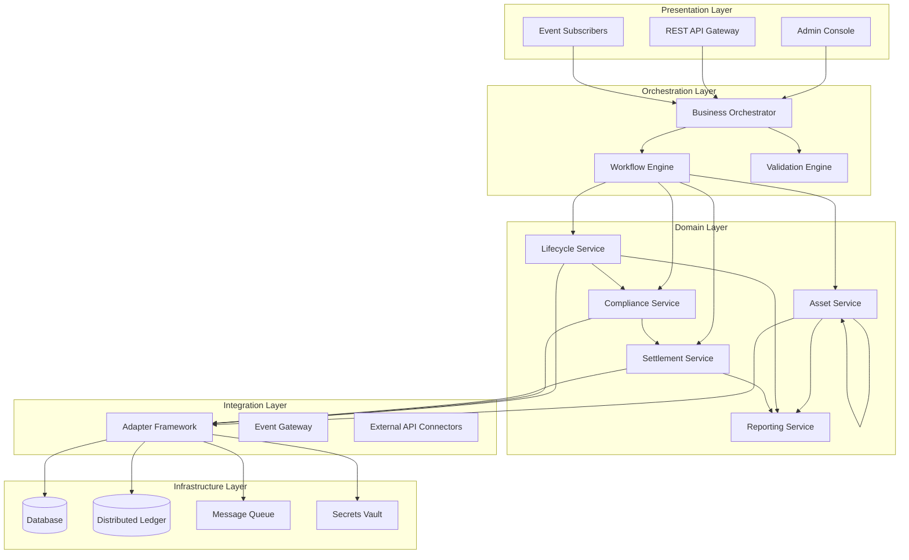

The **Presentation Layer** provides multiple interaction channels: an administrative console for operational staff, REST APIs for programmatic access, and event subscriptions for real-time processing. All channels connect through the orchestration layer, ensuring consistent behavior regardless of interaction pattern.

The **Orchestration Layer** coordinates complex workflows spanning multiple domain services. The business orchestrator manages state machines and workflow definitions, while the workflow engine handles long-running processes with compensation capabilities. The validation engine enforces business rules and regulatory requirements before state transitions proceed.

The **Domain Layer** implements core business capabilities. Asset service manages asset creation, modification, and query operations. Lifecycle service handles state transitions and lifecycle events. Compliance service enforces regulatory and policy rules. Settlement service coordinates with external payment and settlement systems. Reporting service generates operational and regulatory reports.

The **Integration Layer** manages connectivity with external systems through an adapter framework that normalizes protocols and data formats. The event gateway publishes internal events to external subscribers. External API connectors integrate with partner systems, custodians, and market infrastructure.

The **Infrastructure Layer** provides runtime capabilities through database, distributed ledger, message queue, and secrets vault components. The platform supports multiple deployment configurations including cloud-native, on-premises, and hybrid models.

### 3.2 Component Architecture

Each domain service implements a consistent internal structure with API handlers, business logic, and persistence layers. This consistency simplifies development, testing, and operational management.

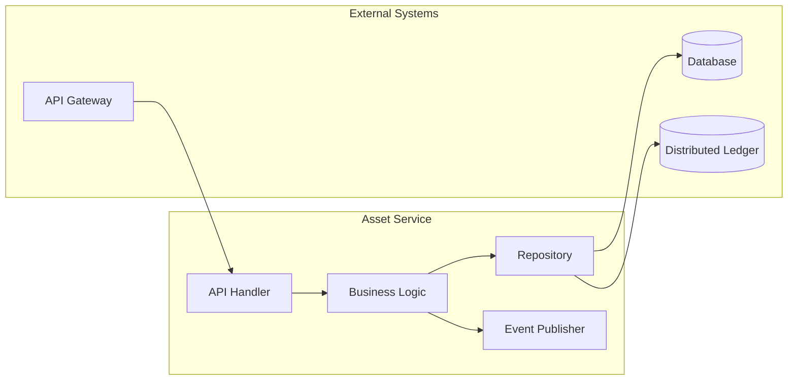

**API Handlers** translate incoming requests into internal command objects, perform basic validation, and route to appropriate business logic. Handlers implement idempotency guarantees and request validation appropriate to the operation type.

**Business Logic** implements domain rules, enforces invariants, and coordinates with other services. Logic is expressed through declarative rules where possible, enabling business users to modify behavior through configuration rather than code changes.

**Repositories** abstract persistence concerns, providing transactional guarantees and supporting both database and distributed ledger storage. The platform maintains dual-record architecture where the database serves as the operational system of record while the distributed ledger provides immutability and audit capabilities.

**Event Publishers** emit state change events that enable external systems to react to platform activity. Events include sufficient context for consumers to understand the change without querying the platform, supporting loose coupling and scalability.

### 3.3 Data Flow Architecture

Data flows through the platform in a pattern that separates operational processing from analytical workloads while maintaining consistency guarantees.

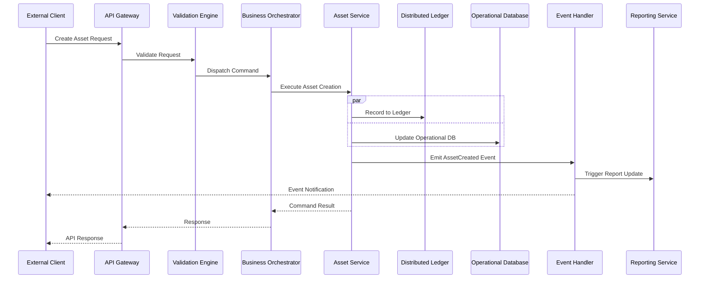

The platform processes commands through a validation-orchestration-execution pattern. The validation engine applies business rules and regulatory checks before any state changes. The orchestrator coordinates multi-step operations with compensation handling for failure scenarios. Execution updates both the distributed ledger for immutability and the operational database for query performance.

Events emitted during processing trigger downstream activities including reporting updates, notification delivery, and integration callbacks. The event model supports both immediate processing and durable queuing for reliability.

### 3.4 Environment Architecture

The platform supports the required segregated environments through infrastructure-level isolation and deployment-time configuration.

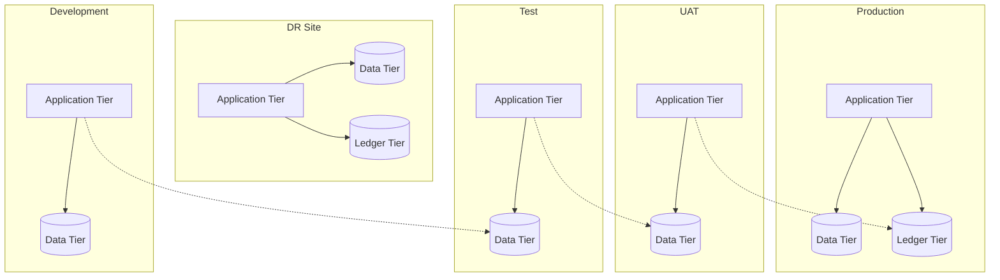

**Development** environments support active development with minimal isolation, sharing infrastructure where cost efficiency warrants.

**Test** environments provide isolated testing with representative data volumes, supporting integration testing and performance validation.

**UAT** environments mirror production configuration for user acceptance testing, with data refresh capabilities supporting realistic test scenarios.

**Production** environments support the live workload with appropriate redundancy, scaling, and operational controls.

**DR** environments provide disaster recovery capability with defined RTO and RPO targets, regular testing, and documented failover procedures.

---

## 4. Asset Lifecycle Management

### 4.1 BNPL Asset Lifecycle Overview

The tokenized BNPL lifecycle spans from initial creation through final settlement, with intermediate states for payment processing, delinquency management, and funding pool operations.

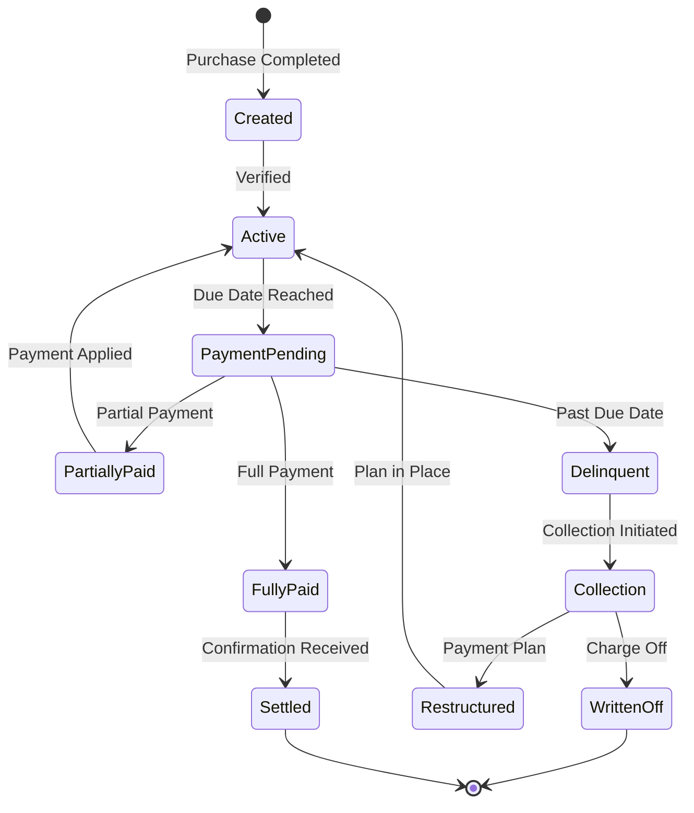

**Created** state represents a BNPL agreement when a consumer completes a purchase. The asset captures merchant identifier, consumer identifier, transaction amount, repayment terms, and initial eligibility status.

**Active** state indicates the asset is in good standing and included in funding pool calculations. Transition to active occurs after verification of eligibility criteria and onboarding to the platform.

**PaymentPending** state applies when the due date has passed without full payment. The asset tracks payment status, delinquency bucket, and applicable penalty or fee calculations.

**PartiallyPaid** state records receipt of partial payment against the obligation. The remaining balance continues to age through delinquency buckets while the partial payment affects pool calculations.

**FullyPaid** state indicates complete payment has been received, with settlement confirmation from the payment system.

**Settled** state represents final confirmation that the asset lifecycle is complete, with all investor obligations fulfilled and pool accounting updated.

**Delinquent** state triggers collection workflows and affects investor reporting through delinquency bucket classification.

**Collection** state activates collection processes, potentially including third-party collection agency engagement.

**Restructured** state applies when payment terms are modified, typically extending the repayment period. The restructured asset must continue to meet eligibility requirements for the funding pool.

**WrittenOff** state represents unrecoverable debt, triggering investor reporting adjustments and pool composition updates.

### 4.2 Receivables Pool Management

DALP supports creation and management of receivables pools that aggregate BNPL obligations for funding and investor participation.

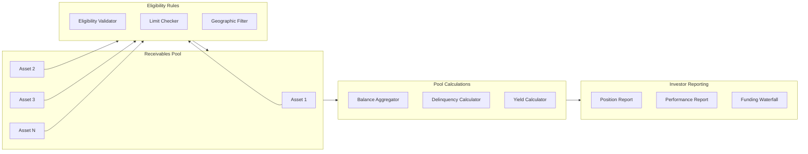

**Pool Formation** applies eligibility rules to determine which assets qualify for pool inclusion. Rules consider asset state, delinquency status, merchant category, geographic location, and concentration limits.

**Balance Aggregation** calculates total pool balance, weighted average maturity, and other pool-level metrics required for investor reporting and funding-waterfall calculations.

**Delinquency Calculation** segments pool assets into delinquency buckets (current, 1-30 days, 31-60 days, 61-90 days, 90+ days) and calculates pool-level delinquency percentages for investor transparency.

**Yield Calculation** determines gross yield, net yield after fees and losses, and projected cash flows for investor reporting and funding-waterfall distribution.

### 4.3 Investor Participation Management

The platform supports multiple investor participation models including whole-loan participation, fractional ownership, and tranche structures.

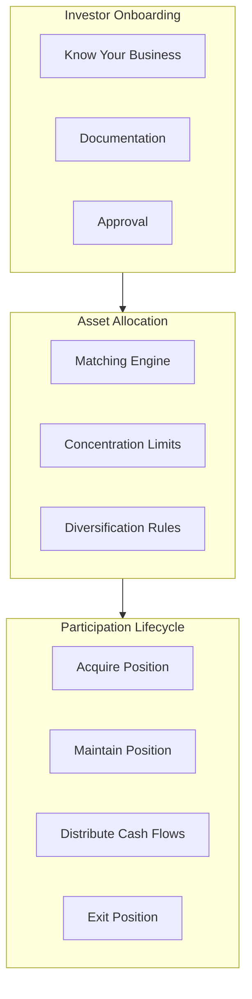

**Investor Onboarding** captures required due diligence information, documentation, and approvals before investor participation is permitted. The platform maintains investor profiles with eligibility criteria, investment limits, and jurisdictional restrictions.

**Asset Allocation** matches investor capital with available pool participations based on investment criteria, concentration limits, and diversification requirements. The matching engine supports both explicit allocation rules and algorithmic optimization.

**Participation Lifecycle** tracks investor positions from initial acquisition through ongoing distributions and final exit. The platform calculates allocation percentages, generates position reports, and processes cash-flow distributions according to waterfall logic.

---

## 5. Token Issuance and Management

### 5.1 Token Architecture

DALP implements a dual-token architecture that separates the legal record of ownership from the technical representation of the asset on distributed ledger infrastructure.

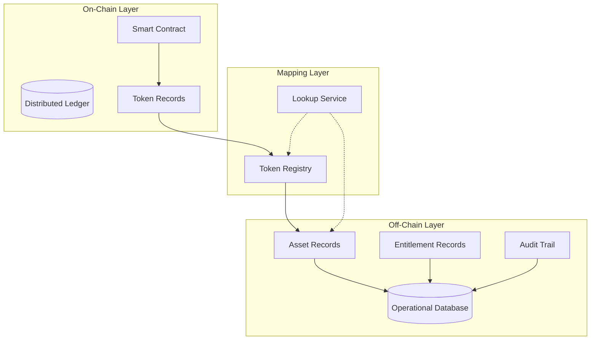

**Smart Contract** layer manages on-chain token representation, including transfer logic, access control, and emission events. The contract implements standard token interfaces compatible with wallets and exchanges.

**Operational Database** maintains authoritative records of asset attributes, entitlement calculations, and audit trail. This database serves as the system of record for operational queries and reporting.

**Token Registry** maps on-chain token identifiers to off-chain asset records, enabling correlation between blockchain and operational representations. The registry supports both forward lookup (token ID to asset) and reverse lookup (asset to token IDs).

### 5.2 Token Issuance Flow

Asset tokenization follows a controlled process that maintains legal and regulatory compliance throughout.

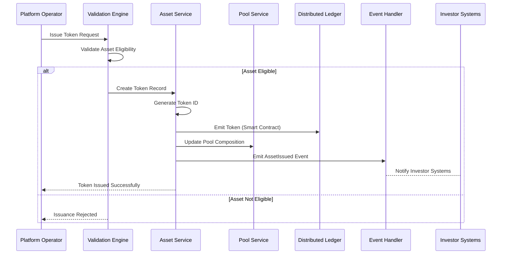

**Validation** confirms asset eligibility before token creation, checking state, pool membership, and regulatory constraints.

**Token Creation** generates a unique token identifier and creates the on-chain representation through smart contract invocation.

**Pool Update** adjusts pool composition to reflect the newly issued token, updating aggregate calculations and investor positions.

**Event Emission** notifies downstream systems of the issuance, enabling investor reporting updates and integration processing.

### 5.3 Transfer and Settlement

Token transfers execute atomically with settlement finality, ensuring both asset and cash legs complete together or both revert.

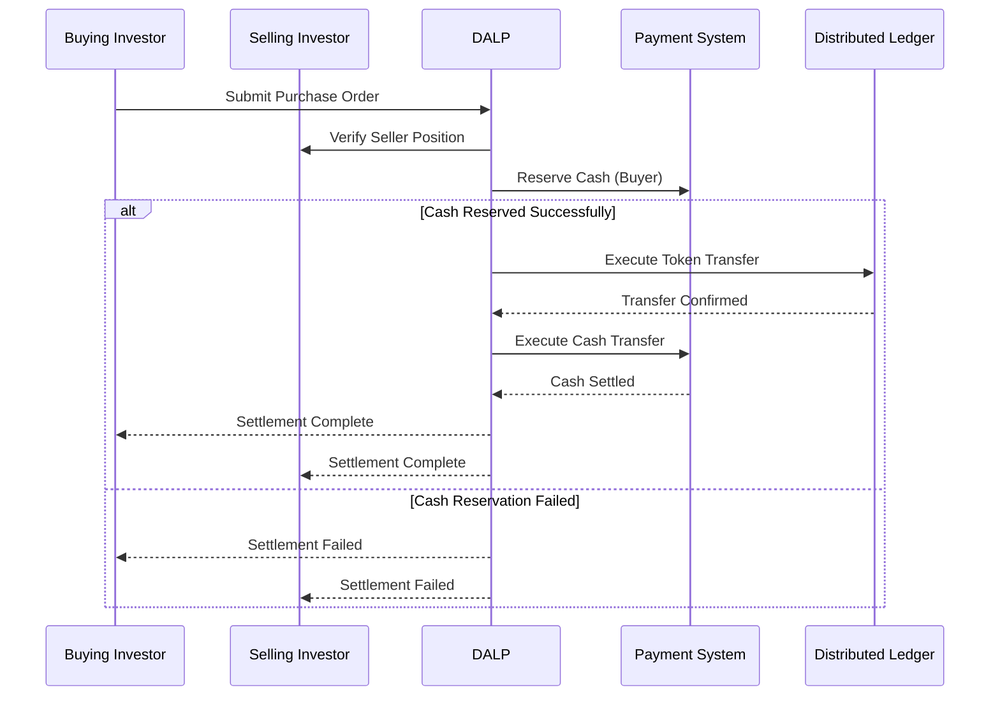

**Order Submission** captures buyer intent with price, quantity, and settlement preferences.

**Position Verification** confirms seller holds the tokens being offered and no encumbrances exist.

**Cash Reservation** locks buyer funds through integration with payment systems, preventing double-spend of cash leg.

**Token Transfer** executes on the distributed ledger, with atomicity guarantees ensuring the transfer succeeds or reverts based on confirmation.

**Cash Settlement** completes the cash leg through payment system integration, with confirmation enabling final investor reporting.

---

## 6. Compliance and Regulatory Framework

### 6.1 Regulatory Architecture

DALP implements a modular compliance framework that enables jurisdiction-specific rule configuration without code changes.

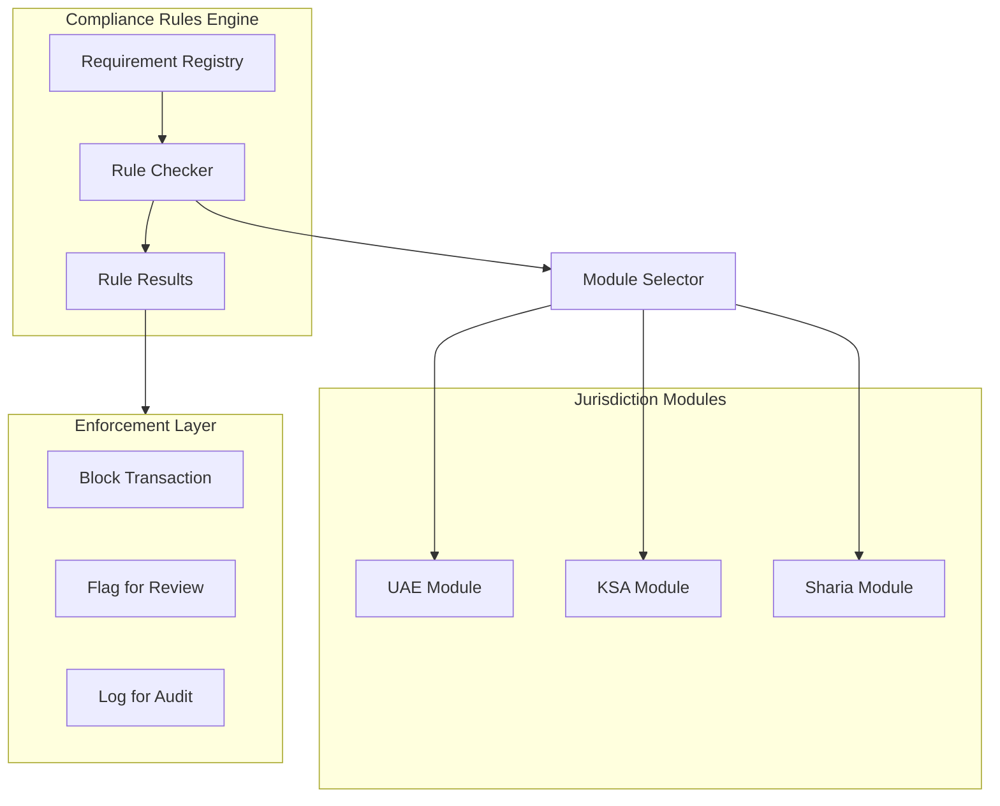

**Requirement Registry** maintains structured definitions of regulatory requirements, including requirement text, applicability conditions, and enforcement action.

**Rule Checker** evaluates transactions against applicable requirements based on asset type, jurisdiction, participant classification, and transaction characteristics.

**Jurisdiction Modules** encapsulate jurisdiction-specific rule sets, with separate modules for UAE, KSA, and Sharia requirements. Modules can be combined for multi-jurisdiction scenarios.

**Enforcement Layer** applies the appropriate action based on rule evaluation: block the transaction outright, flag for compliance review, or log for audit trail.

### 6.2 UAE Regulatory Compliance

The platform addresses UAE regulatory requirements through specific compliance modules.

**CBUAE Requirements**: The platform supports integration with CBUAE reporting systems, maintains required data elements for payment transaction reporting, and implements controls aligned with CBUAE regulations for stored value and payment instruments.

**SCA Requirements**: For tokenized assets that may be characterized as securities, the platform supports SCA disclosure requirements, maintains investor eligibility verification, and generates reports required for securities offerings.

**VARA Requirements**: Where activities fall within VARA jurisdiction in Dubai, the platform implements VARA compliance controls including licensing verification, marketing restrictions, and virtual asset service provider obligations.

**Data Protection**: The platform supports PDPL (Personal Data Protection Law) compliance through data minimization, retention controls, consent management, and cross-border transfer restrictions configurable per deployment.

### 6.3 KSA Regulatory Compliance

The platform addresses KSA regulatory requirements through specific compliance modules.

**SAMA Requirements**: The platform supports SAMA cybersecurity framework controls, maintains required encryption and access controls, and integrates with SAMA reporting channels.

**CMA Requirements**: For capital markets activities, the platform implements CMA disclosure requirements, investor suitability verification, and market conduct controls appropriate for securities tokenization.

**Sharia Governance**: The platform captures Sharia board approvals, maintains prohibited activity restrictions, generates evidence of structural compliance, and supports documentation versioning for Sharia compliance artifacts.

**PDPL Compliance**: Saudi Arabia's Personal Data Protection Law requirements are implemented through data residency controls, retention policies, and cross-border transfer restrictions.

### 6.4 Compliance Controls Summary

| Requirement | Implementation | Evidence |
|-------------|----------------|-----------|
| AML/CFT screening | Integration with screening services at onboarding and transaction time | Integration documentation, screening logs |
| Sanctions checking | Real-time sanctions list verification for all participants | Verification evidence, alert handling |
| Transaction monitoring | Configurable rules for suspicious activity detection | Rule configuration, alert reports |
| Investor eligibility | Verification of investor status and investment limits | Eligibility checks, limit enforcement |
| Reporting | Automated generation of regulatory reports | Report samples, delivery confirmations |
| Audit trail | Complete logging of all operations with attribution | Log samples, evidence exports |

---

## 7. Integration Architecture

### 7.1 Integration Patterns

DALP supports multiple integration patterns to accommodate diverse enterprise architectures and partner capabilities.

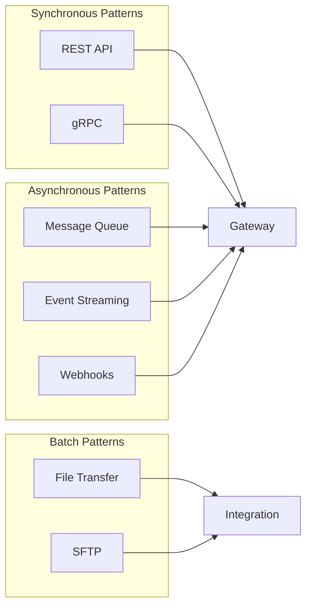

**REST API** provides synchronous request-response integration for real-time operations. APIs follow OpenAPI specification with comprehensive documentation and sandbox environment support.

**gRPC** enables high-performance integration for scenarios requiring low latency or efficient payload sizes. Protocol buffers provide schema definition and code generation.

**Message Queue** supports asynchronous integration for reliable delivery of operations that do not require immediate response. Integration supports major message queue technologies.

**Event Streaming** enables real-time data sharing through publish-subscribe patterns. Consumers subscribe to relevant event types and receive notifications as events occur.

**Webhooks** provide callback-based notification for external systems that prefer push integration. Configurable retry and acknowledgment handling ensures reliable delivery.

**File Transfer** supports batch operations including data import, report distribution, and reconciliation processing. SFTP provides secure file transfer with audit logging.

### 7.2 Integration Points

The following integration points are required for the Tabby implementation:

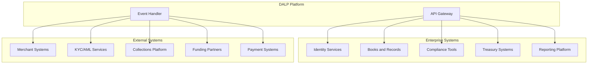

**Identity Services**: Integration with enterprise identity management for user authentication, authorization, and session management. The platform supports SAML, OAuth, and OpenID Connect protocols.

**Books and Records**: Bidirectional integration with the general ledger or books-and-records system to maintain consistent records of asset creation, transfer, and settlement events.

**Compliance Tools**: Integration with existing AML/KYC, sanctions screening, and transaction monitoring systems. The platform can invoke compliance checks and receive alert notifications.

**Treasury Systems**: Integration with treasury management for cash positioning, funding calculations, and liquidity reporting.

**Reporting Platform**: Export of operational and regulatory reports to the enterprise reporting infrastructure.

**Merchant Systems**: Integration with merchant onboarding, transaction processing, and settlement systems to capture BNPL agreement details.

**KYC/AML Services**: Integration with identity verification and AML screening services for participant onboarding.

**Collections Platform**: Integration with collections management for delinquency handling and workout processes.

**Funding Partners**: Integration with warehouse funding partners for investor participation and funding-waterfall calculations.

**Payment Systems**: Integration with payment processing for settlement finality and cash movement.

### 7.3 Data Integration Details

The following table maps data exchange requirements:

| Data Domain | Direction | Protocol | Frequency |
|-------------|-----------|----------|-----------|
| Asset lifecycle events | Outbound | Event/Webhook | Real-time |
| Balance and position updates | Outbound | API/Event | Real-time |
| Investor onboarding data | Inbound | REST API | On-demand |
| Payment confirmations | Inbound | REST API/Event | Real-time |
| Regulatory reports | Outbound | File/API | Scheduled |
| Reference data | Bidirectional | REST API | On-demand/Real-time |
| Reconciliation data | Outbound | File | Daily |

---

## 8. Security Model

### 8.1 Security Architecture

DALP implements defense-in-depth security controls across network, application, and data layers.

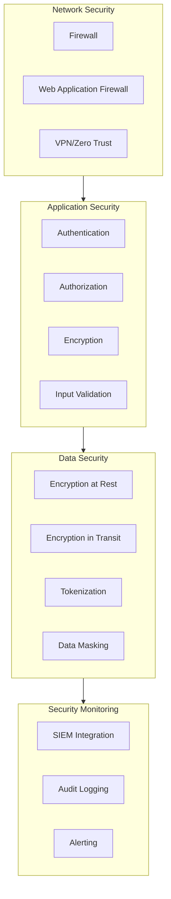

**Network Security**: Firewall controls restrict traffic to necessary paths. Web application firewall provides application-layer protection against common attacks. Zero-trust network architecture verifies identity for every request.

**Application Security**: Strong authentication prevents unauthorized access. Role-based authorization enforces least-privilege access. Encryption protects data in transit and at rest. Input validation prevents injection attacks.

**Data Security**: Encryption at rest protects stored data. TLS protects data in transit. Tokenization replaces sensitive data with non-sensitive equivalents for environments that do not require original values. Data masking obscures sensitive fields in logs and reports.

**Security Monitoring**: SIEM integration enables centralized security event analysis. Comprehensive audit logging captures security-relevant operations. Alerting notifies security teams of anomalous activity.

### 8.2 Identity and Access Management

DALP implements role-based access control with fine-grained permissions.

| Role Category | Example Roles | Access Type |
|---------------|---------------|-------------|
| Business Initiator | Merchant Operations, Sales | Create assets, initiate transfers |
| Approver | Risk Manager, Compliance Officer | Approve exceptions, review alerts |
| Supervisor | Team Lead, Operations Manager | Monitor activity, manage queues |
| Administrator | System Administrator, Security Admin | Configure system, manage users |
| Auditor | Internal Audit, External Auditor | Read-only access to logs and reports |
| Support | Help Desk, Technical Support | Limited access for investigation |

**Authentication**: Supports multi-factor authentication, integration with enterprise identity providers, and service account credentials for system integrations.

**Authorization**: Role-based access control with permission granularity at the action and data level. Segregation of duties enforced through role conflict detection.

**Session Management**: Configurable session timeout, session invalidation on security events, and concurrent session limits.

### 8.3 Key Management

The platform supports multiple key management approaches to accommodate deployment requirements.

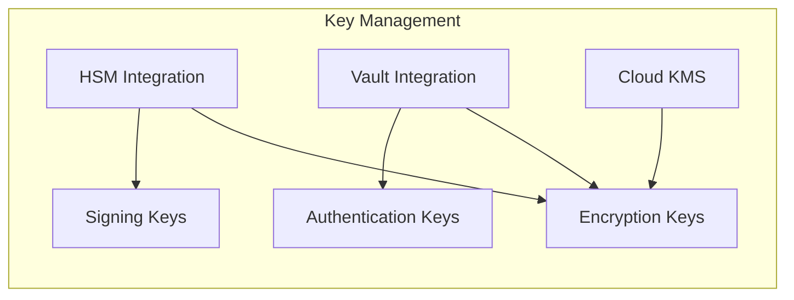

**HSM Integration**: Hardware Security Module integration for cryptographic key protection, suitable for high-security deployments.

**Vault Integration**: HashiCorp Vault integration for key lifecycle management, supporting dynamic secrets and audit logging.

**Cloud KMS**: Integration with cloud provider key management services for deployments leveraging cloud-native encryption.

**Key Rotation**: Automated key rotation capabilities with secure key derivation and migration procedures.

---

## 9. Deployment Architecture

### 9.1 Deployment Options

DALP supports multiple deployment models to accommodate regulatory, operational, and cost requirements.

| Deployment Model | Description | Typical Use Case |
|------------------|-------------|------------------|
| Cloud Native | Fully managed by cloud provider | Fast deployment, reduced operational burden |
| Self-Hosted | On customer infrastructure | Regulatory data residency requirements |
| Hybrid | Cloud and on-premises combination | Regulatory requirements with operational efficiency |
| BaaS | Multi-tenant shared infrastructure | Cost optimization, lower volume workloads |

### 9.2 Kubernetes Deployment

The platform deploys on Kubernetes with the following component topology:

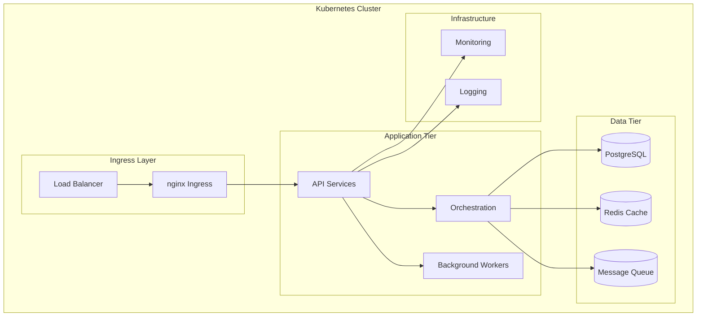

**Ingress Layer**: Load balancer distributes traffic across ingress controllers, which route requests to appropriate services based on URL path and headers.

**Application Tier**: API services handle external requests. Orchestration services manage workflows. Background workers handle asynchronous processing.

**Data Tier**: PostgreSQL provides persistent storage. Redis provides caching for performance optimization. Message queue enables asynchronous processing.

**Infrastructure**: Monitoring services collect metrics. Logging services aggregate application logs.

### 9.3 High Availability Configuration

Production deployments implement high availability with the following characteristics:

**Application Tier**: Multiple replicas of each service across availability zones. Health checks automatically remove unhealthy instances. Rolling updates maintain availability during deployments.

**Data Tier**: Primary-replica configuration with automatic failover. Point-in-time recovery capability. Cross-region replication for disaster recovery.

**Network Tier**: Multi-path networking with automatic failover. CDN integration for static content. DDoS protection at the edge.

**RTO/RPO**: Target RTO of 4 hours, target RPO of 1 hour for standard deployments. More aggressive targets available with additional investment.

---

## 10. Implementation Plan

### 10.1 Implementation Phases

The implementation follows a phased approach aligned with Tabby's workstream structure.

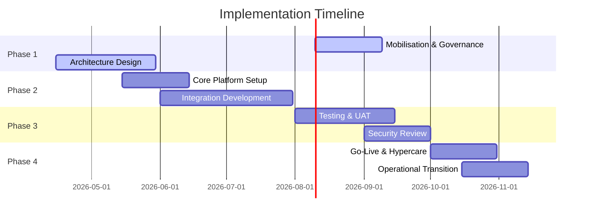

**Phase 1: Mobilisation (Weeks 1-6)**

- Programme setup and governance establishment
- Design authority and architecture review
- Detailed requirements gathering
- Environment provisioning

**Phase 2: Build (Weeks 7-18)**

- Core platform configuration
- Integration development
- Data migration preparation
- Security control implementation

**Phase 3: Test (Weeks 19-27)**

- System integration testing
- User acceptance testing
- Security testing and remediation
- Performance testing

**Phase 4: Launch (Weeks 28-34)**

- Go-live preparation
- Cutover execution
- Hypercare support
- Operational transition

### 10.2 Workstream Alignment

The implementation aligns with Tabby's five workstreams:

| Workstream | Scope | Deliverables |
|------------|-------|---------------|
| WS-01 | Mobilisation and governance | Programme plan, governance framework, RAID log, decision register |
| WS-02 | Business and product configuration | Configured lifecycle, roles, limits, policy rules |
| WS-03 | Integration and controls | Integration implementations, observability setup |
| WS-04 | Testing and readiness | Test results, UAT sign-off, go-live readiness report |
| WS-05 | Operational transition | Runbooks, support model, KPI definitions, transition sign-off |

### 10.3 Resource Requirements

The following table summarizes resource assumptions:

| Role | Phase 1 | Phase 2 | Phase 3 | Phase 4 |
|------|---------|---------|---------|---------|
| Project Manager | 1 | 1 | 1 | 1 |
| Solution Architect | 1 | 1 | 0.5 | 0.5 |
| Technical Lead | 1 | 2 | 1 | 1 |
| Developer | 2 | 4 | 2 | 1 |
| QA Engineer | 0 | 2 | 3 | 1 |
| Business Analyst | 1 | 1 | 1 | 0.5 |
| Security Engineer | 0.5 | 1 | 1 | 0.5 |

---

## 11. Operational Transition

### 11.1 Operational Model

DALP supports multiple operational models based on customer capability and preference.

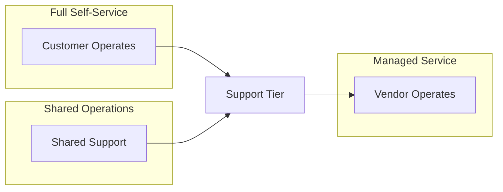

**Self-Service Model**: Customer operates the platform with vendor support for escalations. Suitable for organizations with strong platform operations capability.

**Shared Operations Model**: Vendor and customer share operational responsibilities with defined boundaries. Suitable for organizations building capability.

**Managed Service Model**: Vendor operates the platform on behalf of the customer. Suitable for organizations preferring outsourced operations.

### 11.2 Support Model

The following support tiers are available:

| Tier | Description | Response Time |
|------|-------------|---------------|
| Standard | Business hours support | 8 hours |
| Premium | Extended hours support | 4 hours |
| Mission Critical | 24/7 support with dedicated resources | 1 hour |

**Incident Classification**:

- Critical: Complete service outage affecting all users
- High: Major function unavailable affecting significant user population
- Medium: Function degraded affecting some users
- Low: Minor issue or enhancement request

### 11.3 Runbook Requirements

The following operational runbooks are provided:

- System startup and shutdown procedures
- Backup and recovery procedures
- Performance monitoring procedures
- Incident response procedures
- Capacity management procedures
- Change management procedures

---

## 12. Support and Maintenance

### 12.1 Software Maintenance

The platform includes regular maintenance releases:

**Patch Releases**: Monthly releases addressing security vulnerabilities, bug fixes, and minor enhancements.

**Feature Releases**: Quarterly releases introducing new capabilities and significant improvements.

**Upgrade Support**: Assistance with major version upgrades including planning, testing, and execution support.

### 12.2 Service Level Agreement

| Metric | Target |
|--------|--------|
| Platform Availability | 99.9% |
| API Response Time (P95) | < 500ms |
| Incident Resolution (Critical) | < 4 hours |
| Incident Resolution (High) | < 8 hours |

---

## 13. Appendices

### Appendix A: Compliance Matrix

| Requirement | Status | Evidence |
|-------------|--------|----------|
| REQ-01: Segregated environments | Supported | Section 3.4 |
| REQ-02: API-first interfaces | Supported | Section 7.1 |
| REQ-03: RBAC and maker-checker | Supported | Section 8.2 |
| REQ-04: Configurable lifecycle | Supported | Section 4.1 |
| REQ-05: Third-party dependencies | Supported | Section 7.2 |
| REQ-06: Resilience and recovery | Supported | Section 9.3 |
| REQ-07: Delivery method | Supported | Section 10.1 |
| REQ-08: Audit evidence | Supported | Section 8.4 |
| REQ-18: Configuration governance | Supported | Section 6 |
| REQ-19: Participant supervision | Partial | Q3 2026 roadmap |

### Appendix B: Integration Dependencies

| System | Dependency Type | Criticality |
|--------|-----------------|-------------|
| Identity Services | Inbound | High |
| Books and Records | Bidirectional | High |
| KYC/AML Services | Inbound | High |
| Payment Systems | Outbound | High |
| Reporting Platform | Outbound | Medium |
| Collections Platform | Bidirectional | Medium |
| Funding Partners | Outbound | Medium |

### Appendix C: Reference Architecture

[Architecture diagrams and detailed specifications available upon request]

---

**Document Control**

| Version | Date | Author | Changes |
|---------|------|--------|---------|
| 1.0 | March 2026 | SettleMint | Initial draft |

*This document is confidential and intended solely for the use of Tabby.*