# Technical Proposal: Sharia-Compliant Tokenized Lending And Funding Rails

## Cover Page

| Field | Value |
|-------|-------|
| Document Title | Sharia-Compliant Tokenized Lending And Funding Rails |
| Client Name | Tamara |
| Submission Date | March 2026 |
| Version | 1.0 |
| Confidentiality | Restricted |
| Primary Contact | SettleMint Bid Team |

---

## Table of Contents

1. Executive Summary
2. Solution Overview
3. Technical Architecture
4. Asset Lifecycle Management
5. Token Issuance and Management
6. Compliance and Regulatory Framework
7. Sharia Governance Framework
8. Integration Architecture
9. Security Model
10. Deployment Architecture
11. Implementation Plan
12. Operational Transition
13. Support and Maintenance
14. Appendices

---

## 1. Executive Summary

### 1.1 Context and Strategic Drivers

Tamara operates as a Saudi-origin BNPL and consumer finance platform with merchant integrations, checkout distribution, and increasing focus on compliant funding and scalable credit operations. The procurement for Sharia-compliant tokenized lending and funding rails reflects a strategic imperative to enhance warehouse funding transparency, strengthen receivables governance, and build infrastructure for scaled credit operations in the Kingdom of Saudi Arabia.

The programme addresses three interconnected strategic objectives. First, Sharia-aligned tokenization enables transparent representation of compliant financing structures, supporting both Sharia board oversight and investor due diligence. Second, enhanced receivables administration improves funding economics through better investor transparency and automated waterfall calculations. Third, operational modernization through platform-based approach reduces manual processes while maintaining the control environment required for regulated financial operations.

The regulatory environment shapes programme design significantly. In KSA, the Saudi Central Bank (SAMA) oversees banking and finance activities, while the Capital Market Authority (CMA) regulates capital markets instruments. The Personal Data Protection Law (PDPL) governs data handling, and the Saudi Central Bank Cybersecurity Framework establishes security requirements. Additionally, Sharia governance applies as a fundamental requirement, with board approvals and ongoing compliance evidence required for financing structures.

### 1.2 Why This Programme Is Hard

Sharia-compliant tokenized lending infrastructure operates at the intersection of Islamic finance principles, securities regulation, and digital asset technology, creating multi-dimensional complexity that differentiates this procurement from conventional technology projects.

**Sharia governance complexity** manifests in the need to capture and maintain board approvals, ensure prohibited activity restrictions are enforced, document compliance with AAOIFI standards, and generate evidence of structural compliance throughout the asset lifecycle. The platform must handle different Sharia structures (Musharakah, Murabaha, Ijarah) with appropriate treatment of profit calculation, asset backing, and risk sharing.

**Regulatory overlay** emerges from the dual-jurisdiction requirement spanning SAMA and CMA, each with distinct supervisory expectations and reporting obligations. The platform must support data localization, jurisdiction-specific audit trails, and the ability to demonstrate compliance with both regulatory frameworks. AML/CFT requirements add additional controls around participant screening and transaction monitoring.

**Operationalization gap** represents the transition from pilot to production. A proof-of-concept can demonstrate token creation and basic transfer functionality, but production operation requires robust exception handling, reconciliation capabilities, maker-checker controls, and integration with existing treasury, risk, and compliance systems. The platform must support dual-running with legacy processes during transition and provide rollback capability if issues emerge.

**Funding structure complexity** involves managing investor participations across different investor types (institutional, wholesale, retail), calculating funding waterfall distributions with appropriate profit/return allocations, and maintaining investor reporting that meets both regulatory and Sharia governance requirements.

### 1.3 Proposed Response

SettleMint proposes the Digital Asset Lifecycle Platform (DALP) as the foundation for Tamara's Sharia-compliant tokenized lending infrastructure. The response addresses the procurement objectives through five integrated workstreams aligned to Tamara's WS-01 through WS-05 structure.

**WS-01 Mobilisation and Governance** establishes programme governance with clear decision rights, Sharia board engagement model, RAID management, and design authority structure. The approach defines escalation paths, approval gates, and stakeholder engagement model appropriate for a regulated financial institution with Sharia governance requirements.

**WS-02 Business and Product Configuration** configures DALP for Sharia-compliant lending lifecycle management, including financing structure types, profit calculation methods, asset backing requirements, investor reporting, and funding-waterfall mechanics. Configuration addresses both SAMA and CMA requirements with specific Sharia governance controls.

**WS-03 Integration and Controls** implements enterprise integration with Tamara's existing systems, establishing identity services connectivity, compliance tooling integration, Sharia governance system integration, settlement dependencies, and observability layers. The approach emphasizes coexistence with existing enterprise infrastructure rather than replacement.

**WS-04 Testing and Readiness** defines comprehensive testing covering functional requirements, non-functional performance, security, resilience, Sharia compliance validation, and user acceptance. The test approach supports phased rollout with clear go/no-go criteria at each phase boundary.

**WS-05 Operational Transition** establishes operational runbooks, support model, KPI definitions, and post-launch governance including Sharia compliance monitoring procedures.

### 1.4 Key Differentiators

**Sharia governance support**: DALP includes specific capabilities for Sharia compliance, including board approval capture, prohibited activity enforcement, AAOIFI-aligned documentation treatment, and evidence generation for Sharia audit. The platform has been deployed in Islamic finance contexts with established Sharia governance frameworks.

**Production-grade platform**: DALP operates at scale in regulated financial institutions across Europe and the Middle East, with demonstrated capability in digital securities, tokenized assets, and payment infrastructure. Reference deployments include central banks, exchange operators, and banking-as-a-service platforms.

**Regulatory alignment**: The platform includes pre-built compliance modules for SAMA, CMA, PDPL, and Sharia governance frameworks. Configuration rather than customization addresses jurisdiction-specific requirements.

**Integration-first architecture**: DALP exposes APIs and events that integrate with enterprise systems, avoiding the isolated digital-asset island problem that plagues alternative approaches. The platform maintains ledger integrity while supporting existing books-and-records workflows.

---

## 2. Solution Overview

### 2.1 Platform Introduction

The Digital Asset Lifecycle Platform (DALP) provides a comprehensive foundation for creating, issuing, managing, and servicing digital assets within a regulated institutional environment with Sharia governance requirements. The platform addresses the full lifecycle of tokenized financial instruments from initial issuance through final settlement, with embedded controls, compliance enforcement, Sharia governance, and operational governance throughout.

DALP follows a microservices architecture that separates concerns across orchestration, lifecycle management, compliance enforcement, settlement coordination, and reporting. Each service exposes well-defined APIs and emits events that enable integration with external systems while maintaining internal consistency. The architecture supports both centralized deployment patterns suitable for banking-as-a-service models and distributed deployment for scenarios requiring geographic or jurisdictional separation.

The platform operates as a control plane over underlying distributed ledger or database infrastructure, managing asset lifecycle state, enforcing business rules, maintaining audit trails, and coordinating with external settlement systems. This architecture provides institutional-grade reliability while maintaining the transparency and immutability benefits of distributed ledger technology.

### 2.2 Fit for Sharia-Compliant Tokenized Lending

DALP addresses the specific requirements of Sharia-compliant tokenized lending through native capabilities in three key areas.

**Sharia lifecycle management** handles the complete lifecycle of compliant financing instruments, including creation with appropriate Sharia structure (Musharakah, Murabaha, Ijarah), state transitions through profit calculation, payment, and settlement, and maintenance of asset backing requirements throughout. The platform maintains authoritative records of structure type, profit rates, asset backing, and investor entitlements.

**Funding structure support** enables creation of special-purpose vehicles or funding pools that hold tokenized financing receivables, manage investor participations across different investor categories, calculate funding-waterfall distributions with Sharia-compliant profit allocation, and generate investor reporting including Sharia compliance certifications.

**Sharia governance integration** captures Sharia board approvals, maintains prohibited-activity restrictions, generates evidence of structural compliance, supports documentation versioning for Sharia compliance artifacts, and enables ongoing monitoring of Sharia compliance status.

### 2.3 Capability Summary

The following table summarizes DALP capabilities relevant to the procurement scope:

| Capability | Status | Evidence |
|------------|--------|----------|
| Segregated environments (dev/test/UAT/DR/prod) | 🟢 Native | Architecture documentation, deployment guides |
| API-first interfaces with versioning | 🟢 Native | API specification, developer documentation |
| RBAC, segregation of duties, maker-checker | 🟢 Native | Security architecture, role matrix |
| Configurable lifecycle states and policy controls | 🟢 Native | Lifecycle configuration guide |
| Third-party dependency disclosure | 🟢 Native | Integration documentation, dependency register |
| Resilience, recovery, backup, monitoring | 🟢 Native | Operational runbooks, resilience testing evidence |
| Delivery method and phased implementation | 🟢 Native | Implementation methodology, project plans |
| Evidence extraction for audit | 🟢 Native | Audit trail documentation, evidence packs |
| Platform-wide configuration governance | 🟢 Native | Configuration management guide |
| Sharia board workflows | 🟢 Native | Sharia governance module |
| AAOIFI documentation treatment | 🟢 Native | Documentation standards guide |
| Profit/segregation enforcement | 🟢 Native | Compliance engine documentation |

---

## 3. Technical Architecture

### 3.1 Platform Architecture Overview

DALP implements a layered architecture that separates concerns across presentation, orchestration, domain, integration, and infrastructure layers. This separation enables independent scaling, technology choice flexibility, and clear ownership boundaries appropriate for institutional operation.

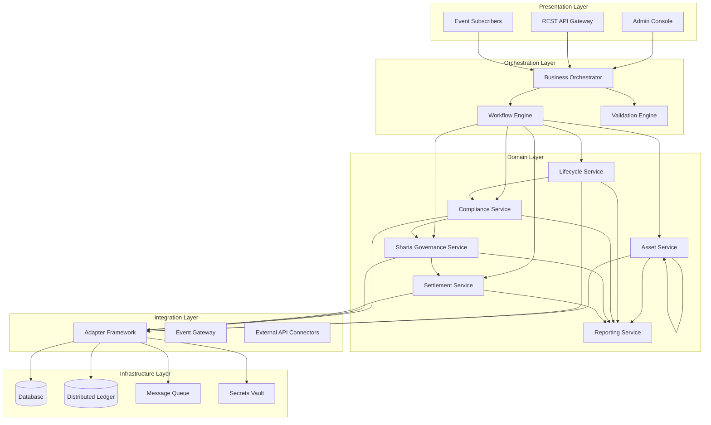

The **Presentation Layer** provides multiple interaction channels: an administrative console for operational staff, REST APIs for programmatic access, and event subscriptions for real-time processing. All channels connect through the orchestration layer, ensuring consistent behavior regardless of interaction pattern.

The **Orchestration Layer** coordinates complex workflows spanning multiple domain services. The business orchestrator manages state machines and workflow definitions, while the workflow engine handles long-running processes with compensation capabilities. The validation engine enforces business rules, regulatory requirements, and Sharia compliance before state transitions proceed.

The **Domain Layer** implements core business capabilities. Asset service manages asset creation, modification, and query operations. Lifecycle service handles state transitions and lifecycle events. Compliance service enforces regulatory and policy rules. Sharia Governance service enforces Sharia compliance requirements including board approvals and prohibited activities. Settlement service coordinates with external payment and settlement systems. Reporting service generates operational, regulatory, and Sharia compliance reports.

The **Integration Layer** manages connectivity with external systems through an adapter framework that normalizes protocols and data formats. The event gateway publishes internal events to external subscribers. External API connectors integrate with partner systems, custodians, and market infrastructure.

The **Infrastructure Layer** provides runtime capabilities through database, distributed ledger, message queue, and secrets vault components. The platform supports multiple deployment configurations including cloud-native, on-premises, and hybrid models.

### 3.2 Component Architecture

Each domain service implements a consistent internal structure with API handlers, business logic, and persistence layers.

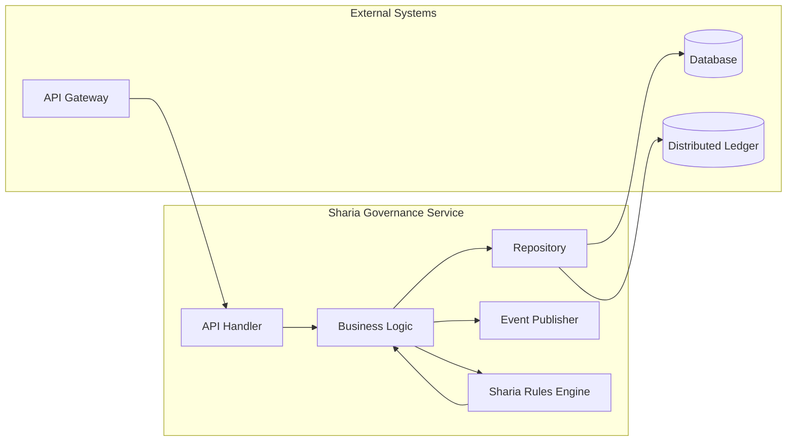

**API Handlers** translate incoming requests into internal command objects, perform basic validation, and route to appropriate business logic. Handlers implement idempotency guarantees and request validation appropriate to the operation type.

**Business Logic** implements domain rules, enforces invariants, and coordinates with other services. Logic is expressed through declarative rules where possible, enabling business users to modify behavior through configuration rather than code changes.

**Sharia Rules Engine** implements Sharia-specific validation including prohibited activity checking, structure validation, and board approval verification. The engine maintains rule definitions and evaluates transactions against Sharia requirements.

**Repositories** abstract persistence concerns, providing transactional guarantees and supporting both database and distributed ledger storage. The platform maintains dual-record architecture where the database serves as the operational system of record while the distributed ledger provides immutability and audit capabilities.

**Event Publishers** emit state change events that enable external systems to react to platform activity. Events include sufficient context for consumers to understand the change without querying the platform, supporting loose coupling and scalability.

### 3.3 Data Flow Architecture

Data flows through the platform in a pattern that separates operational processing from analytical workloads while maintaining consistency guarantees.

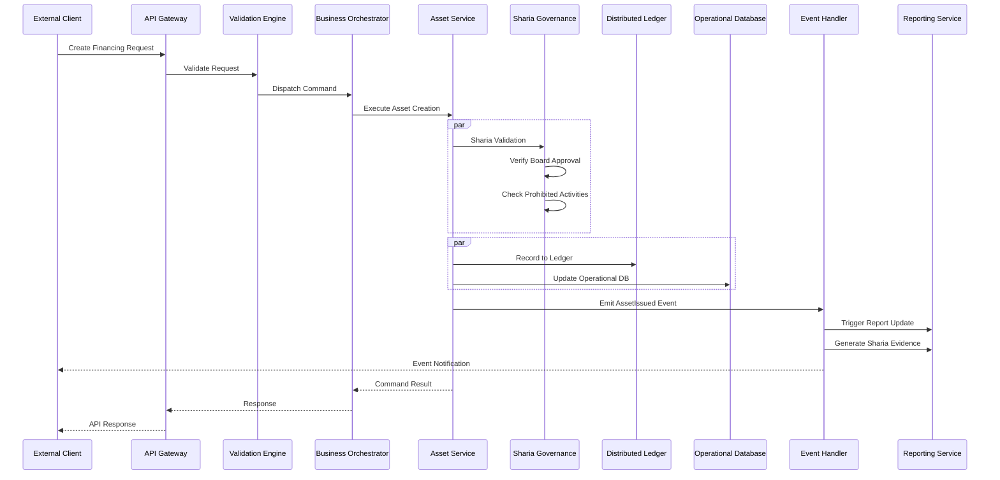

The platform processes commands through a validation-orchestration-execution pattern. The validation engine applies business rules, regulatory checks, and Sharia compliance validation before any state changes. The Sharia Governance service specifically validates that the financing structure meets Sharia requirements, including board approval verification and prohibited activity checks.

### 3.4 Environment Architecture

The platform supports the required segregated environments through infrastructure-level isolation and deployment-time configuration.

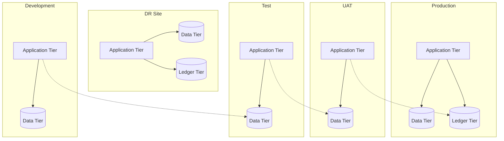

**Development** environments support active development with minimal isolation, sharing infrastructure where cost efficiency warrants.

**Test** environments provide isolated testing with representative data volumes, supporting integration testing and performance validation.

**UAT** environments mirror production configuration for user acceptance testing, with data refresh capabilities supporting realistic test scenarios.

**Production** environments support the live workload with appropriate redundancy, scaling, and operational controls.

**DR** environments provide disaster recovery capability with defined RTO and RPO targets, regular testing, and documented failover procedures.

---

## 4. Asset Lifecycle Management

### 4.1 Sharia-Compliant Asset Lifecycle Overview

The tokenized lending lifecycle spans from initial creation through final settlement, with intermediate states for payment processing, profit distribution, and funding pool operations. Each state transition enforces Sharia compliance requirements.

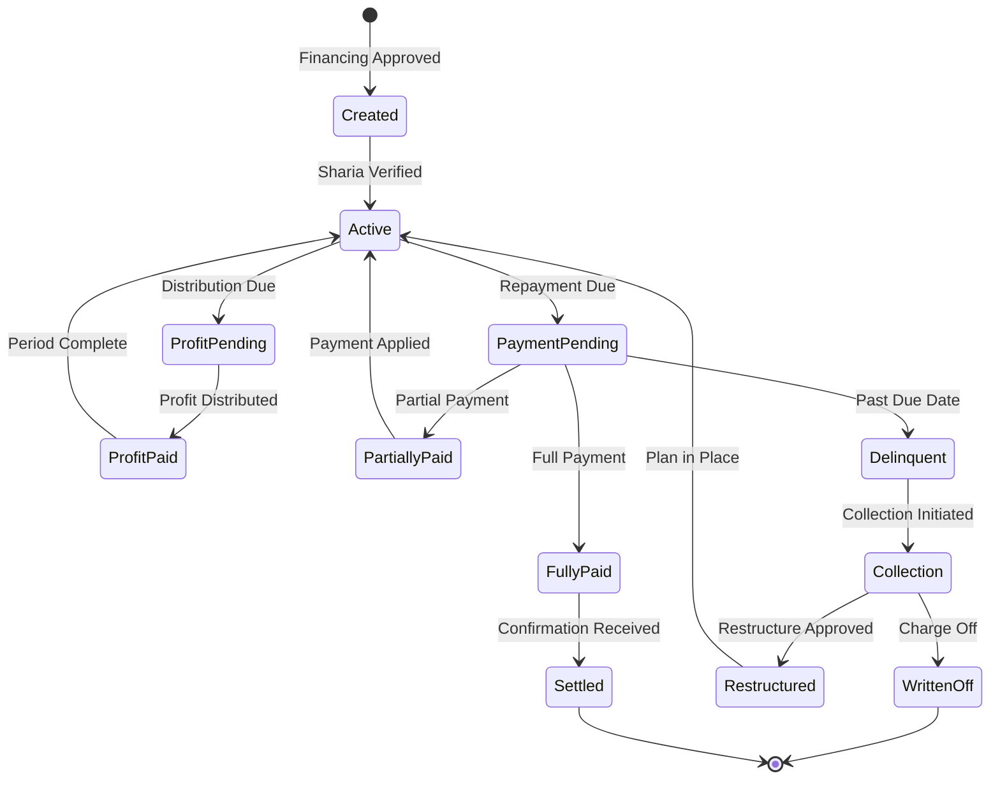

**Created** state represents a financing agreement when approved. The asset captures structure type (Musharakah, Murabaha, Ijarah), profit rate, asset backing details, merchant identifier, consumer identifier, financing amount, and initial Sharia compliance status.

**Active** state indicates the asset is in good standing and included in funding pool calculations. Transition to active occurs after verification of Sharia compliance including board approval verification and prohibited activity screening.

**ProfitPending** state applies when profit distribution is due. The asset tracks profit calculation, applicable fees, and distribution status.

**ProfitPaid** state records profit distribution to investors, with Sharia-compliant allocation verified.

**PaymentPending** state applies when the repayment due date has passed without full payment. The asset tracks payment status, delinquency bucket, and applicable penalty or fee calculations under Sharia principles.

**PartiallyPaid** state records receipt of partial payment against the obligation. The remaining balance continues to age through delinquency buckets while the partial payment affects pool calculations.

**FullyPaid** state indicates complete payment has been received, with settlement confirmation from the payment system.

**Settled** state represents final confirmation that the asset lifecycle is complete, with all investor obligations fulfilled and pool accounting updated, including Sharia compliance certification.

**Delinquent** state triggers collection workflows and affects investor reporting through delinquency bucket classification.

**Collection** state activates collection processes, potentially including third-party collection agency engagement.

**Restructured** state applies when payment terms are modified. Restructuring requires Sharia board approval where applicable and must maintain Sharia compliance throughout.

**WrittenOff** state represents unrecoverable debt, triggering investor reporting adjustments, pool composition updates, and Sharia compliance documentation.

### 4.2 Funding Pool Management

DALP supports creation and management of funding pools that aggregate financing receivables for investor participation.

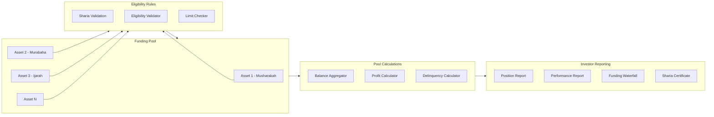

**Pool Formation** applies eligibility rules to determine which assets qualify for pool inclusion. Rules consider Sharia compliance status, asset state, delinquency status, structure type, and concentration limits. Sharia validation confirms each asset maintains board approval and does not involve prohibited activities.

**Balance Aggregation** calculates total pool balance by structure type, weighted average profit rate, weighted average maturity, and other pool-level metrics required for investor reporting and funding-waterfall calculations.

**Profit Calculation** determines gross profit, net profit after fees and losses, and projected cash flows for investor reporting and funding-waterfall distribution. Calculations follow AAOIFI guidelines and Sharia board-approved methodology.

**Investor Reporting** generates position reports, performance reports, funding waterfall calculations, and Sharia compliance certificates for each reporting period.

---

## 5. Token Issuance and Management

### 5.1 Token Architecture

DALP implements a dual-token architecture that separates the legal record of ownership from the technical representation of the asset on distributed ledger infrastructure.

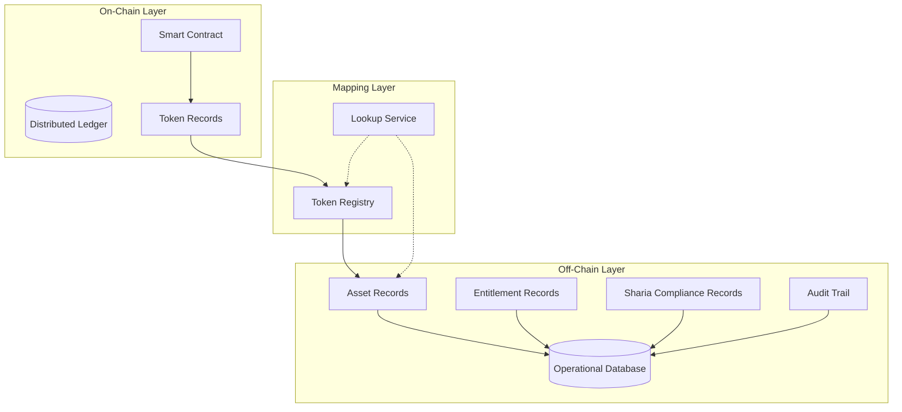

**Smart Contract** layer manages on-chain token representation, including transfer logic, access control, and emission events. The contract implements standard token interfaces compatible with wallets and exchanges, with additional Sharia compliance checks integrated into transfer logic.

**Operational Database** maintains authoritative records of asset attributes, entitlement calculations, Sharia compliance status, and audit trail. This database serves as the system of record for operational queries and reporting.

**Token Registry** maps on-chain token identifiers to off-chain asset records, enabling correlation between blockchain and operational representations. The registry includes Sharia compliance status mapping.

### 5.2 Token Issuance Flow

Asset tokenization follows a controlled process that maintains legal, regulatory, and Sharia compliance throughout.

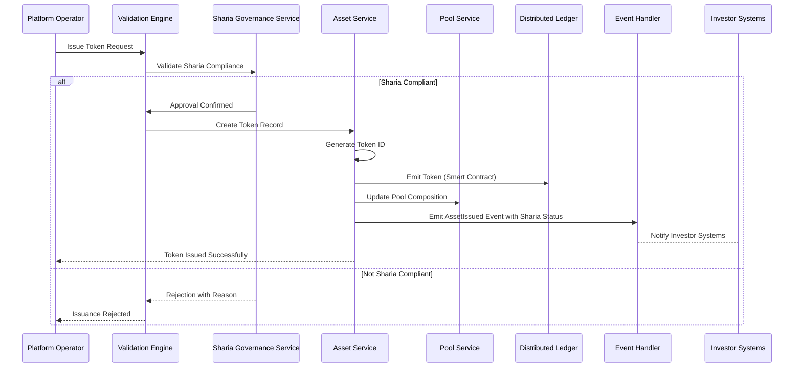

**Sharia Validation** confirms asset compliance with Sharia requirements before token creation, including board approval verification, prohibited activity screening, and structure type validation.

**Token Creation** generates a unique token identifier and creates the on-chain representation through smart contract invocation, with Sharia compliance status embedded in token metadata.

**Pool Update** adjusts pool composition to reflect the newly issued token, updating aggregate calculations and investor positions, including Sharia compliance certification.

**Event Emission** notifies downstream systems of the issuance, including Sharia compliance status enabling investor reporting with appropriate certifications.

### 5.3 Transfer and Settlement

Token transfers execute atomically with settlement finality, ensuring both asset and cash legs complete together or both revert.

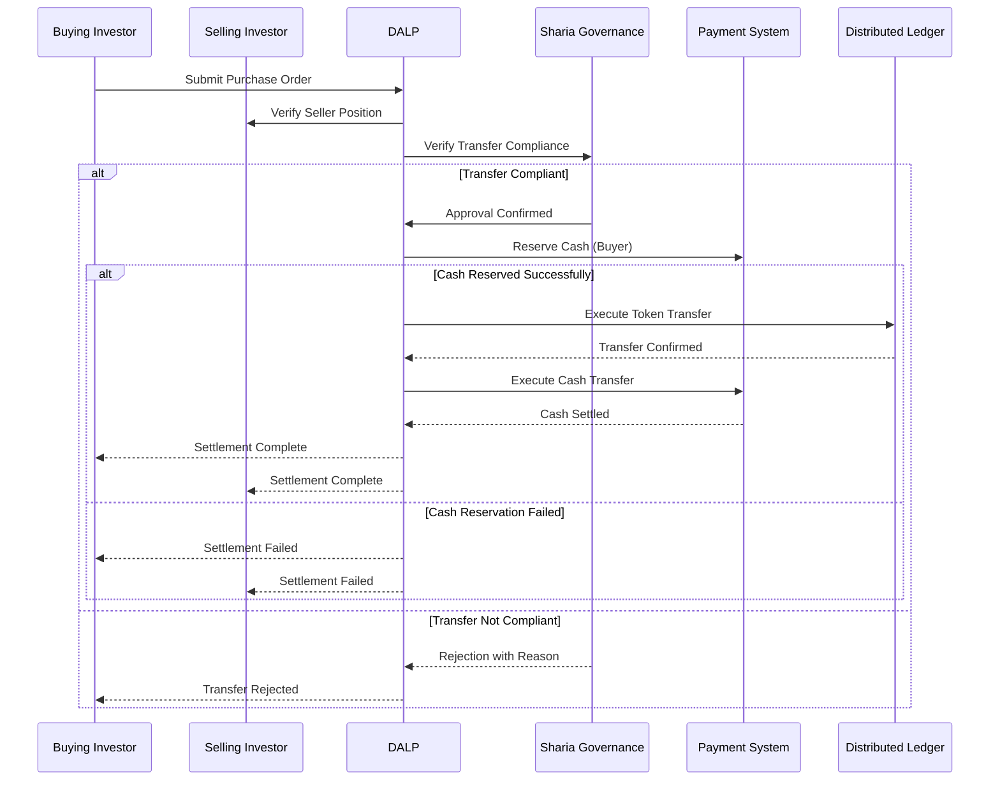

**Sharia Compliance Check** verifies the transfer does not involve prohibited activities or violate Sharia governance requirements before proceeding with settlement.

---

## 6. Compliance and Regulatory Framework

### 6.1 Regulatory Architecture

DALP implements a modular compliance framework that enables jurisdiction-specific and Sharia-specific rule configuration without code changes.

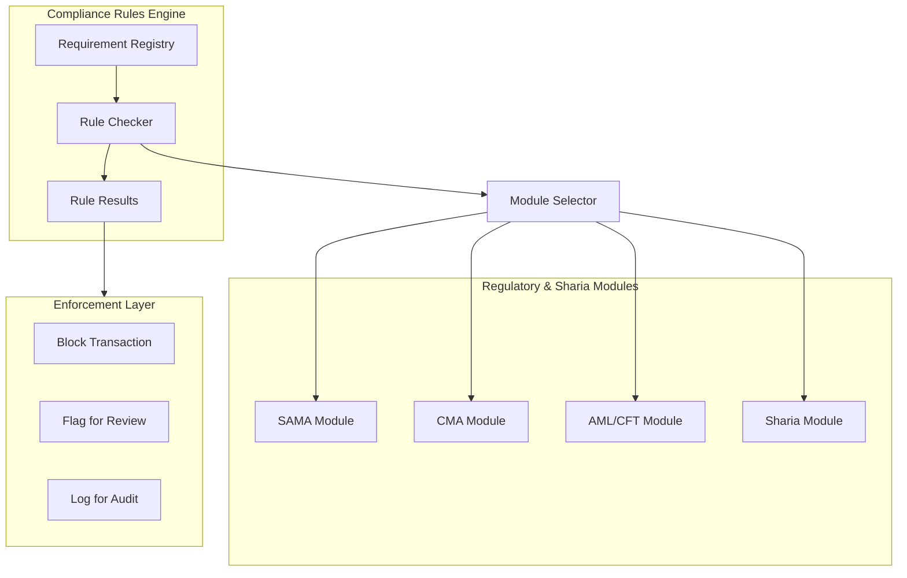

**Requirement Registry** maintains structured definitions of regulatory and Sharia requirements, including requirement text, applicability conditions, and enforcement action.

**Rule Checker** evaluates transactions against applicable requirements based on asset type, jurisdiction, participant classification, Sharia structure type, and transaction characteristics.

**Regulatory & Sharia Modules** encapsulate jurisdiction-specific and Sharia-specific rule sets. Modules can be combined for multi-requirement scenarios.

**Enforcement Layer** applies the appropriate action based on rule evaluation: block the transaction outright, flag for compliance review, or log for audit trail.

### 6.2 SAMA Regulatory Compliance

The platform addresses SAMA regulatory requirements through specific compliance modules.

**Cybersecurity Framework**: The platform implements controls aligned with SAMA Cybersecurity Framework including encryption requirements, access controls, vulnerability management, and incident reporting.

**Data Protection**: The platform supports PDPL (Personal Data Protection Law) compliance through data minimization, retention controls, consent management, and cross-border transfer restrictions configurable per deployment.

**Banking Regulations**: For financing activities, the platform maintains required due diligence, disclosures, and reporting aligned with SAMA regulations for consumer finance.

### 6.3 CMA Regulatory Compliance

The platform addresses CMA regulatory requirements through specific compliance modules.

**Capital Markets Requirements**: For securities tokenization, the platform supports CMA disclosure requirements, maintains investor eligibility verification, and generates reports required for securities offerings.

**Investment Restrictions**: The platform enforces investor category restrictions, investment limits, and suitability requirements appropriate to different investor types.

### 6.4 AML/CFT Compliance

The platform addresses AML/CFT requirements through integrated controls.

**Screening Integration**: Integration with screening services at onboarding and transaction time for sanctions and PEP verification.

**Transaction Monitoring**: Configurable rules for suspicious activity detection aligned with FATF guidance and local regulations.

**Reporting**: Automated generation of suspicious transaction reports and regulatory reports as required.

---

## 7. Sharia Governance Framework

### 7.1 Sharia Governance Architecture

DALP implements a comprehensive Sharia governance framework that embeds compliance into asset lifecycle management.

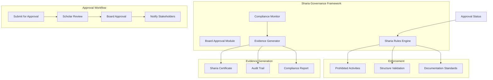

**Board Approval Module** manages the Sharia board approval workflow, including submission, review, approval, and notification. The module maintains board decisions, approval conditions, and expiry/renewal tracking.

**Sharia Rules Engine** implements Sharia-specific validation including prohibited activity checking, structure validation, profit calculation validation, and asset backing verification.

**Compliance Monitor** provides ongoing monitoring of Sharia compliance status, flagging any assets that may have moved out of compliance through structure changes, rule updates, or other events.

**Evidence Generator** produces Sharia compliance evidence including certificates, audit trails, and reports required for board reviews and external audits.

### 7.2 Sharia Compliance Controls

| Control Area | Implementation | Evidence |
|--------------|----------------|-----------|
| Board Approval | Workflow for submission, review, approval, expiry | Approval records, notifications |
| Prohibited Activities | Rule-based blocking of restricted activities | Rule configuration, enforcement logs |
| Structure Validation | Validation of financing structure type and terms | Validation records |
| Asset Backing | Verification of asset backing requirements | Asset records, verification evidence |
| Documentation | AAOIFI-aligned documentation standards | Document versioning |
| Profit Calculation | AAOIFI-aligned profit determination | Calculation records, methodology |
| Ongoing Monitoring | Continuous compliance status monitoring | Compliance reports |

### 7.3 Supported Structures

The platform supports multiple Sharia-compliant financing structures:

| Structure | Description | Treatment |
|-----------|-------------|-----------|
| Musharakah | Profit and loss sharing partnership | Pool calculation with partnership terms |
| Murabaha | Cost-plus sale with agreed profit | Profit calculation with cost verification |
| Ijarah | Lease-based financing | Lease payment calculation, asset ownership |
| Wakalah | Agency-based investment | Agent performance tracking |

Each structure has specific validation rules, documentation requirements, and calculation methodologies that the platform enforces.

---

## 8. Integration Architecture

### 8.1 Integration Patterns

DALP supports multiple integration patterns to accommodate diverse enterprise architectures and partner capabilities.

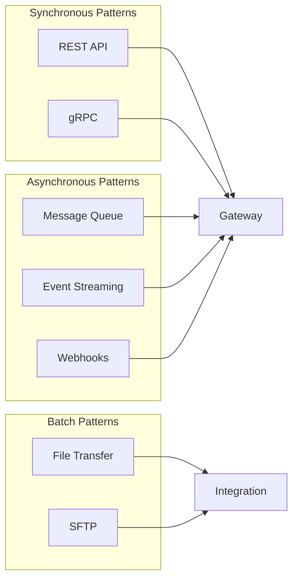

**REST API** provides synchronous request-response integration for real-time operations. APIs follow OpenAPI specification with comprehensive documentation and sandbox environment support.

**gRPC** enables high-performance integration for scenarios requiring low latency or efficient payload sizes. Protocol buffers provide schema definition and code generation.

**Message Queue** supports asynchronous integration for reliable delivery of operations that do not require immediate response.

**Event Streaming** enables real-time data sharing through publish-subscribe patterns.

**Webhooks** provide callback-based notification for external systems.

**File Transfer** supports batch operations including data import, report distribution, and reconciliation processing.

### 8.2 Integration Points

The following integration points are required for the Tamara implementation:

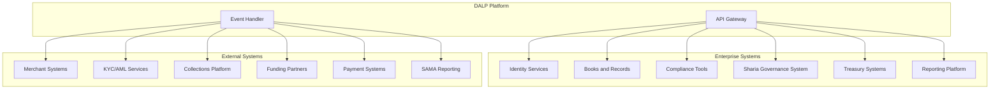

**Identity Services**: Integration with enterprise identity management for user authentication and authorization.

**Books and Records**: Bidirectional integration with the general ledger or books-and-records system.

**Compliance Tools**: Integration with existing AML/KYC, sanctions screening, and transaction monitoring systems.

**Sharia Governance System**: Integration with Tamara's Sharia governance system for board approval workflow and compliance certification.

**Treasury Systems**: Integration with treasury management for cash positioning, funding calculations, and liquidity reporting.

**Reporting Platform**: Export of operational, regulatory, and Sharia compliance reports.

**SAMA Reporting**: Integration with SAMA reporting channels for regulatory submissions.

---

## 9. Security Model

### 9.1 Security Architecture

DALP implements defense-in-depth security controls across network, application, and data layers.

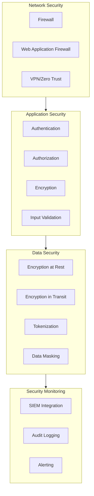

**Network Security**: Firewall controls, web application firewall, and zero-trust network architecture.

**Application Security**: Strong authentication, role-based authorization, encryption, and input validation.

**Data Security**: Encryption at rest and in transit, tokenization, and data masking.

**Security Monitoring**: SIEM integration, comprehensive audit logging, and alerting.

### 9.2 Identity and Access Management

DALP implements role-based access control with fine-grained permissions including Sharia-specific roles:

| Role Category | Example Roles | Access Type |
|---------------|---------------|-------------|
| Business Initiator | Merchant Operations, Sales | Create assets, initiate transfers |
| Approver | Risk Manager, Compliance Officer | Approve exceptions, review alerts |
| Sharia Reviewer | Sharia Compliance Officer | Review Sharia compliance, approve exceptions |
| Supervisor | Team Lead, Operations Manager | Monitor activity, manage queues |
| Administrator | System Administrator, Security Admin | Configure system, manage users |
| Auditor | Internal Audit, External Auditor, Sharia Auditor | Read-only access to logs and reports |
| Support | Help Desk, Technical Support | Limited access for investigation |

---

## 10. Deployment Architecture

### 10.1 Deployment Options

DALP supports multiple deployment models to accommodate regulatory, operational, and cost requirements.

| Deployment Model | Description | Typical Use Case |
|------------------|-------------|------------------|
| Cloud Native | Fully managed by cloud provider | Fast deployment, reduced operational burden |
| Self-Hosted | On customer infrastructure | Regulatory data residency requirements |
| Hybrid | Cloud and on-premises combination | Regulatory requirements with operational efficiency |
| BaaS | Multi-tenant shared infrastructure | Cost optimization, lower volume workloads |

### 10.2 High Availability Configuration

Production deployments implement high availability with the following characteristics:

**Application Tier**: Multiple replicas of each service across availability zones. Health checks automatically remove unhealthy instances. Rolling updates maintain availability during deployments.

**Data Tier**: Primary-replica configuration with automatic failover. Point-in-time recovery capability. Cross-region replication for disaster recovery.

**Network Tier**: Multi-path networking with automatic failover. CDN integration for static content. DDoS protection at the edge.

**RTO/RPO**: Target RTO of 4 hours, target RPO of 1 hour for standard deployments.

---

## 11. Implementation Plan

### 11.1 Implementation Phases

The implementation follows a phased approach aligned with Tamara's workstream structure.

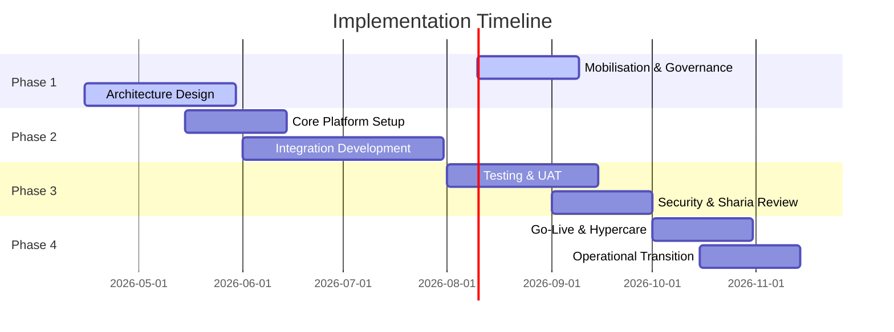

**Phase 1: Mobilisation (Weeks 1-6)**

- Programme setup and governance establishment
- Sharia board engagement and approval workflow setup
- Design authority and architecture review
- Detailed requirements gathering
- Environment provisioning

**Phase 2: Build (Weeks 7-18)**

- Core platform configuration including Sharia governance
- Integration development including Sharia system integration
- Data migration preparation
- Security control implementation

**Phase 3: Test (Weeks 19-27)**

- System integration testing
- User acceptance testing including Sharia compliance validation
- Security testing and remediation
- Performance testing

**Phase 4: Launch (Weeks 28-34)**

- Go-live preparation
- Cutover execution
- Hypercare support including Sharia compliance monitoring
- Operational transition

### 11.2 Workstream Alignment

The implementation aligns with Tamara's five workstreams:

| Workstream | Scope | Deliverables |
|------------|-------|---------------|
| WS-01 | Mobilisation and governance | Programme plan, governance framework, Sharia engagement plan, RAID log, decision register |
| WS-02 | Business and product configuration | Configured lifecycle, Sharia structure support, roles, limits, policy rules |
| WS-03 | Integration and controls | Integration implementations, Sharia system integration, observability setup |
| WS-04 | Testing and readiness | Test results, Sharia compliance validation, UAT sign-off, go-live readiness report |
| WS-05 | Operational transition | Runbooks, Sharia compliance monitoring procedures, support model, KPI definitions, transition sign-off |

---

## 12. Operational Transition

### 12.1 Operational Model

DALP supports multiple operational models based on customer capability and preference.

**Self-Service Model**: Customer operates the platform with vendor support for escalations.

**Shared Operations Model**: Vendor and customer share operational responsibilities with defined boundaries.

**Managed Service Model**: Vendor operates the platform on behalf of the customer.

### 12.2 Support Model

The following support tiers are available:

| Tier | Description | Response Time |
|------|-------------|---------------|
| Standard | Business hours support | 8 hours |
| Premium | Extended hours support | 4 hours |
| Mission Critical | 24/7 support with dedicated resources | 1 hour |

**Incident Classification**:

- Critical: Complete service outage affecting all users
- High: Major function unavailable affecting significant user population
- Medium: Function degraded affecting some users
- Low: Minor issue or enhancement request

### 12.3 Sharia Compliance Monitoring

Operational procedures include specific Sharia compliance monitoring:

- Daily Sharia compliance status review
- Weekly board reporting preparation
- Monthly Sharia certificate generation
- Quarterly Sharia board review support

---

## 13. Support and Maintenance

### 13.1 Software Maintenance

The platform includes regular maintenance releases:

**Patch Releases**: Monthly releases addressing security vulnerabilities, bug fixes, and minor enhancements.

**Feature Releases**: Quarterly releases introducing new capabilities and significant improvements.

**Sharia Updates**: As needed releases for Sharia rule updates, board decisions, or AAOIFI standard changes.

### 13.2 Service Level Agreement

| Metric | Target |
|--------|--------|
| Platform Availability | 99.9% |
| API Response Time (P95) | < 500ms |
| Incident Resolution (Critical) | < 4 hours |
| Incident Resolution (High) | < 8 hours |

---

## 14. Appendices

### Appendix A: Compliance Matrix

| Requirement | Status | Evidence |
|-------------|--------|----------|
| REQ-01: Segregated environments | Supported | Section 10 |
| REQ-02: API-first interfaces | Supported | Section 8 |
| REQ-03: RBAC and maker-checker | Supported | Section 9 |
| REQ-04: Configurable lifecycle | Supported | Section 4 |
| REQ-05: Third-party dependencies | Supported | Section 8 |
| REQ-06: Resilience and recovery | Supported | Section 10 |
| REQ-07: Delivery method | Supported | Section 11 |
| REQ-08: Audit evidence | Supported | Section 9 |
| REQ-12: Sharia board workflows | Supported | Section 7 |
| REQ-13: Profit segregation | Supported | Section 7 |

### Appendix B: Integration Dependencies

| System | Dependency Type | Criticality |
|--------|-----------------|-------------|
| Identity Services | Inbound | High |
| Books and Records | Bidirectional | High |
| Sharia Governance System | Bidirectional | High |
| KYC/AML Services | Inbound | High |
| Payment Systems | Outbound | High |
| SAMA Reporting | Outbound | High |
| Collections Platform | Bidirectional | Medium |
| Funding Partners | Outbound | Medium |

### Appendix C: Reference Architecture

[Architecture diagrams and detailed specifications available upon request]

---

**Document Control**

| Version | Date | Author | Changes |
|---------|------|--------|---------|
| 1.0 | March 2026 | SettleMint | Initial draft |

*This document is confidential and intended solely for the use of Tamara.*