# Technical Proposal for Tokenized Securities Issuance and Market Infrastructure in Brazil

**Prepared for:** B3 S.A. - Brasil, Bolsa, Balcão

**Prepared by:** SettleMint

**Document version:** v1.0

**Submission date:** 4 April 2026

**Confidentiality:** Confidential

---

# Executive Summary

B3 is not evaluating a tokenization demo. It is evaluating whether a production platform can operate inside Brazilian market infrastructure, connect to exchange, clearing and CSD processes, preserve books and records integrity, and remain governable as policy, participants and products evolve. That is the real problem to solve. Token issuance is only one small part of it.

SettleMint proposes DALP, the Digital Asset Lifecycle Platform, as the control plane for tokenized securities issuance, lifecycle servicing, identity and eligibility enforcement, maker-checker approvals, settlement orchestration, reconciliation evidence, and supervisory reporting. DALP is designed for institutions that need 24x7 processing with explicit control ownership, auditable exception handling, and phased rollout without rewriting core workflows.

For B3, the practical value is threefold. First, DALP gives B3 a configurable issuance and post-trade operating model for tokenized securities that can sit alongside existing exchange, clearing, depository, participant gateway, surveillance and treasury environments. Second, it enforces policy before execution through identity, role, approval and compliance controls, which reduces the risk of creating a parallel control universe outside B3's existing governance perimeter. Third, it provides the operational evidence that architecture review, compliance, internal audit and supervisory stakeholders will require before the platform can expand from controlled launch cohorts into broader production usage.

The recommended starting point is a phased Brazil deployment focused on tokenized securities issuance, participant onboarding, controlled transfer and settlement workflows, reconciliation, and regulator-ready evidence generation. DALP supports that phased path natively through configurable asset templates, environment separation, API and event interfaces, policy-driven workflows, durable transaction processing, and deployment models that can align with Brazilian data residency and outsourcing constraints.

The proposal that follows is deliberately specific. It describes how B3 can use DALP to connect launch-phase issuance workflows with later-phase market infrastructure expansion, how the platform integrates with enterprise identity and secrets management, how emergency restrictions and manual fallback operate, how audit packs are generated, and how change governance can be maintained when rules, workflows, or smart contract configurations must evolve. The objective is not only to show feature coverage. It is to show that B3 can adopt tokenized securities infrastructure without sacrificing operational control.

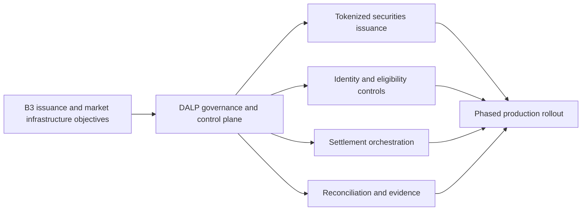

*Figure 1: DALP provides a single operator command center for portfolio oversight, pending actions, and live blockchain activity, giving B3 operations and control teams one supervised surface rather than fragmented point tools.*

---

# Understanding B3's Objectives

B3's procurement context makes one point very clear: the institution is looking for infrastructure that can survive production scrutiny from technology, operations, compliance, audit, and governance stakeholders at the same time. A platform that only demonstrates token creation or wallet connectivity will not satisfy that requirement because it leaves the difficult operational questions unresolved. Those questions include who approves what, how records stay synchronized across systems, how failed or delayed events are handled, and how B3 can explain every material workflow to internal and external reviewers.

The target operating model therefore needs to satisfy five conditions from day one. It must preserve authoritative records across B3's market infrastructure stack. It must support controlled workflow progression from onboarding through issuance, transfer, settlement, reporting, and retention. It must allow policy change without code rewrites for normal business updates. It must integrate into B3's existing control fabric, including identity, monitoring, SIEM, case management, and reporting. It must also support a phased rollout path so that early launch scope does not become technical debt when B3 later expands to additional entities, participant segments, securities types, or cash products.

SettleMint's response is built around those conditions. DALP does not ask B3 to move core control ownership into opaque vendor processes. Instead, it provides a governed digital asset operating layer where product templates, approval matrices, token configuration, compliance policies, and settlement orchestration are visible, configurable, and auditable. That is the difference between an innovation proof of concept and institutional infrastructure.

The proposed solution also reflects the specific Brazilian context described in the RFP. B3 needs a platform that can align with Banco Central do Brasil, CVM, COAF and LGPD obligations; respect local data and outsourcing governance; support Portuguese-language operational material if required; and interoperate with payment and participant expectations shaped by Brazil's 24x7 digital financial environment. DALP supports those requirements through deployment flexibility, strong API and event integration, explicit data governance boundaries, and exportable evidence packs that B3 can map into its own supervisory and reporting frameworks.

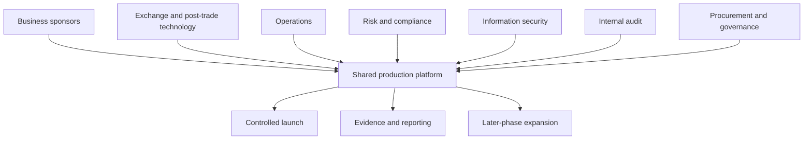

---

# Proposed Solution Overview

DALP is SettleMint's Digital Asset Lifecycle Platform for regulated digital asset issuance, servicing, compliance, custody integration, settlement, and auditability. For B3, DALP acts as the orchestration and control layer between business workflows and the blockchain network, while integrating into B3's surrounding enterprise systems for identity, treasury, surveillance, books and records, monitoring, and reporting.

The platform is particularly well suited to B3's use case because it covers the full operating lifecycle rather than stopping at issuance. Asset creation uses pre-audited templates and configurable features, which allows B3 to launch tokenized securities with the right lifecycle rules and approval structure. Compliance and identity controls enforce eligibility before a transfer or other state change is executed. Transaction processing is durable and stateful, meaning workflows survive transient service interruptions and preserve evidence throughout their lifecycle. Settlement logic supports controlled DvP and XvP models where the asset and cash or asset legs settle together or do not settle at all. Observability, logging, analytics views, and audit exports give operations and control teams the evidence and drill-down capability required for production supervision.

For this B3 proposal, SettleMint recommends using DALP as a modular operating fabric with five launch-phase domains:

| Domain | Launch role for B3 |
| --- | --- |
| Issuance and asset design | Configure tokenized securities templates, lifecycle rules, approvals, and permissions |
| Identity and eligibility | Manage participant identity status, issuer trust, claims, and transfer eligibility |
| Workflow and exception control | Enforce maker-checker, policy holds, manual fallback, and case-linked remediation |
| Settlement orchestration | Coordinate asset and cash leg execution with explicit lifecycle states and evidence capture |
| Audit and reporting | Produce immutable workflow records, regulator-ready exports, dashboard views, and archival evidence |

This architecture allows B3 to launch a controlled issuance and post-trade stack without forcing every surrounding system to change at the same time. DALP becomes the governed orchestration layer that coordinates workflows across B3's existing estate while keeping each integration boundary explicit.

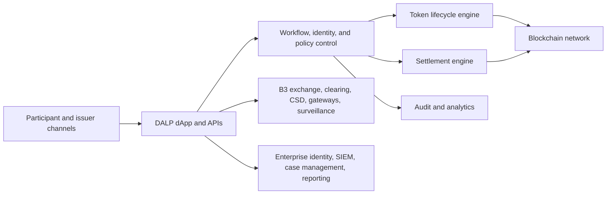

*Figure 2: DALP's guided asset designer lets B3 configure tokenized securities using controlled templates and reviewable configuration steps, which supports governed product launch without day-to-day source code changes.*

---

# Target Operating Model for B3

The target operating model centers on a simple principle: B3 retains decision rights over regulated activity, participant eligibility, policy, reporting, and control ownership, while DALP provides the platform surface that makes those decisions executable and auditable in day-to-day operations. This model aligns with the RFP's explicit expectation that the selected vendor must not hide core control logic in proprietary operational black boxes.

In practice, the model works as follows. B3 defines approved securities templates, launch parameters, eligibility rules, participant segmentation, settlement windows, and exception routing policies. DALP stores and executes those rules through configurable workflows, role-based controls, identity and claim checks, and token or settlement modules. Connected enterprise systems remain authoritative for the data domains B3 already owns, such as core books and records, treasury positions, surveillance outputs, case management, and enterprise identity. DALP synchronizes with those systems through documented APIs, events, exports, and workflow checkpoints, ensuring that tokenized workflow states are visible and reconcilable rather than isolated.

The launch-phase operating pattern should focus on a controlled cohort. B3 can onboard a limited participant set, a narrow product template family, defined approval matrices, and explicit exception handling. Once operational evidence shows that the process behaves correctly under normal and abnormal conditions, B3 can extend the same shared control pattern to additional entities, products, jurisdictions, or participant categories. This phased growth model is important because it allows B3 to increase scope without rebuilding the issuance, compliance, approval, and evidence architecture.

The same model supports business and control collaboration. Business teams can configure product and lifecycle terms. Operations teams can supervise queues, exceptions, settlement states, and reconciliation outcomes. Risk and compliance teams can review holds, overrides, identity status, and audit logs. Technology teams can monitor health, performance, release history, and dependency behavior. Internal audit can retrieve immutable evidence for approvals, state changes, administrative actions, and exception resolutions without requiring privileged engineering intervention.

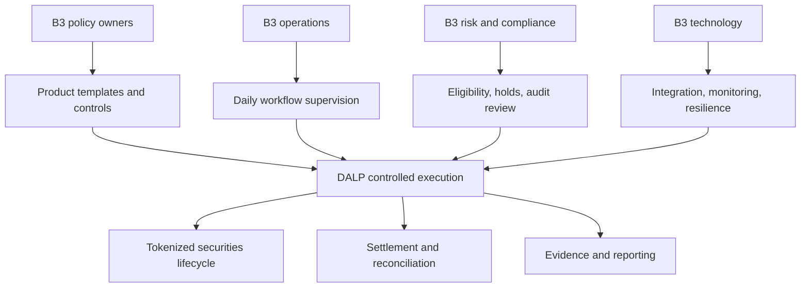

### Launch-phase workflow

The recommended launch workflow begins with product configuration and approval, followed by issuer and participant onboarding, then issuance, controlled transfer, settlement, and post-event reconciliation. Each phase produces an evidence trail. Product template approval records show who authorized the launch configuration and when. Identity and participant records show what eligibility data or claims were required. Workflow records capture instructions, approvals, exceptions, and state transitions. Settlement lifecycle records show whether the transaction completed, failed, was held, or was recovered. Reporting exports and dashboards provide operational and supervisory views over those records.

### Manual fallback without loss of control

B3's RFP correctly emphasizes fallback and manual exception handling. DALP supports that requirement by treating straight-through processing and manual intervention as connected states within the same governed workflow rather than separate operational universes. If a transaction encounters a failed downstream acknowledgment, stale data, policy hold, or participant restriction, the workflow can be routed into an exception state. Operators then act through approved roles, with timestamps, rationale, and subsequent status changes captured as part of the same record. This preserves evidentiary integrity even when human intervention is required.

### Day-one and later-phase scope

To keep delivery realistic, SettleMint recommends separating launch requirements from accelerators:

| Scope tier | Recommended B3 focus |
| --- | --- |
| Day one mandatory | Issuance template control, participant onboarding, eligibility enforcement, maker-checker approvals, settlement lifecycle tracking, reconciliation exports, dashboards, audit evidence, DR-ready environments |
| Early expansion | Additional participant segments, broader securities templates, richer analytics, additional reporting packs, deeper treasury and surveillance automation |
| Later phase | Multi-entity expansion, broader jurisdictional coverage, additional cash products, more advanced automation and market infrastructure integrations |

---

# Functional Coverage Against B3's Core Requirements

B3's functional requirements emphasize complete workflow coverage, not isolated feature depth. DALP aligns well with that requirement because it natively covers issuance, compliance, identity, custody integration, settlement, servicing, analytics, and operational evidence within one platform. The key advantage is not only breadth. It is that those capabilities operate under a shared control model rather than across a loosely assembled vendor chain.

The following table summarizes coverage of the highest-impact functional requirements from the RFP.

| B3 requirement | DALP response |
| --- | --- |
| FR-01 lifecycle coverage | Supports onboarding, approvals, issuance, servicing, transfer, settlement, reporting, exceptions, and retention through one governed operating model |
| FR-02 approvals and SoD | Supports delegated authority, maker-checker, role separation, vault or custody approval patterns, and auditable administrative controls |
| FR-03 APIs and events | Exposes documented APIs, events, batch-friendly exports, and integration patterns for enterprise systems |
| FR-04 immutable evidence | Captures instructions, approvals, administrative actions, transaction lifecycle states, and audit logs |
| FR-05 configurable templates and policies | Supports product templates, lifecycle rules, eligibility controls, and operational parameters without source code changes for normal updates |
| FR-06 resilient environments | Supports development, testing, UAT, production, and DR separation with release governance and deployment evidence |
| FR-07 operations dashboards | Provides dashboards for transactions, compliance, blockchain health, and API monitoring, plus alerting and drill-down |
| FR-08 regulator-ready exports | Supports structured audit exports, analytics views, and evidence packs for internal and external review |
| FR-09 enterprise integration | Integrates with identity, secrets, logging, monitoring, SIEM, and data-retention tooling |
| FR-10 phased rollout | Supports phased rollout by product, entity, participant segment, or geography within a shared control pattern |
| FR-11 performance and resilience | Uses durable transaction processing, queue visibility, retry logic, dead-letter handling, and HA/DR patterns suited to regulated operations |
| FR-12 dependency transparency | Requires explicit configuration of external custodians, payment rails, networks, identity providers, and data services |
| FR-13 B3 environment integration | Supports integration with exchange, clearing, CSD, gateways, tokenization, and surveillance through documented interfaces and orchestration logic |
| FR-14 Brazil control perimeter | Supports auditable records, privacy-aware deployment, identity and policy controls, and exportable compliance evidence |
| FR-15 fallback workflows | Handles controlled fallback from straight-through processing to manual workflows with preserved timestamps and approvals |
| FR-16 rules governance | Supports governed workflow, template and smart contract change management with environment promotion and traceability |

This coverage matters because B3 is effectively evaluating whether one platform can serve as a reliable foundation for a broader market infrastructure journey. DALP can do so because its architecture separates three concerns cleanly. Policy and workflow logic are configurable. Execution is durable and auditable. External dependencies remain explicit and controllable rather than hidden behind managed-service abstractions.

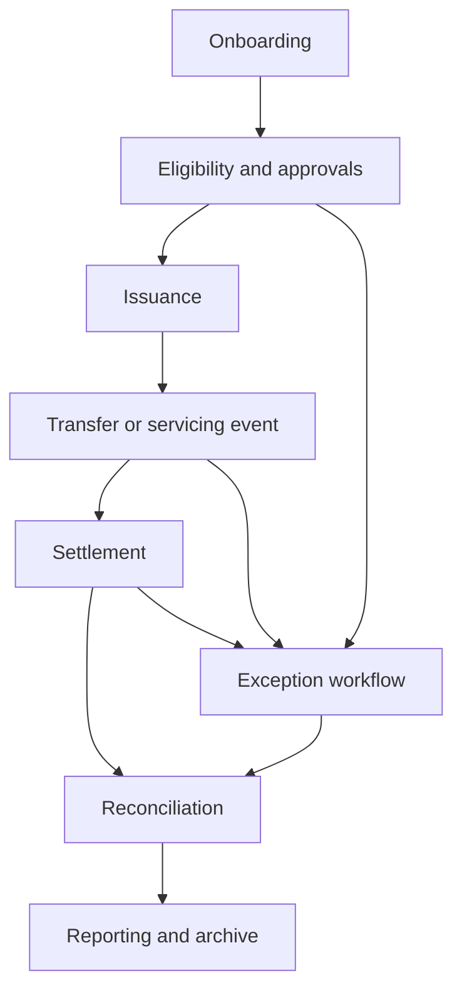

---

# B3 Integration Architecture

The integration design for B3 must be explicit about authoritative systems of record, event ordering, reconciliation boundaries, and fallback behavior. DALP supports that design by acting as an orchestration layer, not by pretending to replace every surrounding system in B3's operating landscape.

The recommended architecture assigns responsibilities clearly. DALP is authoritative for token lifecycle workflow state, tokenized asset configuration, compliance and identity workflow state, settlement process status, and platform-level audit evidence. B3's existing exchange, clearing, depository, treasury, participant gateway, surveillance, and enterprise data systems remain authoritative for the domains they already control. Integration then occurs through APIs, events, and exports that maintain a coherent record across those domains.

For example, issuance can be triggered from DALP only after the required product template approvals, participant setup, and identity or eligibility checks are satisfied. Once issuance instructions are accepted, DALP records the workflow and state transitions, writes to the blockchain through the configured signing and execution path, and publishes status updates to downstream systems. Reconciliation outputs then compare blockchain-derived states, DALP workflow states, and B3's downstream records so that any divergence is visible quickly and routed into case management where needed.

This model also supports B3-specific integration patterns named in the RFP. Exchange matching, clearing, central securities depository functions, participant gateways, surveillance tooling, tokenization services, and reporting systems can each receive the integration style that suits their operating cadence. Some interactions should be synchronous, such as identity lookups, entitlement checks, or pre-execution validations. Others should be asynchronous, such as event publication, acknowledgment processing, settlement status updates, analytics refresh, and archive feed generation. DALP supports both, which means B3 can design integration boundaries around business and control needs rather than around a platform limitation.

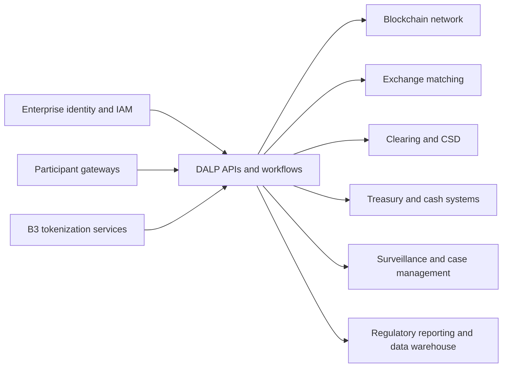

### Event sequencing and idempotency

Where a single business event spans multiple platforms, DALP provides the workflow state machine and idempotent transaction handling required to keep behavior deterministic. An instruction is accepted, classified, and persisted before downstream execution. Subsequent actions are tracked through explicit states. Retries and recovery actions are controlled rather than implicit. This is important for B3 because failed or delayed downstream acknowledgments must not create silent divergence between token state, workflow status, and downstream books and records.

### Dependency transparency

B3 also asked bidders to identify third-party and infrastructure dependencies clearly. DALP supports transparent dependency mapping because external networks, custody providers, oracles, identity services, payment rails, and cloud services are configured as explicit platform dependencies. The platform does not hide them inside an opaque operating model. That helps B3 assess delivery risk, vendor oversight, and operational lock-in before go-live.

| Dependency area | Typical B3 design treatment |
| --- | --- |
| Blockchain network | Permissioned or approved EVM-compatible network selected per operating model |
| Custody or key management | HSM, cloud secret manager, DFNS, Fireblocks, or equivalent institutional model |
| Enterprise identity | SSO or identity provider integration for operator access and user governance |
| Monitoring and SIEM | Log, metric, trace and alert export into approved B3 tooling |
| Case management | Exception and manual intervention routing into approved operational channels |
| Reporting and archive | Structured export into B3 data warehouse, regulator reporting, and retention tooling |

---

# Security, Access Control, and Governance

B3's RFP places unusual emphasis on governance and evidence, which is appropriate for market infrastructure. DALP addresses that requirement through layered security controls that separate human access, machine access, workflow authorization, signing authority, and on-chain enforcement.

The first layer is identity and authentication. Interactive users access DALP through authenticated sessions with enterprise identity support. Programmatic consumers use organization-scoped API keys on the REST surface. This separation matters because it allows B3 to enforce different policies for operator activity and machine-to-machine workflows, with different monitoring and approval expectations for each channel.

The second layer is role-based access control. DALP composes permissions at request time and supports clear separation between administration, issuance, compliance, operational, audit, and emergency roles. This aligns well with B3's requirement for delegated authority, four-eyes controls, and segregation of duties across business, operations, risk, and technology functions.

The third layer is step-up and maker-checker governance. Sensitive actions can require additional verification or multi-party approval, including custody-layer and vault-style approval patterns where appropriate. That means a privileged operator identity alone is not enough to push a high-risk transaction through the platform.

The fourth layer is transaction and policy evidence. Every meaningful mutation, approval decision, administrative action, or transaction state change is recorded with timestamps and contextual metadata. This gives B3 a record that can be used by operations, internal audit, or supervisors without rebuilding the story from multiple systems.

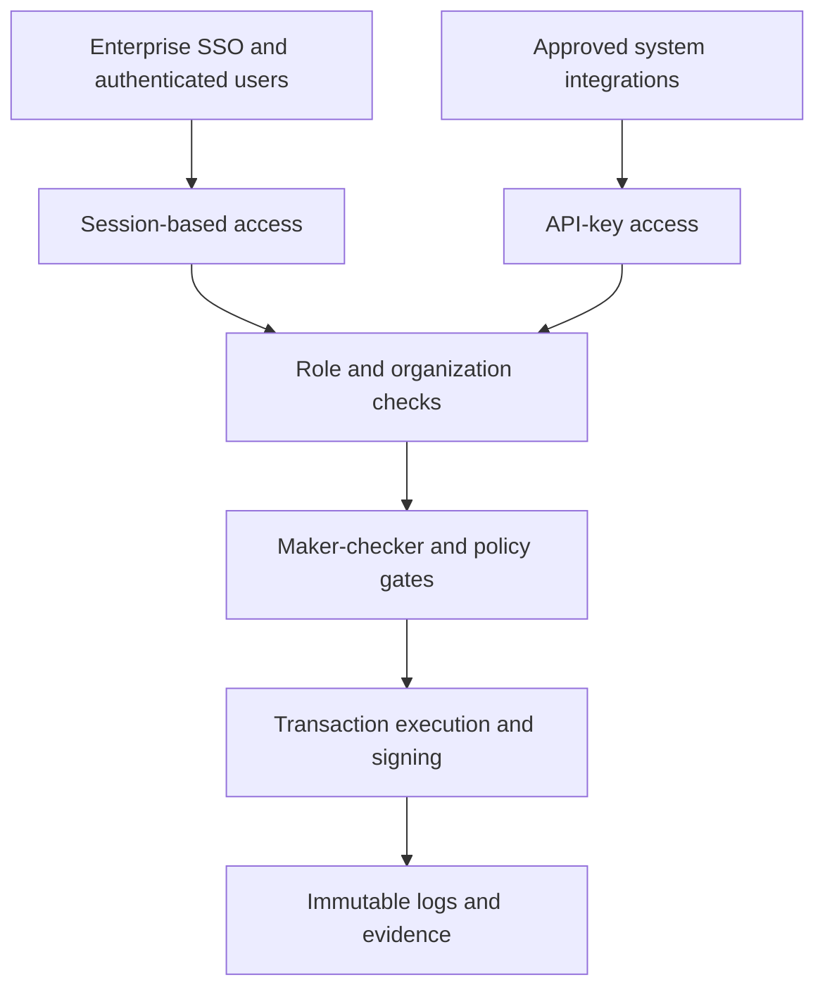

### Secrets, keys, and signing responsibilities

DALP supports multiple key management patterns, which is important because B3 may prefer different models for different rollout phases. Options include encrypted database storage for lower-risk environments, cloud secret managers, HSM-backed models, and institutional custody providers such as DFNS or Fireblocks. The platform's role is to orchestrate and evidence transactions while preserving explicit signing and approval boundaries. That keeps key control visible and auditable rather than implicit.

### Smart contract and rules governance

B3 asked specifically how smart contract, rules-engine, and workflow versions are governed. DALP supports a controlled promotion model across environments. Product templates, compliance configurations, workflow definitions, and deployment parameters are prepared and tested in lower environments, validated during UAT, and then promoted into production using release governance and evidentiary deployment records. Emergency rollback and historical traceability are part of that model. This is a stronger answer than simply saying contracts are audited because it addresses how ongoing change is handled after launch.

### Emergency restriction and participant suspension

A platform for tokenized securities must also respond safely when something goes wrong. DALP supports emergency restrictions, freezes, and governance actions through controlled roles and auditable workflow states. If B3 needs to suspend a participant, hold a workflow, or prevent further movement on a tokenized position while a case is investigated, those actions can be invoked through governed controls with preserved timestamps, approver identity, and downstream notification hooks. That matches the abnormal scenario testing described in the RFP.

*Figure 3: DALP allows B3 to express complex eligibility and policy logic through governed configuration rather than hard-coded workflow rewrites, which is essential when approval thresholds, participant rules, or regulatory constraints change over time.*

---

# Regulatory, Compliance, and Data Governance for Brazil

B3 asked for more than a certification list. It asked how the control model works in practice across Brazilian regulatory, data governance, and outsourcing constraints. That is the correct question. A regulated market infrastructure platform must produce defensible workflows, not generic compliance claims.

DALP supports that requirement by giving B3 the control surfaces needed to operationalize local obligations while keeping final policy ownership with B3. The platform supports identity-linked eligibility, role-based controls, immutable workflow records, configurable retention and archive handling, exportable evidence packs, and deployment choices that can align with Brazilian residency and outsourcing rules. In other words, DALP provides the mechanisms B3 needs to implement institution-led compliance in production.

For Banco Central do Brasil, CVM, and COAF-related expectations, the most relevant design properties are traceable approvals, consistent books and records, policy-driven participant eligibility, preserved evidence of holds and overrides, and clear segregation between operator, approver, and auditor responsibilities. DALP supports these through identity and claims, role composition, maker-checker controls, transaction lifecycle states, analytics and export views, and environment-governed release management.

For LGPD and data governance, the key issue is not only encryption. It is the ability to classify data, control where it resides, determine who can access it, separate production and non-production use, apply retention rules, support legal hold, and export or delete records in a controlled way when policy allows. DALP supports that operating model through deployment flexibility, secure storage patterns, audit logging, and explicit integration with enterprise IAM, secrets management, SIEM, and archive tooling. B3 can therefore choose a deployment model and support model consistent with local legal and operational constraints rather than being forced into a single vendor hosting pattern.

### Proposed Brazil control mapping

| Control theme | DALP support for B3 |
| --- | --- |
| Books and records integrity | Immutable workflow logs, lifecycle state records, blockchain-derived evidence, reconciliation exports |
| Participant eligibility | Identity-linked claims, trusted issuer model, configurable policy checks before execution |
| Approval evidence | Role-based approvals, maker-checker workflows, timestamped administrative and workflow decisions |
| Record retention | Structured exports, archival support, environment-aware storage and retention integration |
| Privacy and confidentiality | Encryption at rest and in transit, access controls, masking strategies for non-production, deployment choice |
| Outsourcing and third-party visibility | Explicit dependency mapping for hosting, custody, data providers, and support boundaries |
| Incident and DR support | Audit-preserving failover model, monitored services, recovery procedures, evidence packs |
| Change governance | Environment promotion, release evidence, rollback planning, historical traceability |

### Supervisory evidence retrieval

A recurring weakness in digital asset platforms is that records exist, but cannot be assembled quickly into evidence packages that business, compliance, and supervisory stakeholders can actually use. DALP addresses this by structuring data so it can be exported as auditable records, not just displayed in a user interface. That is important for B3 because supervisory review often begins not with a feature question, but with a request to reconstruct what happened in a specific workflow, who approved it, what data it depended on, and what exceptions or overrides occurred.

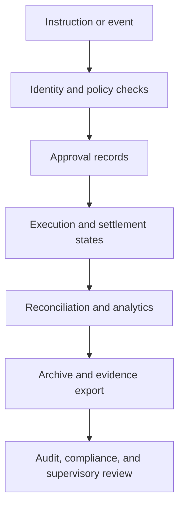

### Data residency and cross-border support controls

If B3 chooses a deployment with support or infrastructure elements outside Brazil, DALP's operating model still keeps those dependencies explicit. Data classes can be segmented, support access can be governed, logs and archives can be retained in approved locations, and evidence can remain retrievable in a consistent format. This helps B3 assess LGPD transfer safeguards and vendor oversight on concrete terms rather than generic assurances.

---

# Settlement, Reconciliation, and Exception Handling

Settlement design is where many tokenization proposals become vague. B3's RFP does not allow that. The institution specifically asked how a platform behaves under failed settlement attempts, delayed downstream acknowledgments, cash-versus-asset breaks, participant suspensions, and recovery events. DALP addresses those scenarios through explicit transaction lifecycle management, durable execution, controlled exception routing, and settlement models that preserve atomicity where required.

At the core of the proposed design is a stateful settlement workflow. DALP accepts, validates, persists, and advances transactions through explicit stages such as preparation, approval, signing, broadcast, confirmation, completion, failure, or dead-letter handling. This means B3 can see where a transaction is in its lifecycle, what caused a delay, and what compensating action or manual intervention is appropriate. That is stronger than a black-box status of simply submitted or failed.

For asset-cash and asset-asset use cases, DALP supports DvP and XvP patterns where both legs settle together or not at all. This reduces counterparty and reconciliation risk, especially in controlled environments where B3 wants a deterministic operating model rather than a set of loosely coordinated platform steps. Where full atomicity is not possible because of external system dependencies, DALP still preserves correlation, evidence, and recovery logic across the workflow.

Reconciliation is handled as a first-class operating function, not as an afterthought. DALP can export workflow and transaction states for comparison against downstream books and records, exchange and depository records, treasury states, and reporting systems. This allows B3 to identify whether an issue originated from a failed external acknowledgment, stale data, policy mismatch, or infrastructure dependency. It also gives B3 the basis for controlled restatement or correction without losing the original event trail.

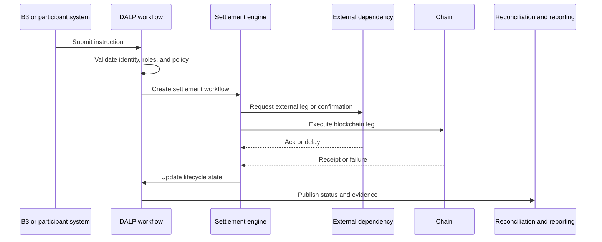

### Scenario handling for B3

The four operating scenarios called out in the RFP can be addressed directly within DALP's workflow model:

| B3 scenario | DALP treatment |
| --- | --- |
| Lifecycle event under timing pressure | Controlled event ingestion, approval checkpoints, entitlement refresh, reconciliation update, and evidence capture |
| Emergency restriction or suspension | Policy hold or restriction through governed roles, open instruction review, downstream notification, and post-event reconciliation |
| Dependency failure after partial progress | Explicit workflow states, event correlation, duplicate suppression, compensating actions, and operator dashboards |
| Regulatory reporting correction | Lineage back to source event, approval of corrections, regenerated outputs, and preservation of both original and corrected records |

### Manual fallback that remains auditable

When settlement or downstream dependencies fail, DALP can route the workflow into an exception state instead of abandoning control. Operators can intervene through approved roles, attach rationale, and drive the workflow forward or into cancellation with preserved timestamps and status. This matters because B3 asked not only whether fallback exists, but whether it preserves evidentiary integrity. DALP does.

*Figure 4: DALP supports governed XvP settlement setup, giving B3 a structured way to configure and supervise exchange-style settlement flows rather than stitching asset and cash legs together through manual process overlays.*

---

# Observability, Reporting, and Supervisory Evidence

For B3, observability is not only a technology concern. It is an operational control requirement. Business, operations, risk, compliance, and technology teams need different views into the same platform, and they need to trust that those views reconcile to the underlying workflow and transaction records.

DALP addresses this with dashboards, metrics, logs, traces, analytics views, and structured exports. Operations teams can monitor queue depth, transaction states, failures, retry behavior, and blockchain health. Compliance teams can review verification and policy activity. Technology teams can inspect API performance, infrastructure health, and dependency behavior. Audit and governance functions can retrieve evidence packs that show instruction history, approvals, exceptions, administrative actions, and release events.

The platform's monitoring stack is especially useful for B3 because it supports real-time oversight without relying on bespoke scripting. Dashboard patterns for API monitoring, blockchain health, transaction visibility, and security events are already part of the operating model. At the same time, logs and traces can be routed into B3's own enterprise monitoring or SIEM environment so that digital asset workflows remain part of the existing control fabric.

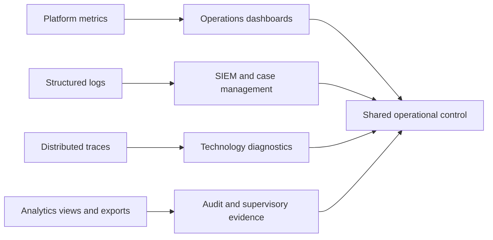

### Day-one reporting pack

SettleMint recommends that B3 define a day-one management information pack with at least the following recurring outputs:

| Day-one output | Purpose |
| --- | --- |
| Processing status dashboard | Track active workflows, holds, failures, retries, and unresolved items |
| Exception inventory | Show open cases, owner, age, severity, and next action |
| Reconciliation break report | Identify mismatches across token state, DALP state, and downstream systems |
| Participant restriction report | List holds, freezes, suspensions, and release actions |
| Integration health view | Show dependency availability, latency, error rates, and backlog |
| Security and admin action report | Track privileged actions, key events, and configuration changes |
| Release and environment log | Record promotion history, deployment evidence, and rollback events |
| Evidence retrieval pack | Assemble workflow, approval, reconciliation, and audit artifacts on demand |

### Evidence packaging for review committees

A useful property of DALP is that it can package evidence at the workflow level. When B3's architecture board, internal audit, or a regulator asks for proof around a transaction or policy change, the platform can provide a chain of evidence from instruction through approval, execution, exception state, and archive. That reduces dependency on ad hoc evidence gathering, which is often where institutional confidence breaks down.

*Figure 5: DALP's monitoring layer gives B3 technology and operations teams real-time visibility into API health, workload behavior, and incident patterns, supporting production supervision with measurable evidence rather than manual spot checks.*

*Figure 6: DALP provides dedicated blockchain health monitoring so B3 can correlate application-level events with chain-level conditions during normal processing, incidents, and recovery exercises.*

---

# Deployment, Resilience, and Business Continuity

B3 explicitly requested resilient environment separation, release controls, and evidentiary deployment logs. DALP supports those requirements through a deployment architecture that separates development, test, UAT, production, and disaster recovery environments and can be run as managed SaaS, dedicated cloud, on-premises, or hybrid depending on B3's control and residency constraints.

For this opportunity, SettleMint recommends either a dedicated cloud deployment inside B3-approved infrastructure or an on-premises or hybrid deployment if local control, support posture, or residency requirements make that preferable. The key point is that DALP does not force one hosting pattern. B3 can choose the operating model that best fits Brazilian data governance, outsourcing review, and operational accountability.

Resilience is addressed at several layers. Application services scale horizontally. Databases and caches can be deployed in high-availability configurations. Object storage and backup patterns support evidence retention. Blockchain infrastructure can be run with the redundancy appropriate for the chosen network model. Most importantly, workflow state is durable, so in-flight operations do not disappear simply because one service instance restarts or a node fails.

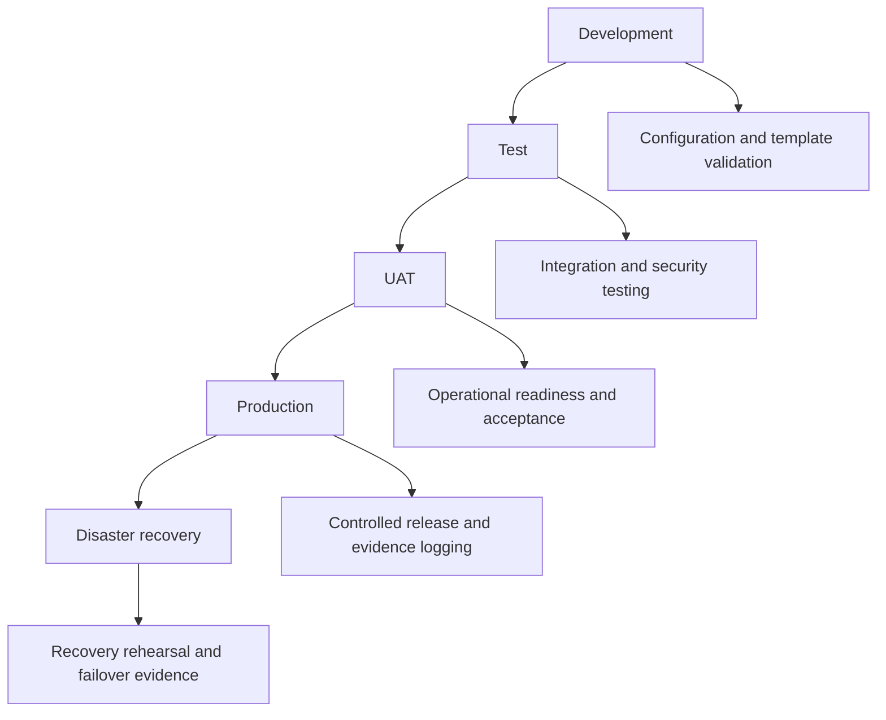

### Release and change control

Every significant workflow, template, policy, or deployment change should move through a controlled release path. DALP supports that operating model through environment separation and auditable promotion. For B3, that means test evidence, release approvals, environment-specific configuration, and rollback criteria can be treated as formal go-live artifacts rather than informal engineering notes.

### Disaster recovery and evidence preservation

A meaningful DR design for B3 must preserve not just uptime but evidentiary integrity. DALP's recovery model supports that by keeping workflow state, logs, and transaction records durable and by integrating backup and restore procedures into the overall environment design. During a DR exercise or real incident, B3 can therefore validate not only that services have resumed, but that approval, transaction, and audit evidence remain intact and accessible.

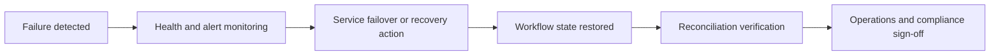

---

# Implementation Approach and Phased Rollout

B3's own procurement objective highlights the need for a phased delivery path rather than a single big-bang rollout. SettleMint agrees with that approach. Tokenized market infrastructure should be introduced through a controlled sequence that proves process integrity, evidence quality, and operating discipline before scale is increased.

The recommended implementation plan follows five working phases and a hypercare period. Each phase produces tangible artifacts, decision gates, and acceptance evidence, which is important because B3's approval path will span business, technology, risk, compliance, procurement, and governance stakeholders.

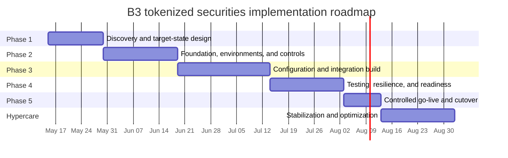

### Phase summary

| Phase | B3 objective | Main outputs |
| --- | --- | --- |
| Discovery and target-state design | Align business case, architecture, controls, scope and dependencies | Architecture pack, control map, roadmap, RACI, assumptions register |
| Foundation and controls | Establish environments, identity, key management, release path, monitoring baseline | Environment validation, identity and secrets integration, release process |
| Configuration and integration | Build securities templates, workflows, approvals, reporting, and enterprise integrations | Product templates, APIs, events, reconciliation patterns, case workflows |
| Testing and readiness | Prove functional behavior, abnormal scenarios, DR, security, and operational runbooks | Test reports, performance evidence, UAT sign-off, go-live readiness |
| Controlled go-live | Launch with limited participant and product scope under heightened supervision | Production deployment evidence, smoke tests, support handover |
| Hypercare | Stabilize, optimize, and complete knowledge transfer | Hypercare report, tuned controls, support transition plan |

### Phased expansion beyond launch

Because DALP preserves shared control patterns, B3 can expand scope after launch without re-architecting the core platform. Additional legal entities, participant cohorts, securities products, or broader settlement features can be introduced through configuration, integration extension, and governance approval rather than a fresh platform rebuild. That is a major benefit for a market infrastructure program where institutional confidence grows in stages.

### Acceptance and governance gates

B3 asked for explicit acceptance discipline. SettleMint recommends formal gates at the conclusion of each phase. Each gate should define the required artifacts, named approvers, open-risk threshold, and rollback or rework triggers. This provides the governance structure B3 needs without slowing delivery with unnecessary ceremony.

---

# Support Model and Steady-State Operations

The selected platform must support more than initial launch. B3's RFP is clear that steady-state support, release planning, dependency management, resilience testing, and service reporting are part of the award decision. DALP's support model is designed for that reality.

SettleMint offers structured support tiers that can align with the criticality of the B3 deployment. For a launch of market-infrastructure-adjacent tokenized securities, Premium or Enterprise support would typically be the most appropriate because they provide faster response times, named support ownership, more frequent review cadence, and stronger operational context around the deployment.

| Support area | Recommended B3 approach |
| --- | --- |
| Coverage | Premium or Enterprise, aligned to production criticality and operating window |
| Incident routing | Integrated with B3 case and incident management model |
| Monitoring ownership | Shared model with DALP observability exported into B3-approved tooling |
| Release governance | Staged promotion through B3-approved environments with evidence logs |
| Known-error management | Formal tracking of recurring issues, workarounds, and remediation status |
| Resilience testing | Scheduled failover and recovery rehearsals with documented outcomes |

### Service transition from project to BAU

A disciplined transition from project delivery into business-as-usual operations is part of the proposal, not an afterthought. During hypercare, SettleMint and B3 would jointly supervise incident patterns, performance, exception types, support workflows, and release readiness. Knowledge transfer is embedded into that period so B3's operations, technology, and control teams understand not just how to use the platform, but how to supervise it.

### Incident management and evidence

Support interactions remain auditable. Incident records, escalation paths, response and resolution timing, post-incident review, and remediation tracking can all be tied back to the platform's own operational evidence. This is useful for B3 because recurring operational themes often become audit or governance questions later. A well-run support model therefore contributes to control quality, not only service quality.

---

# Comparable Reference Experience

B3 asked for vendor viability and relevant references. SettleMint brings nearly a decade of focused digital asset platform experience, with live and maturing programs across banks, market infrastructures, sovereign entities, and regulated financial use cases. The table below includes the full standard reference inventory used in SettleMint proposals.

| Reference | Use case summary |
| --- | --- |
| OCBC Bank | Security token engine for securitization, tokenization and fractionalization of off-chain assets |
| KBC Securities (Bolero Crowdfunding) | Equity crowdfunding and SME loans with smart-contract-based issuance and lifecycle automation |
| KBC Insurance | NFT-based digital product passports for insured assets and claims workflows |
| Standard Chartered Bank | Digital virtual exchange and fractional tokenization of securities |
| Reserve Bank of India - Innovation Hub | Multi-bank letter of credit trade finance infrastructure |
| Sony Bank | Stablecoin issuance and management with integrated digital identity |
| State Bank of India | CBDC infrastructure and production-readiness work |
| Islamic Development Bank - Subsidy Distribution | Sharia-compliant subsidy distribution across 57 member countries |
| Mizuho Bank | Bond tokenization and trade finance with focus on standard platform capabilities |
| Islamic Development Bank - Market Stabilization | Smart-contract-based market stabilization for collateralized Islamic finance |
| Maybank (Project Photon) | FX tokenization and XvP settlement for cross-border use cases |
| ADI - Finstreet | Tokenized equity issuance with corporate actions and institutional custody patterns |
| Commerzbank | Hybrid on-chain and off-chain ETP issuance and management |
| Saudi RER | Country-scale real estate registration, fractionalization and digital marketplace infrastructure |

Three of these references are particularly relevant to B3.

**Commerzbank** is relevant because it demonstrates a hybrid on-chain and off-chain issuance and management model for exchange-traded products. The program integrated issuance and listing workflows and targeted near real-time clearing and settlement, which speaks directly to B3's need to preserve market-infrastructure discipline while modernizing issuance and settlement operations.

**Maybank Project Photon** is relevant because it demonstrates exchange-versus-payment design for tokenized cross-border settlement. The key lesson for B3 is not only the XvP capability itself. It is the importance of making settlement logic atomic, explicit, and governed, which is exactly what B3's RFP stresses in its abnormal-scenario and control discussions.

**Mizuho Bank** is relevant because it reflects a bond tokenization and trade finance context with emphasis on standard platform capabilities rather than heavy custom development. That matches B3's preference for native, configurable capability over opaque implementation effort that turns into long-term dependency and delivery risk.

---

# Why SettleMint

B3's decision should not be based on who can describe blockchain most enthusiastically. It should be based on who can help B3 build tokenized securities infrastructure that remains controlled, auditable, adaptable, and supportable as it moves from limited production launch toward broader market use.

SettleMint is a strong fit for that requirement for four reasons. First, DALP is a lifecycle platform, not an issuance point tool. It covers issuance, identity, compliance, settlement, servicing, reporting, and auditability under one operating model. Second, it is designed for regulated environments where architecture review, governance boards, control functions, and operational resilience matter as much as feature breadth. Third, it supports phased rollout through configurable templates, workflows, and integrations, which aligns with B3's stated delivery approach. Fourth, it preserves explicit dependency and control boundaries, allowing B3 to maintain authority over regulated activity while using DALP as the governed execution and evidence layer.

The result is a practical path for B3: launch tokenized securities issuance and related market-infrastructure workflows in a controlled way, prove the control model under real operating pressure, and then expand with confidence. That is how digital asset infrastructure becomes institutional infrastructure.

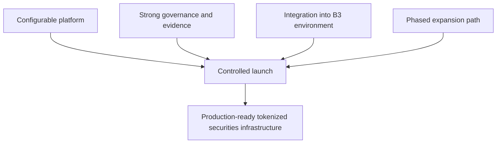

---

# Appendix: Proposed Response to B3 Operating Scenarios

### Scenario A: Lifecycle event under timing pressure

If a lifecycle event occurs close to a cut-off, DALP can ingest the event, validate entitlements, route it through the required approval logic, and either proceed or hold downstream actions based on policy. The workflow remains time-stamped and traceable, with refreshed reconciliation after the event is processed. This allows B3 to preserve books and records quality while moving quickly.

### Scenario B: Participant suspension or wallet restriction

If B3 needs to suspend a participant or freeze activity, DALP can apply a governed hold or restriction using approved roles and maker-checker logic. Open instructions can be identified and routed into exception review. Downstream systems can receive event notifications, while the platform preserves a full record of why the action occurred, who approved it, and what follow-on actions were taken.

### Scenario C: External dependency outage after partial processing

If an external dependency becomes unavailable after part of the workflow has progressed, DALP preserves state and correlation across the process. Duplicate prevention, retry handling, and compensating action rules remain explicit. Operations teams can see the backlog and exception state through dashboards rather than discovering the issue through downstream mismatch days later.

### Scenario D: Reporting correction after submission

If a regulator or internal review reveals a data issue in a previously submitted report, DALP can trace the lineage back to the source event, identify impacted records, support a governed correction, regenerate outputs, and preserve both original and corrected versions. This is especially important for B3 because it supports defensible reporting operations rather than unsupported restatement.

---

# Appendix: Recommended Deliverables for the B3 Governance Pack

| Deliverable | Purpose |
| --- | --- |
| Target-state architecture pack | Describe systems, data flows, controls, and deployment model |
| Control matrix for Brazil | Map workflow and data controls to BCB, CVM, COAF, and LGPD themes |
| Product template register | Record approved launch templates, versions, and owners |
| Approval and entitlement matrix | Define maker-checker, delegated authority, and SoD boundaries |
| Integration inventory | List upstream and downstream systems, dependencies, and fallback modes |
| Evidence pack design | Define day-one exports for audit, compliance, and management review |
| Release governance pack | Document environment promotion, test evidence, and rollback rules |
| DR and resilience pack | Define RTO, RPO, recovery checks, and rehearsal evidence |
| Service transition plan | Move from project delivery into steady-state operational ownership |

---

# Appendix: Cover Information for DOCX Generation

This markdown file is intended for conversion using the SettleMint locked proposal template with cover fields populated for B3.
