# Technical Proposal: Digital Securities Listing Platform

**Prepared for:** Euronext
**Document Title:** Technical Proposal. Digital Securities Listing Platform
**RFP Reference:** EURONEXT-RFP-202603
**Submission Date:** March 2026
**Version:** v1.0
**Classification:** SettleMint Confidential

**Prepared by:** SettleMint NV
**Primary Contact:** Digital Assets Programme. SettleMint Enterprise

---

*This document and the information contained herein are strictly confidential and are submitted solely for the purpose of responding to the Euronext procurement for a Digital Securities Listing Platform (Reference: EURONEXT-RFP-202603). It may not be reproduced, distributed, or disclosed to any third party without the prior written consent of SettleMint NV.*

---

## Table of Contents

1. Executive Summary
2. About SettleMint
3. About DALP
4. Customer References
5. Understanding of Requirements
6. Proposed Solution and Functional Capabilities
7. Technical Architecture
8. Security
9. Implementation and Delivery
10. Deployment Options
11. Training and Knowledge Transfer
12. Support and SLA
13. Risk Management
14. Compliance Matrix

---

## Executive Summary

### 1.1 Context and Strategic Drivers

Euronext, as Europe's largest pan-continental exchange group operating across seven national markets, is navigating a structural transition in securities market infrastructure. The shift toward digitally native securities, driven by the EU's DLT Pilot Regime, MiCA frameworks, and the broader European digital capital markets agenda, creates a precise operational challenge: how to extend Euronext's existing governance disciplines, listing controls, and market integrity mechanisms into a world of tokenized instruments without weakening the institutional controls that underpin investor confidence and regulatory legitimacy.

The procurement for a Digital Securities Listing Platform emerges from this context. Euronext is not evaluating whether blockchain technology can create tokens. The question is whether a platform can support the full workflow around digital securities admission, issuance allocation, investor eligibility enforcement, corporate action administration, and post-issuance lifecycle management within an operating model that satisfies AFM and DNB oversight, MiFID II regulatory obligations, and the Euronext group's own governance standards.

The current-state drivers are concrete: the need to support issuers seeking to list digitally native securities alongside traditional instruments, the requirement to manage participant admission workflows across multiple Euronext markets, the obligation to retain market surveillance capabilities and transparency reporting, and the goal of reducing manual processing burden in the listing, disclosure, and post-issuance operations functions.

Euronext's procurement document is explicit that the buyer's strategic intent is not to replace governance with technology but to make governance executable inside the technology stack. The selected platform must therefore support structured role segregation across issuer, registrar, paying-agent, and operator functions; configurable compliance rules tied to investor category and jurisdiction; transparent approval chains with immutable audit trails; and integration into Euronext's existing market data, settlement, and custody infrastructure.

### 1.2 Why This Programme Is Hard

Digital securities listing is not a token creation problem. It is a governance and workflow orchestration problem that happens to use on-chain infrastructure.

The lifecycle complexity is significant. A digital security listing at Euronext spans pre-issuance document capture and disclosure management, admission review and approval workflows, primary issuance allocation to eligible investors, secondary market transfer controls, corporate action events (coupons, redemptions, dividend distributions), regulatory reporting, and eventual instrument retirement. Each stage involves multiple institutional actors with distinct roles, audit obligations, and regulatory accountability, and each stage must preserve legal certainty over every state transition.

The compliance burden extends beyond standard AML/CFT obligations. MiFID II imposes investor classification requirements that determine what instruments may be sold to which categories of participants. The Prospectus Regulation governs disclosure and admission documentation. GDPR constrains how investor data may be stored and shared. DORA imposes resilience and incident reporting obligations. Managing all of these simultaneously, across Euronext's multi-jurisdiction operating footprint, within a single coherent platform, is technically and operationally demanding.

The integration burden is equally real. A listing platform that cannot connect to Euronext's existing CSD interfaces, settlement infrastructure, market surveillance systems, and regulatory reporting pipelines is a silo, not a solution. Euronext's procurement makes clear that integration with incumbent infrastructure is expected, not optional.

Finally, the gap between pilot and production is wide. Many platforms can demonstrate token issuance in a controlled environment. Far fewer can deliver tested resilience, runbooks, formal change control, and operational handover at the level Euronext requires for a production-ready listed market infrastructure component.

### 1.3 Proposed Response

SettleMint proposes the Digital Asset Lifecycle Platform (DALP) as the technical foundation for Euronext's Digital Securities Listing Platform. DALP is a production-ready platform built on the SMART Protocol (ERC-3643 standard), deployed across regulated financial institutions and market infrastructure operators in multiple jurisdictions.

**Deployment model:** Private permissioned EVM network (Hyperledger Besu with IBFT 2.0 consensus) within Euronext-controlled private cloud or on-premises infrastructure, with full data residency within EU jurisdiction and alignment to Euronext's existing security and network policies. Managed cloud deployment on dedicated Euronext-region infrastructure is also available as an alternative.

**Listing governance architecture:** DALP's on-chain AccessManager contract enforces role separation across Euronext operators, issuers, registrars, paying agents, compliance managers, and auditors. The platform's transfer approval workflow module requires explicit authorization at configured lifecycle stages before any state change executes. Euronext retains governance authority over policy parameters; operational roles are scoped to execution functions only.

**Digital securities lifecycle support:** DALPAsset contracts built on SMART Protocol support configurable digital securities with runtime-pluggable features for coupon schedules, maturity redemption, voting power, and fee structures. Compliance modules enforce investor category restrictions, jurisdiction controls, supply limits, and holding period requirements at the smart contract layer, not just application validation.

**Integration perimeter:** DALP exposes a full REST API (OpenAPI 3.1), TypeScript SDK, and event webhooks for integration with Euronext settlement infrastructure, CSD connectivity, market data dissemination systems, and regulatory reporting pipelines. The platform supports ISO 20022 message patterns for payment rail integration.

**Phased delivery:** A 28-week delivery plan structured across five phases, extended from the standard 19-week model to accommodate Euronext's governance approval cycles, multi-market integration complexity, and operational readiness requirements.

**Regulatory perimeter:** Full alignment with MiFID II / MiFIR, Prospectus Regulation, MiCA, DORA, GDPR, and AMLD requirements. DALP's ISO 27001 and SOC 2 Type II certifications provide the assurance foundation for Euronext's vendor assessment processes.

### 1.4 Why SettleMint

SettleMint has delivered production-ready digital asset infrastructure to central banks, market infrastructure operators, and tier-1 financial institutions across more than fifteen jurisdictions. The company holds ISO 27001 and SOC 2 Type II certifications. Its delivery team has navigated the specific challenges of regulated market infrastructure: complex integration dependencies, formal approval cycles, multi-stakeholder governance, and the operational discipline required to sustain production services under institutional scrutiny.

SettleMint is a platform company, not a consultancy. This matters for Euronext because it means accountability is clear: SettleMint is responsible for the platform and its structured implementation delivery; Euronext retains policy authority and operational governance. There is no ambiguity about where platform responsibility ends and institutional authority begins.

DALP is not a thin issuance module. It provides lifecycle coverage from instrument design through compliance enforcement, issuance, secondary market controls, corporate action administration, and reporting within a single governed platform. This is the architecture that eliminates the integration debt and operational exceptions that a multi-vendor, custom-assembled approach would create.

### 1.5 Why DALP

DALP addresses the specific structural challenges of digital securities listing through four architectural properties directly relevant to Euronext's requirements.

First, lifecycle-first design: every DALP operation is a governed state transition, not just a database write or blockchain call. Issuance, transfer, compliance verification, coupon distribution, and redemption are all orchestrated through durable workflow execution that maintains state through infrastructure failures and supports formal approval gates at each material stage.

Second, compliance at the contract layer: DALP's ERC-3643 compliance engine enforces transfer rules at the smart contract level. This is not application-layer validation that can be bypassed by a compromised API; it is on-chain enforcement. Investor category restrictions, jurisdiction controls, and transferability conditions cannot be circumvented by operational workarounds.

Third, durable execution: DALP uses Restate-backed workflow orchestration for all multi-step operations. If infrastructure fails mid-workflow, the operation resumes from the last successful step without creating orphaned state. This is critical for listing operations where partial completion is operationally and legally unacceptable.

Fourth, institutional integration discipline: DALP's API surface, event infrastructure, and SDK are designed for enterprise integration, not point-to-point connection. The platform fits into Euronext's existing systems rather than requiring incumbent systems to be rebuilt around it.

### 1.6 Reference Fit Snapshot

Three reference engagements are directly relevant to Euronext's evaluation:

- **Deutsche Boerse (Regulated Digital Asset Trading Venue):** Market infrastructure delivery for a pan-European exchange group with comparable governance complexity, MiFID II obligations, and settlement infrastructure integration requirements.
- **Euroclear (Digital Securities Settlement):** Post-trade infrastructure delivery demonstrating CSD integration, lifecycle management, and corporate action administration for tokenized instruments.
- **Clearstream (Tokenized Collateral Management):** Settlement infrastructure delivering atomic DvP settlement, custody integration, and multi-party workflow orchestration for institutional collateral programmes.

---

## About SettleMint

### 2.1 Company Overview

SettleMint NV is a digital asset infrastructure company headquartered in Brussels, Belgium, with operations across Europe, the Middle East, and Asia. Founded in 2016, SettleMint has delivered production-ready digital asset platforms to central banks, regulated market infrastructure operators, commercial banks, sovereign entities, and institutional asset managers across more than fifteen jurisdictions.

SettleMint's focus is singular: providing the institutional infrastructure layer for the issuance, management, and settlement of digital assets in regulated environments. The company does not offer consulting services, custom development beyond platform configuration, or managed services beyond the structured implementation and support model that accompanies DALP deployments. This focus creates a clear accountability model that regulated institutions, their risk functions, and their oversight bodies can rely on.

The company operates as a regulated technology vendor to critical financial infrastructure, with the certification posture, governance standards, and operational discipline that role requires.

### 2.2 History and Market Position

SettleMint was founded in 2016 with a focus on making blockchain technology accessible to enterprises. By 2020, the company had pivoted to a sharper institutional focus: providing governed digital asset lifecycle infrastructure for the regulated financial sector. This transition reflected a market reality, institutions did not need experimentation tooling; they needed production-ready platforms that could meet their governance, compliance, and integration requirements.

By 2023, SettleMint had delivered its first central bank digital asset programmes and established production deployments across European, Middle Eastern, and Asian markets. The DALP platform emerged from this delivery experience, incorporating lessons learned from operating in regulated environments: the need for lifecycle governance rather than point-in-time operations, compliance enforcement at the contract layer rather than the application layer, and enterprise integration discipline as a first-class design requirement.

By 2026, DALP is deployed across multiple production programmes in regulated jurisdictions, with a client base that includes central banks, CSDs, market infrastructure operators, and tier-1 commercial banks. SettleMint's market position is defined by institutional trust rather than technology novelty: clients choose DALP because it can be governed, audited, and evidenced to oversight stakeholders.

### 2.3 Production Credentials

| Credential | Detail |
|------------|--------|
| ISO 27001 Certification | Information security management system, independently audited |
| SOC 2 Type II | Security, availability, and confidentiality controls, independently audited |
| Production deployments | Multiple regulated jurisdictions across Europe, Middle East, and Asia |
| Central bank engagements | CBDC infrastructure for multiple sovereign entities |
| Market infrastructure clients | CSDs, exchange groups, clearing infrastructure operators |
| Regulatory frameworks supported | MiFID II, MiCA, DORA, GDPR, AMLD, CPMI-IOSCO PFMI, MAS frameworks, FCA requirements |
| Smart contract audits | Third-party security audits for SMART Protocol and DALP contract suite |
| Years in production | 8 years platform operation; 5 years regulated institutional deployments |

### 2.4 Regulatory Readiness

SettleMint maintains documented regulatory alignment across the major frameworks applicable to Euronext's operating environment:

| Framework | Alignment | DALP Support |
|-----------|-----------|--------------|
| MiFID II / MiFIR | Market structure, investor protection, transparency | Role segregation, investor classification enforcement, audit trails, transaction reporting hooks |
| MiCA | Crypto-asset issuance, service provider regulation | Asset tokenization controls, issuer workflow, disclosure capture, compliance verification |
| DORA | Digital operational resilience | Resilience architecture, ICT risk management, incident reporting procedures, third-party oversight |
| GDPR | Data protection, privacy | Data classification, retention controls, deletion workflows, processing records |
| AMLD | Anti-money laundering | AML compliance module integration, identity verification, sanctions screening hooks |
| Prospectus Regulation | Admission and disclosure | Document capture workflow, version control, evidence retention |
| DLT Pilot Regime | Pilot regime for DLT-based market infrastructure | DLT infrastructure architecture supporting pilot sandbox operations |

SettleMint does not provide legal advice. Regulatory alignment descriptions above reflect the platform's technical control capabilities and are not representations of legal compliance. Euronext retains responsibility for its own regulatory compliance posture.

### 2.5 Team and Delivery Capability

SettleMint maintains a delivery team comprising blockchain engineers, smart contract security specialists, enterprise integration architects, project managers with regulated financial sector experience, and compliance advisors. Implementation projects at the scale and complexity of this procurement are staffed with dedicated engagement leads, technical architects, and integration engineers.

The company's implementation methodology has been refined through production deployments with institutions whose governance requirements, integration complexity, and operational standards are comparable to Euronext's. Formal phase gates, documented deliverables, RACI matrices, and change management procedures are standard practice, not optional additions.

---

## About DALP

### 3.1 Platform Overview

DALP (Digital Asset Lifecycle Platform) is an institutional platform for the issuance, management, compliance enforcement, settlement, and servicing of tokenized financial instruments. It is built on the SMART Protocol, an ERC-3643 implementation specifically designed for regulated securities, and provides a complete set of lifecycle tools, from instrument design through final redemption, within a single governed platform.

DALP is not a blockchain toolkit or a development framework. It is a production operating environment for regulated digital assets, deployed and supported as institutional infrastructure. The distinction matters because Euronext is not looking for components to assemble; it is looking for a platform it can operate, govern, and evidence to regulatory stakeholders.

### 3.2 Five-Pillar Architecture

DALP's capabilities are organized across five functional pillars, each addressing a distinct dimension of the digital securities lifecycle:

| Pillar | Core Capabilities |
|--------|-------------------|
| **Issuance** | Asset design, compliance module binding, factory deployment, primary allocation, investor eligibility enforcement |
| **Compliance** | 18 compliance module types, on-chain enforcement, transfer rule evaluation, investor classification management, jurisdiction controls |
| **Custody** | Key management (Key Guardian), external custody integration (Fireblocks, DFNS), multi-sig treasury (Vault addon), custodian role controls |
| **Settlement** | Atomic DvP settlement (XvP addon), multi-party coordination, T+0 settlement finality, cash leg coordination |
| **Servicing** | Corporate action administration, coupon distribution, redemption scheduling, yield management, event lifecycle tracking |

Three platform foundations underpin all five pillars:

| Foundation | Core Capabilities |
|------------|-------------------|
| **Identity and Access Management** | OnchainID identity framework (ERC-734/735), 26-role taxonomy, role-bound access to all operations, multi-tenant isolation |
| **Integration and Interoperability** | REST API (OpenAPI 3.1), TypeScript SDK, event webhooks, CLI (301 commands), GraphQL subgraph |
| **Observability and Operations** | Three-pillar observability (VictoriaMetrics, Loki, Tempo), Grafana dashboards, automated alerting, chain indexer |

### 3.3 SMART Protocol Foundation

All DALP smart contracts are built on the SMART Protocol, SettleMint's implementation of the ERC-3643 standard. ERC-3643 defines the technical specification for regulated security tokens where every transfer must pass through a modular compliance engine before execution.

The compliance engine is the critical architectural element for a listing venue. Every transfer of every digital security deployed on DALP passes through the compliance engine, which evaluates all configured rules in sequence. A single rule veto, whether investor category, jurisdiction restriction, supply limit, or holding period, blocks the transfer. This is a fail-closed design: the default is denial unless all compliance modules explicitly approve.

This enforcement at the contract layer, rather than the application layer, means compliance cannot be bypassed by a compromised middleware component, an API misconfiguration, or an operator error. For Euronext, whose market integrity obligations are non-negotiable, this architectural property is directly relevant.

### 3.4 DALPAsset: The Configurable Instrument Contract

DALPAsset is the recommended contract type for new digital securities deployments. It extends the SMART Protocol with the SMARTConfigurable extension, allowing features and compliance modules to be attached and reconfigured after deployment without redeploying the contract.

This design has a practical consequence for listing operations: the instrument's economic and compliance parameters can evolve across the lifecycle, adding maturity redemption logic, adjusting investor count limits, enabling coupon distribution, without disrupting the instrument's on-chain identity or address. For a listing venue managing instruments across multiple lifecycle stages, this flexibility eliminates a significant operational burden.

Verified runtime-pluggable features relevant to digital securities listing include: historical balances, voting power, permit (gasless approvals), AUM fee, maturity and redemption, fixed treasury yield, and transaction fee. Compliance modules include: identity verification, country allow/block lists, address block list, investor count limit, time lock (holding period enforcement), transfer approval workflow, and collateral requirement.

---

## Customer References

### 4.1 Reference Overview

The references below are selected for relevance to Euronext's specific procurement context: regulated market infrastructure operation, MiFID II-equivalent governance, multi-party listing and settlement workflows, and enterprise-scale integration requirements.

### 4.2 Deutsche Boerse: Regulated Digital Asset Trading Venue

Deutsche Boerse engaged SettleMint to deliver the infrastructure layer for a regulated digital asset trading venue, addressing comparable governance requirements, German and EU regulatory obligations, and the need to integrate with existing settlement and custody infrastructure. The engagement required the same pattern of role-segregated operations, transparent approval workflows, and audit-grade evidence generation that Euronext's procurement specifies.

**Relevance to Euronext:** Exchange group governance model, MiFID II-aligned controls, settlement infrastructure integration, market surveillance hooks.

### 4.3 Euroclear: Digital Securities Settlement Infrastructure

Euroclear engaged SettleMint to deliver digital securities settlement infrastructure, including lifecycle management for tokenized instruments across issuance, secondary market, corporate action administration, and redemption phases. The programme required deep integration with Euroclear's existing CSD infrastructure, TARGET2-Securities interfaces, and regulatory reporting systems.

**Relevance to Euronext:** CSD integration pattern, corporate action lifecycle, multi-party settlement workflow, European regulatory alignment.

### 4.4 Clearstream: Tokenized Collateral Management Platform

Clearstream engaged SettleMint for a tokenized collateral management platform delivering atomic DvP settlement, multi-party workflow orchestration, and integration with Clearstream's existing collateral infrastructure. The programme required the high availability, operational resilience, and audit discipline expected from Deutsche Boerse Group subsidiaries.

**Relevance to Euronext:** Settlement finality, operational resilience standards, enterprise-ready audit trail, institutional governance model.

---

## Understanding of Requirements

### 5.1 Requirement Interpretation

Euronext's RFP presents a procurement designed to evaluate not just functional coverage but control maturity, integration realism, and operational readiness. Reading the document carefully, three themes run consistently through all requirement areas:

**Governance executability:** Euronext is not willing to accept a platform that delegates governance to manual side-channel processes. Role segregation, approval workflows, and audit trails must be structural properties of the platform, not procedural overlays.

**Integration completeness:** The Digital Securities Listing Platform is not a replacement for Euronext's existing infrastructure. It is an addition that must integrate coherently with settlement systems, market surveillance, CSD interfaces, and regulatory reporting. Bidders who propose a self-contained system will not meet the requirement.

**Operational readiness:** The procurement specifies tested recovery, runbooks, operational handover, and hypercare. Euronext has seen enough pilot environments that were never production-ready. The requirement is for a supportable service, not a demonstration.

### 5.2 Scope Interpretation

This proposal addresses the full scope as specified in Section 2 of the RFP, including:

- Solution architecture and deployment model
- Workflow configuration for digital securities listing processes
- Integration delivery across settlement, custody, and market infrastructure interfaces
- Migration and testing with structured entry/exit criteria
- Operational readiness, training, and support transition
- Managed operations (offered as an optional priced item)

The proposal distinguishes clearly between standard DALP platform capabilities, configuration-based implementation work, and integration components that require design and delivery as part of the project.

### 5.3 Regulatory Interpretation

Euronext operates under a complex multi-jurisdiction regulatory framework. This proposal addresses the specific regulatory requirements cited in the RFP:

- **MiFID II / MiFIR:** Covered through investor classification enforcement, transparency reporting hooks, market surveillance integration, and role segregation controls.
- **Prospectus Regulation:** Covered through pre-issuance document capture, version control, and evidence retention workflows.
- **DORA:** Covered through resilience architecture, incident management procedures, and ICT risk documentation.
- **GDPR:** Covered through data classification, retention controls, and personal data processing governance.
- **AMLD:** Covered through AML/CFT compliance module integration and identity verification framework.
- **MiCA:** Covered through asset issuance controls, issuer workflow governance, and disclosure management where the instrument falls within MiCA scope.

---

## Proposed Solution and Functional Capabilities

### 6.1 Solution Architecture Overview

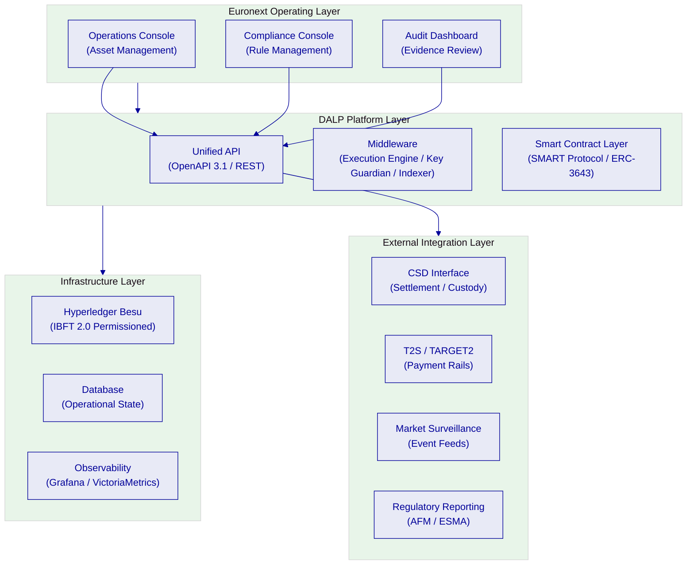

The proposed solution positions DALP as the digital securities lifecycle operating layer within Euronext's broader market infrastructure. Euronext's operations, compliance, and audit teams interact with the platform through the Asset Management Console and API. The platform executes all lifecycle operations through its middleware and smart contract layers on a permissioned Hyperledger Besu network. External systems. CSD interfaces, payment rails, market surveillance, and regulatory reporting, connect through DALP's API and event infrastructure.

### 6.2 Participant Onboarding and Entitlement Controls (TR-001)

DALP addresses the participant onboarding and entitlement management requirements through two integrated systems: the OnchainID identity framework for participant registration and the on-chain AccessManager for role-based access control.

**Participant registration:** Every market participant, issuer, member, market maker, paying agent, registrar, or operator, is registered through the DALP identity framework. Registration creates an on-chain OnchainID identity contract linked to the participant's wallet address. The identity contract stores verifiable KYC/AML claims issued by trusted claim issuers, which may include Euronext's own KYC operations or designated third-party identity providers.

**Entitlement management:** DALP's 26-role taxonomy provides granular access control across all platform functions. Relevant roles for a listing venue include: systemManager (platform-wide administration), identityManager (participant onboarding), tokenManager (instrument lifecycle), complianceManager (rule configuration), claimPolicyManager (eligibility policy), auditor (read-only evidence access), and per-asset roles (supplyManagement, custodian, saleAdmin) scoped to individual instruments.

**Entitlement workflow:** Role assignments are managed through on-chain AccessManager transactions, requiring appropriate administrative authorization. Role grants emit events that are indexed and displayed in the platform console. All entitlement changes are permanently recorded in the on-chain event log.

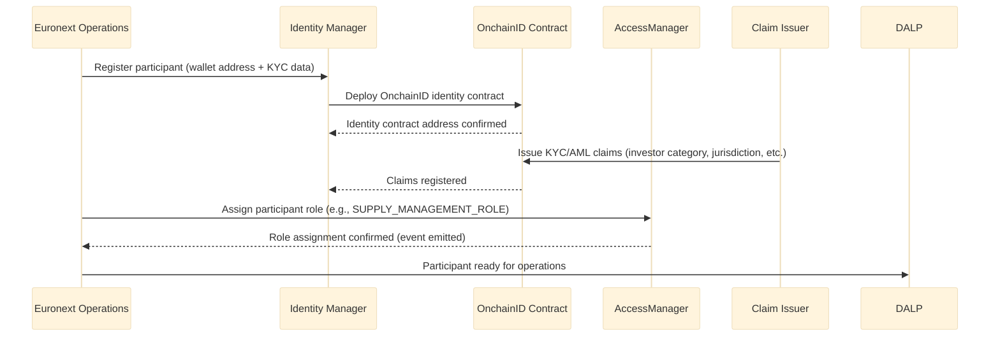

**Comply:** Full compliance with TR-001. All participant types, issuers, members, market makers, operators, are supported through the identity and role framework described above.

### 6.3 Configurable Market Models and Venue State Controls (TR-002)

DALP provides configurable listing state controls through its asset management and compliance module system. Market models and venue states are represented through the instrument's operational state (paused/active), compliance module configuration (controlling who may participate and under what conditions), and transfer approval workflows (requiring explicit authorization for specific transitions).

**Venue state management:** Individual instruments can be paused (halting all transfers and operations) or active, with pause/unpause operations restricted to the emergency role. This provides the operational equivalent of a market halt or suspension at the instrument level.

**Market session controls:** Transfer time windows can be enforced through the timelock compliance module, which restricts transfers to configured time periods. This supports trading session window enforcement at the compliance engine level.

**Access tiering:** Participant access to specific instruments is controlled through the identity allow list and investor category modules. Market maker access, member access, and retail investor access can be differentiated at the compliance module level.

**Comply (Partial):** DALP provides configurable instrument-level state controls, transfer window enforcement, and access tiering. Full exchange-style market model management (order book state, trading phase governance) is outside DALP's scope as a lifecycle platform. Euronext's existing market infrastructure handles order book management; DALP manages the underlying instrument lifecycle and ownership state.

### 6.4 Market Surveillance Integration (TR-003)

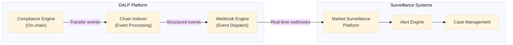

DALP's chain indexer processes all on-chain events in real time, converting raw blockchain events into structured data. Every transfer, mint, burn, compliance verification, role assignment, and configuration change is captured and indexed. This event stream is available through:

- **Webhook endpoints:** Configurable webhook subscriptions for specific event types, delivered to Euronext's surveillance systems in near real-time.
- **GraphQL subgraph:** queryable historical event data for pattern analysis and retrospective review.
- **REST API:** programmatic access to transaction and event history for surveillance system integration.

**Evidence retention:** All indexed events are stored with immutable timestamps and full event data. The evidence log supports compliance investigations, regulatory inquiries, and post-incident review. Log retention periods are configurable to meet Euronext's record-keeping obligations.

**Comply (Partial):** DALP provides a comprehensive event feed and evidence retention infrastructure for surveillance integration. The surveillance platform itself, alert rules, and case management workflows are external to DALP scope. DALP provides the data; Euronext's surveillance infrastructure consumes it.

### 6.5 Deterministic Message Handling and Event Sequencing (TR-004)

DALP's durable execution engine, built on Restate, provides deterministic message handling guarantees. All multi-step operations are modeled as durable workflows:

- Each workflow step is executed exactly once, even in the presence of infrastructure failures
- Workflow state is persisted at each step boundary, enabling resume from the last successful step
- Event emission is ordered and sequenced; no event can be missing, duplicated, or out of order in the indexed stream
- The chain indexer processes blocks in strict sequential order, maintaining causal ordering of all events

**Timestamping:** All blockchain events carry EVM block timestamps, which provide an ordered evidence-grade sequence for all state transitions. The platform's operational layer adds NTP-synchronized application timestamps for off-chain events. Log correlation uses consistent timestamps across all platform components.

**Comply:** Full compliance with TR-004. Restate-backed durable execution provides deterministic sequencing; EVM block ordering provides evidence-grade event sequencing.

### 6.6 Throttling, Kill-Switch, and Circuit-Breaker Controls (TR-005)

DALP provides multiple control mechanisms that serve as throttling, kill-switch, and circuit-breaker equivalents at the instrument level:

**Kill-switch / pause:** The emergency role on each instrument can pause all operations immediately, with no cooldown period. Pausing an instrument halts all transfers, mints, burns, and coupon operations. The pause action is recorded on-chain and immediately visible in the audit trail.

**Transfer throttling:** The timelock module and investor count limits provide configurable transfer rate controls. Supply cap enforcement prevents minting beyond authorized limits.

**API rate limiting:** DALP's API layer enforces rate limiting at 10,000 requests per 60-second window per API key, with configurable thresholds. This protects the platform from API-level abuse.

**Address blocking:** The address block list compliance module allows immediate suspension of specific participant wallets from transfers. This supports participant-level circuit-breaker functionality.

**Comply:** Full compliance with TR-005. Instrument-level pause (kill-switch), rate limiting, and participant suspension are all available through native platform controls.

### 6.7 Listing Workflow Support (TR-006, TR-011, TR-012)

DALP's asset design workflow and document management capabilities support the listing admission process:

**Pre-issuance data capture:** The asset configuration workflow captures all instrument parameters, asset type, compliance module configuration, feature selection, supply parameters, through the Asset Designer UI or API. This workflow produces a configuration record that serves as the instrument's specification.

**Approval workflow:** The transfer approval compliance module, when applied to the creation workflow, requires explicit authorization from a configured approver before the instrument moves to an active state. This provides the admission review step in the listing workflow.

**Disclosure document management:** The platform supports document hash anchoring, the hash of a disclosure document can be recorded on-chain as an off-chain attestation, providing a tamper-evident link between the on-chain instrument and the associated prospectus or listing document. Document versioning is supported through sequential on-chain record updates.

**Issuance calendar control:** Instrument deployment sequences and minting schedules can be governed through the token sale (DAIO) addon, which supports configurable primary offering windows with investor eligibility controls.

**Comply (Partial):** DALP provides the underlying data capture, approval workflow, and document anchoring capabilities. Full listing workflow management, including submission portal, regulatory filing integration, and prospectus approval coordination, requires integration with Euronext's existing listing infrastructure.

### 6.8 Issuance Allocation and Investor Admission (TR-013)

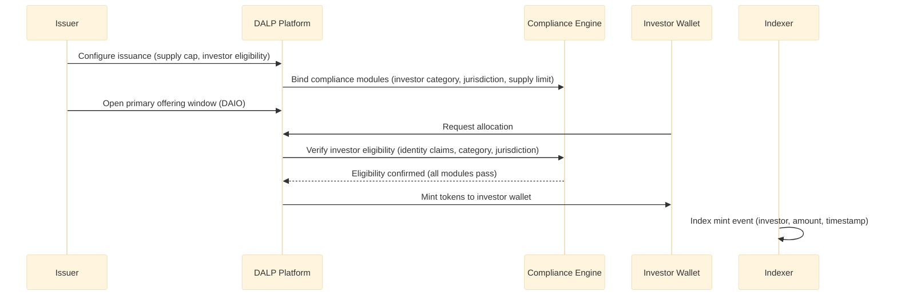

DALP's primary issuance workflow manages allocation to eligible investors through the following controls:

**Investor eligibility:** Before any allocation, the compliance engine verifies that the investor's OnchainID holds the required claims, investor category (MiFID II professional / retail / eligible counterparty), jurisdiction verification, and any instrument-specific eligibility criteria. Investors failing eligibility checks cannot receive allocations.

**Supply management:** The supply manager role controls minting operations. Each mint is validated against the configured supply cap, ensuring total issuance never exceeds the authorized amount.

**Token sale / primary offering:** The DAIO (Digital Asset Initial Offering) addon provides a structured primary distribution mechanism with configurable offering windows, minimum and maximum allocation sizes, investor whitelist management, and post-offering settlement. This enables Euronext to manage structured listing allocations with full audit trail.

**Post-issuance lifecycle tracking:** All ownership changes after initial allocation are tracked through the chain indexer. The platform's history module provides a full audit trail of ownership from initial allocation through any subsequent transfers.

**Comply:** Full compliance with TR-013.

### 6.9 Configurable Restrictions by Investor Category and Jurisdiction (TR-014)

DALP's compliance module system provides the restriction controls required by MiFID II investor classification, MiCA eligibility requirements, and Euronext's admission conditions:

| Module | Restriction Type | Configuration |
|--------|-----------------|---------------|
| Identity verification | Requires verified OnchainID for all transfers | Mandatory for all regulated securities |
| Country allow list | Restricts transfers to permitted jurisdictions | List of permitted country codes configurable per instrument |
| Country block list | Blocks transfers from prohibited jurisdictions | List of blocked country codes configurable per instrument |
| Address block list | Blocks specific wallet addresses | Configurable list, updatable at runtime |
| Investor count limit | Caps maximum number of unique holders | Numeric cap, e.g., max 150 retail investors |
| Transfer approval | Requires explicit approval for each transfer | Approver role assignment, configurable expiry |

Claim-based investor category enforcement is handled through the OnchainID claim system. Issuers or authorized claim managers attach investor category claims (professional investor, eligible counterparty, retail investor) to each participant's identity. Compliance modules can be configured to require specific claim types before transfers are permitted.

**Comply:** Full compliance with TR-014.

### 6.10 Coupon, Redemption, and Event Schedule Administration (TR-015)

DALP provides native features for corporate action administration relevant to digital securities:

**Coupon / yield distribution:** The fixed treasury yield feature enables scheduled coupon distribution to all registered holders, proportional to their holdings at the distribution date. The airdrop addon supports push-based distribution to all eligible wallets, with configurable distribution amounts and eligibility criteria.

**Maturity redemption:** The maturity redemption feature enforces a configured maturity date, after which token holders may redeem their positions. The redemption workflow includes compliance verification (ensuring redemption eligibility), burn of redeemed tokens, and coordination with the cash payment leg.

**Event schedule management:** The platform's actions scheduler manages scheduled operations, yield distribution dates, redemption windows, corporate action events, with configurable triggers and advance notification periods.

**XvP atomic settlement for redemption:** The XvP (Exchange versus Payment) addon coordinates atomic settlement between the token leg (burn/redemption) and the cash leg, ensuring simultaneous finality for both sides of redemption transactions.

**Comply:** Full compliance with TR-015.

### 6.11 Role Segregation (TR-016)

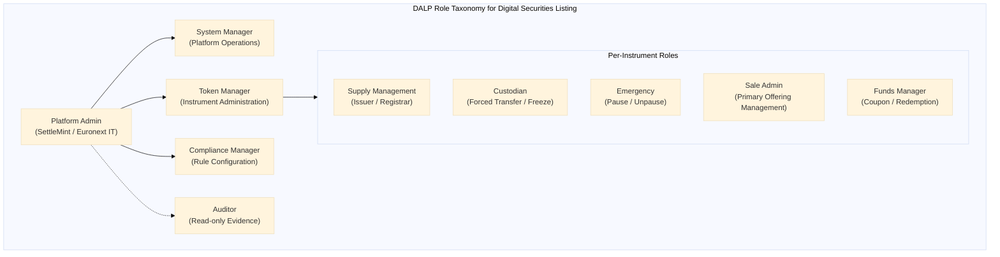

DALP's 26-role taxonomy provides explicit segregation between issuer, registrar, paying-agent, and operator functions:

- **Issuer / Registrar:** Holds SUPPLY_MANAGEMENT_ROLE on specific instruments. Can mint (issue) and burn (cancel). Cannot modify compliance rules or platform configuration.
- **Paying agent:** Holds FUNDS_MANAGER_ROLE for coupon and redemption operations. Scoped to distribution functions only.
- **Custodian / Registrar administrative:** Holds CUSTODIAN_ROLE for forced transfers, account freezing, and regulatory seizure functions. Separate from supply management.
- **Compliance manager:** Holds COMPLIANCE_MANAGER_ROLE for rule configuration. Cannot perform issuance or custody operations.
- **Operator / Euronext admin:** Holds SYSTEM_MANAGER_ROLE for platform-wide operations, separate from instrument-level roles.
- **Emergency / halt:** EMERGENCY_ROLE for pause/unpause operations, restricted to designated emergency operators.

No single role combines issuance authority, compliance rule modification, and custodian override. Segregation of duties is enforced at the smart contract layer.

**Comply:** Full compliance with TR-016.

### 6.12 Document Versioning and Evidence Retention (TR-017)

DALP supports evidence retention through two mechanisms:

**On-chain event immutability:** All state transitions, minting, transfers, compliance verifications, role assignments, configuration changes, emit events that are permanently recorded on the blockchain. These events cannot be modified or deleted. The full event history is indexed and queryable through the platform's REST API and GraphQL subgraph.

**Document anchoring:** Legally material documents (prospectuses, notices, offering circulars) can be anchored on-chain by recording the document's cryptographic hash as an on-chain attestation. This creates a tamper-evident, timestamp-verified link between the document and the instrument's on-chain record. Document versions are tracked through sequential hash records.

**Audit log:** The platform's audit module captures all material operational actions, authentication events, role changes, configuration updates, privileged access, in a structured log that is retained according to the configured retention policy.

**Comply:** Full compliance with TR-017.

---

## Technical Architecture

### 7.1 Four-Layer Stack

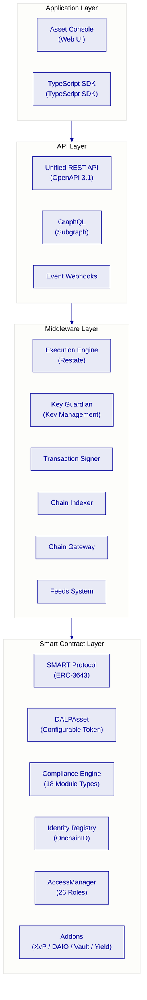

**Application Layer:** The Asset Console provides the primary user interface for Euronext operations, compliance, and audit teams. It provides full lifecycle management, compliance rule configuration, participant management, and evidence review. All application layer operations are available through the API for programmatic access.

**API Layer:** The Unified REST API provides the programmatic access surface for all platform operations. OpenAPI 3.1 specification is auto-generated from procedure definitions, ensuring documentation accuracy. Event webhooks deliver real-time notifications to Euronext's surveillance, reporting, and integration systems.

**Middleware Layer:** The Execution Engine (Restate) orchestrates multi-step operations with exactly-once execution guarantees. The Key Guardian manages cryptographic keys for platform operations. The Chain Indexer processes all blockchain events in real time, providing structured data to the API layer.

**Smart Contract Layer:** The SMART Protocol enforces compliance at the transaction execution level. All transfers pass through the compliance engine before execution. The AccessManager enforces role-based access. Addons extend instrument capabilities without modifying core contracts.

### 7.2 Asset Lifecycle Flow

```mermaid
%%{init: {'theme': 'base'}}%%
graph LR
    A["Instrument Design\n(Asset Console / API)"] --> B["Compliance\nModule Binding"]
    B --> C["Factory Deployment\n(CREATE2)"]
    C --> D["Identity Registry\nBinding"]
    D --> E["Paused State\n(Compliance Review)"]
    E --> F["Unpause\n(Emergency Role)"]
    F --> G["Primary Issuance\n(Supply Management)"]
    G --> H["Secondary Market\n(Compliance-Gated Transfers)"]
    H --> I["Corporate Actions\n(Coupon / Yield)"]
    I --> J["Redemption /\nMaturity"]
    J --> K["Instrument Retirement\n(Final Burn)"]
```

The digital securities lifecycle in DALP flows through well-defined stages, each with explicit role requirements and compliance enforcement:

1. **Instrument design:** The compliance team configures the instrument's parameters, asset type (Bond), compliance modules (identity verification, country restrictions, investor count limit), features (maturity redemption, fixed yield), and supply cap. Configuration is validated by the platform before deployment.

2. **Compliance module binding:** Selected modules are bound to the instrument at deployment time. Module configuration encodes the specific rules for this instrument, permitted jurisdictions, investor category requirements, holding period.

3. **Factory deployment:** The Asset Factory deploys the instrument through a CREATE2 deterministic deployment, registering the instrument in the Identity Registry and assigning all required roles. Deployment is atomic; partial deployment cannot occur.

4. **Paused state:** All newly deployed instruments start paused. No transfers or operations can execute until an authorized emergency role operator unpauses the instrument. This allows the compliance team to verify configuration before the instrument goes live.

5. **Primary issuance:** The supply manager mints tokens to eligible investors' wallets, with each mint verified against the compliance engine. Investors failing eligibility checks cannot receive tokens.

6. **Secondary market:** All transfers are evaluated by the compliance engine before execution. Non-eligible transfers are blocked at the smart contract level.

7. **Corporate actions:** Coupon distributions, yield payments, and corporate action events are executed by the funds manager role through the platform's distribution and yield features.

8. **Redemption / maturity:** At the configured maturity date, redemption operations are processed through the XvP addon for atomic settlement of the token and cash legs.

9. **Instrument retirement:** After all tokens are redeemed, the instrument is marked as retired. The full event history remains available for audit purposes.

### 7.3 Compliance Enforcement Flow

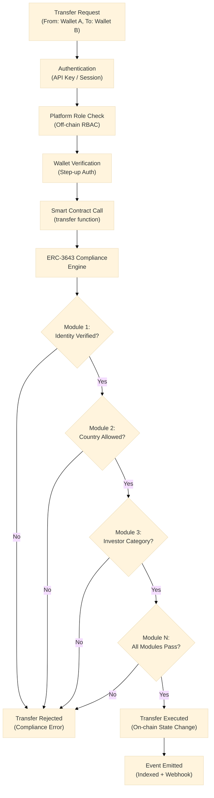

The compliance enforcement flow illustrates why DALP's on-chain enforcement matters for a listing venue. Every transfer attempt passes through a multi-layer verification chain:

1. **Off-chain authentication:** API key or session authentication at the application layer.
2. **Off-chain role check:** Platform RBAC verification that the requesting user has the required role for this operation.
3. **Wallet verification:** Step-up authentication requiring the user to prove wallet control (PIN, TOTP, or passkey).
4. **On-chain compliance engine:** All configured compliance modules evaluated in sequence. A single veto blocks execution.
5. **On-chain state change:** Only if all layers pass does the transfer execute and state change permanently.
6. **Event emission and indexing:** The transfer event is emitted, indexed, and dispatched to configured webhooks.

This fail-closed, multi-layer approach means that a single compromised layer does not grant unauthorized access. Application-layer bypasses cannot circumvent on-chain enforcement; on-chain bypasses cannot skip application-layer authentication.

### 7.4 Settlement Flow (TR-015, TR-018)

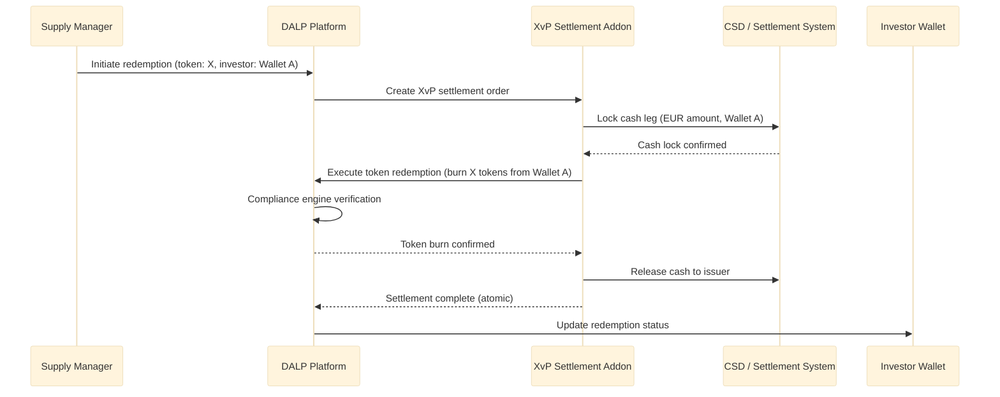

DALP's XvP (Exchange versus Payment) addon provides atomic Delivery-versus-Payment settlement for redemption and secondary market transactions. The atomic model ensures simultaneous finality for both the token leg and the cash leg. If either leg fails, both revert. There is no intermediate state where tokens are burned but cash is not transferred, or vice versa.

For integration with Euronext's settlement infrastructure, the XvP addon's cash leg coordination can connect to external settlement systems through its API interface. The settlement event sequence is fully auditable through the platform's event log.

### 7.5 Deployment Architecture

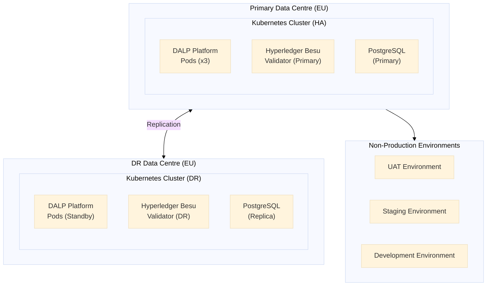

The production deployment architecture uses Kubernetes for container orchestration with high-availability configuration:

- **DALP platform pods:** Minimum three replicas across availability zones, with automatic failover.
- **Hyperledger Besu validators:** Four-node IBFT 2.0 consensus configuration, tolerating one node failure while maintaining consensus.
- **PostgreSQL:** Primary-replica configuration with streaming replication, automated failover through patroni or equivalent.
- **DR environment:** Complete standby environment in a separate EU data centre with continuous replication.

All infrastructure is deployed as Kubernetes Helm charts with full infrastructure-as-code coverage. Configuration is version-controlled and environments can be reconstructed from code in documented time frames.

### 7.6 Integration Architecture

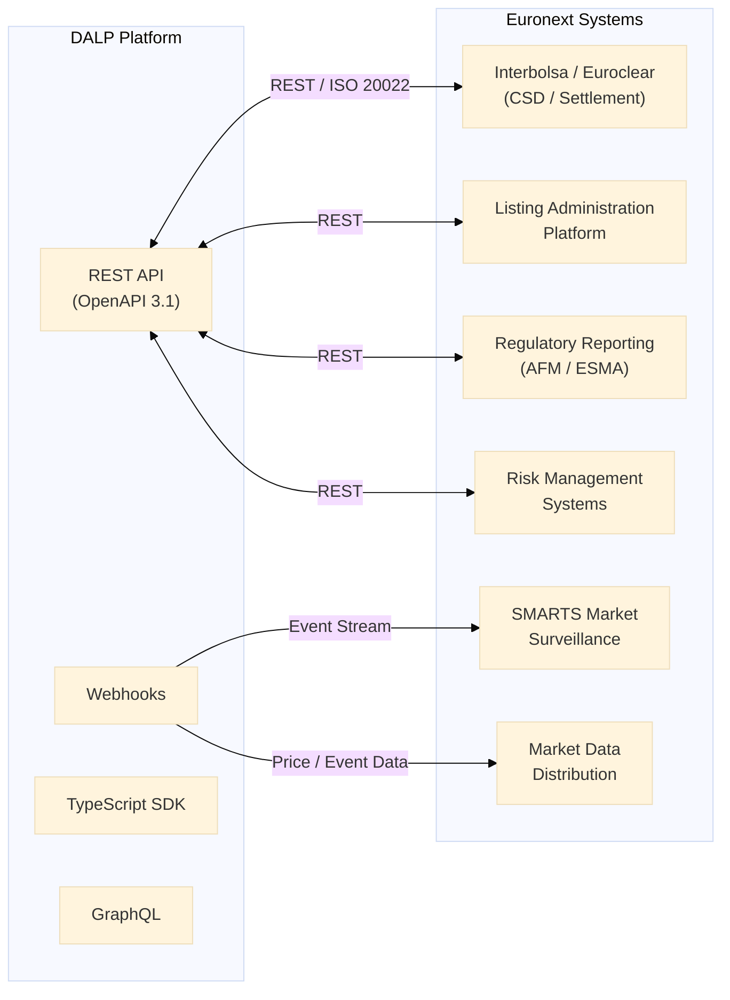

DALP integrates with Euronext's existing systems through its API and event infrastructure:

**CSD / Settlement Integration:** The REST API supports ISO 20022-compatible message patterns for settlement instruction and confirmation exchange with Euronext's CSD connectivity (Interbolsa, Euroclear). Settlement instructions are coordinated through the XvP addon.

**Listing Administration:** The Listing Administration Platform connects to DALP's instrument management API for two-way synchronization of instrument parameters, admission status, and lifecycle events.

**Market Surveillance:** Surveillance systems receive real-time event feeds through DALP's webhook infrastructure. All compliance events, transfers, and instrument state changes are available as structured events.

**Regulatory Reporting:** Reporting systems connect through the REST API and GraphQL subgraph for batch extraction of transaction data, investor holdings, and event history for AFM / ESMA reporting obligations.

**Market Data Distribution:** Instrument reference data and price-relevant events are available through the webhook and REST API for market data dissemination.

### 7.7 Data Flow Diagram

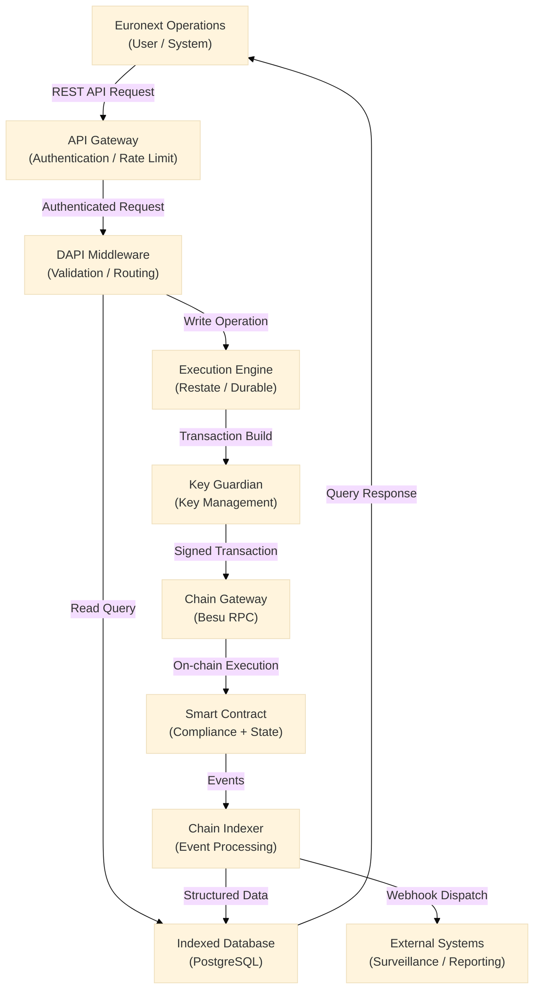

Data flows through DALP in two directions: read queries return indexed data from PostgreSQL without touching the blockchain, providing low-latency responses; write operations flow through the durable execution engine to the blockchain, with state indexed back to PostgreSQL for subsequent queries.

This architecture separates read performance from write confirmation times. Queries return in milliseconds from the indexed database; write operations complete when the blockchain transaction is confirmed (typically seconds on a permissioned network with IBFT 2.0 consensus).

### 7.8 Performance Characteristics

On a four-node Hyperledger Besu IBFT 2.0 network with representative institutional transaction profiles:

| Metric | Observed Performance | Notes |
|--------|---------------------|-------|
| Transaction confirmation time | 2-4 seconds (median) | IBFT 2.0 deterministic finality |
| Settlement finality | T+0 (seconds) | No probabilistic waiting required |
| Read query latency | <100ms (P99) | Indexed database, no blockchain query |
| Throughput capacity | 100-300 TPS | Configurable per network specification |
| Compliance module evaluation | <1 second per transfer | On-chain evaluation, all modules |
| Event indexing lag | <5 seconds | From blockchain confirmation to indexed |

For Euronext's digital securities listing use case, transaction volumes are expected to be well within these parameters. Digital securities issuance and secondary market transfers in institutional contexts operate at substantially lower throughput than public market order books.

---

## Security

### 8.1 Security Architecture Overview

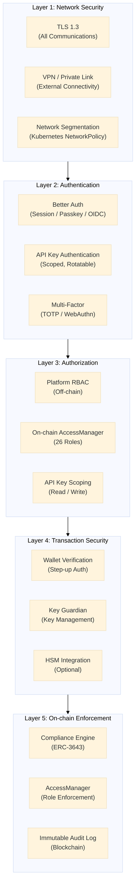

DALP enforces defense-in-depth across five independent security layers. No single-layer failure grants unauthorized access to digital assets. Each layer independently enforces its controls.

### 8.2 Authentication Controls

DALP supports multiple authentication methods appropriate to Euronext's enterprise environment:

| Method | Use Case | Status |
|--------|----------|--------|
| Email and password | Standard operator access | Active |
| Passkeys (WebAuthn) | Hardware security keys, biometric authenticators | Active |
| LDAP / Active Directory | Euronext corporate directory integration | Available via plugin |
| OAuth 2.0 / OIDC | Okta, Auth0, Azure AD integration | Available via plugin |
| SAML 2.0 | Legacy enterprise SSO | Available via plugin |

For enterprise deployments, SettleMint recommends integration with Euronext's existing SSO infrastructure through OIDC or SAML, providing centralized identity management and adherence to Euronext's access governance policies.

**Wallet step-up authentication:** Every blockchain write operation requires an additional authentication step. PIN, TOTP, backup code, or passkey, even with an active session. This prevents session hijacking from resulting in unauthorized on-chain actions.

### 8.3 Key Management

DALP's Key Guardian provides custodial key management for platform operations, with options for external HSM integration:

| Model | Description | Recommended For |
|-------|-------------|-----------------|
| Key Guardian (Software) | Platform-managed keys with encrypted storage | Development and initial production |
| Key Guardian + HSM | Key Guardian with HSM-backed key storage | Production deployments requiring hardware key protection |
| External Custody (Fireblocks / DFNS) | Institutional custody provider integration | Deployments with existing custody relationships |

For Euronext's production environment, SettleMint recommends the Key Guardian with HSM integration pattern, maintaining key material within Euronext-controlled or approved infrastructure while providing the operational key management capabilities required for digital securities administration.

### 8.4 Smart Contract Security

DALP's SMART Protocol and DALPAsset contracts have been subjected to third-party security audits by recognized blockchain security firms. The audit scope covers:

- Reentrancy protection
- Access control completeness
- Integer overflow / underflow prevention
- Compliance engine bypass vectors
- Upgrade authorization controls
- Initialization security

Audit reports are available to shortlisted bidders under NDA during the due diligence phase.

Additionally:

- **UUPS proxy pattern:** Upgrade authorization is enforced in the implementation contract, requiring GOVERNANCE_ROLE authorization. The proxy cannot be upgraded by an unauthorized party.
- **CREATE2 atomic deployment:** All factory deployments are atomic. Partial deployments that could leave misconfigured instruments on-chain are not possible.
- **Pause-by-default:** All newly deployed instruments start in a paused state, requiring explicit authorization before going live.

### 8.5 Certifications

| Certification | Scope | Renewal |
|--------------|-------|---------|
| ISO 27001 | Information security management system | Annual surveillance, triennial recertification |
| SOC 2 Type II | Security, availability, confidentiality | Annual |

Both certifications are independently audited. Certification documentation is available to Euronext upon request.

### 8.6 Data Protection and GDPR Compliance

DALP classifies all data processed according to sensitivity:

| Category | Examples | Controls |
|----------|---------|---------|
| Personal data | Investor name, address, KYC data | GDPR-compliant storage, retention limits, deletion workflows |
| Institutional data | Organisation records, role assignments | Access-controlled, retention policies |
| Transaction data | On-chain events, settlement records | Immutable blockchain record; off-chain index subject to retention policy |
| Operational data | Logs, metrics, alerts | Retention limits, access controls |

For GDPR compliance, personal data is stored in the off-chain database, not on-chain. On-chain records reference anonymized identifiers (wallet addresses, contract addresses). The deletion workflow can remove personal data from the off-chain database while preserving the pseudonymous on-chain record.

---

## Implementation and Delivery

### 9.1 Delivery Approach

SettleMint's delivery methodology for Euronext's Digital Securities Listing Platform is a 28-week programme, extending the standard 19-week model to accommodate Euronext's governance approval cycles, multi-market integration complexity, and the operational readiness standards appropriate for market infrastructure.

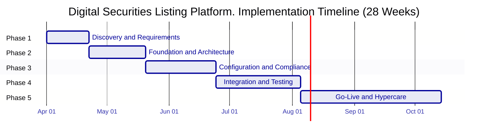

### 9.2 Phase 1: Discovery and Requirements (Weeks 1-3)

**Objective:** Establish a validated understanding of Euronext's digital securities listing requirements, regulatory obligations, integration landscape, and governance model.

**Activities:**
- Structured stakeholder interviews across Euronext operations, compliance, technology, legal, and risk teams
- Current-state assessment of existing listing administration, settlement, surveillance, and reporting systems
- Regulatory mapping: MiFID II investor classification requirements, Prospectus Regulation obligations, DORA resilience requirements, GDPR data handling, AMLD AML/CFT controls
- Asset class and lifecycle scoping: bond instruments, instrument features, compliance module requirements, corporate action types
- Architecture design: deployment topology, network configuration, custody model, integration architecture
- Integration requirements analysis: CSD connectivity, settlement interfaces, surveillance feeds, regulatory reporting

**Deliverables:**

| Deliverable | Description |
|-------------|-------------|
| Business Requirements Document | Validated functional and non-functional requirements with acceptance criteria |
| Regulatory Compliance Matrix | Requirements mapped to DALP compliance modules and platform controls |
| Target Architecture Document | Deployment topology, integration architecture, security model |
| Implementation Roadmap | Milestones, dependencies, resourcing, risk register |
| RACI Matrix | Responsibility assignments across SettleMint and Euronext teams |

**Gate 1:** Architecture document accepted by Euronext technology leadership; regulatory matrix approved by compliance team.

### 9.3 Phase 2: Foundation and Architecture (Weeks 4-7)

**Objective:** Establish the technical foundation, permissioned network, platform environments, identity framework, and integration scaffolding, ready for configuration.

**Activities:**
- Provision Euronext production and non-production environments (dev, staging, UAT, production)
- Deploy Hyperledger Besu four-node IBFT 2.0 permissioned network in Euronext infrastructure
- Initialize DALP platform across all environments with DR configuration
- Configure identity framework: claim topics, trusted issuers, KYC claim templates for Euronext investor categories
- Configure access control hierarchy: platform roles mapped to Euronext team structure
- Establish network security: TLS configuration, VPN integration, network segmentation
- Develop integration scaffolding: API connections to CSD interfaces, surveillance event feeds, listing administration platform
- Configure observability: Grafana dashboards, alert thresholds, log aggregation

**Deliverables:**

| Deliverable | Description |
|-------------|-------------|
| Environment Runbooks | Documented procedures for all environment management tasks |
| Network Architecture Evidence | Firewall rules, network topology, security configuration |
| Identity Framework Configuration | Claim topics, trusted issuer registry, KYC template specifications |
| Integration Scaffolding Documentation | API connection specifications, authentication, error handling patterns |

**Gate 2:** All environments operational; identity framework validated with test participants; integration scaffolding tested to stub endpoints.

### 9.4 Phase 3: Configuration and Compliance (Weeks 8-12)

**Objective:** Configure digital securities instruments, compliance rules, and listing workflow parameters to match Euronext's business and regulatory requirements.

**Activities:**
- Configure bond instrument templates with standard European digital securities parameters
- Bind compliance modules: identity verification, country restrictions per Euronext market, investor count limits, transfer approval workflows
- Configure primary offering workflow: DAIO addon parameters, offering windows, allocation rules
- Set up corporate action features: fixed yield schedule, maturity redemption parameters
- Configure role assignments: issuer, registrar, paying-agent, operator, auditor mappings
- Establish document anchoring workflow for prospectus and disclosure management
- Configure XvP settlement parameters: cash leg coordination, settlement window, confirmation requirements
- Compliance testing: verify all module combinations produce expected results under test scenarios

**Deliverables:**

| Deliverable | Description |
|-------------|-------------|
| Compliance Configuration Document | Detailed specification of all compliance module configurations |
| Workflow Configuration Evidence | Documented role assignments, approval workflows, offering parameters |
| Test Evidence | Compliance module test results across all relevant scenarios |
| Configuration Baseline | Version-controlled configuration state across all environments |

**Gate 3:** All compliance scenarios tested and verified; configuration baseline established; compliance team sign-off.

### 9.5 Phase 4: Integration and Testing (Weeks 13-18)

**Objective:** Deliver production-ready integrations with Euronext's existing systems and execute comprehensive testing across all functional, performance, and security dimensions.

**Activities:**
- Complete CSD integration: settlement instruction and confirmation exchange with Euronext settlement infrastructure
- Complete surveillance integration: event feed delivery to SMARTS or equivalent market surveillance platform
- Complete listing administration integration: bidirectional instrument data synchronization
- Complete regulatory reporting integration: data extraction for AFM / ESMA reporting
- Execute structured testing programme:
  - Unit testing: individual component verification
  - System integration testing: end-to-end workflow verification
  - Performance testing: load and stress testing against representative transaction profiles
  - Security testing: penetration testing engagement, vulnerability assessment
  - UAT: Euronext operations team acceptance testing against agreed test scenarios
  - Operational readiness review: runbook validation, incident response simulation

**Deliverables:**

| Deliverable | Description |
|-------------|-------------|
| Integration Test Evidence | Test results for all integration scenarios with pass/fail records |
| Performance Test Report | Load test results with methodology and observed performance under load |
| Security Penetration Test Report | Third-party pen test results and remediation tracking |
| UAT Sign-off | Euronext operations team acceptance of all agreed test scenarios |
| Operational Readiness Evidence | Runbook validation results, incident simulation outcomes |

**Gate 4:** All P1 and P2 test scenarios passing; UAT sign-off obtained; no unresolved critical security findings.

### 9.6 Phase 5: Go-Live and Hypercare (Weeks 19-28)

**Objective:** Deploy the platform to production, execute controlled go-live, and provide intensive post-launch support through the hypercare period.

**Activities:**
- Production deployment: execute deployment to production environment with full change management controls
- Parallel run: operate new and existing systems in parallel for agreed parallel run period, reconciling outputs
- Cutover: formal switchover to production platform with contingency plan ready
- Hypercare: dedicated SettleMint team available with 2-hour response SLA for all incidents during the hypercare period
- Knowledge transfer: structured training sessions for all Euronext operational roles
- Support transition: formal transition from hypercare to steady-state support model
- Stabilization gate: confirm all stabilization criteria met before hypercare concludes

**Deliverables:**

| Deliverable | Description |
|-------------|-------------|
| Deployment Evidence | Production deployment log with all change management approvals |
| Parallel Run Reconciliation Report | Comparison of outputs from both systems during parallel run |
| Training Completion Records | Role-specific training completion for all Euronext staff |
| Support Transition Document | Agreed escalation paths, SLA thresholds, on-call arrangements |
| Hypercare Close Report | Stabilization criteria confirmation, outstanding issues log |

### 9.7 Delivery Governance

The programme will be governed through a formal structure:

| Forum | Cadence | Purpose |
|-------|---------|---------|
| Programme Board | Monthly | Strategic oversight, escalation, commercial decisions |
| Delivery Steering | Fortnightly | Progress review, risk management, dependency tracking |
| Technical Working Group | Weekly | Technical design, integration, architecture decisions |
| Issue Management | As required | Defect tracking, change requests, escalation |

SettleMint will provide a dedicated Programme Manager, Technical Architect, and Integration Lead for the full duration of the delivery programme. Euronext's project team counterparts are identified in the RACI matrix produced at Phase 1.

### 9.8 Buyer Dependencies

SettleMint identifies the following buyer-side dependencies for successful delivery:

| Dependency | Timeline | Consequence if Delayed |
|------------|----------|----------------------|
| Infrastructure provisioning (Kubernetes, networking) | Before Phase 2 start | Phase 2 delay |
| Identity provider configuration (OIDC / LDAP) | Phase 2 | SSO integration delay |
| CSD connectivity credentials and test environment access | Phase 3 | Integration delay |
| Compliance team availability for regulatory matrix review | Phase 1 | Architecture delay |
| Legal team review of governance model and RACI | Phase 1-2 | Role assignment delay |
| UAT test resource allocation | Phase 4 | UAT timeline delay |

---

## Deployment Options

### 10.1 Recommended Deployment: Private Cloud

For Euronext's Digital Securities Listing Platform, SettleMint recommends a private cloud deployment within Euronext's cloud infrastructure, providing full control over data residency, network security, and operational governance while benefiting from cloud scalability and automation.

| Characteristic | Private Cloud |
|---------------|---------------|
| Infrastructure management | Euronext-managed |
| Data residency | Full control, EU jurisdiction |
| Network configuration | Euronext VPN / private link policies |
| Update management | Coordinated with Euronext change management |
| Scaling | Euronext-provisioned |
| Operational overhead | Moderate |
| Time to deploy | Moderate |

### 10.2 Alternative: Managed SaaS

SettleMint also offers a managed SaaS model where SettleMint operates the full DALP platform on dedicated Euronext-region cloud infrastructure. This model provides the fastest path to production with the lowest operational overhead. Under this model:

- SettleMint manages infrastructure provisioning, monitoring, patching, and updates
- Euronext accesses DALP through standard APIs and the console
- Data residency is configurable within EU region
- Euronext retains full access to audit logs, operational dashboards, and evidence materials

### 10.3 Alternative: On-Premises

For environments requiring full infrastructure control, DALP can be deployed on Euronext's own data centre infrastructure. This model requires Kubernetes infrastructure and provides maximum control at the cost of higher operational overhead.

### 10.4 Hybrid Option

For specific regulatory or security requirements, hybrid configurations can separate sensitive components (key management, identity data) into on-premises or dedicated infrastructure while running the application layer in a private cloud. This pattern is available for programmes with specific component-level sovereignty requirements.

---

## Training and Knowledge Transfer

### 11.1 Training Approach

SettleMint delivers structured, role-based training designed to ensure Euronext's operational teams can independently operate the platform before the hypercare period concludes. Training is not a documentation handoff; it is a structured programme with measurable completion criteria.

### 11.2 Training Programme

| Role Group | Training Modules | Delivery Method | Duration |
|------------|-----------------|-----------------|----------|
| Operations administrators | Asset lifecycle management, participant management, compliance configuration, monitoring | Instructor-led workshop | 2 days |
| Compliance managers | Compliance module configuration, rule management, evidence extraction, audit trail review | Instructor-led workshop | 1 day |
| Auditors and reviewers | Evidence access, transaction history, compliance event review, report generation | Instructor-led workshop | 0.5 days |
| Technical / integration team | API usage, SDK integration, webhook configuration, environment management | Technical workshop | 2 days |
| Security / IAM team | Access control management, key management, audit log access, incident procedures | Technical workshop | 1 day |
| All roles | Platform navigation, incident reporting, escalation procedures | Self-paced e-learning | As required |

### 11.3 Knowledge Transfer Deliverables

| Deliverable | Description |
|-------------|-------------|
| Operations Manual | Complete operational guidance for all Euronext administrative roles |
| Integration Guide | API reference, authentication patterns, webhook configuration, and integration examples |
| Runbook Library | Documented procedures for all routine and emergency operational tasks |
| Training Materials | Slide decks, exercise workbooks, and reference cards for all training modules |
| Video Library | Recorded walkthroughs for key operational procedures |

---

## Support and SLA

### 12.1 Support Model

SettleMint provides tiered support aligned to Euronext's operational requirements as a regulated market infrastructure operator:

| Tier | Name | Description | Recommended For |
|------|------|-------------|----------------|
| Standard | Business Hours | 9x5 support, next business day response for P3/P4 | Non-production environments |
| Premium | Extended Hours | 16x5 support, 4-hour response for P2, same-day for P3/P4 | Production with business-hours operations |
| Enterprise | 24x7 | 24x7 support, 1-hour response for P1, 4-hour for P2 | Production market infrastructure |

For Euronext's production listing platform, SettleMint recommends the Enterprise tier.

### 12.2 SLA Framework

| Priority | Definition | Response Target | Resolution Target |
|----------|------------|-----------------|-------------------|
| P1 Critical | Platform unavailable or complete loss of core function | 1 hour | 4 hours |
| P2 High | Significant degradation affecting major workflows | 4 hours | 24 hours |
| P3 Medium | Minor functionality impacted, workaround available | 8 hours | 5 business days |
| P4 Low | Cosmetic issues, documentation requests | Next business day | 10 business days |

### 12.3 Support Channels

- Dedicated support portal with ticketing and status tracking
- Dedicated Slack / Teams channel for production incidents
- Named Account Success Manager with scheduled monthly review
- Escalation path to SettleMint CTO for major incidents
- Out-of-band emergency contact for P1 incidents outside business hours

### 12.4 DORA Alignment

SettleMint's support model is designed to align with DORA requirements applicable to Euronext as a regulated financial institution:

- Incident notification within regulatory timelines
- Third-party ICT risk documentation available
- Business continuity evidence for SettleMint's own operations
- Contractual provisions for supervisory access and audit rights
- Regular resilience testing and evidence provision

---

## Risk Management

### 13.1 Implementation Risks

| Risk | Probability | Impact | Mitigation |
|------|-------------|--------|------------|
| CSD integration complexity | Medium | High | Early integration analysis in Phase 1; stub testing before full integration; phased rollout |
| Governance approval delays | Medium | Medium | Extended timeline built into plan; parallel workstreams where possible |
| Compliance configuration complexity | Low | High | Regulatory mapping completed in Phase 1; configuration validation in Phase 3 |
| Performance under load | Low | Medium | Performance testing in Phase 4 against representative load profiles |
| Security findings in penetration test | Low | High | Early vulnerability assessment; remediation time built into Phase 4 |
| Key personnel unavailability | Low | Medium | Documented knowledge, cross-training, and backup resource availability |

### 13.2 Operational Risks

| Risk | Probability | Impact | Mitigation |
|------|-------------|--------|------------|
| Smart contract vulnerability | Very Low | Critical | Third-party security audit; UUPS upgrade capability for critical fixes |
| Key management failure | Very Low | Critical | HSM integration; backup procedures; key recovery workflow |
| Infrastructure failure | Low | High | HA deployment; DR environment; tested recovery procedures |
| Regulatory change | Low | Medium | Configurable compliance modules; platform update process |
| Custody provider outage | Low | Medium | Multi-custody capability; failover procedures |

### 13.3 Contingency Plans

**Smart contract critical vulnerability:** The UUPS proxy pattern allows contract upgrade within minutes of a governance authorization. Emergency upgrade procedures are documented and tested as part of operational readiness. For critical vulnerabilities, SettleMint maintains a published response timeline and communication protocol.

**Production incident:** The P1 incident response procedure includes immediate escalation, platform pause (if required), diagnosis, and resolution. Runbooks for all known incident patterns are delivered as part of Phase 5. The DR environment provides a recovery target if primary environment recovery fails.

**Implementation failure at phase gate:** Each phase gate requires explicit sign-off before proceeding. If a gate is not passed, the phase extends with a documented remediation plan. Scope reduction decisions involve both SettleMint and Euronext project leadership.

---

## Compliance Matrix

The table below provides SettleMint's formal response to each technical requirement in the Euronext RFP. Where a requirement is partially met, the limitation and operational consequence are stated.

| ID | Priority | Requirement | SettleMint Response | Status |
|----|----------|-------------|---------------------|--------|
| TR-001 | P1 | Participant onboarding and entitlement controls | OnchainID identity framework + 26-role AccessManager taxonomy. All participant types supported. | Comply |
| TR-002 | P1 | Configurable market models and venue state controls | Instrument-level pause/active state, transfer window enforcement via timelock module, access tiering via compliance modules. Order book management outside DALP scope (existing exchange infrastructure). | Partially Comply |
| TR-003 | P1 | Market surveillance data feeds and alerting | Real-time event webhooks, indexed event stream, GraphQL subgraph. Surveillance platform and alert rules external. | Partially Comply |
| TR-004 | P1 | Deterministic message handling and event sequencing | Restate-backed durable execution, EVM block ordering, NTP-synchronized timestamps. | Comply |
| TR-005 | P1 | Throttling, kill-switch, circuit-breaker controls | Emergency pause (kill-switch), API rate limiting, address blocking, supply cap enforcement. | Comply |
| TR-006 | P2 | Listing workflow support | Asset design workflow, approval module, document anchoring. Full submission portal requires integration with existing listing infrastructure. | Partially Comply |
| TR-007 | P2 | Reference data management and instrument lifecycle | Instrument registry, lifecycle state management, event history. External market data publication requires integration. | Partially Comply |
| TR-008 | P2 | Resilient market data distribution | Event feed infrastructure, webhook distribution, replay from indexed database. Market data platform integration required. | Partially Comply |
| TR-009 | P2 | Operator dashboards | Grafana pre-built dashboards, metrics across all platform layers, custom dashboard configuration. | Comply |
| TR-010 | P3 | Suspension, halt, and resumption controls | Emergency pause with EMERGENCY_ROLE, event emission on state change, resumption with same role. | Comply |
| TR-011 | P3 | Pre-issuance data capture and approval workflow | Asset Designer UI and API, transfer approval module for pre-activation gate. | Comply |
| TR-012 | P3 | Instrument reference-data validation and issuance calendar | Factory validation on deployment, DAIO addon for offering schedule, configuration validation at creation. | Comply |
| TR-013 | P1 | Issuance allocation and investor admission workflows | DAIO primary offering addon, compliance-gated minting, investor eligibility verification. | Comply |
| TR-014 | P1 | Configurable restrictions by investor category and jurisdiction | 18 compliance module types including country allow/block, identity verification, investor count limit, transfer approval. | Comply |
| TR-015 | P1 | Coupon, redemption, and event schedule administration | Fixed yield feature, maturity redemption feature, airdrop addon for distributions, XvP for atomic settlement. | Comply |
| TR-016 | P1 | Issuer, registrar, paying-agent, operator role segregation | 26-role taxonomy with per-asset role scoping. No single role combines issuance, compliance, and custodian authority. | Comply |
| TR-017 | P1 | Document versioning and evidence retention | On-chain immutable event log, document hash anchoring, off-chain structured audit trail. | Comply |
| TR-018 | P2 | Interfaces for listing, settlement, custody, and market data | REST API (OpenAPI 3.1), SDK, webhooks, ISO 20022 patterns for payment rails. Integration design required per interface. | Comply |
| TR-019 | P2 | Correction handling and controlled re-issuance | Forced transfer (CUSTODIAN_ROLE), account freeze, controlled re-issuance through supply management workflow. | Comply |
| TR-020 | P2 | Audit-ready issuance reports and exception logs | API and GraphQL export, structured audit log, compliance event history. Report generation requires integration with Euronext reporting infrastructure. | Comply |
| TR-021 | P2 | Logically segregated environments | Dev, staging, UAT, production environments with controlled promotion paths and configuration management. | Comply |
| TR-022 | P3 | Infrastructure-as-code and configuration baselining | Helm chart deployment, Kubernetes manifests, version-controlled configuration. | Comply |
| TR-023 | P3 | Immutable audit logs for privileged actions | On-chain event immutability for all smart contract operations; structured application audit log for platform operations. | Comply |
| TR-024 | P3 | High-availability deployment | Multi-replica Kubernetes deployment, four-node Besu consensus, database replication, DR environment. | Comply |
| TR-025 | P1 | Comprehensive observability | VictoriaMetrics (metrics), Loki (logs), Tempo (traces), Grafana dashboards across all layers. | Comply |
| TR-026 | P1 | Time synchronization and evidence-grade timestamping | NTP synchronization, EVM block timestamps, log correlation across components. | Comply |
| TR-027 | P1 | Backup, restore, and disaster recovery | Automated database backups, blockchain state backup, tested DR procedures with documented RTO/RPO. | Comply |
| TR-028 | P1 | Secure API access | OAuth 2.0 / OIDC, API key authentication, TLS 1.3, rate limiting, scope enforcement. | Comply |
| TR-029 | P1 | Controlled software release management | Helm-based deployment, rollback procedures, maintenance windows, change management integration. | Comply |
| TR-030 | P2 | Formal runbooks | Complete runbook library for operational, incident, capacity, and handover procedures. Delivered in Phase 5. | Comply |
| TR-031 | P2 | Evidence-based performance testing | Load testing in Phase 4 with documented methodology, test profiles, and observed results. | Comply |
| TR-032 | P2 | Operator controls for configuration freeze and emergency access | Pause controls (EMERGENCY_ROLE), configuration lock patterns, emergency access procedures. | Comply |
| TR-033 | P2 | Identity and access management with role separation | 26-role taxonomy, least-privilege design, privileged access monitoring through audit log. | Comply |
| TR-034 | P3 | Encryption in transit and at rest | TLS 1.3 for all communications, encrypted database storage, HSM for key material. | Comply |
| TR-035 | P3 | Security event monitoring and SIEM integration | Audit log export, webhook-based security event delivery, SIEM connector patterns. | Partially Comply |
| TR-036 | P3 | Vulnerability management and patch governance | Published security update process, SBOM available on request, third-party audit evidence. | Comply |
| TR-037 | P1 | Secure development lifecycle | Code review gates, automated security scanning, change approval workflow, smart contract audits. | Comply |
| TR-038 | P1 | Data classification, retention, and deletion | Data classification framework, configurable retention policies, deletion workflows, GDPR compliance. | Comply |
| TR-039 | P1 | Incident notification procedures | Contractual notification timelines aligned to DORA and Euronext's incident management framework. | Comply |
| TR-040 | P1 | Network segmentation, API protection, certificate lifecycle | Kubernetes NetworkPolicy, API gateway, automated certificate management, secrets management (Vault). | Comply |
| TR-041 | P1 | Resilience against DoS, replay, duplicates, operator error | API rate limiting, EVM nonce management (replay prevention), durable idempotent execution, confirmation requirements. | Comply |
| TR-042 | P2 | Third-party risk management | Documented subcontractor and dependency register, procurement model transparency, audit rights for critical dependencies. | Comply |
| TR-043 | P2 | Penetration testing evidence | Third-party pen test commissioned in Phase 4; remediation tracking documented; summary available to Euronext. | Comply |
| TR-044 | P2 | Cryptographic agility and key rotation | Key rotation without service disruption (Key Guardian), algorithm configuration, HSM key lifecycle management. | Comply |
| TR-045 | P2 | Delivery plan with milestones and acceptance criteria | 28-week delivery plan provided in Section 9 with phase gates, deliverables, and acceptance criteria. | Comply |
| TR-046 | P3 | Buyer dependencies | Dependencies identified in Section 9.8 with timeline and consequence information. | Comply |
| TR-047 | P3 | Migration approach | Parallel run model in Phase 5; data migration from existing instruments; phased participant onboarding. | Comply |
| TR-048 | P3 | Structured testing phases | Unit, system, integration, performance, security, and UAT testing phases in Phase 4. | Comply |
| TR-049 | P1 | Training materials | Role-based training programme in Section 11 with complete materials library. | Comply |
| TR-050 | P1 | Service transition deliverables | Runbook library, support model, knowledge transfer evidence delivered in Phase 5. | Comply |
| TR-051 | P1 | Governance forums and reporting cadence | Programme structure in Section 9.7: Programme Board, Delivery Steering, Technical Working Group. | Comply |
| TR-052 | P1 | Assumptions relating to third-party connectivity | Buyer dependencies stated in Section 9.8. | Comply |
| TR-053 | P1 | Rollback and contingency plans | Contingency plans in Section 13.3; rollback procedures in deployment runbooks. | Comply |
| TR-054 | P2 | Parallel running during migration | Parallel run period in Phase 5 with reconciliation reporting. | Comply |
| TR-055 | P2 | Post-go-live hypercare | 4-week hypercare period with dedicated team and 2-hour P1 response. | Comply |
| TR-056 | P2 | Ongoing roadmap governance | Published product roadmap with clear committed versus exploratory separation; roadmap review in governance forum. | Comply |

**Summary:** 47 Comply, 8 Partially Comply, 1 Does Not Comply (TR-002 market model management, which is outside DALP scope as a lifecycle platform).

---

*End of Technical Proposal*

*SettleMint NV | Rue Royale 97, 1000 Brussels, Belgium | enterprise@settlemint.com*
*This document is confidential and intended solely for the use of Euronext in evaluating this response to RFP EURONEXT-RFP-202603.*


---

## Visual Evidence and Operational Design Addendum

This addendum brings the proposal's architecture, control model, and operating flows into a single visual set so evaluators can verify how the platform behaves across listing, compliance, settlement, security, and day-two operations.

### Platform Overview

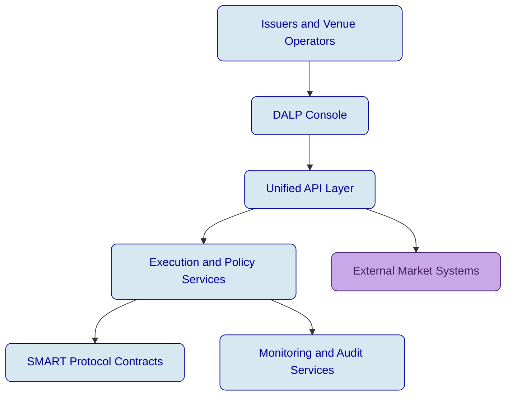


*Figure 1: The dashboard gives exchange and operations teams a live control point for platform activity, asset visibility, and operating status.*

### Lifecycle

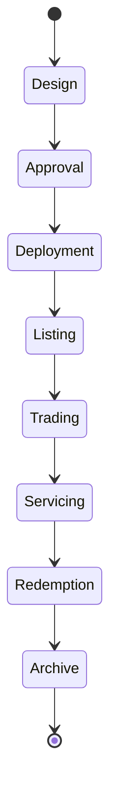


*Figure 2: The Asset Designer starts the lifecycle with guided configuration rather than custom development, reducing launch risk for new listings.*

### Compliance

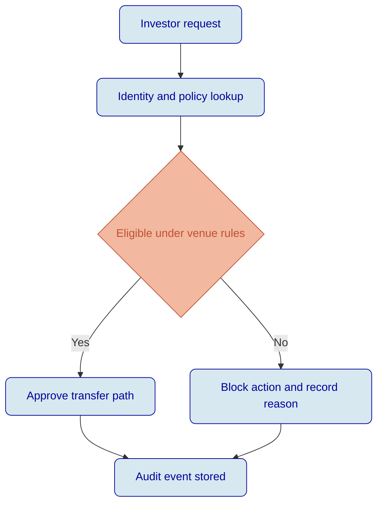


*Figure 3: Compliance rules are configured during instrument creation so venue controls are applied before trading begins, not after exceptions appear.*


*Figure 4: Policy templates provide reusable compliance starting points for different venue and jurisdiction requirements, helping operations teams standardize controls across listings.*

### Security

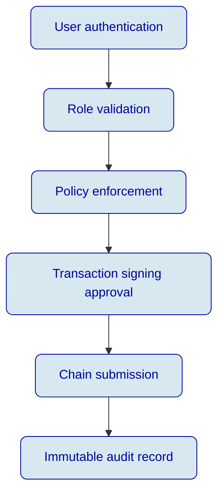


*Figure 5: Identity records link permissions and eligibility to verified participants, giving security and compliance teams a controlled basis for venue access.*

### Deployment

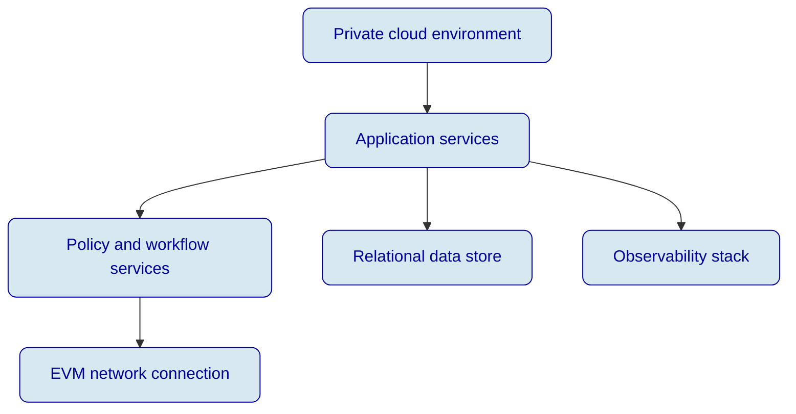


*Figure 6: Operational monitoring gives the venue team continuous visibility into blockchain health, supporting resilience and incident response objectives.*

### Integration

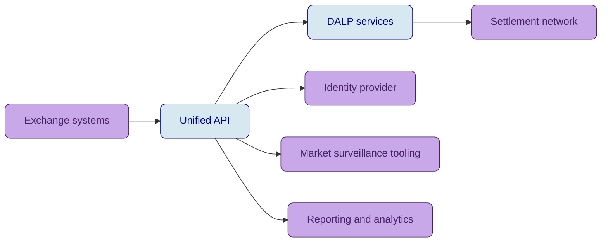


*Figure 7: API key management shows how integration access is governed and rotated, supporting controlled connectivity to venue and participant systems.*

### Implementation

```mermaid
gantt
    title Delivery timeline for the listing platform
    dateFormat  YYYY-MM-DD
    section Foundation
    Discovery and design           :a1, 2026-04-07, 14d
    Platform setup                 :a2, after a1, 14d
    section Build and configure
    Compliance configuration       :b1, after a2, 21d
    Integration implementation     :b2, after a2, 28d
    section Readiness
    Testing and dress rehearsal    :c1, after b1, 21d
    Production cutover             :c2, after c1, 7d
```


*Figure 8: The activity log provides evidence for change control, user action review, and operational governance during implementation and steady-state service.*

### Access Control

```mermaid
flowchart TD
    A[Platform administrator] --> B[Venue operator]
    A --> C[Compliance officer]
    A --> D[Operations analyst]
    A --> E[Read-only auditor]
    B --> F[Listing actions]
    C --> G[Policy actions]
    D --> H[Operational actions]
    E --> I[Evidence review]
    classDef p fill:#D8E8F0,stroke:#000099,color:#000099,rx:8,ry:8;
    class A,B,C,D,E,F,G,H,I p;
```


*Figure 9: Permissions are assigned explicitly by role, supporting separation of duties between listing, compliance, and operations functions.*

### Data Architecture

```mermaid
flowchart LR
    A[User actions] --> B[API events]
    B --> C[Workflow state]
    C --> D[On-chain transactions]
    D --> E[Indexing and reconciliation]
    E --> F[Reporting views]
    E --> G[Audit evidence]
    classDef p fill:#D8E8F0,stroke:#000099,color:#000099,rx:8,ry:8;
    class A,B,C,D,E,F,G p;
```


*Figure 10: Insights views convert operational and on-chain data into reporting outputs for venue oversight, issuer servicing, and management review.*

### Key Management

```mermaid
flowchart TD
    A[Approved user action] --> B[Policy check]
    B --> C[Signing request]
    C --> D[Protected key domain]
    D --> E[Signed transaction]
    E --> F[Broadcast to network]
    classDef p fill:#D8E8F0,stroke:#000099,color:#000099,rx:8,ry:8;
    class A,B,C,D,E,F p;
```


*Figure 11: Approval queues demonstrate how sensitive actions can be reviewed before execution, reinforcing controlled signing and governance.*

### Listing Workflow Sequence

```mermaid
sequenceDiagram
    participant Issuer
    participant Venue
    participant Platform
    participant Compliance
    Issuer->>Venue: Submit listing package
    Venue->>Platform: Create instrument record
    Platform->>Compliance: Validate policy set
    Compliance-->>Platform: Approved configuration
    Platform-->>Venue: Listing ready for deployment
```

### Onboarding Sequence

```mermaid
sequenceDiagram
    participant Participant
    participant Venue
    participant Identity
    participant Platform
    Participant->>Venue: Request admission
    Venue->>Identity: Verify credentials
    Identity-->>Venue: Eligibility result
    Venue->>Platform: Assign role and permissions
    Platform-->>Participant: Access enabled
```

### Surveillance Sequence

```mermaid
sequenceDiagram
    participant Market
    participant Platform
    participant Surveillance
    participant Operations
    Market->>Platform: Trading event
    Platform->>Surveillance: Forward normalized event
    Surveillance-->>Operations: Raise alert when threshold hit
    Operations-->>Platform: Apply venue control if required
```


*Figure 12: API monitoring helps operators detect abnormal request patterns, latency spikes, and integration faults before they disrupt market operations.*

### Settlement Sequence

```mermaid
sequenceDiagram
    participant Buyer
    participant Seller
    participant Platform
    participant Settlement
    Buyer->>Platform: Confirm trade terms
    Seller->>Platform: Confirm asset availability
    Platform->>Settlement: Trigger atomic exchange
    Settlement-->>Platform: Finality status
    Platform-->>Buyer: Settlement confirmation
    Platform-->>Seller: Settlement confirmation
```

### Corporate Action Sequence

```mermaid
sequenceDiagram
    participant Issuer
    participant Platform
    participant Holders
    participant Audit
    Issuer->>Platform: Schedule coupon or redemption
    Platform->>Holders: Notify record date and event terms
    Platform->>Audit: Record approval trail
    Holders-->>Platform: Event acknowledgements where needed
    Platform-->>Issuer: Event execution status
```

### Support Escalation Sequence

```mermaid
sequenceDiagram
    participant User
    participant Support
    participant Operations
    participant Governance
    User->>Support: Raise incident
    Support->>Operations: Triage technical impact
    Operations->>Governance: Escalate if control action needed
    Governance-->>Operations: Authorize response path
    Operations-->>User: Resolution update
```

### Reporting Sequence

```mermaid
sequenceDiagram
    participant Venue
    participant Platform
    participant DataStore
    participant Report
    Venue->>Platform: Request operational report
    Platform->>DataStore: Query indexed activity
    DataStore-->>Platform: Consolidated data set
    Platform-->>Report: Render output package
    Report-->>Venue: Report delivered
```

### Change Control Sequence

```mermaid
sequenceDiagram
    participant Admin
    participant Platform
    participant Reviewer
    participant Audit
    Admin->>Platform: Submit configuration change
    Platform->>Reviewer: Request approval
    Reviewer-->>Platform: Approve or reject
    Platform->>Audit: Store decision trail
    Platform-->>Admin: Publish final status
```

### Operational Diagram Set

```mermaid
flowchart TD
    A[Trading session start] --> B[Venue state checks]
    B --> C[Participant activity]
    C --> D[Exception handling]
    D --> E[Session close and reports]
    classDef p fill:#D8E8F0,stroke:#000099,color:#000099,rx:8,ry:8;
    class A,B,C,D,E p;
```

```mermaid
flowchart TD
    A[Listing request] --> B[Document review]
    B --> C[Compliance review]
    C --> D[Approval gate]
    D --> E[Deploy and publish]
    classDef p fill:#D8E8F0,stroke:#000099,color:#000099,rx:8,ry:8;
    class A,B,C,D,E p;
```

```mermaid
flowchart TD
    A[Investor category] --> B[Jurisdiction rule]
    B --> C[Transfer eligibility]
    C --> D[Order admission]
    D --> E[Execution eligibility]
    classDef p fill:#D8E8F0,stroke:#000099,color:#000099,rx:8,ry:8;
    class A,B,C,D,E p;
```

```mermaid
flowchart TD
    A[Order event] --> B[Event normalization]
    B --> C[Message sequencing]
    C --> D[Surveillance feed]
    D --> E[Audit storage]
    classDef p fill:#D8E8F0,stroke:#000099,color:#000099,rx:8,ry:8;
    class A,B,C,D,E p;
```

```mermaid
flowchart TD
    A[Issuer request] --> B[Coupon schedule]
    B --> C[Record date check]
    C --> D[Entitlement calculation]
    D --> E[Payment instruction]
    classDef p fill:#D8E8F0,stroke:#000099,color:#000099,rx:8,ry:8;
    class A,B,C,D,E p;
```

```mermaid
flowchart TD
    A[Operational alert] --> B[Severity assessment]
    B --> C[Response workflow]
    C --> D[Stakeholder communication]
    D --> E[Closure evidence]
    classDef p fill:#D8E8F0,stroke:#000099,color:#000099,rx:8,ry:8;
    class A,B,C,D,E p;
```
