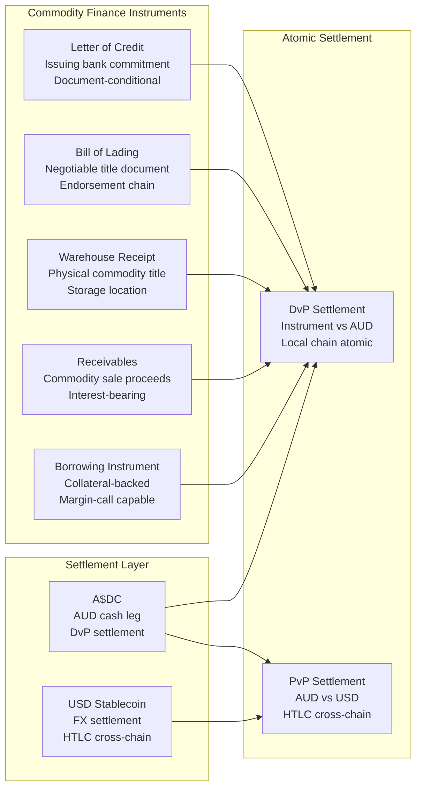
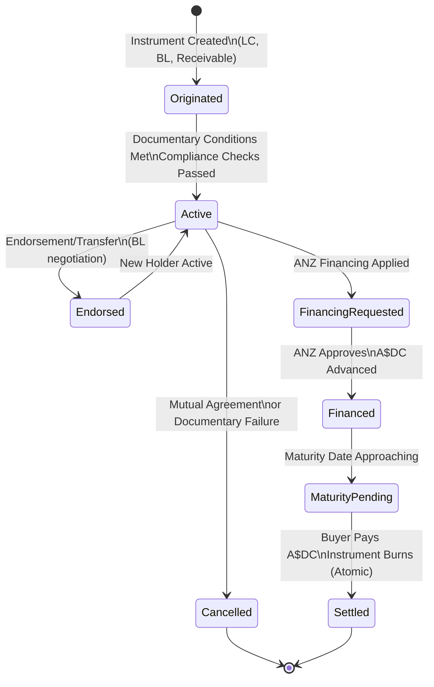
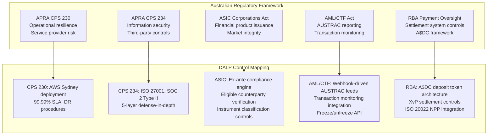
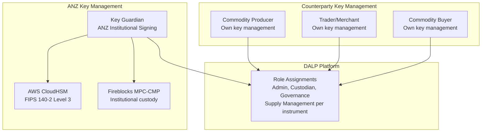
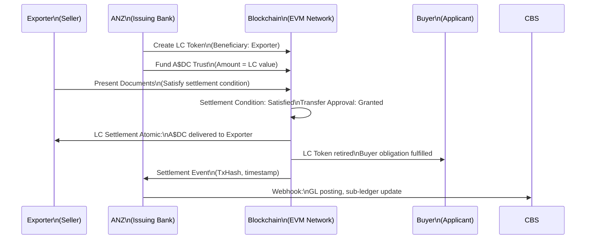
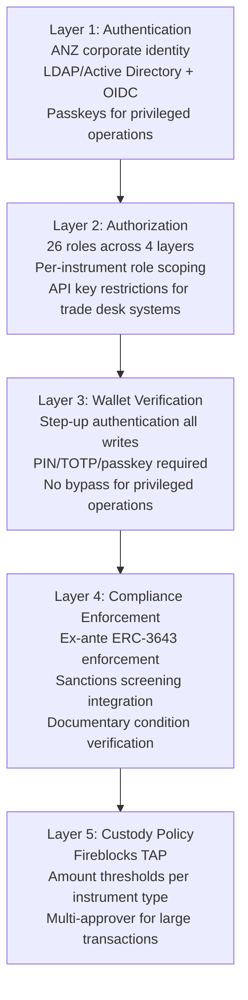
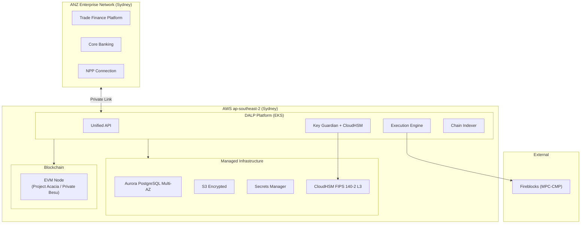
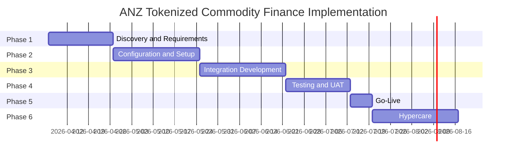

# Technical Proposal: Tokenized Commodity Finance Platform

**Prepared for:** ANZ Banking Group Ltd
**Date:** 20 March 2026
**Version:** 1.0 Draft
**Classification:** SettleMint Confidential. Invited Bidders Only
**Reference:** ANZ-RFP-202603

---

## Table of Contents

1. Cover Page
2. Executive Summary
3. About SettleMint
4. Platform Overview: DALP
5. Solution Architecture
6. Asset Lifecycle Coverage for Commodity Finance
7. Compliance Architecture
8. Integration Architecture
9. Custody and Key Management
10. Settlement and Operations
11. Security Architecture
12. Deployment Options
13. Implementation Approach
14. Support and SLA
15. Reference Projects
16. Regulatory Alignment
17. Response Matrix
18. Appendix A: Risk Register
19. Appendix B: Compliance Module Catalog

---

## 1. Cover Page

**Document Title:** Technical Proposal: Tokenized Commodity Finance Platform
**Client:** ANZ Banking Group Ltd, Australia
**Date:** 20 March 2026
**Version:** 1.0 Draft
**Prepared by:** SettleMint NV
**Classification:** SettleMint Confidential

*This document contains proprietary and confidential information belonging to SettleMint NV. Submitted exclusively in response to ANZ-RFP-202603. Not for distribution.*

---

## 2. Executive Summary

### 2.1 Context

ANZ Banking Group's engagement with digital assets is not theoretical. The institution has made public commitments: the A$DC Australian dollar stablecoin programme, membership in Project Guardian through partnership with Chainlink Labs and ADDX, and explicit executive statements about tokenization's role in cross-border commodity transactions. These commitments establish a clear direction. ANZ is building a tokenized infrastructure capability, not exploring whether to build one.

The tokenized commodity finance programme represents the operational instantiation of that direction. Commodity finance is one of the highest-value use cases for tokenization in Australian banking: trade flows connecting Australian commodity producers (iron ore, LNG, agricultural commodities, base metals) to Asian and global buyers involve complex documentation workflows, multi-party financing structures, and settlement dependencies across jurisdictions. The current manual processes, letter of credit workflows managed through email, fax, and courier; receivables financing that requires physical document originals; reconciliation across correspondent banking relationships using MT-series SWIFT messages, are expensive, slow, and error-prone in ways that tokenization addresses directly.

This proposal responds to that context with a specific technical architecture, a concrete regulatory compliance approach for APRA, ASIC, and RBA oversight, and a delivery plan that builds on SettleMint's production experience in multi-party trade finance, tokenized deposits, and institutional-grade settlement infrastructure.

### 2.2 Why This Programme Is Hard

ANZ's tokenized commodity finance programme is technically and operationally complex for reasons that are specific to the commodity finance use case:

**Multi-party complexity:** Commodity finance transactions involve multiple institutional parties, commodity producer, trader, warehouse operator, shipping company, buyer, correspondent bank, confirming bank, each with their own identity requirements, transfer restrictions, and operational systems. Designing a compliance architecture that enforces eligibility across all parties without creating operational bottlenecks for each party's team requires a platform with genuinely modular compliance controls.

**Documentary evidence requirements:** Commodity finance is document-intensive. Bills of lading, warehouse receipts, inspection certificates, letters of credit, and insurance certificates are the documentary basis for financing decisions. Tokenizing commodity finance requires not just token issuance but the linking of token lifecycle events to document verification, including integration with TradeTrust and AUSTRAC-aligned documentary compliance.

**Cross-border settlement:** Australian commodity exports settle in multiple currencies (AUD, USD, CNY, JPY) across multiple correspondent banking relationships. The A$DC stablecoin programme and Project Guardian participation indicate ANZ's intent to tokenize these settlement flows. The architecture must support atomic cross-currency settlement without recreating correspondent banking's T+2 settlement risk.

**Australian regulatory complexity:** APRA's CPS 230 (operational risk management) and CPS 234 (information security) create specific operational resilience and cybersecurity requirements that go beyond MAS TRM Guidelines in some respects. ASIC's market integrity obligations and the AML/CTF Act's transaction monitoring requirements create a layered compliance environment that must be mapped explicitly to platform controls.

### 2.3 Proposed Response

SettleMint proposes DALP as the governed infrastructure layer for ANZ's tokenized commodity finance programme:

**Commodity Finance Instrument Tokenization:** DALP's configurable token (DALPAsset) architecture represents commodity finance instruments, letters of credit, bills of lading, warehouse receipts, receivables, as configurable tokens with appropriate metadata schemas, lifecycle logic, and compliance controls. Documentary conditions (inspection certificates received, vessel departed, destination customs cleared) can be enforced through DALP's settlement condition compliance module before instrument transfers execute.

**A$DC Stablecoin Integration:** ANZ's A$DC Australian dollar stablecoin is the cash leg for DvP settlement of commodity finance instruments. DALP's deposit token module supports AUD-denominated stablecoin integration as the denomination asset for commodity finance token DvP. The architecture treats A$DC as both a settlement instrument and a liquidity instrument, enabling atomic settlement without correspondent banking intermediation.

**APRA/ASIC/RBA Compliance:** DALP's compliance architecture maps directly to APRA CPS 230 operational risk controls, CPS 234 information security requirements, ASIC's market integrity obligations, and AML/CTF Act transaction monitoring integration. The regulatory alignment table in Section 16 provides explicit control mapping.

**Project Acacia Alignment:** The Reserve Bank of Australia's Project Acacia explores wholesale CBDC and tokenized money infrastructure. DALP's EVM-compatible architecture and XvP settlement capability support Project Acacia-aligned settlement models, including tokenized settlement against a future wholesale CBDC or against the A$DC stablecoin in the interim.

**Australian Domestic Integration:** DALP's ISO 20022-compatible payment rail integration supports connectivity to the New Payments Platform (NPP) for AUD settlement, complementing the on-chain settlement capability with the existing domestic payment infrastructure.

### 2.4 Why SettleMint

SettleMint's case for this procurement rests on three specific credentials:

First, the Reserve Bank of India Innovation Hub's multi-bank letter of credit trade finance deployment demonstrates that DALP can support multi-party, multi-node trade finance workflows at institutional scale with blockchain-enforced documentary compliance. The RBI programme's architecture, multi-bank, fraud-proof, tamper-proof trade finance on a shared network, is structurally comparable to ANZ's commodity finance requirements.

Second, Maybank's Project Photon for FX tokenization and cross-border XvP settlement demonstrates DALP's alignment with central bank digital asset frameworks in a directly comparable programme: a major APAC bank using tokenized local currency (MYRT) for atomic cross-border settlement aligned with the central bank's Digital Asset Innovation Hub. The A$DC programme follows the same architectural logic.

Third, DALP's production deployment with Standard Chartered Bank across Asia, Africa, and the Middle East for fractional tokenization of securities demonstrates the platform's capability in multi-jurisdiction institutional operations with comparable governance and compliance complexity to ANZ's cross-border commodity finance flows.

### 2.5 Document Map

- **Section 3:** About SettleMint
- **Section 4:** Platform Overview: DALP
- **Section 5:** Solution Architecture
- **Section 6:** Commodity Finance Lifecycle Coverage
- **Section 7:** Compliance Architecture (APRA, ASIC, RBA)
- **Section 8:** Integration Architecture (NPP, SWIFT, documentary systems)
- **Section 9:** Custody and Key Management
- **Section 10:** Settlement and Operations (A$DC DvP, XvP)
- **Section 11:** Security Architecture (APRA CPS 234)
- **Section 12:** Deployment Options (AWS Sydney)
- **Section 13:** Implementation Approach
- **Section 14:** Support and SLA
- **Section 15:** Reference Projects
- **Section 16:** Regulatory Alignment (APRA, ASIC, AML/CTF)
- **Section 17:** Response Matrix (TR-01 to TR-20)
- **Appendices A and B**

---

## 3. About SettleMint

### 3.1 Company Overview

SettleMint is the digital asset lifecycle platform company for regulated financial markets and sovereign use cases. Founded nearly a decade ago, SettleMint provides the institutional-grade infrastructure that regulated banks, market infrastructure providers, and sovereign entities need to design, launch, and operate digital assets in production.

SettleMint's focus on production-proven, regulation-compliant deployments distinguishes it from blockchain infrastructure vendors that emphasize protocol innovation over operational reliability. In the financial services environments where SettleMint operates, regulated banks in Singapore, Germany, Japan, and the UAE; sovereign entities in the Middle East; market infrastructure providers in Europe, the difference between theoretical capability and demonstrated production performance is what actually matters to procurement committees.

### 3.2 Asia-Pacific Trade Finance and Settlement Credentials

**Reserve Bank of India Innovation Hub. Multi-Bank Trade Finance:** Multi-bank letter of credit trade finance solution deployed using SettleMint's platform. Multiple banks run their own nodes on a shared network. Chain-code for user management, transaction explorer, and document uploads. Scalable, secure, multi-party trade finance infrastructure, the structural model for ANZ's commodity finance programme with additional parties (producers, traders, warehouse operators) and cross-border settlement requirements.

**Maybank Project Photon. FX Tokenization and XvP Settlement:** MYRT token (tokenized Malaysian Ringgit) issued fully backed by fiat balances, enabling atomic cross-currency swaps with simultaneous settlement of both legs. Aligned with Bank Negara Malaysia's Digital Asset Innovation Hub (DAIH). Direct architectural precedent for ANZ's A$DC-denominated commodity finance settlement, where the tokenized Australian dollar serves the same function as the MYRT in the Maybank programme.

**Standard Chartered Bank. Digital Virtual Exchange:** Fractional tokenization of securities across Asia, Africa, and the Middle East with instant ownership recording and reduced custody intermediaries. Demonstrates multi-jurisdiction institutional capability comparable to ANZ's cross-border commodity finance requirements.

**OCBC Bank Singapore. Security Token Engine:** Multi-year production deployment under MAS regulatory oversight for HNWI investment products. Demonstrates MAS-regulated production capability directly comparable to the Singapore regulatory requirements applicable to cross-border commodity finance flows involving Singapore counterparties.

### 3.3 Certifications

ISO 27001 and SOC 2 Type II certifications confirming independently audited security controls. Both certifications are relevant to APRA CPS 234 vendor risk assessment requirements.

---

## 4. Platform Overview: DALP

### 4.1 What DALP Provides for Commodity Finance

For ANZ's tokenized commodity finance programme, DALP provides:

**Configurable commodity finance instruments:** Letters of credit, bills of lading, warehouse receipts, receivables, and commodity-linked investment instruments configured through instrument templates without custom smart contract development. Each instrument type carries appropriate metadata (commodity type, quantity, grade, warehouse location, vessel identifier, destination port) and is governed by configurable compliance rules reflecting the specific risk profile of the instrument.

**A$DC-compatible deposit token architecture:** DALP's deposit token module represents tokenized Australian dollar balances (A$DC) on-chain as both settlement currency for DvP operations and as liquidity instruments in their own right. The denomination asset linking in DALPAsset establishes the settlement relationship between commodity finance tokens and A$DC at instrument creation time.

**Multi-party compliance enforcement:** DALP's 18 compliance module types enforce eligibility, transfer restrictions, documentary conditions, and settlement requirements across all parties in a commodity finance transaction, producer, trader, financier, buyer, with ex-ante enforcement before each transfer executes.

**Atomic DvP/XvP settlement:** DALP's XvP module provides atomic settlement for commodity finance transactions: instrument and cash change hands simultaneously or both revert. For cross-border transactions (AUD-denominated instrument versus USD-denominated cash), HTLC-based cross-chain settlement provides the same atomicity guarantees.

**Enterprise integration for commodity operations:** REST API, TypeScript SDK, and event webhooks connect DALP to ANZ's commodity finance systems (trade finance platform, documentary credits management, commodity price feeds, AUSTRAC reporting), domestic payment rails (NPP), and international settlement infrastructure (SWIFT MT/MX).

### 4.2 Five Core Lifecycle Pillars Applied to Commodity Finance

**Issuance:** Configure and deploy commodity finance instrument tokens through the Asset Designer wizard. Metadata schemas capture commodity-specific attributes. Compliance controls are bound at creation time. Documentary conditions link instrument issuance to document verification events.

**Compliance:** Ex-ante enforcement through 18 module types including country restrictions (sanctions compliance for commodity destinations), investor/counterparty eligibility, documentary condition verification, and settlement conditions. The compliance engine enforces AML/CTF Act requirements through transaction monitoring integration.

**Custody:** Key management for ANZ's institutional signing with HSM and cloud KMS options. Fireblocks and DFNS integration for institutional-grade MPC custody. The custody model separates ANZ's governance authority (DALP roles) from the cryptographic execution authority (custody provider), creating appropriate separation of duties for APRA-regulated operations.

**Settlement:** Atomic DvP for local (same-chain) instrument-versus-A$DC settlement. HTLC cross-chain for cross-currency settlement against foreign currency stablecoins or CBDCs. ISO 20022 integration for NPP payment leg coordination.

**Servicing:** Automated lifecycle events for commodity finance instruments, interest accrual on receivables financing, documentary condition updates, maturity payments, and instrument retirement on settlement. The on-chain event log provides AUSTRAC-required transaction records.

---

## 5. Solution Architecture

### 5.1 Four-Layer Stack for Commodity Finance

```mermaid
graph TB
    subgraph Application["Application Layer"]
        CF["Commodity Finance Console\nInstrument management, Trade desk, Documentary compliance"]
    end
    subgraph API["API Layer"]
        API["Unified API (OpenAPI 3.1)\nAll commodity finance operations"]
        WH["Event Webhooks\nTrade system integration, AUSTRAC feeds"]
    end
    subgraph Middleware["Middleware Layer"]
        EE["Execution Engine (Restate)\nDurable multi-party workflow orchestration"]
        KG["Key Guardian\nHSM, CloudHSM, Fireblocks MPC-CMP"]
        TS["Transaction Signer\nNonce management, gas pricing"]
        IDX["Chain Indexer\nCommodity finance event projection"]
        FD["Feeds System\nCommodity price feeds, FX rates"]
    end
    subgraph SmartContract["Smart Contract Layer"]
        SP["SMART Protocol (ERC-3643)"]
        IR["Identity Registry (OnchainID)\nCounterparty KYC/KYB"]
        CE["Compliance Engine\nAML/CTF, Country sanctions, Documentary conditions"]
        CF2["Commodity Finance Tokens\nLetters of credit, BLs, Receivables"]
        ADCA["A$DC Settlement\nDeposit token for DvP cash leg"]
        XVP["XvP Settlement\nAtomic DvP + cross-chain HTLC"]
    end
    subgraph Chain["Blockchain Network"]
        BC["EVM Network\nProject Acacia / Private Besu / Public EVM"]
    end

    CF --> API
    API --> EE
    WH --> EE
    EE --> KG
    EE --> TS
    EE --> IDX
    EE --> FD
    TS --> BC
    BC --> IDX
    CF2 --> SP
    CF2 --> IR
    CF2 --> CE
    CF2 --> XVP
    ADCA --> XVP
```

### 5.2 A$DC Stablecoin Architecture

ANZ's A$DC Australian dollar stablecoin programme creates the on-chain cash leg for commodity finance DvP settlement. DALP's deposit token module is the appropriate representation for A$DC in the platform architecture:

**A$DC as denomination asset:** When commodity finance instrument tokens are created in DALP's Asset Designer, the A$DC deposit token is configured as the denomination asset. This establishes the settlement relationship at instrument creation: the commodity instrument is priced in AUD and settled against A$DC. No off-chain foreign exchange is required for AUD-denominated commodity finance.

**A$DC reserve verification:** DALP's collateral requirement compliance module verifies on-chain proof of A$DC reserves before minting commodity finance tokens. This ensures that the on-chain settlement architecture reflects the off-chain reserve position: new instrument tokens are only created when corresponding A$DC settlement capacity exists.

**A$DC interest and yield:** For receivables financing instruments that accrue interest over time, DALP's Fixed Treasury Yield feature calculates and distributes AUD-denominated interest from A$DC reserves, creating an automated interest payment workflow without manual treasury operations.

**Cross-currency settlement:** For commodity transactions settling in foreign currency (USD, CNY, JPY), DALP's XvP HTLC settlement enables atomic cross-currency exchange: the seller receives A$DC while the buyer simultaneously delivers USD stablecoin (or vice versa), with cryptographic atomicity guaranteeing that both legs settle or both revert.

### 5.3 Project Acacia Alignment

The Reserve Bank of Australia's Project Acacia explores wholesale CBDC and tokenized money infrastructure for Australian financial markets. ANZ's participation in Project Acacia through its digital assets programme creates an alignment requirement for the tokenized commodity finance architecture.

DALP's architecture aligns with Project Acacia's design principles:

**EVM-compatible:** Project Acacia infrastructure builds on EVM-compatible networks, consistent with DALP's exclusively EVM-compatible architecture. No protocol translation is required.

**ERC-3643 standard tokens:** Project Acacia's asset tokenization work references the ERC-3643 regulated token standard. DALP's SMART Protocol implements ERC-3643, providing the standard interface that Project Acacia infrastructure participants recognize.

**Tokenized settlement:** Project Acacia explores settlement using tokenized central bank money. DALP's XvP settlement module provides the atomic settlement primitive applicable to both the current (A$DC stablecoin) and future (wholesale CBDC) settlement models, without requiring architectural changes when the RBA issues a wholesale CBDC.

---

## 6. Asset Lifecycle Coverage for Commodity Finance

### 6.1 Commodity Finance Instrument Types

DALP's configurable token architecture represents the following commodity finance instrument categories through custom instrument templates:



### 6.2 Letter of Credit Tokenization

A tokenized letter of credit in DALP represents the issuing bank's commitment to pay the beneficiary upon presentation of compliant documents. The token lifecycle mirrors the traditional LC workflow with on-chain enforcement of documentary conditions:

**Instrument metadata schema:**
- LC reference number (immutable, set at issuance)
- Issuing bank identifier (ANZ BIC or on-chain identity)
- Applicant identity (buyer's OnchainID)
- Beneficiary identity (seller's/exporter's OnchainID)
- Credit amount in denomination asset (A$DC)
- Expiry date (enforced by Maturity Block compliance module)
- Port of loading and destination
- Commodity description, quantity, grade
- Document requirements hash (reference to required documentary package)

**Documentary condition enforcement:** DALP's Settlement Condition compliance module connects the LC token transfer to an external documentary verification service. When the exporter presents documents (bill of lading, inspection certificate, insurance), the verification service confirms document compliance and updates the on-chain condition status. The LC token transfer to the exporter (representing payment) can only execute when the documentary condition is confirmed as satisfied.

**Acceptance workflow:** The transfer approval module implements the acceptance/negotiation workflow. The confirming bank or nominated bank reviews the document presentation and approves or rejects the transfer. The approval record is on-chain with the approver's identity, timestamp, and decision reference, a permanent documentary compliance audit trail.

### 6.3 Bill of Lading Tokenization

A tokenized bill of lading (eBL) represents title to the physical commodity cargo. DALP's configurable token implements the negotiable instrument properties of a paper BL:

**Endorsement chain:** The transfer approval module implements the endorsement workflow. Each transfer of the eBL token from one party to the next (shipper to order, order to consignee) requires explicit endorsement approval. The on-chain endorsement record creates a permanent chain of title from origin to destination.

**TradeTrust integration:** For eBLs requiring TradeTrust compatibility (MLETR-compliant electronic bills of lading under Singapore's Electronic Transactions Act), DALP's API architecture supports integration with TradeTrust's underlying infrastructure for cross-verification. The eBL token's metadata includes the TradeTrust document identifier, enabling cross-reference between the on-chain token and the TradeTrust document registry.

**Possession and title transfer:** DALP's transfer mechanism implements the single-function constraint of negotiable instruments: only one party can hold the BL token at a time. The on-chain transfer is atomic, the previous holder's balance drops to zero and the new holder's balance increases to the full instrument value simultaneously. There is no state where two parties simultaneously hold the same BL token.

### 6.4 Receivables Financing

Commodity receivables, the future payment obligation from a commodity buyer to a commodity seller, are financed by ANZ as the lending bank. The receivables financing instrument tokenizes this three-party relationship:

**Instrument design:** The receivables token represents the buyer's payment obligation, with the commodity seller as the initial token holder and ANZ as the financier (lender). When ANZ finances the receivable, it purchases the receivables token from the seller at a discount, effectively providing working capital to the seller while accepting the buyer's credit risk.

**Interest accrual:** DALP's Fixed Treasury Yield feature calculates daily interest accrual on the financing amount. The buyer's A$DC payment at maturity covers both the principal and accrued interest. The yield schedule is deployed as a separate smart contract linked to the receivables token, with the payment schedule and interest rate configured at instrument creation.

**Maturity settlement:** At the receivable's maturity, the Maturity Redemption feature triggers: the buyer's A$DC transfers to ANZ (the token holder at maturity), and the receivables token burns simultaneously. If the buyer's A$DC treasury is insufficient, the redemption reverts, triggering the default management workflow documented in the operational runbooks.

**Collateral management:** For secured receivables financing, DALP's collateral requirement module verifies on-chain collateral adequacy before advancing additional financing. The collateral ratio is monitored continuously; if the ratio falls below the minimum threshold, the compliance module blocks additional minting until collateral is topped up.

### 6.5 Asset Lifecycle Flow



---

## 7. Compliance Architecture

### 7.1 Australian Regulatory Context

ANZ's tokenized commodity finance programme operates under a layered Australian regulatory framework:

**APRA CPS 230 (Operational Risk Management):** Requires ANZ to maintain effective operational risk management including service provider risk, business continuity, and operational resilience. DALP's deployment architecture (AWS Sydney ap-southeast-2 for data residency), 99.99% uptime SLA, and documented disaster recovery procedures directly address CPS 230 requirements.

**APRA CPS 234 (Information Security):** Requires information security controls appropriate for the information assets managed. DALP's five-layer defense-in-depth architecture, ISO 27001 and SOC 2 Type II certifications, and documented penetration testing programme address CPS 234 requirements. The third-party risk management requirements in CPS 234 are addressed through SettleMint's certification evidence and the documented control boundary between ANZ and SettleMint.

**ASIC Market Integrity:** For commodity finance instruments that constitute financial products under the Corporations Act 2001, ASIC's market integrity requirements apply to issuance, transfer, and trading. DALP's compliance architecture enforces eligibility at the smart contract level, ensuring that transfers of financial product instruments only execute between eligible counterparties.

**AML/CTF Act:** The Anti-Money Laundering and Counter-Terrorism Financing Act 2006 requires financial institutions to identify, monitor, and report suspicious transactions. DALP's integration architecture connects the platform to AUSTRAC's reporting requirements through webhook-driven event delivery to ANZ's AML/CTF compliance platform.

**RBA Payment System Oversight:** The Reserve Bank of Australia oversees payment and settlement systems. For A$DC settlement flows crossing the payment system boundary, the architecture must maintain appropriate oversight and reporting for RBA purposes.



### 7.2 APRA CPS 230 Operational Risk Controls

DALP's architecture directly addresses APRA CPS 230's key requirements:

**Service provider risk:** SettleMint maintains ISO 27001 and SOC 2 Type II certifications, providing independent assurance on information security controls. The service agreement includes APRA-standard service provider provisions: notification of material incidents, audit rights, business continuity requirements, and sub-contractor transparency. Third-party dependencies (AWS, Fireblocks, Restate) are disclosed with associated control mapping.

**Business continuity:** DALP's cloud-native deployment in AWS ap-southeast-2 (Sydney) provides multi-AZ high availability with RTO 2-15 minutes and RPO seconds to 1 minute. The durable workflow execution engine (Restate) ensures that multi-step commodity finance workflows survive infrastructure failures without data loss. Quarterly DR testing validates the recovery procedures.

**Operational resilience:** The five-layer defense-in-depth security architecture, combined with 24/7/365 Enterprise Support monitoring, provides the operational resilience posture that CPS 230 requires for a business-critical financial infrastructure service.

**Change management:** DALP's governance role separation and UUPS proxy upgrade pattern ensure that changes to the commodity finance platform, compliance module updates, smart contract upgrades, workflow configuration changes, are subject to appropriate authorization, testing, and rollback capability before production deployment.

### 7.3 AML/CTF Act Compliance Integration

AUSTRAC's AML/CTF Act creates specific transaction monitoring, suspicious matter reporting, and record-keeping obligations for commodity finance transactions. DALP's integration architecture supports these requirements:

**Transaction monitoring integration:** Every commodity finance instrument transfer generates a structured webhook event with the full transaction context: parties, amounts, instrument type, commodity description, and jurisdiction codes. ANZ's transaction monitoring platform consumes these events through a dedicated webhook subscription and applies its screening rules.

**Suspicious matter reporting:** When ANZ's transaction monitoring platform identifies a suspicious matter, it calls DALP's freeze API to immediately restrict the relevant wallet or instrument. The freeze is executed at the smart contract layer, no further transfers from or to the frozen wallet execute until the compliance hold is lifted. The freeze event is recorded on-chain with timestamp and the compliance team's authorization reference.

**Record keeping:** DALP's immutable on-chain audit trail satisfies AML/CTF Act record-keeping requirements for digital asset transactions. The chain indexer makes the on-chain records queryable through the API for any historical period. Records are retained for the regulatory minimum period (7 years for AML/CTF) through DALP's configurable data retention policies.

**AUSTRAC reporting:** For Threshold Transaction Reports (TTR) and International Funds Transfer Instructions (IFTI) required under the AML/CTF Act, DALP's event export API provides the underlying transaction data in a structured format compatible with AUSTRAC's reporting schema.

### 7.4 Sanctions Screening for Commodity Destinations

Commodity finance involves jurisdictions subject to Australian sanctions (DFAT) and international sanctions (OFAC, UN). DALP's compliance architecture enforces sanctions compliance through multiple controls:

**Country Blocklist module:** Transactions involving counterparties in sanctioned jurisdictions are blocked at the smart contract layer. The country blocklist is updated through the governance role when DFAT or OFAC publish sanctions changes, taking immediate effect on all subsequent transfers.

**Transfer Approval for screening:** For commodity destination countries or counterparties requiring enhanced due diligence, the Transfer Approval module routes the transaction to ANZ's sanctions screening platform before the on-chain transfer executes. The screening result (clear, hold, reject) is recorded as the approval decision with the screening reference.

**Identity verification for counterparties:** All parties to a commodity finance transaction, including commodity producers, traders, warehouse operators, and buyers, must have registered on-chain identities (OnchainID) with verified KYC/KYB claims before receiving instrument tokens. This ensures that every transaction party is identified and screened before any value transfers.

---

## 8. Integration Architecture

### 8.1 Commodity Finance Integration Landscape

```mermaid
graph TB
    subgraph ANZSystems["ANZ Enterprise Systems"]
        TFP["Trade Finance Platform\nLC, documentary credits, BL management"]
        CBS["Core Banking\nAccount management, GL posting"]
        TMS["Treasury Management\nA$DC reserve management, FX"]
        AML["AML/CTF Platform\nAUSTRAC reporting, screening"]
        CPF["Commodity Price Feeds\nLME, CME, SGX data"]
        RPT["Reporting Platform\nASIC, APRA, AUSTRAC reporting"]
    end
    subgraph DALPPlatform["DALP Platform (AWS ap-southeast-2)"]
        API["Unified API\nAll commodity finance operations"]
        WH["Event Webhooks\nReal-time event delivery"]
        FD["Feeds System\nCommodity price integration"]
    end
    subgraph External["External Networks"]
        NPP["NPP (New Payments Platform)\nAUD real-time settlement"]
        SWIFT["SWIFT MT/MX\nInternational correspondent"]
        TT["TradeTrust\neBL document verification"]
        PGA["Project Acacia / Guardian\nCross-network settlement"]
    end

    TFP <-->|Instrument lifecycle\nDocumentary workflows| API
    CBS <-->|Position reconciliation\nSub-ledger events| WH
    TMS <-->|A$DC reserve management\nFX settlement coordination| API
    AML <-->|Transaction monitoring\nFreeze/unfreeze| WH
    CPF -->|Commodity price feeds\nMargin calculation| FD
    RPT <-->|Regulatory data export\nAUSTRAC, ASIC feeds| API
    NPP <-->|AUD payment rail\nISO 20022 NPP messages| API
    SWIFT <-->|International correspondent\nMT700/MT740 mapping| API
    TT <-->|eBL verification\nDocument hash validation| API
    PGA <-->|Cross-network settlement\nProject Acacia interop| API
```



### 8.2 Trade Finance Platform Integration

ANZ's trade finance platform (managing traditional LC, documentary credits, and guarantee workflows) integrates with DALP as the on-chain execution layer:

**LC origination:** When a traditional LC is converted to a tokenized LC in DALP, the trade finance platform provides the LC parameters (parties, amount, expiry, document requirements) to DALP's token creation API. DALP deploys the LC token with the full parameter set and returns the token contract address for the trade finance platform's records.

**Documentary compliance events:** Document presentation events from the trade finance platform (bill of lading received, inspection certificate uploaded, insurance document verified) are delivered to DALP through the API. DALP's documentary condition compliance module updates the on-chain condition status, enabling the LC settlement to proceed when all conditions are satisfied.

**SWIFT MT/MX mapping:** Traditional SWIFT messages (MT700 for LC issuance, MT710 for amendment, MT740 for authorization) are mapped to DALP API calls through the integration layer. The integration preserves the SWIFT message reference in the token metadata, maintaining the link between the tokenized instrument and its traditional documentary record.

### 8.3 New Payments Platform (NPP) Integration

Australia's NPP (New Payments Platform) provides real-time AUD payment settlement. For commodity finance transactions settling in AUD through traditional bank accounts rather than A$DC, the NPP integration coordinates the off-chain cash leg with the on-chain instrument leg:

**Payment confirmation trigger:** When the buyer initiates an NPP payment for commodity finance settlement, the payment confirmation event (delivered through ANZ's core banking system via webhook) triggers the on-chain instrument delivery. The transfer approval module holds the instrument transfer until the NPP payment confirmation is received, ensuring that the off-chain cash leg and on-chain instrument leg are coordinated even when they occur on different rails.

**NPP reference tracking:** The NPP payment reference is recorded in the DALP transfer approval record, creating a cross-reference between the on-chain event and the traditional payment system record. This cross-reference supports reconciliation between ANZ's core banking position records and the DALP event log.

**Overlay services:** NPP's PayID and PayTo overlay services can be configured to trigger DALP API calls for specific payment scenarios, enabling commodity counterparties to initiate instrument transfers through familiar NPP payment interfaces rather than requiring direct blockchain interaction.

### 8.4 Commodity Price Feeds

Commodity finance instruments are priced against physical commodity markets. DALP's Feeds System integrates with commodity price data sources:

**LME/CME data integration:** London Metal Exchange (for base metals) and CME Group (for energy and agricultural commodities) price feeds deliver reference prices to DALP's Feeds System. These prices are used for: collateral ratio calculation (margin-backed financing), instrument NAV tracking, and maturity payout calculation for price-linked instruments.

**Margin call mechanics:** For collateral-backed commodity financing where the collateral value fluctuates with commodity prices, DALP's Collateral Ratio compliance module continuously monitors the collateral coverage ratio. If prices move and the ratio falls below the minimum threshold, the compliance module blocks additional financing until additional collateral is posted.

**Price staleness alerts:** The feeds system tracks the age of the most recent price update. Stale price alerts notify operations teams when a commodity price feed has not updated within the configured threshold, preventing collateral calculations from relying on outdated market data.

---

## 9. Custody and Key Management

### 9.1 Key Guardian for Commodity Finance Operations

For ANZ's commodity finance programme, the Key Guardian configuration must reflect the operational characteristics of a multi-party trade finance workflow where multiple institutional entities each hold custody of their own signing keys:



**ANZ as issuing bank:** ANZ holds the Supply Management role for instruments it issues (letters of credit, receivables financing). ANZ's Key Guardian configuration (CloudHSM-backed for high-value operations, Fireblocks MPC-CMP for institutional-grade custody) manages ANZ's signing keys for issuance operations.

**Counterparty key management:** Commodity producers, traders, and buyers manage their own cryptographic keys through their own wallet infrastructure. DALP does not manage counterparty keys; it validates counterparty identities through the OnchainID system and enforces compliance at the protocol level regardless of how counterparties manage their own keys.

**Role isolation:** Each commodity finance instrument has its own role set. The governance role (for ANZ's compliance configuration changes), the supply management role (for minting and burning), the custodian role (for forced transfers and freezes), and the emergency role (for circuit-breaker pause) are independently assigned and cannot be combined in a single wallet. This implements the separation of duties required by APRA CPS 230.

### 9.2 APRA CPS 234 Key Management Requirements

CPS 234's information security requirements apply directly to cryptographic key management:

**Key material security:** HSM-backed or cloud KMS-backed key material never exposes plaintext to application-layer processes. FIPS 140-2 Level 3 CloudHSM provides the hardware security boundary required for APRA-regulated operations.

**Key rotation:** Production signing keys rotate at least annually through DALP's documented key rotation procedure. Rotation is a durable Restate workflow ensuring consistency through infrastructure events. Rotation coordinates with Fireblocks TAP policy updates.

**Key recovery:** Enterprise deployment uses sharded key backup with threshold signature requirements. Recovery procedures are documented in ANZ's operational runbooks and tested as part of the quarterly DR programme.

**Audit logging:** Every key lifecycle event, generation, rotation, revocation, signature request, access denial, is logged with operator identity, timestamp, and outcome. Logs are retained for the APRA-required period and accessible for audit review.

---

## 10. Settlement and Operations

### 10.1 Commodity Finance Settlement Models

Commodity finance transactions involve multiple settlement scenarios depending on instrument type, counterparty, and currency:

**Model 1: Local A$DC DvP (AUD-denominated commodity finance)**
ANZ issues a letter of credit in A$DC. The exporter presents documents and the LC settles atomically: the LC token transfers to the exporter while A$DC transfers from the LC trust account to the exporter's wallet simultaneously. T+0, atomic, no counterparty risk.



**Model 2: Cross-Chain FX Settlement (AUD vs USD)**
For commodity transactions settling across currency jurisdictions, DALP's XvP HTLC settlement provides atomic cross-chain execution: the AUD leg (A$DC) and the USD leg (USD stablecoin) settle simultaneously or both revert. Neither party faces settlement risk.

**Model 3: NPP-Coordinated Settlement (Traditional AUD + Instrument)**
For counterparties not yet operating A$DC wallets, the NPP payment coordination pattern handles off-chain cash leg and on-chain instrument transfer. The transfer approval module waits for NPP payment confirmation before releasing the instrument token. Both legs complete, but with NPP settlement timing (near-real-time for NPP transactions).

### 10.2 Reconciliation Architecture

Commodity finance reconciliation involves multiple data dimensions:

**On-chain instrument position:** The DALP Chain Indexer provides deterministic instrument position for each token at any block height. Instrument tokens cannot be in ambiguous states, they are either held by a specific wallet address with a specific balance, or they are not.

**Off-chain GL reconciliation:** Every instrument lifecycle event (creation, transfer, settlement, retirement) generates a structured webhook event. ANZ's core banking system consumes these events and generates corresponding GL postings. The event log provides deterministic input for automated reconciliation.

**Documentary compliance reconciliation:** For documentary-condition-enforced instruments, the documentary compliance status is maintained both on-chain (condition state in the smart contract) and off-chain (trade finance platform records). The integration layer reconciles these states daily, surfacing any discrepancies for operations team investigation.

**A$DC reserve reconciliation:** A$DC balances in the on-chain settlement accounts reconcile daily against ANZ's Treasury Management System A$DC reserve records. Any discrepancy between on-chain A$DC balance and TMS reserve record triggers an operations alert for immediate investigation.

### 10.3 Operational Dashboards

**Commodity Finance Dashboard:** Active instruments by type (LC, BL, receivables), total on-chain value, pending settlement queue, documentary condition status, and instruments approaching maturity.

**Settlement Queue:** Active XvP settlements, HTLC expiry timelines, counterparty confirmation status, and failed settlement alerts. Operations teams can monitor settlement progress and intervene before HTLC expiry.

**Documentary Compliance Queue:** LC instruments with pending documentary condition verification, document presentation waiting for trade desk review, and instruments where documentary conditions are unsatisfied approaching expiry.

**AML/CTF Monitor:** Transaction screening results, suspended instruments, freeze events with compliance reference, and AUSTRAC reporting queue status.

---

## 11. Security Architecture

### 11.1 Five-Layer Defense-in-Depth



### 11.2 APRA CPS 234 Security Architecture

CPS 234 requires ANZ to maintain information security capabilities commensurate with the information assets managed. For the tokenized commodity finance platform, the key CPS 234 requirements map to DALP controls as follows:

**Security governance:** SettleMint maintains ISO 27001 ISMS governance. The ISMS covers all DALP development, operations, and customer data processing. Annual external audits confirm continued adherence. The ISO 27001 certificate is available for ANZ's vendor risk assessment.

**Penetration testing:** Regular penetration testing of the DALP platform by independent security firms. Test results and remediation evidence are available for ANZ's InfoSec review under NDA.

**Incident management:** DALP's observability stack (metrics, logs, traces) and Enterprise Support team provide 24/7 incident detection and response. P1 Critical incidents receive 15-minute response and 2-hour resolution targets. Post-incident root cause analysis is provided within 5 business days for P1/P2 incidents, consistent with CPS 234's notification requirements.

**Third-party risk:** Documented control boundaries for all third-party dependencies (AWS, Fireblocks, Restate). AWS CPS 234 attestation letter covers the infrastructure layer. Fireblocks SOC 2 Type II covers the custody layer. SettleMint's ISO 27001 covers the platform layer.

### 11.3 Smart Contract Security

All DALP smart contracts are built on the SMART Protocol (ERC-3643), an independently audited open standard. The UUPS proxy upgrade pattern requires explicit governance role authorization for any contract upgrade, preventing unauthorized modification of commodity finance instrument logic. The governance role for ANZ's deployment requires wallet verification plus Fireblocks TAP approval for contract changes, creating a two-layer approval requirement that satisfies CPS 234's change management security requirements.

---

## 12. Deployment Options

### 12.1 Recommended: AWS Sydney (ap-southeast-2)

For ANZ's tokenized commodity finance programme, SettleMint recommends Managed Private Cloud deployment in AWS Sydney (ap-southeast-2). This configuration:
- Satisfies APRA data residency requirements (Australian data sovereign territory)
- Meets APRA CPS 234 infrastructure security requirements through AWS's APRA compliance attestation
- Provides multi-AZ high availability with RTO 2-15 minutes
- Enables connectivity to NPP payment rails through ANZ's existing AWS Sydney infrastructure
- Supports disaster recovery within Australian jurisdiction (no data crossing sovereign borders)



### 12.2 On-Premises Alternative

For ANZ teams that require full infrastructure control consistent with APRA requirements, DALP supports on-premises deployment on ANZ's own Kubernetes infrastructure within Australian data centers. This configuration satisfies the most stringent APRA data sovereignty requirements.

---

## 13. Implementation Approach

### 13.1 Phase-Gated Methodology



**Total: 19 weeks**

### 13.2 Phase Descriptions

**Phase 1 (Weeks 1-3). Discovery and Requirements:**
- Regulatory mapping: APRA CPS 230/234, ASIC, AML/CTF Act requirements to DALP controls
- Commodity finance instrument scope: which instrument types, which counterparty segments, which settlement models
- Integration landscape assessment: Trade Finance Platform, NPP connectivity, AML/CTF platform, AUSTRAC reporting
- A$DC architecture confirmation: reserve management model, cross-currency settlement scope
- Project Acacia alignment: current state of RBA programme and interoperability requirements
- Security architecture design: CloudHSM configuration, Fireblocks TAP policies

**Phase 2 (Weeks 4-7). Configuration and Setup:**
- AWS ap-southeast-2 environment provisioning (development, staging, production)
- Blockchain network setup (Project Acacia-aligned EVM or private Besu)
- Instrument template configuration: LC, BL, warehouse receipts, receivables
- Compliance module deployment: sanctions country blocklist, AML/CTF integration, documentary conditions
- A$DC deposit token deployment and reserve management configuration
- Key Guardian configuration with CloudHSM and Fireblocks

**Phase 3 (Weeks 8-11). Integration Development:**
- Trade Finance Platform integration: LC origination, documentary compliance events, SWIFT mapping
- NPP integration: payment confirmation webhooks, PayTo overlay
- AML/CTF platform integration: real-time event delivery, freeze/unfreeze API
- AUSTRAC reporting pipeline: event export configuration, TTR and IFTI data mapping
- Commodity price feed integration: LME/CME price data, staleness monitoring
- Project Acacia/TradeTrust integration connectivity

**Phase 4 (Weeks 12-14). Testing and UAT:**
- Instrument lifecycle functional testing: LC, BL, receivables creation through settlement
- Documentary compliance scenarios: presentation, acceptance, rejection, amendment
- Sanctions screening validation: blocked jurisdiction reverts, manual review workflow
- Cross-currency XvP settlement testing
- AML/CTF integration testing: suspicious matter freeze, AUSTRAC reporting
- NPP coordination testing: payment confirmation timing, reconciliation validation
- Performance testing at ANZ trade finance volumes
- APRA CPS 234 security validation and penetration testing

**Phase 5 (Week 15). Go-Live:**
Controlled production deployment with dedicated go-live support team. Initial instrument types: letters of credit and receivables (lower complexity). BL tokenization in Phase 2 of go-live (after initial stabilization).

**Phase 6 (Weeks 16-19). Hypercare:**
Intensive post-go-live support, performance optimization, and knowledge transfer to ANZ's trade finance operations team.

### 13.3 RAID Summary

Key risks for ANZ's programme:

| Risk | Mitigation |
|------|-----------|
| APRA vendor risk assessment timeline | Early engagement with ANZ InfoSec and APRA Regulatory Affairs; SettleMint ISO 27001 and SOC 2 Type II accelerate the process |
| A$DC programme dependencies | Confirm A$DC reserve management model and on-chain representation before Phase 2; alternative settlement model (NPP-coordinated) available if A$DC not production-ready |
| TradeTrust eBL interoperability | Phase the scope: LC and receivables first (no TradeTrust dependency); eBL with TradeTrust integration in subsequent phase |
| Project Acacia interoperability | Design for interoperability without hard dependency; DALP's ERC-3643 and XvP architecture are Project Acacia-compatible without requiring confirmed RBA CBDC commitment |
| NPP API access and documentation | Early engagement with ANZ's domestic payments team and NPP connectivity team in Phase 1 |
| Multi-counterparty onboarding | Phased counterparty onboarding: start with ANZ's internal counterparties, expand to third-party producers and traders in subsequent phases |

---

## 14. Support and SLA

### 14.1 Enterprise Support for APRA-Regulated Operations

Enterprise Support (24/7/365, 99.99% SLA, 15-minute P1 response) is the appropriate tier for ANZ's tokenized commodity finance programme given APRA's operational resilience requirements.

| Severity | Classification | Response | Resolution |
|----------|---------------|----------|-----------|
| P1 Critical | Production down, compliance bypass, settlement failure | 15 minutes | 2 hours |
| P2 High | Major degradation, documentary compliance failure | 1 hour | 4 hours |
| P3 Medium | Workaround available | 4 hours | 2 business days |
| P4 Low | Minor, cosmetic | 1 business day | 3 business days |

### 14.2 APRA Incident Notification

For P1 Critical incidents affecting the production commodity finance platform, SettleMint commits to:
- Immediate notification to ANZ's designated incident contacts
- Status updates every 30 minutes until resolution
- Root cause analysis within 5 business days
- Preventive action implementation with evidence

These commitments align with APRA's incident notification requirements for material operational incidents at regulated entities.

---

## 15. Reference Projects

| Institution | Region | Use Case | Status |
|-------------|--------|----------|--------|
| OCBC Bank | Singapore | Security token engine: HNWI/HENRY wealth products | Production |
| KBC Securities (Bolero) | Belgium | Equity crowdfunding + SME loans; smart contracts | Production |
| KBC Insurance | Belgium | NFT product passports for insured assets | Production |
| Standard Chartered Bank | Asia/MENA | Digital Virtual Exchange; fractional tokenization | Production |
| Reserve Bank of India Innovation Hub | India | Multi-bank letter of credit trade finance | Production |
| Sony Bank (Sony Group) | Japan | Stablecoin with digital identity; KYC-enabled banking | Phase 1 Production |
| State Bank of India | India | CBDC infrastructure | Pilot complete, production in progress |
| Islamic Development Bank | Multilateral | Sharia-compliant subsidy distribution | Production |
| Mizuho Bank | Japan | Bond tokenization and trade finance | PoC complete, production planning |
| Islamic Development Bank (market stabilization) | Multilateral | Automated market stabilization | Production |
| Maybank (Project Photon) | Malaysia | FX tokenization; cross-border XvP; DAIH alignment | Production |
| ADI Finstreet | UAE | Tokenized equity; DFNS/Fireblocks custody | Production |
| Commerzbank | Germany | Hybrid ETP issuance; settlement under 10 seconds | Production |
| Saudi RER | Saudi Arabia | Country-scale real estate tokenization | Production |

### 15.2 Reserve Bank of India: Multi-Bank Trade Finance (Primary Case Study)

**Relevance:** The most directly comparable production reference for ANZ's commodity finance use case. Multi-bank, multi-party trade finance workflow at institutional scale with blockchain-enforced documentary compliance.

**Scope:** SettleMint deployed multi-bank letter of credit trade finance infrastructure for the Reserve Bank of India Innovation Hub. Multiple Indian banks run their own nodes on a shared network. The platform provides chain-code for user management, a transaction explorer, document uploads, and secure UIs for both banks and corporate customers.

**Architecture:** Multi-node, multi-cloud infrastructure deployed using SettleMint's platform. Fraud-proof, tamper-proof workflow ensures that letter of credit documentary conditions are enforced on-chain before settlement executes. Multiple banks participate as peers with isolated node operations but shared transaction visibility.

**Transfer to ANZ programme:** The multi-bank LC workflow architecture directly maps to ANZ's commodity finance requirements. The key structural difference is the addition of commodity-specific instrument types (BL, warehouse receipts) and cross-currency settlement (A$DC vs. foreign currency stablecoins). The documentary compliance enforcement model, conditions verified before settlement executes, is identical.

### 15.3 Maybank Project Photon: Cross-Border XvP Settlement (Case Study)

**Relevance:** Direct architectural precedent for ANZ's A$DC cross-currency settlement requirements.

**Scope:** MYRT tokenized Malaysian Ringgit enabling atomic cross-currency swaps in alignment with Bank Negara Malaysia's DAIH framework. The programme demonstrates the exact settlement model proposed for ANZ's commodity finance: a tokenized local currency as the settlement instrument, atomic DvP settlement without correspondent banking intermediation, and central bank digital asset framework alignment.

**Transfer:** A$DC serves the same function as MYRT in this architecture. The HTLC cross-chain settlement between A$DC and foreign currency instruments uses the same mechanism as Maybank's cross-currency settlement. ANZ's Project Acacia alignment plays the same structural role as DAIH in the Maybank programme.

---

## 16. Regulatory Alignment

### 16.1 APRA, ASIC, AML/CTF Control Mapping

| Requirement | Description | DALP Control | Evidence |
|------------|-------------|--------------|----------|
| APRA CPS 230: Operational resilience | Maintain effective operational risk management | AWS Sydney Multi-AZ; RTO 2-15 min; RPO seconds; Enterprise SLA 99.99%; quarterly DR testing | Architecture docs; SLA commitment; DR test records |
| APRA CPS 230: Service provider risk | Manage outsourcing and service provider risk | ISO 27001 and SOC 2 Type II; APRA-standard service provisions; full third-party dependency register | Certificates; dependency register |
| APRA CPS 234: Information security | Information security capabilities commensurate with information assets | Five-layer defense-in-depth; CloudHSM key management; annual penetration testing; ISO 27001 | Security architecture; penetration test reports |
| APRA CPS 234: Third-party security | Assess and manage third-party information security | AWS APRA attestation; Fireblocks SOC 2 Type II; Restate enterprise SLA | Third-party certificates |
| ASIC Corporations Act: Financial product issuance | Comply with financial product issuance requirements | Ex-ante eligibility enforcement; transfer restrictions; investor count limits | Compliance module configuration |
| ASIC Market Integrity: On-market transfers | Market integrity for secondary transfers | Compliance-checked transfers; transfer approval module; identity verification | On-chain compliance events |
| AML/CTF Act: Transaction monitoring | Monitor and report suspicious transactions | Webhook-driven AML platform integration; real-time freeze API; AUSTRAC reporting pipeline | Integration architecture; freeze event log |
| AML/CTF Act: Customer identification | Know Your Customer for all parties | OnchainID identity verification required for all transfers; KYC/KYB claim requirement | Identity registry; compliance event log |
| AML/CTF Act: Record keeping | Retain transaction records for minimum period | Immutable on-chain audit trail; configurable 7-year retention policy; deterministic event export | Audit trail documentation; retention configuration |
| RBA Payment Oversight: Settlement | Settlement system controls for tokenized payment | A$DC deposit token architecture; ISO 20022 NPP integration; atomic DvP settlement | Settlement architecture; NPP integration design |
| DFAT Sanctions: Commodity destinations | Screen commodity transactions for sanctioned jurisdictions | Country Blocklist module; Transfer Approval for enhanced due diligence; real-time screening integration | Compliance module config; screening integration |

---

## 17. Response Matrix

| Req ID | Requirement | Status | Response |
|--------|------------|--------|----------|
| TR-01 | End-to-end lifecycle for tokenized commodity finance | Supported | Complete lifecycle from instrument creation (LC, BL, receivables) through settlement and retirement. Documentary condition verification, maturity redemption, and cross-currency settlement all supported |
| TR-02 | Maker-checker, delegated authority, segregation of duties | Supported | Transfer Approval module; 26 roles enforcing separation; custodian/governance/emergency role separation per APRA CPS 230 |
| TR-03 | APIs, events, batch interfaces, message standards | Supported | OpenAPI 3.1; TypeScript SDK; event webhooks; ISO 20022 for NPP and SWIFT integration |
| TR-04 | APRA, ASIC, AML/CTF alignment, audit evidence | Supported | Section 16 provides comprehensive control mapping. APRA CPS 230/234 directly addressed. AML/CTF integration documented |
| TR-05 | Identity, KYC/KYB, jurisdictional eligibility | Supported | OnchainID identity framework; KYC/KYB claim requirement for all parties; country restrictions for commodity destination sanctions |
| TR-06 | Key management, HSM, signing policy, break-glass | Supported | Key Guardian with AWS CloudHSM (FIPS 140-2 L3); Fireblocks MPC-CMP; break-glass procedures; multi-approver for high-value operations |
| TR-07 | Reconciliation across digital asset events, GL | Supported | On-chain source of truth; webhook-driven GL reconciliation; A$DC reserve reconciliation; documentary compliance reconciliation |
| TR-08 | Operational dashboards, alerting, evidence export | Supported | Commodity finance dashboards; settlement queue; documentary compliance queue; AML/CTF monitor; AUSTRAC reporting export |
| TR-09 | Deployment flexibility, data residency | Supported | AWS ap-southeast-2 (Sydney) recommended; on-premises available; all data within Australian jurisdiction |
| TR-10 | APAC regulated institution references | Supported | RBI trade finance (primary); Maybank Project Photon (XvP); OCBC Singapore (MAS); Standard Chartered APAC |
| TR-11 | Programmable controls: entitlement rules, settlement conditions | Supported | 18 compliance module types; documentary condition module; settlement condition module; collateral ratio module |
| TR-12 | Testing: SIT, UAT, performance, failover, cyber tabletop | Supported | Section 13 covers comprehensive test programme including APRA-specific scenarios |
| TR-13 | Integration with trade finance, NPP, AUSTRAC reporting | Supported | Section 8 covers Trade Finance Platform, NPP, AML/CTF, AUSTRAC, commodity price feeds |
| TR-14 | Data model extensibility | Supported | Configurable instrument templates; custom metadata schemas; no custom code for new instrument types |
| TR-15 | Records retention, evidentiary integrity | Supported | Immutable on-chain audit trail; 7-year AML/CTF retention policy; deterministic event export |
| TR-16 | Third-party risk transparency | Supported | Full dependency register; ISO 27001, SOC 2 Type II; AWS, Fireblocks, Restate dependencies documented |
| TR-17 | Business continuity, RTO/RPO, DR | Supported | RTO 2-15 minutes; RPO seconds; AWS Multi-AZ; quarterly DR testing consistent with APRA CPS 230 |
| TR-18 | Commercial scaling | Supported | Environment-based licensing; no transaction fees; new instrument types via configuration |
| TR-19 | Release management, change governance | Supported | UUPS governance; staged rollouts with ANZ approval gate; APRA CPS 230 change management procedures |
| TR-20 | Future roadmap | Supported with narrative | Live capabilities clearly identified; Project Acacia CBDC alignment described as roadmap dependency (Project Acacia timeline outside SettleMint's control); all current capabilities in production |

---

## 18. Appendix A: Risk Register

| Risk ID | Category | Description | Likelihood | Impact | Mitigation |
|---------|----------|-------------|-----------|--------|-----------|
| R-001 | Regulatory | APRA vendor risk assessment for SettleMint requires extended review period due to APRA requirements | Medium | High | Early engagement with ANZ InfoSec; SettleMint certifications accelerate; provide APRA-specific attestation letter |
| R-002 | Technical | A$DC on-chain reserve management model not production-ready at programme start | Medium | High | Alternative: NPP-coordinated settlement model operational from go-live; A$DC DvP added when A$DC production-ready |
| R-003 | Integration | SWIFT MT/MX to DALP API mapping more complex than estimated for specific LC types | Medium | Medium | Phase 3 contingency buffer; mock SWIFT interfaces for parallel testing |
| R-004 | Regulatory | ASIC interpretation of tokenized LC as financial product requiring prospectus | Low | High | Early legal review in Phase 1; compliance configuration does not predetermine regulatory classification |
| R-005 | Technical | TradeTrust eBL interoperability requires external network dependencies | Medium | Medium | Phased scope: LC and receivables first; BL/TradeTrust in subsequent phase |
| R-006 | Operational | Commodity counterparty onboarding (producers, traders) requires identity registration for multiple new entities | Medium | Medium | Phased counterparty onboarding; batch identity registration API for multiple onboarding |
| R-007 | Technical | Project Acacia RBA CBDC timeline uncertainty | High | Low | Architecture designed for A$DC interrim; Project Acacia compatibility without hard dependency |
| R-008 | Regulatory | AML/CTF Act commodity-specific screening rules require custom AUSTRAC reporting formats | Low | Medium | Early AUSTRAC reporting design in Phase 1; standard event export API accommodates custom format mapping |

---

## 19. Appendix B: Compliance Module Catalog

*Full 18-module catalog as defined in DALP. Key modules for ANZ commodity finance:*

**Documentary Condition Module** (Settlement and Collateral category): Requires specific on-chain documentary conditions to be satisfied before instrument transfer executes. Directly supports LC documentary compliance requirements and BL endorsement conditions.

**Collateral Ratio Module** (Settlement and Collateral category): Continuously monitors collateral coverage for commodity-backed financing instruments. Blocks additional financing when commodity price movements reduce collateral coverage below the minimum threshold.

**Country Blocklist Module** (Restriction category): Enforces DFAT and OFAC sanctions by blocking transfers involving counterparties in prohibited jurisdictions. Applies to commodity destination countries and counterparty domicile jurisdictions.

*Full catalog with all 18 modules available in detailed technical annex.*

---

*End of Technical Proposal: ANZ Banking Group. Tokenized Commodity Finance Platform*
*Document version: 1.0 Draft | Prepared: 20 March 2026 | SettleMint Confidential*
