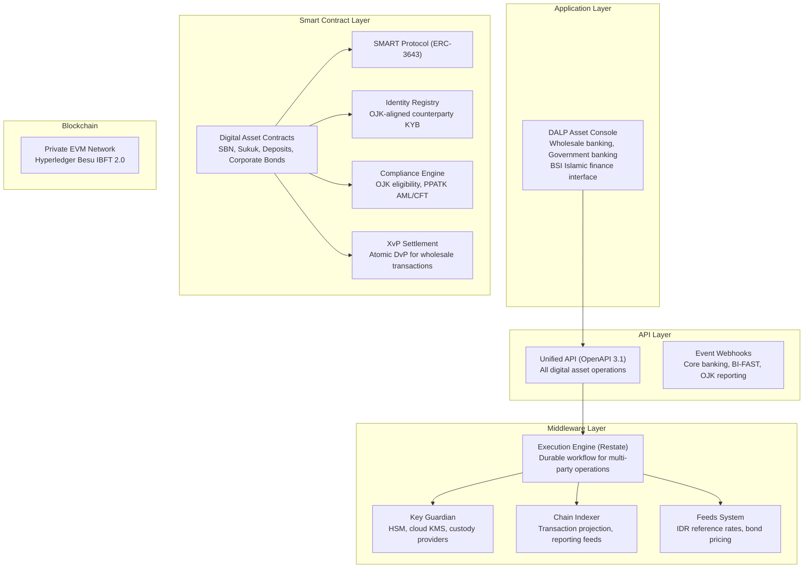
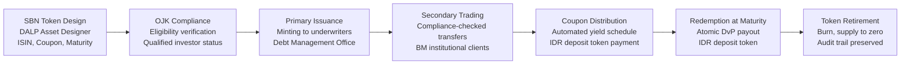
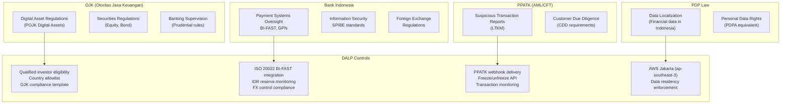
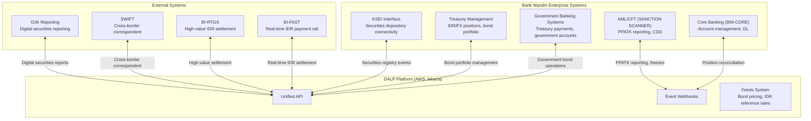
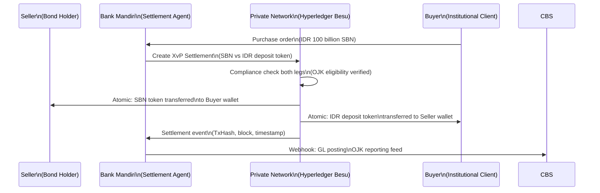
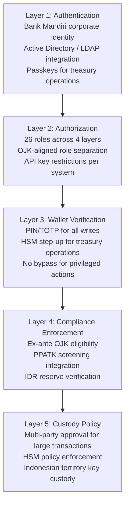
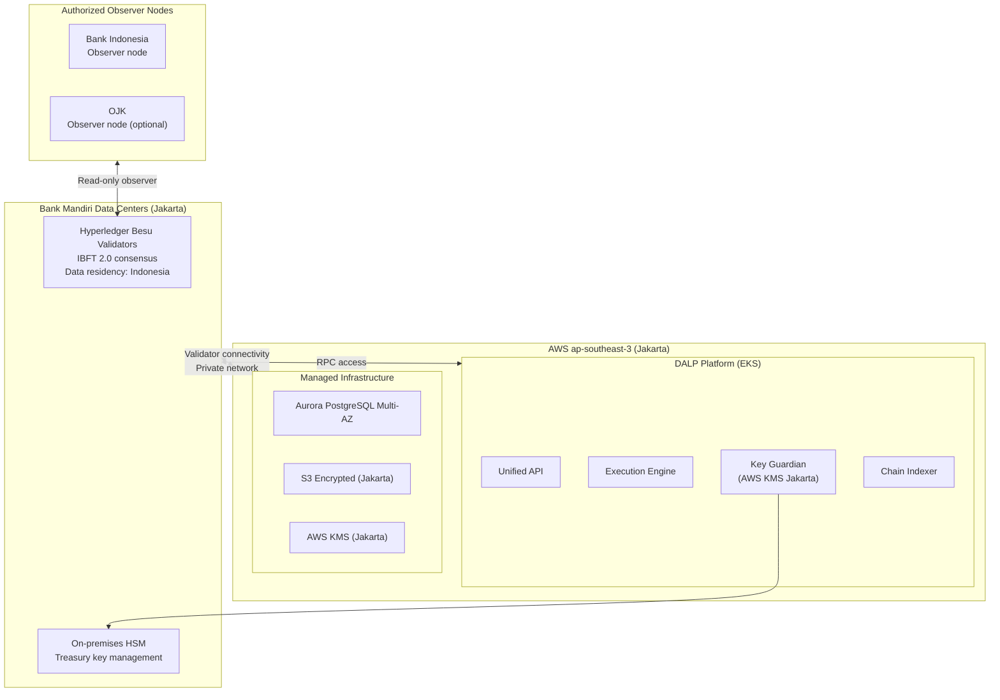
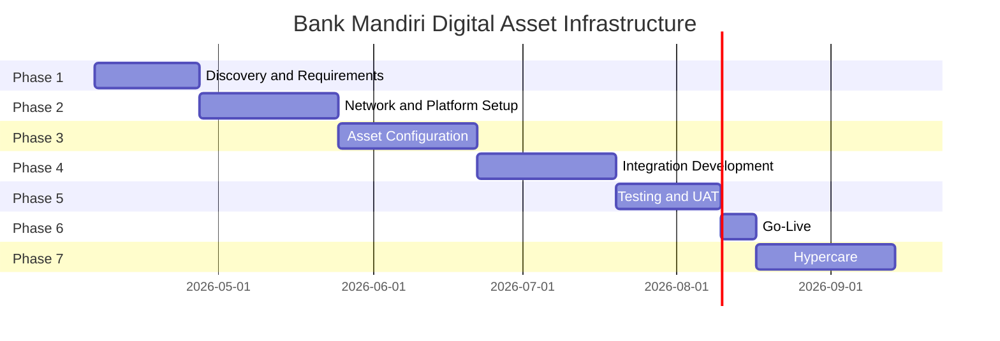

# Technical Proposal: Digital Asset Infrastructure Platform

**Prepared for:** PT Bank Mandiri (Persero) Tbk
**Date:** 20 March 2026
**Version:** 1.0 Draft
**Classification:** SettleMint Confidential. Invited Bidders Only
**Reference:** BANK-MANDIRI-RFP-202603

---

## Table of Contents

1. Cover Page
2. Executive Summary
3. About SettleMint
4. Platform Overview: DALP
5. Solution Architecture
6. Asset Lifecycle Coverage
7. Compliance Architecture
8. Integration Architecture
9. Custody and Key Management
10. Settlement and Operations
11. Security Architecture
12. Deployment Options
13. Implementation Approach
14. Support and SLA
15. Reference Projects
16. Regulatory Alignment
17. Response Matrix
18. Appendix A: Risk Register
19. Appendix B: Compliance Module Catalog

---

## 1. Cover Page

**Document Title:** Technical Proposal: Digital Asset Infrastructure Platform
**Client:** PT Bank Mandiri (Persero) Tbk, Indonesia
**Date:** 20 March 2026
**Version:** 1.0 Draft
**Prepared by:** SettleMint NV
**Classification:** SettleMint Confidential

---

## 2. Executive Summary

### 2.1 Context

Bank Mandiri occupies a unique position in Indonesia's financial system: as the country's largest state-owned bank, it operates at the intersection of sovereign mandate and commercial banking, serving both government entities and the full spectrum of corporate and retail customers across Indonesia's 17,000 islands. This institutional position creates both opportunity and responsibility for digital asset infrastructure.

The opportunity is substantial. Indonesia's Bank Indonesia has actively explored wholesale digital currency infrastructure. OJK's progressive regulatory approach to digital assets creates a framework within which Indonesia's largest bank can build institutional-grade digital asset capability. BI-FAST, Indonesia's real-time payment infrastructure, provides the domestic payment backbone against which digital asset settlement can be coordinated. Bank Mandiri's scale, assets exceeding IDR 1,800 trillion, branches across all 34 provinces, and significant Islamic banking operations through Bank Syariah Indonesia, makes it the natural anchor for Indonesia's wholesale digital asset ecosystem.

The responsibility is equally significant. A digital asset infrastructure failure at Bank Mandiri would have systemic implications for Indonesia's financial sector. This means that the platform chosen for this programme must meet a higher standard than typical commercial bank deployments: governance clarity that satisfies OJK's supervisory expectations, security architecture that meets BI's information security requirements, data localization that complies with Indonesia's Personal Data Protection Law (PDP Law), and operational resilience that withstands the scrutiny of a systemically important financial institution.

SettleMint's DALP platform, refined through production deployments with regulated banks in Singapore, Japan, the United Kingdom, Germany, and the Middle East, provides the institutional-grade infrastructure that Bank Mandiri's programme requires.

### 2.2 Why This Programme Is Hard

Bank Mandiri's digital asset infrastructure programme is complex for several Indonesia-specific reasons:

**Regulatory multiplicity:** Indonesia's digital asset regulatory landscape involves multiple supervisors. OJK regulates banking operations and securities products. Bank Indonesia oversees monetary policy, payment systems, and foreign exchange. BAPPEBTI (Commodity Futures Trading Regulatory Agency, now transitioning to OJK oversight) regulates crypto-asset trading. The PDP Law creates data protection obligations. Each supervisor has its own reporting requirements, audit expectations, and enforcement mechanisms. Designing a compliance architecture that satisfies all simultaneously requires genuine modularity.

**Data localization:** Indonesia's PDP Law and BI regulations create data localization requirements that are stricter than many jurisdictions. Customer data, transaction records, and financial data must reside within Indonesian territory. This constrains cloud deployment choices to Indonesian-region availability zones and eliminates certain global managed service configurations.

**BI-FAST integration:** Bank Mandiri is a major participant in Indonesia's BI-FAST real-time payment system. Digital asset settlement workflows must coordinate with BI-FAST for IDR payment legs, creating integration requirements specific to Indonesia's domestic payment infrastructure.

**Islamic finance considerations:** Bank Mandiri's significant Sharia-compliant banking operations through Bank Syariah Indonesia (BSI) create requirements for Sharia-compliant digital asset structures in relevant product categories.

**State ownership context:** As a state-owned enterprise (Persero), Bank Mandiri operates under additional governance oversight from the Ministry of State-Owned Enterprises (BUMN). Procurement decisions at this scale require documentation satisfying BUMN governance standards.

### 2.3 Proposed Response

SettleMint proposes DALP as the digital asset infrastructure platform for Bank Mandiri's programme. The proposal covers:

**Tokenized Financial Instruments:** DALP's configurable token architecture supports the full range of digital asset instruments relevant to Bank Mandiri's wholesale banking operations: government bonds (Surat Berharga Negara / SBN), corporate bonds, tokenized deposits (in IDR and foreign currencies), and Islamic finance instruments (sukuk-compatible structures using configurable token features).

**OJK/BI Regulatory Compliance:** DALP's compliance architecture maps directly to OJK's digital asset regulatory framework and BI's information security and payment system requirements. The 18 compliance module types cover investor eligibility, transfer restrictions, AML/CFT requirements under Indonesia's PPATK reporting framework, and settlement controls.

**Indonesia Data Residency:** Deployment in AWS Jakarta (ap-southeast-3) or Google Cloud Jakarta ensures all data remains within Indonesian territory, satisfying the PDP Law's data localization requirements for financial data.

**BI-FAST Integration:** DALP's ISO 20022-compatible payment rail integration supports coordination with BI-FAST for IDR payment legs, enabling atomic coordination between on-chain digital asset delivery and domestic payment settlement.

**Wholesale Infrastructure Design:** The architecture is designed for wholesale market participants: institutional investor onboarding, large transaction governance with multi-party approval, and integration with Bank Mandiri's corporate banking, treasury, and government banking systems.

### 2.4 Why SettleMint

**State Bank of India (SBI) CBDC infrastructure:** SettleMint's engagement with India's largest state-owned bank on CBDC infrastructure is the most directly comparable reference for Bank Mandiri's programme. SBI, like Bank Mandiri, is a systemically important state-owned financial institution exploring wholesale digital currency infrastructure. The programme's successful pilot and progression to production deployment demonstrates SettleMint's capability in the specific institutional context Bank Mandiri represents.

**Islamic Development Bank:** SettleMint's deployment with the Islamic Development Bank for Sharia-compliant subsidy distribution across 57 member countries demonstrates both the platform's scale capability and its compatibility with Islamic finance principles, directly relevant to Bank Mandiri's BSI operations.

**APAC bank track record:** OCBC Bank Singapore (MAS-regulated production deployment), Standard Chartered (pan-Asian digital exchange), and Mizuho Bank (bond tokenization in production planning) demonstrate DALP's capability in Asia-Pacific regulated banking environments.

### 2.5 Document Map

- **Section 3:** About SettleMint
- **Section 4:** Platform Overview
- **Section 5:** Solution Architecture
- **Section 6:** Digital Asset Lifecycle Coverage
- **Section 7:** Compliance Architecture (OJK, BI, PDP Law)
- **Section 8:** Integration Architecture (BI-FAST, core banking, OJK reporting)
- **Section 9:** Custody and Key Management
- **Section 10:** Settlement and Operations
- **Section 11:** Security Architecture
- **Section 12:** Deployment (AWS Jakarta, data residency)
- **Section 13:** Implementation Approach
- **Section 14:** Support and SLA
- **Section 15:** Reference Projects
- **Section 16:** Regulatory Alignment
- **Section 17:** Response Matrix
- **Appendices A and B**

---

## 3. About SettleMint

### 3.1 Company Overview

SettleMint is the digital asset lifecycle platform company for regulated financial markets and sovereign use cases. Founded nearly a decade ago, SettleMint's production deployments span regulated banks in Singapore, Germany, Japan, Belgium, and the United Kingdom; sovereign entities in Saudi Arabia, Indonesia-adjacent markets, and the Gulf; and market infrastructure providers in Europe.

SettleMint's sustained focus on the regulated institutional segment, not retail crypto, not DeFi protocol development, but institutional-grade production deployment for supervised entities, translates into an operational maturity that distinguishes it from most blockchain technology vendors. The team brings over 200 years of combined banking and blockchain engineering experience.

### 3.2 State-Owned Bank and Sovereign Entity Credentials

**State Bank of India:** SettleMint is supporting SBI with CBDC infrastructure for e-Rupee, India's digital currency programme. SBI, India's largest state-owned bank with projected over a billion daily digital transactions, is directly comparable to Bank Mandiri's institutional profile. The pilot has been completed successfully; production deployment is in progress. This reference demonstrates SettleMint's capability in the specific intersection of state-owned banking and wholesale digital currency infrastructure that Bank Mandiri represents.

**Islamic Development Bank (Sharia-compliant subsidy distribution):** SettleMint deployed blockchain-based subsidy distribution for IsDB across 57 member countries, demonstrating scale capability and Sharia-compliance compatibility relevant to Bank Mandiri's BSI operations.

**Saudi Real Estate Registry:** Country-scale blockchain infrastructure for real estate registration and tokenization, operated by a government authority. Demonstrates SettleMint's experience with sovereign-mandated digital asset programmes at national scale.

**OCBC Bank Singapore:** Multi-year production deployment under MAS regulatory oversight, demonstrating the platform's capability in a comparable Southeast Asian regulatory environment.

### 3.3 Certifications

ISO 27001 and SOC 2 Type II, independently audited security controls available for OJK vendor risk assessment.

---

## 4. Platform Overview: DALP

### 4.1 What DALP Provides for Bank Mandiri

For Bank Mandiri's digital asset infrastructure programme, DALP provides:

**Government bond tokenization (SBN/ORI):** Indonesia's government securities (Surat Berharga Negara for institutional investors, Obligasi Ritel Indonesia for retail) are natural candidates for tokenization given Bank Mandiri's role as a primary dealer and distribution channel. DALP's bond asset type supports the full SBN lifecycle: issuance, secondary trading, coupon distribution, and maturity redemption.

**Tokenized deposits (IDR and forex):** Bank Mandiri's institutional deposit products, tokenized on-chain as settlement instruments for wholesale transactions and as investment products for corporate treasury clients. The deposit token serves as both an investment instrument and the cash leg for DvP settlement.

**Corporate bond tokenization:** Indonesia's corporate bond market (Pasar Obligasi Korporasi) digital transformation through tokenized corporate bonds accessible to Bank Mandiri's institutional banking clients.

**Islamic finance instruments:** Sukuk-compatible token structures using DALP's configurable token architecture. The configurable token supports Murabahah, Ijarah, and Musyarakah-aligned instrument structures through metadata schema and lifecycle configuration, without requiring custom smart contract development.

**Wholesale infrastructure for institutional participants:** OnchainID identity management for corporate treasury clients, Qualified Investor eligibility controls aligned with OJK's institutional investor categories, and multi-party settlement workflows for Bank Mandiri's wholesale banking operations.

### 4.2 Asset Classes Relevant to Indonesia

| Asset Class | Indonesia Context | DALP Support |
|-------------|------------------|-------------|
| Government Bonds (SBN) | Indonesia's primary domestic fixed income market; Bank Mandiri as primary dealer | Full lifecycle: issuance, trading, coupon, maturity |
| Sukuk (Government) | Sharia-compliant government securities | Configurable token with Islamic finance metadata |
| Corporate Bonds | Growing corporate bond market | Full lifecycle with credit monitoring |
| Tokenized Deposits (IDR) | Settlement instrument for DvP; wholesale banking | Deposit token with BI reserve controls |
| Tokenized Deposits (USD) | Cross-border settlement; correspondent banking | Multi-currency deposit architecture |
| Equity Tokens | Future product category; BSI-compatible structures | Equity token with Sharia screening |

---

## 5. Solution Architecture

### 5.1 Four-Layer Architecture

### 5.2 Private Network Architecture

For Bank Mandiri's digital asset infrastructure, SettleMint recommends a private permissioned blockchain network (Hyperledger Besu with IBFT 2.0 consensus) rather than a public network. This recommendation reflects:

**Data sovereignty:** All transaction data remains within Indonesia's data borders on a network operated by Bank Mandiri and authorized participants. No transaction data transits to public blockchain networks.

**Regulatory alignment:** Bank Indonesia's guidance on digital asset infrastructure favors permissioned network architectures for wholesale banking use cases. OJK's oversight expectations are more easily satisfied with a fully controlled network than with a public chain where validator participation is open.

**Performance:** Private IBFT 2.0 consensus provides sub-second finality for transactions, appropriate for Bank Mandiri's high-volume wholesale banking operations. Public networks with probabilistic finality are less suitable for regulated settlement.

**Cost predictability:** No gas costs on a private network. Transaction processing is free from a network perspective, with costs limited to infrastructure operations.

**Multi-participant design:** The private network can include Bank Indonesia, OJK, and other authorized participants as observer or validator nodes, supporting regulatory oversight directly on the network infrastructure.

### 5.3 Islamic Finance Architecture

Bank Mandiri's significant Islamic finance operations through Bank Syariah Indonesia require digital asset structures compatible with Sharia principles. DALP's configurable token architecture supports this:

**Sukuk token design:** The configurable token metadata schema captures sukuk-specific attributes: underlying asset reference (for asset-backed sukuk), profit rate (as an alternative to interest rate), profit payment schedule, and maturity redemption based on asset value rather than face value.

**Halal screening:** The compliance expression builder enables Bank Mandiri's Sharia compliance team to define eligibility rules for Islamic finance instruments: counterparties must hold a verified Halal investment authorization claim from an authorized Sharia advisory body. This is enforced ex-ante on every transfer, consistent with Sharia compliance requirements.

**Murabahah structure:** For commodity Murabahah (the most common Islamic financing structure), the token architecture represents: the commodity purchase at cost price (initial token minting), the sale at Murabahah cost-plus-markup price (transfer to the financing customer), and the deferred payment schedule (yield schedule addon configured as profit payments rather than interest).

---

## 6. Asset Lifecycle Coverage

### 6.1 Government Bond (SBN) Lifecycle

Bank Mandiri's role as a primary dealer for Indonesia's government securities creates significant digital asset opportunity. Tokenized SBN eliminates the T+2 settlement delay, reduces reconciliation overhead in the secondary market, and enables fractional ownership for retail distribution channels.

**ISIN and legal identifier:** Every SBN token carries a validated ISIN from creation, linking the on-chain instrument to its legal identifier under KSEI (PT Kustodian Sentral Efek Indonesia) record-keeping.

**Coupon distribution in IDR:** Fixed Treasury Yield feature automates coupon distribution in IDR-denominated deposit tokens on DALP's yield schedule. Distribution is pull-based: KSEI or the investor's custodian claims accrued yield on behalf of holders.

**DvP settlement with tokenized IDR:** Atomic DvP settlement against tokenized IDR deposits, enabling T+0 settlement for SBN secondary market transactions. This eliminates the T+2 settlement exposure in the current KSEI settlement model.

### 6.2 Sukuk Digital Infrastructure

Indonesia is one of the world's largest sukuk markets. Bank Mandiri's sukuk operations benefit from digital infrastructure that represents sukuk's asset-backed structure on-chain:

**Asset reference:** Sukuk tokens carry on-chain attestations linking the token to the underlying asset pool (Sharia-compliant assets such as government properties, infrastructure projects, or commodity pools). The attestation is issued by the Sharia Advisory Board's on-chain trusted issuer role, cryptographically verifying the asset-backing.

**Profit distribution:** Sukuk profit distributions (equivalent to bond coupons in economic terms, but structured as asset returns rather than interest) are automated through DALP's yield schedule addon. The profit rate is configured at instrument creation and distributed in IDR deposit tokens at each profit payment date.

**AAOIFI alignment:** The DALP token metadata schema is extensible to capture AAOIFI (Accounting and Auditing Organization for Islamic Financial Institutions) reporting fields, supporting Bank Mandiri's Islamic finance reporting obligations.

### 6.3 Tokenized IDR Deposits

Bank Mandiri's tokenized IDR deposit provides the on-chain settlement currency for the entire digital asset ecosystem:

**Reserve management:** DALP's collateral requirement module requires on-chain proof of IDR reserve backing before minting. Bank Indonesia's reserve requirements for digital payment tokens are enforced at the smart contract layer.

**BI oversight:** The tokenized IDR deposit token's reserve management can be designed to provide Bank Indonesia with direct visibility into the reserve position through an observer node on the private network, supporting BI's payment system oversight mandate.

**Interbank settlement:** The tokenized IDR deposit enables interbank settlement between participating institutions on the private network. When multiple banks participate in the network, the IDR deposit token becomes the settlement instrument for wholesale interbank transactions, potentially reducing reliance on BI-FAST for certain transaction categories.

---

## 7. Compliance Architecture

### 7.1 Indonesian Regulatory Context

### 7.2 OJK Digital Asset Compliance

OJK's regulatory framework for digital assets in Indonesia (POJK No. 27/2018 and subsequent regulations) creates specific requirements:

**Qualified investor eligibility:** OJK's regulations restrict digital securities distribution to qualified investors meeting minimum wealth and investment experience thresholds. DALP's Investor Accreditation compliance module requires each investor to hold a current QI (Qualified Investor) claim from OJK or an OJK-authorized verification provider before receiving digital security tokens.

**Country restrictions:** OJK's regulations apply specifically to Indonesian investors. The Country Allowlist module restricts token transfers to investors with Indonesian identity verified on-chain. For cross-border transactions involving foreign investors, enhanced due diligence requirements are enforced through the Transfer Approval module.

**Product classification:** Digital securities in Indonesia are classified under OJK's securities regulations. DALP's instrument templates capture OJK-required product classification attributes, ensuring that on-chain token records reflect the regulatory classification of each instrument.

**Disclosure obligations:** OJK requires prospectus disclosure for digital securities offerings. DALP's Transfer Approval module can be configured to require investor acknowledgment of prospectus delivery before initial allocation.

### 7.3 PPATK AML/CFT Integration

PPATK (Pusat Pelaporan dan Analisis Transaksi Keuangan. Indonesia's Financial Intelligence Unit) requires reporting of suspicious transactions and large transactions. DALP's webhook architecture delivers real-time transaction data to Bank Mandiri's AML platform:

**Suspicious Transaction Reports (LTKM):** Transaction monitoring alerts from Bank Mandiri's AML/CFT platform trigger immediate wallet freezes through DALP's freeze API. The on-chain freeze event records the compliance hold for PPATK evidence.

**Large Transaction Reports (LTKT):** For digital asset transactions exceeding IDR 500 million (or equivalent), DALP's event export API provides the transaction data for LTKT reporting to PPATK.

**Customer Due Diligence:** Bank Mandiri's KYC/CDD process issues on-chain claims to investor OnchainID contracts through the trusted issuer mechanism. CDD refresh obligations (updating expired claims) are managed through DALP's suitability monitoring dashboard.

### 7.4 PDP Law Data Localization

Indonesia's PDP Law (UU No. 27/2022) creates data protection obligations for personal data processing. DALP's architecture is designed to satisfy these requirements:

**On-chain pseudonymization:** On-chain data is limited to blockchain addresses and compliance claim status, not personal identifiers (names, National ID numbers, addresses). Personal data remains in Bank Mandiri's off-chain systems, referenced through the OnchainID mechanism without exposing personal data to the chain.

**Data residency:** All platform data (transaction records, compliance events, identity registry, configuration) resides in AWS Jakarta (ap-southeast-3). No data leaves Indonesian territory through DALP platform operations.

**Data retention and deletion:** DALP's configurable off-chain data retention policies support the PDP Law's data deletion rights for personal data. On-chain data (immutable blockchain records) is pseudonymized and does not contain personal identifiers subject to deletion rights.

---

## 8. Integration Architecture

### 8.1 Indonesia Integration Landscape

### 8.2 BI-FAST Integration

Bank Indonesia's BI-FAST (Fast Payment) system provides real-time IDR payment capability. For digital asset settlement requiring off-chain IDR coordination:

**Payment confirmation trigger:** BI-FAST payment confirmation events (delivered through Bank Mandiri's core banking system) trigger on-chain instrument delivery. The Transfer Approval module holds the digital asset transfer until BI-FAST payment confirmation is received, coordinating the off-chain payment leg with the on-chain instrument delivery.

**PayLater and bulk settlement:** For bulk operations (SBN coupon distributions to many retail holders), DALP's batch distribution events generate aggregated BI-FAST payment instructions, enabling efficient bulk IDR payment with on-chain distribution reconciliation.

**ISO 20022 mapping:** BI-FAST uses ISO 20022 message formats. DALP's ISO 20022-compatible payment rail integration maps DALP events to BI-FAST message schemas, enabling automated payment coordination without manual message construction.

### 8.3 KSEI Integration

KSEI (PT Kustodian Sentral Efek Indonesia) is Indonesia's securities depository. For tokenized government and corporate bonds, the integration between DALP and KSEI establishes the link between on-chain token ownership and KSEI depository records:

**Mirror ledger model:** DALP maintains the on-chain token ledger as the atomic settlement layer while KSEI maintains the legal title record. Settlement events in DALP trigger KSEI updates through the API, keeping both ledgers synchronized.

**ISIN registry:** DALP's bond instrument templates incorporate KSEI-validated ISINs, ensuring that on-chain instruments carry the legally recognized securities identifiers.

**Depository participant access:** KSEI-registered depository participants can access their clients' on-chain holdings through DALP's portfolio API, providing an integrated view of on-chain and off-chain securities positions.

### 8.4 OJK Regulatory Reporting

Digital securities operations in Indonesia require reporting to OJK. DALP's event export API provides the underlying transaction data for OJK-required reports:

**Digital securities issuance reports:** New token deployments (representing new digital securities offerings) generate OJK notification data: ISIN, issuer, total supply, offering price, investor eligibility criteria, and regulatory classification.

**Secondary market activity reports:** Token transfer events provide the data for OJK's secondary market activity reporting: transaction parties, amounts, timestamps, and settlement references.

**Investor registry reports:** The OnchainID identity registry provides the investor count and distribution data required for OJK's investor registry reporting for digital securities offerings.

---

## 9. Custody and Key Management

### 9.1 Key Guardian for Wholesale Operations

Bank Mandiri's wholesale digital asset operations require a multi-tier key management architecture:

**Tier 1: Automated operations (Cloud KMS):** Day-to-day operations, coupon distribution, secondary transfers, settlement coordination, use cloud KMS-backed signing keys. AWS Jakarta Key Management Service provides FIPS 140-2 validated key storage within Indonesian territory.

**Tier 2: Treasury operations (HSM):** High-value operations, primary SBN issuance, large corporate bond minting, interbank settlement, use HSM-backed signing with additional approval requirements. The HSM is deployed within Bank Mandiri's data center in Indonesia.

**Tier 3: Emergency access (Multi-party threshold):** Emergency access requiring multiple custodians from Bank Mandiri's authorized emergency response team. Emergency access events are recorded on-chain and trigger immediate compliance team review.

### 9.2 Indonesian Data Sovereignty for Key Material

All cryptographic key material resides within Indonesian territory:
- AWS KMS keys: stored in AWS Jakarta (ap-southeast-3) with data residency guarantees
- HSM keys: physically located within Bank Mandiri's Indonesian data centers
- Backup shards: distributed across Bank Mandiri's multiple data centers within Indonesia

No key material crosses Indonesian borders. This satisfies the PDP Law's data localization requirements for financial data and Bank Indonesia's information security requirements for systemically important institutions.

---

## 10. Settlement and Operations

### 10.1 Wholesale Settlement Model

Bank Mandiri's digital asset infrastructure supports three settlement models:

**Model 1: On-chain DvP (IDR deposit token vs. digital security)**
Atomic settlement within the private network. SBN token delivery against IDR deposit token payment. T+0, no counterparty risk.

**Model 2: BI-FAST Coordinated Settlement**
For counterparties without on-chain IDR deposit accounts, BI-FAST coordinates the IDR cash leg with on-chain digital security delivery. Transfer Approval module holds the digital security transfer pending BI-FAST payment confirmation.

**Model 3: RTGS High-Value Settlement**
For transactions exceeding BI-FAST limits (IDR 1 billion), BI-RTGS coordinates the IDR leg. The same coordination pattern as BI-FAST applies, using BI-RTGS payment confirmation as the trigger.

### 10.2 Operational Dashboards

**Wholesale Operations Dashboard:** Active bond positions, pending settlements, upcoming coupon distributions, and exception queue. Operations team view for Bank Mandiri's institutional banking and treasury operations.

**Regulatory Compliance Dashboard:** OJK eligibility verification status, PPATK reporting queue, suspicious matter alerts, and investor registry status.

**Islamic Finance Dashboard:** Active sukuk positions, profit payment schedules, Sharia Advisory attestation status, and AAOIFI reporting data.

**Government Banking Dashboard:** SBN position management, government account digital asset holdings, and Ministry of Finance bond operation coordination.

---

## 11. Security Architecture

### 11.1 Five-Layer Defense-in-Depth

### 11.2 Bank Indonesia Information Security Requirements

Bank Indonesia's SPIBE (Standar Pengamanan Informasi Bank Indonesia) standards create specific information security requirements:

**Information security management:** DALP's ISO 27001 ISMS provides the framework for information security management consistent with SPIBE requirements. The ISMS covers development, operations, and customer data processing.

**Incident reporting:** Bank Indonesia requires notification of material cyber incidents. DALP's Enterprise Support team provides SPIBE-compatible incident notification: immediate notification to Bank Mandiri's designated contacts, status updates, and post-incident reports consistent with BI's reporting timeline requirements.

**Network security:** The private Hyperledger Besu network provides network-level isolation. All DALP platform components are deployed within Bank Mandiri's network perimeter with no internet-facing exposure for internal operations. The API gateway handles authenticated external access for counterparty integration.

---

## 12. Deployment Options

### 12.1 Recommended: Private Network with AWS Jakarta

**Data residency:** All data, transaction records, identity registry, compliance events, key material, resides within Indonesia. AWS Jakarta (ap-southeast-3) guarantees Indonesian data sovereignty. Validator nodes in Bank Mandiri's data centers ensure blockchain data stays on Indonesian infrastructure.

**Observer node architecture:** Bank Indonesia and (optionally) OJK can participate as observer nodes on the private network, providing direct regulatory visibility into transaction activity without requiring Bank Mandiri to generate separate reports. This supports BI's payment system oversight role while maintaining Bank Mandiri's operational control.

### 12.2 Fully On-Premises Alternative

For Bank Mandiri teams requiring complete infrastructure control with no cloud dependency, DALP supports fully on-premises Kubernetes deployment within Bank Mandiri's Indonesian data centers. This option maximizes data sovereignty control but requires Bank Mandiri's infrastructure team to manage Kubernetes operations.

---

## 13. Implementation Approach

### 13.1 Phase-Gated Methodology

**Total: 23 weeks** (extended from standard 19-week timeline due to private network setup, Indonesia-specific regulatory alignment, and BUMN procurement governance requirements)

### 13.2 Phase Summaries

**Phase 1 (Weeks 1-3):** Regulatory mapping (OJK, BI, PPATK, PDP Law), asset class scoping (SBN, sukuk, IDR deposits), private network design, KSEI integration design, BI-FAST connectivity planning, BUMN governance documentation.

**Phase 2 (Weeks 4-7):** Hyperledger Besu private network deployment (Bank Mandiri data center validators + AWS Jakarta DALP). Network configuration: IBFT 2.0 consensus, genesis block, permissioned node management. AWS Jakarta environment provisioning with PDP Law-compliant data residency.

**Phase 3 (Weeks 8-11):** SBN instrument template configuration, IDR deposit token deployment, sukuk instrument template, OJK compliance module configuration, PPATK AML/CFT integration design, Islamic finance Sharia screening configuration.

**Phase 4 (Weeks 12-15):** Core banking integration (KSEI, BI-FAST, BI-RTGS, OJK reporting), AML/CTF platform integration (PPATK webhook delivery, freeze API), treasury system integration (bond portfolio management, position reconciliation), government banking system integration.

**Phase 5 (Weeks 16-18):** SBN lifecycle testing, sukuk structure testing, IDR settlement testing, BI-FAST coordination testing, PPATK reporting testing, OJK eligibility enforcement testing. UAT with Bank Mandiri's institutional banking, treasury, and compliance teams.

**Phase 6 (Week 19):** Production go-live with initial scope (IDR deposits and SBN). Sukuk and corporate bonds in subsequent phase after initial stabilization.

**Phase 7 (Weeks 20-23):** Hypercare: intensive support, knowledge transfer, BUMN governance documentation completion.

---

## 14. Support and SLA

### 14.1 Enterprise Support for SIFI Operations

Enterprise Support (24/7/365) is the appropriate tier for a systemically important financial institution:

| Severity | Response | Resolution |
|----------|---------|-----------|
| P1 Critical | 15 minutes | 2 hours |
| P2 High | 1 hour | 4 hours |
| P3 Medium | 4 hours | 2 business days |
| P4 Low | 1 business day | 3 business days |

### 14.2 Indonesia Time Zone Coverage

Bank Mandiri operates in WIB (Western Indonesian Time, UTC+7) and WIT/WITA for eastern operations. Enterprise Support provides 24/7/365 coverage with Indonesia time zone-aware scheduling: critical support contacts available during Bank Mandiri's business hours through the dedicated support team, with 24/7 coverage for P1/P2 incidents.

---

## 15. Reference Projects

| Institution | Region | Use Case | Status |
|-------------|--------|----------|--------|
| OCBC Bank | Singapore | Security token engine; HNWI/HENRY wealth products | Production |
| KBC Securities (Bolero) | Belgium | Equity crowdfunding, SME loans; smart contract lifecycle | Production |
| KBC Insurance | Belgium | NFT product passports for insured assets | Production |
| Standard Chartered Bank | Asia/MENA | Digital Virtual Exchange; fractional securities | Production |
| Reserve Bank of India Innovation Hub | India | Multi-bank letter of credit trade finance | Production |
| Sony Bank (Sony Group) | Japan | Stablecoin with digital identity; KYC-enabled banking | Phase 1 Production |
| State Bank of India | India | CBDC infrastructure (e-Rupee); state-owned bank | Pilot complete, production in progress |
| Islamic Development Bank | Multilateral | Sharia-compliant subsidy distribution; 57 countries | Production |
| Mizuho Bank | Japan | Bond tokenization and trade finance | PoC complete, production planning |
| Islamic Development Bank (market stabilization) | Multilateral | Automated market stabilization; sharia-compliant collateral | Production |
| Maybank (Project Photon) | Malaysia | FX tokenization; XvP settlement; central bank alignment | Production |
| ADI Finstreet | UAE | Tokenized equity; Abu Dhabi mainnet; DFNS custody | Production |
| Commerzbank | Germany | Hybrid ETP issuance; Boerse Stuttgart | Production |
| Saudi RER | Saudi Arabia | Country-scale real estate tokenization; government integration | Production |

### 15.2 State Bank of India (SBI): CBDC Infrastructure (Primary Case Study)

**Relevance:** Most directly comparable reference for Bank Mandiri. SBI is India's largest state-owned bank, operating under sovereign mandate with nationwide reach, structurally equivalent to Bank Mandiri in Indonesia. Both institutions face the challenge of building digital currency infrastructure that satisfies central bank oversight while serving hundreds of millions of retail and corporate customers.

**Scope:** SettleMint supports SBI with e-Rupee (India's CBDC) infrastructure management, covering secure scalable digital currency architecture for financial inclusion and cross-border payments. The pilot programme has been completed successfully; production deployment is in progress, with projections of over a billion daily digital transactions at scale.

**Technical architecture:** CBDC infrastructure management including secure key management, wallet operations, transaction processing at national scale, and central bank oversight integration.

**Transfer to Bank Mandiri:** The architectural principles, central bank oversight through observer node access, national scale resilience, sovereign data control, and integration with domestic payment infrastructure, transfer directly to Bank Mandiri's programme. The key difference is Bank Mandiri's commercial banking context (wholesale digital securities and deposits) versus SBI's CBDC programme (retail digital currency), but the infrastructure governance model is directly applicable.

### 15.3 Islamic Development Bank: Sharia-Compliant Infrastructure (Case Study)

**Relevance:** Directly demonstrates DALP's compatibility with Islamic finance principles, critical for Bank Mandiri's BSI operations.

**Scope:** SettleMint deployed blockchain-based subsidy distribution for IsDB, enabling direct peer-to-peer distribution of Sharia-compliant financial support across 57 member countries for 1.7 billion beneficiaries.

**Technical architecture:** Automated Sharia-compliant financial distribution through smart contracts, with transparent tracking of subsidy flows and eligibility verification aligned with Islamic finance principles.

**Transfer to Bank Mandiri:** The Sharia compliance framework, configurable eligibility rules, profit-sharing rather than interest structures, and Sharia Advisory Board attestation, applies to Bank Mandiri's sukuk tokenization and BSI product digitalization requirements.

---

## 16. Regulatory Alignment

### 16.1 OJK, BI, PPATK, PDP Law Control Mapping

| Requirement | Description | DALP Control | Evidence |
|------------|-------------|--------------|----------|
| OJK POJK: Investor eligibility | Digital securities restricted to qualified investors | Investor Accreditation module: QI claim required | Compliance module configuration |
| OJK POJK: Product classification | Digital securities classified under OJK framework | Instrument metadata: OJK classification field (immutable) | Asset configuration documentation |
| OJK POJK: Prospectus disclosure | Disclosure before investor allocation | Transfer Approval: disclosure acknowledgment gate | On-chain approval records |
| BI Payment Systems Oversight | BI oversight of payment and settlement systems | Observer node access for BI on private network; ISO 20022 BI-FAST integration | Network architecture; BI-FAST integration docs |
| BI SPIBE: Information security | Information security standards for Indonesian banks | ISO 27001 ISMS; five-layer defense-in-depth; incident notification procedures | Certification; security architecture |
| BI: Data residency | Financial data within Indonesian territory | AWS Jakarta deployment; on-premises blockchain validators; no cross-border data flows | Deployment architecture |
| PPATK: CDD | Customer due diligence for digital asset customers | Identity Verification module: KYC/CDD claim required for all transfers | Identity registry; compliance events |
| PPATK: LTKM | Suspicious transaction reporting | Webhook-driven AML platform; freeze API; PPATK reporting pipeline | Integration architecture |
| PPATK: LTKT | Large transaction reporting (>IDR 500M) | Event export API: large transaction detection and reporting data | Reporting API documentation |
| PDP Law: Data localization | Personal data and financial data within Indonesia | AWS Jakarta (ap-southeast-3); on-chain data pseudonymized; no personal data on-chain | Deployment architecture; data flow diagram |
| PDP Law: Consent and rights | Data subject rights for personal data | Off-chain personal data managed by Bank Mandiri; on-chain data pseudonymized and not subject to deletion rights | Data architecture documentation |
| BUMN governance | State-owned enterprise procurement documentation | SOE-compatible implementation documentation; governance structure for BUMN review | Programme governance documentation |

---

## 17. Response Matrix

| Req ID | Status | Summary Response |
|--------|--------|------------------|
| TR-01 | Supported | Complete digital asset lifecycle: SBN, sukuk, IDR deposits, corporate bonds. Factory deployment, issuance, compliance-checked transfers, coupon/profit distribution, maturity redemption |
| TR-02 | Supported | Transfer Approval module for wholesale transaction governance. 26 roles enforcing segregation. Multi-party approval for high-value operations |
| TR-03 | Supported | OpenAPI 3.1, TypeScript SDK, event webhooks. ISO 20022 for BI-FAST/RTGS integration. KSEI interface |
| TR-04 | Supported | OJK compliance template: QI eligibility, country restrictions, disclosure gates. BI data residency: AWS Jakarta. PPATK: webhook-driven reporting. PDP Law: on-chain pseudonymization |
| TR-05 | Supported | OnchainID identity for institutional counterparties. OJK-aligned KYB claims from trusted issuers. Jurisdictional eligibility through country allowlist |
| TR-06 | Supported | Key Guardian: AWS KMS Jakarta + on-premises HSM for treasury operations. Multi-party emergency access. Key rotation durable workflow. Data residency: all keys within Indonesia |
| TR-07 | Supported | On-chain as source of truth. KSEI mirror ledger coordination. BI-FAST payment confirmation reconciliation. Deterministic event export for GL posting |
| TR-08 | Supported | Wholesale operations, regulatory compliance, Islamic finance, and government banking dashboards. PPATK reporting queue. OJK eligibility monitor |
| TR-09 | Supported | AWS Jakarta (ap-southeast-3) recommended. On-premises alternative available. All data within Indonesian territory. Private Besu network for data sovereignty |
| TR-10 | Supported | SBI (India, state-owned bank, CBDC); IsDB (Islamic finance, multilateral scale); OCBC Bank (Singapore, MAS-regulated); Standard Chartered (APAC) |
| TR-11 | Supported | 18 compliance module types. OJK eligibility expression builder. IDR reserve collateral module. PPATK freeze enforcement |
| TR-12 | Supported | Section 13 covers comprehensive test programme including private network validation, BI-FAST coordination testing, OJK reporting testing |
| TR-13 | Supported | Section 8 covers BI-FAST, BI-RTGS, KSEI, OJK reporting, PPATK, core banking, and government banking integration |
| TR-14 | Supported | Configurable instrument templates: SBN, sukuk, corporate bonds via configuration not code. Data model extensibility through metadata schemas |
| TR-15 | Supported | Immutable on-chain audit trail. PDP Law-compliant data retention (personal data off-chain). Deterministic event export for OJK audit evidence |

---

## 18. Appendix A: Risk Register

| Risk ID | Category | Description | Likelihood | Impact | Mitigation |
|---------|----------|-------------|-----------|--------|-----------|
| R-001 | Regulatory | OJK regulatory interpretation of tokenized SBN requires licensing or approval beyond standard securities dealer authorization | Medium | High | Early legal review of instrument classification; SBN tokenization designed to work within existing OJK securities framework |
| R-002 | Regulatory | PDP Law compliance review by Bank Mandiri's data protection officer requires extended assessment period | Medium | Medium | Early engagement with DPO; AWS Jakarta data residency documentation prepared in advance |
| R-003 | Technical | Private Hyperledger Besu network deployment and validator operations require Bank Mandiri infrastructure team capability build | Medium | High | SettleMint provides Kubernetes and Besu deployment training during Phase 2; detailed operational runbooks |
| R-004 | Integration | BI-FAST API access for coordination integration requires Bank Indonesia and Bank Mandiri's payment team coordination | Medium | High | Early engagement with Bank Mandiri's domestic payments team; BI-RTGS as alternative for high-value transactions |
| R-005 | Technical | KSEI interface for SBN mirror ledger requires KSEI technical cooperation and API access | Medium | High | KSEI engagement plan developed in Phase 1; phased scope: internal DALP ledger first, KSEI integration in subsequent phase |
| R-006 | Regulatory | BUMN procurement governance requires additional documentation and approval steps beyond standard bank procurement | High | Medium | BUMN governance documentation prepared from Phase 1; SettleMint provides BUMN-standard due diligence package |
| R-007 | Technical | Islamic finance (sukuk) instrument design requires Sharia Advisory Board review and approval of on-chain token structures | Medium | Medium | Engage BSI's Sharia Advisory Board in Phase 1; token design validated by Sharia board before deployment |

---

## 19. Appendix B: Compliance Module Catalog

*Full 18-module catalog available. Key modules for Bank Mandiri:*

**Investor Accreditation Module:** Requires OJK Qualified Investor claim. Restricts digital securities to institutional investors meeting OJK eligibility requirements.

**Country Allowlist Module:** Restricts transfers to Indonesian investors for domestic offerings. Enhanced due diligence required for cross-border flows.

**Collateral Requirement Module:** Enforces IDR reserve backing for deposit tokens. Aligned with Bank Indonesia reserve requirements.

**Transfer Approval Module:** Multi-party approval workflow for wholesale transactions. Prospectus disclosure gate for digital securities offerings.

**Islamic Finance Screening (via Expression Builder):** Halal investment authorization claim required for sukuk and BSI product transfers.

*Full 18-module catalog in detailed technical annex.*

---

*End of Technical Proposal: Bank Mandiri. Digital Asset Infrastructure Platform*
*Document version: 1.0 Draft | Prepared: 20 March 2026 | SettleMint Confidential*
