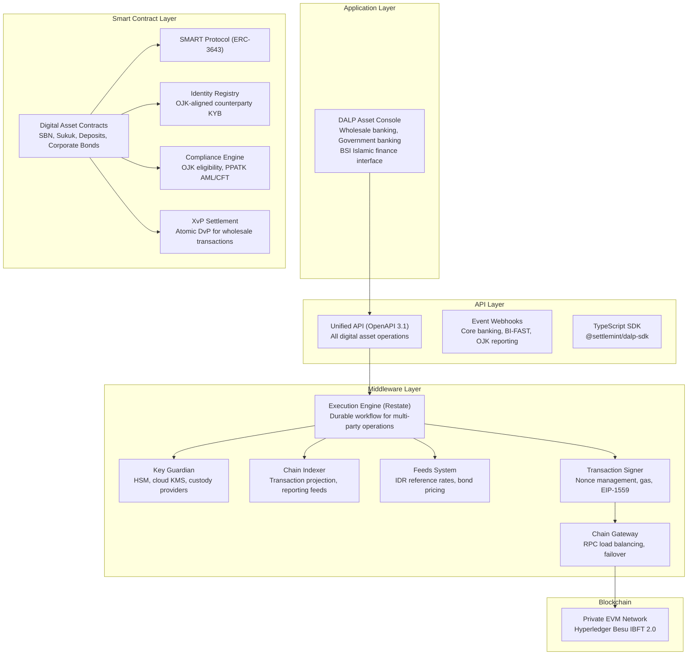
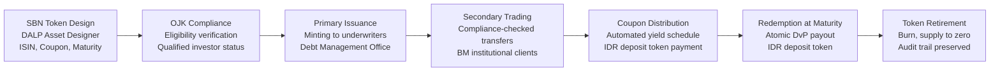
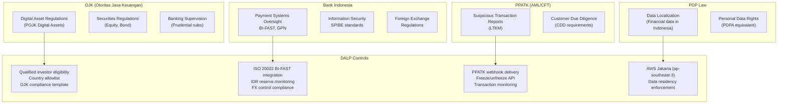
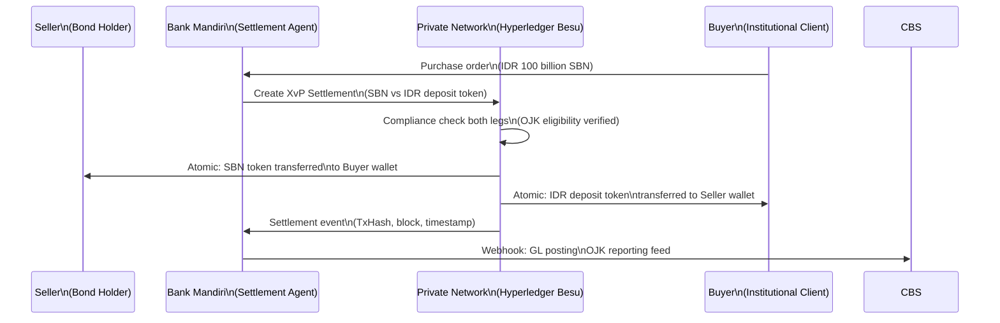
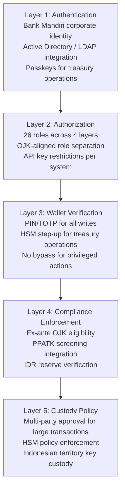
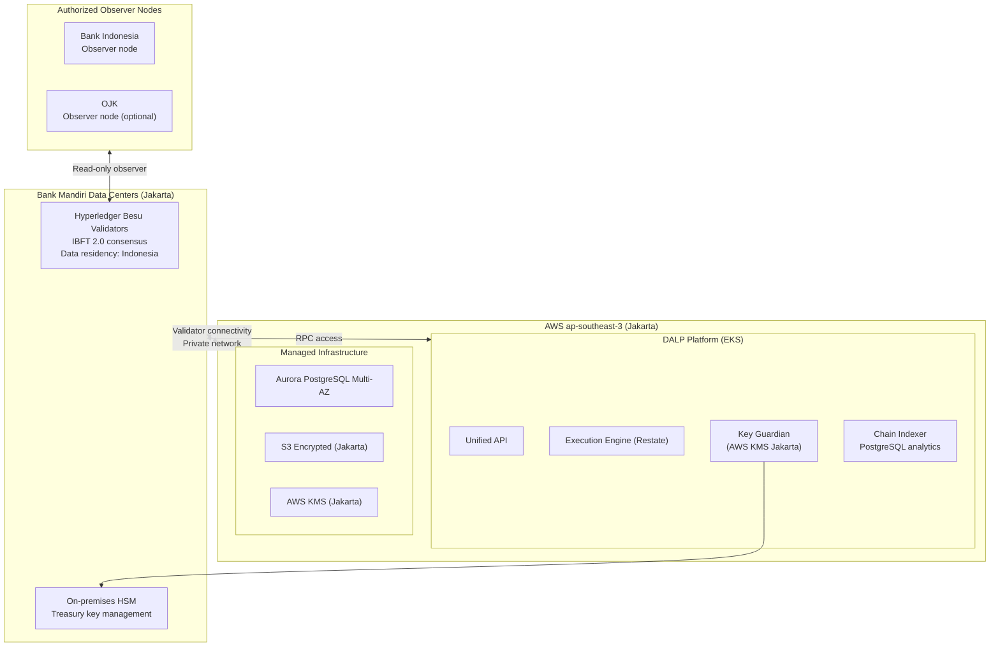
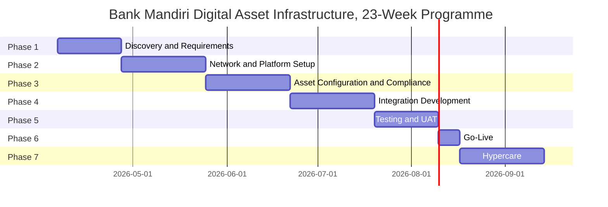

# Technical Proposal: Digital Asset Infrastructure Platform

**Prepared for:** PT Bank Mandiri (Persero) Tbk
**Date:** 20 March 2026
**Version:** 2.0 Reviewed
**Classification:** SettleMint Confidential. Invited Bidders Only
**Reference:** BANK-MANDIRI-RFP-202603

---

## Table of Contents

1. Cover Page
2. Executive Summary
3. About SettleMint
4. Platform Overview: DALP
5. Solution Architecture
6. Asset Lifecycle Coverage
7. Compliance Architecture
8. Integration Architecture
9. Custody and Key Management
10. Settlement and Operations
11. Security Architecture
12. Deployment Options
13. Implementation Approach
14. Support and SLA
15. Reference Projects
16. Regulatory Alignment
17. Response Matrix
18. Target Operating Model
19. Scenario Narratives
20. Appendix A: Risk Register
21. Appendix B: Compliance Module Catalog

---

## 1. Cover Page

**Document Title:** Technical Proposal: Digital Asset Infrastructure Platform
**Client:** PT Bank Mandiri (Persero) Tbk, Indonesia
**Date:** 20 March 2026
**Version:** 2.0 Reviewed
**Prepared by:** SettleMint NV
**Classification:** SettleMint Confidential

---

## 2. Executive Summary

### 2.1 Context

Bank Mandiri occupies a unique position in Indonesia's financial system: as the country's largest state-owned bank, it operates at the intersection of sovereign mandate and commercial banking, serving both government entities and the full spectrum of corporate and retail customers across Indonesia's 17,000 islands. This institutional position creates both opportunity and responsibility for digital asset infrastructure.

The opportunity is substantial. Bank Indonesia has actively explored wholesale digital currency infrastructure through Project Garuda and e-Rupee-equivalent research. OJK's progressive regulatory approach to digital assets creates a framework within which Indonesia's largest bank can build institutional-grade digital asset capability. BI-FAST, Indonesia's real-time payment infrastructure, provides the domestic payment backbone against which digital asset settlement can be coordinated. Bank Mandiri's scale, assets exceeding IDR 1,800 trillion, branches across all 34 provinces, and significant Islamic banking operations through Bank Syariah Indonesia, makes it the natural anchor for Indonesia's wholesale digital asset ecosystem.

The responsibility is equally significant. A digital asset infrastructure failure at Bank Mandiri would have systemic implications for Indonesia's financial sector. The platform chosen for this programme must meet a higher standard than typical commercial bank deployments: governance clarity that satisfies OJK's supervisory expectations, security architecture that meets BI's information security requirements, data localization that complies with Indonesia's Personal Data Protection Law (PDP Law), and operational resilience that withstands the scrutiny of a systemically important financial institution.

SettleMint's DALP platform, refined through production deployments with regulated banks in Singapore, Japan, the United Kingdom, Germany, and the Middle East, provides the institutional-grade infrastructure that Bank Mandiri's programme requires. In quantified terms: DALP's atomic settlement eliminates T+2 counterparty exposure. At IDR 100 trillion of annual SBN trading activity, each day of settlement acceleration reduces settlement exposure by IDR 274 billion. DALP's automated yield distribution for sukuk eliminates the manual calculation overhead that currently requires dedicated operations staffing for each profit payment event across BSI's product range.

### 2.2 Why This Programme Is Hard

Bank Mandiri's digital asset infrastructure programme is complex for several Indonesia-specific reasons.

**Regulatory multiplicity:** Indonesia's digital asset regulatory landscape involves multiple supervisors. OJK regulates banking operations and securities products. Bank Indonesia oversees monetary policy, payment systems, and foreign exchange. BAPPEBTI (Commodity Futures Trading Regulatory Agency, now transitioning to OJK oversight) regulates crypto-asset trading. The PDP Law creates data protection obligations. Each supervisor has its own reporting requirements, audit expectations, and enforcement mechanisms. Designing a compliance architecture that satisfies all simultaneously requires genuine modularity.

**Data localization:** Indonesia's PDP Law and BI regulations create data localization requirements that are stricter than many jurisdictions. Customer data, transaction records, and financial data must reside within Indonesian territory. This constrains cloud deployment choices to Indonesian-region availability zones and eliminates certain global managed service configurations.

**BI-FAST integration:** Bank Mandiri is a major participant in Indonesia's BI-FAST real-time payment system. Digital asset settlement workflows must coordinate with BI-FAST for IDR payment legs, creating integration requirements specific to Indonesia's domestic payment infrastructure.

**Islamic finance considerations:** Bank Mandiri's significant Sharia-compliant banking operations through Bank Syariah Indonesia (BSI) create requirements for Sharia-compliant digital asset structures in relevant product categories.

**State ownership context:** As a state-owned enterprise (Persero), Bank Mandiri operates under additional governance oversight from the Ministry of State-Owned Enterprises (BUMN). Procurement decisions at this scale require documentation satisfying BUMN governance standards.

### 2.3 Proposed Response

SettleMint proposes DALP as the digital asset infrastructure platform for Bank Mandiri's programme. The proposal covers:

**Tokenized Financial Instruments:** DALP's configurable token architecture supports the full range of digital asset instruments relevant to Bank Mandiri's wholesale banking operations: government bonds (Surat Berharga Negara / SBN), corporate bonds, tokenized deposits (in IDR and foreign currencies), and Islamic finance instruments (sukuk-compatible structures using configurable token features).

**OJK/BI Regulatory Compliance:** DALP's compliance architecture maps directly to OJK's digital asset regulatory framework and BI's information security and payment system requirements. The 18 compliance module types cover investor eligibility, transfer restrictions, AML/CFT requirements under Indonesia's PPATK reporting framework, and settlement controls.

**Indonesia Data Residency:** Deployment in AWS Jakarta (ap-southeast-3) or Google Cloud Jakarta ensures all data remains within Indonesian territory, satisfying the PDP Law's data localization requirements for financial data.

**BI-FAST Integration:** DALP's ISO 20022-compatible payment rail integration supports coordination with BI-FAST for IDR payment legs, enabling atomic coordination between on-chain digital asset delivery and domestic payment settlement.

**Wholesale Infrastructure Design:** The architecture is designed for wholesale market participants: institutional investor onboarding, large transaction governance with multi-party approval, and integration with Bank Mandiri's corporate banking, treasury, and government banking systems.

### 2.4 Why SettleMint

**State Bank of India (SBI) CBDC infrastructure:** SettleMint's engagement with India's largest state-owned bank on CBDC infrastructure is the most directly comparable reference for Bank Mandiri's programme. SBI, like Bank Mandiri, is a systemically important state-owned financial institution exploring wholesale digital currency infrastructure. The programme's successful pilot and progression to production deployment demonstrates SettleMint's capability in the specific institutional context Bank Mandiri represents, with projections of over one billion daily digital transactions at scale.

**Islamic Development Bank:** SettleMint's deployment with the Islamic Development Bank for Sharia-compliant subsidy distribution across 57 member countries demonstrates both the platform's scale capability and its compatibility with Islamic finance principles, directly relevant to Bank Mandiri's BSI operations.

**APAC bank track record:** OCBC Bank Singapore (MAS-regulated production deployment), Standard Chartered (pan-Asian digital exchange), and Mizuho Bank (bond tokenization in production planning) demonstrate DALP's capability in Asia-Pacific regulated banking environments.

### 2.5 Document Map

- **Section 3:** About SettleMint
- **Section 4:** Platform Overview
- **Section 5:** Solution Architecture
- **Section 6:** Digital Asset Lifecycle Coverage
- **Section 7:** Compliance Architecture (OJK, BI, PDP Law)
- **Section 8:** Integration Architecture (BI-FAST, core banking, OJK reporting)
- **Section 9:** Custody and Key Management
- **Section 10:** Settlement and Operations
- **Section 11:** Security Architecture
- **Section 12:** Deployment (AWS Jakarta, data residency)
- **Section 13:** Implementation Approach
- **Section 14:** Support and SLA
- **Section 15:** Reference Projects
- **Section 16:** Regulatory Alignment
- **Section 17:** Response Matrix
- **Sections 18 and 19:** Target Operating Model and Scenario Narratives
- **Appendices A and B**

---

## 3. About SettleMint

### 3.1 Company Overview

SettleMint is the digital asset lifecycle platform company for regulated financial markets and sovereign use cases. Founded nearly a decade ago, SettleMint's production deployments span regulated banks in Singapore, Germany, Japan, Belgium, and the United Kingdom; sovereign entities in Saudi Arabia, Indonesia-adjacent markets, and the Gulf; and market infrastructure providers in Europe.

SettleMint's sustained focus on the regulated institutional segment, not retail crypto, not DeFi protocol development, but institutional-grade production deployment for supervised entities, translates into an operational maturity that distinguishes it from most blockchain technology vendors. The team brings over 200 years of combined banking and blockchain engineering experience.

### 3.2 State-Owned Bank and Sovereign Entity Credentials

**State Bank of India:** SettleMint supports SBI with CBDC infrastructure for e-Rupee, India's digital currency programme. SBI, India's largest state-owned bank with projections of over one billion daily digital transactions, is directly comparable to Bank Mandiri's institutional profile. The pilot has been completed successfully; production deployment is in progress. This reference demonstrates SettleMint's capability in the specific intersection of state-owned banking and wholesale digital currency infrastructure that Bank Mandiri represents.

**Islamic Development Bank (Sharia-compliant subsidy distribution):** SettleMint deployed blockchain-based subsidy distribution for IsDB across 57 member countries, demonstrating scale capability and Sharia-compliance compatibility relevant to Bank Mandiri's BSI operations.

**Saudi Real Estate Registry:** Country-scale blockchain infrastructure for real estate registration and tokenization, operated by a government authority. Demonstrates SettleMint's experience with sovereign-mandated digital asset programmes at national scale.

**OCBC Bank Singapore:** Multi-year production deployment under MAS regulatory oversight, demonstrating the platform's capability in a comparable Southeast Asian regulatory environment.

### 3.3 Certifications

ISO 27001 and SOC 2 Type II, independently audited security controls available for OJK vendor risk assessment.

---

## 4. Platform Overview: DALP

### 4.1 What DALP Provides for Bank Mandiri

For Bank Mandiri's digital asset infrastructure programme, DALP provides a complete four-layer stack covering smart contract enforcement, middleware orchestration, API access, and application interface. Each layer has a distinct responsibility boundary, and layers communicate through well-defined interfaces. Lower layers enforce stricter invariants; upper layers provide flexibility and user-facing abstraction.

The platform's design philosophy centers on configuration over custom development: Bank Mandiri can deploy government bonds, sukuk, deposit tokens, and corporate bonds by configuring DALP's templates and compliance modules, not by writing custom smart contract code. This means faster deployment, lower technical risk, and easier maintenance as Indonesia's regulatory requirements evolve.

**Government bond tokenization (SBN/ORI):** Indonesia's government securities are natural candidates for tokenization given Bank Mandiri's role as a primary dealer and distribution channel. DALP's bond asset type supports the full SBN lifecycle: issuance, secondary trading, coupon distribution, and maturity redemption.

**Tokenized deposits (IDR and forex):** Bank Mandiri's institutional deposit products, tokenized on-chain as settlement instruments for wholesale transactions and as investment products for corporate treasury clients.

**Corporate bond tokenization:** Indonesia's corporate bond market (Pasar Obligasi Korporasi) digital transformation through tokenized corporate bonds accessible to Bank Mandiri's institutional banking clients.

**Islamic finance instruments:** Sukuk-compatible token structures using DALP's configurable token architecture. The configurable token supports Murabahah, Ijarah, and Musyarakah-aligned instrument structures through metadata schema and lifecycle configuration, without requiring custom smart contract development.

**Wholesale infrastructure for institutional participants:** OnchainID identity management for corporate treasury clients, Qualified Investor eligibility controls aligned with OJK's institutional investor categories, and multi-party settlement workflows.

### 4.2 Asset Classes Relevant to Indonesia

| Asset Class | Indonesia Context | DALP Support |
|-------------|------------------|-------------|
| Government Bonds (SBN) | Indonesia's primary domestic fixed income market; Bank Mandiri as primary dealer | Full lifecycle: issuance, trading, coupon, maturity |
| Sukuk (Government) | Sharia-compliant government securities | Configurable token with Islamic finance metadata |
| Corporate Bonds | Growing corporate bond market | Full lifecycle with credit monitoring |
| Tokenized Deposits (IDR) | Settlement instrument for DvP; wholesale banking | Deposit token with BI reserve controls |
| Tokenized Deposits (USD) | Cross-border settlement; correspondent banking | Multi-currency deposit architecture |
| Equity Tokens | Future product category; BSI-compatible structures | Equity token with Sharia screening |

---

## 5. Solution Architecture

### 5.1 Four-Layer Architecture

DALP is structured as a four-layer stack. Requests flow top-down through these layers. A user action in the Asset Console triggers an API call, which the middleware orchestrates into one or more blockchain transactions, which the smart contract layer validates and executes on-chain. Each layer independently enforces its own security controls, so no single-layer failure grants unauthorized access.

### 5.2 Smart Contract Layer: SMART Protocol Foundation

All DALP smart contracts are built on the SMART Protocol (SettleMint Adaptable Regulated Token), an implementation of the ERC-3643 standard. ERC-3643 defines a specification for regulated security tokens where every transfer must pass through a modular compliance engine before execution. This is not application-layer validation that can be bypassed: it is enforced by the smart contract itself.

SMART Protocol provides three foundational sub-layers:

**Token sub-layer:** ERC-20 compatible contracts with compliance hooks and a modular extension system. External systems (wallets, exchanges, indexers) interact through standard ERC-20 and ERC-3643 interfaces. Bank Mandiri's institutional clients, KSEI, and downstream systems can consume on-chain token data through standard interfaces without requiring custom integration.

**Compliance sub-layer:** An orchestration engine that evaluates a configurable set of transfer rules before each transaction. Rules are modular and can be added, removed, or reconfigured at runtime without redeploying the token contract. For Bank Mandiri, this means OJK's investor eligibility requirements, BI reserve controls, and PPATK freeze requirements can all be updated by the compliance team without engineering intervention.

**Identity sub-layer:** On-chain identity management via OnchainID (ERC-734/735), storing verifiable KYC/AML claims. Identity verification is enforced on-chain as a prerequisite for transfers, so non-KYC'd counterparties are rejected at the protocol level.

### 5.3 Five-Layer On-Chain Architecture

The on-chain side of DALP follows a layered architecture where each level builds on the one below it:

| Layer | Purpose | Key Components |
|-------|---------|----------------|
| SMART Protocol | ERC-3643 token framework with modular compliance, identity management, and extension system | Core token interfaces, compliance engine, identity registry |
| Global | Platform-wide infrastructure shared across all system instances on a given chain | Central directory, identity factory, identity implementations |
| System | Per-system infrastructure managing identity registration, compliance, and access control | Identity registry, compliance orchestration, access manager, factory registries |
| Assets | Tokenized financial instruments with full lifecycle support | DALPAsset (configurable) for SBN, sukuk, IDR deposits, corporate bonds |
| Addons | Operational tools extending assets with distribution, settlement, and treasury capabilities | Airdrop, Vault, XvP Settlement, Token Sale, Fixed Treasury Yield |

### 5.4 DALPAsset: The Configurable Contract

DALPAsset is the recommended contract type for all new tokenization projects, including Bank Mandiri's SBN, sukuk, and IDR deposit programmes. It extends the SMART Protocol with the SMARTConfigurable extension, allowing token features and compliance modules to be attached and reconfigured at runtime after deployment.

This design eliminates the need to commit to a specialized contract type at deployment time. A Bank Mandiri IDR deposit token can evolve: start as a simple bearer instrument, then have collateral requirements added to satisfy BI reserve regulations, governance enabled for BUMN procurement oversight, or maturity and redemption logic configured for fixed-term deposits, all without redeploying the contract and without requiring OJK re-notification of a contract address change.

**Runtime-pluggable token features** integrate through six lifecycle hooks (mint, burn, transfer, redeem, update, attach). Verified available features for Bank Mandiri's use cases include:

- Historical balances (required for coupon distribution snapshots, each SBN holder's proportional share calculated from historical balance at record date)
- Fixed treasury yield (automated IDR coupon distribution for SBN and profit distribution for sukuk)
- Maturity and redemption (SBN and corporate bond redemption at par value against IDR deposit token)
- AUM fee (fund-of-funds and tokenized deposit management fee)
- Transaction fee (applicable to secondary market trading on Bank Mandiri's digital asset platform)
- Permit (gasless approvals via EIP-2612, enabling Bank Mandiri to sponsor gas costs for institutional clients)

**Compliance modules** enforce transfer and supply rules through the ERC-3643 compliance engine. For Bank Mandiri's Indonesia programme, the following modules are pre-configured in OJK-aligned templates:

- Identity verification (requires verified OnchainID for all transfers)
- Country restrictions (Indonesia-only transfers for domestic SBN; enhanced due diligence for cross-border)
- Investor accreditation (OJK Qualified Investor claim required for securities products)
- Supply cap (OJK issuance limit enforcement)
- Collateral requirement (BI reserve backing verification for IDR deposit tokens)
- Transfer approval (multi-party wholesale transaction workflow for large block trades)
- Time lock (holding period enforcement for restricted securities)

### 5.5 Factory Pattern with CREATE2 Deterministic Deployment

All Bank Mandiri asset types are deployed through a factory pattern using CREATE2, which provides deterministic contract addressing. The factory transaction is atomic. If any step fails, the entire deployment reverts. No partially deployed tokens can exist on-chain.

The deployment sequence for each Bank Mandiri asset:
1. Validate configuration against OJK-aligned compliance template and class-specific rules
2. Deploy a UUPS proxy contract with the DALPAsset implementation
3. Initialize the compliance engine with OJK eligibility modules and PPATK freeze capability
4. Bind the token to the system's Identity Registry (OnchainID for institutional counterparties)
5. Issue class-aware claims (securities classification under OJK framework, pricing, ISIN)
6. Configure token features in the specified order (historical balances before fixed yield, so yield uses snapshot balances)
7. Assign initial roles (admin, governance, supply management, custodian, emergency)
8. Unpause when compliance team has verified configuration

Key invariants enforced by the factory: CREATE2 determinism (token addresses are predictable from ISIN and deployment parameters), initialization order (identity before compliance, compliance before transfers), role completeness (all required roles assigned atomically).

### 5.6 Private Network Architecture for Bank Mandiri

For Bank Mandiri's digital asset infrastructure, SettleMint recommends a private permissioned blockchain network (Hyperledger Besu with IBFT 2.0 consensus) rather than a public network. This recommendation reflects:

**Data sovereignty:** All transaction data remains within Indonesia's data borders on a network operated by Bank Mandiri and authorized participants. No transaction data transits to public blockchain networks.

**Regulatory alignment:** Bank Indonesia's guidance on digital asset infrastructure favors permissioned network architectures for wholesale banking use cases. OJK's oversight expectations are more easily satisfied with a fully controlled network than with a public chain where validator participation is open.

**Performance:** Private IBFT 2.0 consensus provides sub-second finality for transactions, appropriate for Bank Mandiri's high-volume wholesale banking operations. Public networks with probabilistic finality are less suitable for regulated settlement.

**Cost predictability:** No gas costs on a private network. Transaction processing is free from a network perspective, with costs limited to infrastructure operations.

**Multi-participant design:** The private network can include Bank Indonesia, OJK, and other authorized participants as observer or validator nodes, supporting regulatory oversight directly on the network infrastructure.

### 5.7 Islamic Finance Architecture

Bank Mandiri's significant Islamic finance operations through Bank Syariah Indonesia require digital asset structures compatible with Sharia principles.

**Sukuk token design:** The configurable token metadata schema captures sukuk-specific attributes: underlying asset reference (for asset-backed sukuk), profit rate (as an alternative to interest rate), profit payment schedule, and maturity redemption based on asset value rather than face value.

**Halal screening:** The compliance expression builder enables Bank Mandiri's Sharia compliance team to define eligibility rules for Islamic finance instruments: counterparties must hold a verified Halal investment authorization claim from an authorized Sharia advisory body. This is enforced ex-ante on every transfer.

**Murabahah structure:** For commodity Murabahah, the token architecture represents: the commodity purchase at cost price (initial token minting), the sale at Murabahah cost-plus-markup price (transfer to the financing customer), and the deferred payment schedule (yield schedule addon configured as profit payments rather than interest).

---

## 6. Asset Lifecycle Coverage

### 6.1 Government Bond (SBN) Lifecycle

Bank Mandiri's role as a primary dealer for Indonesia's government securities creates significant digital asset opportunity. Tokenized SBN eliminates the T+2 settlement delay, reduces reconciliation overhead in the secondary market, and enables fractional ownership for retail distribution channels.

**ISIN and legal identifier:** Every SBN token carries a validated ISIN from creation, linking the on-chain instrument to its legal identifier under KSEI (PT Kustodian Sentral Efek Indonesia) record-keeping. The ISIN is immutable after deployment, it cannot be changed through governance operations.

**Coupon distribution in IDR:** Fixed Treasury Yield feature automates coupon distribution in IDR-denominated deposit tokens on DALP's yield schedule. Distribution is pull-based: KSEI or the investor's custodian claims accrued yield on behalf of holders. Yield calculation uses Historical Balance snapshots: each holder's proportional share is calculated from their balance at the record date, not their current balance, preventing gaming through last-minute purchases.

**DvP settlement with tokenized IDR:** Atomic DvP settlement against tokenized IDR deposits, enabling T+0 settlement for SBN secondary market transactions. The XvP Settlement addon coordinates both legs: SBN token delivery and IDR deposit token payment execute atomically in a single transaction, or both revert.

**Batch minting to underwriters:** DALP supports batch minting to multiple wallets in a single API call, with up to 100 recipients per request. For SBN primary issuance to multiple underwriters, this enables efficient distribution with a single transaction per batch.

### 6.2 Token Creation via Factory Pattern

The deployment workflow for each Bank Mandiri asset type follows DALP's durable deployment pipeline:

1. **Validation:** Configuration validated against OJK compliance template and SBN/sukuk/deposit class-specific rules
2. **Proxy deployment:** UUPS proxy contract deployed with DALPAsset implementation
3. **Compliance initialization:** OJK eligibility modules, PPATK freeze capability, and BI reserve controls loaded
4. **Identity binding:** Token bound to Identity Registry; institutional counterparty OnchainID contracts mapped
5. **Claim issuance:** OJK securities classification claim, ISIN, and pricing claims issued to token's identity
6. **Feature configuration:** Historical balances, fixed treasury yield, and maturity redemption configured in order
7. **Role assignment:** Supply Management (Wholesale Operations), Custodian (Compliance), Emergency (Treasury) roles assigned atomically
8. **Pause by default:** Token starts paused; Compliance team verifies configuration before unpausing

The workflow is durable and idempotent through Restate. If any step fails (for example, a network interruption during role assignment), deployment resumes from the last successful step without creating orphaned contracts.

### 6.3 Sukuk Digital Infrastructure

Indonesia is one of the world's largest sukuk markets. Bank Mandiri's sukuk operations benefit from digital infrastructure that represents sukuk's asset-backed structure on-chain.

**Asset reference:** Sukuk tokens carry on-chain attestations linking the token to the underlying asset pool. The attestation is issued by the Sharia Advisory Board's on-chain trusted issuer role, cryptographically verifying the asset-backing.

**Profit distribution:** Sukuk profit distributions are automated through DALP's yield schedule addon. The profit rate is configured at instrument creation and distributed in IDR deposit tokens at each profit payment date.

**AAOIFI alignment:** The DALP token metadata schema is extensible to capture AAOIFI (Accounting and Auditing Organization for Islamic Financial Institutions) reporting fields.

### 6.4 Tokenized IDR Deposits

Bank Mandiri's tokenized IDR deposit provides the on-chain settlement currency for the entire digital asset ecosystem.

**Reserve management:** DALP's collateral requirement module requires on-chain proof of IDR reserve backing before minting. Bank Indonesia's reserve requirements for digital payment tokens are enforced at the smart contract layer, minting is blocked if the on-chain collateral attestation is absent or expired.

**BI oversight:** The tokenized IDR deposit token's reserve management can be designed to provide Bank Indonesia with direct visibility into the reserve position through an observer node on the private network.

**Interbank settlement:** The tokenized IDR deposit enables interbank settlement between participating institutions on the private network, potentially reducing reliance on BI-FAST for certain wholesale transaction categories.

### 6.5 Corporate Actions and Servicing

**Dividend and coupon distribution via Fixed Treasury Yield:** The fixed-rate yield system funds a treasury and token holders claim accrued yield at configured intervals. Pull-based distribution avoids the gas cost and block gas limit issues of pushing payments to thousands of holders. The treasury can be the token contract itself or an external Bank Mandiri treasury vault.

**Redemption at Maturity:** The Maturity Redemption feature implements the complete fixed-income lifecycle endpoint. After the configured maturity date, the token blocks all transfers. Holders redeem tokens for the IDR deposit denomination asset at the configured face value. The mechanism is atomic: tokens burn and the IDR deposit transfers from the treasury in a single transaction.

**Freeze and unfreeze for compliance holds:** The Custodian role can freeze individual investor wallets (full or partial freeze), preventing transfers while maintaining the balance on record. Freeze events are recorded on-chain with the compliance officer's identity, timestamp, and compliance reference number.

**Pause for emergency controls:** The Emergency role can pause all operations on a token. When paused, no transfers, mints, or burns execute. Pausing is the circuit breaker for OJK emergency orders, BI regulatory interventions, or suspected security incidents.

### 6.6 Burning and Token Retirement

Burning permanently removes units from circulation and reduces total supply. For Bank Mandiri's instruments, burns occur at: SBN maturity redemption (atomic burn-and-pay), sukuk profit distribution period end (optional surplus burn for Musyarakah structures), regulatory enforcement actions (PPATK-directed removal of assets from sanctioned wallets), and error corrections (reversing erroneous issuances under BUMN governance authorization).

For supply-capped instruments (OJK issuance limit enforcement), burning frees up capacity. The cap tracks live circulating supply via totalSupply(), not lifetime minted amount, enabling Bank Mandiri to reissue within the same OJK-approved issuance framework.

---

## 7. Compliance Architecture

### 7.1 Indonesian Regulatory Context

### 7.2 Compliance Module Architecture

DALP's compliance engine evaluates transfer rules through modular contracts. Each Bank Mandiri token has its own SMARTCompliance contract that queries all configured modules during canTransfer checks. Modules are global singletons: each token configures its own parameters against the shared module contracts. A single module veto blocks the entire transfer (fail-closed design). The modules are ordered explicitly: identity verification runs first, then country restrictions, then investor accreditation. This ordering is configuration-controlled and does not require smart contract redeployment to change.

Compliance modules can be added, removed, or reconfigured at runtime under the GOVERNANCE_ROLE. The GOVERNANCE_ROLE for production Bank Mandiri tokens is held by a multi-signature wallet requiring signatures from both Wholesale Operations (the business owner) and Compliance (the control owner), ensuring no single team can unilaterally change compliance rules.

### 7.3 OJK Digital Asset Compliance

OJK's regulatory framework for digital assets in Indonesia creates specific requirements:

**Qualified investor eligibility:** OJK's regulations restrict digital securities distribution to qualified investors meeting minimum wealth and investment experience thresholds. DALP's Investor Accreditation compliance module requires each investor to hold a current QI (Qualified Investor) claim from OJK or an OJK-authorized verification provider before receiving digital security tokens.

**Country restrictions:** OJK's regulations apply specifically to Indonesian investors. The Country Allowlist module restricts token transfers to investors with Indonesian identity verified on-chain.

**Product classification:** Digital securities in Indonesia are classified under OJK's securities regulations. DALP's instrument templates capture OJK-required product classification attributes, ensuring that on-chain token records reflect the regulatory classification of each instrument.

**Disclosure obligations:** OJK requires prospectus disclosure for digital securities offerings. DALP's Transfer Approval module can be configured to require investor acknowledgment of prospectus delivery before initial allocation.

**Claims expiry management:** OJK eligibility claims carry configurable expiry dates. DALP's suitability monitoring dashboard surfaces investors with claims approaching expiry, enabling Bank Mandiri's KYC team to initiate renewal before the investor loses transfer eligibility.

### 7.4 PPATK AML/CFT Integration

PPATK (Pusat Pelaporan dan Analisis Transaksi Keuangan. Indonesia's Financial Intelligence Unit) requires reporting of suspicious transactions and large transactions.

**Suspicious Transaction Reports (LTKM):** Transaction monitoring alerts from Bank Mandiri's AML/CFT platform trigger immediate wallet freezes through DALP's freeze API. The on-chain freeze event records the compliance hold for PPATK evidence.

**Large Transaction Reports (LTKT):** For digital asset transactions exceeding IDR 500 million (or equivalent), DALP's event export API provides the transaction data for LTKT reporting to PPATK.

**Customer Due Diligence:** Bank Mandiri's KYC/CDD process issues on-chain claims to investor OnchainID contracts through the trusted issuer mechanism. CDD refresh obligations (updating expired claims) are managed through DALP's suitability monitoring dashboard.

**Freeze and forced transfer for PPATK orders:** The Custodian role executes wallet freezes and, if required by PPATK, forced transfers of frozen assets to a Bank Mandiri control account. All Custodian actions emit on-chain events with the operator's wallet address, timestamp, and compliance reference.

### 7.5 PDP Law Data Localization

Indonesia's PDP Law (UU No. 27/2022) creates data protection obligations for personal data processing.

**On-chain pseudonymization:** On-chain data is limited to blockchain addresses and compliance claim status, not personal identifiers (names, National ID numbers, addresses). Personal data remains in Bank Mandiri's off-chain systems, referenced through the OnchainID mechanism without exposing personal data to the chain.

**Data residency:** All platform data (transaction records, compliance events, identity registry, configuration) resides in AWS Jakarta (ap-southeast-3). No data leaves Indonesian territory through DALP platform operations.

**Data retention and deletion:** DALP's configurable off-chain data retention policies support the PDP Law's data deletion rights for personal data. On-chain data (immutable blockchain records) is pseudonymized and does not contain personal identifiers subject to deletion rights.

---

## 8. Integration Architecture

### 8.1 Indonesia Integration Landscape

```mermaid
graph TB
    subgraph Mandiri["Bank Mandiri Enterprise Systems"]
        CBS["Core Banking (BNI-CORE)\nAccount management, GL"]
        GBS["Government Banking Systems\nTreasury payments, government accounts"]
        TMS["Treasury Management\nIDR/FX positions, bond portfolio"]
        AML["AML/CFT (SANCTION SCANNER)\nPPATK reporting, CDD"]
        KSEI["KSEI Interface\nSecurities depository connectivity"]
    end
    subgraph DALP["DALP Platform (AWS Jakarta)"]
        API["Unified API (OpenAPI 3.1)\nREST v2 endpoint"]
        WH["Event Webhooks\nReal-time notifications"]
        FD["Feeds System\nBond pricing, IDR reference rates"]
        IDX["Chain Indexer\nPostgreSQL analytics views"]
    end
    subgraph External["External Systems"]
        BIFAST["BI-FAST\nReal-time IDR payment rail"]
        RTGS["BI-RTGS\nHigh-value IDR settlement"]
        SWIFT["SWIFT\nCross-border correspondent"]
        OJKR["OJK Reporting\nDigital securities reporting"]
    end

    CBS <-->|Position reconciliation| WH
    GBS <-->|Government bond operations| API
    TMS <-->|Bond portfolio management| API
    AML <-->|PPATK reporting, freezes| WH
    KSEI <-->|Securities registry events| API
    BIFAST <-->|Real-time IDR settlement| API
    RTGS <-->|High-value settlement| API
    SWIFT <-->|Cross-border correspondent| API
    OJKR <-->|Digital securities reports| API
```

### 8.2 DAPI: The Durable API Service

DAPI (Durable API Service) is DALP's unified API layer, the single programmatic surface through which all platform operations are accessed. It is not a thin wrapper around smart contracts; it is a full middleware stack that transforms authenticated HTTP requests into tenant-scoped, permission-aware, execution-ready operations.

DAPI is built on oRPC, a type-safe RPC framework that provides automatic OpenAPI 3.1 documentation, schema validation via Zod, custom serializers for blockchain-specific types (BigInt, BigDecimal, Timestamp), and streaming support for long-running operations.

DAPI serves two distinct endpoints for Bank Mandiri's integration teams:

| Endpoint | Authentication | Consumer | Scope Enforcement |
|----------|---------------|----------|-------------------|
| `/api/rpc` | Session/cookie only | DALP dApp frontend (browser) | Session-bound |
| `/api/v2` | API keys (HTTP-method-scoped) | Core banking integration, KSEI, OJK reporting | GET/HEAD for read-only keys; all methods for read-write keys |

**REST API Namespaces for Bank Mandiri:**

| Namespace | Purpose | Bank Mandiri Integration Use |
|-----------|---------|------------------------------|
| `token` | Asset lifecycle operations | Create SBN/sukuk/deposit tokens, mint to investors, execute transfers |
| `system` | Platform infrastructure | Grant roles to Wholesale Ops, Compliance, BSI teams |
| `account` | Wallet operations | Verify institutional client wallet identity |
| `addons.xvp` | Settlement operations | Create DvP settlement legs, approve, execute |
| `addons.fixedYield` | Coupon distribution | Configure and trigger SBN coupon and sukuk profit events |
| `transaction` | Transaction tracking | Monitor pending settlements, confirm on-chain finality |
| `monitoring` | Platform health | Operations dashboard, alert management |

**Transaction Queue and Async Operations:** DAPI v2 mutations support three execution modes negotiated through RFC 7240 `Prefer` headers. Bank Mandiri's integration team can use `Prefer: respond-sync` for blocking operations (real-time DvP confirmation), `Prefer: respond-async` for non-blocking operations (batch coupon distribution), or the default hybrid mode where the server decides based on expected execution time.

All v2 blockchain mutations flow through DALP's async transaction request pipeline, an 11-state lifecycle managed by Restate durable workflows: created, queued, submitted, broadcasting, pending, confirming, confirmed (success), failed, cancelled, expired, or replaced. This means every mutation is idempotent (enforced via Idempotency-Key headers), durable (survives process restarts), and auditable (full state-transition history in the transaction_request table).

**Error Handling for Bank Mandiri Integration:** 534 auto-generated error codes from Solidity ABIs, each with 4-byte selectors, severity levels, retryability flags, and i18n translations. Blockchain revert reasons surface as structured DALP contract errors rather than opaque revert blobs. Key principle: never retry a CONFIRMATION_TIMEOUT without first checking transaction status via `transaction.read`: blind retries can create duplicate transactions.

### 8.3 TypeScript SDK for Bank Mandiri Integration Teams

DALP ships a public TypeScript SDK (`@settlemint/dalp-sdk`) as the recommended programmatic integration surface for Bank Mandiri's technology team. The SDK provides:

- A typed client factory (createDalpClient) backed by the DALP v2 API contract
- Automatic serialization of blockchain value types (Dnum for arbitrary-precision decimals, BigInt, Date)
- Support for all API namespaces: account, actions, addons, admin, contacts, exchangeRates, externalToken, identityRecovery, monitoring, search, settings, system, token, transaction, and user
- Public npm package (`@settlemint/dalp-sdk`) targeting Node 20+ with ESM module format

For non-Node integration environments (Java-based core banking systems, .NET treasury systems), DALP's OpenAPI 3.1 specification at `/openapi.json` enables SDK generation via openapi-generator-cli in Python, Go, C#/Java. Generated clients may require manual adjustments for BigInt/BigDecimal serialization, for which the TypeScript SDK includes reference helpers.

### 8.4 CLI for Operations and Automation

DALP ships a full-featured command-line interface with 301 command registrations across 26 top-level command groups. For Bank Mandiri's operations team, the CLI enables:

- **Batch operations:** Batch user creation, identity registration, and role assignment through scripted CLI commands
- **Coupon distribution monitoring:** `dalp token monitoring` commands track distribution events in real-time
- **Compliance monitoring:** `dalp kyc` and `dalp identity` commands for claim management and expiry tracking
- **Settlement monitoring:** `dalp xvp` commands for DvP settlement lifecycle management
- **Incident response:** `dalp token freeze-address`, `dalp token pause`, and `dalp token unfreeze-partial` for compliance and emergency operations

The CLI integrates with DALP's authentication via a browser-based device-code flow, storing API keys in the operating system's secure credential store (macOS Keychain on Darwin, permission-checked config file on Linux).

### 8.5 Event Webhooks for Real-Time Integration

DALP's webhook architecture delivers real-time transaction data to Bank Mandiri's enterprise systems. Each webhook delivery includes:

- **Transaction confirmation events:** Delivered to core banking for GL posting after on-chain confirmation
- **Compliance state changes:** Delivered to AML platform for PPATK reporting pipeline (freeze events, investor eligibility changes)
- **Coupon distribution events:** Delivered to treasury management for accrual accounting
- **Maturity redemption events:** Delivered to core banking for balance sheet updates

Webhooks are secured via HMAC signatures on each payload. Bank Mandiri's receiving systems verify signatures before processing. Webhook retry policy: exponential backoff (1s, 2s, 4s) for server errors; no retry for client errors (4xx). Failed webhook deliveries are logged with the transaction hash and available for manual replay through the DALP operations console.

### 8.6 Chain Indexer: Analytics and Reporting

The Chain Indexer bridges blockchain data structures and Bank Mandiri's reporting requirements. Event latency from blockchain event to analytics view availability is under 5 seconds.

DALP exposes 18 PostgreSQL analytics views across 5 domains, directly accessible by Bank Mandiri's BI tools:

| Domain | Views | Bank Mandiri Use Case |
|--------|-------|----------------------|
| Identity | 2 | Investor count and KYC status reporting for OJK |
| Compliance | 4 | Eligibility verification volumes, claim statistics |
| Addons | 4 | Vault activity, XvP settlement statistics, yield distribution stats |
| Cross-Cutting | 7 | Transaction count, daily/hourly activity, asset lifecycle, country distribution |
| Actions | 1 | Pending operations and approval queue |

Views support both type-safe Drizzle ORM queries and raw SQL access for BI tools (Power BI, Tableau, or Bank Mandiri's internal data warehouse). This enables standard ETL pipelines to OJK regulatory reporting without requiring integration through the DALP API.

### 8.7 BI-FAST Integration

Bank Indonesia's BI-FAST system provides real-time IDR payment capability. For digital asset settlement requiring off-chain IDR coordination:

**Payment confirmation trigger:** BI-FAST payment confirmation events (delivered through Bank Mandiri's core banking system) trigger on-chain instrument delivery. The Transfer Approval module holds the digital asset transfer until BI-FAST payment confirmation is received, coordinating the off-chain payment leg with the on-chain instrument delivery.

**ISO 20022 mapping:** BI-FAST uses ISO 20022 message formats. DALP's ISO 20022-compatible payment rail integration maps DALP events to BI-FAST message schemas, enabling automated payment coordination without manual message construction.

### 8.8 KSEI Integration

KSEI (PT Kustodian Sentral Efek Indonesia) is Indonesia's securities depository. For tokenized government and corporate bonds, the integration between DALP and KSEI establishes the link between on-chain token ownership and KSEI depository records.

**Mirror ledger model:** DALP maintains the on-chain token ledger as the atomic settlement layer while KSEI maintains the legal title record. Settlement events in DALP trigger KSEI updates through the API, keeping both ledgers synchronized.

**ISIN registry:** DALP's bond instrument templates incorporate KSEI-validated ISINs, ensuring that on-chain instruments carry the legally recognized securities identifiers.

**Depository participant access:** KSEI-registered depository participants can access their clients' on-chain holdings through DALP's portfolio API, providing an integrated view of on-chain and off-chain securities positions.

### 8.9 OJK Regulatory Reporting Integration

Digital securities operations in Indonesia require reporting to OJK. DALP's event export API and Chain Indexer analytics views provide the underlying data for OJK-required reports:

**Digital securities issuance reports:** New token deployments generate OJK notification data: ISIN, issuer, total supply, offering price, investor eligibility criteria, and regulatory classification.

**Secondary market activity reports:** Token transfer events provide data for OJK's secondary market activity reporting: transaction parties, amounts, timestamps, and settlement references.

**Investor registry reports:** The OnchainID identity registry provides investor count and distribution data required for OJK's investor registry reporting.

---

## 9. Custody and Key Management

### 9.1 Key Guardian Architecture

The Key Guardian service manages cryptographic key material through defense-in-depth with multiple storage backends at escalating security levels. Keys never leave secure boundaries in plaintext.

| Storage Tier | Protection Level | Bank Mandiri Use Case |
|-------------|-----------------|----------------------|
| Cloud secret manager (AWS KMS Jakarta) | Platform-managed encryption, FIPS 140-2 | Automated operations: coupon distribution, secondary transfers |
| Hardware security module (on-premises) | FIPS 140-2 Level 3 | Treasury operations: SBN primary issuance, large IDR deposits |
| Third-party MPC custody (DFNS or Fireblocks) | Delegated institutional MPC | Highest-security operations: emergency access, regulatory seizure |

### 9.2 Key Guardian for Wholesale Operations

Bank Mandiri's wholesale digital asset operations require a multi-tier key management architecture:

**Tier 1: Automated operations (AWS KMS Jakarta):** Day-to-day operations, coupon distribution, secondary transfers, settlement coordination, use AWS KMS-backed signing keys. AWS Jakarta Key Management Service provides FIPS 140-2 validated key storage within Indonesian territory, satisfying the PDP Law's financial data localization requirement.

**Tier 2: Treasury operations (HSM):** High-value operations, primary SBN issuance, large corporate bond minting, interbank settlement, use HSM-backed signing with additional approval requirements. The HSM is deployed within Bank Mandiri's data center in Indonesia.

**Tier 3: Emergency access (Multi-party threshold):** Emergency access requiring multiple custodians from Bank Mandiri's authorized emergency response team. Emergency access events are recorded on-chain and trigger immediate compliance team review.

### 9.3 Key Lifecycle Management

**Generation:** HSM-backed keys generate entirely within hardware. Software keys use cryptographically secure random sources with immediate encryption before memory clearing.

**Rotation:** Active signing keys are replaced while maintaining historical keys for verification. Key rotation for Bank Mandiri's operational keys follows a quarterly rotation schedule, coordinated with Bank Mandiri's change management process. Rotation coordinates with blockchain address updates and registry notifications.

**Recovery:** Enterprise deployments use sharded backups with threshold signature schemes requiring multiple custodians from Bank Mandiri's designated recovery team. Recovery workflows are durable and idempotent through Restate, keyed by wallet address to prevent duplicate concurrent recovery operations.

**Revocation:** Compromised keys are immediately removed from active use. Smart contract permissions update to reject signatures from revoked keys within the same transaction.

### 9.4 MPC Custody Integration

DALP integrates with DFNS and Fireblocks for institutional-grade MPC custody. The unified signer abstraction makes custody providers interchangeable through configuration changes alone, with no workflow or code modifications required.

**DFNS:** Threshold MPC with distributed key shards. DFNS policy engine enforces transaction limits and multi-party approval requirements before signing. Pending approvals surface through the DALP interface for operator resolution, operators can review, approve, or reject without leaving the DALP interface. This is the recommended option for Bank Mandiri's automated operations where fully programmatic approval is required.

**Fireblocks:** MPC-CMP with continuous key refresh, eliminating static key shares. Transaction Authorization Policy (TAP) enforces amount thresholds, whitelisted destinations, velocity limits, and multi-approver requirements. Approvals require the Fireblocks Console or Co-Signer appliance. Suitable for Bank Mandiri's treasury operations where human approval in a separate console is acceptable.

### 9.5 Indonesian Data Sovereignty for Key Material

All cryptographic key material resides within Indonesian territory:
- AWS KMS keys: stored in AWS Jakarta (ap-southeast-3) with data residency guarantees
- HSM keys: physically located within Bank Mandiri's Indonesian data centers
- Backup shards: distributed across Bank Mandiri's multiple data centers within Indonesia

No key material crosses Indonesian borders. This satisfies the PDP Law's data localization requirements for financial data and Bank Indonesia's SPIBE information security requirements for systemically important institutions.

---

## 10. Settlement and Operations

### 10.1 Wholesale Settlement Model

Bank Mandiri's digital asset infrastructure supports three settlement models:

**Model 1: On-chain DvP (IDR deposit token vs. digital security)**
Atomic settlement within the private network. SBN token delivery against IDR deposit token payment. T+0, no counterparty risk.

**Model 2: BI-FAST Coordinated Settlement**
For counterparties without on-chain IDR deposit accounts, BI-FAST coordinates the IDR cash leg with on-chain digital security delivery. Transfer Approval module holds the digital security transfer pending BI-FAST payment confirmation.

**Model 3: RTGS High-Value Settlement**
For transactions exceeding BI-FAST limits (IDR 1 billion), BI-RTGS coordinates the IDR leg. The same coordination pattern as BI-FAST applies, using BI-RTGS payment confirmation as the trigger.

### 10.2 XvP Settlement: Atomic Multi-Party Operations

DALP's XvP (Exchange versus Payment) settlement system provides atomic multi-leg transactions:

**Local settlement:** All legs on the same private Besu network execute atomically in a single transaction. Both the SBN token delivery and IDR deposit token payment execute together or both revert.

**Multi-party settlement:** For multi-counterparty wholesale transactions (common in Bank Mandiri's syndicated lending and multi-dealer government bond operations), more than two parties participate in a single settlement. Each leg is compliance-checked; if any compliance check fails on any leg, the entire settlement reverts.

**Settlement states:** Each XvP settlement follows deterministic state transitions: pending (created, awaiting approvals), approved (all parties confirmed), executed (settled on-chain), cancelled (withdrawn by a party before execution), or expired (past the settlement window without execution). Terminal states are permanent and auditable.

### 10.3 Reconciliation Architecture

DALP's Chain Indexer provides deterministic reconciliation data for Bank Mandiri's finance and operations teams:

**On-chain as source of truth:** The blockchain is the authoritative record. KSEI mirror ledger coordination, BI-FAST payment confirmation reconciliation, and GL posting all use the on-chain event as the authoritative source.

**PostgreSQL analytics views:** 18 analytics views provide query-ready reconciliation data: transaction history, balance by holder, distribution records, and compliance status. Bank Mandiri's back-office team can run daily reconciliation queries directly against the PostgreSQL views without API integration.

**Event export for GL posting:** Webhook delivery of transaction events to core banking provides the data for same-day GL journal entries. The deterministic event structure (transaction hash, block number, timestamp, parties, amounts) provides audit-grade reconciliation evidence.

### 10.4 Operational Dashboards

**Wholesale Operations Dashboard:** Active bond positions, pending settlements, upcoming coupon distributions, and exception queue. Operations team view for Bank Mandiri's institutional banking and treasury operations.

**Regulatory Compliance Dashboard:** OJK eligibility verification status, PPATK reporting queue, suspicious matter alerts, and investor registry status.

**Islamic Finance Dashboard:** Active sukuk positions, profit payment schedules, Sharia Advisory attestation status, and AAOIFI reporting data.

**Government Banking Dashboard:** SBN position management, government account digital asset holdings, and Ministry of Finance bond operation coordination.

---

## 11. Security Architecture

### 11.1 Five-Layer Defense-in-Depth

No single-layer failure grants unauthorized access to digital assets. A compromised session token is blocked by wallet verification. A bypassed API authorization check is blocked by on-chain compliance. Custody provider policies provide the final gate before any transaction reaches the blockchain.

### 11.2 Authentication

DALP uses Better Auth for identity management, supporting multiple authentication methods appropriate to Bank Mandiri's operational contexts:

| Method | Use Case | Status |
|--------|----------|--------|
| Email and password | Standard operator access | Active |
| Passkeys (WebAuthn) | Hardware security keys, Face ID, Windows Hello | Active |
| LDAP / Active Directory | Bank Mandiri corporate directory integration | Available via plugin |
| OAuth 2.0 / OIDC | Okta, Auth0, Azure AD integration | Available via plugin |
| SAML 2.0 | Legacy enterprise SSO | Available via plugin |

Passkeys provide phishing-resistant authentication. They are cryptographically bound to the origin domain, eliminate shared secrets, and support biometric verification on compatible devices. For Bank Mandiri's treasury operations team, passkeys backed by hardware security keys are the recommended authentication mechanism.

**Session management:** Browser-based clients authenticate using HTTP-only session cookies with Secure flag (HTTPS-only), SameSite attribute (CSRF protection), and 7-day expiry with 24-hour refresh window. Every authentication event is logged with timestamp, method, and result.

**API Key Authentication:** Machine-to-machine integrations authenticate with scoped API keys. Format: "sm_dalp_" prefix plus 16 random characters. Stored as hashed values in the database; cleartext shown once at creation. Rate limited at 10,000 requests per 60-second window per key.

### 11.3 Wallet Verification (Step-Up Authentication)

Beyond session authentication, DALP enforces a dedicated second factor for all blockchain write operations. Even with a valid authenticated session, no on-chain transaction executes without the user proving control of their wallet.

| Method | Description |
|--------|-------------|
| PIN | 6-digit code set during wallet setup |
| TOTP | Time-based one-time passwords via authenticator app (RFC 6238, 30-second rotation) |
| Backup codes | One-time recovery codes generated during wallet setup, consumed on use |
| Passkey | WebAuthn challenge-response with hardware key or biometric |

If wallet verification fails, the request is rejected immediately. No gas is consumed, no custody provider interaction occurs, and no on-chain state changes. There is no administrative override that skips wallet verification.

### 11.4 Authorization: 26 Roles Across Four Layers

DALP enforces authorization through two independent layers. Both must pass for any blockchain write operation: off-chain platform roles (managed by Better Auth) control API and console access; on-chain roles in Solidity contracts govern blockchain operations.

The on-chain AccessManager contract is the authoritative source for all role assignments. Roles granted or revoked on-chain are immediately reflected in the UI through chain indexer event processing.

**Per-Asset Roles for Bank Mandiri's Instrument Operations:**

| Role | Holder | Controls |
|------|--------|---------|
| Admin | Treasury Technology team | Grant/revoke other roles per asset |
| Governance | Wholesale Operations + Compliance (multi-sig) | Compliance module reconfiguration, feature parameter updates |
| Supply Management | Wholesale Operations | Mint, burn, batch operations |
| Custodian | Compliance / Financial Crime team | Forced transfers, freeze/unfreeze, wallet recovery |
| Emergency | CISO / Technology Operations | Pause/unpause token in emergency |

Role separation ensures operational, compliance, and administrative functions are governed independently. No single role can unilaterally modify the entire system.

**Multi-Tenant Isolation for Bank Mandiri subsidiaries:** The platform supports configurable multi-tenancy through Better Auth organizations. Each Bank Mandiri subsidiary (BSI, BTPN, Mandiri Sekuritas) can have isolated membership, roles, assets, compliance records, and audit trails. Cross-tenant operations are not possible at the platform level.

### 11.5 Network Security

**Transport Layer Security:** All communication between clients and the DALP platform is encrypted using TLS. The platform enforces HTTPS for all API endpoints, console access, and inter-service communication.

**Private Network Deployments:** DALP's Hyperledger Besu deployment runs within Bank Mandiri's private network perimeter. Kubernetes network policies restrict pod-to-pod communication. Ingress controllers manage external access points. Internal services communicate within the cluster network boundary.

**Blockchain Network Security:** Validator keys are managed within Bank Mandiri's controlled infrastructure. The Chain Gateway component manages RPC connectivity with health monitoring, connection pooling, and automatic failover for degraded endpoints.

### 11.6 Data Protection

**Encryption at Rest:** Database-managed keys are encrypted at application level before storage. AWS KMS Jakarta provides platform-managed encryption for production deployments. HSM-backed keys never leave the hardware boundary.

**Encryption in Transit:** All API communication uses TLS. Inter-service communication within the Kubernetes cluster uses cluster-internal networking. Session cookies are HTTP-only and Secure-flagged.

**Sensitive Data Handling:** API keys are hashed in the database; cleartext shown once at creation and never stored. Wallet verification credentials (PINs, TOTP secrets, backup codes) are stored with cryptographic protections and rotate independently of session tokens. Tenant data isolation is enforced at the database query level: every API request is scoped to the active Bank Mandiri organization.

### 11.7 Operational Security: Observability and Audit Trails

**Metrics, Logs, and Traces:** The observability stack captures request rates, latencies, error rates, resource utilization, transaction volumes, block lag, gas prices, and confirmation times. Distributed traces follow operations across component boundaries. Structured JSON logs with correlation identifiers link related entries across components.

**Pre-Built Dashboards:**

| Dashboard | Audience | Key Metrics |
|-----------|----------|-------------|
| Operations overview | Platform operators | Request rates, error rates, latency |
| Transaction monitor | Wholesale Operations team | Pending transactions, gas usage, confirmations |
| Compliance activity | Compliance officers | Verification volumes, approval rates |
| Security overview | Security team | Authentication events, access patterns |
| Infrastructure health | DevOps | Resource utilization, node health |

**Alert Rules for Bank Mandiri Operations:**

| Alert Category | Condition | Severity |
|---------------|-----------|----------|
| Error rate spike | Error rate above 5% for 5 minutes | Critical |
| Latency degradation | P99 latency above 2x baseline | Warning |
| Chain connectivity | No blocks for 5 minutes | Critical |
| Transaction failure | Failure rate above 1% | Warning |

Alert routing supports PagerDuty for critical alerts, Slack for warnings, and email for informational notifications.

**Comprehensive Audit Trails:** All authentication events with outcome and context, authorization decisions with resource and action, data access with query details, configuration changes with before/after state, wallet verification attempts with user identity and timestamp, and key lifecycle events are logged. Audit logs are retained according to BI and OJK requirements (minimum seven years for financial services). Tamper-evident storage ensures log integrity.

### 11.8 Bank Indonesia Information Security Requirements (SPIBE)

**Information security management:** DALP's ISO 27001 ISMS provides the framework for information security management consistent with SPIBE requirements. The ISMS covers development, operations, and customer data processing.

**Incident reporting:** Bank Indonesia requires notification of material cyber incidents. DALP's Enterprise Support team provides SPIBE-compatible incident notification: immediate notification to Bank Mandiri's designated contacts, status updates, and post-incident reports consistent with BI's reporting timeline requirements.

**Network security:** The private Hyperledger Besu network provides network-level isolation. All DALP platform components are deployed within Bank Mandiri's network perimeter with no internet-facing exposure for internal operations.

### 11.9 Smart Contract Security

**ERC-3643 Foundation:** All DALP smart contracts build on the SMART Protocol, which enforces compliance at the protocol level. Every transfer must pass through the modular compliance engine before execution. This is not application-layer validation that can be bypassed; it is enforced by the smart contract itself.

**Upgrade Controls:** DALPAsset contracts use the SMARTConfigurable extension allowing token features and compliance modules to be reconfigured at runtime. Configuration changes require the governance role. Multi-signature governance is implemented for Bank Mandiri's production tokens, requiring signatures from both Wholesale Operations and Compliance.

**On-Chain Access Control:** The AccessManager contract enforces role-based access at the smart contract level. Every state-changing function checks the caller's on-chain role before execution. Forced transfers (ERC-3643 forcedTransfer) bypass compliance checks by design, this is intentional for regulatory enforcement, but remain restricted to the custodian role and are fully logged on-chain.

---

## 12. Deployment Options

### 12.1 Deployment Model Comparison

| Capability | Managed SaaS | Private Cloud | On-Premises | Hybrid |
|---|---|---|---|---|
| Infrastructure management | SettleMint-managed | Client-managed | Client-managed | Split by component |
| Data residency | Configurable by region | Full control | Full control | Component-level control |
| Update management | Automated | Coordinated releases | Client-controlled | Component-specific |
| Scaling | Auto-scaling | Client-provisioned | Client-provisioned | Component-specific |
| Time to deploy | Fastest | Moderate | Longest | Moderate |
| Operational overhead | Lowest | Moderate | Highest | Moderate |

### 12.2 Recommended: Private Network with AWS Jakarta

For Bank Mandiri's programme, the recommended deployment uses Hyperledger Besu validators within Bank Mandiri's data centers combined with DALP platform services in AWS Jakarta (ap-southeast-3):

**Data residency:** All data, transaction records, identity registry, compliance events, key material, resides within Indonesia. AWS Jakarta (ap-southeast-3) guarantees Indonesian data sovereignty. Validator nodes in Bank Mandiri's data centers ensure blockchain data stays on Indonesian infrastructure.

**Observer node architecture:** Bank Indonesia and (optionally) OJK can participate as observer nodes on the private network, providing direct regulatory visibility into transaction activity without requiring Bank Mandiri to generate separate reports. This supports BI's payment system oversight role while maintaining Bank Mandiri's operational control.

**High Availability:** Multi-AZ pod distribution in AWS Jakarta provides automatic failover. Aurora PostgreSQL Multi-AZ ensures database resilience. Four Besu validators provide Byzantine Fault Tolerance (IBFT 2.0 tolerates one faulty validator). RTO: 2-15 minutes. RPO: seconds to 1 minute.

### 12.3 Private Cloud Requirements for AWS Jakarta

**Kubernetes Cluster:** EKS on AWS Jakarta, minimum 3 nodes (6+ recommended), 8 vCPU / 32 GB RAM per node. Multi-AZ distribution across ap-southeast-3 availability zones (jakarta-1a, jakarta-1b, jakarta-1c).

**Managed PostgreSQL:** Aurora PostgreSQL on AWS Jakarta, minimum db.r6g.large (4 vCPU / 16 GB RAM), Multi-AZ, point-in-time recovery with 7-day retention.

**Managed Redis:** ElastiCache Redis 8.x on AWS Jakarta, cluster mode disabled, Multi-AZ, TLS encryption, minimum 6 GB.

**Object Storage:** S3 on AWS Jakarta with versioning enabled and server-side encryption (SSE-KMS using Jakarta KMS keys).

**Key Management:** AWS KMS on ap-southeast-3 for cloud-tier keys. HSM integration for treasury-tier keys connecting to Bank Mandiri's on-premises HSM.

### 12.4 Fully On-Premises Alternative

For Bank Mandiri teams requiring complete infrastructure control with no cloud dependency, DALP supports fully on-premises Kubernetes deployment within Bank Mandiri's Indonesian data centers. This option maximizes data sovereignty control but requires Bank Mandiri's infrastructure team to manage Kubernetes operations. SettleMint provides Helm chart configurations, deployment runbooks, and operational guidance for the on-premises deployment pattern.

### 12.5 Blockchain Network: Hyperledger Besu IBFT 2.0

**Production topology:** Four Besu validator nodes (three in Bank Mandiri Data Center Jakarta-1, one in Data Center Jakarta-2 for geographic redundancy) plus two RPC nodes (in AWS Jakarta for application-layer access).

**IBFT 2.0 consensus:** Immediately finalized blocks (no probabilistic finality), configurable block time (2-5 seconds for Bank Mandiri's wholesale operations), and Byzantine Fault Tolerance with three-of-four validators.

**Permissioned participant management:** New participants (including Bank Indonesia's observer node) require authorization from Bank Mandiri's network administrator before connecting. Unauthorized nodes cannot read the network state.

**No gas costs:** On a private network with Bank Mandiri as the sole gas sponsor, transaction processing is free from a network cost perspective. All validators are Bank Mandiri-operated, and the block gas limit is configured to accommodate Bank Mandiri's expected transaction volumes without gas market dynamics.

---

## 13. Implementation Approach

### 13.1 Phase-Gated Methodology

SettleMint follows a structured phase-gated implementation methodology refined through production deployments with regulated banks, market infrastructure providers, and sovereign entities. For Bank Mandiri's programme, the standard 19-week timeline is extended to 23 weeks to accommodate private network setup, Indonesia-specific regulatory alignment, and BUMN procurement governance requirements.

Each phase concludes with a formal gate review involving key stakeholders from both SettleMint and Bank Mandiri. Progression to the next phase requires sign-off on defined deliverables and acceptance criteria.

### 13.2 Phase 1: Discovery and Requirements (Weeks 1-3)

**Objective:** Establish a validated understanding of Bank Mandiri's business objectives, technical landscape, regulatory environment, and operational requirements.

**Key Activities:**

**Stakeholder Interviews:** Structured sessions with Wholesale Banking business sponsors, Technology leadership, Compliance and Risk officers (OJK/BI/PPATK scope), Treasury operations, BSI Islamic finance team, and Government Banking team. Sessions documented and shared for validation within 48 hours.

**Regulatory and Compliance Mapping:** OJK, BI, PPATK, and PDP Law requirements mapped to specific DALP compliance module types. This mapping becomes the compliance configuration blueprint for Phase 3.

**Asset Class and Lifecycle Scoping:** SBN, sukuk, IDR deposit, and corporate bond lifecycle events defined. Business rules, governance thresholds, and OJK reporting requirements captured per asset class.

**Architecture Design:** Private network topology (validator placement, RPC nodes, BI observer), AWS Jakarta environment design, key management tier selection (AWS KMS + HSM), integration architecture for BI-FAST, KSEI, OJK reporting.

**BUMN Governance Documentation:** BUMN-standard due diligence package preparation begins in Phase 1. All regulatory vendor documentation (ISO 27001, SOC 2 Type II, OJK vendor risk assessment package) assembled for Bank Mandiri's procurement team.

**Phase 1 Deliverables:** Business Requirements Document, Regulatory and Compliance Matrix (OJK/BI/PPATK/PDP Law), Target Architecture Document, Implementation Roadmap with BUMN milestones, RACI Matrix.

**Gate 1 Criteria:**
- All stakeholder interviews completed and requirements validated
- Regulatory matrix reviewed and approved by Bank Mandiri's compliance team
- Target architecture accepted by technology leadership
- Implementation roadmap with BUMN milestones accepted by both project managers
- RACI matrix signed off

### 13.3 Phase 2: Network and Platform Setup (Weeks 4-7)

**Objective:** Deploy the Hyperledger Besu private network, provision DALP platform environments, and establish the identity and access framework.

**Key Activities:**

**Hyperledger Besu Private Network Deployment:** Four validator nodes deployed (three in Bank Mandiri's primary Jakarta data center, one in secondary for geographic redundancy). IBFT 2.0 consensus configuration: genesis block with Indonesia-specific chain ID, permissioned node management, 2-second block time. Two RPC nodes deployed in AWS Jakarta for application-layer access.

**AWS Jakarta Environment Provisioning:** Three environments (development, staging, production) provisioned on EKS in ap-southeast-3. Aurora PostgreSQL Multi-AZ, ElastiCache Redis, S3 with SSE-KMS. All data within Indonesian territory; PDP Law compliance documented in infrastructure architecture.

**Identity and Access Framework:** OnchainID identity registry configured. RBAC model deployed: Bank Mandiri corporate Active Directory integration through LDAP plugin, role hierarchy mapped to Bank Mandiri's organizational structure (Wholesale Operations, Compliance, Treasury, BSI, Technology).

**Key Management Setup:** AWS KMS Jakarta configured for automated operations tier. HSM integration configured for treasury operations tier. DFNS or Fireblocks MPC custody configured for highest-security operations. Key generation and storage procedures documented per BI SPIBE requirements.

**Observability Setup:** Grafana dashboards deployed with 21 pre-built dashboard definitions. VictoriaMetrics, Loki, Tempo, and Alloy configured. Alert routing to Bank Mandiri's operations team via PagerDuty (P1/P2) and Slack (P3/P4).

**Bank Indonesia Observer Node:** BI observer node technical specifications delivered. Network configuration parameters and genesis configuration provided to BI technical team. Observer node connectivity tested from BI infrastructure.

**Phase 2 Deliverables:** All three environments operational with health checks passing, Network configuration document (Besu topology, consensus parameters), Identity and access design with RBAC documentation, Key management configuration documentation, Observability setup report, Environment validation report.

**Gate 2 Criteria:**
- All three environments provisioned and passing health checks
- Besu network operational with four validators producing blocks (IBFT 2.0 consensus)
- Identity and access framework functional with test user provisioning
- Key management and custody integration verified with test signing operations
- Observability stack operational with dashboards and alerting confirmed
- No blocking infrastructure issues

### 13.4 Phase 3: Asset Configuration and Compliance (Weeks 8-11)

**Objective:** Configure SBN, sukuk, IDR deposit, and corporate bond asset types with OJK-aligned compliance modules.

**Key Activities:**

**SBN Instrument Template Configuration:** Bond asset type configured with: ISIN field (immutable), face value and coupon rate parameters, Historical Balance feature (for coupon distribution snapshots), Fixed Treasury Yield feature (automated IDR coupon distribution), Maturity Redemption feature (atomic par-value redemption at maturity), OJK Qualified Investor eligibility module, Country Allowlist module (Indonesia only for domestic SBN), Supply Cap module (OJK issuance limit enforcement).

**IDR Deposit Token Deployment:** Deposit asset type configured with: IDR denomination, Collateral Requirement module (BI reserve backing verification), configurable transfer windows, and Country Allowlist module for cross-border controls.

**Sukuk Instrument Template:** Configurable token with: asset reference metadata (underlying Sharia-compliant asset pool), profit rate parameter (configurable by BSI Sharia Finance team), Fixed Treasury Yield feature (configured as profit distribution), Halal screening (Expression Builder: requires Halal investment authorization claim from BSI Sharia Advisory Board's trusted issuer role).

**OJK Compliance Module Configuration:** 
- Investor Accreditation module: QI claim from OJK-authorized verification provider required
- Country Allowlist module: Indonesian identity required for domestic securities
- Transfer Approval module: prospectus disclosure acknowledgment gate for initial allocations
- Identity Verification module: OnchainID required for all transfers

**PPATK Integration Design:** Webhook delivery configuration to Bank Mandiri's AML platform. Freeze API endpoints documented and tested. LTKT threshold (IDR 500 million) configured in event export. LTKM evidence export workflow designed.

**Islamic Finance Sharia Screening:** BSI's Sharia Advisory Board registered as trusted issuer on the private network. Halal investment authorization claim topic configured. Sharia Advisory Board's governance role defined for sukuk profit rate attestation.

**Phase 3 Deliverables:** Asset configuration documentation (all four asset types), Compliance module configuration with test evidence (pass and fail scenarios per OJK requirements), Claims and trusted issuer registry documentation, Integration design document (API specs, webhook definitions, error handling), Operational workflow documentation.

**Gate 3 Criteria:**
- All four asset types configured and validated in staging environment
- Compliance modules tested against OJK regulatory matrix (both allow and block scenarios)
- Claims and trusted issuer configuration verified with test claim issuance
- PPATK freeze API tested end-to-end
- Sukuk Sharia attestation workflow validated with BSI compliance team
- No P1 or P2 configuration defects

### 13.5 Phase 4: Integration Development (Weeks 12-15)

**Objective:** Connect DALP to Bank Mandiri's enterprise systems and validate the complete deployment against functional, security, performance, and compliance requirements.

**Key Integration Activities:**

**Core Banking Integration (BNI-CORE):** Webhook-driven GL posting for transaction confirmation events. Position reconciliation through Chain Indexer PostgreSQL views. Daily reconciliation between on-chain token balances and core banking balance sheet.

**BI-FAST Integration:** ISO 20022 message mapping for BI-FAST payment confirmation events. Transfer Approval module configuration to hold digital asset delivery pending BI-FAST confirmation. End-to-end testing of coordinated settlement workflow.

**KSEI Interface Integration:** Mirror ledger synchronization design. ISIN validation against KSEI registry. Depository participant API access for on-chain holdings queries.

**AML/CTF Platform Integration (PPATK compliance):** Webhook delivery for transaction events to Bank Mandiri's AML platform. Freeze API integration from AML case management system. LTKT report data pipeline from Chain Indexer export API.

**OJK Regulatory Reporting Integration:** Event export API integration for digital securities activity reports. Investor registry export for OJK investor count reporting. Issuance notification data pipeline for new token deployments.

**Testing Track 1: Functional Testing:** SBN lifecycle (issuance, secondary transfer, coupon distribution, maturity redemption), sukuk lifecycle (issuance, profit distribution with Sharia attestation), IDR deposit lifecycle (minting, BI reserve verification, cross-border controls), DvP settlement (create, approve, execute, cancel, expire), PPATK freeze workflow, OJK eligibility enforcement, KSEI mirror ledger synchronization.

**Testing Track 2: Security Testing:** API penetration testing (both RPC and v2 endpoints), authentication bypass attempts, authorization escalation testing, smart contract security review of Indonesia-specific compliance configurations, HSM integration security assessment, data residency verification (confirming no data leaves Indonesian territory).

**Testing Track 3: Performance Testing:**

| Performance Metric | Measurement Method | Target |
|---|---|---|
| API response latency (p50) | Load test with realistic wholesale workload | < 200ms |
| API response latency (p99) | Load test with burst trading volumes | < 2,000ms |
| Transaction throughput | Sustained load at expected SBN trading peak volume | > 100 TPS on private Besu network |
| Coupon distribution (150 investors) | Single batch distribution execution | < 5 minutes |
| Indexer event latency | Time from blockchain event to analytics view | < 5 seconds |
| BI-FAST coordination | Time from payment confirmation to on-chain delivery | < 30 seconds |

**Testing Track 4: User Acceptance Testing (UAT):** Structured sessions with: Wholesale Banking operations (SBN lifecycle, DvP settlement), BSI Islamic Finance (sukuk issuance, profit distribution, Sharia attestation), Compliance (PPATK freeze workflow, OJK eligibility verification), Treasury (IDR deposit token operations, BI reserve monitoring), Government Banking (SBN position management, Ministry of Finance coordination).

**Phase 4 Deliverables:** All integrations operational end-to-end, Functional test report (100% pass rate for P1/P2 scenarios), Security assessment report (no unmitigated critical findings), Performance test report (all metrics within targets), UAT sign-offs from all designated Bank Mandiri stakeholder groups, Go-live readiness assessment.

**Gate 4 Criteria:**
- All integrations operational in staging
- Functional tests: 100% pass for P1 and P2 scenarios
- Security assessment: no critical or high findings unmitigated
- Performance tests within agreed targets
- UAT sign-offs received from all five business groups
- Rollback procedures tested and documented

### 13.6 Phase 5: Testing and UAT (Weeks 16-18)

Extended UAT period covering edge cases specific to Indonesia's institutional banking environment: Islamic finance year-end profit distribution under concurrent high volume, PPATK freeze during active settlement (verifying that frozen wallets cannot complete pending settlements), BI-FAST system unavailability scenario (verifying graceful queuing of pending coordinated settlements), and KSEI reconciliation break resolution procedure.

### 13.7 Phase 6: Go-Live (Week 19)

**Production Deployment:** Deployment runbook executed following Helm-based deployment process. Infrastructure validation, platform deployment, configuration migration from staging, and final verification checks.

**Initial Scope:** Production go-live with IDR deposits and SBN. Sukuk and corporate bonds in the subsequent phase after initial stabilization (typically 4-8 weeks post go-live).

**Go-Live Support:** Dedicated SettleMint team on standby during the deployment window and the first 48 hours of production operation. Monitoring coverage includes platform health, transaction processing, BI-FAST integration stability, and system performance.

**Smoke Test Suite:** Platform health (all services healthy), BI-FAST connectivity (payment confirmation test), SBN compliance enforcement (OJK eligibility test: compliant and non-compliant scenarios), IDR deposit minting (BI reserve collateral verification), Besu network (four validators producing blocks, BI observer node receiving blocks).

### 13.8 Phase 7: Hypercare (Weeks 20-23)

**Dedicated Monitoring:** Platform health, transaction volumes, compliance enforcement, BI-FAST integration stability, and KSEI reconciliation monitored continuously. P1 response time: 30 minutes (more aggressive than contracted Enterprise Support of 15 minutes).

**Knowledge Transfer Completion:**
- Week 20: Administrator training (Technology Operations team): platform administration, Besu validator management, DALP monitoring, backup procedures
- Week 21: Developer training (Integration team): DAPI v2 API, BI-FAST integration patterns, webhook management, event-driven architecture
- Week 22: End-user training (Wholesale Operations, Compliance, BSI): DALP dApp operations, compliance workflows, sukuk profit distribution
- Week 23: Cross-track review, scenario exercises, operational readiness assessment, BUMN documentation completion

**BUMN Governance Documentation Completion:** All BUMN-required technical documentation, OJK vendor assessment package, and BI information security assessment materials finalized during hypercare.

### 13.9 RACI Matrix

| Activity | SM Delivery Lead | SM Solution Architect | SM Platform Engineer | Client PM | Client Tech Lead | Client DevOps | Client Compliance |
|---|---|---|---|---|---|---|---|
| Regulatory mapping (OJK/BI/PPATK) | C | R | I | A | I | I | R |
| Besu network deployment | A | C | R | I | C | R | I |
| OJK compliance module config | C | R | R | I | I | I | A |
| PPATK integration | A | C | R | I | R | C | R |
| BI-FAST integration | A | C | R | I | R | C | I |
| KSEI integration | C | C | R | I | R | C | I |
| Security testing | C | C | C | I | A | C | I |
| UAT coordination | A | I | C | R | C | I | C |
| Production deployment | A | C | R | C | C | R | I |
| Hypercare monitoring | A | I | R | I | C | C | I |

### 13.10 Resource Requirements

**SettleMint Team:**

| Role | Phase 1 | Phase 2 | Phase 3 | Phase 4 | Phase 5-6 | Phase 7 |
|---|---|---|---|---|---|---|
| Delivery Lead | Full | Full | Full | Full | Full | Partial |
| Solution Architect | Full | Full | Partial | Partial | On-call | On-call |
| Platform Engineer(s) | Partial | Full | Full | Full | Full | Partial |
| QA/Test Lead | None | None | Partial | Full | Partial | None |

**Bank Mandiri Team (Required):**

| Role | Phase 1 | Phase 2 | Phase 3 | Phase 4 | Phase 5-6 | Phase 7 |
|---|---|---|---|---|---|---|
| Project Manager | Full | Full | Full | Full | Full | Full |
| Technical Lead | Full | Full | Full | Full | On-call | Partial |
| DevOps/Infrastructure | None | Full | Partial | Partial | Full | Partial |
| Compliance/Risk (OJK/BI/PPATK) | Full | Partial | Full | Full | None | Partial |
| BSI Islamic Finance SME | Partial | None | Full | Full | None | Partial |

---

## 14. Support and SLA

### 14.1 Support Tiers Comparison

| Attribute | Standard | Premium | Enterprise |
|---|---|---|---|
| Coverage Hours | 09:00-18:00 CET, Mon-Fri | 07:00-22:00 CET, Mon-Fri + P1 on-call weekends | 24/7/365 |
| P1 Response | 4 hours | 1 hour | 15 minutes |
| P1 Resolution | 8 hours | 4 hours | 2 hours |
| P2 Response | 8 hours | 4 hours | 1 hour |
| P2 Resolution | 24 hours | 8 hours | 4 hours |
| P3 Response | 2 business days | 1 business day | 4 hours |
| P4 Response | 5 business days | 3 business days | 1 business day |
| Uptime SLA | 99.9% | 99.95% | 99.99% |
| Named Contacts | Up to 3 | Up to 8 | Unlimited |
| Channels | Email, portal | + Slack/Teams, phone | + Video escalation |
| Assigned Engineer | Shared pool | Designated individual | Dedicated team |
| Business Reviews | Quarterly | Monthly | Bi-weekly |
| Architecture Reviews | None | None | Quarterly with Solution Architect |
| Release Cadence | Quarterly | Monthly | Continuous with staged rollout |

### 14.2 Enterprise Support for SIFI Operations

Enterprise Support (24/7/365) is the appropriate tier for a systemically important financial institution operating critical digital asset infrastructure. The 99.99% uptime SLA translates to a maximum of approximately 4.3 minutes of unplanned downtime per month, appropriate for Bank Mandiri's wholesale operations where settlement failures have direct financial and regulatory consequences.

**Severity Definitions for Bank Mandiri:**

| Severity | Classification | Bank Mandiri Examples |
|---|---|---|
| P1 Critical | Production down | DALP dApp or DAPI unresponsive; compliance module bypass; atomic DvP failure; Key Guardian signing failure; Besu network producing no blocks |
| P2 High | Major impact | Settlement delays exceeding SLA; OJK eligibility failures blocking investor onboarding; PPATK reporting pipeline failure; BI-FAST coordination failure |
| P3 Medium | Workaround available | OJK reporting delay; non-critical API degradation; KSEI reconciliation delay with manual workaround available |
| P4 Low | Minor | Dashboard rendering issues; non-critical logging inconsistency; documentation update request |

### 14.3 Indonesia Time Zone Coverage

Bank Mandiri operates in WIB (Western Indonesian Time, UTC+7) and WIT/WITA for eastern operations. Enterprise Support provides 24/7/365 coverage with Indonesia time zone-aware scheduling: critical support contacts available during Bank Mandiri's business hours (08:00-17:00 WIB) through the dedicated support team, with 24/7 coverage for P1/P2 incidents.

### 14.4 Incident Management Process

1. **Report:** Bank Mandiri reports the incident through the dedicated Slack channel, email, or support portal with description, severity assessment, and impact scope.
2. **Acknowledge:** SettleMint acknowledges within the applicable response time target and confirms or adjusts severity classification.
3. **Triage and Diagnose:** Support engineer investigates, correlates distributed traces across DALP components, and identifies root cause or workaround.
4. **Resolve / Workaround:** Service restored or workaround provided within the resolution target. Bank Mandiri notified of status and next steps.
5. **Post-Mortem (P1/P2):** Root cause analysis delivered within 5 business days of resolution. Includes timeline, root cause, remediation actions, and preventive measures.

### 14.5 Escalation Matrix

| Level | Contact | Scope |
|---|---|---|
| Level 1 | Dedicated support team | Technical investigation and resolution |
| Level 2 | Support Engineering Manager | Unresolved incidents, resource allocation, SLA concerns |
| Level 3 | VP Engineering / Head of Customer Success | Persistent issues, service quality concerns |
| Level 4 | SettleMint Executive Management | Material service failures, strategic concerns |

Automatic escalation: P1 not acknowledged within response target triggers immediate escalation to Support Engineering Manager. P1 not resolved within resolution target triggers escalation to VP Engineering and client notification.

### 14.6 Platform Updates for Bank Mandiri

Enterprise tier delivers continuous platform updates with staged rollouts and client approval gates before production deployment:

1. **Release candidate** published to Bank Mandiri's staging environment
2. **Release notes** with detailed changelog and migration guide
3. **Bank Mandiri validation** on staging (includes PPATK integration testing, OJK compliance verification)
4. **Bank Mandiri sign-off** before production deployment
5. **Production deployment** during agreed maintenance window (Saturdays 02:00-06:00 WIB by default)
6. **Post-deployment verification** with Bank Mandiri's operations team

Smart contract upgrades follow additional governance: Bank Mandiri's Compliance team reviews compliance module changes. Upgrades affecting OJK eligibility rules or PPATK freeze behavior require additional Bank Mandiri sign-off from both technology and compliance leads before production deployment.

---

## 15. Reference Projects

| Institution | Region | Use Case | Status |
|-------------|--------|----------|--------|
| OCBC Bank | Singapore | Security token engine; HNWI/HENRY wealth products | Production |
| KBC Securities (Bolero) | Belgium | Equity crowdfunding, SME loans | Production |
| Standard Chartered Bank | Asia/MENA | Digital Virtual Exchange; fractional securities | Production |
| Reserve Bank of India Innovation Hub | India | Multi-bank letter of credit trade finance | Production |
| Sony Bank (Sony Group) | Japan | Stablecoin with digital identity; KYC-enabled banking | Phase 1 Production |
| State Bank of India | India | CBDC infrastructure (e-Rupee); state-owned bank | Pilot complete, production in progress |
| Islamic Development Bank | Multilateral | Sharia-compliant subsidy distribution; 57 countries | Production |
| Mizuho Bank | Japan | Bond tokenization and trade finance | PoC complete, production planning |
| Maybank (Project Photon) | Malaysia | FX tokenization; XvP settlement; central bank alignment | Production |
| ADI Finstreet | UAE | Tokenized equity; Abu Dhabi mainnet; DFNS custody | Production |
| Commerzbank | Germany | Hybrid ETP issuance; Boerse Stuttgart | Production |
| Saudi RER | Saudi Arabia | Country-scale real estate tokenization; government integration | Production |

### 15.1 State Bank of India (SBI): CBDC Infrastructure (Primary Case Study)

**Relevance:** Most directly comparable reference for Bank Mandiri. SBI is India's largest state-owned bank, operating under sovereign mandate with nationwide reach, structurally equivalent to Bank Mandiri in Indonesia. Both institutions face the challenge of building digital currency infrastructure that satisfies central bank oversight while serving hundreds of millions of retail and corporate customers.

**Scope:** SettleMint supports SBI with e-Rupee (India's CBDC) infrastructure management, covering secure scalable digital currency architecture for financial inclusion and cross-border payments. The pilot programme has been completed successfully; production deployment is in progress, with projections of over one billion daily digital transactions at scale.

**Technical architecture:** CBDC infrastructure management including secure key management (HSM-backed signing for central bank-authorized minting), wallet operations (institutional and retail wallet provisioning at national scale), transaction processing (private EVM network with central bank oversight), and central bank oversight integration (observer node access for RBI visibility).

**Transfer to Bank Mandiri:** The architectural principles, central bank oversight through observer node access, national scale resilience, sovereign data control, and integration with domestic payment infrastructure, transfer directly to Bank Mandiri's programme. Bank Mandiri's wholesale digital securities programme is smaller in transaction volume than SBI's CBDC programme but equivalent in institutional complexity.

### 15.2 Islamic Development Bank: Sharia-Compliant Infrastructure (Case Study)

**Relevance:** Directly demonstrates DALP's compatibility with Islamic finance principles, critical for Bank Mandiri's BSI operations.

**Scope:** SettleMint deployed blockchain-based subsidy distribution for IsDB, enabling direct peer-to-peer distribution of Sharia-compliant financial support across 57 member countries for 1.7 billion beneficiaries.

**Technical architecture:** Automated Sharia-compliant financial distribution through smart contracts, with transparent tracking of subsidy flows and eligibility verification aligned with Islamic finance principles.

**Transfer to Bank Mandiri:** The Sharia compliance framework, configurable eligibility rules, profit-sharing rather than interest structures, and Sharia Advisory Board attestation, applies directly to Bank Mandiri's sukuk tokenization and BSI product digitalization requirements.

### 15.3 Maybank Project Photon (Southeast Asian Reference)

**Relevance:** Most directly comparable Southeast Asian regulatory environment to Bank Mandiri's Indonesia operations.

**Scope:** SettleMint supported Maybank's Project Photon for FX tokenization with XvP settlement and central bank alignment in Malaysia. The programme involved tokenized FX deposits, atomic PvP settlement, and integration with Bank Negara Malaysia's oversight framework.

**Transfer to Bank Mandiri:** The FX settlement architecture, central bank alignment approach, and Southeast Asian regulatory navigation experience are directly relevant to Bank Mandiri's cross-border payment operations and BI's payment system oversight requirements.

---

## 16. Regulatory Alignment

### 16.1 OJK, BI, PPATK, PDP Law Control Mapping

| Requirement | Description | DALP Control | Evidence |
|------------|-------------|--------------|----------|
| OJK POJK: Investor eligibility | Digital securities restricted to qualified investors | Investor Accreditation module: QI claim required for all digital securities transfers | Compliance module configuration; test evidence from staging |
| OJK POJK: Product classification | Digital securities classified under OJK framework | Instrument metadata: OJK classification field (immutable after deployment) | Asset configuration documentation |
| OJK POJK: Prospectus disclosure | Disclosure before investor allocation | Transfer Approval: disclosure acknowledgment gate for initial allocations | On-chain approval records |
| OJK: Investor registry | Investor count reporting for digital securities | Chain Indexer analytics views: v_country_asset_count, investor count per token | PostgreSQL analytics documentation |
| BI Payment Systems Oversight | BI oversight of payment and settlement systems | Observer node access for BI on private network; ISO 20022 BI-FAST integration | Network architecture documentation; BI-FAST integration design |
| BI SPIBE: Information security | Information security standards for Indonesian banks | ISO 27001 ISMS; five-layer defense-in-depth; 15-minute P1 incident notification | ISO 27001 certificate; SOC 2 Type II report; security architecture |
| BI: Data residency | Financial data within Indonesian territory | AWS Jakarta (ap-southeast-3); on-premises Besu validators; no cross-border data flows | Deployment architecture; AWS Jakarta data residency documentation |
| PPATK: CDD | Customer due diligence for digital asset customers | Identity Verification module: KYC/CDD claim required for all transfers | Identity registry; compliance events audit log |
| PPATK: LTKM | Suspicious transaction reporting | Webhook-driven AML platform; freeze API with on-chain evidence; compliance reference recording | Integration architecture; freeze API documentation |
| PPATK: LTKT | Large transaction reporting (>IDR 500M) | Event export API: large transaction detection and reporting data; Chain Indexer analytics | Reporting API documentation |
| PDP Law: Data localization | Personal data and financial data within Indonesia | AWS Jakarta (ap-southeast-3); on-chain data pseudonymized; no personal data on-chain | Deployment architecture; data flow diagram |
| PDP Law: Consent and rights | Data subject rights for personal data | Off-chain personal data managed by Bank Mandiri; on-chain data pseudonymized (not subject to deletion rights) | Data architecture documentation |
| BUMN governance | State-owned enterprise procurement documentation | BUMN-standard implementation documentation; governance structure for BUMN review | Programme governance documentation |

---

## 17. Response Matrix

| Req ID | Confidence | Summary Response |
|--------|-----------|------------------|
| TR-01 | 🟢 Native | Complete digital asset lifecycle: SBN, sukuk, IDR deposits, corporate bonds. Factory deployment, issuance, compliance-checked transfers, coupon/profit distribution, maturity redemption. All lifecycle events available through API, UI, and CLI |
| TR-02 | 🟢 Native | Transfer Approval module for wholesale transaction governance. 26 roles enforcing segregation across four layers. Multi-signature governance for GOVERNANCE_ROLE. HSM step-up for treasury operations. No bypass for privileged actions |
| TR-03 | 🟢 Native | OpenAPI 3.1 with auto-generated documentation, TypeScript SDK, 301-command CLI, event webhooks, ISO 20022 for BI-FAST/RTGS integration. 534 structured error codes. KSEI interface via REST API |
| TR-04 | 🟢 Native | OJK compliance template: QI eligibility, country restrictions, disclosure gates. BI data residency: AWS Jakarta + on-premises validators. PPATK: webhook-driven reporting, freeze API. PDP Law: on-chain pseudonymization, no personal data on-chain |
| TR-05 | 🟢 Native | OnchainID identity for institutional counterparties. OJK-aligned KYB claims from trusted issuers. Claims expiry monitoring dashboard. Jurisdictional eligibility through country allowlist. Identity verification enforced at protocol level (ERC-3643) |
| TR-06 | 🟢 Native | Key Guardian: AWS KMS Jakarta (automated operations) + on-premises HSM (treasury operations) + MPC custody (highest-security). Multi-party emergency access. Key rotation durable workflow. All key material within Indonesia |
| TR-07 | 🟢 Native | On-chain as source of truth. 18 PostgreSQL analytics views for direct BI tool access. KSEI mirror ledger coordination. BI-FAST payment confirmation reconciliation. Deterministic event export for GL posting. < 5 second indexer event latency |
| TR-08 | 🟢 Native | 21 pre-built Grafana dashboards. Wholesale operations, regulatory compliance, Islamic finance, and government banking dashboards. PPATK reporting queue. OJK eligibility monitor. 534 structured error codes for exception investigation |
| TR-09 | 🟢 Native | AWS Jakarta (ap-southeast-3) primary. On-premises Besu validators for data sovereignty. Fully on-premises alternative available. All data within Indonesian territory. PDP Law compliance documented |
| TR-10 | 🟢 Native | SBI (India, state-owned bank, CBDC); IsDB (Islamic finance, multilateral scale); OCBC Bank (Singapore, MAS-regulated); Standard Chartered (APAC); Maybank Project Photon (Southeast Asia, FX tokenization) |
| TR-11 | 🟢 Native | 18 compliance module types. OJK eligibility expression builder (RPN notation for complex rules). IDR reserve collateral module. PPATK freeze enforcement. Runtime reconfiguration without contract redeployment |
| TR-12 | 🟢 Native | Four-track testing: functional, security, performance, UAT. Performance benchmarks: >100 TPS on private Besu, <200ms p50 API latency, <5s indexer event latency. Indonesia-specific test scenarios: PPATK freeze during active settlement, BI-FAST unavailability queuing |
| TR-13 | 🟢 Native | Section 8 covers BI-FAST (ISO 20022), BI-RTGS, KSEI (mirror ledger), OJK reporting, PPATK, core banking (webhook GL posting), government banking, treasury management, and BSI Islamic finance integration |
| TR-14 | 🟢 Native | DALPAsset configurable contracts: token features and compliance modules added/removed/reconfigured at runtime without contract redeployment. Metadata schema extensibility for OJK classification fields, AAOIFI reporting, and BSI Sharia Advisory attestations |
| TR-15 | 🟢 Native | Immutable on-chain audit trail. PDP Law-compliant data retention (personal data off-chain, pseudonymized on-chain). Deterministic event export for OJK audit evidence. 7-year audit log retention per BI requirements |

---

## 18. Target Operating Model (BAU)

### 18.1 Operational Ownership

**Bank Mandiri Wholesale Banking Operations owns:**
- Daily SBN position management: monitoring outstanding token supply against KSEI depository records
- BI-FAST settlement queue: coordination of IDR cash leg with on-chain digital asset delivery
- Corporate bond servicing: coupon distribution monitoring, maturity redemption preparation
- Investor onboarding coordination: OJK QI verification claim issuance for new institutional investors
- DvP settlement exception management: investigating and resolving stalled or failed settlement legs

**Bank Mandiri Compliance and Financial Crime owns:**
- PPATK reporting: daily LTKT preparation, suspicious matter alert adjudication, LTKM submission
- OJK regulatory reporting: digital securities activity reports, investor registry updates
- AML/CFT monitoring: transaction alert review, freeze/unfreeze authorization
- OJK eligibility monitoring: investors with expiring QI claims requiring renewal coordination
- Forced transfer authorization: Custodian role holder for PPATK-directed enforcement actions

**Bank Syariah Indonesia (BSI) Islamic Finance owns:**
- Sukuk profit distribution monitoring: confirming scheduled profit payments execute correctly
- Sharia Advisory Board attestation review: confirming on-chain Sharia attestations are current before each profit distribution
- AAOIFI reporting: Islamic finance reporting data extraction from DALP events API
- BSI product governance: approval of new sukuk instrument configurations through multi-signature governance workflow

**Bank Mandiri Technology owns:**
- Hyperledger Besu validator operations: node health, consensus monitoring, block production, geographic redundancy
- DALP platform health monitoring (shared with SettleMint Enterprise Support)
- BI-FAST and RTGS connectivity monitoring
- AWS Jakarta environment health, patching coordination with SettleMint, and backup execution

**SettleMint Enterprise Support owns:**
- Platform-level incident response (24/7/365)
- Platform software updates (coordinated with Bank Mandiri change management)
- P1/P2 root cause analysis with 5-business-day delivery

### 18.2 Daily Operations Procedures

**Start of Day (08:00 WIB):**
1. Confirm Hyperledger Besu validator network health: all four validators producing blocks, IBFT 2.0 consensus operating normally
2. Review BI-FAST settlement queue: pending coordination settlements from overnight batch
3. Check PPATK reporting schedule: any LTKT submissions due for prior day transactions
4. Confirm SBN position reconciliation with KSEI: token supply matches depository records
5. Review OJK eligibility monitoring: investors with expiring QI claims requiring renewal within 30 days
6. Check sukuk profit payment schedule: any distributions due within 7 days

**Intraday:**
- Settlement confirmation within 1 business hour of BI-FAST payment confirmation
- PPATK suspicious matter alerts investigated within 4 business hours of alert generation
- OJK investor count limit monitoring: alert when approaching configured limits per instrument
- DvP settlement exception queue reviewed every 2 hours during trading hours

**End of Day (16:00 WIB):**
- PPATK daily report: transaction activity summary for LTKT calculation
- OJK reporting data: digital securities activity export for regulatory submission
- KSEI reconciliation: on-chain positions versus KSEI depository closing records
- Sukuk profit distribution: confirm any scheduled distributions completed and all webhooks delivered
- Platform health summary: operations team confirms no P1/P2 incidents open

### 18.3 Bank Indonesia Observer Node Operation

The private network architecture includes a Bank Indonesia observer node, a significant governance feature for Bank Mandiri's regulatory relationship.

**Observer node capability:** Bank Indonesia's observer node receives a full copy of all block data from the private Besu network. As an observer (not a validator), BI cannot influence consensus but has direct visibility into all transaction activity without requiring Bank Mandiri to generate separate regulatory reports.

**BI supervisory access:** Bank Indonesia's payment system oversight team can query the observer node directly for: real-time transaction volumes, settlement status for specific transactions, IDR deposit token reserve compliance, and BI-FAST coordination event logs.

**Technical operation:** The observer node runs in Bank Indonesia's own infrastructure, maintained by BI's technical team. SettleMint provides the genesis configuration and network connection parameters during Phase 2. Ongoing operation is BI's responsibility with Bank Mandiri's network support.

**Governance positioning:** The observer node architecture demonstrates Bank Mandiri's commitment to regulatory transparency. Rather than treating BI oversight as a compliance obligation, the architecture embeds supervisory visibility into the infrastructure design. This positions Bank Mandiri favorably with Bank Indonesia for future digital asset approvals and programme expansions.

---

## 19. Scenario Narratives

### Scenario 1: SBN Coupon Distribution Day

Bank Mandiri has issued IDR 10 trillion in tokenized SBN (Surat Berharga Negara) to 150 institutional investors. The semi-annual coupon date arrives.

At 08:00 WIB, the operations team confirms the Fixed Treasury Yield addon is queued for execution. The yield schedule configuration has pre-calculated each investor's proportional coupon based on their Historical Balance snapshot at the record date. The IDR deposit token treasury is pre-funded with sufficient IDR for all coupon payments.

Bank Mandiri's operations manager activates the coupon distribution from the corporate actions console. DALP executes the distribution: each investor's wallet receives their IDR deposit token coupon allocation. The process runs without manual intervention for each of the 150 investors.

Each distribution event generates webhooks to:
- Core banking: GL journal entries for interest expense
- PPATK reporting pipeline: transaction records for any payments exceeding IDR 500 million threshold
- OJK reporting: investor distribution activity records

By 10:00 WIB, all 150 coupon payments are distributed and confirmed on-chain. The operations team reviews the distribution summary in the DALP dashboard and confirms reconciliation against the expected coupon schedule.

### Scenario 2: PPATK Suspicious Matter Freeze

Bank Mandiri's AML/CFT monitoring system detects suspicious activity patterns in an institutional investor's digital asset account. The compliance team decides to place an immediate hold.

The compliance officer calls DALP's freeze API for the investor's wallet address. Within 30 seconds, the wallet is frozen on-chain: the investor cannot transfer, receive, or redeem any digital asset tokens. The freeze event is recorded on-chain with the compliance officer's wallet address, timestamp, and the compliance reference number.

If the investor had a pending DvP settlement in the settlement queue, that settlement is now blocked: the frozen wallet cannot deliver or receive assets. The settlement remains in "approved" status but cannot proceed to execution. Bank Mandiri's wholesale operations team sees the exception in the settlement monitoring dashboard and contacts the institutional client's relationship manager.

Bank Mandiri's financial crime team prepares the Suspicious Transaction Report (LTKM) for PPATK. The on-chain freeze event and complete transaction history for the investor's wallet are exported through DALP's events API, providing the evidentiary basis for the LTKM submission.

If the investigation clears the investor, the compliance officer calls DALP's unfreeze API. The unfreeze event is recorded on-chain. The investor's wallet immediately resumes normal operation. If the investigation confirms suspicious activity, Bank Mandiri can escalate to a forced transfer (Custodian role) or maintain the freeze while regulatory proceedings continue.

### Scenario 3: BSI Sukuk Profit Distribution

Bank Syariah Indonesia has issued IDR 2 trillion in tokenized sukuk to 30 institutional investors under a Musyarakah structure. The quarterly profit payment date arrives.

BSI's Sharia Finance team calculates the profit rate based on the asset pool performance and updates the yield schedule configuration through DALP's governance interface. This configuration change requires the Governance role holder's wallet verification plus the Sharia Advisory Board's on-chain attestation that the profit rate reflects the actual asset pool return.

Once the configuration is confirmed and the Sharia attestation is on-chain, BSI's operations team activates the profit distribution. Each sukuk holder receives IDR deposit tokens representing their proportional share of the profit pool. The distribution is transparent: any holder can verify their allocation calculation against the on-chain yield schedule configuration and the Historical Balance snapshot.

The AAOIFI reporting data, profit rate, distribution amount per investor, underlying asset pool reference, Sharia Advisory Board attestation, is extracted from DALP's events API and included in BSI's quarterly Islamic finance regulatory report.

---

## 20. Appendix A: Risk Register

| Risk ID | Category | Description | Likelihood | Impact | Mitigation |
|---------|----------|-------------|-----------|--------|-----------|
| R-001 | Regulatory | OJK regulatory interpretation of tokenized SBN requires licensing or approval beyond standard securities dealer authorization | Medium | High | Early legal review of instrument classification; SBN tokenization designed to work within existing OJK securities framework; engage OJK sandbox if required |
| R-002 | Regulatory | PDP Law compliance review by Bank Mandiri's data protection officer requires extended assessment period | Medium | Medium | Early engagement with DPO; AWS Jakarta data residency documentation prepared in advance; on-chain pseudonymization architecture documented clearly |
| R-003 | Technical | Private Hyperledger Besu network deployment and validator operations require Bank Mandiri infrastructure team capability build | Medium | High | SettleMint provides Kubernetes and Besu deployment training during Phase 2; detailed operational runbooks; ongoing Enterprise Support for platform-level issues |
| R-004 | Integration | BI-FAST API access for coordination integration requires Bank Indonesia and Bank Mandiri payment team coordination | Medium | High | Early engagement with Bank Mandiri's domestic payments team in Phase 1; BI-RTGS as alternative for high-value transactions; graceful queuing for BI-FAST unavailability |
| R-005 | Technical | KSEI interface for SBN mirror ledger requires KSEI technical cooperation and API access | Medium | High | KSEI engagement plan developed in Phase 1; phased scope: internal DALP ledger first, KSEI integration in subsequent phase after KSEI readiness confirmed |
| R-006 | Regulatory | BUMN procurement governance requires additional documentation and approval steps beyond standard bank procurement | High | Medium | BUMN governance documentation prepared from Phase 1; SettleMint provides BUMN-standard due diligence package; 3-week Phase 1 allows adequate time for BUMN process |
| R-007 | Technical | Islamic finance (sukuk) instrument design requires Sharia Advisory Board review and approval of on-chain token structures | Medium | Medium | Engage BSI's Sharia Advisory Board in Phase 1; token design validated by Sharia board before Phase 3 configuration; decouple BSI sukuk launch from SBN go-live if needed |
| R-008 | Integration | BI observer node setup requires Bank Indonesia technical team readiness and cooperation | Low | Medium | Phase 2 provides BI with genesis configuration and connection parameters early; BI observer node is optional for go-live; can be added post-launch without platform changes |
| R-009 | Performance | SBN coupon distribution to large investor base (1,000+ investors) may require multi-batch execution | Low | Low | Batch minting (100 recipients per call) and yield distribution (pull-based) architectures accommodate large investor populations; performance testing validates scale in Phase 4 |

---

## 21. Appendix B: Compliance Module Catalog

The 18 DALP compliance module types, with applicability to Bank Mandiri's Indonesia programme:

| Module | Indonesia Applicability | Configuration for Bank Mandiri |
|--------|------------------------|-------------------------------|
| Identity Verification | Required for all instruments | OnchainID required for all transfers; investor registry aligned with OJK counterparty KYB |
| Country Allowlist | Required (OJK domestic restrictions) | Indonesia (ID) allowlisted for domestic SBN and sukuk; enhanced due diligence for cross-border |
| Country Block List | Optional (sanctions compliance) | OFAC, UN, and PPATK-designated jurisdictions blocked |
| Address Allow List | Rare | For restricted issuances with pre-approved counterparty list |
| Address Block List | Required (PPATK compliance) | Wallets subject to PPATK freeze order added to block list |
| Investor Count Limit | Required (OJK issuance limits) | Maximum unique holders per OJK regulatory classification |
| Transfer Approval | Required (wholesale governance) | Multi-party approval for large block trades; prospectus acknowledgment for initial allocations |
| Supply Cap | Required (OJK issuance limits) | Total supply cap aligned with OJK-approved issuance amount |
| Collateral Requirement | Required (IDR deposits) | On-chain proof of IDR reserve backing before minting; aligned with BI reserve requirements |
| Time Lock | Optional (lock-up periods) | Holding period enforcement for restricted securities categories |
| Investor Accreditation | Required (QI restrictions) | OJK Qualified Investor claim required for digital securities transfers |
| Expression Builder | Required (Islamic finance) | Halal investment authorization claim for BSI sukuk and Islamic products |
| Transfer Fee | Optional | Transaction fee for secondary market activity |
| Supply Restriction | Optional | Minting restricted to authorized primary dealers |
| Supply Limit (periodic) | Optional | Periodic issuance caps aligned with OJK reporting periods |
| Maturity Transfer Restriction | Required (bond lifecycle) | Transfer restriction post-maturity date (redemption only, no secondary transfer) |
| Exchange Compliance | Optional | DEX trading restrictions for regulated digital securities |
| Custom Expression | Available | Complex multi-condition rules using OJK-specific logic |

*Full 18-module catalog with detailed parameter specifications available in the detailed technical annex.*

---

*End of Technical Proposal: Bank Mandiri. Digital Asset Infrastructure Platform*
*Document version: 2.0 Reviewed | Prepared: 20 March 2026 | SettleMint Confidential*
