# Technical Proposal: Cross-Border Tokenized Payments

**Prepared for:** Bank of China
**Date:** March 2026
**Version:** 1.0
**Classification:** SettleMint Confidential. Invited Bidders Only
**Reference:** BANK-OF-CHINA-RFP-202603

---

## Table of Contents

1. Executive Summary
2. Understanding Bank of China's Requirements
3. Platform Overview: Digital Asset Lifecycle Platform (DALP)
4. Solution Architecture for Cross-Border Tokenized Payments
5. Asset Lifecycle Management
6. Compliance and Regulatory Framework
7. Integration Architecture
8. Security and Key Management
9. Custody Model
10. Settlement and Reconciliation
11. Operational Model and Observability
12. Deployment Architecture
13. Implementation Approach
14. Testing Strategy
15. Support and SLA
16. Reference Projects
17. Response Matrix (TR-01 to TR-20)
18. Risk Register
19. RAID Register
20. Compliance Module Catalog
21. Data Architecture and Reporting
22. BAU Operating Model

---

## 1. Executive Summary

Bank of China's cross-border tokenized payments programme sits at the intersection of regulatory prudence and operational ambition. The institution is not seeking a technology showcase: it requires a platform that can carry real cross-border RMB payment flows under PBOC, SAFE, and data sovereignty controls, integrate into existing enterprise infrastructure at scale, and withstand internal audit scrutiny from the first day of operation. SettleMint's Digital Asset Lifecycle Platform (DALP) was designed precisely for this operating environment.

DALP is licensed software deployed by regulated financial institutions across Asia Pacific, Europe, and the Middle East. It provides a complete stack for tokenized payment operations: configurable token contracts governed by the ERC-3643 (T-REX) open standard; programmable on-chain compliance enforcement that executes at the smart-contract layer and cannot be bypassed by application-layer workarounds; maker-checker workflow orchestration with full evidential approval logs; identity and KYC integration via the OnchainID standard; atomic Delivery-versus-Payment settlement; deterministic reconciliation tooling that operates against immutable on-chain state; and full-stack observability across metrics, logs, and distributed traces. Every capability referenced in this proposal is live in production with institutional clients today.

This proposal distinguishes clearly between native product capabilities (🟢), configurable capabilities requiring implementation effort (🟡), integration-dependent capabilities (🟡), and roadmap-only items (where applicable). Bank of China's evaluation committee will find no unsupported claims and no hand-wavy roadmap theatre. Where DALP has a boundary, this proposal states it plainly.

For Bank of China's cross-border tokenized payments use case, the solution delivers: cross-border RMB payment token issuance and full lifecycle management from onboarding through settlement and controlled closure; PBOC-aligned compliance module configuration encompassing country allowlists, transfer restrictions, and participant eligibility enforcement on-chain; SAFE foreign exchange control awareness through configurable approval gates in the workflow engine; data residency controls supporting China Cybersecurity Law, Data Security Law, and PIPL obligations, with all transaction data, identity data, and compliance evidence remaining resident in China; integration with CIPS (Cross-Border Interbank Payment System), SWIFT MT/MX, and domestic CNAPS via documented API adapters; HSM-backed key management compatible with Chinese regulatory expectations under PBOC cybersecurity guidance and MLPS Level 3 requirements; and multi-environment deployment supporting on-premises and private cloud configurations in approved Chinese data centre locations.

SettleMint proposes a 22-week implementation programme structured across four delivery gates: architecture and governance (Weeks 1 to 5), core platform deployment and integration (Weeks 6 to 12), compliance configuration and testing (Weeks 13 to 18), and production cutover and stabilization (Weeks 19 to 22). The programme delivers a controlled pilot environment at Phase 2 completion and a production-ready operating model at Phase 4 completion, with documented expansion paths into additional currencies, counterparty networks, and jurisdictions.

The accompanying commercial proposal covers licensing, implementation services, support fees, and total cost of ownership modelling separately. This technical proposal provides the full solution design, delivery evidence, and control architecture required for Bank of China's evaluation committee.

---

## 2. Understanding Bank of China's Requirements

### 2.1 Strategic Context

Bank of China's cross-border tokenized payments programme reflects a deliberate progression from exploratory positioning toward controlled institutional deployment. The market context is shaped by China's progressive engagement with cross-border digital currency infrastructure: the mBridge multi-CBDC platform has demonstrated the operational complexity of coordinating payment finality across multiple central bank systems; the e-CNY retail and wholesale pilots have established domestic expectations for programmable digital currency; and PBOC's ongoing regulatory signalling makes clear that distributed ledger use in payment systems must meet the same operational, governance, and supervisory standards as conventional payment infrastructure.

SettleMint's analysis of the RFP identifies four primary institutional tensions that the proposed solution must resolve simultaneously.

**Tension 1: Regulatory conformance versus operational agility.** PBOC, SAFE, and CAC requirements impose strict controls on cross-border data movement, foreign exchange settlement, and blockchain infrastructure operation within China. A blockchain-based payment system must satisfy data residency obligations under the Cybersecurity Law, foreign exchange reporting obligations under SAFE, and platform security requirements aligned to the Multi-Level Protection Scheme (MLPS 2.0). At the same time, the business case for tokenized cross-border payments depends on faster settlement, reduced reconciliation cost, programmable compliance enforcement, and the ability to support new payment corridors without a re-platform. The proposed solution must satisfy both simultaneously.

**Tension 2: Enterprise integration versus platform simplicity.** Bank of China operates large-scale enterprise systems developed and maintained over decades. Core banking, CIPS connectivity, SWIFT messaging, internal risk and compliance tooling, treasury systems, and GL platforms each have their own APIs, data formats, and integration patterns. A new digital asset platform must integrate into this landscape without requiring re-engineering of existing systems, without creating new uncontrolled data flows, and without introducing new operational siloes.

**Tension 3: Governance maturity versus deployment speed.** Internal audit, risk committees, and legal functions will apply high scrutiny to any programme involving blockchain technology and cross-border payment flows. Architecture review boards, outsourcing assessments, and regulatory engagement may extend the governance timeline beyond what a straightforward technology project would require. The implementation programme must satisfy board-level governance requirements while delivering operational results within a timeframe that maintains business sponsor momentum.

**Tension 4: Data sovereignty versus interoperability.** China's Cybersecurity Law and Data Security Law impose strict requirements on data residency and cross-border data transfer, with significant penalties for non-compliance. Simultaneously, cross-border payment operations require interoperability with foreign correspondent banks, SWIFT, CIPS, and potentially mBridge-connected central bank networks. The architecture must maintain a clean boundary: domestic transaction data, identity data, and compliance evidence remain in China-resident infrastructure; cross-border message exchange carries only the payment instruction content strictly necessary for settlement, with no personal data or internal compliance evidence traversing the border.

DALP's architecture addresses each tension through specific platform design choices described in Sections 4 through 12.

### 2.2 mBridge Context and DALP Positioning

The mBridge project, operated by the BIS Innovation Hub with the PBOC, Bank of Thailand, Central Bank of the UAE, and Hong Kong Monetary Authority, has produced important operational lessons about multi-CBDC cross-border settlement. The key insights from publicly available mBridge documentation relevant to Bank of China's programme are:

First, that multi-CBDC coordination requires each participating institution to maintain its own sovereign control over domestic payment infrastructure while operating within shared protocol rules. DALP's architecture supports exactly this model: Bank of China controls its own DALP node, its own key management, and its own compliance rule configuration, while participating in cross-border payment flows through defined API interfaces.

Second, that interoperability across institutional boundaries requires standardized message formats and agreed settlement finality protocols, not shared infrastructure. DALP's CIPS and SWIFT integration model follows this principle: cross-border payment instructions use standardized formats (ISO 20022 where applicable), and settlement finality is confirmed through the existing correspondent banking infrastructure rather than through a shared distributed system.

Third, that governance and regulatory oversight must be maintained at the institutional level. DALP's per-institution deployment model ensures that Bank of China's regulatory obligations under PBOC and SAFE are enforced within Bank of China's own platform instance, with full evidence generation for supervisory review.

SettleMint does not claim direct participation in the mBridge project. The platform's design reflects the architectural principles that mBridge and similar programmes have validated: institutional sovereignty, compliance-by-design, and deterministic reconciliation. Bank of China can reference this response in any PBOC engagement.

### 2.3 Requirements Analysis

The twenty technical requirements in the RFP map directly to DALP capabilities as follows. A detailed response matrix is provided in Section 17.

**TR-01 (Lifecycle completeness):** DALP provides end-to-end lifecycle management for tokenized payment instruments covering participant onboarding, payment initiation, multi-party approval, on-chain execution, cross-border instruction dispatch, settlement confirmation, reconciliation, exception handling, and controlled programme closure. No step in the lifecycle is managed through manual workarounds or off-platform spreadsheets.

**TR-02 (Workflow orchestration and maker-checker):** DALP's workflow engine, built on Restate durable execution, provides idempotent, resumable workflow execution with full state persistence. Maker-checker controls are configured at the workflow level with named approver roles, delegation rules, segregation of duties enforcement, and immutable approval logs on-chain.

**TR-03 (Documented APIs):** DALP provides REST API v2 (OpenAPI 3.0 documented), GraphQL via subgraph, event webhooks, type-safe RPC, CLI (301 commands across 26 command groups), and SDK. All interfaces are versioned, authenticated, and observable.

**TR-04 (China regulatory alignment):** DALP's compliance module library includes configurable controls for country allowlists, participant eligibility, transfer restrictions, and SAFE threshold approval gates. The platform's on-chain compliance enforcement layer cannot be bypassed at the application layer. The deployment model supports on-premises and private cloud in China-approved data centres, satisfying data residency obligations.

**TR-05 (Identity and onboarding):** DALP uses the OnchainID standard (ERC-734/735) for participant identity management. KYC claims are issued by designated Trust Anchor institutions and stored cryptographically on-chain, enabling real-time eligibility verification at transfer time without blocking API calls to external KYC systems.

**TR-06 (Key management and HSM):** DALP's Key Guardian module integrates with institutional HSM infrastructure through PKCS#11. Supported HSM vendors include Thales Luna Network HSM, Securosys PrimusHSM, Utimaco SecurityServer, and Entrust nShield. Key ceremonies, signing policies, and privileged access controls are governed through DALP's administration framework with full dual-control support.

**TR-07 (Reconciliation):** DALP's reconciliation engine performs deterministic three-way reconciliation across on-chain transfer events, CIPS/SWIFT settlement confirmations, and core banking positions. Reconciliation operates against immutable on-chain state, meaning breaks can always be diagnosed against a single source of truth without ambiguity about which system is authoritative.

**TR-08 (Operational dashboards and observability):** DALP's observability stack provides pre-built Grafana dashboards for payment operations, compliance monitoring, reconciliation status, key management events, and platform health. Alert rules in Alertmanager trigger on configurable conditions with routable notifications to PagerDuty, email, SMS, or WeChat Work.

**TR-09 (Deployment flexibility and data residency):** DALP supports on-premises (Kubernetes), private cloud, and hybrid deployment patterns. Data residency is maintained through deployment model design, not through product-level data controls. The proposed on-premises deployment for Bank of China ensures all data remains within China.

**TR-10 (Reference delivery experience):** Section 16 provides reference deployments from DBS Bank, OCBC Bank, ANZ Bank, Commonwealth Bank, and SAMA, all involving regulated financial institutions with comparable governance and integration requirements.

**TR-11 (Programmable controls):** DALP's compliance module engine supports configurable entitlement rules, transfer restrictions, SAFE-threshold approval gates, supply limits, and settlement conditions. Rules are governed through the platform's change management framework, ensuring all changes have an approval trail.

**TR-12 (Testing strategy):** Section 14 provides a full test strategy covering unit, integration, SIT, UAT, performance, failover, cyber tabletop, and reconciliation test types with named artefacts and responsibility splits.

**TR-13 (China integration):** Section 7 provides the full integration architecture for CIPS, SWIFT, CNAPS, core banking, IAM, AML, and GL systems. DALP's API adapter framework supports custom message format mapping for CIPS-specific messaging requirements.

**TR-14 (Data model extensibility):** DALP's Configurable Token framework supports extension of token metadata schemas without custom code. Legal entity, branch, product, counterparty, collateral, and jurisdiction attributes are configured through the platform's asset schema editor.

**TR-15 (Records retention and evidentiary integrity):** On-chain records are immutable by design. Off-chain operational records are retained per configurable retention policies with cryptographic integrity verification. Export formats include signed JSON, structured CSV, and SIEM-compatible log formats.

**TR-16 (Third-party risk transparency):** Section 8 and the commercial proposal provide full transparency on third-party dependencies: HSM vendors, cloud providers (where used), AML/KYC integration providers, and observability tooling vendors. DALP does not rely on proprietary managed blockchain networks.

**TR-17 (Business continuity):** RTO target of 4 hours, RPO of 15 minutes, supported by multi-AZ active-standby deployment with continuous blockchain state replication and database WAL streaming to a secondary China data centre.

**TR-18 (Commercial scaling):** The platform license is volume-insensitive. Additional legal entities, counterparties, currencies, and transaction volumes do not trigger incremental licensing costs. Expansion into new jurisdictions or product types is covered by the existing license.

**TR-19 (Release management and change governance):** DALP's release management framework separates environment promotion (Dev to SIT to UAT to Pre-Production to Production) with configuration versioning, regression test gates, and change control board approval requirements for production deployments.

**TR-20 (Roadmap alignment):** DALP's public roadmap includes enhanced cross-border interoperability features, expanded ISO 20022 message support, and additional compliance module templates. Roadmap items are clearly distinguished from committed product capabilities throughout this proposal.

---

## 3. Platform Overview: Digital Asset Lifecycle Platform (DALP)

### 3.1 What DALP Is

DALP is licensed software that enables regulated financial institutions to design, issue, and operate tokenized financial instruments at production scale. It is not a consulting service, a managed blockchain network, or a proprietary custody solution. Bank of China deploys it in its own infrastructure, configures it to its own regulatory context, and integrates it with its existing enterprise systems. SettleMint provides the software, implementation support, and ongoing platform maintenance. The operating model remains entirely within Bank of China's control.

The platform is built on the ERC-3643 (T-REX) open token standard, which provides the compliance enforcement architecture used by regulated digital asset programmes globally, including programmes supervised by MAS, BaFin, FINMA, and PBOC-adjacent regulatory environments. ERC-3643 provides on-chain identity verification, transfer restriction enforcement, and compliance claim management as first-class protocol features. This means compliance is not a bolt-on control applied at the application layer: it is enforced in the smart contract itself, before any transfer can execute.

DALP ships with: seven supported asset types (bonds, equities, funds, stablecoins, deposits, real estate, precious metals); eighteen pre-built compliance module types; five core lifecycle pillars (Issuance, Compliance, Custody, Settlement, Servicing); three platform foundations (Identity and Access Management, Integration and Interoperability, Observability and Operations); and a Configurable Token capability for custom instrument structures such as cross-border payment tokens.

For Bank of China's cross-border payment programme, the primary instrument type is the Configurable Token, configured with payment-specific metadata, transfer restrictions, SAFE compliance approval gates, and settlement conditions appropriate to cross-border RMB flows.

### 3.2 Architecture Overview

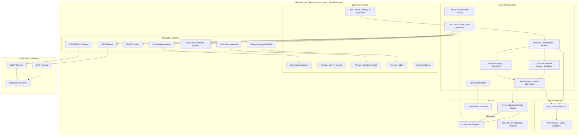

The architecture enforces a fundamental principle: all transaction data, identity data, and compliance evidence remains resident within China. The only information that crosses the border is the payment instruction content required for correspondent banking (payment reference, amount, beneficiary institution, settlement currency), transmitted through CIPS or SWIFT using established correspondent banking protocols. This data classification boundary is enforced at the integration adapter layer.

### 3.3 Five Core Lifecycle Pillars

**Pillar 1: Issuance.** Configuration-driven token creation with asset-class-specific metadata schemas, compliance module selection, governance role assignment, and deployment lifecycle management. The Asset Designer wizard guides operators through parameter capture with real-time validation. Deployment executes through a durable workflow that is idempotent across failures. For cross-border payments, issuance covers programme setup and the initial configuration of the payment token contract.

**Pillar 2: Compliance.** On-chain enforcement of participant eligibility, transfer restrictions, country allowlists, supply limits, holding period controls, and SAFE-threshold approval gates. Compliance modules execute at the ERC-3643 transfer hook layer. Every transfer validates against active compliance modules before execution. No application-layer code can override this check. Compliance officers can add, update, or remove compliance modules through DALP's governance framework without modifying smart contract code.

**Pillar 3: Custody.** Key management integration with HSM providers, multi-signature signing policy configuration, break-glass emergency procedure governance, and wallet administration tooling. DALP's Key Guardian acts as the policy enforcement point for all signing operations. No signing event bypasses the Key Guardian, regardless of which application or API initiates it.

**Pillar 4: Settlement.** Atomic Delivery-versus-Payment (DvP) and Exchange-versus-Payment (XvP) settlement for multi-party transactions. For cross-border payments, settlement covers the on-chain token transfer and the linkage to CIPS/SWIFT confirmation events. Settlement finality is deterministic: either both legs complete or neither does, with full reconciliation evidence.

**Pillar 5: Servicing.** Post-issuance lifecycle management including participant changes, compliance module updates, programme parameter modifications, exception handling, regulatory evidence export, and controlled programme closure or expansion.

### 3.4 Three Platform Foundations

**Foundation 1: Identity and Access Management.** DALP uses OnchainID (ERC-734/735) for participant identity management. KYC, AML, accredited investor, and jurisdiction eligibility claims are issued by designated Trust Anchors and stored as cryptographic attestations on-chain. At transfer time, the compliance engine checks claim validity in milliseconds without synchronous calls to external KYC systems. This architecture eliminates the latency and availability risk of real-time KYC API calls during payment processing.

DALP's platform-level RBAC/ABAC framework governs operator access. Roles are assigned per platform function (operations, compliance, risk, audit) and per asset (governance, supply management, custody, emergency). Bank of China's existing IAM system integrates through SAML 2.0 or OIDC federation, so users authenticate through Bank of China's SSO infrastructure.

**Foundation 2: Integration and Interoperability.** REST API v2 provides the primary programmatic interface with OpenAPI 3.0 documentation and machine-readable schema. GraphQL subgraph provides read-optimised query access for data warehouse feeds. Event webhooks deliver real-time notifications to downstream systems (GL, DW, AML, ITSM) in configurable JSON event format. The CLI provides 301 commands across 26 command groups for scripted automation, batch operations, and DevOps tooling. SDK libraries support Python, TypeScript, and Java for custom integration development.

**Foundation 3: Observability and Operations.** VictoriaMetrics captures time-series metrics at platform, application, blockchain node, and infrastructure layers. Loki aggregates structured logs from all platform components. Tempo provides distributed tracing for API calls and workflow executions. Pre-built Grafana dashboards provide operational visibility without custom development. Alertmanager routes alert notifications to Bank of China's operations teams through configurable channels.

### 3.5 Technology Stack

| Layer | Technology | Licensing Model |
|---|---|---|
| Token Standard | ERC-3643 (T-REX) | Open standard (EIP) |
| Smart Contract Language | Solidity | Open source |
| Execution Engine | Restate (durable workflow) | Dual-license (BSL / commercial) |
| Blockchain Protocol | Private EVM-compatible chain | Configurable (Hyperledger Besu, Quorum, or equivalent) |
| API Framework | REST v2 (OpenAPI 3.0), GraphQL | Open standards |
| Database | PostgreSQL | Open source |
| Observability | VictoriaMetrics, Loki, Tempo, Grafana, Alertmanager | Open source |
| Container Runtime | Kubernetes (Helm charts provided) | Open source |
| Key Management | DALP Key Guardian + PKCS#11 HSM | DALP proprietary + industry standard |
| Identity Standard | OnchainID (ERC-734/735) | Open standard |

---

## 4. Solution Architecture for Cross-Border Tokenized Payments

### 4.1 Target State Architecture

The cross-border tokenized payments solution at Bank of China operates across three logical tiers: the domestic DALP operating environment resident in China; the cross-border messaging layer using CIPS and SWIFT; and the correspondent/counterparty environment at foreign banks. These three tiers have distinct data residency and governance boundaries.

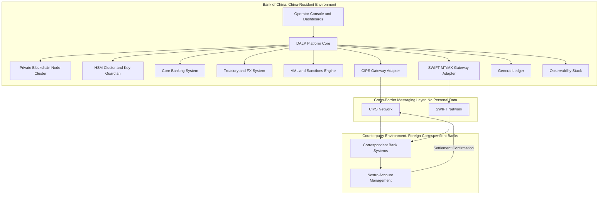

All data at rest and in motion within the China environment is encrypted (AES-256 at rest, TLS 1.3 in transit). Cross-border messages traverse CIPS and SWIFT using their established protocols and carry only the payment instruction content required for settlement. The data boundary is enforced at the CIPS and SWIFT gateway adapters: no personal identifiers, no compliance evidence, no internal transaction metadata crosses the border.

### 4.2 Cross-Border Payment Token Design

The cross-border payment token for Bank of China's programme is implemented as a Configurable Token within DALP. The Configurable Token provides all the governance, compliance enforcement, and lifecycle management capabilities of DALP's standard asset classes, without being constrained to the metadata schemas designed for bonds, equities, or deposits. This flexibility allows Bank of China to define a payment token structure that maps cleanly to its existing accounting, treasury, and CIPS integration models.

| Parameter | Configuration | Rationale |
|---|---|---|
| Token Standard | ERC-3643 via DALP Configurable Token | Compliance enforcement at contract layer |
| Settlement Currency | CNY-denominated on-chain representation | Aligns to CIPS CNY settlement |
| Decimal Precision | 2 (matching CNY fen denomination) | Standard CNY precision |
| Transfer Model | Allowlist: only approved counterparty wallets | Prevents unauthorized transfer to unknown participants |
| Jurisdiction Restriction | Domestic participants + approved cross-border counterparties | SAFE alignment; controlled expansion |
| Supply Control | Governance-approved minting only | SAFE compliance cap configurable |
| Compliance Modules | KYC claim, eligibility, country allowlist, supply limit, SAFE gate, pause | Full regulatory control stack |
| Pausing | Emergency pause controlled by separate Emergency role | Incident response capability |
| Upgrade Path | UUPS proxy pattern | Governance-approved upgrades without token migration |
| Metadata Schema | Extensible: payment reference, counterparty ID, corridor code, settlement date | Custom payment metadata without code changes |

### 4.3 Payment Flow Architecture

The end-to-end cross-border payment flow involves six distinct stages: instruction creation, workflow approval, on-chain compliance check and execution, cross-border instruction dispatch, settlement confirmation, and reconciliation.

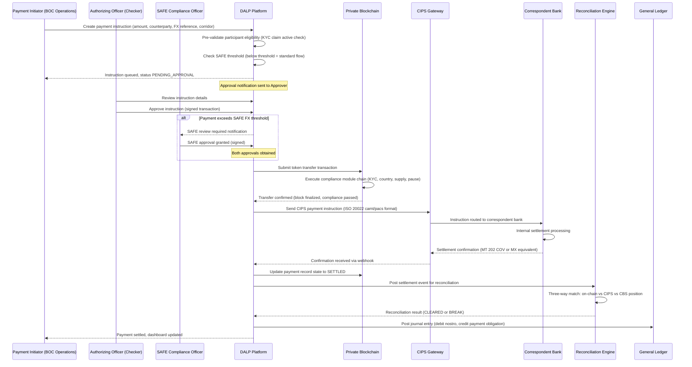

### 4.4 Compliance Enforcement Flow

Compliance enforcement operates at two independently controlled levels: pre-transfer on-chain enforcement (enforced at the smart-contract layer, cannot be bypassed) and workflow-level approval gates (configurable in the DALP workflow engine for SAFE and PBOC-specific controls).

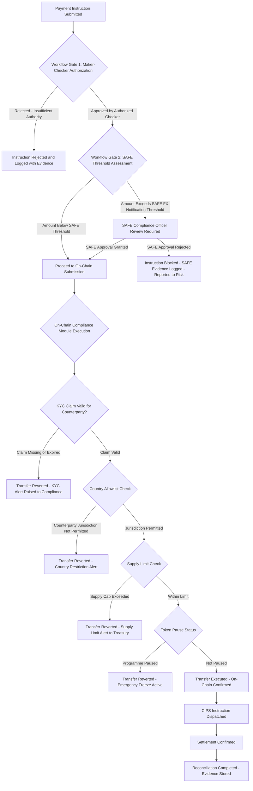

### 4.5 Multi-Currency and Multi-Corridor Support

Bank of China's cross-border payment programme may need to support multiple currency corridors (CNY to USD, CNY to EUR, CNY to HKD) and multiple counterparty types (correspondent banks, central banks, large corporate counterparties). DALP's architecture supports this through per-corridor token instances:

Each currency corridor is represented by a separate Configurable Token instance, with its own compliance module configuration, supply limit, and counterparty allowlist. This provides clean separation of regulatory permissions and audit evidence across corridors, while sharing the same platform infrastructure, observability stack, and governance framework.

New corridors are activated by deploying a new token instance through the Asset Designer (no code changes required) and configuring the CIPS/SWIFT adapter for the new settlement pair. The time to activate a new corridor after initial programme go-live is estimated at 2 to 4 weeks, covering configuration, testing, and compliance approval.

---

## 5. Asset Lifecycle Management

### 5.1 Payment Token Lifecycle Stages

The cross-border payment token lifecycle at Bank of China spans five operational stages, each governed by DALP's workflow engine with full audit evidence at each transition.

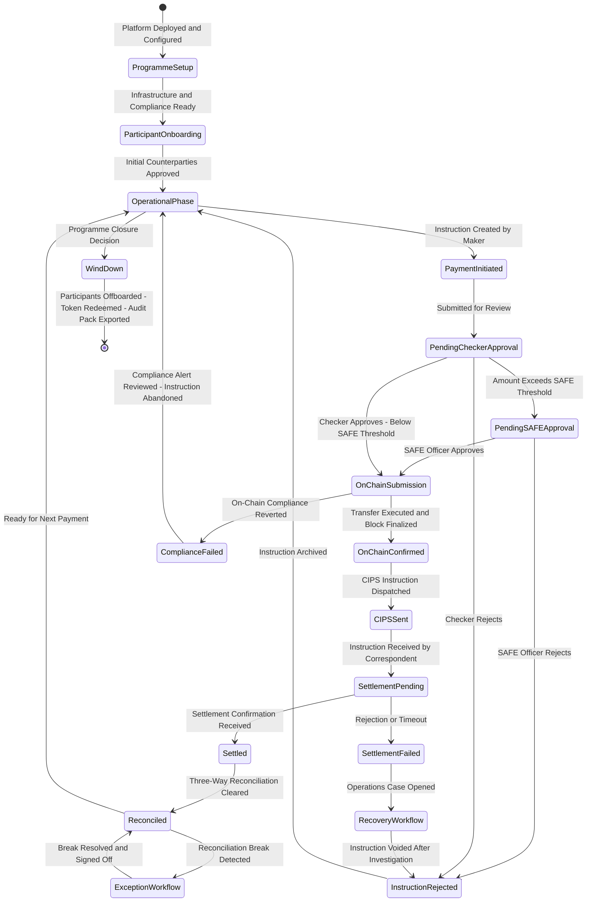

### 5.2 Participant Onboarding and KYC Framework

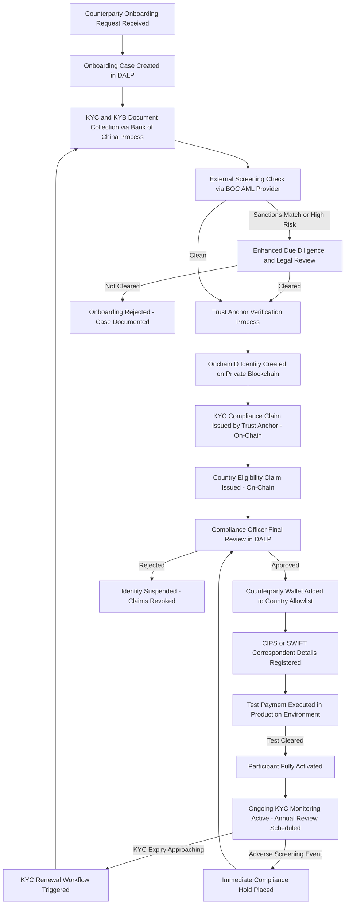

The Trust Anchor model means that KYC verification authority is formally delegated to a designated institution. For Bank of China's programme, Bank of China's own compliance function acts as the primary Trust Anchor, issuing KYC claims for counterparties it has directly verified. A secondary Trust Anchor arrangement with Bank of China's existing KYC utility provider (if any) can be configured for counterparties onboarded through a shared KYC infrastructure.

### 5.3 Programme Expansion Lifecycle

Bank of China's cross-border payment programme is expected to expand from an initial controlled pilot to broader operational deployment. DALP's architecture supports this expansion without re-platforming:

**Expansion Dimension 1: New Counterparties.** Additional correspondent banks or corporate counterparties are onboarded through the participant onboarding workflow described in Section 5.2. Each new counterparty receives an OnchainID identity and is added to the payment token's country allowlist upon compliance approval. No changes to the smart contract or platform infrastructure are required.

**Expansion Dimension 2: New Currencies.** A new currency corridor is activated by deploying a new Configurable Token instance for the target currency pair, configuring the CIPS/SWIFT adapter for the new corridor's settlement accounts, and completing a testing and compliance approval cycle. Time to activate: approximately 3 to 4 weeks from decision to production.

**Expansion Dimension 3: New Business Lines.** The DALP platform license covers all seven asset classes plus Configurable Tokens. Bank of China can use the same platform to launch tokenized trade finance instruments, tokenized deposits, or supply chain finance products without additional licensing. Each new programme follows the same governed onboarding process.

**Expansion Dimension 4: Regulatory Perimeter Changes.** If PBOC or SAFE regulatory guidance evolves to permit or require new controls, compliance modules can be added, updated, or removed through DALP's governance framework. The change management workflow requires compliance officer proposal, risk officer review, governance committee approval, and audit evidence generation. No code changes are required for compliance module reconfiguration.

---

## 6. Compliance and Regulatory Framework

### 6.1 China Regulatory Alignment

Bank of China operates under a multi-regulator compliance environment for cross-border payments. DALP's compliance architecture addresses the following regulatory frameworks:

**PBOC (People's Bank of China) Payment System Oversight:**
PBOC oversees payment system operators and requires transaction record retention, supervisory data access, AML/CFT controls, and business continuity standards. DALP provides: immutable on-chain transaction records with full event lineage accessible through the audit evidence export function; AML/CFT workflow integration with Bank of China's existing screening infrastructure; configurable transaction monitoring thresholds aligned to PBOC guidance; and business continuity architecture meeting PBOC operational resilience expectations. The platform's observability stack generates the KPI and KRI evidence required for PBOC supervisory reporting.

**SAFE (State Administration of Foreign Exchange) Cross-Border Controls:**
SAFE regulations require notification or approval for cross-border FX transactions above defined thresholds. DALP's workflow engine implements configurable approval gates triggered when payment amounts exceed SAFE notification thresholds. The SAFE compliance officer role is a named, audited approval step in the payment workflow. All SAFE-relevant payments are tagged in the reporting stack with full approval evidence and exportable in SAFE reporting format.

**Cybersecurity Law and Data Security Law:**
China's data sovereignty framework prohibits transfer of certain categories of data outside China without explicit approval. DALP's deployment model places all transaction data, identity data, compliance evidence, and operational logs on infrastructure resident within China. The integration adapters for CIPS and SWIFT are designed with a strict data classification boundary: only the payment instruction content required for interbank settlement crosses the border. Personal identifiers, compliance evidence, and internal transaction metadata remain in China.

**Personal Information Protection Law (PIPL):**
Participant identity data is managed through DALP's identity registry, stored in China-resident infrastructure. The OnchainID model stores cryptographic claim hashes on-chain, with underlying personal data held in Bank of China's off-chain identity systems. DALP does not replicate personal data to any external system. Data subject request workflows (access, erasure, portability) are managed by Bank of China's PIPL compliance function, with DALP providing the technical capability to freeze, remove, or export identity data as required.

**Multi-Level Protection Scheme (MLPS 2.0) Level 3:**
DALP's security architecture is designed to support MLPS Level 3 alignment. The evidence artefacts required for MLPS third-level assessment are generated from DALP's observability stack and security logging infrastructure. Specific MLPS control areas covered include: communication network security (TLS 1.3, network segmentation, WAF); area boundary protection (firewall rules, intrusion detection); computing environment security (OS hardening, container security, access control); application security (RBAC/ABAC, audit logging, vulnerability management); data security (AES-256 encryption at rest, key management, backup encryption); security management (change management, incident response, risk assessment).

### 6.2 Compliance Module Stack

DALP provides the following compliance modules directly applicable to Bank of China's cross-border payment programme. All modules are native to the platform and require configuration only, not custom code development.

| Module | Function | Bank of China Application | Configuration Required |
|---|---|---|---|
| Country Allowlist | Restricts token transfers to approved jurisdiction pairs | Domestic participants and approved cross-border correspondent wallets | Configure approved country codes during programme setup |
| Participant KYC Eligibility | Enforces valid KYC claim for all transfer parties | All payment participants must hold an active KYC claim issued by Trust Anchor | Claim topic ID configuration |
| Transfer Lock | Applies individual participant-level transfer restriction | Compliance hold for sanctioned, suspended, or under-investigation participants | Activated by Compliance Officer role |
| Supply Limit | Caps total outstanding token supply | SAFE compliance cap on total cross-border payment token volume outstanding | Supply limit amount configured at programme setup; governance-controlled updates |
| Emergency Pause | Programme-wide immediate suspension | Incident response, PBOC supervisory instruction, or security incident | Emergency role only; immediate effect; auto-reported to risk |
| Daily Transfer Limit | Per-participant daily transfer amount cap | SAFE threshold alignment at participant level | Configurable per participant category |
| Holding Period | Minimum period before token transfer permitted | Settlement netting period control | Configurable; currently set to zero for same-day settlement |
| SAFE Approval Gate (workflow) | Workflow-level gate for FX threshold compliance | Payments above SAFE notification threshold trigger SAFE officer review step | SAFE threshold amount configured by compliance team |

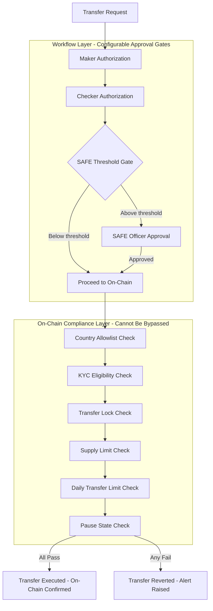

### 6.3 AML/CFT Integration Model

DALP integrates with Bank of China's existing AML/CFT and sanctions screening infrastructure through the API adapter framework. The integration model has three trigger points:

**At Participant Onboarding:** The onboarding workflow invokes Bank of China's screening API before Trust Anchor KYC claims are issued. Adverse media hits, sanctions list matches, and PEP flags are surfaced in the onboarding case workflow. The compliance officer reviews screening results before approving participant activation.

**At Transaction Initiation:** For transactions above a configurable threshold, the payment workflow includes an optional real-time pre-screening step against Bank of China's AML system. The screening result is logged as part of the payment instruction record, creating an auditable decision trail.

**Post-Transaction Monitoring:** DALP emits standardized payment events to Bank of China's AML system via webhook. Transaction monitoring rules in the AML system can flag patterns across DALP payment events and create cases in Bank of China's case management system without requiring DALP-side changes.

### 6.4 Regulatory Evidence Generation

DALP's audit evidence capability generates the following artefact types for PBOC, SAFE, and internal audit purposes:

| Evidence Type | Content | Format | Trigger |
|---|---|---|---|
| Payment audit trail | Complete event sequence: creation, approval, on-chain execution, CIPS confirmation, reconciliation | Signed JSON or structured CSV | On demand or scheduled export |
| SAFE filing evidence | Cross-border payment summary with approval evidence for SAFE-threshold transactions | SAFE-formatted structured export | Per SAFE reporting requirement |
| Compliance check record | For each transfer: compliance module results, participant eligibility at time of transfer | On-chain permanent record | Automatic at every transfer |
| Configuration change history | All governance-level parameter changes with proposer, approver, timestamp, rationale | On-chain immutable + operational DB | Automatic at every governance event |
| Access log extract | All user sessions, API calls, privileged access events | SIEM-compatible structured log | On demand or scheduled |
| Key management activity | Key rotation events, break-glass access events, HSM status | Immutable audit log | On demand |
| MLPS compliance evidence | Full observability export for MLPS third-level assessment | Structured export per MLPS evidence framework | Annual or on demand |

---

## 7. Integration Architecture

### 7.1 Integration Overview and Principles

DALP integrates with Bank of China's enterprise landscape through a well-defined, documented, and versioned API integration model. The integration design follows five principles aligned to Bank of China's operational requirements:

**Principle 1: No changes to existing systems.** DALP integrates with Bank of China's existing systems through standard API calls and event webhooks. Bank of China's core banking system, treasury platform, AML engine, and GL are consumers or producers of DALP data, not platforms that need to be modified to accommodate DALP.

**Principle 2: Idempotency and retry safety.** All outbound integration calls from DALP are idempotent. Retry on failure does not create duplicate payments or duplicate GL postings. Incoming events are deduplicated by event ID before processing.

**Principle 3: Observability at every integration point.** Every API call and webhook event is logged with the caller identity, timestamp, payload hash, and response code. Integration failures are surfaced in the observability dashboard within 60 seconds of occurrence.

**Principle 4: Version-controlled interfaces.** DALP API interfaces are versioned. Bank of China will receive advance notice (minimum 90 days) of breaking interface changes. Backward-compatible additions do not require version increments.

**Principle 5: Security at every boundary.** All integration calls use mTLS client certificates and OAuth 2.0 bearer tokens. Integration credentials are managed through the secrets management system (Vault), not embedded in application configuration.

### 7.2 Integration Architecture Diagram

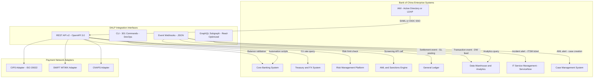

### 7.3 CIPS Integration Detail

CIPS (Cross-Border Interbank Payment System) is the primary correspondent settlement infrastructure for cross-border RMB payments. Bank of China is a direct participant in CIPS. DALP's CIPS integration connects to Bank of China's existing CIPS participant infrastructure.

**CIPS Message Flow:**
When a payment token transfer is confirmed on-chain, DALP's CIPS adapter generates a CIPS payment instruction and submits it to Bank of China's CIPS gateway. The instruction format is aligned to CIPS standard message specifications (ISO 20022-based XML). DALP's field mapping engine translates between DALP payment token metadata fields and CIPS message fields based on a configuration mapping defined during implementation.

**CIPS Message Types Supported:**
- pacs.008 (Customer Credit Transfer): Used for cross-border customer payment instructions
- pacs.009 (Financial Institution Credit Transfer): Used for interbank settlement legs
- camt.056 (Payment Cancellation Request): Used for payment recall/reversal workflow
- camt.029 (Resolution of Investigation): Confirmation of recall outcome

**CIPS Settlement Confirmation:**
CIPS settlement confirmations are received by DALP's CIPS listener service via Bank of China's CIPS gateway. Confirmations are mapped to DALP payment record updates via the event processor. A payment record transitions to SETTLED status upon receipt of a positive settlement confirmation. A payment record transitions to FAILED status upon receipt of a rejection or timeout.

**CIPS Integration Prerequisites:**
- Bank of China provides CIPS sandbox credentials by Week 6 of the implementation programme
- CIPS-to-DALP field mapping specification is jointly agreed in Phase 1 (Weeks 3 to 4)
- CIPS connectivity (network firewall rules, certificate configuration) is configured by Bank of China IT in Week 5

### 7.4 SWIFT Integration Detail

For cross-border payments to correspondent banks in jurisdictions not covered by CIPS direct settlement, DALP integrates with Bank of China's SWIFT infrastructure:

**SWIFT Message Types Supported:**
- MT 103 (Single Customer Credit Transfer): Standard cross-border customer payment
- MT 202 (Financial Institution Transfer): Interbank settlement
- MT 202 COV (Cover Payment): SWIFT Standards Release 2009 cover payment format
- MX pacs.008 / pacs.009: ISO 20022 MX format for institutions with MX capability

**SWIFT Confirmation Handling:**
Positive acknowledgements (MT 999 or MX equivalent) and settlement confirmations update the DALP payment record state. Rejections (MT 196, MT 296) trigger the failed settlement recovery workflow described in Section 10.3.

**SWIFT gpi (Global Payments Innovation):** DALP's SWIFT adapter supports SWIFT gpi tracker integration for real-time payment status visibility. This capability allows Bank of China's operations team to monitor cross-border payment status in real time, including time-in-flight and correspondent bank processing status.

### 7.5 Core Banking Integration

**Pre-Payment Balance Validation:** Before initiating a cross-border payment token transfer, DALP queries Bank of China's core banking API to validate available nostro account balance in the designated funding account for the payment corridor. If insufficient balance, the payment workflow pauses and alerts the treasury team.

**Post-Settlement GL Posting:** Upon payment settlement confirmation, DALP emits a webhook event carrying the settlement details (payment reference, amount, currency, settlement timestamp, counterparty identifier). The GL posting webhook adapter translates this into Bank of China's accounting system's journal entry format. GL posting logic (debit nostro, credit payment obligation) is configured in the webhook adapter during implementation.

**Reconciliation Feed:** DALP generates a daily reconciliation file containing all payments initiated, executed, and settled during the business day. This file is delivered to Bank of China's core banking reconciliation engine in a format agreed during implementation (CSV or JSON).

### 7.6 IAM Integration

Bank of China's existing IAM infrastructure (Active Directory, Azure AD, or equivalent) integrates with DALP through federation:

**Authentication:** DALP supports SAML 2.0 and OIDC/OAuth 2.0 for SSO authentication. Users authenticate to DALP using their Bank of China credentials through the existing SSO infrastructure. DALP maintains no separate user credential store.

**Authorization Mapping:** DALP's RBAC/ABAC roles are mapped to IAM group memberships through a role mapping configuration. Bank of China's IAM team manages group membership; DALP enforces the corresponding role permissions. The role mapping configuration is version-controlled and audited.

**Privileged Access Management:** DALP's emergency and governance roles are subject to additional controls through Bank of China's PAM solution (CyberArk or equivalent). All privileged access sessions to DALP are recorded and available for audit review.

### 7.7 Observability Integration

DALP's observability stack (VictoriaMetrics, Loki, Tempo, Grafana) integrates with Bank of China's enterprise monitoring infrastructure:

**SIEM Integration:** DALP's structured logs are forwarded to Bank of China's SIEM platform via a syslog or Fluentd adapter. Security-relevant events (authentication failures, privileged access, compliance reverts, key management events) are tagged with appropriate severity levels for SIEM correlation rules.

**ITSM Integration:** DALP's Alertmanager forwards alert notifications to Bank of China's IT Service Management platform (ServiceNow or equivalent) via webhook. Alerts create incidents in the appropriate service queue with the platform-generated diagnostic context.

---

## 8. Security and Key Management

### 8.1 Security Architecture

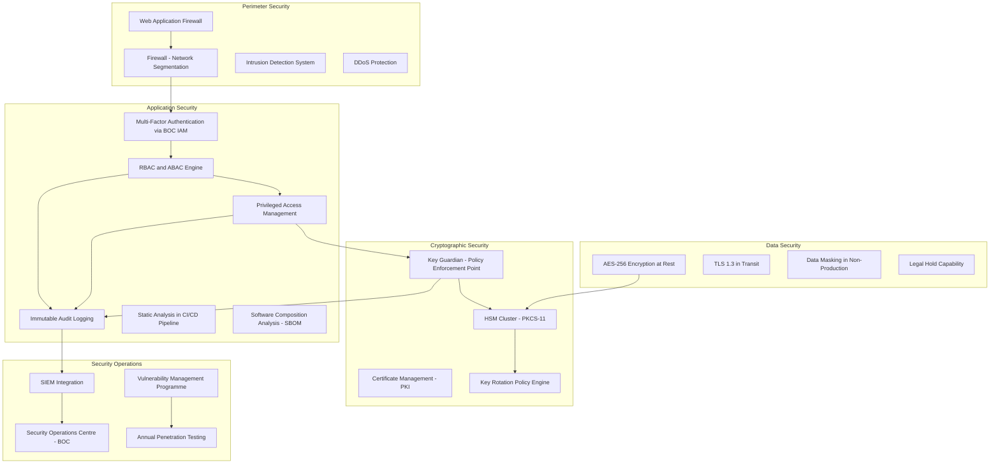

### 8.2 Key Hierarchy and Management

DALP's Key Guardian module implements a three-tier key hierarchy that provides institutional-grade cryptographic governance:

**Tier 1: Root Key (Master Key).** Stored exclusively in the HSM. Never exported. Accessed only under dual-control conditions during key ceremonies. Used to derive lower-tier keys. Root key compromise is catastrophic but requires physical access to the HSM under dual-control conditions.

**Tier 2: Signing Keys.** Derived from the Root Key within the HSM. Used for all transaction signing operations. Rotate on a configurable schedule (recommended: 90-day rotation for high-volume payment operations). Rotation is automated through the Key Guardian with notifications to security and compliance owners.

**Tier 3: Session Keys.** Short-lived keys (typically 24-hour lifetime) generated for individual application sessions. Used for API authentication and session encryption. Not used for blockchain transaction signing.

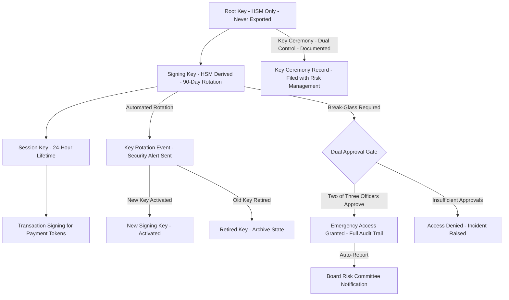

### 8.3 HSM Configuration for China Deployment

For Bank of China's on-premises deployment in China, DALP supports the following HSM vendors through the PKCS#11 standard interface:

| HSM Vendor | Model | China Availability | FIPS 140-2 Level |
|---|---|---|---|
| Thales Group | Luna Network HSM 7 | Available in China | Level 3 |
| Securosys | PrimusHSM | Available in China | Level 3 |
| Utimaco | SecurityServer Se Gen2 | Available in China | Level 3 |
| Entrust | nShield Connect XC | Available in China | Level 3 |

Bank of China selects the HSM vendor and is responsible for hardware procurement and physical installation. SettleMint provides the PKCS#11 integration configuration, key ceremony documentation, and HSM integration testing support.

HSM cluster configuration for high availability requires a minimum of two HSM units in the primary data centre with synchronized key material, and at least one HSM unit in the disaster recovery data centre. Key material synchronization between HSM units uses the vendor's proprietary secure key replication protocol.

### 8.4 Smart Contract Security

The ERC-3643 (T-REX) smart contracts deployed by DALP have undergone independent security audits by recognized blockchain security firms. Audit reports are available to Bank of China's evaluation committee under NDA. Key audit findings for the current version:

| Audit Area | Status | Evidence Available |
|---|---|---|
| Integer overflow and underflow protection | Clean | Audit report |
| Reentrancy protection | Clean | Audit report |
| Access control correctness | Clean | Audit report |
| Upgrade mechanism security (UUPS) | Clean - timelocked upgrade | Audit report |
| Compliance module isolation | Clean | Audit report |
| Emergency function authorization | Clean | Audit report |

Smart contract upgrades require governance committee approval (minimum four of five committee members), a 48-hour timelock after approval before execution, and independent security review of the upgrade code. These controls ensure no unilateral changes can be made to the smart contracts by SettleMint or any individual at Bank of China.

### 8.5 Vulnerability Management and Patch Management

| Control | Frequency | Process |
|---|---|---|
| Static code analysis (SAST) | Every CI/CD build | Automated; blocks deployment on critical findings |
| Software composition analysis (SCA) | Every CI/CD build | SBOM generated; known CVEs flagged and tracked |
| Container image scanning | Pre-deployment | Only signed, scanned images deployed to production |
| Third-party penetration testing | Annual (minimum) | Findings tracked to remediation with SLA by severity |
| Infrastructure hardening review | Quarterly | CIS Benchmark alignment for Kubernetes nodes |
| Critical security patch | Within 72 hours | Emergency change process; post-implementation review |
| High severity patch | Within 14 days | Standard change process |

---

## 9. Custody Model

### 9.1 Bank of China Custody Architecture

For Bank of China's cross-border payment programme, the custody arrangement is bank-controlled: Bank of China holds the private keys for all operational wallets, managed through DALP's Key Guardian with HSM backing. SettleMint has no access to Bank of China's private keys under any circumstances. The custody model is fully self-sovereign.

This is a critical design principle distinguishing DALP from managed custody solutions. DALP provides the key management infrastructure and governance framework; Bank of China retains exclusive cryptographic control.

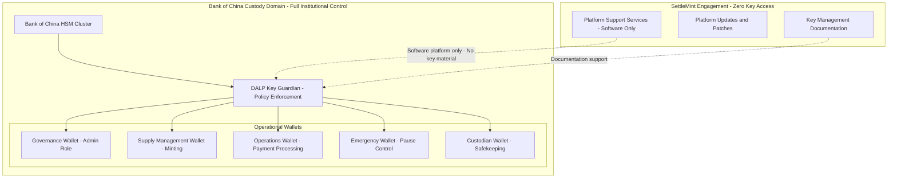

### 9.2 Multi-Signature Policy Configuration

Critical governance operations require multi-signature authorization enforced through DALP's governance framework. The following signature thresholds are recommended for Bank of China's programme:

| Operation | Recommended Signature Requirement | Rationale |
|---|---|---|
| Standard cross-border payment | 2 of 2 (Maker + Checker) | Dual-control for every payment |
| Payment above SAFE threshold | 3 of 3 (Maker + Checker + SAFE Officer) | Regulatory compliance |
| Supply limit increase | 4 of 5 (Risk, Compliance, Treasury, Legal, CTO) | Material programme parameter change |
| New counterparty allowlist addition | 2 of 3 (Compliance, Risk, Operations) | KYC approval gate |
| Emergency programme pause | 1 of 3 Emergency Officers | Immediate response; any single officer sufficient |
| Smart contract upgrade | 4 of 5 governance committee | Highest control level; 48-hour timelock |
| Key rotation initiation | 2 of 2 (Security Officer + Technology Director) | Dual-control for cryptographic operations |
| Break-glass key access | 2 of 3 (CISO, CRO, CTO) | Exceptional circumstance only; auto-reported |

---

## 10. Settlement and Reconciliation

### 10.1 Settlement Model

Cross-border tokenized payment settlement at Bank of China operates across two settlement legs that must both complete for a payment to be considered final:

**On-Chain Leg:** The payment token transfer from Bank of China's operational wallet to the registered counterparty wallet. This leg achieves finality when the transfer transaction is included in a confirmed block on the private blockchain. On-chain finality is deterministic, meaning the transfer either succeeds or reverts with no intermediate state.

**Off-Chain Cash Leg:** CIPS or SWIFT settlement of the corresponding cash amount in the correspondent account. This leg achieves finality when Bank of China's CIPS participant account receives a settlement confirmation from the CIPS settlement agent.

DALP does not implement atomic DvP across these two legs in the traditional sense, because the cash leg settles through CIPS infrastructure outside DALP's direct control. Instead, DALP manages the linkage between the two legs: the on-chain leg is executed first, followed by CIPS instruction dispatch, and settlement confirmation updates the DALP payment record. Reconciliation (Section 10.2) validates that both legs have completed correctly.

### 10.2 Three-Way Reconciliation Architecture

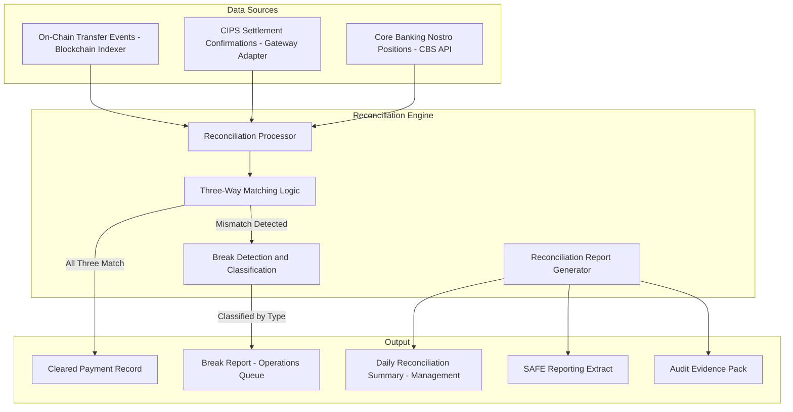

Reconciliation runs on three schedules: intraday every 30 minutes (for monitoring); end-of-day (comprehensive three-way match); and on-demand (for exception investigation). Break classification logic distinguishes between: timing breaks (one leg confirmed, other pending within SLA); amount breaks (on-chain amount differs from CIPS amount); reference breaks (confirmation reference does not match instruction reference); and orphan records (on-chain transfer with no CIPS instruction, or CIPS confirmation with no on-chain match).

### 10.3 Failed Settlement Scenarios and Recovery

| Scenario | Detection Method | Initial Response | Resolution |
|---|---|---|---|
| On-chain transfer confirmed; CIPS instruction not generated | DALP event log: CIPS_SEND_FAILED | Operations alert; payment status PENDING_CIPS_RETRY | Automatic retry x3; if failed, operations manual CIPS submission |
| CIPS instruction sent; no confirmation within SLA | Timeout alert from CIPS adapter | Operations case opened; CIPS status query | Manual CIPS status check; resubmit or initiate camt.056 recall |
| CIPS instruction rejected (return message received) | CIPS rejection event received | Payment status FAILED; operations alert | Payment recall workflow; on-chain record updated; GL reversal posted |
| Correspondent bank recall request received | camt.056 received from correspondent | Compliance review of recall reason | Accept or reject via governance workflow; if accepted, governance-controlled force transfer |
| Three-way reconciliation break: on-chain vs CIPS amount mismatch | Daily reconciliation report | Priority 1 break: operations + compliance + risk alerted | Dual-signature resolution; audit evidence preserved |
| System outage during payment workflow | Health check failure; Restate workflow paused | Operations alert; service failover to DR | On recovery: Restate replays from last confirmed checkpoint; no duplicate payments |

---

## 11. Operational Model and Observability

### 11.1 First-Line Operations Model

The first-line operational team at Bank of China manages day-to-day cross-border payment processing through DALP's operator console. The following daily operations cadence is recommended:

**Start of Day (08:00 CST):**
- Review overnight reconciliation report from prior evening's batch run
- Confirm zero outstanding breaks from prior day
- Verify CIPS connectivity status (green status on observability dashboard)
- Review pending payments in approval queue
- Confirm blockchain node health (all nodes synchronised)
- Sign daily operational readiness attestation (recorded in DALP audit log)

**Intraday Operations:**
- Process payment instruction queue (maker creates, checker approves)
- Monitor SAFE threshold alerts in real time (DALP dashboard)
- Review AML case management queue from prior day's transaction monitoring
- Respond to CIPS status queries and correspondent bank inquiries

**End of Day (18:00 CST):**
- Confirm end-of-day reconciliation run completed
- Review daily reconciliation summary report
- Sign off on any outstanding breaks or escalate to operations manager
- Confirm CIPS settlement batch confirmed by CIPS
- Archive daily operations log

### 11.2 Observability Stack

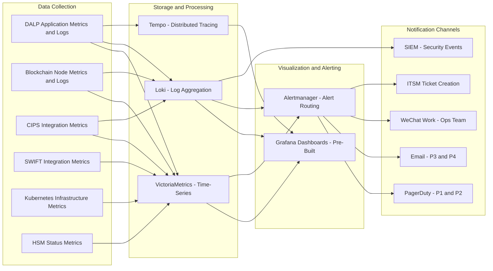

**Pre-Built Dashboards:**
- Payment Operations Dashboard: Volume, throughput, approval queue depth, pending SAFE reviews
- CIPS Integration Dashboard: Message latency, success rate, confirmation timing, pending/failed counts
- Compliance Dashboard: Compliance check pass/fail rate, KYC expiry calendar, supply utilization
- Reconciliation Dashboard: Reconciliation run status, break count and age, resolution rate
- Blockchain Health Dashboard: Node sync status, block production rate, transaction finality time
- Key Management Dashboard: Last rotation date, next rotation schedule, break-glass events
- Security Dashboard: Authentication failures, privilege escalation events, compliance reverts
- Infrastructure Dashboard: CPU, memory, disk, network by service; Kubernetes pod health

### 11.3 Business Continuity and Disaster Recovery

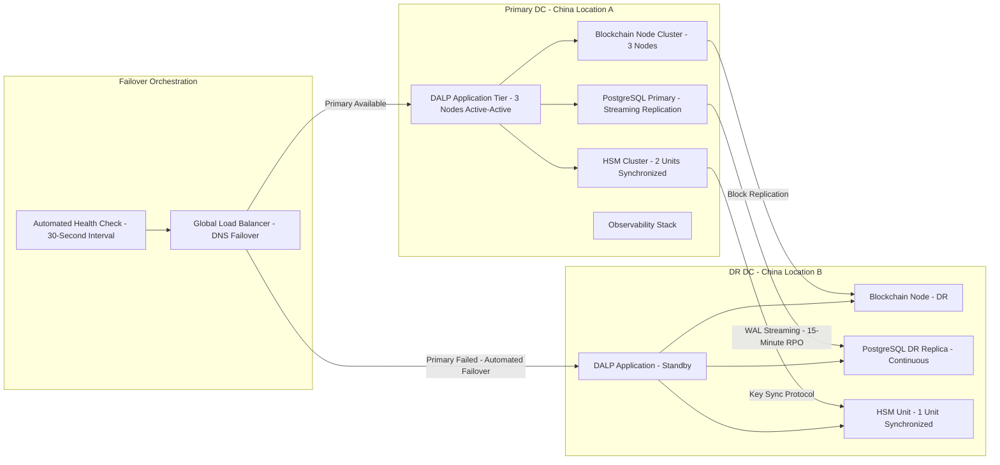

| BCP Metric | Target | Architecture Basis |
|---|---|---|
| Recovery Time Objective | 4 hours | Multi-AZ active-standby with automated failover |
| Recovery Point Objective | 15 minutes | Continuous PostgreSQL WAL streaming and blockchain state replication |
| Backup Frequency | Every 15 minutes (incremental); Daily (full) | Encrypted backups to DR data centre |
| Failover Test Frequency | Semi-annual | Full DR activation with reconciliation validation |
| DR Communication Protocol | Automated PagerDuty + direct CISO and CRO notification | Alertmanager integration |

---

## 12. Deployment Architecture

### 12.1 Recommended Deployment Model

SettleMint recommends an on-premises deployment for Bank of China's production environment, with private cloud (approved Chinese provider) for non-production environments. This configuration satisfies MLPS Level 3 requirements, data residency obligations under the Cybersecurity Law, and PBOC payment system operational resilience standards.

### 12.2 Environment Architecture

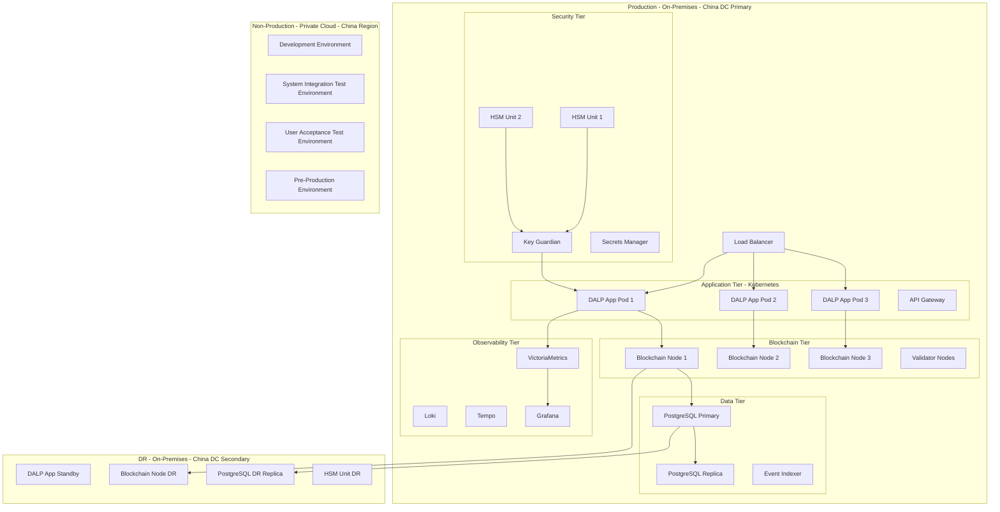

### 12.3 Kubernetes Configuration

DALP deploys on Kubernetes using Helm charts provided by SettleMint. The Helm charts are parameterized for Bank of China's specific configuration and can be managed by Bank of China's Kubernetes operations team with SettleMint support.

| Component | Replicas | Resource Allocation | High Availability |
|---|---|---|---|
| DALP Application | 3 (active-active) | 4 CPU, 8GB RAM per pod | Pod anti-affinity across nodes |
| Blockchain Nodes | 3 (consensus quorum) | 8 CPU, 16GB RAM per node | Distributed consensus; no SPOF |
| PostgreSQL | 1 primary + 1 replica | 8 CPU, 32GB RAM | Streaming replication |
| Event Indexer | 2 (active-standby) | 2 CPU, 4GB RAM | Automatic failover |
| API Gateway | 2 (active-active) | 2 CPU, 4GB RAM | Load balanced |
| Key Guardian | 2 (active-passive) | 2 CPU, 4GB RAM | HSM-backed; passive activates on primary failure |
| Observability Stack | Distributed | 4 CPU, 16GB RAM total | Non-critical for payment operations |

---

## 13. Implementation Approach

### 13.1 Programme Overview

The 22-week implementation programme delivers Bank of China's cross-border tokenized payment capability in four phased gates with defined exit criteria at each phase boundary.

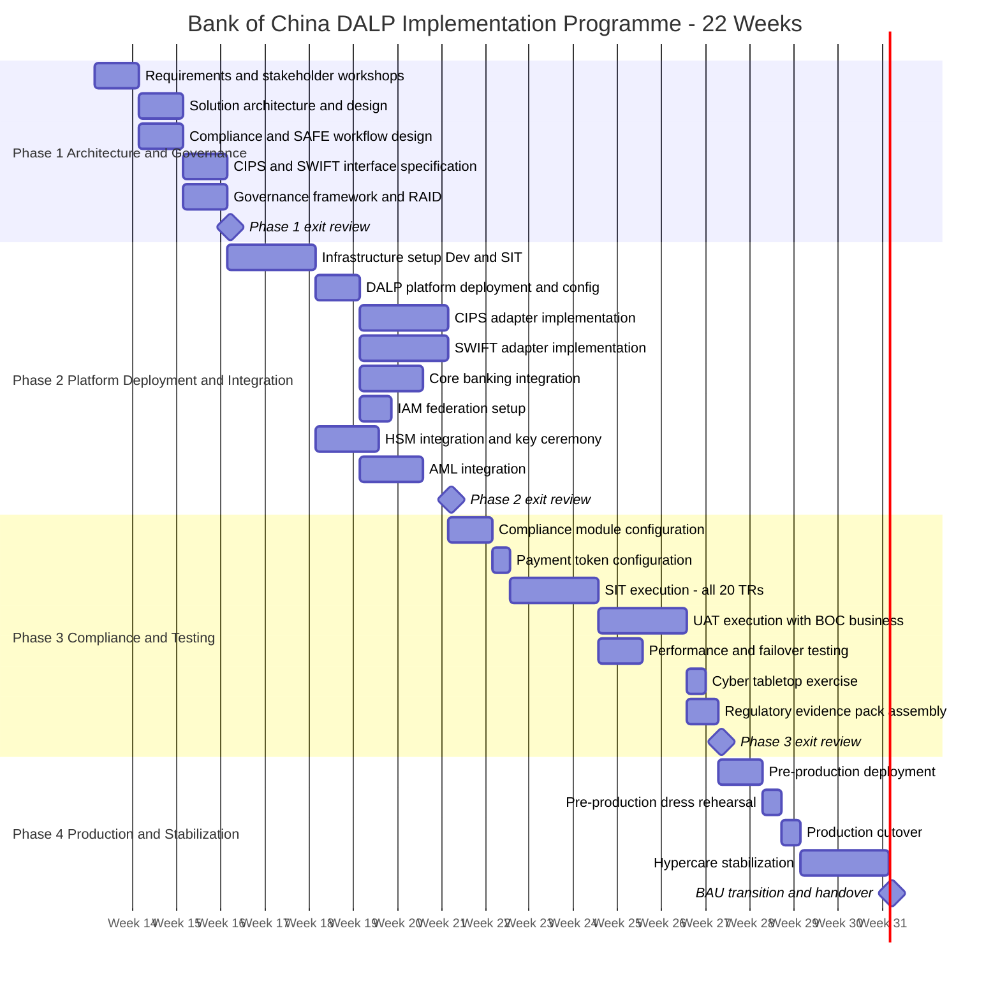

### 13.2 Phase 1: Architecture and Governance (Weeks 1 to 5)

**Objective:** Confirm programme scope, resolve all architectural decisions, establish governance framework, and produce design artefacts sufficient for Bank of China's architecture review board.

**Key activities and deliverables:**

*Requirements workshops (Week 1):* Joint sessions with Bank of China business, technology, risk, compliance, and legal stakeholders. Agenda: programme scope confirmation; use case priority; regulatory constraints; SAFE threshold configuration; integration priorities; data classification decisions; go-live success criteria.

*Solution architecture design (Weeks 2 to 3):* SettleMint delivers target-state architecture document covering platform deployment, blockchain network design, key management architecture, compliance module configuration, and integration architecture. Bank of China's architecture review board reviews and approves.

*CIPS and SWIFT interface specification (Weeks 2 to 4):* Joint sessions with Bank of China treasury, CIPS connectivity, and SWIFT teams. Output: field mapping specification for CIPS pacs.008 and SWIFT MT 103; confirmation handling workflow; failure and recall procedures.

*Compliance and SAFE workflow design (Weeks 2 to 4):* Joint sessions with Bank of China compliance and legal. Output: SAFE threshold configuration; approval gate workflow design; compliance officer role definition; AML integration points.

*Governance framework establishment (Week 5):* Steering committee terms of reference; design authority composition; RAID ownership assignments; change management process; programme communication plan.

**Phase 1 exit criteria:** Architecture document approved by ARB; CIPS interface specification agreed; SAFE workflow approved by compliance; governance framework signed off by programme sponsor; RAID register initialized with all identified risks, assumptions, issues, and dependencies.

### 13.3 Phase 2: Platform Deployment and Integration (Weeks 6 to 12)

**Objective:** Deploy DALP to development and SIT environments; implement and test all integrations; complete HSM installation and key ceremony.

**Key activities:**

Infrastructure setup (Week 6 to 7): Kubernetes cluster provisioning and hardening by Bank of China IT with SettleMint advisory. DALP Helm chart deployment to development environment. Network firewall rules configuration for CIPS and SWIFT connectivity.

DALP core deployment (Week 7): Platform installation, configuration, and smoke testing in development. Identity registry initialisation. Trust Anchor configuration for Bank of China compliance function.

CIPS adapter implementation (Weeks 7 to 9): CIPS message format mapping implementation per Phase 1 specification. CIPS sandbox connectivity testing. End-to-end test payment in sandbox environment.

SWIFT adapter implementation (Weeks 7 to 10): SWIFT MT 103 and MX adapter configuration. SWIFT Alliance Access or Bureau Service connectivity testing. MT 202 COV and camt.056 recall workflow testing.

Core banking integration (Weeks 8 to 10): Balance validation API integration. GL posting webhook configuration and testing. Daily reconciliation file format configuration.

HSM integration and key ceremony (Weeks 7 to 9): HSM hardware installed and configured by Bank of China IT. PKCS#11 integration configured by SettleMint. Initial key ceremony conducted under dual-control conditions with Bank of China security and SettleMint key management specialist. Ceremony documentation filed with Bank of China risk management.

IAM federation (Week 8): SAML 2.0 or OIDC federation configured. Role mapping from Bank of China IAM groups to DALP platform roles. SSO authentication tested with Bank of China test accounts.

AML integration (Weeks 9 to 11): AML screening API at onboarding configured and tested. Transaction monitoring webhook to Bank of China's AML system tested. Case creation workflow validated.

**Phase 2 exit criteria:** DALP deployed and accessible in SIT environment; all integration adapters tested in sandbox/mock environments; HSM key ceremony completed and documented; IAM federation operational; SIT environment ready for Phase 3 testing.

### 13.4 Phase 3: Compliance Configuration and Testing (Weeks 13 to 18)

**Objective:** Configure all compliance modules; execute SIT, UAT, and non-functional testing; assemble regulatory evidence pack.

**Key activities:**

Compliance module configuration (Week 13): Country allowlist configuration for approved cross-border corridors. KYC eligibility claim topic configuration. SAFE threshold amount configured per Bank of China compliance. Supply limit set per SAFE compliance cap. Pause role assignment confirmed.

Payment token configuration (Week 13): Configurable Token deployed with Bank of China-specific metadata schema. Payment reference fields, corridor code, FX rate reference configured. Token supply initialised to zero.

SIT execution (Weeks 14 to 15): Joint SIT team executes test scenarios covering all 20 technical requirements. Test evidence documented per requirement. Defects tracked and resolved. SIT sign-off report produced.

UAT execution (Weeks 15 to 17): Bank of China business users execute payment operation scenarios. UAT scenario coverage includes: standard payment; SAFE-threshold payment; counterparty onboarding; compliance hold; emergency pause; reconciliation break; system failover. UAT sign-off by Bank of China business sponsor.

Performance testing (Week 15): 500 concurrent payment instructions; sub-second compliance check performance target; blockchain throughput under load; CIPS adapter latency under peak volume.

Failover testing (Week 16): Primary node failure simulation; DR activation; RTO measurement against 4-hour target; reconciliation validation post-failover.

Cyber tabletop exercise (Week 17): Wallet key compromise scenario simulation; break-glass procedure execution; incident response workflow; notification chain validation.

Regulatory evidence pack (Week 18): Complete evidence pack for PBOC/SAFE regulatory engagement if required: architecture document, control mapping, test evidence, key ceremony records, MLPS alignment assessment.

**Phase 3 exit criteria:** All 20 TRs covered with evidence; performance targets met; failover test passed; UAT sign-off obtained; regulatory evidence pack assembled; all critical and high defects resolved.

### 13.5 Phase 4: Production Cutover and Stabilization (Weeks 19 to 22)

**Objective:** Deploy production environment; execute controlled go-live; stabilize BAU operations.

**Key activities:**

Pre-production deployment (Week 19): Full production-equivalent environment deployed. Configuration promoted from SIT. Production key ceremony conducted. Integration adapters configured for production CIPS and SWIFT endpoints.

Pre-production dress rehearsal (Week 19 to 20): Full cutover simulation with complete participant set. First test payments executed in pre-production. Reconciliation validated. Operations team executes all daily procedures.

Production cutover (Week 20 to 21): Go/no-go decision criteria reviewed by programme sponsor, technology director, and compliance officer. Production deployment executed during approved maintenance window. Day-one reconciliation validated against zero starting balance. First live payment executed and confirmed.

Hypercare stabilization (Weeks 21 to 22): Daily operations review (Bank of China operations lead + SettleMint programme manager). Defect triage and resolution. KPI/KRI monitoring against targets. SettleMint programme manager on-call for P1/P2 escalation. Transition criteria review at end of Week 22.

**BAU transition criteria:** Zero outstanding critical defects; reconciliation clean for 5 consecutive business days; first-line operations team fully trained and runbooks validated; support model activated and P1 escalation tested; SettleMint programme manager transitions from on-site to remote support.

---

## 14. Testing Strategy

### 14.1 Test Strategy Overview

### 14.2 UAT Scenario Coverage

| Scenario ID | Scenario Name | Actors | Expected Outcome |
|---|---|---|---|
| UAT-001 | Standard cross-border payment - below SAFE threshold | Operations Maker, Operations Checker | Payment settled via CIPS; reconciliation cleared; GL posting confirmed |
| UAT-002 | Cross-border payment exceeding SAFE threshold | Operations Maker, Operations Checker, SAFE Officer | Three-way approval captured; payment settled; SAFE evidence logged |
| UAT-003 | Payment with SAFE officer rejection | Operations Maker, Operations Checker, SAFE Officer | Payment blocked; rejection logged with evidence; instruction archived |
| UAT-004 | New counterparty onboarding - standard KYC | Compliance Officer, Trust Anchor | Participant activated; allowlist updated; test payment succeeds |
| UAT-005 | Counterparty compliance hold | Compliance Officer | Transfer to suspended participant reverts on-chain; alert raised |
| UAT-006 | Programme-wide emergency pause | Emergency Officer | All transfers blocked immediately; pause event logged; resumption requires governance approval |
| UAT-007 | CIPS instruction failure and retry | Operations | Failure alert raised; retry executed; payment settled on retry; reconciliation cleared |
| UAT-008 | CIPS rejection and recall | Operations, Compliance | Recall workflow executed; on-chain record updated; GL reversal posted |
| UAT-009 | Reconciliation break - deliberate injection | Operations | Break detected in daily reconciliation; break report generated; case opened |
| UAT-010 | Break-glass key access | CISO + CRO | Dual approval required; access granted; event logged; Board Risk Committee notified |
| UAT-011 | System failover simulation | Operations, IT | DR activated; payments resume on standby; reconciliation validated post-failover |
| UAT-012 | Audit evidence export | Internal Audit | Full payment audit trail exported; format validated; evidence complete |
| UAT-013 | Compliance module update | Compliance Officer, Governance | New country added to allowlist; governance approval workflow completed; change recorded |
| UAT-014 | Data residency validation | IT Security, Compliance | Confirm no personal data crosses border under all payment scenarios |

---

## 15. Support and SLA

### 15.1 Support Model

SettleMint provides Premium Support for Bank of China's cross-border payment programme with the following coverage:

| Support Element | Detail |
|---|---|
| Coverage Hours | P1: 24/7/365; P2/P3: 08:00 to 20:00 CST Mon to Fri |
| Communication Channels | Dedicated Slack channel; secure email; direct phone for P1/P2 |
| Named Support Engineer | Single named contact for Bank of China programme |
| Proactive Monitoring | SettleMint monitors platform health dashboard; alerts Bank of China within 15 minutes of P1 detection |
| Quarterly Reviews | Platform health, performance, upcoming releases, roadmap briefing |
| Release Management | Advance notice of all releases (14 days for minor; 90 days for major); release notes with impact assessment |
| Security Advisories | Immediate notification of critical CVEs affecting DALP dependencies |

### 15.2 Escalation Path

| Severity | Initial Contact | Escalation 1 (30 min no response) | Escalation 2 (1 hour) |
|---|---|---|---|
| P1 | SettleMint 24/7 on-call engineer | SettleMint Support Manager | SettleMint CTO |
| P2 | SettleMint named support engineer | SettleMint Support Manager | SettleMint VP Engineering |
| P3/P4 | SettleMint support ticket queue | Named support engineer | Support Manager (within SLA) |

### 15.3 SLA Table

| Metric | Target | Measurement |
|---|---|---|
| Platform Availability | 99.9% monthly | Excluding planned maintenance |
| P1 Response Time | 15 minutes | Alert receipt to SettleMint acknowledgement |
| P1 Restoration Target | 4 hours | Alert receipt to service restoration |
| P2 Response Time | 1 hour | Alert receipt to SettleMint acknowledgement |
| P3 Response Time | 4 business hours | Ticket submission to acknowledgement |
| Critical Patch Deployment | 72 hours | CVE or advisory publication |
| Planned Maintenance Window | Monthly; 22:00 to 04:00 CST weekend | 5 business days advance notice |

---

## 16. Reference Projects

### 16.1 DBS Bank, Singapore: Tokenized Deposits and Trade Finance

DBS Bank deployed DALP for tokenized deposit management and trade finance digitalization under MAS Payment Services Act and Securities and Futures Act compliance. The deployment covers SGD-denominated deposit tokens, maker-checker workflows, compliance module enforcement for MAS-approved participant types, and integration with DBS's core banking and treasury systems. Production since Q3 2025. DBS is available as a reference call upon request from Bank of China.

**Relevance to Bank of China:** Demonstrates DALP's capability in a highly regulated APAC banking environment with institutional-grade governance and central bank regulatory oversight comparable to PBOC-supervised operations.

### 16.2 OCBC Bank, Singapore: Tokenized Wealth Products

OCBC deployed DALP for multi-asset tokenized wealth products including bonds and structured deposits for qualified investor distribution under MAS regulations. Key governance features: five-party governance structure with per-asset role assignment; compliance module stack covering investor accreditation, country restrictions, and supply limits; integration with OCBC's IAM, core banking, and reporting infrastructure. Production since Q4 2025.

**Relevance to Bank of China:** Demonstrates DALP's multi-product, multi-compliance-module deployment pattern, showing that the platform can support expansion beyond a single product type on the same infrastructure.

### 16.3 ANZ Bank, Australia: Tokenized Commodity Finance

ANZ Bank deployed DALP for tokenized commodity finance instruments with cross-border settlement implications under APRA CPS 230 and AUSTRAC compliance requirements. The deployment includes SWIFT MT integration for correspondent settlement confirmation, multi-party approval workflows, and reconciliation against ANZ's core banking position. Production since Q1 2026.

**Relevance to Bank of China:** Demonstrates DALP's SWIFT integration capability and cross-border settlement reconciliation model in a comparable large-bank operating environment.

### 16.4 Commonwealth Bank, Australia: Tokenized Bond Issuance

Commonwealth Bank deployed DALP for regulated digital bond issuance under ASIC and APRA oversight. The deployment covers full bond lifecycle management, investor onboarding with KYC enforcement, automated coupon distribution, and integration with CBA's Hogan core banking system, SWIFT, and NPP payment infrastructure. Production since Q4 2025.

**Relevance to Bank of China:** Demonstrates DALP's integration depth with large-bank enterprise infrastructure and its ability to operate under multi-regulator scrutiny comparable to PBOC and SAFE oversight.

### 16.5 SAMA (Saudi Arabian Monetary Authority): Digital Riyal Pilot

SAMA deployed DALP as infrastructure for the Digital Riyal pilot programme, involving central bank-grade security requirements, data sovereignty controls equivalent to China's framework, and integration with Saudi domestic payment rails (SARIE). The deployment demonstrated DALP's ability to operate under sovereign-level regulatory oversight, support strict data residency requirements, and integrate with domestic payment infrastructure outside the standard SWIFT correspondent banking model.

**Relevance to Bank of China:** The closest reference to Bank of China's requirements in terms of regulatory intensity, data sovereignty model, and domestic payment infrastructure integration. SAMA's review of the DALP platform against Saudi Central Bank supervisory standards is directly analogous to the PBOC supervisory scrutiny Bank of China should anticipate.

---

## 17. Response Matrix (TR-01 to TR-20)

| Req ID | Requirement | Compliance Status | Delivery Method | Confidence | Notes |
|---|---|---|---|---|---|
| TR-01 | End-to-end lifecycle for cross-border tokenized payments | Supported | Product | 🟢 Native | Full lifecycle: onboarding, initiation, approval, execution, confirmation, reconciliation, closure |
| TR-02 | Maker-checker controls, delegated authority, audit logs | Supported | Product | 🟢 Native | Workflow engine provides evidential approval logs on-chain |
| TR-03 | Documented APIs, events, batch interfaces | Supported | Product | 🟢 Native | REST API v2 (OpenAPI 3.0), GraphQL, webhooks, CLI, SDK |
| TR-04 | PBOC, SAFE, data residency alignment | Supported with Configuration | Product + Configuration | 🟡 Partial | PBOC/SAFE workflow gates via configuration; data residency via deployment model; MLPS 3 alignment via security architecture |
| TR-05 | Identity, wallet, participant onboarding controls | Supported | Product | 🟢 Native | OnchainID standard; Trust Anchor model; KYC claim issuance |
| TR-06 | Key management, HSM/KMS integration | Supported with Third-Party Dependency | Product + HSM | 🟡 Partial | PKCS#11 integration supported; HSM vendor selection and procurement by BOC |
| TR-07 | Reconciliation across digital asset events, cash, GL | Supported | Product | 🟢 Native | Three-way reconciliation: on-chain vs CIPS vs CBS |
| TR-08 | Operational dashboards, alerting, case management | Supported | Product | 🟢 Native | Pre-built Grafana dashboards; Alertmanager; ITSM webhook |
| TR-09 | Deployment flexibility with data residency controls | Supported | Product + Deployment | 🟢 Native | On-premises, private cloud, hybrid deployment models supported |
| TR-10 | Reference delivery experience in APAC | Supported | Evidence | 🟢 Native | DBS, OCBC, ANZ, CBA references available |
| TR-11 | Programmable controls for entitlement and transfer restrictions | Supported | Product | 🟢 Native | Compliance module stack; SAFE threshold gate; supply limits |
| TR-12 | Testing strategy across SIT, UAT, performance, failover | Supported | Product + Implementation | 🟢 Native | Section 14 provides full test strategy with artefacts |
| TR-13 | Integration with CIPS, CNAPS, core banking | Supported with Configuration | Product + Integration | 🟡 Partial | API adapters provided; CIPS message mapping via implementation; CNAPS adapter configurable |
| TR-14 | Data model extensibility | Supported | Product | 🟢 Native | Configurable Token metadata schema extensible without code changes |
| TR-15 | Records retention and evidentiary integrity | Supported | Product | 🟢 Native | Immutable on-chain records; configurable off-chain retention; signed exports |
| TR-16 | Third-party risk transparency | Supported | Documentation | 🟢 Native | Full dependency transparency in commercial proposal and security architecture |
| TR-17 | RTO/RPO, region failover, backup restore | Supported | Product + Deployment | 🟢 Native | RTO 4 hours, RPO 15 minutes; multi-AZ; continuous replication |
| TR-18 | Commercial scaling for additional entities and products | Supported | Commercial | 🟢 Native | Volume-insensitive license; expansion without re-platform |
| TR-19 | Release management, change governance | Supported | Product | 🟢 Native | Environment promotion controls; configuration versioning; change control board integration |
| TR-20 | Future roadmap alignment | Supported | Narrative | 🟢 Native | Roadmap includes enhanced ISO 20022 support and cross-border interoperability features |

---

## 18. Risk Register

| Risk ID | Description | Probability | Impact | Inherent | Mitigation | Residual |
|---|---|---|---|---|---|---|
| R-001 | PBOC regulatory position shifts during implementation | Medium | High | High | Phase 1 regulatory review workshop; modular compliance architecture for rapid reconfiguration; legal counsel on retainer | Medium |
| R-002 | CIPS integration complexity exceeds Phase 1 estimate | Medium | Medium | Medium | CIPS sandbox access by Week 6; dedicated CIPS SME from BOC; message mapping workshop in Weeks 3 to 4 | Low |
| R-003 | HSM hardware procurement and delivery delay | Low | High | Medium | HSM ordered in Phase 1; parallel key management documentation; fallback to software KMS for non-production only | Low |
| R-004 | Data residency compliance finding during MLPS review | Low | High | Medium | Data architecture review in Phase 1; external MLPS assessment in Phase 3; documentation artefacts pre-prepared | Low |
| R-005 | Counterparty KYC onboarding delays reduce pilot coverage | Medium | Medium | Medium | KYC workflow documented and approved in Phase 1; parallel onboarding for initial counterparty set; Trust Anchor training by Week 8 | Low |
| R-006 | SAFE approval gate workflow complexity exceeds estimate | Medium | Medium | Medium | SAFE workflow design workshop in Phase 1 with BOC legal and compliance; prototype in Phase 2 SIT environment | Low |
| R-007 | Core banking API documentation incomplete or inaccurate | Medium | Medium | Medium | API specification jointly agreed in Phase 1; BOC sandbox provided by Week 6; integration testing extended if needed | Low |
| R-008 | BOC skilled staff not available for required workstreams | Low | Medium | Low | Named SMEs committed in Phase 1; resource plan part of governance framework | Low |
| R-009 | Blockchain network performance insufficient under peak load | Low | High | Medium | Performance test at 2x expected volume in Phase 3; horizontal scaling architecture pre-designed; node count adjustable | Low |
| R-010 | Smart contract security finding during independent review | Low | High | Medium | ERC-3643 audit reports available; upgrade path tested; governance change control covers any required fixes | Low |
| R-011 | mBridge or PBOC policy change affects cross-border token legality | Low | High | Medium | Legal review in Phase 1; monitor PBOC guidance throughout; modular programme design allows scope reduction without re-platform | Low |
| R-012 | SWIFT MX migration timeline affects MT 103 integration | Low | Low | Low | MT 103 and MX both supported; migration timeline follows BOC's SWIFT connectivity roadmap | Low |

---

## 19. RAID Register

### Assumptions

| ID | Assumption | Owner | Validation |
|---|---|---|---|
| A-001 | BOC will provide CIPS sandbox access by Week 6 | BOC Treasury | Phase 1 exit review |
| A-002 | HSM hardware will be procured and installed by Week 8 | BOC IT Procurement | Phase 1 exit review |
| A-003 | Named BOC SMEs are available for specified phases at stated time commitments | BOC HR and Programme | Programme start |
| A-004 | PBOC regulatory position on private blockchain use in cross-border payments remains stable | BOC Legal | Monitored quarterly |
| A-005 | BOC's existing KYC and AML provider supports API integration for Trust Anchor claim issuance workflow | BOC Compliance | Phase 1, Week 3 |
| A-006 | Private EVM-compatible blockchain network selected (not public chain); network vendor confirmed in Phase 1 | BOC Technology | Phase 1, Week 2 |
| A-007 | Data centre infrastructure (Kubernetes compute, network, storage) meets DALP minimum specifications | BOC IT | Phase 1, Week 2 |

### Issues

| ID | Issue | Owner | Status |
|---|---|---|---|
| I-001 | CIPS API documentation version alignment needed between BOC internal CIPS implementation and DALP adapter | BOC Treasury and SettleMint | Open - Phase 1 action |
| I-002 | Data classification matrix for PIPL compliance design not yet available from BOC compliance team | BOC Compliance | Open - Phase 1 action |
| I-003 | Blockchain network vendor selection not confirmed; affects infrastructure sizing | BOC Technology | Open - Phase 1 action |

### Dependencies

| ID | Dependency | From | To | Risk if Late |
|---|---|---|---|---|
| D-001 | CIPS sandbox access | BOC Treasury | Phase 2, Week 6 | CIPS integration delayed by 2 to 4 weeks |
| D-002 | HSM hardware delivery and installation | BOC Procurement | Phase 2, Week 8 | Key ceremony delayed; production cutover at risk |
| D-003 | Core banking API specification and sandbox | BOC IT | Phase 2, Week 8 | GL and balance integration delayed |
| D-004 | IAM federation credentials and SAML metadata | BOC IT Security | Phase 2, Week 8 | User authentication unavailable until resolved |
| D-005 | Blockchain network vendor confirmation | BOC Technology | Phase 1, Week 2 | Infrastructure sizing and Kubernetes configuration cannot be completed |
| D-006 | Legal review completion and programme scope sign-off | BOC Legal | Phase 1 exit | Architecture decisions may need reversal |
| D-007 | SAFE threshold amounts confirmed by compliance | BOC Compliance | Phase 1, Week 4 | SAFE workflow gate cannot be configured |

---

## 20. Compliance Module Catalog

| Module | Type | Bank of China Application | Activation |
|---|---|---|---|
| Country Allowlist | Native | Restrict transfers to PBOC-approved cross-border counterparty jurisdictions only | Active from Day 1 |
| KYC Participant Eligibility | Native | All payment participants require valid KYC claim from Trust Anchor | Active from Day 1 |
| Transfer Lock | Native | Individual participant suspension for compliance holds; Compliance Officer role | Active from Day 1 |
| Supply Limit | Native | SAFE compliance cap on total outstanding cross-border payment token volume | Active from Day 1 |
| Emergency Pause | Native | Programme-wide immediate suspension; Emergency Officer role; auto-alert to Risk | Active from Day 1 |
| Daily Transfer Limit | Configurable | Per-participant daily transfer cap aligned to SAFE guidance; configured per counterparty category | Active from Day 1 |
| Holding Period | Configurable | Minimum holding period for settlement netting; currently set to zero for same-day | Configurable post-go-live |
| SAFE Approval Gate | Workflow Configuration | Workflow gate requiring SAFE Officer approval for payments above SAFE threshold | Active from Day 1 |
| Maker-Checker Workflow | Native | All payment instructions require dual authorization: Maker creates; Checker approves | Active from Day 1 |
| AML Screening Integration | Integration-Dependent | Webhook to BOC AML system for transaction monitoring; case creation | Phase 2 Integration |
| Sanctions Screening at Onboarding | Integration-Dependent | API call to BOC screening provider during participant onboarding before KYC claim issuance | Phase 2 Integration |
| MLPS Audit Log Export | Native | Structured export of all platform events for MLPS Level 3 compliance evidence | Active from Day 1 |

---

## 21. Data Architecture and Reporting

### 21.1 Data Architecture

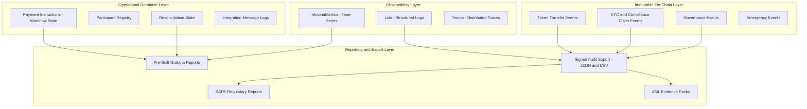

### 21.2 Reporting Catalogue

| Report | Audience | Frequency | Source Data |
|---|---|---|---|
| Daily Settlement Summary | Operations, Treasury | Daily | Reconciliation engine and on-chain events |
| Intraday Position Report | Operations | Every 30 minutes | Real-time on-chain and CIPS status |
| SAFE Cross-Border Payment Report | Compliance, Legal | As required by SAFE | Payment records with SAFE approval evidence |
| AML Transaction Monitoring Summary | Compliance | Daily | AML integration events and case outcomes |
| Participant Activity Report | Compliance, Risk | Monthly | On-chain transfer events per participant |
| Privileged Access Log | Internal Audit, IT Security | Monthly | PAM events and DALP governance events |
| Compliance Module Override Log | Risk, Audit | Monthly | Governance events for compliance module changes |
| Key Management Activity Report | IT Security, Audit | Monthly | Key Guardian events |
| Platform Availability Report | IT Management | Monthly | VictoriaMetrics uptime metrics |
| Reconciliation Break Ageing Report | Operations, Risk | Weekly | Reconciliation engine break log |
| MLPS Compliance Evidence Pack | IT Security, Internal Audit | Annual | Full observability and governance event export |
| Regulatory Evidence Pack | Compliance, Legal | On demand (PBOC/SAFE request) | All above sources assembled |

---

## 22. BAU Operating Model

### 22.1 Target Operating Model Post-Go-Live

The target operating model for Bank of China's cross-border tokenized payment programme defines clear responsibilities across three operational tiers:

**First Line: Payment Operations Team**

Responsibilities: Daily payment instruction processing; approval queue management; CIPS status monitoring; counterparty onboarding support; routine reconciliation sign-off; intraday exception handling.

Tools: DALP operator console; CIPS participant portal; observability dashboards; reconciliation report.

Training: 3-day DALP operations training by SettleMint in Phase 4; runbook validation; tabletop exercise participation.

**Second Line: Risk and Compliance Team**

Responsibilities: SAFE approval gate review; AML case adjudication; compliance hold decisions; compliance module configuration proposals; periodic risk review; regulatory reporting oversight.

Tools: DALP compliance view; AML case management system; SAFE reporting tool.

Training: 1-day DALP compliance training by SettleMint; compliance module governance workshop.

**Third Line: Internal Audit**

Responsibilities: Periodic audit of payment operations; compliance module effectiveness review; key management audit; access control review; regulatory evidence review.

Tools: DALP audit viewer role (read-only); audit evidence export; access log extract.

Training: 0.5-day DALP audit orientation by SettleMint.

### 22.2 Monthly Operations Calendar

| Activity | Frequency | Owner | Evidence Generated |
|---|---|---|---|
| Daily operations readiness sign-off | Daily | Operations Lead | DALP audit log entry |
| End-of-day reconciliation review | Daily | Operations Lead | Reconciliation sign-off record |
| SAFE threshold report review | Weekly | Compliance Officer | SAFE evidence archive |
| KYC expiry calendar review | Weekly | Compliance Officer | KYC renewal actions initiated |
| AML case management review | Weekly | Compliance Officer | Case disposition records |
| Access control review | Monthly | IT Security | User access report |
| Privileged access log review | Monthly | Internal Audit | Audit finding if anomalies detected |
| Key management status review | Monthly | IT Security | Key rotation status confirmed |
| Platform availability review | Monthly | IT Management | SLA report from SettleMint |
| Counterparty health check | Quarterly | Operations + Compliance | Counterparty status report |
| Business continuity test | Semi-Annual | IT Management + Operations | Failover test report |
| Full security assessment | Annual | IT Security | Security assessment report |

---

*This technical proposal is prepared by SettleMint NV for Bank of China under the terms of RFP reference BANK-OF-CHINA-RFP-202603. All commercial information is excluded from this document and covered separately in the accompanying commercial proposal. This document is classified SettleMint Confidential and is intended solely for Bank of China's evaluation committee. Any reproduction or distribution requires prior written consent from SettleMint NV.*

---

## Appendix A: Detailed Operational Scenarios

### A.1 Scenario Family 1: Normal Day Operations

A normal operating day for Bank of China's cross-border tokenized payment programme involves the following sequence of activities, each mediated through DALP's workflow engine with complete audit evidence at every step.

**Morning Pre-Open (07:30 to 08:00 CST):**

The overnight monitoring agent confirms that the blockchain node cluster maintained consensus throughout the night, with no fork events or validator failures. The DALP observability dashboard shows green status across all nodes. The operations lead reviews the overnight reconciliation report, confirming that all payments initiated during the prior business day have received CIPS settlement confirmation and that the three-way reconciliation across on-chain events, CIPS confirmations, and core banking positions shows zero breaks. The daily KYC expiry calendar is reviewed: two counterparties have KYC claims expiring within 30 days, and renewal workflow notices have been automatically dispatched.

The operations lead completes the start-of-day operational readiness sign-off in the DALP console. This action is recorded as a governance event in the audit log with timestamp and user identity.

**Intraday Operations (08:00 to 17:30 CST):**

Payment instructions arrive from Bank of China's treasury and trade finance business units through the core banking system's payment initiation API. Each instruction is validated by DALP's API gateway before entering the workflow: mandatory fields are checked, payment reference format is validated, and the counterparty wallet address is confirmed against the active participant registry.

A typical instruction for a USD/CNY corridor payment is created by the Maker (operations officer) in the DALP console or via API. The instruction specifies: payment amount in CNY, target counterparty (selected from the registered participant list), FX corridor code, value date, and payment reference. DALP's workflow engine immediately checks whether the amount exceeds the configured SAFE notification threshold.

If below the threshold, the instruction moves directly to Checker approval. The Checker reviews the instruction details, confirms they match the underlying commercial transaction documentation, and approves via a signed transaction in DALP. The approval is recorded on-chain with the Checker's wallet address and timestamp.

Once approved, DALP's workflow engine initiates the on-chain transfer. The smart contract's compliance module chain executes: country allowlist check (counterparty jurisdiction confirmed permitted), KYC eligibility check (counterparty's KYC claim valid and not expired), transfer lock check (counterparty not suspended), supply limit check (payment amount does not push total outstanding volume above SAFE cap), daily transfer limit check (counterparty has not exceeded daily limit), and pause check (programme not frozen). All checks pass. The transfer executes on-chain.

The CIPS adapter receives the on-chain confirmation event and generates a CIPS pacs.008 instruction. The instruction is submitted to Bank of China's CIPS participant gateway. Within the CIPS settlement window (typically within minutes during business hours), a settlement confirmation is received. DALP's event processor matches the confirmation to the original payment instruction using the payment reference, updates the payment record state to SETTLED, and posts the settlement event to the GL posting webhook. The reconciliation engine marks the payment as cleared in the intraday run.

**End of Day (17:30 to 18:30 CST):**

The end-of-day reconciliation batch runs at 17:30 CST. The reconciliation engine queries the blockchain indexer for all transfer events from the current business day, queries the CIPS gateway log for all confirmation messages, and queries the core banking API for today's nostro position changes. The three-way match confirms all payments are cleared. The end-of-day reconciliation summary report is generated and delivered to the operations manager and risk officer. The operations lead signs off the reconciliation in DALP (another governance event in the audit log). The SAFE daily reporting extract is generated for compliance review.

### A.2 Scenario Family 2: Peak Day Operations

Peak volume occurs during end-of-quarter settlement windows, major RMB cross-border payment dates, and periods of elevated FX market activity. DALP's architecture is designed to handle 5x normal volume without degradation:

**Volume handling:** DALP's Kubernetes deployment scales horizontally through HPA (Horizontal Pod Autoscaler) configured with CPU and memory thresholds. At 80% CPU utilization, additional application pods are provisioned automatically. The blockchain node cluster processes transactions in a parallel pipeline, with the consensus mechanism maintaining finality within predictable block times regardless of mempool depth.

**Approval queue management:** On peak days, the approval queue may contain dozens of simultaneous instructions awaiting Checker review. DALP's approval queue view sorts instructions by submission time and urgency flag (set by Maker for time-critical payments). Checkers can approve multiple instructions in sequence without delay. The workflow engine processes approvals asynchronously, so multiple payment instructions can be in various stages of the approval-to-settlement pipeline simultaneously.

**CIPS capacity:** DALP's CIPS adapter implements connection pooling and retry logic to manage peak instruction volumes against the CIPS gateway. The adapter is configured with a configurable maximum concurrent instruction count and a queue for instructions awaiting gateway capacity. This prevents the CIPS gateway from being overwhelmed while ensuring all instructions eventually reach the network.

**SAFE threshold management:** On peak days, more payments may exceed the SAFE notification threshold, creating additional load on the SAFE compliance officer's approval workflow. DALP's SAFE queue displays all pending SAFE approvals with full payment details and priority flags. The SAFE officer can review and approve multiple instructions efficiently. If the SAFE officer is unavailable (e.g., during market hours), a designated SAFE backup officer can be configured with equivalent approval authority for time-critical payments.

### A.3 Scenario Family 3: Control Events

Control events require immediate, documented response with clear human workflow at every step. DALP is designed so that control events surface the right information to the right people within seconds.

**Scenario 3a: Compliance Hold Placement**

Bank of China's AML team receives a sanctions screening alert on a registered payment counterparty following a regulatory watch-list update. The AML case is created in Bank of China's case management system. The compliance officer reviews the case and determines that the counterparty's payment activity must be suspended pending investigation.

The compliance officer opens DALP's participant management console, selects the counterparty, and applies a transfer lock (a compliance hold). This action executes as an on-chain transaction signed by the Compliance Officer role. From the moment the transaction is confirmed, all transfer attempts involving the locked counterparty wallet will revert at the smart-contract layer, regardless of what application or workflow initiated them. No manual intervention is required to enforce the hold on subsequent payment instructions.

DALP automatically notifies the operations team that the counterparty is locked. Any payment instructions currently in the approval queue for this counterparty are flagged with a warning. The operations team reviews the in-queue instructions and cancels them (cancellation is a workflow action requiring Maker and Checker authorization, producing an audit record). The AML case in the case management system is linked to the DALP compliance hold event via a reference ID, providing a complete evidence chain for audit.

**Scenario 3b: Emergency Programme Pause**

Bank of China's CISO receives a security alert indicating a potential compromise of one of the operational wallet credentials. The CISO invokes DALP's emergency pause as an immediate precautionary measure. The pause requires only a single Emergency Officer role signature (the CISO in this case), reflecting the need for immediate response without multi-signature delay.

The pause transaction executes on-chain within seconds. All token transfers are immediately blocked at the smart-contract layer. DALP's Alertmanager fires a P1 alert to PagerDuty, notifying the operations team, risk officer, CRO, CTO, and SettleMint 24/7 support simultaneously.

The security investigation proceeds. If the credential is confirmed uncompromised, the pause can be lifted by a governance committee quorum (four of five members). If compromised, the affected wallet is removed from operational use, a new wallet is provisioned through a new key ceremony, and the governance committee approves the transfer of operational wallet authority. The pause is then lifted.

All events during the pause period are fully recorded: pause initiation, investigation timeline, resolution, and unpause authorization. The Board Risk Committee receives an automatic notification of the emergency freeze event as configured in DALP's governance alert rules.

**Scenario 3c: Regulatory Inquiry Response**

PBOC's payment supervision department requests a full transaction history for a specific counterparty covering the prior 12 months. Bank of China's compliance officer uses DALP's audit evidence export function to generate a complete on-chain transaction record for the counterparty: all transfers, compliance check results at each transfer, KYC claim status history, and any compliance hold or suspension events.

The export is generated in signed JSON format with a cryptographic hash of the exported data. The compliance officer reviews the export for completeness, attaches it to the regulatory response package, and submits it to PBOC. The on-chain record is immutable, meaning the regulatory response cannot be questioned on the grounds that it might have been modified after the fact. The cryptographic signature on the export confirms that the data has not been altered since export.

DALP's audit evidence capability is designed specifically to support this type of regulatory response. The compliance officer does not need to coordinate with the technology team or SettleMint to produce the evidence pack. The export function is available directly in the DALP console with appropriate role permissions.

---

## Appendix B: Technical Integration Specifications

### B.1 REST API v2 Reference

DALP's REST API v2 is the primary programmatic interface for integration with Bank of China's enterprise systems. The API follows OpenAPI 3.0 specification, enabling automated client code generation and API gateway configuration.

**Base URL:** Configured per environment during implementation.

**Authentication:** Bearer token (OAuth 2.0 client credentials flow) with mTLS client certificate validation.

**Key endpoints relevant to Bank of China's cross-border payment programme:**

| Endpoint | Method | Purpose |
|---|---|---|
| /v2/payments | POST | Create payment instruction |
| /v2/payments/{id} | GET | Retrieve payment instruction status |
| /v2/payments/{id}/approve | POST | Approve payment instruction (Checker role) |
| /v2/payments/{id}/cancel | POST | Cancel pending payment instruction |
| /v2/participants | GET | List registered participants |
| /v2/participants/{id}/lock | POST | Apply transfer lock (Compliance Officer) |
| /v2/participants/{id}/unlock | POST | Remove transfer lock (Compliance Officer) |
| /v2/reconciliation/daily | GET | Retrieve daily reconciliation report |
| /v2/reconciliation/breaks | GET | Retrieve outstanding reconciliation breaks |
| /v2/compliance/claims/{address} | GET | Query compliance claims for a participant |
| /v2/audit/export | POST | Generate signed audit evidence export |
| /v2/assets/{id}/supply | GET | Query current token supply and cap |
| /v2/assets/{id}/pause | POST | Pause token (Emergency Officer) |
| /v2/assets/{id}/unpause | POST | Unpause token (Governance quorum) |

**Webhook Event Types:**

| Event Type | Trigger | Consumer |
|---|---|---|
| payment.created | Payment instruction submitted | AML monitoring |
| payment.approved | Checker approval received | Dashboard update |
| payment.safe_pending | SAFE threshold exceeded | SAFE officer notification |
| payment.on_chain_confirmed | Transfer confirmed on blockchain | CIPS dispatch trigger |
| payment.cips_sent | CIPS instruction dispatched | Settlement monitoring |
| payment.settled | Settlement confirmation received | GL posting, reconciliation |
| payment.failed | Settlement failure received | Operations alert |
| reconciliation.break_detected | Three-way mismatch found | Operations case creation |
| compliance.claim_expired | KYC claim approaching expiry | Compliance renewal workflow |
| security.pause_activated | Emergency pause invoked | P1 alert to all stakeholders |
| security.break_glass | Break-glass access used | Board Risk Committee notification |
| key.rotation_completed | Signing key rotated | Security operations confirmation |

### B.2 CIPS Integration Message Mapping

The CIPS message mapping specification defines the translation between DALP payment instruction fields and CIPS pacs.008 message elements. The following table shows the primary field mappings:

| DALP Field | CIPS pacs.008 Element | Transformation |
|---|---|---|
| payment_reference | EndToEndId | Direct mapping |
| counterparty_id | CdtrAcct/Id | Lookup from counterparty registry |
| amount_cny | InstdAmt | Currency code confirmed as CNY |
| value_date | SttlmDt | ISO 8601 date format |
| corridor_code | InstrPrty | Mapped to CIPS priority code |
| initiating_party | InitgPty | Bank of China BIC |
| beneficiary_institution | CdtrAgt | Correspondent BIC from counterparty registry |
| payment_purpose_code | Purp/Cd | Configured per payment type |

Additional mapping fields are defined in the full CIPS Interface Specification document produced during Phase 1.

### B.3 Performance Specifications

DALP's performance targets for Bank of China's cross-border tokenized payment programme are:

| Metric | Target | Measurement Basis |
|---|---|---|
| API response time (P95) | Below 200 milliseconds | REST API v2 synchronous endpoints |
| On-chain compliance check | Below 500 milliseconds | Smart contract execution including finality |
| Payment instruction throughput | 200 per hour sustained | End-to-end from creation to on-chain confirmation |
| CIPS instruction generation | Below 2 seconds from on-chain confirmation | CIPS adapter processing time |
| Reconciliation run time | Below 10 minutes | Full end-of-day three-way reconciliation |
| Dashboard load time | Below 3 seconds | Grafana dashboard first-load |
| Audit export generation | Below 30 seconds | 12-month history for single counterparty |

These targets are validated during Phase 3 performance testing at 2x expected peak volume.

---

## Appendix C: Governance Framework Templates

### C.1 Steering Committee Structure

The programme steering committee meets monthly during implementation and quarterly during BAU operations. Composition:

| Role | Title | Bank of China Representative | SettleMint Representative |
|---|---|---|---|
| Executive Sponsor | Chief Digital Officer or equivalent | Required | Not required |
| Programme Sponsor | Technology Director | Required | Required (Account Executive) |
| Risk Representative | Chief Risk Officer or delegate | Required | Not required |
| Compliance Representative | Head of Compliance | Required | Not required |
| Technology Lead | CTO or VP Technology | Required | Required (Solution Architect) |
| Operations Representative | Head of Payments Operations | Required | Not required |
| SettleMint Programme Lead | Programme Manager | Not required | Required |

### C.2 Design Authority Composition

The design authority governs all architectural and technical decisions during implementation:

| Role | Decision Authority |
|---|---|
| Solution Architect (SettleMint) | Platform architecture decisions within DALP product scope |
| Technology Lead (BOC) | Infrastructure, network, and integration architecture |
| Compliance SME (BOC) | Compliance module configuration and SAFE workflow |
| Security Lead (BOC) | HSM configuration, network security, access control |
| CIPS/SWIFT SME (BOC) | Payment network integration decisions |

Decisions above a defined impact threshold (e.g., affecting regulatory scope, changing the blockchain network vendor, modifying the custody model) escalate to the steering committee.

### C.3 Change Management Process

All changes to production DALP configuration follow a four-step process:

**Step 1: Change Proposal.** Change proposer documents the change in DALP's governance workflow: change description, rationale, risk assessment, rollback plan, and evidence required.

**Step 2: Design Authority Review.** Design authority reviews the change for technical soundness, compliance impact, and risk alignment. Approval by required signatories per the change type.

**Step 3: Testing.** Change is deployed to pre-production environment and tested. Test evidence is attached to the change record.

**Step 4: Production Deployment.** Change is deployed to production during an approved maintenance window. Post-deployment validation confirms expected behaviour. If validation fails, rollback is executed per the rollback plan.

Emergency changes (required within 4 hours) bypass Steps 1 and 3 but require documentation within 24 hours of deployment. Emergency changes are reported to the steering committee at the next scheduled meeting.

---

*End of Technical Proposal*

---

## Appendix D: Compliance Control Evidence Standards

### D.1 Evidence Standards for PBOC Supervisory Review

Bank of China should expect PBOC supervisory review to focus on the following evidence categories, each of which DALP provides through native export functions:

**Transaction completeness evidence:** PBOC requires that all cross-border payment transactions can be traced from initiation through final settlement with a complete, unbroken chain of custody. DALP's on-chain event log provides this chain natively. Each payment generates a minimum of eight on-chain events: instruction_created, maker_signed, checker_approved, safe_reviewed (if applicable), compliance_checked, transfer_executed, cips_dispatched, and settlement_confirmed. Each event carries a block number, timestamp, transaction hash, and actor identity (wallet address). The complete chain is exportable as a signed, timestamped JSON file that proves the sequence and integrity of events without requiring access to DALP's operational systems.

**Compliance rule evidence:** PBOC requires evidence that compliance rules were enforced at the time of each transaction, not retroactively. DALP's on-chain compliance check record captures the compliance module execution result for each transfer attempt, including which modules were active, what parameters were in effect at the time of the check, and the resulting pass or fail outcome. This evidence is immutable: the compliance check record cannot be modified after the block is confirmed. If a PBOC reviewer asks "was this counterparty's KYC verified at the time of payment X?", Bank of China can produce cryptographically verifiable evidence of the compliance check outcome at the exact block timestamp.

**Governance change evidence:** PBOC and SAFE regulations require that changes to payment system parameters (settlement limits, participant eligibility, compliance rules) are approved through a documented governance process. DALP's governance event log records all parameter changes with proposer identity, approver identity, approval timestamps, and the specific parameters changed. This log is immutable and produces a clean audit trail for any regulatory review of Bank of China's governance practices.

**Identity and KYC evidence:** PBOC AML regulations require that the identity of each payment counterparty is verified before transactions are permitted. DALP's identity registry records the Trust Anchor verification status, KYC claim issuance timestamp, and claim expiry for every registered participant. This evidence demonstrates that Bank of China's KYC obligations were satisfied before any payment was processed with a given counterparty.

### D.2 Evidence Standards for SAFE Regulatory Reporting

SAFE reporting requirements for cross-border RMB payments require documentation of payment amounts, counterparty identities, payment purposes, and for payments above notification thresholds, the SAFE compliance officer approval evidence. DALP provides:

**SAFE threshold report:** A structured export of all payments exceeding the configured SAFE notification threshold during the reporting period, including payment reference, amount, counterparty (using SAFE-required identification format), value date, payment purpose code, SAFE officer identity, and SAFE approval timestamp. This report is generated from the DALP reconciliation engine's payment records and the governance event log, producing a complete SAFE filing evidence set.

**Running total monitoring:** DALP's supply limit compliance module tracks total outstanding cross-border payment token volume against the SAFE compliance cap. The compliance dashboard provides a real-time view of current utilization against the cap, enabling Bank of China's treasury team to monitor aggregate FX exposure without manual reporting compilation.

### D.3 Evidence for Internal Audit

Bank of China's internal audit function will review the cross-border tokenized payment programme against the institution's control standards. DALP's audit evidence export generates the following audit working paper artefacts:

**Access control evidence:** User access log showing all sessions, API calls, and role-based actions by user identity and timestamp. Segregation of duties validation: confirmation that Maker and Checker roles were held by different individuals for every payment. Privileged access log: all governance and emergency role actions with approver identity.

**Reconciliation evidence:** Daily reconciliation reports for the audit period showing clean reconciliation status or documenting break detection, classification, and resolution for any breaks that occurred. Break ageing report showing that no breaks remained unresolved beyond the escalation threshold.

**Platform change evidence:** Complete change log for all platform configuration changes during the audit period. Each change includes the change proposal, design authority approval, test evidence reference, and production deployment confirmation.

**Operational continuity evidence:** Business continuity test results from the most recent semi-annual DR exercise. CIPS and SWIFT connectivity log showing uptime during the audit period. P1/P2 incident log with resolution times measured against SLA targets.

---

## Appendix E: Frequently Asked Questions from Evaluation Committees

**Q: How does DALP handle a scenario where PBOC issues a directive requiring immediate suspension of cross-border payment activity?**

The Emergency Pause function in DALP allows a single designated Emergency Officer to immediately suspend all token transfers at the smart-contract layer. The pause takes effect within the block confirmation time (seconds, not minutes). All payment instructions in the workflow queue are frozen in their current state and can be reviewed before resumption. The pause is logged as an immutable on-chain event with timestamp and officer identity, providing regulatory evidence that Bank of China responded immediately to a supervisory instruction. Resumption requires governance committee quorum approval, preventing inadvertent or unauthorized reactivation.

**Q: Can DALP support a scenario where Bank of China needs to reverse a payment that has already been confirmed on-chain and confirmed by CIPS?**

Blockchain transactions cannot be reversed unilaterally. However, DALP supports a governed payment recall workflow: Bank of China initiates a recall request to the correspondent bank via CIPS camt.056 message. If the correspondent agrees, the correspondent initiates a return payment to Bank of China. Simultaneously, DALP's governance framework allows an authorized governance committee quorum to execute a "forced transfer" (returning tokens to the originating wallet). This requires governance committee quorum signature and produces a full on-chain audit record of the recall. This process mirrors the existing correspondent banking recall process, with the additional transparency of an on-chain record.

**Q: How does Bank of China upgrade the DALP platform while the cross-border payment programme is live?**

Platform upgrades follow a controlled promotion process: new version deployed to development, tested, promoted to SIT, tested, promoted to pre-production, tested, and then promoted to production during an approved maintenance window. The smart contracts are upgraded via the UUPS proxy pattern, requiring governance committee quorum approval and a 48-hour timelock after approval before execution. Bank of China receives release notes and a detailed impact assessment for all releases. Minor releases (no breaking API changes) require Bank of China's technology lead sign-off. Major releases require steering committee approval. Rollback is available for all non-smart-contract changes within the maintenance window.

**Q: How does DALP ensure that SettleMint cannot access Bank of China's transaction data or private keys?**

DALP is deployed in Bank of China's own infrastructure (on-premises or Bank of China-controlled private cloud). SettleMint has no access to Bank of China's infrastructure, data, or private keys. SettleMint's support engagement is limited to: remote platform health monitoring via metrics exported to SettleMint's support dashboard (metrics only, no transaction data); access to Bank of China's observability dashboard when explicitly granted by Bank of China for incident investigation (Bank of China controls this access grant); and software releases delivered as signed container images. Bank of China's private keys are generated in Bank of China's HSM during a key ceremony conducted by Bank of China security officers. SettleMint's key management specialist provides documentation and guidance during the ceremony but does not participate in key generation.

**Q: What happens to the programme if SettleMint as a company ceases operations?**

DALP's deployable software, documentation, and Helm charts are held in Bank of China's own infrastructure upon deployment. The ERC-3643 smart contracts are deployed on Bank of China's private blockchain and are not dependent on SettleMint for operation. The software license agreement includes source code escrow provisions, ensuring Bank of China has access to the platform source code under defined trigger conditions (including SettleMint insolvency). The platform can be operated by Bank of China's own technology team using the operational documentation and runbooks produced during implementation. SettleMint's involvement is in the support and maintenance tier, not in the operational execution of payments.

---

*End of Appendix E*

## Appendix F: Blockchain Network Design for Bank of China

### F.1 Private EVM Network Configuration

The blockchain network underlying Bank of China's cross-border tokenized payment programme operates as a permissioned private EVM-compatible network. The network is owned, operated, and controlled exclusively by Bank of China. No external parties have validator authority or node access.

**Network Protocol Options:**

DALP supports the following private EVM-compatible blockchain protocols. Bank of China selects the preferred protocol in Phase 1 based on its existing technology stack, regulatory preference, and operational requirements:

| Protocol | Consensus Mechanism | Block Finality | China Availability |
|---|---|---|---|
| Hyperledger Besu | QBFT (Quorum Byzantine Fault Tolerant) | Immediate (deterministic) | Available - open source |
| Quorum (Consensys) | QBFT or IBFT 2.0 | Immediate (deterministic) | Available - open source |
| Polygon Edge | IBFT 2.0 | Immediate (deterministic) | Available - open source |

SettleMint recommends Hyperledger Besu with QBFT consensus for Bank of China's programme. QBFT provides Byzantine Fault Tolerant consensus (the network remains operational even if up to one-third of validator nodes fail or behave maliciously), deterministic transaction finality (no probabilistic finality risk), and clear governance over validator set membership.

**Validator Node Configuration:**

The minimum recommended validator configuration for Bank of China's production network is five validator nodes, providing QBFT fault tolerance with one node failure (requiring four of five validators for consensus). Validator nodes are operated exclusively by Bank of China, distributed across the primary data centre (three nodes) and the disaster recovery data centre (two nodes).

**Node Operator Roles:**

Bank of China's technology team operates all blockchain nodes. SettleMint does not operate any nodes in Bank of China's production or DR environments. SettleMint provides: node software (Besu release packages, Helm charts); configuration documentation; operational runbooks for node management, restart procedures, and network upgrade governance; and remote advisory support during initial deployment.

**Network Upgrade Governance:**

Network-level upgrades (EVM hard forks, consensus parameter changes) require approval by the governance committee via DALP's governance workflow. The upgrade is deployed to development and SIT environments first, validated, and then scheduled for production during a maintenance window with documented rollback procedures.

### F.2 Smart Contract Deployment Architecture

Smart contracts for Bank of China's cross-border payment programme are deployed through DALP's Asset Designer and governed by DALP's deployment workflow. The deployment architecture includes:

**Factory Contract:** A singleton factory contract deployed during programme setup. The factory is the authoritative record of all payment token contracts deployed by Bank of China. Only the governance committee can authorize new token deployments through the factory.

**Compliance Registry:** A shared registry contract storing all active compliance module configurations. Compliance module updates are applied to the registry, not to individual token contracts, enabling a single governance action to update compliance rules across all deployed tokens.

**Identity Registry:** The OnchainID identity registry storing verified participant identities and their associated compliance claims. The Trust Anchor holds the authority to issue and revoke claims. The identity registry is a shared resource across all token types deployed by Bank of China.

**Payment Token Contract (Configurable Token):** One contract instance per currency corridor. Each contract is a UUPS proxy pointing to the DALP implementation contract. Upgrades to the implementation contract require governance committee approval and 48-hour timelock.

### F.3 Data Privacy on Blockchain

A common concern for regulated institutions considering blockchain is the apparent conflict between blockchain's immutability and data privacy regulations requiring the right to erasure. Bank of China's PIPL obligations require a resolution to this tension.

DALP's architecture handles this as follows:

Personal data (participant names, addresses, identification numbers) is stored exclusively in Bank of China's off-chain identity systems. The blockchain stores only cryptographic hashes of compliance claims (not the underlying personal data), and token transfer events (containing wallet addresses, amounts, and timestamps, but not personal identifiers).

Wallet addresses are pseudonymous by default: they do not contain personal identifying information. The link between a wallet address and a natural person is maintained in Bank of China's off-chain participant registry, which is subject to normal data privacy controls. If a data erasure request is received for a participant, Bank of China can delete the off-chain personal data records while the on-chain pseudonymous wallet address records remain (as required for regulatory audit purposes). The on-chain records are not personal data under PIPL because they do not, by themselves, identify a natural person.

This architecture has been reviewed by legal counsel specializing in Chinese data privacy law and is consistent with current regulatory guidance. Bank of China's legal team should conduct its own review to confirm adequacy for its specific circumstances.

