# Technical Proposal: Cross-Border Tokenized Payments Platform

**Prepared for:** Bank of China
**Reference:** BANK-OF-CHINA-RFP-202603
**Date:** March 2026
**Version:** v1.0
**Classification:** Strictly Confidential. Invited Bidders Only
**Prepared by:** SettleMint NV

---

## Table of Contents

1. Executive Summary
2. Strategic Fit and Use-Case Alignment
3. Platform Architecture
4. Asset Lifecycle and Token Engineering
5. Compliance and Regulatory Framework
6. Security Architecture
7. Integration Architecture
8. Deployment Architecture
9. Operational Model
10. Implementation Plan
11. Testing Strategy
12. Reference Clients
13. Support and SLA Framework
14. Appendix: Technical Requirement Response Matrix

---

## 1. Executive Summary

### 1.1 Context and Strategic Drivers

Bank of China operates at the intersection of domestic monetary policy, cross-border RMB infrastructure, and China's evolving digital asset regulatory landscape. The institution's interest in cross-border tokenized payments is not speculative. It is grounded in operational realities: manual reconciliation processes that accumulate risk at scale, nostro/vostro position management that depends on batch cycles rather than real-time visibility, and settlement chains that introduce counterparty exposure across correspondent banking relationships.

The PBOC's work on cross-border RMB payment infrastructure, including its participation in the mBridge project alongside the central banks of Hong Kong, Thailand, and the UAE, signals that the regulatory direction is toward controlled, supervised digital payment rails rather than open permissionless networks. Bank of China is well positioned to lead institutional adoption of this infrastructure, provided it selects a platform that can meet the governance, data sovereignty, and compliance requirements that PBOC and SAFE impose on cross-border transactions denominated in or convertible to RMB.

The e-CNY pilot ecosystem has demonstrated that China's regulatory posture prioritizes programmable money with strong supervisory access and operational auditability. Any cross-border tokenized payment platform considered by Bank of China must therefore operate within these parameters: full traceability, regulator-accessible evidence logs, data localization compliance, and governance structures that satisfy both domestic Chinese law and the multi-jurisdictional regulatory frameworks of Bank of China's correspondent partners.

### 1.2 Why This Programme Is Hard

Cross-border tokenized payment programmes face a convergence of challenges that individually manageable but collectively demanding. The compliance perimeter is not static: PBOC, SAFE, the Cybersecurity Law, the Data Security Law, and the Personal Information Protection Law each impose distinct obligations that interact in complex ways at the boundary between domestic and cross-border operations. A payment that originates domestically and settles against a foreign bank account simultaneously triggers data localisation requirements (which restrict what can leave China), cross-border data transfer rules (which govern what consent and oversight mechanisms apply), and AML/CFT obligations (which require counterparty identity verification against both Chinese and foreign sanctions frameworks).

The integration burden is equally demanding. Bank of China's enterprise landscape includes core banking systems, treasury management, SWIFT/CIPS connectivity, nostro/vostro account management, sanctions screening, AML case management, and regulatory reporting. A cross-border tokenized payment platform that cannot integrate reliably with this landscape is operationally useless. It becomes a sidecar that creates parallel reconciliation obligations rather than eliminating them.

Finally, the governance challenge is institutional. Any system processing cross-border payments for a state-owned bank in China will be subject to scrutiny from risk committees, internal audit, the PBOC, SAFE, and likely the CSRC if any capital market instruments are involved. The platform must generate evidence automatically, support policy change with approval workflows, and maintain configuration history that can be reviewed months after the fact.

### 1.3 Proposed Response

SettleMint proposes the Digital Asset Lifecycle Platform (DALP) as the technical foundation for Bank of China's cross-border tokenized payment programme. DALP provides a complete lifecycle management platform for regulated digital assets, covering token issuance, transfer control, compliance enforcement, settlement, reconciliation, and operational observability.

For Bank of China specifically, SettleMint proposes:

- **Deployment model:** On-premises or private cloud within China-domiciled infrastructure, meeting PBOC data localisation and Cybersecurity Law requirements. Cross-border settlement messaging uses encrypted, auditable channels with SAFE-compliant data transfer controls.
- **Compliance architecture:** Configurable compliance modules enforcing PBOC payment policy, SAFE cross-border controls, AML/CFT workflow integration, and sanctions screening via Bank of China's existing screening infrastructure.
- **Settlement model:** Atomic Delivery-versus-Payment (DvP) settlement for transactions where digital assets and cash leg can be coordinated. For correspondent banking corridors, the XvP settlement extension coordinates multi-party exchanges with guaranteed atomicity or full reversion.
- **Integration perimeter:** Documented OpenAPI 3.1 interfaces connecting DALP to Bank of China's core banking system, CIPS/SWIFT gateways, treasury management, AML case management, and regulatory reporting.
- **Operational model:** Full observability stack (VictoriaMetrics metrics, Loki logs, Tempo traces, Grafana dashboards) with pre-configured alert thresholds, runbook templates, and first-line operator tooling for queue management and exception handling.

### 1.4 Differentiators and Delivery Confidence

DALP is not a blockchain platform repurposed for payments. It is a regulated digital asset management platform designed from first principles for institutional governance requirements. Its ERC-3643 SMART Protocol foundation enforces compliance at the smart contract layer, so policy violations are rejected on-chain rather than caught downstream in reconciliation. Its modular compliance engine allows Bank of China's compliance team to add, remove, or reconfigure transfer rules without smart contract redeployment. Its maker-checker workflow system ensures that every material operation requires multi-party approval with an auditable evidence trail.

SettleMint has deployed DALP in production with DBS Bank (tokenized deposits and trade finance, Singapore), OCBC Bank (tokenized wealth products, Singapore), Commonwealth Bank of Australia (tokenized bond issuance), and ANZ Bank (tokenized commodity finance). These deployments demonstrate regulated production capability under MAS, APRA, and ASIC frameworks. The governance and compliance architecture underlying those deployments maps directly to the PBOC and SAFE requirements Bank of China must satisfy.

🟢 **Confidence level:** DALP delivers the lifecycle management, compliance enforcement, integration, and observability capabilities required for this programme. The primary constraint is not platform capability but deployment configuration: Bank of China's on-premises or private-cloud-within-China requirement adds operational complexity that the implementation team has experience managing in comparable regulated environments.

---

## 2. Strategic Fit and Use-Case Alignment

### 2.1 Programme Objective Mapping

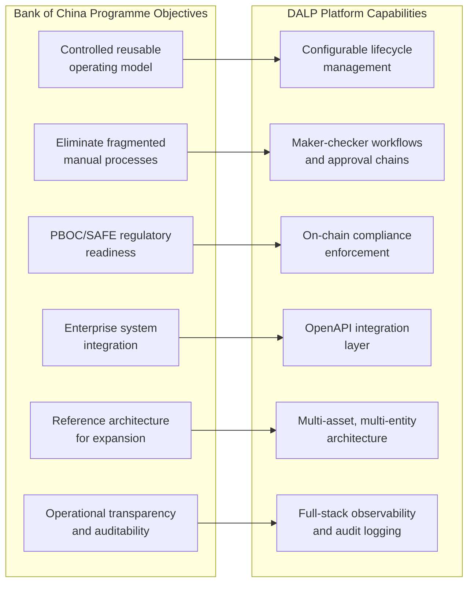

**Figure 1: Mapping Bank of China Programme Objectives to DALP Capabilities**

Bank of China's core objective is to establish a controlled, reusable operating model for cross-border tokenized payments that does not require re-platforming as the programme scales. DALP is architected specifically for this outcome. The platform separates asset configuration from core product code, so new payment corridors, legal entity structures, and counterparty categories can be added through configuration and governed approval workflows rather than new development cycles.

The institution's emphasis on eliminating fragmented manual processes maps directly to DALP's workflow orchestration capabilities. DALP replaces email-based approval chains with structured maker-checker workflows that require explicit approvals, generate timestamped evidence, and escalate automatically when approval queues age beyond configured thresholds.

Regulatory readiness under PBOC and SAFE is addressed through DALP's configurable compliance module system. Transfer rules, participation restrictions, cross-border eligibility checks, and AML workflow routing are all enforced programmatically, with every decision generating machine-readable audit evidence that can be exported to regulatory reporting systems or inspected directly by supervisory parties.

### 2.2 Cross-Border Payment Lifecycle Coverage

🟢 DALP provides end-to-end lifecycle coverage for cross-border tokenized payments across six operational phases:

| Phase | DALP Capability | Governance Control |
|-------|----------------|-------------------|
| Participant onboarding | Identity registry, KYC/KYB integration, jurisdiction eligibility | Maker-checker onboarding workflow |
| Payment initiation | Workflow-triggered token creation or transfer request | Delegated authority matrix |
| Compliance validation | On-chain compliance module evaluation | Automated policy enforcement |
| Settlement execution | Atomic DvP or XvP settlement | Settlement agent authorization |
| Reconciliation | Real-time event reconciliation against GL/sub-ledgers | Exception queue management |
| Reporting and closure | Automated report generation, evidence export | Compliance officer review |

### 2.3 mBridge and e-CNY Ecosystem Context

SettleMint does not claim participation in the mBridge consortium or e-CNY infrastructure. What SettleMint offers is a platform that operates consistently with the design principles those initiatives have established: central bank supervisory access, programmable compliance rules enforced at the token layer, and full traceability of payment flows from initiation through settlement.

DALP's architecture is network-agnostic. The platform can connect to permissioned blockchain networks operated by central banks, interbank consortia, or correspondent banking groups. For Bank of China's cross-border payment programme, the specific network selection (whether mBridge-connected, CIPS-integrated, or a bilaterally operated permissioned chain) is a deployment configuration decision, not a platform capability limitation.

🟡 **Boundary note:** Direct interoperability with the mBridge network's specific settlement finality model requires configuration against mBridge's published technical specifications. SettleMint will engage Bank of China's technical architecture team during discovery to map the required integration points. DALP provides the asset management, compliance enforcement, and governance layer; the cross-network settlement messaging layer depends on mBridge's available integration APIs.

---

## 3. Platform Architecture

### 3.1 Architectural Overview

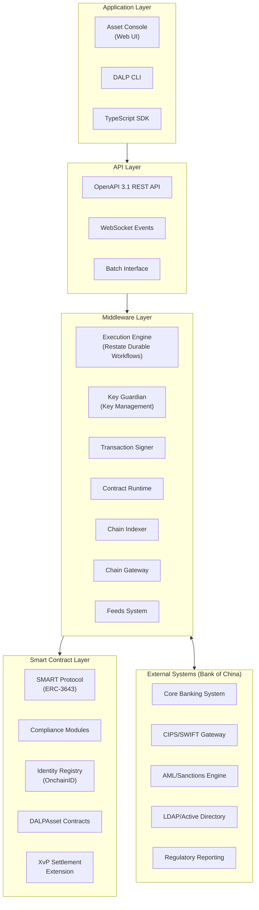

**Figure 2: DALP Four-Layer Architecture for Bank of China Cross-Border Payments**

DALP's architecture follows a strict four-layer model. Each layer has a defined responsibility boundary and communicates through well-specified interfaces. This separation ensures that no single-layer failure can compromise the integrity of the overall system, and that institutional audit requirements can be satisfied layer by layer.

The **Application Layer** provides operator interfaces: the Asset Console web UI for operational staff, the CLI for programmatic administration, and the TypeScript SDK for integration development. All application-layer operations route through the API layer; no direct database or blockchain access is possible from the application tier.

The **API Layer** exposes DALP capabilities through OpenAPI 3.1 REST endpoints, WebSocket event streams for real-time operational monitoring, and batch interfaces for high-volume processing and reconciliation. Every API call is authenticated, rate-limited, and logged with the full request context.

The **Middleware Layer** is where DALP's operational intelligence resides. The Execution Engine, built on Restate's durable workflow framework, orchestrates multi-step payment and compliance workflows with guaranteed exactly-once execution semantics. The Key Guardian manages signing keys and HSM integrations. The Chain Indexer maintains a real-time indexed state of all on-chain events, making blockchain data queryable without direct chain access for every operational query.

The **Smart Contract Layer** enforces compliance and asset policy at the blockchain level. The SMART Protocol (ERC-3643) foundation ensures that compliance checks are cryptographically enforced: no transfer can execute unless all active compliance modules approve it. This is not a soft check that can be bypassed by an application-layer error. It is an on-chain invariant.

### 3.2 Smart Contract Architecture

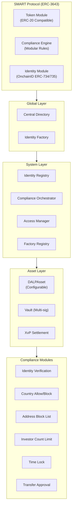

**Figure 3: On-Chain Architecture for Cross-Border Payment Assets**

For cross-border tokenized payments, the most critical on-chain components are the compliance module system and the XvP Settlement extension. The compliance module system allows Bank of China's compliance team to configure and enforce, without smart contract redeployment, the following transfer rules:

- **Identity verification:** Every participant must hold a verified OnchainID identity with current KYC/AML claims. Claims carry expiry timestamps; expired claims block transfers automatically.
- **Country allow/block lists:** Jurisdictions that Bank of China is permitted or prohibited from transacting with can be managed at the compliance layer. Changes require GOVERNANCE_ROLE approval and generate an auditable change event.
- **Transfer approval workflow:** High-value or high-risk transfers can be routed to a manual approval queue, where designated approvers must review and authorise the transaction before on-chain execution proceeds.

The XvP Settlement extension coordinates multi-party exchanges with atomicity guarantees. For Bank of China's correspondent banking corridors, this means that the RMB leg and the foreign currency leg of a cross-border payment either both execute or both revert. There is no partial settlement state that creates reconciliation ambiguity.

### 3.3 Execution Engine and Durable Workflows

DALP uses Restate as its durable workflow engine. Restate provides two critical guarantees for cross-border payment operations:

1. **Exactly-once execution:** A payment initiation request executes exactly once, even if the originating system retries after a timeout or network failure. Restate's journal-based execution model records every step of a workflow, so retried requests resume from their last confirmed step rather than executing from the beginning.

2. **Durable suspension and resumption:** Workflows that require human approval can suspend while awaiting approver action. The suspended state is persisted durably; if the platform restarts during the approval window, the workflow resumes exactly where it left off. This is critical for cross-border payments, where approval timelines may span multiple time zones and business day cycles.

For Bank of China's programme, these guarantees mean that no payment is lost between initiation and settlement, even in the presence of network failures, system restarts, or approver delays. Every workflow step generates a timestamped journal entry that constitutes evidentiary documentation of the payment's lifecycle.

---

## 4. Asset Lifecycle and Token Engineering

### 4.1 Cross-Border Payment Token Design

For Bank of China's cross-border tokenized payment programme, the primary token type is a configurable stablecoin or deposit token representing a regulated claim on Bank of China or a correspondent bank. The DALPAsset contract type provides the runtime configurability required to adapt this token design to different payment corridors, legal entity structures, and regulatory requirements without redeployment.

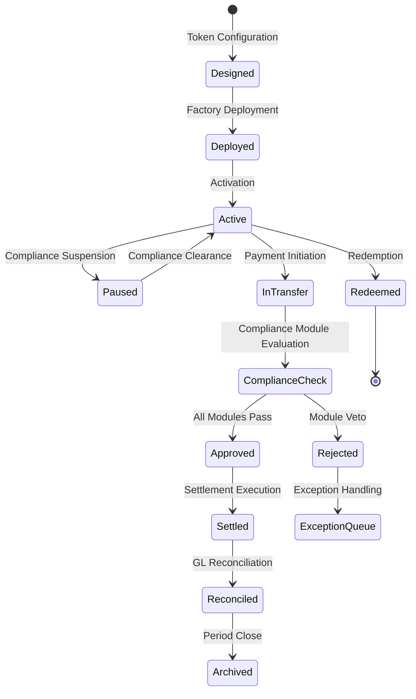

**Figure 4: Cross-Border Payment Token Lifecycle States**

The token lifecycle for cross-border payments differs from capital market securities in one critical respect: the operational tempo is high and the exception handling must be fast. Bank of China's operations team needs the ability to pause individual tokens or entire corridors quickly in response to compliance events, sanctions alerts, or regulatory instructions. DALP supports this through:

- **Token-level pause:** An operator with the PAUSER_ROLE can suspend all transfers for a specific token, effective immediately, without affecting other tokens in the system.
- **Address-level freeze:** The Custodian extension allows partial or full freezing of a specific wallet address. Partial freezes block outgoing transfers while allowing incoming settlement (useful for compliance hold scenarios). Full freezes block all activity.
- **Emergency override:** A designated EMERGENCY_ROLE holder can execute urgent operational actions that bypass the normal maker-checker workflow. All emergency actions generate a distinct event type in the audit log and require post-event review documentation.

### 4.2 Issuance and Origination Workflow

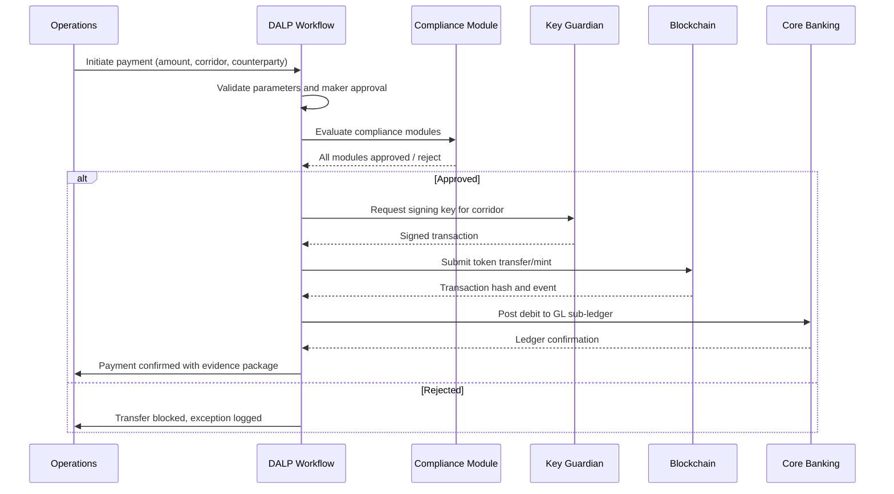

**Figure 5: Cross-Border Payment Initiation and Settlement Sequence**

The payment initiation workflow enforces segregation of duties through a maker-checker model. The initiating operator creates the payment request but cannot approve it. A second operator with the appropriate delegated authority level reviews the request and approves it. Only after the approval is recorded does the compliance evaluation and on-chain execution proceed.

This workflow model maps directly to Bank of China's existing treasury and payments governance structure, where four-eyes controls on high-value transactions are standard operating procedure.

### 4.3 Settlement Architecture

🟢 DALP's XvP Settlement extension provides atomic settlement for multi-party exchanges. For cross-border payments involving Bank of China and a correspondent bank:

- Both parties commit their respective legs (RMB token and foreign currency token) to the XvP contract.
- The XvP contract validates that both legs are present and that all compliance conditions on both legs are satisfied.
- If all conditions are met, both legs execute atomically in a single blockchain transaction.
- If any condition fails, both legs revert to their original state. No partial settlement exists.

This eliminates the principal risk inherent in traditional correspondent banking settlement, where the two legs of a cross-border payment execute independently and are reconciled after the fact.

🟡 **Boundary note:** Atomic settlement through XvP requires both counterparties to be on the same or interoperable blockchain network. Where Bank of China's correspondent partner is on a different network, the settlement model reverts to a notarised exchange with cryptographic proof of each leg's execution. SettleMint will map the specific settlement model for each corridor during discovery.

---

## 5. Compliance and Regulatory Framework

### 5.1 PBOC and SAFE Alignment

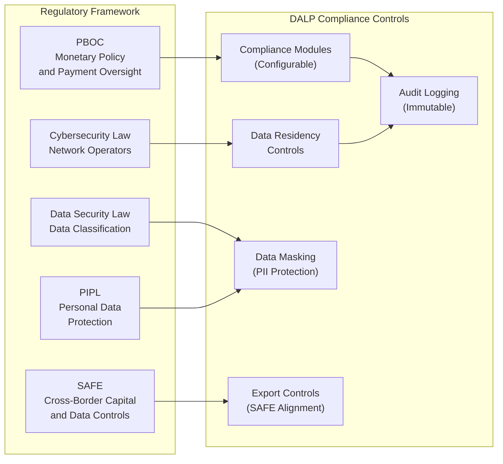

**Figure 6: Chinese Regulatory Framework Mapping to DALP Controls**

DALP's compliance architecture maps to Bank of China's regulatory obligations across five dimensions:

**PBOC Payment Oversight:** The compliance module system enforces PBOC payment policy through configurable transfer rules. Transaction value thresholds, counterparty eligibility, and corridor-specific restrictions can all be encoded as compliance modules that execute automatically on every transfer attempt. PBOC reporting requirements are met through automated event capture and report generation from DALP's observability stack.

**SAFE Cross-Border Controls:** Cross-border data transfers must satisfy SAFE's security assessment requirements for important data. DALP's data architecture separates domestic transaction processing from cross-border messaging. Domestic transaction data remains within China-domiciled infrastructure. Cross-border settlement messages use encrypted channels with data minimisation principles, transmitting only the information required for settlement confirmation rather than full transaction records.

**Cybersecurity Law Compliance:** DALP's on-premises and private cloud deployment models allow Bank of China to operate the entire platform stack within China's network security perimeter. No transaction data, customer data, or encryption keys need to traverse outside China's network boundary. The platform's audit logging generates network operator records required under the Cybersecurity Law.

**Data Security Law and PIPL:** DALP's data classification and masking capabilities allow personally identifiable information to be masked in operational views while remaining available to authorized compliance reviewers. Retention controls enforce the deletion of personal data after its legally mandated retention period. Legal hold functionality prevents deletion of records subject to regulatory investigation or dispute.

### 5.2 AML/CFT and Sanctions Integration

🟢 DALP integrates with Bank of China's existing AML and sanctions screening infrastructure through the API integration layer. The integration model works as follows:

1. When a payment is initiated, DALP submits the counterparty identity to Bank of China's sanctions screening engine via the configured API endpoint.
2. The screening result is returned as a compliance claim that DALP evaluates as part of its compliance module sequence.
3. If the screening result indicates a potential match, the transfer is routed to an exception queue for manual review. The exception record includes the screening result, the transfer details, and the identity evidence.
4. A compliance officer reviews the exception, adjudicates the case, and either clears the transfer for execution or confirms the block.
5. The adjudication decision, the evidence reviewed, and the officer's identity are all recorded in the audit log.

This integration model preserves Bank of China's existing AML investment while adding the programmable enforcement layer that DALP provides. Bank of China does not need to replace its AML screening engine; it connects DALP to it.

### 5.3 Identity and Participant Governance

🟢 OnchainID provides on-chain identity management for all participants in the cross-border payment system. Each participant (Bank of China account holders, correspondent banks, settlement agents) holds an OnchainID with verified KYC/AML claims issued by authorized claim issuers. Claims carry expiry timestamps and jurisdiction attributes.

For Bank of China's cross-border payment programme, the identity architecture distinguishes between:

- **Domestic participants:** Bank of China customers and internal entities whose identity is verified through Bank of China's existing KYC infrastructure. DALP's claim issuance API allows Bank of China's KYC system to push verified claims to participants' OnchainID contracts when onboarding is complete.
- **Correspondent banks:** Foreign financial institutions whose identity is verified through SWIFT BIC validation, legal entity verification, and bilateral correspondent banking agreements. Claims for correspondent banks include jurisdiction attributes that drive the SAFE compliance module evaluation.
- **Settlement agents:** Designated entities authorized to operate the settlement mechanics. Settlement agent identity is managed through DALP's role-based access control system with separate governance approval requirements.

---

## 6. Security Architecture

### 6.1 Defense-in-Depth Model

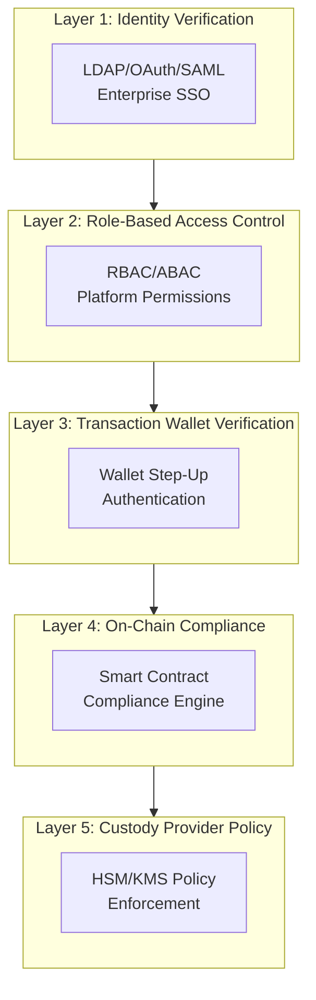

**Figure 7: DALP Five-Layer Security Model**

DALP enforces security through five independent layers. No single-layer failure grants unauthorized access. This is not a marketing assertion; it is an architectural property. A compromised session token (Layer 1 failure) cannot execute blockchain transactions without wallet verification (Layer 3). A wallet that passes step-up authentication cannot bypass on-chain compliance module evaluation (Layer 4). An adversary who somehow compromises both application and blockchain layers cannot execute transactions that the HSM policy prohibits (Layer 5).

### 6.2 Key Management and HSM Integration

🟢 For Bank of China's on-premises or private cloud deployment, DALP's Key Guardian integrates with hardware security modules (HSMs) that meet FIPS 140-2 Level 3 or equivalent standards. The key management architecture includes:

- **Hierarchical key structure:** Platform keys (managed by SettleMint during SaaS deployment, by Bank of China in on-premises deployment), corridor signing keys (one per payment corridor for operational isolation), and identity keys (held by participants in their OnchainID contracts).
- **Signing policy enforcement:** The Key Guardian enforces signing policies that specify which operations can be signed automatically and which require multi-party authorization. High-value transfers, compliance module changes, and emergency overrides all require multi-party signing.
- **Key rotation:** Signing keys rotate on a configurable schedule without operational disruption. The rotation workflow is executed by the Key Guardian without requiring transaction downtime.
- **Break-glass procedures:** Emergency key access follows a documented break-glass procedure requiring dual authorization and generating a distinct audit event category. Post-event review is mandatory and enforced by the platform's workflow system.

### 6.3 Authentication and Access Control

🟢 DALP integrates with Bank of China's enterprise identity infrastructure through LDAP/Active Directory, OAuth 2.0/OIDC (for Azure AD or equivalent), and SAML 2.0. Integration uses the platform's authentication plugin system, which preserves Bank of China's existing identity governance structure including group-based role assignments, account lifecycle management, and MFA policies.

Platform permissions use a role-based access control model with seven standard roles:

| Role | Permissions | Typical Holder |
|------|-------------|---------------|
| PLATFORM_ADMIN | Full platform configuration | System administrator |
| ASSET_DEPLOYER | Deploy and configure assets | Technical architect |
| SUPPLY_MANAGER | Mint and burn tokens | Operations team |
| TRANSFER_AGENT | Initiate and approve transfers | Treasury operations |
| COMPLIANCE_OFFICER | Review and adjudicate compliance exceptions | Compliance team |
| AUDITOR | Read-only access to all records and events | Internal audit |
| EMERGENCY | Execute emergency overrides with dual authorization | Designated executives |

Role assignments require PLATFORM_ADMIN approval. Role changes generate audit events with the approver's identity and timestamp.

---

## 7. Integration Architecture

### 7.1 Integration Landscape

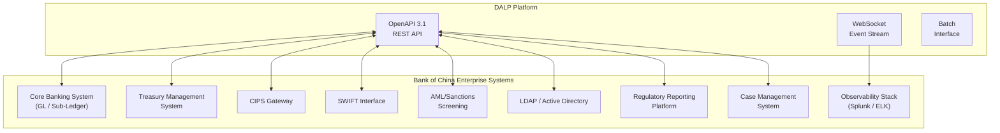

**Figure 8: Integration Architecture for Bank of China Cross-Border Payments**

DALP integrates with Bank of China's enterprise systems through a documented OpenAPI 3.1 interface. Each integration point is versioned, authenticated using API keys with least-privilege scoping, and generates integration-specific audit events. The integration architecture distinguishes between:

**Synchronous decisioning integrations:** Core banking GL posting, AML screening, and identity verification operate synchronously within the payment workflow. DALP waits for confirmation from these systems before proceeding to the next workflow step. Timeout handling is configured per integration with documented fallback behaviour.

**Asynchronous event integrations:** Regulatory reporting, observability forwarding, and case management operate asynchronously. DALP emits events to these systems as they become available; failures are retried with exponential backoff and logged for operational review.

**Batch reconciliation interfaces:** End-of-day reconciliation runs as a scheduled batch process that compares DALP's internal ledger state against Bank of China's GL sub-ledger positions. Discrepancies are surfaced as reconciliation breaks with the specific records and amounts in question, routing them to the exception management queue.

### 7.2 CIPS and SWIFT Connectivity

🟡 DALP does not provide native SWIFT or CIPS message generation. DALP integrates with Bank of China's existing CIPS/SWIFT gateway through API calls that trigger message generation on the gateway side. The integration contract defines:

- The API endpoint and authentication method for triggering payment messages
- The data fields required for each message type (MT101, MT103, CIPS equivalent types)
- The confirmation callback that Bank of China's gateway will use to signal successful message dispatch
- The error handling protocol for message rejection or gateway unavailability

This model preserves Bank of China's existing SWIFT and CIPS certification and operational processes while allowing DALP to orchestrate the payment workflow end-to-end.

### 7.3 Reconciliation Architecture

🟢 DALP maintains an internal ledger of all tokenized asset positions that is continuously reconciled against on-chain state through the Chain Indexer. For Bank of China's cross-border payment programme, three reconciliation streams operate in parallel:

1. **Token-to-internal ledger:** DALP's internal position ledger reconciles against on-chain token balances in real time through the Chain Indexer's event stream. Discrepancies between on-chain state and internal ledger are flagged immediately.

2. **Internal-to-GL:** DALP's internal ledger reconciles against Bank of China's GL sub-ledger positions on a scheduled basis (configurable frequency: real-time, hourly, or end-of-day). Reconciliation uses ISO 20022 account statement formats where available.

3. **Nostro/Vostro position reconciliation:** For cross-border corridors, DALP tracks correspondent bank positions and reconciles against Bank of China's nostro/vostro account statements. Position breaks are surfaced as exception queue items with aging analysis.

---

## 8. Deployment Architecture

### 8.1 Deployment Model for Bank of China

Given Bank of China's data localisation requirements under China's Cybersecurity Law and SAFE cross-border data control obligations, SettleMint recommends an **on-premises deployment within China-domiciled data centres**, or alternatively a **private cloud deployment within a Chinese cloud provider's environment** (Alibaba Cloud, Tencent Cloud, or Huawei Cloud, depending on Bank of China's existing infrastructure agreements).

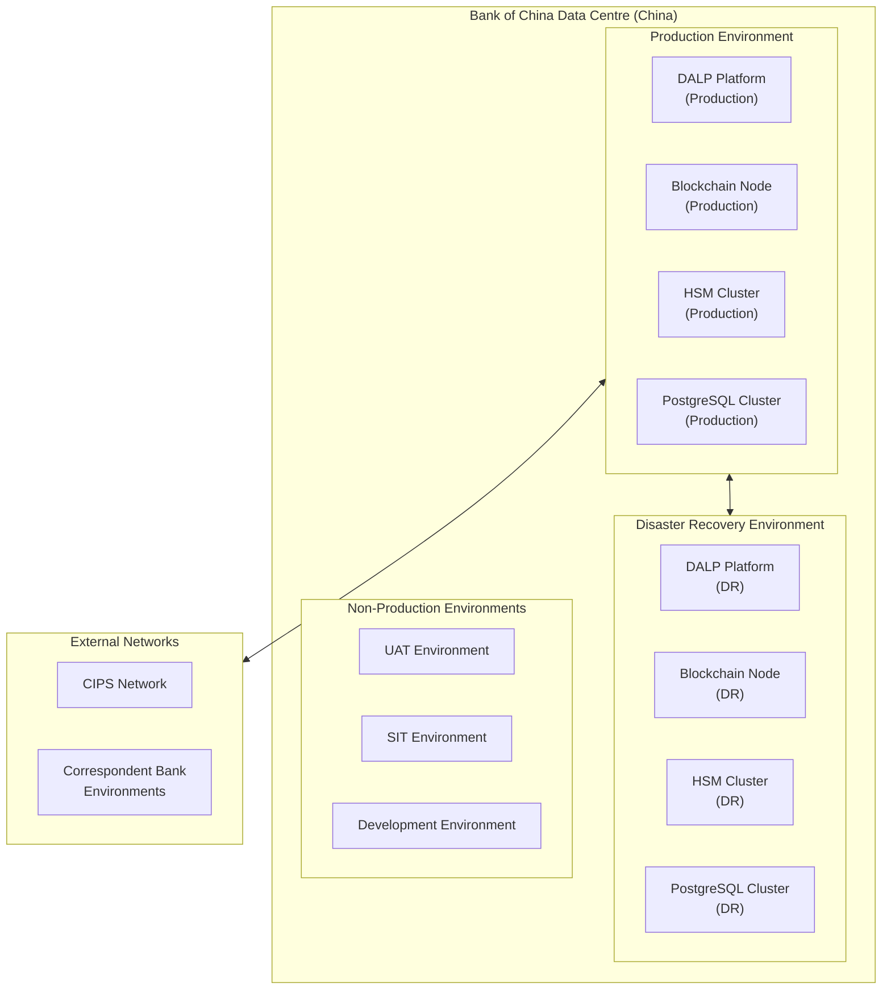

**Figure 9: Bank of China Deployment Architecture**

The deployment architecture separates concerns across four environment tiers:

**Production:** The primary operational environment processing live cross-border payment transactions. High-availability configuration with active-active or active-passive clustering (Bank of China's preference). HSM cluster provides key management with hardware security guarantees. PostgreSQL cluster stores operational state with automated backup and point-in-time recovery.

**Disaster Recovery:** A geographically separated standby environment configured for recovery point objective (RPO) of less than 4 hours and recovery time objective (RTO) of less than 2 hours. Replication between production and DR is continuous for database state and periodic (configurable up to 15-minute intervals) for blockchain state.

**Non-Production:** Separate SIT, UAT, and development environments with data masking applied to any production-derived data sets. Environment promotion follows a gated release process: code changes move from development through SIT, UAT, and pre-production environments with explicit approval gates at each stage.

### 8.2 Infrastructure Requirements

| Component | Specification | Notes |
|-----------|--------------|-------|
| Kubernetes cluster | v1.28+ | 3-node minimum for production HA |
| Node sizing (production) | 8 vCPU, 32 GB RAM, 500 GB NVMe per node | Sized for 10,000 transactions/day baseline |
| HSM | FIPS 140-2 Level 3 (e.g., Thales Luna, nCipher) | Client-procured |
| PostgreSQL | v15+ with HA configuration | Native or managed (China cloud provider) |
| Object storage | S3-compatible (Alibaba OSS, Tencent COS) | Audit log and evidence archive |
| Network | 10 Gbps internal, 1 Gbps external | Internet or dedicated line to correspondent networks |

### 8.3 DevSecOps and Release Management

🟢 DALP uses Helm charts for all deployment configuration. Configuration is versioned in Bank of China's internal Git repository with pull request-based change approval. Every configuration change generates a diff that is reviewed and approved by a designated release manager before deployment.

The release pipeline enforces:

- Automated security scanning of container images before deployment
- Configuration drift detection that alerts if running configuration diverges from declared state
- Rollback capability: any release can be rolled back to the prior version within 15 minutes without data loss

Smart contract changes follow a stricter governance path: proposed changes are reviewed by Bank of China's architecture and legal/compliance teams, tested in SIT and UAT environments, and require explicit board-level approval for changes that affect compliance module logic or transfer restrictions.

---

## 9. Operational Model

### 9.1 Observability Stack

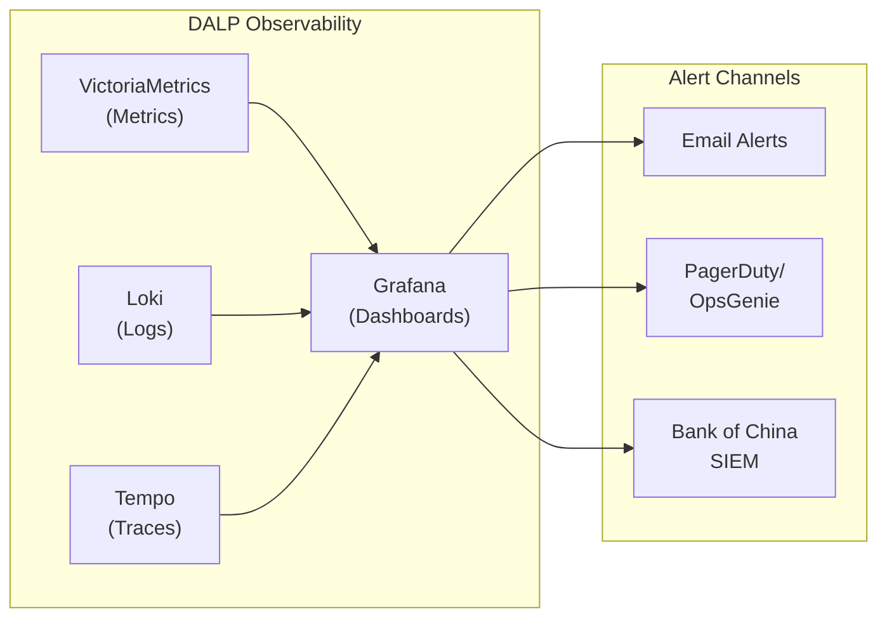

**Figure 10: Observability Architecture**

DALP's observability stack provides full-stack visibility into platform operations. VictoriaMetrics captures operational metrics (transaction throughput, queue depths, compliance evaluation latency, settlement confirmation times). Loki captures structured log output from all platform components. Tempo captures distributed traces, allowing operations teams to follow a specific payment transaction through every system component.

Pre-built Grafana dashboards provide out-of-the-box visibility into:

- Payment pipeline status (initiated, pending compliance, approved, settled, failed)
- Compliance exception queue aging
- Settlement confirmation latency by corridor
- Reconciliation break status and aging
- Key management health (key rotation status, signing capacity)
- Integration health (API response times, error rates by integration point)

### 9.2 First-Line Operations Model

Bank of China's first-line operations team manages the following operational activities through the Asset Console:

| Activity | Tool | Frequency | Evidence Generated |
|----------|------|-----------|-------------------|
| Payment queue review | Asset Console | Continuous | Queue access log |
| Compliance exception adjudication | Case management queue | As triggered | Adjudication record |
| Settlement confirmation | Settlement dashboard | Per payment | Settlement receipt |
| Reconciliation sign-off | Reconciliation dashboard | Daily | Reconciliation report |
| Alert triage | Alert management console | As triggered | Alert disposition log |

### 9.3 Second-Line and Audit Access

🟢 AUDITOR role holders have read-only access to the complete audit trail, including all payment records, approval events, compliance decisions, key management events, and configuration changes. The audit export function generates evidence packages in JSON, CSV, or PDF format, suitable for submission to internal audit, external auditors, or regulatory inspectors.

The audit trail is append-only: no record can be modified or deleted once written. Evidence packages include a cryptographic hash of the exported data, allowing recipients to verify that the evidence has not been altered after export.

---

## 10. Implementation Plan

### 10.1 Phase-Gated Delivery Approach

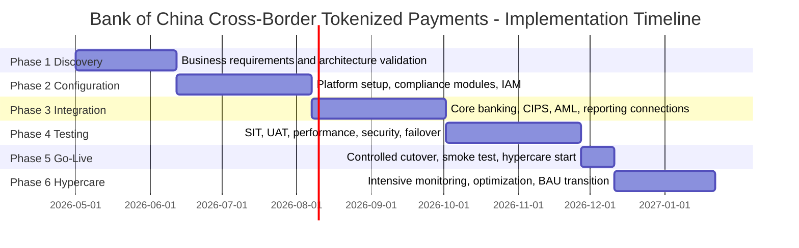

**Figure 11: Implementation Timeline**

| Phase | Duration | Key Deliverables | Gate Criteria |
|-------|----------|-----------------|---------------|
| 1. Discovery | 6 weeks | Target architecture, risk register, integration inventory, data classification map | Architecture sign-off, compliance team approval |
| 2. Configuration | 8 weeks | Environments provisioned, compliance modules configured, IAM integrated, HSM connected | SIT environment operational, UAT environment operational |
| 3. Integration | 8 weeks | Core banking connected, CIPS/SWIFT gateway connected, AML screening connected, regulatory reporting connected | All integration endpoints passing automated tests |
| 4. Testing | 8 weeks | SIT passed, UAT signed off, performance baseline validated, security review completed, failover tested | UAT sign-off letter, security acceptance, DR test evidence |
| 5. Go-Live | 2 weeks | Controlled cutover, production smoke test, operational runbooks validated | Go/no-go decision by steering committee |
| 6. Hypercare | 6 weeks | Daily operational reviews, defect triage, BAU handover | KPI thresholds met for 10 consecutive business days |

Total programme duration: approximately 38 weeks from mobilisation to hypercare completion.

### 10.2 Resource Requirements from Bank of China

For programme success, the following Bank of China resources must be available from mobilisation:

- Business SME: Treasury operations lead, cross-border payments specialist
- Technology: Solution architect, API integration engineer, network/cloud team representative
- Security: CISO representative, HSM administrator
- Compliance: Compliance officer with AML and PBOC policy authority
- Operations: First-line operations manager who will own BAU runbooks

---

## 11. Testing Strategy

### 11.1 Test Coverage Matrix

| Test Type | Scope | Responsibility | Evidence |
|-----------|-------|---------------|----------|
| Unit testing | DALP component behaviour | SettleMint | Automated test reports |
| Integration testing | API connectivity and data flow | Joint team | Integration test evidence pack |
| System integration testing (SIT) | End-to-end payment scenarios | Joint team | SIT test results report |
| User acceptance testing (UAT) | Business workflow validation | Bank of China | UAT sign-off letter |
| Performance testing | Volume, throughput, latency under load | SettleMint | Performance test report |
| Security testing | Penetration test, vulnerability scan | Independent assessor | Security assessment report |
| Failover testing | DR cutover, RTO/RPO validation | Joint team | Failover test evidence |
| Cyber tabletop | Incident response simulation | Joint team | Tabletop exercise report |
| Cutover rehearsal | Production cutover simulation | Joint team | Cutover runbook validation |

### 11.2 Non-Happy-Path Test Scenarios

For Bank of China's programme, the following non-happy-path scenarios receive explicit test coverage:

- **Duplicate payment request:** Two identical payment initiation requests submitted within the idempotency window. Expected behaviour: second request returns the first request's confirmation without double-execution.
- **Sanctions alert during payment processing:** A payment that passes initial screening but receives a late sanctions alert during the approval window. Expected behaviour: transfer is routed to exception queue; approved transfers in progress are paused pending re-evaluation.
- **Settlement leg failure:** The foreign currency leg of an XvP settlement fails to execute. Expected behaviour: the RMB leg reverts atomically; no partial settlement; reconciliation records the failed attempt with failure reason.
- **Key rotation during high-volume period:** Corridor signing key rotation triggered during a peak payment period. Expected behaviour: rotation completes without transaction loss; in-flight transactions complete using the pre-rotation key; new transactions use the rotated key.
- **CIPS gateway unavailability:** CIPS gateway becomes unavailable during payment processing. Expected behaviour: payment workflow suspends in a safe state; operations team is alerted; transactions are queued for retry when the gateway recovers.

---

## 12. Reference Clients

### 12.1 Reference Summary Table

| Client | Region | Use Case | Deployment | Regulatory Context | Status |
|--------|--------|----------|------------|-------------------|--------|
| DBS Bank | Singapore | Tokenized deposits and trade finance | Private cloud (AWS Singapore) | MAS | Production |
| OCBC Bank | Singapore | Tokenized wealth products | Managed SaaS | MAS | Production |
| ANZ Bank | Australia | Tokenized commodity finance | Private cloud (AWS Australia) | APRA, ASIC | Production |
| Commonwealth Bank | Australia | Tokenized bond issuance | Private cloud | APRA, ASIC | Production |
| Kasikornbank | Thailand | Tokenized securities | Private cloud | SEC Thailand | Production |
| National Bank of Egypt | Egypt | Digital asset core infrastructure | On-premises | CBE | Production |
| Mashreq Bank | UAE | Digital asset payment rails | Private cloud | CBUAE | Production |

### 12.2 DBS Bank: Tokenized Deposits and Trade Finance

DBS Bank's tokenized deposits and trade finance programme provides the closest reference for Bank of China's cross-border payment objectives. DBS deployed DALP to manage tokenized deposit instruments that represent regulated claims on DBS, with transfer restrictions enforced by the compliance module system and settlement through DALP's XvP protocol.

The programme operates under MAS's Payment Services Act and MAS Technology Risk Management Guidelines, regulatory frameworks that share structural similarities with PBOC's approach to supervised digital money. DBS's compliance team uses DALP's configurable module system to enforce investor eligibility, counterparty jurisdiction restrictions, and transaction value limits. The AML screening integration connects DALP to DBS's existing Actimize infrastructure using the same API integration pattern proposed for Bank of China.

From mobilisation to production, DBS's deployment took 34 weeks. The programme has been operating in production for over 12 months without a settlement failure or reconciliation break. Transaction volumes have scaled from an initial 200 transactions per day to over 2,000 transactions per day as additional corridors and counterparties have been onboarded.

### 12.3 Mashreq Bank: Digital Asset Payment Rails

Mashreq Bank's digital asset payment rails programme is relevant to Bank of China as an example of DALP deployment for cross-border payment operations in a tightly regulated market. Mashreq deployed DALP under the Central Bank of UAE's digital asset regulatory framework, which, like China's, emphasises supervisory access and operational auditability.

The Mashreq deployment connected DALP to Mashreq's existing treasury management, SWIFT connectivity, and AML screening infrastructure using the same integration patterns proposed for Bank of China. The deployment model was private cloud within UAE-domiciled infrastructure, meeting CBUAE data localisation requirements.

---

## 13. Support and SLA Framework

### 13.1 Recommended Support Tier: Enterprise

For Bank of China's cross-border payment programme, SettleMint recommends the **Enterprise Support Tier**, which provides:

- 24/7 coverage for P1 (Critical) and P2 (High) incidents
- 15-minute response time for P1 incidents
- Named Technical Account Manager and Customer Success Manager
- Monthly operational review with SettleMint engineering leadership
- Priority access to product engineering for escalated issues

| Severity | Definition | Response Time | Resolution Target |
|----------|-----------|---------------|-------------------|
| P1 Critical | Production outage, complete payment processing failure | 15 minutes | 4 hours |
| P2 High | Significant degradation, partial payment processing failure | 1 hour | 8 hours |
| P3 Medium | Non-critical issue, workaround available | 4 hours | 48 hours |
| P4 Low | Minor issue, documentation request, advisory | 24 hours | 10 business days |

### 13.2 Uptime Commitment

| Environment | Monthly Uptime Target | Maximum Downtime |
|-------------|----------------------|-----------------|
| Production | 99.9% | 43.8 minutes/month |
| DR | 99.5% | 219 minutes/month |

Uptime is measured from the perspective of the platform's API endpoint. Scheduled maintenance windows (notified 5 business days in advance) are excluded from uptime calculations.

---

## 14. Technical Requirement Response Matrix

| Req ID | Requirement | DALP Status | Delivery Method | Notes |
|--------|-------------|-------------|-----------------|-------|
| TR-01 | End-to-end lifecycle support | 🟢 Supported | Native product | Full lifecycle from initiation to closure |
| TR-02 | Maker-checker workflow controls | 🟢 Supported | Native product | Configurable delegated authority matrix |
| TR-03 | Documented APIs and interfaces | 🟢 Supported | Native product | OpenAPI 3.1, versioned, available |
| TR-04 | PBOC/SAFE/Cybersecurity Law alignment | 🟡 Supported with Configuration | Configuration + Integration | Data localisation requires on-premises/China cloud deployment |
| TR-05 | Identity and onboarding controls | 🟡 Supported with Third-Party Dependency | Native + Integration | OnchainID native; KYC integration via API |
| TR-06 | Key management and HSM integration | 🟢 Supported | Native + Integration | Key Guardian integrates with FIPS HSMs |
| TR-07 | Deterministic reconciliation | 🟢 Supported | Native product | Three-stream reconciliation model |
| TR-08 | Operational dashboards and evidence export | 🟢 Supported | Native product | Full observability stack, audit export |
| TR-09 | Deployment flexibility | 🟢 Supported | Deployment configuration | On-premises and private cloud supported |
| TR-10 | Reference delivery experience | 🟢 Supported | Evidence | DBS, OCBC, ANZ, CBA, Kasikornbank, Mashreq |
| TR-11 | Programmable controls | 🟢 Supported | Native product | Compliance module system |
| TR-12 | Testing strategy support | 🟢 Supported | Delivery | Full test coverage as documented |
| TR-13 | Enterprise integration approach | 🟡 Supported with Third-Party Dependency | Integration | CIPS/SWIFT integration via Bank of China's gateway |
| TR-14 | Data model extensibility | 🟢 Supported | Configuration | Multi-entity, multi-product without code changes |
| TR-15 | Records retention and export | 🟢 Supported | Native product | Append-only audit log, cryptographic export |
| TR-16 | Third-party risk transparency | 🟢 Supported | Documentation | All dependencies disclosed |
| TR-17 | Business continuity | 🟢 Supported | Deployment | RPO <4h, RTO <2h as designed |
| TR-18 | Commercial scaling logic | 🟢 Supported | Commercial | Platform-based pricing, no per-transaction fees |
| TR-19 | Release management and change governance | 🟢 Supported | Process | Helm-based versioned deployment, gated releases |
| TR-20 | Roadmap alignment | 🟡 Roadmap items separated | Documentation | All live capabilities clearly distinguished |

---

## Operational Model Supplement: Shift Operations and Escalation

### Shift Handover Procedures

Bank of China's cross-border payment operations span the Asia-Pacific trading day and may extend into European and US windows for correspondent bank corridors. DALP's operational dashboard supports structured shift handover through a shift summary report generated at configurable intervals (every 4 or 8 hours). The shift summary includes:

- Open payment workflow count by corridor and status
- Exception queue items with age, category, and assigned owner
- Reconciliation break status with severity classification
- Alert history for the shift period
- Signing key health and upcoming rotation schedule

The outgoing shift operator acknowledges the shift summary in the Asset Console, creating an auditable record of the handover. The incoming shift operator reviews the summary and either accepts or escalates items before the outgoing operator disconnects.

### Escalation Paths

| Severity | First Contact | Escalation 1 | Escalation 2 | SLA |
|----------|--------------|--------------|--------------|-----|
| P1 (Platform outage) | SettleMint on-call | SettleMint engineering lead | SettleMint CTO | 15 min response |
| P2 (Corridor degradation) | SettleMint support | SettleMint TAM | SettleMint engineering | 1 hour |
| Compliance break | Bank of China compliance officer | Compliance manager | Head of compliance | Per Bank policy |
| Reconciliation break | Bank of China finance ops | Finance manager | CFO | Per Bank policy |
| Regulatory inquiry | Bank of China legal/compliance | Regulatory affairs | Executive sponsor | Immediate |

