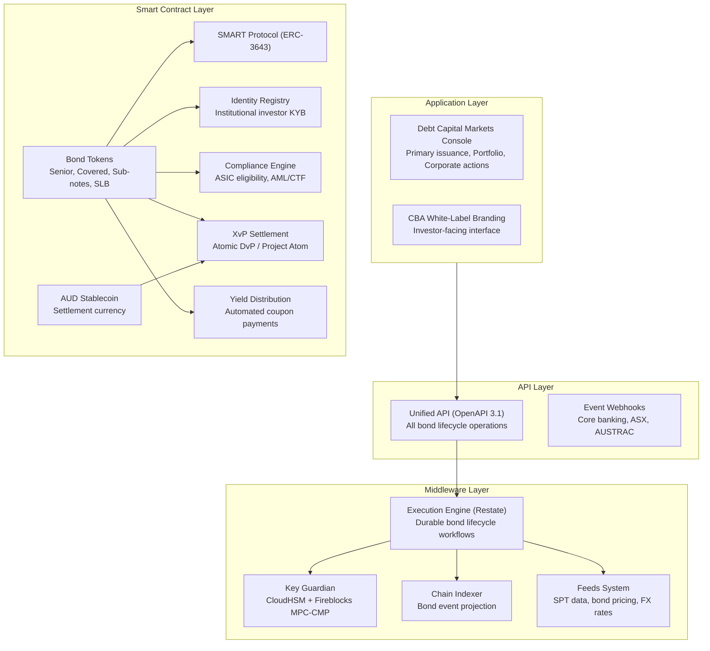
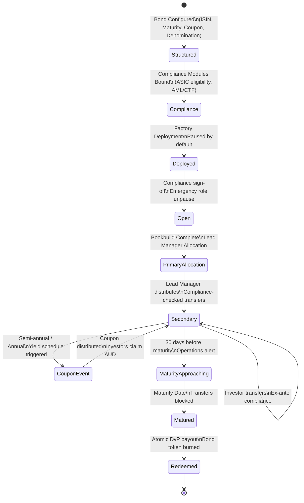
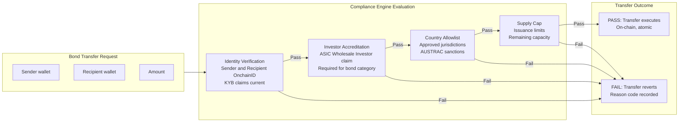
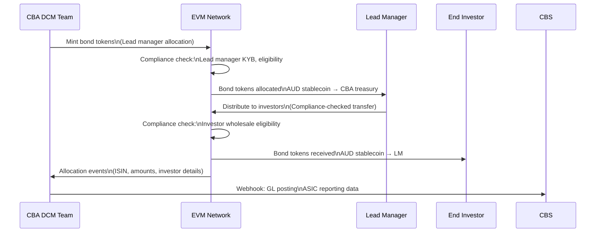
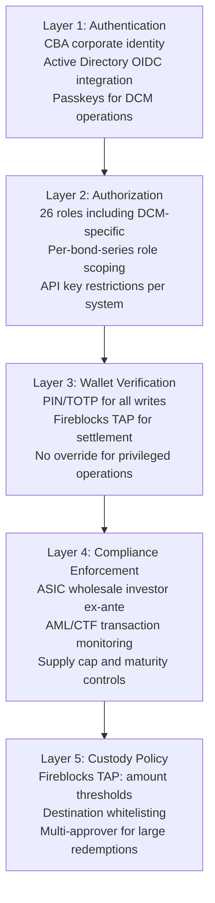
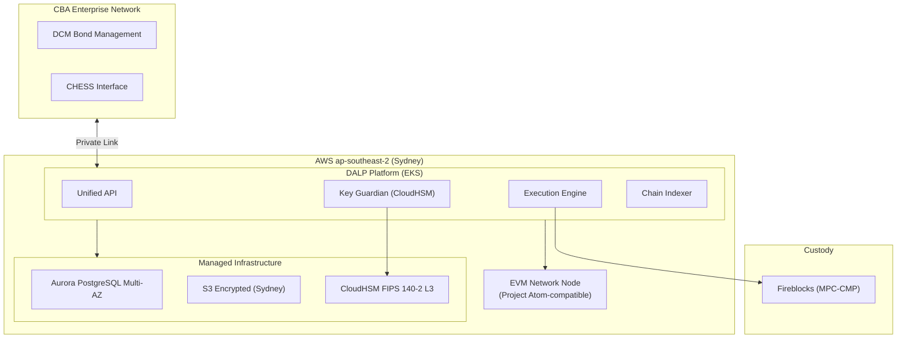
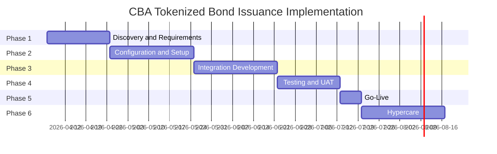

# Technical Proposal: Tokenized Bond Issuance Platform

**Prepared for:** Commonwealth Bank of Australia
**Date:** 20 March 2026
**Version:** 1.0 Draft
**Classification:** SettleMint Confidential. Invited Bidders Only
**Reference:** COMMONWEALTH-BANK-RFP-202603

---

## Table of Contents

1. Cover Page
2. Executive Summary
3. About SettleMint
4. Platform Overview: DALP
5. Solution Architecture
6. Asset Lifecycle Coverage for Bond Issuance
7. Compliance Architecture
8. Integration Architecture
9. Custody and Key Management
10. Settlement and Operations
11. Security Architecture
12. Deployment Options
13. Implementation Approach
14. Support and SLA
15. Reference Projects
16. Regulatory Alignment
17. Response Matrix
18. Appendix A: Risk Register
19. Appendix B: Compliance Module Catalog

---

## 1. Cover Page

**Document Title:** Technical Proposal: Tokenized Bond Issuance Platform
**Client:** Commonwealth Bank of Australia
**Date:** 20 March 2026
**Version:** 1.0 Draft
**Prepared by:** SettleMint NV
**Classification:** SettleMint Confidential

---

## 2. Executive Summary

### 2.1 Context

Commonwealth Bank of Australia is one of the largest issuers of bonds in the Australian market, with a significant domestic and international debt capital markets programme spanning senior unsecured, covered bonds, subordinated notes, and sustainability-linked instruments. CBA's participation in Project Atom, the Reserve Bank of Australia's wholesale CBDC pilot, demonstrates the institution's commitment to moving beyond bond tokenization exploration toward production infrastructure.

The market context reinforces this direction. ASX's ongoing digital market reforms following the CHESS replacement programme create pressure for Australian capital markets to develop digital settlement infrastructure. International bond markets are accelerating tokenization: Commerzbank's hybrid ETP programme (sub-10-second settlement), European institutions issuing tokenized bonds under ETS regulations, and Asian markets embracing digital securities infrastructure. CBA faces a strategic choice: build the digital bond infrastructure now, as a leader, or follow competitors who move first.

This RFP reflects CBA's determination to move from exploration to institutional-grade operation. SettleMint's proposal responds with a production-proven bond issuance platform, direct regulatory alignment with APRA, ASIC, and RBA expectations, and a delivery model that gets CBA to production in 19 weeks.

### 2.2 Why This Programme Is Hard

CBA's tokenized bond programme is technically and operationally demanding for reasons specific to institutional bond issuance at scale:

**Primary issuance workflow complexity:** Australian bond primary issuance involves bookbuilding, allocation, pricing, settlement, and registry management, a multi-party workflow involving CBA's debt capital markets team, lead managers, CHESS-registered investors, and depository participants. Tokenizing this workflow requires governing each step with appropriate controls, evidence trails, and the flexibility to accommodate deal-specific variations in allocation and settlement timing.

**CHESS and ASX integration:** Australia's equity settlement infrastructure (CHESS) is undergoing reform. CBA's bond issuance intersects with ASX's digital market reform agenda. The architecture must accommodate both the current CHESS-based settlement model and a future state where ASX's digital settlement infrastructure is operational.

**Multi-series bond portfolio management:** CBA issues bonds across multiple series, currencies (AUD, USD, EUR), and instruments (senior, covered, sub-notes, RMBS). The platform must manage this portfolio in aggregate while enforcing instrument-specific compliance rules, maintaining separate ledgers per series, and providing consolidated portfolio analytics.

**APRA prudential requirements:** CBA's bond issuance is subject to APRA's prudential standards (APS 180 for covered bonds, APRA's capital adequacy framework). Changes to the bond issuance infrastructure require APRA engagement and may require model validation.

### 2.3 Proposed Response

SettleMint proposes DALP as the tokenized bond issuance platform for CBA:

**Bond Token Architecture:** DALP's bond asset type supports the full spectrum of CBA's bond instruments: senior unsecured notes, covered bonds, sustainability-linked bonds, and subordinated notes. Each bond type is configured through DALP's Asset Designer with instrument-specific parameters (ISIN, face value, maturity, coupon schedule, denomination currency) and appropriate compliance controls.

**Primary Issuance Workflow:** The multi-party primary issuance process, bookbuild, allocation, settlement, is governed through DALP's maker-checker approval workflows and compliance-checked minting. Lead managers receive allocation tokens that can be transferred to end investors through compliance-verified transfers, maintaining the full allocation audit trail on-chain.

**APRA/ASIC Compliance:** DALP's compliance architecture maps to APRA CPS 230/234, ASIC's corporations law obligations for bond issuance, and AML/CTF Act requirements. The regulatory alignment table in Section 16 provides explicit control mapping.

**Project Atom Alignment:** The RBA's Project Atom explores wholesale CBDC for settlement of tokenized assets. DALP's XvP settlement architecture is designed to interoperate with Project Atom infrastructure when available, using AUD stablecoin as the interim cash settlement leg.

**ASX Digital Market Integration:** DALP's API architecture supports integration with ASX's digital market infrastructure for CHESS connectivity and, as ASX reforms progress, potential integration with ASX's next-generation settlement system.

### 2.4 Why SettleMint

**Commerzbank (Germany): Hybrid ETP Issuance and Settlement**
SettleMint's deployment with Commerzbank for hybrid on/off-chain exchange-traded product issuance and management is the most directly relevant production reference for CBA's bond programme. Key outcomes: Boerse Stuttgart listing integration, near real-time clearing and settlement (under 10 seconds), EUR 7 million identified annual savings potential from operational automation. This reference demonstrates SettleMint's capability in the specific domain, regulated fixed income digital issuance, that CBA's programme requires.

**Mizuho Bank (Japan): Bond Tokenization**
Mizuho Bank's bond tokenization programme (PoC completed late 2025, production planning underway) demonstrates DALP's application to institutional bond tokenization in a directly comparable APAC banking environment.

**KBC Securities (Bolero): Securities Issuance Lifecycle**
KBC Securities' transformation of its crowdfunding and SME securities platform using DALP's smart contract lifecycle management demonstrates the platform's capability in regulated securities issuance, lifecycle management, corporate actions, and redemption.

### 2.5 Document Map

- **Section 3:** About SettleMint
- **Section 4:** Platform Overview
- **Section 5:** Solution Architecture
- **Section 6:** Bond Issuance Lifecycle
- **Section 7:** Compliance Architecture (APRA, ASIC, AML/CTF)
- **Section 8:** Integration Architecture (ASX/CHESS, NPP, SWIFT, AUSTRAC)
- **Section 9:** Custody and Key Management
- **Section 10:** Settlement and Operations (DvP, Project Atom)
- **Section 11:** Security Architecture (APRA CPS 234)
- **Section 12:** Deployment (AWS Sydney)
- **Section 13:** Implementation Approach
- **Section 14:** Support and SLA
- **Section 15:** Reference Projects
- **Section 16:** Regulatory Alignment
- **Section 17:** Response Matrix (TR-01 to TR-20)
- **Appendices A and B**

---

## 3. About SettleMint

### 3.1 Company Overview

SettleMint is the digital asset lifecycle platform company for regulated financial markets and sovereign use cases. Nearly a decade of production deployments with regulated banks, market infrastructure providers, and sovereign entities has produced an operational maturity that distinguishes SettleMint from blockchain technology vendors focused on protocol innovation rather than institutional-grade production delivery.

SettleMint's 200+ years of combined banking and blockchain team experience spans capital markets, fixed income operations, digital securities infrastructure, and regulatory compliance across Europe, the Middle East, and Asia Pacific.

### 3.2 Bond Market and Capital Markets Credentials

**Commerzbank. Hybrid ETP Issuance (Germany):** SettleMint's most directly comparable production reference for CBA's bond programme. The Commerzbank solution integrates with Boerse Stuttgart's listing service and Commerzbank's issuance engine, with trades cleared and settled in near real time (under 10 seconds). The identified model: EUR 7 million in annual savings from reduced counterparty risk, cut listing inefficiencies, and faster settlement. This is the production benchmark for institutional digital fixed income issuance.

**KBC Securities (Bolero). Securities Issuance and Lifecycle (Belgium):** Equity crowdfunding platform expanded to SME loans with smart contract automation for issuance, lifecycle management, corporate actions, and redemption. Direct analog to CBA's bond lifecycle requirements: primary issuance, coupon management, and maturity redemption.

**Mizuho Bank. Bond Tokenization (Japan):** Bond tokenization and trade finance proof of concept completed late 2025 with emphasis on standard platform capabilities rather than custom development. Production planning underway. Demonstrates DALP's bond tokenization in a directly comparable APAC banking environment.

**OCBC Bank Singapore. Security Token Engine:** Multi-year production deployment under MAS regulatory oversight for HNWI investment products including bonds, demonstrating DALP's bond lifecycle capabilities in a comparable APAC regulatory environment.

### 3.3 Certifications

ISO 27001 and SOC 2 Type II, independently audited security controls supporting APRA CPS 234 vendor risk assessment.

---

## 4. Platform Overview: DALP

### 4.1 Bond-Specific DALP Capabilities

DALP provides purpose-built bond lifecycle capabilities directly applicable to CBA's tokenized bond programme:

**Maturity date management:** Bond tokens include a mandatory maturity date set at creation time, enforced by the Maturity Block compliance module and Maturity Redemption feature. After maturity, all transfers are blocked; holders can only redeem at face value.

**Automated coupon distribution:** Fixed Treasury Yield feature automates coupon payments on configurable schedules (semi-annual, annual). Historical Balance snapshots determine each holder's proportional share. Distribution is pull-based from the denomination asset treasury.

**ISIN identification:** Every bond token carries a validated ISIN (ISO 6166) from creation. The ISIN links the on-chain instrument to its legal identifier for regulatory reporting, secondary market identification, and CHESS registry alignment.

**DvP settlement:** Denomination asset linking at bond creation establishes the settlement relationship. Atomic DvP settlement against AUD stablecoin or NPP-coordinated AUD ensures that bond delivery and cash payment complete simultaneously or both revert.

**Multi-currency support:** CBA's bond issuance spans AUD, USD, and EUR. DALP supports multi-currency denomination through the deposit token architecture. Each bond is denominated in a specific currency deposit token (AUD stablecoin, USD stablecoin, EUR stablecoin), enabling atomic DvP settlement in the appropriate currency.

**Sustainability-linked bond features:** For CBA's sustainability-linked bonds (SLBs) and green bonds, DALP's data feed system integrates with sustainability performance target (SPT) data providers. The coupon step-up/step-down mechanism for SLBs is configured through the yield schedule with SPT verification triggering coupon adjustment events.

---

## 5. Solution Architecture

### 5.1 Four-Layer Stack for Bond Issuance

### 5.2 Bond Series Management

CBA's bond portfolio spans multiple series, each with distinct parameters. DALP's multi-asset architecture manages this through instrument templates and per-series token contracts:

**Series isolation:** Each bond series is a separate DALPAsset contract with its own compliance configuration, governance roles, supply parameters, and yield schedule. Changes to one series (compliance module reconfiguration, role reassignment) have no effect on other series. This isolation is essential for bond portfolio management: a regulatory freeze on one series does not affect others.

**Portfolio aggregation:** DALP's portfolio analytics aggregate across all active bond series, providing CBA's debt capital markets team with a consolidated view of total outstanding, upcoming coupon obligations, maturing bonds, and investor distribution, all in real time from on-chain data.

**Cross-series settlement:** For complex bond exchange operations (liability management exercises, bond swaps), DALP's XvP settlement enables atomic cross-series exchange: surrendering bonds of one series in exchange for bonds of another series, with compliance checks on both legs.

---

## 6. Asset Lifecycle Coverage for Bond Issuance

### 6.1 Bond Token Lifecycle

### 6.2 Primary Issuance Workflow

CBA's primary bond issuance involves bookbuilding, price setting, allocation, and settlement, a multi-day process involving CBA's debt capital markets team, lead managers, and institutional investors.

**Pre-issuance configuration:**
The bond is configured in DALP's Asset Designer:
- ISIN (validated against S&P Global Market Intelligence registry)
- Face value (AUD or foreign currency denomination)
- Maturity date (determines Maturity Block activation)
- Coupon rate and payment schedule (drives yield schedule configuration)
- Maximum supply (equals planned issuance amount)
- Denomination asset (AUD stablecoin or NPP-coordinated AUD)
- Compliance modules: ASIC wholesale investor eligibility, country allowlist, transfer approval for primary allocation, supply cap

The token is deployed in paused state. No allocations can occur until CBA's compliance team has verified the configuration and the emergency role holder unpauses the token.

**Bookbuild phase:**
During bookbuild, indicative allocations are tracked off-chain in CBA's bond management system. DALP is not involved in the bookbuild itself, this preserves the flexibility of the existing bookbuild process.

**Allocation and settlement:**
Once the book is closed and allocations determined, CBA's DCM team mints bond tokens to lead manager wallets per their allocation. Each lead manager receives their allocation as a batch mint, with compliance checks verifying that lead managers are registered institutional investors with current KYB claims.

Lead managers then distribute bonds to end investors through compliance-checked transfers. Each transfer validates investor eligibility (ASIC wholesale investor status, KYB claim currency, country restrictions) before execution. The on-chain transfer record creates the definitive allocation audit trail.

**DvP settlement:**
Bond allocation transfers occur against payment in the denomination asset. For AUD-denominated bonds, the DvP uses AUD stablecoin. For foreign currency bonds, HTLC cross-chain settlement coordinates the bond delivery against the appropriate currency stablecoin.

### 6.3 Covered Bond Programme

CBA's covered bond programme has specific regulatory requirements under APRA's covered bond framework (APS 180):

**Cover pool registration:** The on-chain covered bond token carries attestations linking it to the cover pool through the OnchainID trusted issuer mechanism. CBA's cover pool administrator issues a claim to the covered bond token's identity contract, attesting to the cover pool composition, LTV ratios, and eligibility criteria.

**Asset coverage ratio monitoring:** DALP's Collateral Ratio compliance module monitors the covered bond's collateral coverage ratio continuously. If the cover pool value falls below the regulatory minimum (typically 108% of outstanding covered bonds), the module alerts the operations team and blocks new issuance until coverage is restored.

**Investor priority:** In covered bond structures, covered bond holders have priority claim over the cover pool in the event of issuer insolvency. This structural feature is represented on-chain through the Custodian role configuration: the covered bond trustee holds the Custodian role, enabling forced transfers from the cover pool to covered bond holders in enforcement scenarios.

### 6.4 Sustainability-Linked Bonds

CBA's sustainability-linked bond programme links coupon rates to sustainability performance targets (SPTs). DALP supports SLB mechanics through:

**SPT data feed integration:** DALP's Feeds System integrates with CBA's sustainability reporting infrastructure or third-party ESG data providers. SPT achievement status (achieved/not achieved) is delivered to DALP as a verified claim through the trusted issuer mechanism.

**Coupon step mechanism:** The yield schedule addon is configured with conditional coupon rates: base coupon if SPTs are achieved, step-up coupon (typically +25bps) if SPTs are not achieved. The SPT verification event updates the yield schedule configuration for the next coupon period, with the change recorded on-chain as a governance event.

**Green bond allocation tracking:** For green bonds requiring use-of-proceeds tracking, DALP's data feed system can deliver green bond allocation data to the token's on-chain record, providing investors with transparent verification of green bond proceeds deployment.

---

## 7. Compliance Architecture

### 7.1 Australian Bond Market Regulatory Context

CBA's tokenized bond programme operates within the following regulatory framework:

**ASIC Corporations Act:** Bond issuance is regulated under ASIC's markets and financial services framework. CBA's bonds are typically issued to wholesale investors under the wholesale investor exemption (Section 708 of the Corporations Act 2001). DALP's Investor Accreditation compliance module enforces wholesale investor eligibility for all bond transfers.

**APRA Prudential Standards:** CBA's bond programme is subject to APRA's prudential standards, including APS 180 for covered bonds, APS 110 for capital adequacy (for sub-notes), and CPS 230/234 for operational and information security risk management. DALP's architecture addresses CPS 230/234 requirements as documented in Section 11.

**AML/CTF Act:** Anti-money laundering and counter-terrorism financing obligations apply to bond issuance and secondary market activity. DALP's AML/CTF integration delivers real-time transaction events to CBA's AML/CTF platform and provides the freeze/unfreeze API for immediate compliance holds.

**Project Atom:** The RBA's Project Atom explored wholesale CBDC for settlement of tokenized assets. DALP's architecture is designed to interoperate with Project Atom-aligned settlement infrastructure, treating the AUD wholesale CBDC as the denomination asset for DvP settlement when available.

**ASX Digital Market Reforms:** ASX's digital market reform agenda (post-CHESS) creates the potential for a next-generation settlement infrastructure. DALP's API architecture accommodates integration with ASX's emerging digital settlement infrastructure, with the current CHESS-coordination model as the baseline.

### 7.2 ASIC Wholesale Investor Compliance

**Wholesale investor verification:** ASIC's Section 708 wholesale investor exemption requires that bond distributions occur only to investors meeting the wholesale investor criteria (institutional investor, sophisticated investor, or high-net-worth individual with minimum investment threshold). DALP's Investor Accreditation compliance module requires each investor's wallet to carry a current ASIC Wholesale Investor claim from CBA or an authorized verification provider before receiving bond tokens.

**Continuous eligibility:** Claims are verified at execution time, not only at initial onboarding. An investor who met the wholesale investor criteria at bond allocation but subsequently fell below the threshold (unlikely but possible for HNW investors) would have an expired or revoked claim that causes transfer attempts to revert. This continuous enforcement model exceeds ASIC's baseline requirements and provides a stronger evidentiary basis for the wholesale exemption.

### 7.3 AUSTRAC AML/CTF Integration

Bond issuance activity generates AUSTRAC reporting obligations. DALP's integration architecture delivers:

**Transaction monitoring:** Every bond transfer generates a real-time webhook event to CBA's AML/CTF monitoring platform. The event payload includes: bond ISIN, transaction amount, sender and recipient wallet addresses mapped to KYB-verified entity identifiers, timestamp, and transaction reference.

**Large transaction reporting:** For transactions exceeding AUD 10,000 cash equivalent in the denomination asset, DALP's event export API provides the data for AUSTRAC Threshold Transaction Report generation.

**Suspicious matter freeze:** When CBA's AML/CTF platform identifies a suspicious matter, DALP's freeze API suspends the relevant investor wallet immediately. The freeze event is on-chain, providing the evidentiary basis for the AUSTRAC Suspicious Matter Report.

---

## 8. Integration Architecture

### 8.1 CBA Bond Platform Integration Landscape

```mermaid
graph TB
    subgraph CBA["CBA Enterprise Systems"]
        DCM["DCM Bond Management\nIssuance, bookbuild, allocation"]
        CBS["Core Banking\nGL, investor accounts, cash management"]
        CHESS["CHESS Interface\nASX settlement registry"]
        AML["AML/CTF Platform\nAUSTRAC reporting, screening"]
        RPT["Regulatory Reporting\nASIC, APRA, AUSTRAC"]
        SPT["Sustainability Platform\nSPT monitoring, ESG data"]
    end
    subgraph DALP["DALP Platform (AWS ap-southeast-2)"]
        API["Unified API"]
        WH["Event Webhooks"]
        FD["Feeds System (SPT, FX)"]
    end
    subgraph External["External"]
        NPP["NPP\nAUD real-time settlement"]
        SWIFT["SWIFT\nFX and international settlement"]
        ASX["ASX Digital\nNext-gen settlement (future)"]
        PA["Project Atom\nWholesale CBDC (future)"]
    end

    DCM <-->|Primary issuance\nBookbuild-to-allocation| API
    CBS <-->|GL posting\nInvestor position reconciliation| WH
    CHESS <-->|Registry coordination\nISIN reconciliation| API
    AML <-->|AUSTRAC events\nFreeze/unfreeze| WH
    RPT <-->|ASIC, APRA data\nAUSTRAC reports| API
    SPT -->|SLB performance data\nCoupon step triggers| FD
    NPP <-->|AUD settlement leg\nPayment confirmation| API
    SWIFT <-->|FX and correspondent| API
    ASX -.->|Future integration\nDigital settlement| API
    PA -.->|Future: Wholesale CBDC\nDvP settlement| XVP
```

### 8.2 DCM Bond Management Integration

CBA's debt capital markets bond management system coordinates the primary issuance process. DALP integrates as the on-chain issuance layer:

**Bond registration:** When a new bond series is approved by CBA's DCM approval committee, the bond parameters are sent to DALP's token creation API. The bond token is deployed with the full parameter set and the token contract address returned for the bond management system's records.

**Allocation execution:** Following the bookbuild, DCM's bond management system sends batch allocation instructions to DALP's batch minting API. Each allocation is a mint operation to the lead manager's wallet, validated against the lead manager's compliance status.

**Corporate action coordination:** Coupon payment events, early redemption events, and maturity redemption events are coordinated between DALP's event log and the bond management system. DALP generates the on-chain corporate action; the bond management system generates the corresponding off-chain entries in CBA's financial systems.

### 8.3 CHESS Registry Coordination

CHESS (Clearing House Electronic Sub-register System) is ASX's current securities settlement infrastructure. CBA's bond registry may or may not be CHESS-based depending on the specific instrument type. For CHESS-registered bonds, DALP's mirror ledger approach coordinates on-chain and CHESS records:

**Mirror ledger model:** DALP maintains the on-chain token ledger as the atomic settlement layer. CHESS maintains the legal title record for CHESS-registered bonds. Settlement events in DALP trigger CHESS update notifications through the integration layer, keeping both systems synchronized.

**ISIN registry:** DALP bond tokens use ASX-issued ISINs, ensuring legal instrument identification consistency between on-chain and CHESS records.

**Post-CHESS era:** As ASX's digital market reforms progress, DALP's architecture accommodates migration from CHESS to ASX's next-generation settlement system. The API abstraction layer means that swapping the CHESS integration for an ASX Digital integration requires configuration changes, not platform replacement.

### 8.4 Project Atom and Wholesale CBDC Settlement

The RBA's Project Atom explored wholesale CBDC for tokenized asset settlement. DALP's architecture is designed for Project Atom-aligned settlement:

**Current state (AUD stablecoin):** In the interim before Project Atom-aligned CBDC infrastructure is available, CBA can issue an AUD stablecoin (analogous to ANZ's A$DC programme) as the denomination asset for bond DvP settlement. The stablecoin is a DALP deposit token backed by CBA's reserve balance, enabling T+0 atomic DvP for AUD-denominated bonds.

**Project Atom transition:** When Project Atom-aligned wholesale CBDC infrastructure becomes available, the denomination asset for bond DvP transitions from the CBA AUD stablecoin to the RBA wholesale CBDC. DALP's denomination asset configuration is updatable through the governance role, enabling this transition without redeploying bond token contracts or migrating holder balances.

**ERC-3643 standard compatibility:** Project Atom's tokenized asset work uses ERC-3643-compatible token standards. DALP's SMART Protocol implementation of ERC-3643 provides native compatibility with Project Atom-aligned infrastructure.

---

## 9. Custody and Key Management

### 9.1 Key Guardian for Bond Issuance

CBA's bond issuance operations require a key management architecture that separates DCM operations (primary issuance, coupon distribution) from treasury operations (settlement, redemption payments) and compliance operations (freezes, forced transfers):

**DCM Operations (Supply Management role):** Cloud KMS-backed signing for routine issuance operations. AWS CloudKMS in ap-southeast-2 (Sydney) provides FIPS 140-2 validated key storage within Australian territory.

**Treasury Operations (Custodian/Settlement role):** HSM-backed signing with Fireblocks MPC-CMP for settlement operations involving AUD stablecoin flows. Transaction Authorization Policies enforce amount thresholds and destination whitelisting for all settlement transactions.

**Compliance Operations (Emergency/Custodian role):** Multi-party approval for freeze operations, governance configuration changes, and emergency access. Each compliance action requires wallet verification plus a designated secondary approver.

### 9.2 Fireblocks Integration for Bond Settlement

Fireblocks MPC-CMP provides institutional-grade custody for CBA's bond settlement operations:

**TAP policies for bond settlement:** Settlement transactions for bond DvP operations are subject to TAP policies: amount thresholds aligned with CBA's transaction approval limits; destination whitelisting covering CBA's AUD stablecoin reserve accounts and authorized counterparty wallets; velocity limits tracking aggregate settlement volumes within defined windows.

**APRA CPS 234 compliance:** Fireblocks SOC 2 Type II certification covers the custody layer's security controls. The combined SettleMint ISO 27001 + Fireblocks SOC 2 provides multi-layer assurance for APRA's CPS 234 vendor risk assessment.

---

## 10. Settlement and Operations

### 10.1 Bond Settlement Models

**Model 1: Atomic AUD DvP (Primary and Secondary Market)**
Bond token delivery against AUD stablecoin payment. T+0, atomic, no counterparty risk. Primary issuance: lead manager receives bond allocation against AUD stablecoin payment to CBA. Secondary: investor-to-investor transfer against AUD stablecoin.

**Model 2: NPP-Coordinated Settlement**
For investors without AUD stablecoin wallets, NPP payment confirmation coordinates the off-chain AUD cash leg with on-chain bond delivery.

**Model 3: Cross-Currency (SWIFT)**
For USD or EUR-denominated bonds, HTLC settlement coordinates bond delivery against foreign currency stablecoin payment, or SWIFT-coordinated settlement for investors using traditional FX settlement.

### 10.2 Corporate Actions Automation

**Semi-annual coupon payments:** Fixed Treasury Yield feature automates coupon calculation and distribution on configured payment dates. Historical Balance snapshot at record date determines each holder's entitlement. Distribution executes from CBA's denomination asset treasury without manual intervention.

**Sustainability coupon step adjustments:** For SLBs, SPT verification events trigger yield schedule updates in the next coupon period. The step adjustment (up or down) executes automatically based on the verified SPT outcome, with the configuration change recorded on-chain for audit and investor transparency.

**Early redemption:** For bonds with call options, the Supply Management role executes early redemption: all outstanding bonds are burned and AUD stablecoin transfers atomically from the redemption reserve to holders. The operation is gated by the Governance role's approval, ensuring proper change management for early redemption decisions.

**Maturity redemption:** Maturity Redemption feature executes at maturity: all transfers are blocked after the maturity date; holders redeem atomically through burn-and-payout. If the denomination asset treasury is insufficient, the redemption reverts, triggering the default workflow documented in operational runbooks.

### 10.3 Bond Operations Dashboard

**Portfolio Overview:** All active bond series with outstanding amount, maturity dates, next coupon dates, current YTM (from price feeds), and investor count per series.

**Issuance Pipeline:** Bonds in deployment process (configured, pending compliance sign-off, paused, unpaused, fully subscribed). DCM team view for tracking primary issuance progress.

**Corporate Actions Calendar:** Upcoming coupon payments, maturity redemptions, SLB SPT review dates, and call option windows across all active series.

**Settlement Queue:** Pending DvP settlements, HTLC expiry tracking, NPP payment confirmation status. Operations team view for settlement monitoring.

**AML/CTF Monitor:** Active investor wallets, suspicious matter flags, AUSTRAC reporting queue, freeze event log.

---

## 11. Security Architecture

### 11.1 Five-Layer Defense-in-Depth

### 11.2 APRA CPS 234 Compliance

APRA CPS 234 requirements for CBA's tokenized bond platform:

**Information security governance:** SettleMint ISO 27001 ISMS covers all DALP development, operations, and customer data processing. Annual external audits confirm continued adherence.

**Control assessment:** SettleMint SOC 2 Type II report confirms that security controls operate effectively over the audit period. The Type II report (operational effectiveness, not just design) provides CBA's risk function with the assurance required for APRA vendor risk management.

**Incident management:** Enterprise Support 24/7/365 with 15-minute P1 response and APRA-compatible incident notification procedures.

**Third-party security:** AWS Sydney CPS 234 attestation for infrastructure layer; Fireblocks SOC 2 Type II for custody layer; SettleMint ISO 27001 for platform layer.

---

## 12. Deployment Options

### 12.1 Recommended: AWS ap-southeast-2 (Sydney)

**Data residency:** All DALP platform data within AWS ap-southeast-2 (Sydney). No data crosses Australian borders. Satisfies APRA data residency requirements and CBA's internal data governance policies.

---

## 13. Implementation Approach

### 13.1 Phase-Gated Methodology

**Total: 19 weeks**

### 13.2 Phase Summaries

**Phase 1 (Weeks 1-3):** Regulatory mapping (APRA CPS 230/234, ASIC, AML/CTF, AUSTRAC), bond type scoping (senior, covered, SLB, sub-notes), AUD stablecoin architecture (CBA vs. NPP-coordinated), DCM integration design, CHESS coordination model, APRA vendor risk assessment preparation.

**Phase 2 (Weeks 4-7):** AWS Sydney environment provisioning, bond instrument template configuration (senior unsecured, covered bond, SLB), ASIC wholesale investor compliance module deployment, AUD stablecoin deposit token deployment, Key Guardian with CloudHSM + Fireblocks.

**Phase 3 (Weeks 8-11):** DCM bond management integration (primary issuance workflow), CHESS coordination integration, NPP settlement integration, AUSTRAC AML/CTF integration, sustainability data feed integration for SLB.

**Phase 4 (Weeks 12-14):** Bond lifecycle testing (issuance through maturity), ASIC wholesale investor enforcement testing, covered bond collateral ratio testing, SLB coupon step mechanism testing, AUSTRAC reporting testing, NPP settlement coordination testing, UAT with CBA DCM, operations, compliance, and risk teams.

**Phase 5 (Week 15):** Production go-live with initial bond type (senior unsecured). Covered bonds and SLBs in subsequent phases after initial stabilization.

**Phase 6 (Weeks 16-19):** Hypercare: coupon distribution execution for first operational period, DCM team knowledge transfer, APRA operational risk documentation finalization.

### 13.3 RAID Summary

| Risk | Mitigation |
|------|-----------|
| APRA vendor risk assessment timeline | Early InfoSec engagement; ISO 27001 and SOC 2 Type II accelerate; dedicated APRA vendor package |
| CHESS integration complexity for specific bond types | Assess CHESS API scope in Phase 1; define which bond types require CHESS and which operate on-chain only |
| AUD stablecoin issuance regulatory characterization | Legal review of AUD stablecoin (CBA-issued) vs. NPP-coordinated settlement in Phase 1; NPP model available as lower-risk alternative |
| Project Atom timeline uncertainty | Architecture compatible with Project Atom without hard dependency; AUD stablecoin interim model operational from go-live |
| ASX digital reform uncertainty | API abstraction layer enables future ASX integration without platform replacement |

---

## 14. Support and SLA

### 14.1 Enterprise Support

Enterprise Support (24/7/365, 99.99% SLA) is required for APRA-regulated bond operations. P1 Critical includes: production down, compliance bypass, DvP settlement failure, AUD stablecoin reserve compliance failure.

| Severity | Response | Resolution |
|----------|---------|-----------|
| P1 Critical | 15 minutes | 2 hours |
| P2 High | 1 hour | 4 hours |
| P3 Medium | 4 hours | 2 business days |
| P4 Low | 1 business day | 3 business days |

---

## 15. Reference Projects

| Institution | Region | Use Case | Status |
|-------------|--------|----------|--------|
| OCBC Bank | Singapore | Security token engine; HNWI investment products | Production |
| KBC Securities (Bolero) | Belgium | Securities issuance lifecycle; smart contract automation | Production |
| KBC Insurance | Belgium | NFT product passports | Production |
| Standard Chartered Bank | Asia/MENA | Digital Virtual Exchange; fractional securities | Production |
| Reserve Bank of India Innovation Hub | India | Multi-bank trade finance | Production |
| Sony Bank (Sony Group) | Japan | Stablecoin with digital identity | Phase 1 Production |
| State Bank of India | India | CBDC infrastructure | Pilot complete |
| Islamic Development Bank | Multilateral | Sharia-compliant distribution; 57 countries | Production |
| Mizuho Bank | Japan | Bond tokenization and trade finance | PoC complete, production planning |
| Islamic Development Bank (market stabilization) | Multilateral | Market stabilization for collateral | Production |
| Maybank (Project Photon) | Malaysia | FX tokenization; XvP settlement | Production |
| ADI Finstreet | UAE | Tokenized equity; custody integration | Production |
| Commerzbank | Germany | Hybrid ETP issuance; Boerse Stuttgart; sub-10-second settlement; EUR 7M savings | Production |
| Saudi RER | Saudi Arabia | Country-scale real estate tokenization | Production |

### 15.2 Commerzbank: Hybrid Bond/ETP Issuance (Primary Case Study)

**Relevance:** Directly comparable production reference. Commerzbank's ETP issuance is structurally similar to CBA's tokenized bond programme: regulated fixed income digital instruments, exchange listing integration, near real-time clearing and settlement (under 10 seconds), and quantified operational savings.

**Scope:** SettleMint integrated with Boerse Stuttgart's listing service and Commerzbank's issuance engine. Trades cleared and settled in near real time. Outcome: reduced counterparty risk, eliminated listing inefficiencies, settlement in under 10 seconds. Identified potential savings of EUR 7 million annually.

**Technical parallels:** The Commerzbank architecture, hybrid on-chain issuance with exchange-integrated listing and settlement, mirrors CBA's requirement for hybrid on-chain issuance integrated with CHESS/ASX settlement infrastructure. The sub-10-second settlement is the target outcome for CBA's T+0 bond settlement.

**Transfer:** The EUR 7 million annual savings identified at Commerzbank translates to the Australian bond market at scale. For CBA's bond issuance volumes (AUD billions annually), the operational savings from eliminated counterparty risk, reduced reconciliation overhead, and automated coupon distribution are material.

### 15.3 Mizuho Bank: APAC Bond Tokenization (Case Study)

**Relevance:** Directly demonstrates DALP's bond tokenization application in an APAC banking environment with comparable governance and regulatory complexity.

**Scope:** Mizuho Bank engaged SettleMint for bond tokenization and trade finance, emphasizing standard platform capabilities rather than custom development. The engagement was designed to enable Mizuho's internal team to operate the solution independently. PoC completed late 2025; production planning underway.

**Transfer:** Mizuho's "standard platform capabilities" emphasis aligns with CBA's procurement objective of avoiding custom development. The production planning stage at Mizuho demonstrates the timeline from PoC to production, a direct indicator for CBA's implementation planning.

---

## 16. Regulatory Alignment

| Requirement | Description | DALP Control | Evidence |
|------------|-------------|--------------|----------|
| APRA CPS 230: Operational resilience | Operational risk management for business-critical systems | AWS Sydney Multi-AZ; RTO 2-15 min; RPO seconds; Enterprise SLA 99.99%; quarterly DR testing | Architecture; SLA commitment |
| APRA CPS 234: Information security | Information security capabilities | ISO 27001, SOC 2 Type II, five-layer defense-in-depth, CloudHSM, Fireblocks SOC 2 | Certificates; security architecture |
| ASIC Corporations Act 708: Wholesale investor | Bond distribution to wholesale investors only | Investor Accreditation module: ASIC wholesale investor claim required | Compliance module configuration |
| ASIC Market Integrity: Secondary transfers | All bond transfers comply with market integrity requirements | Ex-ante compliance enforcement on all transfers; eligibility verified before execution | On-chain compliance events |
| AML/CTF Act: Transaction monitoring | Monitor and report suspicious transactions | Webhook-driven AML platform; freeze API; AUSTRAC reporting pipeline | Integration architecture |
| AML/CTF Act: Customer identification | KYC/KYB for bond participants | OnchainID identity framework; KYB claim required for all transfer parties | Identity registry |
| ASIC: Prospectus disclosure | Wholesale investor exemption requires compliance with disclosure obligations | Transfer Approval module: disclosure acknowledgment gate for primary allocation | On-chain approval records |
| RBA Project Atom: Settlement compatibility | Compatibility with Project Atom wholesale CBDC settlement | ERC-3643 standard interface; XvP settlement compatible with Project Atom design; denomination asset updatable | Architecture documentation |
| ASX CHESS: Registry coordination | Coordination with CHESS for CHESS-registered bonds | CHESS coordination API integration; ISIN-based cross-reference | Integration architecture |
| APRA: Data residency | Financial data within Australia | AWS ap-southeast-2 (Sydney); all data within Australian jurisdiction | Deployment architecture |

---

## 17. Response Matrix

| Req ID | Status | Response |
|--------|--------|---------|
| TR-01 | Supported | Complete bond issuance lifecycle: design, issuance, secondary trading, coupon distribution, maturity redemption. All bond types: senior, covered, SLB, sub-notes |
| TR-02 | Supported | Transfer Approval module for primary allocation governance. 26 roles enforcing separation. Covered bond trustee role for enforcement scenarios |
| TR-03 | Supported | OpenAPI 3.1, TypeScript SDK, event webhooks, ISO 20022 for NPP/SWIFT |
| TR-04 | Supported | APRA CPS 230/234 mapped in Section 16. ASIC wholesale investor enforcement. AML/CTF AUSTRAC integration |
| TR-05 | Supported | OnchainID KYB for institutional bond participants. ASIC wholesale investor accreditation module. Country restrictions for international distribution |
| TR-06 | Supported | Key Guardian: CloudHSM (FIPS 140-2 L3) + Fireblocks MPC-CMP. Multi-party emergency access. Key rotation durable workflow |
| TR-07 | Supported | On-chain source of truth. CHESS mirror ledger coordination. NPP payment confirmation reconciliation. Deterministic AUSTRAC event export |
| TR-08 | Supported | Bond portfolio, issuance pipeline, corporate actions calendar, settlement queue, AML/CTF monitor |
| TR-09 | Supported | AWS Sydney recommended; on-premises available; all data within Australia |
| TR-10 | Supported | Commerzbank (bond/ETP issuance, EUR 7M savings, production); Mizuho (bond tokenization, APAC, production planning); OCBC Singapore (MAS-regulated, production) |
| TR-11 | Supported | 18 compliance modules. Covered bond collateral ratio. SLB SPT data feed with coupon step. ASIC eligibility expression builder |
| TR-12 | Supported | Section 13 covers comprehensive test programme including APRA-specific scenarios |
| TR-13 | Supported | DCM bond management, CHESS, NPP, SWIFT, AUSTRAC, sustainability data feeds |
| TR-14 | Supported | Configurable instrument templates for all bond types. SLB, covered bond, sub-notes via configuration |
| TR-15 | Supported | Immutable on-chain audit trail. AUSTRAC 7-year retention. Deterministic event export |
| TR-16 | Supported | Full dependency register. AWS, Fireblocks, Restate dependencies documented |
| TR-17 | Supported | RTO 2-15 minutes; RPO seconds; AWS Sydney Multi-AZ; quarterly DR testing; APRA CPS 230 aligned |
| TR-18 | Supported | Environment-based license, no transaction fees. New bond series via configuration |
| TR-19 | Supported | UUPS governance; staged rollout with CBA approval gate; APRA change management |
| TR-20 | Supported | Live capabilities clearly identified. Project Atom integration framed as future state without hard dependency |

---

## 14a. Target Operating Model (BAU: Bond Operations)

### 14a.1 Operational Ownership

**CBA Debt Capital Markets Operations owns:**
- Bond issuance pipeline management: monitoring bonds in deployment, compliance sign-off queue, unpausing readiness
- Primary allocation execution: coordinating minting to lead managers, validating allocation completeness against bookbuild records
- Corporate actions calendar: tracking upcoming coupon payments, maturity redemptions, SLB SPT review dates, early redemption windows
- Covered bond cover pool monitoring: weekly confirmation that collateral ratio meets APS 180 minimum (108%)

**CBA Institutional Banking Operations owns:**
- Secondary market transfer monitoring: compliance rejection rates, investor eligibility status
- Settlement queue management: NPP payment confirmation coordination, HTLC settlement expiry tracking
- Investor onboarding coordination: ASIC wholesale investor claim issuance for new bond investors

**CBA Compliance and Financial Crime owns:**
- AUSTRAC reporting: daily threshold transaction data, suspicious matter alert management, LTKM submission
- ASIC disclosure compliance: monitoring disclosure acknowledgment records for primary allocations
- Covered bond trustee coordination: trustee notification for material events affecting covered bond status

**CBA Sustainability Team owns:**
- SLB SPT monitoring: tracking sustainability performance target outcomes against annual measurement dates
- SPT attestation coordination: working with third-party SPT verifier to issue on-chain verified SPT outcome claims
- Coupon step governance: approving yield schedule configuration changes based on SPT verification outcomes

**CBA Technology owns:**
- AWS Sydney platform health monitoring (shared with SettleMint Enterprise Support)
- CHESS integration health monitoring
- NPP connectivity monitoring

### 14a.2 Daily Bond Operations Procedures

**Start of Day (08:00 AEST):**
1. Review corporate actions calendar: coupons due within 30 days, bonds approaching maturity, SLB SPT reviews scheduled
2. Check covered bond collateral ratio: confirm coverage above 108% APS 180 minimum; alert if approaching threshold
3. Review settlement queue: pending NPP payment confirmations, HTLC settlements approaching expiry
4. Check AUSTRAC reporting queue: transactions from prior day requiring threshold transaction review
5. Confirm issuance pipeline: bonds in deployment state requiring compliance sign-off or ISIN validation

**Intraday:**
- Lead manager transfer monitoring: compliance rejection alerts for lead manager distribution activity
- AUSTRAC alert review: suspicious matter alerts investigated within 4 business hours

**End of Day (17:00 AEST):**
- AUSTRAC daily transaction report: export and review for threshold transaction reporting
- ASIC secondary market activity data: export for ASIC market integrity reporting
- Covered bond position reconciliation: on-chain covered bond supply versus CHESS registry

### 14a.3 Covered Bond Trustee Operating Model

CBA's covered bond programme involves a legally appointed covered bond trustee who represents covered bond holders and enforces trustee rights in the event of CBA's insolvency. DALP's role architecture reflects this:

**Custodian role assignment:** The covered bond trustee holds the Custodian role for covered bond tokens. This role grants:
- Forced transfer capability: in an enforcement scenario, the trustee can execute forced transfers of cover pool assets to covered bond token holders
- Wallet freeze: the trustee can freeze CBA's supply management wallet if CBA's ability to service covered bonds is impaired
- Emergency override: in coordination with the Emergency role, the trustee can pause covered bond token transfers during a restructuring

**Operational governance:** Under normal conditions, the trustee does not exercise its Custodian rights. The trustee monitors the collateral ratio (APS 180 minimum 108%) through read-only access to DALP's covered bond dashboard. The Collateral Ratio compliance module alerts the trustee when the ratio falls below 115% (warning threshold) and blocks new issuance below 108% (regulatory minimum).

**Enforcement scenario:** If CBA enters administration, the trustee's Custodian role enables enforcement without requiring any additional platform configuration. The trustee calls DALP's forced transfer API to distribute cover pool assets to covered bond token holders, with the on-chain record providing the definitive allocation audit trail for the administrator and covered bond trustee report.

### 14a.4 SLB SPT Review and Coupon Step Cycle

The annual sustainability performance target review is a regulated corporate action for CBA's sustainability-linked bonds. The operational cycle:

**T-60 days before SPT measurement date:**
- CBA Sustainability Team initiates SPT measurement process with third-party verifier
- DALP operations team confirms yield schedule configuration for post-SPT period

**SPT measurement date:**
- Third-party verifier completes SPT outcome determination (achieved/not achieved)
- Verifier issues an on-chain SPT Outcome claim to the SLB token's identity contract through the trusted issuer mechanism
- CBA Sustainability Team reviews the on-chain claim for accuracy
- If the claim accurately reflects the SPT outcome, no further action required, the yield schedule configuration update is approved through the governance role

**T+5 days: Coupon step configuration update:**
- CBA DCM Governance role holder updates the yield schedule addon for the next coupon period
- Step-up coupon rate configured if SPT not achieved; base rate maintained if achieved
- Configuration change recorded on-chain as a Governance event, immutable and investor-accessible
- ASIC continuous disclosure obligation satisfied through on-chain public record of coupon rate change

**Coupon payment execution:**
- At the next coupon date, the yield schedule distributes at the adjusted rate
- Investors receive step-up or base rate coupons without manual treasury intervention
- AUSTRAC reporting reflects the coupon payment amounts

---

## 14b. Scenario Narratives for Bond Operations

### Scenario 1: Standard Semi-Annual Coupon Payment

CBA's 5-year senior unsecured bond has AUD 2 billion outstanding across 500 institutional investors. The semi-annual coupon date arrives.

Operations team checks the corporate actions calendar at start of day: "BOND-2029-SU2 coupon distribution due today, 14:00 AEST. Total distribution: AUD 52.5 million (5.25% annual, semi-annual). Denomination asset treasury balance: AUD 55 million (confirmed sufficient)."

At 14:00 AEST, the DCM operations manager activates the yield distribution from the corporate actions console. DALP's Fixed Treasury Yield feature executes: each of the 500 investor wallets receives AUD stablecoin (or NPP confirmation for NPP-coordinated investors) proportional to their bond holding at the record date. The distribution completes within minutes without manual intervention per investor.

Distribution events generate webhooks to:
- Core banking: interest expense GL journal entries
- AUSTRAC: any distributions exceeding AUD 10,000 threshold transaction records
- ASIC: coupon payment activity for regulatory reporting

Operations team confirms the distribution summary in the DALP dashboard: 500 investors paid, total AUD 52.5 million, denomination asset treasury reduced to AUD 2.5 million. The core banking reconciliation confirms GL entries match the distribution total.

### Scenario 2: SLB Coupon Step: SPT Not Achieved

CBA's 5-year sustainability-linked bond (BOND-2027-SLB1) has a 2025 SPT: reduce Scope 1 and 2 emissions by 20% versus 2020 baseline. CBA's actual reduction was 12%, below target. The step-up provision applies: coupon increases from 4.75% to 5.00% for the final 2 coupon periods.

The third-party ESG verifier issues the SPT outcome claim to the SLB token's identity contract: "SPT-2025: NOT ACHIEVED. Scope 1+2 reduction: 12%. Threshold: 20%." The claim is signed with the verifier's trusted issuer private key.

CBA Sustainability Team reviews the on-chain claim in DALP's governance console and confirms the accuracy. CBA's Governance role holder updates the yield schedule addon for the next coupon period: coupon rate changed from 4.75% to 5.00% (25bps step-up). The configuration change is recorded on-chain as a Governance event with the Governance role holder's identity, the timestamp, and the new rate.

ASIC continuous disclosure requirement is satisfied: the on-chain Governance event is publicly visible on the blockchain, providing investors with immediate notification of the coupon rate change.

At the next coupon date, the yield distribution executes at 5.00%, the step-up rate. Investors holding AUD 1 billion of the SLB receive AUD 50 million total coupon (versus AUD 47.5 million at the base rate). The additional AUD 2.5 million per coupon period flows from CBA's denomination asset treasury to investors.

### Scenario 3: AUSTRAC Investigation: Investor Freeze

CBA's AML/CTF monitoring system identifies suspicious activity patterns in an institutional investor's bond account: unusual transfer pattern, rapid accumulation of multiple bond series positions followed by redemption requests across series simultaneously. The compliance team decides to place an immediate hold.

Compliance officer calls DALP's freeze API for the investor's wallet address. Within 30 seconds, the wallet is frozen: no bond transfers (in or out), no coupon claims, no redemption requests execute. The freeze event is on-chain with the compliance officer's wallet identity, timestamp, and compliance reference.

The investor's relationship manager is notified: "Bond investor account [address] frozen by compliance as of [timestamp]."

CBA's financial crime team prepares the Suspicious Matter Report (SMR) for AUSTRAC. DALP's event API provides the investor's complete bond transaction history: all purchases, transfers, coupon claims, and redemption requests. The report identifies the transaction pattern and provides on-chain evidence of the suspicious activity and CBA's immediate response (freeze).

If cleared: unfreeze through DALP's unfreeze API with authorization reference. If confirmed suspicious: the freeze is maintained, and the covered bond trustee is notified for any covered bond holdings requiring trustee coordination. The Custodian role can execute forced transfer of covered bond holdings to an escrow account pending legal proceedings, with the on-chain event providing the definitive enforcement record.

---

## 18. Appendix A: Risk Register

| Risk ID | Category | Description | Likelihood | Impact | Mitigation |
|---------|----------|-------------|-----------|--------|-----------|
| R-001 | Regulatory | APRA vendor risk assessment timeline | Medium | High | Early InfoSec engagement; ISO 27001 and SOC 2 Type II accelerate; dedicated APRA package in Phase 1 |
| R-002 | Regulatory | ASIC characterization of AUD stablecoin as financial product requiring separate licensing | Low | High | Legal review in Phase 1; NPP-coordinated settlement available as alternative |
| R-003 | Integration | CHESS API access for specific bond type registry coordination | Medium | Medium | Phase 1 CHESS API assessment; define which bond types require CHESS and which operate on-chain only |
| R-004 | Technical | Project Atom timeline uncertainty affects DvP architecture planning | High | Low | Architecture compatible with Project Atom without hard dependency; AUD stablecoin interim model available |
| R-005 | Technical | SLB coupon step mechanism requires reliable third-party SPT data feed | Medium | Medium | Multiple SPT data provider options; staleness detection alerts; manual override for exceptional cases |
| R-006 | Operational | APRA CPS 230 requires formal operational risk management validation of the new platform | Medium | High | APRA model validation engaged in Phase 1; DALP operational risk documentation provided |
| R-007 | Commercial | AUD stablecoin issuance and reserve management requires ongoing treasury operations capability at CBA | Low | Medium | NPP-coordinated settlement model available as alternative if AUD stablecoin issuance is deferred |

---

## 19. Appendix B: Compliance Module Catalog

*Full 18-module catalog. Key modules for CBA bond programme:*

**Investor Accreditation Module:** ASIC Section 708 wholesale investor claim required. Enforces wholesale investor exemption for bond distributions.

**Collateral Ratio Module:** For covered bonds, monitors cover pool collateral coverage ratio against APRA APS 180 minimum. Blocks new issuance if ratio falls below regulatory minimum.

**Maturity Block Module:** Activates at bond maturity date; blocks all transfers; enables only holder redemption at face value.

**Fixed Treasury Yield Module:** Automates semi-annual or annual coupon payments from denomination asset treasury. Historical Balance snapshot for pro-rata calculation.

**Settlement Condition Module (SLB):** Connects coupon step trigger to verified SPT outcome from trusted issuer (sustainability data provider). Executes coupon step automatically on verified SPT result.

*Full 18-module catalog in detailed technical annex.*

---

*End of Technical Proposal: Commonwealth Bank of Australia. Tokenized Bond Issuance Platform*
*Document version: 1.0 Draft | Prepared: 20 March 2026 | SettleMint Confidential*
