# Technical Proposal: Tokenized Deposits and Trade Finance Platform

**Prepared for:** DBS Bank Ltd
**Date:** 20 March 2026
**Version:** 1.0 Draft
**Classification:** SettleMint Confidential. Invited Bidders Only
**Reference:** DBS-BANK-RFP-202603

---

## Table of Contents

1. Cover Page
2. Executive Summary
3. About SettleMint
4. Platform Overview: DALP
5. Solution Architecture
6. Asset Lifecycle Coverage
7. Compliance Architecture
8. Integration Architecture
9. Custody and Key Management
10. Settlement and Operations
11. Security Architecture
12. Deployment Options
13. Implementation Approach
14. Support and SLA
15. Reference Projects
16. Regulatory Alignment
17. Response Matrix
18. Appendix A: Risk Register
19. Appendix B: Compliance Module Catalog

---

## 1. Cover Page

**Document Title:** Technical Proposal: Tokenized Deposits and Trade Finance Platform
**Client:** DBS Bank Ltd, Singapore
**Date:** 20 March 2026
**Version:** 1.0 Draft
**Prepared by:** SettleMint NV
**Classification:** SettleMint Confidential

*This document contains proprietary and confidential information belonging to SettleMint NV. It is submitted exclusively in response to DBS-BANK-RFP-202603 and may not be reproduced, disclosed, or distributed without prior written consent from SettleMint NV.*

---

## 2. Executive Summary

### 2.1 Context

DBS Bank stands at a genuine inflection point in digital asset deployment. The institution's direct involvement in DBS Digital Exchange, Singapore's publicly visible participation in Project Guardian, and the progressive maturation of trade finance digitalization initiatives under TradeTrust collectively create a set of expectations that a tokenized deposits and trade finance programme must now satisfy. Those expectations are not limited to technology; they extend to governance, auditability, operational sustainability, and the ability to withstand scrutiny from MAS, internal audit, risk committees, and senior management simultaneously.

This proposal responds directly to that context. SettleMint does not approach this as a pilot opportunity or a technology demonstration. DBS Bank has signalled clearly that it is procuring a production platform with a reusable operating model, not another proof of concept. The institution's strategic objectives, as articulated in this RFP, require a controlled and reusable infrastructure that can support tokenized deposits and trade finance workflows from initial controlled scope through phased expansion across products, legal entities, and approved jurisdictions, without re-platforming.

SettleMint's Digital Asset Lifecycle Platform, DALP, is designed precisely for this category of requirement. Built through nearly a decade of production deployments with regulated banks, market infrastructure providers, and sovereign entities, DALP provides the governance, compliance, and operational infrastructure that regulated environments demand. This proposal maps those capabilities directly to DBS Bank's stated objectives and requirement set.

### 2.2 Why This Programme Is Hard

Institutions that have attempted tokenization programmes at production scale consistently encounter the same failure modes: compliance enforcement that works in demos but breaks under real transfer conditions; key management that satisfies security theatre but creates operational brittleness; integration architectures that assume clean-room conditions and accumulate invisible debt when they meet legacy systems; and reporting capabilities that are improvised after the fact, making audits painful and regulatory inquiries reactive rather than confident.

For DBS Bank specifically, the complexity is compounded by several institutional realities. First, Singapore's regulatory environment under MAS, the Payment Services Act, and the TRM Guidelines creates a compliance control surface that extends well beyond standard token transfer logic. Controls must operate across identity, jurisdiction, transaction monitoring, reporting, and change governance simultaneously. Second, DBS Bank's integration landscape is not a greenfield: it includes existing treasury systems, payment rails, risk platforms, data infrastructure, and operational workflows that the tokenized deposits and trade finance programme must fit into rather than replace. Third, the institution's involvement in Project Guardian and TradeTrust means that the architecture must be interoperable by design, not as an afterthought.

The hardest part is not creating tokenized deposits or digitizing trade finance instruments. The hard part is ensuring that every transfer is validated against the correct identity and eligibility rules before execution; that every governance decision leaves a defensible evidence trail; that every integration handles partial failures, duplicates, and reconciliation breaks gracefully; and that the entire system can be operated, audited, and explained by DBS Bank's own teams without permanent vendor dependency. These are the problems DALP was built to solve.

### 2.3 Proposed Response

SettleMint proposes the deployment of DALP as the governed infrastructure layer for DBS Bank's tokenized deposits and trade finance programme. The proposal covers the complete scope defined in this RFP, including:

**Tokenized Deposits:** DALP's deposit token module enables DBS Bank to issue tokenized deposit instruments on-chain with full lifecycle support: issuance, transfer with ex-ante compliance enforcement, yield calculation and distribution, redemption, and retirement. The deposit token serves as both a financial instrument and the cash leg for atomic Delivery-versus-Payment settlement in trade finance workflows. Regulatory controls for MAS PSA compliance, including investor eligibility verification, jurisdiction restrictions, and transfer limits, are enforced at the smart contract layer, not at the application layer where they can be bypassed.

**Trade Finance:** DALP's configurable token architecture supports the digitization of trade finance instruments including letters of credit, bills of lading, invoices, and receivables. Each instrument is represented as a configurable token with appropriate lifecycle logic, metadata schemas for trade document attributes, and compliance rules reflecting the risk profile and regulatory requirements of the specific instrument type. The XvP (Exchange versus Payment) settlement module supports atomic DvP settlement, enabling simultaneous exchange of trade finance instruments and deposit tokens without counterparty risk.

**Integration:** DALP's API-first architecture, supporting REST, TypeScript SDK, and event webhooks, provides the connectivity required for DBS Bank's enterprise integration landscape, including core banking, treasury systems, sanctions screening, AML case management, data warehouses, and reporting infrastructure. The platform is designed as an integration peer, not a replacement for existing institutional systems.

**Governance and Compliance:** DALP's role-based access control model, maker-checker approval workflows, and on-chain audit trail provide the governance infrastructure required for MAS TRM Guidelines compliance, internal audit, and regulatory examination. The platform's 18 compliance module types cover the full range of MAS regulatory requirements without custom development.

**Deployment:** SettleMint proposes deployment in a dedicated cloud environment within AWS Singapore (ap-southeast-1) to satisfy MAS data residency requirements, with on-premises deployment available as an alternative for institutions requiring full infrastructure control.

### 2.4 Why SettleMint

The evaluation criteria for this RFP place substantial weight on production realism, control maturity, and delivery evidence rather than headline marketing claims. SettleMint's case for selection rests on three verifiable pillars.

First, proven production deployments in directly comparable environments. SettleMint has operated DALP in production with OCBC Bank in Singapore for a security token engine covering securitization, tokenization, and fractionalization of off-chain assets for HNWI investment products, the same regulatory environment, the same institutional control expectations, and the same MAS compliance framework that governs this procurement. The OCBC deployment demonstrates that DALP's compliance architecture satisfies Singapore's regulatory requirements in production, not just in sandbox conditions. Additional APAC references include Standard Chartered Bank's Digital Virtual Exchange for fractional tokenization of securities across Asia, and Maybank's Project Photon for FX tokenization and cross-border XvP settlement aligned with Bank Negara Malaysia's Digital Asset Innovation Hub.

Second, a compliance architecture that enforces controls before execution, not after review. DALP's implementation of ERC-3643 (T-REX) with the SMART Protocol means that every token transfer is validated against identity, jurisdiction, eligibility, and policy rules at the smart contract layer. There is no application-layer compliance that can be bypassed by a direct contract call. This is the enforcement model that MAS expects and that internal audit will examine. SettleMint can demonstrate this in production, not just in documentation.

Third, a delivery model built around the realities of institutional implementation. SettleMint's phase-gated methodology, refined through production deployments with regulated banks across Singapore, Europe, and the Middle East, addresses the specific failure modes that institutional programmes encounter: unresolved governance ownership, integration debt, compliance gaps discovered during testing, and operational knowledge concentrated in vendor specialists. The methodology is designed to transfer operating capability to DBS Bank's teams, not to create permanent dependency.

### 2.5 Document Map

This proposal is structured to respond directly to the DBS Bank RFP, organized as follows:

- **Section 3: About SettleMint**: company background, track record, and market position
- **Section 4: Platform Overview**: DALP architecture, capabilities, and differentiators
- **Section 5: Solution Architecture**: four-layer technical stack and deployment design
- **Section 6: Asset Lifecycle Coverage**: tokenized deposits and trade finance lifecycle detail
- **Section 7: Compliance Architecture**: MAS, PSA, and TRM Guidelines alignment
- **Section 8: Integration Architecture**: enterprise connectivity and API design
- **Section 9: Custody and Key Management**: key security operating model
- **Section 10: Settlement and Operations**: XvP/DvP atomic settlement and operational tooling
- **Section 11: Security Architecture**: defense-in-depth, ISO 27001, SOC 2 Type II
- **Section 12: Deployment Options**: Singapore cloud, on-premises, and hybrid patterns
- **Section 13: Implementation Approach**: phased delivery, RAID, and staffing
- **Section 14: Support and SLA**: tiered support with quantified SLA commitments
- **Section 15: Reference Projects**: 14 production references with APAC case studies
- **Section 16: Regulatory Alignment**: control mapping to MAS, PSA, TRM Guidelines
- **Section 17: Response Matrix**: requirement-by-requirement responses (TR-01 to TR-20)
- **Appendix A: Risk Register**: programme RAID tailored to this procurement
- **Appendix B: Compliance Module Catalog**: full catalog of 18 DALP compliance modules

---

## 3. About SettleMint

### 3.1 Company Overview

SettleMint is the digital asset lifecycle platform company for regulated financial markets and sovereign use cases. Founded nearly a decade ago, SettleMint has grown from an early enterprise blockchain infrastructure provider into the category-defining platform company enabling financial institutions, market infrastructure providers, and sovereign entities to move real-world value on-chain with compliance, security, and operational reliability.

SettleMint exists to solve the complexity of doing digital assets right. Tokenization technology is increasingly accessible, but the hard problems, regulatory compliance, key management, asset lifecycle operations, settlement logic, auditability, remain genuinely difficult to get right in production. Most institutions underestimate this complexity until they are deep in implementation. As regulatory frameworks mature and expectations shift from innovation exploration to operational reality, most organizations remain stuck in pilot mode: isolated internal experiments, underestimated operational complexity, and architectures that do not scale or withstand regulatory scrutiny. SettleMint's mission is to enable regulated institutions to move from slides to balance sheets, absorbing infrastructure complexity so they can focus on their business.

### 3.2 Mission and Market Position

SettleMint makes regulated digital asset tokenization compliant, secure, and scalable for financial institutions, market infrastructure providers, and governments. Through DALP, SettleMint enables institutions to design, launch, and operate digital asset solutions across major asset classes and blockchain networks, with the governance, compliance, and reliability required for real-world deployment.

SettleMint is not a new entrant reacting to the latest tokenization wave. The company has nearly a decade of focused experience building blockchain infrastructure for enterprises and regulated institutions. This sustained investment in technology and institutional relationships has produced a depth of expertise and operational maturity that cannot be replicated quickly.

The company's evolution reflects the broader maturation of the digital asset market:

**Early enterprise blockchain era:** SettleMint built foundational distributed ledger infrastructure for some of the world's most demanding enterprise environments, spanning financial services, supply chains, telecoms, and government entities.

**Institutional adoption phase:** As financial institutions moved beyond proof-of-concept, SettleMint deepened its focus on the regulatory, governance, and operational requirements that separate pilot projects from production infrastructure. Multi-year continuous production deployments with regulated banks in Asia and Europe established SettleMint's credentials in compliance-heavy environments.

**Digital asset lifecycle era:** Recognizing that the market needed more than issuance tools or custody solutions, SettleMint consolidated years of production experience into DALP, providing end-to-end coverage from asset design through issuance, compliance, custody integration, settlement, servicing, and retirement.

### 3.3 Asia-Pacific Presence and Credentials

SettleMint's Asia-Pacific credentials are directly relevant to this procurement. The OCBC Bank deployment in Singapore represents a multi-year production engagement operating under the same MAS regulatory framework that governs DBS Bank's tokenized deposits and trade finance programme. OCBC's security token engine, built on DALP, handles securitization, tokenization, and fractionalization of off-chain assets for HNWI investment products, a use case with compliance complexity comparable to this procurement.

Standard Chartered Bank's Digital Virtual Exchange, implemented with SettleMint support, supports fractional tokenization of securities across Asia, Africa, and the Middle East, with instant ownership recording on-chain eliminating the need for custody intermediaries. Maybank's Project Photon, using DALP's XvP settlement capability, enables atomic cross-currency swaps of tokenized Malaysian Ringgit with alignment to Bank Negara Malaysia's Digital Asset Innovation Hub framework.

Mizuho Bank's bond tokenization and trade finance proof of concept, completed in late 2025, demonstrates DALP's capability in the Japanese regulatory environment, with production planning underway.

### 3.4 Technology Certifications and Standards

SettleMint maintains ISO 27001 and SOC 2 Type II certifications, confirming that security controls are independently audited and continuously maintained. The platform undergoes regular penetration testing, security assessments by independent third parties, and smart contract security audits by specialized blockchain security firms.

### 3.5 Team Depth

The team behind SettleMint combines deep expertise across blockchain engineering, financial markets, and enterprise delivery. The core team brings together over 200 years of combined banking and blockchain experience, combining technical depth, financial domain knowledge, and enterprise delivery expertise. Dedicated solution architects, delivery leads, and customer success teams have implemented tokenization solutions in multiple jurisdictions and navigated internal processes including security review, vendor onboarding, and change control with large institutions including MAS-regulated banks.

---

## 4. Platform Overview: DALP

### 4.1 What DALP Is

DALP, the Digital Asset Lifecycle Platform, provides the infrastructure institutions need to design, launch, and operate digital assets at production scale, with the governance, compliance, and reliability that regulated environments demand. It is a platform, not a consulting engagement. Institutions configure and operate it themselves, using the same software that powers production deployments across Europe, the Middle East, and Asia Pacific.

DALP sits between existing core financial systems and multiple blockchain networks, providing the governance and orchestration layer that enables institutions to build, deploy, and operate compliant digital asset solutions in production. The platform abstracts blockchain complexity and embeds compliance and governance directly into the platform architecture, enabling institutions to move from exploration to execution materially faster than custom development approaches.

Unlike point solutions that address only issuance, only custody, or only trading, DALP provides a unified platform covering the full digital asset lifecycle: from asset design through issuance, compliance enforcement, custody integration, settlement, servicing, and retirement, treated as one continuous lifecycle under a single governance model, security posture, and operating framework.

### 4.2 Core Lifecycle Pillars

DALP is structured around five integrated core-lifecycle modules:

**Issuance:** Rapid deployment of tokenized assets across seven asset classes, bonds, equities, funds, deposits, stablecoins, real estate, and precious metals, each with purpose-built lifecycle logic. Assets are deployed through a configuration-driven Asset Designer wizard, not custom smart contract development, which means every component is pre-audited and security guarantees are inherited, not re-engineered.

**Compliance:** Ex-ante enforcement ensures every transfer is validated before execution, not reviewed after. DALP's compliance architecture includes 18 compliance module types covering country restrictions, investor accreditation, supply limits, holding periods, collateral backing, transfer controls, and more. Multi-jurisdictional support covers Singapore MAS, EU MiCA, UK FCA, Japan FSA, US Reg D/S/CF, and GCC frameworks. The ERC-3643 regulated token standard is the actual open standard DALP implements, providing a compliance enforcement mechanism that operates at the smart contract layer and cannot be bypassed by application-layer logic.

**Custody:** Key management workflows with bring-your-own-custodian integrations. DALP's Key Guardian manages cryptographic key material through multiple storage backends at escalating security levels. Third-party custody providers Fireblocks and DFNS are supported through a unified signer abstraction, making custody providers interchangeable through configuration rather than code changes.

**Settlement:** Atomic Delivery-versus-Payment and Exchange-versus-Payment settlement where both legs complete together or revert together, eliminating counterparty risk and reconciliation gaps. Both local (same-chain) and HTLC (cross-chain) settlement modes are supported with compliance enforcement across all settlement legs.

**Servicing:** Automated lifecycle operations, coupon payments, yield distribution, dividend processing, redemptions, maturity handling, executed programmatically across every asset type. This is the operational capability most tokenization platforms lack: managing assets from issuance through every event in their lifecycle to retirement.

### 4.3 Platform Foundations

Beneath the five lifecycle pillars, DALP provides three cross-cutting foundations:

**Identity and Access Management:** OnchainID provides verifiable on-chain investor identities. The Identity Registry manages verified profiles with claim-based verification reusable across all assets. Role-based access control governs every action with roles from token issuance to transfer approval.

**Integration and Interoperability:** Comprehensive APIs. REST, event webhooks, and TypeScript SDK, provide programmatic access to every platform capability. Payment rail connectivity supports ISO 20022 standards (SWIFT, SEPA, RTGS). Bring-your-own-custodian integrations support Fireblocks and DFNS. The platform deploys on public or private EVM-compatible networks without code changes.

**Observability and Operations:** Pre-built Grafana dashboards cover operations overview, transaction monitoring, compliance activity, and security events. Three-pillar observability: metrics (VictoriaMetrics), logs (Loki), traces (Tempo and OpenTelemetry). Distributed tracing spans the full transaction lifecycle. Automated alerting with structured notification templates for firing and resolved states. An async transaction pipeline with 11-state lifecycle management, idempotency, retry semantics, and dead-letter rescue provides operational resilience by design.

### 4.4 Differentiation from Custom Development

The real challenge for financial institutions is not tokenization itself, it is doing tokenization correctly at production scale. Building digital asset infrastructure from scratch requires assembling and integrating multiple point solutions: issuance tools, custody integrations, compliance engines, settlement protocols, and operational monitoring. This creates coordination overhead where every change requires cross-vendor coordination; extended timelines of 18 to 24 months of custom development; compliance gaps where compliance is treated as an afterthought rather than embedded from day one; and operational risk with no unified registry, no atomic operations, and no comprehensive observability.

DALP eliminates these challenges through one platform covering the full lifecycle with a unified registry and control plane; pre-built compliance with 18 module types and jurisdictional templates enforced ex-ante; atomic settlement ensuring both legs complete or both revert; full operational tooling including monitoring, alerting, distributed tracing, and structured error handling; and proven deployment patterns validated through multi-year production at regulated banks and sovereign entities.

---

## 5. Solution Architecture

### 5.1 Four-Layer Technical Stack

DALP's architecture is a four-layer stack with distinct responsibility boundaries at each level. Lower layers enforce stricter invariants; upper layers provide flexibility and user-facing abstraction.

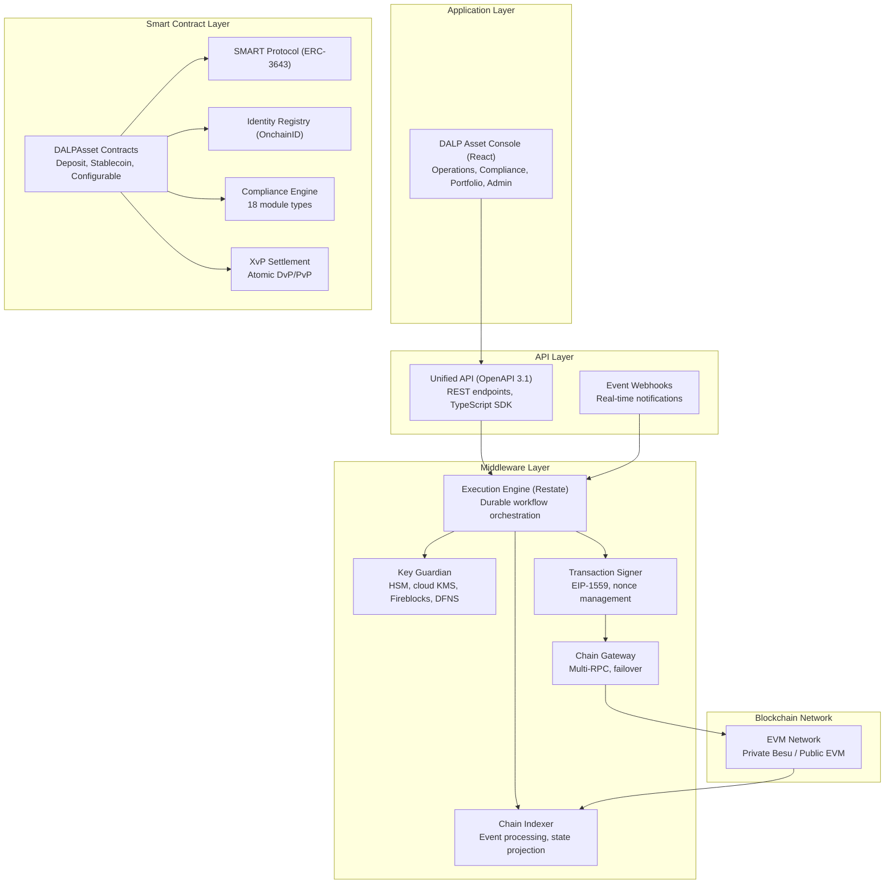

**Application Layer:** The DALP Asset Console provides the operational interface for asset lifecycle management, compliance workflows, portfolio views, system monitoring, and the Asset Designer wizard. It supports internationalization including Japanese (ja-JP) for regional deployments and uses arbitrary-precision arithmetic for all financial calculations.

**API Layer:** The Unified API exposes all platform capabilities through a type-safe interface with OpenAPI 3.1 specifications. A dual-endpoint architecture separates browser sessions from programmatic access, creating a hardened security boundary. The TypeScript SDK (@settlemint/dalp-sdk) provides the recommended programmatic integration surface for DBS Bank's engineering teams.

**Middleware Layer:** The Execution Engine (Restate) provides durable workflow orchestration with persistent state and exactly-once semantics. Key Guardian manages cryptographic key storage with HSM and cloud KMS integration. The Transaction Signer handles EIP-1559 gas pricing and meta-transactions. The Chain Indexer processes blockchain events into a queryable state projection.

**Smart Contract Layer:** All contracts build on the SMART Protocol (ERC-3643 / T-REX) with a five-layer on-chain architecture: SMART Protocol foundation, global infrastructure, system-level identity and compliance, asset contracts (DALPAsset, deposit, stablecoin), and addon contracts for settlement, distribution, and treasury operations.

### 5.2 ERC-3643 and SMART Protocol

All DALP smart contracts implement the ERC-3643 standard (also known as T-REX: Token for Regulated EXchanges), the open Ethereum standard designed specifically for regulated securities markets. ERC-3643 mandates four critical additions to standard token contracts:

1. An Identity Registry where every holder must have a verified on-chain identity
2. A Compliance Engine that evaluates modular rules before each transfer
3. Trusted Issuers who are the only entities authorized to attest to identity claims
4. Transfer Restrictions that go beyond simple balance checks

DALP implements ERC-3643 through the SMART Protocol (SettleMint Asset Regulatory Technology), a production-hardened framework that adds upgradeable compliance modules, multi-jurisdictional regulatory templates, and richer claim-expression logic than standard implementations.

For DBS Bank's tokenized deposits, this means that every deposit token transfer is validated against the Identity Registry (confirming both sender and recipient have verified on-chain identities with current, non-expired claims), the Compliance Engine (enforcing MAS-aligned controls), and token-level features, all before any balance changes occur. There is no application-layer bypass. The enforcement is at the protocol level.

### 5.3 DALPAsset: The Configurable Contract

DALPAsset is the recommended contract type for all new tokenization projects including DBS Bank's tokenized deposits and trade finance instruments. It extends the SMART Protocol with the SMARTConfigurable extension, allowing token features and compliance modules to be attached and reconfigured at runtime after deployment.

This design eliminates the need to commit to a specialized contract type at deployment time. A DBS Bank deposit token can start as a simple instrument, then have yield calculation added, then have transfer approval workflows enabled for specific counterparties, all without redeploying the contract or migrating balances. For trade finance instruments, the metadata schema captures document attributes (letter of credit reference, bill of lading number, trade counterparty identifiers), and the configurable compliance engine enforces the appropriate eligibility and transfer rules.

**Runtime-pluggable token features available include:**
- Historical balances (for yield calculation snapshots)
- Voting power (for governance-enabled instruments)
- Permit (gasless approvals for meta-transactions)
- AUM fee (for deposit instruments with management charges)
- Maturity and redemption (for term deposits and trade finance instruments with defined maturity)
- Fixed treasury yield (for deposit interest calculation and distribution)
- Transaction fee (with multiple variants for accounting and external fee routing)

### 5.4 Factory Pattern and Deterministic Deployment

All asset contracts are deployed through a factory pattern using CREATE2 deterministic addressing. This provides predictable contract addresses that can be configured in external systems before deployment; atomic deployment that wraps proxy deployment, identity registration, compliance initialization, and role assignment into a single transaction; and system registration that automatically registers new assets with the system's identity registry, compliance orchestration, and access manager.

The deployment workflow is orchestrated through Restate (DALP's durable execution engine) as an idempotent workflow: if any step fails, deployment resumes from the last successful step without creating orphaned contracts. This is not best-effort scripting; it is durable execution with persistent state.

---

## 6. Asset Lifecycle Coverage

### 6.1 Tokenized Deposits: Full Lifecycle

DALP provides complete lifecycle coverage for tokenized bank deposits, from initial design through issuance, servicing, and retirement. This section describes the full lifecycle in the context of DBS Bank's programme.

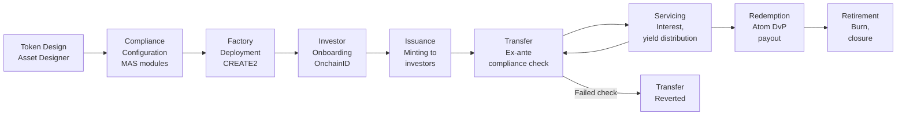

**Token Design:** The Asset Designer wizard guides DBS Bank's operations teams through deposit token configuration: denomination currency (SGD), decimal precision, supply parameters, ISIN or reference identifier, and jurisdiction assignment. For trade finance instruments, the wizard captures document-type identifiers, counterparty metadata schemas, and lifecycle parameters.

**Compliance Configuration:** Step 6 of the wizard binds compliance modules from DALP's pre-built library. For MAS-aligned deposits, the relevant modules include SMART identity verification (requiring verified OnchainID for all transfers), country allowlisting (restricting to MAS-permitted jurisdictions), investor count limits (configurable per MAS guidelines), and time-locked holding periods where applicable. The MAS Singapore compliance template is pre-built and immediately available.

**Factory Deployment:** The factory deploys the token contract with deterministic addressing, initializes the compliance engine, binds to the Identity Registry, issues classification claims, assigns roles, and registers the asset in the platform registry, all in a single atomic transaction. The token starts in a paused state, giving DBS Bank's compliance team time to verify configuration before the token goes live.

**Investor Onboarding:** Before an investor can receive or transfer deposit tokens, they must have a registered on-chain identity (OnchainID) with verified claims from trusted issuers. The OnchainID framework supports integration with DBS Bank's existing KYC/AML infrastructure: claims issued by DBS Bank's trusted issuer role are cryptographically attested and stored on-chain, reusable across all tokens in the system without per-token re-verification.

**Issuance:** Once the token is unpaused and roles are assigned, DBS Bank's supply managers can mint deposit tokens to verified investor wallets. DALP validates each mint operation: confirms supply management role, verifies wallet through PIN or TOTP, checks recipient compliance status, validates supply cap, and executes the mint. Batch minting supports up to 100 recipients per call for efficient initial distribution.

**Transfer:** Every transfer follows the deterministic compliance path: Identity Registry resolution, compliance module evaluation (all configured modules must pass), feature pre-checks, then atomic balance update. This is ex-ante enforcement. A transfer to an investor with expired KYC claims reverts immediately. A transfer exceeding country concentration limits reverts. A transfer outside the configured holding period reverts. The non-compliant state never exists on-chain.

**Servicing:** DALP automates deposit interest distribution through the Fixed Treasury Yield feature. DBS Bank configures payment intervals (monthly, quarterly, annual), yield rates, and denomination asset (SGD stablecoin or deposit token). The distribution is pull-based: investors or their custodians claim accrued yield, avoiding gas cost and block gas limit issues of push-based distribution to many holders. Historical Balance snapshots determine each investor's proportional share at each accrual period.

**Redemption:** For term deposits, the Maturity Redemption feature implements the complete lifecycle endpoint. After the configured maturity date, the token blocks all transfers. Holders redeem tokens for the denomination asset at face value in a single atomic transaction: tokens burn and the denomination asset transfers from the treasury simultaneously. No partial redemptions occur. If the treasury is insufficient, the redemption reverts.

**Retirement:** DALP supports controlled retirement of deposit tokens through the burn mechanism. The supply management role executes burns against holder balances. For compliance-related burns (regulatory enforcement, account remediation), the custodian role can execute forced burns with full on-chain audit trail.

### 6.2 Trade Finance Instruments: Configurable Token Architecture

Trade finance instruments, letters of credit, bills of lading, invoice financing instruments, receivables, have highly varied lifecycle requirements that do not map neatly to standard bond or equity templates. DALP's configurable token (DALPAsset) architecture addresses this.

Each trade finance instrument type is represented as a DALPAsset with a custom instrument template defining the metadata schema. A letter of credit token might carry: issuing bank identifier, applicant and beneficiary identifiers, credit amount, expiry date, terms and conditions reference, document requirements hash, and compliance status. A bill of lading token carries: vessel, port of loading, port of discharge, consignee, commodity description, and delivery terms.

The compliance engine enforces instrument-specific rules: letters of credit require verified counterparty identities on both sides; transfer approval workflows enforce documentary conditions before transfer; collateral requirements verify on-chain proof of reserves for receivables financing; time locks enforce settlement windows.

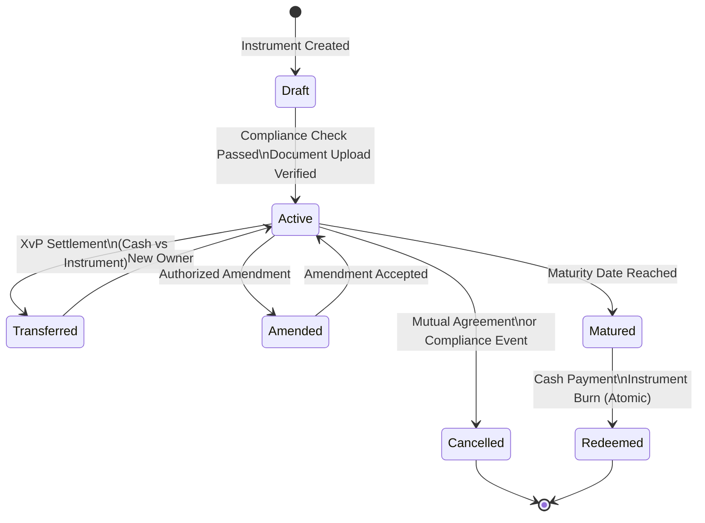

### 6.3 Corporate Actions and Servicing Operations

**Yield Distribution:** Automated through the Yield Schedule addon with snapshot-based balance capture, flexible schedules (one-time, recurring, custom), pro-rata calculation, and distribution in the same asset or a different payment token. For deposit instruments, this handles interest crediting with full on-chain evidence of each distribution event.

**Freeze and Unfreeze:** The custodian role freezes individual investor wallets, preventing all transfers while maintaining the frozen balance on record. Both full address freezes and partial amount freezes are supported. This is the on-chain mechanism for sanctions holds, AML investigation freezes, and regulatory enforcement actions.

**Pause and Unpause:** The emergency role provides circuit-breaker capability: all operations on a token are halted while read-only operations continue. This is DBS Bank's control mechanism for security incidents, regulatory emergency orders, or market disruption events requiring immediate suspension.

**Role Management:** Asset-level roles (admin, custodian, emergency, governance, supply management) can be granted and revoked by the admin role holder through the API and console. Role changes take effect at the smart contract level, with full on-chain audit trail. Batch role operations allow efficient onboarding of multiple authorized operators.

---

## 7. Compliance Architecture

### 7.1 Ex-Ante Enforcement Model

The most critical design decision in DALP's compliance model is where enforcement happens: before execution, not after. Every token transfer, every minting operation, and every investor onboarding event passes through a deterministic policy evaluation engine that validates eligibility, identity claims, and jurisdictional constraints at the smart contract layer. If a transfer would violate any configured rule, it reverts atomically. There is never a state where non-compliant tokens exist in an unauthorized wallet.

This matters for DBS Bank for two specific reasons. First, MAS's supervisory approach to digital assets places significant weight on ex-ante controls rather than post-trade remediation. A compliance architecture that generates exceptions for review after non-compliant transfers have occurred is not aligned with MAS expectations. Second, DBS Bank's internal audit and risk functions will scrutinize whether compliance controls are deterministic and testable. DALP's on-chain compliance engine is both: the control logic is visible in smart contract code, independently auditable, and produces consistent outcomes across all execution environments.

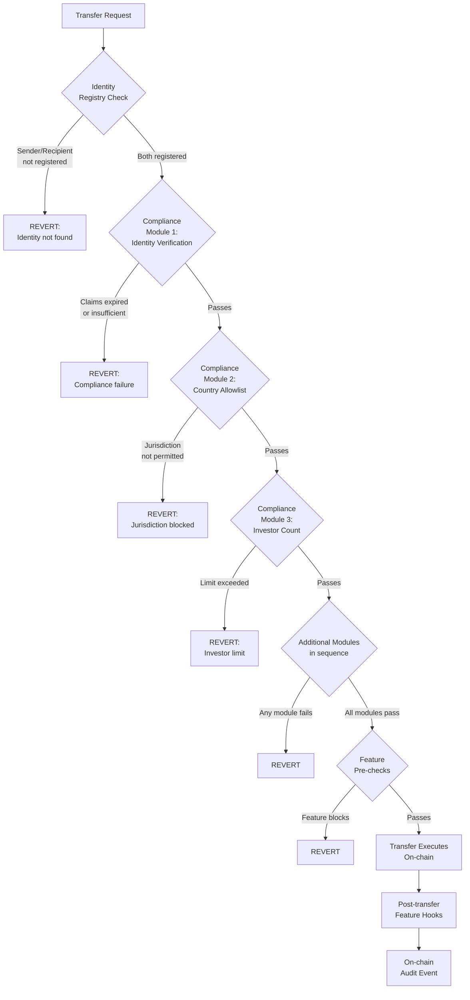

### 7.2 MAS Singapore Compliance Template

DALP ships a pre-built MAS Singapore compliance template that enforces the core controls required under the MAS digital asset framework simultaneously. The template enforces:

1. **SMART Identity Verification:** All transfer parties must have verified OnchainID contracts with current, non-expired KYC/AML claims from trusted issuers. Claims are checked at execution time, not only at onboarding: an expired claim fails. A claim from an issuer who lost trust status fails. This is continuous compliance, not a one-time onboarding checkbox.

2. **Country Allowlist:** The jurisdiction of each investor is verified against the configured country allowlist. For MAS-regulated instruments, the allowlist includes only permitted jurisdictions. Transfers involving investors in restricted jurisdictions revert before execution.

3. **Investor Count Limits:** Configurable maximum holder counts enforce MAS instrument-specific offering limits. Per-country limits are independently configurable from global limits, enabling precise regulatory compliance per jurisdiction.

4. **Time-Locked Holding Periods:** Configurable minimum holding period enforcement using FIFO batch tracking. For instruments with post-issuance lock-up requirements, the time lock module ensures holders cannot transfer until the minimum period has elapsed.

### 7.3 Payment Services Act Alignment

The Payment Services Act (PSA) governs digital payment tokens in Singapore and has direct implications for tokenized deposit programmes. DALP's compliance architecture supports PSA compliance through several mechanisms:

**Supply Controls:** DALP's supply cap compliance module enforces hard maximum token supply at the smart contract level, supporting PSA restrictions on total issuance volume for specific instrument types. The module tracks live circulating supply and prevents any minting beyond the regulatory limit.

**Transfer Restrictions:** The transfer approval workflow module requires explicit authorization before transfers execute. For PSA-regulated instruments, this ensures that each transfer receives appropriate review before settlement. The approval queue is fully auditable, with timestamps, approver identity, and decision rationale recorded on-chain.

**Collateral Verification:** For deposit tokens requiring collateral backing, the collateral requirement module enforces on-chain proof of reserves before minting. This directly supports PSA reserve requirements for digital payment tokens.

**Transaction Monitoring Integration:** DALP's API architecture supports real-time integration with DBS Bank's transaction monitoring and sanctions screening infrastructure. Every transfer event generates an on-chain event that can be consumed by webhooks or API polling, enabling simultaneous screening of transfer details before settlement confirmation is communicated downstream.

### 7.4 MAS Technology Risk Management Guidelines

The MAS TRM Guidelines create specific control requirements for technology risk management in financial institutions. DALP's architecture addresses the TRM Guidelines control framework:

**Change Management:** DALP's governance roles separate ordinary configuration from privileged configuration and from code changes. Per-asset governance roles control compliance module reconfiguration. System-level roles control smart contract upgrades. The UUPS proxy upgrade pattern requires explicit governance role authorization for any contract upgrade. All configuration changes emit on-chain events with the operator identity, timestamp, and before/after state, creating a tamper-evident change log.

**Access Controls:** The dual-layer permission model (off-chain platform roles and on-chain smart contract roles) enforces segregation of duties at both the application and protocol layers. 26 distinct roles across four layers ensure that no single operator has unilateral authority over the complete system.

**Audit Trails:** Every action in DALP generates a permanent, tamper-evident on-chain record: identity verification, role grants, asset creation, compliance events, transfers, yield distributions, and system configuration changes. These events are indexed by DALP's Chain Indexer and surfaced through the operational dashboard and API for audit access.

**Incident Management:** The emergency role provides immediate circuit-breaker capability without requiring broader administrative access. The pause mechanism halts all on-chain operations while preserving read access and role management capability. Recovery procedures are documented in operational runbooks and tested as part of the DR testing programme.

### 7.5 Eighteen Compliance Module Types

DALP provides 18 compliance module types across six categories. Every compliance requirement in this RFP maps to one or more of these modules:

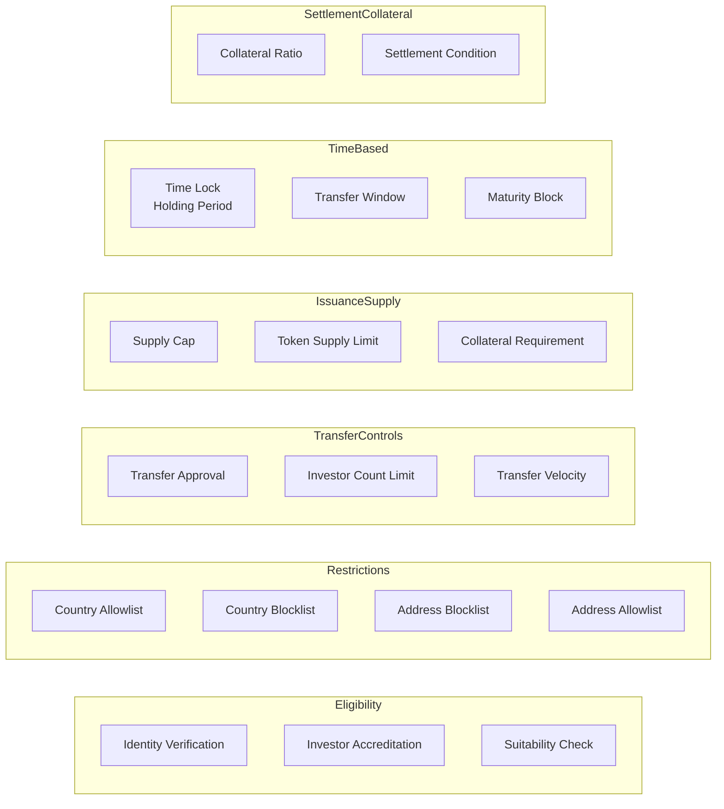

Full module specifications are provided in Appendix B.

### 7.6 Custom Compliance Expression Builder

Beyond the pre-built module library, DALP provides a visual expression builder where compliance teams construct investor eligibility rules using boolean logic. A simple expression such as "KYC AND Accredited Investor" creates a gated eligibility requirement. Complex expressions can chain nine or more conditions, combining KYC, AML, accredited investor status, collateral verification, and MAS-specific claims into a single enforced eligibility gate.

For DBS Bank, this enables the compliance team to define institution-specific eligibility requirements without requiring smart contract development. The expression builder provides real-time validation ensuring every expression is syntactically and logically complete before deployment. Expression changes require the governance role and are recorded permanently on-chain.

---

## 8. Integration Architecture

### 8.1 API-First Design

DALP is designed as an API-first platform. Every capability available through the console is accessible programmatically through the Unified API. This is a strict design principle, not a marketing claim: the console itself is built on the same API that external systems consume, ensuring no capability gap between the UI and the programmatic interface.

```mermaid
graph TB
    subgraph DBSEnterprise["DBS Bank Enterprise Systems"]
        CBS["Core Banking System"]
        TMS["Treasury Management System"]
        RMS["Risk Management System"]
        AML["AML/CFT Platform"]
        SCR["Sanctions Screening"]
        DWH["Data Warehouse / Data Lake"]
        GL["General Ledger / ERP"]
        OBS["Observability / SIEM"]
    end
    subgraph DALPPlatform["DALP Integration Layer"]
        API["Unified API\n(OpenAPI 3.1)"]
        SDK["TypeScript SDK\n(@settlemint/dalp-sdk)"]
        WH["Event Webhooks\nReal-time notifications"]
        ISO["ISO 20022\nPayment Rail Connector"]
    end
    subgraph ExternalNetworks["External Networks"]
        SWIFT["SWIFT / MAS SORA"]
        TT["TradeTrust\nNetwork"]
        PG["Project Guardian\nInterop Layer"]
    end

    CBS <-->|Reconciliation\nAccount positions| API
    TMS <-->|Treasury flows\nPosition management| API
    RMS -->|Risk events\nLimit queries| WH
    AML <-->|Transaction monitoring\nCase management| WH
    SCR -->|Screening results\nHold/release| API
    DWH <-->|Operational data\nReporting export| API
    GL <-->|Sub-ledger\nJournal entries| WH
    OBS <-->|Audit logs\nMetrics| API
    SWIFT <-->|Payment rails\nISO 20022| ISO
    TT <-->|Document\nverification| API
    PG <-->|Interoperability\nprotocol| API
```

### 8.2 Integration Methods

DALP provides three primary integration methods, each suited to different connectivity requirements:

**REST API (OpenAPI 3.1):** The primary integration surface for system-to-system connectivity. All platform capabilities are exposed through documented REST endpoints. API keys follow the "sm_atk_" prefix format and are rate-limited to 10,000 requests per 60-second window per key. Interactive API exploration is available through Swagger UI. The OpenAPI 3.1 specification is generated directly from procedure definitions, ensuring documentation stays synchronized with implementation.

**TypeScript SDK (@settlemint/dalp-sdk):** The recommended integration path for DBS Bank's Node.js-based services. The SDK provides a typed client factory with automatic serialization of blockchain value types, supporting all API namespaces including token, user, account, contact, asset, and system. The SDK enforces API key presence, validates base URLs, and applies security headers.

**Event Webhooks:** Event-driven notifications for transaction confirmations, compliance state changes, and asset lifecycle events. Webhooks enable real-time integration with DBS Bank's core banking systems, AML platforms, and reporting infrastructure. Webhook payloads include full event context, correlation identifiers for distributed tracing, and timestamp data for time-synchronization.

### 8.3 Enterprise System Integration Patterns

**Core Banking Integration:** DALP integrates with DBS Bank's core banking system through a combination of REST API calls for operational commands and webhooks for event-driven reconciliation. The integration model is designed around the principle that DALP is the digital asset ledger of record, while the core banking system maintains the fiat position record. Reconciliation between the two is driven by DALP events, with the CBS consuming token transfer events and adjusting fiat positions accordingly.

**AML/CFT Platform Integration:** DALP's webhook system delivers real-time transaction notifications to DBS Bank's AML platform immediately upon transfer event confirmation on-chain. The webhook payload includes sender, recipient, amount, token identifier, jurisdiction codes, and the full compliance check log showing which modules were evaluated and their results. For transactions triggering AML holds, the AML platform calls DALP's freeze API to place an immediate hold on the relevant wallet, preventing further transfers while the investigation proceeds.

**Sanctions Screening Integration:** Pre-transfer screening is supported through the Transfer Approval compliance module. Before a transfer executes, the module routes the transfer details to DBS Bank's sanctions screening service via API. If the screening service approves, the on-chain transfer executes. If screening returns a hold or reject status, the transfer approval is denied and the on-chain event records the denial with the screening reference. This creates an auditable record of every screening decision for each transfer.

**General Ledger Integration:** DALP generates structured accounting events for every material transaction: issuance (new asset created), mint (supply increase), transfer (ownership change), yield distribution (income recognition), redemption (supply decrease), and burn (asset retirement). These events, delivered via webhook with configurable payload format, drive automated journal entries in DBS Bank's ERP and sub-ledger systems. The event payload includes sufficient context for automated double-entry bookkeeping: instrument identifier, amount, counterparties, timestamp, and transaction reference.

**Data Warehouse Integration:** The DALP API supports bulk data export for analytics and reporting. Time-windowed queries against the events API enable DBS Bank's data warehouse to maintain a complete copy of all digital asset activity for regulatory reporting, management information, and risk analysis. The event schema is stable and versioned, with breaking changes communicated through the standard release management process.

### 8.4 TradeTrust Integration

TradeTrust is Singapore's cross-border digital trade document framework, enabling the digitization and legal recognition of trade documents. DALP's integration with TradeTrust frameworks supports DBS Bank's trade finance digitalization objectives in the following ways:

The configurable token architecture supports the representation of TradeTrust-compatible eBL (electronic Bills of Lading) and eNegotiable instruments as on-chain tokens. Metadata schemas capture TradeTrust document identifiers, issuer certificates, and document hashes. The compliance engine enforces transfer conditions aligned with TradeTrust framework requirements, including endorsement chain validation and transferee eligibility.

DALP's API architecture supports integration with TradeTrust's underlying infrastructure for document verification. When a trade finance instrument token is transferred, the integration layer can validate the corresponding TradeTrust document status before the on-chain transfer executes, maintaining consistency between the digital asset ledger and the trade document registry.

### 8.5 Project Guardian Interoperability

Project Guardian, MAS's initiative for wholesale digital markets, has established several key design principles that influence DBS Bank's architecture choices: open and interoperable networks, programmable instruments, and common infrastructure for policy enforcement. DALP's design is aligned with these principles:

DALP operates on EVM-compatible blockchain networks, the standard substrate for Project Guardian participants. The ERC-3643 compliance standard provides a common token interface that other Project Guardian participants can verify and interact with. The DALP identity framework (OnchainID) supports integration with other Project Guardian identity schemes through the trusted issuer model: claims issued by one Project Guardian participant's trusted issuer are recognizable by another participant's compliance engine if their issuer is included in the trusted issuer registry.

The XvP settlement module provides the atomic cross-party settlement primitive referenced in Project Guardian's settlement architecture work. For DBS Bank's tokenized deposits, this means that settlement of tokenized deposit transfers against Project Guardian-compatible instruments on participating networks can be structured as atomic HTLC settlements, eliminating counterparty risk across network boundaries.

### 8.6 Protocol Choices and Technical Controls

**Authentication:** All API integration uses API keys scoped to specific procedure namespaces. Keys are transmitted over TLS 1.2 or higher and stored as hashed values after creation. Keys are rate-limited and can be revoked immediately through the console or API.

**Idempotency:** API mutations support idempotency keys, enabling DBS Bank's integration layer to safely retry failed requests without creating duplicate transactions. The platform detects duplicate submissions with the same idempotency key and returns the original response without re-executing.

**Error Classification:** 534 structured error codes with full metadata, i18n translations in four locales, and SDK mirror provide programmatic error handling for all failure scenarios. Error responses include code, message, context data, and correlation identifier for distributed tracing.

**Retry Logic:** The async transaction pipeline manages retry semantics with configurable backoff. The dead-letter rescue system captures transactions that exhaust retry attempts for operator review, preventing silent failures.

**Reconciliation:** Every on-chain transaction generates a deterministic event with block number, transaction hash, log index, and timestamp. These identifiers provide the anchors for reconciliation between DALP's event log and downstream systems. Where reconciliation breaks occur, the break is surfaced through the operational dashboard with a detailed audit trail of the events contributing to the discrepancy.

---

## 9. Custody and Key Management

### 9.1 Key Guardian Architecture

The Key Guardian service is DALP's cryptographic key management component. It manages key material through defense-in-depth with multiple storage backends at escalating security levels. Keys never leave secure boundaries in plaintext.

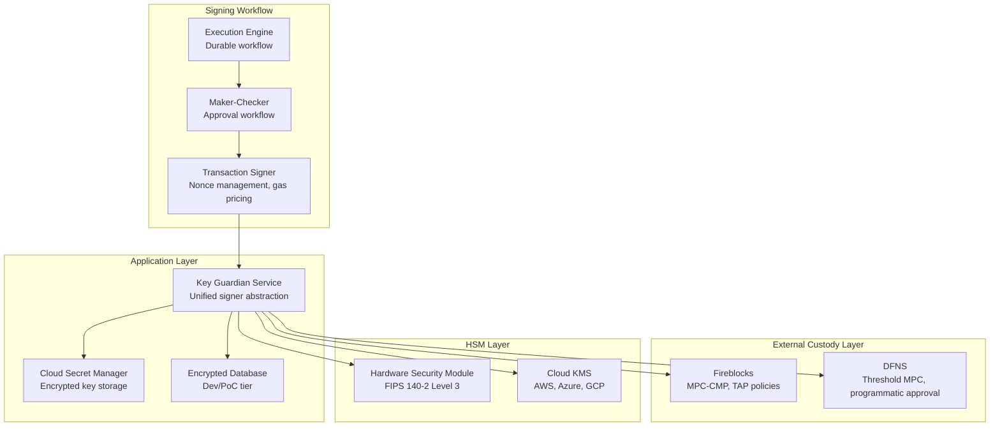

Storage tiers by security level:

| Tier | Protection | Use Case for DBS Bank |
|------|-----------|----------------------|
| Encrypted database | Application-level encryption | Development and testing environments |
| Cloud secret manager | Platform-managed encryption (AWS Secrets Manager) | Standard production operations |
| Hardware security module | FIPS 140-2 Level 3 | Treasury and high-value operations |
| Fireblocks MPC-CMP | Institutional MPC, no static key shares | Highest security institutional operations |
| DFNS threshold MPC | Distributed key shards, programmatic approval | Alternative institutional custody |

For DBS Bank's production deployment, SettleMint recommends an HSM-backed configuration for treasury operations combined with Fireblocks or DFNS MPC custody for institutional-grade signing, with the cloud secret manager for automated operational processes. The Key Guardian's unified signer abstraction makes custody providers interchangeable through configuration, allowing DBS Bank to adjust the custody model as requirements evolve.

### 9.2 Key Lifecycle Management

**Generation:** HSM-backed keys are generated entirely within hardware and never exposed to application-layer processes. Cloud KMS keys use provider-native generation with immediate encryption before any memory operations. Software keys (for non-production environments) use cryptographically secure random sources.

**Rotation:** Active signing keys are replaced while maintaining historical keys for verification of past transactions. Key rotation coordinates with blockchain address registry updates and downstream system notifications. The rotation process is a durable workflow orchestrated through Restate, ensuring consistency even across infrastructure failures.

**Emergency Access:** DALP defines a formal break-glass procedure for emergency access scenarios. Emergency access requires authorization from multiple designated holders, generates an on-chain emergency event record, triggers immediate alert notifications, and initiates an automatic review process. The procedure is documented in operational runbooks and tested as part of the quarterly DR programme.

**Recovery:** Enterprise deployments support key recovery through sharded backup schemes with threshold signature requirements. Recovery workflows are implemented as durable, phase-tracked processes in Restate: preview (assess impact), execution (cryptographic recovery), credential reset, and per-token balance migration if required. All recovery operations are idempotent and keyed by user identifier to prevent concurrent duplicate recovery operations.

### 9.3 MPC Custody Integration: Fireblocks

Fireblocks MPC-CMP provides continuous key refresh, eliminating static key shares. No single server ever holds a complete private key, and the distributed key shares continuously refresh, making historical compromise attempts invalid.

DALP's Fireblocks integration supports the full Transaction Authorization Policy (TAP) framework:
- Amount thresholds: transactions above configured limits require additional approval
- Whitelisted destinations: transfers only to pre-approved wallet addresses execute without additional review
- Velocity limits: aggregate transfer volumes within time windows trigger automatic holds
- Multi-approver requirements: high-value or sensitive transactions require M-of-N approver confirmation

DALP owns permissioning, wallet verification, queueing, and workflow state transitions. Fireblocks owns nonce allocation, gas handling, signing, and broadcast. This separation ensures that DALP's governance model remains the authoritative control surface while Fireblocks provides the cryptographic security guarantees.

### 9.4 Privileged Access Controls

Administrative actions in DALP require step-up authentication beyond the standard session. All blockchain write operations require wallet verification through PIN, TOTP, or hardware passkey. There is no administrative override that bypasses wallet verification. Recovery requires backup codes or credential re-enrollment, creating a deliberate friction that prevents unauthorized use of compromised sessions.

Privileged access events, role assignments, compliance module changes, governance configuration updates, emergency access, are logged with full context: operator identity, timestamp, action type, parameters, and the on-chain transaction reference. This log is immutable and accessible for audit review.

---

## 10. Settlement and Operations

### 10.1 Atomic DvP with XvP Settlement

DBS Bank's tokenized deposits and trade finance programme requires settlement finality without counterparty risk. Traditional T+2 clearing cycles introduce a window of counterparty risk between trade agreement and settlement. DALP's atomic Delivery-versus-Payment settlement eliminates this window: asset and cash transfer simultaneously or both revert. There is no state where DBS Bank has delivered an instrument but not received payment.

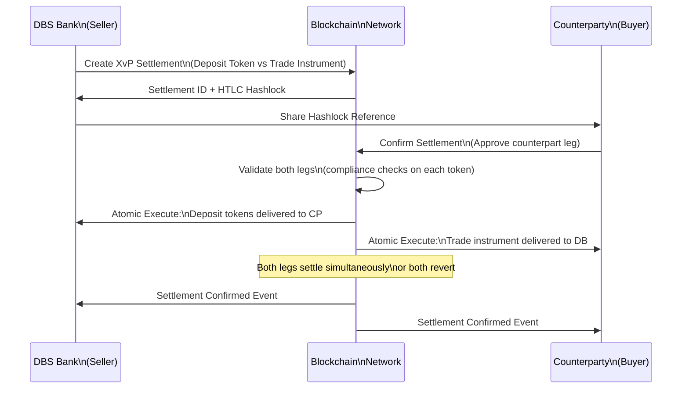

The XvP (Exchange versus Payment) settlement module extends atomic DvP to multi-party, multi-asset settlements. For trade finance, a single settlement can atomically coordinate: transfer of the trade finance instrument (letter of credit, bill of lading) from seller to buyer; transfer of the deposit token payment from buyer to seller; notification events to downstream systems (core banking, treasury, AML) simultaneously.

### 10.2 Cross-Chain Settlement via HTLC

For settlements involving counterparties on different blockchain networks (relevant for Project Guardian interoperability scenarios), DALP's HTLC (Hash Time-Locked Contract) mechanism provides cryptographic atomicity across networks:

1. DBS Bank creates the settlement on Network A with a hashlock (H = SHA256(secret))
2. The counterparty creates the corresponding settlement on Network B using the same hashlock
3. DBS Bank reveals the secret to claim the counterparty's asset on Network B
4. The same secret reveals on Network A, allowing the counterparty to claim DBS Bank's asset
5. If either party fails to act before expiry, both legs expire and assets return to their owners

All compliance checks run on each token independently. If any compliance check fails on any leg, that settlement cannot proceed.

### 10.3 Operational Dashboards

DALP provides operational dashboards that give DBS Bank's first-line operations, second-line risk, and third-line audit functions the visibility they need:

**Operations Dashboard:** Real-time view of active settlements, pending transactions, approval queues, and failed events. Configurable alert thresholds trigger notifications when conditions require operator attention: pending items exceeding configured age, failed transaction rates, reconciliation breaks.

**Compliance Activity Dashboard:** Volume of compliance verifications, approval rates, failed transfer attempts with reason codes, identity verification status, and trusted issuer activity. Compliance officers can drill into specific events for detailed examination without requiring engineering support.

**Security Dashboard:** Authentication events, access pattern analysis, privileged action log, API key usage, and alert history. The security overview surfaces anomalous patterns for investigation.

**Transaction Monitor:** Pending and failed transactions, gas usage, confirmation times, and the async transaction pipeline state. The 11-state transaction lifecycle (submitted, pending, confirmed, failed, dead-letter, etc.) is fully visible, enabling operations teams to distinguish between transient failures and permanent errors requiring intervention.

### 10.4 Reconciliation Architecture

Financial reconciliation is a first-class concern in DALP's architecture, not an afterthought.

**On-chain as the source of truth:** DALP's Chain Indexer continuously processes blockchain events into a queryable state projection. The indexer state is always derivable from the on-chain record, if the indexer is behind or corrupted, it can be rebuilt by replaying the chain. This makes the on-chain record the authoritative ledger, with the indexed state as a queryable cache.

**Event-driven reconciliation:** Every material event generates a structured webhook notification with the complete event context. DBS Bank's reconciliation systems consume these webhooks to maintain a synchronized state. Where reconciliation breaks occur (event missing, amount mismatch, timestamp discrepancy), the break is surfaced through the reconciliation API with full event trace.

**Sub-ledger alignment:** The event payload format is designed for automated journal entry generation. Every transfer event includes sender, recipient, amount, instrument identifier, timestamp, and transaction reference. Every yield distribution event includes the distribution total, holder count, per-holder amounts, calculation basis, and treasury funding transaction reference. These payloads drive automated sub-ledger updates without manual intervention.

**Nostro/vostro reconciliation for trade finance:** For trade finance instruments involving correspondent banking relationships, DALP's event log provides the digital asset leg of the reconciliation. The integration layer correlates DALP events with SWIFT MT/MX messages and internal position records to maintain a complete reconciliation view across on-chain and off-chain positions.

### 10.5 Case Management and Exception Handling

**Approval Queue Management:** The transfer approval compliance module creates an approval queue for transactions requiring human review. Operations teams see pending items with full context, initiator, amount, counterparties, compliance check results, and time in queue. Items approaching configured SLA thresholds trigger escalation alerts. Approval decisions are recorded on-chain with approver identity, timestamp, and decision reference.

**Exception Workflow:** Failed transactions, compliance rejections, and reconciliation breaks generate structured exception records accessible through the operational API. Each exception includes event context, failure reason, contributing compliance module results, and suggested remediation steps. Exception records are retained for the full regulatory retention period.

**Regulatory Reporting Support:** DALP's event log provides the underlying data for regulatory reporting obligations. The time-windowed event query API supports extraction of all transaction activity within a reporting period, including failed and reverted transactions. Report reproduction is deterministic: the same query against the same time window always returns the same result, supporting regulator-facing evidence generation.

---

## 11. Security Architecture

### 11.1 Defense-in-Depth: Five Independent Layers

DALP enforces security through five independent control layers. No single-layer failure grants unauthorized access to digital assets. Each layer operates independently, so a compromised session is blocked by wallet verification; a bypassed API authorization is blocked by on-chain compliance; a compromised application server cannot sign transactions without custody provider approval.

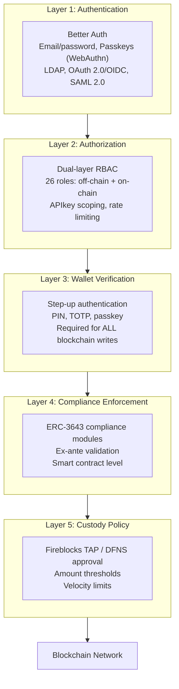

**Layer 1: Authentication.** Better Auth with support for email/password, passkeys (WebAuthn), LDAP/Active Directory (for corporate directory integration), OAuth 2.0/OIDC (Okta, Auth0, Azure AD), and SAML 2.0 for legacy enterprise SSO. Sessions use HTTP-only cookies with SameSite protection and 7-day expiry with 24-hour refresh windows. Every authentication event is logged.

**Layer 2: Authorization.** A dual-layer permission model where off-chain platform roles and on-chain roles must both pass for any blockchain write operation. 26 distinct roles across four layers (platform, system people, per-asset, system module) enforce granular separation of duties. API keys are scoped to specific procedure namespaces. Rate limiting at 10,000 requests per 60-second window per key prevents abuse.

**Layer 3: Wallet Verification.** Step-up authentication for all blockchain write operations via PIN, TOTP, or backup codes. Even with a valid authenticated session, no on-chain transaction executes without wallet verification. There is no administrative override that skips this layer. This is the control that protects against session hijacking and insider threats that have a valid session.

**Layer 4: Compliance Enforcement.** ERC-3643 compliance modules validate every transfer against identity, jurisdiction, and policy rules at the smart contract layer. The compliance check runs on-chain and cannot be bypassed by application-layer code. A direct contract call that bypasses the DALP application still hits the on-chain compliance engine.

**Layer 5: Custody Policy.** External custody providers (Fireblocks, DFNS) impose additional approval gates for custody-backed signing flows. Transaction Authorization Policies enforce amount thresholds, destination whitelisting, velocity limits, and multi-approver requirements. A compromised application server cannot execute custody-signed transactions that violate TAP rules.

### 11.2 Certifications

SettleMint maintains **ISO 27001** certification covering the information security management system governing DALP development, operations, and customer data. The certification confirms that risk assessment, security controls, organizational policies, and continuous improvement processes meet the international standard.

SettleMint holds **SOC 2 Type II** certification, verifying that security controls operate effectively over an extended audit period, not just at a point-in-time assessment. The Type II report provides DBS Bank with assurance that access controls, change management, and incident response procedures are consistently followed in production operations.

Both certificates are available for review as part of the vendor risk assessment process.

### 11.3 Smart Contract Security

All DALP smart contracts are built on the SMART Protocol (ERC-3643), an independently audited open standard. The UUPS (Universal Upgradeable Proxy Standard) upgrade pattern ensures that the proxy contract holds state while the implementation contract explicitly authorizes upgrades, preventing unauthorized contract replacement. DALPAsset contracts used for DBS Bank's deployment are upgradeable under governance control, allowing security patches and compliance updates without token migration.

The smart contract layer enforces the principle of separation: the custodian role can execute forced transfers in compliance-bypass scenarios, but cannot alter compliance configuration. The governance role can reconfigure compliance modules, but cannot execute transfers. The emergency role can pause all operations, but cannot execute transactions or alter configuration. This separation ensures that no single role can both alter the rules and execute transactions.

### 11.4 Network Security and Data Protection

All API communication uses TLS 1.2 or higher. Session cookies are HTTP-only, Secure-flagged, and SameSite-protected. Kubernetes network policies restrict pod-to-pod communication to required service dependencies. The ingress controller manages external access points with rate limiting and DDoS protection.

Data at rest is encrypted using provider-native encryption for cloud deployments. The Key Guardian's multiple encryption tiers ensure that sensitive key material is protected at all levels. Tenant data isolation is enforced at the database query level: every API request is scoped to the active organization, preventing cross-tenant data access.

### 11.5 Operational Security and Incident Response

The observability stack provides the tooling for incident response: correlation identifiers link logs, metrics, and traces for affected operations; timeline reconstruction via log search reveals event sequences; impact assessment via metrics dashboards quantifies affected users and operations; trace visualization identifies failing components.

For DBS Bank's deployment, SettleMint recommends integration with DBS Bank's SIEM platform through structured log forwarding from DALP's Loki log aggregation system. All audit events, security events, and compliance events are emitted as structured JSON logs with consistent field schemas, enabling SIEM rule creation and alert correlation.

---

## 12. Deployment Options

### 12.1 Recommended Deployment: AWS Singapore (ap-southeast-1)

For DBS Bank's tokenized deposits and trade finance programme, SettleMint recommends a Managed Private Cloud deployment within AWS Singapore (ap-southeast-1). This configuration satisfies MAS data residency requirements by ensuring all data remains within Singapore jurisdiction, while providing the operational flexibility and managed infrastructure support appropriate for this programme's initial phase.

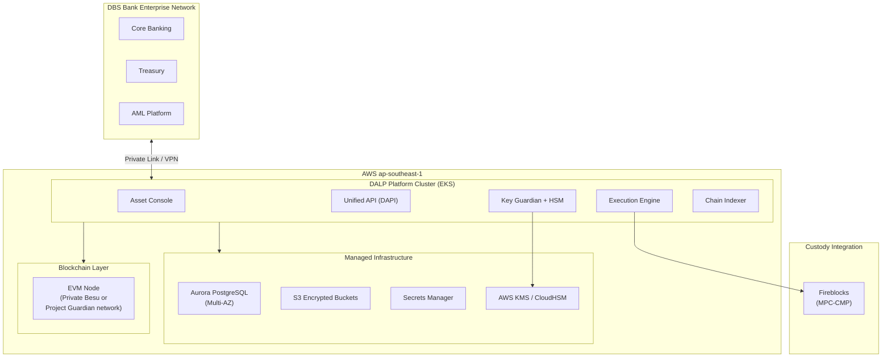

**Infrastructure configuration:**
- EKS managed Kubernetes cluster with multi-AZ node groups for high availability
- Aurora PostgreSQL with Multi-AZ deployment and automated backups
- S3 with server-side encryption and versioning for document storage
- AWS Secrets Manager for key material (with CloudHSM option for FIPS 140-2 Level 3 requirements)
- CloudFront for console delivery with Singapore origin
- AWS PrivateLink for secure connectivity from DBS Bank's network to DALP API endpoints

**Data residency:** All platform data including transaction records, identity data, key material, and audit logs resides within AWS ap-southeast-1. No data leaves Singapore jurisdiction through DALP platform operations.

### 12.2 Alternative: On-Premises Deployment

For DBS Bank teams that require full infrastructure control, DALP supports on-premises deployment on DBS Bank's own Kubernetes infrastructure. This configuration requires a DBS Bank-operated Kubernetes cluster (v1.25+), PostgreSQL database (v15+), object storage (MinIO or S3-compatible), HSM or cloud-based secrets management, and operational team with Kubernetes administration capability.

On-premises deployment provides air-gap capability for environments requiring complete network isolation. SettleMint provides Helm charts for full deployment, infrastructure sizing guidance, and deployment validation procedures. Platform support remains available through secure channels.

### 12.3 Hybrid Configuration

A hybrid deployment pattern is available for DBS Bank organizations with specific requirements around sensitive component isolation: application and API layers in the managed cloud; HSM and key management on-premises; optional primary on-premises with cloud disaster recovery.

### 12.4 Environment Separation

Production, staging, and development environments are deployed as separate DALP instances with isolated infrastructure, separate API keys, and distinct configuration. Secrets differ by environment. Configuration promotion follows a controlled process: changes are validated in development, tested in staging, and promoted to production through a documented change management workflow with approvals and rollback procedures.

---

## 13. Implementation Approach

### 13.1 Delivery Methodology

SettleMint follows a structured, phase-gated implementation methodology refined through production deployments with regulated banks. The methodology addresses the specific failure modes that institutional programmes encounter: unresolved governance ownership, integration debt, compliance gaps discovered during testing, and operational knowledge concentrated in vendor specialists.

The standard implementation for DBS Bank's tokenized deposits and trade finance programme spans approximately 19 weeks from kickoff to end of hypercare, organized into six phases:

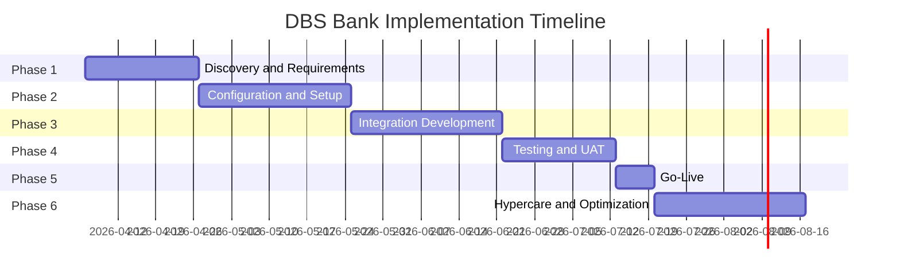

### 13.2 Phase 1: Discovery and Requirements (Weeks 1-3)

**Objective:** Establish comprehensive understanding of DBS Bank's business objectives, technical landscape, regulatory environment, and operational requirements.

**Activities:**
- Structured stakeholder interviews with institutional banking, treasury and markets, technology, compliance, risk, and operations teams
- Current-state assessment of relevant workflows, approval chains, reconciliation pain points, and reporting obligations
- Regulatory and compliance mapping: MAS, PSA, TRM Guidelines requirements mapped to DALP compliance modules
- Asset class scoping: tokenized deposits and trade finance instrument types, lifecycle events, and business rules
- Architecture design: deployment topology (AWS Singapore), network selection (private Besu or Project Guardian network), custody integration model (Fireblocks recommended), identity provider integration, and external system connectivity
- RAID assessment: identification of implementation risks, dependencies, and mitigation strategies

**Deliverables:** Business Requirements Document; Regulatory and Compliance Matrix; Target Architecture Document; Implementation Roadmap; RACI Matrix

**DBS Bank Responsibilities:** Project sponsor and PM designation; stakeholder availability; systems documentation; architecture sign-off

### 13.3 Phase 2: Configuration and Setup (Weeks 4-7)

**Objective:** Provision DALP environment, configure asset types and compliance modules, establish identity and access framework, prepare integration layer.

**Activities:**
- Environment provisioning in AWS ap-southeast-1 (development, staging, production)
- Blockchain network setup (private Besu or connection to Project Guardian network)
- Deposit token and trade finance instrument configuration using DALP's asset templates
- MAS Singapore compliance template deployment and customization
- OnchainID identity framework configuration and KYC/AML provider integration planning
- Key Guardian configuration with AWS KMS and CloudHSM (or Fireblocks integration)
- Integration layer design: API authentication, webhook configuration, retry and idempotency patterns

**Deliverables:** Provisioned environments; Asset configuration documentation; Compliance module configuration; Identity and access design; Integration design document

### 13.4 Phase 3: Integration Development (Weeks 8-11)

**Objective:** Connect DALP to DBS Bank's existing systems, delivering end-to-end operational workflows.

**Activities:**
- Core banking system integration: position reconciliation, account management connectivity
- AML/CFT platform integration: real-time webhook delivery, freeze/unfreeze API connectivity
- Sanctions screening integration: pre-transfer screening API, approval workflow binding
- Treasury system integration: cash position management, yield distribution notifications
- General ledger integration: automated journal entry generation from DALP events
- Data warehouse integration: event stream configuration, bulk export API setup
- TradeTrust and Project Guardian integration connectivity
- SWIFT/MAS payment rail connectivity via ISO 20022 adapter

**Deliverables:** Integrated system landscape; API integration documentation; End-to-end workflow documentation; Integration test results; Draft runbooks

### 13.5 Phase 4: Testing and UAT (Weeks 12-14)

**Objective:** Validate the complete deployment against all functional, security, performance, and compliance requirements.

**Testing scope:**
- Functional: all asset lifecycle events, compliance rules, custody workflows, settlement logic, reporting
- Security: penetration testing, access control validation, key management audit, smart contract review
- Performance: load testing at expected DBS Bank transaction volumes plus 3x headroom
- Compliance: ex-ante enforcement validation, confirming non-compliant transfers revert correctly in all scenarios including expired claims, blocked jurisdictions, exceeded limits, and failed screening
- UAT: business-scenario test scripts with DBS Bank operations, compliance, treasury, and risk teams
- Disaster recovery: backup, failover, and recovery procedure validation
- Cyber tabletop: sanctions alert, failed settlement, wallet compromise, and emergency suspension scenarios

**Deliverables:** Test plan and cases; Functional test report; Security assessment report; Performance test report; UAT sign-off; Go-live readiness assessment

### 13.6 Phase 5: Go-Live (Week 15)

**Objective:** Controlled production deployment with immediate support coverage.

**Activities:**
- Production deployment execution per runbook
- Data seeding: legal entities, roles, products, investor registry, standing settlement instructions
- Smoke testing in production: platform health, integration connectivity, compliance enforcement, observability
- Cutover coordination with DBS Bank operations teams
- Dedicated go-live support team on-site or dedicated remote

**Go/No-Go Criteria:**
- All UAT test cases passed with no critical defects open
- Security assessment findings remediated or accepted with documented risk treatment
- Performance test results meet SLA targets
- Compliance enforcement validated for all MAS-required scenarios
- DBS Bank operations team sign-off on readiness
- Incident escalation contacts confirmed and tested

### 13.7 Phase 6: Hypercare and Optimization (Weeks 16-19)

**Objective:** Intensive post-go-live support, performance optimization, and knowledge transfer completion.

**Activities:**
- Dedicated monitoring of platform health, transaction volumes, compliance enforcement, integration stability
- Priority resolution of production issues with accelerated response times
- Performance optimization based on real workload patterns
- Knowledge transfer completion: platform administration, monitoring, troubleshooting, compliance module management
- Formal operational readiness assessment: confirmation that DBS Bank teams can independently manage day-to-day operations
- Managed transition to contracted support tier

**Hypercare Exit Criteria:**
- No P1 incidents open for 5 consecutive business days
- Reconciliation accuracy at 99.99% or above
- Operations team successfully completing all standard operational tasks independently
- All runbooks validated through observed execution
- Knowledge transfer completion certificate signed

### 13.8 Staffing Model

**SettleMint Team:**

| Role | Phase 1 | Phase 2 | Phase 3 | Phase 4 | Phase 5 | Phase 6 |
|------|---------|---------|---------|---------|---------|---------|
| Delivery Lead | Full | Full | Full | Full | Full | Partial |
| Solution Architect | Full | Full | Partial | Partial | On-call | On-call |
| Platform Engineer | - | Full | Full | Full | Full | Partial |
| Integration Engineer | - | Partial | Full | Partial | On-call | On-call |
| QA / Test Lead | - |, | Partial | Full | Partial | - |
| Security Engineer | - | Partial | Partial | Full | On-call | - |
| Support Engineer | - |, | - |, | Full | Full |

**DBS Bank Team Requirements:**

| Role | Involvement |
|------|------------|
| Project Sponsor | Gate reviews, escalations, sign-offs |
| Project Manager | Full engagement across all phases |
| Technical Lead / Architect | Phases 1-4 (architecture, integration, testing) |
| Infrastructure / DevOps | Phases 2-5 (environment provisioning, deployment) |
| Business / Operations SMEs | Phases 1, 4, 6 (requirements, UAT, knowledge transfer) |
| Compliance / Risk | Phases 1, 2, 4 (regulatory mapping, compliance validation) |
| Security / InfoSec | Phases 2, 4 (security review, penetration testing) |
| AML / Sanctions | Phase 4 (scenario testing, workflow validation) |

### 13.9 RAID Summary

Key risks for DBS Bank's programme are detailed in Appendix A. Critical risks and their mitigations include:

**Regulatory interpretation risk:** MAS guidance on specific tokenized deposit instrument classifications may require compliance configuration adjustments. Mitigation: Early engagement with legal and compliance teams in Phase 1 to confirm regulatory interpretation before configuration begins; modular compliance architecture enables rapid adjustment without redeployment.

**Integration complexity:** DBS Bank's core banking, AML, and treasury systems represent significant integration scope. Mitigation: Detailed integration assessment in Phase 1 with capacity buffer in Phase 3; DALP's comprehensive API layer reduces custom development; mock integration patterns allow DALP configuration to proceed in parallel with integration development.

**TradeTrust and Project Guardian interoperability:** Interoperability requirements with external market infrastructure may introduce dependencies outside DBS Bank's control. Mitigation: Early identification of interoperability requirements and external stakeholders in Phase 1; DALP's ERC-3643 foundation provides the standard interface; contingency design for phased interoperability.

---

## 14. Support and SLA

### 14.1 Support Tier Recommendation

For DBS Bank's tokenized deposits and trade finance programme, SettleMint recommends the **Enterprise Support** tier, reflecting the mission-critical nature of a programme operating under MAS regulatory oversight with direct impact on financial operations.

### 14.2 Enterprise Support: Coverage and Commitments

| Attribute | Commitment |
|-----------|-----------|
| Coverage | 24/7/365 |
| Support Channels | Email, support portal, dedicated Slack channel, phone, video escalation |
| Uptime SLA | 99.99% monthly (approximately 4.3 minutes maximum downtime) |
| Named Support Team | Dedicated team with deep familiarity of DBS Bank's deployment |
| Solution Architect Access | Quarterly architecture reviews and optimization recommendations |
| Customer Success Manager | Named CSM, bi-weekly operational review |
| Platform Updates | Continuous delivery, staged rollouts, client approval gate before production |

### 14.3 Incident Response Targets

| Severity | Classification | Response Target | Resolution Target |
|----------|---------------|-----------------|-------------------|
| P1 Critical | Production down, compliance failure, settlement failure | 15 minutes | 2 hours |
| P2 High | Major degradation, no workaround | 1 hour | 4 hours |
| P3 Medium | Workaround available | 4 hours | 2 business days |
| P4 Low | Minor, cosmetic | 1 business day | 3 business days |

**P1 triggers:** DALP dApp or DAPI unresponsive; compliance module bypass allowing non-compliant transfers; atomic DvP settlement failure in production; Key Guardian signing failure; unplanned data loss or corruption.

### 14.4 SLA Credits

| Uptime Achieved | Credit |
|-----------------|--------|
| Below SLA but ≥ 99.0% | 10% of monthly support fees |
| Below 99.0% but ≥ 98.0% | 25% of monthly support fees |
| Below 98.0% | 50% of monthly support fees |

### 14.5 Escalation Path

1. Designated Support Engineer (or named support team)
2. Support Engineering Manager
3. VP Engineering / Head of Customer Success
4. SettleMint Executive Management

Automatic escalation: P1 incidents not acknowledged within 15 minutes escalate to Support Engineering Manager; P1 incidents not resolved within 2 hours escalate to VP Engineering and client notification. Three P1/P2 incidents within 30 days trigger a Root Cause Review with the Solution Architect and a client briefing.

---

## 15. Reference Projects

### 15.1 Complete Reference Table

| Institution | Region | Use Case | Status |
|-------------|--------|----------|--------|
| OCBC Bank | Singapore | Security token engine: securitization, tokenization, fractionalization; HNWI/HENRY investment products; order book, wallet, cash positions | Production |
| KBC Securities (Bolero) | Belgium | Equity crowdfunding + SME loans; smart contracts for issuance, lifecycle, corporate actions, redemption | Production |
| KBC Insurance | Belgium | NFT product passports for insured assets; valuation and claims processing | Production |
| Standard Chartered Bank | Asia/MENA | Digital Virtual Exchange; fractional tokenization of securities; institutional trading; instant ownership recording | Production |
| Reserve Bank of India Innovation Hub | India | Multi-bank letter of credit trade finance; multi-node multi-cloud blockchain; fraud-proof trade finance workflows | Production |
| Sony Bank (Sony Group) | Japan | Stablecoin issuance and management; integrated digital identity; KYC-enabled Web3 banking | Phase 1 Production |
| State Bank of India | India | CBDC infrastructure; secure scalable digital currency; financial inclusion | Pilot complete, production in progress |
| Islamic Development Bank | Multilateral | Sharia-compliant subsidy distribution; 57 member countries; P2P distribution | Production |
| Mizuho Bank | Japan | Bond tokenization and trade finance; standard platform capabilities | PoC complete, production planning |
| Islamic Development Bank (market stabilization) | Multilateral | Automated market stabilization; sharia-compliant collateral volatility reduction 30-50% | Production |
| Maybank (Project Photon) | Malaysia | FX tokenization; cross-border XvP settlement; MYRT token; DAIH alignment | Production |
| ADI Finstreet | UAE | Tokenized equity on Abu Dhabi mainnet; corporate actions; DFNS/Fireblocks custody | Production |
| Commerzbank | Germany | Hybrid on/off-chain ETP issuance; Boerse Stuttgart; settlement under 10 seconds; EUR 7M annual savings | Production |
| Saudi RER | Saudi Arabia | Country-scale real estate tokenization; registry-as-truth model; government system integration | Production |

### 15.2 OCBC Bank: Singapore Security Token Engine (Detailed Case Study)

**Relevance:** Direct comparator. OCBC Bank operates under the same MAS regulatory framework as DBS Bank, in the same Singapore jurisdiction, with comparable institutional governance and compliance requirements. This deployment demonstrates that DALP's compliance architecture satisfies MAS requirements in production.

**Scope:** SettleMint implemented a security token engine for OCBC Bank that enhanced liquidity for illiquid assets and expanded investment opportunities for HNWIs and HENRYs (High Earners Not Rich Yet). The solution covered securitization, tokenization, and fractionalization of off-chain assets including bonds, SPVs, stocks, and real estate.

**Technical architecture:** The platform included a complete end-user interface for tokenization, wallet management, and cash position visibility, plus a backend with order book management and APIs to integrate with OCBC Bank's off-chain securities and cash systems. SettleMint's compliance architecture enforced MAS eligibility requirements, investor count limits, and transfer restrictions as configured in the DALP compliance templates.

**Governance:** The deployment included maker-checker approval workflows, role-based access control aligned with OCBC Bank's operational governance model, and integration with OCBC Bank's identity and KYC infrastructure for on-chain claim issuance.

**Outcome:** OCBC Bank operates a scalable digital asset exchange platform that is administrator-managed and has demonstrated the ability to expand to new asset classes and investor segments using the same platform configuration, not through re-platforming or custom development.

**Transfer to DBS Bank programme:** The governance model, compliance configuration patterns, MAS template deployment, and Singapore-specific integration patterns from the OCBC deployment are directly reusable for DBS Bank's programme. SettleMint's institutional knowledge of operating DALP under MAS regulation reduces the compliance mapping and configuration risk in Phases 1 and 2.

### 15.3 Maybank Project Photon: XvP Settlement (Detailed Case Study)

**Relevance:** Directly demonstrates DALP's XvP settlement capability for tokenized deposits and trade finance. Project Photon's focus on atomic cross-currency settlement with alignment to central bank digital asset frameworks parallels DBS Bank's trade finance settlement requirements.

**Scope:** Maybank's Project Photon implemented the MYRT token (tokenized Malaysian Ringgit) in a controlled environment, fully backed by fiat balances, enabling atomic cross-currency swaps with simultaneous settlement of both legs of FX transactions. The project aligned with Bank Negara Malaysia's Digital Asset Innovation Hub (DAIH) framework.

**Technical architecture:** The XvP module coordinated two-leg settlements with HTLC cryptographic locking, ensuring that both the SGD/MYR leg and the corresponding asset leg completed atomically or both reverted. Compliance enforcement ran on both token types independently, ensuring that no non-compliant state could exist on either leg.

**Transfer to DBS Bank programme:** The XvP settlement pattern directly applies to DBS Bank's trade finance settlement requirements. The MYRT token architecture (deposit token backed by fiat) mirrors DBS Bank's tokenized deposit design. The alignment with central bank digital asset frameworks (DAIH) demonstrates DALP's suitability for Project Guardian-aligned programmes.

### 15.4 Reserve Bank of India: Trade Finance Infrastructure (Detailed Case Study)

**Relevance:** Demonstrates DALP's capability in multi-party, multi-institution trade finance workflows, directly relevant to DBS Bank's trade finance digitalization objectives.

**Scope:** The Reserve Bank of India Innovation Hub deployed a multi-bank letter of credit trade finance solution using SettleMint's platform. The solution involved multiple banks running their own nodes on a shared network, with blockchain infrastructure deployed using SettleMint's platform. The architecture included chain-code for user management, a transaction explorer, and document uploads, with secure UI deployments for both banks and corporates.

**Technical architecture:** The multi-node, multi-cloud blockchain infrastructure enabled each participating bank to maintain its own node while participating in a shared transaction network. The fraud-proof, tamper-proof workflow used smart contract logic to enforce documentary compliance: letters of credit, bills of lading, and commercial invoices were verified at the smart contract layer before fund transfer occurred.

**Transfer to DBS Bank programme:** The multi-bank trade finance pattern demonstrates that DALP's platform can support the multi-party workflows inherent in international trade finance, including documentary verification, counterparty identity management, and settlement coordination. For DBS Bank's TradeTrust integration requirements, this reference demonstrates SettleMint's experience with trade document digitalization at an institutional scale.

---

## 16. Regulatory Alignment

### 16.1 MAS Digital Asset Framework

The Monetary Authority of Singapore has established a comprehensive regulatory framework for digital assets encompassing the Payment Services Act, securities laws, and the Technology Risk Management Guidelines. This section maps DALP's architecture to the key control requirements of each framework component.

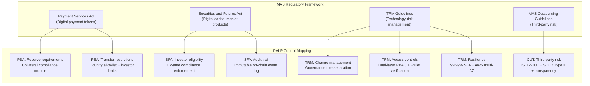

### 16.2 Control Mapping Table: MAS, PSA, TRM Guidelines

| Regulatory Requirement | Requirement Description | DALP Control | Evidence |
|----------------------|------------------------|--------------|----------|
| PSA Section 29: Reserve Backing | Digital payment tokens must maintain adequate reserve backing | Collateral requirement module enforces on-chain proof of reserves before minting; collateral ratio tracked continuously | On-chain compliance module configuration; collateral event log |
| PSA Section 30: Transfer Restrictions | Restrictions on transfer to unauthorized recipients | Country allowlist + Identity Verification compliance modules enforce ex-ante | Compliance module configuration; on-chain transfer revert events |
| PSA: AML/CFT | Anti-money laundering and counter-terrorist financing obligations | Integration with DBS Bank's AML platform via webhooks; wallet freeze API for enforcement | Webhook configuration; freeze/unfreeze event log |
| TRM Guideline 5.1: Access Control | Appropriate access controls for systems managing customer data | Dual-layer RBAC; 26 roles; wallet verification for all writes; API key scoping | Role configuration; access event log; security dashboard |
| TRM Guideline 5.3: Change Management | Controlled changes to technology systems | Governance role separation; UUPS proxy upgrade with on-chain authorization; configuration change log | Change event log; role assignment records |
| TRM Guideline 7.1: System Resilience | Systems must meet defined resilience objectives | 99.99% uptime SLA; AWS Multi-AZ; RTO 2-15 minutes; RPO seconds to 1 minute | SLA commitment; architecture documentation; DR test results |
| TRM Guideline 9.1: Third-Party Risk | Management of risks from third-party technology providers | ISO 27001 and SOC 2 Type II certifications; transparency on all subcontractor dependencies; defined control boundary | Certificates available; third-party dependency register |
| MAS Notice on Cyber Hygiene | Regular penetration testing and vulnerability management | Regular penetration testing (at least annually); vulnerability scanning; patching cadence | Penetration test reports; vulnerability management programme documentation |
| Outsourcing Guidelines: Data Residency | Customer data must remain within Singapore for licensed institutions | AWS ap-southeast-1 deployment; no data transfer outside Singapore jurisdiction; data residency attestation | Deployment architecture; data flow diagrams; AWS region configuration |
| Outsourcing Guidelines: Audit Rights | Institutions must retain audit rights over outsourced service providers | Full audit access to platform logs, configurations, and change records; SettleMint provides regulator-facing evidence packs | Audit access procedures; evidence export API |
| Project Guardian: Interoperability | Support for MAS-endorsed cross-network interoperability frameworks | ERC-3643 standard token interface; OnchainID identity interoperability; XvP HTLC cross-chain settlement | ERC-3643 implementation; cross-chain settlement documentation |
| TradeTrust: Document Integrity | Trade documents must be verifiable and transferable under MLETR | Configurable token metadata schema for trade document attributes; integration API for TradeTrust verification | Integration architecture; metadata schema documentation |

### 16.3 Data Residency and Privacy

All DALP platform data for DBS Bank's deployment resides in AWS ap-southeast-1 (Singapore). This covers transaction records, identity data, key material (in AWS KMS/CloudHSM), audit logs, and configuration data. No data leaves Singapore jurisdiction through DALP platform operations.

For personal data subject to Singapore's Personal Data Protection Act (PDPA), DALP's data model separates on-chain data (which is immutable and pseudonymous, blockchain addresses, not personal identifiers) from off-chain data (which includes personal details subject to PDPA). The on-chain identity contracts store claim types and their validity status, not the underlying personal data. The personal data is held by the trusted issuer (DBS Bank's KYC infrastructure) and referenced through the OnchainID claim mechanism.

### 16.4 Records Retention and Evidentiary Integrity

DALP's audit trail is inherently tamper-evident: on-chain events cannot be deleted or modified after they are written to the blockchain. For regulatory evidence purposes, the event log is exportable through the API with full event context, block reference, transaction hash, and timestamp. Event log queries are deterministic and reproducible: the same query against the same time window always returns the same result.

DALP's off-chain indexed data (the query layer over on-chain events) supports configurable retention policies for regulatory compliance, including legal-hold capabilities and deletion controls for personal data under PDPA. The separation between immutable on-chain data and configurable off-chain indexed data allows DBS Bank to satisfy both blockchain immutability requirements and PDPA deletion rights within the same architecture.

---

## 17. Response Matrix

| Req ID | Requirement | Compliance Status | DALP Response | Evidence |
|--------|------------|------------------|---------------|----------|
| TR-01 | End-to-end lifecycle: initiation, approval, issuance, servicing, reporting, exception handling, closure | Supported | DALP provides complete lifecycle coverage for tokenized deposits and trade finance. Asset Designer covers creation; compliance modules cover approval; servicing covers yield, freeze, redemption; operational dashboards cover reporting; exception queues cover break management; burn and maturity redemption cover closure | Asset lifecycle documentation; OCBC Bank production reference |
| TR-02 | Maker-checker controls, delegated authority, segregation of duties, evidential approval logs | Supported | Transfer approval compliance module implements configurable maker-checker workflows with role-bound approval authority. 26 roles across four layers enforce separation of duties. All approval decisions recorded on-chain with approver identity, timestamp, and decision reference | Role configuration documentation; on-chain event log |
| TR-03 | Documented APIs, events, batch interfaces, message standards | Supported | OpenAPI 3.1 specification; TypeScript SDK; event webhooks; ISO 20022 payment rail support. All endpoints documented with response schemas, error codes, and authentication requirements | API documentation; OpenAPI specification |
| TR-04 | MAS regulatory alignment, PSA, TRM Guidelines, audit evidence, control mapping | Supported | Section 16 provides detailed control mapping to MAS, PSA, and TRM Guidelines. ISO 27001 and SOC 2 Type II certifications. MAS Singapore compliance template pre-built and deployed | Control mapping table; Section 16; certification evidence |
| TR-05 | Identity, wallet, participant onboarding, KYC/KYB, jurisdictional eligibility | Supported | OnchainID identity framework with claim-based verification. Identity Verification compliance module requires verified claims for all transfers. Country allowlist enforces jurisdictional eligibility. KYC/AML integration through trusted issuer API | Identity framework documentation; OCBC Bank reference |
| TR-06 | Key management, HSM/KMS, signing policy, break-glass, wallet administration | Supported | Key Guardian with HSM/CloudHSM support. Fireblocks MPC-CMP integration. Break-glass procedure documented. Wallet verification required for all writes. Emergency access logged and reviewed | Key management documentation; Section 9 |
| TR-07 | Reconciliation across digital asset events, cash movement, GL, sub-ledgers, external confirmations | Supported | On-chain as source of truth with indexer query layer. Structured webhook payloads designed for automated journal entry generation. Reconciliation break surfacing through operational API. Deterministic event replay for reconciliation validation | Integration architecture; Section 10.4 |
| TR-08 | Operational dashboards, alerting, case management, evidence export | Supported | DALP operational dashboards (operations, compliance, security, transactions). Configurable alerting via Grafana. Exception queue with SLA tracking. Evidence export API for audit and regulatory inspection | Dashboard documentation; Section 10.3 |
| TR-09 | Deployment flexibility: cloud, private cloud, on-premises; data residency | Supported | Full deployment flexibility: managed cloud (AWS Singapore recommended), private cloud (client cloud), on-premises (Kubernetes). Data residency controlled per deployment model | Section 12; deployment documentation |
| TR-10 | Reference delivery experience with regulated financial institutions in APAC | Supported | OCBC Bank (Singapore, MAS-regulated, production); Standard Chartered (APAC); Maybank Project Photon (Malaysia, central bank aligned); Reserve Bank of India trade finance; Mizuho Bank (production planning) | Section 15; reference letters available |
| TR-11 | Programmable controls: entitlement rules, transfer restrictions, pricing triggers, settlement conditions | Supported | 18 compliance module types covering full range of programmable controls. Expression builder for custom eligibility rules. XvP settlement with configurable conditions. Governance role required for all control changes | Compliance module catalog (Appendix B) |
| TR-12 | Testing strategy: SIT, UAT, performance, failover, cyber tabletop, data migration, cutover | Supported | Section 13.5 details comprehensive test programme including all named categories. Test plan and evidence provided as standard deliverables | Implementation methodology; Section 13.5 |
| TR-13 | Integration with ERP/GL, treasury, CRM, case management, observability, domestic payment infrastructure | Supported | Section 8 details integration architecture for all named system categories. SWIFT/MAS SORA connectivity via ISO 20022 adapter | Integration architecture; Section 8 |
| TR-14 | Data model extensibility: legal entity, branch, product, counterparty, collateral, jurisdiction | Supported | Configurable token instrument templates with custom metadata schemas. Per-asset compliance module configuration. Multi-entity setup through DALP's organization model. No custom code required for new product variants | Asset configuration documentation; instrument template system |
| TR-15 | Records retention, evidentiary integrity, exportability | Supported | On-chain tamper-evident audit trail. Time-windowed event query API for deterministic evidence export. Configurable retention policies for off-chain indexed data. Legal-hold capability | Section 16.4; audit export documentation |
| TR-16 | Third-party risk transparency: custodians, node operators, cloud, analytics, managed security | Supported | Full subcontractor transparency provided. Third-party dependency register covers Fireblocks (custody), AWS (infrastructure), Restate (workflow engine). ISO 27001 and SOC 2 Type II for SettleMint. Cloud shared responsibility model documented | Third-party dependency register; Section 11.2 |
| TR-17 | Business continuity: RTO/RPO, region failover, backup restore, crisis governance | Supported | RTO 2-15 minutes (cloud-native); RPO seconds to 1 minute. AWS Multi-AZ deployment. Velero backup with CloudNativePG WAL archival. Quarterly DR testing. Crisis governance procedures documented | Section 11.5; Section 12; DR documentation |
| TR-18 | Commercial scaling for entities, jurisdictions, products, volumes without re-platform | Supported | Platform licensing model scales through environment addition. Configurable compliance templates enable jurisdiction expansion without custom development. Multi-entity organization model supports legal entity separation | Section 17 (commercial proposal); pricing schedule |
| TR-19 | Release management, regression testing, policy change approvals, smart contract change governance | Supported | UUPS proxy upgrade pattern with governance role authorization. Configuration change events logged on-chain. Staging environment for pre-production validation. Staged production rollouts for Enterprise tier | Change management documentation; Section 13 |
| TR-20 | Future-state roadmap aligned to DBS Bank strategy, with live/roadmap distinction | Supported with narrative | This proposal clearly distinguishes live capabilities (marked Supported) from integration-dependent capabilities (marked accordingly). Roadmap items are tagged [ROADMAP] where included. SettleMint's product roadmap is shared with clients under NDA through the Customer Success Manager | Product roadmap (available under NDA) |

---

## 18. Appendix A: Risk Register

| Risk ID | Category | Description | Likelihood | Impact | Mitigation |
|---------|----------|-------------|-----------|--------|-----------|
| R-001 | Regulatory | MAS guidance on specific tokenized deposit classifications requires compliance configuration adjustment after initial deployment | Medium | High | Early engagement with legal/compliance in Phase 1; modular compliance architecture enables rapid module reconfiguration without token redeployment |
| R-002 | Integration | DBS Bank core banking system integration complexity exceeds initial estimates | Medium | High | Detailed integration assessment in Phase 1 with 2-week contingency buffer in Phase 3; DALP comprehensive API reduces custom development; mock integrations allow parallel progress |
| R-003 | Integration | AML/CFT platform real-time webhook delivery latency conflicts with settlement SLA requirements | Low | High | Performance test webhook delivery latency in Phase 4; configurable transfer approval workflow allows compliance hold before on-chain execution if needed |
| R-004 | Technical | Project Guardian interoperability requirements with external network participants introduce external dependencies | Medium | Medium | Early identification of interoperability requirements in Phase 1; ERC-3643 standard interface provides baseline interoperability; phased interoperability with contingency for deferred implementation |
| R-005 | Technical | TradeTrust document verification service availability affects trade finance instrument transfer workflow | Medium | Medium | Transfer approval module allows transfer hold if TradeTrust verification unavailable; operational procedures for graceful degradation documented in runbooks |
| R-006 | Operational | DBS Bank operations team knowledge transfer insufficient for independent BAU operations | Low | High | Structured knowledge transfer programme in Phase 6; role-based training; runbook validation; tabletop exercises; operational readiness sign-off before hypercare exit |
| R-007 | Security | Custody provider (Fireblocks) service availability affects transaction signing | Low | High | Key Guardian supports multiple custody backends; local HSM fallback path configured for emergency operations; Fireblocks 99.99% SLA contractually guaranteed |
| R-008 | Commercial | Scope expansion during implementation creates uncontrolled cost and timeline growth | High | Medium | Formal change control process from Phase 1; scope locked at Phase 1 gate with defined change request procedures; impact assessment required for all scope changes |
| R-009 | Data | Investor identity data quality from existing DBS Bank systems insufficient for on-chain claim issuance | Medium | Medium | Data quality assessment in Phase 1; remediation plan agreed before Phase 2; data seeding validation as Phase 5 go-live criterion |
| R-010 | Regulatory | PSA regulatory interpretation of tokenized deposits requires licensing or approval not currently held by DBS Bank | Low | Critical | Legal review of instrument classification in Phase 1 before any development commitment; platform configuration does not predetermine regulatory characterization |

**RAID Log Ownership:** Delivery Lead owns the RAID log. Weekly RAID review in programme status meeting. Monthly RAID review at Steering Committee. Issues escalated above agreed thresholds immediately to Programme Sponsor. Risk register reviewed and updated at each phase gate.

---

## 19. Appendix B: Compliance Module Catalog

DALP provides 18 compliance module types organized across six categories. All modules operate through the ERC-3643 compliance engine, evaluating before each transfer. Modules are composable: any combination can be applied to a single token.

### Category 1: Eligibility Modules

**Module 1: Identity Verification (SMART Identity)**
- Description: Requires all transfer parties to have a registered OnchainID with active, non-expired claims from trusted issuers
- MAS Application: Core KYC requirement for all digital asset transfers
- Configuration: Claim type requirements (KYC, AML, accredited investor status); minimum claim freshness period; trusted issuer list
- Behavior: Transfer reverts if sender or recipient lacks required claims, has expired claims, or has claims from an issuer no longer in the trusted registry

**Module 2: Investor Accreditation**
- Description: Requires investors to hold a specific accreditation claim (accredited investor, qualified investor, institutional investor)
- MAS Application: Suitability requirements for specific instrument categories
- Configuration: Accreditation claim type; accepted issuer list
- Behavior: Transfer to non-accredited investors reverts; minting to non-accredited investors reverts

**Module 3: Suitability Verification**
- Description: Requires investors to hold a suitability attestation claim for the specific instrument type
- MAS Application: Product suitability obligations under the MAS notice on sale of investment products
- Configuration: Suitability claim type; instrument category code
- Behavior: Transfer to investors without current suitability attestation reverts

### Category 2: Restriction Modules

**Module 4: Country Allowlist**
- Description: Restricts transfers to investors in approved jurisdictions
- MAS Application: Jurisdictional distribution restrictions; PSA transfer restrictions
- Configuration: List of permitted ISO 3166-1 country codes; separate lists for issuance and secondary transfer
- Behavior: Transfer involving an investor whose registered country is not in the allowlist reverts; country claim is sourced from OnchainID

**Module 5: Country Blocklist**
- Description: Blocks transfers involving investors in prohibited jurisdictions
- MAS Application: Sanctions implementation; OFAC/UN sanctions list enforcement
- Configuration: List of prohibited country codes; enforcement scope (sender, recipient, or both)
- Behavior: Transfer involving investor from a blocked country reverts regardless of other checks

**Module 6: Address Blocklist**
- Description: Blocks transfers to or from specifically identified wallet addresses
- MAS Application: Targeted sanctions enforcement; AML freeze enforcement at the protocol layer
- Configuration: List of blocked wallet addresses; enforcement scope
- Behavior: Transfer involving a blocked address reverts; addresses added to blocklist take effect immediately

**Module 7: Address Allowlist**
- Description: Restricts transfers to a specified list of pre-approved wallet addresses
- MAS Application: Controlled distribution to specific counterparties; inter-entity transfer restrictions
- Configuration: List of allowed wallet addresses; maintenance process for list updates
- Behavior: Transfers only execute between addresses on the allowlist

### Category 3: Transfer Control Modules

**Module 8: Transfer Approval**
- Description: Requires explicit human approval before transfer execution
- MAS Application: Documentary compliance in trade finance; high-value transfer controls; pre-trade screening integration
- Configuration: Approval queue configuration; approver roles; SLA thresholds; escalation rules
- Behavior: Transfer request enters approval queue; on-chain execution is held until approval is granted; approval record includes approver identity, timestamp, and decision reference

**Module 9: Investor Count Limit**
- Description: Enforces maximum number of unique token holders
- MAS Application: MAS offering limits; PSA restrictions on holder count for specific instrument categories
- Configuration: Global holder limit; per-country holder limits (independently configurable)
- Behavior: Transfer that would increase holder count beyond the limit reverts; applies independently to global and per-country limits

**Module 10: Transfer Velocity**
- Description: Limits the total transfer volume within a specified time window
- MAS Application: Transaction monitoring support; concentration limits
- Configuration: Volume limit; time window (rolling); scope (per-address or global)
- Behavior: Transfer that would exceed the velocity limit within the current window reverts

### Category 4: Issuance and Supply Modules

**Module 11: Supply Cap**
- Description: Enforces a hard maximum on total circulating supply
- MAS Application: PSA issuance restrictions; MiCA-style supply caps
- Configuration: Maximum supply in token units
- Behavior: Minting beyond the configured cap reverts; cap tracks live circulating supply (burn decreases the used cap)

**Module 12: Token Supply Limit (Rolling Window)**
- Description: Enforces a maximum issuance volume within a rolling time window
- MAS Application: Periodic issuance restrictions; time-windowed offering caps
- Configuration: Maximum issuance amount; window duration (in days); base price conversion for currency-denominated caps
- Behavior: Minting that would exceed the rolling window limit reverts; window rolls forward with each new issuance

**Module 13: Collateral Requirement**
- Description: Requires on-chain proof of collateral backing before minting
- MAS Application: PSA reserve requirements for digital payment tokens; collateral-backed deposit token requirements
- Configuration: Required collateral ratio; collateral token address; acceptable collateral types
- Behavior: Minting reverts if on-chain collateral balance is insufficient for the requested mint at the required ratio

### Category 5: Time-Based Modules

**Module 14: Time Lock (Holding Period)**
- Description: Enforces a minimum holding period before tokens can be transferred
- MAS Application: Lock-up requirements post-issuance; investment product holding period enforcement
- Configuration: Minimum holding period (in days); FIFO batch tracking for partial transfers
- Behavior: Transfer of tokens within the holding period reverts; FIFO batch tracking ensures that older tokens (past the holding period) transfer first

**Module 15: Transfer Window**
- Description: Restricts transfers to specified time windows (e.g., business hours, settlement windows)
- MAS Application: Settlement window enforcement; operational control over transfer timing
- Configuration: Allowed time ranges (day of week and hour); timezone setting
- Behavior: Transfer outside the configured time window reverts

**Module 16: Maturity Block**
- Description: Blocks all standard transfers after the maturity date, enabling only redemption operations
- MAS Application: Fixed-term instrument maturity enforcement; ensuring holders can only exit through redemption
- Configuration: Maturity date (set at token creation, immutable after deployment)
- Behavior: All standard transfers revert after maturity date; redemption (atomic burn-and-payout) remains available to holders

### Category 6: Settlement and Collateral Modules

**Module 17: Collateral Ratio**
- Description: Continuously monitors collateral coverage ratio and blocks minting when coverage falls below threshold
- MAS Application: Ongoing collateral monitoring for backed instruments; dynamic collateral enforcement
- Configuration: Minimum coverage ratio; monitoring frequency; alert thresholds
- Behavior: Minting blocked when live collateral ratio falls below the minimum; existing token holders not affected

**Module 18: Settlement Condition**
- Description: Requires specific on-chain conditions to be met before transfer executes
- MAS Application: Conditional settlement enforcement; documentary conditions for trade finance
- Configuration: Condition contract address; required condition state; timeout behavior
- Behavior: Transfer reverts if the condition contract reports the condition is not met; enables programmable settlement logic without modifying the token contract

---

*End of Technical Proposal: DBS Bank. Tokenized Deposits and Trade Finance Platform*

*Document version: 1.0 Draft | Prepared: 20 March 2026 | SettleMint Confidential*
