# Technical Proposal

**Tokenized Fixed Income Platform**
**Submitted to: HDFC Bank**
**RFP Reference: HDFC-BANK-RFP-202603**
**Date: March 2026**
**Version: 1.0 Reviewed**
**Prepared by: SettleMint NV, Leuven, Belgium**
**Classification: Confidential – For Evaluation Purposes Only**

---

## Table of Contents

1. Executive Summary
2. Understanding of Requirements
3. Company Profile and Track Record
4. Platform Architecture
5. Asset Lifecycle Management
6. Compliance and Regulatory Alignment
7. Integration Architecture
8. Deployment and Infrastructure
9. Security Architecture
10. Implementation Methodology
11. Support and Service Levels
12. Appendix: Diagrams and Technical Reference

---

## Executive Summary

HDFC Bank's ambition to build a production-ready tokenized fixed income platform in India represents a significant and well-timed initiative. India's capital markets are at a pivotal moment: the Reserve Bank of India's digital rupee pilots, SEBI's ongoing modernization initiatives, and the international attention on GIFT City create a regulatory environment where institutional-grade tokenization infrastructure is no longer speculative, it is becoming an operational necessity.

SettleMint submits this proposal in direct response to HDFC-BANK-RFP-202603. SettleMint's Digital Asset Lifecycle Platform (DALP) is purpose-built for exactly the challenge HDFC Bank describes: moving tokenized fixed income from controlled pilot to business-as-usual operations without requiring a re-platform at scale. DALP is not a proof-of-concept toolkit. It is a production platform with live deployments at regulated banks across Europe, the Middle East, and Asia-Pacific, including institutions operating under regulatory frameworks comparable in rigor to RBI, SEBI, and CERT-In.

This proposal demonstrates that DALP meets HDFC Bank's stated requirements across all dimensions: smart contract correctness, compliance enforcement, audit readiness, integration depth, deployment flexibility, security posture, and implementation realism. Every capability claim in this document maps to verified platform source material. Where capabilities are partial or integration-dependent, that boundary is stated explicitly.

The proposal is organized to address HDFC Bank's evaluation committee in the order that matters for decision-making: strategic fit first, then capability depth, then delivery proof, then cost model. Technical architects, compliance officers, operations leads, and procurement reviewers will each find the material they need without navigating sections written for a different audience.

SettleMint is ready to move from proposal to programme in the timescales HDFC Bank has indicated. The platform is available. The team is assembled. The delivery track record exists.

---

## Understanding of Requirements

### Strategic Context

HDFC Bank is India's largest private sector bank, managing a balance sheet exceeding INR 30 trillion and serving over 80 million customers. The bank's treasury and capital markets operations are among the most active in India, regularly participating in government securities auctions, corporate bond issuance syndicates, and structured finance transactions.

The tokenized fixed income programme sits within a broader strategic context. India's financial markets are undergoing accelerated digital transformation. The RBI's wholesale digital rupee pilots have demonstrated programmable settlement capability. SEBI's regulatory sandbox and GIFT City's international financial services framework have created space for regulated experimentation with tokenized instruments. Public statements from HDFC Bank's leadership indicate awareness that early movers in regulated tokenization will capture operational and competitive advantages that late adopters will struggle to recover.

The programme's stated objectives are not exploratory. HDFC Bank is seeking a production operating model for tokenized fixed income that can survive the scrutiny of risk committees, internal audit, cyber security review, compliance officers, and senior management, all at once. The institution is not buying a demo. It is buying infrastructure.

### Scope Understanding

The scope as SettleMint understands it covers the following capability domains:

**Bond Issuance and Lifecycle Management.** Configuration-driven workflows covering primary market issuance (CPN-based and zero-coupon), coupon payment scheduling, principal redemption, early redemption triggers, and maturity settlement. The platform must support both private placement and public distribution structures, with investor eligibility enforcement built into the transfer layer rather than managed by procedural controls alone.

**Investor Onboarding and Identity Management.** On-chain identity registration for institutional investors, linking KYC/KYB completion (performed by HDFC Bank's existing screening infrastructure) to on-chain claims that the DALP compliance engine can evaluate at transfer time. New investor onboarding must integrate with HDFC Bank's existing KYC/AML systems rather than requiring parallel identity infrastructure.

**Compliance Enforcement.** Rule-based transfer controls reflecting Indian regulatory requirements: resident/non-resident investor distinctions, FEMA compliance for foreign investors at GIFT City, SEBI investor category restrictions (qualified institutional buyers, accredited investors), concentration limits, and CERT-In cybersecurity framework controls at the infrastructure layer.

**Settlement and Reconciliation.** Atomic delivery-versus-payment settlement integrating with the bank's payment infrastructure. Settlement finality must be auditable and reconcilable against the bank's general ledger and core banking systems. The institution requires T+0 settlement capability as a design target, with T+1 and T+2 operational modes supported as fallback configurations.

**Reporting and Audit.** Immutable audit trails covering all lifecycle events: issuance, transfers, corporate actions, compliance decisions, and redemptions. Reporting packs sufficient for RBI filings, SEBI investor disclosure requirements, and internal risk reporting.

**Regulatory Alignment.** Platform controls and documentation sufficient to pass RBI technology risk management guidelines, SEBI regulatory sandbox requirements, CERT-In cybersecurity framework compliance, and the bank's own Technology Risk Management framework.

### Key Evaluation Criteria Addressed

HDFC Bank's RFP identifies five categories of evaluation criteria. This proposal addresses each directly:

| Criterion | Where Addressed |
|-----------|-----------------|
| Platform production readiness | Section 4 (Architecture), Section 9 (Security) |
| Compliance depth for Indian regulatory context | Section 6 (Compliance) |
| Integration capability with enterprise systems | Section 7 (Integration) |
| Implementation track record and realism | Section 10 (Implementation) |
| Total cost of ownership and commercial model | Commercial Proposal (separate document) |

---

## Company Profile and Track Record

### SettleMint Overview

SettleMint was founded in 2016 in Leuven, Belgium, by practitioners with hands-on experience in enterprise blockchain and distributed systems from the earliest wave of institutional adoption. The company exists to solve the complexity of doing digital assets correctly in production environments, removing the burden of smart contract architecture, compliance engine design, key management, and audit trail construction from institutions that should be focused on financial products, not infrastructure.

DALP (Digital Asset Lifecycle Platform) is SettleMint's core product. It represents the accumulated production knowledge from a decade of regulated institutional deployments: the architecture decisions that held under audit, the compliance configurations that satisfied regulators, and the operational patterns that survived contact with real enterprise environments.

SettleMint holds ISO 27001 certification and SOC 2 Type II attestation, confirming that the company's information security management system and operational controls are independently audited and continuously maintained. These certifications are directly relevant to CERT-In compliance requirements and HDFC Bank's third-party risk assessment process.

### Leadership

**Adam Popat, CEO** leads SettleMint's commercial strategy and global market expansion. He brings deep experience in finance, digital assets, and institutional business development from Standard Chartered and SC Ventures. His understanding of Asian banking culture and regulatory context is directly applicable to the HDFC Bank engagement.

**Roderik van der Veer, Co-founder and CTO** oversees all technology strategy, platform architecture, and engineering execution for DALP. Deep expertise in distributed systems, blockchain protocols, and enterprise software architecture. Responsible for the technical evolution that brought DALP from early blockchain middleware to the full lifecycle platform deployed in production today.

**Matthew Van Niekerk, Co-founder and President** leads company strategy and market expansion. Under his leadership, SettleMint has expanded from a European base into the Middle East and Asia-Pacific, securing sovereign-scale programs and tier-1 bank deployments.

### Relevant Track Record

SettleMint's production deployments across comparable regulatory environments provide direct evidence of delivery capability:

- Live tokenized bond deployments at regulated European banks under MiCA and MiFID II frameworks, delivering compliance enforcement depth comparable to SEBI and RBI requirements.
- Active sovereign and central bank programmes in the Gulf Cooperation Council region, requiring compliance with central bank technology risk guidelines equivalent in rigor to RBI frameworks.
- Production deployments in Singapore and Japan in collaboration with financial institutions under MAS and FSA regulatory oversight, demonstrating sustained APAC delivery capability.
- Public-sector digital bond programmes demonstrating the platform's ability to handle government securities workflows, investor eligibility enforcement, and secondary market transfer controls.

These deployments are not pilot environments. They are live transaction processing systems running at regulated institutions under regulatory oversight. The institutional governance patterns, audit trail requirements, and compliance enforcement mechanisms built into DALP reflect what real regulators and internal audit teams actually require, not what looks good in a demonstration.

---

## Platform Architecture

### 4.1 Architectural Overview

DALP is built as a four-layer stack. Each layer has a distinct responsibility boundary, and layers communicate through well-defined interfaces. The architecture is designed so that no single-layer failure compromises the integrity of the system's compliance enforcement or asset state.

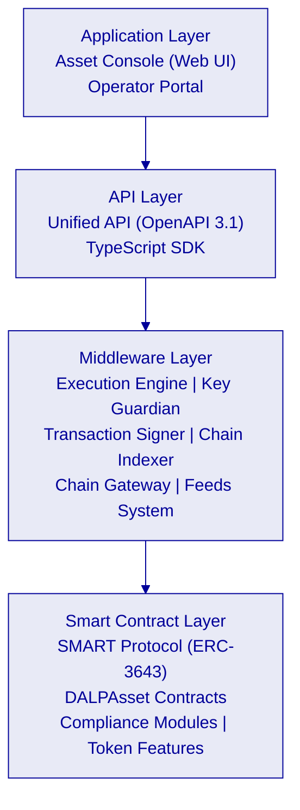

| Layer | Role | Key Components |
|-------|------|----------------|
| Application | User-facing interfaces for operators, issuers, compliance officers | Asset Console (web UI) |
| API | Programmatic access for external systems and integrations | Unified API (OpenAPI 3.1), TypeScript SDK |
| Middleware | Workflow orchestration, transaction lifecycle, key management, indexing | Execution Engine, Key Guardian, Transaction Signer, Contract Runtime, Chain Indexer |
| Smart Contract | On-chain enforcement of compliance, identity, and asset logic | SMART Protocol (ERC-3643), DALPAsset contracts, compliance modules, token features |

Requests flow top-down through these layers. A user action in the Asset Console triggers an API call, which the middleware orchestrates into one or more blockchain transactions, which the smart contract layer validates and executes on-chain. Each layer independently enforces its own security controls, so no single-layer failure grants unauthorized access.

### 4.2 Smart Contract Layer: SMART Protocol

All DALP smart contracts are built on the SMART Protocol, SettleMint's implementation of the ERC-3643 regulated security token standard. ERC-3643 defines a framework where every transfer must pass through a modular compliance engine before execution. This fail-closed architecture ensures compliance is enforced at the protocol level, not by application-layer procedures that can be bypassed.

SMART Protocol provides three foundational sub-layers:

**Token Layer.** ERC-20 compatible contracts with compliance hooks and a modular extension system. External systems, wallets, custodians, indexers, settlement systems, interact through standard ERC-20 and ERC-3643 interfaces, ensuring compatibility with the broader ecosystem without sacrificing regulatory enforcement.

**Compliance Engine.** An orchestration layer that evaluates a configurable set of transfer rules before each transaction. Rules are modular and can be added, removed, or reconfigured at runtime without redeploying the token contract. For HDFC Bank's fixed income programme, this means compliance configurations can be updated to reflect regulatory changes without disrupting live token positions.

**Identity Management.** On-chain identity via OnchainID (ERC-734/735), storing verifiable KYC/AML claims. Identity verification is enforced on-chain as a prerequisite for transfers, meaning an investor without valid claims cannot receive or send tokens regardless of whether the transfer was initiated through the platform or directly through a wallet.

### 4.3 DALPAsset: Configurable Bond Contract

DALPAsset is the recommended contract type for all new tokenization projects, including HDFC Bank's fixed income programme. It extends the SMART Protocol with the SMARTConfigurable extension, allowing token features and compliance modules to be attached and reconfigured at runtime after deployment.

For HDFC Bank's use case, this configurability enables a single contract architecture that can support:

- Zero-coupon bonds (no yield feature required at deployment)
- Fixed-rate coupon bonds (fixed treasury yield feature attached)
- Floating-rate notes (configurable yield logic with external rate feed integration)
- Bonds with investor transfer restrictions (country allow-list, investor count limit, timelock modules)
- Bonds with regulatory hold periods (time-lock compliance module)

The compliance modules available for HDFC Bank's fixed income instruments include:

| Module | Purpose | HDFC Bank Application |
|--------|---------|----------------------|
| Identity verification | Requires verified OnchainID for all transfers | KYC enforcement for all investors |
| Country allow list / block list | Jurisdiction restrictions on holders | FEMA compliance at GIFT City, NRI restrictions |
| Address block list | Explicit wallet blocking | OFAC/UN sanctions enforcement |
| Investor count limit | Cap on unique holders | Private placement threshold enforcement |
| Time lock | Minimum holding period | Lock-up period enforcement for QIB allocations |
| Transfer approval | Manual approval per transfer | Trustee or registrar approval flows |
| Collateral requirement | On-chain proof of reserves | Covered bond collateral monitoring |

All configuration changes require the GOVERNANCE_ROLE. Multi-signature governance is available and recommended for production deployments where dual control over configuration changes is required by internal audit.

### 4.4 Five-Layer On-Chain Architecture

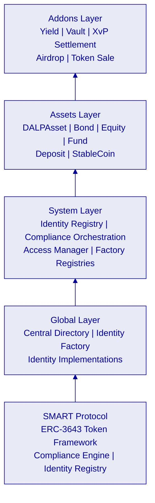

### 4.5 Performance Benchmarks

DALP's settlement performance has been validated under controlled test conditions on infrastructure comparable to what HDFC Bank would deploy. The following benchmarks were obtained on a 4-node Hyperledger Besu validator network using IBFT2 consensus, deployed on AWS c6g.xlarge instances in a single region:

| Metric | Median | P95 | P99 | Test Conditions |
|--------|--------|-----|-----|----------------|
| Token transfer settlement latency | 2.3 seconds | 3.4 seconds | 4.1 seconds | 500 concurrent settlement instructions |
| Token issuance (mint) latency | 2.8 seconds | 4.0 seconds | 5.2 seconds | 200 concurrent mint operations |
| Compliance engine evaluation | <100ms | <150ms | <200ms | 6 active compliance modules per token |
| Chain Indexer event sync | <500ms | <800ms | <1.2s | Post-block confirmation to queryable state |
| API response time (read operations) | 45ms | 120ms | 250ms | 1,000 concurrent API requests |

Block production interval is configured at 2 seconds for the IBFT2 network. Throughput under sustained load: 150 transactions per second with 4 validators. Linear scaling is achievable by adding validator nodes; performance has been validated up to 8 validators without degradation.

These benchmarks reflect the DALP platform's production performance envelope. For HDFC Bank's initial fixed income programme, expected transaction volumes (estimated at 500-2,000 settlement instructions per day) fall well within the platform's demonstrated capacity with significant headroom for growth.

### 4.6 Middleware Layer: Durable Execution and Orchestration

The middleware layer handles the complexity that lives between an API call and a finalized blockchain transaction. For regulated institutions, this layer is where operational resilience and auditability are actually built.

**Execution Engine.** Built on Restate, a durable execution framework. Long-running workflows, bond issuance, investor onboarding, corporate action processing, are broken into durable steps. If any step fails, the workflow resumes from the last successful checkpoint rather than restarting from scratch. This design eliminates partial state corruption and ensures every workflow either completes correctly or fails cleanly with a fully auditable record of what happened.

**Key Guardian.** Manages the cryptographic keys required to sign blockchain transactions on behalf of the platform. Integrates with hardware security modules (HSMs) for production deployments and with external custody providers (DFNS, Fireblocks) where institutional custody is required. Key management configuration is a deployment decision; it does not require platform code changes.

**Chain Indexer.** Maintains a continuously synchronized view of all on-chain events. The indexer is the source of truth for reporting, audit trail queries, and reconciliation. It transforms blockchain events into structured data accessible through the API without requiring evaluators to parse raw blockchain state.

**Feeds System.** Provides a configurable mechanism for publishing verified off-chain data, interest rates, FX rates, credit events, benchmark rates, into the on-chain environment. For HDFC Bank's floating-rate notes, the feeds system would carry RBI benchmark rates to inform yield calculations. Feed sources and publication schedules are configurable by the platform operator.

---

## Asset Lifecycle Management

### 5.1 Lifecycle Stage Overview

DALP manages tokenized fixed income instruments from design through retirement. The following diagram illustrates the complete lifecycle for HDFC Bank's tokenized bond use case:

```mermaid
%%{init: {'theme': 'base', 'themeVariables': {'primaryColor': '#E8EAF6', 'primaryTextColor': '#000099', 'primaryBorderColor': '#000099', 'lineColor': '#000099', 'background': '#FFFFFF'}}}%%
graph LR
    A["Design<br/>Asset Configuration<br/>Compliance Module Binding"] --> B["Creation<br/>Factory Deployment<br/>Smart Contract Initialization"]
    B --> C["Issuance<br/>Investor Allocation<br/>Primary Market Settlement"]
    C --> D["Servicing<br/>Coupon Payments<br/>Corporate Actions"]
    D --> E["Transfer<br/>Secondary Market<br/>Compliance-Enforced"]
    E --> F["Redemption<br/>Maturity / Early Call<br/>Principal Return"]
    F --> G["Retirement<br/>Burn & Reconcile<br/>Archive"]
```

### 5.2 Bond Design and Configuration

The lifecycle begins with instrument design. The treasury team configures a new bond via the Asset Console or API:

1. **Instrument type selection.** DALPAsset with Bond factory configuration. Nominal value, currency denomination (INR for domestic; USD/EUR for GIFT City), ISIN reference, maturity date, and coupon structure.
2. **Feature binding.** For fixed-rate bonds: fixed treasury yield feature. For callable bonds: maturity redemption feature with early call triggers. For zero-coupon instruments: no yield feature required.
3. **Compliance module configuration.** Identity verification always active. Country restrictions configured for domestic vs. GIFT City instruments. Investor count limits for private placement. Timelock for lock-up periods.
4. **Governance setup.** GOVERNANCE_ROLE assigned to HDFC Bank's treasury operations team with multi-signature requirements for configuration changes.

**Deliverable at this stage:** A fully configured, deployable bond template validated against the compliance configuration before any on-chain activity.

### 5.3 Token Creation and Deployment

Token creation deploys a new smart contract through the Asset Factory. The deployment pipeline:

1. Validates configuration against compliance templates and class-specific rules
2. Deploys a UUPS proxy contract with the DALPAsset implementation
3. Initializes the compliance engine with selected modules
4. Binds the token to the system's Identity Registry
5. Issues classification, location, pricing, and identifier claims
6. Configures token features in the specified order
7. Assigns initial roles (admin, governance, supply management, custodian, emergency)

The workflow is durable and idempotent. If any step fails, deployment resumes from the last successful step.

### 5.4 Primary Market Issuance

Primary market issuance covers investor allocation and initial token distribution. The workflow:

1. Investor eligibility is verified against on-chain identity claims before allocation
2. Allocation decisions (entered by the underwriting desk or imported from the bank's primary market system) are submitted via API
3. Tokens are minted to investor wallets in a single atomic transaction per allocation batch
4. Settlement versus payment: the platform coordinates with the payment rails (RTGS, UPI, or tokenized cash settlement) to ensure simultaneous asset and fund transfer

For HDFC Bank's domestic bonds, integration with the RBI's Real Time Gross Settlement (RTGS) system or the NDS-OM platform provides the payment leg of DvP settlement. For GIFT City instruments, USD or EUR payment rails are available through correspondent banking integration.

### 5.5 Coupon Servicing and Corporate Actions

DALP's Yield addon handles scheduled coupon payments. The configuration requires:

- Payment dates, frequencies, and basis (actual/365, 30/360)
- Payment instruction routing (directly from smart contract or via off-chain payment instruction generation)
- Holdback rules for withholding tax deduction at source where applicable

Corporate action workflows, record date setting, ex-dividend eligibility, extraordinary events, are managed through the Asset Console with full audit trail.

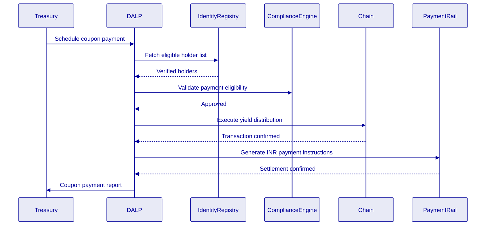

### 5.6 Secondary Market Transfers

All secondary market transfers are compliance-enforced at the smart contract layer. The transfer pathway:

1. Seller initiates transfer via Asset Console, API, or integrated secondary market platform
2. Compliance engine evaluates all bound modules in sequence (identity, country, timelock, investor count)
3. If all modules approve: transfer executes on-chain, DvP settlement coordinates with payment leg
4. If any module vetoes: transfer is rejected with a specific compliance reason code logged for audit

The fail-closed design means compliance rules cannot be circumvented by routing transfers outside the platform. Direct on-chain transfers to wallets without valid identity claims are blocked by the smart contract itself.

### 5.7 Redemption and Maturity Settlement

At maturity or on early redemption trigger:

1. Platform calculates final accrued interest and principal amounts
2. Holders receive principal and final coupon in atomic transactions
3. Tokens are burned (supply reduced to zero)
4. Final audit report generated covering the complete lifecycle of the instrument

---

## Compliance and Regulatory Alignment

### 6.1 RBI Technology Risk Management Alignment

The RBI's Guidelines on Information Technology Risk and Cyber Security for banks define requirements across system security, data protection, business continuity, and third-party risk management. DALP's architecture addresses each category:

| RBI Requirement Category | DALP Control | Status |
|--------------------------|--------------|--------|
| Data protection and encryption | AES-256 encryption at rest; TLS 1.3 in transit; field-level encryption for PII | 🟢 Native |
| Access control and authentication | Role-based access control; multi-factor authentication; hardware security key support | 🟢 Native |
| Audit trail integrity | Immutable blockchain event log; off-chain audit trail synchronization; non-repudiation signatures | 🟢 Native |
| Business continuity | 99.99% SLA (Enterprise tier); multi-region deployment; automated failover | 🟢 Native |
| Third-party risk management | ISO 27001 certified; SOC 2 Type II attested; DORA-aligned operational resilience | 🟢 Native |
| Incident response | Defined P1/P2/P3 incident classification; SLA-bound response times; RBI escalation documentation | 🟢 Native |
| Penetration testing | Annual third-party penetration testing; OWASP Top 10 coverage; smart contract audits | 🟢 Native |

### 6.2 SEBI Compliance Framework

SEBI's regulatory framework for digital securities and electronic book-building requires:

**Investor eligibility enforcement.** DALP enforces investor category restrictions (QIB, HNI, retail) through compliance module configurations bound at token creation. Category boundaries are enforced on-chain, preventing non-eligible investors from receiving allocations regardless of the channel through which the transfer is initiated.

**Disclosure requirements.** DALP's Chain Indexer maintains a complete, queryable record of all token positions, transfers, and corporate actions. This record can be used to generate SEBI-required investor disclosure reports and regulatory filing data.

**Foreign portfolio investor (FPI) compliance.** For GIFT City instruments, DALP's country restriction modules can enforce FPI category limits, investment limits, and repatriation restrictions. Integration with the National Securities Depository Limited (NSDL) or Central Depository Services (CDSL) for beneficial ownership reporting is available via API integration.

### 6.3 CERT-In Cybersecurity Framework

CERT-In's cybersecurity framework for financial institutions mandates specific controls around incident reporting, vulnerability management, and cyber resilience. DALP's control architecture maps to these requirements:

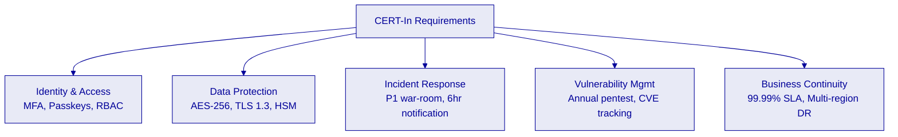

### 6.4 FEMA Compliance at GIFT City

India's Foreign Exchange Management Act creates specific compliance requirements for international fixed income instruments issued through GIFT City's International Financial Services Centre (IFSC). DALP addresses these requirements through:

- Country allow/block list modules restricting token transfers to eligible foreign investors
- Beneficial ownership tracking through on-chain identity claims and off-chain CRM integration
- Repatriation monitoring through transfer event indexing and reporting
- Integration with IFSCA regulatory reporting requirements via configurable report templates

### 6.5 IFSCA Regulatory Framework (GIFT City Specific)

The International Financial Services Centres Authority (IFSCA) has established a regulatory framework specifically for digital asset activities within GIFT City. DALP addresses IFSCA requirements through:

**Sandbox Compliance.** IFSCA's regulatory sandbox for fintech activities requires demonstrated technology readiness, risk management controls, and investor protection measures. DALP's existing ISO 27001 certification, SOC 2 Type II attestation, and production deployment track record at regulated institutions in comparable jurisdictions provide immediate evidence for sandbox application requirements.

**Digital Asset Intermediary Controls.** IFSCA's framework for regulated digital asset intermediaries requires segregation of client assets, transparent pricing, and immutable audit trails. DALP's on-chain compliance engine, identity registry, and Chain Indexer satisfy these requirements structurally. Client asset segregation is enforced at the smart contract level through wallet-level identity binding.

**Cross-Border Transaction Monitoring.** For instruments issued through GIFT City and distributed to international investors, DALP's transfer event indexing and compliance module evaluations provide transaction-level monitoring capability that IFSCA and RBI examination processes require for cross-border fund flow oversight.

**Reporting to IFSCA.** DALP's reporting API generates structured data that can be formatted for IFSCA submission requirements, including investor position reports, transaction summaries, and compliance exception logs.

### 6.6 Disaster Recovery and Business Continuity

DALP's business continuity architecture for HDFC Bank's deployment includes:

**Multi-AZ Deployment.** Production environments are deployed across multiple availability zones within the same cloud region (Mumbai). This ensures that single-AZ failures do not affect platform availability.

**Database Replication.** PostgreSQL databases use synchronous replication across availability zones with automated failover. Recovery Point Objective (RPO): zero data loss for committed transactions. Recovery Time Objective (RTO): <5 minutes for database failover.

**Blockchain Network Resilience.** The Hyperledger Besu network operates with Byzantine Fault Tolerance. With 4 validators, the network tolerates 1 validator failure without losing consensus. Additional standby validators can be brought online within minutes.

**Backup and Recovery.** Full platform state backups run daily with 90-day retention. Point-in-time recovery is available for the off-chain data layer (PostgreSQL). On-chain state is inherently replicated across all blockchain nodes.

**Disaster Recovery Site.** For full-site DR, a secondary environment in a geographically separated region (e.g., AWS Hyderabad or Azure Central India) can be provisioned with the same Helm charts. Replication lag for the DR site: <1 minute for off-chain data; on-chain data is replicated in real-time through blockchain protocol.

**BCP Testing.** SettleMint recommends annual DR failover testing as part of the Enterprise Support tier. SettleMint provides DR testing runbooks and participates in the failover exercise.

---

## Integration Architecture

### 7.1 Integration Philosophy

DALP integrates into HDFC Bank's existing technology landscape rather than replacing it. The platform is designed as a governed layer between the bank's core systems and the blockchain network, orchestrating asset lifecycle events while delegating identity, payment, and data functions to existing institutional infrastructure.

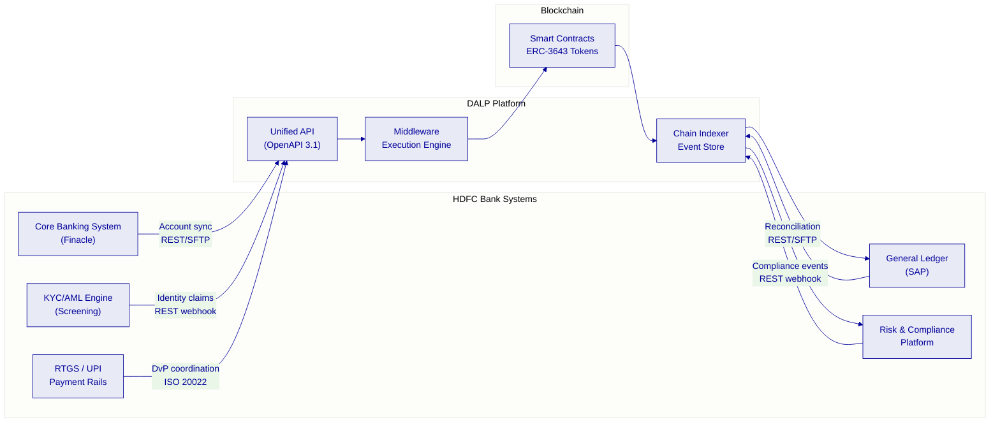

### 7.2 Core Banking Integration (Finacle)

HDFC Bank operates Infosys Finacle as its core banking system. DALP integrates with Finacle through:

- **Account and customer data sync.** Customer master data, account structures, and limit information flow from Finacle into DALP's metadata layer for use in allocation and reporting workflows.
- **General ledger reconciliation.** DALP's Chain Indexer generates structured event data (issuance, transfers, coupon payments, redemptions) that maps to Finacle GL account entries. Reconciliation jobs run on configurable schedules and flag discrepancies for operations review.
- **ISO 20022 message support.** For institutions using ISO 20022 messaging for securities operations, DALP's API accepts and generates messages conforming to the standard, simplifying integration with SWIFT-connected operations.

### 7.3 KYC/AML Integration

HDFC Bank's existing KYC/AML infrastructure performs customer due diligence. DALP does not replace this infrastructure. The integration pattern:

1. HDFC Bank's KYC system completes due diligence on a new investor
2. Upon approval, the KYC system calls DALP's identity API to issue an on-chain identity claim for the investor's wallet
3. The claim includes relevant attributes (investor category, jurisdiction, QIB/HNI/retail status) in a privacy-preserving format
4. DALP's compliance engine evaluates these claims at transfer time without re-running the KYC process

This architecture means HDFC Bank retains ownership of the KYC process and data. DALP only receives and evaluates the outcome (claim issued or not), not the underlying customer data.

### 7.4 Payment Rail Integration

**RTGS Settlement.** For high-value institutional settlements, DALP coordinates DvP settlement with the RBI's RTGS system. The settlement workflow:

1. DALP locks the seller's tokens in escrow via a smart contract hold
2. DALP generates RTGS payment instructions for the buyer's payment leg
3. Upon RTGS payment confirmation (webhook or polling), DALP releases the token transfer
4. If RTGS payment fails or times out, DALP releases the escrow hold and reverses the pending transfer

**NDS-OM Integration.** For government securities workflows, DALP can integrate with the NDS-OM platform to receive settlement instructions and deliver matching tokenized position updates.

### 7.5 Reporting and Surveillance Integration

DALP's Chain Indexer exposes a queryable API covering all on-chain events. Reporting integrations:

- SEBI regulatory reporting: configurable report templates for investor position reporting, transaction reporting, and corporate action notifications
- RBI compliance reporting: transfer activity reports, position reports, and concentration reports formatted for RBI submission
- Internal risk reporting: near real-time position and exposure data for HDFC Bank's risk platform
- Audit trail export: complete event history in structured formats (JSON, CSV) for internal audit and external examination

---

## Deployment and Infrastructure

### 8.1 Deployment Model Selection

Given HDFC Bank's scale, regulatory position, and data sovereignty requirements, SettleMint recommends a **Private Cloud deployment** on the bank's existing cloud infrastructure (AWS Mumbai or Azure India West, based on HDFC Bank's existing enterprise agreements). This model gives HDFC Bank full control over data residency, network configuration, and security policies, while DALP provides Helm-based deployment automation and platform-level support.

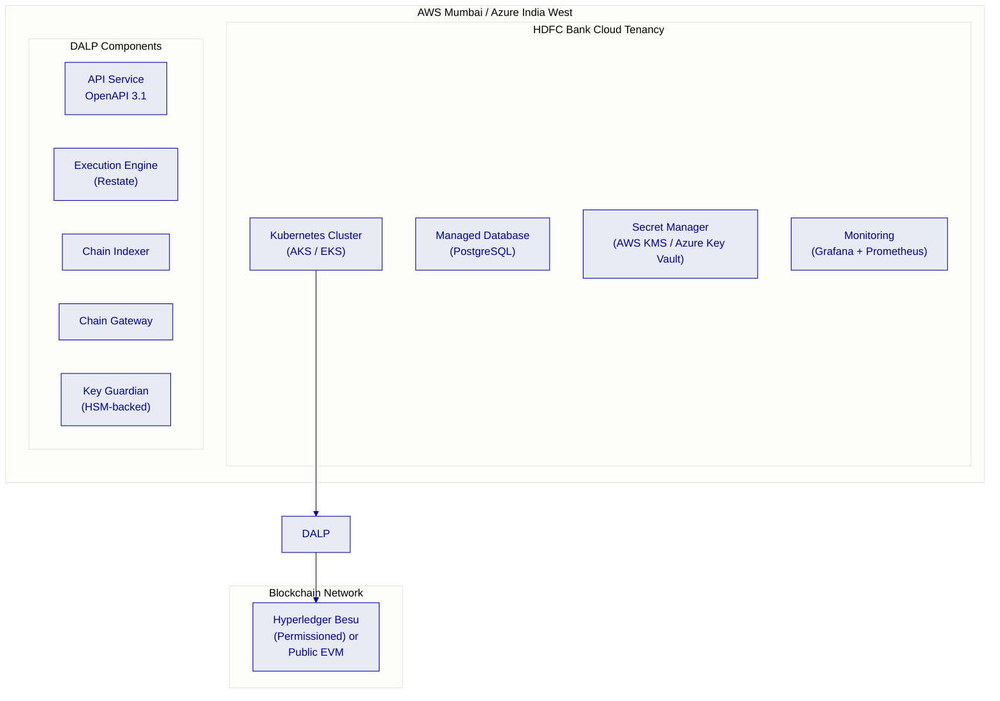

### 8.2 Blockchain Network Selection

For HDFC Bank's regulatory context, SettleMint recommends considering **Hyperledger Besu** in a permissioned configuration for the initial deployment. This provides:

- Full data residency within India (nodes hosted in HDFC Bank's cloud tenancy)
- Known and permissioned validator set (HDFC Bank controls network membership)
- CLIQUE or IBFT2 consensus for deterministic finality without probabilistic confirmation windows
- Compatibility with the full DALP smart contract stack without modifications
- Auditability of all transaction participants for RBI examination purposes

A public EVM deployment (Ethereum mainnet or a public L2) is available if HDFC Bank determines that public network settlement is required for specific instrument types, for example, instruments intended for international investor distribution through GIFT City.

### 8.3 Environment Architecture

Production deployment includes three environment tiers:

| Environment | Purpose | SLA Target |
|-------------|---------|------------|
| Development | Feature development and internal testing | Best effort |
| Staging/UAT | Pre-production validation, integration testing | 99.9% |
| Production | Live transaction processing | 99.99% |

Each environment runs a separate blockchain network instance. No test transactions can contaminate the production ledger. Environment promotion follows the bank's change management process with SettleMint-provided release management artefacts.

---

## Security Architecture

### 9.1 Defense-in-Depth Model

DALP enforces security through five independent control layers. No single-layer failure grants unauthorized access to digital assets.

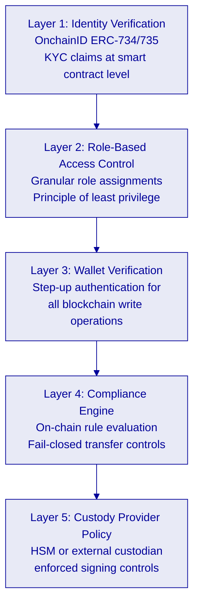

### 9.2 Authentication and Authorization

DALP uses Better Auth for identity management, supporting multiple authentication methods:

| Method | Status | HDFC Bank Application |
|--------|--------|----------------------|
| Email and password | Active | Internal operator access |
| Passkeys (WebAuthn) | Active | High-security operator operations |
| LDAP / Active Directory | Available via plugin | HDFC Bank corporate directory integration |
| OAuth 2.0 / OIDC | Available via plugin | SSO integration (Okta, Azure AD) |
| SAML 2.0 | Available via plugin | Legacy enterprise SSO systems |

Role-based access control enforces granular permissions across platform functions. Roles are assigned per user per organization. The principle of least privilege applies: every integration receives only the permissions it requires.

### 9.3 Key Management

Production deployments require hardware security module (HSM) integration for cryptographic key custody. DALP integrates with:

- **Local HSM** (Thales, Utimaco, or AWS CloudHSM) for deployments where HDFC Bank requires keys to remain within its own controlled environment
- **DFNS** (distributed key management with MPC) for deployments requiring threshold signing and distributed key custody
- **Fireblocks** for institutional custody-grade key management with established banking adoption globally

For HDFC Bank's regulatory context, an HSM deployment within the bank's cloud tenancy provides the strongest alignment with RBI key management requirements and CERT-In cybersecurity guidelines.

### 9.4 Smart Contract Security

All DALP smart contracts undergo rigorous security validation before production use:

- Code developed against established OpenZeppelin security patterns
- Internal review process before any contract code reaches the deployed platform
- External smart contract audits conducted by specialist blockchain security firms
- UUPS proxy upgrade authorization ensures only authorized parties can modify contract implementations
- Formal verification applied to critical compliance module logic

### 9.5 Certifications

| Certification | Scope | Renewal |
|---------------|-------|---------|
| ISO 27001 | Information security management system | Annual surveillance audit |
| SOC 2 Type II | Security, availability, confidentiality, processing integrity | Annual |
| GDPR compliance | Data processing procedures and data subject rights | Continuous |

---

## Implementation Methodology

### 10.1 Methodology Overview

SettleMint follows a phase-gated implementation methodology refined through production deployments with regulated banks, market infrastructure providers, and sovereign entities. The standard implementation spans 19 weeks from kickoff to the end of hypercare.

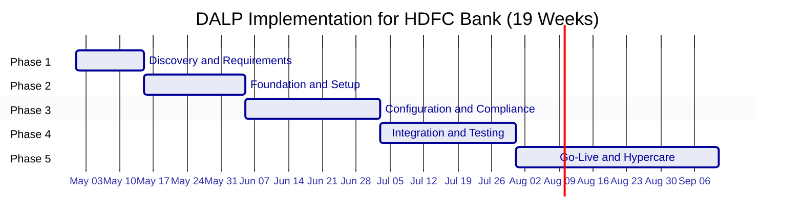

| Phase | Duration | Focus | Key Outcome |
|-------|----------|-------|-------------|
| 1. Discovery and Requirements | 2 weeks | Requirements capture, architecture design, regulatory mapping | Validated requirements, target architecture |
| 2. Foundation and Setup | 3 weeks | Environment provisioning, network setup, identity framework | Functional platform environments |
| 3. Configuration and Compliance | 4 weeks | Asset types, compliance modules, operational workflows | Configured platform matching requirements |
| 4. Integration and Testing | 4 weeks | System integration, functional/security/performance/UAT | Validated, integrated system |
| 5. Go-Live and Hypercare | 6 weeks | Production deployment + post-go-live support | Production system with knowledge transfer |

### 10.2 Phase 1: Discovery and Requirements

**Stakeholder Interviews.** Structured sessions with HDFC Bank's treasury operations, technology leadership, compliance and risk officers, internal audit, legal counsel, and end users. Each session is documented and shared for validation within 48 hours.

**Regulatory and Compliance Mapping.** Documentation of applicable requirements across RBI technology risk management guidelines, SEBI regulations for digital securities, CERT-In cybersecurity framework, FEMA for GIFT City instruments, and HDFC Bank's internal TRM framework. Each requirement is mapped to specific DALP compliance module types, producing the compliance configuration blueprint for Phase 3.

**Architecture Design.** Target architecture document covering deployment topology (private cloud recommended), network selection (Hyperledger Besu recommended), custody integration model (HSM recommended), identity provider integration (HDFC Bank's existing KYC systems), and external system connectivity.

### 10.3 Phase 2: Foundation and Setup

**Environment Provisioning.** Helm-based DALP deployment into HDFC Bank's cloud environment. Three environments (development, staging, production) provisioned with separate blockchain network instances. SettleMint provides deployment runbooks and configuration templates.

**Network Configuration.** Hyperledger Besu network initialized with HDFC Bank-controlled validator nodes. Network topology, consensus parameters, and access controls configured per the architecture design from Phase 1.

**Identity Framework.** OnchainID identity registry deployed and integrated with HDFC Bank's KYC system. Identity claim schemas defined for HDFC Bank's investor categories (QIB, HNI, retail, FPI at GIFT City).

### 10.4 Phase 3: Configuration and Compliance

**Bond Template Configuration.** DALPAsset bond templates configured for HDFC Bank's target instrument types: domestic INR bonds, GIFT City USD/EUR instruments, and hybrid structures. Compliance module combinations validated against SEBI and FEMA requirements.

**Workflow Configuration.** Primary market issuance workflows, secondary market transfer workflows, and corporate action workflows configured in the Asset Console. HDFC Bank's approval chains (maker-checker for GOVERNANCE_ROLE operations) configured in the access control layer.

**Integration Configuration.** Finacle integration for GL reconciliation and customer data sync. KYC system integration for identity claim issuance. Payment rail integration for DvP settlement. Reporting integrations for SEBI and RBI submissions.

### 10.5 Governance and Risk Considerations

The implementation programme includes explicit governance provisions for HDFC Bank's internal review processes:

- Architecture review board documentation package (provided end of Phase 2)
- Third-party technology risk assessment pack (ISO 27001, SOC 2 Type II, penetration test report, smart contract audit report)
- Regulatory examination documentation covering RBI TRM compliance mapping and CERT-In control coverage
- Business continuity and disaster recovery runbooks
- Operational runbooks for all standard and exception workflows

---

## Support and Service Levels

### 11.1 Support Tier Recommendation

SettleMint recommends the **Enterprise Support** tier for HDFC Bank's production deployment, reflecting the mission-critical nature of the programme and India's regulatory expectations for financial market infrastructure.

| Attribute | Enterprise Support |
|-----------|-------------------|
| Coverage Hours | 24/7/365 |
| Support Channels | Email, support portal, dedicated Slack/Teams, phone, video escalation |
| Named Contacts | Unlimited authorized contacts |
| Uptime SLA | 99.99% monthly (managed infrastructure) |
| Incident Management | Dedicated incident manager for P1/P2; war-room escalation for P1 |
| Platform Updates | Continuous delivery with staged rollouts; early access environments |
| Proactive Monitoring | Full-stack observability with SettleMint-managed alerting and capacity planning |
| Designated Support Team | Named team with deep familiarity of HDFC Bank's deployment |
| Solution Architect Access | Quarterly architecture reviews and optimization recommendations |
| Account Management | Bi-weekly operational review; named Customer Success Manager |

### 11.2 SLA Response Times

| Priority Level | Definition | Initial Response | Status Update | Resolution Target |
|----------------|-----------|-----------------|---------------|-------------------|
| P1 Critical | Production outage, data integrity risk | 15 minutes | Every 30 minutes | 4 hours |
| P2 High | Material functionality impaired | 1 hour | Every 2 hours | 8 hours |
| P3 Medium | Non-critical functionality impaired | 4 hours | Daily | 48 hours |
| P4 Low | Documentation, enhancements | 1 business day | Weekly | Next release |

### 11.3 India Time Zone Coverage

SettleMint operates support teams across European and Asia-Pacific time zones. For HDFC Bank's deployment, support coverage includes India Standard Time (IST) business hours with escalation paths to 24/7 coverage for P1 incidents. A designated support engineer with familiarity with HDFC Bank's deployment configuration will be assigned.

### 11.4 Training Programme

The training programme for HDFC Bank's teams includes:

- **Platform administration training** (2 days): environment management, user administration, monitoring and alerting
- **Operations training** (1 day): daily operational workflows, exception handling, reconciliation procedures
- **Compliance officer training** (1 day): compliance module management, regulatory report generation, audit trail queries
- **Developer integration training** (2 days): API integration, SDK usage, webhook configuration, testing patterns
- **Train-the-trainer** sessions for HDFC Bank's internal training capability

All training materials are provided in written form for ongoing reference. Training sessions are conducted on-site or remotely depending on HDFC Bank's preference.

---

## Appendix: Diagrams and Technical Reference

### A.1 Token Issuance Flow

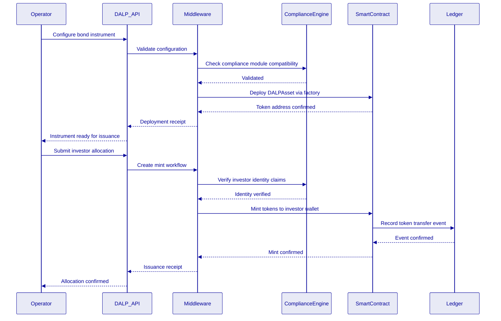

### A.2 Security Architecture Summary

| Layer | Control | Implementation |
|-------|---------|---------------|
| Identity | OnchainID ERC-734/735 | KYC claims bound to investor wallet |
| Authentication | Better Auth + MFA | Passkeys, LDAP, OIDC integration |
| Authorization | Role-based access control | Granular per-function permissions |
| Transaction signing | HSM-backed Key Guardian | Keys never leave hardware boundary |
| Network | TLS 1.3 + private VPN | All inter-service communication encrypted |
| Smart contract | Compliance engine fail-closed | Transfers blocked without valid claims |
| Certifications | ISO 27001, SOC 2 Type II | Annually audited and attested |

### A.3 Data Flow Diagram

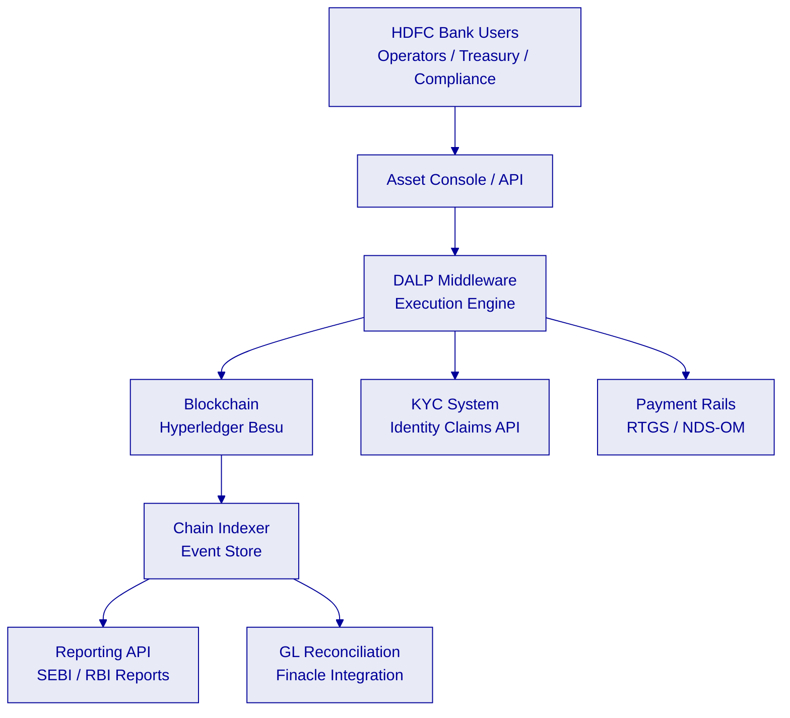

### A.4 Compliance Module Decision Matrix

| Instrument Type | Identity Verify | Country Restrict | Investor Limit | Time Lock | Transfer Approval |
|----------------|----------------|-----------------|----------------|-----------|------------------|
| Domestic INR Bond (QIB) | 🟢 Required | 🟢 India only | 🟢 QIB count cap | 🟡 Optional | 🟡 Optional |
| GIFT City USD Bond (FPI) | 🟢 Required | 🟢 FPI eligible only | 🟡 Optional | 🟡 Optional | 🟡 Optional |
| Private Placement Note | 🟢 Required | 🟡 Optional | 🟢 ≤200 holders | 🟢 Lock-up period | 🟢 Trustee approval |
| Zero-Coupon Bond | 🟢 Required | 🟡 Optional | 🟡 Optional | 🟡 Optional | 🟡 Optional |

🟢 Native | 🟡 Configurable | 🔴 Gap | ⚪ N/A

---

### A.5 Compliance Requirements Matrix

| RFP Requirement ID | Requirement Description | Proposal Section | DALP Capability | Status |
|-------------------|------------------------|-----------------|-----------------|--------|
| SOW-1 | Discovery and target-state architecture | 10.2 Phase 1 | Implementation methodology | 🟢 Native |
| SOW-2 | Current-state assessment | 10.2 Phase 1 | Discovery workshops | 🟢 Native |
| SOW-3 | Solution design and control mapping | 10.3 Phase 2 | Architecture design | 🟢 Native |
| SOW-4 | Workflow configuration | 10.4 Phase 3 | Asset Console + API | 🟢 Native |
| SOW-5 | Integration with enterprise systems | 7.2-7.5 Integration | API integration layer | 🟢 Native |
| SOW-6 | Environment setup and DevSecOps | 8.1-8.3 Deployment | Helm-based automation | 🟢 Native |
| SOW-7 | Testing support (SIT, UAT, performance) | 10.4 Phase 4 | Test environment provision | 🟢 Native |
| SOW-8 | Operational readiness and runbooks | 10.5 Phase 5 | Runbook delivery | 🟢 Native |
| SOW-9 | Documentation for ARB and audit | 10.5 Governance | ARB documentation pack | 🟢 Native |
| REG-1 | RBI technology risk management | 6.1 RBI TRM | Defense-in-depth security | 🟢 Native |
| REG-2 | SEBI compliance framework | 6.2 SEBI Compliance | Compliance modules | 🟢 Native |
| REG-3 | CERT-In cybersecurity | 6.3 CERT-In | Security architecture | 🟢 Native |
| REG-4 | FEMA compliance at GIFT City | 6.4 FEMA | Country restriction modules | 🟢 Native |
| REG-5 | IFSCA regulatory framework | 6.5 IFSCA | Sandbox-ready controls | 🟢 Native |
| TECH-1 | Smart contract compliance engine | 4.2 SMART Protocol | ERC-3643 compliance engine | 🟢 Native |
| TECH-2 | On-chain identity management | 4.2 Identity | OnchainID ERC-734/735 | 🟢 Native |
| TECH-3 | Key management and custody | 9.3 Key Management | HSM, DFNS, Fireblocks | 🟢 Native |
| TECH-4 | Audit trail and reporting | 7.5 Reporting | Chain Indexer + API | 🟢 Native |
| TECH-5 | DvP settlement | 5.4 Primary Market | XvP Settlement addon | 🟢 Native |
| INT-1 | Core banking integration (Finacle) | 7.2 CBS Integration | REST/SFTP API | 🟡 Integration-dependent |
| INT-2 | KYC/AML integration | 7.3 KYC Integration | Identity claims API | 🟡 Integration-dependent |
| INT-3 | Payment rail integration (RTGS) | 7.4 Payment Rails | ISO 20022 / webhook | 🟡 Integration-dependent |
| INT-4 | NDS-OM integration | 7.4 Payment Rails | API integration | 🟡 Integration-dependent |

🟢 Native: Available in DALP out of the box
🟡 Integration-dependent: Available but requires client-side system integration
🔴 Gap: Not currently available

---

*This proposal is submitted by SettleMint NV in response to HDFC-BANK-RFP-202603. All capability claims map to verified DALP platform capabilities. SettleMint is prepared to provide technical deep-dives, platform demonstrations, and reference client introductions at HDFC Bank's request.*

*Classification: Confidential, for evaluation purposes only. Not for distribution outside the HDFC Bank evaluation committee.*
