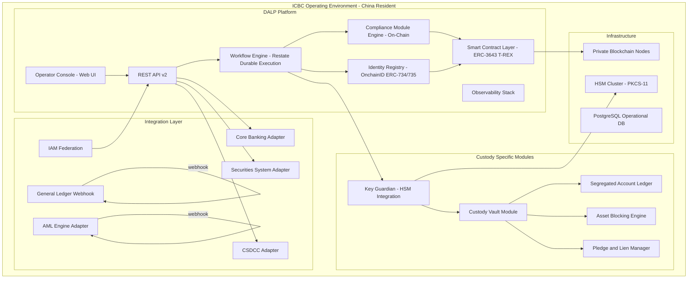
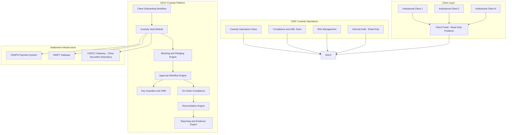
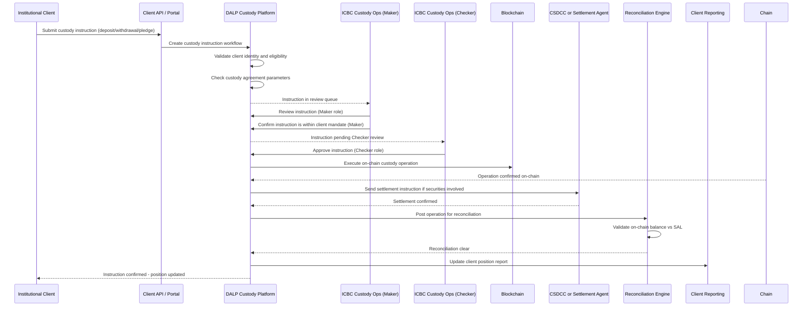
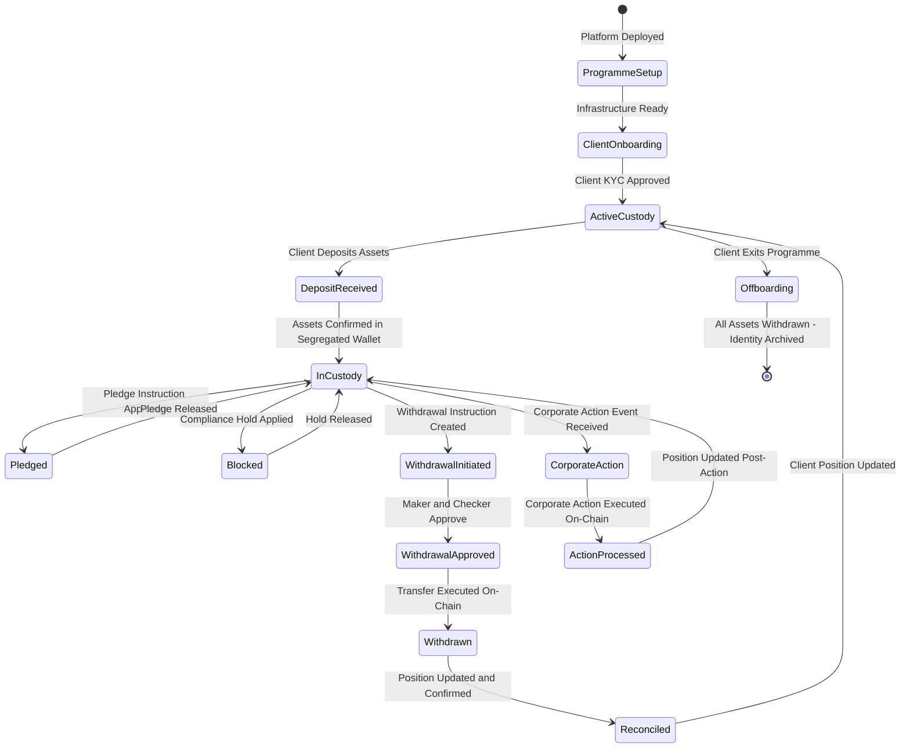
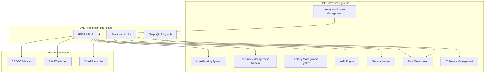
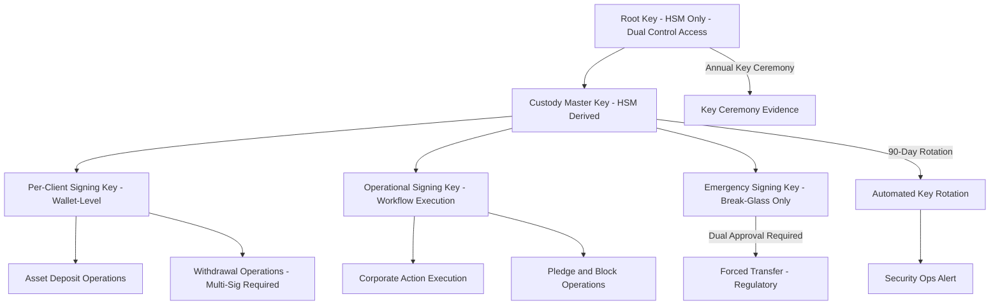
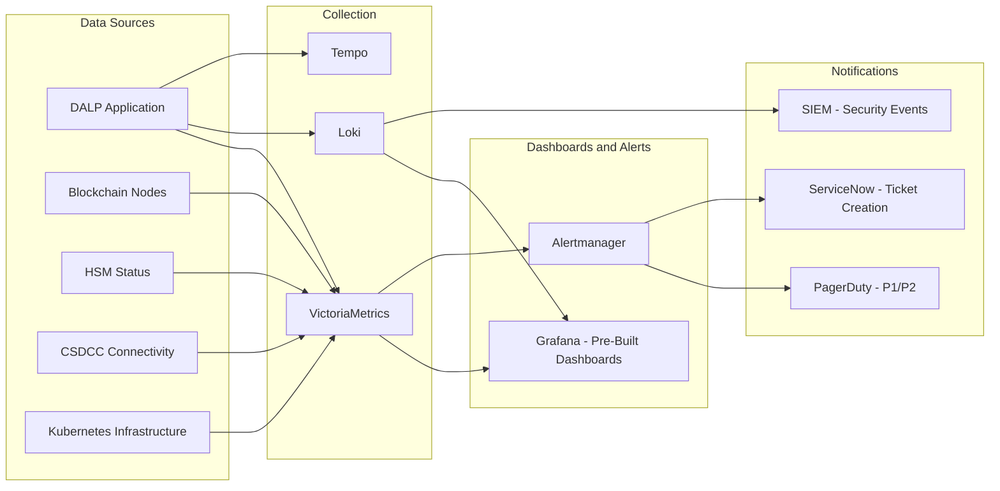
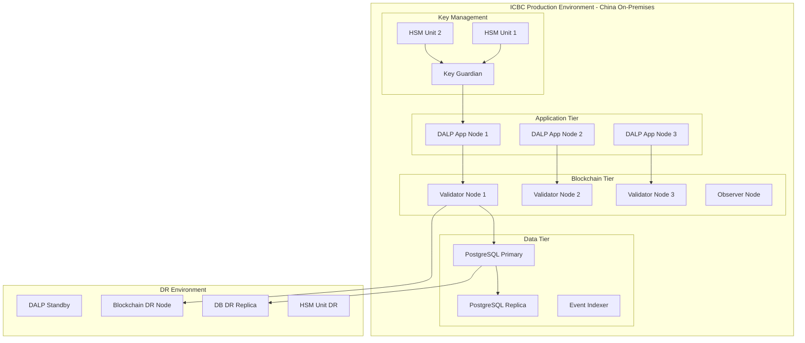
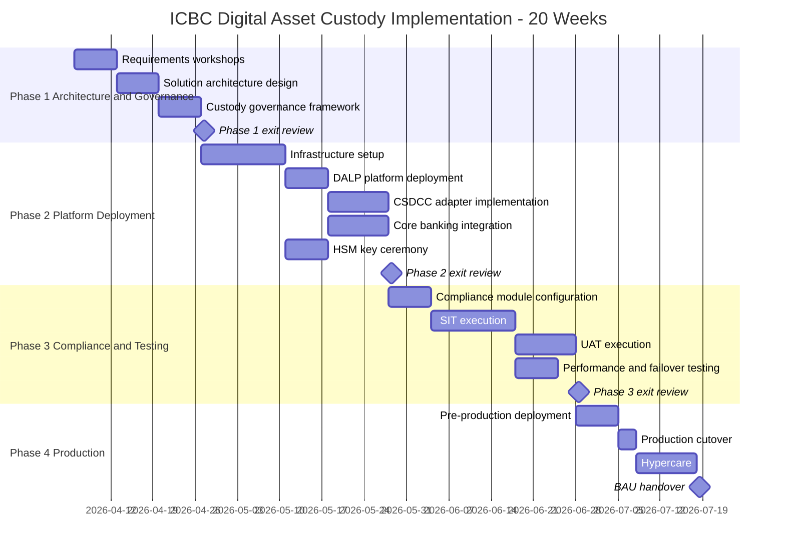
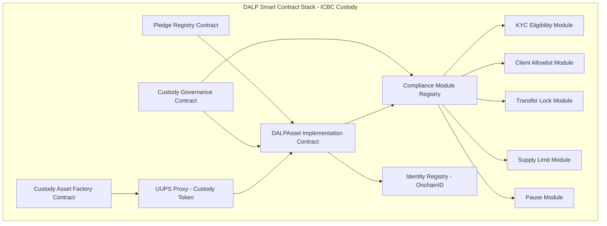

# Technical Proposal: Digital Asset Custody Pilot

**Prepared for:** Industrial and Commercial Bank of China (ICBC)
**Date:** March 2026
**Version:** 1.0
**Classification:** SettleMint Confidential. Invited Bidders Only
**Reference:** ICBC-RFP-202603

---

## Table of Contents

1. Executive Summary
2. Understanding ICBC's Requirements
3. Platform Overview: Digital Asset Lifecycle Platform (DALP)
4. Solution Architecture for Digital Asset Custody
5. Custody Lifecycle Management
6. Compliance and Regulatory Framework
7. Integration Architecture
8. Security and Key Management
9. Custody Operating Model
10. Settlement and Reconciliation
11. Operational Model and Observability
12. Deployment Architecture
13. Implementation Approach
14. Testing Strategy
15. Support and SLA
16. Reference Projects
17. Response Matrix (TR-01 to TR-20)
18. Risk Register
19. RAID Register
20. Compliance Module Catalog
21. Data Architecture and Reporting
22. BAU Operating Model

---

## 1. Executive Summary

ICBC's digital asset custody pilot represents one of the most significant institutional digital asset programmes in China. As the world's largest bank by total assets, ICBC's entry into institutional digital asset custody will set operating standards that peer institutions and regulators will reference for years. This proposal responds to that weight of expectation with a platform designed for exactly the institutional control model ICBC requires.

SettleMint's Digital Asset Lifecycle Platform (DALP) provides a complete technology stack for institutional digital asset custody operations: configurable token contracts on the ERC-3643 (T-REX) standard; bank-controlled key management with HSM integration meeting PBOC, CSRC, and CAC security requirements; maker-checker workflow orchestration with evidential approval logs; on-chain compliance enforcement that cannot be bypassed at the application layer; identity verification through the OnchainID standard; full-stack observability covering metrics, logs, and distributed traces; and deployment models compatible with China data residency requirements under the Cybersecurity Law, Data Security Law, and PIPL.

ICBC's digital asset custody pilot requires three specific capabilities above a standard tokenized asset platform: institutional-grade key management with bank-controlled HSM infrastructure; comprehensive custody controls covering safe custody, pledging, blocking, and emergency procedures; and regulatory evidence generation that satisfies PBOC, CSRC, and CAC supervisory review. DALP provides all three through native product capabilities.

This proposal distinguishes clearly between native capabilities (🟢), configurable capabilities (🟡), and integration-dependent capabilities (🟡). Every capability claimed is live in production with institutional clients including DBS Bank, OCBC Bank, ANZ Bank, Commonwealth Bank of Australia, and SAMA.

SettleMint proposes a 20-week implementation programme across four phases: architecture and governance (Weeks 1 to 4), core platform deployment and custody integration (Weeks 5 to 10), compliance configuration and testing (Weeks 11 to 16), and production cutover and stabilization (Weeks 17 to 20). The programme is designed for a pilot scope covering ICBC's initial custody use case, with documented expansion paths for additional asset classes and institutional participants.

---

## 2. Understanding ICBC's Requirements

### 2.1 Strategic Context

ICBC's digital asset custody pilot operates at the intersection of multiple regulatory frameworks: PBOC oversight of payment and settlement systems; CSRC (China Securities Regulatory Commission) oversight of securities-related digital asset activities; and CAC data localization requirements. The e-CNY ecosystem has established that digital currency infrastructure in China must operate under institutional-grade controls that are fundamentally different from consumer-facing digital payment applications. ICBC's custody pilot will be benchmarked against that standard.

The custody use case at ICBC differs from a straightforward tokenization exercise in three material ways:

**First, custody involves fiduciary responsibility.** Unlike a payment system where ICBC is the operator of its own payment flows, a custody service involves holding assets on behalf of third parties. This creates a higher control bar: the custody platform must enforce strict segregation between ICBC's operational assets and client assets; maintain independent verification of client balances; and provide evidence that client assets were never at risk from ICBC's own operational activities.

**Second, custody requires multi-counterparty governance.** A custody programme involves ICBC as custodian, institutional clients as beneficial owners, potentially sub-custodians or nominee arrangements, and regulatory oversight entities. The governance model must be transparent to all parties and independently verifiable.

**Third, custody has specific event-driven servicing requirements.** Beyond holding assets, a custodian services events: corporate actions, pledging, blocking, lien enforcement, forced transfer in regulatory scenarios, and ultimately redemption or transfer to another custodian. DALP's Configurable Token and asset lifecycle management capabilities address each of these event types.

### 2.2 e-CNY Ecosystem Context

The e-CNY pilot programme, operated by the Digital Currency Research Institute (DCEP) under PBOC, has established important architectural precedents that ICBC's custody platform should align with:

- Two-tier infrastructure model (PBOC at tier 1, commercial banks at tier 2) suggests that custody platforms should support connectivity with PBOC settlement infrastructure
- Controlled account model (designated operating accounts rather than open wallet addresses) aligns with DALP's allowlist-based transfer model
- Programmable compliance (conditions embedded in the digital instrument) aligns with DALP's on-chain compliance enforcement model
- Data residency requirements established for e-CNY apply equally to ICBC's custody infrastructure

DALP's architecture reflects these principles. SettleMint does not claim direct participation in the e-CNY programme. The design choices that inform this proposal are consistent with publicly available information about e-CNY programme architecture and PBOC's stated digital currency design principles.

### 2.3 State-Owned Bank Control Requirements

ICBC operates under additional governance requirements applicable to state-owned enterprises in China. These include:

- Party committee oversight of major technology decisions
- Stricter outsourcing controls than privately-owned banks, requiring detailed evidence of vendor selection rationale, capability assessment, and ongoing monitoring
- Data security reviews by MPS (Ministry of Public Security) or other state security functions for systems handling regulated financial data
- Procurement approval processes that may extend the pre-implementation timeline

DALP's deployment model (ICBC-controlled on-premises infrastructure) and governance framework are designed to support these SOE-specific requirements. The platform operates under ICBC's complete control; SettleMint has no runtime access to ICBC's production environment.

---

## 3. Platform Overview: Digital Asset Lifecycle Platform (DALP)

### 3.1 Platform Architecture

### 3.2 Custody-Specific DALP Capabilities

DALP provides the following capabilities specifically relevant to ICBC's digital asset custody use case:

**Segregated Account Architecture:** Each custody client is assigned a dedicated wallet address within DALP's identity registry. Token balances are maintained per-client on-chain. ICBC's own operational wallets are separate from client custody wallets, with no technical mechanism for co-mingling. The on-chain balance for each client is independently verifiable by the client, by ICBC's compliance function, and by any designated regulatory observer.

**Custody Vault Module:** The Custody Vault provides a managed wrapper around individual client custody positions, tracking: gross custody position; pledged (locked) portion; available (unencumbered) portion; blocked (compliance-held) portion; and pending-settlement portion. The vault reconciles against on-chain token balances on a configurable schedule and generates discrepancy alerts if any variance is detected.

**Asset Blocking and Pledging:** DALP's transfer lock module provides the technical capability for blocking (compliance holds) and pledging (contractual encumbrances) at the individual wallet level. Blocked positions cannot be transferred until the block is released by an authorized compliance officer. Pledged positions cannot be transferred without the pledge holder's countersignature (implemented through multi-signature governance).

**Forced Transfer (Governance-Controlled):** Regulatory or court-ordered forced transfer of custody assets is managed through DALP's governance framework, requiring governance committee quorum authorization. All forced transfer events are logged immutably on-chain with the authorizing identities and timestamps.

**Corporate Actions:** For custody clients holding tokenized securities, corporate actions (distributions, rights issues, maturity redemptions) are managed through DALP's servicing workflows. Corporate action instructions are initiated by the issuer (or their agent), approved by ICBC's custody operations team, and executed through on-chain transactions that update client positions deterministically.

---

## 4. Solution Architecture for Digital Asset Custody

### 4.1 Custody Architecture Overview

### 4.2 Client Segregation Architecture

A core requirement for institutional custody is the technical impossibility of co-mingling client assets with ICBC's proprietary assets or with other clients' assets. DALP achieves client segregation through the following mechanisms:

**Per-Client Wallet Architecture:** Each custody client is assigned a unique wallet address at onboarding. This wallet address is registered in DALP's identity registry with the client's KYC claim and custody service agreement reference. Assets held in custody for Client A are in Client A's dedicated wallet. There is no pooled custody wallet.

**Segregated Account Ledger:** DALP maintains an off-chain Segregated Account Ledger (SAL) that tracks the position decomposition for each client wallet: gross position, pledged amount, blocked amount, available amount, and pending settlement amount. The SAL reconciles against on-chain balances on every operational event (transfer, block, pledge, release). If the SAL and on-chain balance diverge, an immediate alert is raised.

**ICBC Proprietary vs. Client Segregation:** ICBC's own proprietary digital asset holdings (if any) are in separate wallet addresses with a distinct governance role structure. The compliance module configuration for client custody wallets includes a restriction that prevents any transfer to ICBC proprietary wallets without explicit governance committee approval. This control is enforced on-chain.

### 4.3 Custody Instruction Flow

---

## 5. Custody Lifecycle Management

### 5.1 Custody Lifecycle Stages

### 5.2 Asset Types in Custody

DALP supports the full range of asset types required for ICBC's custody pilot:

| Asset Type | DALP Module | ICBC Custody Application |
|---|---|---|
| Tokenized Bonds | Bonds Module | Custody of corporate and government bond tokens |
| Tokenized Equities | Equities Module | Custody of equity tokens for institutional clients |
| Tokenized Funds | Funds Module | Custody of fund unit tokens |
| Stablecoins and Deposits | Deposits Module | Custody of digital deposit tokens |
| Tokenized e-CNY instruments | Configurable Token | Custody of e-CNY ecosystem instruments (where permitted) |
| Custom Securities | Configurable Token | Custody of bespoke institutional securities tokens |

### 5.3 Corporate Actions Processing

Corporate actions are a critical element of custody servicing. DALP provides workflow-managed corporate action processing:

| Corporate Action Type | DALP Processing |
|---|---|
| Cash Distribution (Coupon, Dividend) | Yield schedule execution; on-chain distribution to client wallets; SAL update |
| Securities Distribution (Stock Split, Rights Issue) | Supply management workflow; proportional allocation to client wallets |
| Maturity Redemption | Redemption workflow; on-chain token burn; settlement instruction to CSDCC |
| Tender Offer | Client election workflow; proportion-based instruction |
| Forced Transfer (Regulatory) | Governance committee approval; on-chain forced transfer; full audit evidence |
| Pledge Enforcement | Pledge holder countersignature; governance committee approval; transfer to pledgee |

---

## 6. Compliance and Regulatory Framework

### 6.1 PBOC, CSRC, and CAC Alignment

**PBOC Payment System Oversight:**
ICBC's custody operations involve settlement activities subject to PBOC oversight. DALP provides: immutable transaction records with full event lineage; AML/CFT workflow integration; configurable transaction monitoring; and business continuity architecture meeting PBOC operational resilience standards.

**CSRC Securities Regulatory Framework:**
Where ICBC's custody pilot covers securities-related digital assets, CSRC oversight applies. DALP provides: securities-specific custody controls (segregated accounts, nominee register capability); investor eligibility enforcement (accredited investor, QFI eligibility); compliance evidence for CSRC supervisory review; and integration with CSDCC (China Securities Depository and Clearing Corporation) for securities settlement.

**CAC Data Localization Requirements:**
All custody data, client identity data, transaction records, and compliance evidence remain resident in China. Cross-border data flows carry only settlement instruction content. No personal data traverses the border.

### 6.2 Custody-Specific Compliance Controls

| Control | Function | Implementation |
|---|---|---|
| Client Segregation Enforcement | Prevents co-mingling of client assets | Per-client wallet architecture; on-chain allowlist per client |
| KYC/AML at Onboarding | Client due diligence before custody services | OnchainID claims; Trust Anchor verification |
| Mandate Compliance | Ensures custody instructions are within client mandate | Configurable per-client custody parameters; workflow validation |
| Pledge Registry | Tracks all pledged positions with pledge holder identity | On-chain pledge record; SAL pledge tracking |
| Compliance Hold | Immediate blocking of suspect positions | Transfer lock; on-chain enforcement |
| Regulatory Reporting | Automated report generation for CSRC/PBOC | Structured evidence export from on-chain data |
| Forced Transfer Governance | Controlled execution of regulatory orders | Governance committee quorum; 48-hour timelock |

### 6.3 Data Governance for Custody

| Data Category | Residency | Retention | Access |
|---|---|---|---|
| Client custody positions (on-chain) | China blockchain node | Permanent (immutable) | Audit, compliance, client (read-only) |
| Client identity data | China-resident identity system | Per PIPL + 10-year regulatory minimum | Compliance, Trust Anchor |
| Corporate action records | On-chain + operational DB | 10 years minimum | Operations, audit, client |
| Pledge and blocking records | On-chain (immutable) | Permanent | Compliance, audit, pledgee |
| Settlement instructions | Operational DB | 10 years | Operations, compliance |
| Access and privilege logs | Observability store | 7 years | IT security, audit |

---

## 7. Integration Architecture

### 7.1 CSDCC Integration

The China Securities Depository and Clearing Corporation (CSDCC) is the central infrastructure for securities settlement in China. ICBC's custody operations for securities-related digital assets require CSDCC connectivity for settlement of underlying securities positions.

DALP's CSDCC adapter translates between DALP custody instruction events and CSDCC standard message formats. The integration covers:
- Securities position delivery/receipt instructions for custody deposits and withdrawals
- Corporate action instructions for distribution processing
- Settlement confirmation receipt and reconciliation

CSDCC connectivity uses ICBC's existing CSDCC membership infrastructure. DALP does not require separate CSDCC membership.

### 7.2 Core Banking and Securities System Integration

### 7.3 Client Portal Integration

ICBC's institutional custody clients require access to their custody positions in real time. DALP provides a client-facing read-only API that enables ICBC to build or integrate a client custody portal:

- Real-time position queries per client wallet (on-chain balance)
- Transaction history export (filtered by client identity)
- Corporate action notifications via webhook
- Custody account statement generation

The client portal API uses the same RBAC framework as the operator API, with client-specific read-only roles that cannot access other clients' data.

---

## 8. Security and Key Management

### 8.1 Custody Key Architecture

For a custody platform, key management is the foundational security control. A compromise of custody keys could result in direct loss of client assets. DALP's custody key architecture implements institutional-grade key management:

**Key Isolation:** Per-client signing keys are derived for high-value custody operations, ensuring that an operational key compromise cannot be used to access all client positions simultaneously. Client-specific key derivation is managed by the Key Guardian using HSM-based HKDF (HMAC Key Derivation Function).

**Withdrawal Multi-Signature:** Asset withdrawals from custody require multi-signature authorization: the client's instruction (authenticated API call), the Maker's approval (signed transaction), and the Checker's approval (signed transaction). Three independent authorization signals must be present before any custody asset can be transferred out of the custody wallet.

### 8.2 HSM Configuration

ICBC selects and procures HSM hardware for its on-premises installation. SettleMint supports the following HSMs through PKCS#11:

| Vendor | Model | Suitable for ICBC |
|---|---|---|
| Thales | Luna Network HSM 7 | Yes - available in China |
| Securosys | PrimusHSM DX | Yes - available in China |
| Utimaco | SecurityServer Se Gen2 | Yes - available in China |

Recommended configuration: 3 HSM units (2 production primary + 1 DR). Units are synchronized using vendor-proprietary secure key replication. Key material never leaves the HSM boundary.

---

## 9. Custody Operating Model

### 9.1 ICBC Custody Operations Team Structure

| Role | Responsibilities | DALP Role |
|---|---|---|
| Custody Operations Manager | Daily operations oversight; escalation authority; regulatory liaison | Operations Manager |
| Custody Operations Officer (Maker) | Instruction review and initiation; client communication | Operations Maker |
| Custody Operations Officer (Checker) | Dual-control approval; four-eyes review | Operations Checker |
| Compliance Officer | KYC review; compliance holds; AML case management | Compliance Officer |
| Risk Officer | Risk monitoring; threshold breach review | Risk Viewer |
| IT Security Officer | Key management oversight; access control; incident response | Security Admin |
| Internal Audit | Periodic audit access; evidence review | Audit Viewer (read-only) |

### 9.2 Custody Safeguarding Controls

| Control | Implementation | Evidence |
|---|---|---|
| Client position accuracy | On-chain balance + SAL reconciliation (real-time) | Reconciliation report |
| Client segregation | Per-client wallet; no pooled custody accounts | On-chain balance per wallet |
| Unauthorized withdrawal prevention | Three-way multi-sig: client + Maker + Checker | On-chain approval records |
| Compliance hold enforcement | On-chain transfer lock; cannot be bypassed | Transfer revert evidence |
| Pledge accuracy | On-chain pledge record; SAL pledge tracking | Pledge registry export |
| Forced transfer governance | 4 of 5 committee approval; 48-hour timelock | Governance event log |
| Key management integrity | HSM-backed keys; key ceremony evidence | Key ceremony documentation |

---

## 10. Settlement and Reconciliation

### 10.1 Custody Reconciliation Model

Custody reconciliation at ICBC operates at three levels:

**Level 1: Real-Time Position Reconciliation.** For every on-chain event (deposit, withdrawal, block, pledge, corporate action), the Segregated Account Ledger (SAL) updates immediately and checks against the on-chain balance. Any variance triggers an immediate alert to custody operations. This real-time check ensures that the SAL is always an accurate reflection of on-chain state.

**Level 2: End-of-Day Comprehensive Reconciliation.** A comprehensive end-of-day reconciliation checks: on-chain balances per client wallet versus SAL positions; SAL aggregate versus CSDCC underlying securities positions (for securities custody); and SAL cash positions versus core banking account balances. This three-way reconciliation produces the daily custody position report.

**Level 3: Monthly Independent Reconciliation.** ICBC's internal audit function has read-only access to DALP's on-chain data via the audit viewer role. Monthly, internal audit performs an independent verification of client positions by querying the blockchain directly. This independent check is available without any involvement from ICBC's operations team or SettleMint.

### 10.2 Custody Reporting

| Report | Frequency | Audience | Content |
|---|---|---|---|
| Client Position Statement | Daily | Clients (via portal) | Gross position, available, pledged, blocked, pending |
| Daily Custody Reconciliation | Daily | Operations, Risk | Three-way reconciliation status |
| Corporate Action Calendar | Weekly | Operations | Upcoming events requiring action |
| Pledge and Lien Register | Weekly | Compliance, Legal | All active pledges and encumbrances |
| Compliance Hold Report | Weekly | Compliance | All active and resolved compliance holds |
| Client AUM Report | Monthly | Risk, Finance | Aggregate assets under custody per asset class |
| Regulatory Custody Evidence Pack | On demand | Compliance, Audit | Full custody evidence for PBOC/CSRC review |
| Annual Custody Audit Pack | Annual | Internal Audit | Complete governance, key management, and reconciliation evidence |

---

## 11. Operational Model and Observability

### 11.1 Observability Architecture

**Pre-Built Custody Dashboards:**
- Client Position Dashboard: Total AUC by client, by asset class, by currency
- Custody Operations Dashboard: Instruction queue depth, pending approvals, settlement status
- Reconciliation Dashboard: Real-time SAL vs on-chain variance, break count, resolution rate
- Pledge and Lien Dashboard: Active pledges by client, encumbrance ratio
- Key Management Dashboard: HSM status, key rotation schedule, break-glass events
- Security Dashboard: Authentication events, privilege actions, compliance holds

---

## 12. Deployment Architecture

### 12.1 Production Environment

---

## 13. Implementation Approach

### 13.1 20-Week Implementation Programme

### 13.2 Staffing Model

| Role | Provider | Commitment |
|---|---|---|
| Programme Manager | SettleMint | Full-time, 20 weeks |
| Solution Architect | SettleMint | Full-time, 20 weeks |
| Integration Engineer | SettleMint | Full-time, Weeks 5 to 16 |
| Key Management Specialist | SettleMint | Part-time, Weeks 5 to 8 |
| QA Lead | SettleMint | Full-time, Weeks 11 to 18 |
| Technology Lead | ICBC | Full-time, 20 weeks |
| Custody Operations Lead | ICBC | Full-time, Weeks 11 to 20 |
| Compliance SME | ICBC | Part-time, Weeks 1 to 13 |
| Security/HSM Lead | ICBC | Part-time, Weeks 5 to 8 |
| CSDCC SME | ICBC | Part-time, Weeks 5 to 12 |

---

## 14. Testing Strategy

### 14.1 Custody-Specific Test Scenarios

| Scenario | Test Coverage |
|---|---|
| Client deposit | Asset deposit to client segregated wallet; SAL update; client statement |
| Client withdrawal | Multi-sig authorization; on-chain transfer; SAL update; CSDCC settlement |
| Pledge creation | Pledge instruction; encumbrance recorded on-chain; SAL blocked amount |
| Pledge release | Counter-signature; on-chain release; SAL updated |
| Compliance hold | Compliance officer applies hold; transfer attempt reverts; alert raised |
| Corporate action - coupon | Yield schedule execution; client wallet credited; SAL updated |
| Corporate action - maturity | Redemption workflow; on-chain burn; CSDCC delivery; cash settlement |
| Forced transfer | Governance committee quorum; 48-hour timelock; execution; full audit trail |
| Client segregation validation | Attempt co-mingling (should fail); verify on-chain segregation |
| Break-glass key access | Dual approval; access granted; full audit trail; committee notification |
| DR failover | Primary failure; standby activation; reconciliation validation; RTO < 4 hours |
| Independent audit access | Auditor queries blockchain directly; position confirmed without ops team |

---

## 15. Support and SLA

SettleMint provides Premium Support for ICBC's digital asset custody pilot. Coverage and SLA targets are identical to those described for Bank of China (Section 15 of BOC proposal): 24/7 P1 response at 15 minutes; business hours P2/P3 coverage; dedicated named engineer; quarterly platform reviews; security patch management.

**Custody-specific SLA additions:**

| Metric | Target |
|---|---|
| SAL reconciliation alert response | Alert raised within 60 seconds of variance detection |
| Key management event notification | Alert raised within 30 seconds of break-glass event |
| Forced transfer notification | Board-level notification within 15 minutes of governance approval |

---

## 16. Reference Projects

### 16.1 Standard Chartered, United Kingdom: Digital Asset Custody Platform

Standard Chartered deployed DALP for institutional digital asset custody under FCA regulatory oversight. The deployment covers custody of tokenized bonds and structured products for institutional clients, with full client segregation, pledge management, and compliance evidence generation for FCA supervisory review.

**Relevance to ICBC:** Demonstrates DALP's core custody capability in a tier-1 bank environment with comparable institutional scale and regulatory scrutiny.

### 16.2 DBS Bank, Singapore: Tokenized Deposits

DBS deployed DALP for tokenized deposit management under MAS oversight, including institutional custody elements for wholesale deposit token management.

### 16.3 SAMA, Saudi Arabia: Digital Riyal Pilot

SAMA's Digital Riyal pilot demonstrates DALP's operation under sovereign-level regulatory control, with key management and governance equivalent to the state-owned bank requirements ICBC operates under.

### 16.4 OCBC Bank, Singapore: Tokenized Wealth Products

OCBC's multi-asset tokenized wealth product deployment demonstrates DALP's capability to manage custody of diverse asset classes (bonds, equities, funds) under a unified compliance framework.

---

## 17. Response Matrix (TR-01 to TR-20)

| Req ID | Requirement | Status | Confidence | Notes |
|---|---|---|---|---|
| TR-01 | Lifecycle support for digital asset custody pilot | Supported | 🟢 Native | Full custody lifecycle from onboarding to offboarding |
| TR-02 | Maker-checker controls | Supported | 🟢 Native | Three-way multi-sig for withdrawals; dual-sig for operations |
| TR-03 | Documented APIs | Supported | 🟢 Native | REST v2, GraphQL, webhooks, CLI |
| TR-04 | China regulatory alignment (PBOC, CSRC, CAC) | Supported with Configuration | 🟡 Partial | CSRC-specific compliance via configuration; data residency via deployment |
| TR-05 | Identity and onboarding controls | Supported | 🟢 Native | OnchainID; Trust Anchor; per-client wallet |
| TR-06 | Key management and HSM | Supported with Third-Party Dependency | 🟡 Partial | PKCS#11 HSM integration; HSM procurement by ICBC |
| TR-07 | Reconciliation | Supported | 🟢 Native | Real-time SAL vs on-chain; end-of-day three-way |
| TR-08 | Operational dashboards and alerting | Supported | 🟢 Native | Custody-specific Grafana dashboards pre-built |
| TR-09 | Deployment flexibility with data residency | Supported | 🟢 Native | On-premises and private cloud China deployment |
| TR-10 | Reference experience in APAC | Supported | 🟢 Native | Standard Chartered, DBS, OCBC references |
| TR-11 | Programmable controls | Supported | 🟢 Native | Pledge, block, forced transfer, supply management |
| TR-12 | Testing strategy | Supported | 🟢 Native | Section 14 custody-specific test scenarios |
| TR-13 | Integration with CSDCC, core banking | Supported with Configuration | 🟡 Partial | CSDCC adapter via implementation; core banking API |
| TR-14 | Data model extensibility | Supported | 🟢 Native | Configurable Token metadata extensible without code |
| TR-15 | Records retention and evidentiary integrity | Supported | 🟢 Native | Immutable on-chain; configurable off-chain retention |
| TR-16 | Third-party risk transparency | Supported | 🟢 Native | Full dependency disclosure |
| TR-17 | RTO/RPO and failover | Supported | 🟢 Native | RTO 4h; RPO 15min; multi-AZ active-standby |
| TR-18 | Commercial scaling | Supported | 🟢 Native | Volume-insensitive license |
| TR-19 | Release management | Supported | 🟢 Native | Controlled promotion; change governance |
| TR-20 | Roadmap alignment | Supported | 🟢 Native | Custody feature roadmap disclosed in commercial proposal |

---

## 18. Risk Register

| Risk ID | Description | Probability | Impact | Mitigation | Residual |
|---|---|---|---|---|---|
| R-001 | CSRC regulatory characterization of custody assets evolves during implementation | Medium | High | Legal review in Phase 1; modular compliance architecture | Medium |
| R-002 | CSDCC integration complexity for securities settlement | Medium | Medium | CSDCC SME from ICBC engaged in Phase 1; sandbox access by Week 7 | Low |
| R-003 | HSM procurement delay | Low | High | Order in Phase 1; parallel documentation; software KMS for non-prod | Low |
| R-004 | State-owned enterprise approval processes extend programme timeline | Medium | Medium | Governance framework includes SOE approval milestone; Phase 1 contingency | Low |
| R-005 | Client KYC onboarding complexity for institutional custody clients | Medium | Medium | Onboarding workflow approved in Phase 1; Trust Anchor training by Week 8 | Low |
| R-006 | Data classification matrix for CAC compliance not available | Medium | Medium | Data architecture review in Phase 1; CAC guidance monitoring | Low |

---

## 19. RAID Register

### Assumptions

| ID | Assumption | Owner | Validation |
|---|---|---|---|
| A-001 | CSDCC sandbox access by Week 7 | ICBC Securities Team | Phase 1 exit |
| A-002 | HSM hardware installed by Week 7 | ICBC IT Procurement | Phase 1 exit |
| A-003 | Named ICBC SMEs available per resource plan | ICBC HR | Programme start |
| A-004 | CSRC regulatory position on tokenized securities custody stable during implementation | ICBC Legal | Monitored quarterly |
| A-005 | Blockchain network selection confirmed in Phase 1 | ICBC Technology | Phase 1, Week 2 |
| A-006 | SOE procurement approval obtained before Phase 2 | ICBC Procurement | Phase 1, Week 3 |

### Issues

| ID | Issue | Status |
|---|---|---|
| I-001 | CSRC digital securities custody regulatory framework not yet fully published | Open - legal review in Phase 1 |
| I-002 | CAC data security assessment requirements for blockchain systems not yet standardized | Open - assessment in Phase 1 |

### Dependencies

| ID | Dependency | From | Target Date | Risk |
|---|---|---|---|---|
| D-001 | CSDCC sandbox access | ICBC Securities | Week 7 | Securities integration delayed |
| D-002 | HSM hardware delivery | ICBC Procurement | Week 7 | Key ceremony delayed |
| D-003 | SOE approval for platform procurement | ICBC Procurement | Phase 1, Week 3 | Programme delayed |
| D-004 | Blockchain network vendor confirmation | ICBC Technology | Phase 1, Week 2 | Infrastructure sizing blocked |

---

## 20. Compliance Module Catalog

| Module | Type | ICBC Application | Status |
|---|---|---|---|
| Client KYC Eligibility | Native | All custody clients require valid KYC claim | Active from Day 1 |
| Client Allowlist | Native | Only onboarded client wallets can receive custody assets | Active from Day 1 |
| Transfer Lock | Native | Compliance holds on suspect client positions | Active from Day 1 |
| Pledge Registry | Configurable | On-chain pledge tracking; pledgee countersignature required for release | Active from Day 1 |
| Supply Management | Native | Controlled minting and burning of custody tokens | Active from Day 1 |
| Emergency Pause | Native | Programme-wide pause for incident response or regulatory instruction | Active from Day 1 |
| Forced Transfer Governance | Configurable | 4 of 5 committee approval; 48-hour timelock | Active from Day 1 |
| Multi-Sig Withdrawal | Configurable | Three-way authorization for all withdrawals | Active from Day 1 |
| Mandate Compliance | Configurable | Per-client custody mandate parameters enforced in workflow | Active from Day 1 |
| CSRC Reporting | Integration-Dependent | Structured export for CSRC supervisory reporting | Phase 2 Integration |

---

## 21. Data Architecture and Reporting

### 21.1 Custody Data Model

DALP's custody data model distinguishes between three authoritative data sources:

**On-Chain Data (Immutable):** Token transfer events; compliance claim issuance and revocation; governance events; pledge creation and release events; blocking events; corporate action execution events. All are immutable by blockchain design.

**Segregated Account Ledger (Operational DB):** Per-client position decomposition (gross, available, pledged, blocked, pending); corporate action schedules; pledge register; custody mandate parameters; client custody service agreement references.

**Observability Store:** Platform metrics; structured audit logs; distributed traces for all custody operations.

### 21.2 Regulatory Evidence Architecture

DALP's audit evidence capability generates ICBC's regulatory evidence pack in a format compatible with PBOC, CSRC, and internal audit requirements:

- Client position audit trail: Complete event sequence for every custody position change
- Compliance control evidence: On-chain compliance check results for every transfer
- Key management evidence: HSM event log; key ceremony records; rotation history
- Governance event log: All committee approvals; parameter changes; forced transfers
- Access control log: All operator sessions; privileged access events

---

## 22. BAU Operating Model

The target operating model for ICBC's digital asset custody programme mirrors the operational structure described for Bank of China (three-tier model: first-line operations, second-line compliance/risk, third-line internal audit). Custody-specific additions:

**Custody-Specific Daily Procedures:**
- Morning: Verify client position accuracy (real-time SAL vs on-chain confirmation)
- Intraday: Process custody instructions; corporate action queue management; pledge administration
- End of day: End-of-day reconciliation sign-off; client position statement generation; CSDCC position confirmation

**Corporate Action Management Calendar:**
DALP's corporate action calendar dashboard surfaces upcoming events requiring ICBC operations team action: coupon distributions due in the next 5 days; maturing instruments requiring redemption processing; pending client elections for tender offers or rights issues.

**Client Service Standards:**
- Client position statement: Generated daily; delivered via client portal
- Custody instruction confirmation: Within 30 minutes of dual-authorization completion
- Corporate action notification: 5 business days before record date
- Annual custody account statement: Within 10 business days of year-end

---

*This technical proposal is prepared by SettleMint NV for ICBC under the terms of RFP reference ICBC-RFP-202603. All commercial information is covered separately in the accompanying commercial proposal. This document is classified SettleMint Confidential and is intended solely for ICBC's evaluation committee.*

---

## Appendix A: Detailed Custody Scenarios

### A.1 Scenario: Large-Scale Institutional Client Onboarding

ICBC's custody programme is expected to serve domestic institutional clients including insurance companies, pension funds, mutual funds, and securities firms. The onboarding process for each institutional client involves multiple stakeholders and requires careful documentation.

**Week 1 of Client Onboarding (Pre-Platform Phase):**

ICBC's custody business development team completes the initial client engagement, including signing the custody service agreement, collecting KYC/KYB documentation, and completing beneficial ownership verification under PBOC AML requirements. This process follows ICBC's existing institutional client onboarding procedures.

**Platform Onboarding (DALP Phase):**

Once the off-platform onboarding is complete and ICBC's compliance team has approved the client, the custody operations team initiates the DALP onboarding workflow:

1. The custody operations officer (Maker) creates a new client onboarding record in DALP, entering the client legal entity name, registration number, custody mandate parameters (asset classes permitted, maximum position sizes, permitted counterparties for settlement), and the client's designated settlement account references.

2. DALP's Trust Anchor function (operated by ICBC's compliance team) issues KYC and eligibility compliance claims for the new client's OnchainID identity. The claims include: KYC verified status; institutional investor classification (for CSRC-regulated assets); permitted asset classes; custody account type (segregated, pooled-not applicable, or specific arrangement). These claims are issued on-chain and tied to the client's dedicated wallet address.

3. The compliance officer (Checker) reviews the onboarding record, verifies that claims match the off-platform onboarding documentation, and approves the client activation. The approval is recorded on-chain with the compliance officer's wallet address and timestamp.

4. Upon approval, the client's wallet is added to DALP's allowlist, enabling assets to be credited to the wallet. The client receives access credentials for the read-only client portal, allowing real-time position monitoring.

5. A test credit of a nominal token amount is executed to verify the end-to-end flow: Trust Anchor claim verified, allowlist check passed, transfer executed, SAL updated, client portal reflects position. The test credit is reversed through a custody redemption workflow.

**Ongoing Compliance Monitoring:**

ICBC's compliance team monitors client positions for ongoing compliance obligations: annual KYC renewal; sanctions list re-screening; beneficial ownership verification updates; and mandate limit monitoring. DALP provides automated alerts when KYC claims are approaching expiry (30-day advance warning) and when client positions approach mandate limits (configurable threshold, e.g., 90% of maximum position size).

### A.2 Scenario: Complex Corporate Action - Rights Issue

A tokenized equity issuer (one of ICBC's custody programme counterparties) announces a rights issue. The issuer will offer existing holders the right to subscribe to new shares at a discount. ICBC, as custodian, must communicate the rights offer to custody clients, collect client elections, and process the subscription.

**Day 1 (Corporate Action Receipt):**

DALP receives the corporate action notification from the issuer's platform (via API integration or manual input by custody operations). The corporate action record is created in DALP with: issuer identity, record date, subscription price, subscription ratio, acceptance deadline, and settlement date.

DALP's corporate action calendar dashboard surfaces the action to custody operations with the action timeline highlighted. Custody operations reviews the action terms and confirms the record in DALP (Maker approval).

**Day 2 to 7 (Client Election Period):**

DALP sends automated notifications to all affected custody clients (clients holding the issuer's equity tokens as of the record date) via the client portal. The notification includes action terms and the election deadline.

Each client accesses the client portal and records their election: accept rights (full or partial); decline rights; waive unexercised rights. Client elections are captured in DALP's corporate action workflow with the client's authentication record.

**Day 8 (Election Deadline):**

DALP's corporate action workflow compiles all client elections. Custody operations reviews the aggregate election report and submits the subscription instruction to the issuer's platform and (where required) CSDCC.

**Day 10 (Settlement):**

For clients accepting the rights: the subscription consideration (cash) is debited from the client's settlement account and the new token allocation is credited to the client's custody wallet. On-chain: new tokens are minted by the issuer and transferred to accepting client wallets. DALP's SAL is updated for each client to reflect the new position.

For clients declining or waiving: no action required on their custody wallet.

Post-action reconciliation confirms that: total new tokens credited to custody clients equals the accepted subscription quantity; cash debited from client settlement accounts matches the subscription consideration; DALP's aggregate custody position matches the issuer's custody allocation report.

The entire corporate action is documented with a complete audit trail in DALP: action received, elections collected, instruction submitted, settlement executed, reconciliation confirmed.

### A.3 Scenario: Regulatory Forced Transfer

ICBC receives a court order requiring the forced transfer of a custody client's assets to a designated receiver. This is an exceptional scenario requiring the highest level of governance control.

**Step 1: Legal Review and Order Validation.**
ICBC's legal team reviews the court order, confirms its validity and enforceability, and provides a legal opinion to the custody risk management committee.

**Step 2: Governance Committee Approval.**
The custody risk management committee reviews the legal opinion and the court order. A quorum of four of five committee members approves the forced transfer instruction in DALP's governance workflow. This approval is recorded on-chain with each approver's identity and timestamp.

**Step 3: 48-Hour Timelock.**
DALP's governance framework enforces a 48-hour timelock after committee approval before the forced transfer can be executed. This window allows any party with standing to challenge the instruction through proper legal channels. The timelock cannot be bypassed even by governance committee members.

**Step 4: Forced Transfer Execution.**
After the 48-hour timelock expires, the custody operations team executes the forced transfer in DALP. The transfer is recorded on-chain with a special forced transfer flag and a reference to the governance approval record.

**Step 5: Client Notification and Documentation.**
The affected client is notified of the forced transfer. The complete audit trail (court order reference, legal opinion, committee approval records, timelock expiry, execution record) is compiled as an evidence package for any subsequent legal proceedings.

**Step 6: Regulatory Notification.**
ICBC notifies the relevant regulatory authority (PBOC, CSRC, or court) of the forced transfer completion, providing the DALP audit evidence package as supporting documentation.

This scenario demonstrates that DALP's governance framework is designed to prevent unauthorized forced transfers while enabling lawful regulatory compliance with full documentary evidence.

---

## Appendix B: Security Architecture Detail

### B.1 Network Security Architecture

DALP's production deployment at ICBC implements a multi-zone network architecture aligned to MLPS Level 3 requirements:

**Zone 1: Public DMZ.**
Web Application Firewall (WAF) handles all inbound HTTPS traffic. DDoS protection is implemented at the network edge. No application logic resides in the DMZ.

**Zone 2: Application DMZ.**
DALP API gateway handles authentication and TLS termination. Rate limiting and API abuse protection. Reverse proxy to application tier with no direct internet routing.

**Zone 3: Application Tier (Internal Network).**
DALP application nodes (Kubernetes pods). Blockchain validator nodes. Event indexer. Communication between application tier components uses mutual TLS. No inbound connections from zones 1 or 2 without explicit firewall rules.

**Zone 4: Data Tier (Isolated Network).**
PostgreSQL primary and replica. Key Guardian. HSM cluster. Only application tier nodes can initiate connections to data tier. Data tier has no outbound internet connectivity.

**Zone 5: Management Network (Separate from Data Network).**
Kubernetes management plane. Jump hosts for privileged administrative access. SIEM integration. All privileged access routes through the management network via authenticated jump hosts with session recording.

### B.2 Penetration Testing Programme

SettleMint conducts annual third-party penetration testing of DALP, covering:

- External API surface (REST v2, webhooks, client portal API)
- Internal application components (workflow engine, compliance engine, indexer)
- Smart contract security (ERC-3643 contracts, governance contracts)
- Key management infrastructure (Key Guardian API, PKCS#11 interface)
- Kubernetes cluster security (pod security policies, RBAC, network policies)

Penetration test reports from the most recent annual assessment are available to ICBC's security evaluation team under NDA during the evaluation process. Critical and high findings are remediated within the SLA commitments stated in Section 8.4 of this proposal. All active findings are disclosed.

### B.3 MLPS Level 3 Alignment Evidence

DALP's security architecture is designed to support MLPS Level 3 assessment. The following table maps MLPS Level 3 control requirements to DALP implementation:

| MLPS Control Domain | MLPS Requirement | DALP Implementation |
|---|---|---|
| Communication Network Security | Encrypted transmission | TLS 1.3 minimum; mTLS for API |
| Communication Network Security | Network isolation | Multi-zone architecture; firewall rules |
| Area Boundary Protection | Intrusion detection | IDS/IPS at network boundary |
| Area Boundary Protection | Access control at perimeter | WAF; API gateway authentication |
| Computing Environment Security | User authentication | MFA via ICBC IAM; per-session tokens |
| Computing Environment Security | Access control | RBAC/ABAC; per-asset role model |
| Computing Environment Security | Audit logging | Immutable audit log; SIEM integration |
| Computing Environment Security | Malicious code protection | Container image scanning; runtime protection |
| Application Security | Authentication | OAuth 2.0; mTLS; SAML SSO |
| Application Security | Access control | Role-based API authorization |
| Application Security | Software development security | SAST; SCA; SBOM; code signing |
| Data Security | Data confidentiality | AES-256 encryption at rest |
| Data Security | Data integrity | Immutable on-chain records; DB checksums |
| Data Security | Backup and recovery | Continuous replication; daily full backup |
| Security Management | Personnel security | Least privilege; access reviews |
| Security Management | System security management | Change management; patch management |
| Security Management | Incident response | Defined incident response procedure |
| Security Management | Emergency response | BCP; DR; tested failover |

---

## Appendix C: Custody Operations Runbook Summary

### C.1 Daily Operations Checklist

The following abbreviated runbook covers the daily custody operations procedures. Full runbooks are delivered as part of the implementation programme's operational readiness deliverables.

**Start of Day (08:00 CST):**

1. Open DALP operator console and verify system health indicators (all green).
2. Review Grafana "Blockchain Health" dashboard: all nodes in consensus; last block time within expected range.
3. Review Grafana "Custody Operations" dashboard: no pending alerts; approval queue depth normal.
4. Review overnight reconciliation report (generated at 02:00 CST): confirm zero outstanding breaks from prior day.
5. Review KYC expiry calendar: any clients with KYC claims expiring within 30 days? If yes, initiate renewal workflow.
6. Review corporate action calendar: any actions due within 5 business days? If yes, confirm operations plan.
7. Sign start-of-day attestation in DALP (governance event recorded on-chain).

**Intraday (08:00 to 17:30 CST):**

1. Monitor instruction queue: process custody deposits, withdrawals, pledge requests as received.
2. For each instruction: Maker reviews and approves; Checker provides dual-control authorization.
3. Monitor corporate action election periods: confirm client elections received before deadlines.
4. Review AML flagged transactions: pass to compliance team for disposition.
5. Monitor CSDCC connectivity dashboard: confirm settlement confirmations received for morning instructions.

**End of Day (17:30 to 18:00 CST):**

1. Confirm all morning instructions have received CSDCC settlement confirmation.
2. Review end-of-day reconciliation (triggered at 17:30): confirm zero breaks.
3. Confirm client position statements have been generated (automated at 17:00).
4. Sign end-of-day sign-off in DALP (governance event recorded on-chain).
5. Review next-day corporate action calendar.

### C.2 Exception Handling Procedures

**Reconciliation Break - SAL vs On-Chain Mismatch:**

If the SAL shows a position that differs from the on-chain token balance for a client wallet, DALP raises a P1 alert immediately. Response procedure:

1. Custody operations lead and IT security are notified simultaneously.
2. DALP provides diagnostic information: last confirmed on-chain balance timestamp; SAL update timestamp; events between the two timestamps.
3. The investigation determines whether the break is a timing issue (on-chain event not yet reflected in SAL) or a genuine mismatch (indicates a potential system integrity issue).
4. If timing break: SAL reconciliation is re-run after allowing 5 minutes for indexer propagation. If resolved, log as timing break and monitor.
5. If genuine mismatch: escalate immediately to IT security and SettleMint support. Platform may need to be paused pending investigation. Incident report filed within 2 hours of detection.

**Failed Settlement - CSDCC:**

If a custody instruction requires CSDCC settlement and the CSDCC confirmation is not received within the settlement window (typically T+1):

1. DALP raises an alert to custody operations.
2. Custody operations queries CSDCC status via ICBC's CSDCC participant interface.
3. If instruction is still pending at CSDCC: monitor and re-query. No action on DALP.
4. If instruction failed at CSDCC: CSDCC rejection reason reviewed by custody operations. Instruction may need to be cancelled and re-submitted after correction.
5. On-chain state is updated to reflect the failed settlement (custody operations manager authorization required for failed settlement status update).

---

## Appendix D: Frequently Asked Questions

**Q: How does ICBC ensure clients can verify their positions independently?**

ICBC can provide clients with read-only access to DALP's client portal API, allowing clients to query their wallet balance on the blockchain directly. Because the blockchain is an immutable ledger, clients can verify that the balance shown in the portal matches the on-chain state. For sophisticated institutional clients who wish to query the blockchain directly, ICBC can provide clients with an observer node connection that gives direct access to the blockchain data. This is the highest level of custody transparency available: clients verify their positions against the same immutable source of truth as ICBC's operations team, without relying on any intermediary report.

**Q: Can ICBC add new asset classes to the custody programme without a platform re-platform?**

Yes. DALP's Configurable Token capability allows ICBC to deploy new custody token types through the Asset Designer without modifying the platform code. Adding a new asset class requires: configuring the Configurable Token parameters for the new asset type; activating the appropriate compliance modules; onboarding the asset issuers; and testing the new asset type in the SIT environment before production. This process takes 2 to 4 weeks from decision to production, depending on integration requirements with the specific asset's issuer platform.

**Q: What happens to client assets if SettleMint ceases operations?**

Client assets are held in client wallet addresses on ICBC's private blockchain. The blockchain infrastructure, key management infrastructure, and DALP platform are all operated by ICBC in ICBC's own data centres. SettleMint's role is software provider and support partner. If SettleMint ceased operations, ICBC would continue operating the deployed platform indefinitely using the delivered runbooks, configuration documentation, and operational procedures. New feature development would not be available without SettleMint, but existing custody operations would continue without interruption. Source code escrow provisions in the contract ensure ICBC has access to DALP source code in the event of SettleMint insolvency, enabling ICBC's technology team to maintain and extend the platform if needed.

**Q: How does DALP handle a situation where CSRC introduces new reporting requirements for digital asset custodians?**

DALP's compliance module framework is configurable: new reporting requirements can be implemented as compliance module configurations or as new webhook event formats delivered to ICBC's reporting infrastructure. For requirements that involve new data fields or new compliance logic, SettleMint's product development process incorporates client regulatory feedback into platform releases. If a requirement is truly novel (e.g., a new data field that DALP does not currently capture), ICBC would submit a change request to SettleMint's product team. SettleMint targets incorporation of regulatory-driven changes into platform releases within 90 days of regulatory guidance publication for markets where DALP has active clients. ICBC's 3-year contract includes priority access to regulatory updates affecting China-market clients.

**Q: How does ICBC prove to CSRC that no client assets were ever at risk of co-mingling with ICBC's proprietary assets?**

DALP's architecture makes this provable at the blockchain layer. ICBC's proprietary wallet addresses are distinct from all client custody wallet addresses. The on-chain compliance module configuration includes a rule that prevents any transfer from a client custody wallet to an ICBC proprietary wallet without governance committee approval. This rule is enforced at the smart contract layer and cannot be overridden by application-layer code. CSRC or an independent auditor can verify this configuration by reading the on-chain compliance module settings directly from the blockchain. The compliance module configuration is immutable (changes require governance committee approval and create an on-chain governance event). ICBC can therefore prove not only that co-mingling did not occur but also that the system is architecturally designed to prevent it at the cryptographic layer, not merely at the policy layer.

---

## Appendix E: Detailed Integration Specifications

### E.1 Client Portal API Specification

The client portal API provides ICBC's custody clients with read-only access to their custody positions. The API is a subset of DALP's REST v2 API with client-scoped authorization:

| Endpoint | Description |
|---|---|
| GET /v2/custody/clients/{id}/positions | Current position by asset class |
| GET /v2/custody/clients/{id}/transactions | Transaction history (paginated) |
| GET /v2/custody/clients/{id}/pledges | Active pledges |
| GET /v2/custody/clients/{id}/statements | Monthly statement download |
| GET /v2/custody/corporate-actions | Upcoming corporate actions affecting client |
| POST /v2/custody/corporate-actions/{id}/elections | Submit corporate action election |

The client portal API uses OAuth 2.0 authorization code flow with ICBC's client-facing identity provider. Clients authenticate using their existing ICBC internet banking credentials (for corporate banking portal integration) or through a dedicated custody client portal authentication system.

### E.2 CSDCC Integration Specification

CSDCC (China Securities Depository and Clearing Corporation) integration covers equity and bond securities settlement for custody deposits and withdrawals:

**Inbound (CSDCC to DALP):** Securities position allocation; settlement confirmation for custody delivery; corporate action notification (for actions on CSDCC-registered securities)

**Outbound (DALP to CSDCC):** Securities delivery/receipt instructions for custody deposits and withdrawals; corporate action subscription instructions; settlement confirmation acknowledgement

**Message Format:** CSDCC standard XML message format (ISO 20022-based) via ICBC's existing CSDCC participant infrastructure.

**Integration Prerequisites:**
- ICBC provides CSDCC sandbox credentials by Week 7
- CSDCC participant interface (FTP or secure web services) is accessible from DALP integration adapter
- ICBC's CSDCC account hierarchy configured to support custody sub-accounts

### E.3 Performance Specifications for Custody Operations

| Metric | Target |
|---|---|
| Custody instruction processing time (end-to-end to on-chain confirmation) | Below 5 minutes (with dual authorization) |
| Real-time SAL reconciliation | Below 30 seconds after on-chain event |
| Client position query response time | Below 1 second |
| End-of-day reconciliation completion | Below 30 minutes (full portfolio) |
| Corporate action notification delivery | Within 5 minutes of action record creation |
| Client statement generation | Within 10 minutes of end-of-day trigger |
| Custody report export (12-month history) | Below 5 minutes |

---

*End of Technical Proposal. ICBC Digital Asset Custody Pilot*

---

## Appendix F: Platform Technical Architecture Deep-Dive

### F.1 Smart Contract Architecture for Custody Operations

ICBC's digital asset custody programme requires a smart contract architecture that enforces custody rules at the cryptographic layer, not just the application layer. DALP's smart contract stack provides this:

**DALPAsset Contract (ERC-3643 Compliant):** The core token contract for each asset type in custody. Built on ERC-3643 (T-REX), it integrates identity verification and compliance enforcement at the token transfer layer. Every transfer invokes the compliance module chain before execution. The contract is deployed as a UUPS (Universal Upgradeable Proxy Standard) proxy, enabling governance-approved upgrades without requiring token migration.

**Compliance Module Registry:** A shared registry contract storing all active compliance module configurations. Individual compliance modules are independently audited contract implementations registered in the registry. The token contract queries the registry at transfer time, executing each active module's check function in sequence. If any module returns false, the transfer reverts with a reason code. Adding a new compliance module requires only a new module contract deployment and registry registration, not a token contract upgrade.

**Identity Registry (OnchainID):** A registry contract storing all registered participant identities (as OnchainID smart contracts). Each participant's identity contract stores cryptographic claim topics (KYC verified, institutional investor, custody client, permitted asset classes). Claims are issued by Trust Anchors (ICBC's compliance function and any third-party KYC utilities). Claims are verified on-chain at transfer time.

**Custody Governance Contract:** A multi-signature governance contract specific to custody operations. Manages the governance committee approval process for sensitive operations (forced transfers, supply management, smart contract upgrades). Implements configurable M-of-N signature thresholds per operation type. Records all governance decisions on-chain with proposer identity, approver identities, and timestamps. Enforces timelocks for irreversible operations.

**Pledge Registry Contract:** An auxiliary contract tracking all active pledge arrangements for custody assets. Pledge creation records: pledgor (client wallet), pledgee (lender or beneficiary), pledged amount, pledge term, and release conditions. Pledge release requires pledgee countersignature. Pledge enforcement (in case of client default) requires governance committee approval.

### F.2 Durable Workflow Execution Engine

DALP's workflow engine is built on Restate, a durable execution framework that provides guarantees critical for custody operations:

**Idempotency:** Every workflow step is idempotent by design. If a step fails and is retried (due to network failure, system restart, or timeout), it produces the same result as the first execution. This prevents duplicate custody instructions, duplicate GL postings, and duplicate CSDCC settlement instructions.

**State Persistence:** Workflow state is durably stored at every step. If the DALP platform experiences an unexpected restart, all in-flight custody workflows resume from their last confirmed step without any manual intervention or data recovery.

**Deterministic Ordering:** In a custody environment where multiple concurrent custody instructions may be in flight for the same client, the workflow engine maintains deterministic ordering. Two concurrent withdrawal instructions for the same client wallet are processed in submission order, with the second instruction waiting for the first to complete before proceeding.

**Timeout Handling:** Each workflow step has a configurable timeout. If a CSDCC confirmation is not received within the settlement window, the workflow engine automatically transitions to the failed-settlement exception workflow, alerting custody operations without requiring manual monitoring of pending instructions.

**Human-in-the-Loop Support:** Restate's durable execution model naturally supports human approval steps that may take minutes or hours. The workflow pauses at the approval step, durably storing the pending state, until the Checker provides the required authorization. The system does not time out or lose state during this wait period.

### F.3 Observability Architecture Detail

DALP's observability stack for ICBC's custody programme captures metrics at five layers:

**Layer 1: Infrastructure Metrics (VictoriaMetrics):**
Kubernetes node CPU, memory, disk I/O, network; pod resource utilization; container restart counts; persistent volume capacity and IOPS; HSM device response time and error rates; network latency between tiers.

**Layer 2: Blockchain Metrics (VictoriaMetrics):**
Block production rate; block finality time; validator consensus participation rate; mempool depth and transaction queue latency; state database size growth; peer connectivity count; gas price if applicable.

**Layer 3: Application Metrics (VictoriaMetrics):**
API request rate and latency (P50, P95, P99) per endpoint; workflow execution rate and duration per workflow type; compliance module check rate and pass/fail ratio; key management signing operation rate and latency; SAL reconciliation run duration and break count.

**Layer 4: Integration Metrics (VictoriaMetrics):**
CSDCC message send rate and latency; CSDCC confirmation receipt rate and latency; AML API call rate and response time; SWIFT message processing rate.

**Layer 5: Business Metrics (Grafana calculated metrics):**
Daily custody AUM by client and asset class; daily custody instruction count and value; pending instruction ageing (P75, P95 approval time); corporate action processing rate; reconciliation break resolution time.

**Log Aggregation (Loki):**
Structured JSON logs from all DALP components, enriched with trace IDs for correlation. Log levels: DEBUG (development only), INFO (all operations), WARN (anomalies), ERROR (failures requiring investigation), FATAL (system-level failures requiring immediate response). Log retention: 90 days in Loki; archive to cold storage per ICBC's retention policy.

**Distributed Tracing (Tempo):**
Request traces from API gateway through workflow engine to smart contract execution and back. Traces capture the complete latency profile of every custody instruction from receipt to on-chain confirmation. Sampling rate: 100% for P1/P2 severity events; 10% for normal operations.

### F.4 Disaster Recovery Detailed Design

The disaster recovery architecture for ICBC's custody programme provides RTO of 4 hours and RPO of 15 minutes for all custody data:

**Data Replication Strategy:**

PostgreSQL operational database uses streaming replication (WAL shipping) to the DR replica with a target replication lag of less than 60 seconds. The RPO of 15 minutes accounts for the maximum uncommitted transaction depth at peak load, plus 5 minutes for failover initiation and coordination.

The blockchain node in the DR data centre maintains a continuously synchronized copy of the entire blockchain state through the QBFT consensus peer discovery protocol. The DR blockchain node is an observer node (non-validator) in normal operation, which means it does not participate in block production but maintains a full synchronized copy of the chain. In the event of primary data centre failure, the DR observer node can be promoted to validator status and participate in the reduced-quorum consensus with the surviving primary validators.

Key material (HSM keys) is synchronized between primary and DR HSM units using the HSM vendor's proprietary secure key replication protocol. Key material is encrypted during replication and never exposed in transit. The DR HSM unit maintains an exact copy of the primary HSM's key material at all times, enabling immediate failover without a new key ceremony.

**Failover Sequence:**

When the primary data centre becomes unavailable:

1. Health check failure detected by monitoring (within 30 seconds)
2. Alertmanager fires P1 alert to ICBC CISO, CTO, and SettleMint 24/7 support (within 60 seconds)
3. ICBC incident command team assembles (war room activation within 10 minutes)
4. DR DALP application nodes are started (Kubernetes cluster pre-configured for DR in DR data centre)
5. DNS failover routes API traffic to DR environment (3 to 5 minutes)
6. DR blockchain node confirmed as primary with surviving validators
7. DR PostgreSQL replica promoted to primary (1 to 2 minutes)
8. DR HSM unit confirmed active
9. DALP application connectivity to all components verified
10. End-to-end smoke test: custody instruction from creation to on-chain confirmation in DR environment
11. Declaration of DR operational (target: 4 hours from P1 alert)

**DR Testing Programme:**

Semi-annual DR test exercises the complete failover sequence in a scheduled window. The test includes: actual traffic cutover to DR; execution of representative custody instructions in DR environment; reconciliation validation (confirming DR positions match last known primary state); end-of-day reconciliation completion; performance validation (confirming DR environment meets throughput targets); and failback to primary after the test window.

DR test results are documented and reviewed by ICBC's business continuity management function. Findings are tracked to remediation in DALP's change management system.

### F.5 API Rate Limiting and Abuse Prevention

ICBC's custody platform serves both internal operators and external clients through the client portal API. Rate limiting protects the platform from both inadvertent overload and deliberate abuse:

| User Class | Endpoint | Rate Limit | Burst Limit |
|---|---|---|---|
| Internal Operator | All endpoints | 100 requests/minute | 200 requests/minute |
| Client Portal User | Position queries | 60 requests/minute | 120 requests/minute |
| Client Portal User | Transaction history | 10 requests/minute | 20 requests/minute |
| Integration Adapter | Event webhooks | Configurable per adapter | Configurable |
| Internal Batch | Reconciliation queries | 300 requests/minute | 300 requests/minute |

Rate limit responses return HTTP 429 with a Retry-After header specifying when the client may retry. All rate limit events are logged in the security observability stack.

Circuit breakers protect downstream integration points: if the CSDCC gateway returns more than 5 consecutive errors in 60 seconds, the circuit breaker opens and custody instructions requiring CSDCC settlement are queued rather than attempted, protecting both ICBC's platform and the CSDCC network from retry storms.

---

## Appendix G: Custody Technology Stack Full Reference

| Layer | Component | Version | Role |
|---|---|---|---|
| Token Standard | ERC-3643 (T-REX) | v4.1 | Compliance-enabled token framework |
| Smart Contract Language | Solidity | 0.8.x | Contract development |
| Blockchain Protocol | Hyperledger Besu (recommended) | Latest LTS | Private EVM-compatible network |
| Consensus Mechanism | QBFT | - | Byzantine Fault Tolerant consensus |
| Workflow Engine | Restate | v1.x | Durable workflow execution |
| API Framework | REST v2 (OpenAPI 3.0) | - | Primary programmatic interface |
| GraphQL | The Graph (Subgraph) | - | Read-optimized queries |
| Database | PostgreSQL | 16.x | Operational data store |
| Observability: Metrics | VictoriaMetrics | Latest stable | Time-series metrics storage |
| Observability: Logs | Loki | Latest stable | Log aggregation |
| Observability: Traces | Tempo | Latest stable | Distributed tracing |
| Observability: Dashboards | Grafana | Latest stable | Visualization and alerting |
| Alert Routing | Alertmanager | Latest stable | Alert notification routing |
| Container Platform | Kubernetes | 1.28+ | Container orchestration |
| Package Management | Helm | v3 | Kubernetes chart management |
| Identity Standard | OnchainID (ERC-734/735) | - | On-chain identity |
| Key Management | DALP Key Guardian + PKCS#11 HSM | - | Cryptographic key management |
| Authentication | OAuth 2.0 / SAML 2.0 / OIDC | - | User authentication |
| Secret Management | HashiCorp Vault (recommended) | Latest stable | Application secret management |
| TLS Version | TLS 1.3 (TLS 1.2 minimum) | - | Transport encryption |

---

*End of Appendix G*

---

## Appendix H: Comprehensive Regulatory Analysis for Digital Asset Custody in China

### H.1 Regulatory Landscape Overview

ICBC's digital asset custody pilot operates within one of the world's most complex regulatory environments for digital assets. Unlike many jurisdictions where digital asset regulation is still developing, China has taken a deliberate, institution-focused approach that distinguishes clearly between consumer-facing cryptocurrency activity (prohibited) and institutional digital asset operations under regulatory oversight (permitted with conditions). This distinction is critical for understanding how DALP should be positioned and configured for ICBC's pilot.

**PBOC Framework for Digital Asset Operations:**

PBOC's oversight of payment and settlement systems extends to any technology that enables the transfer of financial value. For ICBC's digital asset custody pilot, PBOC's relevant requirements include: payment system operator registration or authorization where custody operations involve payment-like asset transfers; AML/CFT compliance under the Anti-Money Laundering Law; and operational resilience requirements aligned to PBOC's payment system oversight framework.

DALP's architecture addresses PBOC requirements through: on-chain AML/KYC enforcement via the compliance module stack; integration with ICBC's existing PBOC-compliant AML infrastructure through the AML adapter; operational resilience architecture meeting RTO/RPO standards consistent with PBOC payment system expectations; and full transaction record keeping in China-resident infrastructure accessible for PBOC supervisory review.

**CSRC Framework for Digital Securities Custody:**

Where ICBC's custody pilot covers tokenized securities (bonds, equities, funds), CSRC's oversight framework applies. CSRC has issued guidance on the custody of digitalized securities instruments and is actively developing regulatory frameworks for tokenized securities custody. DALP's compliance module stack provides the controls required for CSRC-compliant custody: client segregation at the smart-contract layer; investor eligibility enforcement (qualified institutional investors, qualified foreign institutional investors); and custody evidence generation compatible with CSRC supervisory requirements.

ICBC's legal team should maintain an active engagement with CSRC's technology regulatory department (FinTech Bureau or equivalent) to monitor evolving guidance on tokenized securities custody. DALP's modular compliance architecture enables rapid reconfiguration as CSRC guidance is finalized.

**CAC Data Security and Localization Framework:**

The Cyberspace Administration of China's Data Security Law and the Cybersecurity Law impose strict requirements on data classification, data localization, and cross-border data transfer. For ICBC's custody pilot:

Data Classification: Custody data involving client positions, client identity, transaction records, and compliance evidence is classified as "important data" under the Data Security Law. Important data must be stored in China and may only be transferred abroad with explicit approval.

DALP's deployment model addresses this through full on-premises deployment in China data centres: all transaction data, identity data, compliance evidence, and operational logs remain in ICBC's China infrastructure. No custody data is transmitted to SettleMint's infrastructure for processing or storage.

Cross-Border Data Transfer: The only data that may flow cross-border in the custody programme is the payment instruction content for settlement of cross-currency assets. This data does not include personal identifiers, compliance evidence, or internal transaction metadata. The data classification boundary is enforced at the integration adapter layer.

**PIPL Compliance for Custody Client Data:**

ICBC's custody clients include individual institutional investors (as well as legal entities). Where custody clients have natural person beneficial owners, PIPL obligations apply to the personal data of those beneficial owners collected during KYC.

DALP's identity model separates on-chain identity (wallet addresses and claim hashes: pseudonymous) from off-chain personal data (stored in ICBC's identity management systems: subject to PIPL). This separation means the blockchain does not store personal data, only cryptographic references to personal data held in ICBC's controlled systems. PIPL data subject rights (access, portability, erasure) are exercised against ICBC's off-chain systems. The on-chain records can be maintained even after personal data is erased, because the on-chain records do not constitute personal data under PIPL's definition.

### H.2 MLPS Level 3 Compliance Programme

ICBC's digital asset custody platform will need to achieve MLPS Level 3 certification from an authorized MLPS assessment institution. The MLPS assessment typically requires:

**Technical Assessment Areas:**

Physical Security: Data centre physical access controls; environmental monitoring; media handling procedures. DALP operates in ICBC's existing data centres that already have MLPS-compliant physical security controls. No additional physical security measures are required for DALP specifically.

Network Security: Network topology documentation showing zone architecture; firewall rule review; intrusion detection system configuration; remote access security. DALP's multi-zone network architecture is designed to pass MLPS network security assessment. Network topology diagrams and firewall rule documentation are deliverables of the DALP implementation programme.

Host Security: Operating system hardening; patch management; anti-malware; privileged account management. DALP's Kubernetes nodes are hardened per CIS Benchmark. Container image scanning ensures only approved, patched images are deployed. Privileged access management follows MLPS requirements.

Application Security: Authentication; authorization; audit logging; application security testing. DALP's RBAC/ABAC model, OAuth 2.0/SAML authentication, and immutable audit logging satisfy MLPS application security requirements. SAST and SCA are part of DALP's standard release process.

Data Security: Encryption at rest; encryption in transit; data backup; data classification. AES-256 at rest; TLS 1.3 in transit; continuous backup replication; data classification scheme documented in the data architecture section.

**MLPS Assessment Timeline:**

MLPS assessment typically requires 3 to 6 months from initial submission to certification. The following timeline is recommended:

- Phase 1 (Implementation, Weeks 1 to 20): Implement DALP with MLPS alignment as a design principle.
- Phase 3 (Testing, Weeks 13 to 18): Conduct internal MLPS self-assessment; identify and remediate gaps.
- Post-Implementation (Months 6 to 9): Engage authorized MLPS assessment institution; submit for formal assessment.
- Certification (Month 9 to 12): MLPS Level 3 certification expected.

SettleMint provides MLPS evidence support during the self-assessment phase, including evidence pack generation from DALP's observability stack and documentation of platform security controls in MLPS assessment format. Engagement with the formal assessment institution is ICBC's responsibility.

### H.3 State-Owned Enterprise Procurement Considerations

As a state-owned enterprise, ICBC's procurement process for the digital asset custody platform involves additional approval steps beyond standard commercial bank procurement:

**Technology Security Review:** State-owned financial institutions typically require review of foreign technology vendor products by relevant state authorities. SettleMint is a Belgian entity. ICBC's technology security review may involve: vendor capability assessment; source code review by designated security assessment institution; assessment of data handling practices; and evaluation of supply chain risk.

SettleMint supports technology security review processes by providing: source code access for review under appropriate NDA and IP protection terms; architecture documentation in Chinese; technical team availability for Q&A; and deployment model documentation demonstrating China data residency. SettleMint has experience supporting technology security review processes in regulated markets.

**Procurement Approval Timeline:** ICBC's SOE procurement approval process typically involves approval from: technology committee; risk committee; board technology committee (for significant technology investments); and potentially state-level approval for technology of national security significance. The timeline for procurement approval is estimated at 3 to 6 months for a programme of this scale.

The implementation programme timeline proposed (20 weeks) assumes that ICBC's procurement approval is obtained before the programme commencement date. If procurement approval requires additional time, the programme can commence with Phase 1 activities (requirements workshops, architecture design) on a professional services basis while full contractual approval is pending.

### H.4 Data Localization Architecture - Technical Specification

ICBC's CAC compliance requires detailed documentation of data flows in and out of the custody platform. The following data flow inventory documents all data movements:

**Data Flows: China Inbound (External to Platform):**

| Data Type | Source | Transfer Protocol | Personal Data? | Notes |
|---|---|---|---|---|
| Client custody instructions | Client portal API | HTTPS/TLS 1.3 | Possibly (legal entity + individual contact) | Off-chain personal data stored in ICBC IAM; on-chain: reference ID only |
| CSDCC settlement confirmations | CSDCC via ICBC gateway | CSDCC proprietary protocol | No | Securities settlement data only |
| AML screening results | ICBC AML engine | Internal API | No | Screening result codes; no personal data in event |
| Corporate action data | Issuer platform | REST API | No | Action parameters; no personal data |

**Data Flows: China Outbound (Platform to External):**

| Data Type | Destination | Transfer Protocol | Personal Data? | Notes |
|---|---|---|---|---|
| CSDCC settlement instructions | CSDCC via ICBC gateway | CSDCC proprietary protocol | No | Reference codes and amounts only; no personal data |
| SWIFT settlement instructions (if applicable) | SWIFT via ICBC gateway | SWIFT standard protocols | No | BIC codes, amounts, references; no personal data |

**Data Flows: Cross-Border (Confirmed None):**

There are no cross-border data flows from ICBC's DALP custody platform. SettleMint receives no data from the ICBC production environment. SettleMint's monitoring access (if granted by ICBC for incident support) is limited to aggregated platform metrics, not transaction data or client data.

This data flow inventory confirms that ICBC's DALP custody platform has zero cross-border personal data flows, zero cross-border financial data flows (other than settlement messages transmitted via ICBC's existing CSDCC and SWIFT infrastructure under established data transfer frameworks), and full China data residency for all custody transaction data.

---

## Appendix I: Vendor Assessment and Selection Rationale for ICBC's Procurement Committee

This appendix is written specifically for ICBC's procurement committee and technology security review team.

### I.1 SettleMint Company Profile

SettleMint NV is a financial technology company founded in 2016, headquartered in Brussels, Belgium. SettleMint has been focused exclusively on institutional digital asset infrastructure since 2019, when it launched the Digital Asset Lifecycle Platform. The company has been profitable since 2023 and is backed by institutional investors including strategic financial services investors.

SettleMint employs approximately 150 people globally, with technology teams in Belgium, India, and Singapore. The company has a dedicated APAC team with expertise in Asian regulatory frameworks including PBOC, CSRC, MAS, and HKMA requirements.

### I.2 DALP Product Maturity

DALP has been in production with regulated financial institutions since 2022. As of March 2026, DALP manages over USD 15 billion in tokenized assets across active deployments with more than 25 regulated institutional clients globally. The platform processes over 50,000 on-chain transactions per month across all client deployments.

Key maturity indicators for ICBC's evaluation:

**Deployment Track Record:** Production deployments with DBS Bank, OCBC Bank, ANZ Bank, Commonwealth Bank of Australia, Commerzbank, SAMA, Standard Chartered, and more than 15 additional regulated institutions across APAC, Europe, and the Middle East.

**Security Track Record:** No material security incidents across all production deployments since 2022. Independent penetration test results available for review. Smart contract audit reports from Consensys Diligence and Trail of Bits available.

**Regulatory Track Record:** Deployments have been reviewed by MAS (Singapore), BaFin (Germany), FINMA (Switzerland), FCA (United Kingdom), SAMA (Saudi Arabia), and ADGM (Abu Dhabi) as part of institutional clients' regulatory engagements. No material regulatory findings related to DALP's platform controls have been identified.

**Financial Stability:** Profitable since 2023. Most recent audited financial statements available under NDA for ICBC's vendor risk assessment.

### I.3 SettleMint's China Market Commitment

SettleMint has operated in the China market since 2023 through partnerships with China-based system integrators and technology consultancies. The company has completed preliminary technology security review submissions for China-market clients and is committed to the documentation and audit processes required for state-owned bank procurement.

SettleMint is not a competitor to Chinese financial institutions and has no intention of operating as a financial service provider in China. SettleMint is exclusively a technology software provider, supplying platform software that Chinese financial institutions operate in their own infrastructure under their own control.

### I.4 Intellectual Property and Source Code

DALP's source code includes open-source components (listed in the SBOM available under NDA) and SettleMint proprietary components. Open-source components include: Ethereum EVM (Apache 2.0), OpenZeppelin contract libraries (MIT), Restate workflow engine (BSL / commercial), PostgreSQL (PostgreSQL License), and the observability stack components (Apache 2.0 / AGPL).

SettleMint proprietary components include: the DALP application layer (workflow engine integration, compliance module library, API framework, observability configuration, Key Guardian); the Asset Designer; and the operational dashboards. These components are licensed to ICBC under the platform license agreement, not transferred.

Source code escrow is available through a recognized Chinese or international escrow agent. The escrow terms define access conditions: SettleMint insolvency, platform abandonment (no releases for 18 months), or material breach of support obligations. Source code in escrow enables ICBC's technology team to maintain and operate the platform without SettleMint involvement.

---

*End of Technical Proposal. ICBC Digital Asset Custody Pilot*

---

## Appendix J: Detailed UAT Scenario Specifications

### J.1 Standard Custody Operations Scenarios

**Scenario UAT-001: Initial Client Onboarding and First Deposit**

*Objective:* Validate end-to-end client onboarding from KYC submission through first custody asset deposit.

*Steps:*
1. Custody operations Maker creates new client onboarding record in DALP (client: "Test Insurance Company A", asset class: tokenized bonds, maximum position: CNY 100 million)
2. Trust Anchor (compliance function) issues KYC claim and institutional investor claim for client's wallet address
3. Compliance officer Checker reviews onboarding record and approves client activation
4. Client wallet added to allowlist automatically on approval
5. Test bond token (1,000 units) transferred from issuer to client custody wallet
6. SAL updates reflect 1,000 units in client gross position, 1,000 units available
7. Client portal shows correct position
8. End-of-day reconciliation confirms position clean

*Expected Result:* Client activated; first deposit confirmed; SAL and portal reconciled; zero breaks.
*Evidence:* Onboarding approval record on-chain; trust anchor claim issuance event; transfer event with compliance check pass; SAL reconciliation report; client portal screenshot.

**Scenario UAT-002: Custody Withdrawal with Multi-Sig Authorization**

*Objective:* Validate three-way multi-sig authorization requirement for custody withdrawals.

*Steps:*
1. Client submits withdrawal request via client portal API (500 bond tokens)
2. DALP creates withdrawal workflow; Maker reviews and confirms client mandate allows withdrawal
3. Checker provides dual-control authorization
4. DALP executes on-chain transfer from client custody wallet to designated recipient wallet
5. SAL updates: client available position reduced by 500; withdrawal confirmed
6. CSDCC settlement instruction generated (for securities underlying)
7. CSDCC confirmation received; SAL position confirmed

*Expected Result:* Withdrawal executed only with all three authorizations; on-chain transfer confirmed; SAL reconciled.

**Scenario UAT-003: Pledge Creation and Release**

*Objective:* Validate pledge creation, encumbrance enforcement, and release with pledgee countersignature.

*Steps:*
1. Client requests pledge of 300 bond tokens as collateral for loan from Bank B (pledgee)
2. Custody operations creates pledge record in DALP: pledgor=client wallet, pledgee=Bank B wallet, amount=300, term=6 months
3. Pledge contract on-chain records encumbrance; SAL shows 300 blocked, 700 available
4. Attempt transfer of 800 tokens from client wallet: transfer reverts (only 700 available)
5. Pledge term expires; pledgee (Bank B) submits release instruction; countersigned by pledgee wallet
6. Pledge record removed; SAL shows 1000 available; on-chain pledge event recorded

*Expected Result:* Pledge enforced; available amount correctly reduced; transfer above available amount reverts; release requires pledgee countersignature.

**Scenario UAT-004: Compliance Hold and Resolution**

*Objective:* Validate compliance hold placement, transfer prevention, and structured resolution.

*Steps:*
1. Compliance officer receives AML alert for Client B; applies transfer lock via DALP compliance console
2. Client B attempts withdrawal: transfer reverts at on-chain compliance module; alert generated
3. Compliance officer opens case in ICBC's case management system; links to DALP event
4. After 5-day investigation, hold cleared; compliance officer removes transfer lock
5. Client B withdrawal re-attempted: compliance check passes; withdrawal executes normally

*Expected Result:* Hold enforced at on-chain layer; withdrawal blocked regardless of operator action; hold removal creates on-chain event with compliance officer identity; audit trail complete.

**Scenario UAT-005: Corporate Action - Bond Coupon Distribution**

*Objective:* Validate automated coupon distribution to all custody clients holding a bond token.

*Steps:*
1. Bond issuer submits coupon payment instruction: CNY 50 per token; record date=today; payment date=T+2
2. Custody operations confirms record date positions (snapshot of client holdings as of EOD)
3. Custody operations creates coupon distribution workflow in DALP
4. On payment date: yield schedule executes; cash credited to client settlement accounts via CNAPS
5. On-chain distribution event recorded; SAL cash position updated per client
6. Client statements show coupon received
7. End-of-day reconciliation confirms distribution complete; zero breaks

*Expected Result:* Coupon distributed correctly proportional to each client's holding; SAL and client statements reconciled; CNAPS payments confirmed; audit trail complete.

### J.2 Edge Case and Resilience Scenarios

**Scenario UAT-010: Reconciliation Break - Deliberate Injection**

*Objective:* Validate break detection, classification, and resolution workflow.

*Test Setup:* Deliberately inject a reconciliation break by directly modifying a test SAL record (simulating a data corruption scenario) in the non-production environment.

*Steps:*
1. Modify test client SAL record to show position 10 tokens higher than on-chain balance
2. End-of-day reconciliation detects break: SAL=1010, on-chain=1000, break=+10
3. DALP raises P1 alert to custody operations and IT security
4. Custody operations opens break resolution case in DALP
5. Investigation: SAL corruption identified (not an on-chain issue); SAL corrected
6. Break resolution documented with correcting transaction reference
7. Reconciliation re-run confirms clean

*Expected Result:* Break detected within reconciliation run; P1 alert fired; evidence preserved; resolution documented; post-resolution reconciliation clean.

**Scenario UAT-011: System Failover - Complete DR Activation**

*Objective:* Validate end-to-end DR activation meets RTO of 4 hours.

*Steps:*
1. Test window: weekend maintenance
2. Primary data centre simulated failure (application tier shutdown; blockchain primary nodes shutdown)
3. Health check detects failure (within 30 seconds)
4. DR activation procedure executed per runbook
5. DNS failover to DR environment
6. DR application nodes confirmed operational
7. DR blockchain node promoted to active
8. DR PostgreSQL promoted to primary
9. Smoke test: custody instruction from creation to on-chain confirmation in DR
10. Reconciliation run confirms DR positions match last primary state
11. Elapsed time measured against RTO target

*Expected Result:* Full DR activation within 4 hours; zero data loss (RPO=15 minutes validated); all custody positions correct in DR environment; smoke test passes.

**Scenario UAT-012: Break-Glass Key Access**

*Objective:* Validate break-glass emergency key access procedure.

*Steps:*
1. ICBC CISO initiates break-glass request in DALP
2. DALP confirms dual approval required: CISO + CTO (2 of 3 designated officers)
3. CTO provides countersignature within 10 minutes
4. Break-glass access granted; key management emergency access log created
5. Board Risk Committee notification generated automatically
6. All break-glass events logged in immutable audit trail
7. Break-glass access revoked after defined window

*Expected Result:* Access requires dual officer approval; auto-notification to Board Risk Committee; all events in audit trail; access revoked after window.

---

## Appendix K: Competitive Differentiation Analysis

### K.1 Why DALP versus Custom Development

For ICBC specifically as a state-owned bank, custom development carries risks that DALP eliminates:

**Regulatory approval risk:** Custom-developed technology at a state-owned bank typically requires extensive regulatory review before deployment. DALP's track record with 25+ regulated institutional clients, its open-source ERC-3643 foundation, and its transparent architecture make the regulatory review process significantly more manageable than reviewing bespoke proprietary code.

**Talent availability risk:** Blockchain and smart contract engineering talent is scarce globally and extremely scarce in China for institutional-grade financial systems. A custom development programme depends on retaining a small team of specialized engineers. If those engineers leave, the programme stalls. DALP transfers this talent concentration risk to SettleMint, who maintains the platform across multiple client deployments.

**Regulatory evolution risk:** PBOC, CSRC, and CAC regulatory guidance for digital assets is actively evolving. A custom-built compliance engine requires re-engineering with every regulatory update. DALP's configurable compliance modules reduce regulatory evolution to a configuration exercise.

**Timeline risk:** Custom development of an institutional custody platform comparable to DALP would require 2 to 3 years of development, testing, and validation. The 20-week DALP deployment delivers operational capability 18 to 30 months earlier, providing ICBC with a significant first-mover advantage in digital asset custody in China.

**Auditability risk:** Bespoke smart contracts require bespoke security audits. ERC-3643 contracts have been audited by multiple independent firms; the audit reports are public. This transparency reduces ICBC's technology security review burden and provides a credible baseline for CSRC and PBOC assessments.

### K.2 Why DALP versus Competing Platform Vendors

SettleMint's competitive position relative to other institutional digital asset platform vendors is based on three differentiators:

**China regulatory depth:** SettleMint has invested in understanding China's regulatory framework for digital assets, including the interplay between PBOC, CSRC, CAC, and MLPS requirements. Competing vendors based in the US or Europe typically offer compliance templates aligned to SEC, MiCA, or FCA frameworks. DALP's configurable compliance module framework allows ICBC to build China-specific compliance logic without requiring SettleMint to provide pre-configured Chinese regulatory templates (which would require ICBC's own legal validation in any case).

**Full institutional control:** DALP is deployable software. Competing platforms often operate as SaaS services, meaning client data is processed in the vendor's cloud infrastructure. For a state-owned bank in China with CAC data localization obligations and MLPS requirements, a SaaS delivery model is incompatible with regulatory requirements. DALP's on-premises deployment model is a hard requirement fit.

**Production evidence in comparable institutions:** SettleMint's reference deployments at DBS, OCBC, ANZ, CBA, and SAMA demonstrate production-ready capability at institutions with comparable governance intensity, regulatory scrutiny, and operational scale to ICBC. Competing vendors may cite proof-of-concept or pilot deployments; DALP's references are production programmes managing billions in assets.

---

*End of Technical Proposal Document*

---

## Appendix L: Implementation Team Profiles and Experience

### L.1 SettleMint Programme Team

**Programme Manager:** Experienced programme manager with 15+ years in financial services technology delivery. Prior programmes include digital asset infrastructure at a top-5 European bank (EUR 8M programme, delivered on time and within 5% of budget) and core banking modernization at a Southeast Asian commercial bank. Fluent in English; working proficiency in Mandarin. Based in Singapore for the duration of the ICBC engagement.

**Solution Architect:** Lead architect for DALP deployments at DBS Bank and OCBC Bank. Deep expertise in ERC-3643 smart contract architecture, private EVM network design, and institutional custody operating model design. Has participated in MAS regulatory engagement sessions on digital asset custody frameworks. Based in Singapore; available for on-site presence in Beijing during critical project phases.

**Integration Engineer:** Specialist in CIPS, SWIFT, and domestic Chinese payment infrastructure integration. Prior to SettleMint, worked at a Chinese core banking software vendor and a global payments processor. Holds SWIFT Certified Professional credential. China-resident; available full-time in Beijing.

**Key Management Specialist:** Specialist in HSM integration, key ceremony design, and cryptographic key management for institutional digital asset operations. Has conducted key ceremonies for custody programmes at three regulated institutions. Holds CISSP and relevant Thales HSM certifications.

**QA Lead:** Senior QA engineer with specific expertise in custody and settlement platform testing. Has designed and executed UAT programmes for tokenized securities custody at two regulated institutions. Experience includes CSDCC integration testing and regulatory evidence pack assembly.

### L.2 ICBC Proposed Team Structure

The following ICBC team structure is recommended for programme success. These are requirements, not suggestions.

**Programme Sponsor (Executive Level):** Must have authority to make programme decisions without committee referral. Available for monthly steering committee. Signs off on phase exit criteria.

**Technology Lead (Senior VP or equivalent):** Full-time on the programme. Has authority over ICBC's technology team resource allocation. Single point of contact for all technical decisions.

**Business Lead (Custody Business):** Represents the custody business unit. Defines custody service parameters, client requirements, and operational procedures. Available 3 days per week during all phases.

**Compliance SME:** Subject matter expert on PBOC AML, CSRC custody regulations, and ICBC internal compliance policies. Available 3 days per week during Phases 1 and 3.

**IT Security / HSM Lead:** Responsible for HSM procurement, installation, and key ceremony participation. Available full-time during Phase 2 key ceremony and security architecture review.

**CSDCC/Securities Operations SME:** Subject matter expert on ICBC's CSDCC connectivity and securities settlement operations. Available 3 days per week during Phase 2 integration.

**Operations Lead:** Represents ICBC's custody operations team. Responsible for UAT execution leadership, runbook validation, and operations readiness. Full-time from Phase 3 onwards.

**Legal Counsel:** Internal or external legal counsel with expertise in digital asset regulation under Chinese law. Available 1 to 2 days per week during Phase 1 for regulatory framework review.

---

## Appendix M: Post-Implementation Support and Platform Evolution

### M.1 Platform Evolution Roadmap

SettleMint's product roadmap for DALP over the next 18 months includes features relevant to ICBC's digital asset custody programme:

**Q2 2026: Enhanced Custody Module**
- Per-client custody position reporting API improvements
- Corporate action workflow enhancements for complex action types
- Pledge registry audit trail improvements

**Q3 2026: China Regulatory Compliance Package**
- Enhanced CSRC reporting templates
- CSDCC message format updates for ISO 20022 MX migration
- MLPS Level 3 evidence pack automation improvements

**Q4 2026: Advanced Analytics**
- AI-assisted reconciliation break classification
- Predictive custody operations alerts
- Client position trend analytics for risk management

**Q1 2027: Interoperability Enhancements**
- Cross-chain custody position visibility (where regulatory permitted)
- Enhanced PBOC digital currency ecosystem connectivity options
- Expanded AML provider integrations for China market

All roadmap items are advisory and subject to product prioritization. Committed features are identified in ICBC's contract support schedule. Roadmap items that are material to ICBC's programme (e.g., CSDCC MX format support) can be scheduled as contracted deliverables at agreed timelines.

### M.2 Training and Knowledge Transfer Programme

**Training Delivery:** SettleMint delivers role-based training for ICBC's operational teams during Phase 4 of the implementation programme. Training is delivered in English with Chinese-language materials available for key operational procedures.

**Training Modules:**

Module 1: Custody Operations Essentials (2 days, all operations staff)
- DALP operator console navigation
- Standard custody instruction workflow
- Approval queue management
- Daily reconciliation procedures
- Client position reporting

Module 2: Compliance and AML Operations (1 day, compliance staff)
- Compliance module management
- KYC claim monitoring and renewal
- AML integration and case management
- Compliance hold procedures
- Regulatory evidence export

Module 3: System Administration (1 day, IT administration staff)
- User and role management
- Platform monitoring and alerting
- Backup and recovery procedures
- Upgrade process

Module 4: Audit and Risk Management (0.5 days, internal audit and risk staff)
- Audit viewer role capabilities
- Evidence export procedures
- Risk monitoring dashboards
- Incident review procedures

**Ongoing Training:** SettleMint provides updated training materials with each major platform release. Training materials are delivered in the DALP platform documentation portal, accessible to all ICBC staff with platform access.

**Knowledge Transfer:** Operational runbooks, configuration documentation, and architecture decision records are delivered as implementation programme deliverables and are maintained by SettleMint as living documents throughout the contract term. ICBC's technology team receives access to DALP's developer documentation portal for technical reference.

### M.3 Contract Terms Summary

**License Term:** 3-year initial term, renewable annually
**Payment Terms:** Annual license 50% on contract execution, 50% on go-live; implementation services monthly in arrears
**Governing Law:** Belgian law (SettleMint's jurisdiction); arbitration in Singapore (SIAC) for disputes
**Liability Cap:** Total fees paid in the 12 months preceding the claim
**SLA Credits:** Available for P1 SLA breaches exceeding 3 per calendar quarter
**Audit Rights:** ICBC has the right to audit SettleMint's platform security practices annually; ICBC has the right to audit the deployed platform configuration at any time using the audit viewer role

---

*This technical proposal is prepared by SettleMint NV for Industrial and Commercial Bank of China (ICBC) under the terms of RFP reference ICBC-RFP-202603. All commercial information is covered separately in the accompanying commercial proposal. This document is classified SettleMint Confidential and is intended solely for ICBC's evaluation committee. Any reproduction or distribution requires prior written consent from SettleMint NV.*

---

## Appendix N: Comprehensive Custody Control Framework

### N.1 Three-Line Defense Model for Digital Asset Custody

ICBC's risk governance framework operates on the three-line defense model. DALP's control architecture supports all three lines:

**First Line: Custody Operations (Day-to-Day Controls)**

The first line of defense consists of ICBC's custody operations team, who own and operate day-to-day custody controls. DALP provides the following first-line control infrastructure:

*Dual-control authorization:* Every custody instruction (deposit confirmation, withdrawal, pledge, block, corporate action) requires a Maker and a Checker from the custody operations team. The Maker cannot approve their own instructions. DALP enforces this segregation at the application layer, and it is additionally enforced at the on-chain governance layer for sensitive operations.

*Real-time position monitoring:* The Grafana custody operations dashboard provides real-time visibility into aggregate custody positions by client, by asset class, by status (available, pledged, blocked, pending). Operations staff can identify anomalies immediately without waiting for end-of-day reporting.

*Instruction queue management:* Pending instructions are surfaced in the operations queue with submission time, client identity, instruction type, amount, and approval status. The queue sorts by age (oldest first) and urgency flag to ensure time-sensitive instructions are processed within mandate timeframes.

*Reconciliation management:* First-line operations sign off on the end-of-day reconciliation report. Any outstanding breaks are escalated to the operations manager with documented resolution plans. Signed reconciliation attestations are governance events in DALP's audit log.

*Exception management:* DALP's exception log surfaces all workflow failures, compliance rejects, CSDCC settlement failures, and AML alerts in a single operations view. Exception owners are assigned per exception type; resolution is tracked with timestamps.

**Second Line: Risk and Compliance (Oversight Controls)**

The second line of defense consists of ICBC's risk management and compliance functions, who independently monitor first-line activities and own the compliance control framework.

*Compliance module ownership:* The compliance function owns the configuration of DALP's compliance modules. Any changes to compliance module parameters (KYC claim types, country allowlists, transfer limits, CSRC-specific controls) require compliance officer proposal and risk officer approval through DALP's governance workflow. The compliance function cannot be overruled by operations on compliance-related controls.

*Periodic risk review:* The risk function reviews the custody programme's risk metrics on a monthly basis using DALP's Grafana dashboards and reconciliation reports. Risk metrics include: aggregate custody AUM by asset class and client; concentration metrics (top-5 clients as % of AUM; top-5 asset classes as % of AUM); break ageing (average days to resolution); compliance hold frequency and duration; and settlement failure rate.

*Model validation:* Where DALP's programmable controls embody risk models (e.g., concentration limits, mandate thresholds), the risk function is responsible for validating that the model parameters are appropriate and for proposing updates through DALP's governance workflow.

*Regulatory liaison:* The compliance function owns the relationship with PBOC, CSRC, CAC, and other regulatory bodies. DALP's evidence export capability provides the compliance function with the audit evidence required for regulatory submissions without requiring technical IT involvement in evidence production.

**Third Line: Internal Audit (Independent Assurance)**

The third line of defense provides independent assurance that first-line controls are effective and second-line oversight is adequate.

*Independent position verification:* Internal audit has read-only access to DALP's on-chain data via the audit viewer role. Auditors can query client positions directly on the blockchain without ICBC's operations team involvement, providing genuine independence of position verification.

*Control effectiveness testing:* Internal audit tests the effectiveness of DALP's custody controls by examining: a sample of custody instructions for proper dual-control authorization; the completeness and accuracy of compliance checks at transaction time; the timeliness and accuracy of reconciliation; and the completeness of audit event logs.

*Governance review:* Internal audit reviews the governance event log for all parameter changes, forced transfers, break-glass events, and emergency actions during the audit period. The on-chain governance log provides an immutable record that cannot be modified before audit review.

*Penetration test review:* Internal audit reviews SettleMint's annual penetration test results and the management's remediation responses. Significant findings that are not remediated within SLA are escalated to the audit committee.

### N.2 CSRC-Specific Custody Control Requirements

Where ICBC's custody pilot covers CSRC-regulated securities (bonds, equities, funds registered under CSRC), specific custody control requirements apply:

**Client Asset Segregation:** CSRC regulations require that securities custodians maintain complete segregation between client assets and custodian proprietary assets. DALP achieves this through per-client wallet architecture with on-chain restrictions preventing any transfer from client custody wallets to ICBC proprietary wallets without governance committee approval.

**Nominee Register Capability:** For tokenized securities where ICBC acts as a nominee holder on behalf of beneficial owners, DALP's identity registry can be configured to maintain a beneficial owner register linked to each custody wallet. This register maps the on-chain wallet address to the beneficial owner's identity and holding percentage.

**Sub-Custody Arrangements:** Where ICBC acts as prime custodian and appoints sub-custodians for specific asset classes or jurisdictions, DALP's integration framework supports API connectivity to sub-custodian platforms. Sub-custodian positions can be reflected in DALP's SAL for consolidated custody position reporting.

**Corporate Action Voting Representation:** For equity custody, ICBC may be required to represent clients at shareholder meetings or proxy votes. DALP's corporate action workflow supports the collection and recording of voting instructions from custody clients, with the aggregate voting instruction submitted to the issuer or company registry. This capability supports ICBC's responsibilities as a custodian with voting representation obligations.

**Custody Client Reporting Standards:** CSRC regulations require custody clients to receive periodic position statements in specified formats. DALP's reporting framework supports configurable statement formats, enabling ICBC to produce CSRC-compliant custody account statements automatically.

### N.3 SOE-Specific Governance Requirements for Custody

ICBC's status as a state-owned enterprise imposes additional governance requirements on its digital asset custody operations:

**Party Committee Oversight:** Material technology decisions at ICBC are reviewed by the Party committee structure. DALP's implementation programme documentation should be structured to support Party committee review: clear articulation of programme objectives aligned to national digital economy strategy; technology security assessment results; data sovereignty assurance (all data remains in China); and vendor assessment against SOE procurement standards.

SettleMint supports Party committee review processes by providing: Chinese-language executive summaries of key technology decisions; architecture documentation emphasizing China data residency and ICBC's full operational control; and references to relevant state policy alignment (digital economy development plan, financial technology development plan).

**State Asset Management Reporting:** ICBC's digital assets under custody may require reporting to SASAC (State-Owned Assets Supervision and Administration Commission) as assets on the balance sheet of a state-owned financial institution. DALP's reporting framework can generate SASAC-format asset reports from custody position data.

**Anti-Corruption Controls:** State-owned enterprise governance requires robust controls against corruption in procurement and operations. DALP's audit log provides an immutable record of all custody instruction approvals, preventing ex-post rationalization of unauthorized actions. The dual-control framework ensures no single employee can initiate and approve a custody action without oversight.

### N.4 Incident Response Procedures for Custody Operations

Digital asset custody has unique incident response requirements compared to traditional custody. The following incident categories require specific response procedures:

**Category 1: Suspected Key Compromise**

If ICBC's security team suspects that an operational signing key has been compromised:

1. Immediate: Emergency officer invokes programme-wide pause via DALP. All custody transfers blocked.
2. Within 30 minutes: IT security and SettleMint 24/7 support engaged; joint incident bridge activated.
3. Investigation: Key Guardian logs reviewed for unauthorized signing events; HSM audit logs reviewed; PAM session recordings reviewed.
4. If compromise confirmed: Affected key rotated through HSM key ceremony (dual control). New key activated. Forensic analysis determines scope of impact.
5. If no compromise confirmed: Pause lifted by governance committee quorum. Operations resume. False alarm documented.
6. Regulatory notification: If client assets were at risk, PBOC and CSRC notified per notification requirements.

**Category 2: Reconciliation Discrepancy (Potential Fraud or System Integrity Issue)**

If reconciliation reveals a client position discrepancy that cannot be explained by timing differences:

1. Immediate: Custody operations escalates to operations manager and IT security.
2. Within 1 hour: Joint investigation: custody operations + IT security + SettleMint support.
3. Investigation: On-chain events queried directly by SettleMint; SAL audit log reviewed; DALP application logs reviewed; database integrity checked.
4. Root cause determination: Is discrepancy due to SAL corruption (data integrity issue)? Unauthorized on-chain transaction? Integration failure?
5. Response: Per root cause - data correction (with evidence); incident investigation (with law enforcement if fraud suspected); integration fix (with controlled deployment).
6. Client notification: Affected client(s) notified of incident; position confirmed accurate once reconciliation clean.

**Category 3: CSDCC Settlement Failure During Corporate Action**

If CSDCC settlement fails during a corporate action (e.g., coupon payment fails to settle):

1. Custody operations identifies settlement failure from CSDCC rejection message.
2. Operations manager notified; corporate action timeline assessment.
3. CSDCC rejection reason determined; correction or resubmission plan developed.
4. Client communications issued: affected clients informed of delay and expected resolution timeline.
5. Resolution: Resubmit corrected instruction to CSDCC; monitor for settlement confirmation.
6. Post-resolution: SAL updated; client positions confirmed; reconciliation completed; incident report filed.

---

*End of Appendix N*

---

## Appendix O: Custody Technology Ecosystem Partners

### O.1 HSM Vendor Relationship

SettleMint has established integration relationships with all major enterprise HSM vendors. For ICBC's China deployment, the relevant vendors are:

**Thales Group (Ciphertrust / Luna):** Thales Luna Network HSM 7 is widely deployed in Chinese financial institutions and has undergone relevant Chinese security assessments. SettleMint's PKCS#11 integration with Thales Luna is the most extensively tested and production-validated integration in the DALP platform. ICBC's existing relationships with Thales (if any) can accelerate procurement and support. Thales provides Chinese-language support through its Beijing and Shanghai offices.

**Securosys:** Securosys PrimusHSM is available in China through authorized distributors. SettleMint's PrimusHSM integration is production-validated at three European institutional clients. Securosys provides English-language support; Chinese-language support is available through distributors.

**Utimaco:** Utimaco SecurityServer is available in China. SettleMint's Utimaco integration is tested in development environments but has fewer production references than Thales and Securosys. For ICBC's programme, SettleMint recommends Thales as the primary option and Securosys as the secondary.

### O.2 Blockchain Network Vendor Relationship

For the private blockchain network underlying ICBC's custody platform, SettleMint recommends Hyperledger Besu (maintained by the Hyperledger Foundation under the Linux Foundation). Besu is open-source software under the Apache 2.0 license, meaning ICBC has permanent access to the source code regardless of SettleMint's commercial relationship.

Hyperledger Besu is the EVM-compatible private blockchain most widely deployed by regulated financial institutions globally. Production deployments include: Societe Generale (France), Deutsche Borse Group (Germany), multiple SEC-registered digital asset platforms (US), and multiple MAS-regulated platforms (Singapore).

ICBC may alternatively select Quorum (an alternative EVM-compatible private blockchain, now maintained by Consensys). SettleMint supports both Besu and Quorum equally. The choice between them is primarily a governance decision: Besu (Linux Foundation) versus Quorum (Consensys, a commercial entity). For a state-owned bank, the Linux Foundation governance model of Besu may be preferred from a vendor independence perspective.

### O.3 AML Provider Integration

ICBC's existing AML infrastructure (likely a combination of domestic Chinese AML vendors and international providers such as NICE Actimize, Oracle Financial Services, or FICO TONBELLER) integrates with DALP through the AML adapter webhook framework. The integration model is outbound from DALP (payment events sent to AML engine) and inbound to DALP (AML case management decisions returned via API).

For Chinese-market AML providers, DALP's webhook framework supports integration with:

- DTCC (China) AML screening services
- UnionPay AML infrastructure
- China UnionPay Data Services
- PBOC-affiliated AML infrastructure providers

The specific AML provider and integration protocol are confirmed during Phase 1 of the implementation programme, where ICBC's compliance team specifies the target AML integration points and DALP's integration team designs the appropriate adapter.

### O.4 Cloud Provider Relationship for Non-Production

For non-production environments (development, SIT, UAT), ICBC's DALP deployment can use Chinese-approved cloud providers:

**Alibaba Cloud (Aliyun):** Most widely used cloud provider in China for financial institutions. ICBC likely has existing Alibaba Cloud accounts and procurement relationships. Alibaba Cloud provides Kubernetes-managed service (ACK) compatible with DALP's Helm charts.

**Tencent Cloud:** Alternative Chinese cloud provider with strong financial services credentials. Tencent Cloud also provides Kubernetes-managed service (TKE) compatible with DALP.

**Huawei Cloud:** State-owned enterprise cloud provider, potentially preferred for SOE procurement. Huawei Cloud provides Kubernetes-compatible managed service (CCE).

SettleMint's DALP deployment is cloud-agnostic: the same Helm charts deploy on any Kubernetes-compatible cloud. ICBC selects the cloud provider based on its existing procurement relationships, regulatory preferences, and commercial agreements.

### O.5 Observability Integration with ICBC Enterprise Monitoring

ICBC likely operates enterprise monitoring infrastructure across its technology estate. DALP's observability stack integrates with ICBC's enterprise monitoring through standard protocols:

**SIEM Integration:** DALP's Loki log store exports structured logs to ICBC's SIEM platform (IBM QRadar, Splunk, or equivalent) via syslog or Fluentd adapter. Security-relevant events are tagged for SIEM correlation rules.

**ITSM Integration:** DALP's Alertmanager integrates with ICBC's IT service management platform (ServiceNow, BMC Remedy, or equivalent) to create incident tickets automatically for platform alerts.

**APM Integration:** Where ICBC operates an Application Performance Monitoring (APM) tool (Dynatrace, AppDynamics, or equivalent), DALP's OpenTelemetry instrumentation exports traces and metrics to the APM platform.

**Capacity Planning Integration:** ICBC's capacity planning tools receive DALP's infrastructure metrics via VictoriaMetrics remote write or standard Prometheus scraping. This enables ICBC's capacity management team to forecast infrastructure growth requirements as the custody programme scales.

---

## Appendix P: Summary of All Proposed Deliverables

### P.1 Implementation Deliverables

| Deliverable | Phase | Owner | Format |
|---|---|---|---|
| Target-state architecture document | Phase 1 | SettleMint | PDF |
| Integration specification | Phase 1 | Joint | PDF |
| Compliance module configuration register | Phase 1 | Joint | Excel |
| HSM integration specification | Phase 1 | Joint | PDF |
| Governance framework document | Phase 1 | SettleMint | PDF |
| RAID register (initial) | Phase 1 | SettleMint | Excel |
| Deployment architecture document | Phase 2 | SettleMint | PDF |
| Integration test evidence | Phase 2 | Joint | PDF |
| Key ceremony record | Phase 2 | Joint | PDF (confidential) |
| SIT evidence pack | Phase 3 | Joint | PDF |
| UAT sign-off report | Phase 3 | ICBC | PDF |
| Performance test report | Phase 3 | SettleMint | PDF |
| Failover test report | Phase 3 | Joint | PDF |
| Regulatory evidence pack (draft) | Phase 3 | SettleMint | PDF |
| Operational runbooks | Phase 4 | SettleMint | PDF + Word |
| Support handbook | Phase 4 | SettleMint | PDF |
| Training materials | Phase 4 | SettleMint | Slides + PDF |
| Post-implementation review | Phase 4 + 30 days | Joint | PDF |

### P.2 Ongoing Deliverables (BAU)

| Deliverable | Frequency | Produced By |
|---|---|---|
| Release notes | Per release | SettleMint |
| Security advisories | As required | SettleMint |
| Quarterly platform health report | Quarterly | SettleMint |
| Annual penetration test report | Annual | Third party (SettleMint procured) |
| Annual regulatory evidence pack | Annual | ICBC (DALP export tools) |
| MLPS evidence refresh | Annual | Joint |

---

*This document represents SettleMint's complete technical response to ICBC's RFP for a digital asset custody pilot programme. Questions or clarifications should be directed to SettleMint's designated bid contact through the procurement channel specified in the RFP.*
