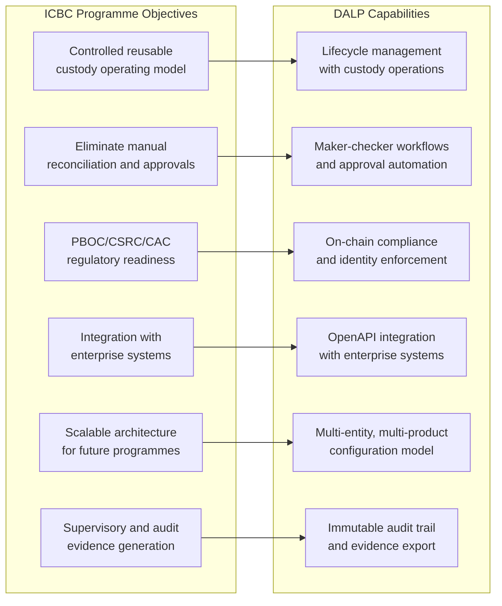
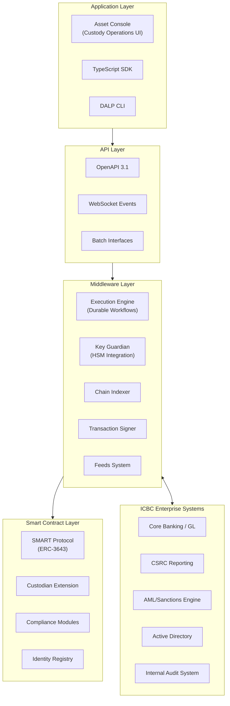
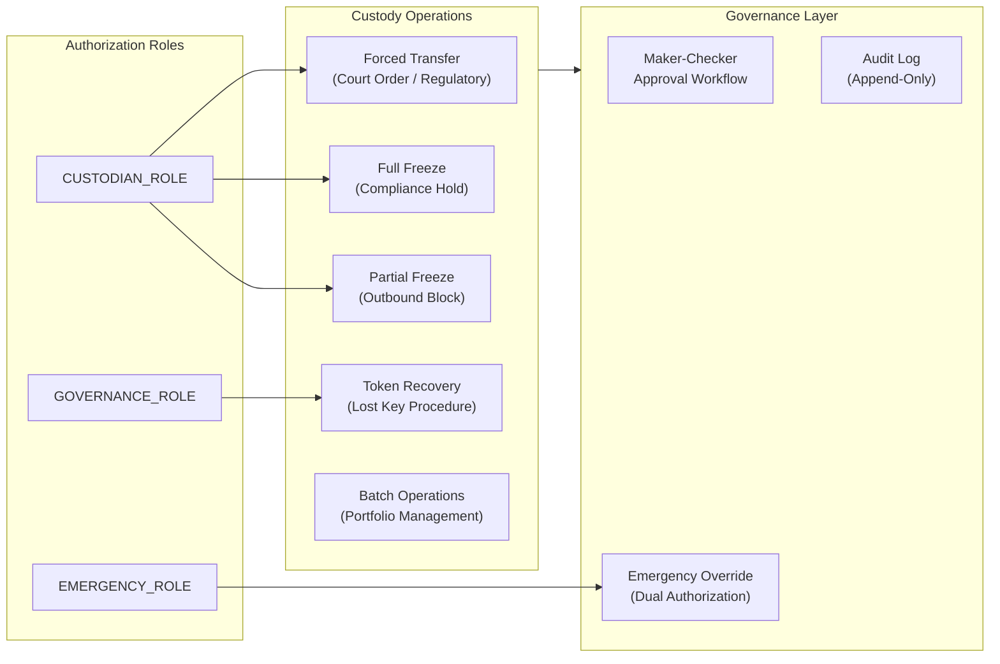
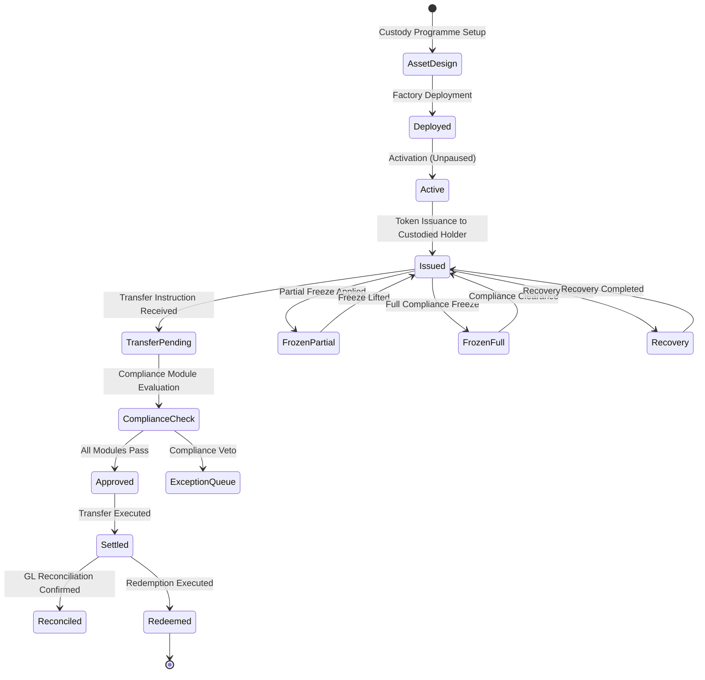
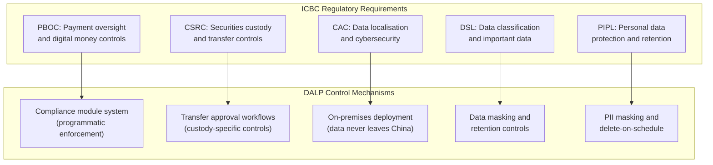
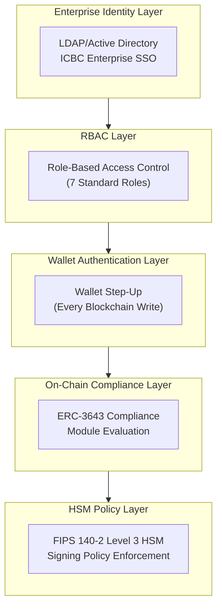
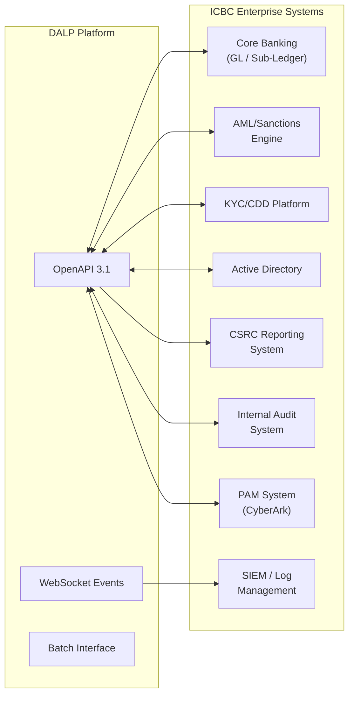
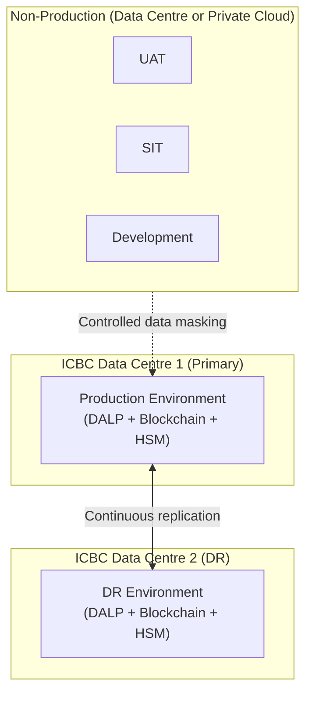
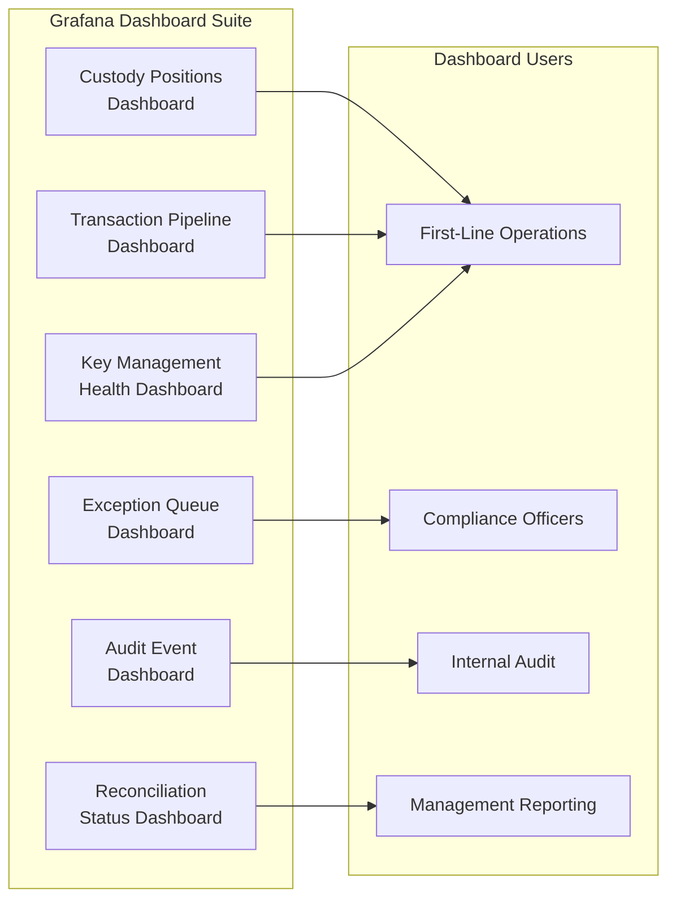
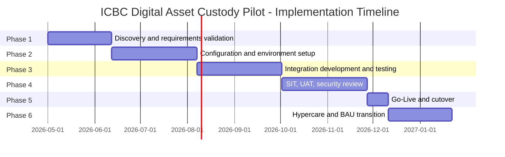

# Technical Proposal: Digital Asset Custody Pilot Platform

**Prepared for:** Industrial and Commercial Bank of China (ICBC)
**Reference:** ICBC-RFP-202603
**Date:** March 2026
**Version:** v1.0
**Classification:** Strictly Confidential. Invited Bidders Only
**Prepared by:** SettleMint NV

---

## Table of Contents

1. Executive Summary
2. Strategic Fit and Use-Case Alignment
3. Platform Architecture
4. Custody Lifecycle and Asset Management
5. Compliance and Regulatory Framework
6. Security Architecture
7. Integration Architecture
8. Deployment Architecture
9. Operational Model
10. Implementation Plan
11. Testing Strategy
12. Reference Clients
13. Support and SLA Framework
14. Appendix: Technical Requirement Response Matrix

---

## 1. Executive Summary

### 1.1 Context and Strategic Drivers

ICBC occupies a unique position in China's financial system: as the world's largest bank by total assets, any digital asset custody programme it launches will be observed by regulators, counterparties, and the broader institutional market as a bellwether for what regulated digital custody can look like in China. This is not a pilot in the exploratory sense. It is a controlled programme designed to establish the operational and regulatory precedents that subsequent ICBC digital asset programmes will inherit.

The regulatory context is clear and tightening. PBOC has issued guidance on regulated digital asset operations. CSRC has signalled attention to custody obligations for digital securities. The Cyberspace Administration of China (CAC) has imposed data localisation requirements that affect how custody platforms store and process participant data. The Data Security Law classifies certain financial data as important data subject to SAFE security assessment before cross-border transfer. Any custody platform ICBC deploys must be designed from the start to satisfy all four regulatory frameworks simultaneously.

The e-CNY ecosystem provides important context for ICBC's programme architecture. The e-CNY's two-tier distribution model, where PBOC issues and commercial banks distribute, implies that ICBC may eventually operate as a custody and distribution intermediary for PBOC-issued digital currency. A custody platform that can operate within the e-CNY architecture's access control and reporting requirements would position ICBC as a natural partner for any future expansion of the e-CNY ecosystem into institutional digital asset operations.

### 1.2 Why Custody Is Hard at Institutional Scale

Digital asset custody differs from traditional securities custody in several dimensions that create operational and governance challenges. The cryptographic key management layer introduces risks that have no direct analogue in traditional custody: lost keys are permanent loss; compromised keys may enable theft that cannot be reversed. Institutional custody programmes must therefore build key management procedures that are simultaneously rigorous enough to prevent loss and compromise, and operationally efficient enough to process transactions at the volumes ICBC requires.

The compliance layer is equally demanding. Traditional securities custody relies on CSD infrastructure for transfer controls and participant eligibility. Digital asset custody must implement these controls at the smart contract layer, which means getting the compliance configuration right before tokens are issued, not after. Configuration errors in the compliance layer can create permanent operational problems that are expensive to resolve.

Regulatory evidence generation is the third challenge. ICBC's internal audit, CSRC compliance, and PBOC reporting obligations all require detailed, time-stamped evidence of custody operations. Systems that treat reporting as an afterthought create expensive manual evidence assembly obligations. A custody platform designed from first principles generates evidence as a natural by-product of operations.

### 1.3 Proposed Response

SettleMint proposes DALP as the technology foundation for ICBC's digital asset custody pilot. DALP provides the full custody lifecycle: participant onboarding with KYC/AML integration, asset issuance and configuration, transfer controls enforced on-chain, administrative custodian operations (forced transfer, freeze, recovery), and complete audit evidence generation.

For ICBC's programme specifically:

- **Deployment model:** On-premises within ICBC's data centres, or private cloud within a Chinese cloud provider. No participant data, transaction data, or encryption keys transit outside China's network perimeter.
- **Compliance architecture:** Configurable modules enforcing PBOC/CSRC custody requirements, CAC data governance requirements, and ICBC's internal custody policy. Module configuration requires GOVERNANCE_ROLE approval and generates auditable change events.
- **Custody operations:** The Custodian extension provides force-transfer, full-freeze, partial-freeze, and token recovery capabilities. All custodian actions require maker-checker approval and generate distinct event types in the audit log.
- **Key management:** Key Guardian integrates with FIPS 140-2 Level 3 HSMs. Signing policy enforces multi-party authorization for material key operations. Break-glass procedures require dual authorization and post-event review documentation.
- **Evidence generation:** Every custody operation generates machine-readable audit events that can be exported to ICBC's regulatory reporting system, internal audit function, and CSRC-facing compliance record system.

### 1.4 Differentiators

🟢 DALP's Custodian extension is a first-class platform capability, not an optional add-on. It is architected into every DALPAsset contract through the SMARTCustodian interface, which means custody operations are available from day one of production without additional configuration. ICBC does not need to build custody capabilities on top of a generic token framework; it configures a platform that was designed for regulated custody from the ground up.

SettleMint's relevant production references include DBS Bank (tokenized deposit custody, Singapore, under MAS oversight) and OCBC Bank (tokenized wealth product custody, Singapore). The governance and compliance architectures from those deployments apply directly to ICBC's PBOC/CSRC context.

---

## 2. Strategic Fit and Use-Case Alignment

### 2.1 Custody Programme Objective Mapping

**Figure 1: ICBC Custody Objectives Mapped to DALP Capabilities**

### 2.2 e-CNY Ecosystem Relevance

DALP's architecture is compatible with the e-CNY ecosystem's design principles. The platform operates on permissioned blockchain networks, supports central authority access to compliance configuration and audit evidence, and provides the programmable transfer controls that the e-CNY model requires for institutional participants. DALP does not connect directly to PBOC's e-CNY infrastructure; that integration depends on PBOC's published API specifications for institutional participants, which ICBC's technical team would need to confirm. What DALP provides is a custody and lifecycle management layer that can operate above the e-CNY layer, managing ICBC's position in e-CNY instruments while maintaining ICBC's own custody controls.

🟡 **Boundary note:** Direct e-CNY network integration requires engagement with PBOC's institutional participant programme and access to e-CNY network APIs. DALP provides the asset management and compliance layer; the e-CNY network connection is a deployment configuration that depends on PBOC's API availability and ICBC's institutional participant status.

---

## 3. Platform Architecture

### 3.1 Four-Layer Architecture for Custody

**Figure 2: DALP Architecture for ICBC Digital Asset Custody**

### 3.2 Custodian Extension Architecture

**Figure 3: Custodian Extension Governance Model**

The SMARTCustodian extension provides four operational capabilities critical for regulated digital asset custody:

**Forced Transfer:** Executes a transfer of tokens from a holder's address to a specified destination without the holder's signature, used for court-ordered transfers, inheritance processing, and regulatory seizures. Requires CUSTODIAN_ROLE and maker-checker approval. Generates a ForceTransfer event with full context including authorization chain.

**Address Freeze:** Full freeze blocks all incoming and outgoing transfers. Partial freeze blocks only outgoing transfers, allowing incoming settlement to continue. Used for compliance holds, AML freezes, and legal injunctions. CUSTODIAN_ROLE required; immediate effect; generates Freeze event with timestamp and authorizing operator.

**Token Recovery:** Two-step recovery process for lost or compromised keys. Step one: holder initiates recovery claim through verified identity. Step two: custodian validates identity evidence and executes recovery transfer. Requires GOVERNANCE_ROLE and maker-checker approval. The two-step design prevents unauthorized recovery claims while enabling legitimate key recovery.

**Batch Operations:** Allows custodian operations to be applied to multiple addresses in a single transaction, reducing gas costs and operational overhead for portfolio-level compliance actions.

---

## 4. Custody Lifecycle and Asset Management

### 4.1 Digital Asset Lifecycle for Custody

**Figure 4: Digital Asset Custody Lifecycle States**

### 4.2 Participant Onboarding and Identity Management

🟢 Every participant in ICBC's digital asset custody programme holds an OnchainID identity contract with verified claims. The onboarding process connects ICBC's existing KYC/AML infrastructure to DALP's claim issuance API:

1. Client or institutional counterparty completes KYC/AML verification through ICBC's existing due diligence process.
2. ICBC's KYC system calls DALP's claim issuance API with the verified identity attributes and claim type (institutional, individual, exempt).
3. DALP's identity registry records the claim on the participant's OnchainID contract with an expiry timestamp.
4. The participant's wallet is associated with their OnchainID and becomes eligible for custody operations as permitted by their claim profile.
5. Claim renewal is triggered automatically before expiry; renewal failure suspends the participant's transfer eligibility automatically.

This approach preserves ICBC's existing KYC investment and processes while adding the on-chain identity layer that DALP's compliance modules require for transfer enforcement.

### 4.3 Asset Issuance Under Custody

For custody of digital securities or tokenized instruments, ICBC acts as the custodian issuing tokenized claims to holders. The issuance workflow:

- Asset type selection (Bond, Equity, Fund, Deposit, or DALPAsset for custom instruments)
- Compliance module configuration (identity verification mandatory; country restrictions per instrument; supply cap per regulatory limit)
- Factory deployment with deterministic address (CREATE2)
- Initial token distribution to custodied holder addresses with onboarding verification
- Confirmation to ICBC's GL sub-ledger of issued positions

---

## 5. Compliance and Regulatory Framework

### 5.1 PBOC, CSRC, and CAC Regulatory Mapping

**Figure 5: ICBC Regulatory Requirements Mapped to DALP Controls**

**PBOC digital money oversight:** DALP enforces PBOC-required controls on digital instrument operations through the compliance module system. PBOC reporting requirements are satisfied through automated event capture that feeds ICBC's regulatory reporting stack.

**CSRC custody controls:** CSRC requires that securities custodians maintain records of all custody positions, transfers, and corporate actions. DALP's Chain Indexer maintains a complete indexed record of all on-chain events, providing the position and activity history CSRC requires. Export functions support CSRC reporting format requirements.

**CAC data localisation:** DALP on-premises deployment within ICBC's data centres ensures that no participant data, transaction records, or encryption keys are processed or stored outside China's network perimeter.

**Data Security Law classification:** DALP's data classification controls allow ICBC to tag custody records according to DSL classification tiers. Important data under DSL is subject to additional access controls and export restrictions enforced by DALP's policy engine.

### 5.2 Custody Compliance Module Configuration

For ICBC's digital asset custody pilot, the following compliance module configuration is recommended:

| Module | Configuration | Business Rationale |
|--------|--------------|-------------------|
| Identity verification | Required for all transfers | CSRC requirement: verified holder identity |
| Country block list | OFAC and China-specific restricted jurisdictions | Sanctions compliance |
| Transfer approval (high-value) | Threshold: [VARIABLE] | Enhanced controls for large transactions |
| Investor count limit | Per regulatory prospectus limits | CSRC distribution rules |
| Time lock | Per instrument lock-up period | Regulatory lock-up requirements |

All module configurations require GOVERNANCE_ROLE approval and generate a ConfigurationChange event in the audit log.

---

## 6. Security Architecture

### 6.1 Multi-Layer Security for Custody

**Figure 6: Five-Layer Security Architecture for ICBC Custody**

### 6.2 HSM Key Management for Custody Operations

🟢 Key management for digital asset custody is the highest-risk operational element of the programme. DALP's Key Guardian provides a structured key management model designed specifically for institutional custody:

**Hierarchical key model:**
- **Platform root key:** Managed by ICBC's HSM cluster. Controls platform administrative operations. Requires 3-of-5 multi-signature authorization (configurable).
- **Custody signing keys:** One per asset class or custody programme. Controls issuance and custodian operations for that scope. Requires 2-of-3 multi-signature authorization.
- **Operational transaction keys:** Per-operator keys for routine transfer operations. Single-party authorization with audit logging.

**Key rotation protocol:**
- Custody signing keys rotate on a 90-day schedule (configurable to ICBC's security policy).
- Rotation is executed automatically by the Key Guardian with zero-downtime: in-flight transactions complete with the current key; new transactions use the rotated key.
- Rotation generates a KeyRotation event in the audit log with the old and new key references (not key material).

**Break-glass procedures:**
- Emergency key access requires dual authorization from two designated EMERGENCY_ROLE holders.
- Break-glass events generate a BreakGlass event type with the authorizing operators, timestamp, and stated reason.
- Post-event review is mandatory: the EMERGENCY_ROLE holders must document the justification within 24 hours.
- ICBC's security team and internal audit are automatically notified via the alert integration when a break-glass event occurs.

### 6.3 Privileged Access Management

DALP integrates with ICBC's privileged access management (PAM) infrastructure for administrator-level operations. Integration is via LDAP/Active Directory with role mapping. Platform roles are assigned through ICBC's standard identity governance process, with PLATFORM_ADMIN approval required for all custody-related role assignments.

Session recording for privileged operations is available through integration with ICBC's existing PAM tooling (CyberArk or equivalent). All privileged sessions are terminated after a configurable inactivity timeout.

---

## 7. Integration Architecture

### 7.1 ICBC Enterprise Integration Landscape

**Figure 7: ICBC Enterprise Integration Map**

### 7.2 Core Banking GL Integration

🟢 DALP maintains an internal ledger of all custodied positions. End-of-day reconciliation against ICBC's GL sub-ledger runs as a scheduled batch process. The reconciliation process:

1. Queries on-chain token balances through the Chain Indexer for all custodied assets.
2. Compares on-chain positions against ICBC's GL sub-ledger positions via the GL integration API.
3. Identifies position differences and categorises them: timing differences (expected), data entry errors, or genuine breaks.
4. Routes breaks to the reconciliation exception queue with the specific accounts and amounts in question.
5. Generates a daily reconciliation report in the format required by ICBC's finance operations team.

### 7.3 CSRC Regulatory Reporting

🟡 CSRC reporting for digital securities custody requires position reports, transfer activity reports, and corporate action reports in CSRC-specified formats. DALP generates the source data for these reports from its Chain Indexer. Report formatting and submission to CSRC's reporting system is handled through ICBC's regulatory reporting platform, which receives structured data from DALP via a scheduled API interface.

**Boundary:** DALP generates and exports the underlying data. CSRC report formatting and submission is ICBC's regulatory reporting platform's responsibility.

---

## 8. Deployment Architecture

### 8.1 Recommended Deployment: On-Premises within ICBC Data Centres

**Figure 8: ICBC On-Premises Deployment Architecture**

The on-premises deployment model provides maximum data sovereignty and control, meeting CAC and PBOC requirements for network operator data localisation. Key characteristics:

- All processing occurs within ICBC's network perimeter
- HSM hardware is ICBC-owned and operated
- No dependency on external cloud services for production operations
- ICBC's change management and release governance processes apply to all updates

Infrastructure requirements for production and DR are consistent with the specifications in the Bank of China proposal (8 vCPU, 32 GB RAM, 500 GB NVMe per node; 3-node Kubernetes cluster minimum per environment; FIPS HSM cluster).

---

## 9. Operational Model

### 9.1 Custody Operations Dashboard

**Figure 9: Custody Operations Dashboard Architecture**

### 9.2 Daily Operational Procedures

| Procedure | Owner | Frequency | Evidence |
|-----------|-------|-----------|---------|
| Start-of-day position check | First-line operations | Daily | Position confirmation report |
| Transaction queue review | First-line operations | Continuous | Queue management log |
| Compliance exception adjudication | Compliance officer | As triggered | Adjudication record |
| AML alert review and routing | Compliance officer | As triggered | Alert disposition log |
| End-of-day GL reconciliation | Finance operations | Daily | Reconciliation report |
| HSM health check | Security operations | Daily | HSM status report |
| Audit trail review | Internal audit | Weekly/as required | Audit trail export |

---

## 10. Implementation Plan

### 10.1 Implementation Timeline

**Figure 10: Implementation Timeline**

| Phase | Duration | Key Gate Criteria |
|-------|----------|------------------|
| 1. Discovery | 6 weeks | Custody operating model signed off by CSRC compliance team |
| 2. Configuration | 8 weeks | All custody operations demonstrable in SIT environment |
| 3. Integration | 8 weeks | GL reconciliation passing; CSRC reporting data validated |
| 4. Testing | 8 weeks | UAT signed off; security review completed; DR test passed |
| 5. Go-Live | 2 weeks | Steering committee go/no-go approval |
| 6. Hypercare | 6 weeks | KPI targets met for 10 consecutive business days |

---

## 11. Testing Strategy

### 11.1 Custody-Specific Test Scenarios

In addition to standard test types (SIT, UAT, performance, security, failover), ICBC's custody pilot programme requires explicit testing of:

- **Forced transfer execution:** Court-ordered transfer of custodied assets. Validate that the forced transfer requires maker-checker approval, executes correctly on-chain, and generates the required audit evidence.
- **Address freeze and unfreeze:** Apply full and partial freeze to a custodied address. Validate that frozen addresses cannot execute outgoing transfers (partial freeze) or any transfers (full freeze). Validate that freeze and unfreeze generate correctly attributed audit events.
- **Token recovery process:** Execute a two-step recovery for a simulated lost key. Validate identity verification requirements, the two-step approval process, and the recovery audit trail.
- **Key rotation under load:** Execute HSM key rotation while custody transactions are in-flight. Validate no transaction loss and correct key attribution in audit events.
- **CSRC reporting data integrity:** Validate that CSRC-reportable events in DALP produce accurate source data in the reporting interface. Compare DALP output against expected report content.
- **Emergency override audit trail:** Execute an emergency custodian override with dual authorization. Validate that the BreakGlass event is generated, that ICBC security and audit are notified, and that post-event documentation workflow is triggered.

---

## 12. Reference Clients

| Client | Region | Use Case | Regulatory Context | Production Status |
|--------|--------|----------|-------------------|------------------|
| DBS Bank | Singapore | Tokenized deposit custody and trade finance | MAS | Production, 12+ months |
| OCBC Bank | Singapore | Tokenized wealth product custody | MAS | Production |
| National Bank of Egypt | Egypt | Digital asset core custody infrastructure | CBE | Production |
| Mashreq Bank | UAE | Digital asset custody and payment rails | CBUAE | Production |
| Clearstream | Germany | Tokenized collateral management | BaFin, ECB-adjacent | Production |
| Deutsche Boerse | Germany | Regulated digital asset trading and custody | BaFin | Production |

---

## 13. Support and SLA Framework

### 13.1 Recommended: Enterprise Support Tier

Enterprise support is recommended for ICBC's digital asset custody pilot given:
- 24/7 coverage requirement for custody operations
- CSRC and PBOC operational resilience obligations
- Named technical account management for escalated issues

SLA commitments are identical to those specified in the Bank of China proposal (99.9% monthly uptime; P1 15-minute response; P2 1-hour response).

---

## 14. Technical Requirement Response Matrix

| Req ID | Requirement | Status | Notes |
|--------|-------------|--------|-------|
| TR-01 | Full custody lifecycle support | 🟢 Supported | Issuance, transfer, freeze, recovery, redemption |
| TR-02 | Maker-checker governance | 🟢 Supported | Configurable delegated authority |
| TR-03 | Documented APIs | 🟢 Supported | OpenAPI 3.1 |
| TR-04 | PBOC/CSRC/CAC alignment | 🟡 Supported with Configuration | On-premises deployment required |
| TR-05 | Identity and onboarding | 🟡 Supported with Third-Party Dependency | KYC integration via ICBC's KYC platform |
| TR-06 | HSM key management | 🟢 Supported | Key Guardian + FIPS HSM |
| TR-07 | Deterministic reconciliation | 🟢 Supported | Three-stream reconciliation |
| TR-08 | Operational dashboards | 🟢 Supported | Full Grafana dashboard suite |
| TR-09 | Deployment flexibility | 🟢 Supported | On-premises recommended |
| TR-10 | Reference experience | 🟢 Supported | DBS, OCBC, Mashreq, NBE references |
| TR-11 | Programmable custody controls | 🟢 Supported | Compliance module system + Custodian extension |
| TR-12 | Testing strategy | 🟢 Supported | Full test coverage including custody-specific scenarios |
| TR-13 | Enterprise integration | 🟡 Supported with Third-Party Dependency | CSRC reporting format via ICBC's reporting platform |
| TR-14 | Data model extensibility | 🟢 Supported | Multi-asset, multi-entity without code changes |
| TR-15 | Records retention and export | 🟢 Supported | Append-only audit log |
| TR-16 | Third-party risk transparency | 🟢 Supported | All dependencies disclosed |
| TR-17 | Business continuity | 🟢 Supported | RPO <4h, RTO <2h |
| TR-18 | Commercial scaling | 🟢 Supported | Platform-based, no per-transaction fees |
| TR-19 | Release management | 🟢 Supported | Versioned Helm deployment |
| TR-20 | Roadmap governance | 🟡 Roadmap items separated | Live vs. roadmap clearly distinguished |
