# Technical Proposal: Tokenized Securities Platform

**Prepared for:** Kasikornbank PCL
**Date:** 20 March 2026
**Version:** 1.0 Final
**Classification:** SettleMint Confidential. Invited Bidders Only
**Reference:** KASIKORNBANK-RFP-202603

---

## Table of Contents

1. Cover Page
2. Executive Summary
3. About SettleMint
4. Platform Overview: DALP
5. Solution Architecture
6. Asset Lifecycle Coverage
7. Compliance Architecture
8. Integration Architecture
9. Custody and Key Management
10. Settlement and Operations
11. Security Architecture
12. Deployment Options
13. Implementation Approach
14. Support and SLA
15. Reference Projects
16. Regulatory Alignment
17. Response Matrix
18. Appendix A: Risk Register
19. Appendix B: Compliance Module Catalog

---

## 1. Cover Page

**Document Title:** Technical Proposal: Tokenized Securities Platform
**Client:** Kasikornbank PCL, Bangkok, Thailand
**Date:** 20 March 2026
**Version:** 1.0 Draft
**Prepared by:** SettleMint NV
**Classification:** SettleMint Confidential

*This document contains proprietary and confidential information belonging to SettleMint NV. It is submitted exclusively in response to KASIKORNBANK-RFP-202603 and may not be reproduced, disclosed, or distributed without prior written consent from SettleMint NV.*

---

## 2. Executive Summary

### 2.1 Context

Kasikornbank occupies a distinctive position in Thailand's accelerating digital asset market. As one of Thailand's largest commercial banks and the institution behind KBTG, the technology group that has invested materially in blockchain experimentation and digital infrastructure. Kasikornbank is not approaching tokenized securities as a conceptual exercise. The institution has spent years building internal capability, observing the lessons of Project Inthanon, and positioning itself to participate credibly in the next phase of Thailand's digital capital markets. What this procurement signals is a decision to move from exploration to governed operational deployment: a platform that functions under Bank of Thailand oversight, SEC Thailand digital asset regulations, and PDPA Thailand data protection requirements, and that can be examined by risk, internal audit, legal, compliance, and senior executive governance from the first day of operation.

Thailand's digital asset regulatory environment has matured significantly. The SEC Thailand has established licensing categories for digital asset operators, custodians, and exchange platforms. The Bank of Thailand has issued guidance on digital asset activities by financial institutions and is progressing work on tokenized financial instruments through its own digital asset framework. Project Inthanon, the Bank of Thailand's wholesale CBDC and DLT-based interbank settlement experiment, has produced material lessons about network design, liquidity management, and the integration of programmable money with existing financial market infrastructure. These lessons directly inform what institutions like Kasikornbank should demand from a tokenized securities platform: interoperability by design, regulatory control enforcement at the protocol layer, and an operating model that withstands real institutional scrutiny rather than just sandbox conditions.

This proposal responds directly and specifically to that context. SettleMint does not approach this as a generic blockchain technology sale. Kasikornbank has communicated clearly that it is procuring a governed platform capable of supporting tokenized bonds, equities, and mutual fund units under Thai regulatory conditions, with a reusable architecture that can expand across product lines, legal entities, and approved market initiatives without re-platforming. SettleMint's Digital Asset Lifecycle Platform, DALP, is designed precisely for this category of institutional requirement.

### 2.2 Why This Programme Is Hard

Institutions that have attempted tokenized securities programmes at production scale consistently encounter the same failure modes. Compliance enforcement functions in demonstrations but breaks under real transfer conditions, particularly when dealing with SEC Thailand investor eligibility requirements, accreditation status verification, and cross-jurisdictional restrictions that must be evaluated before any transfer can proceed. Key management designs satisfy security review requirements on paper but create operational brittleness when traders need to settle transactions at pace and administrators need to rotate keys without disrupting active positions. Integration architectures assume clean-room technical conditions and accumulate invisible debt when they encounter Kasikornbank's actual enterprise landscape: core banking systems, the bank's clearing and settlement connections, payment rails including PromptPay and BAHTNET, and the bank's existing risk, compliance, and reporting infrastructure.

For Kasikornbank specifically, the programme complexity is compounded by Thailand-specific institutional realities. First, the SEC Thailand's digital asset regulatory framework creates a compliance surface that extends beyond simple transfer controls: issuance conditions, investor categorisation under SEC's qualified investor and retail investor frameworks, suitability obligations, and disclosure requirements all need to be operationally enforced, not just documented. Second, KBTG's existing blockchain experimentation creates both an opportunity and a dependency management challenge, the new platform must be able to operate alongside existing infrastructure investments rather than obsoleting them. Third, Kasikornbank's governance intensity means that every operational workflow, every exception path, and every configuration change will need to demonstrate a defensible approval chain. The programme must satisfy not only the technology function but simultaneously the risk function, the compliance function, legal, internal audit, and the executive committee.

The hardest part of this programme is not the tokenization technology itself. The hard part is ensuring that every securities transfer validates investor eligibility against the current SEC Thailand-compliant investor registry before execution; that every governance decision generates an immutable evidence trail that can be retrieved for Bank of Thailand examination; that every integration handles partial failures, network outages, and reconciliation discrepancies gracefully; and that the complete system can be operated, challenged, and explained by Kasikornbank's own teams in Thai regulatory contexts without permanent vendor dependency. These are the problems DALP was built to solve.

### 2.3 Proposed Response

SettleMint proposes the deployment of DALP as the governed infrastructure layer for Kasikornbank's tokenized securities programme. The proposal covers the complete scope defined in KASIKORNBANK-RFP-202603, including:

**Tokenized Bonds:** DALP's bond asset template provides full lifecycle support for government and corporate bonds in THB-denominated format, issuance through configurable term structures, automated coupon schedules, ex-ante compliance enforcement against SEC Thailand and Bank of Thailand requirements, secondary market transfer controls, and maturity redemption with treasury payout. Compliance controls enforce investor categorisation (qualified investor, high-net-worth, institutional) at the smart contract layer, providing a control mechanism that cannot be bypassed by application-layer logic.

**Tokenized Equities:** DALP's equity asset template supports tokenized equity securities with automated dividend distribution, on-chain voting capability (ERC-5805), corporate action processing including stock splits and consolidations, and configurable transfer restrictions aligned with SEC Thailand requirements for equity securities. The RBAC model provides clear segregation between issuance authority, compliance approval, investor management, and transfer execution.

**Tokenized Mutual Fund Units:** DALP's fund asset template supports tokenized fund units with NAV integration capability, subscription and redemption workflows, fee structures (AUM-based), and fractional unit management. The compliance engine enforces fund-specific eligibility rules and distribution restrictions in line with SEC Thailand fund management regulations.

**Configurable Token for Custom Instruments:** Beyond the three primary asset classes, DALP's configurable token architecture supports additional instrument types, structured notes, hybrid securities, or other regulated financial products that Kasikornbank may seek to tokenize, using the same compliance framework, governance model, and operational tooling.

**Integration:** DALP's API-first architecture. REST, TypeScript SDK, and event webhooks, provides the connectivity required for Kasikornbank's enterprise integration landscape including core banking, treasury management, BAHTNET and PromptPay payment rail connectivity, AML/sanctions screening, KYC/KYB providers, and regulatory reporting infrastructure.

**Governance and Compliance:** DALP's role-based access control, maker-checker approval workflows, and on-chain audit trail provide the governance infrastructure required for Bank of Thailand outsourcing compliance, SEC Thailand digital asset operator obligations, PDPA Thailand data handling requirements, and Kasikornbank's internal audit framework.

**Deployment:** SettleMint proposes deployment in a dedicated cloud environment within AWS ap-southeast-1 (Singapore) with options for Thailand-specific infrastructure alignment, satisfying data residency considerations relevant to PDPA Thailand and Bank of Thailand outsourcing guidelines.

### 2.4 Why SettleMint

The evaluation criteria for this RFP place substantial weight on production realism, control maturity, and delivery evidence rather than headline marketing claims. SettleMint's case for selection rests on three verifiable pillars.

First, proven production deployments in directly comparable APAC environments. SettleMint's deployment with OCBC Bank in Singapore represents a multi-year production engagement operating under MAS regulation, a comparable institutional context to Bank of Thailand's regulated environment. OCBC's security token engine handles securitization, tokenization, and fractionalization of off-chain assets for HNWI investment products. Standard Chartered Bank's Digital Virtual Exchange supports fractional tokenization of securities across Asia, Africa, and the Middle East. The Reserve Bank of India's Innovation Hub, a directly comparable engagement to Thailand's Project Inthanon architecture, demonstrates DALP's capability in central bank-adjacent trade finance blockchain infrastructure. State Bank of India's CBDC infrastructure work demonstrates DALP's capability in large-scale regulated public sector banking deployments in Asia. These references are not marketing logos, they represent DALP operating under the same class of institutional controls, governance intensity, and regulatory scrutiny that Kasikornbank will impose.

Second, a compliance architecture that enforces controls before execution. DALP's implementation of ERC-3643 (T-REX) with the SMART Protocol means that every token transfer is validated against investor identity, jurisdictional eligibility, and policy rules at the smart contract layer, before any balance change occurs. SEC Thailand's investor categorisation requirements and transfer restrictions are enforceable at this layer. This is not application-layer compliance that can be bypassed by a direct contract call. SettleMint can demonstrate this in production, not just in documentation.

Third, a delivery model built around the realities of institutional implementation in regulated Asian markets. SettleMint's phase-gated methodology, refined through production deployments with regulated banks across Singapore, India, Japan, Malaysia, and Europe, addresses the specific failure modes that institutional tokenization programmes encounter: unresolved governance ownership, integration debt accumulation, compliance gaps discovered late in testing, and operational knowledge concentrated in vendor specialists rather than transferred to institution teams.

### 2.5 Document Map

This proposal is structured to respond directly to KASIKORNBANK-RFP-202603:

- **Section 3: About SettleMint**: company background, track record, and APAC credentials
- **Section 4: Platform Overview**: DALP capabilities, architecture, and differentiators
- **Section 5: Solution Architecture**: four-layer technical stack for Kasikornbank's tokenized securities programme
- **Section 6: Asset Lifecycle Coverage**: bond, equity, and fund token lifecycle detail
- **Section 7: Compliance Architecture**: Bank of Thailand, SEC Thailand, and PDPA Thailand alignment
- **Section 8: Integration Architecture**: enterprise connectivity for Kasikornbank's systems landscape
- **Section 9: Custody and Key Management**: key security operating model and HSM integration
- **Section 10: Settlement and Operations**: atomic settlement and operational tooling
- **Section 11: Security Architecture**: defense-in-depth and CERT-alignment security controls
- **Section 12: Deployment Options**: cloud and on-premises deployment for Thailand
- **Section 13: Implementation Approach**: phased delivery with RAID and staffing
- **Section 14: Support and SLA**: tiered support with quantified SLA commitments
- **Section 15: Reference Projects**: 14 production references with APAC case studies
- **Section 16: Regulatory Alignment**: control mapping to Bank of Thailand, SEC Thailand, PDPA
- **Section 17: Response Matrix**: requirement-by-requirement compliance responses (TR-01 to TR-20)
- **Appendix A: Risk Register**: programme RAID tailored to Thailand's tokenized securities context
- **Appendix B: Compliance Module Catalog**: full catalog of DALP's 18 compliance modules

---

## 3. About SettleMint

### 3.1 Company Overview

SettleMint is the digital asset lifecycle platform company for regulated financial markets and sovereign use cases. Founded nearly a decade ago, SettleMint has grown from an early enterprise blockchain infrastructure provider into the category-defining platform company enabling financial institutions, market infrastructure providers, and sovereign entities to move real-world value on-chain with compliance, security, and operational reliability.

SettleMint exists to solve the complexity of doing digital assets right. Tokenization technology is increasingly accessible, but the hard problems, regulatory compliance, key management, asset lifecycle operations, settlement logic, auditability, remain genuinely difficult to get right in production. Most institutions underestimate this complexity until they are deep in implementation. SettleMint's mission is to enable regulated institutions to move from slide decks to balance sheets, absorbing infrastructure complexity so they can focus on their business.

### 3.2 Mission and Market Position

SettleMint makes regulated digital asset tokenization compliant, secure, and scalable for financial institutions, market infrastructure providers, and governments. Through DALP, SettleMint enables institutions to design, launch, and operate digital asset solutions across major asset classes and blockchain networks, with the governance, compliance, and reliability required for real-world deployment.

SettleMint is not a new entrant reacting to the latest tokenization wave. The company has nearly a decade of focused experience building blockchain infrastructure for regulated institutions. This investment in technology and institutional relationships has produced a depth of expertise that cannot be replicated quickly.

The company's evolution reflects the broader maturation of the digital asset market. In the early enterprise blockchain era, SettleMint built foundational distributed ledger infrastructure for demanding enterprise environments across financial services, supply chains, telecoms, and government entities. As financial institutions moved beyond proof-of-concept, SettleMint deepened its focus on the regulatory, governance, and operational requirements that separate pilot projects from production infrastructure, the complexity of doing tokenization right at scale. Today, SettleMint operates at the intersection of digital assets and tokenization, institutional and sovereign infrastructure, and banking, capital markets, and government systems.

### 3.3 Asia-Pacific Presence and Credentials

SettleMint's Asia-Pacific credentials are directly relevant to Kasikornbank's procurement. Each APAC reference demonstrates DALP operating under the class of institutional and regulatory controls that Kasikornbank will require.

The OCBC Bank deployment in Singapore represents a multi-year production engagement for a security token engine covering securitization, tokenization, and fractionalization of off-chain assets for HNWI investment products. OCBC's programme operates under the MAS regulatory framework, an institutional context comparable in governance intensity to Bank of Thailand's regulated environment.

Standard Chartered Bank's Digital Virtual Exchange supports fractional tokenization of securities across Asia, Africa, and the Middle East, with instant ownership recording on-chain and reduced custody intermediary overhead. This reference demonstrates DALP's capability for regulated cross-border securities distribution, directly relevant to Kasikornbank's potential expansion of tokenized securities distribution.

The Reserve Bank of India's Innovation Hub engaged SettleMint to deliver a multi-bank letter of credit trade finance blockchain, a multi-node, multi-cloud infrastructure for fraud-proof, tamper-proof trade finance workflows. This engagement demonstrates SettleMint's capability to deliver regulated financial market infrastructure in central bank-adjacent environments comparable to Thailand's Project Inthanon architecture. Lessons from this deployment inform the integration design and governance model proposed for Kasikornbank.

State Bank of India is deploying DALP for CBDC infrastructure, digital currency at the scale of India's largest bank, with projections of over a billion daily transactions. This reference demonstrates DALP's ability to operate at national scale in a major Asian regulated banking environment.

Maybank's Project Photon deployed DALP's XvP settlement capability for FX tokenization and cross-border settlement in Malaysia, implementing a tokenized Malaysian Ringgit (MYRT) instrument with atomic cross-currency swaps aligned with Bank Negara Malaysia's Digital Asset Innovation Hub. This is the closest direct geographic reference to Kasikornbank's programme: an ASEAN commercial bank, a domestic currency tokenization, and a central bank-aligned deployment framework.

Mizuho Bank's bond tokenization and trade finance proof of concept, completed in late 2025 with production planning underway, demonstrates DALP's capability in a comparable Japanese institutional environment.

### 3.4 Technology Certifications and Standards

SettleMint maintains ISO 27001 and SOC 2 Type II certifications, confirming that security controls are independently audited and continuously maintained. The platform undergoes regular penetration testing, security assessments by independent third parties, and smart contract security audits by specialized blockchain security firms. These certifications support Kasikornbank's vendor risk assessment obligations under Bank of Thailand outsourcing guidelines and SEC Thailand requirements.

### 3.5 Team Depth

The SettleMint team combines over 200 years of combined banking and blockchain experience across blockchain engineering, financial markets, and enterprise delivery. Dedicated solution architects, delivery leads, and customer success teams have implemented tokenization solutions in multiple Asian jurisdictions, navigating internal processes including security review, vendor onboarding, and change control with large regulated banks. This depth means Kasikornbank is working with a team that has encountered, and resolved, the specific failure modes of institutional tokenization programmes in Asian regulatory contexts.

---

## 4. Platform Overview: DALP

### 4.1 What DALP Is

DALP, the Digital Asset Lifecycle Platform, provides the infrastructure institutions need to design, launch, and operate digital assets at production scale, with the governance, compliance, and reliability that regulated environments demand. It is a platform, not a consulting engagement. Institutions configure and operate it themselves using the same software that powers production deployments across Europe, the Middle East, and Asia Pacific.

DALP sits between existing core financial systems and multiple blockchain networks, providing the governance and orchestration layer that enables institutions to build, deploy, and operate compliant digital asset solutions. The platform abstracts blockchain complexity and embeds compliance and governance directly into the platform architecture.

Unlike point solutions that address only issuance, only custody, or only trading, DALP provides a unified platform covering the full digital asset lifecycle: from asset design through issuance, compliance enforcement, custody integration, settlement, servicing, and retirement, treated as one continuous lifecycle under a single governance model, security posture, and operating framework.

### 4.2 Core Lifecycle Pillars

DALP is structured around five integrated core-lifecycle modules that work together to support Kasikornbank's tokenized securities programme from initial design through ongoing operations.

**Issuance:** Rapid deployment of tokenized assets across seven asset classes, bonds, equities, funds, deposits, stablecoins, real estate, and precious metals, each with purpose-built lifecycle logic. For Kasikornbank, the bond, equity, and fund templates are immediately applicable. Assets are deployed through a configuration-driven Asset Designer wizard using pre-audited smart contract components, security guarantees are inherited, not re-engineered. The configurable token architecture extends this to custom financial instruments using up to 32 pluggable features per token.

**Compliance:** Ex-ante enforcement ensures every transfer is validated before execution, not reviewed after. DALP's compliance architecture includes 18 compliance module types covering country restrictions, investor accreditation, supply limits, holding periods, collateral backing, transfer controls, and more. The ERC-3643 regulated token standard is the actual open standard DALP implements, providing a compliance enforcement mechanism that operates at the smart contract layer and cannot be bypassed by application-layer logic. For Kasikornbank, this means SEC Thailand investor categorisation rules enforce at the contract level: a retail investor cannot receive a qualified-investor-only bond regardless of what the application layer says.

**Custody:** Key management workflows with bring-your-own-custodian integrations. DALP's Key Guardian manages cryptographic key material through multiple storage backends at escalating security levels: encrypted database, cloud secret manager, HSM, and third-party institutional custody via Fireblocks and DFNS. The maker-checker approval workflow and multi-signature quorum provide the operational governance that Kasikornbank's treasury and operations teams require.

**Settlement:** Atomic Delivery-versus-Payment and Exchange-versus-Payment settlement where both legs complete together or revert together, eliminating counterparty risk, reconciliation gaps, and operational drift. Both local (same-chain) and HTLC (cross-chain) settlement modes are supported with compliance enforcement across all settlement legs.

**Servicing:** Automated lifecycle operations, coupon payments, yield distribution, dividend processing, NAV-based redemptions, maturity handling, executed programmatically across every asset type. For Kasikornbank's tokenized bond programme, automated coupon calculations and distributions eliminate the manual reconciliation overhead that accompanies traditional fixed-income servicing. Fund NAV integration and subscription/redemption processing eliminate manual cut-off workflows.

### 4.3 Platform Foundations

**Identity and Access Management:** OnchainID provides verifiable on-chain investor identities. The Identity Registry manages verified profiles with claim-based verification. KYC/KYB credentials, accreditation status, and jurisdictional eligibility, reusable across all asset types. For Kasikornbank's investor onboarding, this means a single verified identity can be used across multiple tokenized products without re-KYC. Role-based access control governs every action with clearly defined roles from token issuance to transfer approval to compliance review.

**Integration and Interoperability:** Comprehensive APIs. REST, event webhooks, and TypeScript SDK, provide programmatic access to every platform capability. Payment rail connectivity supports ISO 20022 standards for SWIFT, SEPA, and RTGS connectivity, enabling integration with BAHTNET for THB settlement. The platform deploys on public or private EVM-compatible networks without code changes.

**Observability and Operations:** Pre-built Grafana dashboards cover operations overview, transaction monitoring, compliance activity, and security events. Three-pillar observability: metrics (VictoriaMetrics), logs (Loki), traces (Tempo and OpenTelemetry). Automated alerting with structured notification templates. An async transaction pipeline with 11-state lifecycle management, idempotency, retry semantics, and dead-letter rescue provides operational resilience by design.

### 4.4 Supported Asset Classes for Kasikornbank

| Asset Class | DALP Template | Lifecycle Features | Thailand Relevance |
|---|---|---|---|
| Bonds | 🟢 Native | Coupon schedules, maturity, call/put, secondary market | Government bonds, corporate bonds in THB |
| Equities | 🟢 Native | Dividend distribution, voting, corporate actions | SET-listed equity securities |
| Fund Units | 🟢 Native | NAV integration, subscription/redemption, fee structures | Mutual fund units under SEC Thailand |
| Structured Notes | 🟢 Native (Configurable) | Custom features up to 32 | Hybrid and structured products |
| Stablecoins | 🟢 Native | Reserve monitoring, attestation, multi-currency | THB-pegged instruments |

---

## 5. Solution Architecture

### 5.1 Four-Layer Technical Stack

DALP's architecture for Kasikornbank's tokenized securities programme is a four-layer stack with distinct responsibility boundaries at each level. Each layer enforces increasingly strict invariants, the smart contract layer provides the strongest guarantees and enforces SEC Thailand compliance unconditionally; the application layer provides user-facing flexibility within those invariants.

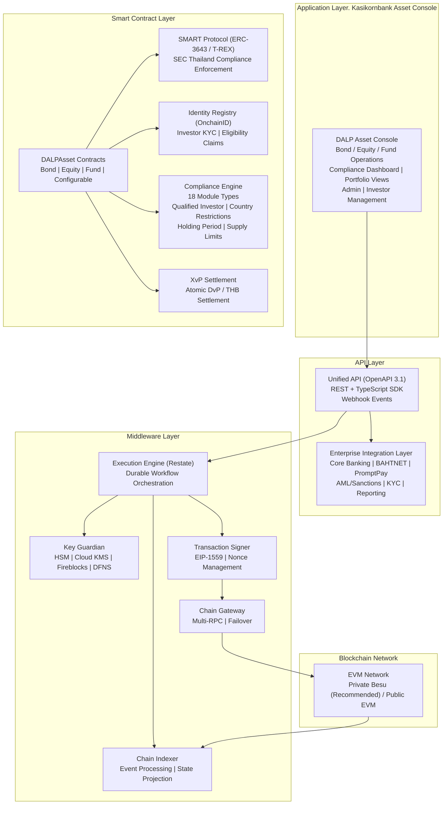

**Application Layer:** The DALP Asset Console provides Kasikornbank's operational teams with the complete interface for tokenized securities management: bond issuance workflows, equity corporate action management, fund subscription and redemption processing, investor onboarding and KYC management, compliance dashboards, and operational monitoring. The console supports maker-checker workflows throughout, no single operator can approve their own transaction.

**API Layer:** The Unified API exposes all platform capabilities through a type-safe OpenAPI 3.1 interface. The Enterprise Integration Layer connects to Kasikornbank's existing systems: core banking (for investor account data and GL posting), BAHTNET connectivity (for THB settlement leg), PromptPay (for retail distribution channels where applicable), AML and sanctions screening (for pre-transfer compliance), and regulatory reporting systems.

**Middleware Layer:** The Execution Engine (Restate) provides durable workflow orchestration with persistent state and exactly-once semantics, critical for multi-step bond issuance workflows where partial failures cannot create orphaned positions. Key Guardian manages cryptographic key material with HSM integration for the highest-security key storage. The Chain Indexer processes blockchain events into a queryable state projection, enabling real-time operational dashboards and reconciliation without querying the blockchain directly.

**Smart Contract Layer:** All contracts implement ERC-3643 (T-REX) through the SMART Protocol. SEC Thailand investor categorisation and transfer restrictions are enforced at this layer, unconditionally and before execution. The Compliance Engine evaluates 18 module types per transfer before any balance change occurs.

### 5.2 ERC-3643 and SMART Protocol

All DALP smart contracts implement the ERC-3643 standard, the open Ethereum standard designed specifically for regulated securities markets. ERC-3643 mandates four critical components beyond standard token contracts:

1. An **Identity Registry** where every token holder must have a verified on-chain identity before receiving or transferring tokens
2. A **Compliance Engine** that evaluates modular rules before each transfer and blocks non-compliant transactions unconditionally
3. **Trusted Issuers** who are the only entities authorised to attest to investor identity claims (KYC status, accreditation, jurisdiction)
4. **Transfer Restrictions** that operate independently of application-layer logic, the enforcement is at the protocol level

DALP implements ERC-3643 through the SMART Protocol, a production-hardened framework that adds upgradeable compliance modules, multi-jurisdictional regulatory templates, and richer claim-expression logic than standard implementations. For Kasikornbank's SEC Thailand context, this means configuring claim types for:

- **Investor category** (qualified investor / high-net-worth individual / institutional investor / retail investor)
- **Jurisdiction eligibility** (Thailand resident / non-resident / restricted jurisdiction)
- **KYC status** (verified / pending / expired / suspended)
- **Suitability assessment** (product-specific suitability where required by SEC Thailand)
- **Holding limits** (position concentration limits per instrument or category)

Every transfer of a Kasikornbank tokenized bond, equity, or fund unit evaluates all applicable claim conditions before execution. A transfer that would result in a retail investor receiving a qualified-investor-only bond is blocked at the contract level, not flagged for review, not queued for approval, blocked unconditionally.

### 5.3 DALPAsset: The Configurable Contract for Thailand

DALPAsset is the recommended contract type for Kasikornbank's tokenized securities programme. It extends the SMART Protocol with the SMARTConfigurable extension, allowing token features and compliance modules to be attached and reconfigured at runtime after deployment. For Kasikornbank, this means:

- A bond token can be initially issued with coupon and maturity features, then have transfer window controls added later as the programme matures, without redeploying the contract or migrating balances
- An equity token can have voting power added ahead of an extraordinary general meeting without disrupting existing holder positions
- A fund unit token can have redemption frequency controls updated to match SEC Thailand fund regulation changes without a new contract deployment

**Runtime-pluggable token features available include:**
- Fixed treasury yield (for THB-denominated bond coupon calculations)
- Maturity and redemption (for term bonds and structured notes)
- AUM fee (for fund management charges)
- Voting power (ERC-5805, for equity governance rights)
- Historical balances (for coupon calculation snapshots)
- Permit (gasless approvals for operational efficiency)
- Transaction fee (for secondary market fee routing)

### 5.4 Multi-Asset Architecture for Kasikornbank

The architecture supports concurrent management of all three asset classes (bonds, equities, funds) on a single platform instance under a unified governance model. Kasikornbank does not need separate platform deployments for each asset class, the same DALP infrastructure, the same compliance engine, the same identity registry, and the same observability stack serve all instruments.

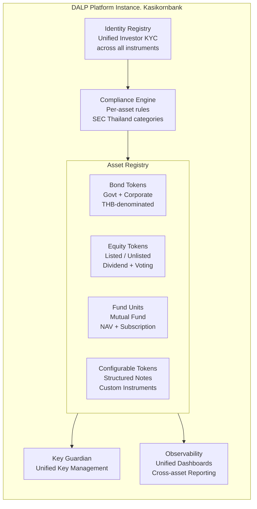

This unified architecture eliminates the operational overhead of managing separate custody, compliance, and monitoring infrastructure per asset class, a significant advantage for Kasikornbank's operations team and a material reduction in reconciliation complexity across instrument types.

---

## 6. Asset Lifecycle Coverage

### 6.1 Tokenized Bond Lifecycle

DALP provides complete lifecycle coverage for THB-denominated tokenized bonds, government securities, corporate bonds, and structured debt instruments, from initial design through issuance, servicing, and maturity or early redemption.

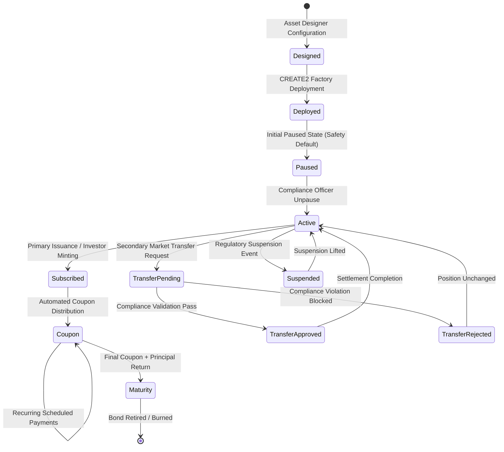

**Design Phase:** The Kasikornbank bond structuring team uses the Asset Designer wizard to configure bond parameters: face value in THB, coupon rate (fixed or floating with Oracle feed), payment frequency (quarterly, semi-annual, annual), maturity date, call/put option conditions, redemption provisions, and minimum subscription amounts. Compliance modules are selected and configured: investor category restrictions (qualified investor only, institutional only, or retail-eligible), country restrictions (Thailand residents only or approved foreign investor categories), supply limits (total issuance cap), and holding period restrictions where applicable.

**Deployment Phase:** The configured bond token is deployed through the SMART Protocol factory using CREATE2 deterministic addressing. The deployment workflow, orchestrated through Restate (DALP's durable execution engine), is an idempotent workflow: if any step fails, deployment resumes from the last successful step without creating orphaned contracts. Each bond deployment includes: proxy contract deployment, identity registry registration, compliance engine initialisation with configured modules, role bootstrapping (governance role assigned to Kasikornbank's designated governance address), and system registration.

**Issuance Phase:** The bond begins in a paused state, a safety default that requires an explicit unpause by a compliance-authorised operator before any issuance can proceed. This provides a governance gate between deployment (a technical operation) and issuance (a regulated activity). Primary subscription mints bond tokens to verified investor wallets after all compliance checks pass: investor identity verified, KYC current, investor category matching the bond's eligibility rules, and holding limits not exceeded.

**Coupon Servicing Phase:** DALP's Fixed Treasury Yield feature automates coupon calculation and distribution based on configured schedules and holding snapshots. For each coupon date, historical balance snapshots capture the eligible holder distribution, yield amounts are calculated per holder, and distributions are executed programmatically. Kasikornbank's treasury team reviews and approves the distribution batch through a maker-checker workflow before execution, providing governance oversight without requiring manual calculation. All coupon events are recorded immutably on-chain and exported to Kasikornbank's GL system.

**Secondary Market Phase:** Bond transfers between investors validate against the full compliance engine before execution. Both counterparties must have current KYC verification and eligible investor status. The XvP settlement module supports atomic Delivery-versus-Payment where the bond transfer and THB cash settlement complete atomically, or both revert. Failed compliance validation generates a structured rejection event with reason codes exportable to compliance case management systems.

**Maturity Phase:** On the maturity date, the Maturity Redemption feature triggers the final coupon payment and principal return sequence. The treasury payout abstraction supports both internal treasury accounts and contract-based treasury structures. Bond tokens are burned upon redemption, and the position is retired from the active registry.

### 6.2 Tokenized Equity Lifecycle

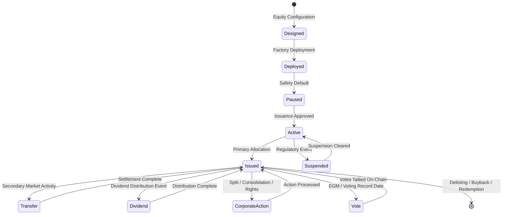

DALP's equity template provides Kasikornbank with the infrastructure to tokenize equity securities under SEC Thailand's regulatory framework. Key capabilities include:

**Dividend Distribution:** Automated dividend calculations based on historical balance snapshots at the dividend record date. Distribution amounts are calculated per holder and executed through DALP's airdrop mechanism, supporting both THB cash distributions (via payment rail integration) and stock dividends (via additional token minting). All distributions include event records for GL posting and regulatory reporting.

**On-Chain Voting:** ERC-5805 voting power delegation enables Kasikornbank to conduct shareholder votes on-chain for material corporate decisions. Voting power is proportional to holding at the record date snapshot. Vote submissions and tallies are recorded immutably, providing a verifiable governance record for corporate secretary functions.

**Corporate Actions:** Stock splits and consolidations are executed through controlled mint-and-burn sequences with proper accounting records. Rights offerings create a separate rights token that eligible existing shareholders receive proportionally, with a defined exercise window. All corporate actions follow the maker-checker approval workflow before execution.

### 6.3 Tokenized Fund Unit Lifecycle

DALP's fund template covers the operational lifecycle of tokenized mutual fund units under SEC Thailand's mutual fund management regulations:

**NAV Integration:** External NAV data from Kasikornbank's fund management system is ingested through the data feed integration. NAV updates trigger unit price recalculations for subscription and redemption pricing. The data feed architecture supports both push (fund administrator pushes NAV updates) and pull (DALP queries the fund system at defined intervals) models.

**Subscription Workflow:** Investor subscription requests flow through the following sequence: investor submits subscription request with THB amount; eligibility validation against fund prospectus compliance rules; AML/sanctions screening of subscriber; cut-off time enforcement (configurable per fund); NAV calculation at applicable price point; unit allocation at NAV price; THB receipt confirmation to investor account. All steps are orchestrated as a durable workflow that survives process restarts.

**Redemption Workflow:** Investor redemption requests validate against holding period restrictions and minimum holding requirements before execution. Redemption at NAV price triggers unit burning and THB payment initiation through the payment rail integration. Where fund liquidity windows apply (for closed-end or restricted funds), the compliance engine enforces redemption window restrictions at the contract level.

**NAV Data Feed Dependency:** NAV data for tokenised fund units is sourced from Kasikornbank's fund management system (the primary source of NAV calculations) through a defined API integration in Phase 3. The fund management system is classified as a third-party dependency: if the NAV feed is unavailable at cut-off time, DALP holds the subscription/redemption queue pending manual NAV confirmation from the fund administrator before any unit allocation or redemption execution proceeds. An alternative configuration supports external NAV oracle providers (e.g., Bloomberg fund data APIs) as a secondary source. The final NAV feed architecture is confirmed in Phase 1's current-state assessment.

**Fee Distribution:** AUM-based management fees accrue programmatically against the fund's NAV basis and are distributed to Kasikornbank's fund management entity on configured schedules, eliminating manual fee calculation and distribution processes.

---

## 7. Compliance Architecture

### 7.1 Overview

Kasikornbank's tokenized securities programme operates under a multi-layer regulatory framework: the Bank of Thailand's oversight of financial institutions engaged in digital asset activities; the SEC Thailand's digital asset regulatory framework governing the issuance, trading, and servicing of digital tokens; and PDPA Thailand's data protection requirements governing investor personal data. DALP's compliance architecture is designed to address all three layers simultaneously.

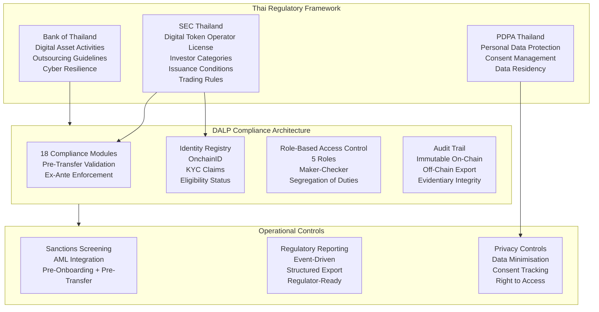

### 7.2 Bank of Thailand Compliance

The Bank of Thailand's framework for financial institutions engaging in digital asset activities imposes requirements across several dimensions that DALP addresses directly.

**Outsourcing and Third-Party Risk:** Bank of Thailand's IT Examination Manual and outsourcing guidelines require that material outsourced technology services maintain adequate controls, audit trails, and the bank's ability to oversee vendor activities. DALP's comprehensive audit logging, role separation, and configurable access controls enable Kasikornbank to maintain meaningful oversight of the platform operations. SettleMint provides full transparency on the platform's internal controls, architecture, and audit evidence, supporting Kasikornbank's vendor risk assessment and Board reporting obligations.

**Cybersecurity:** Bank of Thailand's Cybersecurity Framework for financial institutions aligns with international standards (ISO 27001, NIST Cybersecurity Framework). DALP's security architecture, defense-in-depth network segmentation, HSM-based key management, immutable audit logs, and independent security assessments, addresses these requirements. SettleMint holds ISO 27001 certification and undergoes regular independent penetration testing.

**Operational Resilience:** Bank of Thailand requires financial institutions to maintain business continuity planning and disaster recovery capability for critical systems. DALP's Restate-based durable execution engine, multi-AZ deployment architecture, and defined RTO/RPO commitments (covered in Section 12) provide the operational resilience documentation that Bank of Thailand examination requires.

**Digital Asset Activities Reporting:** Where Bank of Thailand requires reporting on digital asset positions, volumes, and risk exposures, DALP's structured event logging and reporting API enable automated generation of regulatory data extracts. All on-chain events are captured, timestamped, and exportable in structured formats.

### 7.3 SEC Thailand Compliance

The SEC Thailand's digital asset regulatory framework, encompassing the Digital Asset Business Act B.E. 2561 and subsequent notifications, creates a comprehensive compliance surface for Kasikornbank's tokenized securities activities.

**Investor Categorisation:** SEC Thailand defines investor categories that determine eligibility for different investment products: qualified institutional investors (QII), ultra-high-net-worth individuals (UHNW), high-net-worth individuals (HNW), and retail investors. DALP's compliance module configuration maps directly to these categories through claim-based verification:

| SEC Thailand Category | DALP Implementation | Confidence |
|---|---|---|
| Qualified Institutional Investor | OnchainID claim: `SEC_QII_VERIFIED` + institutional KYC | 🟢 Native |
| Ultra-High-Net-Worth Individual | OnchainID claim: `SEC_UHNW_VERIFIED` + accreditation check | 🟢 Native |
| High-Net-Worth Individual | OnchainID claim: `SEC_HNW_VERIFIED` + income/asset verification | 🟢 Native |
| Retail Investor | Default category; QII/UHNW/HNW claims required for restricted products | 🟢 Native |

**Investor Eligibility Enforcement:** DALP's Country Restriction module enforces jurisdiction-based eligibility. The Accreditation Status module enforces investor category requirements. The Holding Limit module enforces individual and aggregate position limits. All checks execute in sequence before any transfer completes, the compliance engine evaluates the full module set and blocks execution if any module returns a violation.

**Disclosure Obligations:** While DALP does not generate investor-facing disclosure documents (a legal drafting function), it maintains the metadata and event records that support disclosure compliance verification: issuance terms configuration, investor acknowledgement records, and complete transaction history with timestamps.

**Secondary Market Trading Controls:** SEC Thailand's requirements for regulated secondary market activity in digital tokens align directly with DALP's transfer control architecture: pre-transfer identity and eligibility verification, transfer restriction windows for restricted products, and immutable transaction records for audit and supervisory review.

### 7.3a Retail Investor SEC Thailand Compliance

Where Kasikornbank's tokenised securities programme distributes products to retail investors, as defined by the SEC Thailand's investor category framework, specific suitability and disclosure obligations apply beyond the institutional investor path. DALP's compliance architecture addresses these obligations as follows.

**Suitability Outcome Enforcement:** DALP does not conduct suitability assessments (a financial advisory function that requires human judgment and regulatory authorisation). However, once Kasikornbank's suitability assessment process has determined an investor's product eligibility, DALP's compliance engine enforces the resulting access restrictions unconditionally. A retail investor who has been assessed as unsuitable for a specific bond product type receives an OnchainID claim with the appropriate restriction flag; attempts by that investor to receive tokens of that product type are blocked at the contract level regardless of any application-layer instruction.

**Disclosure Acknowledgement Recording:** For products requiring retail investor disclosure under SEC Thailand requirements, DALP's investor onboarding workflow supports a disclosure acknowledgement step: a structured acknowledgement record is created in the investor's identity profile, timestamped, and associated with the specific product type being acknowledged. This record is stored off-chain (to allow for PDPA data subject rights) with a cryptographic commitment hash stored on-chain for integrity verification. The acknowledgement record is exportable for SEC Thailand examination and internal compliance audit.

**Retail-Specific Transfer Restrictions:** Retail investors have different transfer restriction profiles than institutional investors. DALP's compliance module configuration for retail investor instruments includes:
- Lower single-transaction limits (via Transfer Limit module)
- Stricter holding limits proportional to retail net worth thresholds (via Holding Limit module)
- Secondary market transfer restrictions limiting who retail investors can transfer to (e.g., only to other eligible retail investors or designated market makers via Transfer Approval module)
- Mandatory cooling-off period enforcement where SEC Thailand requires post-purchase reconsideration rights (via Time-Lock module)

**Retail Distribution Channel Separation:** Where retail investors access tokenised securities through Kasikornbank's retail banking channels (mobile app, internet banking), DALP's API layer provides the data interface for Kasikornbank's retail channel applications. The retail channel is responsible for user interface and disclosure flows; DALP enforces the underlying compliance controls independently of the channel application, ensuring that compliance is not bypassed by any channel implementation.

### 7.4 PDPA Thailand Compliance

Thailand's Personal Data Protection Act imposes requirements on how Kasikornbank collects, processes, stores, and transfers investor personal data. DALP's architecture addresses PDPA obligations:

**Data Minimisation:** DALP's on-chain data model stores only the minimum data required for operational compliance: investor wallet addresses, identity claim hashes (not underlying personal data), and compliance status indicators. Underlying personal data (names, ID numbers, income information) resides in Kasikornbank's off-chain KYC systems, not on-chain. This architecture ensures that blockchain immutability does not conflict with PDPA's right to erasure, personal data that can be erased is kept off-chain; the on-chain data model contains only non-reversible identifiers.

**Consent Management:** Where DALP's investor onboarding flows touch personal data collection, consent tracking mechanisms can be integrated with Kasikornbank's existing consent management systems through the API layer.

**Data Residency:** DALP's cloud deployment configuration allows Kasikornbank to specify data residency requirements. The recommended deployment in AWS ap-southeast-1 (Singapore) is reviewed against PDPA's cross-border transfer provisions. Where Thai data residency is required, SettleMint can support deployment on AWS ap-southeast-2 or a Thailand-based cloud provider as part of the architecture design in Phase 1.

**Access Logging:** All access to investor data within the DALP platform is logged with user identity, timestamp, data category accessed, and action taken, providing the audit trail required for PDPA's accountability principle.

### 7.5 Regulatory Mapping Table

| Regulatory Requirement | Relevant Regulation | DALP Control | Confidence |
|---|---|---|---|
| Digital asset operator compliance | SEC Thailand Digital Asset Business Act | Compliance engine with 18 module types | 🟢 Native |
| Investor categorisation enforcement | SEC Thailand Notification Re: Rules for Eligible Investors | OnchainID claims + Accreditation module | 🟢 Native |
| Pre-transfer eligibility validation | SEC Thailand digital token transfer rules | ERC-3643 protocol-level enforcement | 🟢 Native |
| KYC/KYB investor onboarding | SEC Thailand KYC requirements | Identity Registry + claim verification | 🟢 Native |
| Maker-checker approval workflows | Bank of Thailand internal control requirements | Built-in maker-checker with quorum | 🟢 Native |
| Audit trail and records | Bank of Thailand IT Examination Manual | Immutable on-chain log + off-chain export | 🟢 Native |
| Cyber incident reporting | Bank of Thailand Cybersecurity Framework | Structured incident log + alerting | 🟢 Native |
| Outsourcing risk management | Bank of Thailand outsourcing guidelines | Vendor transparency + control documentation | 🟢 Native |
| Personal data protection | PDPA Thailand | Off-chain PII, on-chain identifiers only | 🟢 Native |
| Data residency | PDPA Thailand + Bank of Thailand | Configurable deployment region | 🟢 Native |
| Sanctions and AML screening | Bank of Thailand AML/CFT requirements | API integration to existing screening systems | 🟡 Partial (external system integration) |
| Regulatory reporting to SEC/BOT | SEC Thailand reporting notifications | Structured data export API | 🟡 Partial (format mapping per regulator) |
| Suitability assessment | SEC Thailand suitability requirements | Claim-based verification; suitability data from external system | 🟡 Partial (integration point) |
| Smart contract change governance | Implicit in SEC Thailand digital asset rules | RBAC + change control workflow + audit trail | 🟢 Native |
| Emergency suspension capability | Regulatory intervention requirements | Platform-level pause + token-level pause | 🟢 Native |

---

## 8. Integration Architecture

### 8.1 Overview

Kasikornbank's enterprise systems landscape represents a sophisticated, multi-layered integration challenge that the tokenized securities platform must fit into rather than replace. DALP's API-first architecture, designed as an integration peer, not a standalone system, provides the connectivity patterns required to bridge the tokenized securities platform with Kasikornbank's existing infrastructure.

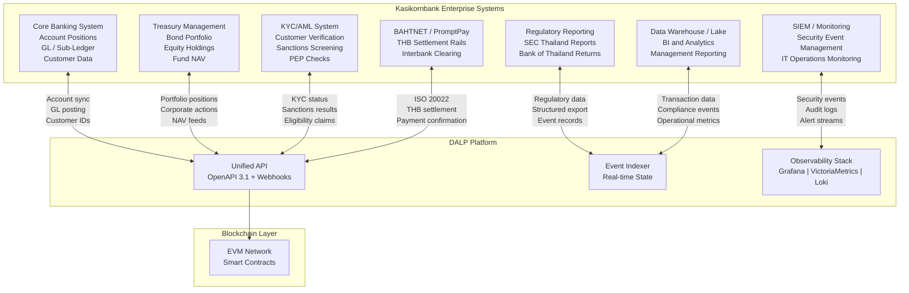

### 8.2 Core Banking Integration

The integration between DALP and Kasikornbank's core banking system addresses the following data flows:

**Investor Account Synchronisation:** Investor account identifiers from core banking are linked to OnchainID wallet addresses during onboarding. This linkage enables DALP to associate on-chain token holdings with core banking customer accounts for GL reconciliation and position reporting. The integration supports both initial bulk loading of investor accounts and ongoing synchronisation for new account openings.

**GL Posting:** On-chain asset events (issuance, coupon distribution, transfer, redemption) trigger structured notifications via webhook to Kasikornbank's GL integration layer. Each notification includes: event type, timestamp, asset identifier, amount in THB, investor account reference, and transaction hash for blockchain verification. Kasikornbank's GL team configures the mapping between DALP event types and GL journal entry templates. DALP does not write directly to the GL, it provides the structured event data that Kasikornbank's reconciliation team uses to post entries.

**Position Reconciliation:** DALP's indexer provides a real-time view of all token holder positions per asset. This view is exportable via API for nightly reconciliation against Kasikornbank's internal position management system. Any discrepancy between the on-chain token registry and the internal position system is surfaced as a reconciliation break for operations team review.

### 8.3 Payment Rail Integration (BAHTNET / PromptPay)

DALP's payment rail integration enables the cash leg of tokenized securities transactions to settle through Kasikornbank's existing THB payment infrastructure:

**BAHTNET Integration (Wholesale):** For institutional investors, THB settlement uses BAHTNET (Bank of Thailand's Real-Time Gross Settlement system) via ISO 20022 message formats. DALP generates payment instructions for bond coupon distributions, equity dividend payments, and redemption proceeds that are submitted to Kasikornbank's BAHTNET connectivity layer for execution. Payment confirmations from BAHTNET trigger the corresponding on-chain event confirmation in DALP.

**PromptPay Integration (Retail):** For eligible retail investor distributions (where SEC Thailand regulations permit), THB distributions can be routed through PromptPay for delivery to investor registered accounts. DALP generates the structured payment file; Kasikornbank's existing PromptPay connectivity handles the actual payment execution.

**Atomic DvP Settlement:** For secondary market transfers between institutional investors, DALP's XvP settlement module enables atomic Delivery-versus-Payment, the securities transfer and THB payment instruction are created as an atomic bundle where both complete or both revert. The cash leg uses Kasikornbank's internal book transfer capability for same-bank counterparties, or external BAHTNET instruction for cross-institution settlements.

### 8.4 KYC/AML Integration

**Sanctions and AML Screening:** DALP's pre-transfer compliance validation invokes Kasikornbank's existing AML and sanctions screening systems before processing any investor onboarding or token transfer. The integration uses DALP's webhook event system to trigger screening requests and receive responses. Screening results are attached to the compliance event record for audit purposes. If a screening system is unavailable, DALP's compliance engine defaults to blocking the transfer pending manual review, fail-safe by default.

**KYC Claim Issuance:** KYC verification outcomes from Kasikornbank's KYC platform are translated into OnchainID identity claims attached to the investor's on-chain identity. The claim issuance workflow operates as follows: KYC platform completes verification; result is transmitted to DALP's identity service API; DALP issues the appropriate claim (e.g., `KYC_VERIFIED`, `SEC_QII_VERIFIED`) to the investor's OnchainID; claim is valid until the KYC refresh date. Expired claims automatically block transfers until KYC is refreshed, enforcing continuous KYC obligations operationally.

**AML Case Management:** Where a transfer triggers an AML screening alert, DALP's exception handling workflow routes the alert to Kasikornbank's AML case management system via API. The transfer remains in a pending-review state until the AML case is adjudicated. Case outcomes are recorded in the DALP audit trail. If the case results in a restriction, DALP's compliance operator can update the investor's compliance status to block future transfers without engineering intervention.

### 8.4a KBTG Coexistence Design

Kasikornbank's KBTG technology group has made material blockchain infrastructure investments over several years. The tokenised securities platform architecture must be designed for coexistence with existing KBTG blockchain infrastructure rather than requiring decommissioning of prior investments.

**DALP's Default Coexistence Model:** DALP deploys on its own EVM-compatible blockchain network (recommended: a private Hyperledger Besu network dedicated to Kasikornbank's tokenised securities programme). This network operates independently of any existing KBTG blockchain infrastructure. The two networks can coexist without conflict; there is no technical requirement for integration between them unless Kasikornbank's programme design specifically requires cross-network settlement or asset portability.

**Phase 1 Architecture Assessment:** The specific coexistence design, including any KBTG network bridge, shared identity layer, or cross-network settlement path, is assessed in Phase 1 of the implementation as part of the current-state architecture review. SettleMint's solution architects will review KBTG's existing network architecture, identify any integration points that would benefit the tokenised securities programme, and design the coexistence model accordingly. Common coexistence patterns include:

- **Parallel operation** (most common): DALP's tokenised securities network and KBTG's existing network operate independently, sharing no components. Kasikornbank manages both networks as separate infrastructure.
- **Shared identity layer**: If KBTG has implemented an on-chain identity system, DALP's OnchainID can be configured to recognise verified claims issued by KBTG's trusted issuer, eliminating duplicate KYC processes for shared investor populations.
- **Cross-network atomic settlement**: Where KBTG's network hosts a tokenised currency instrument (e.g., a THB stablecoin), DALP's HTLC settlement module can execute cross-chain DvP between assets on DALP's network and currency on KBTG's network. This architectural option is assessed for feasibility in Phase 1.

**No Lock-In to KBTG Architecture:** DALP's design does not require integration with KBTG's existing blockchain to operate. If the Phase 1 assessment determines that integration adds complexity without proportionate value, DALP operates as a standalone network. KBTG's existing investments are not disrupted by DALP's deployment.

### 8.5 Regulatory Reporting Integration

DALP's indexer captures every on-chain event in structured form, providing the data foundation for SEC Thailand and Bank of Thailand regulatory reporting:

**Transaction-Level Data:** Every token transfer, issuance, coupon payment, and redemption is captured with: timestamp (on-chain + off-chain), asset identifier, transaction counterparties (pseudonymous on-chain identities linked to investor accounts), THB amount, transaction hash, compliance module evaluation results, and operator identity. This data set provides the transaction-level audit trail that regulatory examination requires.

**Aggregate Reporting:** DALP's reporting API supports queries for aggregate positions, transaction volumes by instrument type, investor category distribution, and compliance event counts, structured for export to Kasikornbank's regulatory reporting system. Report formats are configurable to match SEC Thailand's required reporting structures.

**Audit Evidence Export:** For Bank of Thailand examination or SEC Thailand inspection, DALP's audit export generates a tamper-evident package of all relevant records for a specified time period and asset scope, with cryptographic verification of record integrity. This provides Kasikornbank's compliance team with a ready-made evidence pack rather than manual data assembly under examination time pressure.

---

## 9. Custody and Key Management

### 9.1 Key Management Architecture

Cryptographic key management is the most operationally sensitive component of any tokenized securities programme. A key compromise is a catastrophic event; a key loss is an operational crisis. DALP's Key Guardian provides a structured approach to key management that matches the security requirements of Kasikornbank's tokenized securities operations.

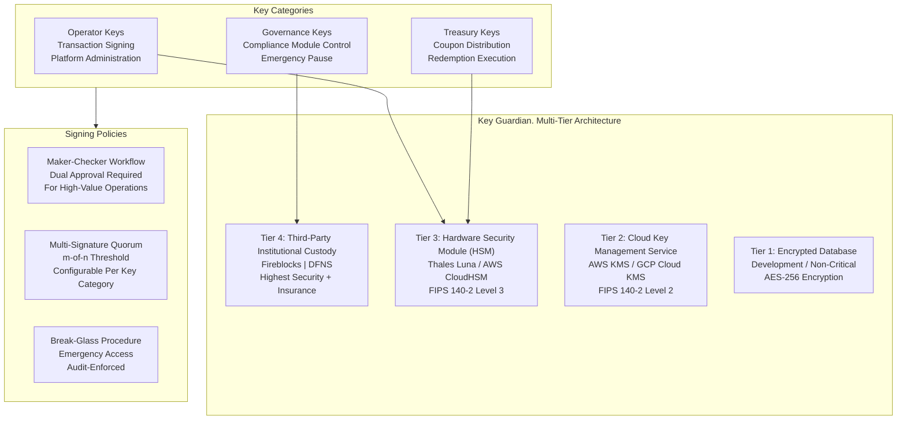

**Tier Selection for Kasikornbank:** SettleMint recommends the following key tier assignments for Kasikornbank's production deployment:

- **Governance keys** (compliance module control, emergency pause): Tier 4 (Fireblocks or DFNS), the highest security level with institutional custody insurance, transaction-level policy controls, and hardware-backed key storage. Changes to compliance rules or emergency pause of the platform require governance key approval.
- **Treasury keys** (coupon distribution, redemption execution): Tier 3 (HSM), hardware-backed key storage with FIPS 140-2 Level 3 certification, supporting high-frequency distribution operations with strong security guarantees.
- **Operator keys** (day-to-day transaction processing): Tier 3 (HSM), for production operations; Tier 2 (cloud KMS) acceptable for development environments.

### 9.2 Maker-Checker and Multi-Signature Policies

All high-value and high-risk operations in Kasikornbank's tokenized securities platform require dual approval through DALP's maker-checker workflow. The following operations require mandatory maker-checker:

| Operation | Maker | Checker | Quorum |
|---|---|---|---|
| Bond issuance (primary) | Bond Issuance Operator | Compliance Officer | 2-of-2 |
| Coupon distribution execution | Treasury Operator | Treasury Supervisor | 2-of-2 |
| Investor eligibility override | Compliance Analyst | Compliance Manager | 2-of-2 |
| Compliance module change | Compliance Manager | Head of Compliance | 2-of-2 |
| Emergency pause | Any authorised operator | N/A (single-approver emergency) | 1-of-N |
| Emergency unpause | Head of Operations | Head of Risk | 2-of-2 |
| New trusted issuer addition | Compliance Manager | CTO or delegate | 2-of-3 |
| Platform configuration change | Platform Engineer | Solution Architect | 2-of-2 |

### 9.3 Emergency and Break-Glass Procedures

**Emergency Pause:** Any authorised operator can pause token transfers at either the platform level (pausing all assets) or the individual asset level (pausing a specific bond or equity) immediately. No second approval is required for the pause action, enabling immediate containment. The pause is immutably recorded with the operator identity, timestamp, and stated reason. All pause invocations are automatically surfaced on the security dashboard and trigger an alert to the Security Operations team.

**Break-Glass Access:** For emergency situations requiring access to key material outside normal approval workflows (e.g., incident response when primary approvers are unavailable), DALP's break-glass procedure provides a documented emergency access path. Break-glass access requires: multi-party authentication from two senior authorised individuals; recording of the access event in the immutable audit log; immediate notification to the Security function and Chief Risk Officer; and mandatory post-event review within 24 hours. The break-glass mechanism is tested in controlled conditions at least annually.

**Key Rotation:** Cryptographic keys are rotated on a schedule aligned with Kasikornbank's key management policy and Bank of Thailand cybersecurity requirements. DALP supports key rotation without operational disruption through a managed rotation workflow: new key material is provisioned, transactions are routed to the new key, the old key remains available for signature verification of historical transactions, and the old key is decommissioned after a configurable rotation window.

### 9.4 Bring-Your-Own-Custodian Model

DALP does not act as a custodian for Kasikornbank's cryptographic key material. The Key Guardian operates in two models:

**Self-Managed Custody:** Kasikornbank retains full control of key material through HSM integration. SettleMint provides the Key Guardian software and HSM connectivity; Kasikornbank manages the HSM hardware and key material. This model provides maximum control and is compatible with Kasikornbank's vendor risk management requirements.

**Third-Party Institutional Custody:** Through Fireblocks or DFNS integration, Kasikornbank can leverage institutional-grade custody services with insurance coverage, hardware-backed key storage, and transaction-level policy controls. DALP orchestrates transaction approval and execution; the custody provider handles signing and broadcast. In this model, the custody provider owns nonce allocation, gas handling, signing, and broadcast while DALP retains the permissioning and workflow control layer.

---

## 10. Settlement and Operations

### 10.1 Settlement Model

DALP's settlement architecture for Kasikornbank's tokenized securities programme supports three settlement models depending on the counterparty relationship and instrument type:

**Book-Entry Internal Settlement (Same-Bank):** For transactions between Kasikornbank's own accounts or between two Kasikornbank customers, settlement occurs as an atomic book transfer within the DALP platform, the token changes hands, the THB cash leg is handled as an internal book transfer in Kasikornbank's core banking system, and both legs reconcile atomically. This is the lowest-friction model for intra-bank transactions.

**Delivery-versus-Payment (DvP) Settlement:** For transactions between different institutional counterparties, DALP's XvP settlement module coordinates the atomic exchange: a settlement contract locks both the token transfer and the payment instruction simultaneously, and both execute atomically when both parties confirm readiness. If either party fails to confirm within the settlement window, both legs revert cleanly, no failed settlements, no manual unwinding.

**Deferred Net Settlement (DNS) Integration:** For high-volume secondary market activity where gross atomic settlement would be inefficient, DALP supports deferred net settlement through its settlement batching capability, accumulating gross transactions during the trading day and submitting net positions for end-of-day settlement through Kasikornbank's BAHTNET connection.

### 10.2 Operational Dashboards

DALP's pre-built Grafana dashboards provide Kasikornbank's operations team, risk team, and compliance team with real-time visibility into the tokenized securities platform:

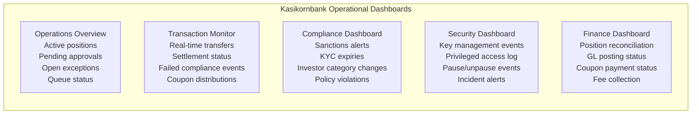

**Operations Overview:** Displays active asset positions across all instrument types; pending maker-checker approvals with aging; open exception queue items with SLA status; and interface health indicators for all connected enterprise systems. First-line operations teams use this dashboard as their primary command view.

**Transaction Monitor:** Real-time transaction feed with filtering by asset type, investor, amount range, and compliance status. Compliance violation events display with structured reason codes and the specific module that blocked execution. Settlement status tracking for DvP transactions with countdown timers for pending confirmations. Coupon and dividend distribution progress tracking for batch operations.

**Compliance Dashboard:** Investor KYC expiry alerts (configurable advance notice: 30 days, 14 days, 7 days, 1 day). Sanctions screening alert queue with case management integration status. Investor category change events that may affect eligibility for existing holdings. Active compliance policy changes with approval status and effective dates.

**Security Dashboard:** Cryptographic key management events (rotation, access, break-glass). Privileged administrative action log with operator identity. Platform pause and unpause events. Security alert feed from the observability stack. Incident ticket status.

### 10.2a DvP Settlement Sequence

The following sequence diagram shows the complete Delivery-versus-Payment settlement flow for a secondary market tokenised bond transaction between two institutional investors at Kasikornbank.

```mermaid
sequenceDiagram
    participant Seller as Seller (Institutional Investor)
    participant DALP as DALP Platform
    participant Compliance as Compliance Engine
    participant Settlement as Settlement Contract
    participant Buyer as Buyer (Institutional Investor)
    participant BAHTNET as BAHTNET / Payment Rail
    participant GL as Kasikornbank GL

    Seller->>DALP: Initiate DvP settlement (bond amount, THB consideration)
    DALP->>Compliance: Pre-settlement compliance check (Seller eligibility)
    Compliance-->>DALP: Seller eligible (KYC current, no restrictions)
    DALP->>Compliance: Pre-settlement compliance check (Buyer eligibility)
    Compliance-->>DALP: Buyer eligible (QII claim verified, holding limit OK)
    DALP->>Settlement: Create settlement contract (lock seller's tokens)
    Settlement-->>DALP: Settlement ID created; tokens locked
    DALP->>Buyer: Notify settlement pending; request confirmation
    Buyer->>DALP: Confirm readiness (within settlement window)
    DALP->>BAHTNET: Submit THB payment instruction (Buyer to Seller)
    BAHTNET-->>DALP: Payment confirmed
    DALP->>Settlement: Execute atomic settlement (bond transfer + payment)
    Settlement-->>DALP: Both legs confirmed; settlement complete
    DALP->>GL: Post settlement event (bond transfer + THB amount)
    GL-->>DALP: GL posting confirmed
    DALP->>Seller: Settlement notification
    DALP->>Buyer: Settlement notification

    Note over Settlement,BAHTNET: Timeout path: if Buyer fails to confirm within window,<br/>Settlement contract reverts both legs atomically.<br/>Tokens returned to Seller; no payment initiated.

    Note over DALP,Compliance: Compliance failure path: if pre-check fails,<br/>Settlement blocked before contract creation.<br/>Structured rejection event with reason codes generated.
```

**Settlement Window:** Configurable per instrument type; recommended T+0 same-day for intra-bank, T+1 for institutional cross-bank. The settlement window enforcement is handled by the settlement contract's expiry logic, not a cron job or manual intervention. If the window expires without Buyer confirmation, the settlement contract executes the revert path atomically.

**Failed Settlement Handling:** When settlement reverts due to timeout, both the Seller and Buyer receive structured settlement failure events with reason codes. The Seller's tokens are automatically released from lock. Operations team receive an alert through the dashboard; no manual token unlocking is required. The failed settlement event is recorded in the audit trail with full timing and participant detail.

### 10.3 Exception Handling

DALP's exception handling architecture addresses the specific failure modes that regulated securities operations encounter:

**Failed Settlement Events:** When a DvP settlement expires (counterparty fails to confirm within the window), both legs revert atomically and a failed settlement event is generated. The event includes: trade reference, counterparty identifiers, failure reason, expiry timestamp, and recommended resolution path. Operations teams receive the alert immediately through the dashboard and configured notification channels.

**Reconciliation Breaks:** Where the on-chain token registry and Kasikornbank's internal position system show a discrepancy, the nightly reconciliation job generates a structured break report categorising each break by: type (timing difference, missing event, amount mismatch), severity, associated transaction reference, and suggested resolution. Operations teams are responsible for investigating and resolving breaks; DALP provides the evidence trail to support investigation.

**Network Outage Handling:** DALP's Restate durable execution engine ensures that in-progress workflows survive network outages or process restarts. A bond issuance workflow that is interrupted mid-execution resumes from the last successfully completed step when connectivity is restored, without creating orphaned partial states. Transaction status is observable during the outage through the last committed state in the indexer.

**Compliance System Unavailability:** When an external compliance system (AML screening, KYC provider) is unavailable, DALP defaults to blocking transfers pending manual review. This fail-safe posture is explicit and configurable: Kasikornbank's compliance team can configure specific instrument types to allow provisional processing with mandatory post-processing screening (for liquid instruments where blocking would cause operational harm) or absolute blocking (for restricted instruments where any unscreened transfer would be unacceptable).

---

## 11. Security Architecture

### 11.1 Defense-in-Depth Security Model

DALP's security architecture follows a defense-in-depth model appropriate for regulated financial market infrastructure operating in Thailand. The model implements controls at every layer of the technology stack, ensuring that a failure at any single layer does not create an exploitable attack surface.

```mermaid
graph TB
    subgraph Perimeter["Perimeter Security"]
        WAF["Web Application Firewall\nOWASP Top 10 Protection\nDDoS Mitigation"]
        DDOS["DDoS Protection\nCloudfront / AWS Shield\nRate Limiting"]
        VPN["VPN / Private Connectivity\nKasikornbank Network Integration\nZero-Trust Network Access"]
    end
    subgraph Network["Network Security"]
        SEG["Network Segmentation\nVPC Isolation\nPrivate Subnets\nSecurity Groups"]
        TLS["TLS 1.3 Everywhere\nCertificate Management\nMTLS for Service Mesh"]
        PRIV["Private Endpoints\nNo Public IP for DB / RPC\nInternal Load Balancers"]
    end
    subgraph Application["Application Security"]
        AUTH["Authentication\nAPI Key + Session Auth\nHard Auth-Endpoint Affinity"]
        RBAC["Role-Based Access Control\n5 Defined Roles\nLeast Privilege Enforcement"]
        INPUT["Input Validation\n534 Structured Error Codes\nArbitrary-Precision Arithmetic"]
    end
    subgraph Data["Data Security"]
        ENC["Encryption at Rest\nAES-256 for All Data\nKMS-Managed Keys"]
        KM["Key Management\nHSM / Fireblocks / DFNS\nFIPS 140-2 Level 3"]
        AUDIT["Immutable Audit Log\nTamper-Evident Records\nCryptographic Chaining"]
    end
    subgraph SmartContract["Smart Contract Security"]
        AUDIT2["Smart Contract Audits\nSpecialised Blockchain Security Firms\nAnnual + Change-Triggered"]
        IMM["Immutable Core Logic\nUpgradeable Compliance Only\nProxy Pattern Safety"]
        FORMAL["Formal Verification\nCritical Compliance Paths\nMathematical Correctness Proof"]
    end

    Perimeter --> Network
    Network --> Application
    Application --> Data
    Data --> SmartContract
```

### 11.2 Identity and Access Management

**Authentication Architecture:** DALP implements a two-endpoint authentication model with hard enforcement of authentication-method-to-endpoint affinity. The dApp frontend uses session-based authentication (browser sessions with CSRF protection); the API endpoint uses API-key authentication (for programmatic integration). This separation eliminates session token theft attacks on the API surface and prevents API key misuse against the browser session surface.

**Role-Based Access Control:** DALP defines five operational roles with precisely scoped permissions:

| Role | Permissions | Kasikornbank Assignment |
|---|---|---|
| Token Owner | Full asset control including issuance, feature changes | Digital Assets Programme Lead |
| Compliance Officer | Compliance module configuration, investor eligibility overrides, pause/unpause | Head of Compliance (Digital Assets) |
| Transfer Agent | Transfer execution, investor management, KYC claim issuance | Operations Team Leads |
| Investor | Token receiving, holding, redemption requests | External investors (limited scope) |
| Platform Admin | Environment configuration, user management, monitoring | IT Operations (Digital Assets) |

**Privileged Access Management:** All privileged operations (role changes, compliance module modifications, governance key usage) are gated through the maker-checker workflow and logged immutably. Privileged access is granted through time-bound approvals with automatic expiry for elevated administrative access. Emergency administrative access through the break-glass procedure requires multi-party authentication and triggers immediate senior management notification.

### 11.3 Vulnerability Management

**Penetration Testing:** DALP undergoes annual penetration testing by independent third-party security firms, with scope covering the application layer, API surface, network perimeter, key management integration, and smart contract interfaces. Kasikornbank's internal security team receives the full penetration testing report, and critical findings are remediated before production deployment. Additional targeted assessments are conducted following material platform changes or in advance of regulatory examinations.

**Smart Contract Audits:** All DALP smart contracts are audited by specialised blockchain security firms. Audit scope covers: reentrancy vulnerabilities, integer overflow/underflow, access control correctness, compliance bypass attempts, upgrade mechanism safety, and economic attack vectors. Audit reports are available for review by Kasikornbank's technical team as part of vendor due diligence.

**Vulnerability Disclosure and Patching:** SettleMint operates a responsible vulnerability disclosure programme. Critical security patches are applied on an accelerated timeline outside the standard release cadence, with maximum practical advance notice to Kasikornbank. Patch deployment uses DALP's zero-downtime deployment architecture for application-layer patches; smart contract patches follow a controlled upgrade governance workflow with Kasikornbank approval.

**CERT-In Alignment (for cross-border operations):** Where Kasikornbank's tokenized securities programme involves Indian investor onboarding or India-connected trade counterparties, DALP's incident reporting architecture supports CERT-In notification requirements for cybersecurity incidents within the mandated 6-hour window through structured incident log export.

### 11.4 Data Protection

**Encryption at Rest:** All data stored by DALP. PostgreSQL databases, object storage, log aggregation systems, is encrypted using AES-256 with keys managed through the Key Guardian (cloud KMS for data encryption keys, HSM for key encryption keys). Database encryption is transparent to the application layer and does not impact query performance.

**Encryption in Transit:** All communications within the DALP platform use TLS 1.3. Service-to-service communication within the platform uses mutual TLS (mTLS). The blockchain RPC connection to the EVM network uses TLS-secured RPC endpoints. The connection between DALP and Kasikornbank's enterprise systems uses TLS over VPN or AWS Direct Connect / Private Link where available.

**Log Integrity:** DALP's audit log maintains cryptographic chaining between log entries, each entry includes a hash of the previous entry, creating a tamper-evident chain. Any modification to historical log entries is immediately detectable. Log entries are written to immutable log storage with write-once, read-many access controls. This architecture provides the evidentiary integrity that Bank of Thailand examination and SEC Thailand inspection require.

---

## 12. Deployment Options

### 12.1 Recommended Deployment: Dedicated Cloud (AWS ap-southeast-1)

SettleMint recommends deployment in a dedicated cloud environment within AWS ap-southeast-1 (Singapore) for Kasikornbank's initial production deployment. This deployment model provides:

- **Data residency:** AWS ap-southeast-1 is the nearest major cloud region to Thailand with full compliance capability and PDPA cross-border transfer provisions applicable to Singapore. For Thai domestic data residency requirements, SettleMint can assess AWS ap-southeast-2 or a Thailand-based alternative in Phase 1.
- **Dedicated tenant isolation:** Kasikornbank's DALP deployment operates in a dedicated Kubernetes namespace with no resource sharing across other SettleMint customers. Network policies enforce strict isolation between Kasikornbank's workloads and any other platform tenants.
- **Managed service SLA:** SettleMint manages the cloud infrastructure, Kubernetes cluster, observability stack, and platform updates. Kasikornbank retains oversight visibility through the observability dashboards and receives management access to the monitoring layer.

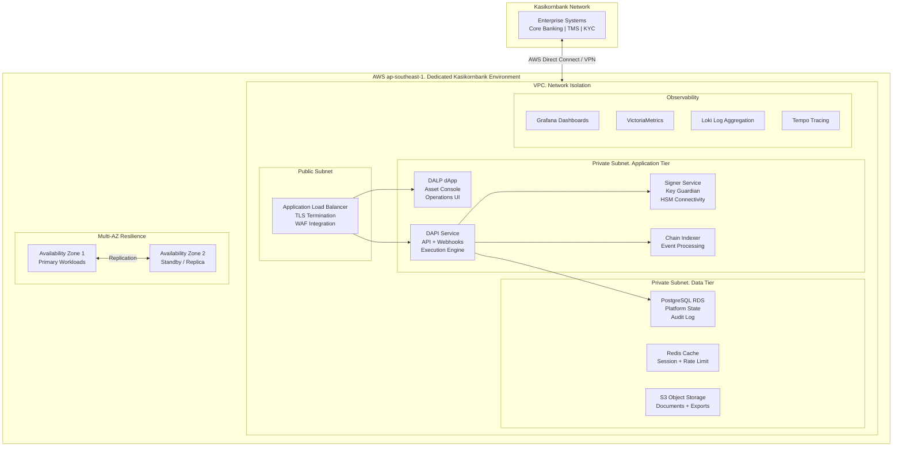

### 12.2 Alternative: On-Premises Deployment

For Kasikornbank requiring full infrastructure control, for example if Bank of Thailand's examination requires the bank to demonstrate direct control over all systems. DALP's Helm-based deployment supports on-premises installation in Kasikornbank's own data centres or private cloud infrastructure.

**On-Premises Deployment Characteristics:**
- All DALP components deployed on Kasikornbank-managed Kubernetes clusters
- Key Guardian connects to Kasikornbank-managed HSM hardware
- No SettleMint access to infrastructure; monitoring data remains entirely within Kasikornbank's network perimeter
- Kasikornbank's IT operations team manages platform updates with SettleMint's support
- Blockchain node deployment on Kasikornbank's infrastructure or via node-as-a-service providers

**Infrastructure Requirements (On-Premises):**
- Kubernetes cluster with minimum 8 worker nodes (production), 4 worker nodes (development)
- HSM appliance: Thales Luna SA or equivalent, FIPS 140-2 Level 3 certified
- PostgreSQL database: version 15+, with streaming replication for HA
- Object storage: S3-compatible (MinIO or RustFS for on-premises)
- Network bandwidth: minimum 1Gbps to blockchain node(s)

### 12.3 Hybrid Deployment Option

For Kasikornbank requiring data residency for specific data categories within Thailand while accepting managed cloud for other components, a hybrid deployment is available:

- **Thailand on-premises:** Database and log storage (personal data, audit records); key management (HSM)
- **AWS ap-southeast-1:** Application tier, observability, and blockchain connectivity

This model satisfies the most stringent data residency interpretations while maintaining the operational advantages of managed cloud for compute workloads.

### 12.4 Environment Architecture

For Kasikornbank's tokenized securities programme, SettleMint recommends a three-environment architecture:

| Environment | Purpose | Configuration |
|---|---|---|
| **Production** | Live tokenized securities operations | Full HA, multi-AZ, HSM key management, production blockchain |
| **Staging / Pre-Production** | UAT and release validation | Production-equivalent configuration; synthetic blockchain data |
| **Development** | Integration development and testing | Simplified configuration; testnet blockchain |

The Development environment is covered by the Development License (€120,000/year). The Production environment is covered by the Production License (€300,000/year). Staging is recommended as a separate production-grade environment for pre-production validation and is priced as a Production environment if operated as a live environment, or as a Development environment if used exclusively for testing.

---

## 13. Implementation Approach

### 13.1 Overview

SettleMint's implementation methodology for Kasikornbank's tokenized securities programme follows a phase-gated approach designed for regulated institutional environments. The standard delivery timeline spans 15–19 weeks from kickoff to production go-live, followed by a 4-week hypercare period. The methodology is designed to transfer operating capability to Kasikornbank's teams, not to create permanent vendor dependency.

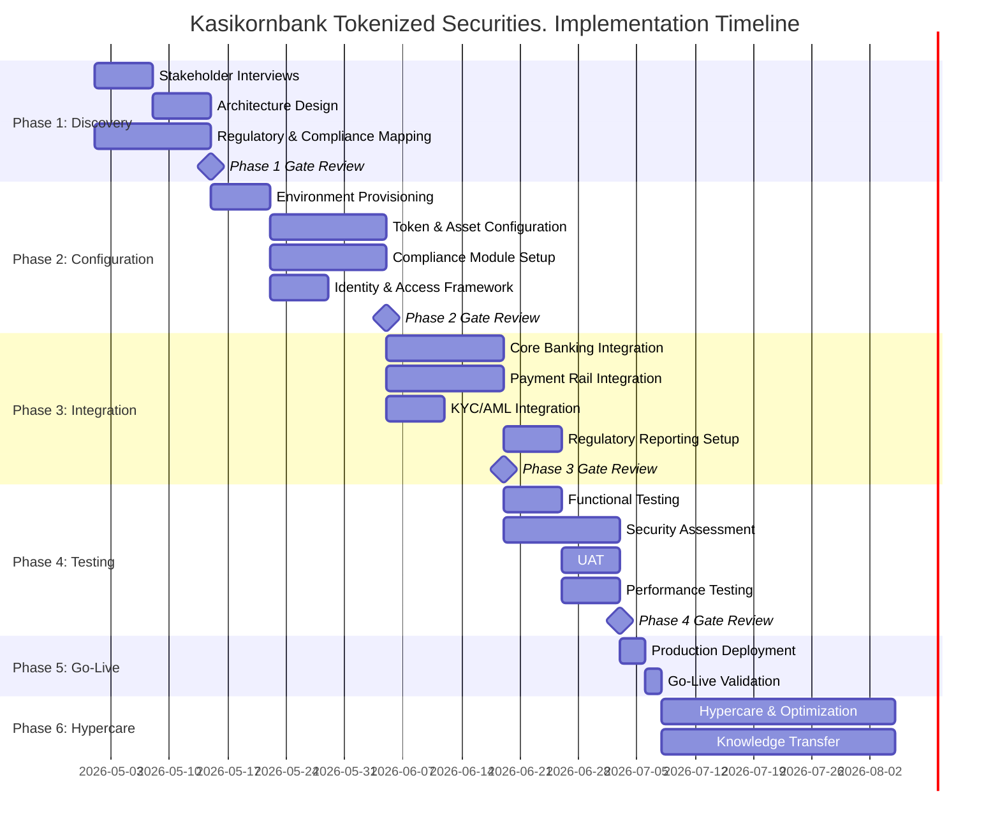

### 13.2 Phase 1: Discovery and Requirements (Weeks 1–3)

The Discovery phase establishes the validated architecture design and programme roadmap for Kasikornbank's tokenized securities environment.

**Key Activities:**
- Structured stakeholder interviews with Digital Assets Programme Lead, Head of Compliance, Head of Operations, Treasury Management, Core Banking IT, Legal and Risk functions, and Internal Audit
- Current-state assessment of relevant workflows: bond issuance, equity management, fund administration, investor onboarding, and settlement operations
- Regulatory and compliance mapping against Bank of Thailand, SEC Thailand (Digital Asset Business Act), and PDPA Thailand, producing a control mapping document that links each regulatory obligation to a specific DALP control or integration point
- Asset class and lifecycle scoping: defining target instrument types (government bonds, corporate bonds, listed equities, mutual fund units), lifecycle events, and business rules per instrument
- Architecture design: deployment topology, network selection, custody integration model, and enterprise connectivity plan
- Risk assessment: RAID register tailored to Thailand-specific risks including regulatory interpretation, KBTG integration dependencies, and third-party custody timeline

**Deliverables:**
- Business Requirements Document (BRD) with validated functional and non-functional requirements
- Regulatory and Compliance Matrix mapping Bank of Thailand, SEC Thailand, and PDPA obligations to DALP controls
- Target Architecture Document covering deployment topology, integration architecture, and security model
- Implementation Roadmap with phase plan, milestones, dependencies, and resource requirements
- RACI Matrix with clear responsibility assignment across Kasikornbank and SettleMint teams

**Kasikornbank Responsibilities:**
- Designate a project sponsor and dedicated project manager with authority to make binding decisions
- Make key stakeholders available for structured interviews (minimum 3 hours each)
- Provide current systems architecture documentation: core banking APIs, BAHTNET connectivity, KYC system interfaces, AML platform specifications
- Provide SEC Thailand and Bank of Thailand regulatory interpretations from legal/compliance team
- Designate an RBAC model owner responsible for role design decisions

### 13.3 Phase 2: Configuration and Setup (Weeks 4–7)

**Key Activities:**
- Provisioning of development, staging, and production DALP environments on agreed infrastructure
- Bond token configuration: THB denomination, coupon structures for government and corporate bonds, maturity logic, call/put conditions, SEC Thailand compliance module configuration
- Equity token configuration: dividend distribution mechanics, voting power integration, corporate action workflow configuration
- Fund unit configuration: NAV feed integration, subscription/redemption windows, AUM fee structures
- Compliance module configuration: investor categorisation claims (QII, HNW, retail), country restrictions (Thailand residents + approved foreign categories), holding limits, supply limits, KYC expiry enforcement
- Identity and access framework: OnchainID configuration, RBAC role assignment, maker-checker quorum policies
- Key management setup: HSM connectivity, key hierarchy definition, signing policy configuration

### 13.4 Phase 3: Integration (Weeks 8–11)

**Key Activities:**
- Core banking API integration: investor account synchronisation, GL event posting, position reconciliation
- BAHTNET integration: ISO 20022 message configuration for THB settlement instructions, payment confirmation handling
- PromptPay integration for retail distribution channels (where SEC Thailand regulations permit)
- KYC/AML integration: claim issuance workflow from KYC platform, sanctions screening pre-transfer hook
- Regulatory reporting integration: event-driven data export to SEC Thailand and Bank of Thailand reporting systems
- SIEM integration: DALP security event forwarding to Kasikornbank's security monitoring platform
- Data warehouse integration: transaction data and compliance event export for BI and management reporting

### 13.5 Phase 4: Testing and UAT (Weeks 12–14)

**Test Strategy:**

| Test Type | Scope | Responsibility | Evidence |
|---|---|---|---|
| Unit Testing | Token contract functions, compliance module logic | SettleMint | Test report |
| System Integration Testing (SIT) | End-to-end workflows across DALP and integrated systems | SettleMint + Kasikornbank | SIT report |
| User Acceptance Testing (UAT) | Business scenario validation by Kasikornbank business and operations teams | Kasikornbank (facilitated by SettleMint) | UAT sign-off |
| Security Assessment | Penetration testing, vulnerability scan, smart contract audit | Independent third party | Security report |
| Performance Testing | Transaction throughput, API latency, settlement timing | SettleMint | Performance report |
| Compliance Validation | Ex-ante compliance enforcement across all investor categories and instrument types | SettleMint + Kasikornbank Compliance | Compliance validation report |
| Disaster Recovery Testing | RTO/RPO validation, failover execution, Restate recovery | SettleMint | DR test report |
| Cyber Response Tabletop | Incident response simulation for key compromise, DDoS, regulatory intervention scenarios | SettleMint + Kasikornbank Security | Tabletop exercise record |

### 13.6 Phase 5: Go-Live (Week 15)

**Go-Live Activities:**
- Production deployment execution per the validated deployment runbook
- Go/no-go criteria validation: infrastructure health, integration connectivity, compliance enforcement validation, key management verification, and observability confirmation
- Cutover command structure: named go/no-go authority, rollback trigger criteria, and stakeholder communication plan
- Smoke-test execution in production: standard transaction flows, compliance blocking validation, settlement execution, and reporting data validation
- On-site SettleMint support team present during go-live window

### 13.7 Phase 6: Hypercare and Optimization (Weeks 16–19)

**Hypercare Activities:**
- Dedicated monitoring of platform health, transaction volumes, compliance events, and integration stability
- Daily issue review meetings with Kasikornbank operations and SettleMint support teams
- Performance optimisation based on production workload patterns
- Knowledge transfer completion: role-based training sessions, runbook validation, tabletop exercises for key operational scenarios
- Formal operational readiness assessment: confirmation that Kasikornbank's teams can independently manage day-to-day operations
- Managed transition to contracted support tier

### 13.8 Resource Model

**SettleMint Team:**

| Role | Phases | Responsibility |
|---|---|---|
| Delivery Lead | All phases | Programme governance, escalation, client interface |
| Solution Architect (Thailand specialist) | Phases 1–4 | Architecture design, integration design, technical oversight |
| Platform Engineer | Phases 2–5 | Environment provisioning, configuration, deployment |
| Integration Engineer | Phases 3–4 | Core banking, payment rail, and third-party integrations |
| QA / Test Lead | Phases 3–4 | Test strategy, SIT execution, UAT facilitation |
| Compliance Specialist | Phases 1–2, 4 | SEC Thailand and PDPA compliance mapping |
| Support Engineer | Phase 5–6 | Go-live support, hypercare, knowledge transfer |

**Kasikornbank Team Requirements:**

| Role | Required Engagement |
|---|---|
| Project Sponsor | Phase gate approvals, escalation authority |
| Project Manager | Full programme, Kasikornbank workstream coordination |
| Technical Lead / Architect | Phases 1–4, integration and security decisions |
| Core Banking IT Lead | Phase 3 integration (API access, GL mapping) |
| BAHTNET / Payments IT | Phase 3 integration (payment rail connectivity) |
| KYC/AML System Owner | Phase 3 integration (claim issuance, screening hooks) |
| Compliance Manager | Phases 1–2, 4 (regulatory mapping, compliance validation) |
| Security / InfoSec Lead | Phases 2, 4 (security review, penetration testing) |
| Operations Team Lead | Phases 4, 6 (UAT, knowledge transfer) |

---

## 14. Support and SLA

### 14.1 Support Tier Recommendation

SettleMint recommends **Premium Support** for Kasikornbank's tokenized securities deployment, with the option to upgrade to Enterprise Support as the programme scales to multi-asset, high-volume operations.

**Premium Support provides:**
- Extended coverage hours: 07:00–22:00 CET, Monday–Friday; on-call for P1 on weekends
- Dedicated Slack channel for real-time communication with SettleMint support engineers
- Named support engineer familiar with Kasikornbank's specific deployment and configuration
- P1 response target: 1 hour; P2 response: 4 hours; P3 response: 1 business day
- P1 resolution target: 4 hours; P2 resolution: 8 hours
- Monthly business review with technical deep-dive
- 99.95% monthly uptime SLA (approximately 22 minutes maximum monthly downtime)

### 14.2 Severity Classification

| Severity | Classification | Examples in Kasikornbank Context |
|---|---|---|
| P1: Critical | Production down | DALP platform unresponsive; compliance engine bypass; settlement failure in production; Key Guardian signing failure |
| P2: High | Major impact | Settlement delays exceeding SLA; KYC verification failures blocking investor onboarding; observability stack down; major core banking integration failure |
| P3: Medium | Workaround available | Reporting delay; non-critical API endpoint degradation; dashboard rendering issues; coupon distribution delay with manual alternative available |
| P4: Low | Minor / cosmetic | UI cosmetic defect; documentation error; minor logging inconsistency |

### 14.3 Business Continuity

**RTO (Recovery Time Objective):** 4 hours for critical platform services in a managed cloud deployment (standard maintenance scenarios). 2 hours for P1 incident response restoration target under Premium Support.

**RPO (Recovery Point Objective):** 1 hour for database restore in a managed cloud deployment with hourly automated backups and point-in-time recovery capability.

**Disaster Recovery:** DALP's multi-AZ deployment provides automated failover between availability zones within the same region, no data loss and minimal service interruption for infrastructure-level failures. For a full region failure, SettleMint's managed deployment includes cross-region backup restoration capability with RPO of 4 hours.

**Blockchain Node Resilience:** DALP's Chain Gateway operates with multiple RPC endpoint configurations. If the primary blockchain node endpoint is unavailable, the gateway automatically routes to backup endpoints, maintaining platform operation during node connectivity issues.

---

## 15. Reference Projects

The following table provides a comprehensive overview of SettleMint's 14 production deployments relevant to Kasikornbank's evaluation. All references are live or in active production planning unless otherwise noted.

| Institution | Use Case | Region | Asset Class | Regulatory Context | Status |
|---|---|---|---|---|---|
| OCBC Bank | Security token engine; securitization, tokenization, fractionalization; HNWI investment products | Singapore | Bonds, SPVs, Real Estate | MAS, SGX | Live / Multi-year production |
| KBC Securities (Bolero) | Equity crowdfunding + SME loans; smart contracts for issuance, lifecycle, corporate actions | Belgium | Equities, Loans | FSMA, EU | Live |
| KBC Insurance | NFT product passports for insured assets; valuation and claims | Belgium | NFT / Insurance | FSMA | Live |
| Standard Chartered Bank | Digital Virtual Exchange; fractional tokenization; institutional trading across Asia, Africa, Middle East | Multi-region APAC | Securities | MAS + multi-jurisdiction | Live |
| Reserve Bank of India Innovation Hub | Multi-bank letter of credit trade finance; multi-node, multi-cloud blockchain | India | Trade Finance | RBI | Live |
| Sony Bank (Sony Group) | Stablecoin issuance with digital identity; KYC-enabled Web3 banking | Japan | Stablecoins | FSA Japan | Phase 1 complete |
| State Bank of India | CBDC infrastructure; digital rupee at national scale | India | CBDC | RBI | Pilot complete; production in progress |
| Islamic Development Bank | Sharia-compliant subsidy distribution across 57 countries | Multi-region | Subsidy / Distribution | Islamic Finance | Live |
| Mizuho Bank | Bond tokenization and trade finance | Japan | Bonds, Trade Finance | FSA Japan | PoC complete; production planning |
| IsDB (Market Stabilization) | Sharia-compliant market stabilization; smart contracts for collateral volatility management | Multi-region | Collateral | Islamic Finance | Live |
| Maybank (Project Photon) | FX tokenization; XvP cross-border settlement; MYRT token | Malaysia | Stablecoins / FX | Bank Negara Malaysia | Live |
| ADI – Finstreet | Tokenized equity on Abu Dhabi mainnet; corporate actions; DFNS custody | UAE | Equities | ADGM | Live |
| Commerzbank | Hybrid on/off-chain ETP issuance; Boerse Stuttgart listing; near real-time settlement | Germany | ETPs | BaFin / EU | Live |
| Saudi Arabia RER | Country-scale real estate tokenization; registration, fractionalization, marketplace | Saudi Arabia | Real Estate | REGA / Vision 2030 | Live |

### 15.1 Most Relevant References for Kasikornbank

**OCBC Bank (Singapore):** The most directly comparable reference for Kasikornbank's governance and compliance expectations. OCBC's multi-year production deployment of DALP for a security token engine handling HNWI investment products demonstrates DALP's capability under MAS's institutional control framework, a directly comparable regulatory environment to Bank of Thailand's framework for regulated financial institutions. The OCBC deployment has operated through internal audits, regulatory examinations, and multiple product expansions using the same underlying DALP platform.

**Standard Chartered Bank (Asia-Pacific):** Standard Chartered's Digital Virtual Exchange, deployed across Asia, Africa, and the Middle East, demonstrates DALP's capability for securities tokenization at the scale of a major international bank operating across multiple Asian jurisdictions. The cross-border dimension of this deployment is directly relevant to Kasikornbank's potential future expansion of its tokenized securities programme to distribution in multiple ASEAN markets.

**Maybank Project Photon (Malaysia):** The closest geographic and structural reference to Kasikornbank's programme. Maybank is an ASEAN bank operating in a similar regulatory context (Bank Negara Malaysia's Digital Asset Innovation Hub, comparable to Bank of Thailand's digital asset framework). Project Photon demonstrated DALP's ability to deploy a tokenized domestic currency instrument (MYRT) with atomic XvP settlement capabilities, directly applicable to Kasikornbank's THB-denominated tokenized bond and equity settlement requirements.

**Reserve Bank of India Innovation Hub:** Demonstrates SettleMint's capability to deliver digital asset infrastructure in central bank-adjacent environments in Asia, directly comparable to the Project Inthanon-informed context of Kasikornbank's procurement. The multi-bank, multi-node architecture of the RBI trade finance blockchain demonstrates DALP's ability to operate in a multi-participant, regulated network environment.

---

## 16. Regulatory Alignment

### 16.1 Bank of Thailand Digital Asset Framework

Kasikornbank's tokenized securities programme operates under the Bank of Thailand's supervisory framework for financial institutions engaged in digital asset activities. Key regulatory touchpoints and DALP's alignment:

**IT Risk Management:** Bank of Thailand's IT Risk Management guidelines require institutions to maintain documented IT risk assessments, change management controls, business continuity planning, and incident response procedures for material technology systems. DALP's phase-gated implementation methodology produces all required documentation artifacts: architecture documents, risk registers, change control records, DR test results, and incident response runbooks. These artifacts are structured for presentation to Bank of Thailand examiners.

**Outsourcing Management:** Bank of Thailand's outsourcing circular requires financial institutions to assess, monitor, and maintain oversight of material outsourced service providers. SettleMint operates as a material outsourced technology provider under this framework. The bank maintains oversight through: (a) real-time access to DALP's operational monitoring dashboards; (b) full audit log access and export capability; (c) penetration testing results provided annually; (d) SLA performance reporting in monthly business reviews; and (e) right to audit provisions included in the commercial agreement.

**Cyber Resilience:** Bank of Thailand's Cyber Resilience Assessment Framework (CRAF) evaluates institutions across five domains. DALP's security architecture directly addresses each domain: Identify (asset inventory and risk assessment documentation), Protect (access controls, encryption, network segmentation), Detect (observability stack, SIEM integration, anomaly detection), Respond (incident response runbooks, structured escalation), and Recover (DR procedures, RTO/RPO commitments).

### 16.2 SEC Thailand Digital Asset Regulations

The SEC Thailand's framework under the Digital Asset Business Act B.E. 2561 and subsequent Notifications creates specific obligations for Kasikornbank's tokenized securities activities:

**Digital Token Operator License:** Where Kasikornbank operates as a digital token operator for its tokenized securities programme, DALP's platform architecture supports the license obligations: investor identity verification, transfer restrictions, custody requirements, and operational record-keeping. The platform's compliance documentation, audit trails, and operational runbooks provide the evidence base for SEC Thailand license applications and ongoing supervisory compliance.

**Investor Suitability:** SEC Thailand requires suitability assessment for retail investors accessing complex digital token products. While DALP does not conduct suitability assessments itself (a financial advisory function), its compliance module architecture enforces suitability outcomes: once a suitability determination has been made by Kasikornbank's advisory function, DALP's compliance engine enforces the resulting access restrictions at the contract level.

**Anti-Money Laundering:** SEC Thailand and AMLO (Anti-Money Laundering Office) requirements for digital asset operators require transaction monitoring and suspicious transaction reporting. DALP integrates with Kasikornbank's existing AML platform, ensuring that all tokenized securities transactions are screened and that suspicious transaction reports can be generated from DALP's transaction data.

### 16.2a Project Inthanon Architectural Lessons

Project Inthanon, the Bank of Thailand's multi-phase wholesale CBDC and DLT interbank settlement research programme, produced a set of well-documented design findings that directly inform what institutions like Kasikornbank should demand from a tokenised securities infrastructure. SettleMint's DALP architecture incorporates these lessons explicitly.

**Lesson 1: Atomic DvP netting eliminates intraday liquidity risk.** Project Inthanon Phase 3 demonstrated that liquidity savings mechanisms (LSMs), where interbank payment obligations are netted atomically rather than settled gross, significantly reduce participants' intraday liquidity requirements. DALP's XvP settlement module implements this pattern: settlement instructions accumulate during the trading session, and the settlement engine executes the net position in a single atomic transaction. For Kasikornbank's tokenised bond secondary market, this means institutional investors and dealer counterparties operate with materially lower intraday liquidity requirements than gross-settlement approaches.

**Lesson 2: Regulatory oversight nodes must be first-class participants.** Project Inthanon Phase 4 explored cross-border connectivity and identified that regulators (Bank of Thailand, MAS) needed real-time visibility into settlement activity without being in the transaction critical path. DALP's architecture aligns with this design principle: the Bank of Thailand and SEC Thailand receive access to real-time observability dashboards and structured event exports without being embedded in the transaction execution workflow. Regulatory visibility is provided through the indexer layer, not through transaction co-signing that would introduce latency or single-point-of-failure risk.

**Lesson 3: Programmable compliance conditions must be enforced at the protocol layer.** Project Inthanon identified that applying compliance conditions at the application layer, where they could be bypassed or fail during outages, was insufficient for regulated financial markets. DALP's ERC-3643 (T-REX) implementation enforces all compliance conditions at the smart contract layer, providing protocol-level enforcement that is mathematically guaranteed to evaluate before any transfer executes. This directly addresses Project Inthanon's finding that application-layer compliance creates exploitable gaps.

**Lesson 4: Multi-party networks require formal governance for parameter changes.** Project Inthanon's multi-bank network design required explicit governance for changes to settlement rules, participant eligibility, and system parameters, changes that affect all participants. DALP's compliance module governance model implements maker-checker approval for all compliance parameter changes, with an immutable change history that enables multi-party audit and regulatory review of how compliance rules have evolved over time.

**Lesson 5: Data residency and privacy must be designed in, not added later.** Project Inthanon's cross-border phases surfaced data residency requirements as a design constraint, not an operational afterthought. DALP's architecture separates on-chain identifiers from off-chain personal data from the outset, enabling compliance with Thailand's PDPA and Bank of Thailand data localisation requirements without retrofitting a data residency solution onto an architecture that wasn't designed for it.

### 16.3 PDPA Thailand Alignment

PDPA Thailand (effective since 2022) establishes obligations for collection, use, and disclosure of personal data that apply to Kasikornbank's investor data in the tokenized securities programme:

**Lawful Basis:** Kasikornbank's tokenized securities operations process investor personal data on the lawful basis of contractual necessity (to perform securities transactions) and legitimate interests (compliance with regulatory obligations). DALP's data architecture supports documentation of these lawful bases in the investor onboarding record.

**Data Subject Rights:** PDPA grants data subjects the right to access, correct, delete, and port their personal data. DALP's off-chain personal data architecture (where personal data resides in Kasikornbank's systems, not immutably on-chain) ensures that these rights can be exercised without conflicting with blockchain immutability constraints. The on-chain data model contains only non-reversible wallet identifiers and compliance status indicators, no personal data requiring deletion rights accommodation.

**Third-Party Data Transfers:** Where investor personal data is transferred to SettleMint for support or analytics purposes, PDPA's cross-border transfer provisions apply. SettleMint's data processing agreement includes the PDPA-compliant contractual safeguards required for cross-border data transfers from Thailand.

---

## 17. Response Matrix

| Req ID | Requirement | Compliance Status | Confidence | Evidence | Assumptions |
|---|---|---|---|---|---|
| TR-01 | End-to-end lifecycle for tokenized securities | Supported | 🟢 Native | DALP bond, equity, and fund templates with full lifecycle from issuance to maturity | Securities scoped to bonds, equities, and fund units |
| TR-02 | Maker-checker, delegated authority, segregation of duties, audit logs | Supported | 🟢 Native | Built-in maker-checker across all high-risk operations; RBAC with 5 roles; immutable audit trail | Role assignments require Kasikornbank governance decisions in Phase 1 |
| TR-03 | Documented APIs, events, batch interfaces, message standards | Supported | 🟢 Native | OpenAPI 3.1 specifications; TypeScript SDK; webhook events; ISO 20022 payment rail | API integration requires Kasikornbank system access and credentials |
| TR-04 | Bank of Thailand, SEC Thailand, PDPA Thailand alignment | Supported | 🟢 Native | Compliance module configuration for Thai regulatory context; full mapping in Section 16 | SEC Thailand license status and specific notification compliance is Kasikornbank's legal determination |
| TR-05 | Identity, wallet, onboarding controls, KYC/KYB, eligibility | Supported | 🟢 Native | OnchainID; 18 compliance modules; claim-based verification; investor category enforcement | KYC data source is Kasikornbank's existing KYC platform (integration dependency) |
| TR-06 | Key management, HSM/KMS, signing policy, break-glass | Supported | 🟢 Native | Key Guardian with HSM, cloud KMS, Fireblocks, DFNS; maker-checker signing; documented break-glass | HSM hardware selection and procurement is Kasikornbank's responsibility in on-premises model |
| TR-07 | Reconciliation across digital asset events, cash, GL, sub-ledgers | Supported | 🟢 Native | Event indexer for real-time position view; nightly reconciliation export API; GL posting webhooks | GL mapping templates require Kasikornbank's accounting team input in Phase 3 |
| TR-08 | Operational dashboards, alerting, case management, evidence export | Supported | 🟢 Native | Pre-built Grafana dashboards; structured alerting; audit export API; 534 structured error codes | Case management integration requires connection to Kasikornbank's existing case management tool |
| TR-09 | Deployment flexibility: cloud, private cloud, on-premises; data residency | Supported | 🟢 Native | Helm-based deployment; AWS ap-southeast-1 recommended; on-premises available; data residency configuration | Final data residency determination requires legal and regulatory confirmation in Phase 1 |
| TR-10 | APAC reference experience with regulated financial institutions | Supported | 🟢 Native | OCBC, Standard Chartered, Maybank, RBI Innovation Hub, all live or production planning | References available for client calls; NDA may be required |
| TR-11 | Programmable controls: entitlement rules, transfer restrictions, pricing | Supported | 🟢 Native | 18 compliance module types; ERC-3643 enforcement; runtime reconfiguration without redeployment | Complex entitlement logic beyond standard modules requires Phase 1 mapping to verify coverage |
| TR-12 | Test strategy: SIT, UAT, performance, failover, cyber tabletop | Supported | 🟢 Native | Comprehensive test plan and responsibility split in Section 13.5 | Client UAT participation requires designated business and operations SMEs |
| TR-13 | Integration with core banking, payment rails, BAHTNET, data infrastructure | Supported | 🟡 Partial | API-first integration; ISO 20022 for payment rails; webhook events. BAHTNET-specific configuration in Phase 3 | BAHTNET connectivity requires Kasikornbank's existing SWIFT/BAHTNET infrastructure |
| TR-14 | Data model extensibility for legal entity, branch, product, counterparty | Supported | 🟢 Native | Configurable token architecture; compliance module parameterisation; no custom code for standard variants | Very complex legal entity hierarchies may require architecture review in Phase 1 |
| TR-15 | Records retention, evidentiary integrity, exportability | Supported | 🟢 Native | Immutable on-chain audit log; cryptographic chaining; structured export API; configurable retention | Retention period configuration aligned with Kasikornbank's document retention policy |
| TR-16 | Third-party risk transparency for custodians, cloud, analytics, oracles | Supported | 🟢 Native | Explicit third-party dependency mapping in Sections 9 and 12; no hidden managed services | Full third-party dependency register provided in Phase 1 |
| TR-17 | BCP objectives, RTO/RPO, region failover, backup restore testing | Supported | 🟢 Native | RTO 4 hours; RPO 1 hour; multi-AZ deployment; annual DR test; quarterly backup restore validation | On-premises deployment RTO/RPO depends on Kasikornbank's infrastructure design |
| TR-18 | Commercial scaling for entities, jurisdictions, products, volumes | Supported | 🟢 Native | Environment-based licensing; no per-transaction charges; expansion via additional environment licenses | Multi-jurisdiction expansion may require separate legal entity analysis |
| TR-19 | Release management, regression testing, smart contract change governance | Supported | 🟢 Native | Staged rollout; regression test suite; maker-checker for contract configuration changes; change log | Smart contract upgrades follow DALP's upgrade governance workflow with Kasikornbank approval gate |
| TR-20 | Future roadmap aligned to Kasikornbank strategic direction, live vs roadmap | Supported | 🟢 Native | All capabilities described are live in DALP; no roadmap items presented as current capability | Roadmap items clearly labelled in any supplementary product briefings |

---

## 18. Appendix A: Risk Register

| Risk ID | Category | Risk Description | Likelihood | Impact | Mitigation |
|---|---|---|---|---|---|
| R-001 | Regulatory | SEC Thailand regulatory interpretation changes for digital token securities | Medium | High | Phase-gated compliance mapping; modular compliance architecture enables rapid reconfiguration; legal counsel engagement in Phase 1 |
| R-002 | Integration | BAHTNET integration complexity beyond API specifications | Medium | High | Early BAHTNET connectivity assessment in Phase 1; SWIFT ISO 20022 expertise applied; fallback to manual payment confirmation during development |
| R-003 | Governance | Key stakeholder availability during implementation | Medium | Medium | RACI matrix and resource commitments agreed in Phase 1; escalation procedures defined; parallel workstreams where possible |
| R-004 | Security | HSM procurement and integration timeline | Low | High | Early HSM vendor engagement in Phase 1; cloud KMS fallback for development environment; clear HSM specification in architecture document |
| R-005 | Compliance | PDPA compliance for cross-border data in Singapore hosting | Medium | Medium | Data residency assessment in Phase 1; contractual safeguards in data processing agreement; Thailand hosting option available |
| R-006 | Integration | KYC/AML system API compatibility | Medium | Medium | API assessment in Phase 1 discovery; mock integrations for development testing; fallback to manual KYC claim issuance during transition |
| R-007 | Operations | Investor onboarding volume exceeding initial design capacity | Low | Medium | Performance testing in Phase 4; auto-scaling configuration in cloud deployment; load testing benchmarks provided |
| R-008 | Scope | Scope expansion to additional asset classes mid-programme | High | Medium | Formal change control process; DALP's configurable architecture accommodates expansion with minimal re-work; expansion assets priced separately |
| R-009 | Third-Party | KBTG existing blockchain investment compatibility | Medium | Medium | Architecture review in Phase 1 to assess coexistence design; DALP's EVM interoperability assessed against KBTG's existing network |
| R-010 | Business Continuity | Operational disruption during go-live cutover | Low | High | Parallel-run period; phased cutover starting with limited instrument set; rollback procedures defined with go/no-go criteria |

---

## 19. Appendix B: Compliance Module Catalog

DALP provides 18 compliance module types across six categories. The following table maps each module to its application in Kasikornbank's tokenized securities programme.

| Module Category | Module Name | Description | Kasikornbank Application |
|---|---|---|---|
| **Eligibility** | Country Restriction | Blocks transfers to investors in restricted jurisdictions | Thailand-only instruments; approved foreign investor categories |
| **Eligibility** | Investor Accreditation | Enforces qualified investor / HNW / retail category requirements | SEC Thailand investor categorisation for each instrument |
| **Eligibility** | Whitelist | Restricts transfers to a predefined set of approved investor addresses | Institutional-only instruments; closed placement programs |
| **Eligibility** | Blacklist | Blocks transfers from or to specific sanctioned addresses | Post-sanctions-screening restriction enforcement |
| **Restrictions** | Transfer Freeze | Freezes all transfers for a specific investor (compliance hold) | AMLO-directed freeze orders; investigation holds |
| **Restrictions** | Token Pause | Pauses all transfers for a specific token (regulatory suspension) | SEC Thailand suspension orders; emergency control |
| **Restrictions** | Time-Lock | Restricts transfers during a defined time window | Lock-up periods for bond issuances; fund redemption windows |
| **Transfer Controls** | Transfer Limit | Limits maximum amount per transfer | Single-transaction limits for retail investors |
| **Transfer Controls** | Holding Limit | Limits maximum token holding per investor | SEC Thailand position limits; concentration restrictions |
| **Transfer Controls** | Transfer Approval | Requires explicit approval for transfers above a threshold | High-value institutional transfers requiring compliance sign-off |
| **Issuance / Supply** | Supply Limit | Caps total outstanding token supply | Bond issuance caps; fund unit limits |
| **Issuance / Supply** | Issuance Restriction | Restricts who can mint new tokens | Controlled primary issuance by designated issuer role only |
| **Time-Based Rules** | Holding Period | Enforces minimum holding period before transfer | SEC Thailand restricted period requirements for certain instruments |
| **Time-Based Rules** | Expiry Date | Enforces automatic transfer restriction after a date | Matured bonds; expired subscription rights |
| **Time-Based Rules** | Trading Window | Restricts transfers to defined windows only | Close periods; trading blackout periods |
| **Settlement / Collateral** | Collateral Backing | Requires collateral verification before transfer | Asset-backed instruments; collateral management |
| **Settlement / Collateral** | Settlement Lock | Locks tokens during settlement window | DvP settlement integrity; prevents double-transfer during settlement |
| **Settlement / Collateral** | Cross-Chain Lock | HTLC-based cross-chain settlement control | Multi-network settlement where applicable |
