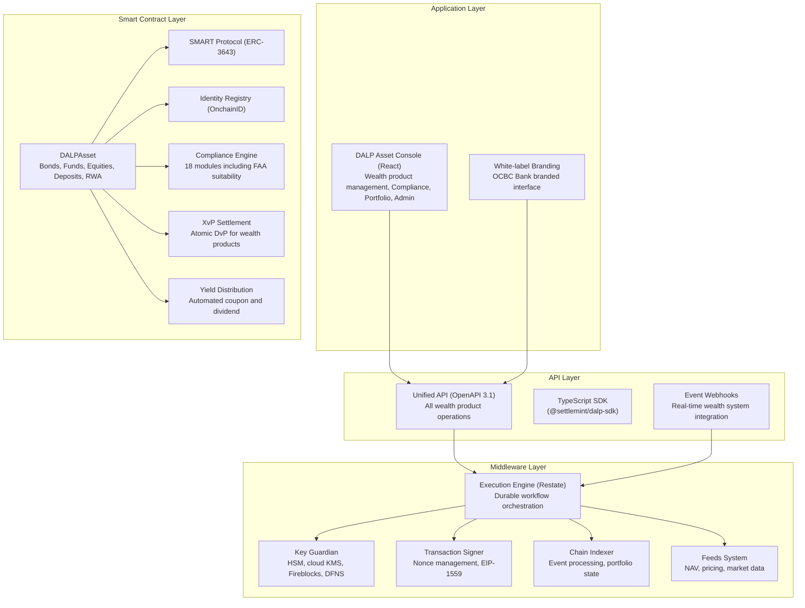
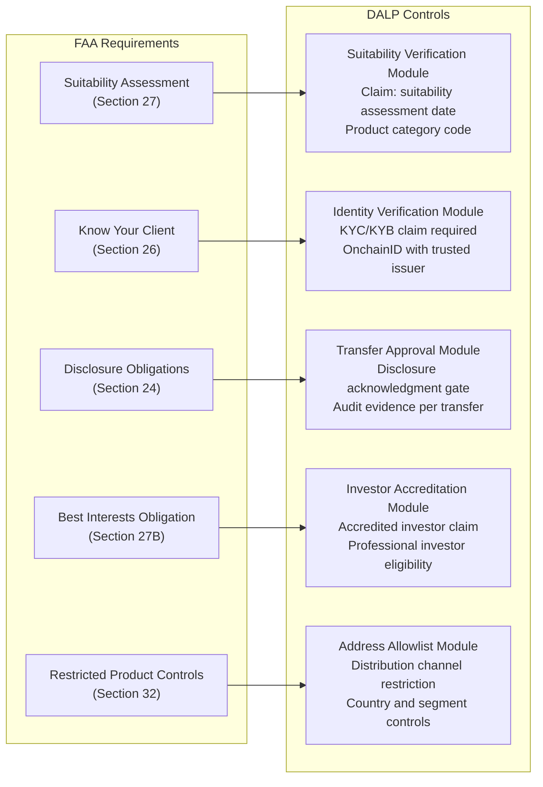
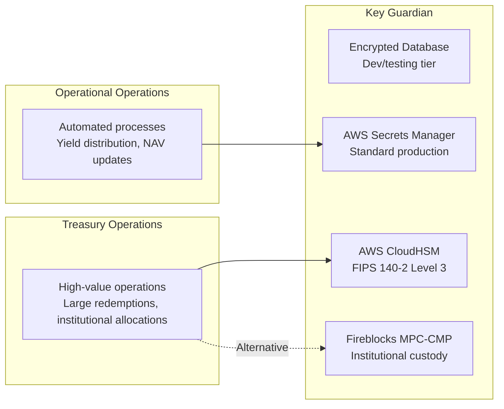
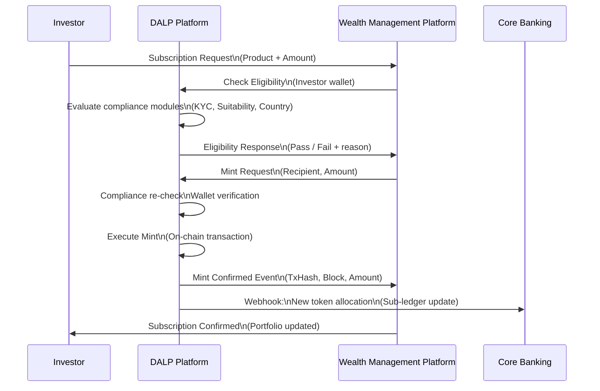
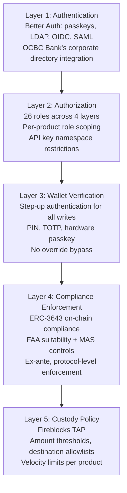
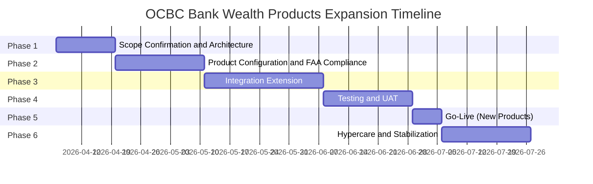

# Technical Proposal: Tokenized Wealth Products Platform

**Prepared for:** OCBC Bank Ltd
**Date:** 20 March 2026
**Version:** 1.0 Draft
**Classification:** SettleMint Confidential. Invited Bidders Only
**Reference:** OCBC-RFP-202603

---

## Table of Contents

1. Cover Page
2. Executive Summary
3. About SettleMint
4. Platform Overview: DALP
5. Solution Architecture
6. Asset Lifecycle Coverage for Wealth Products
7. Compliance Architecture
8. Integration Architecture
9. Custody and Key Management
10. Settlement and Operations
11. Security Architecture
12. Deployment Options
13. Implementation Approach
14. Support and SLA
15. Reference Projects
16. Regulatory Alignment
17. Response Matrix
18. Appendix A: Risk Register
19. Appendix B: Compliance Module Catalog

---

## 1. Cover Page

**Document Title:** Technical Proposal: Tokenized Wealth Products Platform
**Client:** OCBC Bank Ltd, Singapore
**Date:** 20 March 2026
**Version:** 1.0 Draft
**Prepared by:** SettleMint NV
**Classification:** SettleMint Confidential

*This document contains proprietary and confidential information belonging to SettleMint NV. It is submitted exclusively in response to OCBC-RFP-202603 and may not be reproduced, disclosed, or distributed without prior written consent from SettleMint NV.*

---

## 2. Executive Summary

### 2.1 Context

OCBC Bank has a demonstrated track record in digital asset deployment. SettleMint operates DALP in production with OCBC Bank today, supporting the security token engine that powers securitization, tokenization, and fractionalization of off-chain assets for OCBC's HNWI and HENRY investment products. This is not a reference deployment from five years ago; it is live, operational, and managed under MAS regulatory oversight in the same Singapore environment that governs this procurement.

This proposal therefore occupies a different category from other bidders who must demonstrate fitness for a Singapore regulated environment in the abstract. SettleMint can demonstrate it in fact. OCBC Bank's own operations teams have used DALP to manage tokenized wealth product workflows. OCBC Bank's own compliance team has reviewed DALP's MAS Singapore compliance template in production. OCBC Bank's own technology and risk functions have completed vendor risk assessments, security reviews, and integration work against DALP's API architecture. The platform is not an unknown quantity; it is an operating system that OCBC Bank already uses.

The question this RFP poses is not whether DALP can operate in OCBC Bank's environment, it already does, but whether DALP can support the next phase of OCBC Bank's tokenized wealth products programme: moving from the initial security token engine scope toward a broader, more reusable, and more deeply integrated platform that can support multiple wealth product types, serve multiple investor segments (HNWI, HENRY, and potentially broader retail wealth), integrate more deeply with OCBC's enterprise systems, and position the institution to participate credibly in Project Guardian. SettleMint's answer to that question is the substance of this proposal.

### 2.2 Why This Programme Is Hard

OCBC Bank's tokenized wealth products programme is not primarily a technology problem. The technology. DALP, is already deployed. The challenge is the expansion from initial controlled scope to an institutional operating model that is genuinely reusable. Reusability in a regulated environment means something specific: it means that adding a new wealth product type, a new investor segment, or a new distribution channel requires governed configuration, not custom engineering. It means that compliance controls work deterministically across all product variants, not just the ones that were configured first. It means that operations teams can manage daily workflows, exceptions, and compliance events without depending on specialized vendor knowledge for routine operations.

For tokenized wealth products specifically, the complexity extends beyond standard asset lifecycle management. Wealth products are subject to the Financial Advisers Act (FAA) and its suitability, disclosure, and best-interests obligations alongside MAS digital asset requirements. Investor eligibility for wealth products is not a binary KYC pass/fail; it requires continuous assessment of suitability across product categories, investor profiles, and regulatory restrictions on specific product types. Corporate actions for structured wealth products can be complex: regular valuation updates, NAV-driven pricing, management fee deductions, and structured redemption windows require operationally sophisticated automation to be reliable at scale.

The hard part for this programme is building an operating model where these complexities are handled systematically, rather than accumulating as bespoke operational procedures that create fragility and compliance risk. DALP's architecture addresses this directly: 18 compliance module types support the full range of MAS FAA controls; the configurable token architecture handles the full range of wealth product instrument types through configuration rather than custom development; and the operational tooling provides the dashboards, approval workflows, and reconciliation capabilities that operations and compliance teams need for sustainable day-to-day management.

### 2.3 Proposed Response

SettleMint proposes extending OCBC Bank's existing DALP deployment into a comprehensive tokenized wealth products platform. The proposal covers:

**Wealth Product Token Architecture:** DALP's configurable token (DALPAsset) architecture supports the full range of OCBC Bank's wealth product types, structured notes, bonds, funds, equity-linked products, and real world asset investments, through configuration of instrument templates and compliance modules, not custom smart contract development. Each product type is configured with appropriate compliance controls, lifecycle logic, and metadata schemas while inheriting the same security guarantees from DALP's pre-audited smart contract foundation.

**FAA-Aligned Compliance:** The MAS Singapore compliance template in DALP's current OCBC deployment covers the foundational MAS requirements. For the expanded tokenized wealth products programme, SettleMint proposes extending the compliance configuration to address FAA-specific requirements: investor suitability verification, product disclosure obligation tracking, and distribution restriction enforcement. These extensions are implemented through DALP's compliance module reconfiguration and expression builder, not through code changes.

**Expanded Investor Segments:** OCBC Bank's initial deployment focused on HNWI and HENRY investor segments. The expanded programme can include broader retail wealth investors subject to appropriate FAA suitability controls. DALP's investor count limits, suitability verification module, and tiered compliance expressions support the differentiated eligibility requirements across investor segments within a single platform configuration.

**Project Guardian Alignment:** OCBC Bank's participation in Project Guardian requires interoperability with other network participants using compatible token standards and settlement protocols. DALP's ERC-3643 implementation provides the standard token interface that Project Guardian participants recognize. The XvP settlement module provides the atomic settlement primitive for cross-party transactions within Project Guardian-connected networks.

**Enterprise Integration Depth:** The expanded programme deepens integration between DALP and OCBC Bank's wealth management platform, CRM, NAV feed infrastructure, and reporting systems, moving from the initial integration scope to the full operational integration that BAU wealth product management requires.

### 2.4 Why SettleMint

Three factors distinguish SettleMint's position for this procurement beyond what any other bidder can offer.

First, SettleMint is already operating in OCBC Bank's production environment under MAS regulatory oversight. There is no vendor onboarding risk, no security review to complete from scratch, no integration architecture to design from zero, and no compliance template to validate for the first time. The foundation is built. This programme is an expansion, not a new implementation.

Second, DALP's compliance architecture is already validated for OCBC Bank's environment. The MAS Singapore compliance template, the OnchainID identity framework, the role-based access control model, and the operational dashboard configuration have all been reviewed and operated by OCBC Bank's teams. The expansion to FAA-specific compliance controls is a configuration extension of an already-trusted architecture, not a new compliance architecture requiring fresh validation.

Third, SettleMint's track record with comparable wealth product deployments across Asia Pacific. Standard Chartered's Digital Virtual Exchange for fractional tokenization of securities, Maybank's Project Photon for cross-border XvP settlement, and multiple MENA bank deployments for structured investment products, demonstrates the operational depth required for OCBC Bank's expanded programme scope.

### 2.5 Document Map

- **Section 3: About SettleMint**: company background and APAC track record
- **Section 4: Platform Overview**: DALP capabilities and differentiators
- **Section 5: Solution Architecture**: four-layer technical stack for wealth products
- **Section 6: Asset Lifecycle Coverage**: wealth product token design, servicing, and operations
- **Section 7: Compliance Architecture**: MAS, FAA, and TRM Guidelines compliance
- **Section 8: Integration Architecture**: wealth management platform, CRM, NAV feeds, reporting
- **Section 9: Custody and Key Management**: key security operating model
- **Section 10: Settlement and Operations**: atomic settlement and operational tooling
- **Section 11: Security Architecture**: defense-in-depth for regulated wealth operations
- **Section 12: Deployment Options**: Singapore cloud, on-premises, and hybrid
- **Section 13: Implementation Approach**: phased delivery building on existing OCBC deployment
- **Section 14: Support and SLA**: tiered support and SLA commitments
- **Section 15: Reference Projects**: 14 production references with OCBC, StanChart, Maybank case studies
- **Section 16: Regulatory Alignment**: MAS, FAA, TRM Guidelines control mapping
- **Section 17: Response Matrix**: TR-01 through TR-20 responses
- **Appendix A: Risk Register**
- **Appendix B: Compliance Module Catalog**

---

## 3. About SettleMint

### 3.1 Company Overview

SettleMint is the digital asset lifecycle platform company for regulated financial markets and sovereign use cases. Founded nearly a decade ago and operating across Europe, the Middle East, and Asia Pacific, SettleMint provides the institutional-grade infrastructure that regulated banks, market infrastructure providers, and sovereign entities need to design, launch, and operate digital assets in production.

SettleMint's platform, DALP, is not a pilot-stage product. It manages billions of dollars in tokenized assets across production deployments including OCBC Bank Singapore, Standard Chartered Bank, Maybank Malaysia, and sovereign entities in the Middle East. The company's 200+ years of combined team experience in banking and blockchain engineering translates into an understanding of what regulated institutions actually need: not the most innovative technology, but the technology that operates reliably, satisfies regulators, and supports sustainable business operations.

### 3.2 OCBC Bank Partnership

SettleMint has operated DALP in production with OCBC Bank in Singapore, implementing the security token engine for securitization, tokenization, and fractionalization of off-chain assets. The platform supports HNWI and HENRY investment products across bonds, SPVs, stocks, and real estate, with a complete end-user interface for tokenization and wallet management, backend order book management, and APIs integrating with OCBC's off-chain securities and cash systems.

This partnership is OCBC Bank's most directly relevant evidence of SettleMint's capabilities for this procurement. The platform operates under MAS regulatory oversight. OCBC Bank's compliance team has reviewed and approved the compliance architecture. OCBC Bank's operations team manages daily workflows on the platform. The infrastructure is not a proof of concept; it is a live system supporting real investment products for real investors.

The expanded tokenized wealth products programme proposed in this response builds directly on this foundation, extending the platform's scope and integration depth without requiring OCBC Bank to replace the infrastructure it already operates, retrain its teams on a new platform, or repeat the vendor risk assessment and security review process from scratch.

### 3.3 Asia-Pacific and Wealth Products Track Record

Beyond OCBC Bank, SettleMint's Asia-Pacific track record includes:

**Standard Chartered Bank:** Digital Virtual Exchange for fractional tokenization of securities across Asia, Africa, and the Middle East, with instant ownership recording and reduced custody intermediaries. The exchange supports institutional trading in securities comparable to OCBC Bank's wealth product distribution scope.

**Maybank (Project Photon):** FX tokenization and cross-border XvP settlement using the MYRT tokenized Malaysian Ringgit, aligned with Bank Negara Malaysia's Digital Asset Innovation Hub. The XvP settlement pattern directly applies to OCBC Bank's wealth product settlement requirements.

**Sony Bank (Japan):** Stablecoin issuance with integrated digital identity; KYC-enabled Web3 banking with Privado.id onboarding, demonstrating DALP's capability in sophisticated identity-integrated wealth product environments.

### 3.4 Certifications

SettleMint maintains ISO 27001 and SOC 2 Type II certifications for DALP's information security management and operational controls. These certifications are already documented in OCBC Bank's vendor risk assessment records from the existing deployment.

---

## 4. Platform Overview: DALP

### 4.1 Platform Summary

DALP is SettleMint's Digital Asset Lifecycle Platform, a unified platform for designing, launching, and operating tokenized assets across financial instruments and real-world assets. For OCBC Bank's tokenized wealth products programme, DALP provides:

**Seven pre-built asset classes** with purpose-built lifecycle logic: bonds, equities, funds, deposits, stablecoins, real estate, and precious metals, covering the full range of wealth product types that OCBC Bank distributes to HNWI and HENRY investors. A configurable token architecture supports novel instrument types beyond the seven standard classes.

**Eighteen compliance module types** across six categories, covering the complete control surface required for MAS digital asset regulations and FAA wealth product distribution obligations. The compliance engine enforces rules ex-ante (before execution), not post-trade (after review).

**Atomic DvP/XvP settlement** for both local (same-chain) and cross-chain settlement, providing T+0 finality for wealth product transactions without counterparty risk.

**Production-proven operations tooling** including real-time dashboards, configurable alerting, distributed tracing, and a complete audit trail, the operational infrastructure that OCBC Bank's operations and compliance teams use daily in the existing deployment.

**API-first integration** supporting REST, TypeScript SDK, and event webhooks, the same integration patterns that already connect DALP to OCBC Bank's systems, now extended to the broader wealth product ecosystem.

### 4.2 Configurable Architecture: Configuration, Not Custom Development

The core commercial and operational advantage of DALP for OCBC Bank's expanded programme is the ability to add new wealth product types through platform configuration rather than custom smart contract development.

When OCBC Bank's wealth product team wants to tokenize a new structured note type with specific suitability requirements, a new investment fund with NAV-linked pricing, or a new fractional real estate investment product, the process is:
1. Create an instrument template in DALP's template library defining the metadata schema for the new product type
2. Select compliance modules from DALP's pre-built catalog and configure them for the new product's eligibility requirements
3. Configure token features (maturity redemption, AUM fee, yield schedule) as appropriate
4. Review and deploy the new token type through the Asset Designer wizard

This process takes days, not months. It does not require security audits (all components are pre-audited). It does not require custom smart contract development. It does not require SettleMint professional services engagement for each new product type. OCBC Bank's operations team, already familiar with the platform from the existing deployment, can manage this configuration process independently.

### 4.3 Wealth Product-Specific Capabilities

DALP's pre-built asset types provide purpose-built capabilities for OCBC Bank's wealth product categories:

**Bonds and Structured Notes:** Full fixed-income lifecycle with automated coupon schedules (Fixed Treasury Yield feature), maturity redemption with atomic payout, denomination asset linking for DvP settlement, and ISIN-based identification. The Municipal Bond Tokyo in DALP's production deployments demonstrates cross-currency structured bond management with AED-denominated pricing against Mizuho Yen Deposit tokens.

**Investment Funds:** Fund tokens carry fund-specific metadata including investment category, fund class, and management fee parameters. The AUM Fee feature automates management fee calculation and distribution. NAV-linked pricing connects fund tokens to DALP's data feed system for external NAV source integration. The full fund landscape from sustainable impact funds to emerging market strategies is supported, with 18-decimal precision enabling fractional unit ownership.

**Equity Products:** Full equity tokenization across common, preferred, and voting share classes with integrated collateral management. Equity tokens track collateral coverage ratios and remaining minting capacity. The Voting Power feature implements ERC-5805 on-chain governance for equity-linked products.

**Deposits and Cash Equivalents:** Tokenized bank deposits serving as both investment instruments and settlement currency for DvP operations. The Deutsche Bank Euro Deposit token in DALP's production deployments demonstrates the architecture: deposit tokens function as denomination assets for bond pricing and XvP settlement simultaneously.

**Real World Assets:** Real estate tokenization with GPS coordinates, property classification, administrative codes, and fractional ownership precision. The Saudi RER national real estate programme and OCBC Bank's existing real estate token holdings demonstrate DALP's RWA capabilities at institutional scale.

---

## 5. Solution Architecture

### 5.1 Four-Layer Stack

DALP's four-layer architecture provides the technical foundation for OCBC Bank's expanded wealth products platform:



### 5.2 White-Label Branding for OCBC Wealth Platform

DALP supports full white-label branding. For OCBC Bank's tokenized wealth products platform, the interface can be deployed under OCBC Bank's brand identity: custom logos for light and dark modes, OCBC color palette, and branded login experience. The branding extends to every touchpoint, ensuring investors and wealth managers see a consistent OCBC-branded experience rather than a SettleMint interface.

The white-label capability is immediately available through DALP's settings interface without additional implementation work. For OCBC Bank's existing deployment, this extends the current branded interface to the expanded wealth product scope.

### 5.3 NAV Feed Integration for Fund Products

Fund-based wealth products require real-time NAV integration for accurate pricing, subscription, and redemption processing. DALP's Feeds System provides:

**External data source connectivity:** Configurable connections to external NAV calculation providers, market data vendors, and pricing services. The feeds registry allows multiple data source configurations per token.

**On-chain data feed registration:** Each fund token can register one or more data feeds that deliver live NAV updates to the on-chain token record. Price update events trigger downstream notifications (webhooks to wealth management platform and core banking systems).

**Staleness detection:** The feeds system tracks the age of the most recent update for each data feed. Stale data alerts notify operations teams when a fund token's NAV has not been updated within the configured threshold, preventing pricing operations from using outdated valuations.

### 5.4 Multi-Asset Portfolio Management

OCBC Bank's wealth product platform manages a portfolio of multiple instrument types simultaneously. DALP's portfolio management capabilities support this:

**Cross-asset portfolio view:** The Asset Insights dashboard aggregates portfolio value, pending launches, and distribution across instrument types in real time. DALP's production deployments manage portfolios covering USD 13+ billion across 71+ instruments spanning bonds, equities, funds, stablecoins, deposits, real estate, and precious metals.

**Investor holdings view:** Individual investor portfolio dashboards show consolidated holdings across all OCBC wealth product types, including balance, available amount, and frozen token tracking per asset. This view is accessible through the DALP console and API, supporting integration with OCBC Bank's wealth relationship management tools.

**Geographic jurisdiction mapping:** The dashboard's geographic distribution view maps where tokenized wealth assets are held globally, connecting directly to the compliance engine's jurisdiction-based controls for instant visibility into geographic exposure.

---

## 6. Asset Lifecycle Coverage for Wealth Products

### 6.1 Wealth Product Token Design Framework

OCBC Bank's wealth products span multiple instrument categories, each with specific lifecycle requirements. DALP's instrument template system provides a structured approach to managing this diversity:

```mermaid
flowchart TD
    subgraph ProductCreation["Product Creation Phase"]
        IT["Select Instrument Template\n(Bond, Fund, Equity, RWA, Custom)"]
        MD["Configure Metadata Schema\nISIN, fund class, property details"]
        TF["Select Token Features\nYield, AUM fee, maturity, voting"]
        CM["Bind Compliance Modules\nMAS + FAA suitability controls"]
        GV["Assign Governance Roles\nAdmin, compliance, custodian"]
    end
    subgraph Distribution["Distribution Phase"]
        OB["Investor Onboarding\nKYC + FAA suitability verification"]
        IS["Issuance/Minting\nCompliance-checked allocation"]
        SP["Secondary Transfers\nEx-ante compliance on every transfer"]
        SS["Settlement\nAtomic DvP via XvP module"]
    end
    subgraph Servicing["Servicing Phase"]
        NA["NAV Updates\nFeed system integration"]
        YD["Yield/Dividend Distribution\nAutomated via yield schedule"]
        CA["Corporate Actions\nCoupon payments, rights, redemptions"]
        RM["Redemption at Maturity\nAtomic burn-and-payout"]
    end
    subgraph Retirement["Retirement Phase"]
        WD["Wind-Down\nFreeze new issuance"]
        RD["Redemption Processing\nHolder-by-holder payout"]
        BR["Burn and Close\nSupply to zero, contract deactivated"]
    end

    ProductCreation --> Distribution
    Distribution --> Servicing
    Servicing --> Retirement
```



### 6.2 Structured Notes and Bond Products

OCBC Bank's structured note and bond products represent fixed-income instruments with specific suitability profiles for HNWI and HENRY investors. DALP's bond asset type covers these requirements:

**ISIN Identification:** Each bond token carries a validated ISIN (ISO 6166) from creation, linking the on-chain instrument to its off-chain securities identifier for regulatory reporting and investor communications.

**Denomination Asset Linking:** Bond tokens are linked to a specific on-chain denomination asset (SGD stablecoin or tokenized deposit) at creation time, establishing the DvP settlement relationship before the first token is minted. Atomic DvP settlement is configured into the instrument from creation.

**Automated Coupon Distribution:** The Fixed Treasury Yield feature automates coupon distribution on configurable schedules. Historical Balance snapshots determine each investor's proportional share at each accrual period. Distribution is pull-based: investors or their custodians initiate claims, avoiding gas cost issues for large holder pools.

**Maturity Redemption:** The Maturity Redemption feature implements the complete bond lifecycle endpoint. After maturity, all transfers are blocked and holders can only redeem for the denomination asset at face value. Redemption is atomic: tokens burn and denomination asset transfers simultaneously. No partial redemptions occur.

**Structured Note Metadata:** The configurable metadata schema captures structured note-specific attributes: underlying reference asset, barrier levels, observation dates, and payoff formula reference. These are immutable fields set at creation, ensuring the on-chain record accurately represents the structured product terms.

### 6.3 Investment Fund Products

Fund tokens in OCBC Bank's wealth platform carry fund-specific lifecycle logic beyond standard token parameters:

**Fund Class and Category:** The instrument template captures investment category (equities, fixed income, multi-asset, alternatives), fund class (retail, institutional, private banking), and management fee parameters. DALP supports the full fund landscape including sustainable impact funds, venture capital, and emerging market strategies.

**AUM Fee Automation:** The AUM Fee token feature implements management fee calculation as a configurable percentage of assets under management, calculated at configurable intervals. Fee accrual is automated and the fee collection mechanism is transparent and auditable, reducing operational overhead for fund administrators.

**Fractional Units:** Fund tokens use 18-decimal precision enabling fractional unit ownership. This supports OCBC Bank's wealth products strategy of making institutional-grade fund products accessible to HENRY investors who may subscribe in fractional units.

**Subscription and Redemption Windows:** Transfer window compliance modules enforce subscription and redemption periods consistent with fund terms. Transfer during closed periods reverts automatically, ensuring operational compliance with fund documentation without manual enforcement.

### 6.4 Equity-Linked Products

For equity and equity-linked wealth products:

**Collateral Management:** OCBC Bank's equity tokens track collateral coverage ratios and remaining minting capacity. This is directly relevant to equity-linked structured products where the product's payoff depends on underlying equity performance subject to collateral requirements.

**On-Chain Voting:** The Voting Power feature implements ERC-5805 for equity tokens with voting rights. This enables programmable governance for equity-linked products where holder votes affect product parameters.

**Corporate Actions:** DALP's custodian role supports forced transfers (for inheritance, regulatory seizure, and estate transfers), and the yield schedule addon supports equity dividend distribution on configurable schedules with pro-rata calculation across the investor base.

### 6.5 Real World Asset Products

For OCBC Bank's real estate and precious metals wealth products:

**Property Tokenization:** DALP captures GPS coordinates, property classification, administrative area codes, building specifications, and unique real estate numbers during token creation. The on-chain record links the digital token to verifiable physical attributes through cryptographic attestations issued by authorized issuers via the OnchainID standard.

**Fractional Ownership Pricing:** A USD 100,000,000 property tokenized into 1,000,000 tokens at USD 100 each is configured through the Asset Designer's pricing and valuation step, with automatic total valuation calculation and on-chain data feed registration for ongoing NAV updates.

**Precious Metals Custody:** Precious metal tokens carry physical custody metadata linking the digital token to vault location and named custodian. For OCBC Bank's gold-backed wealth products, this creates a verifiable on-chain record connecting the digital instrument to the physical asset.

---

## 7. Compliance Architecture

### 7.1 Financial Advisers Act Compliance

The Financial Advisers Act (FAA) governs the distribution of investment products in Singapore, creating specific obligations for financial advisors and distributors. For OCBC Bank's tokenized wealth products programme, FAA compliance requirements map to DALP compliance modules as follows:



**FAA Suitability Assessment:** Under Section 27 of the FAA, financial advisers must ensure that investment products are suitable for clients based on their financial situation, investment experience, and investment objectives. DALP's Suitability Verification compliance module requires each investor to hold a current suitability claim for the product category, issued by OCBC Bank's trusted issuer role, before transfers execute. The suitability claim includes the assessment date, product category code, and the issuer's identity, a permanent on-chain record of suitability verification for each investor-product combination.

**Know Your Client:** DALP's Identity Verification module requires all transfer parties to have verified OnchainID contracts with current, non-expired KYC/AML claims. The claim freshness period is configurable: for high-risk investor profiles, a 6-month freshness requirement ensures recent KYC data supports each transfer. For established HNWI clients, a 12-month freshness period reduces operational friction.

**Disclosure Obligations:** The Transfer Approval module can be configured to require explicit investor acknowledgment of product-specific disclosures before a transfer executes. The acknowledgment is recorded as part of the approval workflow: the approval record includes the disclosure reference, investor wallet, timestamp, and approval decision, evidence that the disclosure obligation was satisfied before the transfer. This transforms the disclosure obligation from a paper-based process into an auditable on-chain event.

**Restricted Product Distribution:** The Address Allowlist module restricts token transfers to pre-approved wallet addresses. For restricted investment products (complex structured products, alternative investments), the allowlist limits distribution to specifically vetted investor wallets, preventing distribution to ineligible investors regardless of other compliance checks.

### 7.2 MAS Digital Asset Framework for Wealth Products

MAS's digital asset framework creates additional compliance obligations for tokenized wealth products:

**Investor Count Limits:** MAS guidance on digital capital market products includes limits on the number of investors for certain offering types. DALP's Investor Count Limit module enforces these limits at the smart contract layer, with per-country limits independently configurable from global limits. For OCBC Bank's retail wealth products targeting the broader HENRY segment, investor count limits reflecting any applicable MAS offering restrictions are enforced automatically.

**Jurisdiction Controls:** The Country Allowlist module restricts distribution to MAS-permitted jurisdictions. For OCBC Bank's cross-border wealth distribution (Singapore residents, regional HNWI clients), the jurisdiction configuration reflects the specific distribution permissions for each product type.

**Product Classification:** Each wealth product token includes an Asset Classification claim issued by OCBC Bank's trusted issuer role. This claim records the regulatory classification of the product (collective investment scheme, prescribed capital markets product, specified investment product, etc.) and is used by the compliance engine to apply the appropriate eligibility controls for each classification category.

### 7.3 Compliance Expression Builder for Complex Suitability Rules

OCBC Bank's wealth product suitability rules are not binary. An investor may be eligible for a standard bond but not for a complex structured note, or eligible for a real estate investment trust but not for a leveraged fund. DALP's visual expression builder enables OCBC Bank's compliance team to construct product-specific eligibility rules without engineering support:

**Example: Complex Structured Note Eligibility**
```
KYC AND AML AND (Accredited_Investor OR Professional_Investor) AND Suitability_Complex_Note AND NOT Restricted_Country
```

**Example: Retail Wealth Fund Eligibility**
```
KYC AND AML AND Suitability_Retail_Fund AND Singapore_Resident AND Investment_Limit_Under_Threshold
```

Each expression is validated in real time by the expression builder before deployment. Expression changes require the governance role and are recorded permanently on-chain, providing a complete change history of OCBC Bank's eligibility rule evolution over time.

### 7.4 Continuous Compliance Model

Claims are checked at execution time, not only at onboarding. An investor who passed suitability assessment six months ago but has not completed a recent review may have an expired suitability claim. DALP's compliance engine will reject transfers for that investor until the claim is renewed. This continuous compliance model reflects FAA's ongoing suitability obligations: eligibility is a live condition, not a one-time checkbox.

The three-tier trusted issuer resolution model provides hierarchical trust management. OCBC Bank can maintain different trusted issuers for different investor categories: a more stringent issuer for complex product eligibility, a standard issuer for general KYC claims. Resolution follows a "most specific wins" model, allowing institution-wide trust frameworks with product-specific exceptions.

---

## 8. Integration Architecture

### 8.1 Wealth Platform Integration Landscape

OCBC Bank's existing DALP deployment has established integration patterns with core banking, order book management, and wallet infrastructure. The expanded wealth products programme extends this integration landscape:

```mermaid
graph TB
    subgraph OCBCWealth["OCBC Bank Wealth Management Systems"]
        WM["Wealth Management Platform\nCRM, Relationship Manager tools"]
        OB["Order Book\nSubscription and redemption management"]
        CB["Core Banking\nAccount ledger, position management"]
        NAV["NAV Provider\nFund valuation services"]
        AML["AML/KYC Platform\nOngoing monitoring and case management"]
        RP["Reporting Platform\nRegulatory and management reporting"]
        GL["General Ledger\nAccounting and reconciliation"]
    end
    subgraph DALPPlatform["DALP (Extended Wealth Platform)"]
        API["Unified API\nAll wealth product operations"]
        WH["Event Webhooks\nReal-time integration events"]
        FD["Feeds System\nNAV and pricing integration"]
        DALPDASH["Operations Dashboard\nCompliance monitoring, alerts"]
    end
    subgraph External["External Networks"]
        PG["Project Guardian\nInteroperable token network"]
        SWIFT["SWIFT/MAS payment rails\nSGD settlement"]
    end

    WM <-->|Investor onboarding\nPortfolio status| API
    OB <-->|Subscription/redemption orders\nOrder status| API
    CB <-->|Position reconciliation\nSub-ledger events| WH
    NAV -->|NAV feed delivery\nFund pricing| FD
    AML <-->|Transaction monitoring\nFreeze/unfreeze| WH
    RP <-->|Event export\nRegulatory data| API
    GL <-->|Journal entries\nAccounting events| WH
    PG <-->|Cross-network settlement\nInteroperable tokens| API
    SWIFT <-->|SGD payment rail\nISO 20022| API
```



### 8.2 Wealth Management Platform Integration

OCBC Bank's wealth management platform and relationship manager tooling is the primary front-end through which wealth advisers interact with client portfolios. DALP integrates with this platform through:

**Investor Portfolio API:** The DALP API provides real-time portfolio views per investor wallet address, including balance, available amount, frozen amounts, pending redemptions, and accrued but unclaimed yield. Wealth relationship managers access this through OCBC Bank's CRM interface, which consumes DALP's portfolio API.

**Product Availability Query:** Wealth advisers query available wealth product tokens through the DALP API, receiving current supply, price (from the feeds system), compliance eligibility for a specific investor, and pending corporate actions. This enables real-time availability checking during client advisory sessions.

**Subscription Processing:** When a wealth adviser initiates a client subscription, the order management system calls DALP's minting API to allocate tokens to the investor's wallet. The compliance check validates eligibility before execution, if the investor lacks required suitability claims, the minting request fails immediately with a clear compliance reason code, enabling the adviser to direct the client through the appropriate suitability assessment before proceeding.

### 8.3 NAV Feed Integration for Fund Products

OCBC Bank's fund-based wealth products require continuous NAV updates for pricing, subscription, and redemption processing:

**Feed Registration:** Each fund token registers one or more NAV data feeds in DALP's Feeds System. The feed configuration specifies the source (NAV calculation agent, OCBC Bank's valuation team, or third-party pricing service), update frequency, and staleness threshold.

**Pricing Events:** When the NAV provider delivers a new valuation, DALP's feeds system records the update on-chain as a verified claim issued by the NAV provider's trusted issuer role. The on-chain pricing event triggers a webhook to OCBC Bank's wealth management platform and core banking system, updating the displayed product price and sub-ledger position.

**Redemption Pricing:** For fund redemptions, the redemption price is determined by the most recent NAV recorded on-chain at the time of redemption request. The on-chain audit trail records the exact pricing data used for each redemption, providing a deterministic basis for dispute resolution.

### 8.4 Order Book Integration

OCBC Bank's existing order book integration manages subscription and redemption workflows for the current security token engine. The expanded programme extends this integration:

**Subscription Orders:** The order book system routes subscription orders to DALP's minting API. DALP validates investor eligibility, checks supply availability, and executes the mint. The order book receives the mint event webhook with transaction reference, enabling order status updates and settlement confirmation.

**Redemption Orders:** Redemption requests from the order book trigger DALP's redemption workflow. For maturity-based redemptions, the atomic burn-and-payout mechanism settles both legs simultaneously. For fund-type redemptions (where redemption is at the current NAV price), DALP's treasury payout mechanism transfers the denomination asset to the investor while burning the fund tokens.

**Order Reconciliation:** DALP's event log provides the definitive record of token-level allocation and redemption events. The order book reconciles its internal order records against DALP's event log at configured intervals (typically end of day), flagging any discrepancies for operations team resolution.

### 8.5 Project Guardian Interoperability

OCBC Bank's Project Guardian participation requires interoperability with other network participants. DALP's architecture supports this through:

**ERC-3643 Standard Interface:** All DALP tokens implement ERC-3643, the Project Guardian-compatible token standard. Other Project Guardian participants operating ERC-3643-compatible platforms can query OCBC Bank's token contracts for compliance status, holder eligibility, and transfer conditions without requiring DALP-specific integration.

**Cross-Network Settlement:** DALP's XvP settlement module supports HTLC-based cross-chain settlement with Project Guardian participants on connected networks. For Project Guardian-coordinated transactions (peer bank settlements, cross-institutional wealth product transfers), DALP provides the atomic settlement primitive that ensures both legs complete or both revert.

**Identity Interoperability:** DALP's OnchainID trusted issuer model can be extended to recognize claims issued by other Project Guardian participants' identity providers. An investor whose KYC has been verified by another Project Guardian bank can, with appropriate configuration, be recognized as eligible for OCBC Bank's products without requiring a separate OCBC-issued claim, the cross-institution trust model that Project Guardian's interoperability architecture envisions.

---

## 9. Custody and Key Management

### 9.1 Key Guardian Architecture

DALP's Key Guardian manages cryptographic key material for OCBC Bank's wealth product operations through multiple storage backends:



For OCBC Bank's existing deployment, the custody configuration is already established. The expansion to a broader wealth products programme may require review of the custody tier assignments for new product categories, particularly for high-value fund products and structured notes where transaction values may exceed current custody policy thresholds.

### 9.2 Fireblocks Integration

OCBC Bank's deployment includes Fireblocks MPC-CMP integration for institutional-grade custody. For the expanded wealth products programme, Fireblocks Transaction Authorization Policies can be extended to cover new token types:

**Asset-Specific TAP Policies:** Each new wealth product token type can have a specific TAP policy configured in Fireblocks, with amount thresholds appropriate to the product's typical transaction sizes, whitelisted destination addresses covering authorized investor wallets, and multi-approver requirements for large-value transactions.

**Policy Administration:** TAP policy changes are managed through Fireblocks Console with OCBC Bank retaining full control over policy configuration. DALP's governance role requirement for on-chain configuration changes and Fireblocks' TAP governance operate as independent but complementary controls, ensuring that both the on-chain policy (DALP compliance modules) and the signing policy (Fireblocks TAP) are updated coherently when product parameters change.

### 9.3 Emergency Access and Key Rotation

Emergency access procedures and key rotation processes are already documented in OCBC Bank's operational runbooks from the existing deployment. The expanded programme inherits these procedures with the following additions:

**New Product Key Enrollment:** When new wealth product tokens are deployed, the relevant signing wallets are enrolled in the Key Guardian configuration. For HSM-backed wallets, the enrollment process includes FIPS 140-2 Level 3 key generation within the HSM boundary.

**Annual Key Rotation:** Production signing keys for wealth product operations rotate annually per the documented key rotation procedure. Key rotation is coordinated with OCBC Bank's operations team and executed as a durable Restate workflow, ensuring consistency across the rotation even through infrastructure events.

---

## 10. Settlement and Operations

### 10.1 Wealth Product Settlement Model

OCBC Bank's tokenized wealth products require different settlement models depending on product type:

**Primary Issuance (Subscription):** Investor subscribes to a wealth product, paying in the denomination asset (SGD deposit token or stablecoin). DALP's subscription flow validates investor eligibility, verifies denomination asset payment (via collateral check or explicit DvP configuration), and mints wealth product tokens to the investor wallet atomically. No partial allocation occurs: if the payment cannot be verified, the subscription fails cleanly.

**Secondary Transfer:** Peer-to-peer transfers of wealth product tokens between eligible investors, subject to ex-ante compliance enforcement. All FAA suitability controls apply on secondary transfers, not only on primary issuance. An investor who became ineligible after initial subscription (expired suitability claim) cannot transfer their tokens to another investor until the compliance issue is resolved.

**Redemption at Maturity:** For fixed-term products, the Maturity Redemption feature implements atomic burn-and-payout. Tokens burn and denomination asset transfers simultaneously from the product treasury.

**XvP Settlement for Project Guardian:** For settlements involving Project Guardian counterparties on connected networks, DALP's HTLC mechanism provides cryptographic atomicity across network boundaries.



### 10.2 Corporate Actions Automation

OCBC Bank's wealth product programme involves multiple recurring corporate action types, all automated through DALP:

**Fund Distribution:** Yield Schedule addon coordinates periodic distributions to fund token holders with snapshot-based balance capture, pro-rata calculation, and distribution in the denomination asset or a separate payment token. For OCBC Bank's Singapore Dollar-denominated fund products, distributions settle in SGD stablecoin or tokenized deposit with full on-chain evidence of each distribution event.

**Bond Coupon Payments:** Fixed Treasury Yield feature automates coupon payment on configured schedules. Historical Balance snapshots ensure accurate pro-rata calculation. Pull-based distribution reduces operational complexity for large-scale retail wealth bond products.

**Structured Note Payoff Events:** For structured notes with defined payoff events (barrier breaches, observation date payments), DALP's Transfer Approval module can be configured to require compliance officer approval before the payoff event executes. This ensures that structured note payoff events are reviewed by authorized operators before they settle on-chain.

### 10.3 Operational Dashboards

OCBC Bank's operations teams already use DALP's operational dashboards for the existing deployment. The expanded programme adds wealth-product-specific dashboard views:

**Wealth Product Portfolio Dashboard:** Aggregated portfolio value across all tokenized wealth product types, with breakdown by instrument class, investor segment, and product status. Live updates from the Chain Indexer provide real-time portfolio state.

**Corporate Actions Queue:** Upcoming and pending corporate actions across all active wealth products, coupon payments, fund distributions, redemption windows, and NAV update schedules. Items approaching their execution date surface automatically for operations team review.

**Suitability Monitoring:** Dashboard view of suitability claim status across the investor base. Investors with expiring suitability claims surface for proactive outreach before their claims expire and transfer restrictions engage. This turns compliance management from a reactive exception process into a proactive investor service workflow.

**Project Guardian Settlement Monitor:** Pending and completed Project Guardian settlements, including HTLC expiry tracking for cross-network transactions. Operations teams can monitor settlement progress and intervene before HTLC expiry if a counterparty has not confirmed their leg.

---

## 11. Security Architecture

### 11.1 Defense-in-Depth Model

DALP enforces security through five independent control layers. For OCBC Bank's expanded wealth products programme, the existing security architecture from the current deployment is maintained and extended:



### 11.2 Certifications (Existing for OCBC Bank)

OCBC Bank's vendor risk assessment for the existing deployment has already documented:
- ISO 27001 certification (information security management system)
- SOC 2 Type II certification (operational controls continuously audited)

These certifications cover the expanded wealth products programme without re-assessment of the certification status. Updated certificates are available through the OCBC Bank account management channel with SettleMint.

### 11.3 FAA Compliance Security Implications

The FAA's suitability and disclosure obligations create specific security requirements beyond standard digital asset controls:

**Suitability Claim Integrity:** Suitability claims must be issued only by authorized trusted issuers with appropriate credentials. DALP's trusted issuer registry ensures that only designated claim issuers (OCBC Bank's compliance-authorized issuers) can write suitability claims. A compromised or unauthorized issuer writing false suitability claims would be immediately visible in the on-chain event log and would require governance-role authorization to add to the trusted issuer registry.

**Disclosure Audit Trail:** Disclosure acknowledgments recorded through the Transfer Approval module are permanent on-chain records. They cannot be deleted, modified, or backdated. This creates a legally defensible evidence trail for FAA disclosure compliance that is more reliable than paper-based or email-based acknowledgment records.

**Investor Data Protection:** OnchainID contracts store claim types and validity status on-chain, not personal investor data. Personal data (name, address, suitability assessment details) remains in OCBC Bank's off-chain identity infrastructure. The on-chain record references the claim without exposing the personal data, satisfying Singapore's PDPA requirements for personal data protection while maintaining the compliance audit trail.

---

## 12. Deployment Options

### 12.1 Existing Deployment Continuity

OCBC Bank's existing DALP deployment operates in a specific infrastructure configuration that has already been reviewed, approved, and is operating in production. The expanded wealth products programme inherits this infrastructure configuration, avoiding the re-provisioning and re-approval cycle that a new deployment would require.

The infrastructure upgrade path for the expanded programme involves:
- Capacity increase to support additional asset types and investor volume
- Network connectivity update to support Project Guardian integration
- Fireblocks policy extension to cover new product categories
- Staging environment creation for new product configuration validation

### 12.2 Recommended Configuration

The recommended configuration for the expanded programme maintains the existing deployment model (likely AWS Singapore ap-southeast-1 for data residency compliance) with the following additions:

**Staging Environment:** A dedicated staging environment for the expanded wealth products programme, separate from the current production environment, enables OCBC Bank's teams to validate new product configurations and compliance templates before deploying to production. The staging environment mirrors the production configuration including compliance modules, integration endpoints, and custody policies.

**Capacity Scaling:** The Kubernetes cluster configuration expands to accommodate increased asset count, investor volume, and transaction throughput. Auto-scaling on the managed cloud deployment handles burst capacity without manual intervention.

**Multi-Chain Support (Project Guardian):** If Project Guardian integration requires connectivity to additional EVM networks, the Chain Gateway configuration adds the new network without changes to the application layer.

---

## 13. Implementation Approach

### 13.1 Phased Expansion Strategy

Unlike a new deployment, the OCBC Bank wealth products expansion starts from a functioning production platform. The implementation strategy takes advantage of this by front-loading the work that benefits from the existing deployment knowledge and deferring riskier integration work to phases where the team has validated the new product configurations.



**Total estimated timeline: 16 weeks** (shorter than a new deployment due to existing infrastructure and team familiarity)

### 13.2 Phase 1: Scope Confirmation and Architecture (Weeks 1-2)

**Objective:** Confirm the expanded programme scope, FAA compliance requirements, and integration extensions required. Validate the architecture for the new product types.

**Activities:**
- Review current deployment configuration and identify required extensions
- Document new product types, compliance requirements per product category, and investor eligibility rules
- Map FAA suitability requirements to DALP compliance module configuration
- Design integration extensions for wealth management platform, NAV feeds, and reporting
- Confirm Project Guardian interoperability requirements and timeline
- Review Fireblocks TAP policy extensions for new product categories

**Deliverables:** Scope Confirmation Document; FAA Compliance Configuration Design; Integration Extension Design; Project Guardian Interoperability Plan

### 13.3 Phase 2: Product Configuration and FAA Compliance (Weeks 3-5)

**Objective:** Configure new wealth product instrument templates, FAA compliance modules, and extended eligibility expressions.

**Activities:**
- Deploy new instrument templates for fund products, structured notes, and RWA products
- Configure FAA suitability verification module for each product category
- Build eligibility expressions in the expression builder for complex suitability rules
- Configure NAV feed registrations for fund products
- Extend Fireblocks TAP policies for new product token types
- Deploy staging environment with full new product configuration

**Deliverables:** Configured instrument templates; FAA compliance module deployment; Staging environment validation report

### 13.4 Phase 3: Integration Extension (Weeks 6-9)

**Objective:** Extend DALP's integration with OCBC Bank's wealth management platform, NAV providers, and Project Guardian.

**Activities:**
- Extend wealth management platform integration: product availability queries, subscription processing, portfolio views
- Implement NAV feed integration for fund products
- Extend order book integration for new product types
- Implement Project Guardian network connectivity (if in scope for this phase)
- Extend reporting platform integration for FAA compliance reporting
- Extend general ledger integration for new product accounting events

**Deliverables:** Extended integration connections; Integration test evidence; Updated runbooks

### 13.5 Phase 4: Testing and UAT (Weeks 10-12)

Testing scope for the expanded programme covers:
- New product type lifecycle events (subscription, corporate actions, redemption)
- FAA suitability enforcement validation
- Integration tests for NAV feed, wealth platform, and order book extensions
- Performance testing at expanded volume projections
- Regression testing against existing product configurations to ensure no regression
- UAT with OCBC Bank wealth product, compliance, and operations teams

**Key regression testing focus:** Confirming that new product configuration and compliance module additions do not affect the compliance enforcement behavior of existing product tokens in the current deployment.

### 13.6 Phase 5: Go-Live (Week 13)

Controlled rollout of new wealth product types alongside the existing production deployment. The go-live approach uses a phased product release: one or two new product types released first, with additional types following after initial validation.

### 13.7 Phase 6: Hypercare and Stabilization (Weeks 14-16)

Intensive post-go-live support focused on:
- New product type operational procedures
- FAA compliance workflow validation in production conditions
- NAV feed stability and pricing accuracy monitoring
- Corporate action execution for the first scheduled events on new product types

### 13.8 Staffing

Given existing OCBC Bank familiarity and existing deployment infrastructure, the expanded programme requires a smaller SettleMint team than a new deployment:

| Role | Phase 1 | Phase 2 | Phase 3 | Phase 4 | Phase 5 | Phase 6 |
|------|---------|---------|---------|---------|---------|---------|
| Delivery Lead | Full | Full | Full | Full | Full | Partial |
| Solution Architect | Partial | Full | Partial | Partial | On-call | On-call |
| Platform Engineer | - | Full | Full | Partial | Full | Partial |
| Integration Engineer | - |, | Full | Partial | On-call | On-call |
| QA Lead | - |, | Partial | Full | Partial | - |
| Support Engineer | - |, | - |, | Full | Full |

---

## 14. Support and SLA

### 14.1 Existing Support Continuity

OCBC Bank's existing support arrangement with SettleMint covers the current deployment. The expanded wealth products programme is added to the existing support scope under the same or upgraded tier, with the named support team extending their familiarity to the new product configuration.

### 14.2 Enterprise Support: Recommended Tier

SettleMint recommends maintaining or upgrading to **Enterprise Support** for the expanded programme, reflecting the increased scope and operational complexity of the multi-product wealth platform.

| Attribute | Enterprise Commitment |
|-----------|----------------------|
| Coverage | 24/7/365 |
| Uptime SLA | 99.99% monthly |
| P1 Response | 15 minutes |
| P1 Resolution | 2 hours |
| Named Support Team | Extended to cover new product configuration |
| Quarterly Architecture Review | Includes wealth products expansion scope |

### 14.3 New Product Support Onboarding

When new wealth product types are deployed, the SettleMint support team is briefed on the new product configuration, compliance rules, and integration patterns before the product goes live. This ensures that P1 and P2 incident response is informed by product-specific context from the first day of operation.

---

## 15. Reference Projects

### 15.1 Complete Reference Table

| Institution | Region | Use Case | Status |
|-------------|--------|----------|--------|
| OCBC Bank | Singapore | Security token engine: securitization, tokenization, fractionalization; HNWI/HENRY investment products | Production |
| KBC Securities (Bolero) | Belgium | Equity crowdfunding + SME loans; smart contracts for issuance, lifecycle, corporate actions, redemption | Production |
| KBC Insurance | Belgium | NFT product passports for insured assets; valuation and claims processing | Production |
| Standard Chartered Bank | Asia/MENA | Digital Virtual Exchange; fractional tokenization of securities; institutional trading | Production |
| Reserve Bank of India Innovation Hub | India | Multi-bank letter of credit trade finance; multi-node blockchain | Production |
| Sony Bank (Sony Group) | Japan | Stablecoin issuance with integrated digital identity; KYC-enabled Web3 banking | Phase 1 Production |
| State Bank of India | India | CBDC infrastructure; digital currency pilot | Pilot complete, production in progress |
| Islamic Development Bank | Multilateral | Sharia-compliant subsidy distribution; 57 member countries | Production |
| Mizuho Bank | Japan | Bond tokenization and trade finance | PoC complete, production planning |
| Islamic Development Bank (market stabilization) | Multilateral | Automated market stabilization for collateral volatility | Production |
| Maybank (Project Photon) | Malaysia | FX tokenization; cross-border XvP settlement; MYRT; DAIH alignment | Production |
| ADI Finstreet | UAE | Tokenized equity on Abu Dhabi mainnet; DFNS/Fireblocks custody | Production |
| Commerzbank | Germany | Hybrid ETP issuance; Boerse Stuttgart; settlement under 10 seconds | Production |
| Saudi RER | Saudi Arabia | Country-scale real estate tokenization; government system integration | Production |

### 15.2 OCBC Bank: Existing Deployment (Primary Reference)

**This is not a comparable reference from another institution. This is the existing OCBC Bank deployment.**

SettleMint's security token engine at OCBC Bank demonstrates all core capabilities required for the expanded tokenized wealth products programme:

**Deployed capabilities:**
- Security token issuance covering bonds, SPVs, stocks, and real estate
- HNWI and HENRY investor segment management with MAS compliance controls
- End-user wallet management interface for investor portfolio access
- Order book management backend with APIs integrating OCBC Bank's off-chain securities and cash systems
- Ongoing compliance monitoring under MAS regulatory oversight

**Operational track record:**
- Multi-year production operation at OCBC Bank
- Regular security reviews, platform updates, and compliance configuration management under SettleMint's support arrangement
- OCBC Bank's compliance team uses the platform for ongoing investor eligibility management and transfer monitoring

**Expansion path:** The existing deployment is the foundation for this programme. The Phase 1 scope confirmation activity audits the current deployment configuration and identifies the specific extensions required for the expanded wealth products scope. No re-implementation or re-deployment of existing capabilities is required.

### 15.3 Standard Chartered Bank: Wealth Product Distribution (Detailed Case Study)

**Relevance:** Standard Chartered's Digital Virtual Exchange demonstrates DALP's capability in institutional wealth product distribution across multiple APAC markets, directly comparable to OCBC Bank's expanded wealth distribution scope.

**Scope:** SettleMint collaborated on a blockchain-based Digital Virtual Exchange supporting fractional tokenization of securities including shares, bonds, and currencies for institutional investors in Asia, Africa, and the Middle East. Ownership changes were recorded instantly and immutably on-chain, eliminating the need for custody intermediaries.

**Technical architecture:** The platform enforced compliance on every transfer regardless of how the trade was initiated, ensuring that fractional ownership transfers through the exchange maintained the same compliance guarantees as direct issuer allocations. The instant ownership recording eliminated settlement risk for cross-border wealth product transfers.

**Transfer to OCBC programme:** The fractional ownership architecture applies directly to OCBC Bank's HENRY investor segment, where fractional access to institutional wealth products is a core distribution proposition. The compliance-on-transfer model ensures that secondary market activity in tokenized wealth products maintains the same FAA suitability enforcement as primary distribution.

### 15.4 Maybank Project Photon: Cross-Border Wealth Settlement (Detailed Case Study)

**Relevance:** Project Photon's XvP settlement architecture and alignment with central bank digital asset frameworks (DAIH) directly parallels OCBC Bank's Project Guardian requirements.

**Scope:** MYRT token (tokenized Malaysian Ringgit) issued in a controlled environment, fully backed by fiat balances, enabling atomic cross-currency swaps with simultaneous settlement of both legs to reduce counterparty and settlement risk. The project operated in alignment with Bank Negara Malaysia's Digital Asset Innovation Hub framework.

**Transfer to OCBC programme:** For Project Guardian-connected wealth product settlements involving counterparties across regional markets, the HTLC-based cross-network settlement pattern from Maybank's deployment provides the operational template. OCBC Bank's Singapore SGD-denominated products settling against regional counterparties' local currency instruments use the same two-leg atomic settlement model.

---

## 16. Regulatory Alignment

### 16.1 MAS, FAA, and TRM Guidelines Control Mapping

| Regulatory Requirement | Description | DALP Control | Evidence |
|----------------------|-------------|--------------|----------|
| FAA Section 27: Suitability | Financial advisers must ensure products are suitable for clients | Suitability Verification compliance module requires current suitability claim per product category | On-chain suitability claim records; compliance event log |
| FAA Section 26: Know Your Client | KYC obligations for financial advisory clients | Identity Verification module requires verified OnchainID with current KYC/AML claims | Identity registry records; claim audit trail |
| FAA Section 24: Disclosure | Disclosure of product information before investment | Transfer Approval module records disclosure acknowledgment per transfer | On-chain approval records with disclosure reference |
| FAA Section 27B: Best Interests | Best interests obligation in financial advisory | Investor Accreditation module differentiates eligible investor classes | Accreditation claim records |
| MAS Digital Capital Market Products | MAS framework for digital securities | MAS Singapore compliance template enforces identity verification, country allowlist, investor count limits, time locks | Compliance template configuration; production reference (OCBC Bank existing) |
| MAS PSA: Reserve Requirements | Reserve backing for digital payment tokens | Collateral Requirement module enforces on-chain proof of reserves | Collateral compliance events |
| MAS TRM Guideline 5.1: Access Control | Appropriate access controls | Dual-layer RBAC; 26 roles; wallet verification for all writes | Role configuration; access event log |
| MAS TRM Guideline 5.3: Change Management | Controlled technology changes | UUPS proxy governance controls; on-chain configuration change log | Change event log; role records |
| MAS TRM Guideline 7.1: Resilience | Systems resilience objectives | 99.99% SLA; AWS Multi-AZ; RTO 2-15 minutes | SLA commitment; architecture documentation |
| MAS Outsourcing Guidelines: Data Residency | Singapore data residency for licensed institutions | AWS ap-southeast-1; no data outside Singapore | Deployment architecture; data flow diagram |
| PDPA: Personal Data Protection | Personal data protection for Singapore residents | On-chain data limited to pseudonymous wallet addresses and claim status; personal data remains in off-chain systems | Architecture documentation |
| Project Guardian: Interoperability | MAS-endorsed cross-network interoperability | ERC-3643 standard interface; XvP HTLC cross-chain settlement; OnchainID identity interoperability | ERC-3643 implementation; cross-chain settlement documentation |

---

## 17. Response Matrix

| Req ID | Requirement | Compliance Status | DALP Response |
|--------|------------|------------------|---------------|
| TR-01 | End-to-end lifecycle for tokenized wealth products | Supported | DALP provides complete lifecycle: Asset Designer for product creation, compliance modules for distribution controls, yield automation for corporate actions, maturity redemption for fund wind-down. Existing OCBC Bank deployment demonstrates production-proven lifecycle management |
| TR-02 | Maker-checker controls, segregation of duties, approval logs | Supported | Transfer Approval module implements configurable maker-checker. 26 roles enforce separation of duties. All approvals on-chain with approver identity, timestamp, decision. Existing deployment configuration provides immediate reference |
| TR-03 | Documented APIs, events, batch interfaces, message standards | Supported | OpenAPI 3.1, TypeScript SDK, event webhooks, ISO 20022 support. All documented and already integrated with OCBC Bank's systems |
| TR-04 | MAS, FAA, TRM Guidelines alignment, audit evidence | Supported | Section 16 provides control mapping. MAS Singapore template deployed in existing OCBC production. FAA controls added through compliance module extension |
| TR-05 | Identity, KYC/KYB, jurisdictional eligibility | Supported | OnchainID with claim-based verification operational in existing OCBC deployment. Suitability Verification module added for FAA compliance |
| TR-06 | Key management, HSM/KMS, signing policy, break-glass | Supported | Key Guardian with Fireblocks MPC-CMP operational in existing OCBC deployment. Break-glass procedure documented and tested |
| TR-07 | Reconciliation across digital asset events, GL, sub-ledgers | Supported | On-chain as source of truth. Webhook-driven reconciliation integration with OCBC Bank's core banking system operational in existing deployment |
| TR-08 | Operational dashboards, alerting, evidence export | Supported | DALP operational dashboards used by OCBC Bank's operations team today. Extended with wealth product-specific views for expanded programme |
| TR-09 | Deployment flexibility, data residency | Supported | AWS ap-southeast-1 deployment operational. Data residency within Singapore confirmed for existing deployment |
| TR-10 | APAC regulated institution references | Supported | OCBC Bank's own existing deployment is the primary reference. Standard Chartered, Maybank, Mizuho as additional APAC references |
| TR-11 | Programmable controls, entitlement rules, transfer restrictions | Supported | 18 compliance module types. FAA suitability expression builder for complex eligibility rules. Existing OCBC Bank deployment configuration demonstrates programmable control capability |
| TR-12 | Testing strategy: SIT, UAT, performance, failover, cyber tabletop | Supported | Section 13.5 covers comprehensive testing. Regression testing against existing deployment as additional protection |
| TR-13 | Integration with ERP/GL, treasury, CRM, observability, payment infrastructure | Supported | Section 8 details extended integration architecture. Core banking, wealth platform, order book, NAV feeds all covered. Existing integrations provide baseline |
| TR-14 | Data model extensibility without custom code | Supported | Instrument template system enables new product types through configuration. Existing OCBC deployment has added product types without code changes |
| TR-15 | Records retention, evidentiary integrity, exportability | Supported | On-chain tamper-evident audit trail. Time-windowed export API. Legal hold capability. PDPA compliance through on-chain pseudonymization |
| TR-16 | Third-party risk transparency | Supported | ISO 27001 and SOC 2 Type II. Full dependency register. Fireblocks, AWS, Restate dependencies transparent. Existing OCBC vendor risk assessment covers most dependencies |
| TR-17 | Business continuity, RTO/RPO, region failover | Supported | RTO 2-15 minutes; RPO seconds to 1 minute. AWS Multi-AZ operational in existing deployment. Quarterly DR testing |
| TR-18 | Commercial scaling for entities, jurisdictions, products | Supported | Environment-based licensing with no transaction fees. New product types via configuration. Expansion without procurement restart |
| TR-19 | Release management, change governance | Supported | UUPS governance controls. Staged rollout with OCBC Bank approval gate. Regression testing against existing deployment |
| TR-20 | Future roadmap aligned to OCBC strategy | Supported with narrative | Roadmap shared with OCBC Bank account team. Live capabilities clearly distinguished from roadmap in this response |

---

## 14a. Target Operating Model (BAU: Wealth Products)

### 14a.1 Operational Ownership for Wealth Platform

OCBC Bank's existing DALP operations team manages the day-to-day workflow of the current security token engine. The expanded wealth products programme extends these responsibilities across a broader product catalogue while maintaining the same operational governance model.

**First-Line Operations owns:**
- Daily NAV update confirmation: verify that all active fund product tokens received NAV updates within configured staleness thresholds
- Corporate actions queue: review and action pending yield distributions, coupon payments, and redemption requests
- Subscription and redemption order management in coordination with the order book team
- Approval queue management for discretionary transfers requiring compliance review
- Investor onboarding coordination: confirm suitability claims are current before new product allocations
- Reconciliation sign-off with core banking sub-ledger and order book positions

**Second-Line Compliance owns:**
- FAA suitability monitoring: proactive review of investors with expiring suitability claims before expiry engages transfer restrictions
- Disclosure acknowledgment audit: periodic review of disclosure records for compliance evidence quality
- New product compliance configuration sign-off: approval of instrument templates and compliance module configurations before deployment
- AML/CFT case management for alerts generated from wealth product activity

**Technology owns:**
- NAV feed health monitoring: integration connectivity to external NAV providers
- Platform health monitoring: indexer lag, API error rates, webhook delivery
- Release coordination for platform updates affecting wealth product configuration
- Project Guardian network connectivity monitoring

### 14a.2 Daily Wealth Platform Procedures

**Morning Start-of-Day (08:00-09:00 SGT):**
1. Confirm NAV update status for all active fund tokens: check feeds dashboard for update timestamps and staleness alerts
2. Review corporate actions queue: upcoming yield distributions, redemption windows opening/closing
3. Check subscription and redemption order queue: orders from overnight batch requiring processing
4. Confirm suitability monitoring dashboard: investors with claims expiring within 30 days for proactive outreach
5. Review Project Guardian settlement queue: pending cross-network settlements and HTLC expiry timelines
6. Confirm reconciliation status from prior day's close

**Intraday:**
- Subscription processing as orders arrive from wealth management platform
- Suitability claim renewal coordination when expiry alerts trigger
- Approval queue review every 2 hours
- NAV update confirmation when daily valuations are received from providers

**End of Day (17:30-18:30 SGT):**
- Close reconciliation: confirm wealth product positions match order book and core banking records
- Corporate actions close: confirm all scheduled daily actions completed
- Exception log review and routing
- Next-day preparation: flag any corporate actions or redemption windows opening the following day

### 14a.3 NAV Staleness Handling Procedures

When the feeds system detects that a fund token's NAV has not been updated within the configured staleness threshold:

1. **Alert generation:** Operations dashboard displays staleness alert for the affected fund token
2. **Order hold:** Pending subscriptions and redemptions for the stale-NAV fund are held in the approval queue, not processed at stale pricing
3. **Operations investigation:** Operations team contacts the NAV provider to determine the reason for the delay (provider system issue, holiday, data validation failure)
4. **Escalation path:** If NAV is not received within 2 hours of the expected delivery time, escalation to fund administrator and compliance team
5. **Manual override (exception):** If the fund administrator confirms a pricing basis for the stale period, the compliance team can approve processing at the last confirmed NAV with an exception record. This exception is on-chain auditable
6. **Resolution:** Once updated NAV is received and confirmed, the order queue resumes processing. All held orders are processed at the current (now updated) NAV

**Staleness threshold configuration:** Each fund token's staleness threshold is configured at creation based on the fund's NAV calculation frequency (daily, weekly, monthly). DALP's feeds system enforces the threshold automatically without manual monitoring.

### 14a.4 Suitability Claim Issuance Workflow

OCBC Bank's FAA suitability controls depend on suitability claims being issued by OCBC Bank's trusted issuer role and stored on each investor's OnchainID contract. The claim issuance workflow operates as follows:

**Initial suitability assessment:**
1. OCBC Bank's wealth adviser completes FAA suitability assessment with the investor through the existing advisory workflow (CRM or advisory platform)
2. The assessment result (eligible product categories, assessment date, adviser identifier) is sent to the trusted issuer service via a secure API call from OCBC Bank's advisory platform
3. The trusted issuer service issues a suitability claim to the investor's OnchainID contract on-chain
4. The claim records: product category code, assessment date, claim expiry date, and issuing adviser identifier
5. OCBC Bank's compliance system records the off-chain assessment documentation linked to the on-chain claim by the claim transaction reference

**Suitability claim renewal:**
1. DALP's suitability monitoring dashboard surfaces investors whose claims expire within the configured advance notice period (e.g., 30 days)
2. OCBC Bank's advisory team initiates a renewal assessment workflow for each affected investor
3. On completion of the renewal assessment, a new suitability claim is issued through the same trusted issuer process
4. The new claim replaces the expiring claim without any gap in investor eligibility (seamlessly from the investor's perspective if renewal completes before expiry)

**Claim expiry consequences:**
1. If a suitability claim expires without renewal, DALP's compliance engine will reject any transfer attempt for the affected investor in the relevant product category
2. The rejection event is recorded on-chain with reason code (expired suitability claim)
3. Operations dashboard alerts surface the rejection for operations team awareness
4. No transfer can execute for that investor-product combination until the renewal claim is issued

### 14a.5 Compliance History and Audit Evidence

OCBC Bank's compliance team needs to be able to reconstruct exactly which eligibility rules applied at the time of any specific transfer. DALP preserves this history through two mechanisms:

**On-chain configuration change history:** Every change to compliance module configuration is recorded as an on-chain event with the governance role holder's address, timestamp, and the specific change (module added, module removed, parameter updated). The blockchain's immutable record means that the complete history of eligibility rule changes is permanently accessible.

**Compliance evaluation audit log:** Every transfer attempt records the compliance evaluation result, which modules were evaluated, which parameters were in force, and which modules passed or failed. This evaluation record is indexed by the Chain Indexer and accessible via the events API, enabling the compliance team to reconstruct the exact compliance evaluation that occurred for any historical transfer.

Combined, these two mechanisms enable OCBC Bank's compliance team to answer the question "what eligibility rules applied to investor X's transfer on date Y, and were they correctly enforced?", the precise question that a FAA compliance audit or a regulatory examination would ask.

---

## 14b. Scenario Narratives for Wealth Products

### Scenario 1: Normal Day: Standard Subscription and Redemption Volume

OCBC Bank's tokenized wealth platform processes a typical day with fund subscriptions, bond coupon accruals, and structured note transfers for HNWI and HENRY investors.

Morning: The operations team confirms that NAV updates for all five active fund tokens have been received within the staleness threshold. The corporate actions queue shows three upcoming coupon claims for bond investors due in three days, flagged for monitoring. Two subscription orders arrive from the order book for the OCBC Sustainable Impact Fund token: investor eligibility is queried through the DALP API, returning positive eligibility for both investors (verified KYC, current suitability claim for retail fund category, Singapore residency confirmed). The operations team confirms the NAV price to be used for the subscription, and the order book system triggers the minting request. Both investors receive their fund tokens within minutes, and the core banking system receives webhook events for sub-ledger updates.

Afternoon: An HNWI investor requests redemption of a structured note position. The redemption amount is substantial (SGD 2 million), triggering the Fireblocks TAP multi-approver requirement. The operations manager approves the redemption in Fireblocks Console, and the atomic redemption settles: note tokens burn and SGD deposit tokens transfer from the product treasury to the investor's wallet simultaneously. The redemption event triggers webhooks to the core banking system, order book, and reporting platform.

End of day: Reconciliation confirms all positions match across DALP, order book, and core banking. The suitability monitoring dashboard shows two investors with claims expiring in 25 days, the operations team flags them for proactive renewal outreach.

### Scenario 2: Peak Day: Elevated Subscription Volume During Product Launch

OCBC Bank launches a new structured note product targeted at HENRY investors. The subscription window opens at 09:00 SGT, generating 500+ subscription requests within the first hour.

The subscription processing queue processes requests in order. DALP's compliance engine validates each investor's eligibility concurrently (identity check, suitability verification, country check, investor count limit). For the first 400 investors, all checks pass and tokens allocate. For investor 401, the product's investor count limit (500 investors maximum, a MAS-compliant offering constraint) is approaching. As each successful subscription reduces remaining capacity, the investor count module tracks the remaining capacity and begins rejecting subscriptions once the limit is reached. Rejected subscriptions return clear compliance reason codes to the order book, enabling automated customer communication about the sold-out status.

The Kubernetes cluster scales automatically (managed cloud deployment) to handle the elevated subscription processing volume. The Chain Indexer processes the increased transaction volume with no lag beyond normal block confirmation times. The AML platform receives webhook events for each subscription and processes them through its screening workflow without bottleneck.

By mid-morning, the product is fully subscribed. The operations team sees the investor count limit reached in the compliance dashboard and confirms the correct rejection behavior. OCBC Bank's product team is notified through the operations dashboard alert that the subscription limit has been reached.

### Scenario 3: Control Event: FAA Suitability Claim Expiry During Open Redemption Window

An HNWI investor's suitability claim for "complex structured products" expires during an active structured note redemption window. The investor's claim expired because they declined to complete a renewal assessment.

At 14:00 SGT, the investor submits a redemption request through OCBC Bank's wealth management portal. The order book system calls DALP's eligibility check API. DALP returns: "Transfer blocked. Suitability claim for Complex Structured Note category expired 3 days ago."

The order book system displays an error to the investor: "Your product suitability assessment requires renewal before this transaction can proceed. Please contact your relationship manager."

OCBC Bank's compliance team is alerted through the compliance monitoring dashboard. The alert includes: investor wallet address, product identifier, expiry date of the suitability claim, and the transfer request that was blocked.

OCBC Bank's wealth relationship manager contacts the investor. The investor completes the renewal assessment. The wealth adviser issues a renewed suitability claim through the trusted issuer service. The on-chain claim is updated within minutes.

The investor resubmits the redemption request. DALP's compliance engine evaluates the updated claim: suitability check passes. The redemption executes: structured note tokens burn, SGD deposit tokens transfer from product treasury to investor simultaneously.

The entire event, from initial rejection to successful redemption, generates a complete on-chain audit trail: the original transfer rejection with reason code, the compliance alert event, the suitability claim renewal (new claim issued), and the successful redemption. This audit trail directly satisfies FAA compliance evidence requirements, demonstrating that the suitability control operated correctly and that the institution responded appropriately when it triggered.

---

## 18. Appendix A: Risk Register

| Risk ID | Category | Description | Likelihood | Impact | Mitigation |
|---------|----------|-------------|-----------|--------|-----------|
| R-001 | Regulatory | FAA suitability claim issuance process integration with OCBC Bank's advisory infrastructure requires more complex integration than anticipated | Medium | High | Phase 1 architecture review of existing advisory workflow; trusted issuer integration design before Phase 2 configuration |
| R-002 | Technical | New product type configuration introduces compliance module interaction effects with existing product configurations | Low | High | Extensive regression testing in Phase 4 covering all existing product types; staging environment mirrors production |
| R-003 | Integration | NAV provider integration introduces latency that affects subscription/redemption pricing accuracy | Medium | Medium | Staleness detection alerts; configurable NAV freshness threshold per product type; manual pricing override for exceptional cases |
| R-004 | Technical | Project Guardian network connectivity introduces external network dependency | Medium | Medium | Phase-based interoperability: internal DALP settlement first, Project Guardian cross-network as Phase 2 extension |
| R-005 | Operational | OCBC Bank operations team capacity stretched across existing programme management and expanded scope | Medium | Medium | Phased rollout; SettleMint supports additional operational procedures during hypercare; operations model designed for independent operation |
| R-006 | Regulatory | MAS provides updated guidance on FAA tokenized wealth product classification affecting compliance configuration after implementation | Low | High | Modular compliance architecture enables reconfiguration without redeployment; Phase 1 legal review confirms current regulatory interpretation |
| R-007 | Commercial | Scope expansion during implementation due to new product types identified during Phase 1 | High | Medium | Formal change control from Phase 1; scope locked at Phase 1 gate; change request process documented and agreed |

### Assumptions Log

| Assumption ID | Description | Owner |
|--------------|-------------|-------|
| A-001 | Existing DALP deployment at OCBC Bank is production-stable and will continue operating during expansion implementation | SettleMint |
| A-002 | OCBC Bank's operations team is available for Phase 1 scope confirmation and Phase 4 UAT | OCBC Bank |
| A-003 | FAA suitability assessment results are accessible through OCBC Bank's CRM or advisory platform via API for trusted issuer claim issuance | OCBC Bank |
| A-004 | Project Guardian interoperability requirements are confirmed in Phase 1 and do not require changes to the core DALP deployment | OCBC Bank / MAS |
| A-005 | NAV providers for OCBC Bank's fund products have APIs or feed mechanisms compatible with DALP's Feeds System integration pattern | OCBC Bank |
| A-006 | Existing Fireblocks deployment at OCBC Bank can be extended with new TAP policies for new product categories without a new Fireblocks contract | OCBC Bank |

---

## 19. Appendix B: Compliance Module Catalog

*(Full 18-module catalog provided, same structure as DBS Bank proposal. Key additions for OCBC Bank wealth products:)*

**Suitability Verification Module** (Category 1: Eligibility)
- Description: Requires investors to hold a current suitability attestation claim for the specific product category
- FAA Application: Section 27 suitability obligation for investment product distribution
- Configuration: Suitability claim type; product category code; claim freshness period; accepted issuers
- Behavior: Transfer to investors without current product-specific suitability attestation reverts; suitability claim issuer is OCBC Bank's compliance-authorized trusted issuer

**Disclosure Acknowledgment Module** (via Transfer Approval)
- Description: Transfer Approval module configured to require disclosure acknowledgment before transfer execution
- FAA Application: Section 24 disclosure obligations for investment products
- Configuration: Disclosure reference ID; approver roles; acknowledgment evidence format
- Behavior: Transfer enters approval queue pending investor disclosure acknowledgment; approval record includes disclosure reference and investor identity

Full 18-module catalog with all categories is available in the detailed technical annex.

---

*End of Technical Proposal: OCBC Bank. Tokenized Wealth Products Platform*

*Document version: 1.0 Draft | Prepared: 20 March 2026 | SettleMint Confidential*
