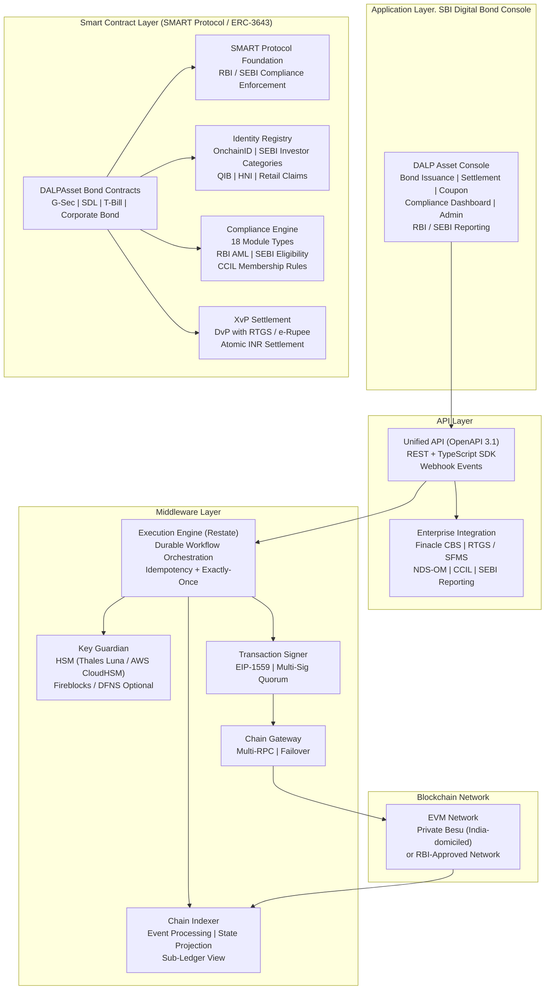
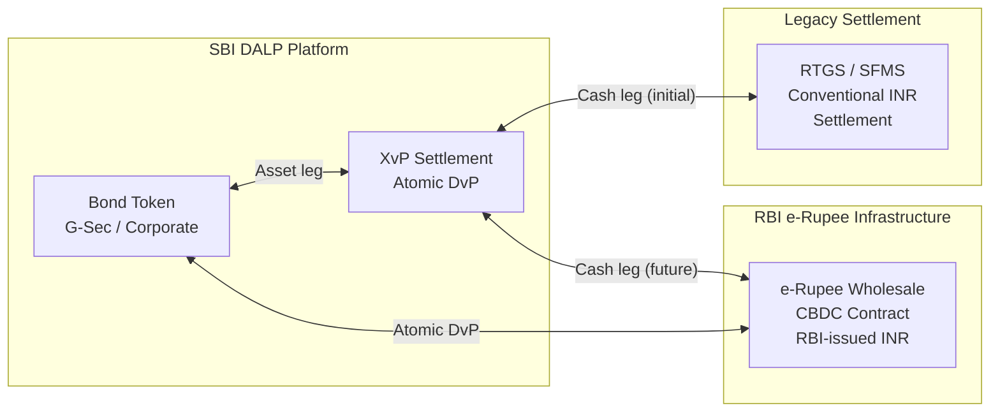
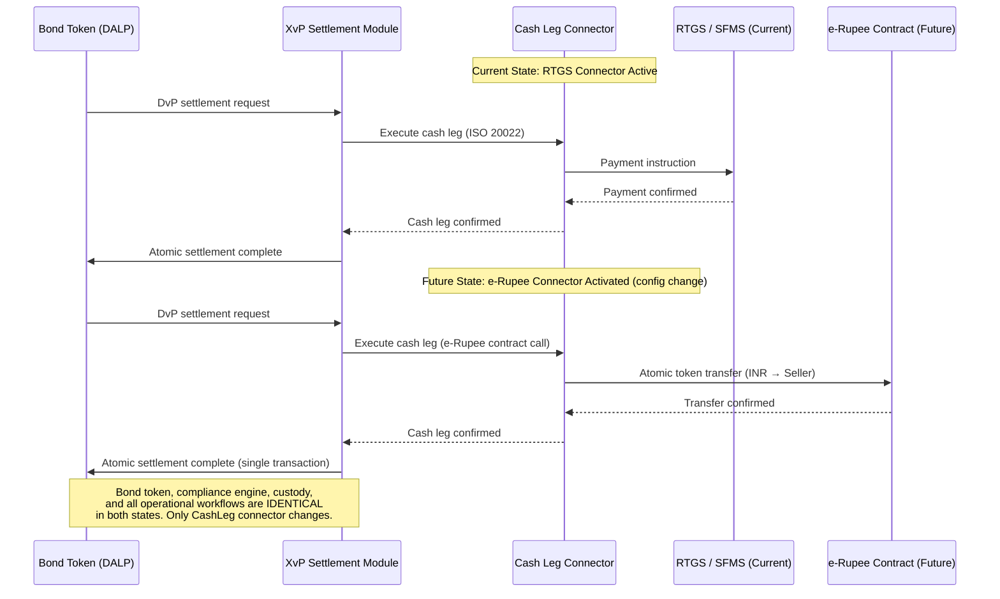
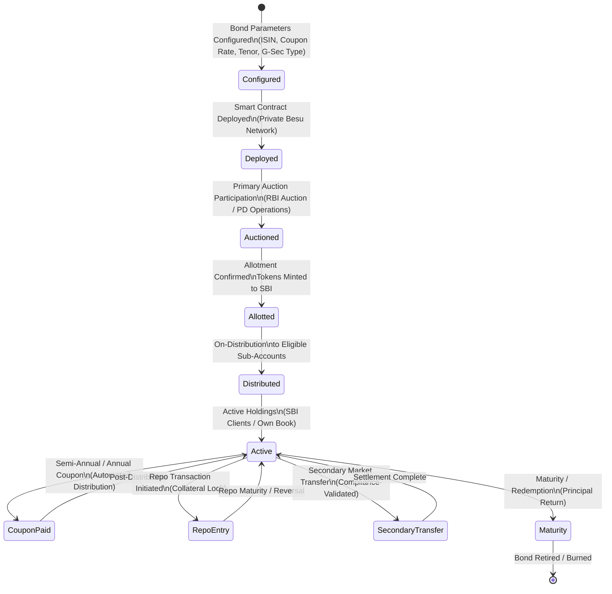
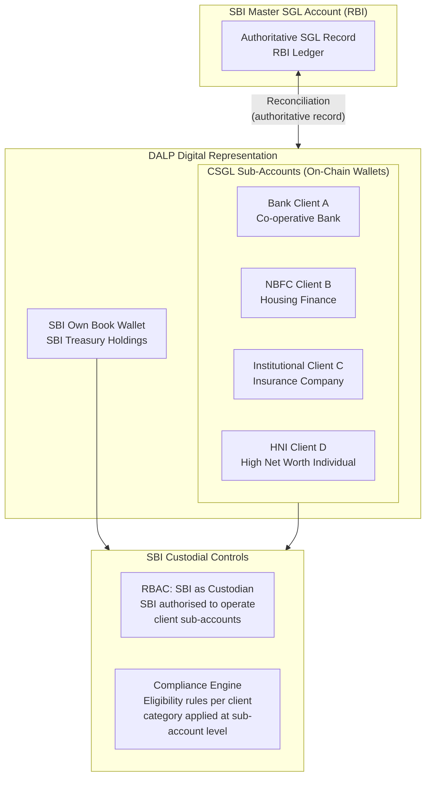
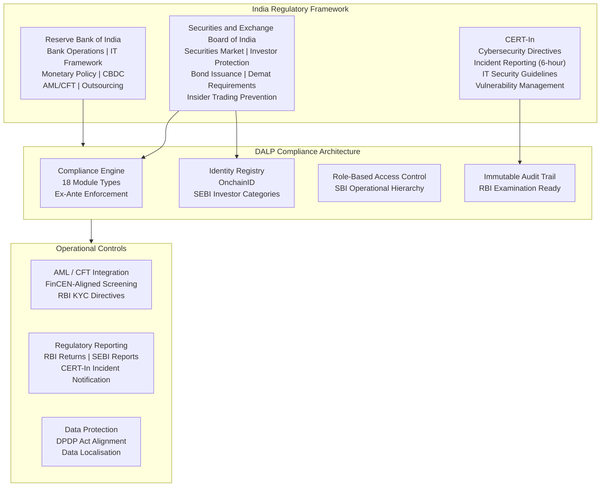
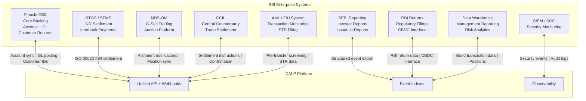
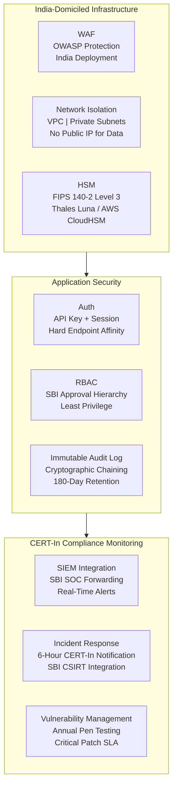
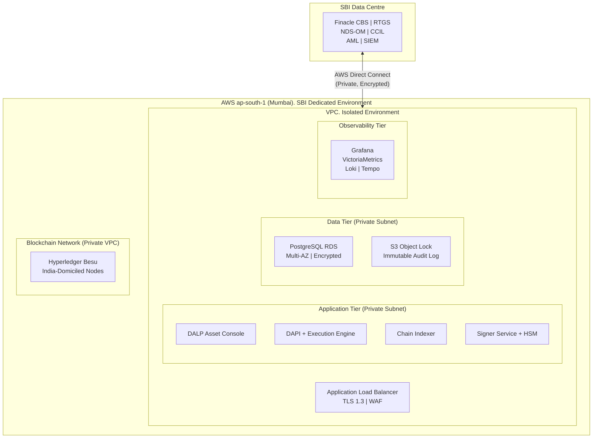
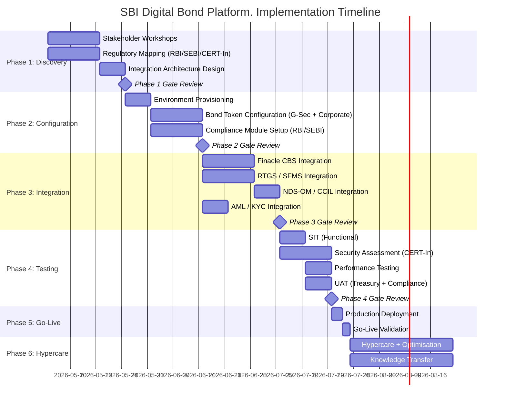

# Technical Proposal: Digital Bond Platform

**Prepared for:** State Bank of India
**Date:** 20 March 2026
**Version:** 1.0 Final
**Classification:** SettleMint Confidential. Invited Bidders Only
**Reference:** STATE-BANK-OF-INDIA-RFP-202603

---

## Table of Contents

1. Cover Page
2. Executive Summary
3. About SettleMint
4. Platform Overview: DALP
5. Solution Architecture
6. Asset Lifecycle Coverage
7. Compliance Architecture
8. Integration Architecture
9. Custody and Key Management
10. Settlement and Operations
11. Security Architecture
12. Deployment Options
13. Implementation Approach
14. Support and SLA
15. Reference Projects
16. Regulatory Alignment
17. Response Matrix
18. Appendix A: Risk Register
19. Appendix B: Compliance Module Catalog

---

## 1. Cover Page

**Document Title:** Technical Proposal: Digital Bond Platform
**Client:** State Bank of India, Mumbai, India
**Date:** 20 March 2026
**Version:** 1.0 Final
**Prepared by:** SettleMint NV
**Classification:** SettleMint Confidential

*This document contains proprietary and confidential information belonging to SettleMint NV. It is submitted exclusively in response to STATE-BANK-OF-INDIA-RFP-202603 and may not be reproduced, disclosed, or distributed without prior written consent from SettleMint NV.*

---

## 2. Executive Summary

### 2.1 Context

State Bank of India occupies a unique position in India's financial system. As the country's largest commercial bank, managing assets that exceed the GDP of many sovereign nations, serving over 500 million account holders, and functioning as the principal execution arm of the Government of India's financial policies. SBI's entry into digital bond infrastructure is not an innovation experiment. It is a programme that will be scrutinised by the Reserve Bank of India, the Securities and Exchange Board of India, CERT-In, Parliamentary oversight committees, the Comptroller and Auditor General, and SBI's own multi-layered internal governance structure. Every design decision must be defensible to all of these audiences simultaneously.

India's digital capital markets infrastructure is evolving rapidly. The RBI has been conducting its digital rupee (e-Rupee) wholesale pilot programme since 2022, progressively expanding the scope of participating institutions and use cases. SEBI has been working on a framework for electronic gold receipts and is actively considering how tokenised securities fit within the existing securities law framework. India's public sector has ambitious digitisation objectives, the government has issued digital rupee-denominated securities in pilot form, and the direction of travel points clearly toward a digital bond market where settlement occurs in programmable money rather than through traditional RTGS mechanisms. SBI, as the government's primary banking partner and the largest participant in the government securities market, is positioned to be the central institution in this transformation.

This procurement responds to that context. SBI is not acquiring a proof-of-concept tokenisation tool. It is procuring a digital bond platform that must operate at the scale of India's largest bank, under RBI and SEBI regulatory oversight, with the security architecture required by CERT-In's cybersecurity directives for critical banking infrastructure, and with an integration architecture that can connect to SBI's existing RTGS, NDS-OM (Negotiated Dealing System – Order Matching), CBS (Core Banking Solution), and regulatory reporting infrastructure.

SettleMint's Digital Asset Lifecycle Platform, DALP, is proposed as the governed infrastructure layer for SBI's digital bond platform. This proposal maps DALP's specific capabilities to SBI's stated objectives and requirements, drawing on SettleMint's existing engagement with State Bank of India's CBDC infrastructure work to demonstrate a verified track record of production deployment at SBI's scale.

### 2.2 Why This Programme Is Technically Hard

India's bond market presents specific technical challenges that generic digital asset platforms cannot address. Government securities in India settle through NDS-OM and the Constituent SGL (Subsidiary General Ledger) framework, a settlement architecture that is materially different from the DvP models common in Western markets. SBI functions as a Primary Dealer in addition to a commercial bank, meaning the platform must support both dealer-side operations (primary auction participation, market making, repo transactions) and investor-side operations (client holdings, custody services, CSGL sub-account management).

For a digital bond platform at SBI's scale, the following technical challenges require explicit design responses:

**Scale:** SBI participates in primary auctions for Government of India securities that regularly exceed INR 10,000 crore in a single auction. The digital bond platform must demonstrate that it can support transaction throughput consistent with SBI's participation in India's government securities market without creating settlement bottlenecks.

**Integration Complexity:** SBI's technology landscape spans multiple generations of infrastructure: the Finacle CBS at the core, RBI-mandated connectivity to RTGS and SFMS (Structured Financial Messaging System), NDS-OM API connectivity for g-sec trading, CCIL (Clearing Corporation of India Limited) for trade settlement, and extensive internal risk and reporting systems. The digital bond platform must fit within this landscape rather than creating a parallel infrastructure.

**e-Rupee Integration:** RBI's digital rupee (e-Rupee) wholesale pilot has established a settlement paradigm where government bond transactions can use e-Rupee as the cash leg. SBI has been a participant in the RBI's wholesale CBDC pilot. The digital bond platform should be architecturally compatible with this settlement model, even if e-Rupee integration is not in scope for the initial deployment, the architecture must not foreclose it.

**Regulatory Reporting:** SBI files with RBI, SEBI, CERT-In, SEBI's Depositories and Participants reporting, and multiple other regulatory bodies. Every system that touches securities positions must generate compliant regulatory reporting without manual data assembly.

### 2.3 Proposed Response

SettleMint proposes DALP as SBI's digital bond platform, covering the complete scope of STATE-BANK-OF-INDIA-RFP-202603:

**Digital Bond Issuance:** DALP's bond asset template provides full lifecycle support for INR-denominated government and corporate bonds, configurable tenor structures, fixed and floating coupon schedules, automated coupon distribution at scale, secondary market transfer controls aligned with SEBI's regulatory framework, and maturity redemption processing. Compliance controls enforce investor eligibility (institutional investor, HNI, retail) at the smart contract layer, aligned with SEBI's investor category framework for digital securities.

**e-Rupee Integration Readiness:** DALP's settlement architecture supports INR-denominated stablecoins and central bank digital currencies as the cash leg for DvP settlement. Where RBI's e-Rupee wholesale programme establishes the settlement infrastructure, DALP's XvP settlement module is architecturally compatible with e-Rupee as the cash leg. The initial deployment scope uses existing INR payment rails; the architecture preserves the option to upgrade to e-Rupee settlement without re-platforming.

**CCIL and NDS-OM Integration:** DALP's integration architecture provides the API connectivity required to interface with CCIL's settlement infrastructure and NDS-OM's dealing system. Government bond trades executed through NDS-OM can be represented on-chain in DALP for settlement processing, position management, and regulatory reporting, without disrupting the existing NDS-OM trading workflow.

**CERT-In Aligned Security:** DALP's security architecture. ISO 27001, SOC 2 Type II, HSM-based key management, immutable audit logs, and penetration testing by independent security firms, aligns with CERT-In's cybersecurity directives for critical banking infrastructure (the Information Security Policy for Scheduled Commercial Banks and related circulars).

### 2.4 Why SettleMint

SettleMint's case for selection as SBI's digital bond platform provider rests on one uniquely verifiable differentiator above all others: SettleMint is already working with State Bank of India.

The existing SBI engagement. CBDC infrastructure for a secure, scalable digital currency system, with the pilot successfully completed and production deployment in progress, means that SettleMint is not proposing to learn SBI's operating environment, regulatory requirements, and institutional governance during this engagement. That knowledge exists already. DALP's architecture has been validated against SBI's security review, vendor risk assessment, and technology governance processes. The production CBDC deployment demonstrates DALP's capability to operate at SBI's scale under RBI's supervisory framework.

Additional references demonstrating directly comparable capability include: the Reserve Bank of India's Innovation Hub multi-bank letter of credit trade finance blockchain (demonstrating DALP's RBI-adjacent regulatory and technical credibility), OCBC Bank Singapore (demonstrating multi-year production operation under a comparable institutional governance framework), Mizuho Bank Japan (demonstrating DALP's bond tokenisation capability in an APAC institutional context), and Commerzbank (demonstrating hybrid on/off-chain bond issuance with near real-time settlement).

### 2.5 Document Map

- **Section 3: About SettleMint**: company background, SBI relationship, and India credentials
- **Section 4: Platform Overview**: DALP capabilities for India's digital bond market
- **Section 5: Solution Architecture**: four-layer stack for SBI's digital bond platform
- **Section 6: Asset Lifecycle Coverage**: government and corporate bond lifecycle detail, e-Rupee readiness
- **Section 7: Compliance Architecture**: RBI, SEBI, and CERT-In alignment with India-specific controls
- **Section 8: Integration Architecture**: CBS, RTGS, NDS-OM, CCIL, and regulatory reporting
- **Section 9: Custody and Key Management**: key security for SBI's production environment
- **Section 10: Settlement and Operations**: DvP settlement and operational tooling at SBI scale
- **Section 11: Security Architecture**: CERT-In aligned defense-in-depth
- **Section 12: Deployment Options**: India-domiciled deployment options
- **Section 13: Implementation Approach**: phased delivery for SBI's governance environment
- **Section 14: Support and SLA**: enterprise support for SBI's operational requirements
- **Section 15: Reference Projects**: 14 production references with India case studies
- **Section 16: Regulatory Alignment**: RBI, SEBI, and CERT-In control mapping
- **Section 17: Response Matrix**: requirement-by-requirement responses (TR-01 to TR-20)
- **Appendix A: Risk Register**: RAID tailored to India's digital bond market context
- **Appendix B: Compliance Module Catalog**: DALP's 18 compliance modules with SBI application

---

## 3. About SettleMint

### 3.1 Company Overview

SettleMint is the digital asset lifecycle platform company for regulated financial markets and sovereign use cases. Founded nearly a decade ago, SettleMint provides the infrastructure institutions need to design, launch, and operate tokenised assets with the governance, compliance, and operational reliability that regulated environments demand.

### 3.2 SBI Relationship and India Track Record

SettleMint's existing engagement with State Bank of India is the most directly relevant credential for this procurement. The SBI CBDC infrastructure programme, building a secure, scalable digital currency system for RBI's e-Rupee wholesale pilot, with the pilot successfully completed and production deployment in progress, demonstrates DALP's capability at the scale and governance intensity that SBI demands. This is not a reference from a comparable institution in a different country. This is SBI itself, operating DALP in the same regulatory environment, under the same RBI framework, subject to the same security and governance requirements that this digital bond platform must satisfy.

Beyond the direct SBI relationship, the Reserve Bank of India's Innovation Hub engagement, delivering a multi-bank, multi-cloud, multi-node blockchain infrastructure for fraud-proof letter of credit trade finance, demonstrates SettleMint's credibility in central bank-adjacent financial market infrastructure in India. The RBI Innovation Hub programme operates under the direct oversight of the RBI's regulatory architecture and was designed to demonstrate production-viable blockchain technology in India's banking system. That deployment, built on DALP, has been operational and demonstrates the exact class of institutional credibility that SBI's procurement committee requires.

### 3.3 APAC and Global Credentials

Beyond India: OCBC Bank Singapore's security token engine (multi-year production, MAS regulated), Standard Chartered Bank's Digital Virtual Exchange (institutional securities tokenisation across Asia), Maybank Project Photon (ASEAN FX tokenisation and XvP settlement), and Mizuho Bank Japan's bond tokenisation PoC demonstrate consistent APAC institutional deployment capability. Commerzbank's hybrid on/off-chain ETP issuance with Boerse Stuttgart listing, settlement under 10 seconds, EUR 7 million annual savings identified, provides the closest Western comparable to SBI's government bond settlement efficiency objectives.

### 3.4 Technology Certifications

ISO 27001 and SOC 2 Type II certifications. Annual independent penetration testing. Smart contract security audits by specialised blockchain security firms. These certifications support SBI's vendor risk assessment obligations under RBI's IT Framework for Banks (formerly the Working Group on IT Governance report) and CERT-In's cybersecurity directives for critical banking infrastructure.

---

## 4. Platform Overview: DALP

### 4.1 Platform Purpose

DALP provides the infrastructure institutions need to operate tokenised assets at production scale under regulation, covering the full digital asset lifecycle from asset design through issuance, compliance enforcement, custody integration, settlement, servicing, and retirement. For SBI's digital bond platform, DALP provides:

- A bond token engine covering government securities (G-Secs, T-Bills, SDLs) and corporate bonds with full lifecycle logic
- A compliance engine enforcing SEBI investor eligibility and RBI regulatory requirements at the protocol layer
- A settlement module enabling DvP settlement with INR payment rail integration and e-Rupee readiness
- An integration framework connecting to SBI's CBS, RTGS, NDS-OM, CCIL, and regulatory reporting infrastructure
- An operational platform with pre-built dashboards, structured alerting, and full auditability for RBI examination

### 4.2 Core Lifecycle Pillars

**Issuance:** Bond tokens deployed through a configuration-driven Asset Designer, not custom smart contract development. Every component is pre-audited; security guarantees are inherited. For SBI, this means government bond tokens (G-Secs) and corporate bond tokens are deployed from a validated template, eliminating the audit overhead of custom contract development.

**Compliance:** Ex-ante enforcement, every transfer validated against the full compliance module set before execution. SEBI investor category requirements (QIB, HNI, retail), RBI AML/CFT requirements, and CCIL eligibility rules are enforced at the smart contract layer. The ERC-3643 (T-REX) standard provides the compliance enforcement mechanism that cannot be bypassed by application-layer logic.

**Custody:** Key Guardian with HSM integration for production key management. Fireblocks and DFNS integrations available for institutional custody overlay. Maker-checker quorum for all high-value operations. Emergency pause and break-glass procedures documented and tested.

**Settlement:** Atomic DvP/XvP settlement, both legs complete or both revert. Local (same-chain) and HTLC (cross-chain) models. ISO 20022 payment rail integration for RTGS connectivity. e-Rupee settlement architecture compatibility.

**Servicing:** Automated coupon calculation and distribution at scale. Maturity redemption processing. Corporate action handling (buybacks, call options). Repo transaction support through the configurable token architecture.

### 4.3 Platform Foundations

**Identity and Access Management:** OnchainID with claim-based verification for SEBI investor categories. Identity Registry reusable across all bond types. RBAC with 5 roles covering the full SBI operational hierarchy from issuance authority to investor management.

**Integration:** REST API, TypeScript SDK, event webhooks, ISO 20022 for payment rail connectivity. Bring-your-own-chain for government network or private chain deployment. External token registration for e-Rupee integration when available.

**Observability:** Pre-built Grafana dashboards covering bond operations, settlement monitoring, compliance activity, and security events. VictoriaMetrics, Loki, Tempo observability stack. Automated alerting with structured notification templates. 534 structured error codes for operational support.

---

## 5. Solution Architecture

### 5.1 Four-Layer Technical Stack for SBI



### 5.2 Government Securities Architecture

India's government securities market has a specific architecture that the digital bond platform must respect. G-Secs are issued by RBI on behalf of the Government of India, cleared through NDS-OM, and settled through the SGL (Subsidiary General Ledger) held at RBI. CCIL acts as the central counterparty for most inter-bank g-sec trades.

DALP's architecture for SBI's G-Sec digitalisation positions the platform as an orchestration and compliance layer that works alongside the existing NDS-OM / SGL infrastructure rather than replacing it. The design has two modes:

**Mode 1: Parallel Digital Representation.** G-Secs remain in SGL form; DALP maintains a digital twin representation of SBI's G-Sec portfolio on-chain. This representation is used for investor distribution (sub-accounts), repo tracking, compliance monitoring, and regulatory reporting, while the authoritative settlement record remains in RBI's SGL. This mode requires no regulatory change and can be deployed immediately.

**Mode 2: Native Digital Issuance.** G-Secs are issued natively as DALP bond tokens (with RBI regulatory approval for digital government securities). Settlement occurs through DALP's XvP module with e-Rupee or RTGS as the cash leg. This mode represents the end-state vision and is architecturally supported by DALP without redesign.

For SBI's initial deployment, Mode 1 is recommended as the lower-risk path to operational value. The architecture fully supports migration to Mode 2 when the regulatory framework is established.

### 5.3 e-Rupee Integration Architecture

RBI's wholesale e-Rupee pilot (Project Dinesh and subsequent phases) has established that DvP settlement using programmable digital currency is both technically feasible and within RBI's policy appetite. DALP's architecture is designed for e-Rupee integration:



In the initial deployment, the cash leg of DvP settlement uses RTGS through ISO 20022 message integration. When RBI expands the e-Rupee wholesale programme to include G-Sec settlement, DALP's XvP settlement module is already architecturally prepared: the cash leg connector is swapped from RTGS to the e-Rupee contract without changing the bond token architecture, the compliance engine, or the operational workflows.

### 5.4 e-Rupee DvP Transition Architecture

The architectural path from RTGS-based DvP settlement (current deployment) to e-Rupee-based atomic DvP (future state) requires only a cash-leg connector change, the bond token architecture, compliance engine, custody model, and all operational workflows are identical:



**What changes:** The cash leg connector configuration (RTGS → e-Rupee contract address). This is a configuration change managed through DALP's governance workflow (maker-checker approval for the connector switch).

**What does not change:** Bond token contracts, compliance engine, investor identity registry, custody model, Key Guardian configuration, operational dashboards, GL integration, regulatory reporting, all remain identical.

**When this happens:** When RBI expands the wholesale e-Rupee programme to include G-Sec settlement for commercial bank participants. SBI's CBDC experience with DALP makes this transition familiar rather than novel.

---

## 6. Asset Lifecycle Coverage

### 6.1 Government Securities Lifecycle



**Primary Auction Participation:** For G-Sec auctions conducted by RBI, SBI's bidding outcome is represented on DALP. Upon allotment confirmation from RBI/NDS-OM, DALP mints the corresponding bond tokens to SBI's primary dealer wallet, creating the on-chain representation of the allotted position. This minting is triggered by the allotment notification received through the NDS-OM API integration.

**Sub-Account Distribution:** SBI holds G-Secs both for its own book and as sub-custodian for its client base (banks, NBFCs, institutional investors, HNI clients) through CSGL (Constituent SGL) sub-accounts. DALP's investor distribution workflow replicates this structure: each client sub-account is represented as a separate on-chain wallet under SBI's custody authority, and G-Sec holdings are distributed to sub-accounts with full eligibility validation.

**Coupon Automation:** Semi-annual coupon payments on G-Secs are automated through DALP's Fixed Treasury Yield feature. On each coupon date, a historical balance snapshot captures the distribution of holdings across SBI's own book and sub-accounts. Coupon amounts are calculated per holder, and the distribution batch is executed after maker-checker approval from SBI's treasury operations team. Distribution amounts are posted to SBI's CBS through the GL integration webhook.

**Repo Transaction Support:** Repo transactions, where G-Secs are used as collateral for short-term INR borrowing, are supported through the configurable token architecture. A repo entry locks the collateral G-Sec tokens for the repo period using the Settlement Lock compliance module, preventing secondary transfer during the repo tenure. At repo maturity, the lock is released and the G-Secs return to free-floating status. This creates an on-chain representation of repo collateral that eliminates the manual tracking currently required in SBI's repo management systems.

### 6.1a CSGL Sub-Account Architecture

SBI's most significant use case for a digital bond platform is managing G-Sec holdings for its client base through the Constituent SGL (CSGL) framework. SBI, as a custodian bank, maintains a master SGL account at RBI and operates CSGL sub-accounts for its clients, banks, NBFCs, insurance companies, provident funds, mutual funds, and institutional investors. At SBI's scale, this represents one of the largest custodial sub-account structures in India's government securities market.

DALP's architecture maps SBI's CSGL hierarchy directly:



**Sub-Account Onboarding:** Each CSGL client is onboarded to DALP's Identity Registry with their institutional KYC credentials (company registration, SEBI registration where applicable, regulatory category). The sub-account wallet is linked to the client's existing SBI customer record in Finacle. Investor category claims (QIB, HNI, institutional) are attached to the OnchainID identity, ensuring that compliance rules apply correctly to each sub-account category.

**Custodial Authority Model:** SBI maintains custodial authority over all CSGL sub-account wallets. DALP's RBAC model assigns the Custodian role to SBI's custody operations team, enabling SBI to execute transactions on behalf of clients (as authorised by client instructions) while maintaining a complete record of every custodial action taken. Client sub-account wallets are read-only from the client's perspective in the initial deployment; client-direct transaction capabilities can be enabled in subsequent phases.

**Position Reporting at Sub-Account Level:** DALP's indexer maintains real-time position data at the individual sub-account level. SBI's operations team can generate holdings reports for any sub-account at any point in time, with historical snapshots for any date. Coupon entitlements are calculated at sub-account level based on holdings at the record date snapshot, eliminating the manual spreadsheet-based coupon allocation that current CSGL operations require.

**Reconciliation with RBI SGL:** DALP's sub-account position data is reconciled against RBI's SGL master record on a daily basis through an automated reconciliation job. Any discrepancy between DALP's on-chain sub-account records and the SGL master record is surfaced as a reconciliation break for SBI's operations team to investigate. This reconciliation provides the daily evidence base for RBI's SGL oversight and CAG audit requirements.

### 6.2 Corporate Bond Lifecycle

For corporate bonds issued or held by SBI, DALP provides:

**Primary Issuance Support:** SBI's debt capital markets team configures corporate bond parameters: issuer identity, face value in INR, coupon rate and type (fixed/floating with MIBOR/SOFR oracle integration), payment schedule, call/put provisions, credit rating at issuance (metadata), and investor eligibility restrictions per SEBI's QIB/HNI/retail framework. The bond is deployed through the SMART Protocol factory and enters the issuance lifecycle.

**SEBI Eligible Demat Integration:** SEBI requires that corporate bonds be issued in dematerialised form through NSDL or CDSL. DALP's digital bond representation does not replace the NSDL/CDSL demat record; it operates alongside it, providing an on-chain representation for programmable settlement, compliance enforcement, and automated servicing, while the NSDL/CDSL record remains the regulatory-compliant custody record. This coexistence model is the same hybrid approach used for OCBC Bank's security token engine in Singapore.

**Automated Corporate Actions:** Buyback tenders, call option exercises, and credit event notifications are handled through DALP's corporate action workflows, the same maker-checker governance model as coupon distributions, with structured event notifications to SEBI's reporting system.

### 6.3 INR-Denominated Stablecoin / e-Rupee as Settlement Asset

DALP's stablecoin asset template, combined with the XvP settlement module, provides the architecture for INR-denominated programmable money as the settlement asset for bond transactions:

- **For internal use:** SBI can deploy an internal INR stablecoin on DALP's private network as a settlement asset for intra-SBI bond transfers, eliminating RTGS latency for same-bank settlements
- **For e-Rupee integration:** When RBI's wholesale e-Rupee is available as a settlement asset, the DALP stablecoin template provides the interface model; the cash leg connector is replaced with the e-Rupee contract address
- **For institutional settlement:** Multi-bank DvP settlement using tokenised INR (either SBI's INR stablecoin or a network-shared tokenised rupee) provides atomic settlement finality without RTGS settlement window constraints

---

## 7. Compliance Architecture

### 7.1 Overview

SBI's digital bond platform operates under a three-regulator compliance framework: RBI's oversight of bank operations, IT systems, and monetary policy; SEBI's regulation of securities markets, investor protection, and bond issuance; and CERT-In's cybersecurity requirements for critical banking infrastructure. DALP addresses all three layers.



### 7.2 RBI Regulatory Alignment

**IT Framework for Banks:** RBI's IT Framework (2011, updated) and Cyber Security Framework for Banks (2016) establish comprehensive requirements for banks' IT systems, including governance, risk management, audit trails, and incident response. DALP's architecture produces all required governance artifacts: architecture documentation, control narratives, audit trails, and incident response runbooks, structured for RBI IT examination.

**AML/KYC:** RBI's Master Direction on KYC (2016, continuously updated) requires banks to maintain verified customer identities, conduct ongoing due diligence, and file Suspicious Transaction Reports (STRs) with FIU-IND. DALP's Identity Registry enforces KYC-backed investor identity before any bond token transfer executes. KYC refresh cycles are tracked automatically, expired KYC claims block transfers pending renewal. AML screening integration connects to SBI's existing AML platform for pre-transfer screening and STR filing support.

**Digital Rupee (e-Rupee) Architecture Compatibility:** The RBI's concept note on CBDC and subsequent e-Rupee pilot notifications establish the architectural requirements for wholesale CBDC settlement. DALP's XvP settlement module is designed to be CBDC-compatible: the cash leg of DvP settlement is a configurable connector, not hard-coded to a specific payment rail. When the e-Rupee wholesale infrastructure becomes available as a settlement option, DALP switches the cash leg connector through configuration, not code change.

**Outsourcing and Third-Party Risk:** RBI's Guidelines on Managing Risks and Code of Conduct in Outsourcing of Financial Services (2006, updated) and IT outsourcing guidelines require banks to maintain oversight, audit rights, and data residency controls for outsourced technology. SettleMint's deployment model for SBI includes: India-domiciled infrastructure deployment, RBI-compatible outsourcing documentation, full audit trail access, and right-to-audit provisions in the commercial agreement.

### 7.3 SEBI Regulatory Alignment

**Securities Market Compliance:** SEBI's regulatory framework for corporate bonds (SEBI Listing Obligations, Issue and Listing of Debt Securities regulations) establishes requirements for electronic issuance, depository connectivity, investor eligibility, and regulatory reporting. DALP's compliance engine enforces these requirements:

| SEBI Requirement | DALP Implementation | Confidence |
|---|---|---|
| QIB eligibility for specific bond categories | OnchainID claim: `SEBI_QIB_VERIFIED` | 🟢 Native |
| HNI eligibility (min INR 10 lakh investment) | Holding Limit module + accreditation claim | 🟢 Native |
| Retail investor transfer restrictions | Country + Accreditation compliance module combination | 🟢 Native |
| Dematerialised bond representation | DALP digital twin; NSDL/CDSL remains authoritative | 🟡 Partial (coexistence model) |
| Insider trading prevention | Transfer restriction during designated trading windows | 🟢 Native (Time-Based Rules module) |
| SEBI reporting obligations | Structured event export API for SEBI-mandated reports | 🟡 Partial (format mapping required) |
| Bond trustee access | RBAC role for bond trustee with appropriate read permissions | 🟢 Native |

**Government Securities Specific:** For G-Secs, RBI is both the regulator and the issuer. G-Sec trading and settlement is regulated by RBI through the Government Securities Act (2006) and associated regulations. DALP's G-Sec digital representation complies with this framework by operating as a supplementary portfolio management layer rather than as an alternative settlement infrastructure, the RBI/SGL framework remains authoritative.

### 7.4 CERT-In Cybersecurity Alignment

CERT-In's directives for Indian banks, including the 2022 directive requiring 6-hour incident reporting for cybersecurity incidents, create specific operational requirements for SBI's digital bond platform:

**Incident Reporting (6-Hour Mandatory):** DALP's structured incident log captures all security events with timestamps, affected systems, and impact assessment in machine-readable format. The incident export API generates CERT-In notification packages within the 6-hour window. SBI's Security Operations Centre receives automated alerts for P1 security events through the observability integration.

**Vulnerability Management:** CERT-In's directives require institutions to maintain a vulnerability management programme and patch critical vulnerabilities within defined timelines. SettleMint's patch management programme provides critical security patches within the CERT-In mandated timelines. Patch delivery records are provided to SBI's InfoSec team as part of the monthly security reporting.

**Log Retention:** CERT-In requires security log retention for 180 days. DALP's immutable audit log configuration meets this requirement with configurable retention periods. Log exports are available in formats compatible with SBI's SIEM integration.

**IT Security Assessment:** CERT-In requires periodic security assessments of critical IT systems. DALP's annual independent penetration testing results are made available to SBI's InfoSec team. Smart contract security audit reports are provided as part of vendor due diligence.

### 7.5 Digital Personal Data Protection (DPDP) Act

India's Digital Personal Data Protection Act (2023) establishes data principal rights and data fiduciary obligations applicable to SBI's investor personal data in the digital bond platform:

**Data Localisation:** The DPDP Act permits the Government of India to restrict cross-border transfer of personal data to specific categories of countries. SettleMint's India-domiciled deployment (AWS ap-south-1 Mumbai or equivalent) ensures that investor personal data processed within DALP remains in India, satisfying the most restrictive interpretation of data localisation requirements.

**Data Minimisation:** DALP's on-chain data model stores only the minimum required data: investor wallet addresses, identity claim hashes (not underlying personal data), and compliance status indicators. PAN numbers, Aadhaar references, and KYC documentation reside in SBI's off-chain KYC systems.

**Data Principal Rights:** DALP's off-chain personal data architecture ensures that data principal rights (access, correction, erasure) can be exercised without conflicting with blockchain immutability. The on-chain data contains no personal data subject to erasure rights.

### 7.5a CAG and IS Audit Evidentiary Requirements

The Comptroller and Auditor General of India (CAG) conducts periodic IT audits of State Bank of India's systems under the provisions of the CAG's (DPC) Act. CAG's IT audit methodology, aligned with ISACA's COBIT framework and the CAG's own IT audit guidelines, examines IT governance, controls, data integrity, and system changeability for material banking systems. DALP's architecture addresses CAG's specific requirements:

**Immutable Audit Trail for CAG Examination:** DALP's cryptographically chained audit log provides the evidentiary foundation for CAG IT audit. Every bond transaction, compliance decision, configuration change, privileged access event, and maker-checker approval is recorded with: timestamp (synchronised to IST), operator identity (name and role), action type, affected asset or configuration, previous state, new state, and a cryptographic reference to the preceding record. This chain-of-custody record is exported in standard formats (CSV, JSON) for CAG audit review without requiring specialist blockchain tooling.

**Configuration Change History:** CAG IT audit routinely examines whether system configuration changes followed appropriate approval processes and whether changes were documented. DALP's change governance model records every configuration change as a structured event in the audit log: who proposed the change (maker), who approved the change (checker), approval timestamp, change parameters (old and new values), and the result. This record is immutable, it cannot be retrospectively altered, and is available in structured export format for CAG's audit team.

**Access Control Evidence:** CAG IT audit examines whether access controls are properly implemented and whether privileged access is appropriately governed. DALP's RBAC model provides: a complete register of all user roles and permissions, a log of all role changes with approval records, a log of all privileged operations executed by each role, and a log of all failed access attempts. These records support CAG's standard access control audit procedures.

**System Reliability Evidence:** CAG audit of banking systems examines uptime records, incident logs, and business continuity test results. DALP's observability stack provides monthly uptime reports, structured incident logs with root cause analysis, and DR test result documentation, all in formats suitable for CAG audit evidence requirements.

**Smart Contract Change Governance:** CAG IT audit will examine how changes to the tokenisation system's core logic (smart contracts, compliance rules) are governed. DALP's governance model requires multi-party approval for any compliance module change, records the approval chain immutably, and maintains the history of all compliance rule configurations from deployment to present. This history enables CAG to verify that changes were authorised and that the system has operated under the intended compliance rules throughout.

### 7.6 Regulatory Mapping Table

| Regulatory Requirement | Regulation | DALP Control | Confidence |
|---|---|---|---|
| IT Governance Framework | RBI IT Framework for Banks | Architecture documentation, audit trail, change control | 🟢 Native |
| Cyber Security Framework | RBI Cyber Security Framework 2016 | ISO 27001, SOC 2 Type II, penetration testing, incident response | 🟢 Native |
| KYC / Customer Due Diligence | RBI Master Direction KYC 2016 | OnchainID + claim verification; KYC expiry enforcement | 🟢 Native |
| AML / CFT | RBI AML/CFT regulations; PMLA | AML integration hook; pre-transfer screening; STR data export | 🟡 Partial (integration) |
| SEBI QIB / Investor Category | SEBI ICDR / Debt Securities regulations | Accreditation module + OnchainID claims | 🟢 Native |
| Government Securities compliance | Government Securities Act 2006; RBI G-Sec guidelines | Digital representation model; SGL remains authoritative | 🟡 Partial (coexistence) |
| CERT-In Incident Reporting (6h) | CERT-In 2022 directive | Structured incident log export; SBI SIEM integration | 🟢 Native |
| Vulnerability Management | CERT-In cybersecurity guidelines | Annual pen testing; critical patch SLA; scan reports to SBI | 🟢 Native |
| Data Localisation | DPDP Act 2023 | India-domiciled deployment; personal data off-chain | 🟢 Native |
| Outsourcing Management | RBI Outsourcing Guidelines | India deployment; audit rights; control documentation | 🟢 Native |
| Maker-Checker Controls | RBI Internal Controls | Built-in maker-checker for all high-risk operations | 🟢 Native |
| Audit Trail | RBI IT Examination | Immutable on-chain log; cryptographic chaining; 180-day retention | 🟢 Native |

---

## 8. Integration Architecture

### 8.1 SBI Enterprise Integration Overview

SBI's technology landscape represents one of the most complex enterprise integration environments in the Asia-Pacific banking sector. The digital bond platform must connect to multiple mission-critical systems, each with its own protocol requirements, data models, and operational governance.



### 8.2 Finacle CBS Integration

**Account Synchronisation:** SBI's Finacle Core Banking Solution (CBS) is the system of record for customer accounts, sub-ledger positions, and GL balances. DALP's integration with Finacle provides:

- Investor account linkage: Finacle customer account numbers are linked to OnchainID wallet addresses during digital bond onboarding. This linkage enables DALP to associate on-chain bond holdings with Finacle account records for GL reconciliation.
- GL posting events: Bond lifecycle events (issuance, coupon distribution, secondary transfer, redemption) trigger structured notifications via webhook to Finacle's GL integration API. Each notification includes event type, timestamp, bond identifier, INR amount, Finacle account reference, and blockchain transaction hash.
- Sub-account management: CSGL sub-accounts for SBI's institutional clients are represented as on-chain wallets associated with each client's Finacle account record.

### 8.3 RTGS and SFMS Integration

**INR Settlement via RTGS:** For institutional DvP settlement, DALP generates ISO 20022 payment instructions (pacs.008 format for SFMS) for the INR cash leg of bond transactions. These instructions are submitted to SBI's existing RTGS connectivity layer. Payment confirmation messages from RTGS trigger the on-chain settlement completion in DALP, releasing the locked bond tokens to the counterparty.

**Settlement Instruction Timing:** RTGS operates during defined business hours (8:00–19:00 IST on working days). For DALP's DvP settlement, the payment instruction is generated during RTGS business hours; after-hours bond transactions can be pre-confirmed with settlement execution queued for the next RTGS window.

### 8.4 NDS-OM Integration

**G-Sec Allotment Notifications:** NDS-OM's auction platform sends allotment confirmations to Primary Dealers through the RBI's SFMS messaging network. DALP's NDS-OM integration subscribes to allotment notifications for SBI's PD operations and automatically triggers the on-chain minting workflow upon allotment confirmation.

**Secondary Market Trade Reports:** For g-sec secondary market trades executed on NDS-OM, DALP receives trade report notifications through the NDS-OM API (or SFMS message format where NDS-OM API is not available) and creates corresponding on-chain settlement instructions. The CCIL settlement confirmation is received and used to trigger on-chain settlement completion.

### 8.5 CCIL Integration

CCIL acts as the central counterparty for most inter-bank g-sec trades and the guarantee fund mechanism for bond settlement. DALP's CCIL integration provides:

- Settlement instruction submission: DALP generates CCIL-compatible settlement instructions for g-sec DvP trades
- Settlement confirmation processing: CCIL settlement confirmations trigger on-chain event recording in DALP
- Collateral management: Where bonds are used as collateral with CCIL, DALP's Settlement Lock module tracks the collateral status on-chain

### 8.6 Regulatory Reporting Integration

**RBI Returns:** Bond position data, coupon payment records, and compliance event records are exported from DALP's indexer in structured formats for inclusion in SBI's RBI regulatory returns (Form XII for SGL position reporting, and related returns).

**SEBI Reporting:** Corporate bond-related regulatory events (new issuances, buybacks, call option exercises, credit events) are exported to SBI's SEBI reporting system through the event webhook architecture.

**CERT-In Incident Notification:** Security events flagged at P1/P2 severity in DALP are formatted as CERT-In-compatible incident notification packages, available for submission within the 6-hour mandatory reporting window.

---

## 9. Custody and Key Management

### 9.1 Key Management for SBI Production

SBI's security requirements for critical banking systems demand a key management architecture that meets CERT-In's guidelines and RBI's cyber security framework. DALP's Key Guardian provides:

**Production Key Tier (HSM):** All production signing keys for SBI's digital bond platform are managed through FIPS 140-2 Level 3 certified HSM hardware. Thales Luna SA 7 (for on-premises deployment) or AWS CloudHSM (for cloud deployment). Private key material never exists outside the HSM boundary in plaintext form. This architecture satisfies CERT-In's requirement for hardware-backed key management for critical financial systems.

**Governance Key Tier (Institutional Custody):** Governance keys, controlling compliance module configuration, emergency pause, and trusted issuer authority, are managed through institutional-grade custody (Fireblocks or DFNS). These keys require multi-party approval for any operation and are stored with hardware-backed key protection and institutional insurance coverage.

### 9.2 SBI-Specific Maker-Checker Requirements

SBI's internal control framework mandates maker-checker for all high-value financial operations. DALP's implementation aligns with SBI's existing approval hierarchy:

| Operation | Maker Role | Checker Role | Quorum Required |
|---|---|---|---|
| G-Sec issuance (primary allotment minting) | Treasury Operations Manager | Treasury Deputy GM | 2-of-2 |
| Corporate bond issuance | DCM Operations | DCM Head | 2-of-2 |
| Coupon distribution execution | Treasury Operations | Treasury Risk | 2-of-2 |
| Investor eligibility override | Compliance Analyst | Chief Compliance Officer delegate | 2-of-2 |
| SEBI compliance module change | Compliance Manager | General Manager Compliance | 2-of-3 |
| Emergency platform pause | Any authorised officer | N/A (single approver) | 1-of-N |
| Emergency unpause | Head of Digital Banking | Chief Risk Officer | 2-of-2 |
| Trusted issuer addition | Head of Technology | Chief Information Security Officer | 2-of-3 |

### 9.3 Break-Glass and Recovery

India's banking regulators place specific emphasis on business continuity for critical IT systems. DALP's break-glass procedure includes:

- Multi-party authentication requirement (CISO + one of: CRO, CFO, or Head of Operations)
- Automatic recording in the tamper-evident audit log with full context
- Immediate notification to SBI's internal audit function and RBI's IT examination team notification queue
- Mandatory post-event review within 24 hours with CAG-ready documentation

Recovery procedures for key material include both planned rotation (annual schedule, zero-downtime) and emergency recovery (key compromise scenario, documented recovery path with SBI's disaster recovery governance).

---

## 10. Settlement and Operations

### 10.1 Settlement at SBI Scale

SBI's bond operations involve transaction volumes that are among the highest in India's financial system. The digital bond platform must demonstrate settlement capability at the scale of a Primary Dealer with significant market-making obligations and a large institutional client base.

```mermaid
sequenceDiagram
    participant Buyer as Bond Buyer (Institutional)
    participant SBI_DALP as SBI DALP Platform
    participant Compliance as Compliance Engine
    participant SettleContract as Settlement Contract
    participant CCIL as CCIL / RTGS
    participant Finacle as Finacle CBS

    Buyer->>SBI_DALP: Initiate bond purchase (ISIN, INR amount)
    SBI_DALP->>Compliance: Eligibility check (Buyer: QIB status, holding limit)
    Compliance-->>SBI_DALP: Buyer eligible
    SBI_DALP->>SettleContract: Create DvP settlement (lock bonds)
    SettleContract-->>SBI_DALP: Settlement ID; bonds locked
    SBI_DALP->>CCIL: Submit INR payment instruction (ISO 20022)
    CCIL-->>SBI_DALP: Payment confirmed
    SBI_DALP->>SettleContract: Execute (bonds → Buyer; payment confirmed)
    SettleContract-->>SBI_DALP: Settlement complete; both legs confirmed
    SBI_DALP->>Finacle: Post GL events (bond transfer + INR receipt)
    Finacle-->>SBI_DALP: GL confirmed
    SBI_DALP->>Buyer: Settlement notification + position update
```

### 10.1a Primary Dealer Operations

SBI's Primary Dealer (PD) operations involve specific workflows that differ from standard commercial bank bond operations. DALP provides specific support for PD-relevant activities:

**Auction Allotment Processing:** RBI conducts G-Sec auctions (uniform price and multiple price formats) through the NDS-OM system. SBI's PD desk submits competitive bids, and allotments are confirmed through NDS-OM's allotment notification system. DALP's NDS-OM integration subscribes to allotment notifications and automatically initiates the on-chain minting workflow upon confirmed allotment. The minting workflow is an idempotent, durable workflow, if an allotment notification is received multiple times (e.g., due to network retries), DALP mints tokens exactly once.

**When Issued (WI) Securities:** For the period between auction announcement and allotment, G-Secs trade on a "When Issued" basis. DALP supports WI security representation through the configurable token architecture: a WI token is created at auction announcement with conditional activation upon allotment confirmation. If allotment does not occur (cancelled auction), the WI tokens are burned. This architecture enables SBI's PD desk to manage WI positions on-platform without waiting for final allotment.

**LAF Repo Operations:** The Liquidity Adjustment Facility (LAF) repo, where banks use G-Secs as collateral for overnight or short-term borrowing from RBI, is a critical PD operation. DALP's Settlement Lock compliance module manages the collateral lock during the repo period: G-Sec tokens are locked when posted as RBI LAF collateral, preventing secondary transfer or re-hypothecation during the repo tenure. At repo maturity, the lock is released automatically through the configurable expiry mechanism. This creates an automated collateral management layer that eliminates manual tracking of LAF collateral status.

**OMO Tracking:** Open Market Operations (OMOs), where RBI buys or sells G-Secs in the secondary market to manage liquidity, affect SBI's G-Sec portfolio. When SBI sells G-Secs to RBI in an OMO, DALP records the transfer from SBI's portfolio to RBI's OMO account and triggers the RTGS payment confirmation workflow. When SBI buys from RBI in an OMO purchase, the reverse flow applies. All OMO transactions are recorded with full audit evidence for RBI's OMO settlement reconciliation.

### 10.2 High-Volume Coupon Distribution

For SBI's G-Sec portfolio, potentially representing hundreds of individual securities across thousands of sub-account holders, coupon distribution involves large-scale batch operations. DALP's distribution architecture handles this through:

**Batch Orchestration via Restate:** Coupon distributions are orchestrated as durable workflows. If any individual distribution step fails (e.g., network timeout during a large batch), Restate's persistence layer records the last successful step and resumes from there, without creating double-distributions or missed payments. The idempotency guarantee is unconditional.

**Parallel Execution with Consistency:** For large distributions (thousands of sub-account holders), DALP executes distribution transactions in parallel batches with configurable concurrency limits. Each batch is idempotent, if a batch is retried due to network issues, duplicate distributions are prevented at the smart contract level. All distribution transactions within a batch are recorded as linked events in the audit trail, enabling rapid investigation of any distribution anomaly.

**Maker-Checker at Batch Level:** The entire distribution batch (covering all coupon payments for a given G-Sec on a given coupon date) is presented for a single maker-checker approval before execution. SBI's treasury supervisors review the batch summary (total distribution amount, number of recipients, per-recipient amounts) and approve the execution, a single approval that governs the entire batch.

### 10.3 Operational Dashboards for SBI

SBI's operations team manages one of India's most complex bond portfolios. The operational dashboards provide:

**Bond Operations Dashboard:** Real-time view of all active bond positions across SBI's own book and client sub-accounts, segmented by instrument type (G-Sec, SDL, T-Bill, corporate bond). Pending coupon distribution batches with approval status. Open maker-checker items with aging.

**Settlement Monitor:** Real-time DvP settlement status across all pending transactions. RTGS payment confirmation status. CCIL settlement confirmation tracking. Failed settlement exception queue with automated categorisation.

**Compliance Dashboard:** Investor KYC expiry alerts for sub-account holders. Insider trading window enforcement status. SEBI reporting submission status. AML screening alert queue.

**RBI / SEBI Reporting Dashboard:** Automated generation status for periodic regulatory returns. Data quality indicators for each reporting dataset. Submission confirmation tracking.

---

## 11. Security Architecture

### 11.1 CERT-In Aligned Security Architecture



DALP's security controls are designed to satisfy CERT-In's cybersecurity requirements for critical banking infrastructure:

**Data Localisation Compliance:** All components processing SBI investor personal data are deployed within India's geographic boundary (AWS ap-south-1 Mumbai or on-premises in SBI's data centres). No personal data transits outside India. The blockchain network is deployed within India-domiciled infrastructure.

**Segregated Network Architecture:** DALP's deployment uses VPC isolation, private subnets for all data-tier components, and no public IP addresses for database or key management services. Network access from SBI's enterprise systems to DALP operates through AWS Direct Connect or VPN tunnels, not over the public internet.

**Immutable Audit Log:** CERT-In's requirement for tamper-evident audit logs is satisfied through DALP's cryptographically chained audit log architecture. Each audit record references the hash of the previous record, creating a chain where any modification is immediately detectable. The audit log is written to write-once, read-many storage (AWS S3 with Object Lock compliance mode, or equivalent on-premises immutable storage).

**Smart Contract Security:** All DALP smart contracts undergo formal security audits by specialised blockchain security firms. Audit reports are provided to SBI's InfoSec team. The upgrade mechanism for compliance modules uses the same maker-checker governance framework as financial operations, no compliance rule can be changed without the configured approval quorum.

---

## 12. Deployment Options

### 12.1 Recommended: India-Domiciled Cloud (AWS ap-south-1 Mumbai)

SettleMint recommends AWS ap-south-1 (Mumbai) as the primary deployment region for SBI's digital bond platform. This deployment provides:

- **DPDP Act compliance:** Data remains in India by default
- **CERT-In alignment:** India-based data centre satisfies RBI's technology localisation preferences
- **RBI IT Framework:** India deployment supports RBI's outsourcing guidelines for technology systems
- **Low latency:** Minimal network latency to SBI's data centres and NDS-OM/CCIL infrastructure
- **AWS Direct Connect:** Dedicated private network connectivity from SBI's network to the DALP deployment



### 12.2 On-Premises Deployment

For SBI requiring complete infrastructure control within SBI's own data centres (a common preference for India's largest banks given RBI examination obligations), DALP's Helm-based deployment supports full on-premises installation:

- All DALP components run on SBI-managed Kubernetes infrastructure
- Key Guardian connects to SBI-managed Thales Luna SA HSM hardware
- Blockchain nodes run within SBI's network perimeter
- Zero SettleMint access to production infrastructure
- SBI's IT operations team manages platform with SettleMint's support documentation and on-call support

### 12.3 Hybrid Deployment

A hybrid model is available where SBI manages database and key management on-premises (for complete data sovereignty) while DALP's application tier runs on AWS ap-south-1 with Direct Connect connectivity. This model is common among India's large private sector banks and provides operational benefits while maintaining data sovereignty for the most sensitive components.

---

## 13. Implementation Approach

### 13.1 Programme Structure

SBI's implementation programme will be governed by a Steering Committee comprising senior representatives from Digital Banking, Treasury, Technology, Risk, Compliance, and Internal Audit, reflecting the cross-functional governance intensity appropriate for India's largest bank.



### 13.2 Phase Descriptions

**Phase 1 (Weeks 1–3):** Structured discovery workshops with SBI's treasury, DCM, technology, compliance, risk, and internal audit functions. Regulatory mapping against RBI IT Framework, SEBI digital securities requirements, and CERT-In cybersecurity directives. Architecture design for India-domiciled deployment. RAID register with SBI-specific risks. Deliverables: BRD, Regulatory Compliance Matrix, Target Architecture Document, Implementation Roadmap, RACI Matrix.

**Phase 2 (Weeks 4–7):** Provisioning of development and production environments on AWS ap-south-1 or SBI data centre. G-Sec bond token configuration (G-Secs, SDLs, T-Bills). Corporate bond token configuration. Compliance module setup for SEBI investor categories (QIB, HNI, retail). Identity and access framework for SBI's operational hierarchy. HSM connectivity configuration. Maker-checker quorum policies aligned with SBI's approval authority framework.

**Phase 3 (Weeks 8–11):** Finacle CBS integration for account synchronisation and GL posting. RTGS/SFMS integration for ISO 20022 INR settlement. NDS-OM API integration for allotment notifications. CCIL settlement integration. AML platform integration for pre-transfer screening. SIEM integration for CERT-In-compliant security event forwarding. Regulatory reporting data export configuration.

**Phase 4 (Weeks 12–14):** Functional testing of all bond lifecycle scenarios including G-Sec allotment, coupon distribution at scale, secondary transfer, repo entry/exit, and maturity redemption. CERT-In-aligned security assessment including penetration testing, HSM validation, and smart contract audit review. Performance testing at SBI's anticipated transaction volumes. UAT with SBI's treasury and compliance teams. Disaster recovery testing with RTO/RPO validation.

**Phase 5 (Week 15):** Production deployment on India-domiciled infrastructure. Go/no-go criteria validation. Smoke test execution. On-site SettleMint support during go-live window.

**Phase 6 (Weeks 16–19):** Intensive hypercare with daily issue review. Performance optimisation based on production workload. Comprehensive knowledge transfer: role-based training for treasury, operations, compliance, and technology teams. Formal operational readiness assessment. Transition to contracted support tier.

### 13.3 Resource Model

**SettleMint Team:**

| Role | Engagement | Responsibility |
|---|---|---|
| Delivery Lead | Full programme | Programme governance, SBI senior stakeholder interface |
| Solution Architect (India specialist) | Phases 1–4 | Architecture design, RBI/SEBI/CERT-In alignment |
| Platform Engineer | Phases 2–5 | Environment provisioning, India deployment configuration |
| Integration Engineer | Phases 3–4 | Finacle, RTGS, NDS-OM, CCIL integration |
| QA / Test Lead | Phases 3–4 | CERT-In security test coordination, SIT, UAT |
| India Regulatory Specialist | Phases 1–2, 4 | RBI/SEBI/DPDP compliance mapping |
| Support Engineer | Phases 5–6 | Go-live support, hypercare, knowledge transfer |

---

## 14. Support and SLA

### 14.1 Enterprise Support Recommendation

SettleMint recommends **Enterprise Support** for SBI's digital bond platform, reflecting the critical importance of the programme to India's public sector capital markets infrastructure.

**Enterprise Support provides:**
- 24/7/365 coverage
- Named support team with deep familiarity of SBI's deployment
- P1 response: 15 minutes; resolution target: 2 hours
- P2 response: 1 hour; resolution target: 4 hours
- War-room escalation for P1 incidents with dedicated incident manager
- 99.99% monthly uptime SLA (approximately 4.3 minutes maximum monthly downtime)
- Continuous delivery with staged rollouts and SBI approval gate before production deployment
- Solution Architect access for quarterly architecture reviews
- Bi-weekly operational review with named Customer Success Manager

**SLA Applicability:** The uptime SLA applies to SettleMint-managed infrastructure components. For on-premises deployments, SettleMint provides the SLA for the DALP software layer; infrastructure SLA is governed by SBI's own infrastructure management commitments.

### 14.2 India-Specific Support Considerations

For SBI's digital bond platform operations, SettleMint provides India-specific support provisions:

- Support engineers available during IST business hours for P3/P4 incidents (07:00–20:00 IST)
- Dedicated escalation path for CERT-In incident reporting coordination
- Support for RBI examination readiness: dedicated pre-examination preparation session, audit evidence pack generation, and SettleMint representative availability for examiner questions (where permitted by SBI's governance)

---

## 15. Reference Projects

| Institution | Use Case | Region | Asset Class | Regulatory Context | Status |
|---|---|---|---|---|---|
| OCBC Bank | Security token engine; HNWI investment products | Singapore | Bonds, SPVs, Real Estate | MAS | Live / Multi-year |
| KBC Securities (Bolero) | Equity crowdfunding + SME loans | Belgium | Equities, Loans | FSMA, EU | Live |
| KBC Insurance | NFT product passports for insured assets | Belgium | NFT | FSMA | Live |
| Standard Chartered Bank | Digital Virtual Exchange; fractional tokenisation across Asia | Multi-region APAC | Securities | MAS + multi-jurisdiction | Live |
| Reserve Bank of India Innovation Hub | Multi-bank LC trade finance blockchain | India | Trade Finance | RBI | Live |
| Sony Bank (Sony Group) | Stablecoin + digital identity; Web3 banking | Japan | Stablecoins | FSA Japan | Phase 1 complete |
| **State Bank of India** | **CBDC infrastructure; e-Rupee at national scale** | **India** | **CBDC** | **RBI** | **Pilot complete; production in progress** |
| Islamic Development Bank | Sharia-compliant subsidy distribution | Multi-region | Subsidy | Islamic Finance | Live |
| Mizuho Bank | Bond tokenisation and trade finance | Japan | Bonds | FSA Japan | PoC complete; production planning |
| IsDB (Market Stabilization) | Collateral volatility management | Multi-region | Collateral | Islamic Finance | Live |
| Maybank (Project Photon) | FX tokenisation; XvP cross-border settlement | Malaysia | Stablecoins / FX | Bank Negara Malaysia | Live |
| ADI – Finstreet | Tokenised equity on Abu Dhabi mainnet | UAE | Equities | ADGM | Live |
| Commerzbank | Hybrid on/off-chain ETP issuance; Boerse Stuttgart listing | Germany | ETPs | BaFin / EU | Live |
| Saudi Arabia RER | Country-scale real estate tokenisation | Saudi Arabia | Real Estate | REGA | Live |

### 15.1 Most Relevant References for SBI

**State Bank of India CBDC (Direct Reference):** The existing SBI engagement is the most compelling evidence in this proposal. DALP is already operating at SBI under RBI oversight, having completed the pilot phase and progressing toward production. This is not a comparable reference, this is SBI itself.

**Reserve Bank of India Innovation Hub:** SettleMint's delivery of multi-bank, multi-cloud, multi-node trade finance blockchain infrastructure for the RBI Innovation Hub demonstrates direct credibility with India's central bank infrastructure programmes. The RBI Hub deployment used the same DALP architecture proposed for SBI's digital bond platform, validated against the RBI's technical requirements and governance expectations.

**Commerzbank ETP (Bond Market Parallel):** Commerzbank's hybrid on/off-chain ETP issuance, integrating with Boerse Stuttgart's listing service, achieving settlement under 10 seconds, and identifying EUR 7 million annual savings potential, provides the most direct Western comparable to SBI's bond market efficiency objectives. The hybrid approach (maintaining the existing securities infrastructure record while adding on-chain settlement efficiency) is the same design philosophy proposed for SBI's initial deployment.

**Mizuho Bank (APAC Bond Tokenisation):** Mizuho's bond tokenisation PoC, completed in late 2025 with production planning underway, demonstrates DALP's bond lifecycle capability in a comparable institutional environment. Japan's major commercial bank, a sophisticated regulatory context, and bond tokenisation as the primary use case.

---

## 16. Regulatory Alignment

### 16.1 RBI Digital Rupee (e-Rupee) Architecture

RBI's wholesale e-Rupee programme has established that programmable settlement currency is both technically feasible and within RBI's policy architecture. SBI has been a participating institution in the wholesale e-Rupee pilot. DALP's architecture positions SBI to capitalise on this infrastructure when it matures to production scale:

**Current State (Phase 1 Deployment):** INR settlement through RTGS via ISO 20022. DvP settlement coordinated through DALP's XvP module with RTGS payment instructions as the cash leg.

**Transition State (Phase 2, e-Rupee Integration):** When RBI expands the wholesale e-Rupee settlement programme, DALP replaces the RTGS cash leg connector with an e-Rupee smart contract connector. The bond token architecture, compliance engine, custody model, and operational workflows are unchanged. The transition is a configuration change, not a platform change.

**Future State (Full e-Rupee Settlement):** Atomic DvP settlement where both the bond token transfer and the e-Rupee payment complete atomically in a single blockchain transaction, eliminating RTGS settlement latency, providing immediate settlement finality, and enabling programmable conditions (time-limited settlement windows, conditional release, programmable coupons denominated in e-Rupee).

### 16.2 SEBI Digital Securities Framework

SEBI has been developing a framework for electronic gold receipts and is considering how tokenised securities fit within the existing securities law. The most likely regulatory evolution, based on public consultations and the Securities and Exchange Board of India Act framework, is a hybrid model where:

- Tokenised securities are recognised as a valid representation of demat securities
- NSDL/CDSL remain as the authoritative depositories under the Depositories Act
- Tokenised representations on blockchain are recognised for transfer, settlement, and pledge purposes
- Compliance obligations (investor eligibility, reporting) apply equivalently to tokenised and traditional demat securities

DALP's architecture is designed for this hybrid regulatory environment. The digital twin model (Mode 1 in Section 5.2) operates under this framework immediately, without waiting for regulatory change. When SEBI establishes a formal tokenised securities framework, DALP's native digital issuance capability (Mode 2) can be activated.

---

## 17. Response Matrix

| Req ID | Requirement | Compliance Status | Confidence | Evidence | Assumptions |
|---|---|---|---|---|---|
| TR-01 | End-to-end lifecycle for digital bond platform | Supported | 🟢 Native | DALP bond template: G-Sec, SDL, T-Bill, corporate bond; full lifecycle from allotment to maturity | Initial scope: government securities and corporate bonds |
| TR-02 | Maker-checker, delegated authority, audit logs | Supported | 🟢 Native | Built-in maker-checker; SBI approval hierarchy configuration in Phase 1; immutable audit trail | Role assignments require SBI governance decisions |
| TR-03 | APIs, events, batch interfaces, message standards | Supported | 🟢 Native | OpenAPI 3.1; TypeScript SDK; ISO 20022 for RTGS/SFMS; webhook events | NDS-OM API access requires SBI to provide API credentials |
| TR-04 | RBI, SEBI, CERT-In alignment | Supported | 🟢 Native | Full regulatory mapping in Section 7; CERT-In incident reporting architecture | Specific SEBI digital securities licence interpretation is SBI's legal determination |
| TR-05 | Identity, wallet, KYC/KYB, investor eligibility | Supported | 🟢 Native | OnchainID; SEBI investor category claims; QIB/HNI/retail enforcement | KYC data source is SBI's existing KYC infrastructure |
| TR-06 | Key management, HSM, signing policy, break-glass | Supported | 🟢 Native | Key Guardian with HSM; maker-checker quorum; CERT-In compliant break-glass procedure | On-premises HSM procurement and integration by SBI |
| TR-07 | Reconciliation across digital asset events, GL, sub-ledgers | Supported | 🟢 Native | Event indexer for real-time position; nightly reconciliation export to Finacle; GL posting webhooks | GL mapping requires SBI's accounting team input |
| TR-08 | Operational dashboards, alerting, audit evidence | Supported | 🟢 Native | Pre-built Grafana dashboards; CERT-In compatible incident log; structured audit export | SIEM integration requires SBI SOC API access |
| TR-09 | Deployment: India-domiciled, data residency | Supported | 🟢 Native | AWS ap-south-1 Mumbai or on-premises; India deployment by default | On-premises deployment timeline depends on SBI infrastructure readiness |
| TR-10 | APAC / India reference experience | Supported | 🟢 Native | SBI CBDC (direct); RBI Innovation Hub; OCBC, SCB, Maybank | Reference calls available subject to NDA |
| TR-11 | Programmable controls: eligibility, transfer restrictions, settlement | Supported | 🟢 Native | 18 compliance modules; runtime reconfiguration; ERC-3643 enforcement | Complex SEBI regulatory requirements validated in Phase 1 compliance mapping |
| TR-12 | Test strategy: SIT, UAT, CERT-In security assessment | Supported | 🟢 Native | Comprehensive test plan in Section 13; CERT-In pen test scope defined | SBI's InfoSec team involvement in security testing coordination |
| TR-13 | Integration with Finacle, RTGS, NDS-OM, CCIL | Supported | 🟡 Partial | Integration architecture defined; RTGS ISO 20022 standard; NDS-OM API integration, specific API access confirmed in Phase 1 | NDS-OM and CCIL API access requires RBI / CCIL authorisation |
| TR-14 | Data model extensibility for legal entities, products | Supported | 🟢 Native | Configurable token; compliance module parameterisation; no custom code for standard variants | Multi-entity expansion scoped separately |
| TR-15 | Records retention, evidentiary integrity, 180-day CERT-In | Supported | 🟢 Native | Immutable audit log; 180-day configurable retention; CERT-In compliant log format | S3 Object Lock (cloud) or equivalent immutable storage (on-premises) |
| TR-16 | Third-party risk transparency | Supported | 🟢 Native | Full third-party dependency register in Phase 1; explicit control boundaries | No hidden managed services |
| TR-17 | BCP, RTO/RPO, multi-AZ, backup restore | Supported | 🟢 Native | RTO 4h (cloud); RPO 1h; multi-AZ; annual DR test | On-premises RTO/RPO depends on SBI infrastructure |
| TR-18 | Commercial scaling for entities, products, volumes | Supported | 🟢 Native | Environment-based licensing; no per-transaction charges | Expansion environments at standard rate |
| TR-19 | Release management, regression testing, smart contract governance | Supported | 🟢 Native | Staged rollout with SBI approval gate; regression test suite; maker-checker for contract changes | Smart contract upgrades require SBI approval per governance framework |
| TR-20 | Roadmap alignment, live vs roadmap | Supported | 🟢 Native | All capabilities described are live in DALP; e-Rupee integration readiness is architectural, not roadmap | e-Rupee integration activatable when RBI wholesale programme expands |

---

## 18. Appendix A: Risk Register

| Risk ID | Category | Risk Description | Likelihood | Impact | Mitigation |
|---|---|---|---|---|---|
| R-001 | Regulatory | NDS-OM API access authorisation by RBI takes longer than anticipated | Medium | High | Early engagement with RBI / CCIL in Phase 1; fallback to SFMS message-based integration available |
| R-002 | Integration | Finacle CBS API compatibility with DALP's webhook model | Medium | High | Finacle API assessment in Phase 1; alternative batch file integration available if real-time API not supported |
| R-003 | Scale | G-Sec auction allotment volumes exceed initial throughput estimates | Low | High | Performance testing at 2x anticipated volumes in Phase 4; auto-scaling configuration in AWS deployment |
| R-004 | Regulatory | SEBI digital securities framework changes affecting tokenised bond classification | Medium | High | Phase 1 legal assessment; modular compliance architecture enables rapid reconfiguration; hybrid model reduces regulatory dependency |
| R-005 | Security | CERT-In security assessment identifies issues requiring remediation pre-go-live | Low | High | Early CERT-In framework alignment in Phase 2; security assessment in Phase 4 with adequate remediation buffer |
| R-006 | Governance | SBI's multi-layered approval hierarchy creates decision bottlenecks | High | Medium | Steering Committee established in Phase 1 with escalation authority; documented RACI with named accountable parties |
| R-007 | Data | India data localisation requirements change during implementation | Low | Medium | India-domiciled deployment (AWS Mumbai or SBI on-premises) satisfies most stringent interpretation; no design change needed |
| R-008 | Integration | CCIL settlement API integration complexity | Medium | Medium | CCIL integration design assessed in Phase 1; ISO 20022 standard format; CCIL technical team engagement |
| R-009 | e-Rupee | RBI wholesale e-Rupee programme timeline changes | Low | Low | Architecture supports both RTGS (current) and e-Rupee (future) without re-platforming; no timeline dependency |
| R-010 | Operations | Training for SBI's large operations team takes longer than anticipated | Medium | Medium | Role-based training materials developed in Phase 6; train-the-trainer model for scale; runbooks and playbooks provided |

---

## 19. Appendix B: Compliance Module Catalog

| Module Category | Module Name | Description | SBI Application |
|---|---|---|---|
| **Eligibility** | Country Restriction | Blocks transfers to investors in restricted jurisdictions | India-only investor base; NRI eligibility rules for specific instruments |
| **Eligibility** | Investor Accreditation | Enforces QIB / HNI / retail category requirements | SEBI investor category enforcement per bond type |
| **Eligibility** | Whitelist | Restricts to predefined approved investor addresses | Closed placement bonds; SBI's institutional client sub-accounts only |
| **Eligibility** | Blacklist | Blocks sanctioned / restricted addresses | RBI watchlist enforcement; PMLA-flagged entities |
| **Restrictions** | Transfer Freeze | Freezes transfers for a specific investor | PMLA/FIU-directed holds; investigation freezes |
| **Restrictions** | Token Pause | Pauses all transfers for a specific bond token | SEBI suspension orders; emergency operational pause |
| **Restrictions** | Time-Lock | Restricts transfers during defined window | Insider trading blackout periods; lock-up provisions |
| **Transfer Controls** | Transfer Limit | Limits maximum per-transfer amount | Retail investor single-transaction limits |
| **Transfer Controls** | Holding Limit | Limits maximum holding per investor | SEBI position limits; concentration risk controls |
| **Transfer Controls** | Transfer Approval | Requires explicit approval for threshold transfers | High-value transfers requiring compliance sign-off |
| **Issuance / Supply** | Supply Limit | Caps total outstanding supply | Bond issuance caps per programme document |
| **Issuance / Supply** | Issuance Restriction | Restricts minting authority | SBI treasury-only primary issuance authority |
| **Time-Based Rules** | Holding Period | Enforces minimum holding before transfer | SEBI lock-up requirements for specific issue types |
| **Time-Based Rules** | Expiry Date | Enforces restriction after date | Matured bonds; expired rights |
| **Time-Based Rules** | Trading Window | Restricts transfers to defined windows | G-Sec trading session windows; settlement cut-offs |
| **Settlement / Collateral** | Collateral Backing | Verifies collateral before transfer | Repo collateral management; secured lending |
| **Settlement / Collateral** | Settlement Lock | Locks tokens during settlement | DvP settlement integrity; CCIL collateral lock |
| **Settlement / Collateral** | Cross-Chain Lock | HTLC cross-chain settlement | e-Rupee cross-chain DvP when available |
