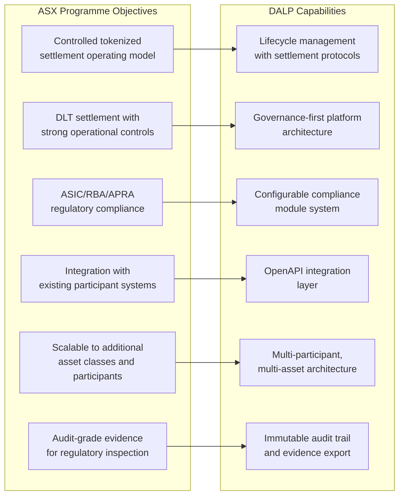
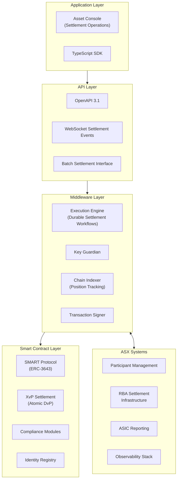
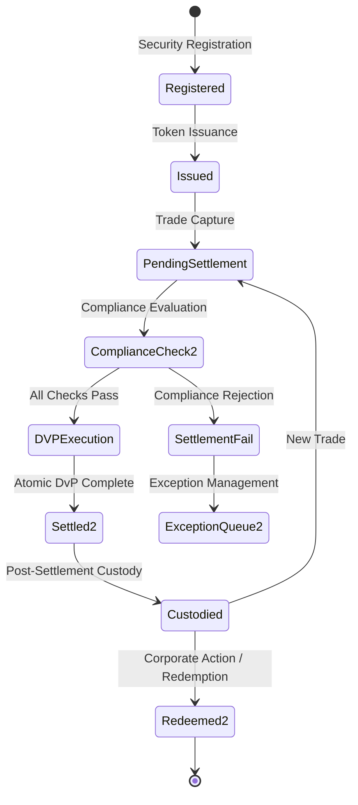
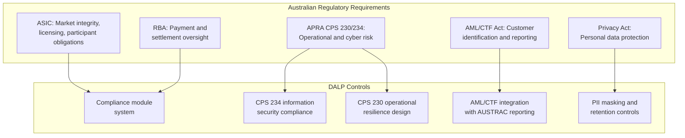
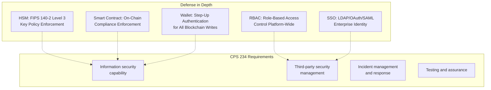
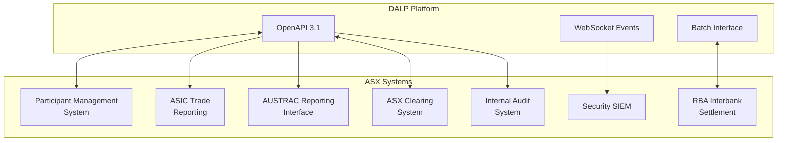
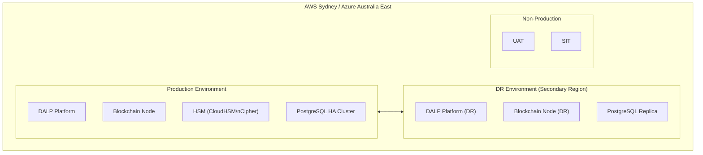
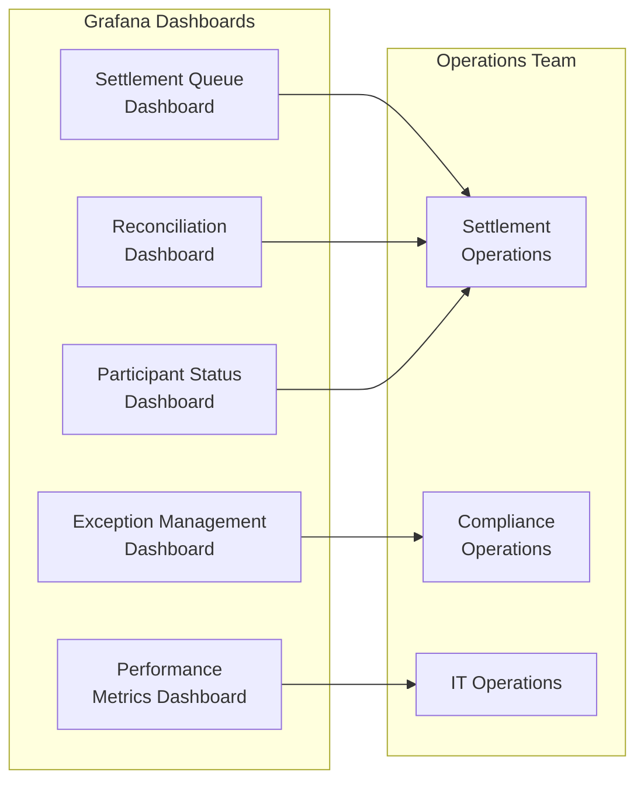
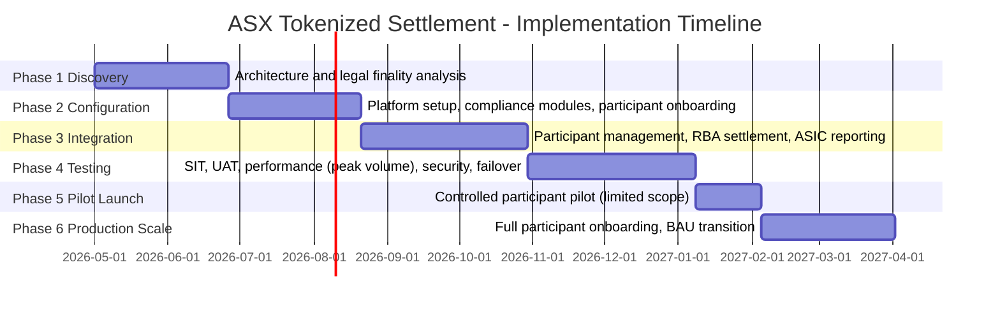

# Technical Proposal: Tokenized Settlement Platform

**Prepared for:** ASX (Australian Securities Exchange)
**Reference:** ASX-RFP-202603
**Date:** March 2026
**Version:** v1.0
**Classification:** Strictly Confidential. Invited Bidders Only
**Prepared by:** SettleMint NV

---

## Table of Contents

1. Executive Summary
2. Strategic Fit and Programme Context
3. Platform Architecture
4. Settlement Lifecycle and Token Engineering
5. Compliance and Regulatory Framework
6. Security Architecture
7. Integration Architecture
8. Deployment Architecture
9. Operational Model
10. Implementation Plan
11. Testing Strategy
12. Reference Clients
13. Support and SLA Framework
14. Appendix: Technical Requirement Response Matrix

---

## 1. Executive Summary

### 1.1 Context and Strategic Drivers

ASX's post-trade modernisation programme carries institutional weight beyond its technical scope. The CHESS replacement experience demonstrated that Australia's market infrastructure cannot afford a failed delivery. The regulator, the market, and ASX's participant community all need to see a controlled, evidence-led approach to introducing distributed ledger technology into settlement operations. The CHESS episode was not a verdict against DLT. It was a verdict against under-specified governance, under-tested integration, and over-ambitious scope.

ASX's tokenized settlement programme, as framed in this RFP, takes a more disciplined approach. The emphasis on production realism, control evidence, and phased delivery is exactly the right framework. SettleMint's proposal is designed to match that framework: a controlled platform with strong governance, explicit integration architecture, and a delivery model that treats every phase gate as a genuine checkpoint rather than a formality.

The regulatory context under ASIC, APRA's CPS 230 and CPS 234 standards, and the RBA's payment and settlement oversight is one of the most demanding in the world for market infrastructure. CPS 234 imposes specific requirements on information security capability that go beyond generic ISO 27001 compliance. CPS 230 imposes operational risk management requirements that affect how ASX must manage its dependency on technology providers. The DALP proposal addresses both directly.

### 1.2 Settlement Programme Complexity

Tokenized settlement at a national exchange infrastructure level differs materially from institutional bank deployments. The participant base is broader: broker-dealers, custodians, institutional investors, retail brokers, and potentially central counterparties. The transaction volumes are higher and more variable: settlement volumes can spike significantly on high-activity days. The regulatory scrutiny is more public: a failure in ASX's settlement system generates immediate market commentary and regulatory inquiry.

The technical complexity compounds these operational realities. Settlement finality must be legally certain, not just technically certain. The interaction between tokenized assets on-chain and the RBA's cash settlement mechanisms must be carefully designed. Participant onboarding must work within ASIC's existing client identification and AML/CTF framework. The observability and evidence generation must satisfy both ASX's internal governance requirements and ASIC's inspection access expectations.

### 1.3 Proposed Response

SettleMint proposes DALP as the technology layer for ASX's tokenized settlement programme, covering the asset management, compliance enforcement, settlement execution, and operational observability components. For ASX specifically:

- **Settlement model:** Atomic Delivery-versus-Payment (DvP) for tokenized security transfers, using DALP's XvP Settlement extension to ensure that security and cash legs settle atomically or both revert.
- **Compliance architecture:** Configurable modules enforcing ASIC eligibility requirements, participant jurisdiction restrictions, and AML/CTF Act compliance rules. Module changes require GOVERNANCE_ROLE approval with full audit trail.
- **Deployment model:** Private cloud within Australian data centres (AWS Sydney, Azure Australia East, or equivalent), meeting APRA data sovereignty and CPS 234 information security requirements.
- **Integration model:** Documented OpenAPI 3.1 interfaces connecting DALP to ASX's participant management system, RBA settlement infrastructure, ASIC reporting, and ASX's observability stack.
- **Operational model:** Full-stack observability (Grafana, VictoriaMetrics, Loki, Tempo) with pre-configured dashboards for settlement operations, exception management, and regulatory evidence generation.

### 1.4 CHESS Lessons Incorporated

SettleMint's delivery approach for ASX incorporates the lessons from CHESS: explicit phase gate criteria, integration testing before UAT, performance testing before go-live decisions, and a hypercare model that does not declare success until operational KPIs are sustained for a meaningful period. The programme governance structure includes an independent technical review gate at each phase transition, giving ASX's architecture review board the opportunity to validate delivery quality before proceeding.

---

## 2. Strategic Fit and Programme Context

### 2.1 Post-Trade Modernisation Framework



**Figure 1: ASX Programme Objectives Mapped to DALP Capabilities**

### 2.2 DLT Settlement Analysis Context

ASX's reference to DLT settlement analysis acknowledges the broader industry learning that has occurred across Project Atom, Project Genesis, and comparable central bank experiments globally. The common conclusion from those programmes is that DLT adds value in settlement when it provides atomic finality with cryptographic proof, reduces the reconciliation burden through a shared state model, and supports the programmable compliance rules that post-trade operations require. DLT does not add value when it replicates existing batch processes on a distributed database.

DALP is designed around the atomic settlement model. The XvP extension guarantees that security and cash legs settle simultaneously or both revert. This eliminates the reconciliation ambiguity of sequential settlement and provides the legally relevant finality that post-trade operations require.

---

## 3. Platform Architecture

### 3.1 Settlement Platform Architecture



**Figure 2: DALP Settlement Platform Architecture for ASX**

### 3.2 XvP Settlement Architecture

```mermaid
sequenceDiagram
    participant SELL as Selling Participant
    participant DALP2 as DALP Settlement Engine
    participant XVP4 as XvP Contract
    participant COMP4 as Compliance Modules
    participant BUY as Buying Participant
    participant RBA3 as RBA Cash Settlement

    SELL->>DALP2: Submit security leg (token transfer commitment)
    BUY->>DALP2: Submit cash leg (payment commitment)
    DALP2->>XVP4: Both legs received; initiate atomic evaluation
    XVP4->>COMP4: Evaluate compliance on both legs
    COMP4-->>XVP4: Both participants eligible; transfer rules passed
    XVP4->>XVP4: Atomic execution: security to buyer, cash to seller
    XVP4-->>DALP2: Settlement confirmed; both legs completed
    DALP2->>SELL: Settlement confirmation + evidence record
    DALP2->>BUY: Settlement confirmation + evidence record
    DALP2->>RBA3: Cash movement notification
    DALP2->>ASIC2: Settlement record for reporting
```

**Figure 3: Atomic DvP Settlement Sequence**

The XvP Settlement extension implements delivery-versus-payment as a single atomic blockchain transaction. The security transfer and cash transfer either both execute or both revert. There is no state in which one party has delivered but the other has not. This eliminates the principal risk inherent in sequential settlement and provides the legally certain finality that ASIC's settlement assurance requirements demand.

For ASX's programme, the cash leg is represented by a tokenized cash instrument or a payment obligation triggered by DALP and settled through RBA's settlement infrastructure. The specific cash leg architecture (tokenized AUD vs. payment message to RBA) is a design decision to be confirmed in Phase 1 discovery.

---

## 4. Settlement Lifecycle and Token Engineering

### 4.1 Settlement Token Design for Australian Securities



**Figure 4: ASX Settlement Token Lifecycle**

For Australian securities, DALP configures DALPAsset contracts as equity or bond instruments depending on the security type. The compliance modules enforce ASIC eligibility requirements:

- **Identity verification:** Every participant must hold a verified OnchainID with current AML/CTF Act compliance claims.
- **Country allow list:** Eligible jurisdictions for participant registration are configured per security class.
- **Investor count tracking:** Where ASIC requires investor count limits for certain security classes, the investor count compliance module enforces them automatically.
- **Transfer approval (institutional threshold):** Large block transfers above configurable thresholds route to a settlement officer review queue before execution.

### 4.2 Participant Onboarding for Broker-Dealers and Custodians

🟢 ASX's participant community includes broker-dealers, custodians, institutional investors, and retail brokers. DALP's identity registry accommodates all participant types through configurable claim profiles:

- **Broker-dealer participants:** Australian Financial Services Licence (AFSL) verification, AML/CTF customer identification, CHESS participant code, and settlement account mapping.
- **Custodial participants:** Custodian licence verification, beneficial owner segregation requirements, sub-custodian relationship mapping.
- **Institutional investors:** Institutional investor classification, jurisdiction eligibility, wholesale investor verification where applicable.

KYC/AML verification for participant onboarding integrates with ASX's existing participant management system. DALP's claim issuance API receives verified identity attributes from the participant management system and writes them to the participant's OnchainID contract.

---

## 5. Compliance and Regulatory Framework

### 5.1 Australian Regulatory Framework



**Figure 5: Australian Regulatory Framework Mapped to DALP Controls**

**ASIC market integrity requirements:** DALP enforces ASIC participant eligibility rules through the compliance module system. Transfer restrictions, participant suspension, and settlement failure handling are all configurable through platform administration rather than requiring engineering intervention.

**APRA CPS 234 (Information Security):** CPS 234 requires that ASX as a regulated entity maintain information security capability commensurate with the size and nature of threats. DALP's security architecture, including FIPS 140-2 HSM integration, multi-layer access control, and ISO 27001-aligned security practices, meets CPS 234 capability requirements. SettleMint's SOC 2 Type II certification provides independent attestation.

**APRA CPS 230 (Operational Risk Management):** CPS 230 requires that regulated entities manage material service provider dependencies and operational risk. SettleMint is a material technology service provider to ASX under this proposal. The commercial agreement includes the service provider management requirements CPS 230 specifies: SLA commitments, audit rights, notification requirements, and exit provisions.

**AML/CTF Act:** DALP integrates with ASX's AUSTRAC reporting processes through the observability and reporting stack. Settlement activity that triggers AML/CTF reporting obligations is flagged through the compliance event system for routing to ASX's AUSTRAC reporting function.

### 5.2 Settlement Finality and Legal Certainty

🟡 DALP provides technical settlement finality through the XvP atomic execution model. Legal settlement finality under Australian law depends on the legal characterisation of the tokenized securities and the legal effect of the on-chain transfer. ASX's legal team should confirm the settlement finality analysis before production launch. SettleMint will provide technical documentation to support that legal review.

The SMART Protocol's ERC-3643 foundation is designed to support legally compliant transfer structures, including the ability to implement finality conditions that align with ASIC's settlement rules. Specific legal finality design is a Phase 1 discovery deliverable.

---

## 6. Security Architecture

### 6.1 CPS 234 Compliant Security Architecture



**Figure 6: Security Architecture with CPS 234 Alignment**

### 6.2 Key Management for Settlement Operations

Key management for settlement operations requires different security parameters than custody operations. Settlement keys sign high-frequency, relatively lower-value transactions. The signing policy balance shifts toward operational efficiency while maintaining mandatory audit trails:

- **Settlement signing keys:** Per-participant keys delegated through the platform's role assignment. Single-party authorization for standard settlement. Maker-checker required for administrator settlement operations.
- **Rotation schedule:** 90-day automated rotation, consistent with APRA guidance on cryptographic key lifecycle.
- **HSM policy:** Key Guardian enforces HSM policies that restrict which operation types each key can sign. Settlement keys cannot sign platform administration operations.

---

## 7. Integration Architecture

### 7.1 ASX Integration Landscape



**Figure 7: ASX Integration Architecture**

### 7.2 RBA Settlement Integration

🟡 Integration with RBA's interbank settlement infrastructure depends on the settlement architecture decision for the cash leg. Where cash settlement is represented by a payment obligation triggered by DALP and settled through RBA's existing payment rails (rather than a tokenized cash instrument), the integration is a batch message interface that instructs RBA settlement after on-chain settlement confirmation.

DALP generates the settlement instruction upon XvP confirmation and delivers it to ASX's RBA interface via the batch integration. RBA's confirmation of cash settlement is received by DALP and recorded as the final settlement evidence record.

**Boundary:** DALP does not connect directly to RBA's settlement infrastructure. The integration runs through ASX's existing RBA connectivity, with DALP providing the settlement instruction and receiving the confirmation.

### 7.3 ASIC and AUSTRAC Reporting Integration

Settlement records generated by DALP's Chain Indexer provide the source data for ASIC trade reporting and AUSTRAC transaction monitoring obligations. DALP exports settlement event data in structured formats via scheduled API pulls or event stream delivery. ASX's reporting infrastructure formats and submits the data to ASIC and AUSTRAC in the required formats.

---

## 8. Deployment Architecture

### 8.1 Australian Private Cloud Deployment



**Figure 8: ASX Cloud Deployment Architecture**

SettleMint recommends private cloud within Australian data centres (AWS Sydney or Azure Australia East) for ASX's deployment. This model:

- Satisfies APRA's data sovereignty expectations for Australian financial market infrastructure
- Provides the operational control required under CPS 230 for material service provider management
- Enables CPS 234 compliant information security with Australian-domiciled infrastructure
- Supports RTO of less than 2 hours and RPO of less than 4 hours through active-active or active-passive configuration

ASX can choose managed cloud HSM (AWS CloudHSM or Azure Dedicated HSM) or a physical HSM at a colocation facility, depending on security preference. Both meet FIPS 140-2 Level 3 requirements.

---

## 9. Operational Model

### 9.1 Settlement Operations Dashboard



**Figure 9: Settlement Operations Dashboard Suite**

### 9.2 Settlement Day Operations

| Time | Activity | Owner |
|------|----------|-------|
| Pre-market | System health check, participant connectivity verification | IT Operations |
| Market open | Settlement queue activation, compliance module validation | Settlement Operations |
| Intraday | Exception monitoring, settlement confirmation, break identification | Settlement Operations |
| End of day | Final settlement reconciliation, position confirmation, RBA confirmation | Finance / Settlement Operations |
| Post-market | Overnight report generation, exception escalation, next-day preparation | Settlement Operations |

---

## 10. Implementation Plan

### 10.1 Phase-Gated Delivery



**Figure 10: ASX Implementation Timeline**

ASX's settlement programme warrants an extended timeline relative to institutional bank deployments, given the broader participant base, higher complexity of integration with existing CHESS-era systems, and the regulatory significance of a production deployment. The programme includes a controlled pilot phase (limited participants, limited security types) before full production scale.

| Phase | Duration | Gate Criteria |
|-------|----------|--------------|
| 1. Discovery | 8 weeks | Legal finality analysis complete; architecture signed off by ASIC team |
| 2. Configuration | 8 weeks | Settlement operations demonstrable in SIT with test participants |
| 3. Integration | 10 weeks | RBA settlement integration validated; ASIC reporting verified |
| 4. Testing | 10 weeks | UAT signed off; peak volume performance validated; CPS 234 security review complete |
| 5. Pilot Launch | 4 weeks | Controlled pilot with 5-10 participants and limited security types; monitoring intensive |
| 6. Production Scale | 8 weeks | Phased participant onboarding; KPI targets met for 20 consecutive days |

Total: approximately 48 weeks from mobilisation to full production scale.

---

## 11. Testing Strategy

### 11.1 ASX-Specific Test Coverage

Beyond standard test types, ASX's programme requires:

- **Peak volume performance testing:** Settlement volumes on ASX's busiest trading days can be 3-5x normal volume. Performance testing must validate DALP's throughput and settlement latency under these conditions.
- **Atomic settlement integrity:** Test that XvP settlement atomicity holds under network latency, partial failures, and concurrent settlement requests. Validate that no partial settlement states can persist.
- **Participant suspension and reinstatement:** Suspend a test participant and validate that all pending settlement instructions involving that participant are correctly handled (completed if irrevocable, rejected if reversible).
- **RBA connectivity failure:** Validate platform behaviour when the RBA settlement interface is unavailable. Settlement queue should suspend safely; operations team should be alerted; queue should drain correctly when connectivity is restored.
- **CHESS migration scenarios:** Where ASX is migrating positions from CHESS-era records, test data migration integrity, dual-run reconciliation, and cutover procedures.

---

## 12. Reference Clients

| Client | Region | Use Case | Regulatory Context | Status |
|--------|--------|----------|-------------------|--------|
| Clearstream | Germany | Tokenized collateral management and settlement | BaFin, ECB | Production |
| Deutsche Boerse | Germany | Regulated digital asset trading and settlement | BaFin, MiFID II | Production |
| Euroclear | Belgium | Digital securities settlement infrastructure | NBB, FSMA, ECB | Production |
| Eurex | Germany | Tokenized derivatives clearing | BaFin, EMIR | Production |
| Bank of England | UK | Wholesale CBDC pilot infrastructure | Bank of England, FCA | Pilot production |
| SAMA | Saudi Arabia | Digital Riyal pilot infrastructure | SAMA | Pilot production |

ASX's programme is most closely analogous to Clearstream and Deutsche Boerse: market infrastructure entities deploying DALP for regulated settlement operations under national financial regulatory frameworks. The governance, integration, and testing approaches from those deployments apply directly.

---

## 13. Support and SLA Framework

### 13.1 Market Infrastructure Support Requirements

ASX's settlement infrastructure operates within defined market hours but requires 24/7 monitoring for system health, security events, and DR readiness. SettleMint recommends Enterprise Support Tier with:

- 24/7 monitoring and P1 incident response
- Pre-arranged escalation path that includes SettleMint's engineering leadership for incidents during settlement operations
- Scheduled maintenance exclusively within defined market holiday windows
- Quarterly operational reviews with ASX's technology leadership

| SLA | Commitment |
|-----|-----------|
| P1 response | 15 minutes |
| P2 response | 1 hour |
| Monthly uptime | 99.95% (market infrastructure grade) |
| Planned maintenance | Market holiday windows only |

---

## 14. Technical Requirement Response Matrix

| Req ID | Requirement | Status | Notes |
|--------|-------------|--------|-------|
| TR-01 | End-to-end settlement lifecycle | 🟢 Supported | Full DvP settlement lifecycle |
| TR-02 | Maker-checker governance | 🟢 Supported | Configurable per operation type |
| TR-03 | Documented APIs | 🟢 Supported | OpenAPI 3.1 |
| TR-04 | ASIC/APRA/RBA alignment | 🟡 Supported with Configuration | CPS 230/234 compliance requires specific deployment configuration |
| TR-05 | Identity and onboarding controls | 🟡 Supported with Third-Party Dependency | KYC via ASX participant management integration |
| TR-06 | HSM key management | 🟢 Supported | Key Guardian + CloudHSM/FIPS HSM |
| TR-07 | Deterministic reconciliation | 🟢 Supported | Chain Indexer-backed reconciliation |
| TR-08 | Operational dashboards | 🟢 Supported | Settlement operations dashboard suite |
| TR-09 | Deployment flexibility | 🟢 Supported | Australian private cloud (AWS/Azure) |
| TR-10 | Reference experience | 🟢 Supported | Clearstream, Deutsche Boerse, Euroclear, Eurex |
| TR-11 | Programmable settlement controls | 🟢 Supported | Compliance module system + XvP settlement |
| TR-12 | Testing strategy | 🟢 Supported | Including peak volume and atomic integrity tests |
| TR-13 | Integration approach | 🟡 Supported with Third-Party Dependency | RBA settlement via ASX existing RBA connectivity |
| TR-14 | Data model extensibility | 🟢 Supported | Multi-asset, multi-participant |
| TR-15 | Records retention | 🟢 Supported | Append-only audit log |
| TR-16 | Third-party risk transparency | 🟢 Supported | All dependencies disclosed |
| TR-17 | Business continuity | 🟢 Supported | RPO <4h, RTO <2h; 99.95% uptime |
| TR-18 | Commercial scaling | 🟢 Supported | Platform-based pricing |
| TR-19 | Release management | 🟢 Supported | Versioned Helm; market holiday maintenance windows |
| TR-20 | Roadmap governance | 🟡 Roadmap separated | Live vs. roadmap clearly distinguished |
