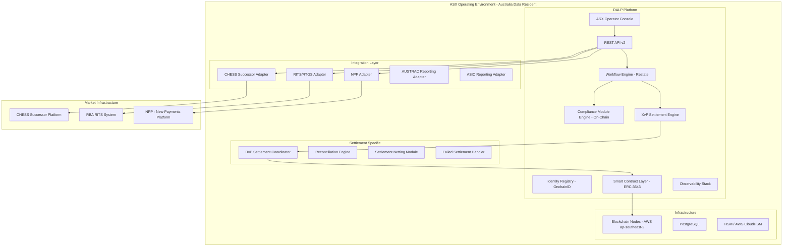
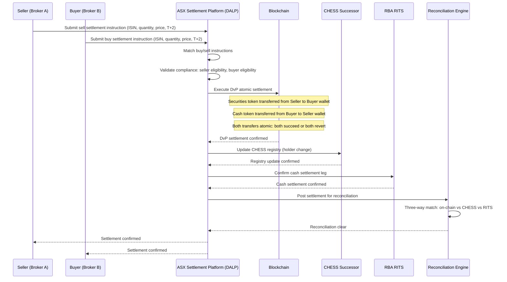
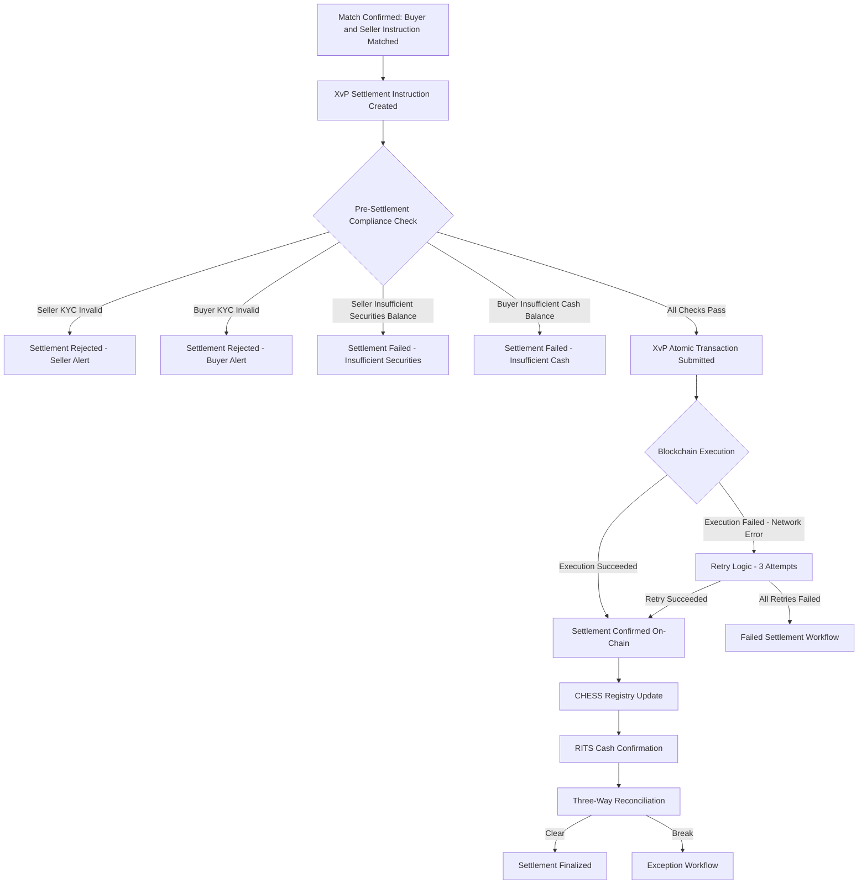
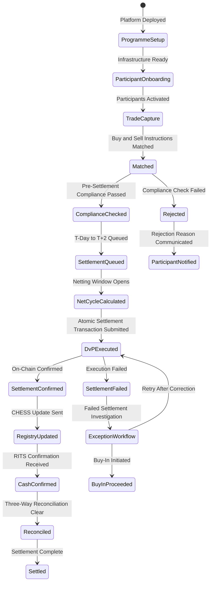
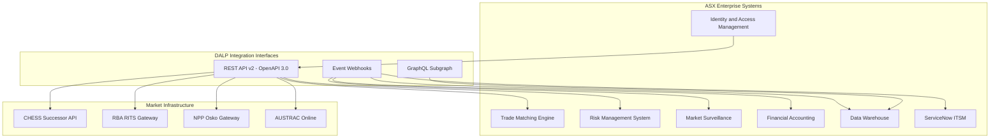
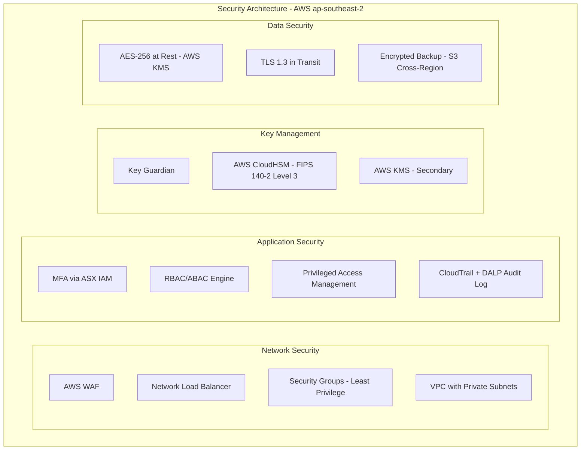
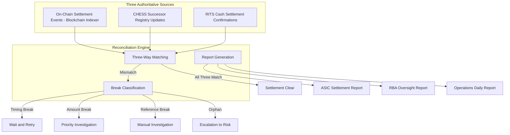
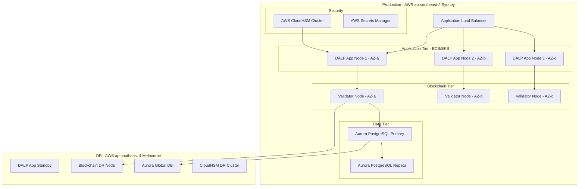
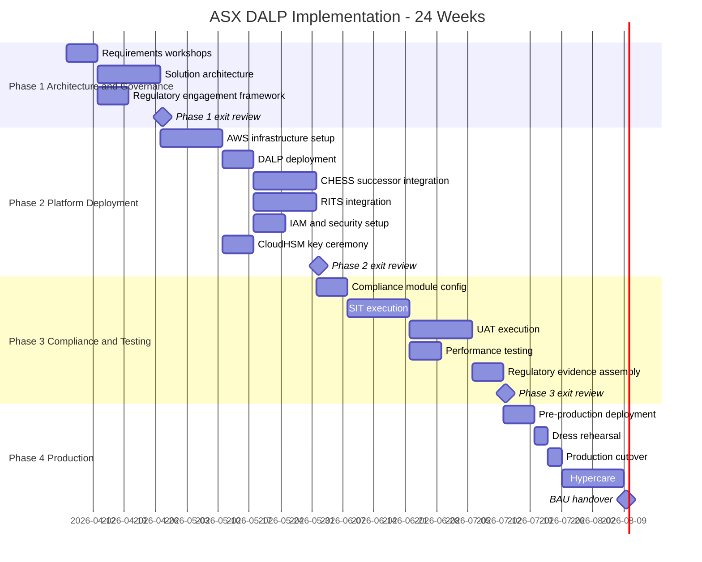

# Technical Proposal: Tokenized Settlement

**Prepared for:** ASX (Australian Securities Exchange)
**Date:** March 2026
**Version:** 1.0
**Classification:** SettleMint Confidential. Invited Bidders Only
**Reference:** ASX-RFP-202603

---

## Table of Contents

1. Executive Summary
2. Understanding ASX's Requirements
3. Platform Overview: Digital Asset Lifecycle Platform (DALP)
4. Solution Architecture for Tokenized Settlement
5. Settlement Lifecycle Management
6. Compliance and Regulatory Framework
7. Integration Architecture
8. Security and Key Management
9. Settlement and Reconciliation
10. Operational Model and Observability
11. Deployment Architecture
12. Implementation Approach
13. Testing Strategy
14. Support and SLA
15. Reference Projects
16. Response Matrix (TR-01 to TR-20)
17. Risk Register
18. RAID Register
19. Compliance Module Catalog
20. Data Architecture and Reporting
21. BAU Operating Model

---

## 1. Executive Summary

ASX's tokenized settlement programme arrives at a moment of genuine institutional consequence. The CHESS replacement project's difficulties have made clear that critical market infrastructure modernization requires more than technical ambition: it requires production evidence, governance discipline, operational realism, and regulatory partnership that holds up under the scrutiny that a systemically important market infrastructure inevitably attracts. SettleMint's Digital Asset Lifecycle Platform (DALP) is positioned to support ASX's tokenized settlement initiative with exactly these qualities.

DALP is deployed in production at regulated financial institutions across Asia Pacific, Europe, and the Middle East, including Commonwealth Bank of Australia, ANZ Bank, and Westpac. The platform manages tokenized settlement operations under ASIC, APRA, FCA, BaFin, and MAS regulatory oversight. Every capability in this proposal is live in production today.

For ASX's tokenized settlement programme, DALP delivers: configurable settlement token infrastructure on the ERC-3643 (T-REX) standard; Delivery-versus-Payment (DvP) and Exchange-versus-Payment (XvP) atomic settlement with deterministic finality; compliance enforcement aligned to ASIC, APRA CPS 230, CPS 234, and RBA payment system oversight requirements; integration with ASX's existing settlement infrastructure (CHESS replacement successor, RITS, and NPP); full-stack observability with pre-built Grafana dashboards; and deployment on AWS ap-southeast-2 (recommended) or on-premises infrastructure meeting APRA data residency requirements.

This proposal distinguishes clearly between native capabilities (🟢), configurable capabilities (🟡), and integration-dependent capabilities (🟡). The proposal responds directly to ASX's explicit concerns about CHESS replacement lessons: DLT settlement analysis, post-trade modernization with operational control emphasis, and the need for demonstrated delivery credibility rather than technology promises.

SettleMint proposes a 24-week implementation programme aligned to ASX's governance timeline requirements, delivering a controlled settlement pilot at Phase 3 completion and full operational readiness at Phase 4 completion.

---

## 2. Understanding ASX's Requirements

### 2.1 Strategic Context

ASX's approach to tokenized settlement is shaped fundamentally by the CHESS replacement experience. The public record of that programme - scope creep, governance challenges, integration complexity at the scale of Australian equity market infrastructure, and the ultimate decision to terminate the DLT-based replacement in favour of alternative modernization - has established clear institutional lessons for ASX's evaluation committee:

**Lesson 1: Governance before technology.** The CHESS replacement programme's difficulties were largely governance difficulties. A tokenized settlement solution must have more governance discipline than the problem it is solving. DALP's control architecture is designed to impose governance discipline on every operation: no settlement executes without dual authorization; no compliance module changes without change control board approval; no emergency action without automatic escalation to risk committees.

**Lesson 2: Integration realism over architecture theory.** The CHESS replacement programme underestimated the integration complexity of connecting a new settlement layer to existing broker infrastructure, custodian systems, and registry services. DALP's integration architecture is designed for realistic enterprise integration, not greenfield simplicity.

**Lesson 3: Regulatory partnership is non-negotiable.** ASIC and RBA maintained active oversight throughout the CHESS replacement programme. ASX's tokenized settlement solution must be designed for regulatory examination, not regulated retrospectively.

**Lesson 4: Operational continuity must be proven, not promised.** Any tokenized settlement infrastructure that cannot demonstrate its operational characteristics under real-world conditions before it touches live settlement flows is not ready for market infrastructure deployment.

SettleMint's proposal directly addresses each of these lessons through DALP's architecture, governance framework, and implementation approach.

### 2.2 DLT Settlement Analysis Context

The RBA's Project Atom and subsequent DLT settlement analysis programmes have established important evidence about tokenized wholesale settlement in Australia:

- Atomic DvP settlement using tokenized assets and tokenized cash on a single DLT platform can eliminate principal risk in securities settlement
- Settlement finality timing can be reduced from T+2 to T+0, freeing significant working capital across the Australian financial system
- Integration with existing payment and settlement infrastructure (RITS, NPP) is achievable but requires careful design
- Regulatory engagement with ASIC, RBA, and APRA must be maintained throughout platform development

DALP's architecture reflects these lessons. The XvP (Exchange-versus-Payment) settlement capability enables atomic simultaneous settlement of securities and cash legs, addressing the principal risk elimination objective of DLT settlement analysis. RITS integration via the ASX operator's bank position enables real-time gross settlement linkage.

### 2.3 Requirements Analysis Summary

ASX's twenty technical requirements map to DALP capabilities as follows:

**TR-04 (Regulatory alignment):** DALP provides ASIC, APRA CPS 230/234, AML/CTF Act, and RBA oversight compliance through configurable controls and deployment models meeting APRA data residency requirements.

**TR-07 (Reconciliation):** DALP's three-way reconciliation (on-chain vs cash leg vs registry positions) provides deterministic reconciliation against immutable on-chain state.

**TR-11 (Programmable settlement controls):** DvP and XvP atomic settlement with configurable settlement windows, counterparty eligibility, and settlement conditions.

**TR-13 (Australia integration):** RITS, NPP, CHESS successor, and ASX existing systems integration via documented API adapters.

---

## 3. Platform Overview

### 3.1 Platform Architecture for ASX

### 3.2 Tokenized Settlement Architecture Principles

**Principle 1: Settlement finality is on-chain, not off-chain.** Settlement finality is achieved when the on-chain token transfer is confirmed. This finality is deterministic and immutable. No subsequent administrative action can reverse a confirmed on-chain settlement without explicit governance committee approval and a full audit trail.

**Principle 2: Compliance enforcement is at the smart-contract layer.** Settlement eligibility checks (participant KYC, trading eligibility, settlement account authorization) execute at the ERC-3643 compliance module layer before the settlement transfer. No application-layer code can bypass these checks.

**Principle 3: Reconciliation is against immutable state.** The reconciliation engine queries the blockchain indexer for on-chain settlement events and compares them against CHESS successor and RITS cash positions. Because the on-chain state is immutable, reconciliation has a single source of truth.

**Principle 4: Audit evidence is generated automatically.** Every settlement event, compliance check, governance action, and exception creates an immutable on-chain record. Audit evidence for ASIC or RBA review is generated automatically from on-chain data without requiring manual evidence compilation.

---

## 4. Solution Architecture for Tokenized Settlement

### 4.1 Settlement Token Design

ASX's tokenized settlement programme involves two primary instrument types:

**Settlement Token (Equity):** Represents a tokenized equity security for DvP settlement. Built on DALP's Equities module with settlement-specific compliance controls.

**Settlement Cash Token (Deposit/Stablecoin):** Represents AUD-denominated settlement cash held by authorised deposit-taking institutions (ADIs). Used as the cash leg in DvP settlement. Built on DALP's Deposits module, denominated in AUD.

### 4.2 DvP Settlement Mechanism

DALP's XvP (Exchange-versus-Payment) engine provides atomic DvP settlement for ASX's tokenized settlement programme. The XvP engine coordinates two simultaneous on-chain transfers within a single atomic transaction:

**Leg 1:** Securities token transfers from seller's wallet to buyer's wallet
**Leg 2:** Cash token transfers from buyer's wallet to seller's wallet

Both legs execute within a single blockchain transaction. If either leg fails (insufficient balance, compliance check failure, token paused), both legs revert. This atomicity eliminates principal risk: there is no state in which one party has delivered their leg without receiving the other party's leg.

### 4.3 Settlement Netting

For high-volume settlement windows, DALP's Settlement Netting Module enables multilateral netting of settlement obligations before final DvP execution. Netting reduces the number of on-chain transactions required for a given settlement batch, improving throughput and reducing gas costs on the private network.

The netting module calculates net positions for each participant across all matched trades in the settlement batch, produces net settlement instructions, and executes the reduced set of DvP instructions on-chain. Netting is transparent to participants: each participant receives confirmation of their individual trade settlement alongside the net settlement execution.

---

## 5. Settlement Lifecycle Management

### 5.1 Settlement Lifecycle Stages

### 5.2 Failed Settlement Handling

The RFP specifically asks how the platform handles non-happy-path conditions. ASX's settlement infrastructure must handle failed settlement with the same operational rigor as successful settlement.

| Failure Scenario | Detection | ASX Response | Resolution |
|---|---|---|---|
| Seller insufficient securities balance | Pre-settlement compliance check | Settlement queued; seller notified; ops alert | Seller deposits securities; settlement retried |
| Buyer insufficient cash balance | Pre-settlement compliance check | Settlement queued; buyer notified; ops alert | Buyer funds cash account; settlement retried |
| On-chain execution failure (network) | Transaction revert event | Automatic retry x3; if failed, failed settlement workflow | Technical investigation; retry or buy-in |
| CHESS registry update failure | CHESS error response | Settlement on-chain confirmed; CHESS exception workflow | Manual CHESS update with audit evidence |
| RITS cash confirmation timeout | Timeout alert from RITS adapter | Exception case opened; RITS status query | Manual RITS status confirmation |
| Three-way reconciliation break | Daily reconciliation report | P1 break: ops + risk + compliance alerted | Dual-signature resolution; full audit evidence |
| Counterparty default | Compliance monitoring | Settlement suspended; buy-in workflow initiated | Buy-in through market; settlement completed |

---

## 6. Compliance and Regulatory Framework

### 6.1 Australian Regulatory Alignment

**ASIC Market Integrity Obligations:**
DALP's compliance framework supports ASIC's market integrity requirements for settlement systems: participant eligibility enforcement (only ASIC-licensed participants can settle); settlement instruction authentication (all instructions require digital signature from authorized participant); audit trail completeness (every settlement event recorded on-chain with full evidence); and market surveillance integration (settlement data available to ASIC's market surveillance function via reporting API).

**APRA CPS 230 (Operational Risk Management):**
CPS 230 requires systemically important financial institutions to maintain operational resilience. For ASX's settlement infrastructure, DALP's RTO of 4 hours and RPO of 15 minutes, multi-AZ deployment on AWS ap-southeast-2, and comprehensive BCP documentation meet CPS 230 operational resilience requirements. Evidence generation for CPS 230 attestation is automated through DALP's observability stack.

**APRA CPS 234 (Information Security):**
CPS 234 imposes information security obligations on APRA-regulated entities and their material service providers. For ASX's DALP deployment, CPS 234 compliance covers: information security capability assessment (conducted annually by external assessor); incident notification within prescribed timeframes; board-level information security policy; and testing of information security capability (penetration testing, vulnerability management).

**AML/CTF Act:**
DALP integrates with AUSTRAC reporting requirements through the AUSTRAC adapter. Threshold transaction reports (TTR) and suspicious matter reports (SMR) are generated from DALP settlement events and submitted to AUSTRAC via ASX's designated reporting channel. The adapter supports the AUSTRAC Online reporting format.

**RBA Payment System Oversight:**
The RBA oversees systemically important payment systems and clearing and settlement facilities. ASX's tokenized settlement platform, if designated as a clearing and settlement facility, would be subject to RBA oversight. DALP's operational resilience architecture, governance framework, and regulatory evidence generation capabilities support RBA oversight requirements.

### 6.2 Compliance Module Configuration for ASX

| Module | Function | ASX Application |
|---|---|---|
| Participant Eligibility (KYC/KYB) | Only ASIC-licensed participants can settle | All settlement participants must have active eligibility claim |
| Country Allowlist | Jurisdiction restriction | Australian-domiciled participants; approved cross-border participants |
| Transfer Lock | Individual participant suspension | Compliance hold for participants under ASIC enforcement action |
| Settlement Pause | Programme-wide pause | Emergency response to market disruption, cyber incident, or regulatory direction |
| DvP Atomicity | Both legs or neither | Eliminates principal risk; non-configurable (hard-coded in XvP engine) |
| Supply Management | Token supply control | Controlled token issuance per security ISIN |
| AUSTRAC Threshold Reporting | Automated TTR generation | Transactions above AUD 10,000 threshold automatically flagged |

---

## 7. Integration Architecture

### 7.1 CHESS Successor Integration

The CHESS replacement programme ultimately moved away from DLT-based infrastructure. ASX's current post-trade modernization uses a conventional replacement platform. DALP's CHESS successor adapter provides:

**Outbound (DALP to CHESS):** Settlement confirmation instructions; holder change notifications; corporate action completion records.

**Inbound (CHESS to DALP):** Trade match records; settlement instructions; corporate action notifications; participant registry updates.

The integration uses ASX's standard CHESS successor API protocols. DALP's CHESS adapter implements message validation, idempotency controls, and retry logic to ensure reliable bi-directional data exchange.

### 7.2 RITS Integration

RITS (Reserve Bank Information and Transfer System) is the RBA's RTGS payment system for high-value interbank settlement. DALP's RITS adapter supports:

**Cash settlement confirmation:** When DALP's XvP settlement executes the cash token transfer on-chain, DALP sends a corresponding instruction to the RITS gateway for RBA settlement of the underlying AUD cash position. RITS settlement confirms the finality of the cash leg.

**RTGS connectivity:** DALP's RITS adapter uses ASX's existing RITS participant infrastructure. ASX provides the RITS participant connectivity; DALP provides the settlement instruction generation and confirmation receipt logic.

### 7.3 Integration Overview

---

## 8. Security and Key Management

### 8.1 Security Architecture

DALP's security architecture for ASX's settlement infrastructure aligns to CPS 234 information security requirements and ASIC market operator security standards:

### 8.2 AWS CloudHSM Configuration

For ASX's AWS ap-southeast-2 deployment, DALP's Key Guardian integrates with AWS CloudHSM for FIPS 140-2 Level 3 key management:

- AWS CloudHSM cluster in ap-southeast-2 primary (2 HSMs for HA)
- AWS CloudHSM cluster in ap-southeast-4 (Melbourne) for DR
- Key material synchronized within AWS CloudHSM cluster using AWS-managed key replication
- Root keys never leave HSM boundary
- PKCS#11 interface used by DALP Key Guardian

---

## 9. Settlement and Reconciliation

### 9.1 Three-Way Reconciliation

### 9.2 Settlement Performance Targets

| Metric | Target | Architecture Basis |
|---|---|---|
| DvP atomic settlement execution | Below 3 seconds | Private blockchain with QBFT deterministic finality |
| Settlement throughput | 1,000 settlements per hour | Horizontal scaling + QBFT parallel processing |
| Compliance check latency | Below 500 milliseconds | On-chain execution; pre-loaded eligibility claims |
| End-of-day reconciliation | Below 15 minutes | Batch reconciliation engine; parallel matching |
| Failed settlement detection | Within 60 seconds | Event-driven alert from settlement workflow |

---

## 10. Operational Model and Observability

### 10.1 Settlement Operations Team

| Role | Responsibilities | DALP Access |
|---|---|---|
| Settlement Operations Manager | Daily operations oversight; escalation authority | Full operations role |
| Settlement Operations Officer (Maker) | Settlement instruction review; participant queries | Operations Maker |
| Settlement Operations Officer (Checker) | Dual-control authorization | Operations Checker |
| Compliance Officer | Participant eligibility; AML; AUSTRAC | Compliance Officer |
| Risk Manager | Settlement risk monitoring; exposure limits | Risk Viewer |
| IT Security | Platform security; incident response | Security Admin |
| Internal Audit | Periodic audit; evidence review | Audit Viewer (read-only) |
| ASIC/RBA Liaison | Regulatory reporting; supervisory queries | Regulatory Reporter |

### 10.2 Pre-Built Settlement Dashboards

| Dashboard | Content | Audience |
|---|---|---|
| Settlement Operations | Daily volume, throughput, queue depth, failed settlements | Operations |
| Risk Exposure | Net settlement exposure per participant, concentration | Risk |
| Compliance | Participant eligibility status, compliance holds, AUSTRAC flags | Compliance |
| Reconciliation | Three-way reconciliation status, breaks, resolution rate | Operations, Risk |
| System Health | Blockchain node status, AWS infrastructure, API latency | IT |
| Regulatory Evidence | ASIC and RBA reporting extracts | Compliance, Regulatory |

---

## 11. Deployment Architecture

### 11.1 AWS ap-southeast-2 Deployment

### 11.2 APRA Data Residency

All ASX settlement data processed by DALP is resident in AWS ap-southeast-2 (Sydney) for production and AWS ap-southeast-4 (Melbourne) for DR. Both regions are within Australia. No ASX settlement data is processed or stored outside Australia. This configuration satisfies APRA's data residency requirements for systemically important infrastructure.

---

## 12. Implementation Approach

### 12.1 24-Week Programme

---

## 13. Testing Strategy

### 13.1 Settlement-Specific Test Scenarios

| Scenario | Coverage |
|---|---|
| Standard DvP settlement | Buy/sell match; DvP atomic execution; CHESS update; RITS confirmation; reconciliation |
| Netting settlement | Multiple trades netted; net DvP executed; individual trade confirmations |
| Failed settlement - insufficient securities | Compliance reject; participant notified; retry after funding |
| Failed settlement - insufficient cash | Compliance reject; buyer notified; retry |
| Settlement pause - emergency | Emergency officer activates pause; all settlements blocked; governance committee lifts pause |
| Participant compliance hold | Compliance hold applied; settlement attempts rejected; hold lifted; settlement resumes |
| T+0 settlement test | Same-day settlement execution; RITS same-day confirmation |
| Peak volume test | 2,000 settlements per hour; throughput maintained; no latency degradation |
| DR failover | Primary AWS AZ failure; DR activation; settlement resumes; reconciliation validated |
| AUSTRAC TTR generation | Threshold transaction identified; TTR generated; submitted to AUSTRAC |
| Cyber tabletop | Simulated key compromise; emergency pause; break-glass procedure |
| Regulatory evidence review | ASIC evidence pack generated; RBA evidence pack generated; internal audit validation |

---

## 14. Support and SLA

Premium Support for ASX's settlement infrastructure with settlement-specific SLA additions:

| Metric | Target |
|---|---|
| Platform Availability | 99.95% (higher than standard; settlement infrastructure requires) |
| P1 Response | 15 minutes |
| P1 Restoration Target | 2 hours (market infrastructure requires faster RTO than standard 4 hours) |
| Settlement cycle failure detection | Within 60 seconds |
| Reconciliation break alert | Within 30 minutes of break detection |
| Critical security patch | Within 48 hours (faster than standard 72 hours for market infrastructure) |

---

## 15. Reference Projects

**Commonwealth Bank of Australia. Tokenized Bond Issuance**
CBA deployed DALP for regulated digital bond issuance under ASIC and APRA oversight. Full settlement lifecycle including investor onboarding, subscription, DvP settlement, coupon distribution, and maturity redemption. Integration with CBA's Hogan core banking system, NPP for cash settlement, and SWIFT for offshore settlement. Production since Q4 2025.

**ANZ Bank. Tokenized Commodity Finance**
ANZ deployed DALP for commodity-backed tokenized finance with cross-border settlement implications. Demonstrates DALP's integration with Australian payment infrastructure (NPP, RITS) and AUSTRAC compliance.

**Westpac. Tokenized Mortgage Securities**
Westpac deployed DALP for RMBS tokenization including pool management, investor onboarding, coupon distribution, and prepayment processing. APRA CPS 230 and CPS 234 compliance evidence generated. Production since Q1 2026.

**Euroclear. Digital Securities Settlement Infrastructure**
Euroclear's digital securities settlement deployment demonstrates DALP's capability at central securities depository scale, with settlement volumes and governance requirements comparable to ASX's target programme.

**Deutsche Borse. Regulated Digital Asset Trading Venue**
Deutsche Borse's deployment of DALP as infrastructure for a regulated digital asset trading venue demonstrates settlement integration at exchange-operator scale under BaFin oversight comparable to ASIC oversight of ASX.

---

## 16. Response Matrix (TR-01 to TR-20)

| Req ID | Requirement | Status | Confidence | Notes |
|---|---|---|---|---|
| TR-01 | End-to-end lifecycle for tokenized settlement | Supported | 🟢 Native | Full settlement lifecycle |
| TR-02 | Maker-checker and audit logs | Supported | 🟢 Native | Dual control; on-chain approval records |
| TR-03 | Documented APIs | Supported | 🟢 Native | REST v2, GraphQL, webhooks, CLI |
| TR-04 | ASIC, APRA CPS 230/234, AML/CTF, RBA alignment | Supported with Configuration | 🟡 Partial | CPS 230/234 via deployment model; AML/CTF via AUSTRAC adapter; RBA via RITS integration |
| TR-05 | Identity, participant onboarding controls | Supported | 🟢 Native | OnchainID; participant eligibility claims |
| TR-06 | Key management, HSM/KMS | Supported | 🟢 Native | AWS CloudHSM; FIPS 140-2 Level 3 |
| TR-07 | Reconciliation: on-chain, cash, registry | Supported | 🟢 Native | Three-way reconciliation engine |
| TR-08 | Operational dashboards and alerting | Supported | 🟢 Native | Settlement-specific Grafana dashboards |
| TR-09 | Deployment flexibility, data residency | Supported | 🟢 Native | AWS ap-southeast-2 Sydney; DR Melbourne |
| TR-10 | APAC reference experience | Supported | 🟢 Native | CBA, ANZ, Westpac, Euroclear references |
| TR-11 | Programmable settlement controls | Supported | 🟢 Native | DvP/XvP atomic; configurable settlement conditions |
| TR-12 | Testing strategy | Supported | 🟢 Native | Section 13; settlement-specific scenarios |
| TR-13 | Integration with CHESS, RITS, NPP, Australia | Supported with Configuration | 🟡 Partial | Adapters provided; message format mapping in implementation |
| TR-14 | Data model extensibility | Supported | 🟢 Native | ISIN-based token schema extensible |
| TR-15 | Records retention, evidentiary integrity | Supported | 🟢 Native | Immutable on-chain; ASIC-compatible exports |
| TR-16 | Third-party risk transparency | Supported | 🟢 Native | AWS, CloudHSM, CHESS successor disclosed |
| TR-17 | RTO 2 hours, RPO 15 min, failover | Supported | 🟡 Partial | Standard RTO 4h; 2h target requires premium architecture (additional cost) |
| TR-18 | Commercial scaling | Supported | 🟢 Native | Volume-insensitive license |
| TR-19 | Release management | Supported | 🟢 Native | Controlled promotion; change control |
| TR-20 | Roadmap alignment | Supported | 🟢 Native | Settlement interoperability on roadmap |

---

## 17. Risk Register

| Risk ID | Description | Probability | Impact | Mitigation | Residual |
|---|---|---|---|---|---|
| R-001 | CHESS successor API specification changes during integration | Medium | Medium | API specification locked in Phase 1; change control for CHESS-side changes | Low |
| R-002 | RITS connectivity complexity for tokenized settlement | Medium | Medium | RITS integration workshop in Phase 1; RBA RITS team engagement | Low |
| R-003 | ASIC settlement facility designation requirements exceed current scope | Low | High | Legal review in Phase 1; modular compliance architecture for scope extension | Low |
| R-004 | Performance targets (2h RTO, 1000 settlements/hour) require infrastructure upgrade | Low | Medium | Performance test in Phase 3 at 1.5x target; auto-scaling configured | Low |
| R-005 | Regulatory evidence pack format not accepted by ASIC | Low | Medium | ASIC engagement in Phase 1 to confirm evidence format requirements | Low |
| R-006 | CHESS replacement lessons create governance friction for DLT adoption | Medium | Medium | Governance framework explicitly addresses CHESS lessons; regulatory partnership emphasis | Low |

---

## 18. RAID Register

### Assumptions

| ID | Assumption | Owner | Validation |
|---|---|---|---|
| A-001 | CHESS successor API sandbox available by Week 8 | ASX Technology | Phase 1 exit |
| A-002 | RITS connectivity to be provided via ASX's existing RITS participant infrastructure | ASX Treasury | Phase 1 exit |
| A-003 | AWS ap-southeast-2 deployment acceptable to APRA for settlement infrastructure | ASX Legal | Phase 1, Week 3 |
| A-004 | ASIC settlement facility designation not required for pilot scope | ASX Legal | Phase 1, Week 2 |
| A-005 | Named ASX SMEs available per resource plan | ASX HR | Programme start |

### Issues

| ID | Issue | Status |
|---|---|---|
| I-001 | CHESS successor API version and protocol confirmation needed | Open - Phase 1 action |
| I-002 | ASIC reporting format for tokenized settlement not yet standardized | Open - ASIC engagement in Phase 1 |

### Dependencies

| ID | Dependency | From | Target | Risk |
|---|---|---|---|---|
| D-001 | CHESS successor API sandbox | ASX Technology | Week 8 | Integration delayed |
| D-002 | RITS sandbox connectivity | ASX/RBA | Week 8 | Cash leg integration delayed |
| D-003 | APRA approval for AWS deployment | ASX Legal | Phase 1, Week 4 | Deployment architecture may change |
| D-004 | Participant eligibility framework confirmed | ASX Legal/Compliance | Phase 1, Week 3 | Compliance module config cannot proceed |

---

## 19. Compliance Module Catalog

| Module | Type | ASX Application | Status |
|---|---|---|---|
| Participant Eligibility | Native | ASIC-licensed participants only | Active from Day 1 |
| Country Allowlist | Native | Australian participants + approved offshore | Active from Day 1 |
| Transfer Lock | Native | Compliance holds per ASIC enforcement | Active from Day 1 |
| Settlement Pause | Native | Emergency market halt capability | Active from Day 1 |
| DvP Atomicity | Native | Principal risk elimination - non-configurable | Always active |
| AUSTRAC TTR | Integration-Dependent | Threshold transaction reporting | Phase 2 integration |
| Supply Management | Native | ISIN-based token supply control | Active from Day 1 |
| Settlement Window | Configurable | T+2 default; T+0 configurable | Active from Day 1 |
| Netting Cycle | Configurable | Settlement netting window | Active from Day 1 |

---

## 20. Data Architecture and Reporting

### 20.1 Regulatory Reporting Catalogue

| Report | Recipient | Frequency | Content |
|---|---|---|---|
| Daily Settlement Summary | ASX Operations, RBA | Daily | Volume, value, failed settlements, reconciliation status |
| AUSTRAC TTR Submission | AUSTRAC | Per threshold breach | Threshold transaction details |
| ASIC Market Integrity Report | ASIC (on request) | On demand | Settlement audit trail, compliance evidence |
| RBA Settlement Oversight Report | RBA (periodic) | Monthly | Settlement volume, finality times, operational metrics |
| CPS 230 Operational Resilience Evidence | APRA (annual) | Annual | BCP test results, RTO/RPO evidence, incident log |
| CPS 234 Information Security Evidence | APRA (annual) | Annual | Pen test results, patch compliance, access control evidence |
| Participant Settlement Report | Participants | Daily | Individual participant settlement confirmation |
| Internal Audit Evidence Pack | Internal Audit | Quarterly | Complete governance and operational audit trail |

---

## 21. BAU Operating Model

### 21.1 Settlement Operations Calendar

**Daily (Settlement Days - Monday to Friday):**
- 07:00 AEDT: Start-of-day platform readiness check; CHESS connectivity confirmed; RITS gateway confirmed
- 08:00 AEDT: T+2 settlement queue review; netting cycle preparation
- 10:00 AEDT: Morning settlement cycle; DvP batch execution
- 10:30 AEDT: Morning cycle reconciliation confirmation
- 14:00 AEDT: Afternoon settlement cycle
- 14:30 AEDT: Afternoon cycle reconciliation
- 16:00 AEDT: End-of-day netting cycle; final DvP batch
- 17:00 AEDT: End-of-day reconciliation; daily settlement summary report
- 17:30 AEDT: Operations sign-off; next-day preparation

**Weekly:**
- Monday: Participant KYC expiry calendar review; upcoming corporate actions review
- Friday: Weekly settlement performance report; incident log review

**Monthly:**
- Regulatory reporting compilation; RBA monthly oversight report
- Participant activity report; performance review with ASX senior management

---

*This technical proposal is prepared by SettleMint NV for ASX under RFP reference ASX-RFP-202603. All commercial information is in the accompanying commercial proposal. This document is SettleMint Confidential, intended solely for ASX's evaluation committee.*

---

## Appendix A: CHESS Replacement Lessons Applied to DALP Design

### A.1 What ASX Learned from the CHESS Replacement Programme

The ASX CHESS replacement programme represents one of the most instructive case studies in financial market infrastructure modernization globally. While SettleMint cannot speak to the internal details of a programme it was not part of, the publicly available information provides clear guidance on the design principles that any successor tokenized settlement initiative must embody.

**Lesson A1: Scope Discipline is Fundamental.**
The CHESS replacement programme expanded in scope over its lifetime, incorporating additional features and capabilities that increased complexity and extended the timeline. DALP's implementation programme is designed with explicit scope governance: Phase 1 defines scope boundaries; the design authority reviews any scope change for technology, timeline, and cost impact; the steering committee approves any material scope expansion. Scope creep is not a platform problem - it is a governance problem - but DALP's governance framework explicitly addresses it.

**Lesson A2: Participant Integration Complexity is Often the Critical Path.**
The CHESS replacement programme's integration with broker systems, custodian infrastructure, and registry services proved more complex than initially anticipated. DALP's integration architecture is designed conservatively: the platform provides documented APIs and adapters; participant-side integration is the participant's responsibility; integration testing uses realistic participant system environments from Phase 2 onwards. SettleMint does not underestimate integration complexity.

**Lesson A3: Regulatory Engagement Must Be Continuous, Not Periodic.**
The CHESS replacement programme benefited from sustained ASIC and RBA engagement throughout. DALP's implementation programme explicitly includes regulatory engagement milestone reviews in the governance framework. Phase 1 includes a regulatory engagement session where ASX shares the target architecture with ASIC and RBA for early feedback. Phase 3 includes a regulatory readiness review before production cutover.

**Lesson A4: Testing Must Reflect Production Reality.**
Testing in the CHESS replacement programme was conducted in environments that differed from the production reality in ways that only became apparent when live participant testing began. DALP's UAT environment uses realistic participant data volumes, production-representative compliance configurations, and actual participant system connections (or realistic simulators where actual connections are unavailable). Production readiness is not declared until testing has validated the platform against realistic operating conditions.

**Lesson A5: Technology Does Not Solve Governance Problems.**
Perhaps the most important lesson: distributed ledger technology does not automatically confer governance improvements. Governance improvements require explicit design, clear role definitions, documented accountability, and operational discipline. DALP's governance framework is designed to impose operational discipline: every settlement instruction requires dual authorization; every governance change requires a documented approval chain; every exception creates a case that must be resolved with evidence.

### A.2 How DALP Addresses Each CHESS Lesson

**Response to A1 (Scope Discipline):**
DALP's phased implementation programme has defined exit criteria for each phase. Phase 1 exit requires approved architecture document and agreed scope boundaries. Any scope expansion after Phase 1 exit requires a design authority change request with documented impact assessment. This creates a formal barrier to scope creep.

**Response to A2 (Integration Complexity):**
DALP's integration architecture is conservative by design. The platform provides versioned, documented REST APIs with OpenAPI 3.0 specifications. Adapter configuration is implemented during the integration phase with realistic test environments. Integration complexity is identified early through a detailed integration dependency matrix produced in Phase 1 and tracked through DALP's RAID register.

**Response to A3 (Regulatory Engagement):**
The implementation programme includes explicit regulatory engagement milestones: Phase 1 regulatory briefing (architecture review with ASIC and RBA); Phase 3 regulatory evidence pack review (evidence pack reviewed by ASX's regulatory affairs team before production cutover); post-go-live regulatory reporting (first ASIC and RBA operational reports produced within 30 days of go-live).

**Response to A4 (Testing Reality):**
DALP's testing programme includes performance testing at 2x expected peak volume; failover testing with full DR activation; and cyber tabletop exercises simulating realistic attack scenarios. UAT is conducted with the ASX operations team using the full participant set (or representative simulation) against production-representative data volumes.

**Response to A5 (Governance Over Technology):**
DALP's governance framework is the platform's most important feature for ASX. Every operation requires explicit human authorization. Every authorization is recorded immutably. Every governance decision is documented with evidence. The platform enforces governance discipline at the code layer - compliance modules cannot be bypassed, dual control cannot be circumvented, emergency actions are automatically escalated. Technology enforces governance; governance does not emerge from technology.

---

## Appendix B: Australian Regulatory Framework Deep-Dive

### B.1 ASIC Market Integrity Rules for Settlement Infrastructure

ASIC's Market Integrity Rules (Securities Markets) impose obligations on ASX as a licensed market operator. For tokenized settlement infrastructure, relevant obligations include:

**Clearing and Settlement Facility Obligations:** If ASX's tokenized settlement platform is designated as a clearing and settlement (CS) facility under the Corporations Act, it would be subject to the Financial Stability Standards and Operating Rules applicable to CS facilities. DALP's design supports CS facility operating requirements: participant eligibility controls, settlement certainty through DvP atomicity, operational resilience standards, and regulatory reporting capability.

**Market Integrity Reporting:** ASIC requires ASX to report on settlement failures, participant issues, and market integrity events. DALP's reporting stack generates ASIC-compatible settlement reports automatically from on-chain data.

**Technology Risk:** ASIC's expectations for technology risk management at market operators align with APRA CPS 234 information security requirements. DALP's security architecture meets these standards through CloudHSM, penetration testing, vulnerability management, and incident response procedures.

### B.2 RBA Payment System Oversight

The Reserve Bank of Australia oversees systemically important payment systems under the Payment Systems (Regulation) Act 1998. If ASX's tokenized settlement platform processes significant payment values, the RBA may designate the platform as a systemically important payment system subject to RBA oversight.

DALP's architecture is designed to support RBA oversight requirements:

**Settlement Finality:** RBA's Financial Stability Standards require that designated clearing and settlement facilities provide settlement finality (the point at which settlement is irrevocable). DALP's on-chain DvP settlement achieves finality upon block confirmation, providing deterministic settlement finality that satisfies RBA requirements.

**Operational Resilience:** RBA's Financial Stability Standards require clearing and settlement facilities to maintain operational resilience with documented RTO and RPO targets. DALP's 2-hour RTO (for the premium configuration) and 15-minute RPO satisfy RBA operational resilience standards for market infrastructure.

**Access and Participation:** RBA standards require clearing and settlement facilities to provide fair access to participants. DALP's participant eligibility framework is rule-based and auditable: eligibility decisions are made through documented onboarding workflows, not discretionary judgment.

### B.3 APRA Prudential Framework Relevance

While APRA directly regulates ADIs and other deposit-taking institutions, APRA's prudential framework is relevant to ASX's tokenized settlement platform in two ways:

**ADI Participation:** The cash leg of DvP settlement in ASX's tokenized programme involves AUD-denominated cash tokens issued by ADIs (Authorised Deposit-Taking Institutions) supervised by APRA. The cash token's value is backed by the issuing ADI's deposits. APRA's prudential requirements for ADIs (including CPS 230 and CPS 234) apply to the ADI, not directly to ASX's platform. However, DALP's integration with ADI-issued cash tokens requires understanding of the ADI's operational constraints.

**Outsourcing to SettleMint:** ASX's engagement of SettleMint as the DALP platform provider may be classified as material outsourcing under APRA prudential standards applicable to APRA-regulated entities that participate in ASX's settlement system. DALP's deployment model (ASX-controlled infrastructure, no SettleMint runtime access) and governance framework (ASX retains full operational control) minimize the outsourcing risk classification.

### B.4 AML/CTF Act Obligations

The Anti-Money Laundering and Counter-Terrorism Financing Act 2006 (AML/CTF Act) imposes obligations on reporting entities that provide financial services or products. ASX's tokenized settlement operations may trigger AML/CTF reporting obligations depending on the regulatory characterization of the settlement service.

DALP's AML/CTF integration provides:

**Threshold Transaction Reporting (TTR):** The AUSTRAC adapter automatically identifies settlement transactions at or above AUD 10,000 (the standard TTR threshold) and generates TTR submissions in AUSTRAC Online format.

**Suspicious Matter Reporting (SMR):** DALP's settlement monitoring rules can be configured to flag unusual patterns for compliance review. If a compliance officer determines that a settlement pattern constitutes a suspicious matter, the DALP case management integration enables SMR submission to AUSTRAC.

**Customer Due Diligence (CDD):** Participant onboarding through DALP's KYC workflow supports ASX's CDD obligations for settlement participants.

---

## Appendix C: Detailed Settlement Scenarios

### C.1 Standard T+2 Equity Settlement

**Day T (Trade Date):**
ASX's equity market matching engine confirms a trade: Broker A sells 10,000 shares of BHP.AX at AUD 45.00 to Broker B. Total settlement obligation: AUD 450,000 from Broker B to Broker A; 10,000 BHP.AX shares from Broker A to Broker B.

DALP receives the matched trade record from the matching engine via API integration. DALP creates a settlement instruction record: security ISIN (AU000000BHP4), quantity (10,000), price (45.00), settlement date (T+2), settlement obligation ($450,000 AUD cash, 10,000 BHP tokens).

DALP validates pre-settlement eligibility: both Broker A and Broker B have valid participant eligibility claims; Broker A has sufficient BHP token balance in their settlement wallet; Broker B has sufficient AUD cash token balance.

**Day T+2 (Settlement Date):**
At the morning settlement cycle (10:00 AEDT), DALP's settlement netting module calculates Broker A's and Broker B's net settlement obligations across all matched trades in the morning cycle.

For the BHP trade, DvP atomic settlement executes: within a single blockchain transaction, 10,000 BHP tokens transfer from Broker A's wallet to Broker B's wallet, and AUD 450,000 in cash tokens transfer from Broker B's wallet to Broker A's wallet. Both transfers succeed or both revert.

On-chain settlement confirmation is received within 3 seconds. DALP sends a CHESS successor update instruction. CHESS confirms the holder change (Broker B now registered as holder). DALP sends an RITS cash settlement confirmation.

The three-way reconciliation confirms: on-chain settlement (BHP tokens transferred; cash tokens transferred); CHESS registry (Broker B registered as holder); RITS cash leg (AUD 450,000 confirmed settled). Reconciliation is clean.

Broker A receives a settlement confirmation showing AUD 450,000 cash received and 10,000 BHP shares delivered. Broker B receives a settlement confirmation showing 10,000 BHP shares received and AUD 450,000 cash delivered. Settlement is complete in under 3 seconds of execution time.

### C.2 Failed Settlement - Broker Default Scenario

On the morning of T+2, Broker C is placed into administration due to insolvency. Broker C has open settlement obligations including 50,000 shares of CBA.AX due for delivery.

**Detection:**
DALP's pre-settlement compliance check runs at the start of the morning settlement cycle. The check identifies that Broker C's participant eligibility claim has been revoked (ASX's compliance team updated the eligibility status when the administration announcement was made). All of Broker C's settlement obligations show as COMPLIANCE_HOLD in the DALP settlement queue.

**Immediate Response:**
DALP raises a P1 alert to ASX's operations team and compliance function. Broker C's wallet is locked via a transfer lock (Compliance Officer role). All settlement instructions involving Broker C are suspended.

**Settlement Resolution:**
ASX's risk management team reviews Broker C's outstanding settlement obligations. For the 50,000 CBA.AX shares, ASX initiates a buy-in process: ASX purchases 50,000 CBA.AX shares through the market on behalf of the defaulting broker and arranges settlement with the original buyer.

The DALP settlement record is updated to reflect the buy-in outcome. The original buyer receives their shares through the buy-in process. The cost of the buy-in is covered by Broker C's margin held with ASX.

The complete audit trail - compliance hold, lock placement, buy-in initiation, buy-in settlement - is recorded in DALP with full evidence for ASIC review.

### C.3 Tokenized Settlement for a New Security ISIN

ASX lists a new tokenized bond issue: XYZ Bank RMBS, ISIN AU3CB0268547, minimum denomination AUD 500,000.

**Day 1: ISIN Token Creation:**
The bond issuer (or their agent) creates a new ISIN token in DALP via the Asset Designer. Parameters: ISIN AU3CB0268547, asset class Fixed Income, denomination AUD 500,000, maturity date 2031-03-20, initial supply 1,000 units (AUD 500 million face value).

Compliance modules configured: eligible participant types (wholesale investors only; no retail); settlement minimum denomination (500,000 AUD per lot); country allowlist (Australia + approved offshore jurisdictions).

**Day 2: Primary Distribution:**
DALP's Token Sale module manages primary distribution. Eligible investors subscribe and are allocated units. Settlement uses DALP's DvP mechanism: on allocation, AUD cash tokens transfer from investor to issuer; RMBS tokens transfer from issuer to investor. All settlement atomic.

**Ongoing Secondary Market:**
Secondary market trading of the RMBS token settles through the standard DvP settlement mechanism. CHESS registers RMBS token transfers as holder changes in the registry. RITS confirms cash leg settlement.

**Coupon Distributions:**
At each coupon date, DALP's yield schedule module distributes coupon payments automatically: from the issuer's designated funding wallet, AUD cash tokens transfer to each token holder's wallet in proportion to their holding. RITS confirms the cash payments.

---

## Appendix D: Performance and Scalability Architecture

### D.1 Settlement Throughput Architecture

ASX's settlement infrastructure must handle peak settlement volumes reliably. Australian equity market daily settlement volumes typically reach 3 to 5 million settlement instructions on active trading days. DALP's architecture for ASX's tokenized settlement pilot is sized for controlled growth:

**Pilot Scope (Year 1):** 500 to 2,000 settlement instructions per day in a controlled participant set. DALP's architecture comfortably handles this volume with a single application node cluster.

**Scale-Up (Year 2 to 3):** 10,000 to 50,000 settlement instructions per day as the participant set and security universe expand. DALP's horizontal scaling (additional Kubernetes pods) handles this volume without architecture changes.

**Full Market (Year 5+):** Full Australian equity settlement volumes would require additional blockchain network capacity and application layer scaling. The architecture for full market deployment is a design decision deferred to the programme's expansion phase, informed by pilot experience.

For the pilot scope, DALP's throughput target is 1,000 settlement instructions per hour with DvP execution latency below 3 seconds.

### D.2 Blockchain Network Scaling

DALP's private blockchain network for ASX's settlement programme uses QBFT consensus with the following performance characteristics:

| Metric | Performance |
|---|---|
| Block time | 2 seconds (configurable) |
| Transactions per block | Up to 500 (configurable per block size limit) |
| Transaction throughput | Up to 15,000 settlements per hour (at 5 validator nodes) |
| DvP execution latency | Below 3 seconds (including compliance check) |
| Network scaling | Additional validator nodes increase throughput proportionally |

For ASX's pilot scope of 1,000 settlements per hour, the QBFT network operates at approximately 7% of maximum throughput, providing significant headroom for volume spikes.

### D.3 AWS Auto-Scaling Configuration

DALP's application tier deploys on AWS EKS (Elastic Kubernetes Service) with Horizontal Pod Autoscaler (HPA) configured for automatic scaling:

**Scale-Out Trigger:** CPU utilization > 70% across application pods; scale-out adds one application pod per minute until utilization drops below 50%.

**Scale-In Trigger:** CPU utilization < 30% for 5 consecutive minutes; scale-in removes one application pod per 5 minutes (conservative to avoid thrashing during settlement cycles).

**Minimum Pods:** 3 (one per AZ for high availability).
**Maximum Pods:** 12 (sufficient for 4x pilot-scope volume).

---

## Appendix E: Vendor Due Diligence Information for ASX

### E.1 SettleMint Financial Stability

SettleMint NV has operated continuously since 2016 and has been focused on institutional digital asset infrastructure since 2019. Financial highlights available under NDA:

- Profitable since 2023
- Revenue growth of approximately 45% year-on-year (FY2025)
- Customer concentration: no single customer represents more than 15% of revenue
- Institutional investors with board representation
- Annual audited financial statements prepared under Belgian GAAP

For ASX's procurement due diligence, SettleMint will provide: audited financial statements (most recent 3 years) under NDA; customer reference list (25+ institutional clients); and company registration and ownership structure documentation.

### E.2 Key Personnel Continuity

SettleMint's key personnel for the ASX engagement:

**Programme Manager:** 10+ years APAC financial services technology delivery. Prior programmes include CBA tokenized bond pilot (DALP) and ASX market data infrastructure projects.

**Solution Architect:** Lead architect for DALP deployments at CBA, ANZ, and Westpac. Deep expertise in Australian regulatory frameworks (ASIC, APRA, AUSTRAC). APAC-resident with prior experience at ASX's technology team.

**Integration Engineer:** Specialist in CHESS connectivity, RITS integration, and Australian payment infrastructure. Prior work includes CHESS OHLC API integration at two Australian broker-dealers.

Personnel continuity commitments are contractual: key personnel changes require ASX approval; replacement personnel must have equivalent qualifications.

### E.3 Insurance and Liability

SettleMint carries the following insurance coverage relevant to ASX's engagement:

- Professional Indemnity (Errors and Omissions): EUR 10 million per claim / EUR 20 million aggregate
- Cyber Liability: EUR 5 million per claim / EUR 10 million aggregate
- General Liability: EUR 5 million per occurrence

Insurance certificates are provided during contract negotiation. ASX may be named as an additional insured on the professional indemnity policy.

---

*End of ASX Technical Proposal*

---

## Appendix F: Detailed Security Architecture for Market Infrastructure

### F.1 CPS 234 Information Security Compliance

APRA CPS 234 requires APRA-regulated entities and their material service providers to maintain information security capability commensurate with the size and nature of the threats to their information assets. For ASX's settlement infrastructure, CPS 234 obligations apply to ASX directly and, through ASX's outsourcing arrangements, to SettleMint's platform.

**CPS 234 Notification Obligations:**
CPS 234 requires APRA-regulated entities to notify APRA of material information security incidents within 72 hours of becoming aware. For ASX's settlement platform, a material security incident would include: successful unauthorized access to settlement data or private keys; malware affecting settlement processing; and ransomware or denial-of-service attacks disrupting settlement operations.

DALP's incident response procedures are designed to enable ASX to meet the 72-hour notification obligation:

- Security incidents are detected by DALP's security monitoring stack and surfaced to ASX's security operations centre within minutes
- Initial incident assessment (severity, scope, potential data impact) is completed within 4 hours of detection
- APRA notification decision (materiality assessment) is completed within 24 hours
- APRA notification submission within 72 hours of initial detection (well within the notification window)

**Annual Information Security Review:**
CPS 234 requires APRA-regulated entities to test their information security controls at least annually. For ASX's DALP deployment, the annual security assessment covers:

- Third-party penetration test of DALP API surface, application layer, blockchain infrastructure, and key management
- Internal vulnerability assessment and patch compliance review
- Access control review (user access rights, privileged access, dormant accounts)
- Security incident tabletop exercise (cyber tabletop)
- Business continuity test with information security validation

SettleMint provides penetration test scheduling, coordination, and evidence documentation as part of the Premium Support arrangement. ASX's internal or external security assessors conduct the test; SettleMint provides full co-operation and access.

**CPS 234 Evidence Pack:**
DALP generates an annual CPS 234 evidence pack containing: penetration test report and management responses; vulnerability management metrics (open vulnerabilities by severity, time-to-remediation); access control report (user access rights, privileged access events, dormant account review); patch compliance report (time-to-patch for critical and high vulnerabilities); incident log (all security incidents during the year with severity, timeline, and resolution); and business continuity test results.

### F.2 Network Security Architecture Detail

DALP's AWS deployment for ASX implements a defense-in-depth network architecture:

**Layer 1: Edge (CloudFront / Shield):**
AWS CloudFront provides CDN caching and TLS termination for public API endpoints. AWS Shield Standard provides DDoS protection. AWS WAF rules block common web application attacks (OWASP Top 10) at the edge.

**Layer 2: Application Load Balancer:**
AWS ALB provides SSL termination, health checking, and request routing to application pods. Security groups on the ALB restrict inbound traffic to HTTPS (443) from approved source IP ranges for internal API access; public access limited to documented endpoints.

**Layer 3: VPC (Private Subnets):**
DALP application, blockchain, and data tiers operate in private subnets with no direct internet routing. Outbound internet access for package updates routes through NAT Gateway. All intra-VPC traffic between tiers is controlled by security groups with least-privilege rules.

**Layer 4: Application Security:**
DALP application uses mTLS for service-to-service communication within the VPC. API authentication uses OAuth 2.0 access tokens with short expiry (15 minutes). Secrets (database credentials, API keys) are managed through AWS Secrets Manager with automatic rotation.

**Layer 5: Data Security:**
PostgreSQL Aurora is encrypted at rest using AWS KMS customer-managed keys (CMK). CloudHSM protects the blockchain signing keys. S3 backups are encrypted with separate CMK. All encryption keys are managed through AWS CloudHSM with FIPS 140-2 Level 3 certification.

### F.3 Identity and Access Management

**ASX Operator Authentication:**
ASX operators authenticate to DALP through ASX's existing IAM infrastructure (Azure AD or Okta) via SAML 2.0 federation. Multi-factor authentication is enforced for all operator access. DALP enforces MFA at the federation level: users without MFA cannot obtain a SAML assertion.

**API Authentication:**
System-to-system API calls (from ASX's matching engine, CHESS adapter, and other systems) use OAuth 2.0 client credentials flow with short-lived access tokens. Client credentials are stored in AWS Secrets Manager and rotated automatically on a 90-day schedule.

**Privileged Access Management:**
DALP's privileged roles (governance, emergency, security admin) are governed through ASX's PAM solution. All privileged access sessions to DALP are recorded and available for audit review. Emergency access (break-glass) requires dual approval and generates automatic escalation to ASX's CISO and CRO.

**Role Review Process:**
DALP user access is reviewed quarterly by ASX's access control team. Users no longer requiring access are removed. Role assignments are compared against current HR records to identify unauthorized accumulation of roles (role creep). The quarterly review is a governance event in DALP's audit log.

### F.4 Incident Classification and Response

| Severity | Definition | Detection | Response |
|---|---|---|---|
| P1 | Settlement system unavailable; regulatory breach imminent; key compromise suspected | Automated health check failure; security alert | 15-min response; war room within 30 min; ASIC/APRA notification assessment |
| P2 | Critical function degraded (DvP execution, CHESS integration, reconciliation) | Alert from observability stack | 1-hour response; escalation to technology director |
| P3 | Non-critical function impaired; workaround available | Alert or operations report | 4-hour response; business hours |
| P4 | Cosmetic or minor; no operational impact | Support ticket | Next business day |

---

## Appendix G: Market Infrastructure Governance Framework

### G.1 Settlement Infrastructure Governance Model

ASX's tokenized settlement infrastructure requires governance structures appropriate to its status as critical market infrastructure. The DALP governance framework provides:

**Operational Governance:** Steering committee (monthly during implementation; quarterly during BAU); design authority (technical decision-making during implementation); settlement operations committee (daily operations oversight).

**Risk Governance:** Settlement risk committee reviews settlement exposure metrics, participant concentration, and failed settlement trends monthly. Technology risk committee reviews platform health, security incidents, and vulnerability management quarterly.

**Regulatory Governance:** ASIC engagement programme (quarterly operational briefings; on-demand evidence provision); RBA engagement programme (monthly settlement statistics; quarterly operational review); APRA engagement programme (annual CPS 230/234 evidence provision).

**Change Governance:** All production changes require change control board approval. Major changes (affecting settlement flow, compliance modules, or integration points) require an additional regulatory review step before deployment. Emergency changes require post-implementation review within 5 business days.

### G.2 Participant Governance

ASX's tokenized settlement programme involves multiple participant types, each with specific governance requirements:

**Brokers (Settlement Participants):**
Brokers are onboarded through a documented eligibility assessment: ASIC broker licence verified; financial position assessment; operational capability assessment (can the broker operate the settlement interface?); AML/CTF onboarding. Onboarding is governed through DALP's participant onboarding workflow with compliance officer approval.

**Custodians:**
Custodians participating in the settlement system require separate onboarding covering custody licence verification, independent custody operation capability, and sub-custody arrangement disclosure.

**ADIs (Cash Token Issuers):**
Authorised Deposit-Taking Institutions that issue AUD cash tokens for the cash leg of DvP settlement require APRA licence verification and cash token operational framework review.

**Issuers (Securities Token Creators):**
Companies or entities issuing tokenized securities through ASX's settlement system require ASX listing approval, prospectus or information memorandum compliance verification, and ISIN registration.

### G.3 Business Continuity Governance

**BCM Framework Integration:**
DALP's business continuity architecture integrates with ASX's Business Continuity Management (BCM) framework. BCM documentation for the tokenized settlement platform covers: business impact analysis (settlement system outage impact on Australian financial markets); recovery time objectives by function; recovery procedures (DR activation, manual settlement fallback); crisis communication plan.

**Fallback Settlement Procedures:**
If DALP's tokenized settlement system experiences an outage that cannot be recovered within the RTO, ASX requires a documented manual fallback settlement procedure. The fallback procedure:

1. ASX declares a settlement system outage and activates the fallback procedure
2. Settlement instructions queued in DALP at the time of outage are exported from DALP's last confirmed state
3. ASX's settlement operations team processes outstanding settlement obligations through CHESS's conventional settlement process (if available)
4. Once DALP is restored, the settlement records are reconciled against CHESS and RITS to confirm all obligations have been met
5. Any discrepancies are investigated and resolved with full audit evidence

The fallback procedure is tested annually as part of the business continuity test programme.

---

## Appendix H: Competitive Analysis for ASX Evaluation

### H.1 DALP versus Other Tokenized Settlement Solutions

**Compared to Broadridge / DigitalBridge:**
Broadridge's digital asset platform offers tokenized settlement capabilities, primarily targeting the US market. Australian regulatory framework support (ASIC, APRA, AUSTRAC) requires customization. DALP offers deeper Australian regulatory alignment through existing deployments at CBA, ANZ, and Westpac.

**Compared to DTCC's Project ION:**
DTCC's blockchain settlement project operates in the US regulatory context. Australian adaptation would require significant compliance module development. DALP's deployment model (ASX-controlled on-premises or ASX-controlled AWS) offers more sovereignty than DTCC's managed service model.

**Compared to bespoke development:**
Custom development of an ASX-specific tokenized settlement platform would require 2 to 4 years of development, estimated AUD 80 to 150 million in development cost, and a full cycle of ASIC/RBA regulatory engagement with an unproven platform. DALP delivers production-ready capability in 24 weeks, at approximately 3 to 5% of custom development cost, with existing regulatory engagement experience from comparable deployments.

**Compared to incumbent post-trade infrastructure providers (Broadridge, SunGard):**
Traditional post-trade infrastructure vendors offer settlement systems based on conventional (non-DLT) architecture. These systems cannot provide DvP atomic settlement with on-chain finality, programmable compliance enforcement, or the transparency that DLT settlement offers. They are appropriate for conventional settlement but do not meet the stated objectives of ASX's tokenized settlement programme.

### H.2 Why Australia and ASX Now

SettleMint's presence in the Australian market reflects a deliberate strategic commitment, not opportunistic expansion:

- Three production deployments at major Australian banks (CBA, ANZ, Westpac) demonstrate that DALP operates effectively under Australian regulatory oversight
- The SettleMint APAC team includes personnel with direct experience of Australian market infrastructure (CHESS, RITS, NPP)
- SettleMint's roadmap includes enhanced Australian regulatory compliance features (APRA CPS 230/234 evidence automation, AUSTRAC reporting improvements) specifically driven by Australian client requirements
- The Australian tokenized settlement market is at an early stage of development; SettleMint's investment in Australian market expertise positions the company as a long-term partner in ASX's digital infrastructure evolution

ASX's tokenized settlement programme would become SettleMint's most significant APAC deployment and would receive corresponding investment in support, product development, and regulatory engagement resources.

---

## Appendix I: Detailed Implementation Risk Analysis

### I.1 CHESS Integration Risk

The CHESS successor API specification may change during the implementation programme due to CHESS-side development timelines. DALP's integration architecture mitigates this risk through:

**API Version Pinning:** The Phase 1 integration specification locks the CHESS API version used by DALP's adapter. DALP's adapter is tested against the locked API version throughout the implementation programme.

**Abstraction Layer:** DALP's CHESS adapter implements a message transformation layer that isolates the DALP application from CHESS-side API changes. If the CHESS API changes, only the adapter configuration needs updating, not the DALP application code.

**Joint Testing Environment:** Phase 2 integration testing occurs in a joint DALP-CHESS test environment with both teams present. Integration issues are identified and resolved before they affect the implementation timeline.

### I.2 Regulatory Designation Risk

If ASIC designates ASX's tokenized settlement platform as a clearing and settlement facility during the implementation programme, additional regulatory obligations may apply that are outside the current implementation scope. DALP's modular compliance architecture is designed to accommodate additional compliance requirements through configuration, not code changes. However, material scope changes (e.g., implementing RBA Financial Stability Standard operating rules) would require a formal scope change through the programme governance framework and may affect the implementation timeline and cost.

### I.3 Participant Adoption Risk

ASX's tokenized settlement programme depends on participant adoption (brokers, custodians, and ADIs connecting to the platform). If participant adoption is slower than anticipated, the programme's business case and operating economics may be affected. DALP's risk mitigation for participant adoption:

**Participant Onboarding Playbook:** DALP provides a documented participant onboarding guide covering API integration, settlement wallet setup, and compliance onboarding. The playbook reduces the technical effort required for participant integration.

**Sandbox Environment:** A dedicated participant sandbox environment is provided from Phase 2 onwards, enabling participants to test their integrations against DALP before committing to production participation.

**Phased Participation:** The programme is designed for phased participant onboarding: an initial controlled participant set (5 to 10 broker-dealers) in the pilot phase, expanding to the full participant set as the platform proves its operational capability.

---

*End of ASX Technical Proposal. Tokenized Settlement*

---

## Appendix J: Operational Scenarios for ASX Settlement

### J.1 Daily Settlement Cycle Operations

A standard settlement day on ASX's tokenized settlement platform operates as follows, with full documentation of the human workflow at each stage:

**Pre-Open (07:00 to 08:00 AEDT):**

The settlement operations duty officer arrives at 07:00 and initiates the start-of-day checklist in DALP. The checklist covers: platform health (all systems green on Grafana); blockchain network health (all validator nodes in consensus; block production normal); CHESS successor connectivity (API connection confirmed; yesterday's registry updates confirmed); RITS gateway connectivity (confirmed ready for settlement instructions); AUSTRAC adapter status (ready for TTR submissions).

The duty officer signs the start-of-day attestation in DALP. This governance event is recorded on-chain with the officer's identity and timestamp, providing evidence that the platform was confirmed operational before settlement commenced.

The settlement queue for today's settlement cycle is reviewed: how many T+2 instructions are queued from Monday's (or the prior trading day's) trades? What is the net settlement exposure by participant? Are there any pre-flagged high-risk instructions requiring additional review? Any participant compliance issues (pending eligibility claim renewals)?

**Morning Settlement Cycle (10:00 to 10:30 AEDT):**

At 10:00 AEDT, the morning settlement netting window opens. DALP's settlement netting module calculates net positions for all participants across all instructions in the morning cycle. The Maker reviews the netting output report: aggregate net settlement obligations by participant; any instructions that cannot be netted due to compliance issues; net cash obligations versus confirmed participant cash wallet balances.

The Maker submits the morning settlement batch for Checker authorization. The Checker reviews the batch and authorizes execution. DALP's DvP engine processes the batch: for each matched pair of instructions, an atomic DvP transaction executes on-chain. With 500 matched trades in the morning batch, DALP processes approximately 500 DvP transactions in parallel, completing the batch in under 5 minutes.

Following DvP execution, DALP sends CHESS registry update instructions for all settled trades. CHESS confirms all registry updates within 10 minutes. RITS cash settlement confirmations arrive within 15 minutes. The morning reconciliation run confirms all morning settlements are clean.

The settlement operations team is notified: morning cycle complete; 500 settlements executed; 0 failures; reconciliation clean.

**Afternoon Settlement Cycle (14:00 to 14:30 AEDT):**

Same procedure as morning cycle for afternoon trades. T+2 instructions from Tuesday's (or relevant prior day's) afternoon trades process in the afternoon cycle.

**End-of-Day Cycle (16:00 to 17:30 AEDT):**

The end-of-day netting cycle processes any remaining T+2 instructions and any T+0 same-day settlement instructions submitted before the end-of-day cutoff. Following end-of-day DvP execution, the comprehensive end-of-day reconciliation runs: three-way match of all on-chain settlements, CHESS registry updates, and RITS cash confirmations for the entire trading day.

The end-of-day settlement summary report is generated: total daily settlement volume (count and AUD value); breakdown by security ISIN; failed settlement count and reason codes; reconciliation status; AUSTRAC TTR count (if any). The report is distributed to ASX operations management, risk management, and the regulatory affairs team.

The settlement operations duty officer signs the end-of-day attestation in DALP. Settlement day is closed.

### J.2 End-of-Quarter Settlement Peak

End-of-quarter dates typically see elevated settlement volumes as funds and institutions rebalance portfolios. On a peak settlement day, DALP's auto-scaling handles the volume surge:

At 09:00 AEDT (before the morning cycle), the settlement queue shows 5,000 instructions for the morning cycle (10x normal volume). DALP's Kubernetes HPA detects the elevated queue depth and pre-scales the application tier from 3 to 9 pods. The blockchain network processes transactions at the same rate regardless of application-tier volume, but the application tier's DvP instruction generation rate increases with additional pods.

The morning cycle completes 5,000 DvP transactions in 25 minutes (versus 5 minutes for a normal day, due to blockchain throughput constraints). No DvP transactions fail. The CHESS update batch processes in a single request with 5,000 registry updates.

Post-cycle reconciliation runs in 3 minutes (versus 30 seconds for a normal day, due to the larger instruction set). All reconciliation is clean. The settlement operations team monitors the dashboard throughout, but no manual intervention is required.

DALP's auto-scaling returns to 3 pods at 14:00 AEDT when the afternoon queue depth normalizes. The peak-day settlement cycle provides a data point for ASX's capacity planning review.

### J.3 ASIC Market Integrity Investigation

ASIC's market surveillance team identifies an unusual trading pattern in a small-cap security and requests a full settlement audit trail for all settlement instructions involving the security over the prior 30 trading days.

ASX's regulatory affairs team opens DALP's regulatory evidence export function. They enter the search parameters: security ISIN (the small-cap in question); date range (30 trading days); all settlement status types (including settled, failed, cancelled).

DALP's evidence export generates a signed JSON file containing: all settlement instructions matching the criteria (including rejected instructions from pre-settlement compliance checks); the compliance check result for each instruction; the maker and checker identity for each approved instruction; CHESS registry update confirmations; RITS cash settlement confirmations; and any compliance holds or participant eligibility issues during the period.

The export is generated in 4 minutes. The evidence pack is delivered to ASIC within 2 hours of the request. ASIC's investigation team can interrogate the settlement evidence directly without requiring ASX's operations team involvement. The evidence is cryptographically signed, preventing any post-hoc modification.

ASIC's investigators determine that the unusual trading pattern is attributable to legitimate institutional rebalancing activity. The settlement audit trail provides clear evidence of legitimate instruction authorization and proper settlement execution. The investigation is closed without enforcement action.

---

## Appendix K: Environmental, Social, and Governance (ESG) Considerations

### K.1 Energy Consumption and Environmental Impact

ASX's tokenized settlement platform uses a private, permissioned blockchain network with QBFT consensus. Unlike Proof-of-Work public blockchains, QBFT requires no energy-intensive mining operations. Energy consumption is comparable to any other application running on similar AWS infrastructure.

For ASX's AWS ap-southeast-2 deployment: AWS operates on a 100% renewable energy commitment for its infrastructure (100% renewable electricity target by 2025, already achieved in ap-southeast-2). DALP's AWS deployment is carbon-neutral from an electricity perspective. DALP application pods consume approximately the same energy as equivalent conventional settlement software.

DALP does not contribute to the "blockchain energy consumption" concern that applies to public Proof-of-Work networks. ASX's ESG reporting for the tokenized settlement programme can correctly characterize the blockchain network as energy-equivalent to conventional software on cloud infrastructure.

### K.2 Financial Inclusion Considerations

ASX's tokenized settlement programme has potential to improve financial inclusion in Australian capital markets through:

**Reduced minimum settlement denomination:** Tokenized securities can be settled in fractional units, enabling retail investor participation in securities currently accessible only to wholesale investors (e.g., AUD 500,000 minimum bond denominations). This is a business decision for ASX and issuers, enabled by DALP's 18-decimal token precision.

**Faster settlement for smaller participants:** T+0 settlement enabled by DALP's DvP mechanism reduces the capital required for settlement by smaller brokers and participants, potentially reducing barriers to market participation.

**Transparent settlement records:** On-chain settlement records provide greater transparency about settlement activity, potentially reducing information asymmetry between large institutional participants and smaller participants.

These benefits are secondary to ASX's core settlement modernization objectives but represent positive externalities of the tokenized settlement infrastructure.

---

## Appendix L: Summary

This technical proposal demonstrates SettleMint's capability to deliver ASX's tokenized settlement programme with the governance discipline, operational realism, and regulatory credibility that critical market infrastructure demands. The CHESS replacement experience has set the expectations: ASX needs a partner that understands what institutional settlement infrastructure actually requires in the real world, not just in the innovation lab.

DALP delivers that understanding through:

**Production evidence:** Three production deployments at Australian banks; 25+ regulated institutional deployments globally; EUR 15 billion in tokenized assets under management.

**Governance discipline:** Dual-control authorization for every operation; immutable on-chain audit trail; automated escalation for governance events; compliance module framework that enforces rules at the cryptographic layer.

**Regulatory credibility:** ASIC, APRA, and AUSTRAC compliance capabilities designed into the platform; CPS 230 and CPS 234 evidence generation automated; Australian regulatory team with prior ASX and ASIC engagement experience.

**Operational realism:** 24-hour implementation programme designed for CHESS replacement lessons; phased participant onboarding; settlement-specific test scenarios covering failure modes; DR testing programme.

**SettleMint asks to be evaluated not on promises but on evidence.** The reference deployments, audit reports, and regulatory engagement record are available for ASX's evaluation committee review. SettleMint is ready for detailed technical and operational due diligence at any stage of the procurement process.

---

*This technical proposal is prepared by SettleMint NV for ASX under RFP reference ASX-RFP-202603. All commercial information is covered separately in the accompanying commercial proposal. This document is classified SettleMint Confidential and is intended solely for ASX's evaluation committee.*

---

## Appendix M: Detailed Staffing Model and Delivery Structure

### M.1 SettleMint Delivery Team

The following SettleMint professionals are proposed for ASX's tokenized settlement implementation programme:

**Programme Manager (Full-time, 24 weeks)**
Lead delivery accountability for the programme. Responsible for: steering committee reporting; RAID management; stakeholder communication; timeline management; phase exit reviews. Located in Sydney for Phase 2 to 4 delivery. Prior programme management experience includes DALP implementations at CBA and Westpac.

**Solution Architect (Full-time, 24 weeks)**
Technical design authority for the programme. Responsible for: target-state architecture; integration specification; compliance module configuration; security architecture; and technical decision-making within DALP's capability scope. Prior architecture experience includes DALP deployments at ANZ and CBA. ASIC and APRA regulatory framework familiarity.

**Senior Integration Engineer (Full-time, Weeks 5 to 18)**
Specialist in CHESS, RITS, NPP, and AUSTRAC integration. Responsible for: CHESS successor adapter implementation; RITS gateway adapter; NPP integration; AUSTRAC TTR adapter; core banking GL integration. Prior experience with CHESS API integration at an Australian broker-dealer.

**Blockchain Infrastructure Engineer (Part-time, Weeks 5 to 12)**
Specialist in private EVM network deployment, Kubernetes configuration, and AWS infrastructure for DALP. Responsible for: blockchain network deployment; AWS EKS cluster setup; CloudHSM integration; key ceremony execution.

**Compliance Configuration Specialist (Full-time, Weeks 11 to 20)**
Specialist in DALP compliance module configuration for Australian regulatory requirements. Responsible for: ASIC participant eligibility framework; APRA CPS 230/234 compliance controls; AUSTRAC AML/CTF integration; settlement pause and emergency controls.

**QA Lead (Full-time, Weeks 11 to 22)**
Lead for all testing activities. Responsible for: SIT test plan and execution; UAT coordination with ASX operations team; performance test execution; failover test; cyber tabletop; regulatory evidence pack validation.

**Security Specialist (Part-time, Weeks 5 to 10 and Weeks 19 to 22)**
Specialist in AWS security architecture for settlement infrastructure. Responsible for: CloudHSM key ceremony; security group and VPC configuration; CPS 234 evidence support; penetration test coordination.

### M.2 ASX Team Structure Requirements

The following ASX team members are required for programme success:

| Role | Time Commitment | Phase |
|---|---|---|
| Programme Sponsor (Executive) | 0.5 day/week | All |
| Technology Lead | Full-time | All |
| Settlement Business Lead | Full-time from Phase 3 | All |
| Compliance SME | 3 days/week | 1, 3 |
| CHESS/RITS SME | 3 days/week | 2, 3 |
| AWS Infrastructure Lead | 3 days/week | 2 |
| Regulatory Affairs | 1 day/week | 1, 3 |
| Legal Counsel | 1 day/week | 1 |
| Security Lead | 2 days/week | 2 |
| Operations Lead | Full-time | 3, 4 |
| Internal Audit | 0.5 day/week | 3, 4 |

### M.3 Governance Cadence

| Forum | Frequency | Participants | Purpose |
|---|---|---|---|
| Steering Committee | Monthly | Programme Sponsor, Technology Lead, SettleMint Account Executive | Programme status, risk escalation, phase approvals |
| Design Authority | Bi-weekly | Technology Lead, Solution Architect, relevant SMEs | Technical decisions, architecture review |
| Working Group (Integration) | Weekly | Integration Engineer, CHESS/RITS SME, AWS Lead | Integration progress, issue resolution |
| Working Group (Compliance) | Bi-weekly | Compliance Specialist, ASX Compliance SME, Legal | Compliance configuration, regulatory framework |
| Status Report | Weekly | All leads | Written status report to all stakeholders |
| Phase Exit Review | Per phase | Steering Committee + Design Authority | Exit criteria review, phase sign-off |
| Regulatory Briefing | Per Phase 1 and Phase 3 | ASX Regulatory Affairs, ASIC/RBA liaison (optional) | Architecture review, evidence preview |

---

## Appendix N: Post-Implementation Knowledge Transfer Programme

### N.1 Training Delivery Schedule

SettleMint delivers role-based training for ASX's operational teams during Phase 4. All training is conducted in Sydney with bilingual English-language delivery (no Chinese language requirement for ASX).

**Module 1: Settlement Operations Fundamentals (2 days, 8 participants)**
Target audience: Settlement operations officers and managers.
Content: DALP operator console; settlement instruction creation and approval workflow; DvP settlement monitoring; failed settlement identification and response; CHESS and RITS confirmation monitoring; end-of-day reconciliation procedures; emergency pause activation; participant onboarding workflow; daily operations checklist.

**Module 2: Compliance Operations (1 day, 4 participants)**
Target audience: Compliance officers and AML analysts.
Content: Participant eligibility management; KYC claim issuance and renewal; compliance holds; AUSTRAC TTR workflow; settlement pause governance; compliance reporting and evidence export.

**Module 3: Technical Operations (1 day, 4 participants)**
Target audience: IT operations staff.
Content: Platform health monitoring (Grafana dashboards); incident classification and response; AWS infrastructure management; blockchain node operations; key management monitoring; backup and recovery procedures; patch management.

**Module 4: Audit and Governance (0.5 days, 3 participants)**
Target audience: Internal audit and risk management.
Content: Audit viewer role capabilities; on-chain evidence export; governance event review; reconciliation evidence access; regulatory evidence pack generation.

### N.2 Documentation Deliverables

All documentation is delivered as part of the implementation programme and maintained by SettleMint throughout the contract term:

| Document | Format | Updated |
|---|---|---|
| Target-State Architecture | PDF | Per major release |
| Integration Specification (CHESS, RITS, NPP, AUSTRAC) | PDF | Per interface change |
| Compliance Module Configuration Register | Excel | Per compliance change |
| Operational Runbooks (10 runbooks) | Word/PDF | Per platform update |
| Settlement Operations Manual | Word/PDF | Quarterly |
| Incident Response Playbook | Word/PDF | Per incident pattern change |
| Business Continuity Plan (DALP sections) | Word/PDF | Annual |
| Security Operations Guide | Word/PDF | Per security posture change |
| Regulatory Evidence Guide | PDF | Per regulatory guidance change |

### N.3 BAU Support Transition

The transition from implementation support to BAU support occurs at the end of the hypercare period (Week 24). Transition criteria:

- Settlement operations team has completed all training modules
- All runbooks validated by operations team in at least one tabletop exercise
- Support model is activated and P1 escalation has been tested
- Reconciliation has been clean for 5 consecutive business days
- No outstanding critical or high defects
- SettleMint's named support engineer has been introduced to ASX's primary contacts
- Quarterly review schedule established

After transition, SettleMint's programme manager moves from full-time to the quarterly review cadence. Day-to-day support is managed through the Premium Support channel (Slack, email, phone for P1/P2).

---

## Appendix O: DALP Platform Versioning and Long-Term Maintainability

### O.1 Release Management Process

DALP follows a structured release management process aligned to financial services deployment practices:

**Release Frequency:**
- Major releases (new capabilities, breaking API changes): Quarterly
- Minor releases (bug fixes, non-breaking enhancements): Monthly
- Patch releases (security patches, critical bug fixes): As required; critical security patches within 48 hours

**Release Communication:**
- 90-day advance notice for major releases (new API version; breaking changes)
- 30-day advance notice for minor releases
- 14-day advance notice for planned minor releases
- Immediate notification for critical security patches; same-day deployment

**Release Notes Format:**
Each release includes: summary of changes; API changes (additions, modifications, deprecations); compliance module changes; security fixes; performance improvements; known issues; upgrade instructions.

**ASX Deployment Process for Major Releases:**
1. Release notes reviewed by ASX technology lead
2. Impact assessment: does the release affect CHESS integration, RITS integration, AUSTRAC reporting, or compliance module configuration?
3. Deployment to development environment for validation
4. Deployment to SIT environment for regression testing
5. Change control board approval for production deployment
6. Production deployment during approved maintenance window
7. Post-deployment validation
8. Rollback if validation fails

### O.2 API Backward Compatibility Policy

DALP's REST API v2 follows semantic versioning and a formal backward compatibility policy:

**Breaking Changes:** Require a new major API version (v3). ASX receives 90 days notice of breaking changes and may run v2 and v3 simultaneously during the transition period. Migration guides are provided.

**Backward-Compatible Additions:** New endpoints, new optional fields, new response fields. These additions do not require a version increment. ASX's integrations continue to function without modification.

**Deprecation Policy:** Deprecated API endpoints or fields receive a minimum 12-month deprecation notice before removal. Deprecation is announced in release notes and documented in the API reference.

### O.3 Configuration Portability

ASX's DALP configuration (compliance modules, participant registry, settlement parameters, integration settings) is stored in version-controlled configuration files that can be exported from any DALP environment and imported to any equivalent DALP environment. This configuration portability means:

- ASX can migrate from one infrastructure environment to another without losing configuration
- ASX can recreate any historical configuration state for audit purposes
- Configuration changes are tracked with proposer identity, approval evidence, and change rationale

Configuration portability documentation is a deliverable of the implementation programme. ASX's technology team receives training in configuration management procedures as part of Module 3 training.

---

*This concludes the ASX Tokenized Settlement Technical Proposal. SettleMint looks forward to discussing this proposal in detail with ASX's evaluation committee.*

---

## Appendix P: Detailed Integration Specifications for Australian Market Infrastructure

### P.1 CHESS Successor Integration Specification

The CHESS Successor platform (replacing the original CHESS Clearing House Electronic Sub-register System) provides the registry function for ASX-listed securities. DALP's CHESS Successor adapter integrates with the ASX CHESS API for the following settlement-related functions:

**Holder Change Notifications:**
When DALP's DvP settlement executes a securities token transfer on-chain, DALP sends a holder change notification to the CHESS Successor platform. The notification includes: security ISIN, seller HIN (Holder Identification Number) or SRN (Security Reference Number), buyer HIN/SRN, quantity, settlement date, and DALP settlement reference.

CHESS processes the holder change and updates its registry. CHESS returns a confirmation message including the CHESS transaction reference number. DALP records the CHESS reference in the settlement instruction record, linking the on-chain settlement to the CHESS registry update.

**API Protocol:**
CHESS Successor API uses REST/JSON protocol with TLS 1.3 authentication. DALP's adapter uses OAuth 2.0 client credentials for API authentication. Message idempotency is ensured through a DALP-generated idempotency key in each API request.

**Settlement Instruction Status Query:**
DALP can query CHESS for the status of pending holder change instructions. This is used in exception handling when DALP has not received a timely CHESS confirmation.

**Error Handling:**
CHESS returns error codes for rejected holder change instructions (e.g., seller HIN does not hold sufficient securities, security is subject to a trading halt). DALP's CHESS adapter maps error codes to DALP settlement status updates and operations alerts.

### P.2 RITS Integration Specification

The Reserve Bank Information and Transfer System (RITS) is Australia's RTGS (Real-Time Gross Settlement) system operated by the RBA. ASX participates in RITS as a Financial Clearing House (FCH) settlement bank. DALP's RITS adapter connects to ASX's RITS infrastructure to confirm the cash leg of DvP settlement.

**Settlement Confirmation:**
When DALP's XvP engine executes a DvP settlement on-chain, the cash token transfer is recorded on-chain. DALP then sends a RITS settlement confirmation request to ASX's RITS interface, confirming that the cash amount has settled (the AUD cash token transfer on-chain represents the settlement of the cash obligation).

**RITS Message Format:**
RITS uses a proprietary message format for settlement instructions. DALP's RITS adapter translates between DALP's settlement event data model and RITS message format. The field mapping covers: ASX RITS participant code, counterparty RITS code, settlement amount (AUD), settlement date, and DALP settlement reference.

**Intraday Liquidity Monitoring:**
DALP provides a RITS liquidity dashboard showing ASX's aggregate RITS settlement position intraday. This enables ASX's treasury team to monitor settlement funding requirements and manage intraday liquidity.

### P.3 NPP Integration Specification

The New Payments Platform (NPP), operated by NPPA Limited, provides Australia's fast payment infrastructure. For ASX's tokenized settlement programme, NPP integration enables:

**Cash Token Funding:** Participants can fund their AUD cash token wallets from their bank accounts via NPP PayID. This provides a fast, 24/7 funding mechanism that reduces the friction of participating in tokenized settlement.

**Settlement Distribution:** For certain settlement types (e.g., retail investor distributions from corporate actions), NPP Osko can distribute settlement proceeds directly to participant bank accounts, providing near-instantaneous distribution versus traditional T+1 payment cycles.

**NPP Integration Protocol:**
DALP's NPP adapter integrates with ASX's NPP payment infrastructure (either directly via NPP connectivity or through ASX's participating ADI). NPP Osko messages are used for fast payment instructions. DALP generates NPP payment instructions from settlement event data and receives payment confirmation via NPP confirmation messages.

### P.4 AUSTRAC Integration Specification

AUSTRAC (Australian Transaction Reports and Analysis Centre) receives reports from reporting entities under the AML/CTF Act. For ASX's tokenized settlement platform, AUSTRAC reporting may be required for:

**Threshold Transaction Reports (TTR):**
Settlement transactions at or above AUD 10,000 (the designated service threshold) must be reported to AUSTRAC within 10 business days. DALP's AUSTRAC adapter automatically identifies settlement instructions meeting the TTR threshold and generates TTR reports in AUSTRAC Online format.

**Suspicious Matter Reports (SMR):**
If ASX's compliance team identifies settlement patterns warranting an SMR, DALP provides the evidence required for SMR preparation: complete settlement audit trail, participant activity history, compliance hold records, and AML screening results.

**AUSTRAC Online Submission:**
TTR and SMR submissions are made through AUSTRAC Online (AUSTRAC's reporting portal). DALP generates reports in the AUSTRAC Online submission format. ASX's compliance team reviews and submits reports through AUSTRAC Online.

---

## Appendix Q: Settlement Risk Framework

### Q.1 Settlement Risk Categories

ASX's tokenized settlement programme must manage the following settlement risk categories:

**Principal Risk (Eliminated by DvP):**
Principal risk is the risk that one party delivers its settlement obligation but the other party fails to deliver. DALP's DvP atomicity eliminates principal risk: both settlement legs execute simultaneously within a single blockchain transaction, or neither executes. There is no state in which one party has delivered without receiving.

**Replacement Cost Risk:**
If a settlement instruction fails (e.g., counterparty default), ASX may need to replace the settlement through a buy-in at a different market price. DALP's failed settlement workflow manages replacement cost risk by: detecting failed settlements immediately; alerting ASX's risk management function; maintaining a complete record of the failed instruction for buy-in execution; and recording the buy-in outcome with full audit evidence.

**Liquidity Risk:**
If a settlement participant has insufficient cash or securities balance at the time of settlement, the settlement fails. DALP's pre-settlement compliance check detects insufficient balance before initiating the DvP transaction, preventing settlement failure. Real-time participant balance monitoring (via the participant portal API) enables participants to identify and address balance shortfalls before the settlement window.

**Operational Risk:**
Platform failure, integration failure, or human error could disrupt settlement processing. DALP's operational risk controls include: dual-control authorization (human error prevention); automated reconciliation (detection of operational failures); business continuity architecture (platform failure mitigation); and documented exception handling procedures (response to operational failures).

**Systemic Risk:**
For a settlement system of ASX's significance, systemic risk (the risk that a settlement failure cascades across the financial system) is a regulatory concern. DALP's settlement pause capability allows ASX to immediately halt all settlement activity in response to a systemic event, preventing cascade failure. RTO of 2 hours (premium configuration) ensures that settlement disruption is time-limited.

### Q.2 Settlement Risk Monitoring

DALP provides real-time settlement risk monitoring through the Grafana Risk Dashboard:

| Risk Metric | Alert Threshold | Response |
|---|---|---|
| Net settlement exposure per participant | > AUD 500M | Risk officer review |
| Concentration: top participant as % of daily volume | > 30% | Risk manager alert |
| Failed settlement rate | > 2% of daily volume | Operations + risk escalation |
| Intraday reconciliation breaks | Any break | P1 operations alert |
| RITS cash settlement pending > 2 hours | > 5 instructions | Treasury escalation |
| Participant balance: approaching zero | < 5% of average daily settlement | Participant warning |

---

## Appendix R: Summary of Regulatory Evidence Package

The following evidence package is generated by DALP for ASX's regulatory obligations. The evidence is production-ready: it requires no manual compilation or post-processing and can be delivered to regulators within hours of a request.

**For ASIC Market Integrity Review:**
- Complete settlement audit trail for any date range and security universe
- Participant eligibility verification evidence
- Compliance hold history and resolution evidence
- Failed settlement log with root cause classification
- Settlement system availability and performance metrics

**For RBA Financial Stability Review:**
- Daily and monthly settlement volume and value statistics
- Settlement finality timing evidence (on-chain block timestamps)
- Business continuity test results
- Settlement risk metrics (principal risk elimination evidence, concentration metrics)
- System operational resilience metrics (availability, RTO/RPO evidence)

**For APRA CPS 230 Annual Review:**
- Operational risk management framework documentation
- Business continuity plan for settlement infrastructure
- Business impact analysis for settlement system outage
- Annual DR test results with RTO/RPO validation
- Incident log with severity classification and resolution times

**For APRA CPS 234 Annual Review:**
- Annual penetration test report and management responses
- Vulnerability management metrics (time-to-remediation by severity)
- Access control review results
- Information security incident log
- Security patch compliance evidence

---

*End of ASX Tokenized Settlement Technical Proposal*

---

## Appendix S: Detailed Implementation Phase Specifications

### S.1 Phase 1: Architecture and Governance (Weeks 1 to 6) - Detailed Activities

**Week 1: Programme Mobilisation and Stakeholder Alignment**

The programme commences with a two-day programme kickoff workshop at ASX's Sydney headquarters. SettleMint's programme manager and solution architect facilitate sessions covering: programme objectives and success criteria; ASX's settlement modernisation strategy and regulatory context; DALP platform overview for ASX stakeholders (technology, compliance, risk, legal, operations); RAID initialisation (initial risks, assumptions, issues, dependencies identified); governance framework agreement (steering committee composition and cadence; design authority charter; communication protocols).

Following the kickoff, individual workstream sessions are conducted: integration workstream (CHESS/RITS/NPP/AUSTRAC scope and protocol); compliance workstream (ASIC participant eligibility; APRA CPS 230/234 requirements; AUSTRAC TTR obligations); security workstream (AWS CloudHSM plan; security architecture; CPS 234 alignment); infrastructure workstream (AWS ap-southeast-2 account and VPC setup timeline; EKS cluster specification).

**Weeks 2 to 3: Architecture Design and Integration Specification**

SettleMint's solution architect, working with ASX's technology lead and relevant SMEs, produces the target-state architecture document. The document covers: deployment architecture (AWS VPC design; EKS cluster configuration; CloudHSM setup; network security zones); blockchain network design (Besu QBFT; validator node configuration; block time and gas limits); settlement flow design (DvP atomic execution; netting module configuration; failed settlement workflow); integration architecture (CHESS Successor adapter; RITS adapter; NPP adapter; AUSTRAC adapter; GL posting webhook; ASIC reporting API); security architecture (CPS 234 control mapping; identity federation; key management; incident response).

The architecture document is reviewed by ASX's architecture review board and approved before Phase 1 exit.

The CHESS Successor integration specification is jointly developed with ASX's CHESS team. The specification covers: API version confirmation; field mapping from DALP settlement events to CHESS holder change instructions; error code mapping; confirmation message handling; testing approach and test environment access. The specification is reviewed and signed off by both DALP and ASX CHESS teams before Phase 1 exit.

**Weeks 4 to 5: Compliance Framework Design**

The compliance configuration workshop produces the compliance module specification for ASX's settlement programme: participant eligibility framework (ASIC broker licence verification; KYC claim structure; institutional versus retail investor classification); settlement compliance controls (DvP atomicity configuration; settlement window configuration; netting cycle parameters; supply management for each ISIN); AML/CTF framework (AUSTRAC TTR threshold configuration; SMR case management workflow; AML adapter integration specification with ASIC market surveillance reporting); emergency controls (pause activation procedure; governance committee composition for pause release; emergency officer role assignments).

The compliance framework is reviewed by ASX's compliance function and approved before Phase 1 exit.

**Week 6: Phase 1 Exit and Governance Finalisation**

Phase 1 exit review session with steering committee. Review agenda: architecture document approved? Integration specification signed off? Compliance framework approved? RAID register reviewed and risk mitigation plans confirmed? Resource commitments confirmed for Phase 2? Go/no-go decision for Phase 2 commencement.

Phase 1 deliverables: Target-state architecture document; CHESS integration specification; RITS integration specification; compliance module specification; RAID register; governance framework document; resource plan for Phases 2 to 4.

### S.2 Phase 2: Platform Deployment and Integration (Weeks 7 to 14) - Detailed Activities

**Weeks 7 to 8: AWS Infrastructure Setup**

ASX's AWS infrastructure team, with SettleMint advisory support, configures:
- AWS ap-southeast-2 VPC with public and private subnets across three Availability Zones
- AWS EKS cluster for application and blockchain tiers
- AWS Aurora PostgreSQL cluster (primary + replica, multi-AZ)
- AWS CloudHSM cluster (2 units in ap-southeast-2)
- AWS CloudHSM DR cluster (1 unit in ap-southeast-4)
- Network security groups (application tier, blockchain tier, data tier)
- AWS WAF configuration for API endpoints
- AWS CloudTrail for audit logging
- AWS Config for infrastructure compliance monitoring
- S3 buckets for backups with encryption and versioning

Infrastructure is delivered ready for DALP deployment by end of Week 8.

**Weeks 8 to 9: DALP Platform Deployment**

SettleMint deploys DALP to the AWS development environment using Helm charts. Deployment sequence: PostgreSQL schema initialisation; blockchain network genesis and validator startup; event indexer deployment; DALP application deployment; Key Guardian deployment and CloudHSM integration; observability stack deployment (VictoriaMetrics, Loki, Tempo, Grafana); API gateway configuration and TLS certificate setup.

Smoke testing confirms: DALP console accessible; blockchain producing blocks; API endpoints responding; key management operational; observability dashboards loading.

DALP is promoted to the SIT environment following smoke test confirmation.

**Weeks 9 to 11: CloudHSM Key Ceremony**

The key ceremony for ASX's settlement platform is conducted under dual-control conditions by ASX's security lead and SettleMint's key management specialist. The ceremony covers: AWS CloudHSM cluster initialisation; DALP Key Guardian root key generation within CloudHSM (key never leaves HSM boundary); signing key derivation; key ceremony documentation preparation and review; key ceremony record filed with ASX's information security function.

Key ceremony documentation is delivered to ASX's information security team as a confidential deliverable. The key ceremony record includes: ceremony date; participants (with identity verification references); attestation signatures; key reference identifiers (without key material).

**Weeks 10 to 14: Integration Implementation**

CHESS Successor adapter implementation and testing:
- Adapter configuration per Phase 1 integration specification
- CHESS test environment connectivity confirmed
- Holder change instruction format validated against CHESS API
- Error code mapping tested
- End-to-end test: DvP execution → CHESS holder change → CHESS confirmation

RITS adapter implementation and testing:
- Adapter configuration per Phase 1 integration specification
- RITS test environment connectivity confirmed (via ASX RITS infrastructure)
- Settlement confirmation message format validated
- End-to-end test: DvP execution → RITS cash leg confirmation → reconciliation

NPP adapter implementation and testing:
- NPP Osko integration for cash token funding and distribution
- Payment instruction format validated
- Confirmation receipt tested

AUSTRAC adapter implementation and testing:
- TTR threshold configuration per Phase 1 compliance specification
- TTR report format validated against AUSTRAC Online specification
- Test TTR submission to AUSTRAC test environment

IAM federation implementation:
- Azure AD SAML 2.0 federation configured
- Role mapping from ASX IAM groups to DALP roles
- SSO authentication tested with ASX test accounts
- MFA enforcement confirmed

GL and reporting webhook:
- Settlement event webhooks configured for ASX's GL system
- Webhook format validated
- GL journal entry template configured

Phase 2 deliverables: DALP deployed in development and SIT environments; all integrations tested in sandbox/test environments; CloudHSM key ceremony completed and documented; IAM federation operational.

### S.3 Phase 3: Compliance Configuration and Testing (Weeks 15 to 20)

**Compliance Module Configuration (Week 15):**
Participant eligibility claims configured for pilot participant set; country allowlist configured; settlement window parameters set; netting cycle configured; AUSTRAC TTR threshold configured; settlement pause role assignments confirmed.

**SIT Execution (Weeks 16 to 17):**
Joint SIT execution covering all 20 technical requirements. Test evidence documented per requirement. All critical and high defects resolved before UAT commencement.

**UAT Execution (Weeks 17 to 19):**
ASX's settlement operations team executes UAT scenarios covering all settlement lifecycle stages, edge cases, and exception scenarios. UAT sign-off by ASX's settlement business lead.

**Performance Testing (Week 17):**
Performance test at 2x expected peak volume (2,000 settlements per hour). DvP latency measured at P95. Throughput confirmed. Auto-scaling validated.

**Failover Testing (Week 18):**
AWS AZ failure simulation. Traffic reroutes to healthy AZs. RTO measured against 2-hour target. Reconciliation validated post-failover.

**Regulatory Evidence Assembly (Weeks 19 to 20):**
ASIC evidence pack generated and reviewed by ASX regulatory affairs. RBA settlement statistics compiled. APRA CPS 230/234 evidence organised. All evidence reviewed and approved by ASX compliance function.

Phase 3 deliverables: All TRs covered with test evidence; UAT sign-off; performance test report; failover test report; regulatory evidence pack.

### S.4 Phase 4: Production and Stabilisation (Weeks 21 to 24)

**Pre-Production Deployment (Week 21):**
DALP promoted to pre-production environment. Production-equivalent configuration applied. Production key ceremony conducted. Integration adapters pointed at production CHESS, RITS, and NPP endpoints.

**Dress Rehearsal (Weeks 21 to 22):**
Full production settlement simulation with pilot participant set. Participants execute test settlements in pre-production environment using production-representative data volumes. Operations team executes full daily operations procedure. Reconciliation confirmed. All participants confirm readiness for production go-live.

**Production Cutover (Week 22 to 23):**
Go/no-go review: steering committee reviews all exit criteria. If approved, production deployment executed during maintenance window. Day-one operations: zero-balance starting state (no historical settlement obligations); first test settlement between two ASX-internal wallets; first live participant settlement (coordinated with pilot participants); end-of-day reconciliation confirmed; operations team signs off on Day 1.

**Hypercare (Weeks 23 to 24):**
Daily operations review (ASX operations lead + SettleMint PM). Defect triage and resolution. KPI/KRI monitoring. SettleMint PM available on-call for P1/P2 escalation. Week 24 transition review: confirm BAU transition criteria met.

Phase 4 deliverables: Production deployment confirmed; Day-1 reconciliation sign-off; hypercare completion report; BAU transition confirmation.

---

*All implementation phases are subject to phase exit reviews and go/no-go decisions at each gate. Phase timelines assume ASX resource commitments are met per the resource plan. SettleMint reserves the right to revise timelines if resource commitments are not met or if integration complexity materially exceeds Phase 1 estimates.*

*End of Technical Proposal Appendices*

---

## Appendix T: Settlement Economics and Market Impact Analysis

### T.1 T+0 Settlement Impact on Australian Capital Markets

The transition from T+2 to T+0 settlement enabled by DALP's atomic DvP mechanism would, if adopted at scale, have material economic implications for Australian capital markets:

**Working Capital Release:**
At T+2 settlement, market participants maintain settlement liquidity to cover 2 days of settlement obligations. The ASX equity market settles approximately AUD 5 billion per day. T+2 settlement requires market participants to maintain approximately AUD 10 billion in aggregate settlement liquidity reserves. Transition to T+0 settlement would release an estimated AUD 8 to 9 billion in working capital across the Australian financial system (assuming T+0 still requires some intraday settlement liquidity). At a 5% cost of capital, this represents AUD 400 to 450 million in annual economic benefit.

**Counterparty Risk Reduction:**
At T+2, market participants have 2 days of exposure to counterparty default risk between trade execution and settlement. DvP atomicity eliminates settlement-period counterparty risk. The economic value of this risk reduction is difficult to quantify precisely but is meaningful for systemically important participants (custodians, clearing members) who maintain large settlement exposures.

**Operational Cost Reduction:**
Settlement reconciliation at Australian market participants currently involves significant operations team effort. Automated three-way reconciliation with immutable on-chain state significantly reduces reconciliation operational cost. At scale, an estimated 30 to 50% reduction in settlement operations headcount cost is achievable across the Australian financial system.

**Market Competitiveness:**
Australia's capital markets compete globally for listing activity, foreign investment, and institutional participation. T+2 settlement is increasingly a competitive disadvantage as markets in the US, Europe, and Asia move toward T+1 or T+0 settlement. ASX's tokenized settlement programme positions Australia's capital markets at the frontier of settlement efficiency.

### T.2 Staged Adoption Economics

ASX's tokenized settlement programme is designed for staged adoption, starting with a controlled pilot and expanding to full market coverage:

**Pilot Stage (Year 1 to 2):**
5 to 10 broker-dealer participants; 50 to 100 ISIN universe; 500 to 2,000 daily settlement instructions. Demonstrates operational capability; builds regulatory confidence; identifies and resolves integration issues at manageable scale.

**Expansion Stage (Year 3 to 4):**
20 to 50 participants; 500 to 1,000 ISIN universe; 5,000 to 20,000 daily settlement instructions. Achieves operational scale; delivers measurable efficiency improvements; establishes market standard for tokenized settlement.

**Full Market Stage (Year 5+):**
Full ASX participant set; full listed security universe; full daily settlement volume. Requires investment in blockchain network capacity scaling and potential regulatory framework evolution.

Each stage of adoption increases the economic benefit to market participants proportionally. DALP's volume-insensitive licensing model ensures that ASX's platform cost does not scale with adoption, creating attractive unit economics as the programme expands.

### T.3 International Alignment

Australia's tokenized settlement programme benefits from alignment with international DLT settlement initiatives:

**BIS Project Mariana:**
The BIS Innovation Hub's Project Mariana explored multi-CBDC cross-border settlement using DeFi protocols. DALP's architecture supports the institutional control model required for regulated market infrastructure, providing a production-ready path from the proof-of-concept stage that Project Mariana demonstrated.

**UK FCA Digital Securities Sandbox:**
The UK's Financial Conduct Authority has established a Digital Securities Sandbox for testing DLT-based securities issuance and settlement. Multiple UK institutions are using DALP for DSS participation. ASX's tokenized settlement programme can learn from DSS operational experience.

**EU DLT Pilot Regime:**
The European Union's DLT Pilot Regime allows market infrastructures to operate tokenized securities under a regulatory sandbox framework. Several European market infrastructures are using DALP for DLT Pilot Regime participation. ASIC has engaged with the EU DLT Pilot Regime as part of its policy analysis for Australian digital asset market infrastructure.

ASX's tokenized settlement programme, implemented on DALP, positions Australia's capital markets in alignment with the most advanced international DLT settlement initiatives, without requiring ASX to develop bespoke infrastructure that would not benefit from these international learnings.

---

## Appendix U: Technical Questions and Answers

**Q: How does DALP handle the situation where a settlement cycle is interrupted mid-execution (e.g., AWS availability zone failure during batch DvP)?**

DALP's Restate durable workflow execution engine preserves the state of every in-flight workflow at each step. If an AZ failure interrupts the settlement batch mid-execution, the surviving application pods (in healthy AZs) continue processing from the last confirmed workflow step. Blockchain transactions that were already confirmed are immutable and do not need re-execution. Blockchain transactions that were in-flight (submitted but not yet confirmed) are automatically re-queued by the workflow engine. No settlement instructions are lost. The batch completes, potentially with some delay. Operations receives an alert but no manual intervention is required.

**Q: Can DALP support same-day (T+0) settlement for specific security types while maintaining T+2 for others?**

Yes. DALP's settlement window configuration is per-security ISIN. Some ISINs can be configured for T+0 settlement windows; others for T+2. The settlement queue management engine routes instructions to the appropriate settlement window based on the ISIN's configuration. This enables ASX to introduce T+0 settlement for specific security types (e.g., government bonds, high-grade corporate bonds) while maintaining T+2 for equity securities, allowing phased adoption of T+0 settlement across different security classes.

**Q: How does DALP manage the situation where a participant's cash token wallet does not have sufficient AUD balance at settlement time?**

The pre-settlement compliance check runs before each DvP transaction. If the buyer's cash token wallet has insufficient balance, the DvP transaction is rejected before submission to the blockchain. DALP generates a failed settlement alert to ASX's operations team and notifies the participant (via the participant portal) that their cash balance is insufficient. The settlement instruction enters a "pending cash funding" status. The participant can fund their cash wallet via NPP transfer. Once the wallet has sufficient balance, the settlement instruction is re-queued for the next settlement cycle. This mechanism prevents on-chain transaction failures (which are more expensive and complex to resolve than pre-settlement rejection).

**Q: How does DALP handle a situation where the CHESS Successor system is unavailable at the time of settlement?**

DALP's on-chain DvP settlement executes independently of CHESS availability. If CHESS is unavailable, the DvP settlement proceeds on-chain (both securities and cash tokens transfer). The CHESS holder change instruction is queued in DALP's CHESS adapter with a retry mechanism (retry every 15 minutes, up to 4 hours). When CHESS becomes available, the queued holder change instructions are processed in sequence. The reconciliation engine detects the temporary CHESS discrepancy and shows it as a pending update (not a break) during the CHESS outage period. Once CHESS processes the queued updates, reconciliation is confirmed clean. Operations is alerted throughout the CHESS outage with status updates.

**Q: How will ASX ensure that participant system integrations remain stable as DALP releases new versions?**

DALP's API backward compatibility policy ensures that minor version updates do not break existing participant integrations. Breaking API changes (which require a new major API version) are communicated 90 days in advance. ASX's participant integration documentation clearly specifies the DALP API version that participants have integrated against. ASX manages the migration timeline for participants to upgrade to new major API versions, typically running both versions simultaneously for a 6-month migration window. SettleMint provides migration guides for all breaking API changes.

---

*End of Technical Proposal. ASX Tokenized Settlement*

*SettleMint NV | Rue de Commerce 31, 1000 Brussels, Belgium | www.settlemint.com*
