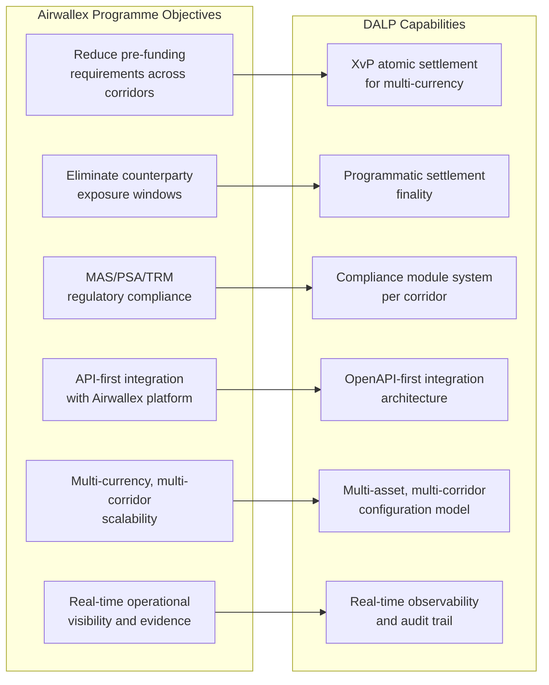
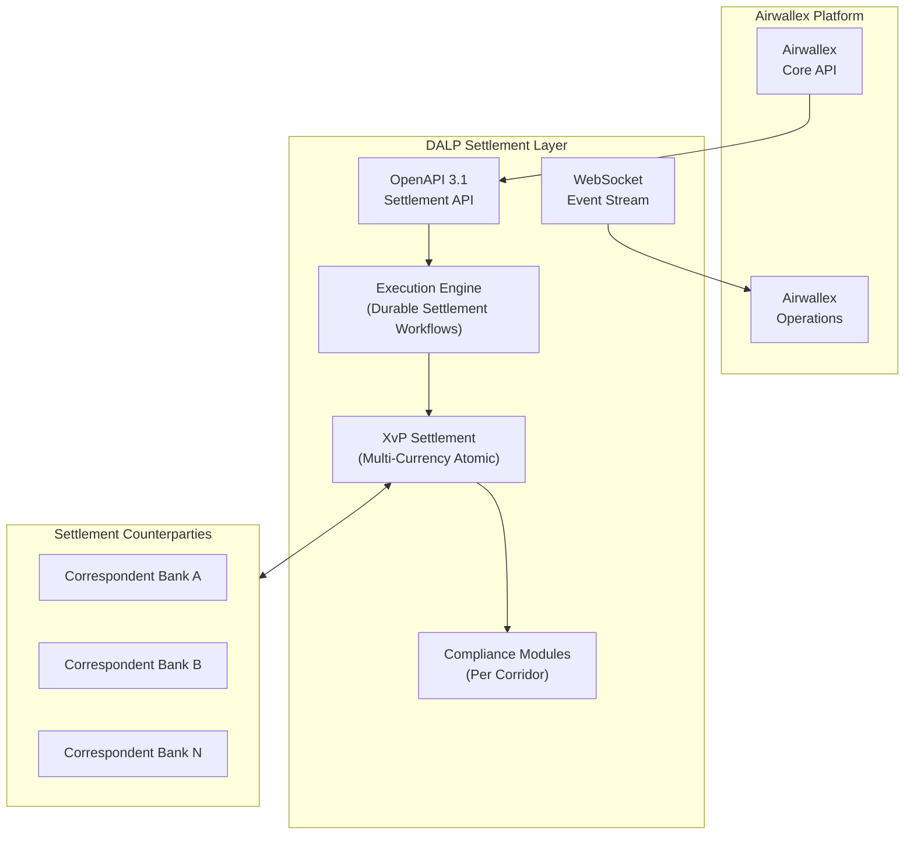
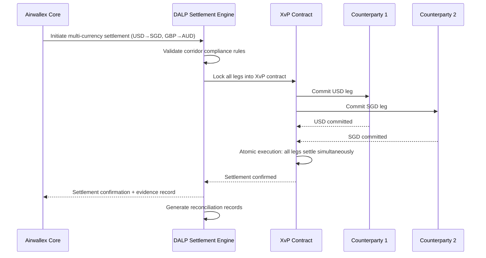
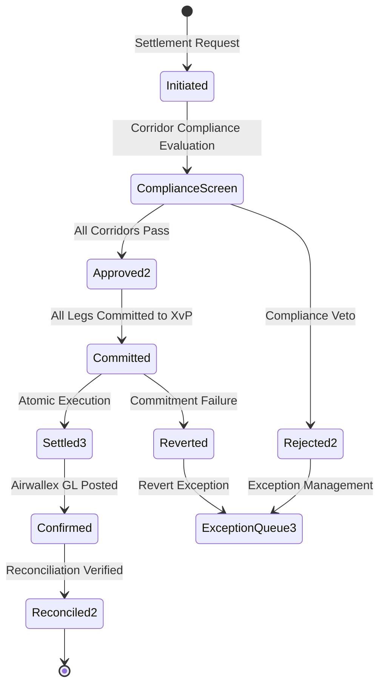
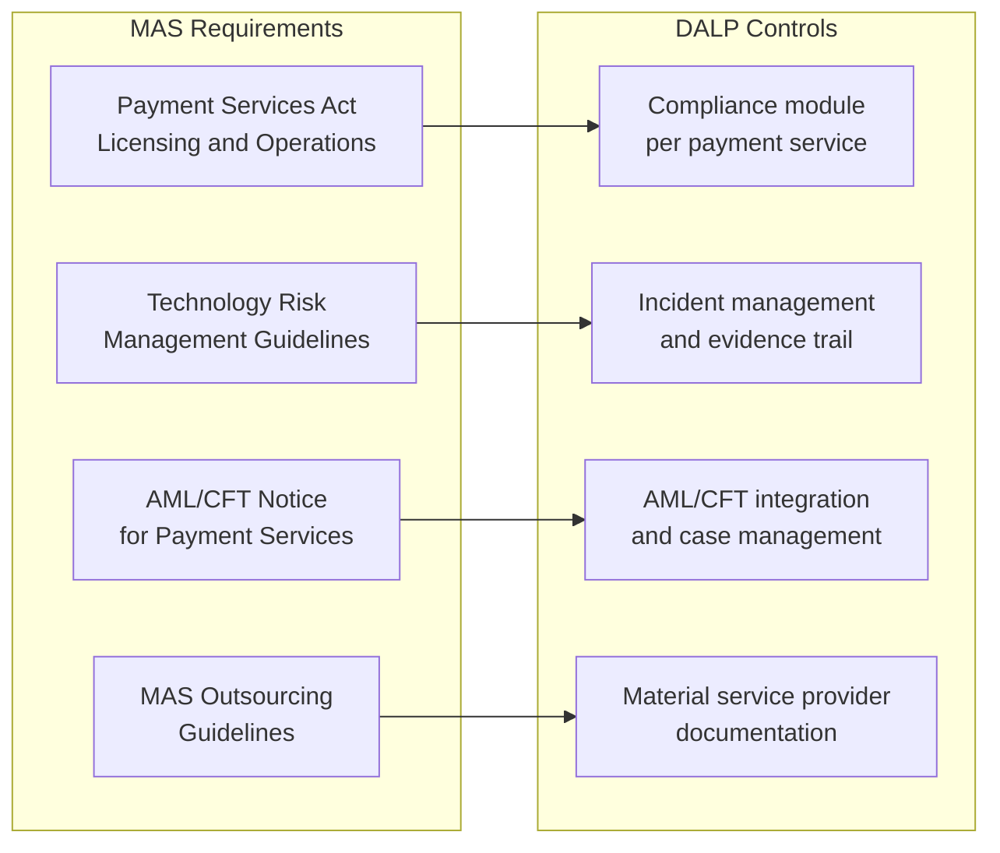
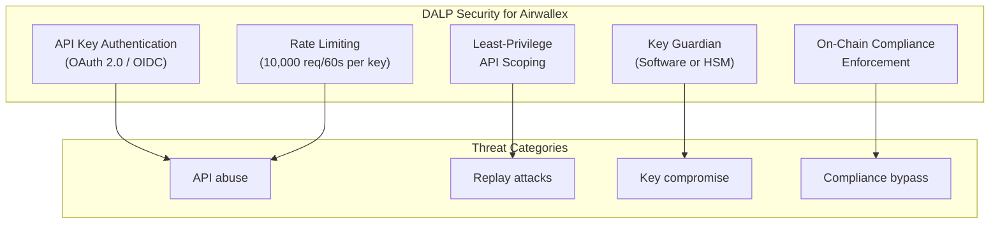
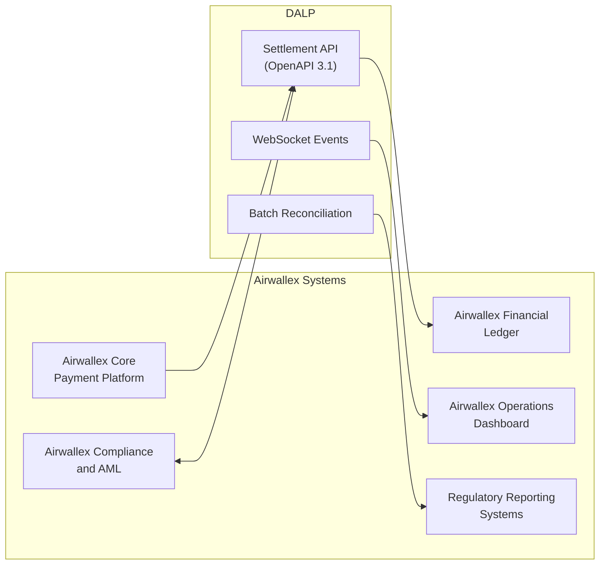
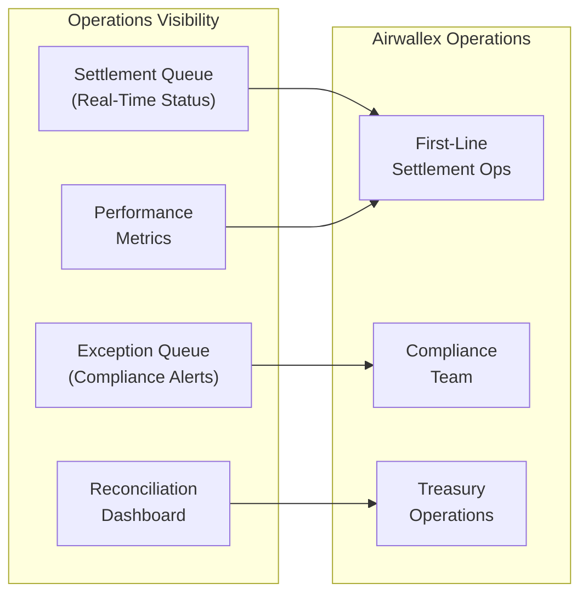
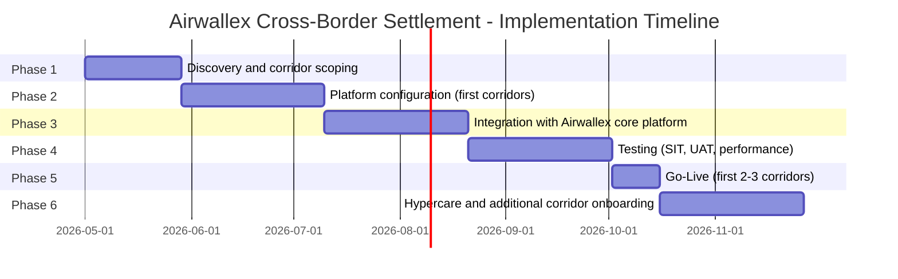

# Technical Proposal: Cross-Border Tokenized Settlement Platform

**Prepared for:** Airwallex
**Reference:** AIRWALLEX-RFP-202603
**Date:** March 2026
**Version:** v1.0
**Classification:** Strictly Confidential. Invited Bidders Only
**Prepared by:** SettleMint NV

---

## Table of Contents

1. Executive Summary
2. Strategic Fit and Use-Case Alignment
3. Platform Architecture
4. Cross-Border Settlement Lifecycle
5. Compliance and Regulatory Framework
6. Security Architecture
7. Integration Architecture
8. Deployment Architecture
9. Operational Model
10. Implementation Plan
11. Testing Strategy
12. Reference Clients
13. Support and SLA Framework
14. Appendix: Technical Requirement Response Matrix

---

## 1. Executive Summary

### 1.1 Context and Strategic Drivers

Airwallex has built one of the world's leading cross-border payment platforms, processing billions in international flows for businesses ranging from early-stage startups to global enterprises. The core business model depends on speed, reliability, and cost efficiency in moving value across borders. The challenge Airwallex now faces is that the correspondent banking infrastructure underlying these flows has fundamental limitations: pre-funding requirements that tie up capital, settlement delays that create counterparty exposure windows, and reconciliation overhead that scales with volume.

Tokenized settlement addresses all three of these limitations directly. By replacing correspondent banking legs with programmatic settlement on a permissioned ledger, Airwallex can reduce pre-funding requirements (because settlement finality is faster), eliminate counterparty exposure windows (because atomic settlement means both sides complete simultaneously or neither does), and reduce reconciliation overhead (because settlement state is single-source-of-truth rather than reconstructed from multiple systems).

The MAS regulatory environment in Singapore is one of the most progressive for regulated tokenized payment infrastructure. The Payment Services Act (PSA) provides a clear licensing framework for digital payment token service providers and e-money issuers. MAS's Technology Risk Management Guidelines specify the security and operational resilience standards that Airwallex must meet. MAS's Project Guardian programme has demonstrated that cross-border tokenized settlement is a policy priority, not just a market experiment.

### 1.2 Why This Programme Is Hard for a Fintech at Scale

Airwallex's programme complexity differs from a bank's. The API infrastructure, the global participant base, the speed expectations, and the multi-currency scope all create demands that standard institutional digital asset platforms are not optimised for. A settlement platform that processes 200 transactions per day in a bank custody context is not the same animal as one that must process thousands of multi-currency transactions daily for a global payments company.

The compliance perimeter spans multiple jurisdictions simultaneously. A payment from a Singapore business to an Australian supplier involves MAS PSA obligations, ASIC oversight where relevant, AML/CTF obligations in both jurisdictions, and OFAC sanctions screening across the corridor. The compliance architecture must handle this multi-jurisdictional complexity programmatically, not through manual review queues.

The integration challenge is also distinctive. Airwallex's core platform is API-first and highly automated. A tokenized settlement layer that introduces manual steps, slow batch interfaces, or fragile custom integrations would degrade Airwallex's product rather than enhance it. The DALP integration layer must match Airwallex's operational tempo.

### 1.3 Proposed Response

SettleMint proposes DALP as the tokenized settlement layer for Airwallex's cross-border treasury programme. DALP provides:

- **Settlement model:** Atomic XvP settlement for multi-currency exchanges. Multi-party settlement can coordinate up to N currency legs simultaneously with atomicity guarantees. All legs settle or all revert.
- **Compliance architecture:** Per-corridor compliance module configuration enforcing MAS PSA obligations, OFAC/UNSC sanctions screening integration, AML/CTF workflow routing, and counterparty eligibility rules.
- **Integration model:** OpenAPI 3.1 interface designed for API-first integration. Event streams for real-time operational monitoring. Batch interfaces for reconciliation and reporting.
- **Deployment model:** Managed SaaS on AWS Singapore or Azure Asia for the primary settlement engine, with private cloud options for jurisdictions with data sovereignty requirements.
- **Performance model:** Sized for Airwallex's transaction volumes, with auto-scaling under the Managed SaaS model and load-tested validation before production launch.

### 1.4 MAS and Cross-Border Treasury Automation Context

DALP's architecture aligns with the design principles that MAS established through Project Guardian and related industry pilots. The platform provides programmable transfer controls at the token layer, supervisory-access-compatible audit evidence, and the governance model that MAS's Technology Risk Management Guidelines require for material digital payment infrastructure.

The cross-border treasury automation context specifically calls for settlement infrastructure that reduces the friction of multi-currency treasury management. DALP's multi-asset, multi-corridor architecture allows Airwallex to configure settlement rules per currency corridor rather than building separate systems per corridor. As new corridors open (additional currencies, new correspondent arrangements, new regulatory frameworks), they are added through configuration and governed approval rather than new development.

---

## 2. Strategic Fit and Use-Case Alignment

### 2.1 Cross-Border Treasury Objective Mapping

**Figure 1: Airwallex Objectives Mapped to DALP Capabilities**

---

## 3. Platform Architecture

### 3.1 API-First Settlement Architecture

**Figure 2: DALP as Settlement Layer within Airwallex Platform Architecture**

DALP integrates with Airwallex's existing core platform as a settlement execution layer. Airwallex's payment orchestration logic calls DALP's settlement API to initiate tokenized settlement for qualifying corridors. DALP handles the compliance evaluation, counterparty coordination, atomic settlement execution, and confirmation. The settlement confirmation is returned to Airwallex's core platform for downstream processing (customer notification, GL posting, reporting).

From Airwallex's perspective, DALP appears as a settlement API endpoint. The complexity of the compliance module evaluation, the XvP settlement coordination, and the audit evidence generation is encapsulated within DALP.

### 3.2 Multi-Currency XvP Settlement

**Figure 3: Multi-Currency Atomic Settlement Sequence**

### 3.3 Durable Settlement Workflow

DALP's Execution Engine on Restate provides exactly-once execution guarantees critical for Airwallex's payment reliability:

- Settlement initiation requests execute exactly once, even if Airwallex's system retries after a network timeout.
- In-flight settlements survive platform restarts and recover from the last confirmed step.
- Failed counterparty commitments trigger automatic reversion of all legs already committed.
- Settlement workflow state is visible to Airwallex's operations team in real time through the event stream.

---

## 4. Cross-Border Settlement Lifecycle

### 4.1 Settlement Flow States

**Figure 4: Cross-Border Settlement Lifecycle States**

### 4.2 Per-Corridor Compliance Configuration

🟢 Each currency corridor operated by Airwallex can have its own compliance module configuration within DALP. This allows different regulatory requirements per corridor without separate platform instances:

| Corridor | Compliance Modules | Key Requirements |
|----------|-------------------|-----------------|
| SGD/USD | Identity verification, OFAC sanctions, MAS PSA | MAS payment service licensing |
| SGD/AUD | Identity verification, OFAC/UNSC, AUSTRAC AML | AML/CTF Act for AUD leg |
| SGD/EUR | Identity verification, OFAC, AMLD6 | EU AML directive for EUR leg |
| SGD/GBP | Identity verification, OFAC, FCA requirements | FCA for GBP leg |

Module configuration changes require GOVERNANCE_ROLE approval and generate auditable events.

---

## 5. Compliance and Regulatory Framework

### 5.1 MAS Regulatory Compliance

**Figure 5: MAS Regulatory Requirements Mapped to DALP Controls**

**MAS Payment Services Act:** Airwallex holds major payment institution licences under the PSA. The settlement platform operates as part of Airwallex's licensed payment service. DALP's compliance architecture enforces the controls required for Airwallex's PSA obligations: counterparty due diligence, transaction monitoring, and suspicious transaction reporting routing.

**MAS Technology Risk Management Guidelines:** TRM Guidelines specify requirements for availability, recoverability, access control, change management, and third-party risk. DALP's architecture meets these requirements: 99.9%+ uptime, documented RTO/RPO, multi-layer access control, versioned change management, and SettleMint's SOC 2 Type II attestation.

**MAS Outsourcing Guidelines:** DALP is a material outsourced service for Airwallex's settlement operations. The commercial agreement includes the material service provider commitments MAS requires: audit rights, incident notification, concentration risk management, and exit planning.

### 5.2 OFAC and Multi-Jurisdictional Sanctions

🟢 DALP integrates with Airwallex's existing sanctions screening infrastructure via the compliance module system. The integration model for multi-jurisdictional corridors:

1. Settlement initiation triggers screening of both counterparties against Airwallex's screening engine (OFAC, UNSC, EU consolidated, MAS designations).
2. Screening results are returned as compliance claims valid for a configurable window (e.g., 24 hours for same-counterparty subsequent transactions).
3. A screening alert blocks the transaction and routes it to the compliance exception queue.
4. Compliance officers adjudicate; confirmed blocks are logged with the sanctions list reference and officer identity.

---

## 6. Security Architecture

### 6.1 Security Architecture for Fintech at Scale

**Figure 6: DALP Security Model for Airwallex**

For Airwallex's API-first integration model, authentication uses OAuth 2.0 with JWT tokens rather than session cookies. API keys are scoped per integration component with least-privilege permissions. Rate limiting prevents API abuse. All API calls are logged with the full request context.

### 6.2 Managed SaaS Security Model

Under the Managed SaaS deployment, SettleMint manages infrastructure security including network isolation, patching, and monitoring. The shared responsibility model is:

- **SettleMint:** Infrastructure security, platform application security, key management operational procedures, network security, patch management.
- **Airwallex:** API integration security, data-in-transit to DALP, identity management for Airwallex users of DALP, integration endpoint security.

SettleMint's SOC 2 Type II report provides independent attestation of the controls in SettleMint's scope.

---

## 7. Integration Architecture

### 7.1 Airwallex Integration Map

**Figure 7: Airwallex Integration Architecture**

### 7.2 Airwallex Core Platform Integration

🟢 The primary integration is Airwallex's core payment platform calling DALP's settlement API to initiate and confirm tokenized settlements. The integration contract:

- **Initiate settlement:** POST /v1/settlements with corridor, amount, counterparties, compliance context
- **Settlement status:** GET /v1/settlements/{id} for status polling
- **Settlement events:** WebSocket subscription to settlement events for real-time confirmation
- **Reconciliation:** GET /v1/settlements/reconciliation for batch reconciliation data

All endpoints are versioned, authenticated, and rate-limited. Idempotency keys prevent duplicate settlement execution.

### 7.3 Financial Ledger Integration

DALP posts settlement confirmation events to Airwallex's financial ledger integration endpoint after each confirmed settlement. The confirmation includes: settlement ID, corridor, amounts (source and destination), counterparties, settlement timestamp, and audit evidence reference.

---

## 8. Deployment Architecture

### 8.1 Managed SaaS for Airwallex

SettleMint recommends Managed SaaS on AWS Singapore (primary) with Asia-Pacific DR on AWS Tokyo or Azure Southeast Asia. This model provides:

- Fastest deployment path: 8-10 weeks to first environment
- Auto-scaling for Airwallex's variable settlement volumes
- SettleMint-managed operations with full observability transparency to Airwallex
- MAS data localisation compliance through AWS Singapore residency configuration
- 99.9%+ uptime with active-passive failover to DR region

Infrastructure requirements managed by SettleMint. Airwallex's responsibilities limited to integration configuration and network connectivity.

### 8.2 Multi-Environment Architecture

| Environment | Purpose | Location |
|-------------|---------|---------|
| Production | Live settlement processing | AWS Singapore |
| DR | Active-passive failover | AWS Tokyo |
| UAT | User acceptance testing | AWS Singapore (separate tenant) |
| SIT | Integration testing | AWS Singapore (separate tenant) |

---

## 9. Operational Model

### 9.1 Real-Time Settlement Operations

**Figure 8: Airwallex Operations Model**

Airwallex's operations team interacts with DALP primarily through the Asset Console and WebSocket event feed. The settlement queue dashboard shows in-flight settlements by corridor, with status, counterparty, and amount. Exception queue shows compliance blocks and AML alerts for adjudication. Reconciliation dashboard shows corridor-level position status for treasury operations.

---

## 10. Implementation Plan

### 10.1 Phased Implementation Timeline

**Figure 9: Airwallex Implementation Timeline (approximately 30 weeks)**

Airwallex's API-first architecture enables a faster deployment than traditional bank programmes. The Managed SaaS deployment eliminates infrastructure provisioning time. The first 2-3 corridors can be live within 24 weeks of mobilisation.

| Phase | Duration | Gate Criteria |
|-------|----------|--------------|
| 1. Discovery | 4 weeks | Corridor priority confirmed; compliance requirements mapped |
| 2. Configuration | 6 weeks | Compliance modules for first corridors validated |
| 3. Integration | 6 weeks | Airwallex API integration passing automated tests |
| 4. Testing | 6 weeks | SIT passed; performance baseline validated; UAT signed off |
| 5. Go-Live | 2 weeks | First corridors live; monitoring intensive |
| 6. Hypercare | 6 weeks | Additional corridors onboarded; KPI targets met |

---

## 11. Testing Strategy

### 11.1 Airwallex-Specific Test Scenarios

- **High-volume throughput:** Settlement throughput at 3x normal daily volume. Validate auto-scaling behaviour and latency under load.
- **Multi-currency atomic failure:** One currency leg fails to commit during XvP execution. Validate that all other legs revert automatically and no partial settlement occurs.
- **Duplicate settlement request:** Two identical settlement requests submitted within idempotency window. Validate exactly-once execution.
- **Compliance exception mid-workflow:** Sanctions screening alert received after settlement initiation but before XvP execution. Validate correct routing to exception queue and suspension of settlement.
- **API timeout handling:** Airwallex's core platform times out waiting for settlement confirmation. Validate that the settlement continues correctly on DALP and that the status is retrievable when Airwallex's system recovers.
- **Corridor disable during active settlements:** A corridor is disabled by compliance team while settlements are in-flight. Validate that in-flight settlements complete and new requests to the disabled corridor are rejected with appropriate error.

---

## 12. Reference Clients

| Client | Region | Use Case | Outcome |
|--------|--------|----------|---------|
| DBS Bank | Singapore | Tokenized settlement under MAS | Production; MAS compliant |
| OCBC Bank | Singapore | Wealth product settlement | Production; MAS compliant |
| Flutterwave | Nigeria/Pan-Africa | Cross-border payment settlement | Production; multi-corridor |
| Interswitch | Nigeria | Payment settlement and reconciliation | Production |
| Chipper Cash | Pan-Africa | Cross-border remittance settlement | Production |
| M-Pesa Safaricom | Kenya | Digital payment settlement | Production |

---

## 13. Support and SLA Framework

| Dimension | Commitment |
|-----------|-----------|
| Coverage | 24/7 |
| P1 response | 15 minutes |
| P2 response | 1 hour |
| Monthly uptime | 99.9% |
| Auto-scaling | Automated; no manual intervention required |
| Maintenance windows | Off-peak Asia-Pacific hours; 5 business days notice |

## 14. Technical Requirement Response Matrix

| Req ID | Status | Notes |
|--------|--------|-------|
| TR-01 | 🟢 Supported | Full cross-border settlement lifecycle |
| TR-02 | 🟢 Supported | Maker-checker for compliance-sensitive operations |
| TR-03 | 🟢 Supported | OpenAPI 3.1, idempotent, versioned |
| TR-04 | 🟢 Supported | MAS PSA/TRM/outsourcing compliant |
| TR-05 | 🟡 Supported with Third-Party Dependency | KYC via Airwallex's existing KYC integration |
| TR-06 | 🟢 Supported | Software key management (HSM optional add-on) |
| TR-07 | 🟢 Supported | Real-time reconciliation via Chain Indexer |
| TR-08 | 🟢 Supported | Settlement operations dashboards |
| TR-09 | 🟢 Supported | Managed SaaS (primary); private cloud available |
| TR-10 | 🟢 Supported | DBS, OCBC, Flutterwave, Interswitch references |
| TR-11 | 🟢 Supported | Per-corridor compliance modules |
| TR-12 | 🟢 Supported | Including high-volume and atomic failure tests |
| TR-13 | 🟢 Supported | OpenAPI-first; fits Airwallex's integration model |
| TR-14 | 🟢 Supported | Per-corridor configuration without code changes |
| TR-15 | 🟢 Supported | Append-only audit trail |
| TR-16 | 🟢 Supported | All dependencies disclosed |
| TR-17 | 🟢 Supported | 99.9% SLA; RPO <4h, RTO <2h |
| TR-18 | 🟢 Supported | Platform-based; no per-corridor fees |
| TR-19 | 🟢 Supported | Versioned Helm; SettleMint-managed in SaaS |
| TR-20 | 🟡 Roadmap separated | Live vs. roadmap clearly distinguished |
