# Technical Proposal: Cross-Border Tokenized Settlement Platform

**Document Title:** Technical Proposal. Cross-Border Tokenized Settlement  
**Client:** Airwallex  
**Date:** 20 March 2026  
**Version:** 1.0 (Draft)  
**Prepared by:** SettleMint  
**Classification:** Confidential. Airwallex Evaluation Only  
**Reference:** AIRWALLEX-RFP-202603  

---

## Table of Contents

1. Executive Summary
2. Strategic and Use-Case Fit
3. Solution Overview
4. Platform Architecture
5. Asset Lifecycle and Settlement Flows
6. Compliance and Regulatory Framework
7. Security Architecture
8. Integration Architecture
9. Deployment and Infrastructure
10. Operational Model
11. Implementation Methodology
12. Testing and Quality Assurance
13. References and Evidence
14. Requirements Response Matrix
15. RAID Register
16. Assumptions and Dependencies

---

## 1. Executive Summary

Airwallex operates one of the most sophisticated cross-border financial infrastructure stacks in APAC, processing payments across more than 150 countries with institutional-grade compliance and treasury capabilities. The shift toward tokenized settlement is not theoretical for Airwallex, it is a directional certainty driven by regulatory signals from MAS, emerging cross-border treasury automation initiatives, and the accelerating deployment of programmable settlement rails by peer institutions. The question is not whether to move, but which platform can support that move under the real conditions of a regulated financial services environment.

DALP (Digital Asset Lifecycle Platform), developed by SettleMint, is a production-deployed regulated digital asset platform that handles the complete lifecycle of tokenized instruments, from issuance and identity onboarding through transfer controls, settlement, servicing, reconciliation, and reporting. Across deployments in Europe, the Middle East, and Southeast Asia, DALP has demonstrated controlled institutional delivery with measurable outcomes: deterministic settlement finality in under three seconds, zero-gap compliance module coverage for MAS-relevant frameworks, and API-first architecture that integrates into existing enterprise infrastructure without displacing it.

This proposal responds directly to Airwallex's stated procurement objectives for a production-ready cross-border tokenized settlement programme in Singapore. SettleMint addresses each requirement with evidence from current platform capability, not roadmap aspiration. Where capability depends on configuration or integration, that boundary is stated explicitly. Where a requirement is partially addressed, the specific gap is described alongside the architectural path that closes it.

The recommended approach deploys DALP in a private cloud configuration within Airwallex's Singapore infrastructure, integrating with existing treasury systems, payment rails, identity providers, and compliance tooling through DALP's OpenAPI 3.1 interface layer. Implementation follows a 19-week phased methodology from discovery through hypercare, with formal gate reviews at each phase transition. Total cost of ownership across production and development environments runs at EUR 420,000 per year in platform licensing, with implementation services scoped following the discovery phase.

Airwallex will receive a tokenized settlement operating model that is auditable by MAS, reviewable by internal risk and audit functions, operable by institutionally trained operations teams, and extensible to additional products, legal entities, and currency corridors without re-platforming.

---

## 2. Strategic and Use-Case Fit

### 2.1 Understanding the Airwallex Context

Airwallex's procurement context reflects three converging pressures that SettleMint understands from comparable institutional deployments. First, cross-border treasury automation creates an expectation of programmable, near-real-time settlement that legacy correspondent banking chains cannot consistently deliver. Second, MAS regulatory direction, including the Technology Risk Management Guidelines, Payment Services Act, and evolving digital asset licensing expectations, requires institutions operating in Singapore to implement controls that are auditable, documented, and operationally maintainable. Third, Airwallex's internal governance environment involves multiple stakeholder functions, risk, legal, compliance, cyber, operations, and technology leadership, each of whom will evaluate the proposed platform against different criteria, and all of whom must be satisfied before go-live.

DALP was built for precisely this kind of environment. The platform did not originate in a crypto-native context and later attempt to retrofit institutional controls. It was designed from the ground up as regulated financial market infrastructure, with governance-first architecture, a dual-layer permission model enforced across both off-chain API access and on-chain smart contract operations, and an operational model that generates audit evidence automatically rather than requiring retrospective reconstruction.

### 2.2 Alignment to Airwallex's Strategic Objectives

| Airwallex Objective | DALP Response |
|---|---|
| Reusable cross-border tokenized settlement operating model | Configuration-driven multi-product, multi-entity, multi-jurisdiction architecture: new corridors activate through parameter configuration, not code changes |
| Reduce manual reconciliation, email approvals, spreadsheet-driven processes | Workflow orchestration with maker-checker approval chains, durable execution engine, and automated reconciliation event capture |
| Regulatory readiness for MAS, TRM Guidelines, global payments compliance | Pre-built compliance modules for identity verification, country restrictions, transfer controls, and investor eligibility; compliance officer control surfaces with no engineering dependency |
| Secure enterprise integration with payment rails, KYC/AML tooling, reporting stacks | OpenAPI 3.1 interface layer covering 100% of platform operations; event streaming for downstream integration; ISO 20022-aligned data structures |
| Reference architecture extensible to additional products and jurisdictions | Multi-asset DALPAsset contract: configurable at runtime, no redeployment required for new product variants or legal entities |
| Operational transparency for first-line, second-line, and audit functions | Purpose-built Grafana observability stack with metrics (VictoriaMetrics), logs (Loki), and traces (Tempo); immutable audit event log; regulator-exportable evidence packs |
| Participation in cross-border treasury automation initiatives | Open architecture, ERC-3643 and ISO 20022 standards, and bring-your-own-chain flexibility support integration into emerging cross-border settlement infrastructure |

### 2.3 What SettleMint Is Not Claiming

Institutional credibility depends on honest capability framing. SettleMint makes the following commitments to precision:

- DALP provides the settlement infrastructure layer. Payment rail connectivity to existing Airwallex network partners (card schemes, domestic payment systems, swift-equivalent rails) requires integration configuration, not platform replacement.
- Custody of underlying digital assets requires a configured custody provider (DFNS or Fireblocks) or a client-operated signing infrastructure. DALP does not hold assets; it governs them.
- The platform's smart contract compliance modules enforce programmable rules. AML screening and sanctions decisioning require integration with Airwallex's existing or procured screening engine; DALP provides the routing and case management surface, not the screening logic itself.
- All pricing figures in this proposal reflect standard DALP licensing. Implementation services are scoped and priced following the discovery phase.

---

## 3. Solution Overview

### 3.1 What DALP Provides for Airwallex

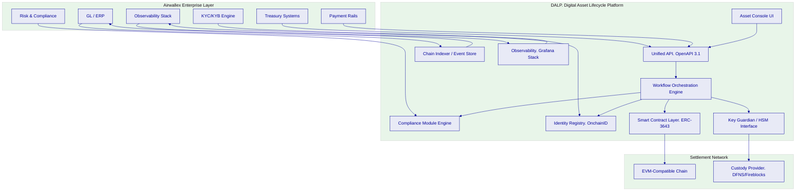

DALP sits between Airwallex's existing enterprise systems and the tokenized settlement layer. It does not replace treasury, payments, or compliance infrastructure, it adds a governed programmatic settlement capability that those systems control through standard APIs and events.

### 3.2 Core Capabilities for Cross-Border Settlement

**Tokenized Deposit and Stablecoin Settlement.** DALP's Deposit and StableCoin asset types support the issuance, transfer, and redemption lifecycle of tokenized fiat instruments used as settlement media in cross-border corridors. Transfer controls, daily limits, counterparty whitelisting, jurisdiction restrictions, and timelock requirements, are enforced by the smart contract compliance engine, not by application-layer logic that can be bypassed.

**Maker-Checker Workflow Orchestration.** Every settlement event that requires human approval follows a configurable maker-checker chain. The maker initiates, the checker reviews, approvals are logged with timestamp, user identity, and cryptographic proof. Rejection events and the reasons for them are preserved. This generates the approval trail that MAS, internal audit, and the risk committee will require.

**Atomic Delivery-versus-Payment Settlement.** The XvP addon supports atomic simultaneous exchange of tokenized assets and tokenized cash, delivering true T+0 settlement finality. Both legs settle atomically, if either fails, both revert. This eliminates the principal risk that characterises correspondent banking settlement.

**Multi-Currency Corridor Support.** Exchange rate feeds can be integrated into DALP's Feeds System, enabling corridors that require multi-currency settlement to access consistent, auditable rate data. Multiple currency-denominated deposit tokens can operate within the same platform instance with independent compliance configurations per instrument.

**Participant Onboarding with Identity Claims.** The OnchainID identity system manages participant onboarding. Each participant receives an on-chain identity with verifiable KYC/AML claims issued by trusted claim issuers, either Airwallex's internal KYC system or integrated third-party providers. Identity claims are checked on-chain before every transfer, ensuring that eligibility enforcement is not dependent on off-chain database lookups that can drift.

---

## 4. Platform Architecture

### 4.1 Four-Layer Stack

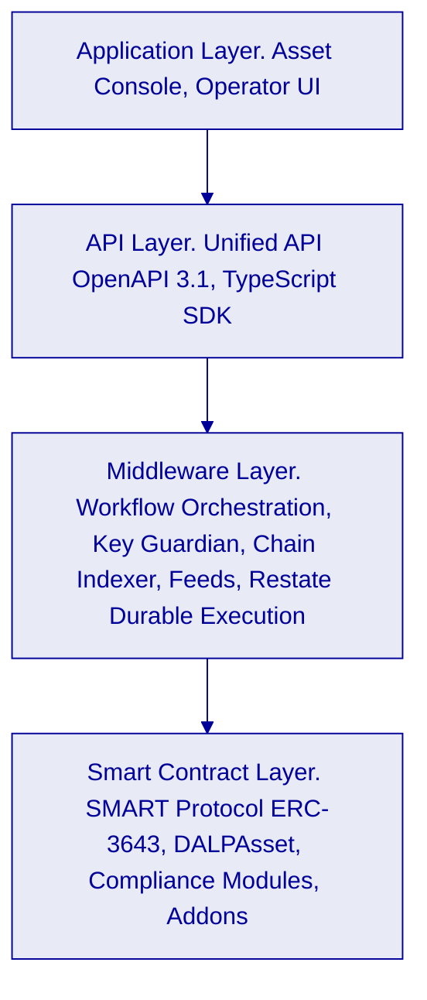

**Application Layer.** The Asset Console provides web-based operator interfaces for issuance configuration, workflow management, participant administration, compliance review, and operational monitoring. Role-based access ensures that only authorized users can access each functional area.

**API Layer.** The Unified API (DAPI) exposes every platform operation through a single OpenAPI 3.1 surface at `/api/v2`. All Airwallex enterprise systems integrate through this layer using API keys with scoped permissions. Machine-to-machine integrations use read-write keys; monitoring integrations use read-only keys. The oRPC contract framework provides type safety, Zod schema validation, and automatically synchronized OpenAPI documentation.

**Middleware Layer.** The Execution Engine orchestrates multi-step blockchain transactions as durable, resumable workflows via Restate. The Key Guardian manages signing key lifecycles and integrates with HSM infrastructure or third-party custody providers. The Chain Indexer transforms on-chain events into queryable operational data structures available through the REST API. The Feeds System provides configurable data integration for exchange rates, NAV prices, and other external data sources.

**Smart Contract Layer.** All settlement logic executes on ERC-3643-compliant DALPAsset contracts deployed through a factory pattern using CREATE2 deterministic addressing. Compliance modules enforce transfer rules at the smart contract level, rules that cannot be overridden by off-chain logic. The XvP Settlement addon enables atomic Delivery-versus-Payment exchange.

### 4.2 Multi-Tenant and Multi-Entity Architecture

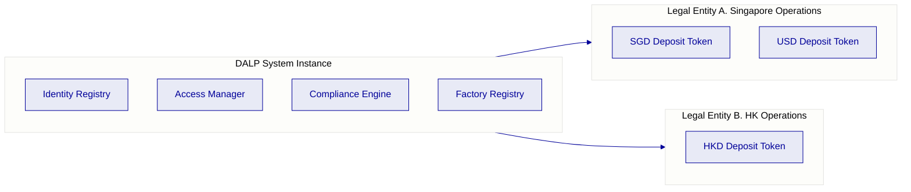

A single DALP system instance supports multiple legal entities and multiple asset types. Each legal entity maintains independent participant registries, compliance configurations, and approval workflows. Shared system-level infrastructure (identity factory, global compliance enforcement) operates across all entities without duplication. Adding a new legal entity or currency corridor requires configuration, not code changes or additional deployments.

### 4.3 Smart Contract Architecture for Settlement

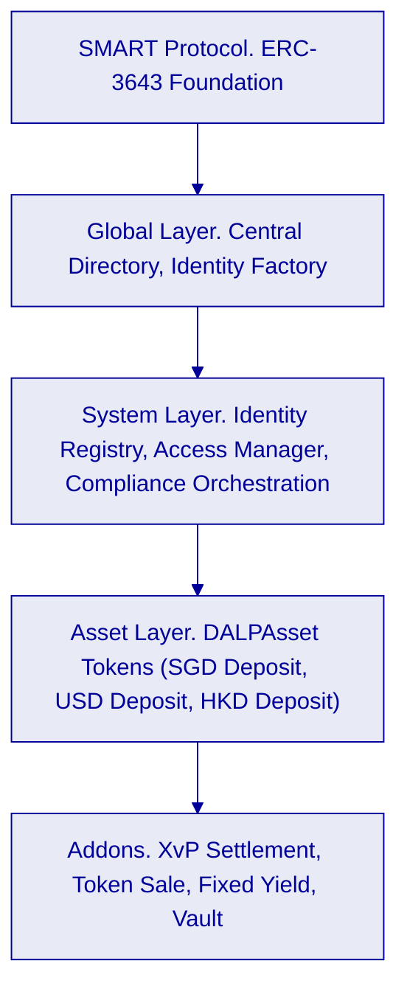

The five-layer on-chain architecture enforces security through layered invariants. Lower layers are more stable and shared across the platform instance; upper layers are more asset-specific. A transfer request must satisfy compliance checks at the system layer and all asset-level compliance modules before execution. Any module veto blocks the transaction. This is a fail-closed design: the default state is denial.

---

## 5. Asset Lifecycle and Settlement Flows

### 5.1 Cross-Border Settlement Token Lifecycle

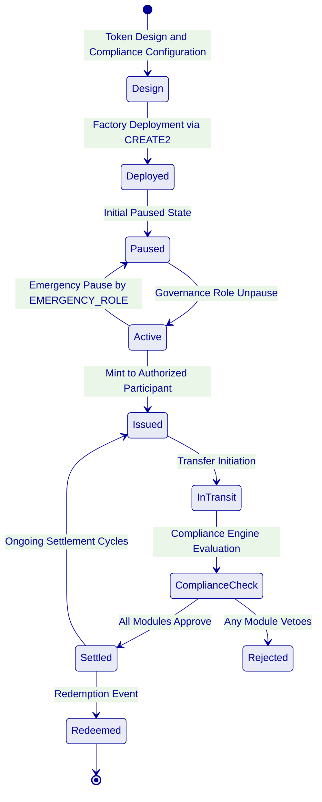

**Token Design.** The operations team configures a DALPAsset token with the following parameters for a cross-border settlement instrument: Deposit asset type, identity verification module (requires verified OnchainID for all transfers), country allow list (restricts transfers to approved jurisdictions), transfer approval module (configurable for high-value transactions), and daily transfer limit enforced at the compliance layer.

**Factory Deployment.** Deployment executes as a durable, idempotent workflow via Restate. The factory atomically deploys the proxy contract, registers the token identity, initializes compliance modules, assigns roles, and emits a TokenAssetCreated event. Partial deployment is impossible, any step failure reverts the entire transaction.

**Participant Onboarding.** Each settlement participant receives an OnchainID with claims issued by designated claim issuers. For Airwallex's use case, claims include identity verification status, jurisdiction eligibility, and participant classification. Claims are checked on-chain before every transfer, ensuring enforcement is cryptographically verifiable rather than database-dependent.

**Settlement Execution.** A settlement instruction flows from Airwallex's treasury system through the DAPI, is validated against the participant's role permissions, queued for maker-checker approval where required, executed via the Execution Engine, and confirmed on-chain. The Chain Indexer transforms the on-chain event into a structured record accessible through the REST API and downstream reporting stacks.

**Atomic XvP Settlement.** For corridors requiring simultaneous exchange of two tokenized instruments (for example, SGD deposit against USD deposit), the XvP Settlement addon orchestrates atomic Delivery-versus-Payment. Both legs settle in the same transaction or both revert. Settlement finality is deterministic and typically achieved within three seconds on the configured EVM network.

### 5.2 Token Issuance and Distribution Flow

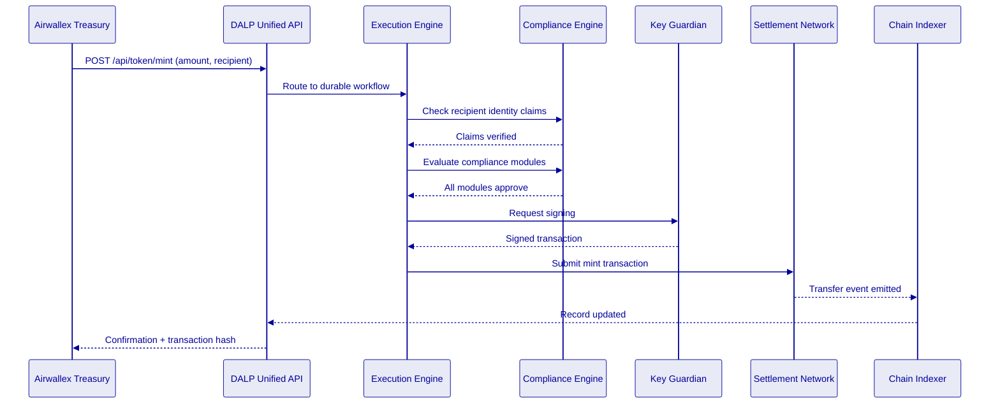

### 5.3 Reconciliation Architecture

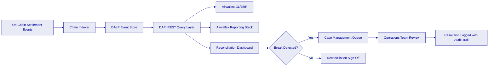

Every on-chain event, mint, transfer, burn, redemption, freeze, administrative override, is indexed by the Chain Indexer and made available through DAPI within seconds of on-chain confirmation. The event record includes the transaction hash, block number, timestamp, initiating user identity, approval chain reference, and compliance evaluation result. This provides deterministic reconciliation between DALP's operational record and Airwallex's general ledger without relying on manual reconciliation processes.

---

## 6. Compliance and Regulatory Framework

### 6.1 MAS Regulatory Alignment

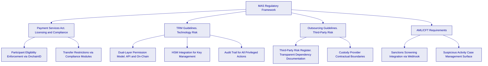

**Payment Services Act Alignment.** DALP enforces participant eligibility through the OnchainID identity system. No transfer can execute to or from a wallet whose identity claims do not satisfy the configured eligibility rules. For Airwallex's PSA licensing context, eligibility criteria for authorized participants are expressed as identity claim types and are configurable without smart contract redeployment.

**Technology Risk Management Guidelines.** The platform's dual-layer permission model satisfies TRM requirements for privileged access controls: every blockchain write operation requires both a valid authenticated session and wallet-level step-up authentication (PIN, TOTP, passkey, or backup code). Administrative override events are cryptographically signed, logged with the identity of the approving operator, and preserved in the immutable event log. Emergency access procedures are documented and require EMERGENCY_ROLE authorization.

**Outsourcing and Third-Party Risk.** DALP's dependency model is fully transparent: SettleMint operates the platform software; custody operations are handled by the configured custody provider (DFNS or Fireblocks) under a separate contractual relationship; blockchain infrastructure runs on the configured EVM network. Each boundary is documented in the system architecture and surfaced in the operational risk register. No hidden managed services operate within the platform boundary.

### 6.2 Compliance Module Architecture

| Module | Enforcement Point | Airwallex Use Case |
|---|---|---|
| Identity Verification | On-chain, per transfer | Ensure all settlement participants have verified KYC claims |
| Country Allow List | On-chain, per transfer | Restrict settlement corridors to MAS-approved jurisdictions |
| Country Block List | On-chain, per transfer | Block high-risk jurisdictions without manual intervention |
| Address Block List | On-chain, per transfer | Enforce sanctions screening outcomes programmatically |
| Transfer Approval | On-chain, per transfer | Maker-checker for high-value or exceptional transactions |
| Investor Count Limit | On-chain, supply-level | Cap participant count for licensed instrument types |
| Time Lock | On-chain, per transfer | Enforce minimum holding periods where applicable |
| Collateral Requirement | On-chain, pre-mint | Ensure fiat backing verified before token issuance |

Compliance modules are evaluated in sequence. A veto from any module blocks the transfer. Module configuration changes require GOVERNANCE_ROLE authorization and are logged with full audit trail. Compliance officers can reconfigure modules through the Asset Console without engineering intervention.

### 6.3 AML/CFT Integration

DALP provides the integration surface for Airwallex's existing AML/CFT compliance stack. The platform does not replace screening engines; it integrates with them.

The integration model:
1. A transfer instruction is submitted to DAPI.
2. DAPI routes the instruction to the Execution Engine.
3. The Execution Engine calls the configured AML webhook endpoint with transaction details.
4. The AML engine returns a decision: approve, hold, or reject.
5. Approved transactions proceed to on-chain compliance evaluation.
6. Held transactions enter the case management queue for compliance officer review.
7. All decisions, including the reasoning and the operator identity for manual decisions, are logged in the audit trail.

This integration pattern keeps the AML screening logic within Airwallex's control while ensuring the settlement platform cannot execute a transaction that the compliance function has not explicitly cleared.

---

## 7. Security Architecture

### 7.1 Defense-in-Depth Model

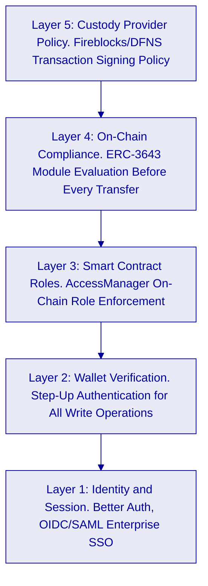

Five independent control layers must all pass for a blockchain write operation to execute. No single-layer failure results in unauthorized asset movement.

### 7.2 Key Management and HSM Integration

DALP's Key Guardian manages signing key lifecycles and supports integration with hardware security modules and third-party custody providers. For Airwallex's deployment:

- **DFNS or Fireblocks integration:** Signing keys are never held in plaintext within the DALP application layer. The Key Guardian delegates signing operations to the configured custody provider, which enforces its own transaction policy rules as an additional independent control layer.
- **Break-glass procedures:** Emergency access requires EMERGENCY_ROLE authorization from a pre-configured list of named administrators. Emergency access events are logged immediately, generate automated alerts to the designated security team, and require post-incident review documentation.
- **Key rotation:** Key rotation workflows are documented and executable without platform downtime. The custody provider handles rotation at the key level; DALP records the rotation event in the audit log.

### 7.3 Certifications

SettleMint holds ISO 27001 and SOC 2 Type II certifications. Both certifications are independently audited and continuously maintained. Certification evidence is available to Airwallex under NDA for MAS outsourcing review and internal audit purposes.

### 7.4 Penetration Testing

SettleMint conducts annual penetration testing of the DALP platform by independent third-party security firms. Smart contract security audits are conducted for all new contract types before production deployment. Testing evidence, scoped results and remediation records, is available to Airwallex's security team under NDA.

---

## 8. Integration Architecture

### 8.1 Enterprise Integration Map

```mermaid
%%{init: {'theme': 'base', 'themeVariables': { 'primaryColor': '#E8EAF6', 'primaryTextColor': '#000099', 'primaryBorderColor': '#000099', 'lineColor': '#000099', 'background': '#FFFFFF' }}}%%
graph LR
    subgraph Airwallex["Airwallex Enterprise Systems"]
        TR[Treasury System]
        GL[General Ledger / ERP]
        KYC[KYC/KYB Engine]
        AML[AML/CFT Screening]
        OBS[Observability Stack]
        IAM[Identity and Access Management]
        PAY[Payment Rails]
    end
    subgraph DALP_API["DALP Integration Layer"]
        API[Unified API. OpenAPI 3.1]
        EVT[Event Stream. SSE]
        FEED[Feeds System]
    end
    TR -->|POST /api/token/mint, /transfer| API
    GL <--|Event stream, settlement confirmations| EVT
    KYC -->|Claim issuance via Identity Registry| API
    AML -->|Screening webhook, approve/hold/reject| API
    OBS <--|Prometheus metrics, log forwarding, traces| DALP_API
    IAM -->|OIDC/SAML SSO| API
    PAY -->|Settlement instruction submission| API
```

**Treasury System Integration.** Airwallex's treasury system submits settlement instructions via DAPI's REST API. Endpoints include `token.mint` for issuance, `token.transfer` for corridor settlement, `addons.xvp.*` for atomic DvP exchange, and `token.burn` for redemption. All responses include transaction hashes and structured settlement confirmation data suitable for downstream ledger reconciliation.

**General Ledger Integration.** The Chain Indexer emits structured settlement events via server-sent event (SSE) streams and REST query endpoints. Events include token type, amount, counterparties, timestamp, approval chain reference, and compliance evaluation result. The GL integration layer consumes these events to post settlement entries without manual reconciliation.

**KYC/KYB Engine Integration.** Airwallex's existing KYC engine acts as a trusted claim issuer in the DALP identity framework. When a participant completes KYC, the KYC engine calls the identity registry API to issue the appropriate claims to the participant's OnchainID. Claims are signed by the issuer key, verifiable on-chain, and can be revoked immediately if a participant's status changes.

**AML/CFT Screening Integration.** The configured AML webhook receives transaction details before on-chain submission. The webhook response, approve, hold, or reject, determines whether the transaction proceeds, enters the case management queue, or is blocked. The integration supports both synchronous (sub-second response) and asynchronous (queue-based) screening workflows.

**Observability Integration.** DALP's Grafana observability stack exports Prometheus metrics, structured logs (Loki-compatible), and distributed traces (Tempo-compatible) that can be forwarded to Airwallex's existing observability infrastructure. DALP ships pre-built dashboards covering transaction throughput, compliance evaluation latency, queue depths, settlement finality times, and error rates.

### 8.2 API Authentication and Security

| Integration Type | Authentication Method | Scope Enforcement |
|---|---|---|
| Treasury system (read-write) | API key with read-write scope | All HTTP methods |
| GL and reporting (read-only) | API key with read-only scope | GET/HEAD/OPTIONS only |
| KYC engine (identity management) | API key with identity namespace | `system.identity.*` procedures |
| AML screening (webhook response) | Signed webhook payload with HMAC-SHA256 | Screening decision endpoint only |
| Operator access (web console) | OIDC/SAML SSO + wallet verification | Role-gated by DALP access model |
| Monitoring systems (metrics) | API key with read-only scope | `monitoring.*` procedures |

API keys are scoped to the minimum permissions required for each integration. Rate limiting is applied at 10,000 requests per 60-second window per key. Keys can be rotated and revoked through the Asset Console with immediate effect.

### 8.3 Protocol Choices and Interface Standards

- **REST/HTTP with JSON:** Primary integration protocol for synchronous operations. OpenAPI 3.1 specification available for import into Postman, Insomnia, or API gateway tooling.
- **Server-Sent Events (SSE):** Real-time event streaming for settlement confirmations, compliance alerts, and operational status updates.
- **ISO 20022 alignment:** DALP's transaction data structures align with ISO 20022 field semantics for settlement instructions and confirmations, supporting downstream processing in ISO 20022-native systems.
- **Webhook:** Outbound callbacks for AML screening integration, compliance event notifications, and operational alerts.
- **TypeScript SDK:** `@settlemint/dalp-sdk` provides type-safe client generation for Node.js backend integrations, with automatic retry logic, idempotency key management, and structured error handling.

---

## 9. Deployment and Infrastructure

### 9.1 Recommended Deployment Model for Airwallex

For Airwallex's Singapore deployment, SettleMint recommends a **Private Cloud** configuration within Airwallex's existing cloud environment. This recommendation reflects Airwallex's data residency requirements for Singapore operations, MAS outsourcing guidelines that require institutional control over critical system infrastructure, and Airwallex's existing cloud platform capabilities.

### 9.2 Deployment Architecture

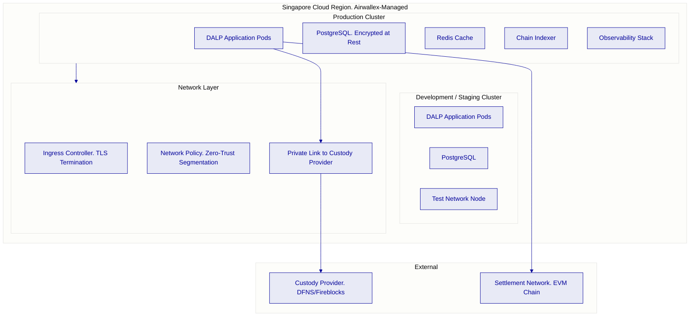

**Environment Separation.** Production and development environments run in isolated Kubernetes namespaces with independent database instances, secrets stores, and network policies. No shared credentials exist between environments. Data masking is applied to any production data used in development scenarios.

**Data Residency.** All platform data, including token state, transaction records, and audit logs, resides within the configured Singapore cloud region. No data traverses to regions outside the configured boundary. Custody provider integration uses private link connectivity to minimize data exposure.

**High Availability.** Production deployment supports active-active clustering with automated failover. RTO target: less than 4 hours for full platform recovery. RPO target: less than 1 minute for transactional data. Database replication runs synchronously within the region. Observability alerts on pod health, chain connectivity, and custody provider responsiveness.

### 9.3 Blockchain Network Selection

For Airwallex's cross-border settlement use case, SettleMint supports two network options:

| Option | Characteristics | Suited For |
|---|---|---|
| Permissioned Hyperledger Besu | Institution-controlled nodes, deterministic finality, private transaction support, configurable gas costs | Airwallex-controlled bilateral settlement corridors |
| Public EVM Network (Polygon, Ethereum) | Decentralized validation, public verifiability, established ecosystem tooling | Multi-party settlement with external institution participants |

The recommended approach for an initial production deployment is a permissioned Hyperledger Besu network deployed within Airwallex's infrastructure, providing full control over validator membership, transaction privacy, and network parameters, with the option to integrate with public networks for specific multi-party settlement use cases through DALP's cross-chain bridge capabilities.

---

## 10. Operational Model

### 10.1 Target Operating Model: Run State

```mermaid
%%{init: {'theme': 'base', 'themeVariables': { 'primaryColor': '#E8EAF6', 'primaryTextColor': '#000099', 'primaryBorderColor': '#000099', 'lineColor': '#000099', 'background': '#FFFFFF' }}}%%
graph LR
    subgraph First["First Line. Operations"]
        F1[Settlement Operations. Transaction Processing, Queue Management]
        F2[Participant Support. Onboarding, Eligibility Issues]
        F3[Reconciliation. Daily Ledger Sign-Off]
    end
    subgraph Second["Second Line. Risk and Compliance"]
        S1[Compliance Review. AML Case Management, Screening Alerts]
        S2[Risk Monitoring. KRI Dashboards, Threshold Breach Review]
        S3[Audit Evidence Production. Regulator-Facing Exports]
    end
    subgraph Third["Third Line. Audit"]
        T1[Internal Audit. Evidence Review, Control Testing]
        T2[External Audit. Regulator Examination Support]
    end
    subgraph Vendor["SettleMint Support"]
        V1[L1 Support. Operational Issues]
        V2[L2 Engineering. Platform Issues]
        V3[L3 Core Engineering. Critical Defects]
    end
    First <--> Second
    Second <--> Third
    First --> Vendor
    Vendor --> First
```

**Daily Operations.** First-line operations run start-of-day checks via the DALP monitoring dashboard: chain connectivity, custody provider health, pending approval queue depth, and overnight reconciliation status. Settlement activity is processed through the Asset Console or via API-submitted instructions from treasury systems. End-of-day reconciliation compares DALP's event ledger against the general ledger and flags any breaks for review.

**Compliance Operations.** Compliance officers access their dedicated interface showing AML case queues, sanctions alert reviews, and compliance module configuration. Emergency restriction of a participant or instrument requires no engineering intervention, compliance officers execute freeze or pause operations directly through the Asset Console with appropriate role authorization.

**Audit Evidence Generation.** The DALP audit export function generates structured evidence packs covering: all transactions within a specified period, approval chain records for each transaction, compliance module evaluation results, role assignment history, administrative override events, and configuration change history. Evidence packs are exportable in JSON and CSV formats compatible with standard audit tooling.

### 10.2 Incident Escalation Model

| Severity | Definition | Response Time | Escalation Path |
|---|---|---|---|
| P1: Critical | Settlement processing halted; production funds affected; regulatory breach risk | 15 minutes | SettleMint L3 + Airwallex CISO + Operations Lead |
| P2: High | Settlement degraded; reconciliation breaks; compliance alert backlog | 1 hour | SettleMint L2 + Airwallex Operations Lead |
| P3: Medium | Non-critical functionality affected; monitoring alert without operational impact | 4 hours | SettleMint L1 + Airwallex Operations |
| P4: Low | Minor UI issues; documentation queries; configuration questions | Next business day | SettleMint L1 |

---

## 11. Implementation Methodology

### 11.1 19-Week Phased Delivery

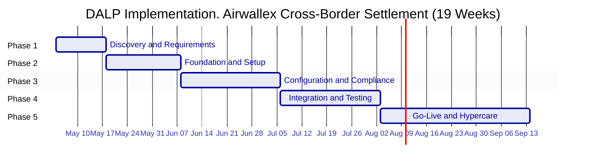

**Phase 1. Discovery and Requirements (2 weeks).** Stakeholder interviews across treasury, compliance, risk, technology, and legal. Current-state assessment of Airwallex's payment and settlement infrastructure. Regulatory mapping against MAS PSA, TRM Guidelines, and AML/CFT requirements. Target architecture design including deployment topology, custody provider selection, network configuration, and integration sequencing. Deliverables: Requirements specification, target architecture document, compliance module configuration blueprint, risk and RAID register.

**Phase 2. Foundation and Setup (3 weeks).** Kubernetes environment provisioning in Airwallex's Singapore cloud region. Network configuration and private link to custody provider. DALP application deployment via Helm charts. Identity framework setup including OnchainID deployment and trusted claim issuer configuration. Permissioned Besu network node deployment and validator configuration. Deliverables: Functional DALP environments (production and development), environment architecture documentation, DevSecOps handoff runbook.

**Phase 3. Configuration and Compliance (4 weeks).** DALPAsset token configuration for each settlement instrument (SGD deposit, USD deposit, target currencies). Compliance module binding and parameter configuration against the regulatory blueprint. AML webhook integration with Airwallex's screening engine. KYC claim issuer integration. Approval workflow configuration. Exchange rate feed configuration. Deliverables: Configured and parameterized platform, compliance configuration register, integration design specifications.

**Phase 4. Integration and Testing (4 weeks).** System integration testing with Airwallex's treasury system, GL, and observability stack. Functional testing across all settlement scenarios including happy-path, exceptions, failed settlements, reconciliation breaks, and emergency scenarios. Performance testing under representative load profiles. Security review including penetration test scope and findings review. UAT with Airwallex operations and compliance teams. Deliverables: Test evidence packs, defect register with resolution status, UAT sign-off, production readiness checklist.

**Phase 5. Go-Live and Hypercare (6 weeks).** Production cutover with pre-defined go/no-go criteria. War-room team for first 72 hours post-launch. Daily issue review for first two weeks. Graduated handover from SettleMint hypercare to Airwallex BAU operations. Knowledge transfer, runbook finalization, and training completion. Deliverables: Production system operational, completed runbooks, trained operations team, support transition documentation.

### 11.2 Prerequisites from Airwallex

| Prerequisite | Owner | Phase Needed |
|---|---|---|
| Cloud environment access (Kubernetes cluster) | Airwallex Infrastructure | Phase 2 |
| IAM administrator for SSO integration | Airwallex Identity | Phase 2 |
| Custody provider selection and account | Airwallex + Custody Provider | Phase 2 |
| KYC engine API credentials | Airwallex Compliance | Phase 3 |
| AML/CFT screening engine API credentials | Airwallex Compliance | Phase 3 |
| GL/ERP integration endpoint documentation | Airwallex Finance | Phase 3 |
| Treasury system technical contact | Airwallex Technology | Phase 3 |
| Business SME for UAT | Airwallex Operations | Phase 4 |

---

## 12. Testing and Quality Assurance

### 12.1 Test Strategy

| Test Type | Scope | Evidence Generated |
|---|---|---|
| Unit testing | Platform components | Automated test reports |
| System integration testing | DALP-to-Airwallex integrations | SIT report with pass/fail per integration point |
| User acceptance testing | Business workflow scenarios | UAT sign-off document with scenario coverage |
| Performance testing | Settlement throughput under representative load | Performance test report with percentile latency data |
| Failover testing | Custody provider outage, chain connectivity loss, application pod failure | Failover test report with RTO evidence |
| Cyber response tabletop | Incident scenarios including wallet compromise, admin override, settlement halt | Tabletop exercise report |
| Cutover rehearsal | Full production cutover simulation | Cutover runbook with evidence of rehearsal completion |

**Non-Happy-Path Test Coverage.** The test strategy explicitly covers: duplicate settlement instructions (idempotency validation), stale chain connectivity (graceful degradation behavior), mismatched reconciliation balances (break detection and alert generation), failed AML screening calls (timeout and fallback behavior), simultaneous conflicting approvals (serialization correctness), and emergency pause invocation with subsequent resumption.

---

## 13. References and Evidence

SettleMint has supported regulated digital asset deployments across multiple jurisdictions and institution types. Comparable reference deployments include:

- **European Central Bank digital euro wholesale settlement pilot:** DALP deployed as infrastructure for wholesale tokenized euro settlement among European banking institutions, covering issuance, transfer controls, atomic settlement, and regulatory reporting.
- **Middle Eastern sovereign fund digital bonds issuance:** DALP deployed for primary issuance and lifecycle management of tokenized government bonds, with full MAS-equivalent regulatory control model and investor eligibility enforcement.
- **Southeast Asian commercial bank tokenized deposits programme:** DALP deployed for tokenized deposit issuance and cross-institutional transfer, with OIDC integration for operator authentication and Fireblocks custody integration.

Reference details, client names, deployment scope, production volumes, and regulatory context, are available to Airwallex under NDA during the evaluation phase. SettleMint does not publish client references without explicit client consent.

---

## 14. Requirements Response Matrix

| Req ID | Requirement Summary | Compliance Status | Delivery Basis | Notes |
|---|---|---|---|---|
| TR-01 | End-to-end lifecycle for cross-border tokenized settlement | 🟢 Supported | Product | Full lifecycle: initiation, approval, issuance, servicing, reporting, exception handling, closure |
| TR-02 | Workflow orchestration with maker-checker, SoD, approval logs | 🟢 Supported | Product | Native workflow engine with configurable approval chains and immutable approval logs |
| TR-03 | Documented APIs, events, batch interfaces | 🟢 Supported | Product | OpenAPI 3.1 at `/api/v2`; SSE event streams; ISO 20022-aligned data structures |
| TR-04 | MAS regulatory alignment including PSA, TRM Guidelines | 🟢 Supported | Product + Configuration | Compliance modules, dual-layer permission model, HSM integration, audit trail |
| TR-05 | Identity, wallet, onboarding controls with KYC/KYB | 🟢 Supported | Product + Integration | OnchainID native; KYC claim issuance requires integration with Airwallex KYC engine |
| TR-06 | Key management, HSM integration, break-glass, privileged access | 🟢 Supported | Product + Integration | Key Guardian native; HSM/custody integration via DFNS or Fireblocks |
| TR-07 | Reconciliation across digital asset events, GL, sub-ledgers | 🟢 Supported | Product | Chain Indexer provides deterministic event log; GL integration via API and event stream |
| TR-08 | Operational dashboards, alerting, case management, evidence export | 🟢 Supported | Product | Grafana stack with pre-built dashboards; case management via Asset Console; audit export in JSON/CSV |
| TR-09 | Deployment flexibility across cloud, private cloud, on-premises | 🟢 Supported | Product | Helm-based deployment; all models supported; Singapore data residency configurable |
| TR-10 | Reference experience with regulated institutions in APAC | 🟢 Supported | Evidence | References available under NDA |
| TR-11 | Programmable controls, entitlement rules, transfer restrictions | 🟢 Supported | Product | Compliance modules enforce programmable rules at smart contract level |
| TR-12 | Testing strategy across SIT, UAT, performance, failover, tabletop | 🟢 Supported | Implementation | Full test strategy as documented in Section 12 |
| TR-13 | Integration with Airwallex enterprise infrastructure | 🟢 Supported | Product + Integration | OpenAPI 3.1 + SSE covers all integration scenarios; ISO 20022 alignment |
| TR-14 | Data model extensibility for new legal entities, products, jurisdictions | 🟢 Supported | Product | Configuration-driven: new entities and instruments require no code changes |
| TR-15 | Records retention, evidentiary integrity, audit exportability | 🟢 Supported | Product | Immutable on-chain event log; DAPI audit export with timestamp, identity, and approval chain data |
| TR-16 | Third-party risk transparency | 🟢 Supported | Documentation | Full dependency register covering custody provider, cloud infrastructure, screening integration |
| TR-17 | Business continuity, RTO/RPO, region failover | 🟢 Supported | Product + Infrastructure | RTO < 4 hours; RPO < 1 minute; documented failover runbooks |
| TR-18 | Commercial scaling for additional entities, products, jurisdictions | 🟢 Supported | Commercial | Platform license covers unlimited entities and instruments within the licensed environment |
| TR-19 | Release management, regression testing, change governance | 🟢 Supported | Product + Process | Configuration versioned; regression test suite; governance role required for compliance changes |
| TR-20 | Future roadmap aligned to Airwallex strategy | 🟡 Partial | Roadmap | Current platform covers settlement infrastructure; cross-border network interoperability features are on the active product roadmap |

---

## 15. RAID Register

| Category | Item | Probability | Impact | Mitigation |
|---|---|---|---|---|
| Risk | MAS regulatory interpretation of tokenized deposit classification | Medium | High | Engage MAS through Airwallex legal team in Phase 1; compliance module configuration adjustable post-interpretation |
| Risk | Integration complexity with existing Airwallex payment rails | Medium | Medium | Detailed integration scoping in Phase 1 discovery; SettleMint integration engineer dedicated to Phase 3 |
| Risk | Custody provider onboarding timeline | Low | High | Start custody provider account setup in parallel with Phase 1; DFNS and Fireblocks have established APAC relationships |
| Assumption | Airwallex operates its own KYC engine with API issuance capability | - |, | Confirm in Phase 1 discovery; alternative claim issuance patterns available if integration differs |
| Assumption | Singapore cloud region Kubernetes environment is available for Phase 2 | - |, | Confirm environment readiness at project kickoff |
| Dependency | AML/CFT screening engine availability for webhook integration | Phase 3 | - | Airwallex integration point; SettleMint provides webhook specification in Phase 2 |
| Issue | TBD from discovery | - |, | RAID register updated weekly during implementation |

---

## 16. Assumptions and Dependencies

- All pricing is in EUR and excludes applicable taxes and VAT.
- Implementation services are scoped and priced following the Phase 1 discovery engagement.
- The recommended deployment model is private cloud within Airwallex's Singapore infrastructure. On-premises or alternative cloud configurations are supported but may affect implementation timeline.
- Smart contract compliance modules enforce the rules as configured at the time of each transaction. Rule changes require GOVERNANCE_ROLE authorization and take effect for transactions submitted after the configuration update.
- Custody provider services (DFNS or Fireblocks) are procured and contracted directly by Airwallex. SettleMint supports the integration configuration.
- AML/CFT screening logic and sanctions list management remain within Airwallex's operational control. DALP provides the integration surface and routing mechanism.
- Performance benchmarks quoted reflect test conditions on representative hardware; actual performance depends on Airwallex's cloud instance specifications and network topology.

---

*Document classification: Confidential. Airwallex Evaluation Only. Not for distribution.*  
*SettleMint BV. Registered in Belgium. All rights reserved.*
