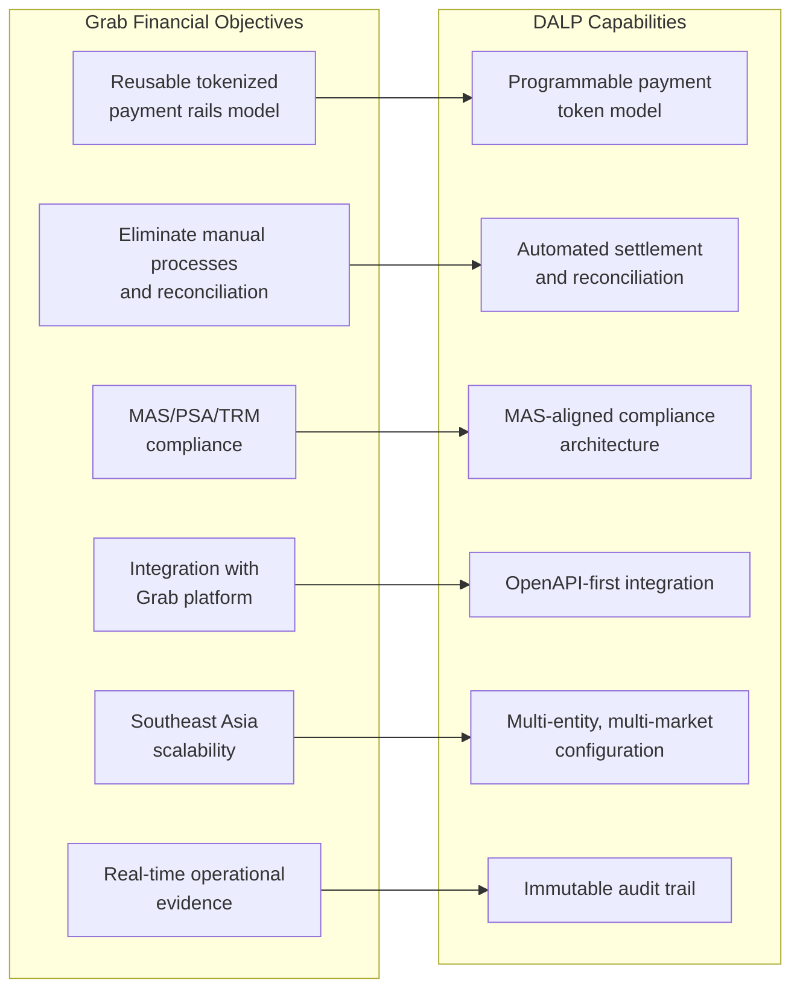
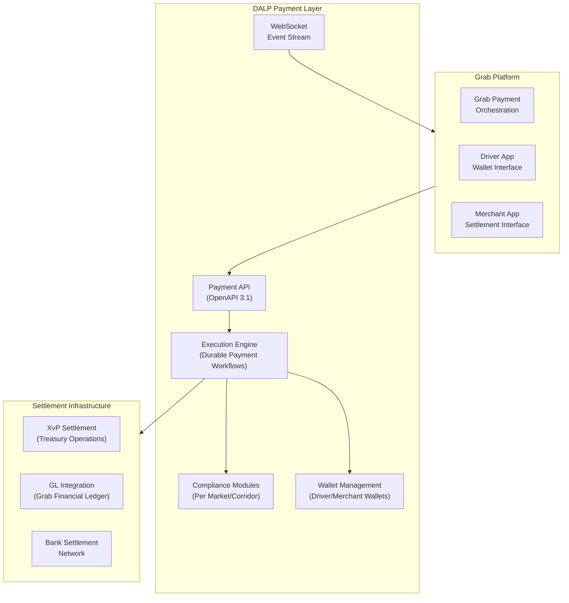
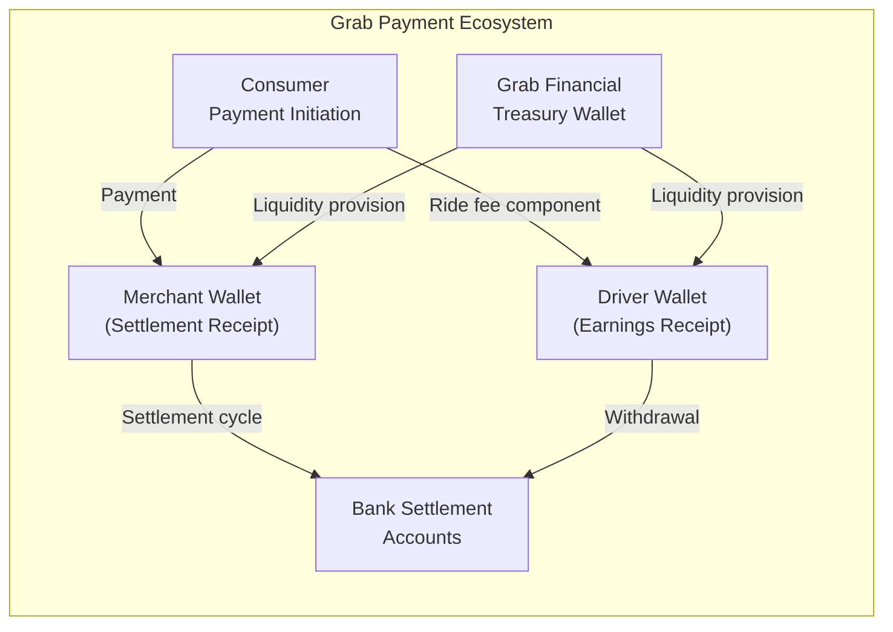
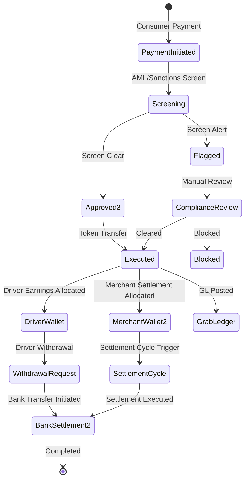
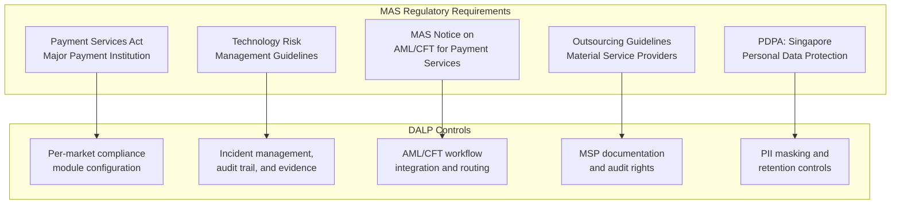
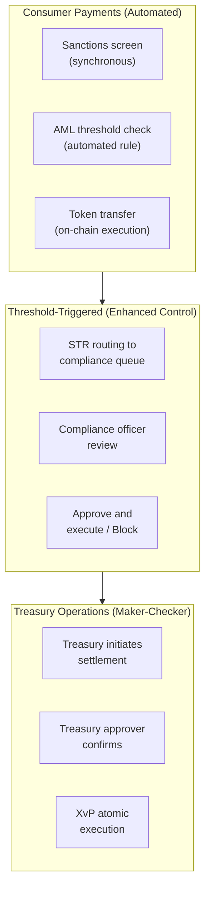
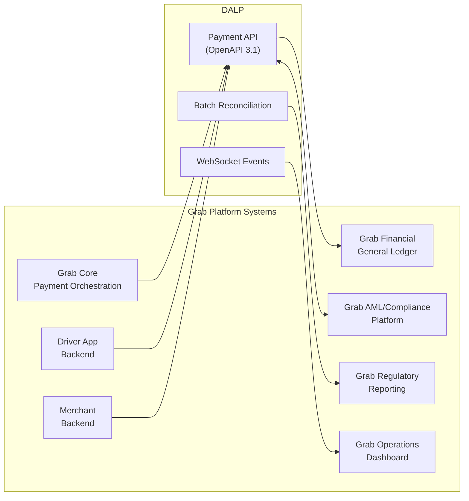
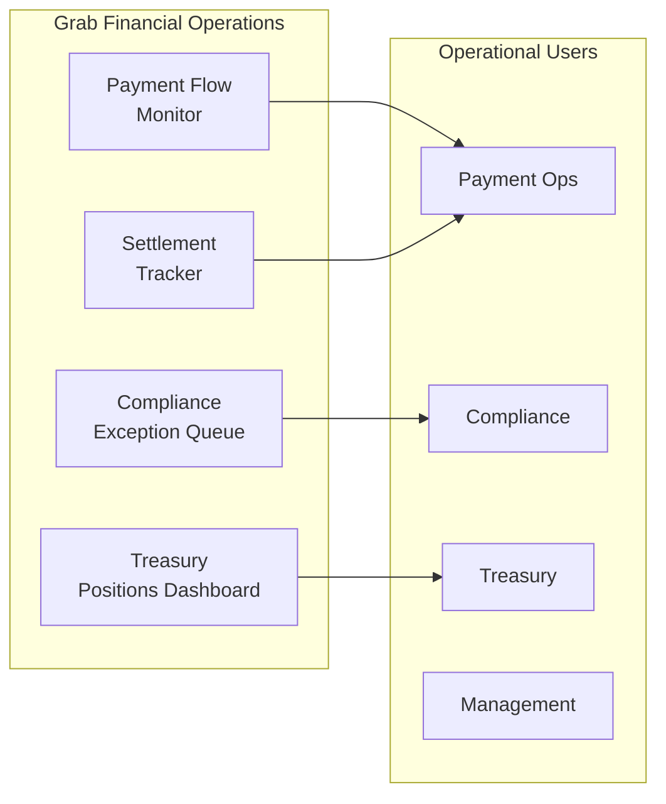
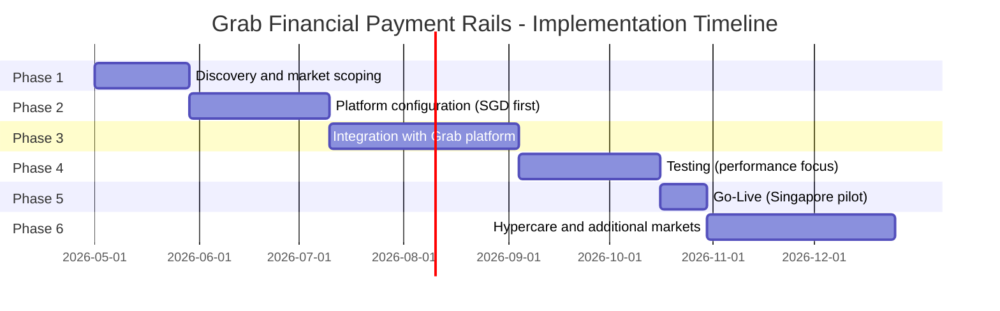

# Technical Proposal: Tokenized Payment Rails Platform

**Prepared for:** Grab Financial Group
**Reference:** GRAB-FINANCIAL-RFP-202603
**Date:** March 2026
**Version:** v1.0
**Classification:** Strictly Confidential. Invited Bidders Only
**Prepared by:** SettleMint NV

---

## Table of Contents

1. Executive Summary
2. Strategic Fit and Programme Context
3. Platform Architecture
4. Payment Rails Lifecycle
5. Compliance and Regulatory Framework
6. Security Architecture
7. Integration Architecture
8. Deployment Architecture
9. Operational Model
10. Implementation Plan
11. Testing Strategy
12. Reference Clients
13. Support and SLA Framework
14. Appendix: Technical Requirement Response Matrix

---

## 1. Executive Summary

### 1.1 Context and Strategic Drivers

Grab Financial operates at the intersection of consumer payments, financial services, and the Southeast Asian digital economy. The scale of Grab's payment infrastructure, which processes transactions across ride-hailing, food delivery, e-commerce, and financial services in multiple Southeast Asian markets, creates both opportunity and complexity for a tokenized payment rails programme.

The opportunity is in the treasury and settlement layer, where Grab Financial manages significant daily payment flows between merchants, drivers, and end consumers across multiple currencies and regulatory jurisdictions. Tokenized payment rails can reduce the friction, cost, and settlement risk in these flows. Atomic settlement eliminates the reconciliation burden between Grab's internal ledger and its bank settlement partners. Programmable compliance rules automate the AML/CFT checks that today require manual review queues.

The regulatory context is favourable and demanding simultaneously. Singapore's MAS has positioned itself as a leader in regulated digital payment infrastructure through the Payment Services Act, MAS Technology Risk Management Guidelines, and the Project Guardian programme. Grab Financial's MAS licensing obligations require that any tokenized payment infrastructure meets the same governance, security, and operational standards as traditional payment infrastructure. The distinction that regulators draw is not between traditional and tokenized; it is between controlled and uncontrolled.

### 1.2 Project Guardian Ecosystem Context

Project Guardian's ecosystem learnings are directly relevant to Grab Financial's programme architecture. The Guardian pilots demonstrated that tokenized financial instruments can operate within MAS's regulatory perimeter when the platform provides adequate controls over participant identity, transfer restrictions, and audit evidence. The lessons from those pilots inform DALP's compliance architecture: compliance is enforced at the token layer, not as an application-layer check that can be bypassed.

DALP does not claim participation in Project Guardian pilots. What DALP provides is a platform whose architecture is consistent with the design principles those pilots established.

### 1.3 Proposed Response

SettleMint proposes DALP as the technology foundation for Grab Financial's tokenized payment rails programme. DALP provides:

- **Payment token design:** Configurable stablecoin or deposit tokens representing regulated payment claims. Per-merchant, per-driver, or per-consumer wallet architecture depending on Grab Financial's programme design.
- **Programmable payment controls:** Transfer restrictions (spending limits, merchant category restrictions, geographic restrictions), velocity controls, AML/CFT workflow routing, and counterparty eligibility checks.
- **Settlement architecture:** Atomic settlement for merchant and partner payment flows. XvP extension for treasury operations requiring multi-currency settlement.
- **Integration model:** OpenAPI 3.1 interface designed for high-frequency, low-latency payment operations. Event streams for real-time payment monitoring. Batch interfaces for end-of-day reconciliation.
- **Deployment model:** Managed SaaS on AWS Singapore for the payment engine, with regional data residency for cross-border flows where required.
- **Compliance architecture:** Per-corridor compliance module configuration enforcing MAS PSA licensing obligations, AML/CTF Notice for Payment Services, and OFAC/UNSC sanctions screening.

---

## 2. Strategic Fit and Programme Context

### 2.1 Payment Rails Objective Mapping

**Figure 1: Grab Financial Objectives Mapped to DALP Capabilities**

---

## 3. Platform Architecture

### 3.1 Payment Rails Architecture

**Figure 2: DALP Payment Rails Architecture for Grab Financial**

### 3.2 Wallet Architecture for Grab's Participant Types

Grab Financial's participant ecosystem includes drivers, merchants, and end consumers, each with different wallet requirements:

- **Driver wallets:** Receive earnings in tokenized SGD (or local currency). Transfer restrictions enforce that driver earnings can only be withdrawn to a verified bank account or spent with eligible merchant partners. Velocity limits prevent unusual earning patterns that may signal fraud.
- **Merchant wallets:** Receive payment settlements from Grab's marketplace. Settlement occurs on a configurable cycle (daily, weekly, or real-time) per merchant agreement. Transfer controls enforce merchant category eligibility and settlement account verification.
- **Treasury wallets:** Grab Financial's treasury holds the liquidity that backs driver and merchant wallet balances. Treasury operations use XvP settlement for multi-currency treasury management across SEA markets.

**Figure 3: Grab Financial Payment Ecosystem Wallet Flows**

---

## 4. Payment Rails Lifecycle

### 4.1 Payment Token Design

For Grab Financial's payment rails, DALP configures stablecoin or deposit tokens denominated in local currencies (SGD, MYR, THB, PHP, IDR, VND). Each currency denomination is a separate DALPAsset configuration with:

- Currency denomination (native or configured via oracle feed)
- Compliance modules enforcing MAS PSA obligations for the SGD denomination, and equivalent local regulatory requirements for other currencies
- Transfer restrictions per wallet type (driver, merchant, treasury)
- Velocity controls per wallet (daily transaction limits, maximum balance)
- AML/CFT routing for transactions above configurable thresholds

### 4.2 Payment Settlement States

**Figure 4: Payment Rails Lifecycle States**

---

## 5. Compliance and Regulatory Framework

### 5.1 MAS Regulatory Framework for Payment Services

**Figure 5: MAS Regulatory Requirements for Grab Financial**

**MAS PSA Major Payment Institution:** Grab Financial holds a Major Payment Institution licence. The tokenized payment rails operate within the scope of Grab Financial's PSA licence. DALP enforces the payment service controls required under the PSA: counterparty due diligence, transaction monitoring, and suspicious transaction reporting routing.

**AML/CFT Notice for Payment Services:** DALP integrates with Grab Financial's AML/CFT screening and monitoring infrastructure. Payment flows above MAS-specified thresholds trigger automatic suspicious transaction report (STR) routing to Grab Financial's compliance function for review before STRO submission.

**Project Guardian alignment:** DALP's programmable transfer controls, supervisory audit access, and governance architecture align with the principles MAS has expressed through Project Guardian. The platform provides the control evidence and configuration transparency that MAS expects of tokenized payment infrastructure.

### 5.2 Multi-Market Compliance Architecture

For Grab Financial's cross-border operations in Malaysia, Thailand, the Philippines, Indonesia, and Vietnam:

| Market | Primary Regulator | DALP Compliance Module Configuration |
|--------|------------------|--------------------------------------|
| Singapore | MAS (PSA) | MAS AML/CFT modules; SGD transfer controls |
| Malaysia | BNM | BNM payment service regulations; MYR controls |
| Thailand | BOT | Thai payment regulations; THB controls |
| Philippines | BSP | E-money regulations; PHP controls |
| Indonesia | OJK | E-money and fintech regulations; IDR controls |

Each market operates with its own compliance module configuration within a single DALP instance, separated by legal entity and currency. Cross-market settlement flows route through Grab Financial's treasury wallet layer.

---

## 6. Security Architecture

### 6.1 High-Frequency Payment Security

Grab Financial processes high-frequency, relatively low-value transactions. The security model balances automation (no human approval for standard consumer transactions) with control (maker-checker for treasury operations, AML routing for threshold-triggered transactions).

**Figure 6: Three-Tier Authorization Model for Grab Financial Payment Rails**

### 6.2 Wallet Key Management

Driver and merchant wallets use a custodial key management model where Grab Financial manages the signing keys on behalf of participants. DALP's Key Guardian:

- Manages participant wallet keys within HSM or software key store
- Enforces per-wallet signing policies (consumer wallets: single-party; treasury wallets: multi-party)
- Provides key rotation without disruption to wallet operations
- Generates complete key operation audit trail

---

## 7. Integration Architecture

### 7.1 Grab Platform Integration Map

**Figure 7: Grab Financial Integration Architecture**

### 7.2 Real-Time Payment Integration

Grab Financial's consumer payment flows operate at high frequency and require low-latency API responses. DALP's API response targets for consumer payment operations:

- Payment initiation: <200ms for compliance evaluation and workflow initiation
- Token transfer execution: <2 seconds for on-chain confirmation
- Settlement confirmation event: Real-time via WebSocket

For treasury operations (less frequent, higher value), latency targets are relaxed: maker-checker approval may take minutes to hours depending on treasury approval workflows.

---

## 8. Deployment Architecture

### 8.1 Managed SaaS on AWS Singapore

Grab Financial's primary operations are based in Singapore. Managed SaaS on AWS Singapore provides:

- MAS data residency compliance for Singapore-market payment data
- Auto-scaling for Grab's variable payment volumes (high during meal and commute peaks)
- SettleMint-managed infrastructure with full observability transparency
- Regional data residency for cross-border market configurations through AWS regional separation

### 8.2 Multi-Market Data Residency

For markets with local data sovereignty requirements (Indonesia, Vietnam), DALP can deploy market-specific processing instances within local cloud regions. The architecture separates local transaction processing from cross-border treasury operations:

- Local market transactions processed within local AWS region
- Cross-border treasury operations processed in Singapore
- Aggregate reporting generated in Singapore with market-level aggregates available locally

---

## 9. Operational Model

### 9.1 Payment Operations Dashboard

**Figure 8: Grab Financial Operations Model**

### 9.2 24/7 Operations Requirements

Grab's payment platform operates continuously across multiple time zones. DALP's operational model for Grab Financial:

- 24/7 automated monitoring with SettleMint Enterprise Support
- Consumer payment issues trigger automated failover within 2 minutes
- Treasury operations issues trigger escalation to Grab's treasury on-call team
- Compliance exception queue monitored during Singapore business hours with on-call coverage for high-severity alerts outside business hours

---

## 10. Implementation Plan

### 10.1 Phased Implementation

**Figure 9: Grab Financial Implementation Timeline (approximately 34 weeks)**

| Phase | Duration | Gate Criteria |
|-------|----------|--------------|
| 1. Discovery | 4 weeks | Market priority; PSA compliance mapping confirmed |
| 2. Configuration | 6 weeks | SGD payment rails demonstrable in SIT |
| 3. Integration | 8 weeks | Grab platform integration passing tests (including high-frequency scenarios) |
| 4. Testing | 6 weeks | Peak volume performance validated; UAT signed off |
| 5. Go-Live | 2 weeks | Singapore pilot live with limited transaction scope |
| 6. Hypercare | 8 weeks | Singapore stabilised; additional markets onboarded |

---

## 11. Testing Strategy

### 11.1 High-Frequency Payment Test Scenarios

- **Peak volume simulation:** Simulate Grab's meal delivery peak (typically 12:00-13:00 and 18:00-20:00 local time) with 5x normal transaction rates. Validate sub-200ms API response and sub-2-second settlement confirmation.
- **Simultaneous consumer and treasury operations:** High-frequency consumer payment processing concurrent with treasury settlement operations. Validate no interference between consumer and treasury execution paths.
- **AML threshold trigger under high volume:** High volume day triggers large number of threshold-based AML reviews. Validate that the exception queue handles the load without blocking consumer payment processing.
- **Wallet freeze under live payments:** Apply compliance freeze to a driver or merchant wallet while payment operations are in progress. Validate that in-flight payments complete and new payments to/from the frozen wallet are blocked correctly.
- **Multi-market cross-currency settlement:** Treasury settlement operation spanning 3+ currencies. Validate XvP atomicity across all legs.

---

## 12. Reference Clients

| Client | Region | Use Case | Outcome |
|--------|--------|----------|---------|
| DBS Bank | Singapore | Tokenized deposits and payment rails, MAS regulated | Production, T+0 settlement |
| OCBC Bank | Singapore | Tokenized wealth and payment products | MAS compliant, production |
| M-Pesa Safaricom | Kenya | Digital asset mobile payment overlays | High-volume consumer payment production |
| OPay | Nigeria | Tokenized payment infrastructure for wallet ecosystem | Consumer wallet production |
| Flutterwave | Pan-Africa | Cross-border payment settlement orchestration | Multi-currency production |
| Chipper Cash | Pan-Africa | Consumer cross-border payment rails | Production |

---

## 13. Support and SLA Framework

| Dimension | Commitment |
|-----------|-----------|
| Coverage | 24/7 |
| P1 response | 15 minutes |
| P2 response | 30 minutes (during Grab peak hours); 1 hour (other times) |
| Monthly uptime | 99.95% (consumer payment infrastructure) |
| Maintenance | Weekend low-traffic windows; 7 days notice |

## 14. Technical Requirement Response Matrix

| Req ID | Status | Notes |
|--------|--------|-------|
| TR-01 | 🟢 Supported | Full payment rails lifecycle including merchant settlement and driver earnings |
| TR-02 | 🟢 Supported | Consumer: automated; Treasury: maker-checker; High-value: enhanced controls |
| TR-03 | 🟢 Supported | OpenAPI 3.1, low-latency endpoints, idempotent |
| TR-04 | 🟢 Supported | MAS PSA/TRM/AML Notice compliant |
| TR-05 | 🟡 Supported with Third-Party Dependency | KYC via Grab Financial's existing KYC platform |
| TR-06 | 🟢 Supported | Key Guardian with custodial wallet key management |
| TR-07 | 🟢 Supported | Real-time reconciliation; end-of-day batch |
| TR-08 | 🟢 Supported | Payment ops, compliance, and treasury dashboards |
| TR-09 | 🟢 Supported | Managed SaaS primary; multi-region for data sovereignty |
| TR-10 | 🟢 Supported | DBS, OCBC, M-Pesa, OPay, Flutterwave, Chipper Cash |
| TR-11 | 🟢 Supported | Per-wallet, per-market compliance modules |
| TR-12 | 🟢 Supported | Peak volume, AML load, concurrent operations tests |
| TR-13 | 🟢 Supported | OpenAPI-first; designed for Grab's integration model |
| TR-14 | 🟢 Supported | Per-market configuration without code changes |
| TR-15 | 🟢 Supported | Append-only audit trail; PDPA-compliant retention |
| TR-16 | 🟢 Supported | All dependencies disclosed; MSP documentation |
| TR-17 | 🟢 Supported | 99.95% SLA; auto-scaling for volume peaks |
| TR-18 | 🟢 Supported | Platform-based; no per-transaction fees |
| TR-19 | 🟢 Supported | SettleMint-managed releases; coordinated update windows |
| TR-20 | 🟡 Roadmap separated | Live vs. roadmap clearly distinguished |
