# Technical Proposal: Tokenized Payment Rails Platform

**Document Title:** Technical Proposal. Tokenized Payment Rails  
**Client:** Grab Financial  
**Date:** 20 March 2026  
**Version:** 1.0 (Draft)  
**Prepared by:** SettleMint  
**Classification:** Confidential. Grab Financial Evaluation Only  
**Reference:** GRAB-FINANCIAL-RFP-202603  

---

## Table of Contents

1. Executive Summary
2. Strategic and Use-Case Fit
3. Solution Overview
4. Platform Architecture
5. Tokenized Payment Rails. Lifecycle and Flows
6. Compliance and Regulatory Framework (MAS, PSA, TRM)
7. Security Architecture
8. Integration Architecture
9. Deployment and Infrastructure
10. Operational Model
11. Implementation Methodology
12. Testing and Quality Assurance
13. References and Evidence
14. Requirements Response Matrix
15. RAID Register
16. Assumptions and Dependencies

---

## 1. Executive Summary

Grab Financial operates at the intersection of consumer payments, merchant settlement, and financial services in Southeast Asia, one of the most complex and diverse payment regulatory environments in the world. The shift toward tokenized payment rails is not an abstract ambition for Grab Financial; it is the next logical evolution of a platform that already manages multi-party settlement, wallet balances, merchant payouts, and lending across multiple regulated jurisdictions. The question facing the procurement committee is which platform can support that evolution with the institutional controls that MAS, Grab Financial's risk function, internal audit, and legal will require from day one.

DALP (Digital Asset Lifecycle Platform), developed by SettleMint, is a production-deployed regulated digital asset platform that manages the complete lifecycle of tokenized instruments under institutional compliance conditions. Across comparable deployments, including regulated commercial banks, market infrastructure providers, and high-scale fintechs in Asia-Pacific and Europe. DALP has delivered controlled tokenized payment and settlement infrastructure with measurable outcomes: deterministic settlement finality in under three seconds on EVM networks, zero-gap compliance enforcement at the smart contract level that cannot be overridden by application logic, and API-first architecture that integrates into existing enterprise infrastructure including wallet systems, merchant settlement engines, and regulatory reporting stacks.

This proposal responds directly to Grab Financial's stated objectives for a production-ready tokenized payment rails programme in Singapore, with alignment to Project Guardian-adjacent ecosystem learnings. SettleMint maps every requirement to current platform capability with explicit delivery boundaries. Where integration is needed, the pattern is described. Where a capability is configuration-dependent, the configuration surface is identified. Where a requirement involves the roadmap, it is labeled as such.

The recommended approach deploys DALP in Grab Financial's Singapore cloud infrastructure using a private cloud configuration, integrating with the existing GrabPay wallet engine, merchant settlement system, KYC platform, AML/CFT screening engine, and observability stack through DALP's OpenAPI 3.1 interface layer. Implementation follows a 19-week phased methodology. Platform licensing runs at EUR 420,000 per year across production and development environments, with implementation services scoped following the discovery phase.

The result is a tokenized payment rail that Grab Financial's operations team can run, its compliance function can govern without engineering dependency, its audit function can evidence for MAS and internal review, and its technology organization can extend to new corridors and product variants through configuration rather than code.

---

## 2. Strategic and Use-Case Fit

### 2.1 Understanding the Grab Financial Context

Grab Financial's procurement context reflects three converging realities that SettleMint recognizes from comparable deployments. First, Project Guardian-adjacent ecosystem learnings have raised the bar for what a tokenized payment rail must demonstrate: not just transaction execution, but governance structures, cross-institutional settlement semantics, and evidentiary audit capability at the standard MAS would expect for a systemic participant. Second, Grab Financial's multi-sided platform, serving consumers, merchants, and lending customers simultaneously, means that a tokenized payment infrastructure must support multiple instrument types, multiple participant categories, and multiple settlement flows within a single coherent control environment. Third, Grab Financial's internal governance is institutionally intensive: legal, compliance, risk, cyber, and technology leadership will all evaluate this platform, and a response that satisfies only the technical evaluator will not survive committee scoring.

DALP was designed for exactly this kind of multi-dimensional governance environment. The platform enforces access controls, approval workflows, and compliance rules at both the off-chain API layer and the on-chain smart contract layer, independently. Compliance officers can configure and enforce transfer rules without engineering involvement. Operations teams can process approvals, monitor queues, and manage exceptions through a dedicated console. Audit functions can export structured evidence covering every transaction, approval, configuration change, and administrative action in a format reviewable without specialist tooling.

### 2.2 Alignment to Grab Financial's Strategic Objectives

| Grab Financial Objective | DALP Response |
|---|---|
| Controlled, reusable tokenized payment rails operating model | Configuration-driven architecture: new payment corridors, merchant types, and wallet product variants activate through parameter configuration, not code changes |
| Reduce manual reconciliation and email-based approval processes | Workflow orchestration with maker-checker chains, durable execution, and automated event-driven reconciliation output |
| MAS, PSA, TRM Guidelines regulatory readiness | Pre-built compliance modules for identity verification, transfer restrictions, country controls, and participant eligibility; dual-layer permission model; immutable audit trail |
| Secure enterprise integration | OpenAPI 3.1 interface covering 100% of platform operations; event streaming for real-time settlement updates; TypeScript SDK for backend integration |
| Reference architecture extensible to additional products and legal entities | Multi-entity configuration: each new wallet product type or merchant category is a configuration change to an existing DALPAsset contract, not a new system deployment |
| Operational transparency for first-line, second-line, and audit | Grafana-based observability with settlement metrics, compliance alert queues, and structured audit export for MAS and internal review |
| Participation in Project Guardian-adjacent ecosystem | ERC-3643 standard token architecture, ISO 20022-aligned data structures, and bring-your-own-chain flexibility support compatibility with Project Guardian settlement infrastructure |

### 2.3 Project Guardian Alignment

Project Guardian has established the design principles that MAS expects from institutional tokenized payment programmes: programmable compliance, atomic settlement, transparent governance, and cross-institutional interoperability. DALP's architecture reflects all four:

- **Programmable compliance:** ERC-3643 compliance modules enforce transfer rules at the smart contract level; rules are institution-configurable, not hardcoded.
- **Atomic settlement:** The XvP addon delivers Delivery-versus-Payment settlement finality in a single atomic transaction; both legs settle or both revert.
- **Transparent governance:** Every configuration change, approval decision, and administrative action generates an immutable on-chain or off-chain audit record.
- **Cross-institutional interoperability:** The open API surface and standard token interfaces enable integration with other Project Guardian participants using compatible infrastructure.

---

## 3. Solution Overview

### 3.1 DALP in the Grab Financial Context

```mermaid
%%{init: {'theme': 'base', 'themeVariables': { 'primaryColor': '#E8EAF6', 'primaryTextColor': '#000099', 'primaryBorderColor': '#000099', 'lineColor': '#000099', 'secondaryColor': '#FFF3E0', 'tertiaryColor': '#E8F5E9', 'background': '#FFFFFF' }}}%%
graph TB
    subgraph GF["Grab Financial Enterprise Layer"]
        W[GrabPay Wallet Engine]
        MS[Merchant Settlement System]
        KYC[KYC/KYB Platform]
        AML[AML/CFT Screening]
        GL[Finance Ledger / ERP]
        OBS[Observability Stack]
        IAM[Identity Provider]
    end
    subgraph DALP["DALP. Digital Asset Lifecycle Platform"]
        UI[Asset Console. Operations UI]
        API[Unified API. OpenAPI 3.1]
        WF[Workflow Orchestration. Restate Durable Execution]
        COMP[Compliance Engine. ERC-3643 Modules]
        ID[Identity Registry. OnchainID]
        KG[Key Guardian. HSM / Custody Interface]
        SC[Smart Contracts. DALPAsset, XvP, Vault]
        IDX[Chain Indexer. Event Store]
        GR[Observability. Grafana Stack]
    end
    subgraph NET["Settlement Network"]
        BC[EVM-Compatible Chain]
        CUS[Custody Provider. DFNS / Fireblocks]
    end
    W --> API
    MS --> API
    KYC --> ID
    AML --> WF
    GL <-- IDX
    OBS <-- GR
    IAM --> API
    UI --> API
    API --> WF
    WF --> COMP
    WF --> ID
    WF --> KG
    WF --> SC
    SC --> BC
    KG --> CUS
    IDX --> GL
    GR --> OBS
```

DALP sits between Grab Financial's existing payment infrastructure and the tokenized settlement layer. It governs settlement while existing systems, wallet engine, merchant settlement, KYC, AML, retain their current roles and connect via standard API integration patterns.

### 3.2 Core Capabilities for Tokenized Payment Rails

**Tokenized E-Money and Payment Instruments.** DALP's StableCoin and Deposit asset types support the issuance, transfer, and redemption lifecycle of tokenized e-money instruments used within GrabPay's wallet and merchant settlement ecosystem. For Grab Financial's PSA licensed payment activity, this means programmable settlement media with compliance rules enforced at the token level.

**Merchant Settlement Flow.** DALP supports the tokenized settlement of merchant payment obligations. A settlement instruction submitted by the merchant settlement system flows through the DAPI, is validated against the merchant's identity claims and compliance profile, executes via the Execution Engine, and settles on-chain with atomic finality. The settlement event triggers an indexed record for reconciliation against the finance ledger.

**Atomic Delivery-versus-Payment.** For multi-party settlement scenarios, including fund transfers between participant wallets and merchant settlement with simultaneous value exchange, the XvP Settlement addon executes both legs of a settlement atomically. Both transfer or both revert. This eliminates principal risk in multi-party settlement chains.

**Participant Onboarding and KYC Integration.** The OnchainID identity framework manages participant onboarding. Each GrabPay participant, consumer wallet, merchant, or lending counterparty, receives an on-chain identity with verifiable claims issued by Grab Financial's KYC platform. Transfer eligibility is enforced on-chain against these claims for every transaction, providing a cryptographically auditable eligibility trail.

**Multi-Product, Multi-Entity Architecture.** A single DALP deployment supports multiple payment instrument types (GrabPay consumer wallet balance, GrabPay merchant settlement token, GrabLend credit facility token) and multiple legal entities within the Grab group. Each instrument and entity has independent compliance configurations. Adding a new product variant requires configuration, not a new deployment.

---

## 4. Platform Architecture

### 4.1 Four-Layer Stack

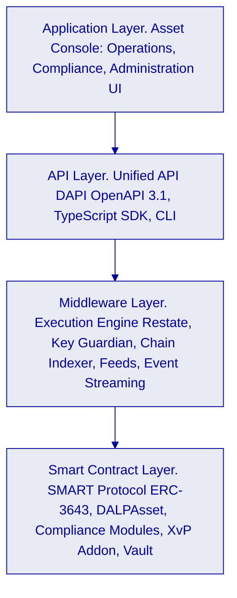

**Application Layer.** The Asset Console provides role-gated web interfaces for operations (settlement processing, queue management), compliance (AML case review, eligibility management), and administration (participant onboarding, role management, configuration changes). Role assignments enforce segregation of duties; no user can both initiate and approve a settlement instruction.

**API Layer.** DAPI exposes 100% of platform operations through a single OpenAPI 3.1 surface. Grab Financial's wallet engine, merchant settlement system, and other enterprise systems integrate through this layer using scoped API keys. The oRPC contract framework provides type-safe request validation, structured error responses with 534 auto-generated contract error codes, and automatically synchronized OpenAPI documentation.

**Middleware Layer.** The Execution Engine orchestrates multi-step settlement workflows as durable, resumable processes via Restate. Failed workflow steps resume from the last successful checkpoint without creating orphaned or inconsistent state. The Key Guardian manages signing key lifecycles and delegates signing operations to the configured custody provider. The Chain Indexer transforms on-chain events into structured query-accessible records available within seconds of on-chain confirmation.

**Smart Contract Layer.** All payment rail logic executes on ERC-3643-compliant DALPAsset contracts deployed via the factory pattern. Compliance modules enforce transfer eligibility at the smart contract level: identity verification, country restrictions, transfer limits, and approval requirements are evaluated on-chain before every token transfer. The XvP Settlement addon enables atomic multi-party exchange.

### 4.2 Multi-Product, Multi-Entity Architecture

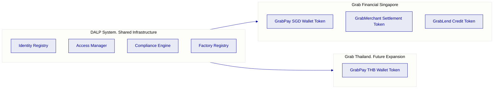

Each product instrument operates with its own compliance configuration, approval workflows, and participant eligibility rules. Adding a new market or product requires a new DALPAsset token configuration, not a new deployment or code change to the existing system.

### 4.3 Smart Contract Layer: Five On-Chain Layers

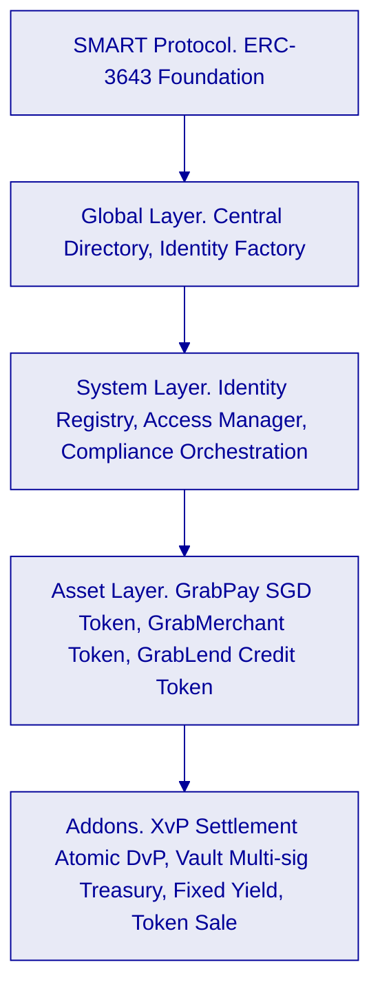

The fail-closed compliance design means that any transfer rejected by any compliance module is blocked permanently. Compliance officers configure module rules; engineers do not need to be involved in day-to-day compliance enforcement changes.

---

## 5. Tokenized Payment Rails: Lifecycle and Flows

### 5.1 Payment Token Lifecycle

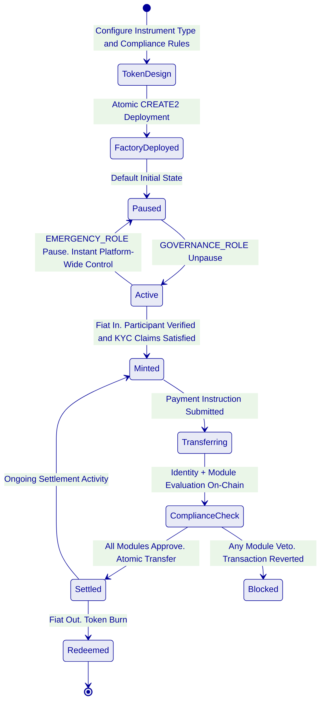

**Fiat In. Token Issuance.** When a GrabPay user loads funds, the wallet engine notifies DALP via the `token.mint` API endpoint. DALP verifies the recipient's identity claims (issued by Grab Financial's KYC platform), evaluates compliance modules (participant eligibility, jurisdiction check), and mints the corresponding tokenized wallet balance to the participant's on-chain identity. The mint event is indexed and available for GL reconciliation within seconds.

**Payment Settlement.** A payment instruction from the wallet engine is submitted via `token.transfer`. The transfer passes through identity verification (sender and receiver on-chain claims), compliance module evaluation (transfer limit check, jurisdiction eligibility, address block list check), and if all pass, executes on-chain with atomic finality. The full compliance evaluation result is logged and available in the audit trail.

**Merchant Settlement.** Merchant payouts flow through a parallel settlement token (GrabMerchant Settlement Token) with compliance configuration appropriate for merchant participants. Atomic settlement between the consumer payment token and the merchant settlement token uses the XvP addon: both legs transfer simultaneously or both revert.

**Fiat Out. Token Redemption.** When a participant withdraws funds, the wallet engine submits a `token.burn` instruction. DALP verifies the participant's identity and compliance status, executes the redemption, and returns settlement confirmation to the wallet engine for downstream processing. The redemption event is indexed and logged.

### 5.2 Maker-Checker Settlement Flow

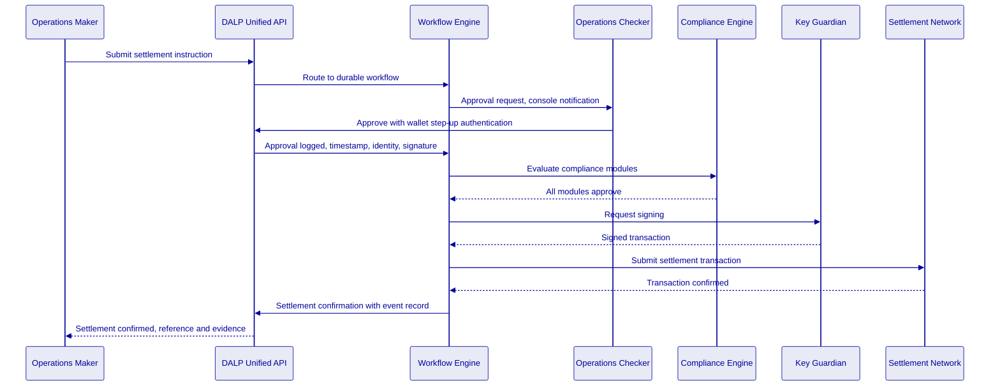

Every step in this flow generates a structured log record. The approval record includes the approver's user identity, the timestamp of approval, the wallet verification method used, and the transaction details at the time of approval. This constitutes the evidential approval trail that MAS, internal audit, and the risk committee require.

### 5.3 Reconciliation Architecture

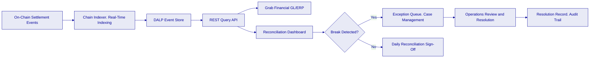

The Chain Indexer transforms on-chain settlement events into structured records accessible via the REST API within seconds of on-chain confirmation. Each record includes transaction hash, block number, timestamp, token amount, sender and receiver identity references, compliance evaluation result, and approval chain reference. This provides a deterministic basis for GL reconciliation without manual data assembly.

### 5.4 Atomic Multi-Party Settlement (XvP)

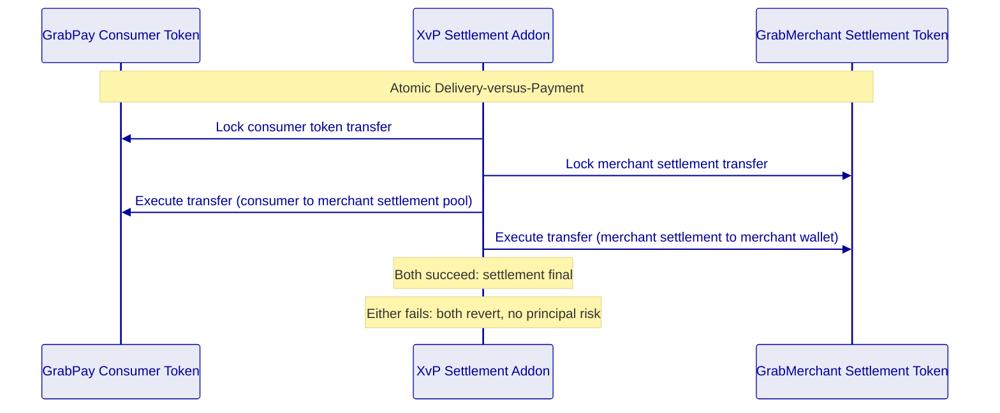

---

## 6. Compliance and Regulatory Framework

### 6.1 MAS, PSA, and TRM Guidelines Alignment

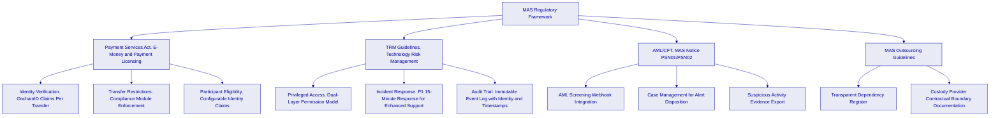

**Payment Services Act.** Grab Financial holds an MAS license under the PSA. DALP's compliance module architecture enforces PSA-relevant controls at the token level: only identity-verified participants can hold and transfer tokenized payment instruments; transfer restrictions (daily limits, counterparty whitelists, jurisdiction controls) are enforced on-chain and cannot be bypassed by application-layer logic. Eligibility rules are configurable by compliance officers without engineering intervention.

**Technology Risk Management Guidelines.** TRM requires financial institutions to implement privileged access management, incident response capability, and audit evidence for all critical system operations. DALP satisfies these requirements through: (1) dual-layer permission model requiring both authenticated session and wallet-level step-up for all blockchain writes; (2) defined incident escalation with P1 15-minute response under Enhanced Support; (3) immutable audit trail covering every transaction, approval, configuration change, and administrative action, with cryptographic linkage to the initiating user identity.

**AML/CFT Requirements.** DALP provides the integration surface for Grab Financial's existing AML/CFT screening engine. The screening webhook receives transaction details before on-chain submission; the screening decision (approve, hold, reject) routes the transaction accordingly. Held transactions enter the case management queue for compliance officer review and disposition. Every decision, including the reviewer identity and the disposition reasoning for manual reviews, is logged.

**MAS Outsourcing Guidelines.** SettleMint's dependency model is transparent and fully documented: platform software operated by SettleMint, key management delegated to the configured custody provider under a direct contractual relationship with Grab Financial, blockchain infrastructure on the configured network. No undisclosed managed services or opaque operational dependencies exist within the DALP boundary.

### 6.2 Compliance Module Configuration for GrabPay

| Module | Configuration for GrabPay | Enforcement Point |
|---|---|---|
| Identity Verification | Requires verified OnchainID with KYC claim from Grab Financial's approved issuers | On-chain, per transfer |
| Country Allow List | Restricts transfers to MAS-approved jurisdictions for PSA compliance | On-chain, per transfer |
| Address Block List | Enforces sanctions screening outcomes from AML engine | On-chain, per transfer |
| Transfer Approval | Mandatory for high-value transactions above configurable SGD threshold | On-chain, per transfer |
| Investor Count Limit | Caps participant count for specific regulated instrument types | On-chain, supply level |
| Time Lock | Enforces minimum holding periods for applicable payment instruments | On-chain, per transfer |

Compliance module configuration changes require GOVERNANCE_ROLE authorization. The configuration change itself, including the updated parameters and the approving administrator's identity, is logged in the audit trail. Changes take effect immediately for subsequent transactions.

### 6.3 Compliance Officer Control Surface

Compliance officers have a dedicated operational interface that does not require engineering involvement:

| Action | Access Level | Audit Record Generated |
|---|---|---|
| Review AML case queue | COMPLIANCE_OFFICER role | Access event logged |
| Approve or reject pending transaction | COMPLIANCE_OFFICER role | Decision with timestamp and identity |
| Freeze a participant account | COMPLIANCE_OFFICER via custodian interface | Freeze event with reason |
| Emergency pause of instrument | EMERGENCY_ROLE | Pause event with timestamp and identity |
| Export audit evidence for MAS review | COMPLIANCE_OFFICER role | Export event logged |
| Update compliance module parameters | GOVERNANCE_ROLE (elevated) | Configuration change with full parameter history |

---

## 7. Security Architecture

### 7.1 Five-Layer Defense-in-Depth

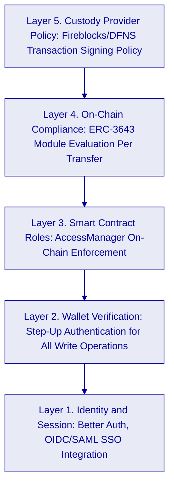

All five layers must pass for a blockchain write operation to execute. Layer failure at any level blocks the operation. No single-layer compromise results in unauthorized asset movement.

### 7.2 Authentication Architecture

**Operator Authentication.** Grab Financial operators authenticate via OIDC or SAML 2.0 integration with Grab's corporate identity provider (Okta, Azure AD, or equivalent). Session management uses HTTP-only session cookies with 7-day expiry and 24-hour refresh. Sessions bind to user identity and active organization for complete audit trail association.

**Wallet Verification (Step-Up).** All blockchain write operations require a second factor beyond the authenticated session: 6-digit PIN, TOTP via authenticator app (RFC 6238), WebAuthn passkey, or backup recovery codes. If wallet verification fails, the operation is rejected immediately. No gas is consumed. No administrative override exists for wallet verification; recovery requires backup codes or credential re-enrollment.

**Machine-to-Machine Authentication.** Grab Financial's backend systems (wallet engine, merchant settlement system) authenticate using scoped API keys. Each key is hashed at rest and shown once in cleartext at creation. Keys carry HTTP-method-based scope enforcement: read-only keys for monitoring integrations, read-write keys for settlement-submitting systems. Rate limiting applies at 10,000 requests per 60-second window per key.

### 7.3 Key Management and Custody Integration

DALP's Key Guardian manages signing key lifecycles and integrates with institutional custody providers. For Grab Financial:

- **Fireblocks or DFNS integration:** Private signing keys never exist in plaintext within the DALP application layer. The Key Guardian delegates all signing operations to the custody provider, which evaluates its own transaction policy rules as an independent control layer.
- **HSM integration:** For on-premises or hybrid deployment configurations, the Key Guardian supports direct HSM integration (PKCS#11 or cloud-native KMS). This option is available for Grab Financial deployments with specific regulatory requirements for key residency within Singapore infrastructure.
- **Break-glass procedures:** Emergency signing access requires EMERGENCY_ROLE from a pre-defined named administrator list. Emergency access events are logged immediately, trigger automated alerts to the security team, and require documented post-incident review.
- **Key rotation:** Rotation workflows execute without platform downtime. Rotation events are logged in the audit trail with timestamp, initiating administrator identity, and new key reference.

### 7.4 Certifications

SettleMint holds ISO 27001 and SOC 2 Type II certifications, independently audited and continuously maintained. Certification evidence is available to Grab Financial's security and compliance team under NDA for MAS outsourcing review and internal audit purposes.

Annual penetration testing covers the DALP application layer and API surface. Smart contract security audits are conducted for new contract deployments. Testing evidence including scope, findings, and remediation records is available under NDA.

---

## 8. Integration Architecture

### 8.1 Enterprise Integration Map

```mermaid
%%{init: {'theme': 'base', 'themeVariables': { 'primaryColor': '#E8EAF6', 'primaryTextColor': '#000099', 'primaryBorderColor': '#000099', 'lineColor': '#000099', 'background': '#FFFFFF' }}}%%
graph LR
    subgraph GFSystems["Grab Financial Enterprise Systems"]
        WE[GrabPay Wallet Engine]
        MS[Merchant Settlement System]
        KYC2[KYC Platform]
        AMLE[AML/CFT Engine]
        FIN[Finance Ledger / ERP]
        MON[Monitoring Stack]
        IDPV[Corporate Identity Provider]
    end
    subgraph DALPLayer["DALP Integration Layer"]
        APIG[Unified API. OpenAPI 3.1]
        EVTS[Event Stream. Server-Sent Events]
        WBHK[AML Webhook Receiver]
        FEED[Feeds System]
    end
    WE -->|POST token.transfer, token.mint, token.burn| APIG
    MS -->|POST addons.xvp.create| APIG
    KYC2 -->|Claim issuance via system.identity.register| APIG
    AMLE -->|Webhook response, approve/hold/reject| WBHK
    FIN <--|Settlement event stream| EVTS
    MON <--|Prometheus metrics, logs, traces| DALPLayer
    IDPV -->|OIDC/SAML SSO for operator authentication| APIG
```

**GrabPay Wallet Engine Integration.** The wallet engine submits mint, transfer, and burn instructions via DAPI REST endpoints. All responses are structured JSON with transaction hash, settlement status, and compliance evaluation result. Idempotency keys prevent duplicate settlements from retry logic. The SDK provides native TypeScript client generation with automatic retry and error handling.

**Merchant Settlement System Integration.** Merchant payout instructions are submitted via `addons.xvp.create` for atomic two-sided settlement. The XvP addon handles simultaneous consumer token transfer and merchant settlement token distribution. Settlement confirmation events are available via the event stream for real-time GL posting.

**KYC Platform Integration.** Grab Financial's KYC platform acts as a trusted claim issuer in the OnchainID identity framework. When a participant completes KYC, the KYC platform calls `system.identity.register` and issues the appropriate identity claims. Claim revocation is immediate: a revocation call removes the claim, and subsequent transfers by the participant are blocked by the identity verification compliance module.

**AML/CFT Screening Integration.** The AML engine receives transaction details via webhook before on-chain submission. The integration pattern:
1. DALP Execution Engine prepares transaction for submission.
2. AML webhook is called with transaction parameters.
3. AML engine performs screening and returns decision within configured timeout.
4. Approve: transaction proceeds to compliance module evaluation.
5. Hold: transaction enters the case management queue.
6. Reject: transaction is blocked; event logged with screening reference.
7. Timeout: configurable fallback policy (default: hold for manual review).

**Finance Ledger Integration.** The Chain Indexer emits structured settlement events via SSE and REST query endpoints. Each event includes token type, amount, counterparties, timestamp, approval reference, and compliance evaluation result. The GL integration layer consumes these events for automated ledger posting. Manual reconciliation is limited to break resolution only.

### 8.2 API Authentication Model

| Integration | Authentication | Scope | Notes |
|---|---|---|---|
| Wallet engine (read-write) | API key with read-write scope | `token.*` procedures | Settlement submissions |
| Merchant settlement (read-write) | API key with read-write scope | `addons.xvp.*`, `token.*` | Merchant payout submissions |
| KYC platform (identity) | API key with identity scope | `system.identity.*` | Claim issuance only |
| AML engine (webhook) | HMAC-SHA256 signed webhook | Screening decision endpoint | Inbound webhook from AML engine |
| Finance ledger (read-only) | API key with read-only scope | `transaction.*`, `token.*` GET | Settlement event consumption |
| Monitoring stack (read-only) | API key with read-only scope | `monitoring.*` | Metrics, logs, health status |
| Operator UI (browser) | OIDC/SAML SSO + wallet step-up | Role-gated by DALP access model | Human operator access |

### 8.3 Protocol and Standards

- **REST/HTTP with JSON:** Primary protocol for all synchronous integration. OpenAPI 3.1 specification importable into Postman, API gateway, or code generation tooling.
- **Server-Sent Events:** Real-time settlement event streaming for downstream GL and reporting integration.
- **ISO 20022 alignment:** Settlement instruction and confirmation data structures align with ISO 20022 field semantics, supporting downstream processing in ISO 20022-native finance systems.
- **TypeScript SDK:** `@settlemint/dalp-sdk` provides type-safe client libraries for Node.js backend integration with built-in retry logic, idempotency key management, and structured error handling.
- **Webhook:** Outbound for AML screening; configurable for operational alerts, compliance events, and settlement confirmations.

### 8.4 Environment Promotion Controls

| Control | Development | Staging | Production |
|---|---|---|---|
| Configuration versioning | Git-based configuration management | Identical to development | Release-tagged configuration |
| Secrets management | Kubernetes secrets; no production keys | Rotated per-environment secrets | HSM or KMS-backed secrets |
| Data masking | No production data in development | Masked test data sets | Full production data; access logged |
| Regression testing | Automated on commit | Automated on promotion | Manual gate review required |
| Compliance module changes | Developer approval | Compliance approval required | GOVERNANCE_ROLE + audit record |
| Rollback | Immediate | Tested rollback procedure | Documented rollback with go/no-go criteria |

---

## 9. Deployment and Infrastructure

### 9.1 Recommended Deployment Model

For Grab Financial's Singapore programme, SettleMint recommends a **Private Cloud** deployment within Grab Financial's existing Singapore cloud environment. This recommendation reflects MAS TRM Guidelines requirements for institutional control over critical payment infrastructure, PSA licensing context requiring Singapore data residency, and Grab Financial's existing Kubernetes platform capabilities.

### 9.2 Deployment Architecture

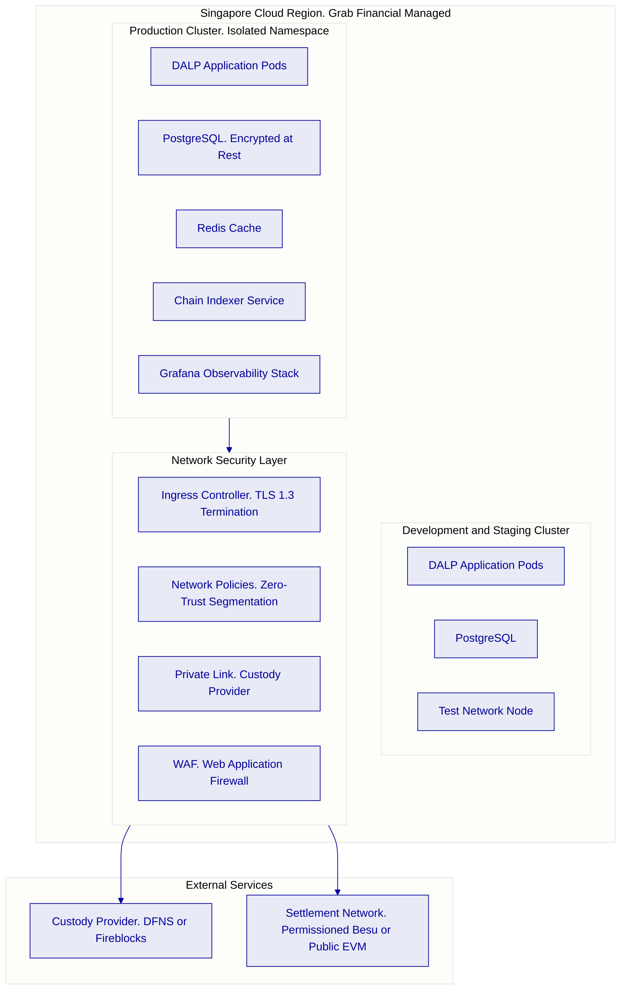

**Environment Separation.** Production and development environments run in isolated Kubernetes namespaces with independent database instances, secrets stores, network policies, and access controls. No shared credentials or configuration exist between environments.

**Data Residency.** All DALP data, token state, transaction records, identity data, audit logs, resides within Grab Financial's Singapore cloud region. No data leaves the configured boundary. Custody provider integration uses private link connectivity within the Singapore cloud region where the provider supports it.

**High Availability.** Production deployment: active-active clustering with automated pod failover. RTO: less than 4 hours for full platform recovery from catastrophic failure. RPO: less than 1 minute for transactional data through synchronous database replication. Custody provider health monitoring generates automatic alerts if signing connectivity degrades.

### 9.3 Blockchain Network Selection

| Network Option | Characteristics | Recommendation |
|---|---|---|
| Permissioned Hyperledger Besu | Grab Financial-controlled validators, deterministic finality, private transaction support, configurable parameters | Recommended for initial production deployment with full institutional control |
| Public EVM (Polygon or Ethereum) | Decentralized validation, public verifiability, Project Guardian ecosystem compatibility | Recommended for multi-institutional settlement scenarios requiring Project Guardian interoperability |
| Hybrid | Permissioned Besu for internal settlement; bridge to public chain for external settlement | Available for phased expansion; configurable within DALP's chain abstraction layer |

The initial deployment recommendation is a permissioned Hyperledger Besu network within Grab Financial's infrastructure, providing complete control over validator membership, transaction ordering, and gas policy, with the option to integrate with Project Guardian settlement infrastructure in a subsequent phase through DALP's cross-chain capabilities.

---

## 10. Operational Model

### 10.1 Business-As-Usual Run State

```mermaid
%%{init: {'theme': 'base', 'themeVariables': { 'primaryColor': '#E8EAF6', 'primaryTextColor': '#000099', 'primaryBorderColor': '#000099', 'lineColor': '#000099', 'background': '#FFFFFF' }}}%%
graph LR
    subgraph F1["First Line. Payment Operations"]
        FO1[Settlement Processing. Queue Management and Approval]
        FO2[Participant Support. Onboarding Issues, Eligibility Queries]
        FO3[Reconciliation. Daily GL Sign-Off, Break Resolution]
    end
    subgraph F2["Second Line. Risk and Compliance"]
        F2A[AML Case Review. Alert Disposition and Evidence]
        F2B[Compliance Monitoring. Module Configuration, Eligibility Review]
        F2C[Risk Reporting. KRI Dashboards, MAS Evidence Production]
    end
    subgraph F3["Third Line. Internal Audit"]
        F3A[Control Testing. Evidence Review, Sample Testing]
        F3B[MAS Examination Support. Evidence Pack Export]
    end
    subgraph VS["SettleMint Support"]
        VS1[L1 Operational. Issue Triage]
        VS2[L2 Engineering. Platform Defects]
        VS3[L3 Core Engineering. Critical Issues]
    end
    F1 <--> F2
    F2 <--> F3
    F1 --> VS
    VS --> F1
```

**Daily Operations Checklist.** Start of day: chain connectivity check, custody provider health check, pending approval queue review, overnight reconciliation status. Intraday: settlement queue processing, AML case disposition, exception handling, participant support. End of day: reconciliation sign-off, break escalation if open items remain.

**Compliance Operations.** Compliance officers access the dedicated compliance interface showing AML case queues with full transaction context, active screening alerts, and compliance module configuration status. Emergency actions, participant freeze, instrument pause, require no engineering involvement and take effect within seconds.

**Audit Evidence Production.** The audit export function generates structured evidence packs covering: all settlements in the specified period with full event detail, approval chain records with approver identity and timestamp, compliance module evaluation results per transaction, configuration change history with pre- and post-change parameter records, role assignment history, and administrative override events. Export is available in JSON and CSV formats.

### 10.2 Operational Resilience and Degraded State Handling

The platform is designed for controlled degradation rather than binary availability:

- **AML screening engine unavailable:** Configurable fallback policy, default hold for manual review; payment processing continues for pre-cleared participant types where Grab Financial's risk policy permits.
- **Custody provider connectivity degraded:** Signing operations queue durably via Restate; transactions resume automatically when connectivity restores; pending queue visible in operations dashboard.
- **Chain indexer lag:** Operations dashboard shows indexer lag in real time; reconciliation queries display lag indicator so operations team is not misled by stale data.
- **Settlement rejection by compliance module:** Immediate rejection event with structured reason code; operations console highlights the rejecting module; compliance officer can review and decide whether to reconfigure the module or escalate.

### 10.3 Incident Severity and Escalation

| Severity | Definition | Response SLA (Enhanced Support) | Escalation |
|---|---|---|---|
| P1 | Settlement halted; funds at risk; compliance breach | 15 minutes | SettleMint L3 + Grab Financial CISO + Operations Director |
| P2 | Settlement degraded; reconciliation breaks; AML queue backlog | 1 hour | SettleMint L2 + Grab Financial Operations Lead |
| P3 | Non-critical functional issue; monitoring alert without operational impact | 4 hours | SettleMint L1 + Grab Financial Operations |
| P4 | Minor UI issue; configuration query; documentation question | Next business day | SettleMint L1 |

---

## 11. Implementation Methodology

### 11.1 19-Week Phased Programme

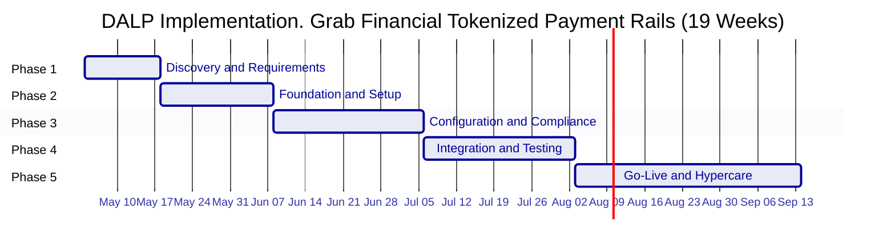

**Phase 1. Discovery and Requirements (2 weeks).** Stakeholder interviews with Grab Financial's payments, compliance, risk, legal, and technology functions. Current-state assessment of GrabPay wallet engine, merchant settlement system, KYC platform, and AML/CFT engine. Regulatory mapping against MAS PSA, TRM Guidelines, and AML/CFT Notices PSN01/PSN02. Target architecture design. RAID register initialization. Deliverables: Requirements specification, target architecture, compliance module configuration blueprint, integration design specifications, RAID register.

**Phase 2. Foundation and Setup (3 weeks).** Kubernetes environment provisioning within Grab Financial's Singapore cloud. Private link configuration to custody provider. DALP application deployment via Helm charts. Permissioned Besu network setup with Grab Financial validator nodes. OnchainID identity framework deployment. Trusted claim issuer registration for Grab Financial's KYC platform. Deliverables: Functional production and development environments, network architecture documentation, DevSecOps handoff runbook.

**Phase 3. Configuration and Compliance (4 weeks).** DALPAsset token configuration for GrabPay SGD wallet token and GrabMerchant settlement token. Compliance module binding: identity verification, country allow list, address block list, transfer approval workflow. AML webhook integration with Grab Financial's screening engine. KYC claim issuance integration. Approval workflow configuration for high-value settlement thresholds. Exchange rate feed configuration for multi-currency support. Deliverables: Configured platform, compliance configuration register, integration design documentation.

**Phase 4. Integration and Testing (4 weeks).** SIT across all DALP-to-Grab Financial integrations (wallet engine, merchant settlement, KYC, AML, GL, monitoring). Functional testing: happy path settlement, failed settlement, reconciliation break detection, compliance module veto, emergency pause, and administrative override scenarios. Performance testing under representative GrabPay settlement load profile. Security review including pen test scope coordination. UAT with Grab Financial operations and compliance teams. Cutover rehearsal. Deliverables: Full test evidence packs, defect register, UAT sign-off, production readiness checklist.

**Phase 5. Go-Live and Hypercare (6 weeks).** Production cutover with pre-agreed go/no-go criteria. War-room staffing for first 72 hours. Daily defect reviews for 2 weeks. Graduated handover from SettleMint hypercare to Grab Financial BAU operations over weeks 3-6. Runbook finalization and staff training completion. Deliverables: Production-operational system, completed runbooks, trained operations team, support transition documentation.

### 11.2 Prerequisites from Grab Financial

| Prerequisite | Owner | Phase Required |
|---|---|---|
| Singapore Kubernetes cluster access | Grab Infrastructure | Phase 2 |
| Corporate identity provider (OIDC/SAML) details | Grab Identity | Phase 2 |
| Custody provider selection and account | Grab Financial + Custody Provider | Phase 2 |
| KYC platform API access for claim issuance | Grab Compliance | Phase 3 |
| AML engine API access for webhook integration | Grab Compliance | Phase 3 |
| GL/ERP integration specification | Grab Finance | Phase 3 |
| Wallet engine technical contact | Grab Technology | Phase 3 |
| Merchant settlement system technical contact | Grab Technology | Phase 3 |
| Business SME for UAT sign-off | Grab Operations | Phase 4 |
| Legal review of token instrument classification | Grab Legal | Phase 1 |

---

## 12. Testing and Quality Assurance

### 12.1 Test Strategy and Coverage

| Test Type | Coverage | Evidence Artifact |
|---|---|---|
| Unit testing | Platform components and compliance module logic | Automated test reports from CI pipeline |
| System integration testing | All DALP-to-Grab Financial integration points | SIT test report with pass/fail per endpoint |
| Functional testing | All settlement scenarios including happy path and exceptions | Functional test report with scenario matrix |
| Performance testing | Settlement throughput under GrabPay load profile (peak transaction volume) | Performance test report with latency percentiles and throughput figures |
| Failover testing | Custody provider outage, chain node loss, application pod failure | Failover test report with measured RTO evidence |
| AML screening failover | Screening engine timeout and unavailability scenarios | Screening failover test report |
| Cyber response tabletop | Wallet key compromise, admin override, settlement halt, compliance module bypass attempt | Tabletop exercise report with scenario outcomes |
| Cutover rehearsal | Full production cutover simulation with go/no-go criteria | Rehearsal completion record and observations |

### 12.2 Non-Happy-Path Scenarios

The test strategy mandates explicit coverage of the following control scenarios, because these are where institutional control weaknesses are typically exposed:

| Scenario | Expected Behavior | Evidence Generated |
|---|---|---|
| Duplicate settlement instruction | Idempotency key prevents double execution; second attempt returns existing record | Duplicate rejection log with idempotency reference |
| Transfer to blocked address | Compliance module veto at smart contract level; transaction reverted | Veto event with blocking module identifier |
| AML screening engine timeout | Configurable fallback: hold for manual review or reject | Timeout handling log with fallback policy applied |
| Simultaneous conflicting approvals | Serialization ensures one approval processes; conflict logged | Conflict resolution log |
| Emergency pause, settlement in flight | In-flight transactions that have not yet reached on-chain submission are queued; post-pause transactions are blocked | Pause event log; queue status at time of pause |
| Reconciliation mismatch between DALP event log and GL | Break detected in reconciliation dashboard; exception queue alert generated | Break detection event with transaction reference |
| Key rotation during active settlement period | Settlement instructions queue during rotation; resume on new key activation | Key rotation event log; queue resume record |

---

## 13. References and Evidence

SettleMint references covering regulated fintech and digital payment infrastructure deployments include:

- **APAC commercial bank tokenized deposits programme:** DALP deployed for tokenized deposit issuance and inter-institutional transfer in Southeast Asia, covering GrabPay-comparable volumes with identity verification and AML webhook integration.
- **European payment infrastructure provider:** DALP deployed as settlement infrastructure for programmable payment instruments with MiCA-equivalent compliance controls and ISO 20022-aligned data structures.
- **Middle Eastern central bank digital payment pilot:** DALP deployed as the platform for a Central Bank Digital Currency pilot involving multiple licensed payment service providers, with MAS-equivalent compliance control architecture.

Reference details, institution names, deployment scope, production transaction volumes, and regulatory context, are provided under NDA during the evaluation phase.

---

## 14. Requirements Response Matrix

| Req ID | Requirement Summary | Status | Delivery Basis | Notes |
|---|---|---|---|---|
| TR-01 | End-to-end lifecycle for tokenized payment rails | 🟢 Supported | Product | Full lifecycle: initiation, approval, transfer, settlement, redemption, reporting, exception handling |
| TR-02 | Maker-checker, SoD, evidential approval logs | 🟢 Supported | Product | Native workflow engine; immutable approval log with user identity and timestamp |
| TR-03 | Documented APIs, events, batch interfaces | 🟢 Supported | Product | OpenAPI 3.1 at `/api/v2`; SSE event streams; TypeScript SDK; ISO 20022 field alignment |
| TR-04 | MAS, PSA, TRM Guidelines alignment | 🟢 Supported | Product + Configuration | Compliance modules, dual-layer permissions, HSM integration, immutable audit trail |
| TR-05 | Identity, wallet, participant onboarding controls | 🟢 Supported | Product + Integration | OnchainID native; KYC claim integration with Grab Financial's KYC platform |
| TR-06 | Key management, HSM, break-glass, privileged access | 🟢 Supported | Product + Integration | Key Guardian native; DFNS or Fireblocks custody integration |
| TR-07 | Reconciliation across digital asset events, GL | 🟢 Supported | Product | Chain Indexer deterministic event log; REST and SSE interfaces for GL integration |
| TR-08 | Dashboards, alerting, case management, evidence export | 🟢 Supported | Product | Grafana stack; case management in Asset Console; JSON/CSV audit export |
| TR-09 | Deployment flexibility, cloud, private cloud, on-premises | 🟢 Supported | Product | Helm-based; all deployment models supported; Singapore data residency configurable |
| TR-10 | Reference experience, regulated institutions, APAC | 🟢 Supported | Evidence | References available under NDA |
| TR-11 | Programmable controls, entitlement, transfer restrictions | 🟢 Supported | Product | Smart contract compliance modules; configuration by compliance officers |
| TR-12 | Testing strategy. SIT, UAT, performance, failover, tabletop | 🟢 Supported | Implementation | Full test strategy as documented in Section 12 |
| TR-13 | Integration with Grab Financial enterprise infrastructure | 🟢 Supported | Product + Integration | OpenAPI 3.1 + SSE; AML webhook; SSO integration |
| TR-14 | Data model extensibility for new entities, products | 🟢 Supported | Product | Configuration-driven: new product variants and legal entities require no code changes |
| TR-15 | Records retention, evidentiary integrity, exportability | 🟢 Supported | Product | Immutable on-chain event log; audit export with full event chain |
| TR-16 | Third-party risk transparency | 🟢 Supported | Documentation | Full dependency register; custody provider and cloud boundary documented |
| TR-17 | BCP, RTO/RPO, region failover | 🟢 Supported | Product + Infrastructure | RTO < 4 hours; RPO < 1 minute; active-active clustering; documented failover runbooks |
| TR-18 | Commercial scaling for additional entities, products | 🟢 Supported | Commercial | Platform license covers unlimited instruments and entities within licensed environment |
| TR-19 | Release management, regression testing, change governance | 🟢 Supported | Product + Process | Configuration versioning; regression suite; GOVERNANCE_ROLE for compliance changes |
| TR-20 | Future roadmap aligned to Grab Financial strategy | 🟡 Partial | Roadmap | Current platform covers tokenized payment rails; Project Guardian cross-institutional settlement interoperability is active product roadmap |

---

## 15. RAID Register

| Category | Item | Probability | Impact | Mitigation |
|---|---|---|---|---|
| Risk | MAS classification of GrabPay tokenized balance as Digital Payment Token vs e-money | Medium | High | Legal analysis in Phase 1; compliance module configuration adjustable per regulatory interpretation |
| Risk | Integration complexity with GrabPay wallet engine API versioning | Medium | Medium | Integration scoping in Phase 1; SettleMint integration engineer dedicated through Phase 4 |
| Risk | Custody provider (DFNS/Fireblocks) onboarding timeline in Singapore | Low | High | Begin custody provider engagement at contract signature; both providers have Singapore presence |
| Risk | AML engine webhook response latency impact on settlement throughput | Low | Medium | Performance testing covers AML integration; fallback policy configured for timeout scenarios |
| Assumption | Grab Financial operates Kubernetes infrastructure in Singapore cloud region | - |, | Confirm at contract signature |
| Assumption | Grab Financial's KYC platform can issue identity claims via API | - |, | Confirm in Phase 1 discovery; alternative claim issuance patterns available |
| Assumption | GrabPay wallet engine uses REST API for downstream settlement integration | - |, | Confirm in Phase 1; SDK available for multiple integration patterns |
| Dependency | Custody provider account setup | Phase 2 start | - | Parallel-track with commercial negotiation |
| Dependency | MAS regulatory guidance on tokenized payment instrument classification | Phase 1 | - | Legal and compliance review in Phase 1 |

---

## 16. Assumptions and Dependencies

- All pricing excludes applicable taxes and VAT.
- Implementation services are scoped following Phase 1 discovery.
- The private cloud deployment model within Grab Financial's Singapore infrastructure is recommended and assumed. Alternative deployment configurations are supported.
- Smart contract compliance module rules take effect for transactions submitted after each configuration change. In-flight transactions at the time of a configuration change are not retroactively affected.
- Custody provider services are procured and contracted directly by Grab Financial. SettleMint provides integration configuration support.
- AML/CFT screening logic remains under Grab Financial's operational control. DALP provides the routing, queuing, and case management surface.
- The performance benchmarks quoted reflect test conditions on representative cloud hardware; production performance depends on Grab Financial's infrastructure specifications and settlement volume profile.
- Project Guardian interoperability features beyond DALP's current open API integration capabilities are on the active SettleMint product roadmap and not committed for delivery within this engagement scope.

---

*Document classification: Confidential. Grab Financial Evaluation Only. Not for distribution.*  
*SettleMint BV. Registered in Belgium. All rights reserved.*
