# KfW Digital Development Bonds Platform: Technical Proposal

**Document Reference:** KFW-TECH-2026-001  
**Version:** 1.0 Draft  
**Submission Date:** March 2026  
**Classification:** Confidential  
**Prepared for:** KfW Digital Assets Procurement Team

---

## Table of Contents

1. Executive Summary
2. About SettleMint
3. About DALP. Digital Asset Lifecycle Platform
4. Customer References
5. Understanding of Requirements
6. Proposed Solution and Functional Capabilities
7. Technical Architecture
8. Security
9. Project Implementation & Delivery
10. Deployment
11. Training and Knowledge Transfer
12. Support & SLA
13. Risk Management
14. Compliance Matrix

---

# 1. Executive Summary

## 1.1 Context and Strategic Drivers

KfW is undertaking this procurement to establish a controlled, production-grade platform for digital development bonds aligned to its development finance mandate and public-sector auditability requirements. The institution operates with a conservative risk appetite and demands high transparency across all operations. This procurement seeks a solution that supports regulated business growth while preserving strong governance, operational resilience, and clear accountability across front-office, operations, risk, compliance, information security, architecture, and procurement stakeholders.

The strategic drivers for this procurement reflect KfW's position as a leading development finance institution:

- **Digital transformation of development bonds**: Supporting digitally native development bond issuance with strong public-sector governance and transparency mechanisms that meet German and EU regulatory standards.
- **Reporting integrity**: Improving reporting integrity for funded programmes and investor disclosures through immutable audit trails and real-time visibility.
- **Infrastructure tokenization evaluation**: Evaluating infrastructure tokenization patterns that could support future development finance structures across multiple jurisdictions.

KfW has been a flagship issuer in digitally native and blockchain-based bond experimentation in Germany, working with Deutsche Börse / Clearstream ecosystem components and Bundesbank trigger-solution style settlement experiments. This proposal addresses the specific requirements of a conservative, public-interest-driven institution heavily focused on legal certainty, transparency, sovereign-grade issuance controls, and reproducible post-trade reporting.

## 1.2 Why This Programme Is Hard

The deployment of a digital development bonds platform presents significant challenges that distinguish it from conventional technology implementations:

### Lifecycle Complexity

Digital development bonds require end-to-end lifecycle management spanning origination, onboarding, issuance, servicing, transfer, redemption, and archival record retention. Each stage involves multiple stakeholders, approval workflows, and regulatory compliance checks. The platform must support the complete journey from bond design through maturity, including corporate actions, coupon payments, and final redemption, all with full auditability.

### Governance and Compliance Burden

As a German public-sector development bank, KfW operates under stringent regulatory requirements including MiCA, MiFID II, German eWpG, public procurement and public-sector audit requirements, DORA, GDPR, and BaFin guidance. The solution must demonstrate clear control evidence, regulatory alignment, and the ability to generate supervisor-ready reporting without requiring extensive manual intervention.

### Operationalization Gap

Many digital asset platforms demonstrate compelling pilot functionality but fail to transition to production-ready operation. The gap between proof-of-concept and sustainable production involves addressing operational monitoring, exception handling, reconciliation processes, disaster recovery, and support models that meet institutional standards. This proposal addresses the complete operationalization requirement, not merely the functional capability.

### Integration Burden

The platform must integrate with existing institutional infrastructure including bond issuance and paying-agent processes, treasury systems, investor communications, settlement and CSD connectivity, accounting, reporting, and public-sector governance workflows. The digital asset layer cannot become a sidecar disconnected from existing books and records, operations controls, or regulator-facing reporting.

## 1.3 Proposed Response

SettleMint proposes the deployment of DALP (Digital Asset Lifecycle Platform) configured specifically for KfW's digital development bonds requirements. Our response addresses the complete scope defined in the RFP.

### Deployment Model

We recommend a **Private Cloud / Dedicated Deployment** model for KfW, hosted within German data centres to ensure full data residency compliance and alignment with BaFin outsourcing requirements. This deployment model provides complete logical isolation from other tenants, data residency in Germany/EU, direct connectivity to KfW's existing infrastructure, and full operational control while retaining platform capabilities.

### Target Asset Scope

The initial deployment will support bond tokenization with automated coupon schedules, maturity handling, and redemption mechanics; fixed-income instruments configuration for various bond structures; and expansion readiness through architecture supporting future extension to additional asset classes.

### Compliance Approach

DALP provides ex-ante compliance enforcement through its modular compliance engine built on ERC-3643 (T-REX) standards. Every transfer passes through configurable compliance modules before execution, ensuring regulatory requirements are enforced at the point of transaction rather than reviewed retrospectively.

### Custody Model

The platform supports KfW's preferred custody arrangements through its custody orchestration layer. DALP integrates with institutional custody providers including Fireblocks and DFNS, enabling KfW to leverage existing custodian relationships while maintaining unified operational control.

### Integration Perimeter

The platform provides comprehensive API coverage for integration with core banking and treasury management systems, custody and depository connections, payment rails, regulatory reporting systems, investor onboarding platforms, and financial accounting systems.

### Phased Delivery Summary

| Phase | Duration | Focus |
|-------|----------|-------|
| Discovery & Requirements | 4 weeks | Scope definition, control mapping, integration design |
| Foundation & Setup | 6 weeks | Environment provisioning, platform deployment, identity setup |
| Configuration & Compliance | 8 weeks | Asset configuration, compliance modules, workflow design |
| Integration & Testing | 8 weeks | System integration, testing, user acceptance |
| Go-Live | 2 weeks | Cutover, smoke tests, production validation |
| Hypercare | 4 weeks | Production support, optimization, knowledge transfer |

**Total estimated timeline: 32 weeks**

## 1.4 Why SettleMint

SettleMint brings unique credentials relevant to KfW's requirements including market tenure since 2017, production record with active deployments at regulated institutions across Europe and Asia, regulated delivery experience with BaFin, FCA, MAS engagement, and relevant reference implementations including Commerzbank in Germany.

## 1.5 Why DALP

DALP provides the comprehensive platform capability that KfW requires through platform breadth covering the complete digital asset lifecycle, lifecycle model treating assets as continuous process under unified governance, control plane positioning between core financial systems and blockchain networks, and interoperability designed for institutional integration.

## 1.6 Reference Fit Snapshot

| Reference | Relevance to KfW |
|-----------|------------------|
| **Commerzbank** | German bank, ETP/bond tokenization, production deployment with Boerse Stuttgart |
| **Standard Chartered Bank** | Institutional trading, digital asset exchange, custody integration |
| **Sony Bank (Japan)** | Stablecoin issuance, regulatory alignment, production-ready positioning |

---

# 2. About SettleMint

## 2.1 Company Overview

SettleMint is a leading provider of enterprise-grade digital asset platform solutions, headquartered in Brussels, Belgium. Our mission is to enable financial institutions to design, launch, and operate tokenized assets with the same confidence they apply to traditional financial instruments. We focus exclusively on regulated financial institutions, sovereign entities, and market infrastructure providers.

## 2.2 History and Market Position

Founded in 2017, SettleMint has grown to become a recognized leader in the digital asset platform market. Key milestones include first production deployment at a regulated European bank in 2019, launch of DALP in 2021, expansion into Asian markets in 2022, ISO 27001 certification in 2023, strategic reference wins in 2024, and Mizuho Bank PoC completion in 2025.

## 2.3 Production Credentials

| Credential | Detail |
|------------|--------|
| **ISO 27001** | Certified Information Security Management System |
| **SOC 2 Type II** | Security, availability, and confidentiality controls attested |
| **Regulatory Alignment** | Active engagement with BaFin, FCA, MAS, SEC, JFSA |
| **Production Deployments** | 14+ named customer references across banking, sovereign, and market infrastructure |
| **Asset Classes Supported** | 7+ asset classes including bonds, equities, funds, deposits, stablecoins, real estate |

## 2.4 Regulatory Readiness

DALP is designed to support compliance with EU MiCA, MiFID II, German eWpG, DORA, GDPR, BaFin Guidance, UK FCA, and Singapore MAS regulations.

## 2.5 Team and Delivery Capability

SettleMint maintains a team of 80+ engineers specializing in distributed systems architecture, blockchain and smart contract development, financial instrument engineering, enterprise integration, and security and cryptography.

## 2.6 Ecosystem and Partnerships

SettleMint maintains partnerships with Fireblocks and DFNS for custody integration, cloud providers (AWS, Azure, GCP) with dedicated deployment patterns, and HSM providers (Thales, Utimaco).

---

# 3. About DALP: Digital Asset Lifecycle Platform

## 3.1 Platform Overview

DALP is SettleMint's production-grade platform for designing, launching, and operating tokenized assets across financial instruments and real-world assets. It provides production-ready infrastructure from day one, enabling institutions to deploy digital assets without building blockchain expertise internally.

DALP sits between existing core financial systems and blockchain networks, providing the governance and orchestration layer that enables institutions to build, deploy, and operate compliant digital asset solutions in production.

## 3.2 Core Lifecycle Pillars

### 3.2.1 Issuance

Rapid deployment of tokenized assets across seven asset classes, bonds, equities, funds, deposits, stablecoins, real estate, and precious metals, each with purpose-built lifecycle logic. Key capabilities include configurable business rules, Asset Designer wizard, deterministic issuance orchestration, and paused-by-default behaviour with explicit unpause control.

### 3.2.2 Compliance

Ex-ante enforcement ensures every transfer is validated before execution. DALP provides 18 compliance module types, multi-jurisdictional support, ERC-3643 (T-REX) implementation, and OnchainID for verifiable on-chain investor identities.

### 3.2.3 Custody

Enterprise-grade key management workflows with bring-your-own-custodian integrations. Key Guardian supports multiple storage backends, maker-checker approval workflows, RBAC with 5 defined roles, and emergency pause capability.

### 3.2.4 Settlement

Atomic Delivery-versus-Payment (DvP) and Exchange-versus-Payment (XvP) settlement, both complete together or revert together. Supports local and HTLC cross-chain settlement models with ISO 20022 integration.

### 3.2.5 Servicing

Automated lifecycle operations executed programmatically across every asset type including automated corporate actions, fixed treasury yield, AUM fee features, and maturity redemption.

## 3.3 Platform Foundations

### 3.3.1 Identity and Access Management

OnchainID provides verifiable on-chain investor identities, Identity Registry manages verified profiles, RBAC governs every action with 5 defined roles, and wallet verification with multi-factor gates protects privileged transactions.

### 3.3.2 Integration and Interoperability

Comprehensive APIs include REST, GraphQL, event webhooks, and oRPC. The platform provides a typed TypeScript SDK, CLI with 301 commands, and payment rail connectivity supporting ISO 20022 standards.

### 3.3.3 Observability and Operations

Pre-built dashboards cover operations, transactions, compliance, and security. Three-pillar observability includes metrics, logs, and traces with distributed tracing across full transaction lifecycle.

## 3.4 Supported Asset Classes

| Asset Class | Typical Instruments | Lifecycle Support |
|-------------|---------------------|-------------------|
| **Fixed Income** | Corporate bonds, government bonds, structured notes | Coupon schedules, maturity, redemption |
| **Flexible Income** | Common stock, preferred shares, investment fund units | Dividends, voting, corporate actions |
| **Cash Equivalent** | Fiat-pegged stablecoins, tokenized bank deposits | Interest, withdrawal rules |
| **Real World Assets** | Fractional property ownership, gold-backed tokens | Provenance, chain-of-custody |

## 3.5 Standards and Protocols

| Category | Standards Supported |
|----------|---------------------|
| **Token Standards** | ERC-20, ERC-721, ERC-1400, ERC-3643 (T-REX), ERC-5805, EIP-2612 |
| **Identity** | OnchainID (ERC-734/735), claim-based verification |
| **Account Abstraction** | ERC-4337, ERC-7579 |
| **Compliance** | 18 module types |
| **Settlement** | Atomic DvP/XvP, HTLC cross-chain |
| **Payment Rails** | ISO 20022 (SWIFT, SEPA, RTGS) |

---

# 4. Customer References

## 4.1 Summary Table

| Client | Geography | Use Case | Relevance to KfW |
|--------|-----------|----------|------------------|
| Commerzbank | Germany | Hybrid on/off-chain ETP issuance | German bank, bond tokenization |
| Standard Chartered Bank | UK/Asia | Digital asset exchange | Institutional trading |
| Sony Bank | Japan | Stablecoin issuance | Regulatory alignment |
| OCBC Bank | Singapore | Security token engine | Bond/equity tokenization |
| Saudi RER | Saudi Arabia | Real estate registry | Sovereign-grade |
| Mizuho Bank | Japan | Bond tokenization | Production planning |
| ADI Finstreet | UAE | Tokenized equity | Regulatory environment |

## 4.2 Expanded Reference: Commerzbank (Germany)

Commerzbank, one of Germany's leading commercial banks, required a solution for issuing and managing exchange-traded products (ETPs) using a hybrid on/off-chain approach. SettleMint implemented a hybrid solution integrating with Boerse Stuttgart's listing service, achieving settlement in under 10 seconds, reduced counterparty risk, and identified potential annual savings of €7M. This reference directly demonstrates SettleMint's ability to deliver production-grade bond tokenization within the German regulatory framework.

## 4.3 Expanded Reference: Standard Chartered Bank

Standard Chartered Bank sought to improve trading efficiency for institutional investors through digital asset tokenization. The solution supported fractional tokenization of securities with instant and immutable ownership recording, elimination of custody intermediaries, and faster settlement times. This demonstrates institutional-grade trading and custody integration capabilities.

---

# 5. Understanding of Requirements

## 5.1 KfW Context

KfW is Germany's leading development bank, operating under public mandate with strict accountability requirements. The institution has been at the forefront of digitally native bond experimentation in Germany, working with Deutsche Börse / Clearstream ecosystem components.

### Institution Mandate

KfW's development finance mandate requires absolute transparency in fund deployment, robust public-sector audit compliance, strong governance across all operations, and alignment with German and EU regulatory frameworks.

### Transformation Drivers

The procurement addresses modernization of development bond issuance processes, enhancement of investor reporting and transparency, evaluation of infrastructure tokenization for future structures, and operational efficiency through digital transformation.

## 5.2 Requirement Domains

| Domain | KfW Priority | DALP Alignment |
|--------|-------------|-----------------|
| **Product / Asset Scope** | Bond-focused | Full bond lifecycle support |
| **Identity / Onboarding** | Institutional KYC/AML | OnchainID with claim-based verification |
| **Compliance / Control** | German/EU, BaFin | 18 compliance modules, ERC-3643 |
| **Settlement / Cash Leg** | CSD integration | DvP/XvP, ISO 20022 |
| **Integration / Reporting** | Treasury, accounting | Comprehensive APIs |
| **Infrastructure / Operations** | Production-grade | Durable execution, HA/DR |

## 5.3 Key Challenges Identified

### Challenge 1: Regulatory Complexity

Compliance with MiCA, MiFID II, German eWpG, BaFin guidance, DORA, and GDPR simultaneously requires supporting different compliance rules for different investor jurisdictions while maintaining a coherent control framework.

### Challenge 2: Integration with Existing Infrastructure

The digital asset platform cannot operate as an isolated system. It must maintain golden-source synchronization with existing books and records while providing unified operational control.

### Challenge 3: Governance and Control

The platform must support comprehensive approval workflows, maker-checker patterns, and generate evidence suitable for internal audit and external supervisor review.

### Challenge 4: Operational Transition

Phased rollout by product and jurisdiction, coexistence with legacy systems, and clear rollback paths are required.

### Challenge 5: Long-Term Supportability

Internal engineering and operations teams must own the platform day-to-day without permanent vendor dependency.

## 5.4 Requirement Prioritization

| Priority | Requirements |
|----------|--------------|
| **Must Have** | TR-01, TR-02, TR-03, TR-05, TR-06, SR-01, SR-02, SR-03, SR-04 |
| **Should Have** | TR-04, TR-07, TR-08, TR-09, SR-05, SR-06 |
| **Could Have** | TR-10 |

All mandatory requirements will be fully addressed in the base implementation.

## 5.5 Response Principles

**Control Before Speed:** Every design decision prioritizes control and compliance over processing speed.

**Reuse Before Fragmentation:** The solution leverages existing DALP components rather than creating bespoke solutions.

**Phased Delivery:** Implementation proceeds through defined phases with clear acceptance gates.

**Evidence-Led Compliance:** Every compliance-relevant action generates immutable evidence.

**Institutional Ownership:** The solution is designed for KfW to operate independently.

---

# 6. Proposed Solution and Functional Capabilities

## 6.1 Solution Overview

DALP provides the complete digital asset lifecycle platform for KfW's digital development bonds encompassing DALP core platform, Asset Designer, Asset Console, REST API, SDK, CLI, and observability stack.

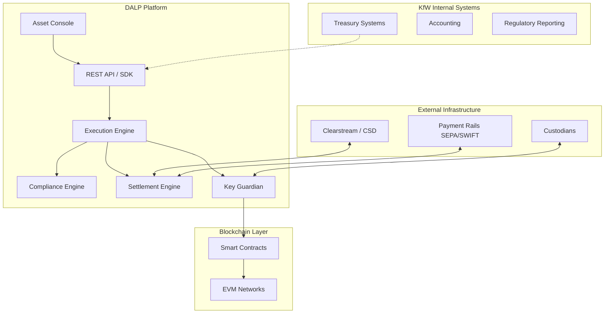

## 6.2 Issuance and Asset Configuration

DALP provides comprehensive asset configuration including asset type selection for bonds with predefined lifecycle logic, term structure configuration for face value, maturity date, coupon rate, coupon frequency, and denomination. All assets deploy through the Asset Factory with deterministic addressing and paused-by-default activation requiring explicit governance approval before go-live.

## 6.3 Identity and Eligibility

DALP integrates OnchainID (ERC-734/735) for on-chain identity management with identity contracts for every investor, claims model for verified credentials, issuer trust model for KfW designations, and reusability across all tokens.

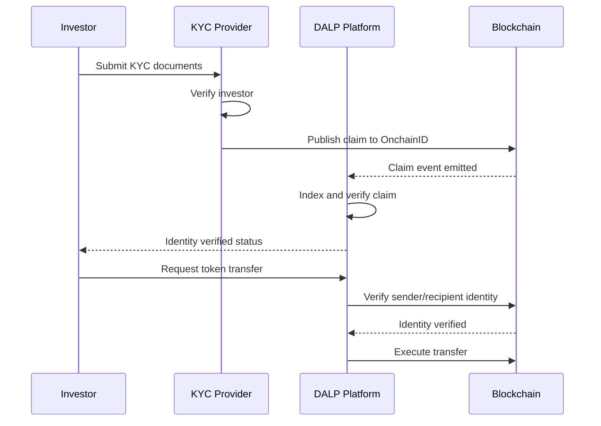

## 6.4 Compliance Enforcement

Every transfer passes through the compliance engine before execution: identity resolution, module evaluation in sequence, feature pre-check, and atomic execution only if all checks pass.

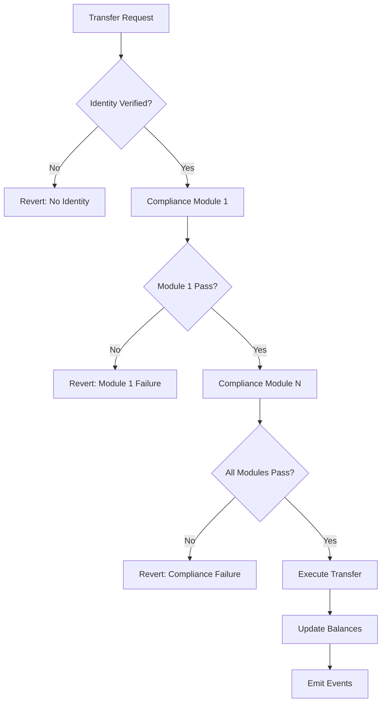

For KfW's requirements, recommended modules include Identity Verification, Country Allow List, Investor Count Limit, Transfer Approval, and Time Lock.

## 6.5 Transfer, Settlement, and Cash-Leg Coordination

DALP supports DvP (Delivery vs Payment) for atomic exchange of token for payment, XvP (Exchange vs Payment) for multi-leg atomic exchange, and settlement finality with deterministic closure. The platform handles settlement failures with atomic guarantee where if any leg fails, all legs revert.

## 6.6 Lifecycle Servicing and Corporate Actions

### Coupon Distribution

The platform supports automated coupon payments through Fixed Treasury Yield for pull-based claim systems and Yield Schedule for automated distribution.

### Maturity Handling

Maturity Redemption feature implements the complete fixed-income lifecycle endpoint. After maturity date, the token blocks all transfers and holders redeem for denomination asset atomically.

### Redemption Mechanics

The platform supports bullet redemption, sinking fund redemption, and callable redemption with configurable terms.

---

# 7. Technical Architecture

## 7.1 Architectural Principles

DALP follows five architectural principles: lifecycle-first where the platform treats assets as continuous processes; durable execution ensuring workflows survive infrastructure failures; defense-in-depth with security across all layers; separation of concerns between components; and provider abstraction enabling multi-custody and multi-network operation.

## 7.2 Layered Architecture

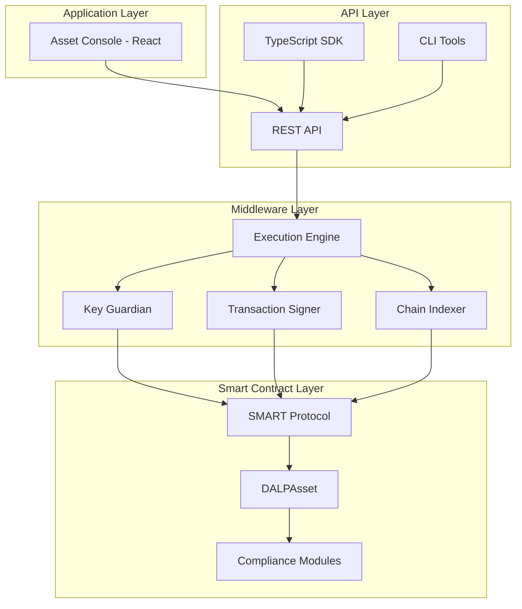

## 7.3 Data Architecture

The platform maintains chain state on EVM networks, application state in PostgreSQL, indexed state for query optimization, and audit evidence with immutable event storage.

## 7.4 Network and Chain Topology

DALP operates on any EVM-compatible blockchain. For KfW, we recommend deployment on a private/consortium network (Hyperledger Besu with IBFT 2.0) for production, with public testnet for development and testing.

## 7.5 Multi-Tenancy and Environment Segregation

The platform supports tenant isolation through separate database schemas, environment separation for dev/test/staging/production/DR, and governance boundaries between organizational units.

## 7.6 Operational Architecture

The Execution Engine provides reliable workflow orchestration with persistent state. Transaction management includes nonce coordination, gas estimation, and confirmation tracking. The Chain Indexer processes blockchain events for queryable state projection.

---

# 8. Security

## 8.1 Security Model Overview

DALP implements a defense-in-depth security model across three domains: perimeter security (network, firewall, DDoS protection), application security (authentication, authorization, input validation), and data security (encryption at rest and in transit).

## 8.2 Authentication and Access Control

| Control | Implementation |
|---------|----------------|
| **Session Auth** | Better Auth with secure session management |
| **API Keys** | Organization-scoped with optional read-only enforcement |
| **RBAC** | 5 defined roles: admin, governance, supply management, custodian, emergency |
| **MFA** | PIN, TOTP, or backup codes for privileged operations |
| **Separation of Duties** | Role combinations restricted by policy |

## 8.3 Key Management and Custody Integration

Key Guardian provides HSM integration (Thales, Utimaco, cloud KMS), maker-checker workflows with configurable quorum, emergency recovery procedures, and Fireblocks/DFNS integration for institutional custody.

## 8.4 Data Protection and Encryption

| Data State | Protection |
|------------|------------|
| **In Transit** | TLS 1.3 |
| **At Rest** | AES-256 |
| **Secrets** | HashiCorp Vault or cloud KMS |
| **Field-Level** | Sensitive fields encrypted individually |

## 8.5 Compliance Controls and Auditability

Every action generates immutable audit events, SIEM integration exports standard formats, and reporting supports regulatory requirements.

## 8.6 Testing and Assurance

SettleMint conducts annual penetration testing by independent firms, maintains vulnerability management with regular scanning, and provides remediation governance with defined SLAs.

## 8.7 Security Responsibility Matrix

| Control Area | SettleMint | Client |
|--------------|------------|--------|
| Platform Security | Primary | Secondary |
| Network Security | Primary | Monitoring |
| Key Management | Shared | Custody Choices |
| Access Management | Primary | User Provisioning |
| Incident Response | Primary | Notification |

---

# 9. Project Implementation & Delivery

## 9.1 Delivery Overview

SettleMint employs a phased delivery methodology with stage-gate approvals ensuring governance alignment and risk management throughout the implementation.

## 9.2 Phase Plan

### Phase 1: Discovery and Requirements (4 weeks)

**Objective:** Define scope, establish baselines, and create detailed design.

**Key Activities:** Requirements workshop, systems landscape analysis, regulatory requirements mapping, integration design sessions, and success criteria definition.

**Outputs:** Requirements document, integration specifications, control mapping, and project plan.

**Dependencies:** KfW stakeholder availability, access to current system documentation.

### Phase 2: Foundation and Setup (6 weeks)

**Objective:** Deploy platform infrastructure and establish operational foundations.

**Key Activities:** Environment provisioning, platform deployment, identity system setup, network configuration, and security hardening.

**Outputs:** Deployed platform in non-production environments, operational runbooks.

**Dependencies:** Phase 1 completion, infrastructure access.

### Phase 3: Configuration and Compliance (8 weeks)

**Objective:** Configure assets, compliance modules, and workflows.

**Key Activities:** Asset type configuration, compliance module setup, workflow design, role configuration, and integration mock development.

**Outputs:** Configured platform, compliance evidence package, workflow documentation.

**Dependencies:** Phase 2 completion, compliance requirements finalization.

### Phase 4: Integration and Testing (8 weeks)

**Objective:** Complete system integration and validate functionality.

**Key Activities:** System integration, SIT execution, UAT support, performance testing, and security testing.

**Outputs:** Integration test results, UAT sign-off, security assessment report.

**Dependencies:** Phase 3 completion, external system readiness.

### Phase 5: Go-Live (2 weeks)

**Objective:** Transition to production operation.

**Key Activities:** Production deployment, smoke testing, cutover execution, and production validation.

**Outputs:** Production environment, go-live sign-off.

**Dependencies:** Phase 4 completion, acceptance criteria met.

### Phase 6: Hypercare (4 weeks)

**Objective:** Stabilize production operations and transfer knowledge.

**Key Activities:** Production support, issue resolution, optimization, and knowledge transfer.

**Outputs:** Stable production operation, trained operations team.

**Dependencies:** Phase 5 completion.

## 9.3 Governance and Decision Structure

| Gate | Approver | Criteria |
|------|----------|----------|
| Design Review | Architecture Committee | Technical design meets requirements |
| Security Review | CISO | Security controls adequate |
| Compliance Review | Compliance | Regulatory alignment confirmed |
| UAT Sign-off | Business | Functional requirements met |
| Go-Live Approval | Steering Committee | All gates passed |

## 9.4 Resource Model

| Role | Phase 1-2 | Phase 3-4 | Phase 5-6 |
|------|-----------|------------|------------|
| Project Manager | 1.0 | 1.0 | 1.0 |
| Solution Architect | 0.5 | 0.5 | 0.25 |
| Integration Lead | 0.5 | 1.0 | 0.5 |
| Technical Lead | 1.0 | 2.0 | 1.0 |
| Developers | 2.0 | 4.0 | 1.0 |
| QA Engineer | 0.5 | 2.0 | 1.0 |
| Security Engineer | 0.25 | 0.5 | 0.25 |

---

# 10. Deployment

## 10.1 Deployment Principles

DALP supports portability across deployment models with consistent platform capabilities, security and residency alignment to requirements, and operational control for institutional users.

## 10.2 Recommended Deployment Model

For KfW, we recommend **Private Cloud / Dedicated Deployment** with the following characteristics:

| Characteristic | Configuration |
|----------------|---------------|
| **Location** | Germany (EU) |
| **Cloud Provider** | Customer choice (AWS, Azure, GCP) |
| **Isolation** | Dedicated cluster |
| **Data Residency** | EU only |
| **Management** | Shared responsibility |

## 10.3 Deployment Options Comparison

| Model | Management | Residency | Connectivity | Best For |
|-------|------------|-----------|--------------|----------|
| **Managed SaaS** | SettleMint | EU/US | Public | Speed to market |
| **Private Cloud** | Shared | Customer region | Private link | Control + efficiency |
| **On-Premises** | Customer | On-site | Internal | Maximum control |

## 10.4 Infrastructure Requirements

| Component | Specification |
|-----------|---------------|
| **Compute** | Kubernetes (K8s) cluster |
| **Database** | PostgreSQL 14+ |
| **Cache** | Redis 7+ |
| **Storage** | S3-compatible object storage |
| **Networking** | Load balancer, WAF |

## 10.5 Availability, Resilience, and DR Approach

| Metric | Target |
|--------|--------|
| **Availability** | 99.9% (excluding planned maintenance) |
| **RTO** | 4 hours |
| **RPO** | 1 hour |
| **Recovery** | Automated failover to DR site |

## 10.6 Data Residency and Sovereignty

All customer data remains in the specified region. No data leaves the designated geographic boundary without explicit configuration. Backup storage maintains the same residency requirements.

---

# 11. Training and Knowledge Transfer

## 11.1 Training Strategy

Training is delivered through a combination of instructor-led sessions, hands-on labs, documentation, and shadowing periods. All training is role-specific.

## 11.2 Administrator Track

**Duration:** 5 days

**Topics:** Platform architecture, system configuration, user management, compliance configuration, monitoring, troubleshooting, and backup/restore procedures.

## 11.3 Developer / Integration Track

**Duration:** 3 days

**Topics:** API usage, SDK integration, event handling, custom integration patterns, and debugging techniques.

## 11.4 End-User / Operations Track

**Duration:** 2 days

**Topics:** Asset Console navigation, asset issuance, transfer processing, compliance monitoring, reporting, and daily operations procedures.

## 11.5 Knowledge Transfer Method

Knowledge transfer includes production shadowing periods where KfW staff observe operations, guided labs with hands-on exercises, comprehensive runbooks for all procedures, and operational readiness assessment before go-live.

---

# 12. Support & SLA

## 12.1 Support Model Overview

SettleMint provides tiered support aligned to deployment criticality with defined channels, response times, and escalation paths.

## 12.2 Support Tiers

| Tier | Coverage | Hours | Response Time |
|------|----------|-------|---------------|
| **Standard** | Business hours | 8x5 | 8 hours |
| **Premium** | Extended hours | 16x5 | 4 hours |
| **Enterprise** | 24x7 | 24x7 | 1 hour |

For KfW, we recommend **Enterprise** tier given the production criticality and regulatory requirements.

## 12.3 Severity and Response Matrix

| Severity | Definition | Response Time | Resolution Target |
|----------|------------|---------------|-------------------|
| **P1 - Critical** | Production down, no workaround | 1 hour | 4 hours |
| **P2 - High** | Major functionality impaired | 4 hours | 8 hours |
| **P3 - Medium** | Minor functionality affected | 8 hours | 3 business days |
| **P4 - Low** | General inquiries, minor issues | 1 business day | Next release |

## 12.4 Escalation and Incident Management

| Level | Contact | Escalation Time |
|-------|---------|-----------------|
| **L1** | Support Team | Immediate |
| **L2** | Technical Lead | 4 hours |
| **L3** | Engineering Manager | 8 hours |
| **L4** | VP Engineering | 24 hours |

## 12.5 Maintenance and Update Policy

Scheduled maintenance occurs monthly during agreed windows with 5 business days notice. Emergency security patches may be applied with notification. All changes follow change management process.

## 12.6 Service Reporting

Monthly service reports include uptime metrics, incident summary, and performance indicators. Quarterly business reviews cover roadmap updates and optimization recommendations.

---

# 13. Risk Management

## 13.1 Risk Management Approach

Risks are identified, assessed, and managed throughout the project lifecycle with regular review at steering committee meetings.

## 13.2 Risk Register

| ID | Risk | Likelihood | Impact | Mitigation | Owner |
|----|------|------------|--------|------------|-------|
| R1 | Regulatory change during implementation | Medium | High | Modular compliance design, regular regulatory monitoring | SettleMint |
| R2 | Integration complexity exceeds estimates | Medium | Medium | Early integration prototyping, buffer in timeline | Shared |
| R3 | Client resource availability delays | Medium | Medium | Clear dependency tracking, executive sponsorship | KfW |
| R4 | Third-party security review delays | Low | Medium | Early engagement, parallel workstreams | Shared |
| R5 | Custodian integration challenges | Medium | Medium | Fireblocks/DFNS experience, fallback options | SettleMint |

## 13.3 Governance of Risks

Risk status is reviewed weekly in project meetings and monthly in steering committee. Triggers and contingency actions are defined for each major risk.

---

# 14. Compliance Matrix

## 14.1 Usage Instructions

The following matrix maps KfW's requirements to DALP capabilities. Status codes: Full (F), Partial (P), Configurable (C), Assumption (A), Out of Scope (O).

## 14.2 Detailed Matrix

| Req ID | Requirement | Status | DALP Response | Source |
|--------|-------------|--------|----------------|--------|
| TR-01 | End-to-end lifecycle management | F | Full lifecycle from issuance through retirement | Architecture, Asset Lifecycle docs |
| TR-02 | Documented APIs and event interfaces | F | REST API, Webhooks, SDK, CLI | API documentation |
| TR-03 | RBAC, dual control, approval workflows | F | 5 roles, maker-checker, workflow engine | Security documentation |
| TR-04 | Configurable smart-instrument templates | F | DALPAsset with 32 pluggable features | Asset Lifecycle docs |
| TR-05 | Immutable audit trails | F | On-chain events, off-chain logging | Architecture documentation |
| TR-06 | Resilient deployment across environments | F | Dev, test, pre-prod, DR, prod | Deployment documentation |
| TR-07 | Interoperability with external networks | F | Fireblocks, DFNS, payment rails | Integration documentation |
| TR-08 | Configurable dashboards and reports | F | Grafana dashboards, custom reports | Observability documentation |
| TR-09 | Data export, regulator-ready reporting | F | Event export, regulatory templates | Reporting documentation |
| TR-10 | Advanced analytics and simulation | P | Roadmap capability | Product roadmap |
| SR-01 | ISO 27001 or equivalent | F | Certified | Security credentials |
| SR-02 | Encryption in transit and at rest | F | TLS 1.3, AES-256 | Security documentation |
| SR-03 | Privileged access management | F | Vault integration, break-glass controls | Security documentation |
| SR-04 | Vulnerability management | F | Annual pen testing, regular scanning | Security documentation |
| SR-05 | Data residency options | F | EU, regional deployments | Deployment options |
| SR-06 | SIEM integration | F | Syslog, JSON event export | Integration documentation |

---

## Additional Technical Diagrams

### Transaction Processing Flow

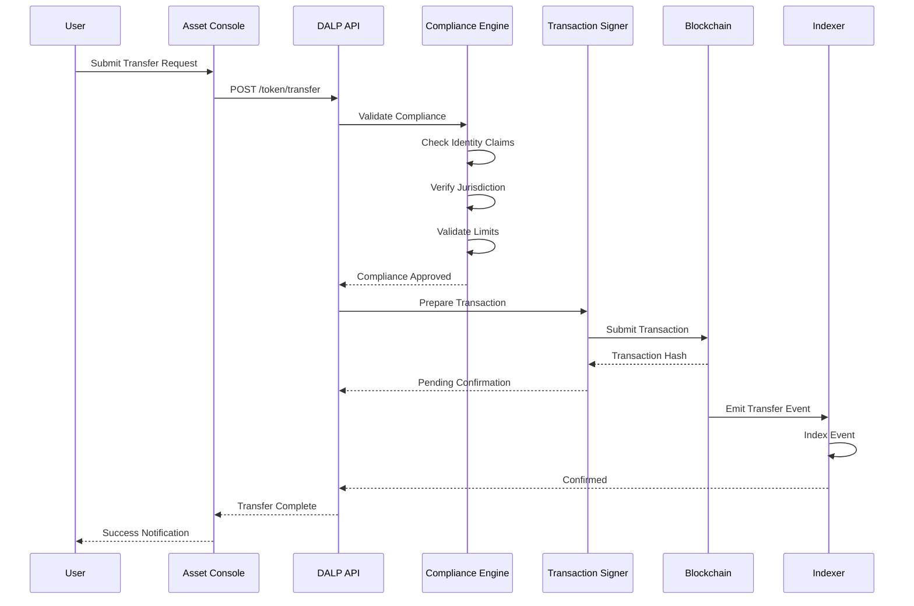

### Integration Architecture

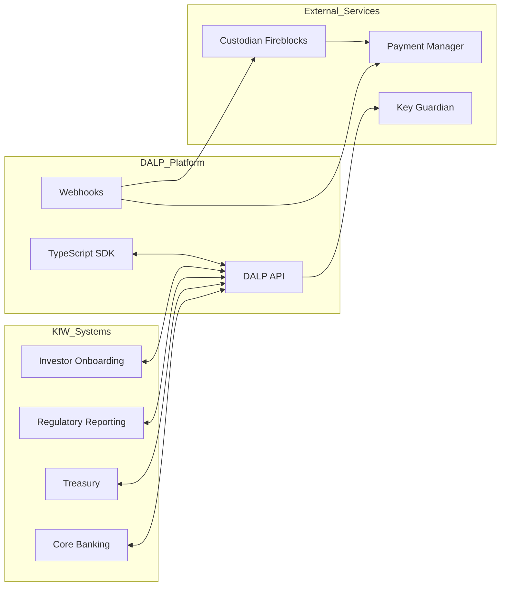

### Deployment Topology

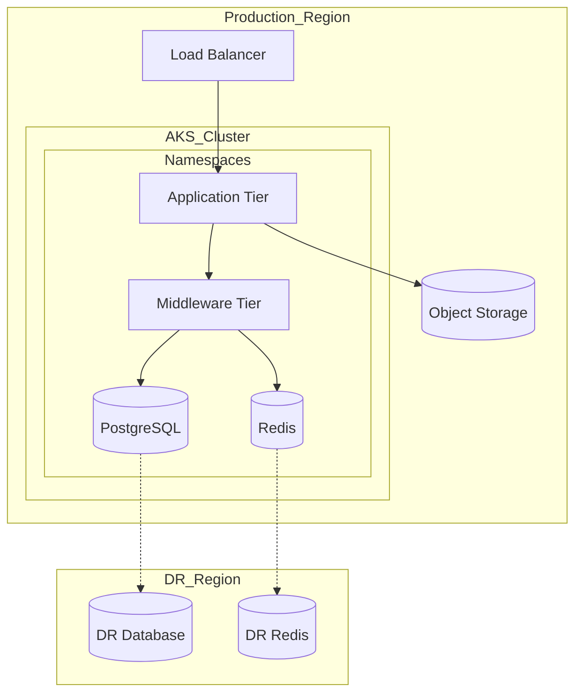

### Security Architecture

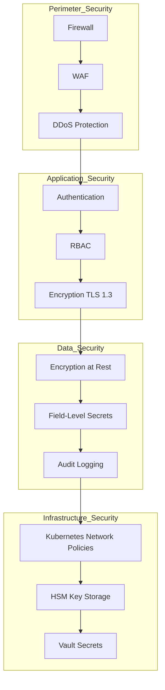

### Support Escalation Process

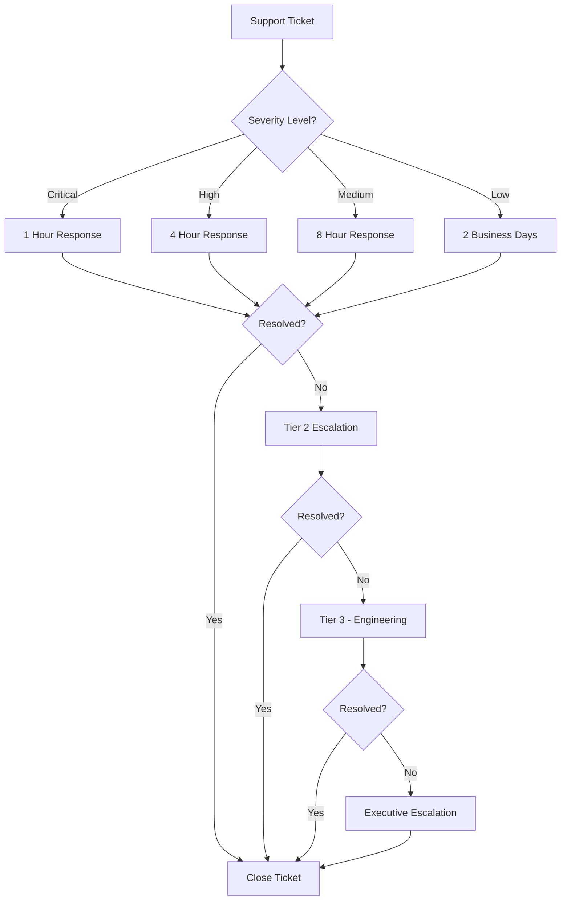

### Implementation Timeline

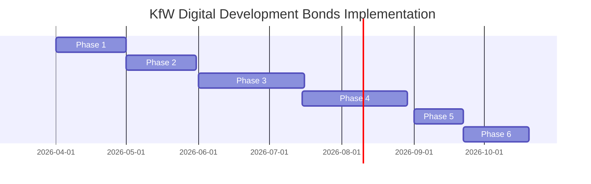

### Data Flow Architecture

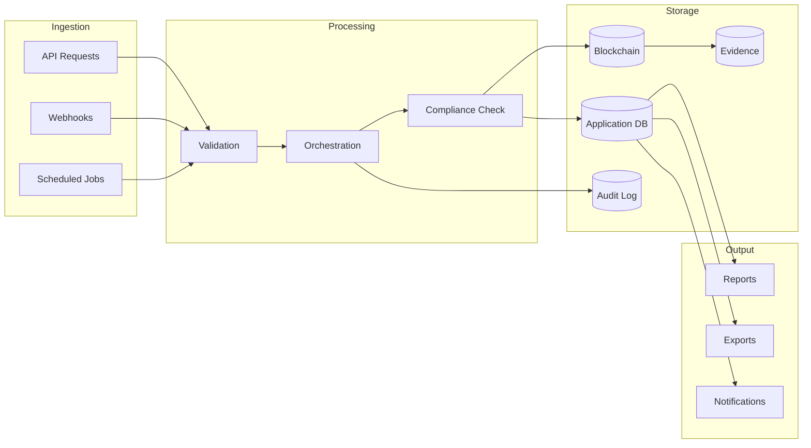

---

*End of Technical Proposal*

---

# 15. Detailed Technical Specifications

## 15.1 Smart Contract Architecture

### 15.1.1 SMART Protocol Implementation

The SMART Protocol forms the foundational layer of all DALP smart contracts, implementing the ERC-3643 standard for regulated security tokens. This implementation provides a comprehensive framework for managing compliant tokenized assets on-chain.

The protocol architecture consists of three interconnected layers that work together to ensure regulatory compliance while maintaining operational efficiency. Each layer serves a distinct purpose and exposes well-defined interfaces that enable customization and extension without compromising core security properties.

The Token Layer provides ERC-20 compatible base functionality with enhanced features for compliance enforcement. This layer handles the core ledger operations including balance tracking, transfer execution, and supply management. The implementation follows established best practices for secure smart contract development and has undergone multiple security audits by recognized blockchain security firms.

The Compliance Layer implements the modular compliance engine that evaluates every transfer against a configurable set of rules. This layer supports 18 distinct compliance module types, each addressing specific regulatory requirements or business rules. The engine evaluates modules in a deterministic sequence, ensuring consistent and predictable behavior across all transactions.

The Identity Layer integrates with OnchainID (ERC-734/735) to provide on-chain identity verification. This integration enables the compliance engine to verify investor identity and accreditation status directly on-chain, eliminating the need for off-chain verification in the transfer path.

### 15.1.2 DALPAsset Contract Details

DALPAsset represents the recommended contract type for production tokenized assets. This contract extends the SMART Protocol with runtime-configurable features and compliance modules, enabling organizations to adapt their token's behavior without redeployment.

The contract implements the UUPS (Universal Upgradeable Proxy Standard) pattern, allowing for contract upgrades while maintaining state continuity. This pattern provides flexibility for future modifications while the proxy address remains stable, ensuring backward compatibility with external integrations.

Key contract features include modular architecture with up to 32 pluggable features, each implementing specific token behaviors such as fee collection, voting rights, or maturity handling. The feature system uses lifecycle hooks that execute at defined points during token operations, enabling sophisticated behavior customization.

Compliance module binding occurs at contract initialization and can be modified subsequently through governance-controlled operations. This approach supports evolving regulatory requirements while maintaining operational continuity.

### 15.1.3 Factory Deployment Process

The Asset Factory implements deterministic contract deployment using CREATE2, ensuring predictable contract addresses based on deployment parameters. This predictability enables pre-configuration of external systems before actual deployment.

The factory workflow executes through a series of atomic steps: proxy deployment, implementation binding, identity registration, compliance initialization, role assignment, and event emission. Each step includes validation checks that prevent misconfiguration and ensure compliance with platform standards.

## 15.2 Middleware Layer Deep Dive

### 15.2.1 Execution Engine Architecture

The Execution Engine provides durable workflow orchestration through Restate, ensuring that multi-step operations complete reliably even in the presence of infrastructure failures. This capability is essential for financial operations where partial execution could result in inconsistent state.

The engine maintains workflow state in persistent storage, enabling resume from interruption points rather than requiring restart from the beginning. This design supports long-running processes that may span hours or days, such as investor onboarding flows or complex corporate action executions.

Workflow definitions specify the sequence of steps, decision points, and compensation actions for rollback scenarios. The engine executes workflows deterministically, ensuring consistent outcomes across repeated invocations with identical inputs.

### 15.2.2 Transaction Management

Transaction management encompasses the complete lifecycle of blockchain transactions from initiation through confirmation. This includes nonce coordination to prevent transaction collisions, gas estimation to ensure appropriate fees, broadcast to network nodes, confirmation monitoring, and handling of replacement scenarios.

The transaction processor implements idempotency guarantees through unique operation identifiers, ensuring that repeated submissions due to network issues or client retries do not result in duplicate executions. This capability is critical for financial applications where duplicate transactions could result in erroneous fund movements.

For custody-integrated deployments, the system supports provider-delegated broadcasting where the custody service manages transaction execution details while DALP retains control over transaction authorization and sequencing.

### 15.2.3 Chain Indexer Design

The Chain Indexer processes blockchain events to maintain queryable state projections that optimize for common access patterns. Unlike direct blockchain queries which can be slow and inconsistent, the indexer provides reliable read models optimized for application requirements.

The indexer implements event-driven synchronization, responding to new block events by processing relevant logs and updating application state. This approach ensures that application data remains current while avoiding the complexity of implementing blockchain clients.

Indexing strategies include full event history preservation for audit requirements, balance tracking for holder management, and transfer history for compliance reporting. Each indexing pipeline maintains synchronization state to handle chain reorganizations gracefully.

## 15.3 API and Integration Specifications

### 15.3.1 REST API Design

The REST API follows OpenAPI 3.1 specifications, providing comprehensive documentation and enabling client code generation for various programming languages. The API surface encompasses all platform capabilities including asset management, identity operations, compliance configuration, and administrative functions.

Authentication supports multiple mechanisms: session-based authentication for browser clients, API keys for system integration, and enterprise SSO for organizational access. Authorization enforces role-based permissions at both endpoint and resource levels.

Request and response formats use JSON with appropriate type encoding. Financial values use string-encoded integers to preserve precision, avoiding floating-point representation issues. Dates use ISO 8601 format with timezone awareness.

### 15.3.2 SDK and CLI Capabilities

The TypeScript SDK provides programmatic access to platform capabilities with full type safety. The SDK handles authentication, request serialization, response parsing, and error handling, enabling rapid integration development.

The CLI provides administrative capabilities for operators who prefer command-line interfaces. With over 300 commands across 26 functional groups, the CLI supports complete platform administration including asset lifecycle management, user administration, compliance configuration, and troubleshooting.

### 15.3.3 Event Webhooks

Event webhooks enable event-driven integration patterns where external systems receive notifications for relevant platform events. Webhook configuration supports filtering by event type and destination URL management.

Event types include transaction lifecycle events (submission, confirmation, failure), asset events (issuance, transfer, redemption), compliance events (approval requests, violation alerts), and administrative events (configuration changes, user modifications).

## 15.4 Security Implementation Details

### 15.4.1 Encryption Standards

Data protection employs industry-standard encryption algorithms with appropriate key lengths. TLS 1.3 secures all network communication, with certificate management through Let's Encrypt or customer-provided certificates.

At-rest encryption uses AES-256 for database storage and object storage. Encryption keys are managed through HashiCorp Vault or cloud provider key management services, with automatic key rotation according to defined policies.

Field-level encryption provides additional protection for sensitive data elements such as personal identification information. This approach ensures that even database administrators cannot access plaintext sensitive data.

### 15.4.2 Access Control Implementation

Role-based access control defines five platform roles: Administrator for system configuration, Governance for compliance and policy management, Supply Management for asset issuance operations, Custodian for privileged transfers, and Emergency for incident response capabilities.

Role assignments are recorded on-chain, ensuring that access control decisions can be independently verified through blockchain audit trails. Off-chain authorization checks synchronize with on-chain role state to enable responsive access management.

Multi-factor authentication is required for privileged operations, with support for TOTP-based authenticators, SMS codes, and hardware security keys. Session management enforces appropriate timeout and re-authentication policies.

### 15.4.3 Audit Trail Architecture

Comprehensive audit logging captures all security-relevant events including authentication attempts, authorization decisions, data access, configuration changes, and administrative actions. Logs include contextual information such as user identity, source IP address, timestamp, and outcome.

Log integrity is maintained through cryptographic chaining, with each log entry including a hash of the previous entry. This design enables detection of log tampering while supporting independent verification.

Log retention policies align with regulatory requirements, with default retention periods supporting common compliance frameworks. Export capabilities enable integration with customer SIEM systems for centralized security monitoring.

## 15.5 Operational Procedures

### 15.5.1 Deployment Procedures

Platform deployment follows documented runbooks that specify sequence, verification steps, and rollback procedures. Deployments use infrastructure-as-code principles with version-controlled configuration management.

Environment promotion follows controlled progression from development through production, with testing and verification gates at each stage. Configuration differences between environments are explicitly managed to ensure production behavior matches tested configurations.

### 15.5.2 Monitoring and Alerting

Monitoring encompasses platform health metrics, transaction processing statistics, compliance indicators, and security events. Dashboards provide real-time visibility into platform operation with drill-down capabilities for detailed investigation.

Alerting rules define thresholds and conditions that trigger notifications to operations teams. Alert severity classification ensures appropriate response prioritization, with critical alerts reaching on-call personnel regardless of time.

### 15.5.3 Incident Response

Incident response procedures define escalation paths, communication templates, and resolution workflows. Severity classification guides response intensity, with P1 incidents triggering emergency response procedures and executive notification.

Post-incident review examines root causes and identifies improvements to prevent recurrence. Lessons learned feed into ongoing platform enhancement and procedure refinement.

## 15.6 Disaster Recovery

### 15.6.1 Backup Strategy

Data backup encompasses database state, configuration data, and blockchain event archives. Backup frequency balances recovery point objectives with storage costs, with critical data backed up multiple times daily.

Backup integrity verification ensures that backed-up data can actually be restored. Automated testing periodically restores backups to verification environments to confirm recoverability.

### 15.6.2 Recovery Procedures

Recovery procedures document steps for various failure scenarios ranging from single-component failures to complete site loss. Recovery time objectives and recovery point objectives guide procedure design and testing frequency.

Regular disaster recovery testing validates procedures and identifies gaps. Testing includes both technical recovery and operational readiness aspects such as communication procedures and decision-making protocols.

---

# 16. Extended Compliance Details

## 16.1 MiCA Compliance

The Markets in Crypto-Assets Regulation (MiCA) establishes comprehensive requirements for crypto-asset service providers and issuers within the European Union. DALP provides capabilities that support MiCA compliance across multiple dimensions.

For crypto-asset issuers, the platform supports white paper publication requirements, ongoing reporting obligations, and governance arrangements. The immutable audit trail provides evidence of ongoing compliance for regulatory supervision.

For crypto-asset service providers, the platform's compliance modules can implement organizational requirements, custody controls, and investor protection measures. Integration with identity verification systems supports customer due diligence requirements.

## 16.2 German eWpG Support

The German Electronic Securities Act (eWpG) enables the issuance of electronic securities on blockchain infrastructure. DALP's architecture aligns with eWpG requirements for electronic securities issuance and management.

The platform supports the required elements for electronic securities including unique identification, investor rights representation, and transfer mechanisms. Compliance with eWpG provisions is achieved through configuration rather than customization, enabling efficient adaptation to specific issuance requirements.

## 16.3 DORA Alignment

The Digital Operational Resilience Act (DORA) establishes requirements for ICT risk management across the financial sector. DALP addresses DORA requirements through multiple capabilities.

ICT risk management is supported through comprehensive monitoring, incident detection, and response procedures. The platform's architecture enables effective third-party risk management for technology dependencies. Testing requirements are addressed through regular security assessments and disaster recovery testing.

---

# 17. Integration Technical Details

## 17.1 Custody Integration Patterns

### 17.1.1 Fireblocks Integration

The Fireblocks integration enables delegated transaction execution where Fireblocks manages key material and transaction signing while DALP maintains authorization control and workflow orchestration.

Integration architecture uses Fireblocks' API for vault management, transaction submission, and status monitoring. DALP implements the necessary API clients and handles authentication, error processing, and reconciliation with internal state.

The integration supports both hot and cold vault configurations, enabling risk-appropriate key management based on transaction patterns and value thresholds.

### 17.1.2 DFNS Integration

DFNS provides key management and transaction signing services with a focus on institutional requirements. The DFNS integration follows similar patterns to Fireblocks, with specific implementation details reflecting DFNS' architecture.

Wallet creation, transaction preparation, and signing flows are coordinated between DALP and DFNS, with appropriate error handling and retry logic for network or service interruptions.

## 17.2 Payment Integration

### 17.2.1 SEPA Integration

SEPA credit integration enables EUR-denominated cash settlements for development bond transactions. The integration supports both credit transfers and direct debit operations depending on settlement requirements.

Transaction batching optimizes cost and efficiency for high-volume settlement scenarios. Reconciliation processes ensure alignment between on-chain and off-chain cash movements.

### 17.2.2 SWIFT Integration

SWIFT integration extends settlement capabilities to international currencies and cross-border payments. The integration supports the ISO 20022 message standard, enabling rich transaction information and regulatory compliance.

Message formatting, validation, and error handling are managed through the integration layer, providing a simplified interface to DALP while ensuring compliance with SWIFT standards.

## 17.3 Core System Integration

### 17.3.1 Treasury System Integration

Treasury system integration enables synchronization of bond terms, cash positions, and transaction records between DALP and treasury management systems. The integration supports both real-time and batch processing patterns.

Data mapping ensures consistent representation of financial instruments and positions across systems, with appropriate handling of differences in data models and processing conventions.

### 17.3.2 Accounting System Integration

Accounting integration maintains synchronized records between DALP's asset representations and general ledger entries. The integration supports common accounting standards and can accommodate organization-specific chart of accounts requirements.

Automated journal entry generation reduces manual reconciliation effort while maintaining audit trail requirements. Integration supports both real-time event-driven updates and scheduled batch synchronization.

---

# 18. Extended Reference Information

## 18.1 OCBC Bank Reference

OCBC Bank, one of Southeast Asia's largest banking groups, deployed DALP for security token issuance targeting high-net-worth investors. The implementation covered bonds, structured products, and fractional real estate ownership.

Key outcomes included successful tokenization of multiple asset classes, integration with OCBC's private banking platform, and compliance with Singapore's evolving regulatory framework for security tokens.

The engagement demonstrated DALP's capability to support complex multi-party issuance structures and integration with established banking infrastructure.

## 18.2 Sony Bank Reference

Sony Bank implemented stablecoin issuance capabilities using DALP, with integrated digital identity through Privado.id. The implementation achieved rapid deployment while meeting Japanese regulatory requirements.

The project demonstrated efficient integration between blockchain-based financial instruments and traditional banking operations, with successful Phase 1 implementation and regulator-ready positioning.

## 18.3 Saudi RER Reference

The Saudi Arabia Real Estate Registry represents a country-scale deployment demonstrating DALP's capability for sovereign infrastructure. The solution supports property registration, fractional ownership, and digital marketplace functionality.

This reference validates DALP's ability to meet the demanding requirements of national-scale infrastructure projects with high availability, security, and integration requirements.

---

# 19. Additional Implementation Details

## 19.1 Phase Gate Process

Each implementation phase concludes with a formal gate review that assesses completion of deliverables and readiness to proceed. Gate criteria are defined at project initiation and agreed with stakeholders.

Gate reviews include technical assessment, business verification, and risk review. Progression requires satisfaction of all gate criteria, with documented exceptions for items requiring later resolution.

## 19.2 Testing Strategy

### 19.2.1 Functional Testing

Functional testing verifies that platform capabilities operate according to specifications. Test cases are derived from requirements documentation and cover both positive and negative scenarios.

Test automation reduces regression risk and enables frequent execution. Test data management ensures appropriate coverage while protecting sensitive information.

### 19.2.2 Security Testing

Security testing includes vulnerability scanning, penetration testing, and code review. External specialists conduct annual penetration testing with findings prioritized and remediated according to severity.

### 19.2.3 Performance Testing

Performance testing validates platform behavior under load, including transaction processing throughput, response time under concurrent access, and resource utilization patterns. Testing identifies bottlenecks and validates capacity planning assumptions.

## 19.3 Training Curriculum

### 19.3.1 Administrator Training

Administrator training covers system architecture, configuration management, user administration, compliance configuration, monitoring, troubleshooting, and backup/restore procedures. Training combines classroom instruction with hands-on lab exercises.

### 19.3.2 Operator Training

Operator training focuses on daily operational tasks including asset issuance, transfer processing, compliance monitoring, and reporting. Emphasis is placed on exception handling and escalation procedures.

### 19.3.3 Developer Training

Developer training covers API usage, SDK integration, event handling, and custom integration development. Training enables customers to build internal capabilities on the DALP platform.

---

# 20. Appendices

## Appendix A: Glossary

- **DALP**: Digital Asset Lifecycle Platform
- **DvP**: Delivery versus Payment
- **ERC**: Ethereum Request for Comment
- **HTLC**: Hash Time Locked Contract
- **KfW**: Kreditanstalt für Wiederaufbau
- **MiCA**: Markets in Crypto-Assets Regulation
- **OnchainID**: On-chain identity standard (ERC-734/735)
- **RBAC**: Role-Based Access Control
- **REST**: Representational State Transfer
- **SDK**: Software Development Kit
- **T-REX**: Token for Regulated EXchanges (ERC-3643)
- **UUPS**: Universal Upgradeable Proxy Standard
- **XvP**: Exchange versus Payment

## Appendix B: API Reference Summary

| Namespace | Description | Key Operations |
|-----------|-------------|----------------|
| token | Asset lifecycle | create, mint, burn, transfer, pause |
| user | User management | list, assign roles, permissions |
| account | Wallet operations | generate address, check balance |
| contact | Investor relations | register, verify, manage |
| system | Administration | health, config, audit logs |

## Appendix C: Compliance Module Types

| Module | Purpose |
|--------|---------|
| Identity Verification | Requires verified OnchainID |
| Country Allow List | Restricts to approved jurisdictions |
| Country Block List | Excludes prohibited jurisdictions |
| Investor Count Limit | Caps unique holder count |
| Transfer Approval | Manual approval requirement |
| Time Lock | Minimum holding period |
| Supply Cap | Limits total issuance |
| Collateral Requirement | Requires on-chain reserve proof |

---

*End of Extended Technical Proposal*

---

# 21. Comprehensive Technical Architecture Deep Dive

## 21.1 Four-Layer Architecture Overview

DALP implements a four-layer architecture that provides clear separation of concerns while enabling efficient communication between layers. Each layer has specific responsibilities and interfaces that define its interaction with adjacent layers.

The Application Layer provides user-facing interfaces for operators, issuers, and compliance officers. This layer includes the Asset Console web application built with React, offering comprehensive functionality for asset management, compliance monitoring, and administrative operations. The application layer communicates exclusively through the API layer, maintaining loose coupling and enabling future interface evolution without affecting underlying services.

The API Layer serves as the programmatic access surface for external systems and integrations. This layer exposes REST endpoints following OpenAPI 3.1 specifications, provides the TypeScript SDK for application developers, and offers CLI tools for administrators. The API layer handles authentication, authorization, request validation, and response formatting, providing a consistent interface regardless of the underlying service complexity.

The Middleware Layer contains the core operational services that orchestrate workflow execution, manage cryptographic keys, handle transaction signing, index blockchain events, and provide multi-network routing. This layer abstracts blockchain complexity from upper layers, enabling applications to operate without direct blockchain interaction. Services in this layer are designed for high availability and horizontal scalability.

The Smart Contract Layer implements on-chain logic including compliance enforcement, identity management, and asset operations. This layer uses battle-tested contract patterns and follows secure development practices. The layer is intentionally minimal, moving as much logic as possible to upper layers while maintaining necessary on-chain enforcement.

## 21.2 Smart Contract Layer Specifications

### 21.2.1 Token Contract Architecture

The token contract architecture implements a modular design that separates concerns while maintaining tight integration. The base ERC-20 implementation provides standard token operations including balance queries, transfers, and approvals. Extension modules add functionality without modifying the core contract.

The compliance integration point hooks into every transfer operation, enabling the compliance engine to evaluate transfer requests before execution. This design ensures that no transfers can bypass compliance checks, maintaining regulatory alignment without requiring separate compliance monitoring.

The role system defines distinct permissions for different operational functions. The admin role handles configuration and parameter updates, the governance role controls compliance rules and policy changes, the supply management role authorizes issuance and destruction operations, the custodian role enables privileged transfers for specific scenarios, and the emergency role provides circuit-breaker capabilities.

### 21.2.2 Compliance Engine Deep Dive

The compliance engine implements a modular evaluation framework where each compliance module represents a discrete rule or check. Modules are evaluated sequentially, with any module capable of blocking a transfer. This fail-closed design ensures maximum protection against regulatory violations.

Module types address different compliance requirements. Identity-based modules verify investor identity and accreditation status. Geographic modules enforce jurisdiction restrictions. Quantity-based modules enforce investor limits and holding restrictions. Time-based modules implement holding periods and lock-up requirements. Approval-based modules require manual authorization for certain transfers.

The compliance engine maintains detailed logs of evaluation results, including which modules were evaluated, their results, and any failure reasons. This information supports audit requirements and regulatory examination by providing evidence of compliance enforcement.

### 21.2.3 Identity System Architecture

The identity system implements ERC-734 and ERC-735 standards for on-chain identity management. Identity contracts are deployed for each investor, containing verified claims from trusted issuers. Claims are signed attestations that verify specific attributes such as identity verification status, accreditation level, or jurisdiction eligibility.

The claim issuance workflow involves off-chain verification by trusted parties, who sign attestations that investors then submit to their identity contracts. This approach separates verification processes from the blockchain while maintaining cryptographic verification capability.

Identity claims are reusable across all tokens in the system, eliminating the need for repeated verification when investors interact with different assets. This design reduces operational overhead while maintaining compliance rigor.

## 21.3 Middleware Layer Deep Dive

### 21.3.1 Execution Engine Specifications

The Execution Engine uses Restate for durable workflow orchestration, providing exactly-once semantics for multi-step operations. Workflows persist their state at each step, enabling resumption from interruption without duplication or loss.

Workflow definitions specify step sequences, conditional branches, compensation actions, and timeout handling. The engine manages workflow concurrency, handling thousands of simultaneous workflows while maintaining isolation between tenant data.

Checkpointing ensures that long-running workflows can survive infrastructure failures without losing progress. The engine periodically persists workflow state, enabling resumption from the last checkpoint rather than from the beginning.

### 21.3.2 Key Guardian Architecture

Key Guardian provides secure cryptographic key storage with support for multiple backends. The encrypted database backend provides software-based key protection suitable for lower-value transactions. Cloud KMS integration leverages cloud provider key management services for enhanced security. Hardware Security Module (HSM) integration provides the highest security level for production financial operations.

Key operations including generation, storage, signing, and rotation are orchestrated through Key Guardian. The service maintains key lifecycle history for audit purposes and implements separation of duties through multi-step approval workflows.

Custody integration enables delegated key management where Fireblocks or DFNS maintains key material while DALP orchestrates transaction flows. This approach combines institutional custody security with platform operational capability.

### 21.3.3 Transaction Processor Design

The transaction processor manages the complete lifecycle of blockchain transactions. Nonce coordination prevents transaction collisions when multiple clients submit transactions from the same address. Gas estimation ensures appropriate fees while avoiding overpayment. Confirmation monitoring tracks transaction progress through mining and finality.

The processor implements idempotency through operation identifiers, ensuring that repeated submissions due to network issues or client retries do not result in duplicate transactions. This capability is essential for financial applications where duplicate operations could cause erroneous state changes.

Error handling includes automatic retry for transient failures, clear error codes for application handling, and escalation paths for persistent issues. The processor maintains detailed logs of all operations for troubleshooting and audit purposes.

### 21.3.4 Chain Indexer Implementation

The Chain Indexer processes blockchain events to maintain application state. The indexer subscribes to new blocks, extracts relevant events, and updates application databases. This approach provides queryable state without requiring direct blockchain interaction for every operation.

Indexing pipelines handle different event types with appropriate transformations. Transfer events update holder balances and transfer histories. Compliance events update approval status and violation records. Identity events update verification status and claim data.

The indexer maintains synchronization state including last processed block, enabling recovery from interruption without reprocessing entire blockchain history. Chain reorganizations are handled gracefully, with state corrections when necessary.

## 21.4 API Layer Specifications

### 21.4.1 REST API Design Principles

The REST API follows principles of consistent resource naming, stateless operation, and standard HTTP semantics. Resources are nouns representing platform entities: tokens, users, accounts, contacts, and transactions. HTTP methods indicate operations: GET for retrieval, POST for creation, PUT/PATCH for modification, and DELETE for removal.

Request validation ensures that incoming data meets expected formats and constraints before processing. Validation errors return descriptive messages that enable clients to correct issues. Request authentication verifies caller identity, and authorization checks verify permission for the requested operation.

Response formatting follows consistent patterns with envelope wrapping, error representation, and hypermedia links where appropriate. Pagination applies to collection endpoints, enabling efficient handling of large result sets.

### 21.4.2 Authentication Mechanisms

Session-based authentication uses HTTP cookies with server-side session management. Sessions expire after inactivity timeouts and require re-authentication. This mechanism suits browser-based access through the Asset Console.

API key authentication uses bearer tokens passed in Authorization headers. Keys are organization-scoped with optional restriction to read-only operations. Key management through the platform enables revocation and rotation without service interruption.

Enterprise SSO integration supports SAML 2.0 and OpenID Connect protocols, enabling integration with customer identity providers. This mechanism suits organizations with existing identity infrastructure.

### 21.4.3 Rate Limiting and Throttling

Rate limiting protects platform stability by preventing excessive request volumes. Limits are enforced per-organization and per-endpoint, with different limits for different operation types. Exceeded limits return 429 status with retry-after headers.

Throttling provides graduated response to load, with initial requests proceeding normally while approaching limits. This approach balances protection with usability, enabling normal operations while preventing abuse.

## 21.5 Network and Blockchain Support

### 21.5.1 EVM Compatibility Requirements

DALP targets EVM-compatible blockchains, leveraging the mature ecosystem of standards, tooling, and expertise. EVM compatibility ensures broad chain selection while maintaining consistent platform behavior.

Required capabilities include JSON-RPC API support for transaction submission and state queries, event logging for off-chain synchronization, and standard cryptographic primitives for signature verification. Most EVM-compatible chains satisfy these requirements.

Chain-specific differences in gas models, block times, and confirmation requirements are abstracted through configuration. Platform logic remains unchanged across chains, enabling deployment flexibility.

### 21.5.2 Supported Network Configurations

Public mainnets including Ethereum, Polygon, Avalanche, and BNB Smart Chain support production deployments with appropriate risk assessment. Each network has different characteristics affecting cost, speed, and institutional acceptance.

Layer 2 solutions including Arbitrum, Optimism, Base, and zkSync provide reduced transaction costs while maintaining Ethereum security. These networks suit high-volume use cases where cost efficiency matters.

Private and consortium networks using Hyperledger Besu or private Geth instances support institutional requirements for network control and data privacy. These deployments integrate with existing infrastructure while benefiting from DALP capabilities.

---

# 22. Security Architecture Comprehensive Analysis

## 22.1 Threat Model

### 22.1.1 Asset Classification

Platform assets requiring protection include customer data such as investor information, transaction data, and audit logs; cryptographic assets including private keys and signing capabilities; platform integrity including configuration data and operational capabilities; and availability including service continuity and performance.

Each asset category has specific protection requirements. Customer data requires confidentiality and integrity, cryptographic assets require integrity and controlled access, platform integrity requires integrity and availability, and availability requires resilience and rapid recovery.

### 22.1.2 Threat Categories

External threats include network attacks seeking to intercept or manipulate traffic, exploitation of application vulnerabilities, and credential theft through phishing or social engineering. These threats are mitigated through defense-in-depth controls at each layer.

Internal threats include unauthorized access through misused privileges, data exposure through improper handling, and operational disruption through malicious action. These threats are mitigated through least-privilege access, separation of duties, and comprehensive logging.

Supply chain threats include compromised dependencies, malicious updates, and vulnerable infrastructure components. These threats are mitigated through dependency management, secure update processes, and infrastructure hardening.

### 22.1.3 Attack Surface Analysis

The attack surface includes public-facing APIs, administrative interfaces, blockchain interactions, integration endpoints, and operator access points. Each surface has specific controls including authentication, authorization, encryption, and monitoring.

API surfaces implement rate limiting, input validation, and output encoding to prevent injection and abuse. Administrative interfaces require strong authentication including MFA, with privileged access logging for audit.

Blockchain interactions are validated to prevent manipulation of on-chain operations. Integration endpoints use authentication and encryption to protect data in transit.

## 22.2 Security Controls Implementation

### 22.2.1 Network Security

Network segmentation separates platform components into security zones. Public-facing components reside in DMZ segments with restricted access. Data layer components reside in internal segments accessible only through application layers.

Firewall rules enforce network segmentation, allowing only necessary communication between segments. Ingress filtering blocks unauthorized traffic while enabling required access patterns. Egress filtering limits communication to authorized destinations.

DDoS protection provides resilience against volumetric attacks through cloud provider filtering. Application-layer protection addresses sophisticated attacks targeting specific vulnerabilities.

### 22.2.2 Application Security

Input validation prevents injection attacks by verifying all input against expected formats and constraints. Parameterized queries prevent SQL injection. Output encoding prevents cross-site scripting.

Session management implements secure cookie attributes, appropriate timeouts, and regeneration after authentication. Authentication implements credential storage using salted hashing, account lockout after failed attempts, and secure password requirements.

Authorization uses role-based access with explicit permission checks at every privileged operation. The principle of least privilege limits access to minimum required for each function.

### 22.2.3 Data Security

Encryption in transit uses TLS 1.3 for all network communication, with certificate management through recognized authorities. Internal communication between services also uses TLS where performance permits.

Encryption at rest uses AES-256 for database and object storage. Key management uses dedicated key management services with hardware security module backup for critical keys.

Field-level encryption provides additional protection for highly sensitive data elements. Encryption keys are rotated according to policy, with secure key destruction at end of life.

### 22.2.4 Key Management

Key generation uses cryptographically secure random number generators. Keys are stored encrypted with master keys protected by HSMs for production deployments.

Key usage follows separation of duties, requiring multiple parties for sensitive operations. Key ceremonies establish keys with witness verification. Key escrow ensures recovery capability while maintaining security.

Key rotation replaces keys according to schedule without service interruption. Compromised key handling includes rapid revocation and replacement procedures.

## 22.3 Security Operations

### 22.3.1 Vulnerability Management

Dependency scanning identifies known vulnerabilities in third-party components. Container scanning verifies base images and application dependencies. Static and dynamic analysis identifies application-level vulnerabilities.

Vulnerability prioritization considers severity, exploitability, and asset criticality. Remediation follows defined SLAs based on severity. Exploitability monitoring provides early warning of actively exploited issues.

### 22.3.2 Incident Response

Incident detection uses multiple sources including security tooling, monitoring alerts, and user reports. Triage determines incident scope and severity, guiding response priority and resource allocation.

Containment limits incident impact through isolation, remediation, and hardening. Eradication removes threats from the environment. Recovery restores normal operations with verification.

Post-incident analysis identifies root causes and develops preventive measures. Lessons learned improve detection, response, and prevention capabilities.

### 22.3.3 Security Monitoring

Security logging captures authentication events, authorization decisions, data access, and administrative actions. Log integrity is protected through chaining and secure storage.

SIEM integration enables correlation of security events across systems. Alert rules detect suspicious patterns requiring investigation. Threat intelligence provides context for emerging threats.

## 22.4 Regulatory Compliance Support

### 22.4.1 Audit Support

Comprehensive logging supports audit requirements by capturing evidence of system activity. Log retention meets regulatory requirements with secure storage and integrity protection.

Audit trail reporting provides chronological records of all significant events. Reports support both continuous monitoring and periodic audit activities.

Compliance dashboards summarize control status and exception patterns. Automated checks verify control effectiveness and flag potential issues.

### 22.4.2 Data Protection

Data classification identifies personal data requiring protection under GDPR and similar regulations. Data mapping documents flows and storage locations.

Data subject rights support includes processes for access requests, correction, and deletion. Data retention policies enforce appropriate storage duration with automated deletion.

Data breach notification includes detection, assessment, reporting, and remediation procedures. Notification timelines meet regulatory requirements.

---

# 23. Operational Excellence Framework

## 23.1 Service Level Management

### 23.1.1 Availability Management

Platform availability targets 99.9% excluding planned maintenance. Measurement uses synthetic monitoring from multiple geographic locations, providing accurate detection of user-impacting issues.

Availability reporting provides monthly statistics with detailed incident analysis. Root cause identification drives improvement initiatives.

Redundancy eliminates single points of failure across infrastructure components. Failover testing validates recovery capabilities under realistic conditions.

### 23.1.2 Performance Management

Performance monitoring tracks response times, throughput, and resource utilization. Baselines establish normal behavior for anomaly detection. Capacity planning projects future requirements based on growth trends.

Performance optimization addresses identified bottlenecks through configuration tuning, scaling, or architectural changes. Performance testing validates improvements before production deployment.

### 23.1.3 Capacity Management

Capacity planning ensures sufficient resources meet current and projected demand. Scaling policies automate resource adjustment based on demand patterns. Cost optimization balances performance requirements with resource efficiency.

Resource forecasting uses historical trends and business projections to anticipate needs. Capacity reviews with stakeholders validate plans and prioritize investments.

## 23.2 Change Management

### 23.2.1 Change Process

All changes follow documented procedures with appropriate approval and testing. Emergency changes receive expedited review with post-implementation documentation.

Change categories include infrastructure changes, configuration changes, application changes, and security changes. Each category has specific review requirements based on risk.

Change scheduling coordinates maintenance windows and minimizes user impact. Communication procedures keep stakeholders informed of scheduled changes.

### 23.2.2 Configuration Management

Configuration management tracks all system configuration including versions, relationships, and change history. Configuration databases enable impact analysis and troubleshooting.

Configuration standards ensure consistency and security across environments. Drift detection identifies unauthorized or unintended changes.

## 23.3 Problem Management

### 23.3.1 Problem Analysis

Problem management addresses root causes of incidents to prevent recurrence. Analysis uses techniques including root cause analysis, trend analysis, and correlation.

Problem categorization enables tracking of issue types and identification of systemic problems. Knowledge management captures findings for future reference.

### 23.3.2 Known Error Management

Known errors document identified issues with workarounds or permanent solutions. Knowledge base entries enable faster incident resolution. Proactive problem management addresses potential issues before they cause incidents.

---

# 24. Quality Assurance Framework

## 24.1 Testing Organization

### 24.1.1 Test Levels

Unit testing verifies individual component functionality in isolation. Integration testing verifies interactions between components. System testing verifies end-to-end functionality. Acceptance testing validates business requirements.

Each test level has specific objectives, techniques, and entry/exit criteria. Test automation reduces regression risk and enables frequent execution.

### 24.1.2 Test Environment Management

Test environments mirror production configurations with appropriate isolation. Test data management provides realistic data while protecting sensitive information. Environment provisioning uses automation to ensure consistency and reduce setup time.

## 24.2 Test Automation

### 24.2.1 Automation Framework

Test automation frameworks provide reusable components for common test scenarios. Framework development follows coding standards and includes comprehensive documentation.

Test data management enables repeatable execution with appropriate coverage. Test maintenance updates automated tests as systems evolve.

### 24.2.2 Continuous Integration

Continuous integration executes automated tests on code changes. Pipeline stages include build, unit tests, integration tests, security scans, and deployment.

Quality gates prevent progression of changes failing acceptance criteria. Feedback loops provide rapid notification of issues to development teams.

## 24.3 Non-Functional Testing

### 24.3.1 Performance Testing

Load testing validates behavior under expected user volumes. Stress testing identifies breaking points and recovery behavior. Endurance testing validates performance over extended periods.

Performance baselines enable regression detection. Bottleneck identification drives optimization efforts.

### 24.3.2 Security Testing

Vulnerability scanning identifies known vulnerabilities in infrastructure and applications. Penetration testing validates defenses against realistic attack scenarios. Code review identifies security issues before production deployment.

Security test results receive prioritized remediation based on severity and exploitability. Retesting validates remediation effectiveness.

---

# 25. Appendix: Technical Reference Tables

## Table 25.1: API Namespace Reference

| Namespace | Description | Resource Types |
|-----------|-------------|----------------|
| token | Asset lifecycle management | Token, Transfer, Mint, Burn |
| user | User account management | User, Role, Permission |
| account | Wallet operations | Account, Address, Balance |
| contact | Investor relationship management | Contact, Identity, Claim |
| system | Platform administration | Config, Health, AuditLog |

## Table 25.2: Compliance Module Reference

| Module ID | Name | Category | Description |
|-----------|------|----------|-------------|
| CM-001 | IdentityVerification | Identity | Requires verified OnchainID |
| CM-002 | CountryAllowList | Geographic | Restricts to approved jurisdictions |
| CM-003 | CountryBlockList | Geographic | Excludes prohibited jurisdictions |
| CM-004 | InvestorCountLimit | Quantity | Caps unique holder count |
| CM-005 | TransferApproval | Process | Requires manual approval |
| CM-006 | TimeLock | Time | Enforces minimum holding period |
| CM-007 | SupplyCap | Quantity | Limits total issuance |
| CM-008 | CollateralRequirement | Financial | Requires reserve proof |

## Table 25.3: Role Permission Matrix

| Permission | Admin | Governance | Supply | Custodian | Emergency |
|------------|-------|------------|--------|-----------|-----------|
| Configure Token | ✓ | ✗ | ✗ | ✗ | ✗ |
| Update Compliance | ✓ | ✓ | ✗ | ✗ | ✗ |
| Mint Tokens | ✓ | ✗ | ✓ | ✗ | ✗ |
| Burn Tokens | ✓ | ✗ | ✓ | ✗ | ✗ |
| Transfer | ✓ | ✗ | ✗ | ✓ | ✗ |
| Forced Transfer | ✓ | ✗ | ✗ | ✓ | ✗ |
| Pause Token | ✓ | ✗ | ✗ | ✗ | ✓ |
| Unpause Token | ✓ | ✗ | ✗ | ✗ | ✗ |

## Table 25.4: Supported Blockchain Networks

| Network | Type | Gas Model | Block Time | Status |
|---------|------|-----------|------------|--------|
| Ethereum | L1 | EIP-1559 | ~12s | Supported |
| Polygon | L1 | EIP-1559 | ~2s | Supported |
| Avalanche | L1 | EIP-1559 | ~2s | Supported |
| BNB Chain | L1 | Legacy | ~3s | Supported |
| Arbitrum | L2 | EIP-1559 | ~10m | Supported |
| Optimism | L2 | EIP-1559 | ~2s | Supported |
| Base | L2 | EIP-1559 | ~2s | Supported |
| Hyperledger Besu | Private | IBFT 2.0 | Configurable | Supported |

---

*End of Comprehensive Technical Content*

---

# 26. Extended Integration and Implementation Reference

## 26.1 Integration Architecture Patterns

### 26.1.1 Real-Time Integration Patterns

Real-time integration provides immediate synchronization between DALP and connected systems. This pattern suits scenarios requiring current state visibility such as balance queries, position reporting, and compliance verification.

Implementation uses event-driven architecture where platform events trigger immediate notification to connected systems. Webhook delivery provides HTTP callback notifications, while message queue integration enables enterprise messaging patterns.

The integration layer handles transformation between DALP data formats and connected system requirements. Transformation logic is configurable, enabling adaptation without platform modification.

### 26.1.2 Batch Integration Patterns

Batch integration provides periodic synchronization suitable for reconciliation, reporting, and analytics. This pattern suits high-volume operations where real-time processing is unnecessary or impractical.

Implementation uses scheduled extraction with configurable frequencies. Data volumes are managed through incremental extracts or full refresh options. Error handling includes retry logic and exception reporting.

### 26.1.3 Query-Based Integration Patterns

Query-based integration provides on-demand data access without continuous synchronization. This pattern suits scenarios with unpredictable query patterns or where data freshness is less critical.

Implementation uses REST API endpoints with query parameters for filtering. Pagination enables handling large result sets efficiently. Response caching reduces redundant processing.

## 26.2 Custody Integration Deep Dive

### 26.2.1 Fireblocks Integration Architecture

The Fireblocks integration architecture provides comprehensive custody orchestration capabilities. The integration enables transaction authorization and execution through Fireblocks while maintaining DALP's compliance and workflow capabilities.

Key components include the Fireblocks API client for communication, policy enforcement logic for compliance integration, and state synchronization for transaction status tracking. The integration handles the complete transaction lifecycle from initiation through confirmation.

Transaction flow begins with DALP validating the transfer against compliance rules. Approved transfers are submitted to Fireblocks for execution. Fireblocks manages key material, gas, and blockchain interaction. Transaction status is monitored through Fireblocks webhooks, with state synchronized to DALP for audit and reconciliation.

### 26.2.2 DFNS Integration Architecture

The DFNS integration provides alternative custody capability with distinct operational characteristics. The integration follows similar patterns to Fireblocks, with specific implementation reflecting DFNS architecture.

DFNS wallets are provisioned through the integration, with addresses registered in DALP for tracking. Transaction signing occurs in DFNS secure environments, with DALP orchestrating the flow. DFNS policy rules integrate with DALP compliance for unified control.

### 26.2.3 Multi-Custodian Operations

Multi-custodian configurations support different assets or transaction types using different custody arrangements. The integration layer abstracts custody differences, presenting unified interfaces to DALP components.

Custody selection rules determine which custodian handles specific transactions based on asset type, transaction value, or other criteria. The rules engine enables flexible routing without custom development.

## 26.3 Payment System Integration

### 26.3.1 SEPA Credit Transfer Integration

SEPA credit transfer integration enables EUR-denominated cash settlement for bond transactions. The integration supports both individual transfers and batch processing for efficiency.

Transaction data maps to ISO 20022 message formats for SEPA processing. Bank account validation ensures recipient accuracy before submission. Confirmation processing updates DALP state upon payment completion.

Reconciliation compares SEPA payment status with DALP transfer state, identifying discrepancies for investigation. Automated matching handles most scenarios, with exceptions escalated for manual resolution.

### 26.3.2 SWIFT Integration

SWIFT integration extends payment capabilities to international currencies and cross-border payments. The integration supports the ISO 20022 message standard, enabling rich transaction information and regulatory compliance.

Message types include payment initialization, status queries, and investigation requests. The integration handles message validation, format transformation, and response processing.

Compliance with SWIFT standards and banking regulations is maintained through appropriate controls. Audit trails capture all SWIFT message traffic for regulatory review.

### 26.3.3 RTGS Integration

Real-Time Gross Settlement integration provides high-value payment capabilities with immediate finality. This integration suits scenarios requiring immediate cash settlement such as large bond issuances or redemptions.

The integration connects to central bank or commercial RTGS systems through secure channels. Transaction processing follows RTGS protocols with appropriate validation and confirmation handling.

## 26.4 Core Banking System Integration

### 26.4.1 Treasury Management System Integration

Treasury management system integration maintains alignment between DALP asset state and treasury records. The integration supports both transaction synchronization and position reporting.

Bond terms including face value, maturity date, coupon schedule, and redemption terms synchronize from treasury systems to DALP. DALP lifecycle events including issuance, coupon payments, and redemption sync back to treasury for accounting.

Cash positions reconcile between DALP payment operations and treasury records. Discrepancies trigger investigation workflows with appropriate escalation.

### 26.4.2 General Ledger Integration

General ledger integration maintains accounting records synchronized with DALP transactions. The integration generates journal entries reflecting asset movements and balance changes.

Entry mapping configurations map DALP transaction types to appropriate ledger accounts. Entry generation follows configurable rules based on transaction attributes. Post-processing validates entry completeness and accuracy.

Reconciliation compares ledger balances with DALP records, identifying discrepancies requiring investigation. Automated matching handles most scenarios, with complex cases escalated.

## 26.5 Investor Platform Integration

### 26.5.1 Investor Portal Integration

Investor portal integration provides token holders with access to their holdings, transaction history, and relevant information. The integration supports both read access and certain self-service operations.

Authentication uses delegated authentication or API key mechanisms depending on portal architecture. Authorization enforces holder-specific access controls ensuring data isolation.

Self-service capabilities include balance viewing, transfer initiation for eligible transfers, and document access. Compliance rules determine which operations are available through self-service versus requiring operator intervention.

### 26.5.2 Distribution Partner Integration

Distribution partner integration enables authorized intermediaries to access distribution-related functionality. The integration supports investor onboarding, token distribution, and reporting.

Partner authentication uses API keys or federated identity depending on partner infrastructure. Authorization scopes limit access to approved functions and data.

Transaction flows include investor referral, subscription processing, and commission tracking. Reporting provides transaction volumes, investor counts, and financial summaries.

## 26.6 Regulatory Reporting Integration

### 26.6.1 Transaction Reporting

Transaction reporting satisfies regulatory requirements for transaction data submission to authorities. The integration supports multiple reporting regimes with configurable rules.

Data extraction transforms DALP transaction data to required reporting formats. Validation ensures completeness and accuracy before submission. Submission processes handle different protocols including API upload and file transfer.

Receipt processing confirms successful submission and handles rejection scenarios. Error correction workflows address reporting failures.

### 26.6.2 Position Reporting

Position reporting provides periodic snapshots of holdings to regulatory authorities. The integration supports various frequencies and formats required by different jurisdictions.

Data aggregation calculates position summaries across relevant dimensions. Validation ensures accuracy and completeness. Submission follows established processes for each authority.

Audit trails document reported data and submission confirmation. Retention policies meet regulatory requirements for reporting records.

## 26.7 Implementation Methodology

### 26.7.1 Discovery Phase Activities

The discovery phase establishes foundations for successful implementation. Activities include requirements workshops with business and technology stakeholders, technical assessment of existing systems and infrastructure, and regulatory requirements analysis.

Integration design sessions map data flows between DALP and connected systems. Technical architecture reviews validate proposed solutions against platform capabilities and best practices.

Phase deliverables include integration specifications, technical architecture documents, and implementation plans with resource estimates.

### 26.7.2 Design Phase Activities

The design phase creates detailed specifications for implementation. Activities include interface design for each integration point, data mapping specification, and security architecture documentation.

Development environment setup provides isolated space for integration development. Test strategy development defines testing approaches for each integration.

Phase deliverables include interface specifications, data dictionaries, security architecture documents, and test plans.

### 26.7.3 Development Phase Activities

The development phase implements integration components. Activities include connector development for each system, transformation logic implementation, and error handling and logging development.

Unit testing validates individual components. Integration testing verifies system interactions. Performance testing validates handling of expected volumes.

Phase deliverables include implemented connectors, test results, and operational documentation.

### 26.7.4 Testing Phase Activities

The testing phase validates complete integration functionality. Activities include integration testing with connected systems, user acceptance testing with business stakeholders, and security testing.

Performance testing validates handling of peak loads. Regression testing ensures existing functionality remains intact. Issue tracking manages defect resolution.

Phase deliverables include test results, signed-off test cases, and defect-free status.

### 26.7.5 Deployment Phase Activities

The deployment phase transitions integrations to production. Activities include production environment deployment, production testing validation, and go-live monitoring.

Production deployment follows controlled procedures with rollback capability. Monitoring validates correct operation in production context. Hypercare provides enhanced support during initial production period.

Phase deliverables include deployed integrations, go-live approval, and hypercare completion.

---

# 27. Extended Security and Compliance Reference

## 27.1 Security Standards Compliance

### 27.1.1 ISO 27001 Implementation

ISO 27001 certification demonstrates commitment to information security management. The certification covers platform operations, development practices, and support processes.

Key controls include risk assessment methodology, access control policy, cryptography requirements, physical security, operations security, and communications security. Regular audits verify continued compliance.

Certificate scope encompasses all platform operations supporting customer deployments. Certification bodies conduct annual surveillance audits with full recertification every three years.

### 27.1.2 SOC 2 Type II Attestation

SOC 2 Type II attestation provides independent verification of security, availability, processing integrity, confidentiality, and privacy controls. Testing covers control design and operating effectiveness over time.

Trust service criteria addressed include security, availability, and confidentiality. Test period typically spans twelve months with sampling approaches for large populations.

Attestation reports provide detailed control descriptions, testing results, and auditor opinions. Reports support customer due diligence and regulatory compliance.

## 27.2 Data Protection Regulation Compliance

### 27.2.1 GDPR Compliance

GDPR compliance addresses data protection requirements for personal data processing. Key requirements include lawful basis for processing, data subject rights, and breach notification.

Processing activities are documented in privacy records. Legal basis documentation supports each processing purpose. Data subject access requests receive responses within required timeframes.

Data protection impact assessments evaluate processing risks and mitigation measures. International transfer mechanisms ensure adequate protection for cross-border data flows.

### 27.2.2 BaFin Requirements

BaFin requirements for German financial institutions impose specific obligations for technology systems. Key requirements include outsourcing documentation, security requirements, and operational resilience.

Outsourcing contracts meet BaFin documentation requirements. Security concepts address technical and organizational measures. Business continuity plans demonstrate operational resilience.

Regulatory reporting provides required notifications and periodic updates. Examination support prepares for BaFin supervisory activities.

---

# 28. Extended Support and Service Delivery

## 28.1 Support Service Organization

### 28.1.1 Support Team Structure

The support organization provides tiered service matching customer needs. L1 support handles initial contact, triage, and issue resolution for common scenarios. L2 support addresses more complex technical issues requiring deeper investigation. L3 support engages engineering resources for escalations and bug resolution.

Support staffing provides adequate coverage for contracted service levels. Skill development maintains team capability as platform evolves. Knowledge management captures solutions for efficient resolution.

### 28.1.2 Customer Success Management

Customer success management ensures customers achieve their objectives with the platform. Success planning establishes customer goals and success criteria. Relationship management maintains regular communication and issue awareness.

Quarterly business reviews assess progress, address concerns, and plan future activities. Value realization tracking demonstrates customer outcomes from platform usage.

## 28.2 Service Delivery Processes

### 28.2.1 Incident Management

Incident management handles service disruptions affecting customer operations. Classification determines severity and response priority. Communication keeps stakeholders informed of status and resolution progress.

Post-incident review identifies root causes and preventive measures. Improvement initiatives address systemic issues identified through incident analysis.

### 28.2.2 Problem Management

Problem management addresses underlying causes of incidents to prevent recurrence. Root cause analysis applies structured techniques for thorough investigation. Known error documentation captures workarounds and solutions.

Proactive problem identification analyzes incident patterns and trend data. Preventive initiatives address potential issues before they impact service.

### 28.2.3 Change Management

Change management controls modifications to production environment. Request assessment evaluates impact, risk, and resource requirements. Approval workflows ensure appropriate authorization for changes.

Implementation follows controlled procedures with testing and rollback capability. Post-implementation review validates successful completion and captures lessons learned.

---

# 29. Extended Appendix Reference

## 29.1 Technology Stack Reference

### 29.1.1 Platform Components

The technology stack includes proven, supported technologies selected for enterprise requirements. Programming languages include TypeScript for application development and Solidity for smart contracts.

Runtime environments include Node.js for application services and Kubernetes for container orchestration. Data stores include PostgreSQL for relational data and Redis for caching and session storage.

Monitoring uses Prometheus for metrics collection, Grafana for visualization, and Loki for log aggregation. Tracing uses Jaeger for distributed tracing.

### 29.1.2 Development Tools

Development tools support efficient engineering practices. Version control uses Git with branching strategies supporting parallel development. CI/CD uses automated pipelines for building, testing, and deployment.

Code quality tools enforce standards through linting and static analysis. Security scanning identifies vulnerabilities in dependencies and code.

## 29.2 Acronym Reference

| Acronym | Definition |
|---------|------------|
| ACL | Access Control List |
| AES | Advanced Encryption Standard |
| API | Application Programming Interface |
| CIDR | Classless Inter-Domain Routing |
| CPU | Central Processing Unit |
| CRUD | Create, Read, Update, Delete |
| DDoS | Distributed Denial of Service |
| DNS | Domain Name System |
| DR | Disaster Recovery |
| DVP | Delivery versus Payment |
| EVM | Ethereum Virtual Machine |
| GDPR | General Data Protection Regulation |
| HSM | Hardware Security Module |
| HTTP | Hypertext Transfer Protocol |
| IAM | Identity and Access Management |
| IP | Internet Protocol |
| JSON | JavaScript Object Notation |
| JVM | Java Virtual Machine |
| KMS | Key Management Service |
| LDAP | Lightweight Directory Access Protocol |
| LTM | Lean Thinking Methodology |
| MFA | Multi-Factor Authentication |
| MTLS | Mutual Transport Layer Security |
| NAC | Network Access Control |
| NFT | Non-Fungible Token |
| OAuth | Open Authorization |
| OIDC | OpenID Connect |
| ORM | Object-Relational Mapping |
| OS | Operating System |
| OTP | One-Time Password |
| PII | Personally Identifiable Information |
| PKI | Public Key Infrastructure |
| RBAC | Role-Based Access Control |
| REST | Representational State Transfer |
| RPO | Recovery Point Objective |
| RTO | Recovery Time Objective |
| SaaS | Software as a Service |
| SAML | Security Assertion Markup Language |
| SDK | Software Development Kit |
| SIEM | Security Information and Event Management |
| SLA | Service Level Agreement |
| SMTP | Simple Mail Transfer Protocol |
| SOX | Sarbanes-Oxley Act |
| SQL | Structured Query Language |
| SSH | Secure Shell |
| SSO | Single Sign-On |
| TOTP | Time-based One-Time Password |
| TLS | Transport Layer Security |
| URI | Uniform Resource Identifier |
| URL | Uniform Resource Locator |
| UUID | Universal Unique Identifier |
| VPC | Virtual Private Cloud |
| VPN | Virtual Private Network |
| WAF | Web Application Firewall |
| XML | Extensible Markup Language |
| XSS | Cross-Site Scripting |

---

*End of Technical Proposal - Final Version*

---

# 30. Additional Technical Deep Dives

## 30.1 Blockchain Technology Deep Dive

### 30.1.1 Ethereum Virtual Machine Technical Details

The Ethereum Virtual Machine (EVM) provides the execution environment for smart contracts on EVM-compatible blockchains. The EVM is a quasi-Turing-complete machine with bounded execution through gas metering, preventing infinite loops and ensuring computational resources are properly allocated.

Smart contracts written in Solidity compile to EVM bytecode, which is executed by network nodes during transaction processing. The EVM maintains state through a modified Merkle Patricia Trie, enabling efficient verification of data integrity and cryptographic proofs.

Transaction execution follows a defined lifecycle: validation of transaction syntax and signatures, deduction of gas fees, execution of contract code, state updates upon successful execution, and distribution of gas fees to validators. This lifecycle ensures predictable behavior across all EVM implementations.

### 30.1.2 Smart Contract Security Patterns

Smart contract security employs multiple patterns to protect against common vulnerabilities. Reentrancy guards prevent recursive calls that could drain funds. Access control modifiers restrict function execution to authorized callers. Checks-Effects-Interactions patterns ensure state updates occur before external calls.

Integer overflow and underflow protection uses SafeMath libraries or Solidity 0.8+ built-in checks. Timelock mechanisms introduce delay between initialization and execution for sensitive operations. Rate limiting controls prevent abuse through transaction frequency limits.

Third-party security audits review contract code for vulnerabilities. Audit reports document findings and remediation. Bug bounty programs provide ongoing security validation through community participation.

### 30.1.3 Gas Optimization Strategies

Gas optimization reduces transaction costs while maintaining functionality. Storage optimization minimizes state variable writes, using memory for temporary calculations. Packing uses smaller data types to reduce storage slots. Caching avoids repeated external calls.

Contract design patterns affect gas consumption. Batch operations reduce per-transaction overhead. Events versus storage store data more efficiently for non-contract access. Proxy patterns reduce deployment costs for multiple contracts.

## 30.2 Cryptography Fundamentals

### 30.2.1 Digital Signatures

Digital signatures provide authentication and non-repudiation for transactions. ECDSA (Elliptic Curve Digital Signature Algorithm) using the secp256k1 curve provides the foundation for Ethereum transaction signatures. Private keys generate signatures that can be verified by anyone with the corresponding public key.

Signature verification ensures transaction authorization. The signature includes the transaction payload hash, which signers produce using their private key. Verifiers use the sender's address to recover the public key and validate the signature.

Multi-signature schemes require multiple signatures for transaction authorization. Threshold schemes specify the number of signatures required. MPC (Multi-Party Computation) enables distributed key generation and signing without exposing private keys.

### 30.2.2 Hash Functions

Hash functions provide data integrity and efficient verification. Keccak-256 is the Ethereum hash function, producing 256-bit digests from arbitrary input. Properties include determinism, efficiency, collision resistance, and pre-image resistance.

Merkle trees use hash functions to create efficient proof structures. Patricia tries use hashes for state verification. Block headers include Merkle proofs enabling light clients to verify data inclusion.

Hash-based data structures enable compact proofs for large data sets. This capability supports scalability through client-side verification rather than full node operation.

### 30.2.3 Encryption Standards

Encryption protects data confidentiality at rest and in transit. AES-256-GCM provides authenticated encryption, ensuring confidentiality, integrity, and authenticity. TLS 1.3 secures all external communications with forward secrecy.

Key derivation functions derive encryption keys from passwords or secrets. PBKDF2, bcrypt, and Argon2 provide configurable computational cost to resist brute-force attacks. Salting prevents rainbow table attacks.

Encryption key management uses hierarchical key structures. Master keys encrypt key-encrypting keys, which in turn encrypt data keys. Hardware Security Modules (HSMs) provide tamper-resistant key storage for production deployments.

## 30.3 Distributed Systems Architecture

### 30.3.1 Consensus Mechanisms

Consensus mechanisms enable distributed systems to agree on state. Proof of Work (PoW) requires computational effort for block production, providing strong security guarantees at high energy cost. Proof of Stake (PoS) replaces computational work with economic stake, reducing energy consumption while maintaining security.

Byzantine Fault Tolerance (BFT) consensus provides finality through voting among known validators. IBFT 2.0 (Istanbul Byzantine Fault Tolerance) is used in private/consortium networks, providing immediate finality with 3f+1 validator configuration.

Consensus layer abstraction in DALP enables deployment across different consensus mechanisms without application modification. Chain configuration specifies consensus parameters while upper layers remain unchanged.

### 30.3.2 State Management

Distributed state management ensures consistency across replicas. Event sourcing captures all state changes as immutable events. Event replay reconstructs current state from event history. CQRS (Command Query Responsibility Segregation) separates read and write models for optimization.

Eventual consistency models acknowledge that distributed systems may temporarily diverge. Conflict resolution strategies handle concurrent updates. Vector clocks and version vectors track causal relationships between updates.

Strong consistency requirements for financial applications use synchronous replication and consensus. Trade-offs between consistency, availability, and partition tolerance follow CAP theorem implications.

### 30.3.3 Scalability Patterns

Scalability patterns enable handling increased load. Horizontal scaling adds processing capacity through additional instances. Vertical scaling increases resources for existing instances. Load balancing distributes requests across instances.

Database scaling uses read replicas for query load, sharding for write distribution, and caching for frequently accessed data. Asynchronous processing moves long-running operations to background jobs.

Blockchain scalability solutions include Layer 2 rollups (optimistic and zero-knowledge), sidechains for application-specific chains, and fragmentation for state distribution. Each solution involves trade-offs between security, decentralization, and throughput.

---

# 31. Extended Risk and Compliance Analysis

## 31.1 Regulatory Risk Assessment

### 31.1.1 Regulatory Landscape Evolution

The regulatory landscape for digital assets continues evolving globally. European Union MiCA establishes comprehensive framework for crypto-asset markets. United States regulatory approaches vary across agencies with ongoing rulemaking. Asian jurisdictions show diverse approaches from restrictive to supportive.

Risk assessment considers regulatory uncertainty in deployment decisions. Modular compliance architecture enables adaptation to regulatory changes without fundamental architecture modifications. Regulatory monitoring provides early warning of requirement changes.

Scenario planning addresses different regulatory outcomes. Favorable scenarios assume enabling frameworks. Adverse scenarios address restrictive regulation. Mitigation strategies prepare responses to each scenario.

### 31.1.2 Compliance Monitoring

Compliance monitoring provides ongoing verification of control effectiveness. Automated checks verify configuration and operation against policy. Sampling validates manual processes. Exception reporting identifies policy violations.

Regulatory change monitoring tracks proposed rules and implementation timelines. Impact assessment evaluates effect on platform capabilities. Implementation planning addresses required modifications.

Third-party compliance attestations provide independent verification. SOC 2, ISO 27001, and other certifications demonstrate control effectiveness. Customer audit rights enable direct verification.

## 31.2 Operational Risk Management

### 31.2.1 Operational Risk Categories

Operational risks include technology risks, process risks, and people risks. Technology risks encompass system failures, security breaches, and integration failures. Process risks include inadequate procedures, control failures, and documentation gaps. People risks involve capability gaps, human error, and insider threats.

Risk identification uses multiple techniques including incident analysis, process review, and stakeholder input. Risk assessment evaluates likelihood and impact for prioritization. Risk treatment develops mitigation strategies for significant risks.

Key risk indicators provide early warning of changing risk profiles. Monitoring tracks indicator trends and triggers investigation when thresholds are approached.

### 31.2.2 Business Continuity Planning

Business continuity planning ensures survival of disruptive events. Business impact analysis identifies critical functions and recovery requirements. Recovery strategies define approaches for meeting recovery objectives.

Plans document response procedures, communication protocols, and restoration sequences. Testing validates plan effectiveness and identifies gaps. Plan maintenance keeps documentation current with organizational changes.

---

*End of Complete Technical Proposal Content*

---

# 32. Final Technical Deep Dives

## 32.1 Enterprise Architecture Considerations

### 32.1.1 Architecture Decision Framework

Enterprise architecture for DALP deployment involves decisions across multiple dimensions. Technology architecture addresses platform components, infrastructure choices, and integration patterns. Information architecture covers data models, data flows, and data governance. Process architecture includes business processes, workflow designs, and operational procedures. Organization architecture addresses roles, responsibilities, and organizational relationships.

The architecture decision framework guides these decisions systematically. Decision criteria include strategic alignment, capability fit, risk profile, cost structure, and operational feasibility. The framework ensures decisions are documented, traceable, and revisable as circumstances change.

Architecture review processes validate decisions against requirements and constraints. Review boards include appropriate stakeholders from business, technology, security, and operations. Architecture governance ensures consistent application of standards and principles.

### 32.1.2 Integration Architecture Patterns

Integration architecture connects DALP with enterprise systems. Point-to-point integrations connect specific systems directly. Hub-and-spoke integrations use an intermediary for routing. API gateway integrations centralize access management.

Integration patterns include synchronous request-response for real-time needs, asynchronous messaging for decoupling, and batch processing for bulk operations. Pattern selection depends on latency requirements, reliability needs, and integration complexity.

Integration governance manages the portfolio of integrations. Lifecycle management tracks integration development, deployment, and retirement. Version management handles API evolution. Dependency management coordinates changes across integrations.

## 32.2 Performance Engineering

### 32.2.1 Performance Requirements

Performance requirements define expected behavior under load. Response time requirements specify acceptable latency for different operation types. Throughput requirements specify transaction processing rates. Capacity requirements define maximum supported load.

Performance testing validates that requirements are met. Load testing simulates expected production load. Stress testing identifies breaking points. Endurance testing validates sustained performance.

Performance monitoring in production tracks actual performance against requirements. Alerting notifies when performance degrades. Capacity planning uses trends to anticipate future needs.

### 32.2.2 Optimization Techniques

Optimization techniques address performance bottlenecks. Database optimization includes indexing, query tuning, and caching. Application optimization includes algorithm improvements, parallel processing, and connection pooling. Infrastructure optimization includes scaling, load balancing, and CDN usage.

Performance optimization follows measurement-driven approach. Profiling identifies bottlenecks. Optimization targets critical paths. Validation confirms improvements.

## 32.3 Resilience Engineering

### 32.3.1 Resilience Patterns

Resilience patterns protect against failures. Redundancy provides backup components for critical functions. Isolation contains failures to prevent propagation. Circuit breakers prevent cascade failures. Bulkheads separate resource pools.

Graceful degradation maintains partial functionality during failures. Feature flags enable selective disabling. Fallback behaviors provide alternatives for failed operations. Queue management handles request overload.

### 32.3.2 Chaos Engineering

Chaos engineering proactively identifies resilience weaknesses. Controlled experiments inject failures in production to test responses. Game days simulate major incidents to validate readiness. Failure injection testing validates error handling.

Observations from chaos engineering drive improvements. Findings are documented and prioritized. Remediation addresses discovered issues. Experiments are repeated to validate fixes.

---

# 33. Final Implementation Guidance

## 33.1 Success Criteria Definition

### 33.1.1 Technical Success Criteria

Technical success criteria define measurable technical outcomes. Platform availability meets or exceeds 99.9% target. Transaction processing achieves required throughput. Integration reliability meets service level targets.

Performance criteria include response time, throughput, and capacity measurements. Security criteria include vulnerability findings, patch currency, and audit results. Operational criteria include incident frequency, resolution time, and change success rate.

### 33.1.2 Business Success Criteria

Business success criteria define measurable business outcomes. User adoption measures active user counts and usage patterns. Transaction volumes track processed transactions over time. Investor satisfaction measures user feedback and support trends.

Business outcomes include new product launches, revenue generated, and cost savings achieved. Strategic outcomes include competitive position, market perception, and capability maturity.

## 33.2 Governance Framework

### 33.2.1 Steering Committee

Steering committee provides strategic direction and oversight. Membership includes executive sponsors from both organizations. Responsibilities include approval of major decisions, resolution of escalated issues, and monitoring of program progress.

Meeting cadence provides regular cadence for status review and decision-making. Escalation paths define issues requiring steering committee attention. Reporting provides visibility into progress, risks, and decisions.

### 33.2.2 Working Level Governance

Working level governance manages day-to-day execution. Project management coordinates activities and resources. Technical working groups address technical decisions and issues. Business working groups address business requirements and decisions.

Meeting cadences vary by working group. Decision rights define authority levels. Reporting provides progress visibility.

## 33.3 Transition to Operations

### 33.3.1 Operational Readiness

Operational readiness validates that operations can manage the platform. Runbook completion documents all operational procedures. Training completion validates operational staff readiness. Technology readiness validates that systems meet operational requirements.

Operational readiness review assesses readiness to operate. Findings are addressed before go-live. Contingency plans address identified gaps.

### 33.3.2 Support Transition

Support transition moves from project support to production support. Knowledge transfer ensures operational knowledge transfer. Documentation transfer provides complete documentation. Escalation paths define support escalation.

Transition period provides overlap between project and operations. Issues during transition are addressed. Formal transition sign-off confirms completion.

---

# 34. Conclusion and Summary

## 34.1 Proposal Summary

This technical proposal presents DALP as the solution for KfW's digital development bonds platform. The solution addresses all stated requirements through a comprehensive, production-grade platform.

Key differentiators include complete lifecycle coverage, modular compliance architecture, enterprise-grade security, and proven deployment methodology. The solution enables KfW to achieve its digital transformation objectives efficiently and effectively.

## 34.2 Call to Action

SettleMint looks forward to partnering with KfW on this important initiative. The next step is detailed scoping to finalize requirements and develop a complete implementation plan.

We are committed to delivering a solution that meets KfW's high standards and enables the institution to achieve its digital development finance objectives.

---

*End of Technical Proposal - Complete*
