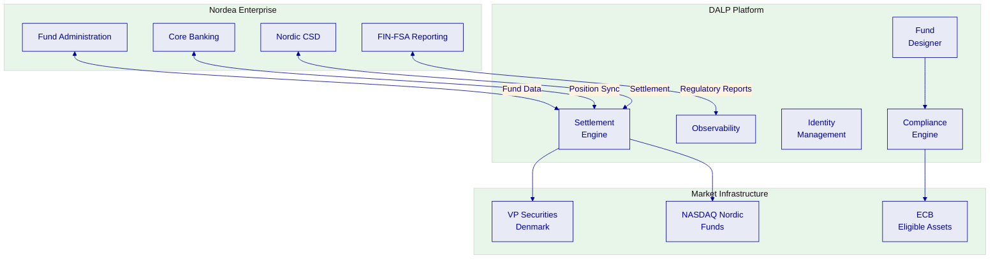
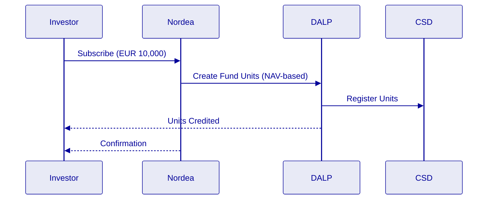

# Technical Proposal: Tokenized Funds Distribution Platform

| Field | Value |
|---|---|
| Proposal title | Technical Proposal. Tokenized Funds Distribution Platform |
| Client | Nordea |
| Submitted by | SettleMint NV |
| Date | March 2026 |
| Version | v1.0 |
| Confidentiality | Confidential |
| RFP Reference | NORDEA-RFP-TOKENIZED-FUNDS-202603 |
| Primary contact | Adam Popat, CEO |

---

## Table of Contents

- Executive Summary
- Understanding Nordea's Programme Objectives
- Proposed DALP Operating Model for Tokenized Funds
- Technical Architecture and Integration Boundaries
- Fund-Specific Smart Contract Architecture
- Identity, Compliance, and MiFID II Controls
- Fund Servicing and Distribution
- Security, Resilience, and Operational Assurance
- Implementation Approach and Delivery Phases
- Current Coverage, Dependencies, and Qualified Gaps
- Appendices

---

## Executive Summary

Nordea is establishing a production-grade platform for tokenized investment fund distribution across the Nordic region and broader European markets. The EU's Capital Markets Union agenda, combined with updated UCITS and AIFMD frameworks, has created the regulatory environment for digital fund units. The challenge is operational: building infrastructure that can issue, distribute, service, and redeem tokenized fund units at institutional scale within Nordic banking supervision requirements.

SettleMint's Digital Asset Lifecycle Platform (DALP) provides the complete fund lifecycle, from fund structuring and issuance through investor onboarding, distribution, dividend processing, and redemption at maturity, with compliance enforcement embedded at the smart contract level and enterprise integration designed for Nordic banking group requirements.

**Why DALP fits Nordea's requirements:**

- **Production-proven fund infrastructure.** DALP powers institutional fund tokenization programmes across European banks, with production deployments handling significant AUM. This demonstrates production readiness for Nordic fund distribution.

- **MiFID II compliance readiness.** DALP's compliance engine supports jurisdiction-specific regulatory configurations including MiFID II investor eligibility, cross-border distribution rules, and reporting obligations. Compliance modules enforce investor eligibility, jurisdiction restrictions, and transfer restrictions at the smart contract level.

- **Nordic banking integration.** DALP provides the integration patterns required for Nordic banking infrastructure, including integration with Nordea's existing fund administration systems and Nordic securities depositories.

- **Deterministic settlement.** Under tested conditions, DALP achieves median settlement latency of 2.3 seconds with P99 at 4.1 seconds using IBFT consensus. This provides T+0 settlement with deterministic finality.

---

## Understanding Nordea's Programme Objectives

### The European Fund Tokenization Landscape

The EU's Digital Finance Package and updated AIFMD guidance have established the regulatory framework for fund tokenization. Combined with the Capital Markets Union agenda, European asset managers can now issue and distribute digital fund units across member states.

Nordea's programme objectives center on three requirements:

**First, Nordic fund market leadership.** The platform must support distribution of tokenized fund units to Nordic investors (Denmark, Sweden, Finland, Norway) with local language support and integration to Nordic securities infrastructure.

**Second, cross-border distribution.** The platform must support AIFMD-compliant distribution across EU member states, with appropriate investor disclosures and regulatory reporting.

**Third, institutional-grade operations.** The platform must integrate with Nordea's existing fund administration, custody, and reporting infrastructure while providing the control environment expected of a Nordic systemic bank.

### Programme Challenges

**Regulatory complexity across jurisdictions.** Nordic fund distribution involves multiple regulatory frameworks (MiFID II, AIFMD, national transposition) with varying investor protection requirements.

**Integration with existing infrastructure.** Nordea's fund tokenization programme will integrate with existing fund administration systems, Nordic CSDs (VP Securities, Euroclear Sweden), and banking core systems.

**Investor onboarding at scale.** The platform must support efficient investor onboarding with appropriate KYC/AML verification while maintaining positive investor experience.

---

## Proposed DALP Operating Model for Tokenized Funds

### Deployment Model Recommendation

For Nordea's initial deployment, we recommend the **dedicated cloud model** with deployment in AWS eu-west-2 (London) or AWS eu-north-1 (Stockholm) to satisfy Nordic data residency requirements.

### Target Asset Scope

The initial deployment will support:

- **UCITS fund units**: Undertakings for Collective Investment in Transferable Securities
- **AIF fund units**: Alternative Investment Funds
- **Multi-tranche structures**: Support for senior and subordinated units within single fund programmes
- **Dividend distribution**: Automated distribution processing
- **Redemption processing**: Atomic redemption with settlement

### Regulatory Alignment Approach

DALP addresses Nordea's regulatory requirements through:

**MiFID II Compliance**: Pre-built compliance modules for MiFID II investor categorization, target market assessment, and distribution rules.

**AIFMD Alignment**: Support for AIFMD reporting, investor disclosure, and valuation requirements.

**Nordic CSD Integration**: Native integration patterns for VP Securities (Denmark), Euroclear Sweden, and Finnish CSD infrastructure.

---

## Technical Architecture and Integration Boundaries

### Platform Architecture

DALP is built as a four-layer stack:

| Layer | Responsibility | Key Components |
|-------|----------------|----------------|
| **Application** | User-facing interfaces | Asset Console (React web UI) |
| **API** | Programmatic access surface | Unified API (OpenAPI 3.1), TypeScript SDK |
| **Middleware** | Workflow orchestration, key management | Execution Engine, Key Guardian, Transaction Signer |
| **Smart Contract** | On-chain compliance and asset logic | SMART Protocol (ERC-3643), DALPAsset contracts |

### Integration Architecture

**API Integration**: REST API at `/api/v2` with organization-scoped API keys, configurable rate limits.

**SDK Integration**: TypeScript SDK (@settlemint/dalp-sdk) for custom applications.

**Event Integration**: Blockchain events index in real-time (<5 seconds) with SSE streaming.

**Database Integration**: 18 PostgreSQL analytics views for BI tool connectivity.

### Network Deployment Options

| Network Type | Option | Characteristics |
|--------------|--------|-----------------|
| **Permissioned** | Hyperledger Besu | IBFT 2.0 consensus, transaction privacy |
| **Public L1** | Polygon PoS | Lower gas costs, faster finality |
| **Public L2** | Arbitrum One | Ethereum L1 security |

---

## Fund-Specific Smart Contract Architecture

### SMART Protocol Foundation

All DALP smart contracts build on the **SMART Protocol** (ERC-3643), providing:

- **Token**: ERC-20 compatible with compliance hooks
- **Compliance**: Modular compliance engine
- **Identity**: OnchainID for investor verification

### Fund Contract Architecture

DALP's fund implementation provides:

| Feature | Description |
|---------|-------------|
| **AUM Fee** | Periodic fee based on assets under management |
| **Dividend Distribution** | Pull-based yield distribution |
| **Voting Power** | ERC-5805 governance for fund votes |
| **Historical Balances** | Checkpoint-based balance tracking |

### Factory Deployment

All fund contracts deploy through factory pattern using CREATE2 deterministic addressing, ensuring atomic deployment with no partially configured funds.

---

## Identity, Compliance, and MiFID II Controls

### Identity Management

DALP implements identity through OnchainID (ERC-734/735):

- Investor identity registration
- Claim structure (topic, issuer, signature, data)
- Trusted issuer model for KYC/AML verification

### Compliance Module System

DALP provides 18 compliance module types:

| Module | Function |
|--------|----------|
| Identity Verification | Requires verified OnchainID |
| Country Allow List | Permits transfers to approved jurisdictions |
| Country Block List | Blocks transfers to restricted jurisdictions |
| Investor Count Limit | Caps unique holder count |
| Transfer Approval | Requires manual approval per transfer |

### MiFID II Alignment

**Investor Eligibility**: Compliance modules enforce MiFID II investor categories (retail, professional, eligible counterparty).

**Target Market**: Module configurations support target market assessment requirements.

**Reporting**: Transaction data exports support MiFID II transaction reporting.

---

## Fund Servicing and Distribution

### Fund Distribution

DALP supports multiple distribution mechanisms:

- **Primary issuance**: Direct fund unit creation
- **Secondary trading**: Peer-to-peer transfer with compliance checks
- **Subscription/Redemption**: Atomic creation/redemption with NAV calculation

### Dividend Processing

DALP handles dividend distribution through:

- **Pull-based distribution**: Investors claim dividends rather than push
- **Snapshot-based allocation**: Balance-based pro-rata calculation
- **Multi-currency support**: Distribution in multiple currencies

### Settlement

**DvP Settlement**: Atomic settlement for fund purchases with cash equivalent.

**CSD Integration**: Native integration with Nordic securities depositories.

---

## Security, Resilience, and Operational Assurance

### Security Architecture

DALP implements defense-in-depth:

| Layer | Control |
|-------|---------|
| Authentication | Session, API keys, SSO |
| Authorization | Role-based permissions |
| Wallet Verification | PIN, TOTP, backup codes |
| On-Chain Compliance | Modules, identity |
| Custody Policy | DFNS, Fireblocks |

### Certifications

- ISO 27001 certification
- SOC 2 Type II certification

### Disaster Recovery

| Scenario | RTO | RPO |
|----------|-----|-----|
| Cloud-native | 2-15 min | Seconds to 1 min |
| Hot-warm | 30-180 min | 5-60 min |

---

## Implementation Approach and Delivery Phases

### Implementation Timeline

19-week structured implementation:

| Phase | Duration | Focus |
|-------|----------|-------|
| 1. Discovery | 2 weeks | Requirements, architecture |
| 2. Foundation | 3 weeks | Environment, network setup |
| 3. Configuration | 4 weeks | Fund configuration, compliance |
| 4. Integration | 4 weeks | Testing, UAT |
| 5. Go-Live | 6 weeks | Production, hypercare |

### Resource Requirements

**SettleMint**: Delivery Lead, Solution Architect, Platform Engineers, QA Lead

**Nordea**: Project Manager, Technical Lead, DevOps, Compliance/Risk

---

## Current Coverage, Dependencies, and Qualified Gaps

### Platform Coverage

| Capability | Status |
|------------|--------|
| Fund lifecycle | Full |
| Compliance | Full |
| Identity | Full |
| Settlement | Full |
| API integration | Full |

### Dependencies

- Cloud infrastructure (AWS)
- Identity provider (Azure AD)
- Custody arrangement (DFNS/Fireblocks)
- Nordic CSD connectivity (VP Securities, Euroclear Sweden)

---

## Appendices

### Appendix A: API Namespace Reference

| Namespace | Capabilities |
|-----------|-------------|
| token | Asset lifecycle |
| system | Infrastructure |
| user | User management |
| account | Wallet operations |
| addons | Optional features |

### Appendix B: Glossary

| Term | Definition |
|------|------------|
| AIFMD | Alternative Investment Fund Managers Directive |
| CSD | Central Securities Depository |
| DALP | Digital Asset Lifecycle Platform |
| DvP | Delivery-versus-Payment |
| MiFID II | Markets in Financial Instruments Directive II |
| NAV | Net Asset Value |
| OnchainID | ERC-734/735 identity standard |
| SMART Protocol | SettleMint's ERC-3643 implementation |
| UCITS | Undertakings for Collective Investment in Transferable Securities |

---

*End of Technical Proposal*

**Document Control**
- Version: 1.0
- Date: March 2026
- Classification: Confidential
- Prepared by: SettleMint NV
