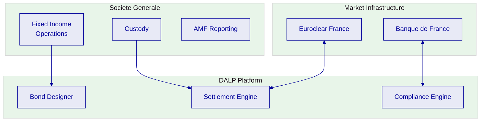

# Technical Proposal: Digital Bonds Issuance Platform

| Field | Value |
|---|---|
| Proposal title | Technical Proposal. Digital Bonds Issuance Platform |
| Client | Societe Generale |
| Submitted by | SettleMint NV |
| Date | March 2026 |
| Version | v1.0 |
| Confidentiality | Confidential |
| RFP Reference | SOCIETE-GENERALE-RFP-DIGITAL-BONDS-202603 |
| Primary contact | Adam Popat, CEO |

---

## Table of Contents

- Executive Summary
- Understanding Societe Generale's Programme Objectives
- Proposed DALP Operating Model for Digital Bonds
- Technical Architecture
- Smart Contract Architecture
- Compliance and Regulatory Controls
- Settlement and Servicing
- Security and Resilience
- Implementation Approach
- Dependencies and Gaps

---

## Executive Summary

Societe Generale is establishing a production-grade platform for digital bond issuance to modernize its fixed-income operations and serve institutional investors through digital channels. The French financial market framework and EU MiCA regulation provide the regulatory foundation for digital securities in France and across Europe.

SettleMint's Digital Asset Lifecycle Platform (DALP) provides complete bond lifecycle management with compliance enforcement at the smart contract level and enterprise integration designed for French banking requirements.

**Key Points:**

- Production-proven bond infrastructure with European bank references
- MiCA and French regulatory compliance readiness
- Integration with French market infrastructure (Euroclear France, Banque de France)
- Deterministic T+0 settlement

---

## Understanding Societe Generale's Objectives

### French Digital Securities Framework

France's transposition of the EU Digital Finance Package and AMF guidance creates the regulatory environment for digital bond issuance in France.

### Objectives

1. **Modernize fixed-income operations**: Digital bond issuance and servicing
2. **Regulatory compliance**: AMF and Banque de France reporting
3. **Market infrastructure integration**: Euroclear France connectivity

---

## Proposed DALP Operating Model

### Deployment Model

Recommended: Dedicated cloud deployment in AWS eu-west-2 (London) or OVHcloud (France)

### Asset Scope

- Corporate bonds
- Sovereign bonds
- Multi-tranche structures

---

## Technical Architecture

### Platform Layers

| Layer | Components |
|-------|-----------|
| Application | Asset Console |
| API | REST API, SDK |
| Middleware | Execution Engine, Key Guardian |
| Smart Contract | ERC-3643, DALPAsset |

### Integration

- REST API with OpenAPI 3.1
- TypeScript SDK
- Event streaming (SSE)
- PostgreSQL analytics

---

## Smart Contract Architecture

### SMART Protocol

ERC-3643 foundation with:

- Token contracts
- Compliance orchestration
- Identity management (OnchainID)

### Bond Features

| Feature | Description |
|---------|-------------|
| Maturity Redemption | Atomic redemption at maturity |
| Coupon Distribution | Pull-based yield |
| Voting Power | ERC-5805 governance |

---

## Compliance and Regulatory Controls

### Compliance Modules

18 module types including:

- Identity Verification
- Country Restrictions
- Investor Count Limits
- Transfer Approval

### AMF Alignment

- MiFID II compliance
- Transaction reporting
- Investor disclosure

---

## Settlement and Servicing

### Settlement Options

- DvP (Delivery-versus-Payment)
- T+0 finality on permissioned networks

### Servicing

- Coupon distribution
- Maturity redemption
- Corporate actions

---

## Security and Resilience

### Security Layers

1. Authentication (session, API keys)
2. Authorization (roles)
3. Wallet verification
4. On-chain compliance
5. Custody policy

### Certifications

- ISO 27001
- SOC 2 Type II

---

## Implementation Approach

### Timeline

19 weeks:

- Discovery: 2 weeks
- Foundation: 3 weeks
- Configuration: 4 weeks
- Integration: 4 weeks
- Go-Live: 6 weeks

---

## Dependencies and Gaps

### Dependencies

- Cloud infrastructure
- Custody provider
- Euroclear France integration

---

*End of Technical Proposal*

**Document Control**
- Version: 1.0
- Date: March 2026
- Prepared by: SettleMint NV
