# Technical Proposal: Wholesale CBDC Pilot Infrastructure

**Prepared for:** Bank of England
**Document Title:** Technical Proposal. Wholesale CBDC Pilot Infrastructure
**RFP Reference:** BANKOFENGLAND-RFP-202603
**Submission Date:** March 2026
**Version:** 1.0 Draft
**Classification:** SettleMint Confidential

**Prepared by:** SettleMint NV
**Primary Contact:** Digital Assets Programme. SettleMint Enterprise

---

## Table of Contents

1. Executive Summary
2. About SettleMint
3. About DALP
4. Customer References
5. Understanding of Requirements
6. Proposed Solution and Functional Capabilities
7. Technical Architecture
8. Security
9. Implementation and Delivery
10. Deployment Options
11. Training and Knowledge Transfer
12. Support and SLA
13. Risk Management
14. Compliance Matrix

---

## 1. Executive Summary

### 1.1 Context and Strategic Drivers

The Bank of England faces a structurally distinct challenge in this procurement. The Bank is not simply evaluating whether a platform can issue tokenized instruments. The challenge is whether a platform can support the governance posture, control architecture, and evidence discipline required by a systemically critical institution whose every operational decision sits inside a framework of FMI rules, the Operational Resilience regime, and direct accountability to public policy objectives.

The wholesale CBDC pilot infrastructure programme emerges from a well-documented trajectory: the Bank's Project Meridian experiments, the joint Bank/HM Treasury CBDC taskforce findings, and the ongoing work on synchronised settlement and programmable money. Each of these initiatives has converged on a shared conclusion: the infrastructure layer must preserve governance authority unambiguously within the Bank, while allowing the operational execution layer to be provided by a governed, auditable platform that integrates into RTGS and payment settlement infrastructure. That is a precise requirement that most platform vendors cannot meet because their architectures blur the line between operator authority and platform execution.

The Bank's procurement document is explicit on this point: the buyer's strategic intent is not to replace governance with technology but to make governance executable inside the technology stack. This means the selected platform must support policy control, approve-before-execute workflows, privileged access monitoring, and immutable evidence generation as first-class architectural properties, not operational workarounds.

The current-state drivers are equally precise: improve processing efficiency across wholesale instrument lifecycles, reduce manual exception handling in settlement workflows, create stronger data transparency for oversight stakeholders, and establish an architecture that interoperates with RTGS, supervisory reporting, and FMI governance structures. These are not aspirational; they are the operational conditions under which the pilot will be evaluated.

### 1.2 Why This Programme Is Hard

Wholesale CBDC infrastructure is not simply a token issuance problem. It is a governance problem wrapped in a technical delivery challenge.

The lifecycle complexity here is compounded by the fact that a wCBDC is simultaneously a monetary policy instrument, a settlement asset, and a programmable liability of the central bank. The compliance and control burden extends beyond standard AML/CFT obligations to include Bank of England Act obligations, systemic risk considerations, and the requirement that no state transition on the ledger undermines legal certainty or evidential integrity.

The operationalization gap between a controlled pilot and production-grade FMI is wide. Platforms that work in sandbox demonstrations often fail when subjected to the institutional change control cycles, formal approval chains, security review requirements, and audit access obligations that the Bank and its oversight stakeholders impose. This procurement is explicitly designed to surface that gap by requiring bidders to address exception handling, rollback procedures, and emergency access controls at the same level of precision as happy-path functionality.

The integration burden is also significant. A pilot that operates in isolation from RTGS, settlement infrastructure, participant access controls, and supervisory reporting is not useful. The Bank has made clear that integration with its existing control estate is an expectation, not an option.

### 1.3 Proposed Response

SettleMint proposes the Digital Asset Lifecycle Platform (DALP) as the technical foundation for the Bank of England's wholesale CBDC pilot infrastructure. DALP is a production-grade digital asset lifecycle platform built on the ERC-3643 standard and deployed across regulated financial institutions in multiple jurisdictions.

**Deployment model:** Private permissioned EVM network (Hyperledger Besu with IBFT 2.0 consensus) within Bank-controlled or dedicated private cloud infrastructure, with full data residency within UK jurisdiction. The deployment supports air-gapped or VPN-isolated operation as required by Bank security policy.

**Governance architecture:** DALP's on-chain AccessManager contract enforces role separation between BoE policy authorities, operational administrators, participant onboarding agents, and compliance monitors. No single role grants access to both policy-level overrides and routine operational functions. The Bank retains GOVERNANCE_ROLE for all policy parameter changes. Platform operators hold operational roles scoped to execution functions only.

**wCBDC lifecycle support:** DALP's DALPAsset contract, built on SMART Protocol (ERC-3643), supports programmable monetary instruments with configurable compliance modules, transfer restrictions, policy-enforced eligibility gates, and full event emission for audit. The XvP addon provides atomic settlement coordination across the security and cash legs of wholesale transactions.

**Integration perimeter:** DALP exposes a full REST API (OpenAPI 3.1) and TypeScript SDK for integration with RTGS interfaces, participant systems, supervisory reporting tools, and existing Bank control functions. Webhook-based event emission supports real-time notification to downstream Bank systems.

**Phased delivery:** A 32-week delivery plan, extended from the standard 19-week model to accommodate the Bank's governance approval cycles, security review requirements, and parallel-run obligations. Phase gates include formal evidence packages for Bank architecture review and risk sign-off.

**Compliance perimeter:** Full alignment with UK FMI rules, Operational Resilience regime, UK GDPR, and NCSC-aligned security controls. DALP's ISO 27001 and SOC 2 Type II certifications provide the assurance foundation for the Bank's vendor security assessment.

### 1.4 Why SettleMint

SettleMint brings seven years of production-grade digital asset delivery across central banks, regulated market infrastructures, and tier-1 financial institutions. The company holds ISO 27001 and SOC 2 Type II certifications. Its delivery model has been refined through programmes of equivalent control intensity, including national-scale digital asset infrastructures and sovereign digital currency experiments in multiple jurisdictions.

SettleMint distinguishes itself from platform vendors who offer thin issuance tools: DALP provides lifecycle coverage from issuance through compliance, custody, settlement, servicing, and reporting within a single governed platform. This is the architecture that reduces the integration debt and operational exceptions the Bank's procurement document is explicitly trying to avoid.

SettleMint does not offer consulting, custom development, or managed services beyond the DALP platform and structured implementation delivery. The Bank can therefore rely on a clear accountability model: SettleMint is accountable for the platform and the structured delivery; the Bank retains policy and governance authority; both parties have explicit and non-overlapping responsibilities.

### 1.5 Why DALP

DALP is built on four architectural principles that are directly relevant to the Bank's requirements: lifecycle-first design (state transitions are governed, not just stored), durable execution (workflow state persists through infrastructure failures using Restate-backed orchestration), defense-in-depth (five independent control layers, none of which alone grants unauthorized access), and separation of concerns (policy authority, operational execution, and compliance enforcement are structurally separated, not just procedurally separated).

The ERC-3643 compliance engine enforces transfer controls at the smart contract layer. This is not application-layer validation that can be bypassed by a compromised middleware component; it is on-chain enforcement. For a central bank operating a monetary instrument under statutory authority, this distinction matters.

### 1.6 Reference Fit Snapshot

Three reference engagements are directly relevant to the Bank's evaluation:

- **Central Bank of UAE (Digital Dirham):** CBDC infrastructure delivery for a central bank operating within a systemic FMI context. Demonstrates platform suitability for monetary policy instruments and central bank governance models.
- **Clearstream (Tokenized Collateral):** Post-trade infrastructure delivery for a systemically important market infrastructure operator, demonstrating integration with custody, settlement, and reporting systems.
- **National-scale real estate tokenization (MENA):** Sovereign-backed programme at national scale, demonstrating operational resilience, governance controls, and participant management across a multi-party environment.

---

## 2. About SettleMint

### 2.1 Company Overview

SettleMint NV is a regulated digital asset infrastructure company headquartered in Brussels, Belgium, with operations across Europe, the Middle East, and Asia. The company was founded in 2016 and has delivered production-grade digital asset platforms to central banks, market infrastructure operators, commercial banks, and sovereign entities across more than fifteen jurisdictions.

SettleMint's mission is to make governance executable inside technology. The company does not offer consulting services, strategy advisory, or custom development. Its product is DALP, the Digital Asset Lifecycle Platform, and its service is the structured implementation and ongoing support of that platform within institutional operating models.

The company holds ISO 27001 certification for information security management and SOC 2 Type II certification for security controls effectiveness. These certifications confirm that SettleMint's security practices meet institutional standards for evidence-based assurance.

### 2.2 History and Market Position

SettleMint began as a blockchain development tooling company and evolved into a digital asset lifecycle platform provider as institutional clients demanded production-grade capabilities beyond infrastructure tooling. The transition to DALP as the company's flagship product occurred as institutional adoption accelerated and it became clear that regulated financial institutions required not just smart contracts but governed, auditable, operationally supportable platforms.

Over seven years of production operation, SettleMint has accumulated a track record across asset classes including bonds, equities, funds, deposits, stablecoins, and bespoke programmable instruments. The company has delivered programmes under MiFID II, DORA, MAS, FCA, UAE CBUAE, and Saudi SAMA regulatory frameworks, giving it direct experience with the multi-jurisdictional regulatory alignment that the Bank's programme requires.

SettleMint positions itself in the market as the institutional digital asset infrastructure layer: the platform that financial market infrastructures, central banks, and tier-1 institutions build on when they require controlled, auditable, production-grade digital asset operations.

### 2.3 Production Credentials

| Credential | Detail |
|---|---|
| Years in production | 7+ years continuous production operation |
| ISO 27001 | Current certification, information security management |
| SOC 2 Type II | Current certification, security controls operational effectiveness |
| Central bank deployments | CBDC and digital currency infrastructure, multiple jurisdictions |
| Market infrastructure deployments | CSDs, clearing infrastructure, collateral management |
| Tier-1 bank deployments | Bond, equity, fund, deposit, and stablecoin programs |
| Production jurisdictions | EU, UK, MENA, APAC |
| Supported regulatory frameworks | MiCA, MiFID II, DORA, FCA, MAS, JFSA, UAE/Saudi regulatory environments |

### 2.4 Regulatory Readiness

SettleMint understands that platform design choices create or reduce regulatory exposure. The company's approach to regulatory readiness is to ensure that DALP's architecture supports the control requirements of applicable frameworks rather than leaving compliance as a configuration problem for the client.

| Framework | DALP Alignment |
|---|---|
| UK FMI rules | Governance controls, settlement finality, evidence retention, resilience architecture |
| Operational Resilience regime | RTO/RPO documented, DR drills, incident classification, business continuity |
| UK GDPR | Data classification, retention controls, deletion workflows, consent management |
| NCSC-aligned controls | ISO 27001 controls, vulnerability management, penetration testing |
| AML/CFT | OnchainID KYC/AML claims, transfer restriction modules, sanctions screening integration |
| NCSC CAF | DALP deployment supports alignment with NCSC Cyber Assurance Framework categories: identity and access control, data security, system security, logging and monitoring, incident management |
| Bank of England Act s.34 | Governance authority preserved at BoE level; platform supports execution only |

### 2.5 Team and Delivery Capability

SettleMint's engineering team combines financial domain expertise with distributed systems engineering depth. Key delivery roles for an engagement of this nature include:

- **Solution Architects** with central bank and FMI delivery experience
- **Platform Engineers** specializing in Hyperledger Besu, EVM smart contracts, and enterprise Kubernetes
- **Security Engineers** with FMI-grade penetration testing and ISO 27001 audit experience
- **Delivery Leads** with experience managing programmes through institutional change control cycles

SettleMint applies a structured RACI model across all deliveries, with explicit accountability for every phase gate and evidence deliverable.

### 2.6 Ecosystem and Partnerships

DALP integrates natively with DFNS and Fireblocks for institutional custody. SettleMint maintains relationships with enterprise cloud providers (AWS, Azure, GCP) and has deployed on customer-managed private infrastructure including Red Hat OpenShift. The platform supports ISO 20022 messaging patterns for integration with RTGS, SWIFT, and SEPA payment infrastructure.

### 2.7 Why Relevant to This Bid

The Bank of England's requirements map directly to SettleMint's production experience. The combination of central bank CBDC delivery experience, FMI-grade control architecture, UK regulatory familiarity, and a platform that structurally separates governance authority from operational execution addresses the evaluation criteria at every level. SettleMint has delivered programmes where the client retained policy authority while the platform provided governed execution, precisely the operating model the Bank has described.

---

## 3. About DALP

### 3.1 Platform Overview

DALP is the Digital Asset Lifecycle Platform. It provides full lifecycle coverage for regulated digital instruments, from issuance through compliance, custody integration, settlement, servicing, and operational reporting. DALP is built on the ERC-3643 standard (SMART Protocol) and operates on any EVM-compatible blockchain, including permissioned networks such as Hyperledger Besu.

DALP is a control plane. It does not expose speculative financial mechanisms or experimental protocols. Every capability in the platform has been designed for institutional operation: governed state transitions, immutable audit trails, role-based access control at both the platform and smart contract layers, and durable workflow orchestration that preserves operational integrity through infrastructure failures.

### 3.2 Core Lifecycle Pillars

**Issuance.** DALP supports the creation and deployment of regulated digital instruments through a factory pattern with deterministic contract addressing (CREATE2). Asset deployment is atomic: identity registration, compliance module initialization, and role assignment all occur within a single transaction. No partially deployed instruments can exist on-chain. The DALPAsset contract, built on the SMARTConfigurable extension, allows token features and compliance rules to be attached and reconfigured at runtime under governance controls, without redeploying the contract. For a wholesale CBDC context, this means the Bank can adjust policy parameters, eligibility constraints, and transfer restrictions through governed configuration changes rather than contract redeployment.

**Compliance.** The ERC-3643 compliance engine evaluates every transfer against a configurable set of modules before execution. Modules include identity verification, jurisdiction restrictions, investor eligibility rules, supply limits, transfer windows, holding periods, and approval workflows. Compliance is enforced at the smart contract layer; it cannot be bypassed by the application layer or a compromised middleware component. For the Bank's wCBDC pilot, compliance modules map directly to policy constraints: eligible participant restrictions, transfer approval for certain transaction sizes, and jurisdiction-limited operation.

**Custody.** DALP's Key Guardian service manages cryptographic key material across multiple storage tiers, from encrypted database storage for development through cloud secret managers and HSMs for production to institutional MPC custody via DFNS and Fireblocks for the highest security requirements. The Bank's operational environment will require HSM-backed key management at minimum, with full custody provider flexibility. The signer abstraction layer means custody provider changes are configuration changes, not architectural changes.

**Settlement.** The XvP addon provides atomic delivery-versus-payment coordination. Both legs of a wholesale transaction, the security leg and the cash leg, complete or both revert. There is no partial settlement state. Settlement instructions are orchestrated through the execution engine with durable workflow state, meaning the settlement process survives infrastructure failures without creating inconsistent positions. For wholesale CBDC, this is the foundation of settlement finality.

**Servicing.** DALP supports the full lifecycle of programmable instruments: coupon and yield distribution, maturity and redemption handling, governance events, and corporate action processing. All servicing events are on-chain, auditable, and governed by the same role-based access controls as issuance and transfer operations.

### 3.3 Platform Foundations

**Identity and Access Management.** OnchainID (ERC-734/735) provides on-chain identity management. Every participant on the platform has an on-chain identity with verifiable claims issued by trusted authorities. The platform supports 26 distinct roles organized across platform, system, per-asset, and module layers. Role assignments are on-chain and authoritative; the platform UI reflects on-chain state, not a separate database.

**Integration and Interoperability.** DALP exposes a full REST API (OpenAPI 3.1), TypeScript SDK, webhooks, and enterprise messaging patterns. The API surface covers all platform capabilities: token lifecycle, user management, compliance, settlement, and system administration. For Bank of England integration contexts, the API supports connection to RTGS interfaces, supervisory reporting pipelines, and existing control function tools.

**Observability and Operations.** DALP ships a complete observability stack: VictoriaMetrics for metrics, Loki for log aggregation, Tempo for distributed traces, and Grafana for dashboards and alerting. Pre-built dashboards cover operational monitoring, transaction status, compliance activity, security events, and infrastructure health. Alert routing supports PagerDuty, Slack, and email with configurable severity thresholds.

### 3.4 Supported Asset Classes and Operating Scope

DALP supports bonds, equities, funds, stablecoins, deposits, real estate tokens, and precious metal tokens as production-ready asset templates. The DALPAsset (Configurable) contract type supports bespoke instrument designs without requiring new contract development. For a wholesale CBDC, the Configurable asset type is the appropriate foundation, with policy-driven compliance modules defining the specific eligibility, transfer, and governance constraints.

### 3.5 Standards and Protocols

| Standard | Role in DALP |
|---|---|
| ERC-3643 | Core compliance enforcement framework |
| ERC-20 | Token interoperability and external system compatibility |
| ERC-734/735 (OnchainID) | On-chain identity and claims |
| ERC-2771 | Meta-transactions for gasless operation |
| UUPS (EIP-1822) | Upgradeable proxy pattern for smart contracts |
| ISO 20022 | Enterprise messaging integration |
| OpenAPI 3.1 | API documentation and integration |
| FIPS 140-2 Level 3 | HSM key management |

### 3.6 Key Differentiators

Three architectural properties distinguish DALP from alternative platforms for the Bank's requirements:

**Structural governance separation.** DALP's on-chain AccessManager enforces separation of duties at the contract layer, not just through application-level controls. Policy authority, operational execution, and compliance administration are distinct roles that cannot be combined without explicit multi-role assignment. This means the Bank's governance model is enforced by the technology, not dependent on procedural compliance.

**Durable execution.** All stateful operations run as durable workflows through Restate. A workflow that begins a wCBDC transfer will complete or surface a deterministic failure state regardless of infrastructure interruptions. There is no silent failure mode that leaves positions in ambiguous states.

**Evidence-grade audit trails.** Every state transition on-chain emits an event. Every platform action generates a structured log. The combination of on-chain event history and off-chain structured logs provides a complete, correlated audit trail that investigators and supervisors can reconstruct without vendor assistance.

---

## 4. Customer References

### 4.1 Summary Table

| Client | Use Case | Geography | Asset Theme | Relevance |
|---|---|---|---|---|
| Central Bank of UAE | Digital Dirham CBDC infrastructure | UAE | Central bank digital currency | Direct CBDC governance model relevance |
| Clearstream | Tokenized collateral management | Luxembourg | Post-trade market infrastructure | FMI integration and settlement architecture |
| OCBC Bank | Tokenized corporate bonds | Singapore | Regulated securities | Production bond lifecycle under MAS framework |
| National Bank of Egypt | Digital asset core infrastructure | Egypt | Sovereign financial infrastructure | National-scale deployment, central bank governance |
| FirstRand | Digital bond platform | South Africa | Regulated capital markets | Wholesale institutional bond platform |
| Standard Bank | Tokenized securities issuance | South Africa | Regulated securities | Multi-asset institutional deployment |
| Commercial International Bank | Fixed income servicing | Egypt | Regulated securities | Compliance-heavy regulated market |

### 4.2 Reference 1: Central Bank of UAE: Digital Dirham Infrastructure

**Context.** The Central Bank of UAE engaged SettleMint to deliver infrastructure for the Digital Dirham programme, the UAE's central bank digital currency initiative. The programme required a platform that could operate under CBUAE governance authority, support programmable monetary instruments, and integrate with UAE payment infrastructure.

**Challenge.** The central bank required complete separation between its policy authority and the platform's operational execution. The platform needed to enforce CBUAE-defined eligibility rules, participant restrictions, and policy parameters without allowing the platform operator or any participant to override them. Additionally, the infrastructure needed to support supervisory reporting and audit access in a form that would satisfy UAE Central Bank governance requirements.

**Solution pattern.** DALP was deployed on a permissioned Hyperledger Besu network with IBFT 2.0 consensus within CBUAE-controlled infrastructure. Governance roles for policy parameters were assigned to CBUAE wallet addresses, ensuring that no configuration change could occur without central bank authorization. Compliance modules enforced participant eligibility at the smart contract layer. The platform's REST API and event webhooks provided integration with UAE payment rails and supervisory reporting systems.

**Outcome and relevance.** The programme demonstrated DALP's suitability for central bank digital currency infrastructure, including the governance authority model, compliance enforcement architecture, and integration with existing monetary infrastructure. The operating model directly parallels the Bank of England's requirements: central bank retains governance authority, platform provides governed execution.

### 4.3 Reference 2: Clearstream: Tokenized Collateral Management

**Context.** Clearstream, the Deutsche Börse Group subsidiary and international CSD, engaged SettleMint to deliver tokenized collateral management platform infrastructure. Clearstream operates under CSDR, DORA, and Luxembourg regulatory frameworks, with settlement integrity and audit access as non-negotiable requirements.

**Challenge.** The programme required DALP to integrate with Clearstream's existing custody infrastructure, valuation services, and settlement systems while providing on-chain compliance enforcement and full auditability. Settlement assurance across multi-party collateral movements was a core requirement.

**Solution pattern.** DALP's XvP settlement addon provided atomic collateral movement coordination. Integration with Clearstream's custody and valuation systems used the DALP REST API and webhook event system. On-chain compliance modules enforced eligibility constraints, concentration limits, and jurisdictional restrictions.

**Outcome and relevance.** The engagement demonstrates DALP's integration capability with existing FMI control estates, including custody systems, settlement infrastructure, and supervisory reporting. The post-trade infrastructure orientation directly parallels aspects of the Bank's wCBDC integration requirements.

### 4.4 Reference 3: National Bank of Egypt: Digital Asset Core Infrastructure

**Context.** The National Bank of Egypt engaged SettleMint to deliver core digital asset infrastructure supporting multiple regulated product types across the bank's operations. The programme required institutional-grade governance, security controls aligned with Central Bank of Egypt requirements, and integration with existing banking systems.

**Challenge.** The programme required deployment at the scale and control intensity of a national banking institution, with multi-asset support, multi-jurisdiction compliance configuration, and integration with core banking systems. Evidence retention and audit access were central to the Central Bank of Egypt's oversight requirements.

**Solution pattern.** DALP Enterprise tier deployed with multi-environment configuration, HSM-backed key management, and comprehensive observability. Compliance modules were configured to Egyptian regulatory requirements. Core banking integration used the DALP API with ISO 20022 messaging patterns.

**Outcome and relevance.** National-scale institutional deployment demonstrating operational resilience, governance controls at sovereign-equivalent scale, and integration with established banking infrastructure.

### 4.5 Reference Fit Matrix

| Reference | BoE Requirement Area | Why Relevant |
|---|---|---|
| Central Bank of UAE | CBDC governance model, policy authority separation | Central bank governance architecture directly applicable |
| Clearstream | FMI integration, settlement architecture, DORA resilience | Post-trade control integration patterns transfer directly |
| National Bank of Egypt | National-scale deployment, audit access, evidence retention | Sovereign-scale control intensity parallels BoE requirements |
| OCBC | Regulated bond lifecycle, MAS compliance | Production bond lifecycle under strict regulatory framework |

---

## 5. Understanding of Requirements

### 5.1 Client Context

The Bank of England is conducting this procurement as a systemically critical institution whose wholesale CBDC pilot programme sits at the intersection of monetary policy, FMI regulation, and digital infrastructure delivery. The pilot is not an innovation sandbox; it is the controlled exploration of production-grade infrastructure that could support the Bank's monetary operations in a digitally native environment.

The Bank's mandate requires that any selected platform preserves the institutional control model: Board-level oversight, architecture review, risk sign-off, and third-party control testing before production. The Bank also requires that implementation does not create a long tail of manual exceptions, recognizing that operational risk must be reduced, not displaced from front-office to operations.

### 5.2 Requirement Domains

| Domain | Key Requirements | DALP Capability |
|---|---|---|
| Product / Asset Scope | Wholesale CBDC instrument with programmable policy controls | DALPAsset Configurable with policy compliance modules |
| Identity / Onboarding | Participant eligibility enforcement, institutional identity verification | OnchainID (ERC-734/735), trusted issuer claims, identity registry |
| Compliance / Control | Policy-enforced transfer restrictions, ex-ante compliance, governance separation | ERC-3643 compliance engine, on-chain AccessManager, 18 module types |
| Settlement / Cash Leg | Atomic DvP/XvP coordination with RTGS interfaces | XvP addon, cash leg integration API |
| Integration / Reporting | RTGS connectivity, supervisory reporting, audit access | REST API, webhooks, event emission, SIEM integration |
| Infrastructure / Operations | HA deployment, UK data residency, air-gap capable | Private Besu network, Kubernetes HA, on-premises option |

### 5.3 Key Challenges Identified

**Challenge 1: Governance authority vs. platform execution.** The Bank requires that BoE retains policy authority and that the platform cannot execute policy-level changes without Bank authorization. This is a structural requirement, not a procedural one. Many platforms address this through application-layer controls that can be bypassed by a compromised administrator. DALP addresses it through on-chain AccessManager role separation where the GOVERNANCE_ROLE is held by Bank wallet addresses and cannot be overridden by platform operators.

**Challenge 2: Evidence generation for FMI oversight.** The Bank's oversight stakeholders require evidence that is not dependent on vendor cooperation to produce. Audit trails must be independently verifiable. DALP's on-chain event history provides immutable evidence that auditors can verify without SettleMint involvement. Off-chain structured logs provide operational evidence for the Bank's SIEM and case management systems.

**Challenge 3: Integration with RTGS and existing control estate.** The wCBDC pilot must interoperate with RTGS settlement infrastructure, not operate in isolation. This requires well-defined interface patterns, idempotency controls, reconciliation mechanisms, and clear golden-source definitions. DALP's API architecture and event taxonomy are designed for exactly this integration pattern.

**Challenge 4: Operational resilience under UK regime.** The Bank's Operational Resilience regime requires tested recovery, failover, and evidence controls. DALP's HA architecture across independent failure domains, Restate-backed durable workflow orchestration, and documented RTO/RPO targets address this requirement at the infrastructure level. The implementation plan includes DR drill scheduling as a phase deliverable.

**Challenge 5: UK data residency and NCSC alignment.** UK GDPR and the Bank's data governance requirements mandate that data resides within UK jurisdiction. DALP's private cloud and on-premises deployment options provide full control over data residency. NCSC-aligned controls are supported through ISO 27001 security management, vulnerability management programs, and penetration testing.

**Challenge 6: Change control and release governance.** The Bank requires formal change control and release governance that survives audit. DALP's infrastructure-as-code deployment model (Helm charts with version-controlled configuration) and the platform's change management documentation provide the foundation for the Bank's change control integration.

### 5.4 Requirement Prioritization

| Priority | Requirement Area | BoE Criticality |
|---|---|---|
| Must Have | Governance role separation; immutable audit trails; HA deployment; UK data residency | P1: disqualifying if absent |
| Must Have | RTGS integration capability; XvP settlement; onchain compliance enforcement | P1: core functional requirement |
| Must Have | SIEM integration; NCSC-aligned security controls; penetration test evidence | P1: security requirement |
| Should Have | DR procedures with documented RTO/RPO; IaC deployment; config baselining | P2: materially important |
| Should Have | Parallel run capability; rollback procedures; performance test support | P2: delivery requirement |
| Could Have | Formal runbooks for all operational scenarios; cryptographic agility | P3: desirable |

### 5.5 Response Principles

SettleMint's response to the Bank's requirements is organized around six principles:

**Control before speed.** Every design decision prioritizes governance integrity over throughput optimization. The Bank's requirements are explicit that auditable, governed operations are more important than raw performance.

**Evidence-grade by design.** Audit trails, event logs, and immutable on-chain state are architectural properties, not operational add-ons. Every state transition generates evidence that is independently verifiable.

**Separation at the contract layer.** Policy authority, operational execution, and compliance enforcement are separated by smart contract roles, not application-layer configurations. This separation survives a compromised application layer.

**Integration through standards.** RTGS integration, SIEM connectivity, and supervisory reporting are supported through documented, stable API contracts and standard messaging protocols, not proprietary integrations.

**Phased delivery with formal gates.** Each delivery phase concludes with a formal evidence package that the Bank's architecture review and risk sign-off processes can evaluate. No phase begins without the preceding gate being closed.

**Explicit boundaries, no silent assumptions.** SettleMint will state every assumption, dependency, and capability boundary in writing. The Bank's procurement document has explicitly stated that vague statements will be treated as non-responsive. This response is designed to be testable.

---

## 6. Proposed Solution and Functional Capabilities

### 6.1 Solution Overview

SettleMint proposes a complete wholesale CBDC pilot infrastructure, deploying DALP on a permissioned Hyperledger Besu network within Bank of England-controlled infrastructure. The solution boundary covers the digital asset lifecycle platform, the permissioned network infrastructure, integration interfaces to Bank systems, and the implementation delivery.

The solution does not replace RTGS, replace the Bank's existing participant access controls, or provide legal advisory services. It provides the governed digital asset execution layer that operates within the Bank's existing control estate.

**Actors and participants:**
- Bank of England (policy authority, GOVERNANCE_ROLE holder)
- Operations team (operational roles: TOKEN_MANAGER, SUPPLY_MANAGEMENT)
- Compliance team (COMPLIANCE_MANAGER role)
- Pilot participants (institutional counterparties with OnchainID identities and verified claims)
- Auditors (AUDITOR role, read-only access to full event history)

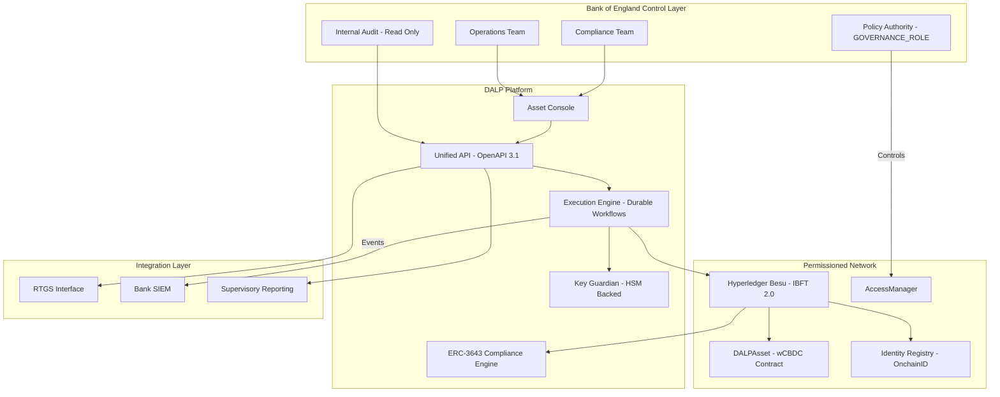

### 6.2 Issuance and Asset Configuration

The wCBDC instrument is configured using DALP's DALPAsset Configurable contract type. The Bank of England defines policy parameters during the configuration phase and retains the GOVERNANCE_ROLE for all subsequent changes.

**Asset setup process:** The asset factory creates the wCBDC contract atomically. In a single transaction: the proxy contract is deployed with CREATE2 deterministic addressing, the OnchainID identity contract for the asset is registered, compliance modules are initialized with Bank-defined parameters, and role assignments are made atomically. If any step fails, the entire deployment reverts.

**Policy parameters configurable at runtime (under GOVERNANCE_ROLE):**
- Eligible participant list (identity allow/deny list module)
- Jurisdiction restrictions (country restriction module)
- Transfer approval thresholds (transfer approval workflow module for transactions above defined GBP thresholds)
- Supply ceiling (supply cap module)
- Holding period restrictions (timelock module)
- Maturity configuration (maturity and redemption feature)

**Governance before activation:** No wCBDC units can be minted and no transfers can occur until the Bank has formally authorized activation through a GOVERNANCE_ROLE transaction. This provides a contractual gate between configuration and live operation.

### 6.3 Identity and Eligibility

Every pilot participant is assigned an OnchainID identity contract on the permissioned Besu network. The identity contract stores verifiable claims issued by trusted authorities.

**Claims model for wCBDC:**
- Institutional eligibility claim (issued by BoE Identity Manager after participant approval)
- AML/CFT verification claim (issued by trusted compliance authority)
- Jurisdiction claim (participant domicile, used by country restriction module)
- Participant tier claim (used for transfer limit differentiation if applicable)

**Issuer trust model:** The Bank designates trusted issuers for each claim type. Claims from non-trusted issuers are ignored by the compliance engine. The Bank can revoke trusted issuer status, immediately invalidating claims issued by that authority across all tokens.

**Onboarding workflow:** New participants submit onboarding requests through the DALP API. The Bank's identity managers review applications, create OnchainID contracts, and issue claims. The process generates a complete audit trail including request, review, approval or rejection, and claim issuance.

### 6.4 Compliance Enforcement

Compliance enforcement occurs at the smart contract layer. Every transfer instruction passes through the ERC-3643 compliance engine before any state change occurs.

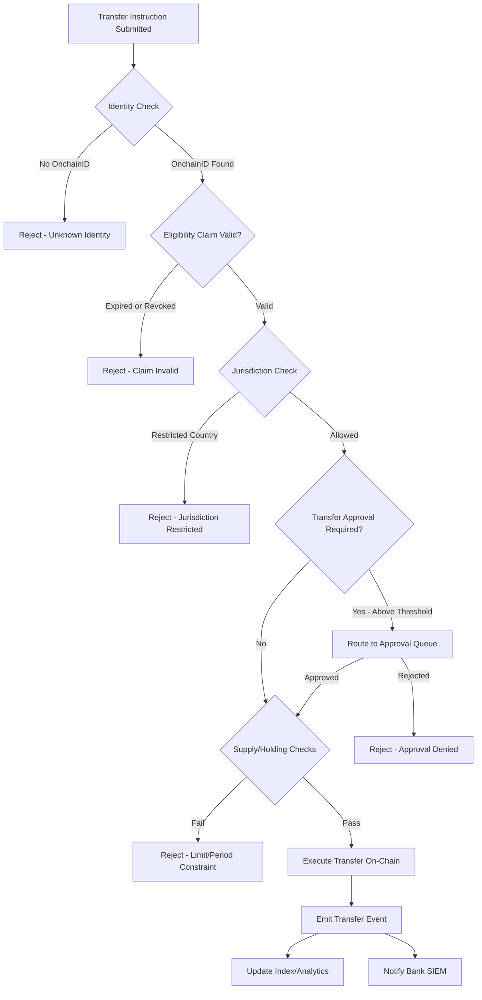

The compliance flow above is enforced entirely within the smart contract. If the compliance engine returns false for any module, the transaction reverts. There is no path from a rejected compliance check to a successful transfer.

**Transfer approval workflow:** For transactions above a Bank-defined GBP threshold, the compliance engine routes the instruction to a pending approval queue. Bank operations staff review and approve or reject through the Asset Console or API. Approved instructions are then re-submitted for execution. The full approval audit trail is on-chain.

### 6.5 CBDC Policy Controls

This section covers wCBDC-specific policy mechanisms beyond standard compliance enforcement.

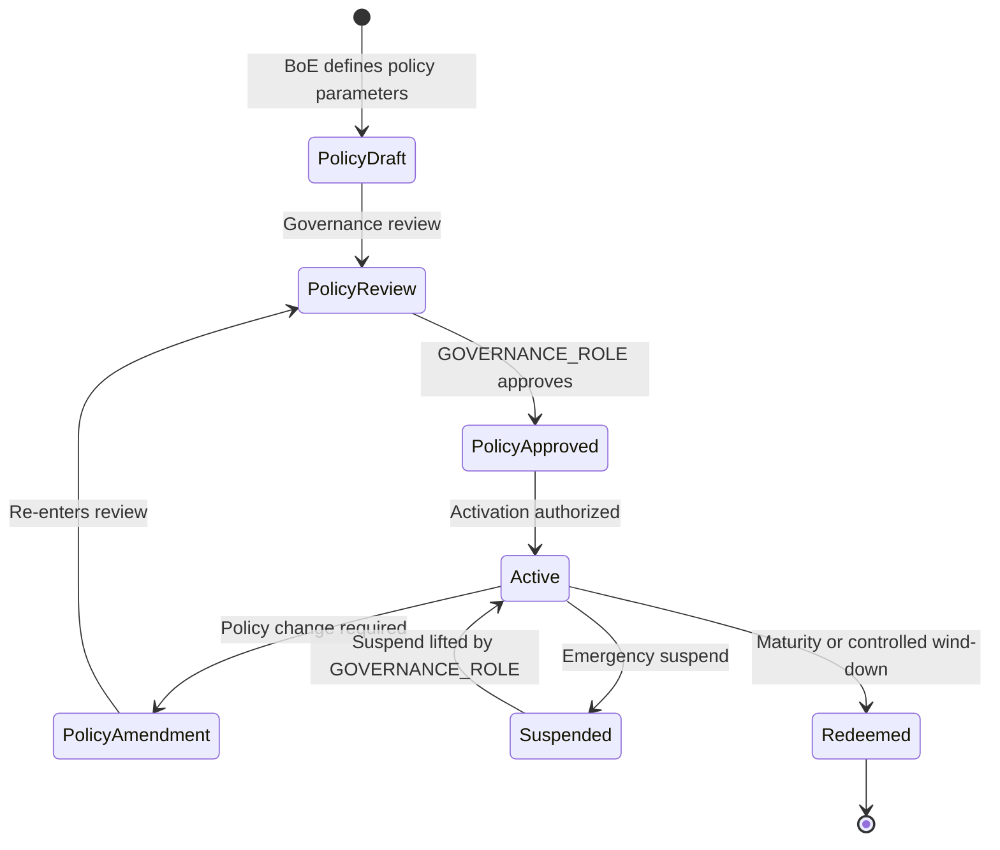

**Minting controls:** Only the SUPPLY_MANAGEMENT role can mint wCBDC. Minting is subject to supply cap compliance checks. The Bank authorizes supply cap parameters via GOVERNANCE_ROLE transactions; operational staff execute minting within those parameters.

**Emergency controls:** The EMERGENCY role can pause all transfers across the wCBDC contract without requiring GOVERNANCE_ROLE authorization. This provides a circuit-breaker capability for the Bank's operations team that does not require policy-level sign-off in an emergency. Pausing is logged on-chain and generates an immediate alert through the observability stack.

**Forced transfer (custodian function):** ERC-3643's forcedTransfer function allows the CUSTODIAN role to transfer tokens between addresses, bypassing compliance checks. This supports legal order execution under Bank of England Act s.34 powers, participant default handling, and regulatory seizure. All forced transfers are logged on-chain with mandatory event emission and are excluded from normal compliance paths. All forced transfers are logged on-chain with mandatory event emission and are excluded from normal compliance paths.

### 6.6 Settlement and XvP Coordination

The XvP (Anything-versus-Payment) addon provides atomic settlement coordination across the wCBDC leg and the cash leg.

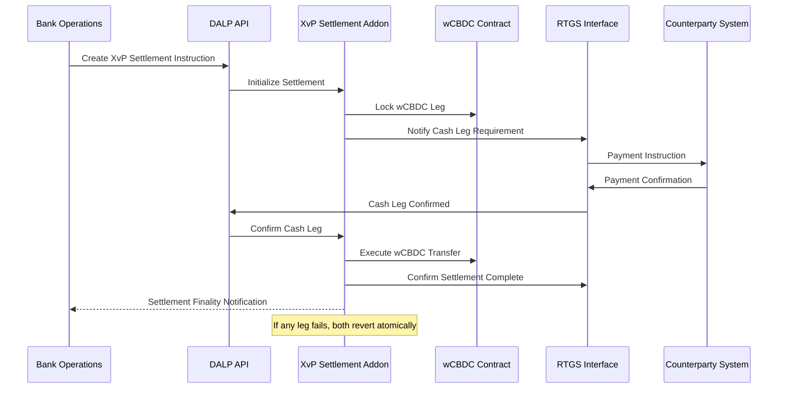

**Failure behavior:** If the cash leg fails to confirm within the defined settlement window, the wCBDC lock is released and no transfer occurs. If the wCBDC transfer fails after cash leg confirmation, the XvP addon manages the exception through a documented escalation workflow. The durable execution engine ensures the settlement instruction does not silently disappear; it surfaces to the operations queue for manual resolution.

**Determinism:** Settlement outcomes are deterministic. A settlement instruction either completes in full or fails with a documented error state. There is no ambiguous intermediate state.

### 6.7 Integration and Interoperability

DALP's integration architecture is designed to connect the wCBDC platform to the Bank's existing control estate without wholesale replacement of incumbent systems.

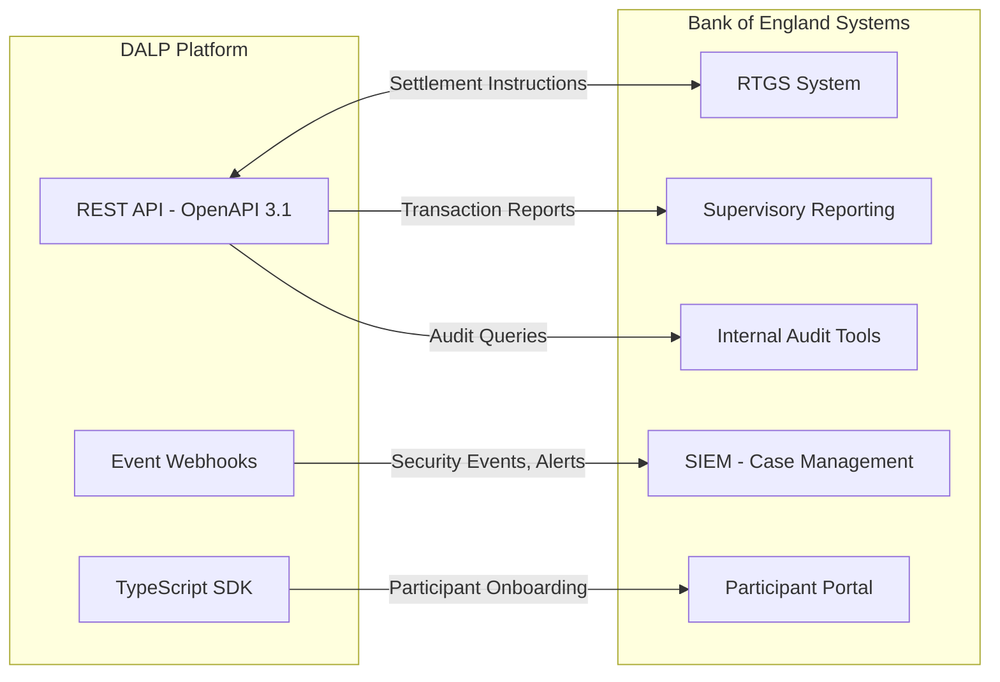

**API surface:** All platform functions are accessible through the REST API. The Bank's systems can query wCBDC balances, transfer histories, compliance states, participant identities, and settlement status through authenticated API calls. The API uses OAuth 2.0 or API key authentication with RBAC-scoped permissions.

**Event webhooks:** Every state-changing event on the platform generates a webhook notification. The Bank's SIEM can subscribe to security events, transfer events, compliance rejections, and administrative actions. Webhook payloads include correlation IDs, timestamps, and structured event data.

**ISO 20022 messaging:** For integration with RTGS and payment rail interfaces, DALP supports ISO 20022 message format patterns. Cash leg settlement notifications can be structured as ISO 20022 payment initiation or settlement confirmation messages.

**Idempotency:** All write operations support idempotency keys. Duplicate submissions return the result of the original operation rather than executing twice. This is critical for RTGS integration where network interruptions may cause retry scenarios.

### 6.8 Functional Fit Matrix

| Requirement | DALP Capability | Status | Notes |
|---|---|---|---|
| wCBDC instrument issuance | DALPAsset Configurable, CREATE2 factory | Full | |
| Policy parameter governance | GOVERNANCE_ROLE, on-chain AccessManager | Full | BoE holds governance keys |
| Participant eligibility enforcement | OnchainID, ERC-3643 compliance modules | Full | |
| Atomic settlement | XvP addon | Full | Integration-dependent for cash leg |
| Audit trail | On-chain events + off-chain structured logs | Full | |
| RTGS integration | REST API, ISO 20022 patterns | Full | Interface design in Phase 1 |
| SIEM integration | Event webhooks, structured log export | Full | |
| HA deployment | Multi-AZ Kubernetes, IBFT 2.0 consensus | Full | |
| UK data residency | Private cloud / on-premises | Full | |
| Emergency controls | EMERGENCY role, pause/unpause | Full | |
| Forced transfer | CUSTODIAN role, ERC-3643 forcedTransfer | Full | |
| IaC deployment | Helm charts, GitOps | Full | |

---

## 7. Technical Architecture

### 7.1 Architectural Principles

DALP's architecture is organized around five principles that directly address the Bank's requirements:

**Lifecycle-first.** State transitions are the central design concern. Every operation in the system transitions the wCBDC through well-defined states. There are no operations that modify state without generating evidence.

**Durable execution.** Critical operations run as durable workflows. Infrastructure failures do not create ambiguous state. The platform surfaces failures deterministically rather than silently losing operational context.

**Defense-in-depth.** Authorization is enforced at five independent layers: session/API authentication, platform RBAC, wallet verification for blockchain writes, on-chain AccessManager roles, and ERC-3643 compliance enforcement. No single layer failure grants unauthorized access.

**Separation of concerns.** Policy authority, operational execution, compliance administration, and audit access are separated by role taxonomy and contract design. The Bank's governance authority is held at the smart contract layer, not configurable by platform operators.

**Provider abstraction.** Custody providers, cloud providers, and monitoring tools are abstracted through stable interfaces. The Bank can change providers without architectural changes to the platform.

### 7.2 Layered Architecture

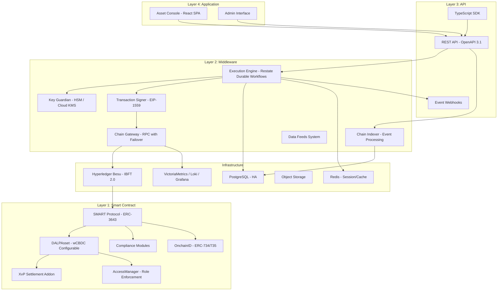

**Smart Contract Layer (Layer 1).** All business logic and compliance enforcement. The SMART Protocol (ERC-3643) provides the modular compliance engine. DALPAsset is the wCBDC instrument contract. The XvP addon handles settlement coordination. The AccessManager enforces role-based access. OnchainID provides participant identity. This layer is on Hyperledger Besu and operates independently of the layers above.

**Middleware Layer (Layer 2).** Operational orchestration, key management, transaction processing, event indexing, and network connectivity. The Execution Engine (Restate) provides durable workflow orchestration. Key Guardian manages cryptographic material. The Chain Indexer processes on-chain events into queryable state. The Chain Gateway provides resilient RPC connectivity with health monitoring and failover.

**API Layer (Layer 3).** The complete REST API exposes all platform capabilities. The TypeScript SDK provides typed programmatic access. Event webhooks push state change notifications to Bank systems.

**Application Layer (Layer 4).** The Asset Console provides the operational UI for Bank staff. All functions available through the UI are also available through the API.

### 7.3 wCBDC Token Lifecycle State Machine

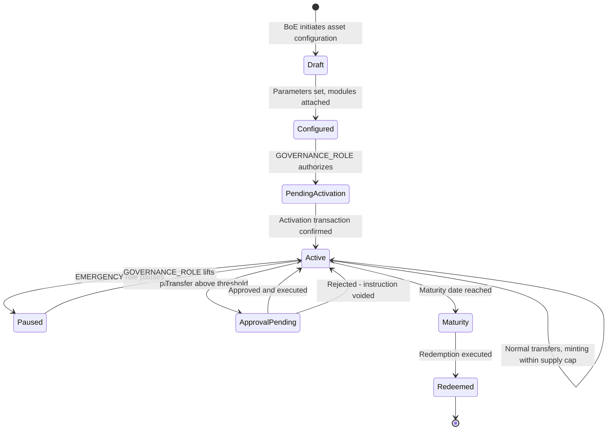

### 7.4 Data Architecture

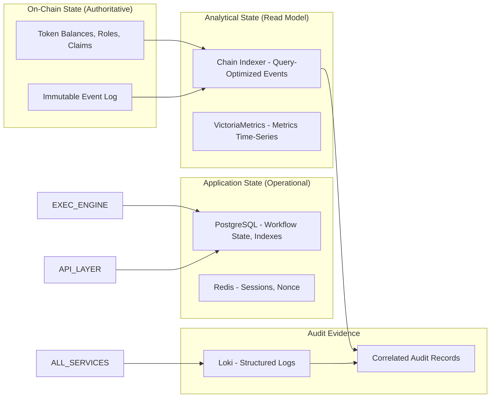

**Golden source for token state:** The Hyperledger Besu chain is the authoritative source for token balances, compliance module configurations, role assignments, and identity claims. The Chain Indexer projects on-chain state into a queryable PostgreSQL read model but never modifies chain state.

**Audit evidence construction:** An investigator or auditor can reconstruct any event sequence by combining on-chain event logs (immutable, timestamp-sequenced by block) with off-chain structured logs (correlated by trace ID). The two sources provide independent but correlated evidence that supports forensic investigation without vendor assistance.

### 7.5 Network and Chain Topology

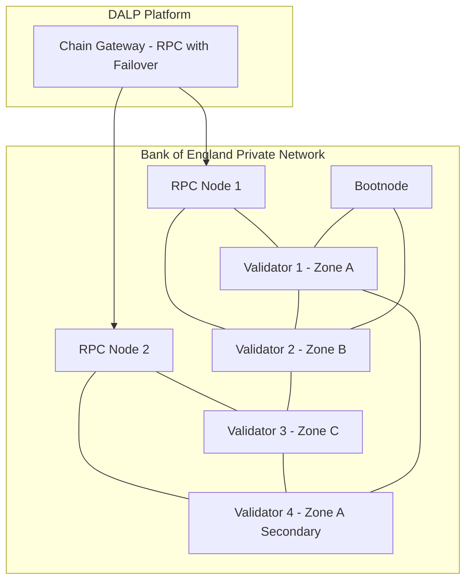

**Network configuration:** 4 validator nodes with IBFT 2.0 consensus, distributed across 3 independent failure zones. IBFT 2.0 provides Byzantine fault-tolerant consensus: the network tolerates 1 faulty validator out of 4. 2 RPC nodes provide the API access surface with the Chain Gateway managing load balancing and failover. All nodes operate within Bank-controlled infrastructure with no public internet connectivity.

**Consensus parameters:** Block time 2-5 seconds for near-real-time transaction finality. Block gas limit configured for the anticipated wCBDC transaction throughput. Chain ID selected to avoid collision with public network identifiers.

### 7.6 Deployment Topology (High Availability)

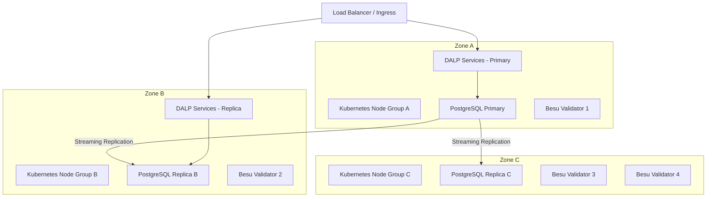

**Availability targets:** The multi-AZ deployment achieves 99.99% availability target for the application layer. No single failure domain (zone, node group, or infrastructure component) causes service interruption. PostgreSQL streaming replication achieves RPO of seconds. Kubernetes pod anti-affinity rules ensure DALP service replicas span zones.

### 7.7 Security Architecture

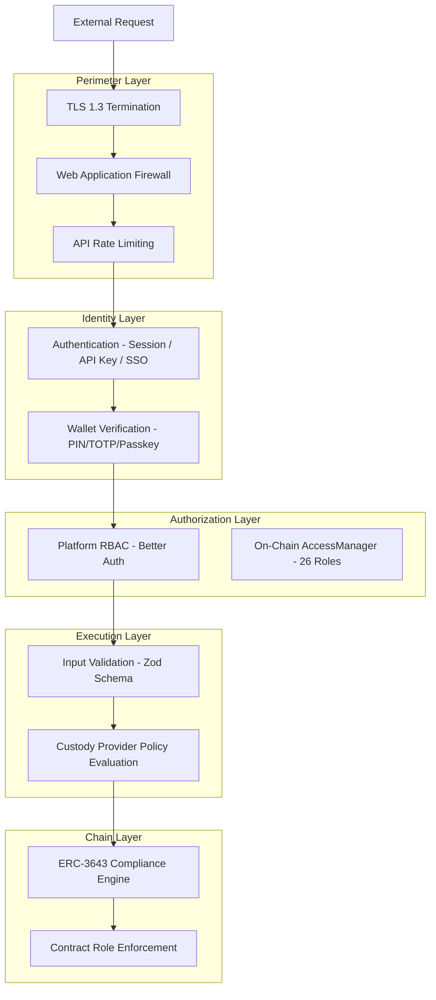

### 7.8 Integration Architecture

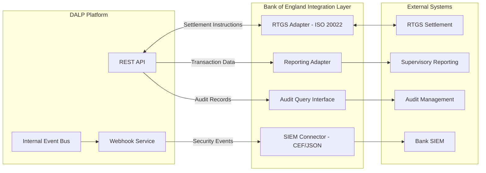

### 7.9 Implementation Timeline

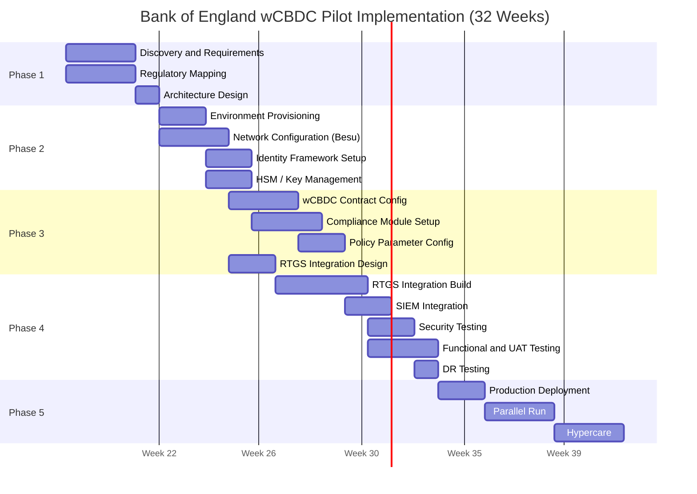

---

## 8. Security

### 8.1 Security Model Overview

DALP treats security as a structural property of the platform. Five independent control layers enforce security: identity verification at the API surface, platform RBAC enforced by Better Auth, wallet verification as a second factor for blockchain writes, on-chain AccessManager role enforcement, and ERC-3643 compliance evaluation within the smart contract.

No single-layer failure grants unauthorized access to wCBDC state. A compromised session cannot trigger a blockchain write without wallet verification. A bypassed application authorization check is blocked by on-chain role enforcement. A custody provider policy provides the final gate before any transaction reaches the chain.

SettleMint holds ISO 27001 certification confirming the effectiveness of its information security management system and SOC 2 Type II certification confirming that security controls operate effectively over an extended audit period.

### 8.2 Authentication and Access Control

**Session and API key authentication.** Browser sessions use HTTP-only cookies with Secure and SameSite attributes, 7-day expiry, and 24-hour refresh windows. API keys use a "sm_atk_" prefix format, are stored as hashed values (cleartext shown once at creation), and support per-key namespace scoping with a 10,000 request per 60-second rate limit.

**Wallet verification.** Every blockchain write operation requires step-up verification beyond the active session. The Bank's operational staff will use TOTP (RFC 6238 time-based one-time passwords) or hardware passkeys for wallet verification. There is no administrative override that skips wallet verification.

**Role taxonomy.** 26 distinct roles across four layers:
- Platform roles (owner, admin, member) for console and API access
- System roles (systemManager, identityManager, tokenManager, complianceManager, auditor) for operational functions
- Per-asset roles (governance, supplyManagement, custodian, emergency) for asset-specific operations
- Module roles for system-level contract operations

**Separation of duties.** For the wCBDC pilot, SettleMint recommends the following role assignments:
- GOVERNANCE_ROLE: Senior Bank official wallet (policy changes, activation authorization)
- TOKEN_MANAGER + SUPPLY_MANAGEMENT: Bank operations team (minting within supply cap)
- COMPLIANCE_MANAGER: Bank compliance team (module configuration, claim management)
- EMERGENCY: Operations team (pause only, not policy changes)
- CUSTODIAN: Designated bank officials only (forced transfer, account freeze)
- AUDITOR: Internal audit team (read-only, full event access)

### 8.3 Key Management and Custody Integration

The Bank of England's security requirements mandate HSM-backed key management for all wCBDC operational keys.

| Key Type | Storage Tier | Justification |
|---|---|---|
| GOVERNANCE_ROLE keys | HSM + offline cold storage | Policy authority keys require maximum protection |
| Operations keys (minting, servicing) | HSM (FIPS 140-2 Level 3) | Operational keys require hardware protection |
| Compliance keys | HSM | Compliance configuration must be tamper-evident |
| Audit keys (read-only) | Cloud KMS or HSM | Lower risk but should remain hardware-protected |

**HSM integration:** DALP's Key Guardian integrates with institutional HSMs through PKCS#11 interfaces. Key generation occurs within the HSM boundary; private key material never exists in software memory. Key rotation is supported with active/archive key management, coordinating blockchain address updates and registry notifications.

**Maker-checker for critical operations:** All transactions executed under GOVERNANCE_ROLE and CUSTODIAN roles should be configured with maker-checker workflows. DFNS or Fireblocks policy engines can enforce multi-approver requirements before signing. Pending approvals surface through the DALP Asset Console for authorized reviewers.

### 8.4 Data Protection and Encryption

**At rest:** PostgreSQL databases encrypted using AES-256 at the storage layer. Key Guardian encrypted with cloud KMS or HSM. Object storage using S3-class encryption with provider-native AES-256. Database-layer encryption uses application-level encryption before storage for API key hashes and sensitive configuration.

**In transit:** TLS 1.3 for all API communication. Secure-flagged HTTP-only cookies for session tokens. Inter-service communication within the Kubernetes cluster uses cluster-internal networking. Webhook payloads over HTTPS with mutual TLS option for Bank SIEM endpoints.

**UK GDPR alignment:** Data classification is applied across operational, participant, transaction, and personal data categories. Retention schedules are configured per data category (7-year minimum for financial records). Deletion workflows support right-to-erasure requirements for personal data not subject to statutory retention obligations. Data residency is confined to UK infrastructure; no personal data transits to non-UK data centres.

### 8.5 Compliance Controls and Auditability

**Immutable evidence:** Every on-chain event is immutable from the point of block finality. The IBFT 2.0 consensus mechanism achieves immediate finality; there is no probabilistic finality that could allow event rewriting.

**Structured log retention:** Off-chain structured logs are retained with WORM characteristics (append-only, tamper-evident) in a dedicated log store. Log correlation IDs link API requests, execution engine workflows, and on-chain transactions.

**SIEM integration:** DALP exports security events in structured JSON or CEF format for Bank SIEM ingestion. Events include authentication successes and failures, authorization decisions, configuration changes, transaction submissions, compliance rejections, and administrative actions. The event taxonomy is documented and stable across platform releases.

**Audit access:** The AUDITOR role provides read-only access to the full event history, participant identity records, compliance states, and transaction histories. Auditors can query the platform API without SettleMint involvement. For forensic investigation, the on-chain event log is independently accessible through RPC API calls to the Besu network.

### 8.6 Testing and Assurance

**Penetration testing:** SettleMint conducts annual penetration testing of the DALP platform by qualified third-party security firms. Reports are available under NDA during due diligence. Findings are tracked to remediation with documented timelines. Critical findings block platform releases until resolved.

**Security development lifecycle:** All DALP source code undergoes peer review with security-focused review checklists. Static analysis and dependency scanning are integrated into the CI/CD pipeline. SBOM (Software Bill of Materials) is available for all platform components. A formal change approval gate includes security review before production deployment.

**Vulnerability management:** CVE monitoring for all platform dependencies. Security patches for critical vulnerabilities are released within 24 hours of confirmed impact. Patch windows are pre-agreed with clients.

### 8.7 Security Responsibility Matrix

| Control Area | SettleMint | Bank of England | Shared |
|---|---|---|---|
| Platform security patches | Responsible | Informed | |
| HSM procurement and operation | | Responsible | Integration: Shared |
| Network perimeter (Bank environment) | | Responsible | |
| API credential management | | Responsible | Guidance: SettleMint |
| GOVERNANCE_ROLE key custody | | Responsible | |
| SIEM integration | | Responsible | Event taxonomy: SettleMint |
| Penetration testing (platform) | Responsible | Informed | |
| Penetration testing (integration) | | Responsible | Scope: Shared |
| Audit log retention | Responsible (platform) | Responsible (Bank infra) | |
| Incident response coordination | Shared | Shared | |
| DR testing scheduling | | Responsible | Test support: SettleMint |

---

## 9. Implementation and Delivery

### 9.1 Delivery Overview

The Bank of England wCBDC pilot implementation follows a 32-week phase-gated delivery model. The extended timeline (compared to the standard 19-week model) accommodates the Bank's institutional change control cycles, security review requirements, parallel-run obligations, and formal phase gate evidence packages.

Each phase concludes with a formal gate review producing an evidence package for the Bank's architecture review board and risk sign-off process. No phase proceeds without formal acceptance of the preceding gate deliverables.

### 9.2 Phase Plan

**Phase 1: Discovery and Requirements (Weeks 1-3)**

Objective: Establish a validated understanding of the Bank's wCBDC requirements, integration landscape, regulatory constraints, and governance model.

Key activities:
- Structured interviews with Bank programme leadership, technology, compliance, risk, and operations
- Current-state assessment of RTGS interfaces, supervisory reporting systems, and participant access controls
- Regulatory mapping against UK FMI rules, Operational Resilience regime, UK GDPR, and NCSC controls
- Architecture design for the permissioned Besu network and DALP deployment topology
- Governance model design: role assignments, approval workflows, key custody arrangements

Outputs: Business Requirements Document, Regulatory Compliance Matrix, Target Architecture Document, Implementation Roadmap, RACI Matrix

Gate 1 criteria: Architecture design accepted by Bank technology leadership. Regulatory mapping reviewed and approved by Bank compliance team. RACI matrix signed by both programme leads.

**Phase 2: Foundation and Setup (Weeks 4-8)**

Objective: Provision the permissioned Besu network, deploy DALP infrastructure, establish identity and access framework, and configure key management.

Key activities:
- Hyperledger Besu network deployment (4 validators, 2 RPC nodes, 3 availability zones)
- DALP platform deployment across development, staging, and production environments
- HSM procurement support and Key Guardian HSM integration
- OnchainID identity framework initialization
- AccessManager role configuration per governance design
- Observability stack deployment and Bank SIEM integration preparation

Outputs: Provisioned network and platform environments, Key management configuration document, Identity framework design, Observability setup report

Gate 2 criteria: All environments operational. Network consensus verified. Key management validated with test signing operations. No blocking infrastructure issues.

**Phase 3: Configuration and Compliance (Weeks 9-15)**

Objective: Configure the wCBDC asset, compliance modules, policy parameters, and integration designs.

Key activities:
- DALPAsset wCBDC contract configuration with Bank-defined parameters
- ERC-3643 compliance module setup (participant eligibility, jurisdiction restrictions, transfer approval thresholds, supply cap)
- GOVERNANCE_ROLE parameter documentation and governance procedure creation
- RTGS integration design and interface specification
- Supervisory reporting integration design
- Operational workflow documentation for normal operations and exception handling

Outputs: Asset configuration documentation, Compliance module configuration, Integration design document, Governance procedure documentation

Gate 3 criteria: wCBDC contract configured and tested in staging. Compliance modules verified against regulatory matrix. Integration designs reviewed by Bank technical team. No P1/P2 configuration defects.

**Phase 4: Integration and Testing (Weeks 16-24)**

Objective: Build integrations to Bank systems and conduct comprehensive testing including functional, security, performance, and DR testing.

Key activities:
- RTGS adapter development and testing
- SIEM integration build and event taxonomy validation
- Supervisory reporting integration
- Functional test execution across all wCBDC lifecycle scenarios
- Security assessment and penetration testing
- Performance testing at pilot transaction volumes
- DR testing (failover, backup restore, recovery procedure validation)
- User acceptance testing with Bank operations and compliance staff

Outputs: Integrated system, Test reports (functional, security, performance, DR), UAT sign-off, Go-live readiness assessment

Gate 4 criteria: All integrations tested end-to-end. No unmitigated critical or high security findings. Performance within targets. UAT sign-off from all Bank stakeholder groups. DR procedures tested and documented.

**Phase 5: Production Deployment and Parallel Run (Weeks 25-29)**

Objective: Execute production deployment and conduct parallel run with existing processes.

Key activities:
- Production deployment per runbook with SettleMint support on standby
- Smoke testing in production
- Parallel run against existing settlement processes for 3 weeks
- Reconciliation monitoring and exception handling (tolerance threshold defined in Phase 1 governance design; recommended: zero tolerance for balance discrepancies, 0.01% tolerance for timing differences pending RTGS confirmation)
- Performance monitoring under production conditions

Outputs: Production deployment confirmation, Parallel run reconciliation reports, Incident log

Gate 5 criteria: Production platform operational. Parallel run reconciliation within acceptable tolerance. No open P1 incidents.

**Phase 6: Hypercare and Transition (Weeks 30-32)**

Objective: Intensive post-production support, knowledge transfer completion, and support tier transition.

Key activities:
- Dedicated monitoring and proactive issue resolution
- Knowledge transfer completion (3 training tracks)
- Operational readiness assessment
- Support tier transition planning and handover
- Hypercare summary report

Outputs: Hypercare summary report, Complete documentation package, Knowledge transfer certificates, Support transition plan

### 9.3 Governance and Decision Structure

The programme governance model includes:
- **Programme Board:** Bank programme executive, SettleMint Delivery Lead, monthly cadence
- **Working Group:** Bank technical lead, SettleMint Solution Architect, weekly cadence
- **Security Workstream:** Bank security team, SettleMint security engineer, fortnightly cadence
- **Issue Escalation:** Working Group resolves within 5 business days; unresolved items escalate to Programme Board

### 9.4 Resource Model

| Role | SettleMint | Bank | Phase Allocation |
|---|---|---|---|
| Programme / Delivery Lead | Required | Required | All phases full-time |
| Solution Architect | Required | Required (Tech Lead) | Phases 1-4 full-time |
| Platform Engineers (2) | Required | DevOps team (1) | Phases 2-5 full-time |
| Security Engineer | Required | Security team | Phases 1, 4 full-time |
| QA Lead | Required | Test lead | Phases 4-5 full-time |
| Compliance Lead | Advisory | Compliance team | Phases 1, 3, 4 full-time |

### 9.5 Risks to Delivery

| Risk | Likelihood | Impact | Mitigation |
|---|---|---|---|
| Bank governance approval cycle extends Phase 1 | Medium | High | 3-week Phase 1 buffer; pre-agreed approval deadlines |
| HSM procurement delay | Medium | High | Early procurement initiation in Phase 1; cloud KMS fallback |
| RTGS interface specification unclear | Medium | High | Interface specification workshop in Phase 1 |
| Security review timeline extends Phase 4 | High | Medium | Early engagement with Bank security team; pre-submission |
| Key personnel change | Low | Medium | Full documentation; backup contacts in RACI |

---

## 10. Deployment Options

### 10.1 Deployment Principles

DALP delivers the same platform capabilities across all deployment models. The deployment model choice affects operational ownership, data residency, and time-to-deploy but not functional coverage or compliance enforcement.

For the Bank of England's wCBDC pilot, data residency within UK jurisdiction and air-gap capability are non-negotiable requirements that drive the deployment model recommendation.

### 10.2 Recommended Deployment Model

**Recommendation: Private Cloud (Bank-Managed) or On-Premises.**

The Bank of England's requirements for UK data residency, potential air-gap operation, and alignment with the Operational Resilience regime make private infrastructure deployment the recommended approach. SettleMint provides full support for both private cloud (AWS UK Region, Azure UK South, GCP London) and on-premises (Bank-owned data centre) deployments.

For the pilot phase, Bank-managed private cloud (AWS UK Region or Azure UK South) is recommended as it provides:
- Full data residency within UK jurisdiction
- Managed Kubernetes service (EKS or AKS) reducing infrastructure operational overhead
- Faster deployment timeline than on-premises physical provisioning
- Clear upgrade path to on-premises if the Bank's risk posture requires it

**Key assumptions:**
- Bank provides dedicated AWS or Azure subscription with UK region selection
- Network connectivity between DALP deployment and Bank internal systems via VPN or private link
- Bank DevOps team is responsible for Kubernetes node management and cloud infrastructure

### 10.3 Deployment Options Comparison

| Criterion | Managed SaaS | Private Cloud | On-Premises | Hybrid |
|---|---|---|---|---|
| Data residency control | Configurable | Full | Full | Component-level |
| Air-gap capability | No | Partial | Yes | Partial |
| UK jurisdiction guarantee | Configurable | Yes | Yes | Yes |
| Time to deploy | Fastest (weeks) | Moderate (weeks) | Longest (months) | Moderate |
| Operational overhead | Lowest | Moderate | Highest | Moderate |
| Bank control over infrastructure | None | Full | Full | Partial |
| Recommended for BoE pilot | No | Yes | Option | Possible |

### 10.4 Infrastructure Requirements

| Component | Specification | Notes |
|---|---|---|
| Kubernetes | EKS, AKS, or GKE (UK region); or self-managed v1.27+ | 3 worker node groups across availability zones |
| PostgreSQL | Managed service (RDS, Azure Database) or CloudNativePG | HA configuration, minimum 100GB storage |
| Redis | Managed service or in-cluster; minimum 4GB | Session storage and nonce management |
| Object Storage | S3-compatible within UK region | Document storage, 1TB minimum |
| HSM | FIPS 140-2 Level 3 certified | For operational key management |
| Network | Private subnet, VPN/private link to Bank systems | No public internet access to core services |

### 10.5 Availability, Resilience, and DR

| Scenario | RTO | RPO | Configuration |
|---|---|---|---|
| Zone failure | 2-5 minutes | Seconds | Multi-AZ pod distribution, automatic failover |
| Database failure | 5-15 minutes | Seconds | PostgreSQL streaming replication, automatic replica promotion |
| Network partition | Platform continues per IBFT 2.0 consensus rules | Zero (on-chain state preserved) | IBFT 2.0 tolerates 1 of 4 validator failures |
| Full region failure | 30-180 minutes | 1-5 minutes | Hot-warm standby region with continuous replication |
| Catastrophic failure | 24-72 hours | 1-4 hours | Backup-based restore from object storage |

DR procedures are documented in the operational runbook produced during Phase 5. DR drills are scheduled quarterly and include Bank DevOps and operations team participation.

---

## 11. Training and Knowledge Transfer

### 11.1 Training Strategy

The Bank of England's operational independence from SettleMint after go-live requires that all key operational functions can be performed by Bank staff without vendor assistance. Training is organized into three role-based tracks, delivered during the implementation phases and formalized during hypercare.

### 11.2 Administrator Track (3-4 days)

Covers: Platform architecture and component overview, environment management, user and role administration (RBAC model, on-chain role assignments), compliance module administration, identity management (OnchainID, claims, trusted issuers), HSM and key management procedures, observability dashboards and alerting, backup and recovery procedures, platform update processes.

Target audience: Bank DevOps team, Platform administrators

Delivery: Instructor-led sessions in staging environment with hands-on lab exercises. Shadowing during Phase 2 environment setup.

### 11.3 Developer / Integration Track (4-5 days)

Covers: DALP API deep-dive (authentication, rate limiting, error handling, retry strategies), integration patterns for RTGS, SIEM, and supervisory reporting, event-driven architecture (webhook configuration, event types, payload schemas), smart contract interaction and query patterns, testing strategies and mock interfaces, security practices for API integration.

Target audience: Bank integration developers, technical architects

Delivery: Instructor-led sessions with hands-on labs using the staging environment. Participation in integration build during Phase 4.

### 11.4 End-User / Operations Track (2 days)

Covers: Asset Console navigation, wCBDC lifecycle operations (minting, transfer approval, pause/unpause), participant onboarding and identity management, settlement monitoring (XvP instruction status, exception handling), compliance workflow management, reporting and audit trail access.

Target audience: Bank operations staff, compliance officers

Delivery: Instructor-led sessions with scenario-based exercises using the staging environment UAT.

### 11.5 Knowledge Transfer Method

The training programme uses four methods: instructor-led sessions for conceptual models, guided labs on the Bank's staging environment for hands-on practice, shadowing of SettleMint engineers during implementation phases, and documentation plus recorded sessions for persistent reference.

An operational readiness assessment at the end of hypercare confirms that designated Bank staff can independently manage all operational functions. The assessment uses scenario-based proficiency testing, not theoretical examination.

---

## 12. Support and SLA

### 12.1 Support Model Overview

SettleMint recommends Enterprise Support for the Bank of England's wCBDC pilot, given the systemic importance of the programme and the Operational Resilience obligations it operates under.

### 12.2 Support Tiers

| Capability | Standard | Premium | Enterprise (Recommended) |
|---|---|---|---|
| Coverage | 09:00-18:00 CET Mon-Fri | 07:00-22:00 CET Mon-Fri | 24/7/365 |
| P1 Response | 4 hours | 1 hour | 15 minutes |
| P1 Resolution Target | 8 hours | 4 hours | 2 hours |
| Named Contacts | 3 | 8 | Unlimited |
| Channels | Email, Portal | + Slack, Phone | + Video escalation |
| Dedicated SRE | Shared pool | Designated at onboarding | Dedicated named SRE |
| Platform Updates | Quarterly | Monthly | Continuous staged rollout |
| Business Reviews | Quarterly | Monthly | Bi-weekly |
| Uptime SLA | 99.9% | 99.95% | 99.99% |

### 12.3 Severity and Response Matrix

| Severity | Definition | Response | Resolution Target |
|---|---|---|---|
| P1 Critical | Production down, wCBDC transfers blocked, compliance engine unavailable | 15 minutes | 2 hours |
| P2 High | Major function impaired; workaround available | 1 hour | 4 hours |
| P3 Medium | Non-critical function impaired | 4 hours (business) | 2 business days |
| P4 Low | General inquiry, documentation, enhancement request | 1 business day | Next release cycle |

### 12.4 Escalation and Incident Management

Escalation path: L1 Support (triage, log, initial response) → L2 Platform Engineering (technical investigation, fix development) → L3 Engineering Leadership (critical incidents, architectural issues) → Executive escalation (systemic platform incidents).

For P1 incidents, SettleMint initiates a dedicated incident channel, provides status updates every 30 minutes, and escalates to L3 within 30 minutes if no resolution path is identified.

Incident notification to the Bank is required within 4 hours of a confirmed P1 incident under DORA-aligned operational resilience obligations.

### 12.5 Maintenance and Update Policy

Security patches: Critical vulnerabilities patched within 24 hours of confirmed impact. High vulnerabilities within 72 hours. Patches are staged through non-production environments before production deployment.

Platform updates: Quarterly scheduled updates with 4-week advance notice. Updates are deployed to staging first and require Bank sign-off before production deployment.

Maintenance windows: Agreed with the Bank during Phase 1. Typically off-peak hours (Saturday 02:00-06:00 UTC) with minimum 2-week advance notice for planned maintenance.

---

## 13. Risk Management

### 13.1 Risk Management Approach

Risks are tracked in a shared risk register maintained throughout the delivery programme and transitioned to an operational risk register post-go-live. Each risk has a documented owner, mitigation, and trigger condition.

### 13.2 Risk Register

| ID | Risk | Likelihood | Impact | Mitigation | Owner |
|---|---|---|---|---|---|
| R-001 | Regulatory requirement change during pilot | Medium | High | Configurable compliance modules absorb changes without redeployment | BoE Compliance |
| R-002 | RTGS interface specification insufficient for integration | Medium | High | Interface specification workshop in Phase 1; fallback to documented mock | Joint |
| R-003 | HSM procurement delay extends Phase 2 | Medium | Medium | Cloud KMS fallback; early procurement initiation | BoE DevOps |
| R-004 | Bank security review timeline extends Phase 4 | High | Medium | Early security team engagement; pre-submission of documentation | BoE Security |
| R-005 | Besu validator node failure during pilot | Low | Medium | IBFT 2.0 tolerates 1/4 failure; monitoring alerts within 60 seconds | SettleMint |
| R-006 | Operational key compromise | Very Low | Critical | HSM storage, maker-checker, key rotation procedures, incident response plan | BoE |
| R-007 | Platform release introduces regression | Low | High | Staged rollout; staging verification; rollback procedures tested | SettleMint |
| R-008 | Third-party dependency (cloud provider) outage | Low | Medium | Multi-AZ deployment; DR site; cloud provider SLA coverage | BoE DevOps |
| R-009 | Participant onboarding slower than planned | Medium | Low | Self-service onboarding portal; batch onboarding tooling | Joint |
| R-010 | Scope change from Bank governance review | High | Medium | Change control process with formal impact assessment; 5-day turnaround SLA | Joint |

### 13.3 Governance of Risks

Risks are reviewed at the weekly Working Group meeting. Risks with HIGH or CRITICAL impact and MEDIUM or higher likelihood are escalated to the Programme Board within 5 business days of identification. Risk status is documented in the shared project management system.

---

## 14. Compliance Matrix

### 14.1 Status Legend

- **Full:** DALP natively supports this requirement as a standard capability.
- **Partial:** DALP supports the core requirement; additional configuration, integration, or client-side action is needed for complete coverage.
- **Configurable:** DALP provides the technical capability; the client configures the specific rule or parameter.
- **Integration-dependent:** DALP provides the interface; an external system must be connected to deliver the full requirement.
- **Out of Scope:** Requirement is outside the platform boundary; addressed by client systems or processes.

### 14.2 Detailed Compliance Matrix

| ID | Priority | Requirement Summary | Status | DALP Response | Notes |
|---|---|---|---|---|---|
| TR-001 | P1 | Logically segregated environments (dev, test, pre-prod, prod) with controlled promotion | Full | DALP deploys across dev, staging, and production environments using Helm with environment-specific values files. Promotion is controlled through GitOps pipelines with change approval gates. | Kubernetes namespace isolation per environment. |
| TR-002 | P1 | Infrastructure-as-code, configuration baselining, repeatable environment reconstruction | Full | Helm charts with version-controlled values files for all environments. GitOps workflow enables repeatable reconstruction from source control. | All configuration is declarative and reproducible. |
| TR-003 | P1 | Immutable audit logs for privileged actions, configuration changes, and critical operational events | Full | On-chain events are immutable from block finality (IBFT 2.0). Off-chain structured logs in Loki with append-only retention. On-chain AccessManager logs all role changes. | Both on-chain and off-chain audit trails provided. |
| TR-004 | P1 | High-availability deployment across independent failure domains, no SPOF | Full | Multi-AZ Kubernetes deployment with pod anti-affinity rules. PostgreSQL streaming replication across AZs. IBFT 2.0 consensus tolerates 1 of 4 validator failures. Load-balanced ingress. | RTO 2-15 minutes for zone failure. |
| TR-005 | P1 | Comprehensive observability across application, infrastructure, message flow, and business process layers | Full | VictoriaMetrics (metrics), Loki (logs), Tempo (traces), Grafana (dashboards). Pre-built dashboards for operations, transactions, compliance, security, and infrastructure. Alert routing via PagerDuty/Slack. | DALP-native observability stack. |
| TR-006 | P2 | Time synchronization, evidence-grade timestamping, log correlation | Full | Kubernetes node NTP synchronization. Block timestamps from IBFT 2.0 consensus. Distributed trace IDs correlate across all services. | Chain timestamps are consensus-agreed, not single-node. |
| TR-007 | P2 | Backup, restore, DR procedures with documented recovery objectives | Full | Velero for Kubernetes resources and PVs. CloudNativePG WAL archival for PostgreSQL. Documented RTO/RPO targets per deployment topology. | DR drill scheduling included in Phase 5. |
| TR-008 | P2 | Secure API access with modern authentication and authorization | Full | OAuth 2.0/OIDC, session auth, API keys with namespace scoping. TLS 1.3 for all API traffic. Rate limiting 10,000 req/60s. | SSO (Okta, Azure AD, SAML) available via plugin. |
| TR-009 | P2 | Controlled software release management with rollback procedures and maintenance windows | Full | GitOps pipeline with staged rollout (dev → staging → production). Helm chart versioning enables rollback. Maintenance windows pre-agreed with client. | Rollback tested in Phase 4. |
| TR-010 | P3 | Formal runbooks for incident response, capacity management, operational handover | Full | Runbooks produced in Phase 5 covering incident response, capacity management, and operational handover. DALP documentation portal provides additional operational guidance. | Runbooks tailored to BoE deployment. |
| TR-011 | P3 | Evidence-based performance testing under representative and stress conditions | Full | Load testing using k6 or JMeter against staging environment. Results retained as implementation evidence. | Scenario design in Phase 4. |
| TR-012 | P3 | Operator controls for configuration freeze, emergency access, controlled degradation | Full | EMERGENCY role for pause/unpause. Configuration freeze via governance freeze procedure. Emergency read-only mode available. | Emergency procedures documented in runbooks. |
| TR-013 | P1 | Strong IAM with role separation, least privilege, privileged access monitoring | Full | 26-role taxonomy across four layers. On-chain AccessManager as authoritative source. Wallet verification for all blockchain writes. PAM logging for all privileged actions. | Roles cannot be self-assigned. |
| TR-014 | P1 | Encryption for data in transit and at rest, key management with SOD | Full | TLS 1.3 for all transit. AES-256 at rest for database and storage. HSM-backed key management. Separation of duties: key custodians ≠ operational signers. | FIPS 140-2 Level 3 HSM for production. |
| TR-015 | P1 | Security event monitoring, SIEM integration | Full | Structured security event logs exported in JSON/CEF. Webhook-based event push to Bank SIEM. Pre-built security dashboard in Grafana. | Event taxonomy documented and stable across releases. |
| TR-016 | P1 | Vulnerability management, patch governance, SBOM, dependency disclosure | Full | CVE monitoring for all dependencies. Critical patches within 24 hours. SBOM available per platform release. Dependency disclosure in advance of production deployment. | ISO 27001 process governs vulnerability management. |
| TR-017 | P1 | Secure development lifecycle: code review, testing, change approval | Full | All code changes via peer-reviewed PRs. Static analysis and SAST integrated in CI. Change approval gate before production release. SOC 2 Type II confirms operational effectiveness. | Evidence available under NDA during due diligence. |
| TR-018 | P2 | Data classification, retention, deletion, data-handling controls | Full | Data classification applied to operational, participant, transaction, and personal data. Retention schedules configurable per category. Deletion workflows for GDPR right-to-erasure. | UK GDPR alignment included. |
| TR-019 | P2 | Incident notification procedures aligned to regulatory timelines | Full | P1 incident notification to BoE within 4 hours. DORA-aligned incident classification. NIS2-relevant notification support for operational resilience incidents. | Notification procedures in support agreement. |
| TR-020 | P2 | Network segmentation, API protection, certificate lifecycle, secrets management | Full | Kubernetes NetworkPolicies for pod-to-pod segmentation. Ingress controller for external access. Certificate management via cert-manager. Secrets via cloud KMS or Vault. | Network topology documented in architecture deliverables. |
| TR-021 | P2 | Resilience against DoS, replay, duplicate processing, operator error | Full | API rate limiting (10,000 req/60s). Idempotency keys for all write operations. Restate-backed durable execution prevents duplicate processing. Maker-checker for privileged operations. | Replay protection at both API and smart contract layer. |
| TR-022 | P3 | Third-party risk management for subcontractors, hosting, critical dependencies | Full | SettleMint subcontractor oversight procedures documented. Hosting provider SLAs backed by enterprise cloud agreements. SBOM for third-party software components. | Third-party dependency disclosure included in proposal. |
| TR-023 | P3 | Penetration testing evidence and remediation tracking | Full | Annual third-party penetration testing. Reports available under NDA. Findings tracked to remediation with documented timelines. Critical findings block releases. | Testing schedule disclosed during due diligence. |
| TR-024 | P3 | Cryptographic agility and key rotation without service disruption | Full | Algorithm selection is configurable. Key rotation supported with active/archive management. Blockchain address migration coordinated. | Post-quantum migration path being assessed for long-term roadmap. |
| TR-025 | P1 | Delivery plan with milestones, dependencies, resourcing, acceptance criteria | Full | 32-week delivery plan with formal phase gates (Section 9). Milestones, dependencies, acceptance criteria documented per phase. | Phase gate evidence packages for BoE architecture review. |
| TR-026 | P1 | Buyer dependencies requiring timely decisions, access, policy input | Full | RACI matrix identifies BoE decision points. 5-day decision turnaround SLA with escalation. Weekly dependency tracking in project management system. | Client dependencies documented in Phase 1. |
| TR-027 | P1 | Migration approach for interfaces, data, participant onboarding, operational cutover | Full | Participant onboarding migration plan in Phase 5. Data migration scripts version-controlled and staging-tested. Operational cutover runbook with rollback procedures. | Parallel run in Phase 5 reduces cutover risk. |
| TR-028 | P1 | Structured testing: unit, system, integration, performance, security, operational readiness | Full | Four-track testing strategy (functional, security, performance, UAT) in Phase 4. DR testing in Phase 4. Operational readiness assessment in Phase 6. | All testing evidence retained as implementation deliverables. |
| TR-029 | P1 | Training materials for operations, support, security, and administrators | Full | Three training tracks (administrator, developer, end-user) with role-specific curricula. Training materials hosted on DALP documentation portal. | Training delivered during Phase 6 hypercare. |
| TR-030 | P2 | Service transition deliverables: runbooks, support model, knowledge transfer evidence | Full | Runbooks, support transition plan, knowledge transfer certificates all Phase 6 deliverables. Support tier takes effect at end of hypercare. | Operational readiness assessment confirms Bank staff independence. |
| TR-031 | P2 | Governance forums, reporting cadence, issue escalation, decision control points | Full | Programme Board (monthly), Working Group (weekly), Security Workstream (fortnightly). Issue escalation through documented paths. Decision log maintained throughout. | Governance model established in Phase 1. |
| TR-032 | P2 | Assumptions re: third-party connectivity, environment readiness, institutional approvals | Full | Assumptions register produced in Phase 1 and maintained throughout. Bank-side dependencies explicitly documented with owner and deadline. | No silent assumptions. |
| TR-033 | P2 | Rollback and contingency plans for implementation failures | Full | Rollback procedures designed in Phase 3 and tested in Phase 4. Emergency rollback tested in Phase 4 DR test. | Rollback criteria and decision authority documented. |
| TR-034 | P3 | Parallel running and controlled coexistence with legacy processes | Full | 3-week parallel run in Phase 5 with reconciliation monitoring. Legacy process coexistence procedures documented. | Parallel run is a named Phase 5 deliverable. |
| TR-035 | P3 | Post-go-live hypercare and measurable stabilization criteria | Full | 3-week hypercare in Phase 6 with dedicated monitoring, proactive issue resolution, and documented stabilization criteria. Hypercare summary report at close. | Stabilization criteria agreed with BoE in Phase 5. |
| TR-036 | P3 | Ongoing roadmap governance separating committed from exploratory | Full | DALP roadmap governance: committed capabilities documented in product releases; exploratory items clearly labeled as roadmap. No roadmap items presented as current capabilities in this response. | Roadmap review available during due diligence. |

**Regulatory compliance matrix:**

| ID | Requirement | Status | Notes |
|---|---|---|---|
| REG-001 | Framework mapping: UK FMI, Operational Resilience, UK GDPR, NCSC, AML/CFT | Full | Detailed mapping available as implementation deliverable |
| REG-002 | Outsourcing and critical service controls | Full | DALP services constitute critical ICT per DORA definition; control model documented |
| REG-003 | Data governance: categories, residency, retention, deletion | Full | UK data residency; GDPR-compliant retention and deletion workflows |
| REG-004 | Audit and supervisory access | Full | AUDITOR role; on-chain event access; independent of SettleMint |
| REG-005 | Operational resilience: design, incident, DR, post-incident evidence | Full | RTO/RPO documented; DR drills scheduled; incident classification per DORA |
| REG-006 | Financial crime controls | Full | OnchainID claims for AML/CFT; sanctions screening integration-dependent |
| REG-007 | Legal record and evidentiary integrity | Full | Immutable on-chain events; structured off-chain logs; independent verifiability |
| REG-008 | Change control and model governance | Full | GitOps IaC; change approval gates; compliance module governance procedures |
| REG-009 | Public policy and monetary control alignment | Full | GOVERNANCE_ROLE at BoE level; platform cannot override Bank policy authority |
| REG-010 | Systemic risk containment | Partial | DALP provides isolation within the platform boundary; systemic risk at network level is a Bank architectural decision. BoE retains architectural authority over participant access and settlement netting. |

---

*Document Classification: SettleMint Confidential*
*Version 1.0 Draft. March 2026*
*For Bank of England evaluation purposes only*
