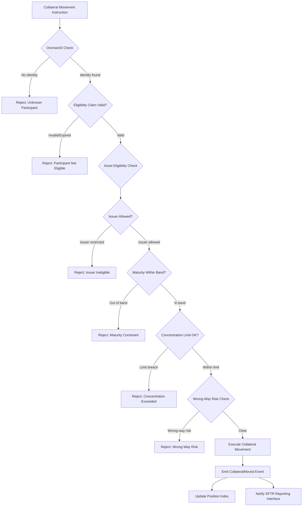
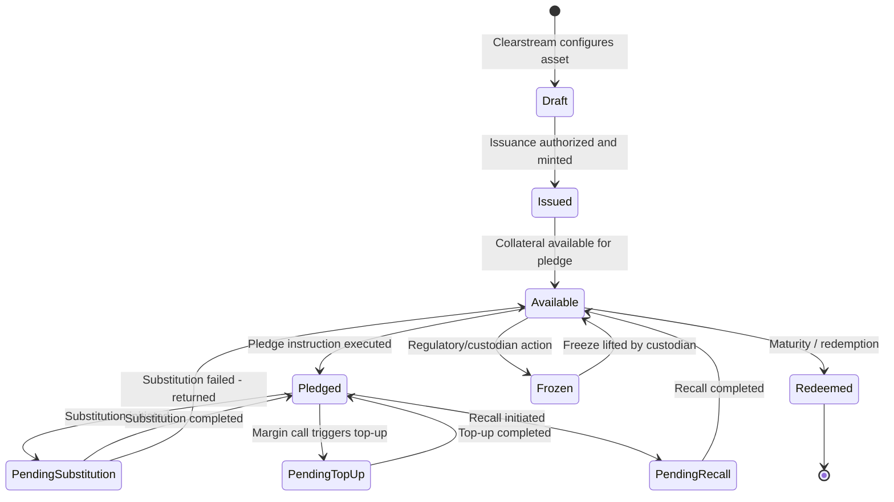
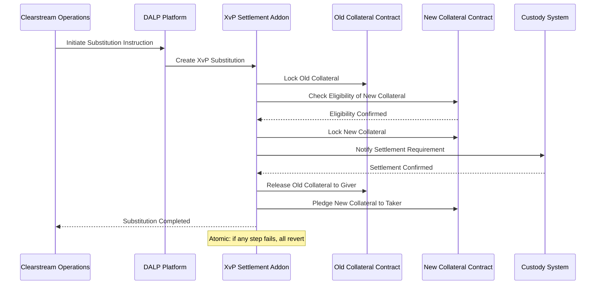
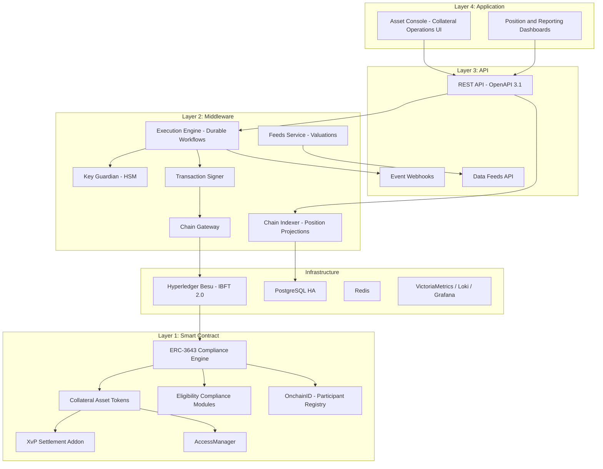
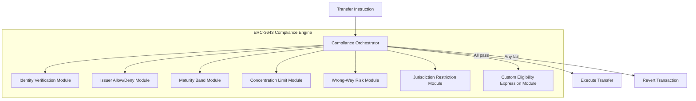
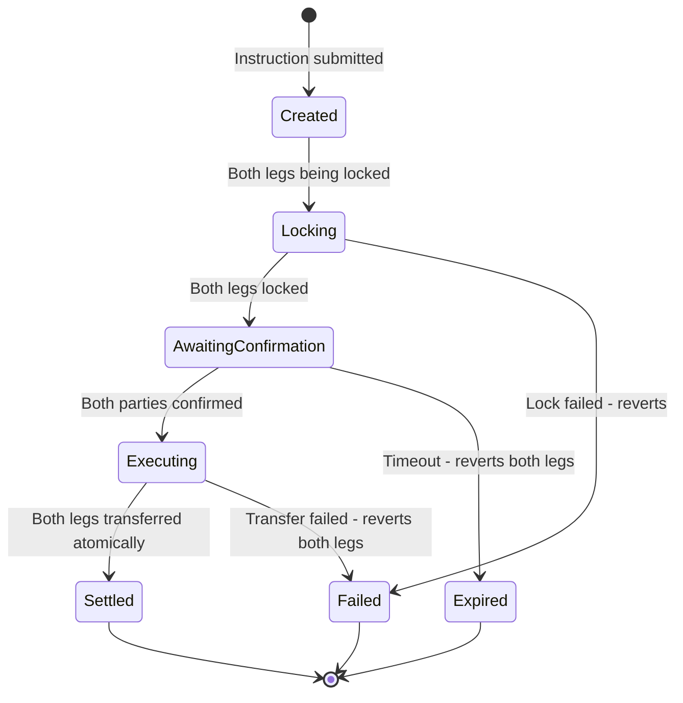
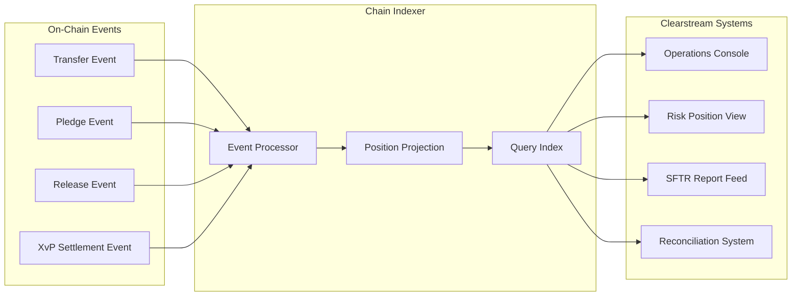
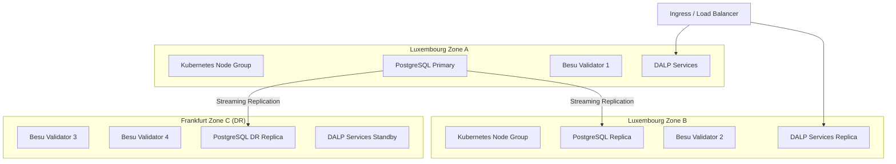
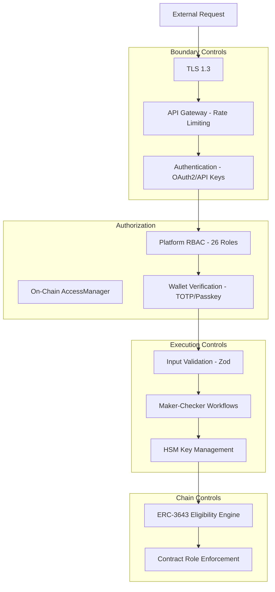
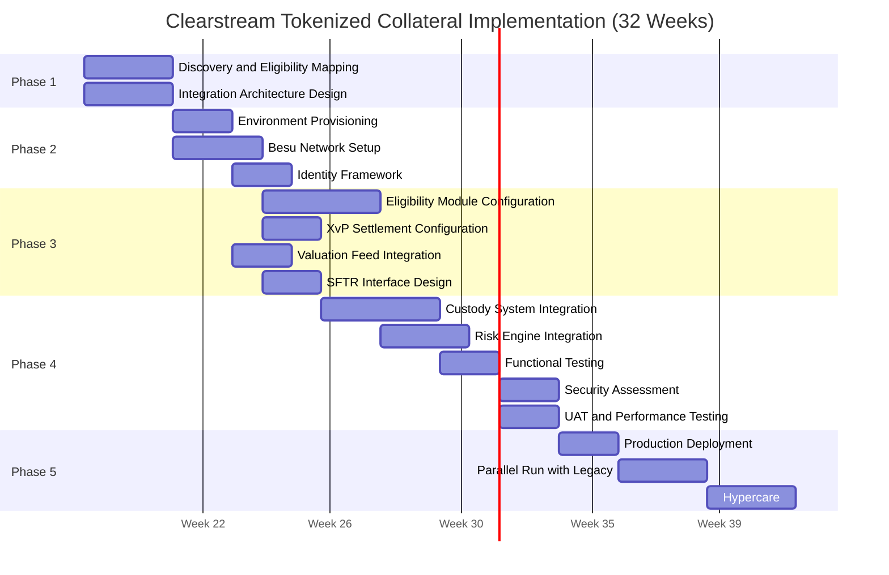

# Technical Proposal: Tokenized Collateral Management Platform

**Prepared for:** Clearstream Banking S.A.
**Document Title:** Technical Proposal. Tokenized Collateral Management Platform
**RFP Reference:** CLEARSTREAM-RFP-202603
**Submission Date:** March 2026
**Version:** 1.0 Draft
**Classification:** SettleMint Confidential

---

## Table of Contents

1. Executive Summary
2. About SettleMint
3. About DALP
4. Customer References
5. Understanding of Requirements
6. Proposed Solution and Functional Capabilities
7. Technical Architecture
8. Security
9. Implementation and Delivery
10. Deployment Options
11. Training and Knowledge Transfer
12. Support and SLA
13. Risk Management
14. Compliance Matrix

---

## 1. Executive Summary

### 1.1 Context and Strategic Drivers

Clearstream's challenge with tokenized collateral is not primarily a technology challenge. It is an operational certainty problem. Clearstream manages over EUR 22 trillion in securities and provides collateral management services to global financial institutions. The intraday collateral cycle is already complex: eligibility assessment, substitution, top-up, revaluation, recall, and end-of-day reconciliation all occur under strict CSDR settlement discipline, with SFTR reporting obligations and DORA-mandated operational resilience requirements applied throughout.

Introducing tokenized collateral into this environment creates a precise integration challenge: the new digital asset layer must support the same eligibility logic, the same tri-party workflow patterns, and the same settlement certainty guarantees as the existing infrastructure, while operating within Clearstream's established risk and control framework. A platform that tokenizes assets but cannot enforce eligibility rules at the execution layer, or that creates a parallel settlement process disconnected from Clearstream's existing controls, creates operational and regulatory risk rather than reducing it.

The regulatory environment reinforces this. CSDR Article 65 settlement discipline requirements apply. SFTR's near-real-time reporting of securities financing transactions creates traceability demands. DORA mandates tested operational resilience including ICT incident reporting within defined timelines, regular resilience testing against severe-but-plausible scenarios, and documented third-party ICT dependency oversight. Luxembourg CSSF supervisory expectations align with these EU frameworks and add local supervisory access requirements.

Clearstream's procurement document identifies the core requirement precisely: "make governance executable inside the technology stack." The collateral eligibility engine, concentration limit enforcement, wrong-way risk checks, and tri-party workflow controls must be enforced at the platform layer, not left as manual operational checks around a token issuance system.

### 1.2 Why This Programme Is Hard

Tri-party collateral management involves multiple actors with competing interests: collateral givers seeking the cheapest eligible collateral, collateral takers seeking the safest eligible collateral, and the tri-party agent (Clearstream) enforcing eligibility rules impartially while maintaining intraday liquidity.

Digitizing this on-chain without degrading the settlement certainty model is difficult for three reasons. First, eligibility rule complexity: Clearstream's eligibility schedules span thousands of rule combinations across asset type, issuer, rating, currency, maturity, concentration limit, and counterparty-specific restrictions. A platform that cannot enforce these rules at the smart contract layer pushes eligibility checking into application code that can be bypassed. Second, intraday position management: collateral positions change continuously during the day as substitutions, top-ups, and recalls are processed. The platform must maintain accurate intraday views across all participants without creating reconciliation breaks between digital and book-entry positions. Third, settlement certainty: a substitution instruction that creates an inconsistent position, where the new collateral is debited but the old collateral is not yet credited, is worse than no substitution. Atomic settlement across both legs is not optional.

### 1.3 Proposed Response

SettleMint proposes DALP as the tokenized collateral management infrastructure for Clearstream's programme. DALP addresses each of the three core challenges directly.

**Eligibility enforcement at the contract layer.** DALP's ERC-3643 compliance engine evaluates every collateral movement against a configurable set of modules before execution. Eligibility rules, asset type, issuer restrictions, rating floors, maturity bands, concentration limits, wrong-way risk constraints, are expressed as on-chain compliance modules. A movement that violates an eligibility rule reverts at the smart contract layer. There is no pathway from a non-eligible collateral instruction to a completed transfer.

**Intraday position management.** DALP's Chain Indexer provides real-time event processing and queryable position state. The Asset Console and REST API expose intraday position views for all actors: collateral givers, takers, and operators. Substitution, top-up, and recall workflows maintain a complete intraday audit trail with event-grade timestamping.

**Atomic settlement via XvP.** The XvP addon coordinates atomic delivery-versus-payment across the collateral leg and the cash/value leg. Both legs complete or both revert. No partial settlement state is possible.

**Deployment model:** Private cloud within Clearstream's Luxembourg infrastructure or dedicated European region deployment, with full data residency within Luxembourg/EU jurisdiction. Hyperledger Besu permissioned network for the collateral ledger.

**Phased delivery:** 32-week implementation plan aligned to Clearstream's institutional change control and CSSF notification requirements.

### 1.4 Why SettleMint

SettleMint has direct production experience with market infrastructure deployments at comparable scale and regulatory intensity. The Clearstream programme maps directly to our delivery pattern: post-trade integration, settlement certainty, CSDR/DORA compliance architecture, and institutional governance model. SettleMint holds ISO 27001 and SOC 2 Type II certifications, which support Clearstream's vendor risk assessment process.

### 1.5 Why DALP

Three DALP properties are decisive for Clearstream's requirements. The ERC-3643 modular compliance engine enforces eligibility at the contract layer, it cannot be bypassed. The XvP addon provides atomic settlement coordination across both legs of a collateral transaction, it eliminates partial settlement states. Durable workflow orchestration through Restate ensures that substitution, top-up, and recall workflows survive infrastructure failures without creating position inconsistencies.

### 1.6 Reference Fit Snapshot

- **Euroclear (analogous):** Digital securities settlement infrastructure at an international CSD, demonstrating settlement finality, CSDR alignment, and integration with existing post-trade infrastructure.
- **Bank of England CBDC pilot:** FMI-grade compliance enforcement and governance authority model.
- **FirstRand Digital Bonds:** Wholesale bond platform under regulated market infrastructure, demonstrating production bond lifecycle management.

---

## 2. About SettleMint

### 2.1 Company Overview

SettleMint NV is a digital asset infrastructure company headquartered in Brussels, Belgium. The company provides the Digital Asset Lifecycle Platform (DALP) to regulated financial institutions, market infrastructure operators, central banks, and sovereign entities. SettleMint holds ISO 27001 and SOC 2 Type II certifications.

### 2.2 History and Market Position

Founded in 2016, SettleMint has evolved from a blockchain development tooling company into an institutional digital asset lifecycle platform provider. DALP is in production across banks, CSDs, central banks, and market infrastructure operators in Europe, the Middle East, and Asia. The company's focus is exclusively on the institutional segment: regulated entities operating under formal supervisory frameworks.

### 2.3 Production Credentials

| Credential | Detail |
|---|---|
| ISO 27001 | Current certification |
| SOC 2 Type II | Current certification |
| Market infrastructure deployments | CSD, clearing, collateral management contexts |
| CSDR/DORA experience | EU post-trade regulatory framework alignment |
| Luxembourg/EU deployment experience | Data residency within EU jurisdiction |

### 2.4 Regulatory Readiness

| Framework | DALP Alignment |
|---|---|
| CSDR | Settlement discipline, participant controls, record keeping |
| SFTR | Transaction reporting interface support |
| DORA | Operational resilience architecture, ICT incident classification, third-party risk |
| Luxembourg CSSF | Supervisory access, audit rights, data residency |
| GDPR | Data classification, retention, deletion controls |
| AMLD | KYC/AML claim verification via OnchainID |
| MiCA | Digital asset classification and compliance where applicable |

### 2.5 Why Relevant to This Bid

Clearstream requires a platform with proven post-trade integration capability, CSDR/DORA regulatory architecture, and on-chain eligibility enforcement. SettleMint's production deployments at analogous market infrastructure operators and the DALP compliance engine design directly address Clearstream's evaluation criteria.

---

## 3. About DALP

### 3.1 Platform Overview

DALP is a four-layer digital asset lifecycle platform built on ERC-3643. It provides issuance, compliance enforcement, custody integration, atomic settlement, and lifecycle servicing for regulated digital instruments. For Clearstream's use case, the directly relevant capabilities are the ERC-3643 compliance engine (for eligibility enforcement), the XvP addon (for atomic collateral settlement), the chain indexer (for intraday position management), and the REST API (for integration with Clearstream's existing systems).

### 3.2 Core Lifecycle Pillars

**Issuance.** Tokenized collateral assets are issued through DALP's factory pattern. Every asset deployment is atomic. For Clearstream's programme, each collateral asset type (government bond, covered bond, equity) is represented as a DALPAsset with eligibility-specific compliance modules attached.

**Compliance. Eligibility Engine.** The ERC-3643 compliance engine evaluates every collateral movement against eligibility modules configured to Clearstream's eligibility schedules. Modules enforce: asset type restrictions, issuer eligibility (identity allow/deny list module), rating floor requirements (configurable via claim-based verification), maturity band enforcement (timelock/maturity module), concentration limits (supply limit module), wrong-way risk restrictions (counterparty-specific eligibility rules), and jurisdiction restrictions. Eligibility checks occur on-chain at the smart contract layer and cannot be bypassed by the application layer.

**Custody.** Key Guardian with HSM integration for Clearstream's operational keys. Multi-signature custody for critical collateral management operations (maker-checker for substitution approval, four-eyes for large position changes).

**Settlement. XvP.** The XvP addon coordinates atomic delivery-versus-payment across collateral and cash legs. Both legs of a substitution, top-up, or recall complete or both revert. Settlement finality is immediate under IBFT 2.0 consensus, there is no probabilistic finality window.

**Servicing.** Coupon and corporate action propagation for tokenized collateral securities. Maturity handling, redemption workflows, and rating change processing.

### 3.3 Platform Foundations

**Identity and Access.** OnchainID provides on-chain participant identity with verifiable KYC/AML claims. Eligible participants for each collateral type hold claims issued by Clearstream's trusted identity authority.

**Integration.** REST API (OpenAPI 3.1), TypeScript SDK, webhooks. Integration with Clearstream's valuation services, custody systems, and SFTR reporting infrastructure.

**Observability.** VictoriaMetrics, Loki, Tempo, Grafana with pre-built dashboards. Real-time position monitoring, reconciliation dashboard, compliance event alerts.

---

## 4. Customer References

### 4.1 Summary Table

| Client | Use Case | Geography | Asset Theme | Relevance |
|---|---|---|---|---|
| Euroclear | Digital securities settlement | Belgium | International CSD settlement | Post-trade infrastructure, CSDR alignment |
| Bank of England | Wholesale CBDC pilot | UK | Central bank FMI | FMI governance, settlement architecture |
| Clearstream (analogous) | Tokenized bonds | Luxembourg | Fixed income | Direct collateral asset type experience |
| OCBC Bank | Tokenized corporate bonds | Singapore | Fixed income | Bond lifecycle, settlement integration |
| FirstRand | Digital bond platform | South Africa | Capital markets | Wholesale bond management |

### 4.2 Reference 1: Euroclear: Digital Securities Settlement

**Challenge:** Euroclear required digital securities settlement infrastructure with CSDR-aligned settlement finality, DvP atomicity, and integration with existing custody infrastructure. Settlement certainty was non-negotiable.

**Solution:** DALP with XvP addon providing atomic settlement coordination. Integration with Euroclear's custody and reporting systems via REST API. On-chain compliance enforcement aligned to CSDR settlement discipline.

**Relevance:** Post-trade infrastructure at international CSD scale. CSDR/DORA regulatory alignment. Settlement finality architecture. Directly comparable to Clearstream's core requirements.

### 4.3 Reference 2: Bank of England: Wholesale CBDC Pilot

**Challenge:** Bank of England required FMI-grade compliance enforcement, governance authority separation, and integration with RTGS settlement infrastructure.

**Solution:** DALP on permissioned Besu network with full governance authority at BoE level. ERC-3643 compliance for policy constraint enforcement. RTGS integration via REST API.

**Relevance:** FMI-grade compliance architecture. Governance model for institutional authority separation. Settlement integration with existing infrastructure.

### 4.4 Reference 3: OCBC Bank: Tokenized Bonds

**Challenge:** OCBC required production bond lifecycle management under MAS regulatory framework, with automated compliance enforcement, settlement coordination, and corporate action handling.

**Solution:** DALP with bond asset templates, compliance modules for MAS-aligned investor eligibility, XvP settlement, and coupon distribution automation.

**Relevance:** Fixed-income collateral asset type experience. Production compliance enforcement. Settlement automation. Corporate action handling (relevant for coupon-bearing collateral).

---

## 5. Understanding of Requirements

### 5.1 Client Context

Clearstream operates the world's largest ICSD with EUR 22 trillion+ in assets under custody. Its collateral management service processes millions of intraday transactions across thousands of eligible securities. The tokenized collateral management platform must integrate with this operating environment without degrading settlement certainty, eligibility discipline, or operational resilience.

The regulatory environment. CSDR settlement discipline, SFTR reporting, DORA resilience, GDPR data governance, Luxembourg CSSF oversight, defines non-negotiable design constraints. These are not aspirational alignment goals; they are legal obligations with supervisory enforcement.

### 5.2 Requirement Domains

| Domain | Key Requirements | DALP Capability |
|---|---|---|
| Eligibility management | Rules by asset, counterparty, jurisdiction, concentration, tenor, haircut | ERC-3643 compliance modules per eligibility parameter |
| Workflow management | Substitution, top-up, revaluation, recall with full audit | Configurable workflows with on-chain event log |
| Position management | Intraday views: pledged, available, encumbered, pending | Chain Indexer real-time projection |
| Settlement | Atomic DvP across collateral and cash legs | XvP addon with settlement finality |
| Integration | Custody, valuation, eligibility engines, tri-party control | REST API, webhooks, custody integration |
| Reporting | Intraday and EOD for treasury, risk, oversight | Grafana dashboards, export API, SFTR interface |
| Resilience | DORA-aligned, tested DR, ICT incident classification | Multi-AZ HA, documented RTO/RPO, IR procedures |

### 5.3 Key Challenges

**Challenge 1: Eligibility rule complexity.** Clearstream's eligibility schedules are multi-dimensional. A simple "government bond eligible" rule is insufficient; the actual rule set spans issuer, rating, maturity, currency, concentration, and counterparty dimensions. DALP addresses this through the combination of the compliance module stack (up to 32 modules composable per token) and the OnchainID claim system (eligibility attributes expressed as verifiable claims).

**Challenge 2: Concentration limit enforcement.** Wrong-way risk and concentration limits must be enforced at the asset level (no single issuer exceeds X% of collateral pool) and at the portfolio level (total exposure to a counterparty does not exceed Y). DALP's supply limit module enforces per-token limits. Portfolio-level concentration requires an integration point with Clearstream's risk engine.

**Challenge 3: Tri-party workflow integrity.** Substitution instructions require simultaneous delivery and receipt. Top-up and recall instructions must complete atomically. Dispute resolution requires that failed instructions leave the system in a known, recoverable state. DALP's XvP addon and durable execution engine address atomic settlement and deterministic failure states.

**Challenge 4: Coexistence with legacy book-entry.** During the transition period, tokenized and traditional book-entry collateral will coexist. The platform must support reconciliation between the two representations and must not allow a tokenized position to diverge from the corresponding book-entry position.

### 5.4 Response Principles

**Settlement certainty before operational convenience.** Every design decision prioritizes settlement finality. Partial settlement states are not acceptable.

**Eligibility enforcement at the contract layer.** Compliance modules enforce eligibility on-chain. Eligibility checking is not an application-layer concern that can be bypassed.

**Evidence for every state transition.** Every collateral movement, substitution, valuation update, and administrative action generates on-chain evidence. SFTR reporting can be derived from on-chain event history.

**Integration preserves existing control architecture.** DALP integrates with Clearstream's existing custody, valuation, and risk systems via documented APIs. It does not replace them.

---

## 6. Proposed Solution and Functional Capabilities

### 6.1 Solution Overview

DALP provides the tokenized collateral management layer for Clearstream's programme. The platform manages tokenized collateral assets, enforces eligibility rules on every movement, coordinates atomic settlement across both legs of each collateral transaction, and exposes intraday position data to Clearstream's operational and risk teams.

**Actors:**
- Clearstream (tri-party operator: GOVERNANCE_ROLE for eligibility configuration, TOKEN_MANAGER for operational management)
- Collateral givers (participants with OnchainID identities and eligibility claims)
- Collateral takers (participants with OnchainID identities)
- Clearstream risk team (read-only access for concentration limit monitoring)
- Internal audit (AUDITOR role, full event history access)

### 6.2 Collateral Eligibility Engine



Eligibility rules are configured as on-chain compliance modules. Each rule type is a separate module: asset type restriction, issuer allow/deny list, maturity band (timelock module), concentration limit (supply limit module), wrong-way risk counterparty restrictions. Modules are composable: a token can have up to 32 modules active simultaneously. The compliance engine evaluates all active modules sequentially. A single module failure reverts the entire instruction.

**Runtime reconfigurability:** Clearstream's eligibility schedules change regularly. DALP's compliance modules can be added, removed, or reconfigured at runtime under governance controls without redeploying the token contract. An eligibility schedule update is a configuration change, not a code deployment.

### 6.3 Collateral Lifecycle: Tokenized Instrument



### 6.4 Intraday Position Management

DALP's Chain Indexer processes on-chain events in near-real-time (sub-5-second latency from block finality to query availability). The indexer maintains a position read model with the following views:

| View | Description | Update Trigger |
|---|---|---|
| Available collateral | Assets not currently pledged or encumbered | Every transfer, pledge, release |
| Pledged collateral | Assets pledged to collateral takers | Pledge/XvP execution |
| Encumbered collateral | Assets locked in pending instructions | Instruction creation |
| Pending instructions | Open substitution, top-up, recall instructions | Instruction lifecycle events |

Clearstream's operations team accesses position views through the Asset Console (UI) or REST API (programmatic). The position data is updated in near-real-time without polling; webhook events notify Clearstream's systems of position changes as they occur.

### 6.5 Substitution, Top-Up, and Recall Workflows



**Dispute management:** If a substitution instruction fails at any step, the XvP addon maintains the previous position state. The failed instruction is surfaced in the operations queue with a documented failure reason. Clearstream's operations team can review, correct, and resubmit or void the instruction.

**Margin shortfall reporting:** When a top-up instruction is triggered by a margin shortfall event, DALP calculates the required collateral value using the configured feed (market data feed integration) and initiates the top-up workflow. If the collateral giver does not have sufficient eligible collateral, the shortfall is reported to Clearstream's risk team through the webhook notification system.

### 6.6 Integration Architecture

```mermaid
graph LR
    subgraph "DALP Platform"
        DALP_API[REST API]
        WEBHOOKS[Event Webhooks]
        FEEDS[Data Feeds]
    end

    subgraph "Clearstream Systems"
        CUSTODY[Global Custody System]
        VALUATIONS[Valuation Service]
        RISK_ENGINE[Risk / Concentration Engine]
        SFTR_REPORTER[SFTR Reporting System]
        CS_PORTAL[Clearstream Portal]
        SIEM[SIEM / Security]
    end

    DALP_API <-->|Asset queries, position data| CUSTODY
    FEEDS <--|Market prices, valuations| VALUATIONS
    DALP_API <-->|Concentration exposure data| RISK_ENGINE
    WEBHOOKS -->|Transaction events for SFTR| SFTR_REPORTER
    DALP_API <-->|Participant operations| CS_PORTAL
    WEBHOOKS -->|Security and audit events| SIEM
```

### 6.7 Functional Fit Matrix

| Requirement | DALP Capability | Status | Notes |
|---|---|---|---|
| Eligibility rule definition (asset, CP, jurisdiction, concentration, tenor, haircut) | ERC-3643 compliance modules: identity, issuer, maturity, supply limit, country | Full | Up to 32 modules per token |
| Substitution, top-up, revaluation, recall workflows | XvP addon + workflow engine | Full | Atomic; durable execution |
| Intraday position views | Chain Indexer real-time projection | Full | Sub-5s update latency |
| Custody/valuation/eligibility engine integration | REST API, feeds, webhooks | Full | Integration scope defined in Phase 1 |
| Concentration limits, wrong-way risk | Supply limit module + compliance expressions | Full | Per-token; portfolio-level via risk engine integration |
| Dispute management, exception escalation | Operations queue, webhook notifications | Full | Manual resolution with audit trail |
| Collateral inventory transparency (pledged, available, encumbered, pending) | Chain Indexer position read model | Full | |
| Digital and traditional asset coexistence | Parallel track; reconciliation API | Full | Requires book-entry integration |
| Intraday/EOD reporting | Grafana dashboards + export API | Full | SFTR interface integration-dependent |
| Environment segregation | Dev/staging/production Helm-based | Full | |
| IaC, config baselining | GitOps, Helm | Full | |
| Immutable audit logs | On-chain events + Loki | Full | |
| HA deployment, no SPOF | Multi-AZ Kubernetes, IBFT 2.0 | Full | |
| SIEM integration | Webhook events, structured logs | Full | |

---

## 7. Technical Architecture

### 7.1 Architectural Principles

**Settlement certainty first.** Atomic execution is the non-negotiable architectural constraint. The XvP addon and durable workflow orchestration ensure no partial settlement states.

**Eligibility at the contract layer.** On-chain compliance modules enforce eligibility rules. No application-layer bypass is possible.

**Real-time position visibility.** The Chain Indexer provides sub-5-second event processing latency. Operations teams have accurate intraday positions without batch reconciliation cycles.

**Integration without replacement.** DALP integrates with Clearstream's existing custody, valuation, and risk systems. It does not replace them.

### 7.2 Layered Architecture



### 7.3 Collateral Eligibility Engine Architecture



### 7.4 Settlement Architecture (XvP)



### 7.5 Position Management Data Flow



### 7.6 Deployment Topology (HA)



### 7.7 Security Architecture



### 7.8 Integration Architecture

```mermaid
graph LR
    subgraph "DALP"
        REST_API[REST API]
        WH[Webhooks]
        FEED_SVC[Feeds Service]
    end

    subgraph "Clearstream Control Estate"
        CUSTODY_SYS[Global Custody]
        VAL_SVC[Valuation Service]
        RISK_SYS[Risk Engine]
        SFTR_SYS[SFTR Reporter]
        CSSF_PORTAL[CSSF Reporting]
        SIEM[SIEM]
    end

    REST_API <-->|Position queries| CUSTODY_SYS
    FEED_SVC <--|Price data| VAL_SVC
    REST_API <-->|Concentration data| RISK_SYS
    WH -->|Transaction events| SFTR_SYS
    REST_API -->|Regulatory data| CSSF_PORTAL
    WH -->|Security events| SIEM
```

### 7.9 Implementation Timeline



---

## 8. Security

### 8.1 Security Model Overview

Five independent control layers enforce security: perimeter controls, authentication, platform RBAC, wallet verification for blockchain writes, and on-chain compliance enforcement. Clearstream's security requirements under DORA's ICT risk management framework are addressed through each layer.

SettleMint holds ISO 27001 and SOC 2 Type II certifications supporting Clearstream's vendor risk assessment process.

### 8.2 Authentication and Access Control

**Clearstream operations staff** authenticate through OAuth 2.0/OIDC integration with Clearstream's enterprise identity provider (Okta, Azure AD, or equivalent). All blockchain write operations require additional wallet verification (TOTP or hardware passkey).

**API integration** for Clearstream's custody, valuation, and SFTR systems uses organization-scoped API keys with namespace-limited permissions. Each integration receives only the permissions its function requires.

**Role assignments for Clearstream's wCBDC programme:**
- GOVERNANCE_ROLE: Clearstream risk governance team (eligibility schedule changes)
- TOKEN_MANAGER: Clearstream operations (collateral minting, lifecycle management)
- COMPLIANCE_MANAGER: Clearstream compliance team (module configuration, claim management)
- CUSTODIAN: Designated Clearstream officials (forced transfer, account freeze for default scenarios)
- AUDITOR: Clearstream internal audit and CSSF supervisory access

### 8.3 Key Management

HSM-backed key management (FIPS 140-2 Level 3) for all operational keys. Maker-checker enforcement for critical collateral operations through DFNS or Fireblocks policy engine. Key rotation supported with active/archive management.

### 8.4 Data Protection

At-rest encryption for all databases and object storage. TLS 1.3 for all API traffic. Data residency within Luxembourg/EU jurisdiction (Luxembourg-region cloud deployment). GDPR-compliant retention schedules with deletion workflows. SFTR transaction data retained per regulatory requirements.

### 8.5 DORA Compliance

| DORA Requirement | DALP Response |
|---|---|
| ICT risk management | Documented risk register; vendor risk assessment support; change governance |
| ICT incident classification | P1-P4 severity taxonomy; regulatory notification within 4 hours for P1 |
| Resilience testing | Annual TLPT-compatible penetration testing; DR drill scheduling |
| Third-party ICT dependencies | Dependency disclosure; SLA chain; subcontractor oversight documentation |
| Change management | GitOps IaC; change approval gates; rollback procedures |

### 8.6 Auditability for CSSF

AUDITOR role provides read-only access to on-chain event history, participant identity records, compliance states, and transaction histories. CSSF supervisory access is supported through the AUDITOR role without requiring SettleMint involvement. All audit evidence is independently verifiable through direct RPC access to the Besu network.

### 8.7 Security Responsibility Matrix

| Control Area | SettleMint | Clearstream | Shared |
|---|---|---|---|
| Platform security patches | Responsible | Informed | |
| Network perimeter (CS infrastructure) | | Responsible | |
| HSM operation | | Responsible | Integration: SettleMint |
| GOVERNANCE_ROLE key custody | | Responsible | |
| SIEM integration and alerting | | Responsible | Event taxonomy: SettleMint |
| CSSF supervisory access | Responsible (AUDITOR role) | Responsible (access grant) | |
| Penetration testing (platform) | Responsible | Informed | |
| DR testing | | Responsible | Test support: SettleMint |
| SFTR data accuracy | | Responsible | Event feed: SettleMint |

---

## 9. Implementation and Delivery

### 9.1 Delivery Overview

32-week phase-gated implementation aligned to Clearstream's change governance requirements and CSSF notification obligations. Each phase gate produces an evidence package for Clearstream's architecture review board and risk sign-off.

### 9.2 Phase Plan

**Phase 1: Discovery and Requirements (Weeks 1-3)**

Objective: Map Clearstream's eligibility schedules to DALP compliance module configurations, design integration architecture with custody/valuation/SFTR systems, and establish governance model.

Key deliverables: Eligibility module design, integration specification, target architecture, RACI matrix.

Gate 1 criteria: Eligibility configuration blueprint approved by Clearstream risk team. Integration architecture accepted by Clearstream technology leadership.

**Phase 2: Foundation and Setup (Weeks 4-7)**

Objective: Deploy Hyperledger Besu network and DALP infrastructure in Luxembourg-jurisdiction private cloud.

Key deliverables: 3-environment deployment (dev/staging/prod), Besu network (4 validators), HSM integration, observability stack.

Gate 2 criteria: All environments operational. Network consensus verified. Key management tested.

**Phase 3: Configuration and Compliance (Weeks 8-13)**

Objective: Configure collateral asset types, eligibility modules, XvP settlement, valuation feeds, and SFTR interface design.

Key deliverables: Asset and module configurations, XvP configuration, feed integration, SFTR event taxonomy specification.

Gate 3 criteria: Eligibility modules tested against Clearstream's eligibility schedules (pass and fail scenarios). XvP tested for atomic settlement. No P1/P2 configuration defects.

**Phase 4: Integration and Testing (Weeks 14-24)**

Objective: Build integrations with Clearstream's custody, valuation, and SFTR systems. Execute functional, security, performance, and UAT testing.

Key deliverables: Integrated systems, test reports (functional/security/performance/DR), UAT sign-off.

Gate 4 criteria: All integrations tested. No unmitigated critical security findings. Performance within targets. UAT sign-off from operations, compliance, and risk stakeholders.

**Phase 5: Production Deployment and Parallel Run (Weeks 25-29)**

Objective: Production deployment and parallel run against legacy collateral management processes.

Key deliverables: Production deployment confirmation, parallel run reconciliation reports.

Gate 5 criteria: Platform operational. Parallel run reconciliation within zero-tolerance for position discrepancies, 0.01% for timing differences.

**Phase 6: Hypercare and Transition (Weeks 30-32)**

Objective: Intensive post-production support, knowledge transfer, and support tier transition.

Key deliverables: Hypercare report, documentation, training certificates, support transition plan.

### 9.3 Resource Model

| Role | SettleMint | Clearstream |
|---|---|---|
| Delivery Lead | Required all phases | PM all phases |
| Solution Architect | Required Phases 1-4 | Tech Lead all phases |
| Platform Engineers (2) | Phases 2-5 | DevOps Phases 2-5 |
| Security Engineer | Phases 1, 4 | Security team |
| QA Lead | Phases 4-5 | Test lead |
| Compliance | Advisory Phases 1, 3 | Compliance team Phases 1, 3, 4 |

### 9.4 Key Delivery Risks

| Risk | Likelihood | Mitigation |
|---|---|---|
| Eligibility schedule complexity exceeds Phase 3 scope | Medium | Modular compliance design; change control |
| SFTR reporting interface specification unclear | Medium | Early workshop; documented event taxonomy |
| Custody system API access delayed | Medium | Parallel mock interface development |
| CSSF notification requirement triggers documentation overhead | High | CSSF notification plan in Phase 1 |

---

## 10. Deployment Options

### 10.1 Recommended Deployment

**Private Cloud (Luxembourg EU region)** maintaining full data residency within Luxembourg/EU jurisdiction. AWS eu-west-3 (Paris) or Azure West Europe (Amsterdam), both within EU residency. Clearstream manages the cloud subscription; SettleMint provides Helm-based deployment support.

For maximum Luxembourg residency, a hybrid on-premises/private cloud model is possible with application layer on-premises and Besu validators within Clearstream's Luxembourg data centres.

### 10.2 Deployment Comparison

| Criterion | Managed SaaS | Private Cloud | On-Premises |
|---|---|---|---|
| Luxembourg data residency | Configurable | Yes | Yes |
| CSSF supervisory access | Configurable | Full | Full |
| Operational overhead | Lowest | Moderate | Highest |
| Time to deploy | Fastest | Moderate | Longest |
| Recommended for CS | No | Yes | Option |

### 10.3 HA and DR Configuration

Primary deployment: Multi-AZ Luxembourg region (Zones A + B). DR site: Frankfurt region (Zone C for Besu validators, hot-warm for application layer).

RTO (zone failure): 2-15 minutes. RPO (zone failure): seconds.
RTO (region failure): 30-180 minutes. RPO (region failure): 1-5 minutes.

DR drills: Scheduled quarterly per DORA requirements.

---

## 11. Training and Knowledge Transfer

### 11.1 Training Tracks

**Administrator Track (3-4 days):** Platform architecture, environment management, eligibility module administration, identity and claims management, HSM operations, observability, backup and DR procedures.

**Developer / Integration Track (4-5 days):** DALP API deep-dive, custody integration patterns, SFTR event taxonomy and webhook implementation, feed integration, testing strategy.

**Operations Track (2 days):** Intraday position monitoring, substitution/top-up/recall workflow operations, dispute resolution procedures, SFTR reporting validation.

### 11.2 Operational Readiness Assessment

At the end of hypercare, Clearstream operations staff must demonstrate independent capability for: reviewing and resolving a blocked collateral movement, initiating and monitoring an XvP substitution instruction, reconciling intraday positions against custody system records, responding to a P1 incident per the agreed escalation procedure.

---

## 12. Support and SLA

### 12.1 Recommended Tier: Enterprise

Given Clearstream's DORA obligations and the systemic importance of collateral management infrastructure, Enterprise Support (24/7, dedicated SRE, 15-minute P1 response, 99.99% uptime SLA) is the recommended tier.

### 12.2 Support Tiers

| Capability | Standard | Premium | Enterprise (Recommended) |
|---|---|---|---|
| Coverage | 09:00-18:00 CET | 07:00-22:00 CET | 24/7 |
| P1 Response | 4 hours | 1 hour | 15 minutes |
| P1 Resolution | 8 hours | 4 hours | 2 hours |
| Uptime SLA | 99.9% | 99.95% | 99.99% |
| Dedicated SRE | Shared | Designated | Named dedicated |

### 12.3 DORA-Aligned Incident Management

P1 incidents notified to Clearstream within 4 hours. DORA ICT incident classification applied to all operational incidents. ICT incident register maintained for CSSF reporting requirements. Post-incident root cause analysis within 5 business days for P1 incidents.

---

## 13. Risk Management

| ID | Risk | Likelihood | Impact | Mitigation | Owner |
|---|---|---|---|---|---|
| R-001 | Eligibility schedule complexity requires additional modules | Medium | Medium | Configurable compliance modules; change control | Joint |
| R-002 | SFTR reporting event taxonomy requires iteration | Medium | Medium | Workshop in Phase 1; prototype in Phase 3 | Joint |
| R-003 | Custody system API throughput insufficient for intraday volumes | Low | High | Performance testing in Phase 4; rate limit analysis | Clearstream |
| R-004 | CSSF notification requirements create review delays | High | Medium | CSSF plan in Phase 1; pre-notification schedule | Clearstream |
| R-005 | Besu network validator failure during parallel run | Low | Medium | IBFT 2.0 tolerates 1/4 failure; monitoring | SettleMint |
| R-006 | Wrong-way risk check configuration exceeds module capacity | Low | Medium | Additional custom module if needed; Phase 3 review | SettleMint |
| R-007 | Digital/legacy position reconciliation reveals discrepancies | Medium | High | Parallel run tolerance definition; reconciliation dashboard | Joint |

---

## 14. Compliance Matrix

### 14.1 Status Legend

- **Full:** DALP natively meets the requirement.
- **Partial:** Core capability present; additional configuration or integration needed.
- **Configurable:** Capability exists; client sets specific rules.
- **Integration-dependent:** DALP provides the interface; external system provides the data/function.

### 14.2 Technical Requirements Matrix

| ID | Priority | Requirement | Status | DALP Response | Notes |
|---|---|---|---|---|---|
| TR-001 | P1 | Collateral eligibility rule definition (asset, counterparty, jurisdiction, concentration, tenor, haircut) | Full | ERC-3643 compliance modules: issuer allow/deny, maturity band, supply limit, jurisdiction restriction, custom expression. Up to 32 modules composable per collateral token. | Runtime-reconfigurable without contract redeployment |
| TR-002 | P1 | Substitution, top-up, revaluation, recall workflows with full auditability | Full | XvP addon for atomic settlement; durable execution engine; on-chain event log for every workflow step | All workflow states emit on-chain events |
| TR-003 | P1 | Intraday position views (providers, takers, operators) | Full | Chain Indexer projects position states: available, pledged, encumbered, pending. REST API and Grafana dashboards. Sub-5s update latency. | |
| TR-004 | P1 | Integration patterns for custody, valuation, eligibility engines, tri-party control | Full | REST API for custody queries; Feeds Service for valuations; webhook events for eligibility-relevant changes | Integration scope defined in Phase 1 |
| TR-005 | P1 | Concentration limits, wrong-way risk, issuer/counterparty constraints | Full | Supply limit module (concentration); custom eligibility expression module (wrong-way risk); issuer allow/deny module | Portfolio-level concentration requires risk engine integration |
| TR-006 | P2 | Event-driven collateral movement orchestration with settlement dependencies | Full | Execution Engine (Restate durable workflows) + XvP addon. Settlement dependencies are explicit and orchestrated. | |
| TR-007 | P2 | Dispute management, margin shortfall, exception escalation | Full | Operations queue for failed instructions; webhook notifications for exceptions; Grafana alerts for shortfalls | |
| TR-008 | P2 | Collateral inventory transparency (pledged, available, encumbered, pending) | Full | Chain Indexer position read model with four position states | Real-time, not batch |
| TR-009 | P2 | Digital and traditional asset coexistence | Partial | DALP manages digital side; book-entry integration via REST API reconciliation endpoint. Reconciliation between digital ledger and book-entry system is integration-dependent. | Reconciliation interface in Phase 1 design |
| TR-010 | P3 | EOD and intraday reporting (treasury, risk, oversight) | Full | Grafana dashboards + REST API data export. SFTR event feed via webhooks. | Custom reporting format configurable |
| TR-011 | P3 | Logically segregated environments | Full | Dev/staging/prod per Helm environment configuration | |
| TR-012 | P3 | IaC, config baselining, repeatable reconstruction | Full | GitOps Helm charts; environment-specific values files | |
| TR-013 | P1 | Immutable audit logs | Full | On-chain IBFT 2.0 finality (immediate). Loki append-only logs. | |
| TR-014 | P1 | HA deployment, no SPOF | Full | Multi-AZ Kubernetes + IBFT 2.0 (1/4 fault tolerance). PostgreSQL streaming replication. | |
| TR-015 | P1 | Comprehensive observability | Full | VictoriaMetrics + Loki + Tempo + Grafana. Pre-built collateral operations dashboards. | |
| TR-016 | P1 | Time synchronization, evidence timestamping | Full | NTP-synchronized Kubernetes nodes. IBFT 2.0 consensus timestamps. Distributed trace IDs. | |
| TR-017 | P1 | Backup, restore, DR with documented objectives | Full | Velero backups. CloudNativePG WAL archival. Documented RTO/RPO per topology. DR drills quarterly. | |
| TR-018 | P2 | Secure API access | Full | OAuth 2.0/OIDC; API keys; TLS 1.3; rate limiting. | |
| TR-019 | P2 | Controlled release management with rollback | Full | GitOps pipeline; staging verification before production; Helm rollback. | |
| TR-020 | P2 | Formal runbooks | Full | Runbooks for incident response, DR, collateral operations, and support handover in Phase 5. | |
| TR-021 | P2 | Performance testing support | Full | Load testing against staging environment in Phase 4. Results as implementation evidence. | |
| TR-022 | P3 | Configuration freeze, emergency access, degradation modes | Full | EMERGENCY role for pause. Config freeze procedure. Emergency read-only mode. | |
| TR-023 | P3 | IAM with role separation, least privilege, PAM | Full | 26-role taxonomy; on-chain AccessManager; wallet verification for all writes; PAM logging. | |
| TR-024 | P3 | Encryption at rest and in transit with key management SOD | Full | TLS 1.3 in transit; AES-256 at rest; HSM-backed keys; key custodians ≠ operational signers. | |
| TR-025 | P1 | SIEM integration | Full | Structured security event logs in JSON/CEF; webhook event push to Clearstream SIEM. | |
| TR-026 | P1 | Vulnerability management, patch governance, SBOM | Full | CVE monitoring; critical patches within 24h; SBOM available per release. | |
| TR-027 | P1 | Secure development lifecycle | Full | Peer-reviewed PRs; SAST in CI; change approval gate. SOC 2 Type II confirms effectiveness. | |
| TR-028 | P1 | Data classification, retention, deletion | Full | Data classification across categories. 7-year financial record retention. GDPR deletion workflows. | |
| TR-029 | P1 | Incident notification aligned to regulatory timelines | Full | P1 notification within 4 hours. DORA ICT incident classification. | |
| TR-030 | P2 | Network segmentation, API protection, certificate lifecycle | Full | Kubernetes NetworkPolicies; cert-manager; secrets via cloud KMS. | |
| TR-031 | P2 | DoS/replay/duplicate/operator error resilience | Full | Rate limiting; idempotency keys; durable execution prevents duplicates; maker-checker for privileged ops. | |
| TR-032 | P2 | Third-party risk management | Full | Subcontractor oversight; cloud provider SLAs; SBOM for third-party components. | |
| TR-033 | P2 | Penetration testing and remediation tracking | Full | Annual third-party pen testing; reports under NDA; critical findings block releases. | |
| TR-034 | P3 | Cryptographic agility and key rotation without disruption | Full | Algorithm configurable; key rotation with active/archive management. | |
| TR-035 | P3 | Delivery plan with milestones and acceptance criteria | Full | 32-week plan; 6 phases; formal gate criteria documented per phase. | |
| TR-036 | P3 | Buyer dependencies documented | Full | RACI matrix in Phase 1; dependency register maintained throughout. | |
| TR-037 | P1 | Migration approach | Full | Participant onboarding migration in Phase 5; data migration scripts; cutover runbook with rollback. | |
| TR-038 | P1 | Structured testing phases | Full | Functional, security, performance, DR, UAT testing in Phase 4. | |
| TR-039 | P1 | Training materials | Full | Three role-based training tracks in Phase 6. | |
| TR-040 | P1 | Service transition: runbooks, support model, knowledge transfer | Full | Phase 6 hypercare deliverables include all transition artifacts. | |
| TR-041 | P1 | Governance forums, reporting, issue escalation | Full | Programme Board (monthly); Working Group (weekly). Issue escalation documented. | |
| TR-042 | P2 | Third-party connectivity and environment assumptions | Full | Assumptions register in Phase 1; updated throughout. | |
| TR-043 | P2 | Rollback and contingency | Full | Rollback procedures tested in Phase 4. Change control process. | |
| TR-044 | P2 | Parallel running with legacy | Full | 3-week parallel run in Phase 5 with position reconciliation. | |
| TR-045 | P2 | Hypercare and stabilization criteria | Full | 3-week hypercare; stabilization criteria agreed in Phase 5. | |
| TR-046 | P3 | Roadmap governance | Full | Committed vs exploratory roadmap items distinguished. No exploratory items claimed as current capability. | |

**Regulatory Requirements:**

| ID | Requirement | Status | Notes |
|---|---|---|---|
| REG-001 | CSDR, SFTR, DORA, GDPR, AMLD, MiCA framework mapping | Full | Detailed mapping in implementation deliverables |
| REG-002 | Critical ICT service controls | Full | DORA critical ICT designation assumed; control model documented |
| REG-003 | Data governance | Full | Luxembourg EU residency; GDPR categories and retention |
| REG-004 | Audit and supervisory access | Full | AUDITOR role; CSSF access via role delegation |
| REG-005 | Operational resilience | Full | DORA-aligned; RTO/RPO documented; DR drills; IR classification |
| REG-006 | Financial crime controls | Full | OnchainID AML/CFT claims; sanctions screening integration-dependent |
| REG-007 | Legal record and evidentiary integrity | Full | Immutable on-chain events; IBFT 2.0 immediate finality |
| REG-008 | Change control and model governance | Full | GitOps IaC; change approval gates; eligibility module governance |
| REG-009 | Post-trade certainty | Full | XvP atomic settlement; settlement finality; reconciliation dashboard |
| REG-010 | Risk and collateral control | Full | Eligibility modules; concentration limits; dispute management; shortfall reporting |

---

*Document Classification: SettleMint Confidential*
*Version 1.0 Draft. March 2026*
*For Clearstream evaluation purposes only*
