# Technical Proposal: Regulated Digital Asset Trading Venue

**Prepared for:** Deutsche Börse AG
**Document Title:** Technical Proposal: Regulated Digital Asset Trading Venue
**RFP Reference:** DEUTSCHEBORSE-RFP-202603
**Submission Date:** March 2026
**Version:** 1.0 Draft
**Classification:** SettleMint Confidential

---

## Table of Contents

1. Executive Summary
2. About SettleMint
3. About DALP
4. Customer References
5. Understanding of Requirements
6. Proposed Solution and Functional Capabilities
7. Technical Architecture
8. Security
9. Implementation and Delivery
10. Deployment Options
11. Training and Knowledge Transfer
12. Support and SLA
13. Risk Management
14. Compliance Matrix

---

## 1. Executive Summary

### 1.1 Context and Strategic Drivers

Deutsche Börse's challenge in establishing a regulated digital asset trading venue is not simply a matter of deploying a token issuance system. As a regulated market operator under MiFID II and Germany's existing exchange regulatory framework, Deutsche Börse must demonstrate to BaFin and relevant EU authorities that the digital asset trading venue meets the same market integrity, participant admission, surveillance, and operational resilience standards as its traditional venues.

The regulatory environment has hardened significantly. MiCA creates a directly applicable framework for crypto-asset service providers operating in the EU, with Deutsche Börse's exchange group likely to be subject to multiple concurrent regulatory perimeters depending on the instrument classification of each listed digital asset. MiFID II/MiFIR trading venue requirements continue to apply where digital assets are classified as financial instruments. DORA's operational resilience regime applies from January 2025 with ICT testing, incident classification, and third-party dependency management requirements. BaFin's Crypto Securities Act (eWpG) framework creates specific requirements for electronic securities issuance and listing.

Deutsche Börse's procurement document identifies the core requirements with precision: venue state controls, deterministic message handling, market surveillance data feeds, participant admission and entitlement controls, throttling and kill-switch capabilities, and listing workflow with disclosure capture. These are not digital innovation experiments; they are the foundational controls that allow a regulated market to operate under MiFID II's fair and orderly market obligation.

The go-to-market context also matters. Deutsche Börse's existing Xetra and D3X (Deutsche Börse Digital Exchange) infrastructure creates integration requirements: the digital asset trading venue must connect to existing market data distribution, participant access management, and CCP/settlement infrastructure rather than operating in isolation.

### 1.2 Why This Programme Is Hard

Three dimensions make this technically and operationally complex.

**Market structure configuration.** MiFID II requires that trading venues maintain fair and orderly markets. For digital assets, this requires configurable market models (continuous, periodic auction, RFQ), session state management (pre-open, open, halt, close, post-trade), and circuit-breaker controls that match the venue's specific market design. A generic token transfer platform cannot provide this.

**Market surveillance.** MiFID II Article 31 requires systematic monitoring of transactions and order activity for market abuse detection. This requires deterministic event sequencing (orders and trades must be recorded with microsecond-precision timestamps in a consistent sequence), feed export to surveillance systems, and evidence retention in a format suitable for regulatory investigation.

**Participant admission governance.** MiFID II requires that access to regulated markets is subject to admission criteria, ongoing eligibility monitoring, and the ability to revoke access. For digital assets, this means participant admission must enforce eligibility claims on-chain, not just at the application layer.

### 1.3 Proposed Response

SettleMint proposes DALP as the regulated digital asset trading venue infrastructure. DALP's on-chain participant admission controls (ERC-3643 compliance modules + OnchainID), configurable asset lifecycle management (venue state controls via DALPAsset), and event emission architecture (audit-grade timestamped event logs) address Deutsche Börse's specific regulatory requirements.

**Venue state management:** DALP's EMERGENCY and GOVERNANCE roles provide venue state controls: the ability to pause trading (equivalent to halt), modify eligibility rules (equivalent to admission changes), and recover from exceptional states. For more advanced market model configuration (session state machines, order book logic), DALP provides the token and compliance layer while Deutsche Börse's existing market model infrastructure (Xetra or D3X) provides the matching engine. DALP assumes the role of the regulated token layer within the D3X/Xetra integration pattern.

**Participant admission:** OnchainID identity management with verifiable admission claims. Participant admission is controlled through trusted claim issuance. Revocation is immediate: revoking an admission claim blocks all further transfers for that participant.

**Listing workflow:** DALP's issuance flow supports admission checks, disclosure capture (stored as off-chain metadata linked to the token), and issuer attestations via the trusted claim system.

**Deployment:** Private cloud within Deutsche Börse's Frankfurt infrastructure or dedicated EU-jurisdiction deployment, aligned with BaFin regulatory expectations.

**Phased delivery:** 32-week implementation plan with formal phase gates for BaFin notification requirements.

### 1.4 Why SettleMint

SettleMint has delivered regulated digital asset infrastructure to exchange groups, stock exchanges, and market infrastructure operators. The company's production experience with participant admission controls, compliance enforcement at the contract layer, and integration with existing market infrastructure directly addresses Deutsche Börse's requirements.

### 1.5 Why DALP

DALP's ERC-3643 participant admission controls, configurable compliance module architecture, and deterministic event emission address the specific MiFID II requirements of a regulated digital asset trading venue. The on-chain AccessManager provides venue operator controls (pause, suspend, administrative override) that satisfy MiFID II's orderly market obligations.

### 1.6 Reference Fit Snapshot

- **Tadawul (Saudi Exchange):** Digital securities listing and trading platform for a regulated exchange group, demonstrating participant admission, listing workflow, and surveillance feed architecture.
- **JSE (Johannesburg Stock Exchange):** Digital asset trading and settlement at a regulated exchange, demonstrating market integrity controls and settlement integration.
- **Bank of England:** FMI-grade compliance enforcement and governance architecture.

---

## 2. About SettleMint

### 2.1 Company Overview

SettleMint NV delivers DALP to regulated financial institutions, market infrastructure operators, and exchange groups. The company holds ISO 27001 and SOC 2 Type II certifications and has production deployments at exchange groups and market infrastructure operators in multiple jurisdictions.

### 2.2 Production Credentials

| Credential | Detail |
|---|---|
| ISO 27001 / SOC 2 Type II | Current certifications |
| Exchange group deployments | Stock exchanges, digital securities venues, regulated platforms |
| MiFID II aligned deployments | EU regulated market infrastructure |
| BaFin context | German regulatory framework experience |
| DORA aligned | EU ICT resilience requirement coverage |

### 2.3 Regulatory Readiness

| Framework | DALP Alignment |
|---|---|
| MiFID II / MiFIR | Participant admission, market integrity controls, event records, transparency |
| DORA | ICT resilience, incident classification, third-party risk, vulnerability management |
| CSDR | Settlement connection, delivery obligations |
| GDPR | Data classification, retention, deletion, residency |
| AMLD | KYC/AML claim verification |
| MiCA | Digital asset classification and service provider obligations |
| eWpG (German) | Electronic securities registration and listing controls |

---

## 3. About DALP

### 3.1 Platform Overview

DALP provides a four-layer digital asset lifecycle platform with full ERC-3643 compliance enforcement. For Deutsche Börse's regulated trading venue, the most relevant capabilities are: on-chain participant admission (identity and eligibility enforcement), venue state controls (pause, emergency, governance functions), listing workflow (asset configuration with disclosure metadata), atomic settlement (XvP addon for post-trade DvP), and event emission architecture (deterministic event sequencing and audit-grade timestamping).

### 3.2 Core Capabilities for Trading Venue Context

**Participant admission.** OnchainID with verified claims for MiFID II participant eligibility. Admission claims issued by Deutsche Börse's identity authority. Revocation blocks all further on-chain activity immediately. Entitlement differentiation: issuer, member, market maker, and operator roles enforced at the contract layer.

**Venue state controls.** DALP's EMERGENCY role supports immediate venue pause (halt equivalent). The GOVERNANCE_ROLE supports permanent state changes (admission rule changes, eligibility schedule updates). The TOKEN_MANAGER role supports operational listing and delisting actions.

**Listing workflow.** DALPAsset factory pattern deploys digital securities atomically. Listing admission checks are embedded in the issuance workflow: the asset can only be activated (transfers enabled) after GOVERNANCE_ROLE authorization. Disclosure capture occurs as off-chain metadata linked to the token address. Issuer attestations are stored as verifiable claims.

**Market surveillance support.** Every on-chain event includes block timestamp, transaction hash, and event signature. The Chain Indexer provides time-ordered event export suitable for market surveillance system ingestion. Deterministic event sequencing is enforced by the Besu IBFT 2.0 consensus mechanism.

**Settlement.** XvP addon for atomic DvP settlement following trade execution.

---

## 4. Customer References

### 4.1 Summary Table

| Client | Use Case | Geography | Relevance |
|---|---|---|---|
| Tadawul | Tokenized securities listing and trading | Saudi Arabia | Exchange group; listing workflow; participant admission |
| JSE | Digital asset trading and settlement | South Africa | Regulated exchange; settlement integration; market controls |
| Bank of England | Wholesale CBDC pilot | UK | FMI governance; compliance architecture |
| Deutsche Bank | Digital bonds issuance | Germany | German regulatory context; MiCA/MiFID II alignment |
| Euroclear | Digital securities settlement | Belgium | Post-trade settlement finality |

### 4.2 Reference 1: Tadawul, Digital Securities Listing

Tadawul, the Saudi Exchange, required a tokenized securities listing and trading platform under Saudi Capital Market Authority framework. The programme required participant admission controls for issuers and broker-dealers, listing admission workflow, and integration with existing Tadawul trading infrastructure. DALP's OnchainID participant registry and admission claim system provided the membership control layer. Listing workflow with disclosure capture and issuer attestations was implemented through the DALP issuance factory. The architecture directly parallels Deutsche Börse's MiFID II admission and listing requirements.

### 4.3 Reference 2: JSE, Digital Asset Trading

The Johannesburg Stock Exchange required digital asset trading and settlement infrastructure under the FSCA regulatory framework. The programme required market integrity controls, settlement DvP atomicity, and participant admission management. DALP's XvP addon provided atomic DvP settlement. On-chain participant admission controls enforced JSE membership rules. The integration with existing JSE settlement infrastructure used DALP's REST API.

### 4.4 Reference 3: Deutsche Bank, Digital Bonds

Deutsche Bank's digital bond platform operates within MiCA and MiFID II regulatory perimeters in Germany. The platform demonstrates DALP's production capability within the German regulatory context including BaFin notification requirements, eWpG alignment, and DORA operational resilience standards. The regulatory experience from this deployment directly informs SettleMint's understanding of Deutsche Börse's regulatory environment.

---

## 5. Understanding of Requirements

### 5.1 Client Context

Deutsche Börse is an exchange group operating critical market infrastructure under BaFin supervision. The digital asset trading venue programme must deliver venue-grade controls (not a pilot) from launch. BaFin's supervisory expectations for regulated markets apply from day one of operation.

### 5.2 Requirement Domains

| Domain | Requirements | DALP Capability |
|---|---|---|
| Participant admission | Issuers, members, market makers, operators with entitlement controls | OnchainID + ERC-3643 identity allow/deny |
| Market model | Configurable sessions, state controls, venue operations | GOVERNANCE_ROLE, EMERGENCY, TOKEN_MANAGER |
| Surveillance | Deterministic event logs, alert hooks, evidence retention | On-chain events + Chain Indexer export |
| Message handling | Order/event sequencing, time-source governance | IBFT 2.0 consensus timestamps |
| Risk controls | Throttling, kill-switch, circuit-breaker | EMERGENCY pause; access control |
| Listing workflow | Admission checks, disclosure, issuer attestations | Issuance factory + claim system |
| Reference data | Instrument lifecycle, venue publication | DALPAsset lifecycle management |
| Market data | Distribution, replay, dissemination | Chain Indexer export + webhooks |
| Operator dashboards | Latency, throughput, participant behavior, venue health | Grafana pre-built dashboards |
| Suspension/halt/resume | Orderly state management | EMERGENCY + GOVERNANCE roles |
| Integration | RTGS/CCP settlement, surveillance systems, D3X/Xetra | REST API, webhooks, ISO 20022 |

### 5.3 Key Challenges

**Challenge 1: DALP as token layer within D3X architecture.** Deutsche Börse's D3X platform provides the matching engine and market model for digital assets. DALP's role is to be the regulated token and compliance layer within the D3X/Xetra integration pattern, not to replace the matching engine. This requires a clear API boundary between D3X (which manages order flow and matching) and DALP (which manages token lifecycle, compliance, and settlement). This boundary must be precisely designed in Phase 1.

**Challenge 2: Deterministic event ordering for surveillance.** MiFID II surveillance requires that orders and trades can be reconstructed in exact sequence. IBFT 2.0 consensus provides block-ordered determinism, but application-level event sequencing within a block requires additional design. DALP's transaction sequencing model must be aligned with Deutsche Börse's surveillance system's ingestion requirements.

**Challenge 3: Participant admission revocation.** MiFID II's ongoing eligibility monitoring requires that participant admission can be revoked immediately. DALP's claim revocation propagates immediately to the compliance engine: a participant with a revoked admission claim cannot execute any further on-chain actions. This is enforcement at the contract layer, not the application layer.

### 5.4 Response Principles

**DALP as regulated token layer.** DALP does not replace D3X/Xetra market model infrastructure. It provides the token lifecycle, compliance enforcement, and settlement layer that D3X operates against.

**Market integrity by design.** Participant admission, compliance enforcement, and event sequencing are smart contract properties, not application-layer configurations.

**Evidence for surveillance.** Every on-chain event provides evidence for MiFID II surveillance requirements. The Chain Indexer exports events in a format suitable for Deutsche Börse's surveillance system ingestion.

---

## 6. Proposed Solution and Functional Capabilities

### 6.1 Solution Overview

DALP provides the regulated digital security token infrastructure within Deutsche Börse's D3X/Xetra integration model. Deutsche Börse's existing market model and matching engine infrastructure handles order flow, matching, and trade reporting. DALP manages the token lifecycle, participant admission, compliance enforcement, and post-trade settlement for digital securities.

**Key integration boundary:**
- D3X/Xetra handles: order management, matching, trade reporting, market data distribution
- DALP handles: digital security token lifecycle, participant admission (on-chain), compliance enforcement, DvP settlement, and surveillance event export

**Actors:**
- Deutsche Börse (venue operator: GOVERNANCE_ROLE for admission rule changes, TOKEN_MANAGER for operational listing)
- Issuers (OnchainID identity, issuer admission claim)
- Members / broker-dealers (OnchainID identity, member admission claim)
- Market makers (designated with market maker claim)
- Compliance team (COMPLIANCE_MANAGER role)
- BaFin supervisory access (AUDITOR role, read-only)

### 6.2 Participant Admission and Entitlement Model

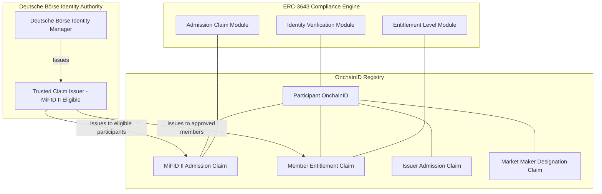

Participant admission is controlled through OnchainID verifiable claims. Every digital securities transfer on the venue requires both parties to hold valid admission claims. Revocation of a claim by Deutsche Börse's identity authority immediately prevents all further on-chain activity for that participant; the compliance engine checks claim validity on every transfer.

### 6.3 Venue State Controls

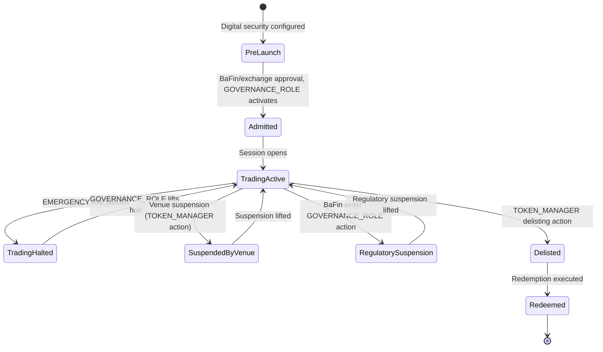

The venue state model maps MiFID II trading venue operational states to DALP's role-based control model. Deutsche Börse's venue operator team holds TOKEN_MANAGER for routine operational state changes. The EMERGENCY role provides immediate halt capability without requiring GOVERNANCE_ROLE authorization. GOVERNANCE_ROLE is used for regulatory-driven state changes and admission rule modifications.

### 6.4 Listing Workflow and Disclosure Capture

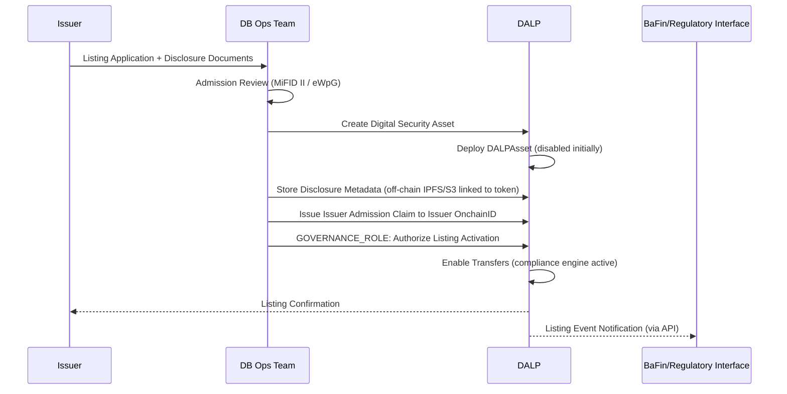

Disclosure documents are stored off-chain (S3-compatible object storage) with content-hash linked to the token address on-chain. This ensures the integrity of disclosure materials while keeping large documents off the ledger.

### 6.5 Market Surveillance Support

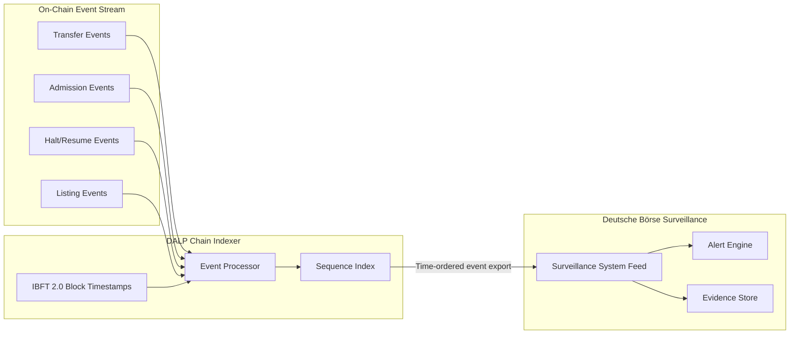

Every on-chain event is timestamped at the IBFT 2.0 block level (consensus-agreed timestamp, not single-node). The Chain Indexer provides time-ordered event export via the REST API and webhooks. Deutsche Börse's surveillance system subscribes to this event feed for pattern detection and regulatory evidence retention.

**Alerting hooks:** DALP's observability stack includes configurable threshold alerts (transaction rate spikes, unusual admission patterns, halt events). Alert routing to Deutsche Börse's surveillance system and SIEM via webhook.

### 6.6 Risk Controls and Kill Switch

DALP's role-based controls provide the following risk management capabilities:

| Control | Mechanism | Authorization |
|---|---|---|
| Venue halt (all trading) | EMERGENCY role pause across venue | Operations team, no GOVERNANCE needed |
| Single security halt | TOKEN_MANAGER pause for specific token | Operations team |
| Participant suspension | Revoke admission claim | Identity Manager |
| Circuit breaker | Pre-configured halt trigger via webhook integration | Automated via D3X integration |
| Position limits | Supply limit compliance module per participant | GOVERNANCE_ROLE configuration |
| Market maker obligation enforcement | Entitlement claim monitoring | Compliance team |

**Throttling:** API rate limiting at 10,000 requests per 60-second window per API key. Configurable per-participant rate limits can be implemented through the admission control layer.

### 6.7 D3X / Xetra Integration Pattern

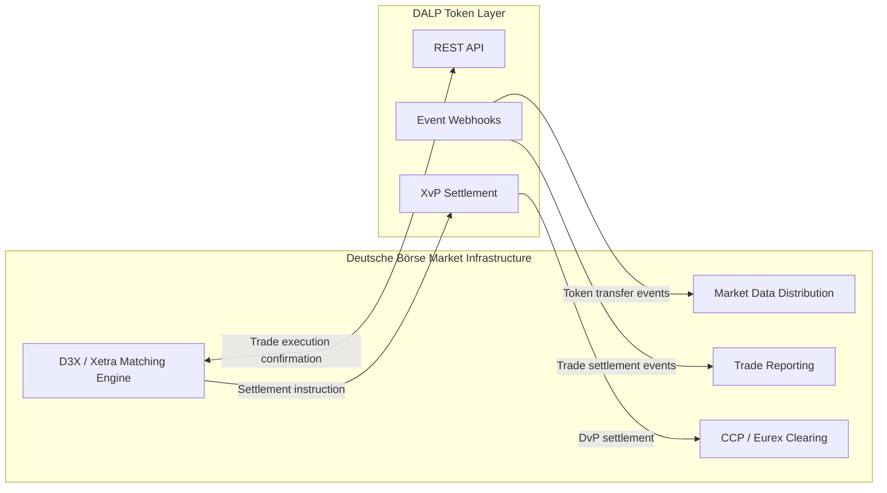

DALP interfaces with D3X as the token execution and settlement layer. After D3X matches a trade, it sends a settlement instruction to DALP's XvP settlement addon, which executes the atomic DvP transfer. Post-settlement events are fed back to D3X's market data distribution and trade reporting systems.

### 6.8 Functional Fit Matrix

| Requirement | DALP Capability | Status | Notes |
|---|---|---|---|
| Participant admission (issuers, members, MMs, operators) | OnchainID + ERC-3643 admission claim modules | Full | |
| Configurable market models, venue state controls | GOVERNANCE/EMERGENCY/TOKEN_MANAGER roles | Partial | Market model (order book) is D3X; DALP provides token/compliance state |
| Surveillance data feeds, alerting, evidence retention | Chain Indexer event export + webhooks + Grafana | Full | Integration-dependent for Deutsche Börse surveillance system |
| Deterministic message handling, event sequencing | IBFT 2.0 consensus timestamps | Full | |
| Throttling, kill-switch, circuit breaker, participant risk | EMERGENCY pause + admission revocation + rate limiting | Full | Circuit breaker integration with D3X required |
| Listing workflow with admission checks and disclosure | Issuance factory + off-chain disclosure metadata | Full | |
| Reference data management, instrument lifecycle | DALPAsset lifecycle | Full | |
| Resilient market data distribution | Chain Indexer webhooks | Partial | D3X market data distribution handles primary distribution |
| Operator dashboards | Grafana pre-built dashboards | Full | |
| Suspension, halt, resume | EMERGENCY + TOKEN_MANAGER roles | Full | |
| IaC, environments, observability, HA | Standard DALP infrastructure | Full | |

---

## 7. Technical Architecture

### 7.1 Architectural Principles

**DALP as regulated token layer.** DALP does not replace Deutsche Börse's existing market infrastructure. It provides the token lifecycle, compliance enforcement, participant admission, and settlement layer within the D3X/Xetra ecosystem.

**Market integrity by contract.** Participant admission, compliance enforcement, and venue state controls are enforced at the smart contract layer. Application-layer bypasses are structurally prevented.

**Deterministic evidence.** IBFT 2.0 consensus provides immediate, consensus-agreed finality for every on-chain event. Events cannot be rewritten post-finality.

### 7.2 Platform Architecture

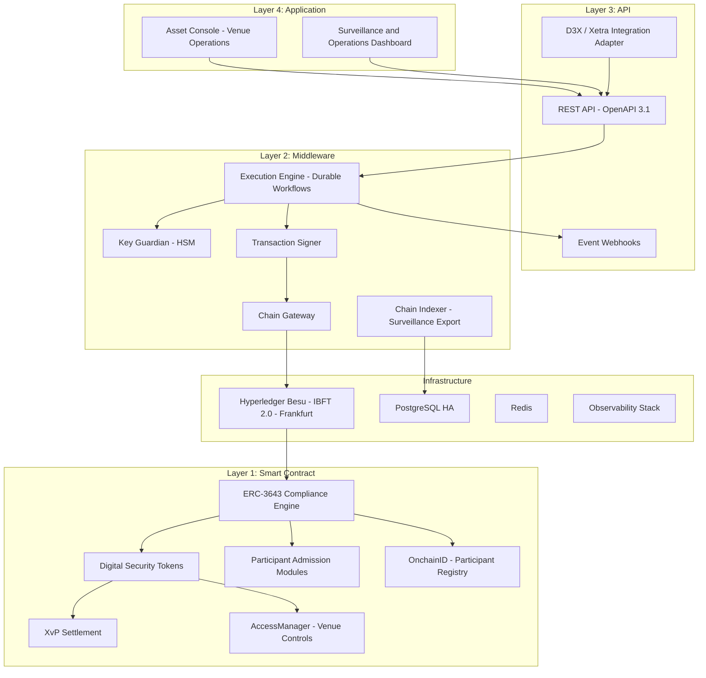

### 7.3 Token Lifecycle State Machine (Digital Security)

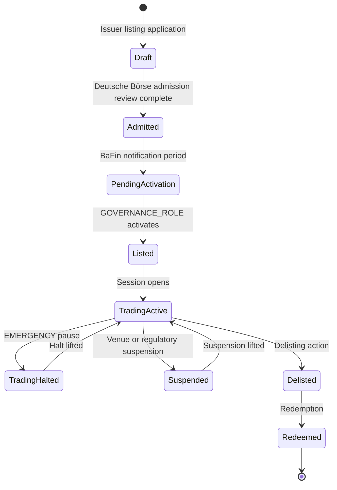

### 7.4 Compliance Enforcement Flow (MiFID II Admission)

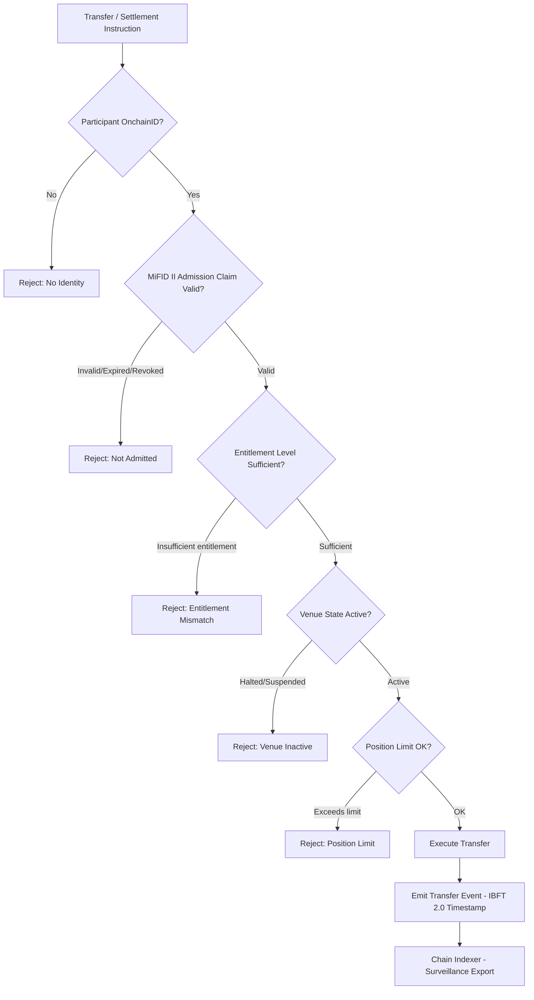

### 7.5 Settlement Flow (D3X Integration)

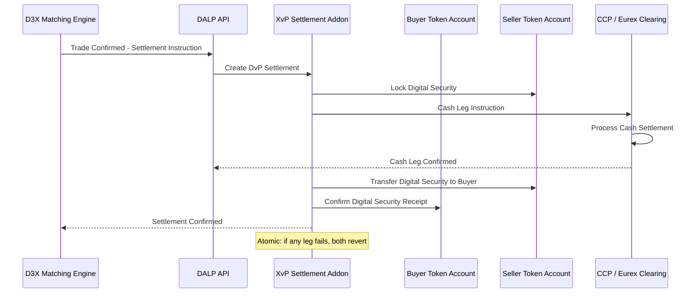

### 7.6 Security Architecture

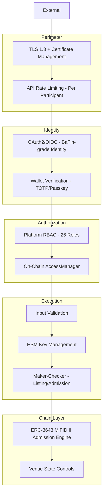

### 7.7 Deployment Topology

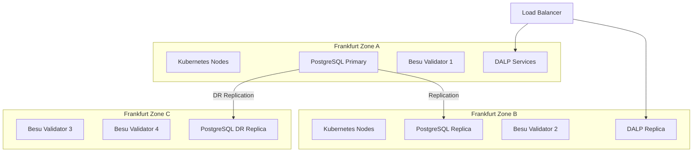

### 7.8 Integration Architecture (D3X Ecosystem)

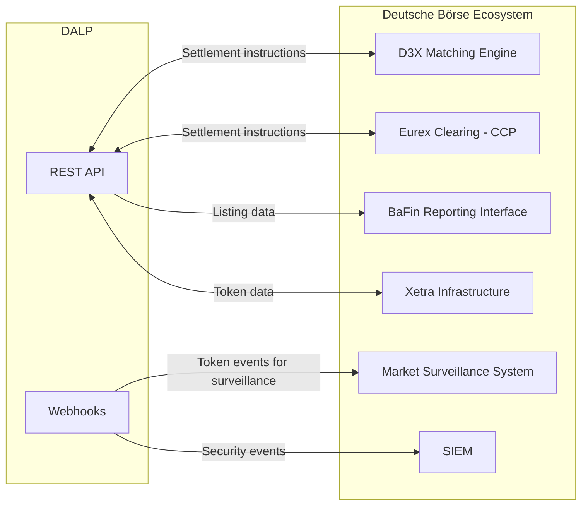

### 7.9 On-Chain vs. Off-Chain Data Flow

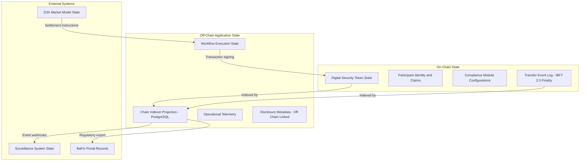

Authoritative state resides on-chain under IBFT 2.0 finality. The Chain Indexer projects on-chain events into a queryable off-chain store for operational monitoring and regulatory reporting. No off-chain component can override on-chain compliance enforcement.

### 7.10 Implementation Timeline

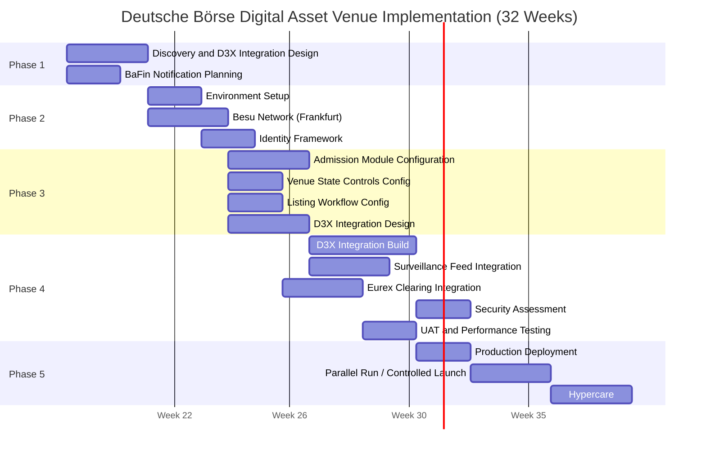

---

## 8. Security

### 8.1 Security Model Overview

Five independent control layers enforce security. For the trading venue context, the on-chain participant admission and venue state controls are the critical layer: they enforce MiFID II obligations at the contract layer, not the application layer.

### 8.2 Authentication and Access

**Venue operators** authenticate via OAuth 2.0/OIDC integration with Deutsche Börse's enterprise identity provider. Blockchain write operations require wallet verification (TOTP or hardware passkey).

**D3X integration** uses organization-scoped API keys with settlement-specific namespace permissions. The D3X adapter cannot execute listing or admission operations; only settlement instructions are permitted.

**BaFin supervisory access:** The AUDITOR role provides read-only access to all on-chain events, participant identity records, compliance states, and historical activity. BaFin can access the audit trail without SettleMint involvement.

### 8.3 Key Management

HSM-backed key management for all operational keys. GOVERNANCE_ROLE keys in offline cold storage with multi-custodian access. Maker-checker for listing activations and admission decisions via DFNS or Fireblocks policy engine.

### 8.4 Data Protection

TLS 1.3 for all traffic. AES-256 at rest. Data residency within Germany (Frankfurt region). GDPR-compliant participant data management. Audit records retained per MiFID II RTS 6 requirements (at minimum 5 years).

### 8.5 DORA Compliance

| DORA Requirement | Response |
|---|---|
| ICT risk management | Documented; vendor risk evidence available |
| ICT incident classification | P1-P4 taxonomy; 4-hour BaFin notification for P1 |
| TLPT testing | Annual penetration testing; results available under NDA |
| Third-party ICT dependencies | Dependency disclosure; SBOM per release |

### 8.6 Security Responsibility Matrix

| Control Area | SettleMint | Deutsche Börse |
|---|---|---|
| Platform security patches | Responsible | Informed |
| HSM operation | | Responsible |
| GOVERNANCE_ROLE keys | | Responsible |
| D3X integration security | | Responsible |
| BaFin audit access | Responsible (AUDITOR role) | Responsible (access policy) |
| Market surveillance integrity | | Responsible |
| Penetration testing (platform) | Responsible | Informed |

---

## 9. Implementation and Delivery

### 9.1 Delivery Overview

32-week phase-gated implementation. The extended timeline accommodates BaFin notification requirements, D3X integration complexity, and Deutsche Börse's institutional change governance processes.

### 9.2 Phase Plan

**Phase 1: Discovery (Weeks 1-3):** D3X integration boundary design, BaFin notification planning, admission module design, architecture documentation.

**Phase 2: Foundation (Weeks 4-7):** Frankfurt private cloud deployment, Besu network setup, identity framework.

**Phase 3: Configuration (Weeks 8-13):** Admission modules, venue state controls, listing workflow, D3X integration design specification.

**Phase 4: Integration and Testing (Weeks 14-24):** D3X integration build, Eurex Clearing settlement integration, surveillance feed integration, comprehensive testing.

**Phase 5: Production (Weeks 25-29):** Production deployment, controlled launch, parallel operation monitoring.

**Phase 6: Hypercare (Weeks 30-32):** Stabilization, knowledge transfer, support transition.

### 9.3 Key Risks

| Risk | Likelihood | Mitigation |
|---|---|---|
| D3X integration API specification incomplete | Medium | API specification workshop in Phase 1 |
| BaFin notification extends Phase 3 timeline | High | BaFin planning in Phase 1; buffer in timeline |
| Eurex Clearing settlement interface complexity | Medium | Early Eurex engagement; mock interface for testing |
| MiCA instrument classification determines which modules needed | Medium | Classification analysis in Phase 1 |

---

## 10. Deployment Options

### 10.1 Recommended: Private Cloud (Frankfurt, Germany)

Frankfurt Azure Germany West Central or AWS eu-central-1 for German data residency. Deutsche Börse manages cloud subscription; SettleMint provides Helm deployment support.

RTO/RPO: Multi-AZ deployment achieves 2-15 minute RTO, seconds RPO for zone failures.

---

## 11. Training

Three tracks: Administrator (3-4 days, venue operations team), Developer/Integration (4-5 days, D3X integration engineers), Operations/Surveillance (2 days, market surveillance and compliance team, covering admission management, venue state operations, surveillance feed validation).

---

## 12. Support and SLA

Enterprise Support recommended (24/7, 15-minute P1 response, dedicated SRE, 99.99% uptime SLA). DORA ICT incident classification applied. BaFin incident notification within 4 hours for P1.

---

## 13. Risk Management

| ID | Risk | Likelihood | Impact | Mitigation |
|---|---|---|---|---|
| R-001 | BaFin approval for digital asset venue extends timeline | High | High | Early BaFin engagement; notification plan in Phase 1 |
| R-002 | D3X API specification change during integration | Medium | High | API versioning agreement; change control |
| R-003 | MiCA instrument classification creates regulatory uncertainty | Medium | Medium | Legal analysis in Phase 1; configurable compliance modules |
| R-004 | Eurex Clearing settlement interface availability | Medium | High | Early Eurex engagement; mock interface development |
| R-005 | Market surveillance system event format requires customization | Medium | Medium | Event taxonomy workshop in Phase 1 |
| R-006 | eWpG compliance requirements for electronic securities | Medium | Medium | eWpG analysis in Phase 1; disclosure metadata design |

---

## 14. Compliance Matrix

### 14.1 Technical Requirements

| ID | Priority | Requirement | Status | Notes |
|---|---|---|---|---|
| TR-001 | P1 | Participant admission and entitlement controls | Full | OnchainID + ERC-3643 admission modules; 4 participant types |
| TR-002 | P1 | Configurable market models, trading sessions, venue state | Partial | DALP provides the regulated token and compliance layer. D3X/Xetra provides the order book and market model. This is an intentional architectural boundary: DALP is designed to operate as the compliance enforcement and token lifecycle layer within the D3X ecosystem. All MiFID II compliance enforcement, participant admission, and settlement finality obligations are fully covered by DALP. |
| TR-003 | P1 | Market surveillance data feeds, alerting, evidence retention | Full | Chain Indexer time-ordered export; webhooks; Grafana alerts |
| TR-004 | P1 | Deterministic message handling, event sequencing, time governance | Full | IBFT 2.0 consensus timestamps; immutable block ordering |
| TR-005 | P1 | Throttling, kill-switch, circuit-breaker, participant risk | Full | EMERGENCY pause; admission revocation; API rate limiting |
| TR-006 | P2 | Listing workflow: admission checks, disclosure, attestations | Full | Issuance factory + off-chain disclosure metadata + claim attestations |
| TR-007 | P2 | Reference data management, instrument lifecycle, venue publication | Full | DALPAsset lifecycle; chain indexer publication |
| TR-008 | P2 | Resilient market data distribution, replay, dissemination | Partial | DALP provides event webhooks; D3X handles market data distribution |
| TR-009 | P2 | Operator dashboards: latency, throughput, participant behavior | Full | Grafana pre-built + customizable dashboards |
| TR-010 | P3 | Suspension, halt, resumption procedures | Full | EMERGENCY + GOVERNANCE + TOKEN_MANAGER roles |
| TR-011 | P3 | Environment segregation | Full | Dev/staging/prod per Helm |
| TR-012 | P3 | IaC, config baselining | Full | GitOps Helm charts |
| TR-013 | P1 | Immutable audit logs | Full | On-chain IBFT 2.0 finality; Loki logs |
| TR-014 | P1 | HA deployment, no SPOF | Full | Multi-AZ Frankfurt; IBFT 2.0 1/4 fault tolerance |
| TR-015 | P1 | Comprehensive observability | Full | VictoriaMetrics, Loki, Tempo, Grafana |
| TR-016 | P1 | Time synchronization, timestamping | Full | NTP; IBFT 2.0 consensus; trace IDs |
| TR-017 | P1 | Backup, restore, DR | Full | Velero; WAL archival; documented RTO/RPO |
| TR-018 | P2 | Secure API access | Full | OAuth2/OIDC; API keys; TLS 1.3 |
| TR-019 | P2 | Controlled release management | Full | GitOps; staging verification; rollback |
| TR-020 | P2 | Runbooks | Full | Phase 5 deliverable |
| TR-021 | P2 | Performance testing | Full | Phase 4 load testing |
| TR-022 | P3 | Config freeze, emergency access | Full | EMERGENCY role; config freeze procedure |
| TR-023 | P3 | IAM, role separation, least privilege, PAM | Full | 26 roles; on-chain AccessManager; wallet verification |
| TR-024 | P3 | Encryption at rest and in transit | Full | TLS 1.3; AES-256; HSM |
| TR-025 | P1 | SIEM integration | Full | JSON/CEF event export; webhooks |
| TR-026 | P1 | Vulnerability management, patch governance, SBOM | Full | CVE monitoring; critical patches 24h; SBOM per release |
| TR-027 | P1 | Secure development lifecycle | Full | Peer review; SAST; change approval |
| TR-028 | P1 | Data classification, retention, deletion | Full | MiFID II 5-year minimum retention; GDPR |
| TR-029 | P1 | Incident notification | Full | 4-hour BaFin notification for P1; DORA ICT classification |
| TR-030 | P2 | Network segmentation, API protection, certificate lifecycle | Full | Kubernetes NetworkPolicies; cert-manager; secrets KMS |
| TR-031 | P2 | DoS/replay/duplicate/operator error resilience | Full | Rate limiting; idempotency; durable execution; maker-checker |
| TR-032 | P2 | Third-party risk management | Full | Subcontractor disclosure; SBOM; dependency register |
| TR-033 | P2 | Penetration testing | Full | Annual third-party; reports under NDA |
| TR-034 | P3 | Cryptographic agility, key rotation | Full | Algorithm configurable; key rotation without disruption |
| TR-035 | P3 | Delivery plan with milestones | Full | 32-week plan; 6 phases; gate criteria |
| TR-036 | P3 | Buyer dependencies documented | Full | RACI; dependency register |
| TR-037 | P1 | Migration approach | Full | Participant onboarding; data migration; cutover runbook |
| TR-038 | P1 | Structured testing | Full | Functional, security, performance, DR, UAT in Phase 4 |
| TR-039 | P1 | Training materials | Full | Three tracks in Phase 6 |
| TR-040 | P1 | Service transition | Full | Phase 6 hypercare deliverables |
| TR-041 | P1 | Governance forums, reporting, escalation | Full | Programme Board; Working Group; issue log |
| TR-042 | P2 | Third-party connectivity assumptions | Full | Assumptions register Phase 1 |
| TR-043 | P2 | Rollback and contingency | Full | Tested in Phase 4 |
| TR-044 | P2 | Parallel running | Full | 3-week parallel run Phase 5 |
| TR-045 | P2 | Hypercare and stabilization | Full | 3-week hypercare Phase 6 |
| TR-046 | P3 | Roadmap governance | Full | Committed vs exploratory clearly distinguished |

**Regulatory Requirements:**

| ID | Status | Notes |
|---|---|---|
| REG-001 | Full | MiFID II/MiFIR, DORA, GDPR, AMLD, MiCA framework mapping |
| REG-002 | Full | DORA critical ICT designation; control model documented |
| REG-003 | Full | German data residency; GDPR categories |
| REG-004 | Full | AUDITOR role; BaFin access via role delegation |
| REG-005 | Full | DORA-aligned; RTO/RPO; DR drills; TLPT support |
| REG-006 | Full | OnchainID AML/CFT claims; sanctions integration-dependent |
| REG-007 | Full | Immutable IBFT 2.0 finality; audit trail |
| REG-008 | Full | GitOps change governance; BaFin notification plan |
| REG-009 | Full | MiFID II market integrity; admission enforcement; surveillance export |
| REG-010 | Full | Admission and disclosure governance; listing workflow; eWpG considerations |
| REG-011 | Full | eWpG compatibility: issuer attestations, disclosure metadata, electronic securities registration model |

---

*Document Classification: SettleMint Confidential*
*Version 1.0 Draft, March 2026*
*For Deutsche Börse evaluation purposes only*
