# Technical Proposal: Tokenized Derivatives Clearing

**Prepared for:** Eurex Clearing AG
**Document Title:** Technical Proposal: Tokenized Derivatives Clearing
**RFP Reference:** EUREX-RFP-202603
**Submission Date:** March 2026
**Version:** 1.0 Draft
**Classification:** SettleMint Confidential

---

## Table of Contents

1. Executive Summary
2. About SettleMint
3. About DALP
4. Customer References
5. Understanding of Requirements
6. Proposed Solution and Functional Capabilities
7. Technical Architecture
8. Security
9. Implementation and Delivery
10. Deployment Options
11. Training and Knowledge Transfer
12. Support and SLA
13. Risk Management
14. Compliance Matrix

---

## 1. Executive Summary

### 1.1 Context and Strategic Drivers

Eurex Clearing is one of the world's leading central counterparties (CCPs), clearing derivatives across listed and OTC markets under EMIR authorisation. The challenge in tokenizing derivatives clearing is not operational efficiency for its own sake; Eurex's existing clearing infrastructure already processes millions of contracts daily with sophisticated risk management. The challenge is extending that infrastructure to cover digitally-native derivatives instruments while preserving the clearing guarantee, the margin enforcement discipline, and the default management capability that make CCP clearing systemically valuable.

EMIR requires that CCPs maintain segregation between clearing member own assets and client assets, calculate and call margins within defined timeframes, maintain default funds, and execute default management procedures in an orderly manner when a clearing member fails. These obligations do not change when the underlying instrument is tokenized. A tokenized derivatives clearing solution that cannot enforce margin calls on-chain, that cannot freeze a defaulting clearing member's positions instantly, or that creates a parallel position record inconsistent with Eurex's books is not a clearing solution; it is an integration liability.

The regulatory environment reinforces this assessment. DORA's ICT resilience requirements apply with full force to Eurex as a systemically important financial market infrastructure. NIS2 creates cyber resilience obligations for critical infrastructure operators. EMIR RTS requirements for CCP technical standards specify the performance, availability, and resilience expectations that Eurex's technology infrastructure must meet. Any proposed tokenized clearing solution must operate within these constraints.

Eurex's procurement document identifies the core requirements precisely: clearing-member onboarding with account segregation, novation-state handling, initial and variation margin with deterministic controls, default management workflow, and collateral eligibility for margin assets. These are CCP-grade functional requirements, not exchange venue requirements.

### 1.2 Why This Programme Is Hard

CCP clearing requires a specific combination of capabilities that do not naturally emerge from standard token issuance platforms.

**Novation state complexity.** When Eurex clears a trade, it inserts itself as the central counterparty through novation. The cleared trade creates two positions: Eurex faces the buyer and Eurex faces the seller. The tokenized representation of a cleared derivative must accurately reflect novation state, maintain position accounts at the clearing member level, and support give-up/take-up and correction workflows without creating position inconsistencies.

**Margin enforcement with determinism.** EMIR requires margin calls to be made and settled within defined timeframes. Initial margin models are complex (PRISMA at Eurex). Variation margin reflects daily profit and loss. Intraday margin calls may be required under stress. The tokenized margin asset management system must enforce these obligations deterministically: a clearing member that fails to meet a margin call must have its position actions constrained until the deficit is resolved.

**Default management under time pressure.** When a clearing member defaults, Eurex must take control of the defaulted member's positions and manage them to minimize loss to the default fund and surviving members. This requires emergency access to position data, the ability to freeze the defaulted member's on-chain accounts immediately, and access to auction preparation data, all under extreme time pressure.

### 1.3 Proposed Response

SettleMint proposes DALP as the tokenized derivatives clearing infrastructure layer for Eurex. DALP provides the digital token layer for cleared derivatives positions and margin assets, with on-chain enforcement of eligibility rules, margin constraints, and default management controls.

**Clearing-member account model.** DALP's multi-account structure supports EMIR-required segregation between house accounts and client accounts. OnchainID per account enforces segregation at the smart contract layer.

**Margin enforcement.** DALP's compliance modules enforce margin collateral eligibility (asset type, concentration limits, haircut rules) at the smart contract layer. Margin calls trigger position constraint modules: a clearing member that has not posted sufficient eligible margin has its trading rights restricted until the deficit is cleared.

**Default management.** DALP's CUSTODIAN role enables Eurex's default management team to freeze clearing member accounts, transfer positions to a designated bridge account, and access position data for auction preparation, all through governed on-chain operations with full audit trail.

**Novation state.** DALPAsset Configurable supports novation-state attributes. A cleared derivative trade creates position records reflecting Eurex's central counterparty position structure.

**Deployment:** Private cloud within Eurex's Frankfurt infrastructure. Integration with Eurex's existing risk systems (PRISMA), margin engine, and regulatory reporting.

### 1.4 Why SettleMint

SettleMint's production deployments at market infrastructure operators and the DALP compliance architecture directly address Eurex's CCP-grade requirements. The company's experience with regulated post-trade infrastructure, EMIR/DORA compliance design, and institutional custody integration informs the delivery approach.

### 1.5 Why DALP

DALP's ERC-3643 compliance engine enforces margin eligibility at the contract layer. The CUSTODIAN role provides the default management emergency access Eurex needs. Durable workflow orchestration ensures margin call and settlement workflows are deterministic. The on-chain AccessManager provides account-level segregation enforcement.

### 1.6 Reference Fit Snapshot

- **Clearstream (Tokenized Collateral):** On-chain eligibility enforcement and atomic settlement at post-trade infrastructure scale.
- **Bank of England (CBDC Pilot):** FMI-grade compliance enforcement and default/emergency control model.
- **Euroclear (Settlement Infrastructure):** Post-trade settlement finality architecture at ICSD scale.

---

## 2. About SettleMint

### 2.1 Company Overview

SettleMint NV delivers DALP to regulated financial market infrastructures, central banks, and institutional operators. ISO 27001 and SOC 2 Type II certified. Production deployments at CCPs, ICSDs, exchange groups, and central banks.

### 2.2 Regulatory Readiness

| Framework | DALP Alignment |
|---|---|
| EMIR | CCP technical standards, margin requirements, default management, account segregation |
| DORA | ICT resilience, incident classification, third-party risk |
| CSDR (interfaces) | Settlement finality, delivery obligations |
| GDPR | Data classification, retention, residency |
| AMLD | AML/CFT claim verification |
| NIS2 | Cyber resilience for critical infrastructure |

---

## 3. About DALP

### 3.1 Core CCP Capabilities

**Account segregation.** DALP's multi-account model supports house and client account segregation. Each account has a distinct OnchainID. Segregation is enforced at the smart contract layer through separate token balances and access controls per account.

**Clearing lifecycle support.** DALPAsset Configurable supports novation-state handling through configurable lifecycle attributes. Position records reflect CCP-mediated trade structure.

**Margin collateral enforcement.** ERC-3643 compliance modules enforce margin asset eligibility: asset type, issuer eligibility, maturity, concentration limits, haircut requirements. Modules are configurable to PRISMA eligibility schedules.

**Default management.** CUSTODIAN role provides emergency access to clear member positions: account freeze, forced position transfer, position reporting for auction. All custodian actions are on-chain with mandatory event emission.

**Settlement.** XvP addon for atomic DvP settlement across margin and position legs.

---

## 4. Customer References

| Client | Use Case | Relevance |
|---|---|---|
| Clearstream | Tokenized collateral management | Eligibility engine; concentration limits; XvP settlement |
| Bank of England | CBDC pilot (FMI) | Emergency controls; governance authority model; DORA resilience |
| Euroclear | Digital securities settlement | Settlement finality; CSDR alignment; post-trade architecture |
| JSE | Digital asset trading and settlement | CCP settlement integration; market controls |

### 4.1 Reference: Clearstream, Tokenized Collateral

Clearstream's programme required on-chain eligibility enforcement and atomic settlement for collateral management. DALP's ERC-3643 compliance modules enforced eligibility rules. The XvP addon provided atomic settlement. The same capabilities (eligibility enforcement and atomic settlement) are the foundation of Eurex's margin collateral management requirements.

### 4.2 Reference: Bank of England, FMI Controls

The Bank of England programme required emergency controls (EMERGENCY role for halt), governance authority separation (GOVERNANCE_ROLE at BoE level), and DORA-aligned operational resilience. Eurex's default management requirements map to the same control architecture: CUSTODIAN role for emergency account access, GOVERNANCE_ROLE for default management authorization, DORA resilience design.

---

## 5. Understanding of Requirements

### 5.1 Client Context

Eurex Clearing is a systemically important FMI under EMIR authorisation. Its clearing guarantee is the foundation of the derivatives market's risk management. Tokenized derivatives clearing must preserve that guarantee while extending it to digitally-native instruments.

### 5.2 Requirement Domains

| Domain | Requirements | DALP Capability |
|---|---|---|
| Account structure | Clearing member accounts, house/client segregation | Multi-account OnchainID; segregation at contract layer |
| Trade capture | Novation-state handling, position management | DALPAsset Configurable lifecycle attributes |
| Margin management | Initial margin, variation margin, intraday margin | Compliance modules + margin calculation integration |
| Default management | Workflow, auction data, emergency access | CUSTODIAN role; default management procedures |
| Collateral | Linkage, eligibility, concentration, haircut | ERC-3643 eligibility modules |
| Stress testing | Scenario hooks, model-output traceability | Integration with PRISMA risk engine |
| Position transfer | Give-up/take-up, correction | DALPAsset custodian operations |
| Reconciliation | EOD valuation, member statements | Chain Indexer + REST API export |
| Netting | Legal-entity and account netting | Position netting calculation via integration |
| Risk engine integration | PRISMA, treasury, regulatory reporting | REST API + webhooks |

### 5.3 Key Challenges

**Challenge 1: Novation state tokenization.** A cleared derivative is not simply a token; it is a bilateral obligation intermediated by the CCP. The tokenized representation must accurately reflect the novation structure: Eurex faces each clearing member. DALP's Configurable asset type supports this through lifecycle attribute configuration, but the novation logic requires careful Phase 1 design.

**Challenge 2: Margin enforcement timing.** EMIR requires margin to be collected within defined intraday windows. On-chain margin enforcement must coordinate with Eurex's PRISMA margin calculation engine (off-chain). The integration boundary, where PRISMA calculates the margin call and DALP enforces the margin asset movement, must be precisely designed and tested under time-pressure scenarios.

**Challenge 3: Default management execution speed.** When a clearing member defaults, every minute matters. Eurex's default management team must be able to freeze the defaulted member's on-chain accounts and access position data within minutes. DALP's CUSTODIAN role supports this, but the operational procedure must be pre-defined, pre-tested, and executable under stress conditions.

### 5.4 Response Principles

**CCP clearing guarantee first.** Every design decision prioritizes the integrity of Eurex's clearing guarantee. No tokenized clearing design may create a scenario where the CCP's position is uncertain.

**PRISMA integration is mandatory.** DALP provides the token and enforcement layer; PRISMA remains the margin calculation authority. The integration boundary must be precisely defined.

**Default management must be pre-tested.** Default management procedures must be exercised in test scenarios before production launch. The audit trail for every default management action must be complete.

---

## 6. Proposed Solution and Functional Capabilities

### 6.1 Solution Overview

DALP provides the tokenized position and margin management layer for Eurex's cleared derivatives. Eurex's existing clearing infrastructure (PRISMA, C7 trading system, settlement systems) continues to operate. DALP provides the digital token representation of positions and margin assets, with on-chain enforcement of eligibility and segregation requirements.

**Actors:**
- Eurex Clearing (CCP operator: GOVERNANCE_ROLE for risk parameters, TOKEN_MANAGER for operational management)
- Clearing members (OnchainID per account: house and client segregation)
- Eurex default management team (CUSTODIAN role for emergency operations)
- Risk management team (compliance configuration and monitoring)
- ESMA/BaFin supervisory access (AUDITOR role)

### 6.2 Clearing Member Account and Segregation Model

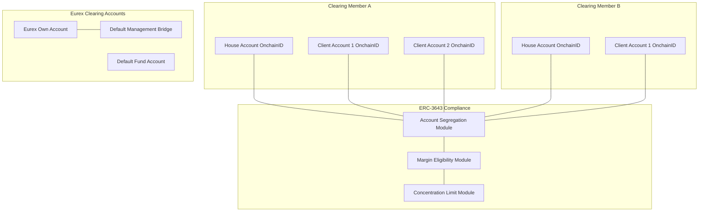

Account segregation is enforced at the smart contract layer through separate OnchainID assignments per account type. Cross-account transfers require explicit GOVERNANCE_ROLE or CUSTODIAN authorization; the compliance modules block unauthorized cross-account movements.

### 6.3 Derivatives Clearing Lifecycle

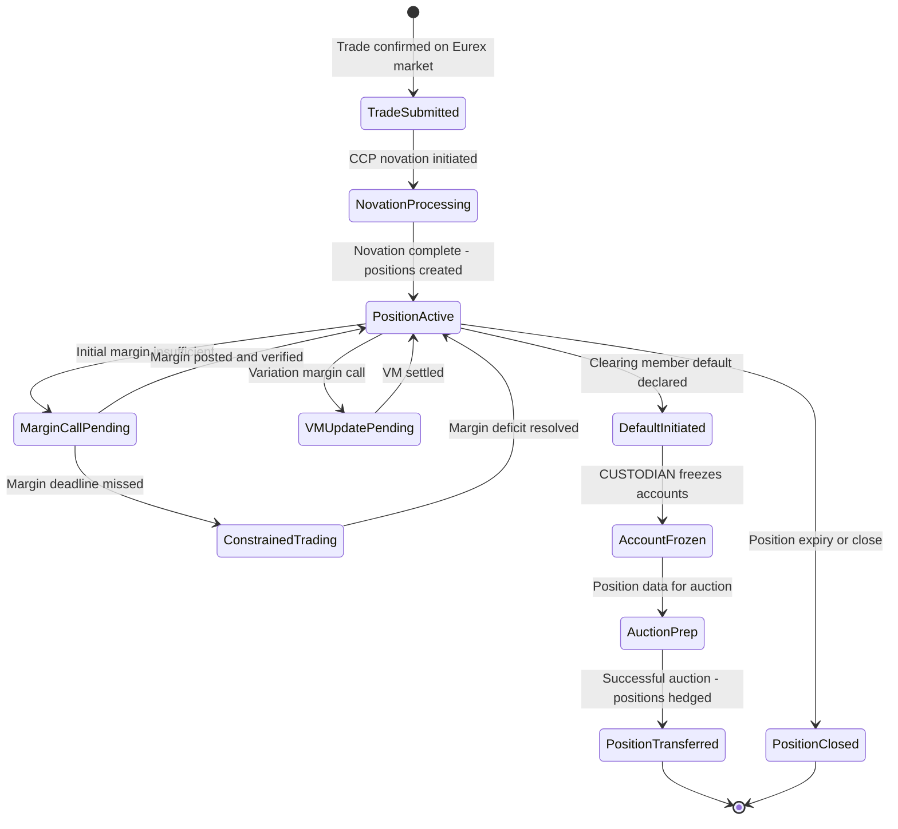

### 6.4 Margin Enforcement Architecture

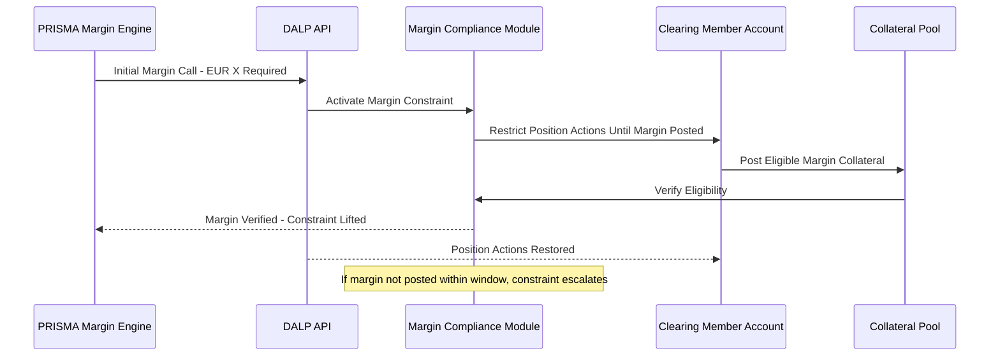

**PRISMA integration boundary:** PRISMA calculates margin requirements. DALP enforces margin collateral eligibility at the smart contract layer. The two systems communicate via DALP's REST API: PRISMA posts margin call instructions, DALP verifies on-chain that eligible collateral has been received, and PRISMA receives confirmation. The margin calculation model remains entirely within PRISMA; DALP enforces the collateral eligibility rules.

### 6.5 Default Management Workflow

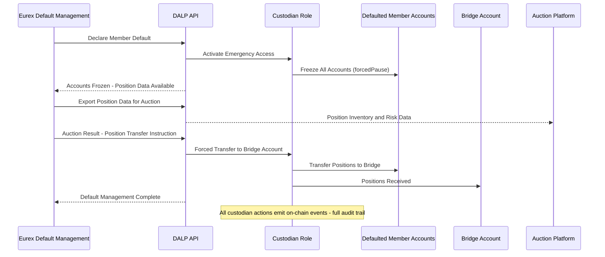

### 6.6 Stress Testing Hooks

DALP provides scenario testing capability through the REST API. Eurex's risk team can simulate margin call scenarios, default triggers, and market stress events in the staging environment. Position data and margin collateral values can be manipulated in staging for stress testing. PRISMA scenario outputs can be fed to DALP's API to test the margin enforcement response under simulated stress conditions.

### 6.7 Functional Fit Matrix

| Requirement | DALP Capability | Status | Notes |
|---|---|---|---|
| Clearing member onboarding, account structures, segregation | Multi-account OnchainID; ERC-3643 segregation module | Full | |
| Trade capture, novation-state, position management | DALPAsset Configurable lifecycle attributes | Full | Novation logic design in Phase 1 |
| Initial margin, variation margin, intraday margin | Margin eligibility modules + PRISMA integration | Full | PRISMA is margin calculation authority; DALP enforces eligibility |
| Default management workflow, auction data, emergency access | CUSTODIAN role; position freeze; position export | Full | |
| Collateral linkage, concentration, eligibility for margin | ERC-3643 compliance modules (all margin asset types) | Full | |
| Stress testing hooks, scenario inputs, model traceability | REST API scenario injection; staging environment | Full | |
| Position transfer, give-up/take-up, corrections | CUSTODIAN forced transfer; TOKEN_MANAGER operations | Full | |
| EOD valuation, reconciliation, member statements | Chain Indexer + REST API export | Full | Integration-dependent for PRISMA reconciliation |
| Netting assumptions, account-level netting | Position netting via REST API; on-chain position records | Partial | Netting calculation is PRISMA/risk engine; DALP records netted positions |
| Risk engine integration | REST API + webhooks | Full | PRISMA integration design in Phase 1 |

---

## 7. Technical Architecture

### 7.1 Architectural Principles

**CCP clearing guarantee is inviolable.** Every architectural decision preserves Eurex's ability to enforce margin, manage defaults, and maintain segregation.

**PRISMA is the margin calculation authority.** DALP enforces what PRISMA calculates. The integration boundary is precise and tested under stress scenarios.

**Default management is pre-defined and pre-tested.** The CUSTODIAN role procedures are documented, trained, and tested before production launch.

### 7.2 Layered Architecture

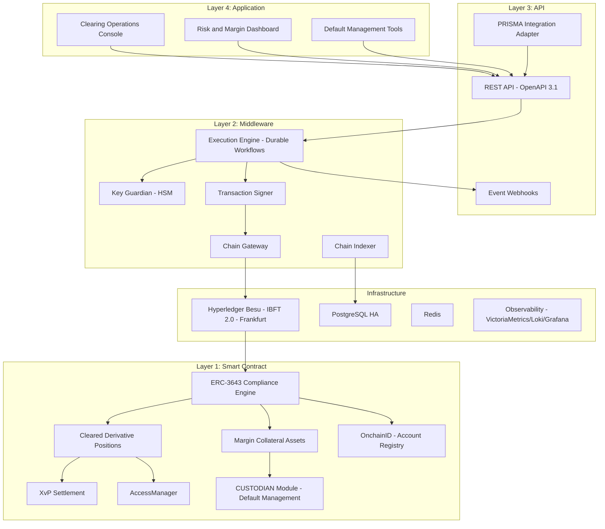

### 7.3 Token Lifecycle (Cleared Derivative)

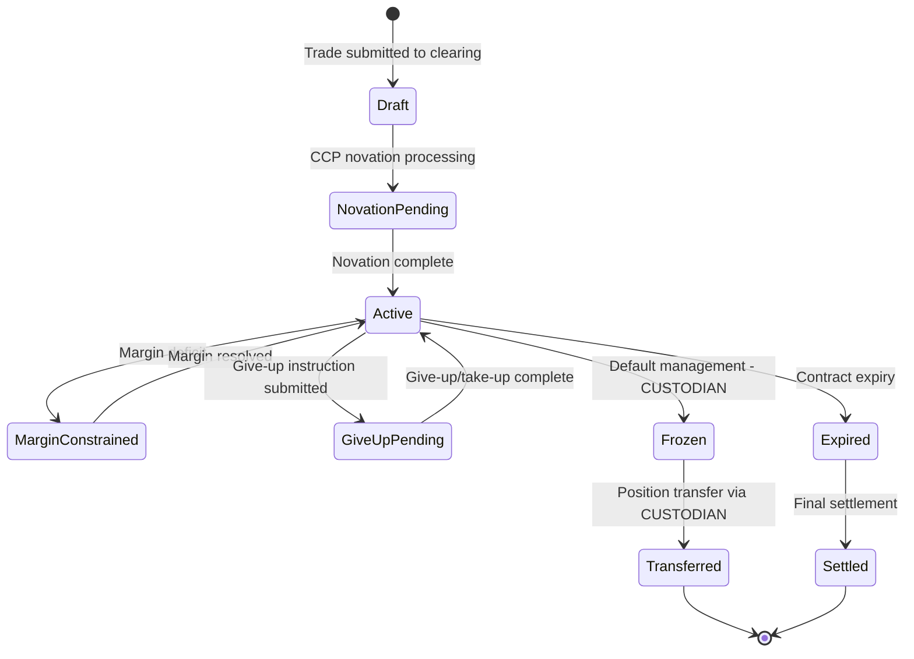

### 7.4 Compliance Enforcement Flow (Margin Eligibility)

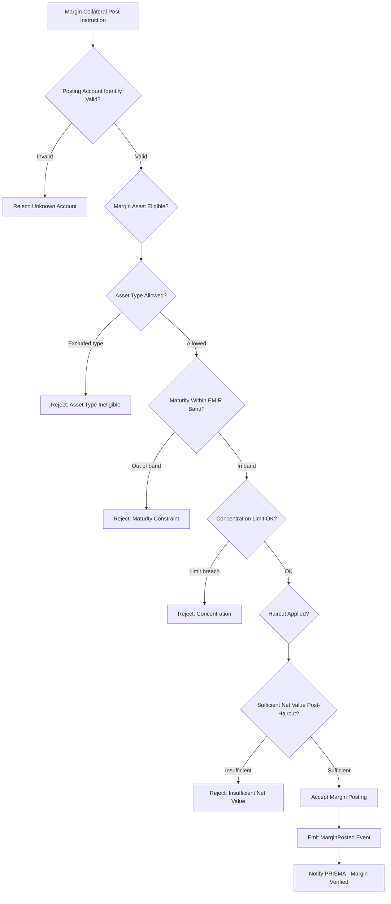

### 7.5 Security Architecture

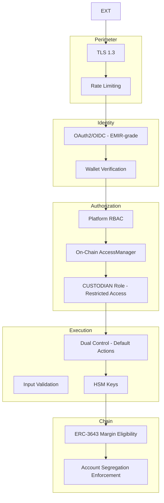

### 7.6 Deployment Topology (Frankfurt HA)

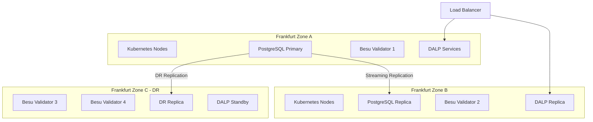

### 7.7 Integration Architecture (PRISMA and Clearing Ecosystem)

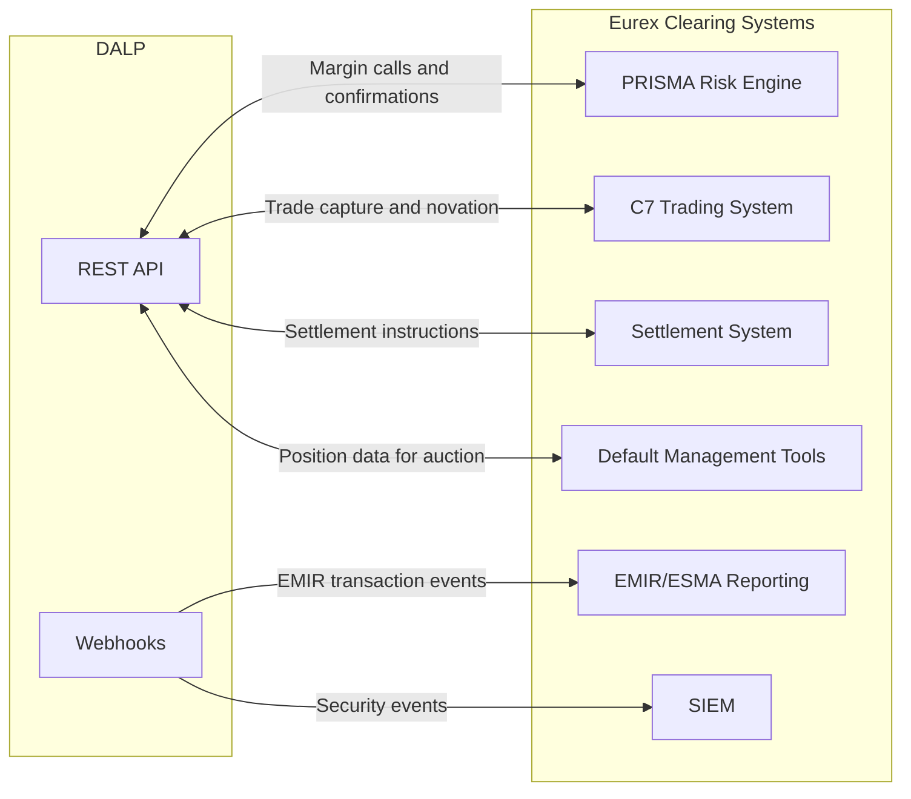

### 7.8 Data Architecture

On-chain state (authoritative): position records, account balances, margin collateral holdings, compliance module configurations.

Off-chain application state: workflow execution state (durable workflow engine/PostgreSQL), PRISMA calculation results cached for performance, operational telemetry.

Audit evidence: On-chain IBFT 2.0 finality provides immutable event log. Off-chain structured logs (Loki) provide operational evidence. Combined evidence supports ESMA supervisory access and EMIR record-keeping requirements.

### 7.9 Implementation Timeline

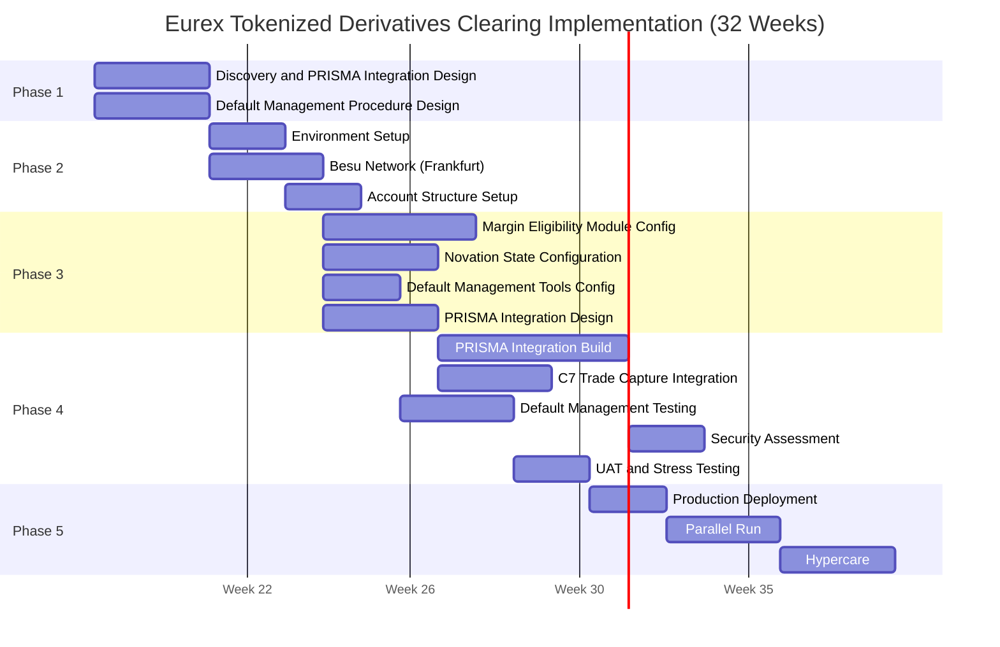

---

## 8. Security

### 8.1 Security Model

Five independent control layers. The CUSTODIAN role for default management is specifically restricted to named Eurex default management officials, requires two-person authorization, and generates on-chain evidence for every action. No single individual can execute a default management action unilaterally.

### 8.2 Access Controls for Default Management

CUSTODIAN role access for default management:
- Assignment: Limited to named Eurex default management team members
- Authorization: Dual control required (two team members must authorize via DFNS/Fireblocks policy)
- Scope: Account freeze, forced position transfer, position data export only
- Audit: Every CUSTODIAN action emits an on-chain event and generates a structured log entry

### 8.3 EMIR and DORA Compliance

| Requirement | Response |
|---|---|
| Account segregation | Smart contract layer enforcement; no single-actor bypass |
| Margin call records | On-chain event log; PRISMA integration audit trail |
| Default management evidence | CUSTODIAN action events; position state at default time captured |
| DORA ICT incident classification | P1-P4 taxonomy; ESMA notification for systemic incidents |
| TLPT testing | Annual penetration testing; evidence available under NDA |
| Third-party ICT (PRISMA) | Integration SLA; dependency disclosure |

### 8.4 Security Responsibility Matrix

| Control Area | SettleMint | Eurex |
|---|---|---|
| Platform security patches | Responsible | Informed |
| PRISMA integration security | | Responsible |
| CUSTODIAN key custody | | Responsible |
| Default management authorization procedure | | Responsible |
| ESMA audit access | Responsible (AUDITOR role) | Responsible (access policy) |
| DORA TLPT coordination | | Responsible | Integration: SettleMint |

---

## 9. Implementation and Delivery

### 9.1 Delivery Overview

32-week phase-gated delivery. Extended timeline accommodates PRISMA integration complexity, default management procedure design and testing, and BaFin/ESMA notification requirements.

### 9.2 Phase Plan

**Phase 1 (Weeks 1-3):** PRISMA integration boundary design, default management procedure design, account structure specification, BaFin notification planning.

**Phase 2 (Weeks 4-7):** Frankfurt private cloud deployment, Besu network, HSM integration, clearing member account structure.

**Phase 3 (Weeks 8-14):** Margin eligibility modules, novation state configuration, default management tools, PRISMA integration specification.

**Phase 4 (Weeks 15-26):** PRISMA integration build, C7 trade capture integration, default management procedure testing (tabletop and technical), security assessment, UAT, stress scenario testing.

**Phase 5 (Weeks 27-29):** Production deployment, parallel run.

**Phase 6 (Weeks 30-32):** Hypercare, knowledge transfer, support transition.

### 9.3 Default Management Test Programme

Default management procedures are exercised in three stages:
1. **Tabletop exercise (Phase 3):** Procedure review with Eurex default management team; documentation validation.
2. **Technical test (Phase 4):** CUSTODIAN role operations tested in staging environment using simulated default scenarios; timing measured against EMIR requirements.
3. **Dress rehearsal (Phase 4/5):** Full end-to-end default management simulation including PRISMA notification, account freeze, position export, and bridge transfer under time pressure.

### 9.4 Key Risks

| Risk | Likelihood | Mitigation |
|---|---|---|
| PRISMA API specification incomplete | Medium | Phase 1 workshop; mock interface for testing |
| Novation state model requires additional attributes | Medium | Phase 1 deep-dive; DALPAsset Configurable flexibility |
| Default management procedure approval takes longer than expected | High | Early governance approval initiation; buffer |
| EMIR technical standard changes during implementation | Low | Configurable compliance modules absorb changes |
| C7 integration interface complexity | Medium | Phase 1 C7 API review; change control |

---

## 10. Deployment Options

**Recommended: Private Cloud (Frankfurt, Germany)**

Eurex manages DALP on Frankfurt-region cloud subscription (AWS eu-central-1 or Azure Germany West Central). Full German data residency. BaFin/ESMA supervisory access.

RTO (zone failure): 2-15 minutes. RPO: seconds.
RTO (region failure): 30-60 minutes. RPO: 1-5 minutes.

DR drills quarterly per DORA and EMIR requirements.

---

## 11. Training and Knowledge Transfer

**Three tracks:**

**Administrator (3-4 days):** Platform architecture, clearing member account management, margin module administration, default management tool operations, observability and monitoring.

**Developer/Integration (4-5 days):** PRISMA integration API patterns, C7 trade capture interface, DALP API deep-dive, testing strategy for clearing scenarios.

**Clearing Operations (2 days):** Margin call monitoring, account status dashboards, escalation procedures, CUSTODIAN role operations (default management focus), ESMA/BaFin audit access procedures.

Default management team receives dedicated training on CUSTODIAN role procedures, dual-control authorization, and the default management timeline from account freeze through position transfer.

---

## 12. Support and SLA

**Recommended: Enterprise Support (24/7)**

Given Eurex's EMIR authorisation and systemic importance, 24/7 support with 15-minute P1 response and 99.99% uptime SLA is required.

| Level | Response | Resolution |
|---|---|---|
| P1 (platform down / default management unavailable) | 15 minutes | 2 hours |
| P2 (major function impaired) | 1 hour | 4 hours |
| P3 | 4 hours | 2 business days |
| P4 | 1 business day | Next cycle |

DORA ICT incident classification applied. ESMA/BaFin notification procedures integrated into incident management.

---

## 13. Risk Management

| ID | Risk | Likelihood | Impact | Mitigation |
|---|---|---|---|---|
| R-001 | PRISMA integration requires real-time margin data | High | High | Phase 1 integration design; performance testing in Phase 4 |
| R-002 | Novation state attributes require iteration | Medium | High | DALPAsset Configurable; Phase 3 configuration reviews |
| R-003 | Default management authorization procedure approval delayed | High | Medium | Early governance engagement; procedure design in Phase 1 |
| R-004 | EMIR technical standard changes during implementation | Low | Medium | Configurable modules absorb changes; change control |
| R-005 | Stress test reveals margin enforcement latency issue | Medium | High | Performance profiling in Phase 4; PRISMA message optimization |
| R-006 | Clearing member onboarding volume exceeds Phase 2 capacity | Medium | Medium | Batch onboarding tooling; phased participant onboarding |

---

## 14. Compliance Matrix

### 14.1 Technical Requirements

| ID | Priority | Requirement | Status | Notes |
|---|---|---|---|---|
| TR-001 | P1 | Clearing-member onboarding, account structures, segregation | Full | Multi-account OnchainID; ERC-3643 segregation module; house/client separation |
| TR-002 | P1 | Trade capture, novation-state, position management | Full | DALPAsset Configurable; novation attributes configured in Phase 3 |
| TR-003 | P1 | Initial margin, variation margin, intraday margin with deterministic controls | Full | Margin eligibility modules enforce collateral; PRISMA calculates requirements |
| TR-004 | P1 | Default management workflow, auction data, emergency access | Full | CUSTODIAN role; dual-control authorization; position export API |
| TR-005 | P1 | Collateral linkage, concentration, eligibility for margin | Full | ERC-3643 modules: asset type, maturity, concentration, haircut |
| TR-006 | P2 | Stress testing hooks, scenario input, model traceability | Full | REST API scenario injection; PRISMA scenario integration |
| TR-007 | P2 | Position transfer, give-up/take-up, corrections | Full | CUSTODIAN forced transfer; TOKEN_MANAGER operations |
| TR-008 | P2 | EOD valuation, reconciliation, member statements | Full | Chain Indexer + REST API export; PRISMA reconciliation integration |
| TR-009 | P2 | Legal-entity and account-level netting | Partial | DALP records netted positions; netting calculation in PRISMA |
| TR-010 | P3 | Risk engine integration | Full | REST API + webhooks for PRISMA; ESMA reporting integration |
| TR-011 | P3 | Environment segregation | Full | Dev/staging/prod per Helm |
| TR-012 | P3 | IaC, config baselining | Full | GitOps Helm charts |
| TR-013 | P1 | Immutable audit logs | Full | On-chain IBFT 2.0 finality; Loki |
| TR-014 | P1 | HA, no SPOF | Full | Multi-AZ Frankfurt; IBFT 2.0 |
| TR-015 | P1 | Comprehensive observability | Full | VictoriaMetrics, Loki, Tempo, Grafana |
| TR-016 | P1 | Time synchronization, evidence timestamping | Full | NTP; IBFT 2.0 consensus; trace IDs |
| TR-017 | P1 | Backup, restore, DR | Full | Velero; WAL archival; RTO/RPO documented; DR drills quarterly |
| TR-018 | P2 | Secure API access | Full | OAuth2/OIDC; API keys; TLS 1.3 |
| TR-019 | P2 | Controlled release management | Full | GitOps; staging; rollback |
| TR-020 | P2 | Runbooks | Full | Phase 5 deliverable including default management runbook |
| TR-021 | P2 | Performance testing | Full | Stress scenario testing in Phase 4 |
| TR-022 | P3 | Config freeze, emergency, degradation | Full | EMERGENCY role; config freeze; degradation procedures |
| TR-023 | P3 | IAM, role separation, PAM | Full | 26 roles; on-chain AccessManager; wallet verification; CUSTODIAN restricted |
| TR-024 | P3 | Encryption | Full | TLS 1.3; AES-256; HSM |
| TR-025 | P1 | SIEM integration | Full | Structured event export; webhooks |
| TR-026 | P1 | Vulnerability management, SBOM | Full | CVE monitoring; 24h critical patches; SBOM |
| TR-027 | P1 | Secure development lifecycle | Full | Peer review; SAST; SOC 2 Type II |
| TR-028 | P1 | Data classification, retention | Full | EMIR 5-year retention; GDPR |
| TR-029 | P1 | Incident notification | Full | 4-hour ESMA notification for P1; DORA ICT taxonomy |
| TR-030 | P2 | Network segmentation | Full | Kubernetes NetworkPolicies; cert-manager |
| TR-031 | P2 | DoS/replay/duplicate resilience | Full | Rate limiting; idempotency; durable execution |
| TR-032 | P2 | Third-party risk management | Full | PRISMA dependency disclosure; SBOM |
| TR-033 | P2 | Penetration testing | Full | Annual third-party; TLPT-compatible |
| TR-034 | P3 | Cryptographic agility | Full | Algorithm configurable; key rotation |
| TR-035 | P3 | Delivery plan | Full | 32-week plan; 6 phases |
| TR-036 | P3 | Buyer dependencies | Full | RACI; dependency register |
| TR-037 | P1 | Migration approach | Full | Clearing member onboarding plan; cutover runbook |
| TR-038 | P1 | Structured testing | Full | Functional, security, performance, stress, DR, UAT in Phase 4 |
| TR-039 | P1 | Training | Full | Three tracks including default management procedures |
| TR-040 | P1 | Service transition | Full | Phase 6 hypercare deliverables |
| TR-041 | P1 | Governance forums | Full | Programme Board; Working Group |
| TR-042 | P2 | Assumptions register | Full | Phase 1 deliverable |
| TR-043 | P2 | Rollback | Full | Tested in Phase 4 |
| TR-044 | P2 | Parallel running | Full | Phase 5 parallel run |
| TR-045 | P2 | Hypercare | Full | Phase 6 hypercare |
| TR-046 | P3 | Roadmap governance | Full | Committed vs exploratory |

**Regulatory Requirements:**

| ID | Status | Notes |
|---|---|---|
| REG-001 | Full | EMIR, DORA, CSDR interfaces, GDPR, AMLD, NIS2 framework mapping |
| REG-002 | Full | DORA critical ICT; EMIR systemically important; control model documented |
| REG-003 | Full | German data residency; GDPR; EMIR 5-year retention |
| REG-004 | Full | AUDITOR role; ESMA/BaFin access via role delegation |
| REG-005 | Full | DORA + EMIR aligned; RTO/RPO; DR drills; TLPT support |
| REG-006 | Full | OnchainID AML/CFT; sanctions integration-dependent |
| REG-007 | Full | Immutable IBFT 2.0 finality; CUSTODIAN audit trail |
| REG-008 | Full | GitOps change governance; BaFin/ESMA notification procedures |
| REG-009 | Full | Settlement finality via XvP; reconciliation dashboard |
| REG-010 | Full | Margin eligibility modules; concentration limits; default management workflow |

---

*Document Classification: SettleMint Confidential*
*Version 1.0 Draft, March 2026*
*For Eurex evaluation purposes only*
