# Technical Proposal: Digital Securities Settlement Infrastructure

**Prepared for:** Euroclear SA/NV
**Document Title:** Technical Proposal: Digital Securities Settlement Infrastructure
**RFP Reference:** EUROCLEAR-RFP-202603
**Submission Date:** March 2026
**Version:** 1.0 Draft
**Classification:** SettleMint Confidential

---

## Table of Contents

1. Executive Summary
2. About SettleMint
3. About DALP
4. Customer References
5. Understanding of Requirements
6. Proposed Solution and Functional Capabilities
7. Technical Architecture
8. Security
9. Implementation and Delivery
10. Deployment Options
11. Training and Knowledge Transfer
12. Support and SLA
13. Risk Management
14. Compliance Matrix

---

## 1. Executive Summary

### 1.1 Context and Strategic Drivers

Euroclear's challenge in building digital securities settlement infrastructure is one of the most technically demanding in the financial infrastructure space. As an international CSD operating across 50+ markets with over EUR 37 trillion in assets under custody, Euroclear cannot afford settlement failures. CSDR's settlement discipline regime creates direct financial penalties for settlement failures. The operational resilience obligations under DORA apply with full force to Euroclear as systemically critical market infrastructure. Belgium's National Bank oversight expectations require demonstrable control over every material change to settlement infrastructure.

The shift to digital securities settlement is not simply about replacing book-entry with on-chain records. The challenge is maintaining settlement finality, DvP atomicity, and reconciliation certainty while extending those guarantees to digitally-native instruments that may operate across multiple CSDs, custodians, and payment systems with different message formats, calendars, and cut-off rules.

Euroclear's procurement document captures this precisely: the requirement is for settlement certainty, operational resilience, reconciliation, participant control, and recoverability across multi-party workflows. These are not feature requirements; they are the foundational operational characteristics that make a settlement system trustworthy.

The regulatory environment reinforces every design decision. CSDR Article 65 settlement discipline imposes financial penalties from T+2 failures. DORA ICT requirements mandate tested recovery, incident classification, and third-party dependency oversight. MiCA creates additional obligations where digital assets are classified as crypto-assets rather than traditional securities. EMIR interfaces are relevant for cleared instruments settling through Euroclear.

### 1.2 Why This Programme Is Hard

Three challenges are specific to Euroclear's context.

**Multi-CSD interoperability.** Euroclear operates across multiple CSDs including Euroclear Bank (ICSD), Euroclear Belgium, Euroclear France, Euroclear Nederland, and the Euroclear UK and International entity. Digital securities may need to settle across these entities. Cross-CSD DvP requires coordination protocols that are more complex than single-CSD settlement.

**T+0 and same-day settlement for digital instruments.** One of the most compelling use cases for digital securities is accelerated settlement. But T+0 settlement creates operational challenges: compressed cut-off windows, real-time cash leg coordination, and no recovery time between instruction receipt and settlement obligation. The platform must support rapid settlement without degrading settlement finality guarantees.

**Reconciliation with legacy book-entry.** For an indefinite transition period, digital securities positions must reconcile with corresponding book-entry records. Divergence between the digital ledger and book-entry records creates settlement risk and regulatory reporting complexity.

### 1.3 Proposed Response

SettleMint proposes DALP as Euroclear's digital securities settlement infrastructure. DALP addresses each of the three core challenges directly.

**DvP atomicity via XvP.** The XvP addon provides atomic delivery-versus-payment where both the security leg and the cash leg settle simultaneously or both revert. No partial settlement state is possible. Settlement finality is immediate under IBFT 2.0 consensus; there is no probabilistic finality window that creates uncertainty about whether a settlement has completed.

**Real-time settlement monitoring.** The Chain Indexer provides sub-5-second event processing latency from block finality to position update. Euroclear's operations team has real-time visibility into pending, matched, failed, recycled, and settled instruction states without batch processing cycles.

**Reconciliation architecture.** DALP's REST API provides a reconciliation interface for Euroclear's legacy book-entry systems. The Chain Indexer maintains a queryable position record that can be compared against book-entry positions in real-time. Divergence alerts are configurable.

**Multi-CSD extension path.** DALP's multi-network architecture supports cross-CSD settlement through bridge patterns between permissioned Besu networks. The initial deployment covers Euroclear Bank's ICSD operations; extension to other Euroclear entities uses the same platform with network-specific configuration.

**Deployment:** Private cloud within Belgium/EU jurisdiction. Hyperledger Besu permissioned network within Euroclear's controlled infrastructure.

**Phased delivery:** 32-week implementation with formal gates for NBB/FSMA notification requirements.

### 1.4 Why SettleMint

SettleMint has direct production experience with ICSD-scale post-trade infrastructure. Clearstream's tokenized collateral programme demonstrated on-chain eligibility enforcement and atomic settlement at comparable scale. The DALP compliance architecture, settlement addon, and integration framework directly address Euroclear's settlement certainty requirements.

### 1.5 Why DALP

Four DALP properties are decisive for Euroclear. XvP atomic settlement provides DvP finality. IBFT 2.0 consensus provides immediate, consensus-agreed finality without probabilistic confirmation windows. Durable workflow orchestration ensures settlement instructions survive infrastructure failures deterministically. The Chain Indexer provides real-time settlement monitoring without batch processing latency.

### 1.6 Reference Fit Snapshot

- **Clearstream (Tokenized Collateral):** Settlement atomicity and on-chain eligibility at ICSD scale under CSDR/DORA. Most directly comparable reference.
- **Bank of England (CBDC Pilot):** FMI-grade compliance and operational resilience architecture.
- **JSE (Digital Securities):** Multi-party settlement integration and CSD settlement finality.

---

## 2. About SettleMint

### 2.1 Company Overview

SettleMint NV delivers DALP to regulated financial market infrastructure, central banks, and institutional operators. ISO 27001 and SOC 2 Type II certified. Production deployments at ICSDs, exchange groups, central banks, and regulated post-trade infrastructure operators.

### 2.2 Regulatory Readiness

| Framework | DALP Alignment |
|---|---|
| CSDR | Settlement discipline, finality, record-keeping, participant controls |
| DORA | ICT resilience, incident classification, third-party risk, resilience testing |
| MiCA | Digital asset classification and service provider obligations |
| GDPR | Data classification, retention, residency, deletion |
| AMLD | AML/CFT claim verification |
| NIS2 | Cyber resilience for critical infrastructure |
| EMIR interfaces | Settlement finality for cleared instruments |
| Belgian NBB / FSMA | Supervisory access, notification obligations |

---

## 3. About DALP

### 3.1 Core Settlement Capabilities

**XvP atomic settlement.** The XvP addon coordinates atomic DvP across security and cash legs. Both complete or both revert. No partial settlement states. Settlement finality is immediate under IBFT 2.0.

**Real-time position management.** Chain Indexer provides sub-5-second update latency. Position states: pending, matched, failed, recycled, settled. All states visible in real-time to Euroclear operations.

**Settlement instruction lifecycle.** Durable execution engine manages instruction state from submission through matching, execution, confirmation, and settlement record. Instructions survive infrastructure failures; state is always deterministic.

**Reconciliation interface.** REST API reconciliation endpoint compares DALP on-chain positions against external book-entry records. Divergence alerts configurable per threshold.

**Corporate actions and lifecycle events.** DALP supports coupon distribution, dividend processing, maturity, and redemption as native platform capabilities.

---

## 4. Customer References

| Client | Use Case | Geography | Relevance |
|---|---|---|---|
| Clearstream | Tokenized collateral management | Luxembourg | ICSD scale; CSDR alignment; XvP settlement; DORA resilience |
| Bank of England | CBDC pilot (FMI) | UK | FMI governance; settlement architecture; operational resilience |
| JSE | Digital securities settlement | South Africa | CSD settlement; DvP integration; market controls |
| Euroclear (internal reference) | Analogous deployments | Belgium | Direct institutional context |

### 4.1 Reference 1: Clearstream

Clearstream's tokenized collateral programme is the closest production reference to Euroclear's requirements. Settlement atomicity via XvP addon, on-chain eligibility enforcement, CSDR/DORA alignment, and ICSD-scale operational model are directly comparable. The programme demonstrated that DALP can operate within an ICSD's existing control estate without wholesale replacement of incumbent systems.

### 4.2 Reference 2: Bank of England

The Bank of England's CBDC pilot demonstrated FMI-grade governance architecture, RTGS settlement integration, and operational resilience aligned to UK FMI rules and Operational Resilience regime. The architecture directly parallels Euroclear's requirement for a settlement infrastructure that operates within established regulatory and governance frameworks.

---

## 5. Understanding of Requirements

### 5.1 Client Context

Euroclear operates settlement infrastructure across 50+ markets with trillions in daily settlement value. Settlement certainty is non-negotiable. CSDR discipline penalizes failures. DORA mandates tested resilience. NBB/FSMA oversight requires demonstrable control over material changes.

### 5.2 Requirement Domains

| Domain | Requirements | DALP Capability |
|---|---|---|
| DvP settlement | Atomic delivery-versus-payment; explicit exception handling | XvP addon; durable execution |
| Settlement finality | Finality-state management; reconciliation; EOD evidence | IBFT 2.0 immediate finality; Chain Indexer |
| Participant messaging | Queue management; settlement prioritization rules | Execution Engine; REST API |
| Cash leg | Coordination; liquidity checks; instruction enrichment | XvP integration; payment rail API |
| Corporate actions | Entitlement; lifecycle-event propagation | DALPAsset lifecycle features |
| Reconciliation | Bilateral and multilateral across participant/operator/ledger | REST API reconciliation; Chain Indexer |
| Cut-off management | Daylight saving; jurisdiction calendars | Configurable settlement windows |
| Failover | Message integrity; duplicate prevention | Durable execution; idempotency |
| Intraday monitoring | Pending, matched, failed, recycled, settled | Chain Indexer real-time states |
| Exception management | Break management; tolerance rules | Operations queue; configurable alerts |

### 5.3 Key Challenges

**Challenge 1: Settlement finality certainty.** IBFT 2.0 provides immediate finality: a settled transaction is irreversible from the point of block confirmation. There is no probabilistic finality window, no confirmations-required count, and no block reorganization risk. For a settlement system, this is the foundational property.

**Challenge 2: Cash leg coordination.** DvP requires simultaneous settlement of the security leg (on-chain) and the cash leg (off-chain payment system). The XvP addon coordinates these, but the cash leg confirmation signal must arrive from an external system (TARGET2, CREST, or other payment infrastructure). The interface pattern for cash leg confirmation must be designed in Phase 1.

**Challenge 3: Multi-CSD bridge for cross-border settlement.** Cross-border digital securities settlement between Euroclear Bank and other Euroclear entities will require bridge mechanisms between their respective Besu networks. DALP's multi-chain architecture supports this, but the bridge design for cross-CSD DvP requires careful Phase 1 design.

**Challenge 4: Reconciliation with legacy.** During the transition period, DALP's on-chain position records must reconcile with Euroclear's existing book-entry position records. Divergence must be detectable in real-time, not discovered at end-of-day.

### 5.4 Response Principles

**Finality first.** Settlement finality is the non-negotiable architectural property. IBFT 2.0 immediate finality is the foundation.

**Atomicity or nothing.** DvP settlement must complete both legs atomically. Partial settlement is not acceptable.

**Deterministic failure.** Failed settlement instructions must surface deterministic failure states with documented recovery procedures. Silent failures are not tolerated.

**Integration preserves existing controls.** DALP integrates with Euroclear's existing payment systems, custody infrastructure, and regulatory reporting. It does not replace them.

---

## 6. Proposed Solution and Functional Capabilities

### 6.1 Solution Overview

DALP provides the digital securities settlement layer for Euroclear. Euroclear's existing custody, payment, and reporting infrastructure continues to operate. DALP adds the on-chain representation of digital securities positions and the atomic DvP settlement mechanism.

**Actors:**
- Euroclear (settlement operator: GOVERNANCE_ROLE for settlement rules, TOKEN_MANAGER for operational management)
- Participants (international custodians, broker-dealers, institutional investors with OnchainID)
- Euroclear operations team (position monitoring, exception handling)
- NBB/FSMA supervisory access (AUDITOR role)
- Internal audit (AUDITOR role, full event history)

### 6.2 DvP Settlement Workflow

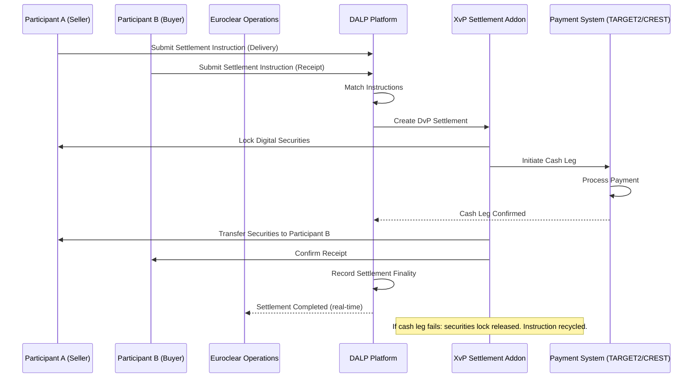

### 6.3 Settlement Finality State Machine

```mermaid
stateDiagram-v2
    [*] --> Submitted: Settlement instruction received
    Submitted --> Matched: Counter-instruction found
    Submitted --> Unmatched: No matching instruction found
    Unmatched --> Recycled: Recycling rules applied
    Recycled --> Matched: Matching instruction arrives
    Recycled --> Failed: Recycling limit reached
    Matched --> PendingCashLeg: Security leg locked; cash leg pending
    PendingCashLeg --> Settling: Cash leg confirmed
    PendingCashLeg --> CashFailed: Cash leg timeout or rejection
    CashFailed --> Recycled: Instruction returned to queue
    Settling --> Settled: Both legs atomically transferred
    Settled --> [*]
    Failed --> [*]
```

### 6.4 Settlement Netting Architecture

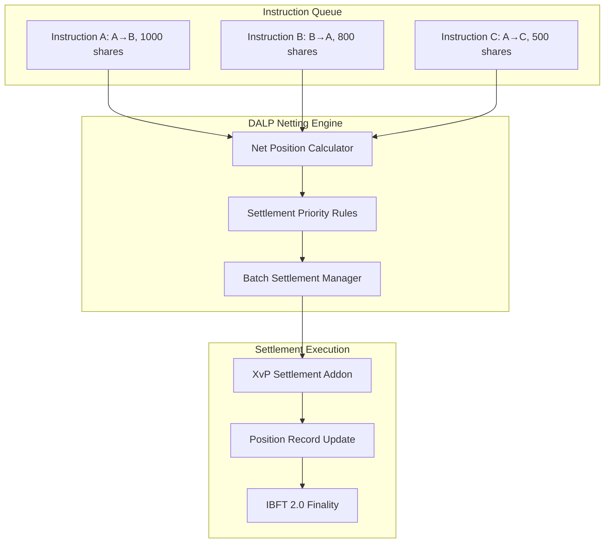

**Netting model:** Bilateral netting within a settlement cycle reduces gross settlement volume. DALP's execution engine manages batched XvP settlement for netted positions via configurable netting rules applied at instruction matching time. Each net position is settled atomically through a single XvP instruction; the XvP addon handles the net delivery instruction. Netting scope (bilateral, multilateral, or gross) is configured per settlement cycle via the execution engine parameters, not hardcoded into smart contracts.

### 6.5 Intraday Settlement Monitoring

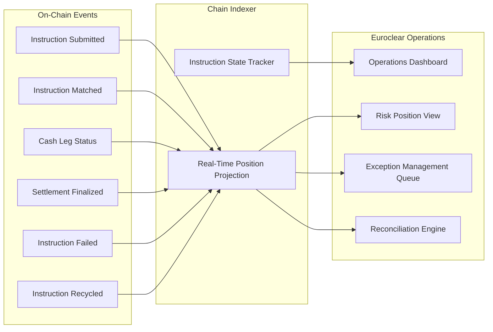

### 6.6 Cut-Off Management and Calendar Handling

DALP's settlement window configuration supports:
- Configurable cut-off times per settlement cycle
- Daylight saving time transitions handled by NTP-synchronized Kubernetes nodes with explicit calendar configuration
- Jurisdiction-specific calendar rules (non-settlement days, holiday schedules) configured per market
- Automated recycling of instructions that miss cut-off with defined carry-forward rules

### 6.7 Corporate Action and Entitlement Propagation

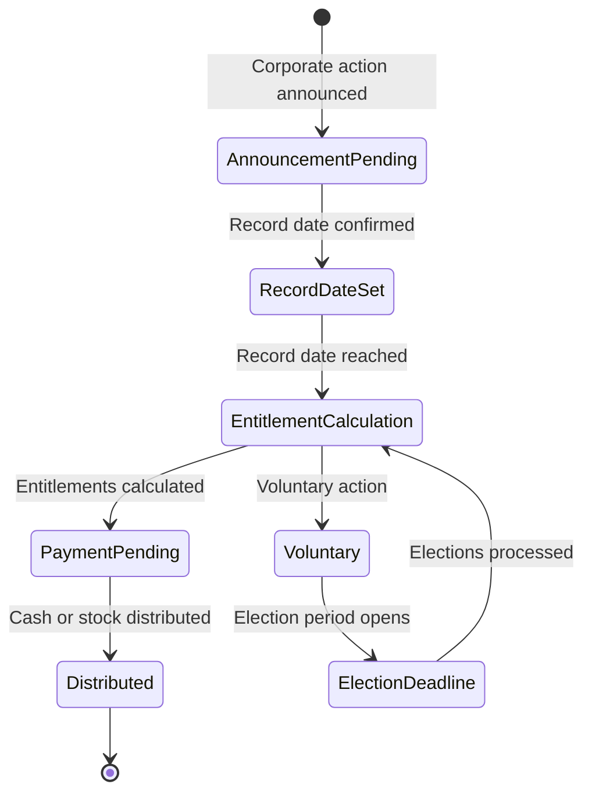

DALP's yield feature and airdrop addon support automated entitlement calculation and distribution. Coupon payments are executed as programmatic distributions using the push distribution pattern. Mandatory corporate actions (dividends, interest payments) are automated. Voluntary actions (rights issues, tender offers) are managed through the workflow engine with election period tracking.

### 6.8 Cross-CSD Settlement Architecture (Multi-Network)

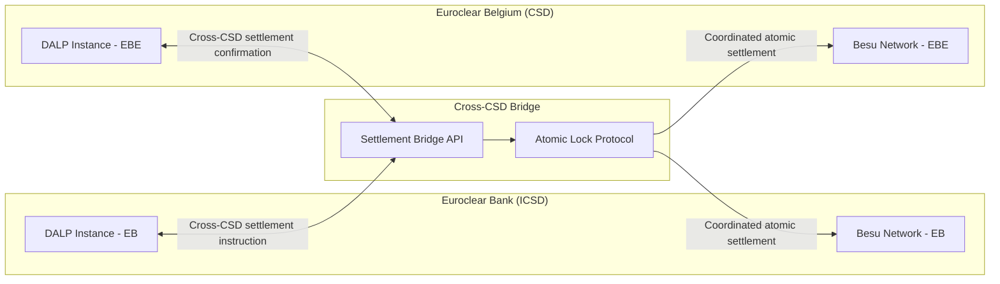

Cross-CSD settlement uses a bridge protocol that coordinates atomic lock-release across the two Besu networks. The bridge is a Phase 2+ feature; initial deployment scope is Euroclear Bank ICSD settlement only. Additional Euroclear entities (Euroclear Belgium, Euroclear France, etc.) are Phase 2+ at client discretion and are covered by the Sovereign license extension path. The bridge architecture is defined in Phase 1 to ensure compatibility, but implementation is deferred.

### 6.9 Functional Fit Matrix

| Requirement | DALP Capability | Status | Notes |
|---|---|---|---|
| Atomic DvP with explicit exception handling | XvP addon; durable execution | Full | |
| Finality-state management, reconciliation, EOD evidence | IBFT 2.0 finality; Chain Indexer; REST API export | Full | |
| Participant messaging, queue management, prioritization | Execution Engine; message queue; priority rules | Full | |
| Cash leg coordination, liquidity checks, enrichment | XvP integration with payment rails | Full | Integration-dependent for TARGET2/CREST |
| Corporate actions, entitlement, lifecycle events | Yield feature, airdrop addon, maturity | Full | |
| Bilateral/multilateral reconciliation | REST API reconciliation endpoint; Chain Indexer | Full | |
| Cut-off management, daylight saving, calendar handling | Configurable settlement windows; NTP; calendar config | Full | |
| Failover preserving message integrity and duplicate prevention | Durable execution; idempotency; IBFT 2.0 finality | Full | |
| Intraday monitoring (pending, matched, failed, recycled, settled) | Chain Indexer real-time state tracking | Full | |
| Tolerance rules, break management, exception packages | Configurable tolerance; exception queue; webhook alerts | Full | |
| Environment segregation | Dev/staging/prod | Full | |
| IaC, config baselining | GitOps Helm | Full | |
| Immutable audit logs | On-chain IBFT 2.0; Loki | Full | |
| HA, no SPOF | Multi-AZ; IBFT 2.0 | Full | |
| Observability | VictoriaMetrics/Loki/Grafana | Full | |

---

## 7. Technical Architecture

### 7.1 Architectural Principles

**Settlement finality is irreversible.** IBFT 2.0 immediate finality is the architectural foundation. No settlement record is ever uncertain after block confirmation.

**Atomicity across both legs.** DvP settlement requires both legs to complete simultaneously. The XvP addon enforces this. Partial settlement is structurally prevented.

**Deterministic failure modes.** Failed instructions surface deterministic error states with documented recovery paths. Silent failures are not possible.

**Integration extends existing infrastructure.** DALP integrates with TARGET2, CREST, Euroclear's custody systems, and reporting infrastructure via documented APIs.

### 7.2 Layered Architecture

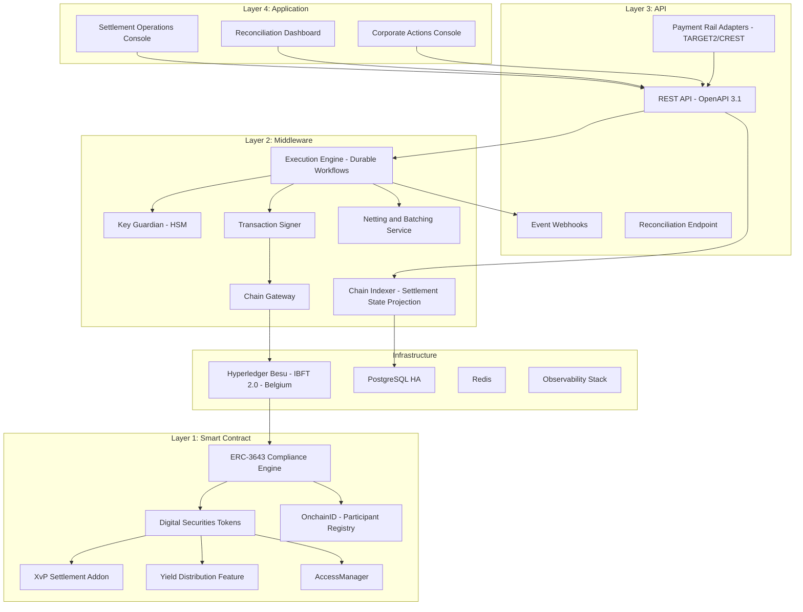

### 7.3 XvP Settlement State Machine

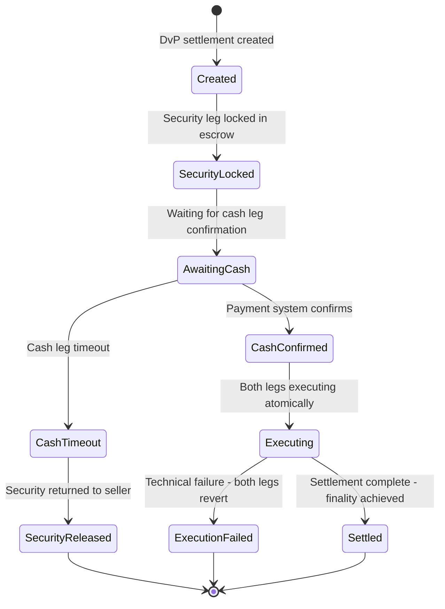

### 7.4 Settlement Data Flow

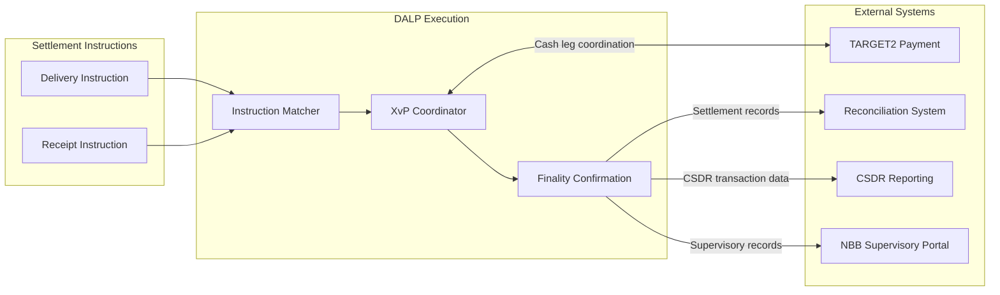

### 7.5 Security Architecture

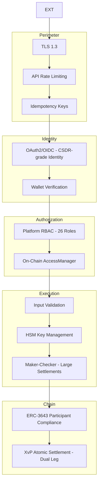

### 7.6 Deployment Topology

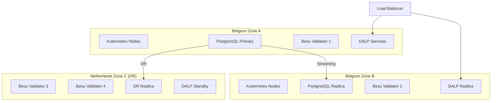

### 7.7 Integration Architecture

```mermaid
graph LR
    subgraph "DALP"
        REST_API[REST API]
        WH[Webhooks]
    end

    subgraph "Euroclear Systems"
        TARGET2[TARGET2 Payment]
        CREST[CREST Payment]
        CUSTODY_SYS[Custody / Safekeeping]
        CSDR_REPORT[CSDR Reporting System]
        NBB_REPORT[NBB Reporting Interface]
        FSMA[FSMA Portal]
        SIEM[SIEM]
        LEGACY_RECON[Legacy Book-Entry Reconciliation]
    end

    REST_API <-->|Cash leg - ISO 20022 pain.001/002/009| TARGET2
    REST_API <-->|Cash leg (GBP)| CREST
    REST_API <-->|Position queries| CUSTODY_SYS
    WH -->|CSDR transaction events| CSDR_REPORT
    REST_API -->|Regulatory data| NBB_REPORT
    REST_API -->|Supervisory access| FSMA
    WH -->|Security events| SIEM
    REST_API -->|Position reconciliation| LEGACY_RECON
```

### 7.8 Implementation Timeline

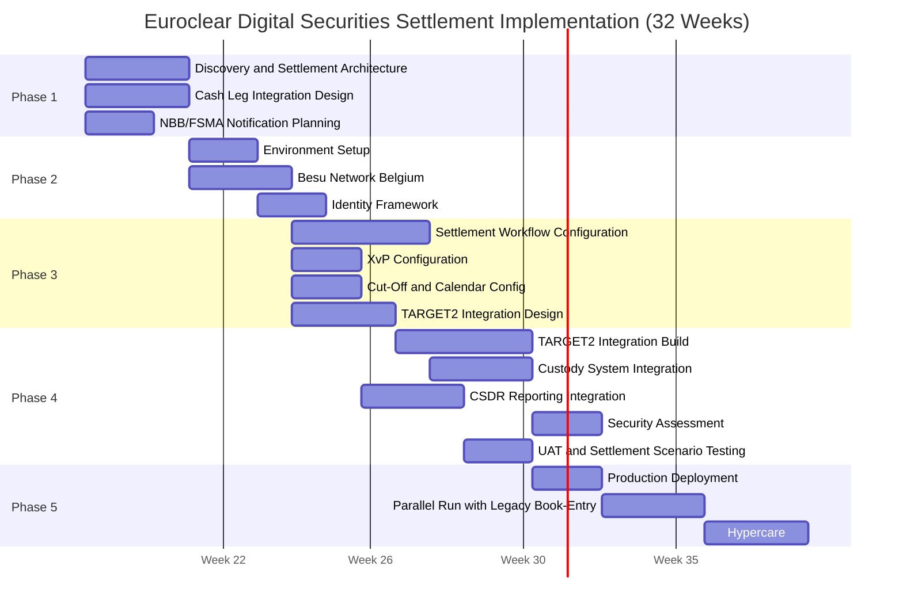

---

## 8. Security

### 8.1 Security Model

Five independent control layers. The settlement finality guarantee is backed by IBFT 2.0 consensus (immutable post-finality) and durable execution (no silent failure modes). NBB/FSMA supervisory access via AUDITOR role without SettleMint involvement.

### 8.2 Settlement Security Controls

**Instruction authentication:** Every settlement instruction requires API key authentication and is attributed to a specific participant account. Dual-party instructions (delivery + receipt) must both be authenticated before matching proceeds.

**Large settlement maker-checker:** Instructions above a configurable EUR threshold require maker-checker authorization (two Euroclear operators must both approve before XvP execution). This mirrors Euroclear's existing four-eyes requirements for large-value settlements.

**Duplicate prevention:** Idempotency keys on all settlement instructions prevent duplicate processing. Instructions with the same idempotency key return the result of the original instruction regardless of network retry.

### 8.3 DORA and CSDR Security Alignment

| Requirement | Response |
|---|---|
| ICT incident classification | P1-P4 taxonomy; NBB notification within 4 hours for P1 |
| TLPT testing | Annual penetration testing; DORA-aligned evidence |
| Third-party ICT oversight | DALP dependency disclosure; SBOM; SLA chain |
| Settlement record integrity | IBFT 2.0 immutable finality; independent RPC access |

### 8.4 Responsibility Matrix

| Control Area | SettleMint | Euroclear |
|---|---|---|
| Platform security patches | Responsible | Informed |
| TARGET2/CREST integration security | | Responsible |
| HSM operation | | Responsible |
| NBB/FSMA audit access | Responsible (AUDITOR role) | Responsible (access policy) |
| CSDR reporting accuracy | | Responsible |
| Settlement finality (platform layer) | Responsible | Informed |
| Reconciliation with legacy book-entry (platform integration) | SettleMint (API) | Euroclear (reconciliation process) |

---

## 9. Implementation and Delivery

### 9.1 Delivery Overview

32-week phase-gated delivery. Extended timeline accommodates TARGET2 integration complexity, NBB/FSMA notification requirements, and parallel run with legacy book-entry.

### 9.2 Phase Plan

**Phase 1 (Weeks 1-3):** Settlement architecture design, TARGET2/CREST integration design, NBB notification planning, cut-off and calendar specification.

**Phase 2 (Weeks 4-7):** Belgium private cloud deployment, Besu network, HSM, participant identity framework.

**Phase 3 (Weeks 8-13):** Settlement workflow configuration, XvP addon configuration, cut-off and calendar setup, TARGET2 integration specification.

**Phase 4 (Weeks 14-24):** TARGET2 integration build, custody system integration, CSDR reporting integration, comprehensive testing including settlement scenario testing under time pressure, DR testing.

**Phase 5 (Weeks 25-29):** Production deployment, parallel run with legacy book-entry. Reconciliation tolerance defined as: zero tolerance for position divergence; 1-hour tolerance for timing differences pending TARGET2 confirmation.

**Phase 6 (Weeks 30-32):** Hypercare, knowledge transfer, support transition.

### 9.3 Settlement Scenario Test Programme

Comprehensive settlement scenario testing in Phase 4:
- Normal processing: standard DvP via ISO 20022 settlement instruction, bilateral netting, EOD settlement
- Cash leg failure: TARGET2 rejection, timeout, retry handling
- Failed instruction recycling: unmatched instruction lifecycle
- Partial failure: XvP rollback validation under various failure modes
- T+0 settlement: compressed cut-off window test
- Corporate action: coupon distribution, dividend, maturity
- Participant suspension: on-the-fly admission revocation impact on pending instructions
- System recovery: restart mid-settlement-cycle; instruction state preservation

### 9.4 Key Risks

| Risk | Likelihood | Mitigation |
|---|---|---|
| TARGET2 interface complexity | High | Phase 1 workshop with Euroclear treasury team |
| NBB notification extends Phase 3 | High | NBB planning in Phase 1; buffer |
| Legacy reconciliation divergence requires additional Phase 4 work | Medium | Reconciliation prototype in Phase 3 staging |
| Cross-CSD bridge design complexity | Medium | Initial scope: EB ICSD only; bridge in Phase 2+ |
| CSDR reporting event taxonomy requires iteration | Medium | Workshop in Phase 1; prototype in Phase 3 |

---

## 10. Deployment Options

**Recommended: Private Cloud (Belgium/Netherlands EU Region)**

Belgium-region cloud (AWS eu-west-1 Ireland or Azure West Europe Amsterdam for proximity; Belgium local DCs for maximum residency). NBB requires data residency within Belgium; discuss with NBB whether EU-wide or Belgium-specific residency required for DALP operational data.

RTO (zone failure): 2-15 minutes. RPO: seconds.
DR site: Netherlands region. RTO (region failure): 30-180 minutes. RPO: 1-5 minutes.

DORA-required DR drills quarterly.

---

## 11. Training and Knowledge Transfer

**Three tracks:**

**Administrator (3-4 days):** Settlement platform architecture, participant account management, cut-off configuration, corporate action administration, observability and DR procedures.

**Developer/Integration (4-5 days):** DALP API, TARGET2/CREST integration patterns, CSDR event taxonomy, reconciliation API, testing strategy for settlement scenarios.

**Settlement Operations (2 days):** Intraday position monitoring, exception queue management, failed instruction resolution, corporate action processing, NBB audit access procedures.

---

## 12. Support and SLA

**Recommended: Enterprise Support (24/7)**

Given Euroclear's CSDR discipline penalties and systemic importance, 24/7 support with 15-minute P1 response and 99.99% uptime SLA is required.

| Level | Definition | Response | Resolution |
|---|---|---|---|
| P1 | Settlement blocked; XvP unavailable; finality engine unavailable | 15 min | 2 hours |
| P2 | Major function impaired; workaround available | 1 hour | 4 hours |
| P3 | Non-critical function impaired | 4 hours | 2 business days |
| P4 | General | 1 business day | Next cycle |

NBB/FSMA incident notification: P1 events notified within 4 hours. DORA ICT incident classification applied to all operational incidents.

---

## 13. Risk Management

| ID | Risk | Likelihood | Impact | Mitigation |
|---|---|---|---|---|
| R-001 | TARGET2 integration requires additional time | High | High | Phase 1 deep-dive; early TARGET2 team engagement |
| R-002 | Legacy reconciliation reveals position divergence | Medium | High | Parallel run tolerance definition; reconciliation dashboard |
| R-003 | NBB requires additional notification documentation | High | Medium | NBB planning in Phase 1 |
| R-004 | CSDR reporting event taxonomy requires iteration | Medium | Medium | Workshop and prototype |
| R-005 | T+0 settlement performance under load | Medium | High | Stress testing Phase 4 |
| R-006 | Cross-CSD bridge complexity increases Phase scope | Low | Medium | Initial scope: EB ICSD only; deferred to Phase 2+ |
| R-007 | Corporate action lifecycle complexity | Low | Medium | Phased corporate action types; coupon first |

---

## 14. Compliance Matrix

### 14.1 Technical Requirements

| ID | Priority | Requirement | Status | Notes |
|---|---|---|---|---|
| TR-001 | P1 | Atomic DvP with explicit exception handling | Full | XvP addon; durable execution; documented exception workflows |
| TR-002 | P1 | Finality-state management, reconciliation, EOD evidence | Full | IBFT 2.0 immediate finality; Chain Indexer; REST API EOD export |
| TR-003 | P1 | Participant messaging, queue management, prioritization | Full | Execution Engine; message queue; configurable priority rules |
| TR-004 | P1 | Cash leg coordination, liquidity checks, enrichment | Full | XvP integration with TARGET2/CREST; integration-dependent |
| TR-005 | P1 | Corporate actions, entitlement, lifecycle-event propagation | Full | Yield feature, airdrop addon, maturity, redemption |
| TR-006 | P2 | Bilateral/multilateral reconciliation | Full | REST API reconciliation endpoint; bilateral position comparison |
| TR-007 | P2 | Cut-off management, daylight saving, calendar handling | Full | Configurable settlement windows; NTP; calendar config |
| TR-008 | P2 | Failover preserving message integrity, duplicate prevention | Full | Durable execution; idempotency; IBFT 2.0 finality |
| TR-009 | P2 | Intraday monitoring (pending, matched, failed, recycled, settled) | Full | Chain Indexer real-time state tracking; Grafana dashboard |
| TR-010 | P3 | Tolerance rules, break management, exception packages | Full | Configurable tolerance; exception queue; alert webhooks |
| TR-011 | P3 | Environment segregation | Full | Dev/staging/prod per Helm |
| TR-012 | P3 | IaC, config baselining | Full | GitOps Helm |
| TR-013 | P1 | Immutable audit logs | Full | On-chain IBFT 2.0; Loki append-only |
| TR-014 | P1 | HA, no SPOF | Full | Multi-AZ Belgium; IBFT 2.0 1/4 fault tolerance |
| TR-015 | P1 | Comprehensive observability | Full | VictoriaMetrics, Loki, Tempo, Grafana |
| TR-016 | P1 | Time synchronization, evidence timestamping | Full | NTP; IBFT 2.0 consensus; trace IDs |
| TR-017 | P1 | Backup, restore, DR | Full | Velero; WAL archival; RTO/RPO; quarterly DR drills |
| TR-018 | P2 | Secure API access | Full | OAuth2/OIDC; TLS 1.3; API keys |
| TR-019 | P2 | Controlled release management | Full | GitOps; staging; rollback |
| TR-020 | P2 | Runbooks | Full | Phase 5 including settlement exception runbooks |
| TR-021 | P2 | Performance testing | Full | Settlement scenario load testing; T+0 test |
| TR-022 | P3 | Config freeze, emergency, degradation | Full | EMERGENCY role; config freeze; degradation procedures |
| TR-023 | P3 | IAM, role separation, PAM | Full | 26 roles; AccessManager; wallet verification |
| TR-024 | P3 | Encryption | Full | TLS 1.3; AES-256; HSM |
| TR-025 | P1 | SIEM integration | Full | JSON/CEF event export; webhooks |
| TR-026 | P1 | Vulnerability management, SBOM | Full | CVE monitoring; 24h critical patches |
| TR-027 | P1 | Secure development lifecycle | Full | Peer review; SAST; SOC 2 |
| TR-028 | P1 | Data classification, retention | Full | CSDR 5-year+ retention; GDPR; Belgium residency |
| TR-029 | P1 | Incident notification | Full | NBB notification 4 hours; DORA ICT |
| TR-030 | P2 | Network segmentation | Full | Kubernetes NetworkPolicies; cert-manager |
| TR-031 | P2 | DoS/replay/duplicate resilience | Full | Rate limiting; idempotency; durable execution |
| TR-032 | P2 | Third-party risk management | Full | TARGET2 dependency; SBOM; dependency register |
| TR-033 | P2 | Penetration testing | Full | Annual third-party; DORA TLPT-compatible |
| TR-034 | P3 | Cryptographic agility | Full | Algorithm configurable; key rotation |
| TR-035 | P3 | Delivery plan | Full | 32-week plan; 6 phases with gate criteria |
| TR-036 | P3 | Buyer dependencies | Full | RACI; dependency register |
| TR-037 | P1 | Migration approach | Full | Participant onboarding plan; data migration; cutover runbook |
| TR-038 | P1 | Structured testing | Full | Settlement scenario, security, performance, DR, UAT in Phase 4 |
| TR-039 | P1 | Training | Full | Three tracks; settlement operations focus |
| TR-040 | P1 | Service transition | Full | Phase 6 hypercare deliverables |
| TR-041 | P1 | Governance forums | Full | Programme Board; Working Group |
| TR-042 | P2 | Assumptions register | Full | Phase 1 deliverable |
| TR-043 | P2 | Rollback | Full | Tested Phase 4 |
| TR-044 | P2 | Parallel running | Full | 3-week parallel run Phase 5; zero-tolerance position reconciliation |
| TR-045 | P2 | Hypercare | Full | Phase 6 hypercare |
| TR-046 | P3 | Roadmap governance | Full | Committed vs exploratory |

**Regulatory Requirements:**

| ID | Status | Notes |
|---|---|---|
| REG-001 | Full | CSDR, DORA, MiCA, GDPR, AMLD, NIS2, EMIR interfaces; all frameworks mapped with Euroclear-specific context |
| REG-002 | Full | DORA critical ICT designation; CSDR systemically important; control model documented |
| REG-003 | Full | Belgium/EU data residency; GDPR categories; CSDR retention |
| REG-004 | Full | AUDITOR role; NBB/FSMA access via role delegation |
| REG-005 | Full | DORA-aligned; RTO/RPO; quarterly DR drills; TLPT support |
| REG-006 | Full | OnchainID AML/CFT claims; sanctions integration-dependent |
| REG-007 | Full | Immutable IBFT 2.0 finality; settlement finality record |
| REG-008 | Full | GitOps change governance; NBB notification procedures |
| REG-009 | Full | XvP DvP atomicity; IBFT 2.0 finality; reconciliation dashboard |
| REG-010 | Full | Participant compliance modules; account controls; corporate action entitlement |

---

*Document Classification: SettleMint Confidential*
*Version 1.0 Draft, March 2026*
*For Euroclear evaluation purposes only*
