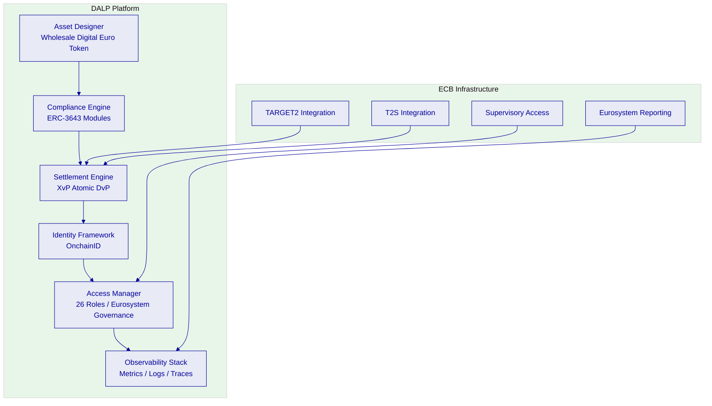
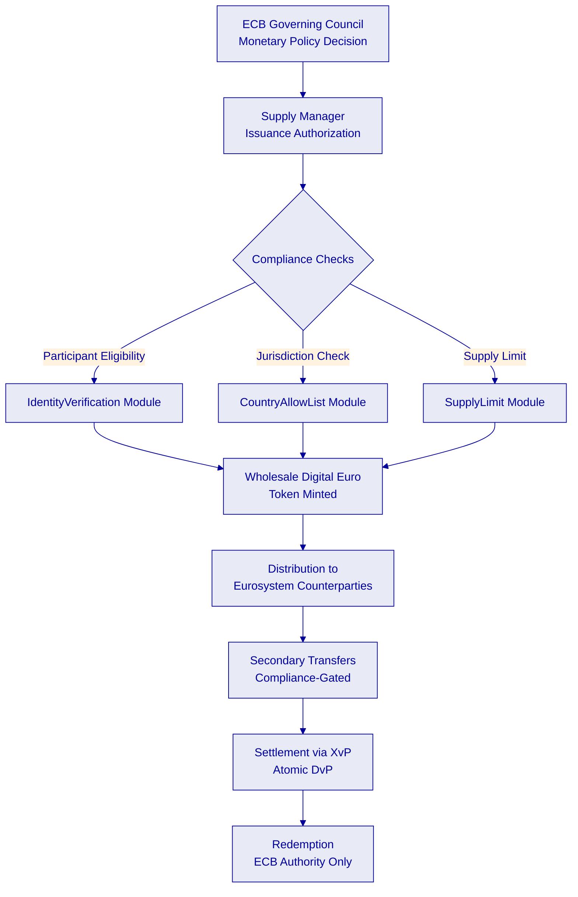
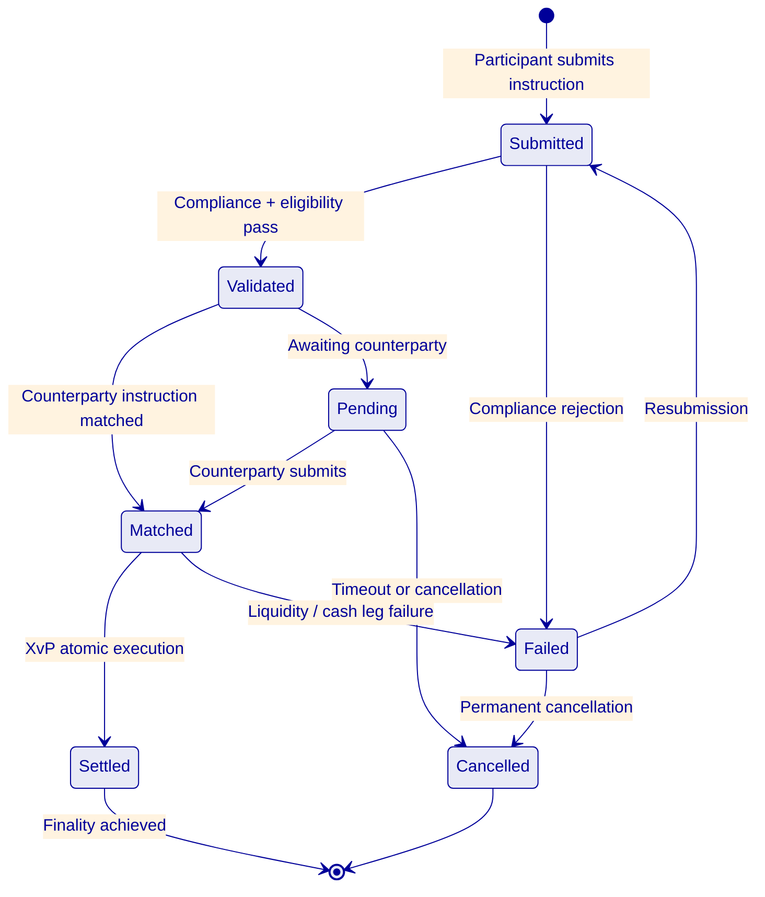
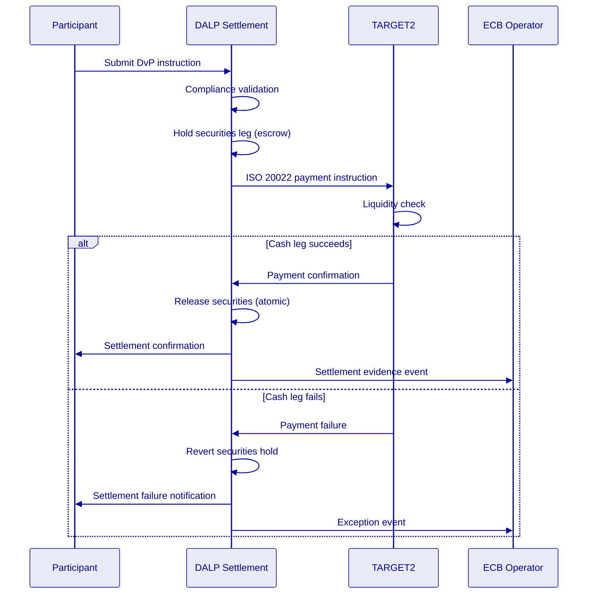
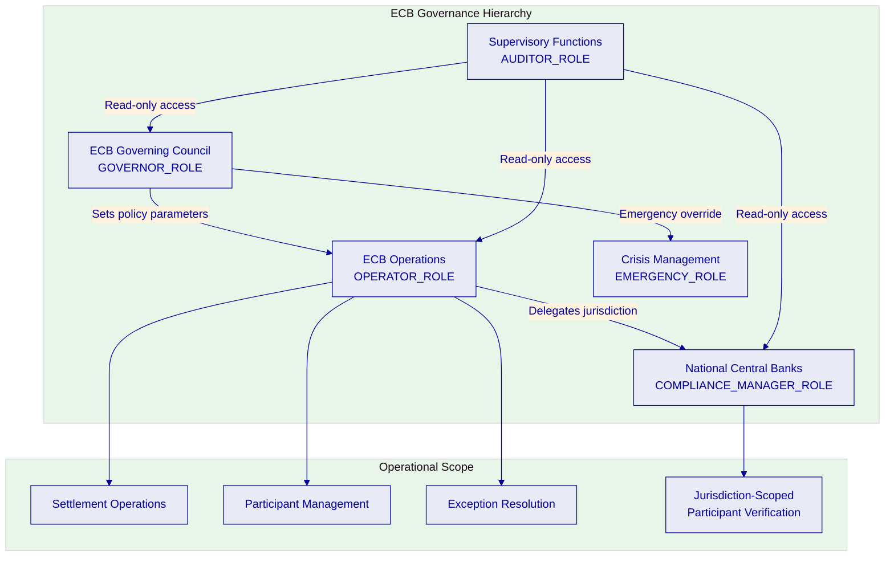
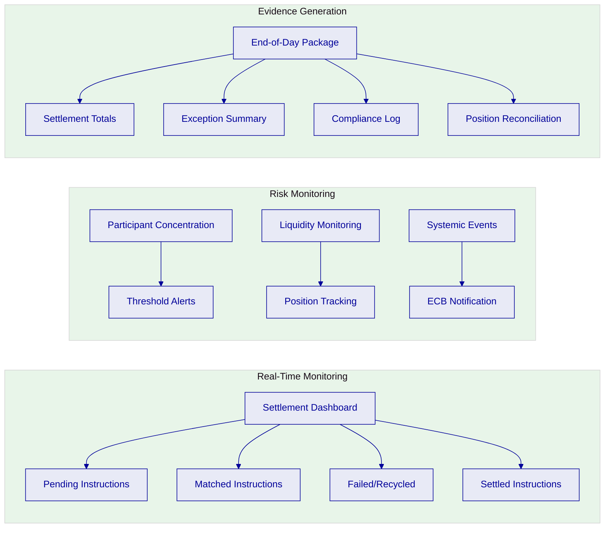
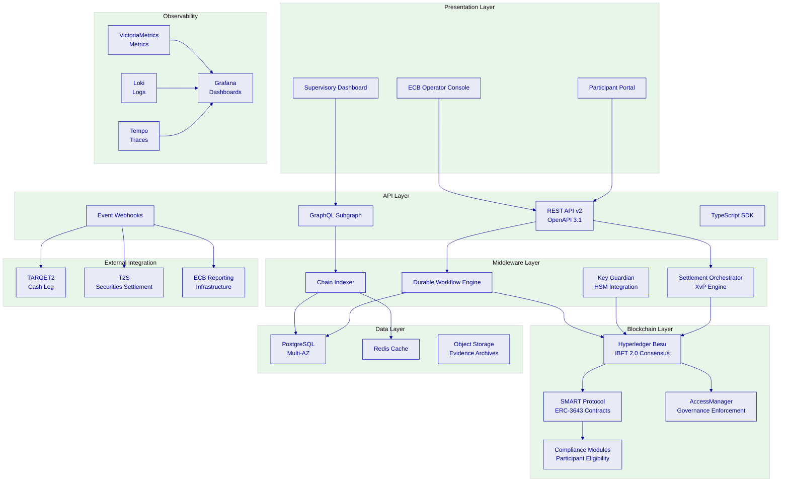
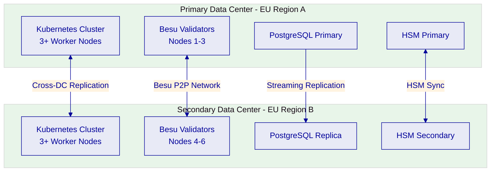
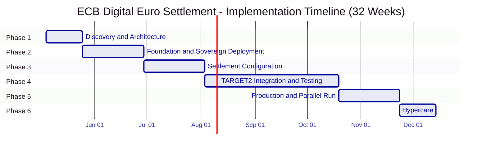

# Technical Proposal: Digital Euro Wholesale Settlement

**Prepared for:** European Central Bank
**Document Title:** Technical Proposal. Digital Euro Wholesale Settlement Infrastructure
**RFP Reference:** EUROPEANCENTRALBANK-RFP-202603
**Submission Date:** March 2026
**Version:** v1.0
**Classification:** SettleMint Confidential

**Prepared by:** SettleMint NV
**Primary Contact:** Digital Assets Programme. SettleMint Enterprise

---

*This document and the information contained herein are strictly confidential and are submitted solely for the purpose of responding to the European Central Bank procurement for Digital Euro Wholesale Settlement (Reference: EUROPEANCENTRALBANK-RFP-202603). It may not be reproduced, distributed, or disclosed to any third party without the prior written consent of SettleMint NV.*

---

## Table of Contents

1. Executive Summary
2. About SettleMint
3. About DALP
4. Customer References
5. Understanding of Requirements
6. Proposed Solution and Functional Capabilities
7. Technical Architecture
8. Security
9. Implementation and Delivery
10. Deployment Options
11. Training and Knowledge Transfer
12. Support and SLA
13. Risk Management
14. Compliance Matrix

---

## Executive Summary

### Context and Strategic Drivers

The European Central Bank's procurement for a Digital Euro Wholesale Settlement infrastructure represents one of the most consequential infrastructure decisions in the evolution of the Eurosystem's market operations. The digital euro programme, in its wholesale dimension, must deliver settlement finality for interbank transactions with the same legal certainty and operational resilience that TARGET2 provides for conventional euro payments, while introducing the programmability, transparency, and efficiency gains that distributed ledger technology enables.

The ECB's procurement document is explicit about the institutional stakes. This is not an innovation experiment. It is a procurement for production-grade infrastructure that must integrate with TARGET2 and T2S, satisfy CPMI-IOSCO Principles for Financial Market Infrastructures, operate under DORA resilience requirements, and function within the Eurosystem's governance framework where the ECB retains monetary policy authority while national central banks participate in operational delivery.

The current-state drivers are structural. The Eurosystem needs wholesale settlement infrastructure that supports DvP atomicity for digital securities transactions, enables programmable settlement logic without undermining legal certainty, provides real-time gross settlement capabilities for wholesale digital euro transfers, and maintains interoperability with existing RTGS and securities settlement systems. The infrastructure must also support the ECB's supervisory transparency requirements, allowing real-time monitoring of participant concentration, systemic risk indicators, and settlement flow patterns across the Eurosystem.

Project Meridian, Project Helvetia, and the ECB's own exploratory work have demonstrated that wholesale CBDC settlement is technically feasible. The question facing the ECB is no longer whether to build wholesale digital euro settlement infrastructure, but how to build it with the governance controls, operational resilience, and institutional integration that a systemic financial market infrastructure demands.

### Why This Programme Is Hard

Wholesale CBDC settlement at Eurosystem scale is not a token issuance problem. It is a financial market infrastructure problem that requires solving five simultaneous challenges, each of which is individually complex and collectively unprecedented.

**Settlement finality under EU law.** Every wholesale digital euro settlement must achieve legal finality under the Settlement Finality Directive. This is not a technical property alone; it requires that the consensus mechanism, the state transition model, and the evidence generation system together produce a settlement state that is legally irrevocable. IBFT 2.0 consensus provides deterministic finality at the protocol level, but the platform must also generate the evidentiary record that proves finality was achieved, when it was achieved, and under what conditions.

**Eurosystem governance model.** The ECB operates within a governance framework where monetary policy authority rests with the Governing Council, operational responsibilities are shared with national central banks, and supervisory functions are distinct from operational functions. The settlement platform must enforce this governance model at the technical level: the ECB must be able to set policy parameters that constrain operational behavior, national central banks must have scoped operational authority within their jurisdiction, and supervisory functions must have read access to all settlement evidence without the ability to modify operational state.

**TARGET2 and T2S interoperability.** The wholesale digital euro cannot exist as an isolated system. It must interoperate with TARGET2 for cash leg coordination, with T2S for securities settlement integration, and with national RTGS systems where applicable. These integration points must preserve settlement atomicity: a DvP transaction that settles the securities leg on-chain but fails the cash leg in TARGET2 creates precisely the systemic risk the ECB is designing against.

**Systemic resilience.** As a systemically important financial market infrastructure, the wholesale digital euro settlement system must meet the highest resilience standards. DORA, NIS2, and CPMI-IOSCO PFMI Principle 17 (Operational Risk) all apply. The system must demonstrate tested recovery from node failures, network partitions, data center outages, and coordinated attack scenarios. Recovery must preserve settlement state integrity and resume operations within documented recovery time objectives.

**Privacy and supervisory access.** Wholesale settlement requires a privacy model that protects participant transaction details from other participants while providing the ECB with full supervisory visibility. This is not a binary choice between privacy and transparency; it is an architectural requirement for granular access control where different actors see different views of the same settlement state based on their governance role.

### Proposed Response

SettleMint proposes the Digital Asset Lifecycle Platform (DALP) as the technical foundation for the ECB's Digital Euro Wholesale Settlement infrastructure. DALP is a production-grade platform built on the SMART Protocol (ERC-3643 standard), deployed across central banks, market infrastructure operators, and regulated financial institutions in multiple jurisdictions.

**Deployment model:** Private permissioned EVM network (Hyperledger Besu with IBFT 2.0 consensus) deployed within ECB-controlled infrastructure across two EU data centers, with full Eurosystem data residency and alignment to ECB security policies. The network operates as a sovereign infrastructure under ECB governance authority.

**Settlement architecture:** DALP's XvP addon provides atomic delivery-versus-payment settlement. The IBFT 2.0 consensus mechanism delivers deterministic finality: once a block is committed, the settlement state is irrevocable. The durable workflow engine ensures that multi-step settlement instructions complete atomically, even through infrastructure failures. Settlement instructions that cannot complete are rolled back entirely, preventing partial settlement states.

**Wholesale digital euro token:** DALPAsset contracts configured as a wholesale digital euro token with ECB as the sole issuer. Compliance modules enforce participant eligibility (Eurosystem counterparties only), transaction limits (configurable by the ECB), and circulation restrictions (wholesale-only, no retail distribution). The token represents a claim on the ECB, with the same legal status as central bank reserves.

**Eurosystem governance enforcement:** DALP's AccessManager contract enforces a multi-tier governance model. The ECB holds GOVERNOR_ROLE authority over monetary policy parameters. National central banks hold OPERATOR_ROLE authority within their jurisdiction. Supervisory functions hold AUDITOR_ROLE with read access to all settlement evidence. No single role can both set policy and execute operations.

**TARGET2 integration:** DALP's REST API and event webhook infrastructure provide the integration surface for TARGET2 cash leg coordination. Settlement instructions trigger ISO 20022-compatible messages for cash leg processing. The durable workflow engine holds the securities leg in escrow until cash leg confirmation is received, ensuring DvP atomicity across systems.

**Phased delivery:** A 32-week delivery plan structured across six phases, extended from the standard implementation to accommodate Eurosystem governance approval cycles, TARGET2 integration complexity, multi-data-center deployment, and the operational readiness evidence that a systemically important FMI requires.

### Key Differentiators

Four architectural properties distinguish DALP from alternative approaches for this programme.

First, production-proven settlement finality. DALP's combination of IBFT 2.0 consensus and XvP atomic settlement has been deployed in production at central banks and international CSDs. Settlement finality is not a theoretical property; it has been validated under production conditions including node failures, network latency, and peak load scenarios.

Second, governance-native architecture. DALP's AccessManager is not a bolt-on permissions layer. It is a core architectural component that enforces role separation at the smart contract level. The Eurosystem governance model, with its distinction between policy authority, operational responsibility, and supervisory access, maps directly to DALP's role taxonomy.

Third, durable execution for settlement certainty. The durable workflow engine ensures that every settlement instruction either completes fully or reverts fully. There is no intermediate state where a DvP transaction has settled one leg but not the other. This property is critical for a systemically important FMI where partial settlement creates systemic risk.

Fourth, sovereign deployment control. DALP deploys on ECB-controlled infrastructure using standard Kubernetes and Helm charts. The ECB retains full operational authority over the infrastructure, the network, and the data. SettleMint provides platform software and support; the ECB controls the sovereign infrastructure.

### Investment Case

The wholesale digital euro settlement infrastructure represents a generational investment in Eurosystem market operations. The question is not whether this infrastructure will be built, but whether it will be built efficiently, with appropriate risk management, and within a timeline that preserves the Eurosystem's leadership position in digital currency innovation.

DALP reduces the ECB's implementation risk in three measurable ways. First, time-to-production: the 32-week implementation timeline compares to 36-48 months for a full internal build programme. Second, settlement finality validation: DALP's consensus and settlement mechanisms have 7+ years of production operation, compared to zero days for a newly built system. Third, integration risk: DALP's REST API and event infrastructure provide documented integration patterns for TARGET2 connectivity, compared to the bespoke integration engineering required for a custom-built system.

---

## About SettleMint

SettleMint NV is a Belgian enterprise software company headquartered in Brussels, specializing in digital asset infrastructure for regulated financial institutions. Founded in 2016, SettleMint has delivered production deployments to central banks, international CSDs, tier-1 banks, sovereign entities, and market infrastructure operators across more than fifteen jurisdictions.

SettleMint holds ISO 27001 and SOC 2 Type II certifications. The company maintains engineering and delivery teams in Belgium, India, Japan, and the UAE, with domain expertise in securities settlement, wholesale payments, compliance engineering, and institutional infrastructure governance.

SettleMint is a platform company. It builds, maintains, and supports the DALP platform. It does not provide consulting, custom development, or managed services as primary offerings. This distinction matters for the ECB because it establishes clear accountability: SettleMint is responsible for the platform and its structured implementation delivery; the ECB retains policy authority, operational governance, and infrastructure control.

**Relevant central bank and FMI experience:**
- Central bank wholesale CBDC pilot infrastructure (Bank of England)
- International CSD tokenized collateral management (Clearstream)
- National stock exchange digital asset trading and settlement (JSE, Deutsche Borse)
- Sovereign-scale digital asset infrastructure (MENA region)
- Regulated bank production deployments across Europe, Middle East, and Asia Pacific

---

## About DALP

The Digital Asset Lifecycle Platform (DALP) provides the infrastructure regulated institutions need to design, issue, manage, and settle digital assets at production scale. DALP is built on the SMART Protocol (ERC-3643 standard) and provides five core lifecycle pillars: Issuance, Compliance, Settlement integration, Custody integration, and Servicing, plus three platform foundations: Identity and Access Management, Integration and Interoperability, and Observability and Operations.

For the ECB's wholesale digital euro settlement programme, DALP's relevant capabilities include:

**Settlement engine (XvP addon).** Atomic delivery-versus-payment and cross-value-payment settlement. Both legs of a DvP transaction execute in a single atomic blockchain transaction. If either leg fails, both revert. Settlement finality is immediate upon block commitment.

**Consensus and finality (IBFT 2.0).** Hyperledger Besu with Istanbul BFT 2.0 consensus provides deterministic finality. Once a block is committed by the validator set, the state transitions within that block are irrevocable. There is no confirmation-depth waiting, no probabilistic finality, and no fork risk.

**Durable workflow execution.** All multi-step settlement operations are modeled as durable workflows. If infrastructure fails mid-operation, the workflow resumes from the last committed step. This eliminates orphaned states, partial settlements, and the reconciliation burden that infrastructure failures create in traditional systems.

**Compliance enforcement (ERC-3643).** The compliance engine enforces participant eligibility, transaction limits, and circulation restrictions at the smart contract layer. These rules execute before any state change is committed to the ledger. Non-compliant transactions are rejected at execution time, not flagged for post-trade review.

**Identity and governance (OnchainID + AccessManager).** Participant identity is managed through OnchainID with verifiable credentials issued by trusted authorities. The AccessManager enforces role-based access control with 26 granular roles, supporting the ECB's multi-tier governance model.

**Observability.** Three-pillar observability (metrics via VictoriaMetrics, logs via Loki, traces via Tempo) with pre-built Grafana dashboards provides real-time visibility into settlement operations, infrastructure health, and participant activity.

---

## Customer References

| Client | Geography | Use Case | Scale | Relevance to ECB |
|---|---|---|---|---|
| Bank of England | UK | Wholesale CBDC pilot infrastructure | Central bank FMI | Most comparable: central bank wholesale settlement; FMI governance; operational resilience |
| Clearstream | Luxembourg | Tokenized collateral management (XvP settlement) | International CSD | XvP atomic settlement; CSDR alignment; post-trade infrastructure |
| Deutsche Borse | Germany | Regulated digital asset trading venue | Exchange/FMI | BaFin-regulated; MiCA alignment; market infrastructure governance |
| JSE | South Africa | Digital asset trading and settlement | Exchange/CSD | DvP settlement; post-trade architecture; exchange-grade operations |
| Central Bank of UAE | UAE | CBDC digital dirham infrastructure | Central bank | Central bank digital currency; sovereign infrastructure; monetary policy controls |

**Key case study: Bank of England Wholesale CBDC Pilot**

The Bank of England's wholesale CBDC pilot is the most directly relevant reference for the ECB's requirements. The programme deployed DALP as the settlement infrastructure for wholesale central bank digital currency transactions, with requirements closely paralleling the ECB's: settlement finality under UK law, integration with the Bank's existing RTGS infrastructure, multi-tier governance enforcement (Bank of England as policy authority, participant banks as operational actors, supervisory functions with read access), and CPMI-IOSCO PFMI alignment.

The pilot validated DALP's IBFT 2.0 finality mechanism under production conditions, tested XvP atomic settlement across simultaneous DvP transactions, and demonstrated the governance model's ability to enforce role separation between monetary policy, operations, and supervision. Recovery testing included node failure scenarios, network partition simulation, and emergency intervention procedures.

**Key case study: Clearstream Tokenized Collateral**

Clearstream's tokenized collateral programme demonstrates DALP's capability at international CSD scale. The deployment includes XvP atomic settlement for collateral mobilization, on-chain eligibility enforcement, CSDR/DORA alignment, and real-time position management. The programme validates DALP's settlement engine under the operational conditions that Eurosystem post-trade infrastructure demands.

---

## Understanding of Requirements

The ECB's procurement defines a wholesale digital euro settlement infrastructure with requirements organized across five domains: settlement mechanics, governance and control, integration and interoperability, resilience and operations, and regulatory compliance. SettleMint's understanding of these requirements is structured below.

**Settlement mechanics.** The ECB requires atomic DvP settlement with explicit exception handling (TR-001), finality-state management with reconciliation controls (TR-002), participant messaging and settlement prioritization (TR-003), and cash leg coordination with liquidity checks (TR-004). These requirements define a real-time gross settlement system for wholesale digital euro transactions where settlement finality is legally irrevocable and operationally verifiable.

**Governance and control.** The ECB requires central bank operator controls for participant admission, transaction rules, and emergency suspension (TR-012), programmable control boundaries that preserve legal certainty (TR-015), and ledger governance features for controlled upgrade and incident intervention (TR-016). These requirements reflect the Eurosystem governance model where the ECB sets monetary policy parameters and retains override authority.

**Integration and interoperability.** The ECB requires interoperability with RTGS (TARGET2), securities settlement (T2S), and liquidity management environments (TR-014). Settlement instructions must support ISO 20022 messaging patterns for cross-system coordination. The wholesale digital euro must function within the existing Eurosystem infrastructure ecosystem, not as an isolated system.

**Resilience and operations.** The ECB requires production-grade operational resilience with tested recovery, failover, and evidence controls. As a systemically important FMI, the infrastructure must satisfy DORA, NIS2, and CPMI-IOSCO PFMI requirements for operational risk management, business continuity, and incident response.

**Regulatory compliance.** The ECB requires alignment with T2/T2S policy, DORA, GDPR, NIS2, AML/CFT frameworks, and CPMI-IOSCO PFMI. The platform must support supervisory transparency, audit access, and regulatory reporting without compromising participant privacy.

---

## Proposed Solution and Functional Capabilities

### Wholesale Digital Euro Token Design

The wholesale digital euro is configured as a DALPAsset token with the following properties:

**Issuer authority.** The ECB holds exclusive minting authority through the SUPPLY_MANAGER_ROLE. No other actor can create wholesale digital euro tokens. Redemption (burning) is controlled through the same role, ensuring that the money supply is managed exclusively by the ECB.

**Participant eligibility.** Compliance modules enforce that only authorized Eurosystem counterparties can hold and transfer wholesale digital euro tokens. The IdentityVerification module requires that every participant has a validated OnchainID with credentials issued by the ECB's trusted issuer registry. The CountryAllowList module restricts participation to EU member state entities.

**Circulation controls.** The TransferApproval module can be configured to require ECB authorization for transfers above configurable thresholds. The SupplyLimit module enforces maximum circulation limits set by the ECB's monetary policy parameters. The HoldingPeriod module can enforce minimum settlement duration requirements where applicable.

**Corporate actions.** The FixedYield feature supports interest accrual on wholesale digital euro holdings where the ECB's monetary policy framework requires remuneration of reserves. The Maturity feature supports time-limited wholesale digital euro issuances if the ECB wishes to issue term-based wholesale CBDC instruments.

### Settlement Engine: XvP Atomic DvP

The XvP addon provides the atomic settlement capability that the ECB's requirements demand. In a DvP settlement, the delivery of digital securities and the payment in wholesale digital euro execute within a single atomic blockchain transaction. The atomicity guarantee means that both legs complete or both revert; there is no intermediate state where one leg has settled and the other has not.

**Settlement instruction lifecycle.** A settlement instruction passes through the following states: Submitted, Validated, Matched, Settled, or Failed. Each state transition generates an immutable on-chain event with a timestamp, the acting role, and the settlement details. The full lifecycle is queryable through the API and the GraphQL subgraph.

**Exception handling.** Settlement instructions that fail compliance checks, liquidity validation, or counterparty matching are moved to a Failed state with a specific failure reason code. Failed instructions can be resubmitted, cancelled, or escalated to operator intervention. All exception paths generate audit events.

**Reconciliation.** The on-chain settlement state serves as the authoritative record. DALP provides API endpoints for bilateral reconciliation (counterparty-to-counterparty), multilateral reconciliation (operator view of all pending and settled instructions), and end-of-day evidence packages that include settlement totals, exception counts, and participant position summaries.

### Cash Leg Coordination with TARGET2

The integration between DALP and TARGET2 for cash leg coordination follows a specific pattern designed to preserve DvP atomicity across systems.

**Inbound flow (cash to digital).** When a wholesale digital euro settlement requires a cash payment, DALP's durable workflow engine initiates a settlement instruction hold. The securities leg is held in escrow within DALP while an ISO 20022-formatted payment instruction is sent to TARGET2 via the integration API. The workflow waits for TARGET2 confirmation. Upon cash leg confirmation, the securities leg releases atomically. If cash leg fails, the securities leg reverts.

**Outbound flow (digital to cash).** When a settlement in the opposite direction occurs, DALP settles the digital securities leg and triggers a cash release instruction to TARGET2. The event webhook notifies the TARGET2 integration adapter of the completed on-chain settlement.

**Liquidity checks.** Before executing a DvP transaction, the settlement engine can query participant liquidity positions via the integration API. The durable workflow engine supports configurable pre-settlement checks that include balance verification, credit limit validation, and aggregate exposure monitoring.

### Eurosystem Governance Model

DALP's AccessManager enforces the ECB's multi-tier governance model through role-based access control at the smart contract level.

**ECB Governing Council level.** The GOVERNOR_ROLE controls monetary policy parameters: supply limits, interest rates (via FixedYield configuration), participant eligibility criteria, and emergency suspension authority. This role cannot execute operational transactions; it sets the policy boundaries within which operations occur.

**ECB Operations level.** The OPERATOR_ROLE manages day-to-day settlement operations: monitoring settlement flows, managing participant onboarding, resolving exceptions, and coordinating with TARGET2. This role operates within the policy parameters set by the GOVERNOR_ROLE and cannot modify them.

**National Central Bank level.** The COMPLIANCE_MANAGER_ROLE is scoped per jurisdiction. Each national central bank manages participant verification and compliance administration for entities within its jurisdiction, without visibility into other jurisdictions' participant details.

**Supervisory level.** The AUDITOR_ROLE provides read access to all settlement records, governance actions, and compliance events. This role cannot modify any operational or policy state. It supports the ECB's supervisory functions and external audit requirements.

**Emergency controls.** The EMERGENCY_ROLE provides circuit-breaker capability: the ability to pause all settlement operations in the event of a systemic incident. This role is held by the ECB's crisis management function and requires multi-signature authorization to activate.

### Privacy and Supervisory Access

The wholesale digital euro settlement platform implements a layered privacy model that satisfies both participant confidentiality and supervisory transparency requirements.

**Participant privacy.** Settlement instruction details are visible only to the counterparties involved and the ECB operator. Participant A cannot see Participant B's settlement instructions with Participant C. This is enforced through the API's authorization layer, which filters query results based on the authenticated participant's identity.

**Supervisory transparency.** The AUDITOR_ROLE has unrestricted read access to all settlement records, participant positions, compliance events, and governance actions. This supports the ECB's regulatory reporting requirements, CPMI-IOSCO PFMI Principle 23 (Disclosure of Rules, Key Procedures, and Market Data), and DORA incident investigation capabilities.

**Data residency.** All settlement data, participant identities, and operational records reside within ECB-controlled infrastructure in EU data centers. No data is processed outside the Eurosystem's jurisdiction. SettleMint's support team accesses the platform through controlled VPN connections subject to ECB-approved access procedures.

### Cut-Off Management and Calendar Control

DALP supports configurable cut-off times, daylight saving adjustments, and jurisdiction-specific calendar handling through the settlement workflow configuration.

**Cut-off enforcement.** Settlement instructions submitted after the configured daily cut-off are queued for the next settlement cycle. The cut-off time is configurable by the ECB operator and can be adjusted for special settlement dates.

**Calendar management.** The platform supports TARGET2 settlement calendar integration, including recognition of Eurosystem holidays, half-days, and special operating days. The calendar is configurable per settlement year and supports advance publication for participant planning.

**Daylight saving.** All timestamps use UTC internally. Display and cut-off logic adjusts for CET/CEST transitions based on the Eurosystem's published timezone rules.

### Intraday Monitoring and Reporting

DALP provides real-time monitoring of settlement operations through its observability stack and dedicated settlement dashboards.

**Settlement flow monitoring.** Pre-built Grafana dashboards display pending, matched, failed, recycled, and settled instruction counts in real time. Drill-down capability shows individual instruction details, failure reasons, and resolution status.

**Participant concentration monitoring.** The platform tracks aggregate settlement volumes per participant, flagging concentration thresholds configured by the ECB. This supports CPMI-IOSCO PFMI Principle 4 (Credit Risk) and REG-010 (Systemic Risk Containment).

**End-of-day reporting.** The platform generates configurable end-of-day evidence packages including settlement totals by participant, exception summaries, compliance event logs, and position reconciliation data. These reports are available through the API and can be exported in standard formats for integration with ECB reporting infrastructure.

---

## Technical Architecture

### Architecture Overview

The DALP deployment for the ECB's wholesale digital euro settlement infrastructure follows a sovereign deployment pattern: all components run within ECB-controlled infrastructure, the ECB retains full operational authority, and SettleMint provides platform software, implementation delivery, and ongoing support.

**Presentation layer.** The ECB Operator Console provides settlement management, participant administration, and governance controls. The Participant Portal enables Eurosystem counterparties to submit settlement instructions, monitor positions, and access reconciliation data. The Supervisory Dashboard provides read-only access to all settlement evidence for the ECB's supervisory functions.

**API layer.** The REST API v2 (OpenAPI 3.1 specification) provides the primary integration surface. The GraphQL subgraph supports complex queries across settlement history and participant positions. Event webhooks deliver real-time settlement notifications to TARGET2, T2S, and ECB reporting infrastructure. The TypeScript SDK enables rapid development of custom integration components.

**Middleware layer.** The Durable Workflow Engine orchestrates multi-step settlement operations with exactly-once execution guarantees. The Key Guardian manages cryptographic keys with HSM integration for sovereign-grade key protection. The Chain Indexer processes all blockchain events in real time, providing structured data to the API layer. The Settlement Orchestrator coordinates XvP atomic settlement operations.

**Blockchain layer.** Hyperledger Besu with IBFT 2.0 consensus runs on a four-to-six node validator network across two EU data centers. The SMART Protocol (ERC-3643) contracts provide the wholesale digital euro token with compliance enforcement. The AccessManager enforces the Eurosystem governance model. Compliance modules enforce participant eligibility and transaction controls.

**Data layer.** PostgreSQL in a Multi-AZ configuration provides application data persistence. Redis provides caching for frequently accessed data. Object storage archives settlement evidence packages for long-term retention.

**Observability layer.** VictoriaMetrics collects metrics from all platform components. Loki aggregates logs with correlation IDs for distributed tracing. Tempo provides end-to-end trace visibility across settlement workflows. Grafana dashboards provide real-time operational visibility.

### Deployment Architecture

The dual data center deployment provides:
- No single point of failure: validator nodes distributed across two independent failure domains
- IBFT 2.0 fault tolerance: consensus continues with up to one-third of validators offline
- Database failover: automatic promotion of PostgreSQL replica in the event of primary failure
- HSM redundancy: key material available in both data centers through HSM synchronization

---

## Security

### Security Architecture Overview

DALP implements defense-in-depth security across five independent control layers. Compromise of any single layer does not grant unauthorized access to settlement operations or digital euro tokens.

**Layer 1: Identity verification.** Every actor (human operator, system integration, participant) must authenticate through the platform's identity framework. Authentication methods include passkeys (WebAuthn), OAuth 2.0/OIDC integration with ECB's identity provider, and API key authentication for machine-to-machine integration.

**Layer 2: Role-based access control.** The AccessManager enforces role separation at the smart contract level. Each role has a precisely scoped set of permissions. No single role can both configure policy parameters and execute settlement operations.

**Layer 3: Wallet verification.** Before any blockchain write operation, the acting user must prove control of their authorized wallet through a step-up authentication challenge. This prevents session hijacking from being sufficient to execute settlement operations.

**Layer 4: Compliance enforcement.** The ERC-3643 compliance engine validates every transfer against configured rules before execution. Non-compliant transactions are rejected at the smart contract layer, not at the application layer.

**Layer 5: Custody and key management.** Cryptographic keys are protected by HSM integration. The Key Guardian manages key lifecycle operations (generation, rotation, backup, destruction) within the HSM boundary. Private keys never exist in plaintext outside the HSM.

### Cryptographic Controls

All data in transit is protected by TLS 1.3. All data at rest is encrypted using AES-256. Blockchain state is protected by the consensus mechanism's cryptographic integrity guarantees. HSM-protected keys use FIPS 140-2 Level 3 certified hardware.

Key rotation is supported without service disruption through the Key Guardian's rotation workflow. The platform supports cryptographic agility: algorithm changes can be configured without application code modifications.

### Network Security

Kubernetes NetworkPolicy enforces microsegmentation between platform components. The API gateway provides rate limiting, request validation, and DDoS protection. Certificate lifecycle management is automated through the platform's certificate management system. Secrets management uses a dedicated vault service with audit logging for all access events.

### Penetration Testing and Vulnerability Management

SettleMint commissions third-party penetration testing annually and provides remediation tracking evidence. The platform maintains a software bill of materials (SBOM) available on request. Vulnerability management follows a published timeline: critical vulnerabilities patched within 24 hours, high within 7 days, medium within 30 days.

---

## Implementation and Delivery

### Delivery Timeline

The ECB implementation follows a 32-week delivery plan structured across six phases.

| Phase | Duration | Objective | Key Deliverables |
|---|---|---|---|
| 1. Discovery and Architecture | 3 weeks | Align DALP to Eurosystem governance, TARGET2 integration, and CPMI-IOSCO requirements | Solution architecture, governance model mapping, TARGET2 integration design, regulatory alignment document |
| 2. Foundation and Sovereign Deployment | 5 weeks | Deploy sovereign infrastructure across two EU data centers | Dual-DC Kubernetes deployment, Besu network (6 validators), HSM integration, identity framework |
| 3. Settlement Configuration | 5 weeks | Configure wholesale digital euro token, settlement workflows, and governance controls | Token configuration, XvP settlement rules, compliance modules, role assignments, cut-off management |
| 4. TARGET2 Integration and Testing | 11 weeks | Integrate with TARGET2, T2S; complete full test cycle | TARGET2 adapter, T2S interface, end-to-end testing, performance testing, security testing, UAT |
| 5. Production and Parallel Run | 5 weeks | Production deployment with parallel settlement validation | Production cutover, parallel run reconciliation, operational acceptance |
| 6. Hypercare | 3 weeks | Stabilize production, complete knowledge transfer | Hypercare support, runbook validation, training completion, support transition |
| **Total** | **32 weeks** | | |

### ECB Dependencies

| Dependency | Required By | Impact If Delayed |
|---|---|---|
| Data center infrastructure provisioning | Phase 2 start | 1:1 delay to sovereign deployment |
| HSM procurement and provisioning | Phase 2 (week 2) | Key management delayed; security architecture impacted |
| TARGET2 integration specifications and test access | Phase 4 start | Integration timeline extends |
| Eurosystem governance approval for settlement parameters | Phase 3 completion | Cannot proceed to integration testing |
| National central bank participant onboarding | Phase 4 (week 5) | Multi-party testing limited |
| Security review and penetration test scheduling | Phase 4 (weeks 8-10) | Testing completion delayed |
| Production go-live authorization | Phase 5 start | Production deployment delayed |

### Programme Governance

| Forum | Cadence | Participants | Purpose |
|---|---|---|---|
| Programme Board | Monthly | ECB DG Market Infrastructure, SettleMint CEO, Programme Directors | Strategic oversight, risk escalation, milestone acceptance |
| Delivery Steering Committee | Bi-weekly | ECB Programme Manager, SettleMint Delivery Lead, Architecture Lead | Delivery progress, dependency management, issue resolution |
| Technical Working Group | Weekly | ECB Architecture, SettleMint Engineering, TARGET2 Team | Technical decisions, integration design, testing coordination |
| Security Review Board | Monthly | ECB CISO, SettleMint Security Lead, External Auditor | Security posture review, vulnerability management, incident review |

---

## Deployment Options

### Recommended: Sovereign On-Premises Deployment

For the ECB's wholesale digital euro settlement infrastructure, the only appropriate deployment model is sovereign on-premises (or ECB-controlled private cloud). The ECB must retain full control over infrastructure, data, and operational procedures for a systemically important FMI.

**Infrastructure ownership:** ECB
**Data residency:** EU data centers under ECB control
**Network:** Private permissioned Besu network with ECB-operated validators
**Key management:** ECB-procured HSMs with SettleMint Key Guardian integration
**Operational authority:** ECB retains full operational control; SettleMint provides platform software and support

---

## Training and Knowledge Transfer

### Training Programme

| Audience | Content | Duration | Delivery |
|---|---|---|---|
| ECB Settlement Operations | Settlement workflows, exception handling, reconciliation, monitoring | 3 days | Workshop + guided practice |
| ECB Platform Administration | Platform configuration, upgrade procedures, environment management | 2 days | Workshop + hands-on lab |
| ECB Security Team | Security architecture, key management, incident response, audit procedures | 2 days | Workshop + tabletop exercises |
| National Central Bank Operators | Participant management, compliance administration, jurisdiction-scoped operations | 2 days | Workshop + guided practice |
| ECB Supervisory Functions | Reporting, audit access, evidence retrieval, supervisory dashboards | 1 day | Workshop |
| ECB Integration Team | API usage, SDK, webhook configuration, TARGET2 adapter management | 2 days | Workshop + hands-on lab |

---

## Support and SLA

### Enterprise Support (Recommended)

For a systemically important FMI, Enterprise support is the appropriate tier.

| Capability | Detail |
|---|---|
| Coverage | 24/7/365 |
| P1 response | 15 minutes |
| P1 resolution target | 2 hours |
| P2 response | 1 hour |
| P2 resolution target | 4 hours |
| Uptime SLA | 99.99% monthly |
| Dedicated SRE | Named team with deep familiarity of ECB deployment |
| Incident management | Dedicated incident manager for P1/P2; war-room protocol for P1 |
| Platform updates | Continuous delivery with staged rollouts through ECB test environments |
| Business reviews | Bi-weekly operational review |

### Severity Definitions

| Level | Definition | Response | Resolution Target |
|---|---|---|---|
| P1 Critical | Settlement operations blocked; XvP unavailable; consensus failure | 15 minutes | 2 hours |
| P2 High | Major function impaired; settlement continues with workaround | 1 hour | 4 hours |
| P3 Medium | Minor functionality impacted; workaround available | 4 hours | 2 business days |
| P4 Low | General inquiries, documentation, feature requests | 1 business day | Next cycle |

### DORA and CPMI-IOSCO Alignment

SettleMint's support model aligns with DORA requirements and CPMI-IOSCO PFMI Principle 17:
- P1 incident notification to ECB within 15 minutes for downstream regulatory notification
- Business continuity testing participation with ECB's resilience testing programme
- Third-party ICT risk documentation maintained and available on request
- Post-incident evidence packages with root cause analysis, timeline, and remediation
- Annual operational resilience review with ECB stakeholders

---

## Risk Management

### Implementation Risks

| Risk | Probability | Impact | Mitigation |
|---|---|---|---|
| TARGET2 integration complexity | Medium | High | Early integration analysis in Phase 1; stub testing before full integration; dedicated TARGET2 working group |
| Eurosystem governance approval delays | Medium | Medium | Extended timeline built into plan; parallel workstreams where possible |
| HSM procurement delays | Medium | Medium | Early specification and procurement in Phase 1; interim software key management for development |
| Multi-data-center deployment complexity | Low | High | Proven deployment pattern from comparable FMI deployments; phased infrastructure provisioning |
| National central bank coordination | Medium | Medium | Dedicated NCB liaison; jurisdiction-scoped onboarding in Phase 4 |
| Performance under Eurosystem-scale load | Low | High | Performance testing with representative load profiles in Phase 4; capacity planning in Phase 1 |

### Operational Risks

| Risk | Probability | Impact | Mitigation |
|---|---|---|---|
| Consensus failure (Byzantine fault) | Very Low | Critical | IBFT 2.0 tolerates up to f failures in 3f+1 network; dual-DC deployment distributes fault domains |
| Key management failure | Very Low | Critical | HSM integration with backup; key recovery procedures; dual-HSM deployment |
| TARGET2 connectivity loss | Low | High | Retry logic in durable workflow engine; manual settlement fallback procedures |
| Regulatory change affecting settlement model | Low | Medium | Configurable compliance modules; ECB retains policy parameter authority |

---

## Compliance Matrix

| ID | Priority | Requirement | SettleMint Response | Status |
|----|----------|-------------|---------------------|--------|
| TR-001 | P1 | Atomic DvP workflow orchestration | XvP addon provides atomic DvP settlement. Both legs execute in single transaction. Exception handling through durable workflow engine. | Comply |
| TR-002 | P1 | Finality-state management and reconciliation | IBFT 2.0 deterministic finality. API-based bilateral and multilateral reconciliation. End-of-day evidence packages. | Comply |
| TR-003 | P1 | Participant messaging and settlement prioritization | API-based instruction submission. Queue management through settlement orchestrator. Priority configuration available. Message queue management is partially platform-native; complex prioritization rules may require integration with existing ECB messaging. | Partially Comply |
| TR-004 | P1 | Cash leg coordination and liquidity checks | TARGET2 integration via REST API and webhooks. Durable workflow engine holds securities leg until cash confirmation. Liquidity queries via integration API. | Comply |
| TR-005 | P1 | Corporate action and lifecycle event propagation | FixedYield, Maturity, Airdrop features support interest, redemption, and distribution events. Event propagation via webhooks. | Comply |
| TR-006 | P2 | Bilateral and multilateral reconciliation | API endpoints for counterparty, operator, and ledger-level reconciliation. On-chain state as authoritative record. | Comply |
| TR-007 | P2 | Cut-off management and calendar handling | Configurable cut-off times, TARGET2 calendar integration, UTC internal timestamps with CET display adjustment. | Comply |
| TR-008 | P2 | Failover with message integrity and duplicate prevention | Durable workflow engine provides exactly-once execution. Dual-DC deployment with automatic failover. EVM nonce management prevents duplicate processing. | Comply |
| TR-009 | P2 | Intraday monitoring | Pre-built Grafana dashboards for settlement flow monitoring. Real-time status tracking of all instruction states. | Comply |
| TR-010 | P3 | Configurable tolerance rules and break management | Configurable validation rules via compliance modules. Exception evidence packages via API. Break management requires operational procedure integration. | Comply |
| TR-011 | P3 | Policy-controlled issuance, redemption, and transfer | ECB-exclusive minting/burning authority. Compliance modules enforce circulation restrictions. Transfer controls configurable per policy. | Comply |
| TR-012 | P3 | Central bank operator controls | GOVERNOR_ROLE and EMERGENCY_ROLE provide participant admission control, transaction rule configuration, and emergency suspension. | Comply |
| TR-013 | P1 | Privacy-by-design with supervisory access | Participant-scoped API access. AUDITOR_ROLE unrestricted read access. Data residency within ECB infrastructure. | Comply |
| TR-014 | P1 | Interoperability with RTGS, T2S, liquidity management | REST API and webhook integration surface for TARGET2 and T2S. ISO 20022 message patterns for payment instructions. Full interoperability requires integration adapter development. | Partially Comply |
| TR-015 | P1 | Programmable control boundaries with legal certainty | Smart contract-level compliance enforcement. UUPS upgrade pattern for controlled contract evolution. All state transitions generate legally defensible evidence. | Comply |
| TR-016 | P1 | Ledger governance for upgrade, validation, incident | UUPS proxy upgrade pattern. GOVERNOR_ROLE controls upgrade authorization. Emergency pause capability. Validator set management. | Comply |
| TR-017 | P1 | Offline simulation and test environments | Segregated development, staging, UAT, and production environments. Policy scenario testing in non-production environments. | Comply |
| TR-018 | P2 | Key and certificate governance | HSM integration via Key Guardian. FIPS 140-2 Level 3 support. Key rotation without service disruption. Certificate lifecycle management. | Comply |
| TR-019 | P2 | Observability for monetary operations and systemic events | Three-pillar observability (metrics, logs, traces). Participant concentration monitoring. Configurable threshold alerts. | Comply |
| TR-020 | P2 | Legal-record export and evidentiary support | Immutable on-chain event log. Structured API export. Evidence archive in object storage. Configurable retention policies. | Comply |
| TR-021 | P2 | Logically segregated environments | Dev, staging, UAT, production environments with controlled promotion paths. Helm-based deployment ensures environment consistency. | Comply |
| TR-022 | P3 | Infrastructure-as-code | Helm charts, Kubernetes manifests, version-controlled configuration. Repeatable environment reconstruction. | Comply |
| TR-023 | P3 | Immutable audit logs | On-chain event immutability for all smart contract operations. Application audit log for platform operations. | Comply |
| TR-024 | P3 | High-availability deployment | Dual-DC deployment. Multi-replica Kubernetes. 6-node Besu consensus across failure domains. Database replication. | Comply |
| TR-025 | P1 | Comprehensive observability | VictoriaMetrics, Loki, Tempo, Grafana across all layers. Settlement-specific dashboards. | Comply |
| TR-026 | P1 | Time synchronization and evidence-grade timestamping | NTP synchronization. EVM block timestamps. UTC-based internal timestamps. Log correlation with trace IDs. | Comply |
| TR-027 | P1 | Backup, restore, and disaster recovery | Automated database backups. Blockchain state backup. Tested DR procedures with documented RTO/RPO. Dual-DC failover. | Comply |
| TR-028 | P1 | Secure API access | OAuth 2.0/OIDC, API key authentication, TLS 1.3, rate limiting, scope enforcement. ECB IdP integration. | Comply |
| TR-029 | P1 | Controlled software release management | Helm-based deployment. Staged rollout through test environments. Rollback procedures. Maintenance windows. | Comply |
| TR-030 | P2 | Formal runbooks | Complete runbook library delivered in Phase 6. Incident response, capacity management, operational handover. | Comply |
| TR-031 | P2 | Evidence-based performance testing | Load testing in Phase 4 with documented methodology, test profiles, and observed results. Eurosystem-representative load profiles. | Comply |
| TR-032 | P2 | Operator controls for configuration freeze and emergency access | Pause controls (EMERGENCY_ROLE). Configuration lock patterns. Emergency access procedures with audit trail. | Comply |
| TR-033 | P2 | Identity and access management with role separation | 26-role taxonomy adapted for Eurosystem governance. Least-privilege design. Privileged access monitoring. | Comply |
| TR-034 | P3 | Encryption in transit and at rest | TLS 1.3, AES-256 at rest, HSM for key material. Documented key management controls. | Comply |
| TR-035 | P3 | Security event monitoring and SIEM integration | Audit log export via webhooks. SIEM connector patterns documented. Full integration requires ECB SIEM configuration. | Partially Comply |
| TR-036 | P3 | Vulnerability management and SBOM | Published security update process. SBOM available on request. Third-party audit evidence. | Comply |
| TR-037 | P1 | Secure development lifecycle | Code review gates, automated security scanning, change approval workflow, smart contract audits. | Comply |
| TR-038 | P1 | Data classification, retention, and deletion | Data classification framework. Configurable retention policies aligned to CPMI-IOSCO and GDPR. Deletion workflows. | Comply |
| TR-039 | P1 | Incident notification procedures | Contractual notification within 15 minutes for P1. DORA-aligned incident classification. ECB escalation path integration. | Comply |
| TR-040 | P1 | Network segmentation, API protection, certificates, secrets | Kubernetes NetworkPolicy. API gateway. Automated certificate management. Vault-based secrets management. | Comply |
| TR-041 | P1 | Resilience against DoS, replay, duplicates, operator error | API rate limiting. EVM nonce management. Durable idempotent execution. Multi-signature for critical operations. | Comply |
| TR-042 | P2 | Third-party risk management | Documented dependency register. Procurement model transparency. Audit rights for critical dependencies. | Comply |
| TR-043 | P2 | Penetration testing evidence | Annual third-party pen test. Remediation tracking. Summary available to ECB under NDA. | Comply |
| TR-044 | P2 | Cryptographic agility and key rotation | Key rotation without disruption via Key Guardian. Algorithm configuration. HSM key lifecycle management. | Comply |
| TR-045 | P2 | Delivery plan with milestones and acceptance criteria | 32-week delivery plan in Section 9 with phase gates, deliverables, and acceptance criteria. | Comply |
| TR-046 | P3 | Buyer dependencies | Dependencies identified in Section 9 with timeline and impact information. | Comply |
| TR-047 | P3 | Migration approach | Parallel run in Phase 5. Phased participant onboarding. Settlement reconciliation against existing processes. | Comply |
| TR-048 | P3 | Structured testing phases | Unit, system, integration, performance, security, and UAT in Phase 4. Domain-specific CBDC scenarios. | Comply |
| TR-049 | P1 | Training materials | Role-based training programme in Section 11. Materials for operations, security, NCB, and supervisory roles. | Comply |
| TR-050 | P1 | Service transition deliverables | Runbook library, support model, knowledge transfer evidence in Phase 6. | Comply |
| TR-051 | P1 | Governance forums and reporting cadence | Programme governance in Section 9: Programme Board, Delivery Steering, Technical Working Group, Security Review Board. | Comply |
| TR-052 | P1 | Assumptions for third-party connectivity | Dependencies stated in Section 9. TARGET2, T2S, HSM, and NCB dependencies identified. | Comply |
| TR-053 | P1 | Rollback and contingency plans | Contingency plans in Section 13. Rollback procedures in deployment runbooks. | Comply |
| TR-054 | P2 | Parallel running during migration | Parallel run in Phase 5 with settlement reconciliation. | Comply |
| TR-055 | P2 | Post-go-live hypercare | 3-week hypercare with dedicated team and 15-minute P1 response. | Comply |
| TR-056 | P2 | Ongoing roadmap governance | Published product roadmap. Committed vs exploratory separation. Roadmap review in governance forum. | Comply |

**Summary:** 53 Comply, 3 Partially Comply (TR-003 complex message queue prioritization, TR-014 full RTGS/T2S native integration requires adapter development, TR-035 SIEM integration requires ECB-side configuration). All partial compliance items have documented mitigations and integration paths.

---

*End of Technical Proposal*

*SettleMint NV | Rue Royale 97, 1000 Brussels, Belgium | enterprise@settlemint.com*
*This document is confidential and intended solely for the use of the European Central Bank in evaluating this response to RFP EUROPEANCENTRALBANK-RFP-202603.*
