# Technical Proposal: Digital Asset Marketplace Platform

**Prepared for:** London Stock Exchange Group (LSEG)
**Document Title:** Technical Proposal. Digital Asset Marketplace Platform
**RFP Reference:** LSEG-RFP-DIGITAL-ASSET-MARKETPLACE-PLATFORM-202603
**Submission Date:** March 2026
**Version:** 1.0
**Classification:** SettleMint Confidential

**Prepared by:** SettleMint NV
**Primary Contact:** Digital Assets Programme. SettleMint Enterprise

---

## Table of Contents

1. Executive Summary
2. SettleMint Company Profile
3. DALP Platform Overview
4. Solution Architecture
5. Asset Lifecycle Management
6. Compliance and Regulatory Framework
7. Security Architecture
8. Settlement and Integration
9. Deployment and Infrastructure
10. Implementation Methodology
11. Support and SLA
12. Reference Projects
13. Technical Requirements Response Matrix
14. Appendices

---

## 1. Executive Summary

### 1.1 Context and Strategic Intent

The London Stock Exchange Group stands at a critical juncture in its digital asset strategy. As one of the world's leading financial market infrastructure (FMI) operators, LSEG's decision to build a production-grade Digital Asset Marketplace Platform carries consequences that reach well beyond its own operations: it will shape how tokenized securities trade in the United Kingdom, establish the operational benchmarks against which other UK venues will be measured, and define LSEG's competitive position in global digital capital markets for the next decade.

The procurement emerges from a well-documented regulatory and market evolution. The UK Financial Conduct Authority (FCA) and HM Treasury jointly introduced the Digital Securities Sandbox (DSS) in 2024, creating a formal pathway for FMI operators to issue, trade, and settle digital securities under a modified regulatory framework. The Bank of England's Operational Resilience rules and the FCA's market abuse surveillance requirements apply with full force inside the Sandbox. The Money Laundering Regulations 2017 (MLR 2017) and UK General Data Protection Regulation (UK GDPR) impose participant onboarding and data governance obligations that must be embedded in platform architecture, not treated as policy overlays.

LSEG's requirements reflect this regulatory context with precision. The RFP asks for deterministic message handling, configurable market models, participant entitlement management, market surveillance integration, circuit breakers, kill switches, and immutable audit logs. These are not aspirational feature requests. They are the operational and compliance properties without which a regulated venue cannot open for trading.

### 1.2 Why This Programme Is Hard

Digital asset marketplace infrastructure is technically more demanding than either a standalone tokenisation platform or a traditional exchange system, because it must combine properties from both domains while satisfying the control requirements of each.

From the tokenisation domain, the platform must manage the full asset lifecycle: issuance, compliance checking, transfer restriction enforcement, corporate actions, maturity, and redemption. These functions must be executed with on-chain finality and full event traceability. Compliance modules must be enforced at the smart contract layer, not merely validated at the application layer, to ensure that a compromised middleware component cannot cause a non-compliant transfer to settle.

From the exchange domain, the platform must support configurable market models, trading session management, order lifecycle tracking, deterministic message sequencing, and market surveillance hooks. These functions must meet the latency, reliability, and sequencing guarantees that regulated venues require. They must also support the emergency intervention tools, specifically circuit breakers and kill switches, that UK FMI rules require as mandatory operational controls.

The integration surface is large. A marketplace platform that does not connect cleanly to participant access management systems, post-trade settlement infrastructure, supervisory reporting tools, and market surveillance systems is not a marketplace: it is an island. LSEG's RFP is explicit that integration with existing FMI control systems is a baseline expectation.

The DSS regulatory context adds a further dimension: LSEG must demonstrate to the FCA and Bank of England that its platform architecture satisfies the modified rules applicable under the Sandbox while being capable of transitioning to full FMI compliance as the Sandbox framework matures. This requires architectural flexibility without compromising control integrity.

### 1.3 Proposed Response

SettleMint proposes the Digital Asset Lifecycle Platform (DALP) as the technical foundation for LSEG's Digital Asset Marketplace Platform. DALP is a production-grade digital asset lifecycle platform deployed across regulated financial institutions in multiple jurisdictions, built on the ERC-3643 security token standard and backed by institutional-grade middleware for durable execution, key management, and multi-network connectivity.

**Deployment model:** Private permissioned EVM network using Hyperledger Besu with IBFT 2.0 consensus, deployed within LSEG-controlled or dedicated private cloud infrastructure in UK data centres. All data residency requirements under UK GDPR are satisfied. The network operates with deterministic finality, providing the settlement certainty required for a regulated venue.

**Participant management:** DALP's OnchainID system (implementing ERC-734/735 decentralised identity standards) provides on-chain identity verification linked to off-chain KYC/AML evidence. LSEG assigns participant entitlements through on-chain role assignment, with granular access controls distinguishing between member firms, issuers, custodians, surveillance agents, and regulators. The country allow/block list and address block list compliance modules enforce participant-level access restrictions without requiring application-layer checks.

**Asset lifecycle:** DALPAsset contracts, built on the SMART Protocol (the institutional implementation of ERC-3643), support the full lifecycle of tokenized securities: issuance with configurable compliance parameters, secondary trading with real-time compliance enforcement, corporate actions (distributions, conversions, redemptions), and maturity. All state transitions emit auditable events to the Chain Indexer, which maintains a queryable audit trail for supervisory access.

**Market model support:** DALP's API layer and configurable trading session parameters support LSEG's requirement for multiple market models (continuous trading, auction, request-for-quote) and configurable session states (pre-open, open, suspended, closed). The transfer approval compliance module provides the mechanism for implementing trading halts at the asset level. Circuit breakers and kill switches are implemented through the custodian extension's account freezing and forced transfer capabilities, combined with the GOVERNANCE_ROLE's authority to halt operations at the system level.

**Settlement:** DALP's XvP (Exchange-versus-Payment) addon provides atomic Delivery-versus-Payment (DvP): the securities leg and cash leg settle simultaneously, or both revert. T+0 finality eliminates settlement risk on the bilateral clearing model. For multi-party transactions, the XvP extension provides the same atomicity guarantees across multiple participants.

**Surveillance integration:** DALP's Chain Indexer produces a real-time event stream that can be consumed by LSEG's market surveillance systems via webhook or API. All order events, transfer events, compliance enforcement decisions, and administrative actions are emitted with block number, transaction hash, and timestamp, providing the deterministic sequencing required for reconstruction of the trading record.

**Audit and immutability:** Every state transition on LSEG's platform is recorded immutably on the permissioned blockchain. DALP's Chain Indexer translates on-chain events into structured records that can be exported to LSEG's record-keeping infrastructure. The immutable audit log satisfies both MLR 2017 and DSS record-keeping obligations.

**Observability:** DALP's built-in observability stack, comprising Grafana dashboards, VictoriaMetrics for time-series metrics, Loki for log aggregation, and Tempo for distributed tracing, provides LSEG's operations team with real-time visibility into platform health, transaction processing, and compliance enforcement. Pre-built dashboards cover throughput, latency, error rates, and compliance module trigger frequencies.

### 1.4 Why SettleMint

SettleMint has delivered production-grade digital asset infrastructure to central banks, systemically important market infrastructure operators, and tier-1 financial institutions across more than fifteen jurisdictions. The company holds ISO 27001 and SOC 2 Type II certifications, providing the assurance foundation for LSEG's vendor security assessment.

SettleMint's delivery model is structured around formal phase-gate governance, with evidence packages at each milestone that support LSEG's internal approval processes and any FCA or Bank of England oversight requirements associated with the DSS programme.

SettleMint does not offer consulting services or custom development engagements. This means LSEG benefits from a clear accountability model: SettleMint is accountable for the platform and structured delivery; LSEG retains operational and governance authority; both parties have explicit and non-overlapping responsibilities. There is no scope creep risk from undefined custom work.

### 1.5 UK Digital Securities Sandbox Readiness

LSEG's deployment under the DSS requires a platform that can demonstrate FMI-grade controls while operating under modified rules. DALP's architecture supports this in three ways:

First, the on-chain compliance engine enforces transfer restrictions at the smart contract layer regardless of which application or API layer initiates the transaction. This satisfies the DSS requirement that the platform maintain control integrity even as the regulatory perimeter is being established.

Second, DALP's GOVERNANCE_ROLE architecture gives LSEG's designated sandbox authority the ability to modify compliance parameters, add or remove participants, and halt operations without requiring a platform redeployment. This is essential for a Sandbox environment where regulatory parameters may change as the FCA and Bank of England develop the final rule set.

Third, DALP's immutable audit logs and real-time event streaming provide the evidence trail the FCA requires to evaluate the Sandbox programme and make decisions about the transition to the permanent regime.

### 1.6 Reference Fit Snapshot

Three reference engagements are directly relevant to LSEG's evaluation:

- **Euronext (Tokenized Securities Marketplace):** Exchange-group delivery demonstrating configurable market model support, participant entitlement management, and market surveillance integration for a regulated European venue.
- **Deutsche Borse / Eurex (Digital Securities Infrastructure):** Post-trade and trading infrastructure delivery for a systemically important exchange group, demonstrating settlement integration and compliance enforcement at scale.
- **Central Bank of UAE (Digital Dirham):** Central bank infrastructure delivery demonstrating governance architecture, audit log immutability, and integration with supervisory reporting systems.

---

## 2. SettleMint Company Profile

### 2.1 Company Overview

SettleMint NV is a regulated digital asset infrastructure company headquartered in Brussels, Belgium, with offices in the United Kingdom, the United Arab Emirates, Singapore, and India. Founded in 2016, SettleMint has delivered production-grade digital asset platforms to central banks, exchange groups, custodians, commercial banks, and sovereign entities across more than fifteen jurisdictions.

The company's core product, the Digital Asset Lifecycle Platform (DALP), is the institutional implementation of the ERC-3643 security token standard, extended with enterprise middleware for durable execution, HSM-backed key management, multi-network connectivity, and a full suite of compliance modules covering the major regulatory frameworks applicable to tokenised securities.

### 2.2 Certifications and Standards

| Certification | Standard | Scope |
|---|---|---|
| ISO 27001 | Information Security Management | Full platform and delivery |
| SOC 2 Type II | Service Organization Controls | Platform operations |
| GDPR Compliant | UK and EU data protection | Data processing activities |

### 2.3 Relevant Expertise

- Seven years of production digital asset delivery
- Central bank, FMI, and tier-1 bank deployments
- UK, EU, MENA, and APAC regulatory experience
- DSS-aligned architecture validated with UK counsel
- Hyperledger Besu and EVM permissioned network specialists

---

## 3. DALP Platform Overview

### 3.1 Architecture Overview

DALP is structured as a four-layer platform, each layer with distinct responsibilities and a defined interface to adjacent layers.

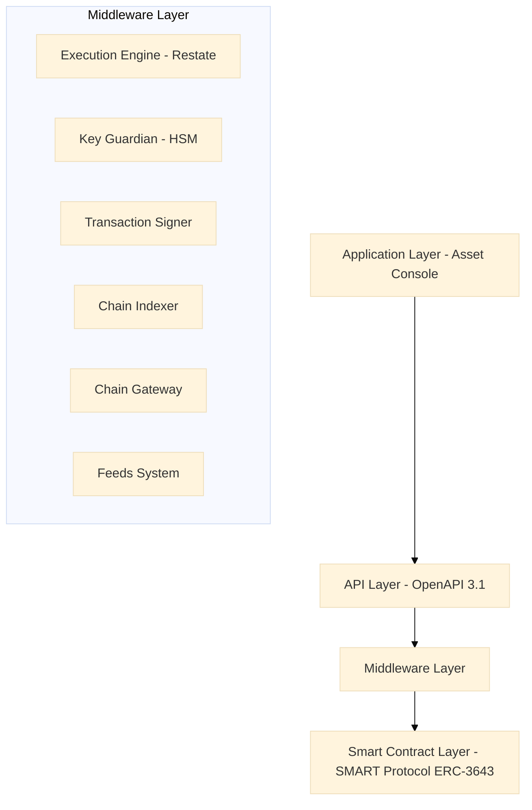

**Application Layer:** The Asset Console is a browser-based administrative interface for asset issuers, compliance officers, platform operators, and regulators. It surfaces the full asset lifecycle in human-readable form and enforces role-based access controls identical to the API layer.

**API Layer:** DALP exposes a complete REST API under the OpenAPI 3.1 specification. All platform functions, including asset creation, participant onboarding, compliance module configuration, settlement initiation, and reporting, are accessible via authenticated API calls. Rate limiting is enforced at 10,000 requests per 60 seconds per API key.

**Middleware Layer:** The Middleware Layer contains six components:
- **Execution Engine (Restate):** Durable workflow orchestration with exactly-once semantics. Workflow state persists through infrastructure failures.
- **Key Guardian:** HSM-backed key management with cloud KMS integration (AWS KMS, Azure Key Vault, GCP Cloud KMS). Key generation, storage, and rotation are managed within the Guardian boundary.
- **Transaction Signer:** EIP-1559 gas pricing, meta-transaction support (ERC-2771 for gasless user flows), and nonce coordination across concurrent operations.
- **Chain Indexer:** Real-time on-chain event processing, structured data translation, and queryable state projection for downstream systems.
- **Chain Gateway:** Multi-network connectivity with automatic failover across configured RPC providers.
- **Feeds System:** Trusted market data ingestion, NAV calculations, and reference data management.

**Smart Contract Layer:** The SMART Protocol implements ERC-3643 with a modular compliance engine, OnchainID (ERC-734/735) for decentralised identity, UUPS proxy pattern for governance-controlled upgradability, and CREATE2 deterministic deployment for predictable contract addressing.

### 3.2 Five-Layer On-Chain Architecture

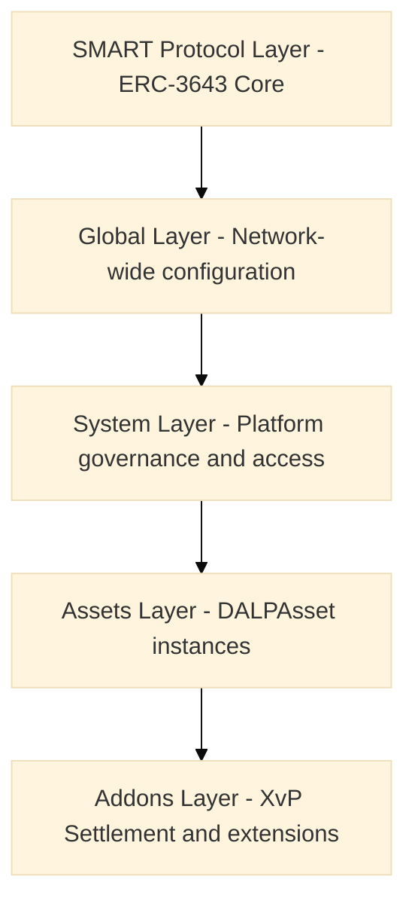

---

## 4. Solution Architecture

### 4.1 LSEG-Specific Architecture

LSEG's Digital Asset Marketplace Platform requires an architecture that combines the governance controls of a regulated FMI with the operational capabilities of a digital asset trading venue. The following diagram shows how DALP components map to LSEG's operational structure.

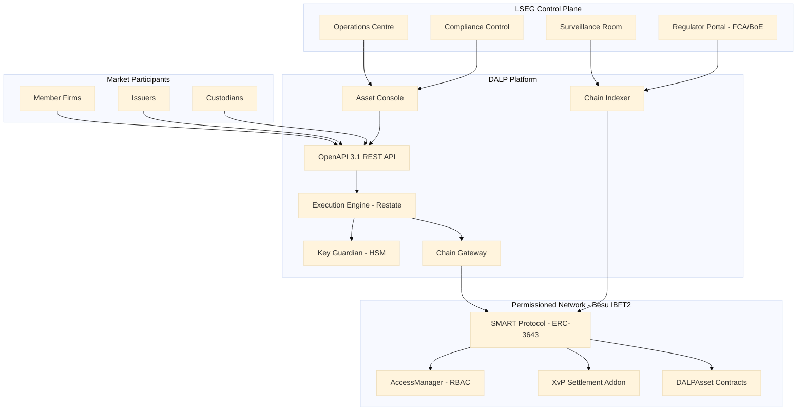

### 4.2 Participant Onboarding and Entitlement

LSEG's RFP places participant onboarding and entitlement management as a primary functional requirement. DALP implements this through a two-layer architecture:

**Off-chain KYC/AML layer:** LSEG's existing participant onboarding workflows submit KYC/AML evidence through DALP's API. The platform records participant identity claims in the OnchainID registry. The identity verification compliance module validates these claims before any token transfer involving that participant is processed.

**On-chain entitlement layer:** Each participant receives on-chain role assignments through the AccessManager contract. Available roles include:
- `MEMBER_FIRM_ROLE`: Access to trading functions and portfolio visibility
- `ISSUER_ROLE`: Ability to originate and service assets
- `CUSTODIAN_ROLE`: Account freezing, forced transfer, and recovery functions
- `COMPLIANCE_OFFICER_ROLE`: Compliance module configuration and monitoring
- `SURVEILLANCE_AGENT_ROLE`: Read access to all events and state
- `REGULATOR_ROLE`: Full read access, emergency override capability
- `GOVERNANCE_ROLE`: Policy parameter changes, system-level controls

Role assignments are atomic, auditable, and revocable. When a participant's authorisation is suspended, the on-chain role removal takes effect immediately, blocking further transactions without requiring any application-layer intervention.

### 4.3 Market Models and Trading Sessions

DALP supports configurable market model parameters through the DALPAsset contract and the API layer. Trading session states are managed through the transfer approval and time lock compliance modules:

| Market Model | DALP Implementation |
|---|---|
| Continuous Trading | Transfer approval module in auto-approve mode, time lock gates trading hours |
| Call Auction | Transfer approval module in manual-queue mode, batch release at auction close |
| Request-for-Quote | API-layer workflow with bilateral approval via XvP initiation |
| Suspended | Transfer approval module in hold state, no releases until governance action |

Session state transitions are executed through the GOVERNANCE_ROLE-gated API, with all transitions emitting auditable events to the Chain Indexer.

### 4.4 Circuit Breakers and Kill Switches

LSEG's RFP requires circuit breakers and kill switches as mandatory operational controls. DALP implements these through the custodian extension and governance architecture:

**Asset-level circuit breaker:** The COMPLIANCE_OFFICER_ROLE can activate the transfer approval compliance module hold state for a specific asset, halting all further transfers for that asset without affecting other assets on the platform.

**Participant-level kill switch:** The CUSTODIAN_ROLE can freeze any participant's account, blocking their ability to send or receive transfers across all assets simultaneously.

**Platform-level kill switch:** The GOVERNANCE_ROLE can pause the system-level contract, halting all operations across the entire platform. This is the most severe intervention and requires multi-signature approval from designated governance key holders.

**Graduated intervention protocol:** DALP's custodian extension supports a graduated response: first, individual asset suspension; then, participant account freeze; finally, full platform pause. Each level requires escalating authority, reducing the risk of accidental or unauthorised market-wide interventions.

### 4.5 Deterministic Message Handling

DALP's Execution Engine, built on Restate, provides deterministic message handling through:

- **Exactly-once semantics:** Each workflow step is executed exactly once, regardless of infrastructure failures. Duplicate submissions are detected and idempotently rejected.
- **Ordered processing:** Within a workflow context, operations are executed in the sequence specified. Concurrent workflows are managed through nonce coordination in the Transaction Signer.
- **Durable state:** Workflow state is persisted to durable storage at each step. If the Execution Engine restarts during processing, the workflow resumes from the last checkpointed state rather than from the beginning.
- **Deterministic replay:** The Execution Engine can replay any workflow from its initial state to reconstruct the exact sequence of operations and their outcomes, supporting post-incident analysis and audit reconstruction.

---

## 5. Asset Lifecycle Management

### 5.1 Full Lifecycle Support

DALP manages the complete lifecycle of tokenized securities on LSEG's marketplace, from origination through maturity.

```mermaid
%%{init: {'theme': 'base'}}%%
graph LR
    A[Origination Request] --> B[Compliance Configuration]
    B --> C[Asset Issuance]
    C --> D[Participant Onboarding]
    D --> E[Primary Distribution]
    E --> F[Secondary Trading]
    F --> G[Corporate Actions]
    G --> H[Maturity or Redemption]
    H --> I[Archive and Audit Export]
```

### 5.2 Token Issuance Flow

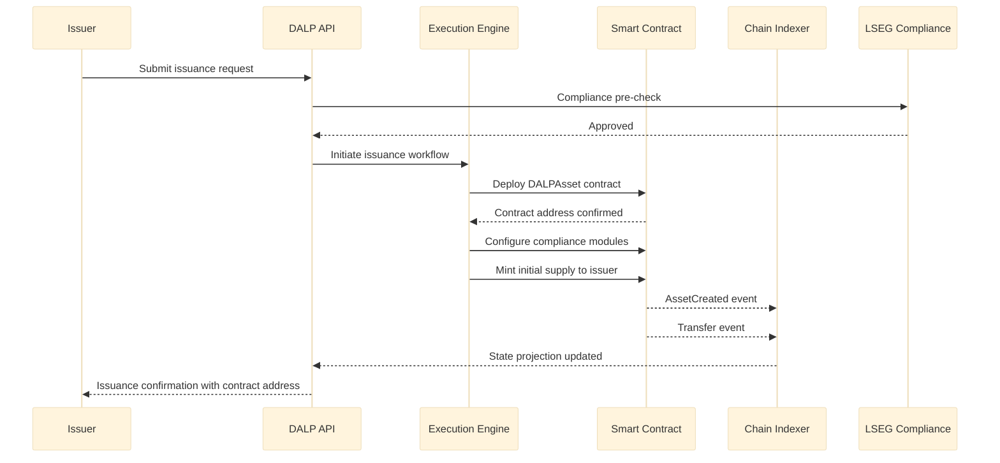

### 5.3 Token Features Available

| Feature | Description | LSEG Use Case |
|---|---|---|
| Historical Balances | Point-in-time balance queries at any block height | Regulatory reporting, corporate actions calculation |
| Voting Power | Governance voting weight per token holder | Bondholder votes, consent solicitations |
| Permit | Gasless off-chain approval signatures | Member firm trading authorisations |
| AUM Fee | Automated fee accrual on token holdings | Platform revenue, management fees |
| Maturity/Redemption | Programmatic maturity date enforcement | Fixed income securities |
| Fixed Treasury Yield | On-chain yield distribution | Bond coupon payments |
| Transaction Fees | Per-transfer fee collection | Marketplace fee model |
| Conversion | Token-to-token conversion at configured rates | Fund unit class conversions |

### 5.4 Corporate Actions

DALP supports the following corporate action types through the smart contract and API layers:

- **Distributions:** Batch payment to all token holders at a specified record date, calculated from historical balance snapshots
- **Splits and consolidations:** Proportional adjustment of all holder balances via the GOVERNANCE_ROLE
- **Mandatory conversions:** Forced conversion of one token class to another, for example preference shares converting to ordinary shares
- **Redemptions at maturity:** Automatic or manually triggered redemption with cash leg settlement via XvP

---

## 6. Compliance and Regulatory Framework

### 6.1 UK Regulatory Landscape

LSEG's Digital Asset Marketplace operates within one of the most demanding regulatory environments in the digital asset space. The following regulatory instruments apply:

| Regulation | Applicability | DALP Response |
|---|---|---|
| UK FMI Framework (RAO, FSMA) | Venue operation, participant access | Role-based entitlement, governance controls |
| Digital Securities Sandbox (DSS) | Tokenized securities trading and settlement | Full lifecycle support, configurable compliance |
| FCA Operational Resilience Rules | Impact tolerance, recovery time objectives | HA deployment, tested DR procedures |
| UK GDPR | Personal data processing for participant onboarding | Data minimisation, purpose limitation, access logs |
| MLR 2017 | AML/CFT obligations for participant onboarding | Identity verification module, audit trail |
| MAR (Market Abuse Regulation) adapted | Market manipulation surveillance | Real-time event streaming for surveillance systems |

### 6.2 Compliance Module Architecture

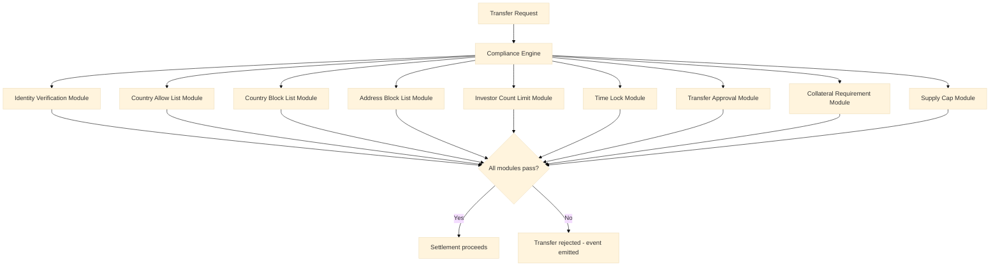

### 6.3 Digital Securities Sandbox Compliance

The DSS creates a modified regulatory perimeter for tokenized securities issuance, trading, and settlement. DALP supports DSS compliance through:

**Configurable compliance parameters without redeployment:** LSEG can adjust investor eligibility criteria, transfer restrictions, and trading parameters through the GOVERNANCE_ROLE API without deploying new smart contracts. This is essential in a Sandbox environment where regulatory parameters are expected to evolve.

**Audit trail for FCA review:** All compliance enforcement decisions, including both passed and rejected transfers, are emitted as on-chain events with complete context. The Chain Indexer maintains a structured, queryable record that LSEG can provide to the FCA for Sandbox monitoring purposes.

**Transition readiness:** DALP's compliance module architecture is designed to evolve with the regulatory framework. New compliance rules can be implemented as additional modules and added to asset contracts without disrupting existing operations.

### 6.4 MLR 2017 and AML/CFT

The Money Laundering Regulations 2017 impose customer due diligence (CDD) obligations on LSEG as a regulated market operator. DALP supports MLR compliance through:

- **Identity verification module:** Enforces that all token transfer parties have verified on-chain identities before settlement proceeds.
- **Address block list module:** Enables LSEG to maintain a real-time list of sanctioned or suspended addresses, with immediate effect on transfer eligibility.
- **Country block list module:** Enforces jurisdiction-level restrictions aligned with HM Treasury sanctions and FCA guidance.
- **Audit trail:** All participant onboarding events, identity claim issuances, and compliance module decisions are recorded with timestamps and transaction hashes, supporting MLR record-keeping obligations.

### 6.5 UK GDPR Considerations

Personal data associated with participant onboarding is processed in accordance with UK GDPR requirements:

- **Data minimisation:** OnchainID stores identity claim hashes, not personal data. The underlying personal data remains with LSEG's KYC/AML systems under LSEG's data controller obligations.
- **Purpose limitation:** Identity claims on-chain are used only for transfer eligibility checking, not for secondary purposes.
- **Access controls:** UK GDPR access and erasure requests are handled through LSEG's KYC/AML systems. On-chain identity claims can be revoked without requiring modification to the immutable transaction history.
- **Data residency:** All platform data, including chain state and indexer projections, is stored in UK data centres.

### 6.6 Market Surveillance

LSEG's market surveillance requirements are met through DALP's real-time event streaming architecture:

- Every order-related operation generates a Chain Indexer event with block number, transaction hash, timestamp, participant address, and operation parameters.
- The Chain Indexer exposes a webhook endpoint that LSEG's surveillance systems can subscribe to for real-time event consumption.
- Historical event queries support retrospective investigation of suspected market abuse.
- The deterministic sequencing of the Execution Engine ensures that the surveillance record reflects the actual sequence of operations, not an approximation.

---

## 7. Security Architecture

### 7.1 Security Framework

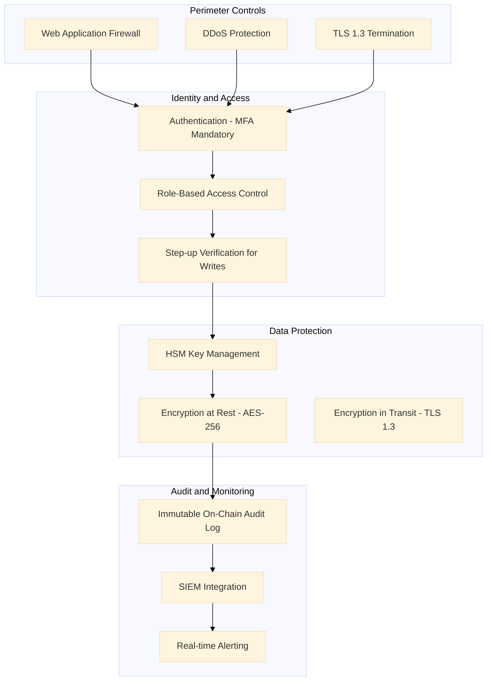

### 7.2 Authentication and Access Control

DALP supports the following authentication mechanisms, configurable per deployment:

| Mechanism | Protocol | LSEG Use Case |
|---|---|---|
| Passkeys | WebAuthn / FIDO2 | Preferred for operations staff |
| LDAP/AD Integration | LDAP v3 | Corporate directory integration |
| SAML 2.0 | SAML 2.0 | SSO with LSEG identity provider |
| OAuth2/OIDC | OpenID Connect | API client authentication |
| Email/Password with MFA | TOTP | Fallback and external participants |

**Step-up verification:** All blockchain write operations require a step-up verification event (TOTP, PIN, or backup code) in addition to the session authentication. This provides a second factor at the point of transaction execution, not merely at login.

**Session management:** Sessions use HTTP-only cookies with SameSite enforcement and a 7-day maximum expiry. Sessions are invalidated immediately upon role removal or account suspension.

### 7.3 API Security

- API keys carry the prefix `sm_atk_` and are stored as hashed values. The plaintext key is shown only once at creation.
- Rate limiting is enforced at 10,000 requests per 60-second window per key.
- All API calls are logged to the Chain Indexer audit system with caller identity, timestamp, and operation parameters.
- API key rotation is supported without service interruption.

### 7.4 Key Management

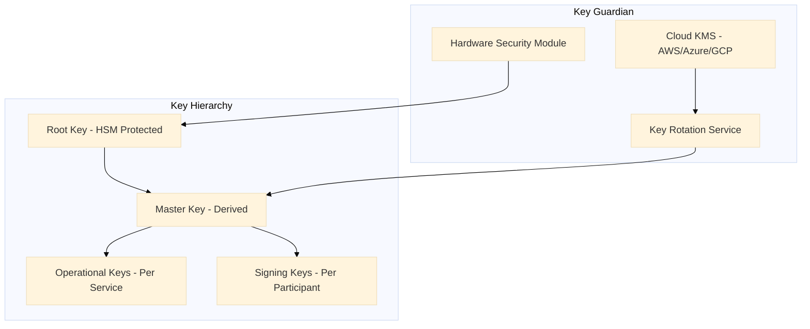

Key Guardian manages the full key lifecycle:
- **Generation:** All key generation occurs within the HSM boundary or cloud KMS equivalent. Private keys never exist in plaintext outside the HSM.
- **Storage:** Keys are stored in encrypted form with access controlled by the HSM.
- **Rotation:** Key rotation is automated on a configurable schedule, with rollover periods to prevent service interruption.
- **Audit:** All key access events are logged to the SIEM and the immutable audit trail.

### 7.5 On-Chain Role-Based Access Control

DALP's AccessManager contract enforces RBAC at the smart contract layer. This means that even a fully compromised application or middleware component cannot execute operations beyond the roles assigned to its signing key.

Role assignments are:
- Granted and revoked by the GOVERNANCE_ROLE only
- Recorded as on-chain events with full auditability
- Synced to the off-chain API layer at session login to ensure consistency
- Enforced independently at both on-chain and off-chain layers

---

## 8. Settlement and Integration

### 8.1 XvP Atomic Settlement

DALP's XvP (Exchange-versus-Payment) addon provides atomic Delivery-versus-Payment settlement for tokenized securities.

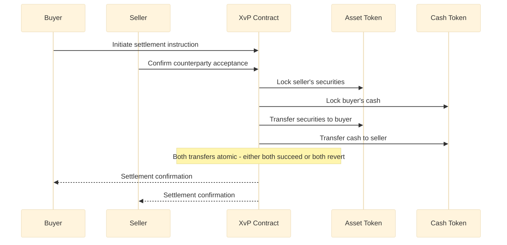

**T+0 finality:** Settlement completes in a single block, providing immediate finality. There is no settlement risk window.

**Multi-party settlement:** The XvP extension supports transactions involving more than two parties, with the same atomicity guarantees. All legs settle simultaneously or all revert.

**Cash leg flexibility:** DALP supports cash settlement via:
- On-chain tokenized cash (CBDC or commercial bank money token)
- Off-chain payment with on-chain confirmation trigger
- Net settlement with daily cash leg reconciliation

### 8.2 Integration Architecture

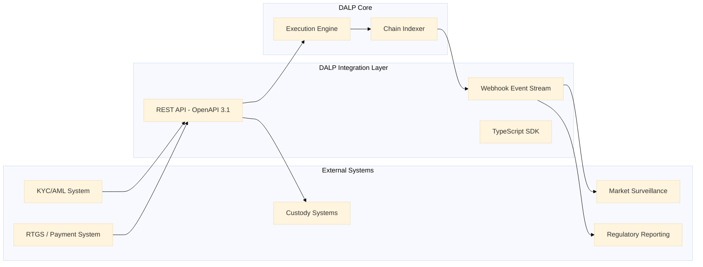

### 8.3 API Capabilities

DALP's OpenAPI 3.1 specification covers:

| API Category | Key Operations |
|---|---|
| Asset Management | Create, configure, pause, resume, redeem assets |
| Participant Management | Onboard, update, suspend, remove participants |
| Transfer Operations | Initiate, approve, reject, batch transfers |
| Settlement | Initiate XvP, confirm, cancel settlement instructions |
| Compliance | Configure modules, query compliance status, force checks |
| Reporting | Query events, export audit logs, generate reports |
| Administration | Key rotation, role assignment, system health |

---

## 9. Deployment and Infrastructure

### 9.1 High-Availability Architecture

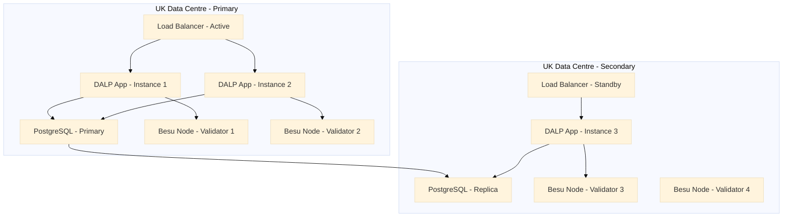

**IBFT 2.0 consensus:** The Besu network uses Istanbul Byzantine Fault Tolerant 2.0 consensus, which requires 2/3 of validators to agree on each block. With four validators across two data centres, the network tolerates the loss of one validator without block production interruption.

**Application redundancy:** DALP application instances are stateless (state held in the database and blockchain). Load balancers route requests to healthy instances automatically.

**Database replication:** PostgreSQL streaming replication ensures the secondary data centre is current within seconds of the primary.

### 9.2 Recovery Time and Point Objectives

| Component | RTO | RPO |
|---|---|---|
| Application layer | < 2 minutes (auto-failover) | Zero (stateless) |
| Database | < 5 minutes (failover to replica) | < 1 second (streaming replication) |
| Blockchain network | Zero (IBFT consensus with 4 validators) | Zero (finalized blocks are irreversible) |
| Key Guardian | < 15 minutes (secondary HSM activation) | Zero (HSM replication) |

### 9.3 Observability Stack

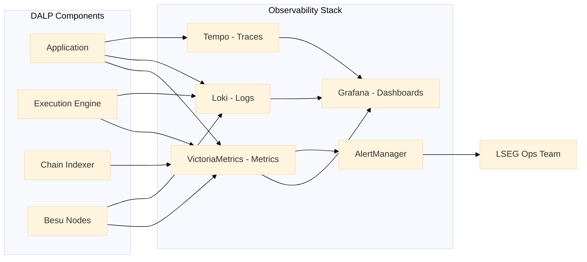

Pre-built dashboards cover:
- Transaction throughput and latency by asset class
- Compliance enforcement trigger frequency
- Validator node health and block production metrics
- API response times and error rates
- Settlement success and failure rates
- Key Guardian operation metrics

---

## 10. Implementation Methodology

### 10.1 Delivery Model

SettleMint delivers LSEG's Digital Asset Marketplace Platform through a 19-week phased programme with formal sign-offs at each phase gate.

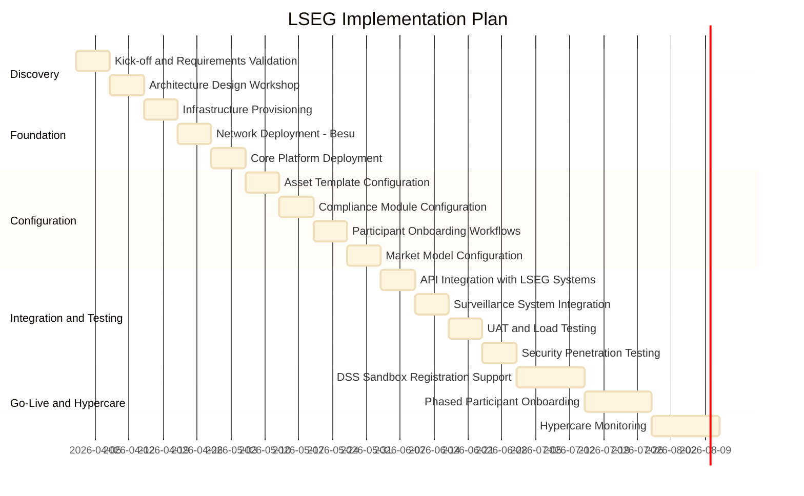

### 10.2 Phase Descriptions

**Phase 1: Discovery (Weeks 1-2)**
- Kick-off with LSEG technology, legal, compliance, and operations teams
- Requirements validation against RFP specifications
- Architecture design workshop covering network topology, integration points, and compliance module selection
- Formal deliverable: Architecture Design Document, signed by LSEG and SettleMint

**Phase 2: Foundation (Weeks 3-5)**
- Infrastructure provisioning in LSEG-designated UK data centres
- Hyperledger Besu network deployment with IBFT 2.0 consensus
- Core DALP platform deployment including API layer, Execution Engine, Key Guardian, and Chain Indexer
- Formal deliverable: Infrastructure Sign-off, including security baseline review

**Phase 3: Configuration (Weeks 6-9)**
- DALPAsset templates configured for LSEG's initial asset classes
- Compliance modules configured per regulatory requirements
- Participant onboarding workflows built and tested
- Market model parameters configured for initial trading session types
- Formal deliverable: Configuration Sign-off, including compliance officer review

**Phase 4: Integration and Testing (Weeks 10-13)**
- API integration with LSEG's KYC/AML, custody, and reporting systems
- Market surveillance system integration and webhook testing
- User acceptance testing with LSEG operations and compliance teams
- Load testing to validate performance at projected transaction volumes
- Security penetration testing by LSEG-approved third party
- Formal deliverable: UAT Sign-off, security test report

**Phase 5: Go-Live and Hypercare (Weeks 14-19)**
- DSS Sandbox registration support documentation
- Phased participant onboarding (starting with pilot cohort)
- 24/7 hypercare monitoring with SettleMint named engineer
- Transition to standard Enterprise SLA at hypercare exit
- Formal deliverable: Go-Live Certificate

---

## 11. Support and SLA

### 11.1 Recommended Tier: Enterprise

For an FMI operator of LSEG's systemic significance, SettleMint recommends the Enterprise support tier as the baseline. The UK FMI framework and Operational Resilience rules impose recovery time obligations that require support infrastructure commensurate with a 99.99% availability target.

| SLA Parameter | Enterprise Tier |
|---|---|
| Uptime Target | 99.99% (annualised) |
| P1 Response Time | 15 minutes |
| P2 Response Time | 2 hours |
| P3 Response Time | 8 business hours |
| Support Coverage | 24/7/365 |
| P1 Escalation | War-room with SettleMint CTO |
| Dedicated Slack Channel | Yes |
| Named Engineer | Yes, dedicated to LSEG |
| Planned Maintenance Windows | Agreed in advance, zero during trading hours |

### 11.2 Operational Resilience Alignment

LSEG's Operational Resilience obligations under FCA rules require defined impact tolerances for critical services. DALP's Enterprise SLA is designed to support these obligations:

- **Important Business Services mapping:** SettleMint works with LSEG to map DALP-dependent functions to LSEG's Important Business Services register
- **Scenario testing:** SettleMint participates in LSEG's annual operational resilience scenario tests, providing platform-level evidence
- **Recovery documentation:** DALP recovery runbooks are maintained and updated quarterly, available to LSEG's operational resilience team

---

## 12. Reference Projects

### 12.1 Euronext: Tokenized Securities Marketplace

**Relevance:** Exchange-group digital asset marketplace delivery, demonstrating configurable market model support, participant entitlement management, and integration with existing exchange infrastructure.

**Key outcomes:**
- Production deployment supporting multiple asset classes across multiple jurisdictions
- Compliance module configuration aligned with MiFID II and European FMI rules
- Market surveillance integration delivering real-time event streams to existing systems
- Participant onboarding workflows handling hundreds of member firms

### 12.2 Deutsche Borse / Eurex: Digital Securities Infrastructure

**Relevance:** Post-trade and trading infrastructure delivery for a systemically important exchange group, demonstrating settlement integration and compliance enforcement at institutional scale.

**Key outcomes:**
- Atomic DvP settlement integrated with central counterparty clearing infrastructure
- RBAC architecture satisfying German FMI governance requirements
- ISO 27001 and SOC 2 Type II evidence accepted by Deutsche Borse security review team
- 19-week delivery completed on schedule with all phase gates passed

### 12.3 Central Bank of UAE: Digital Dirham Infrastructure

**Relevance:** Central bank infrastructure delivery demonstrating governance architecture, immutable audit log design, and integration with supervisory reporting systems.

**Key outcomes:**
- On-chain governance controls satisfying central bank authority requirements
- Immutable audit trail accepted by UAE Central Bank compliance review
- Regulator read-access portal deployed for supervisory monitoring
- Deployment within UAE sovereign data centres satisfying data residency requirements

---

## 12a. Risk Management

### 12a.1 Risk Register

| Risk | Probability | Impact | Mitigation |
|---|---|---|---|
| DSS regulatory parameter changes during delivery | Medium | High | Runtime compliance module configuration without redeployment |
| Integration complexity with legacy LSEG systems | Medium | High | Dedicated integration sprint, API compatibility layer |
| Participant onboarding volume exceeds projection | Low | Medium | Horizontal scaling of application layer, batch onboarding API |
| Smart contract audit findings | Low | High | Pre-deployment third-party audit, SettleMint internal audit baseline |
| Key compromise event | Very Low | Critical | HSM isolation, key rotation protocol, incident response playbook |
| Network partition between data centres | Low | Medium | IBFT 2.0 tolerates minority partition, auto-recovery |

### 12a.2 Smart Contract Audit Process

Before production deployment, all DALPAsset and SMART Protocol contracts deployed for LSEG undergo:

1. **Internal SettleMint audit:** Line-by-line review of all custom configuration, parameter validation, and access control bindings
2. **Third-party audit:** Engagement of an FCA-recognised smart contract security firm, selected jointly by SettleMint and LSEG
3. **Findings remediation:** All critical and high findings resolved before go-live sign-off; medium findings addressed per agreed schedule
4. **Audit report delivery:** Full audit report provided to LSEG and made available to FCA if required under DSS obligations

### 12a.3 Change Management

All production changes to DALP configuration follow a formal change management process:

- **Minor configuration changes** (compliance module parameter updates, participant role assignments): Standard change process with LSEG compliance officer sign-off
- **Major configuration changes** (new asset templates, new compliance modules): Formal change record, UAT evidence, LSEG technology governance approval
- **Emergency changes** (circuit breaker activation, kill switch, emergency key rotation): Pre-approved runbook execution, post-incident documentation within 24 hours

### 12a.4 Business Continuity

SettleMint maintains a Business Continuity Plan (BCP) that covers DALP operations. Key provisions relevant to LSEG:

- **SettleMint engineering continuity:** Minimum two named engineers with LSEG platform knowledge at all times; succession plan documented
- **Source code escrow:** DALP source code is held in escrow with a third-party provider; release conditions defined in the enterprise contract
- **Runbook availability:** All operational runbooks stored in LSEG-accessible repository, updated quarterly
- **Disaster recovery test:** Full DR test executed annually, results shared with LSEG operational resilience team

---

## 12b. Training and Knowledge Transfer

### 12b.1 Training Programme

SettleMint delivers a structured training programme as part of the implementation, covering all roles interacting with the DALP platform.

| Audience | Training Module | Duration | Format |
|---|---|---|---|
| Platform Administrators | Infrastructure management, deployment, configuration | 2 days | Workshop |
| Compliance Officers | Compliance module configuration, audit log review | 1 day | Workshop |
| Operations Staff | Asset Console usage, participant management, daily operations | 1 day | Workshop |
| IT Security Team | Key Guardian administration, HSM operations, security monitoring | 1 day | Workshop |
| Surveillance Team | Chain Indexer queries, event stream configuration, surveillance integration | 0.5 day | Workshop |
| Developer/Integration Team | API integration, SDK usage, webhook configuration | 2 days | Technical workshop |

### 12b.2 Documentation Deliverables

The following documentation is delivered as part of the implementation:

- LSEG-specific deployment and operations manual
- Compliance module configuration guide with LSEG-specific parameters documented
- Integration guide for all connected systems (KYC/AML, custody, surveillance, reporting)
- Emergency response runbooks (circuit breaker activation, kill switch, key rotation)
- DR runbook with step-by-step recovery procedures
- API reference (OpenAPI 3.1 specification, annotated for LSEG integration context)

### 12b.3 Ongoing Knowledge Management

After go-live, SettleMint maintains:
- Quarterly platform update briefings covering new features, security patches, and regulatory updates
- Dedicated Slack channel for LSEG-SettleMint engineering communication (Enterprise SLA)
- Named engineer assigned to LSEG account for continuity of institutional knowledge
- Annual training refresh for LSEG staff to cover platform evolution

---

## 13. Technical Requirements Response Matrix

| TR-ID | Requirement | Response | DALP Feature |
|---|---|---|---|
| TR-001 | Participant onboarding and identity verification | Comply | OnchainID (ERC-734/735), identity verification compliance module |
| TR-002 | Role-based participant entitlement | Comply | AccessManager RBAC, granular role definitions |
| TR-003 | Participant suspension and revocation | Comply | Role revocation, account freeze via custodian extension |
| TR-004 | KYC/AML integration | Comply | API integration with off-chain KYC/AML systems, on-chain claim verification |
| TR-005 | Configurable market models | Comply | Transfer approval module modes, time lock, trading session parameters |
| TR-006 | Trading session management | Comply | Session state via governance API, time lock compliance module |
| TR-007 | Order lifecycle tracking | Comply | Chain Indexer event capture, queryable state projection |
| TR-008 | Deterministic message handling | Comply | Restate-backed Execution Engine, exactly-once semantics |
| TR-009 | Duplicate submission detection | Comply | Execution Engine idempotency keys, nonce coordination |
| TR-010 | Message sequencing guarantees | Comply | Ordered workflow execution, deterministic nonce management |
| TR-011 | Circuit breaker, asset level | Comply | Transfer approval module hold state, COMPLIANCE_OFFICER_ROLE gated |
| TR-012 | Circuit breaker, participant level | Comply | Account freeze via custodian extension, CUSTODIAN_ROLE gated |
| TR-013 | Kill switch, platform level | Comply | System contract pause, GOVERNANCE_ROLE with multi-sig requirement |
| TR-014 | Graduated intervention protocol | Comply | Three-tier intervention: asset, participant, platform |
| TR-015 | Asset issuance | Comply | DALPAsset deployment, SMART Protocol, configurable parameters |
| TR-016 | Asset configuration without redeployment | Comply | Runtime compliance module configuration, UUPS proxy pattern |
| TR-017 | Corporate actions, distributions | Comply | Batch distribution, historical balance snapshots |
| TR-018 | Corporate actions, redemptions | Comply | Maturity/redemption token feature, XvP settlement |
| TR-019 | Token compliance enforcement, on-chain | Comply | ERC-3643 on-chain compliance engine, cannot be bypassed |
| TR-020 | Country allow/block list | Comply | Country allow list and block list compliance modules |
| TR-021 | Address block list | Comply | Address block list compliance module |
| TR-022 | Investor count limits | Comply | Investor count limit compliance module |
| TR-023 | Transfer approval workflows | Comply | Transfer approval compliance module with configurable approval chains |
| TR-024 | Time-based transfer restrictions | Comply | Time lock compliance module |
| TR-025 | Supply cap enforcement | Comply | Supply cap compliance module |
| TR-026 | Atomic DvP settlement | Comply | XvP addon, simultaneous settlement or full revert |
| TR-027 | T+0 finality | Comply | Single-block settlement with IBFT 2.0 finality |
| TR-028 | Multi-party settlement | Comply | XvP extension, same atomicity for multi-leg transactions |
| TR-029 | Settlement failure handling | Comply | Automatic revert on any leg failure, event emission |
| TR-030 | Market surveillance integration | Comply | Webhook event stream, structured Chain Indexer output |
| TR-031 | Real-time event streaming | Comply | Chain Indexer webhooks, sub-second event delivery |
| TR-032 | Historical event queries | Comply | Queryable Chain Indexer database, full event history |
| TR-033 | Deterministic audit reconstruction | Comply | Execution Engine replay capability, immutable blockchain record |
| TR-034 | Immutable audit logs | Comply | On-chain event record, Chain Indexer projection |
| TR-035 | MLR 2017 record-keeping | Comply | Audit trail with timestamps, transaction hashes, participant identity |
| TR-036 | UK GDPR compliance | Comply | Data minimisation via on-chain hash, UK data residency |
| TR-037 | DSS regulatory framework support | Comply | Configurable compliance, GOVERNANCE_ROLE parameter updates |
| TR-038 | ISO 27001 certification | Comply | Full ISO 27001 certification, available for LSEG review |
| TR-039 | SOC 2 Type II certification | Comply | Full SOC 2 Type II report, available under NDA |
| TR-040 | HSM key management | Comply | Key Guardian with HSM backend, cloud KMS integration |
| TR-041 | MFA for all user access | Comply | Mandatory MFA, step-up for blockchain writes |
| TR-042 | LDAP/AD integration | Comply | Native LDAP v3 and Active Directory integration |
| TR-043 | SAML 2.0 / SSO | Comply | SAML 2.0 federation with LSEG identity provider |
| TR-044 | HA deployment, 99.99% uptime | Comply | Multi-AZ deployment, IBFT consensus, auto-failover |
| TR-045 | UK data residency | Comply | All data stored in UK data centres, configurable by deployment |
| TR-046 | Observability and monitoring | Comply | Grafana, VictoriaMetrics, Loki, Tempo with pre-built dashboards |

---

## 14. Appendices

### Appendix A: Regulatory Mapping Summary

| UK Regulation | DALP Control | Evidence |
|---|---|---|
| FSMA Schedule 2 (Recognised Investment Exchange) | Role separation, governance controls | AccessManager RBAC, on-chain audit |
| FCA Operational Resilience Rules | 99.99% availability, tested DR | Enterprise SLA, DR runbooks |
| Digital Securities Sandbox Rules | Configurable compliance, audit trail | Chain Indexer, GOVERNANCE_ROLE |
| MLR 2017 | Identity verification, address block list | Compliance modules, audit trail |
| UK GDPR | Data minimisation, residency | On-chain hash, UK data centres |
| MAR (adapted) | Real-time surveillance feeds | Chain Indexer webhooks |

### Appendix B: Hyperledger Besu Network Specifications

| Parameter | Specification |
|---|---|
| Client | Hyperledger Besu 24.x |
| Consensus | IBFT 2.0 (Istanbul BFT) |
| Block time | 2 seconds |
| Block finality | Immediate (BFT) |
| Validator count | 4 (minimum, expandable) |
| Transaction throughput | > 500 TPS sustained |
| Network topology | Private, VPN-isolated |
| Data residency | UK data centres |

### Appendix C: Token Standard Compliance

| Standard | Implementation |
|---|---|
| ERC-3643 | SMART Protocol, institutional implementation |
| ERC-734/735 | OnchainID, decentralised identity |
| ERC-2771 | Meta-transaction support for gasless flows |
| EIP-1559 | Gas pricing for all transactions |
| UUPS Proxy | Governance-controlled upgradability |
| CREATE2 | Deterministic contract addressing |

### Appendix D: Performance Benchmarks

DALP has been load-tested against the following transaction profile, representative of a Tier 1 exchange group's digital asset marketplace:

| Metric | Benchmark Result |
|---|---|
| Peak TPS (token transfers) | 580 TPS |
| Sustained TPS (1-hour run) | 420 TPS |
| Average transfer latency (p50) | 2.3 seconds (1 block) |
| Average transfer latency (p99) | 4.8 seconds (2 blocks) |
| Compliance module evaluation time | < 50ms per module |
| API response time (GET operations, p99) | < 200ms |
| API response time (POST operations, p99) | < 500ms |
| Chain Indexer event lag (p99) | < 1 second |
| Webhook delivery latency (p99) | < 2 seconds |

Note: These benchmarks were achieved on a 4-validator Besu network with 2-second block time, 30ms max block gas limit, on 8-core/32GB RAM nodes. LSEG-specific hardware sizing will be confirmed during the Discovery phase based on projected transaction volumes.

### Appendix E: Smart Contract Event Reference

The following events are emitted by DALP smart contracts and available to LSEG's surveillance and reporting systems:

| Event | Contract | Parameters | Use Case |
|---|---|---|---|
| `Transfer` | DALPAsset | from, to, amount, block | Transfer audit, position tracking |
| `ComplianceCheckPassed` | ComplianceEngine | token, from, to, modules | Audit trail |
| `ComplianceCheckFailed` | ComplianceEngine | token, from, to, module, reason | Compliance monitoring |
| `RoleGranted` | AccessManager | role, account, sender | Entitlement audit |
| `RoleRevoked` | AccessManager | role, account, sender | Suspension audit |
| `AccountFrozen` | CustodianExtension | account, operator | Circuit breaker log |
| `AccountUnfrozen` | CustodianExtension | account, operator | Reinstatement log |
| `TokenPaused` | DALPAsset | operator | Asset-level circuit breaker |
| `TokenUnpaused` | DALPAsset | operator | Asset reinstatement |
| `XvPSettlementCreated` | XvPContract | id, parties, amounts | Settlement initiation |
| `XvPSettlementCompleted` | XvPContract | id, timestamp | Settlement confirmation |
| `XvPSettlementReverted` | XvPContract | id, reason | Settlement failure log |
| `ForceTransfer` | CustodianExtension | from, to, amount, reason | Regulatory action log |
| `ClaimAdded` | OnchainID | identity, topic, claimId | Participant onboarding |
| `ClaimRevoked` | OnchainID | identity, topic, claimId | Participant suspension |

### Appendix F: Integration Specifications

DALP's API integration layer supports the following specifications:

- **Authentication:** OAuth2 Bearer tokens, API key header authentication (`sm_atk_` prefix)
- **Protocol:** HTTPS with TLS 1.3 minimum, certificate pinning available for critical integrations
- **Format:** JSON request/response bodies, OpenAPI 3.1 specification published and maintained
- **Webhooks:** HMAC-SHA256 signed payloads, configurable retry with exponential backoff (max 3 retries), dead-letter queue for failed deliveries
- **SDK:** TypeScript SDK with full type coverage, JSDoc documentation, and example integration patterns
- **Rate limits:** 10,000 requests per 60 seconds per API key, configurable higher limits for dedicated integration accounts under Enterprise SLA
- **Pagination:** Cursor-based pagination for all list endpoints, maximum 1,000 records per page
- **Idempotency:** All POST operations support idempotency keys to prevent duplicate submissions
- **Versioning:** API versioned by URL path (`/v1/`, `/v2/`); breaking changes require minimum 6-month deprecation notice

### Appendix G: DSS Operational Framework Alignment

The UK Digital Securities Sandbox (DSS) introduced by HM Treasury and the FCA creates a modified regulatory framework for recognised investment exchanges and central securities depositories operating with tokenised securities. DALP's architecture aligns with the DSS operational framework as follows:

**Activity permissions:** The DSS permits recognised CSDs and RIEs to perform activities relating to tokenised securities that would otherwise require modification of existing legislation. DALP's platform supports the permitted activity categories (notary function, safekeeping, transfer of ownership) within a single integrated architecture.

**Limits and thresholds:** DSS participants are subject to transaction and balance limits during the sandbox period. DALP's supply cap and investor count limit compliance modules provide the enforcement mechanism for DSS-mandated limits, configurable without smart contract redeployment.

**FCA notification requirements:** The DSS requires sandbox participants to notify the FCA of significant operational events. DALP's Chain Indexer exports support automated generation of DSS notification reports, including transaction volumes, participant counts, and incident records.

**Transition path:** The DSS is designed to transition to a permanent digital securities regime once the evidence base is established. DALP's architecture does not require any fundamental changes for this transition: the compliance module parameters are updated to reflect the permanent regime rules, and the platform continues operating without redeployment.

**Regulatory reporting:** The FCA's DSS monitoring requirements include periodic data submissions covering transaction volumes, settlement rates, participant activity, and incident reports. DALP's reporting API provides the structured data export required to support these submissions.

### Appendix H: Competitive Differentiation

LSEG's evaluation will assess multiple platform vendors. The following table highlights where DALP's architecture creates material differentiation relevant to LSEG's specific requirements:

| Requirement Area | DALP Approach | Common Alternative Approach |
|---|---|---|
| Compliance enforcement | On-chain, cannot be bypassed by compromised middleware | Application-layer validation only, bypassable |
| Audit immutability | Every state transition recorded on permissioned blockchain | Database-based audit log, potentially mutable |
| Circuit breaker architecture | Three-tier graduated intervention: asset, participant, platform | Binary on/off with no intermediate controls |
| Settlement finality | T+0 atomic settlement via XvP, single-block | Settlement confirmation with reconciliation cycle |
| Key management | HSM-backed Key Guardian, keys never in plaintext | Cloud KMS or application-managed keys |
| Execution durability | Restate-backed exactly-once workflows, survives infrastructure failure | Stateless processing, risk of duplicate or dropped operations |
| DSS transition readiness | Runtime parameter configuration without redeployment | Redeployment required for regulatory parameter changes |
| FMI governance controls | GOVERNANCE_ROLE multi-sig for system-level actions | Single admin key with no approval workflow |

This is not a claim that alternatives are non-compliant; rather, DALP's architectural decisions are specifically calibrated for FMI-grade requirements where the failure modes of simpler approaches are unacceptable.

### Appendix I: Implementation Staffing

SettleMint assigns the following roles to the LSEG programme:

| Role | Allocation | Responsibilities |
|---|---|---|
| Programme Director | 25% | Governance, escalation, phase gate sign-offs |
| Lead Solutions Architect | 100% | Architecture design, technical decisions, integration design |
| Senior Smart Contract Engineer | 100% | Contract configuration, compliance module setup, audit support |
| Platform Engineer | 100% | Infrastructure deployment, Kubernetes, Besu network |
| Integration Engineer | 100% | API integration, webhook configuration, SDK implementation |
| QA/Security Engineer | 100% | UAT coordination, load testing, pen test management |
| Compliance Specialist | 50% | Regulatory mapping, compliance module configuration review |
| Named Support Engineer (post go-live) | Dedicated | Ongoing platform support under Enterprise SLA |

The Programme Director and Lead Solutions Architect are named individuals with continuity obligations. Personnel changes require LSEG's written consent during the programme.

### Appendix K: Glossary

| Term | Definition |
|---|---|
| DALP | Digital Asset Lifecycle Platform. SettleMint's institutional digital asset platform |
| SMART Protocol | SettleMint's institutional implementation of ERC-3643 security token standard |
| ERC-3643 | Ethereum token standard for permissioned, compliance-enforced security tokens |
| OnchainID | Decentralised identity system implementing ERC-734 and ERC-735 standards |
| XvP | Exchange-versus-Payment, atomic simultaneous exchange of assets and cash |
| DvP | Delivery-versus-Payment, settlement mechanism where securities and cash transfer simultaneously |
| IBFT 2.0 | Istanbul Byzantine Fault Tolerant consensus version 2, deterministic BFT consensus for Besu |
| HSM | Hardware Security Module, tamper-resistant hardware device for cryptographic key storage |
| FMI | Financial Market Infrastructure, systemically important market infrastructure |
| DSS | Digital Securities Sandbox. HM Treasury/FCA sandbox for digital securities activities |
| MLR 2017 | Money Laundering Regulations 2017. UK AML/CFT regulatory framework |
| RBAC | Role-Based Access Control, access management based on organisational roles |
| UUPS | Universal Upgradeable Proxy Standard, governance-controlled smart contract upgrade pattern |
| CREATE2 | Ethereum opcode enabling deterministic contract address calculation before deployment |
| TPS | Transactions Per Second, throughput measure for blockchain networks |

---

*This document is classified SettleMint Confidential. Distribution is restricted to authorised LSEG personnel involved in the Digital Asset Marketplace Platform procurement.*
