# Technical Proposal: Digital Asset Exchange Infrastructure Upgrade

**Prepared for:** SIX Digital Exchange (SDX)
**Document Title:** Technical Proposal. Digital Asset Exchange Infrastructure Upgrade
**RFP Reference:** SDX-RFP-DIGITAL-ASSET-EXCHANGE-INFRASTRUCTURE-UPGRADE-202603
**Submission Date:** March 2026
**Version:** 1.1 (Post Review 1)
**Classification:** SettleMint Confidential

**Prepared by:** SettleMint NV
**Primary Contact:** Digital Assets Programme. SettleMint Enterprise

---

## Table of Contents

1. Executive Summary
2. SettleMint Company Profile
3. DALP Platform Overview
4. Solution Architecture
5. Asset Lifecycle Management
6. Compliance and Regulatory Framework
7. Security Architecture
8. Settlement and Integration
9. Deployment and Infrastructure
10. Implementation Methodology
11. Support and SLA
12. Reference Projects
13. Technical Requirements Response Matrix
14. Appendices

---

## 1. Executive Summary

### 1.1 Context and Strategic Position

SIX Digital Exchange occupies a singular position in the global digital asset landscape. As the world's first regulated digital asset exchange and central securities depository operating under Swiss law, SDX has already navigated the foundational regulatory and governance challenges that other venues are only beginning to encounter. The infrastructure upgrade programme addressed by this procurement is therefore not a question of building from scratch; it is a question of whether the selected platform can match the operational maturity, regulatory precision, and governance discipline that SDX's existing DLT Act (DLT-Gesetz) authorisation demands.

Switzerland's legislative framework for distributed ledger technology, the Federal Act on the Adaptation of Federal Law to Developments in Distributed Ledger Technology (DLT Act), enacted in 2021, introduced the DLT trading venue category as a new licence type under the Financial Market Infrastructure Act (FMIA). FINMA regulates SDX as a DLT trading venue and CSD operating under this framework. The Swiss Data Protection Act (nDSG, in force since September 2023), Anti-Money Laundering Act (AMLA), and the CPMI-IOSCO Principles for Financial Market Infrastructures (PFMI) impose further obligations that permeate every aspect of SDX's operational model.

The CPMI-IOSCO PFMI principles are particularly relevant: they require a financial market infrastructure to maintain sound risk management frameworks, legal certainty over settlement finality, clear default management procedures, and governance arrangements that ensure accountability. SDX's infrastructure upgrade must therefore be evaluated not only against functional requirements but against the risk framework that PFMI compliance imposes.

### 1.2 Why This Upgrade is Strategically Necessary

SDX's existing infrastructure delivered the foundational capability: a regulated, operating DLT-based exchange and CSD in Switzerland. The upgrade programme reflects the next phase of that journey, as the initial architecture encounters the scale, asset class diversity, and participant volume that SDX's commercial success requires.

Digital asset exchanges face a distinct challenge at the point of growth: the initial infrastructure, often built with specific asset classes and participant cohorts in mind, must be extended without disrupting the operational continuity of existing participants and assets. This is not simply a technology upgrade; it is a live migration problem under regulatory supervision.

The Swiss regulatory context adds further complexity. FINMA's supervisory model for DLT trading venues includes ongoing assessment of technical resilience, governance controls, and risk management under PFMI principles. Any infrastructure change at SDX is subject to FINMA notification obligations and must be managed within the change control discipline that FINMA supervision requires.

The FMIA places settlement finality as a non-negotiable property of a regulated CSD: once a settlement instruction achieves finality, it cannot be reversed except through a court order. The infrastructure upgrade must preserve this property without interruption, and the selected platform must demonstrate that its settlement architecture provides finality that meets FMIA Article 51 standards.

SDX's requirements also reflect the evolution of the Swiss capital market: issuers want to offer tokenized bonds, funds, and structured products across multiple investor categories. Each asset class carries different compliance configurations, different eligibility criteria, and different corporate action structures. The upgraded infrastructure must support this diversity while maintaining the governance coherence that a single regulated venue requires.

### 1.3 Proposed Response

SettleMint proposes the Digital Asset Lifecycle Platform (DALP) as the infrastructure layer for SDX's exchange upgrade. DALP's architecture is designed specifically for the requirements of regulated FMI operators: on-chain compliance enforcement, durable execution, HSM-backed key management, and atomic settlement are not optional modules but foundational properties of the platform.

**Deployment model:** Private permissioned EVM network using Hyperledger Besu with IBFT 2.0 consensus, deployed within SDX-controlled infrastructure in Switzerland. Swiss data residency is enforced at all layers. The deployment supports integration with SDX's existing Hyperledger-based network components where applicable, reducing migration disruption for participants.

**DLT Act alignment:** DALP's governance architecture directly supports the DLT Act's requirement that a DLT trading venue maintain clear rules on settlement finality, participant access, and default management. The on-chain AccessManager contract provides the technical implementation of SDX's rulebook on participant entitlement, and the XvP settlement addon provides the atomic finality mechanism required by FMIA Article 51.

**FMIA compliance:** DALP's compliance module suite covers all FMIA-required eligibility and transfer restriction controls. The identity verification module enforces participant eligibility at the transaction level. The transfer approval module supports SDX's pre-settlement compliance workflow. All compliance decisions are emitted as auditable events.

**FINMA circular alignment:** FINMA's circulars on operational risk, outsourcing, and cybersecurity impose requirements that DALP's architecture satisfies: ISO 27001 certification, SOC 2 Type II report, HSM-backed key management, and a formal incident response process.

**CPMI-IOSCO PFMI:** DALP's design addresses the PFMI principles directly:
- **Legal certainty (PFMI 1):** Smart contract settlement is final on-chain; DALP's event structure supports Swiss private law notarial function
- **Governance (PFMI 2):** GOVERNANCE_ROLE architecture provides clear accountability
- **Risk management (PFMI 3-8):** Credit, liquidity, settlement, operational, and custody risks are addressed through atomic XvP, HSM key management, HA deployment, and immutable audit
- **Efficiency (PFMI 21-24):** T+0 DvP, transparent fee structure, accessible API

**Swiss Data Protection Act (nDSG):** All personal data processing complies with nDSG requirements. Data residency in Switzerland satisfies nDSG's data localisation expectations for systemically important FMIs.

### 1.4 Infrastructure Continuity Approach

SDX's upgrade programme must maintain operational continuity for existing participants and assets. SettleMint's approach to this challenge is explicit:

- **Parallel operation phase:** DALP is deployed alongside existing SDX infrastructure. Existing assets continue to operate on the current infrastructure while new assets are issued natively on DALP.
- **Gradual migration:** Existing assets can be migrated to DALP through a token-for-token exchange mechanism, with participant consent and regulatory notification.
- **API compatibility layer:** DALP's API is configured to expose endpoints compatible with SDX's existing participant integration patterns, minimising participant-side migration cost.
- **Zero participant disruption target:** The migration design aims for zero forced participant changes during the transition period; participants adopt new APIs on their own schedule within an agreed migration window.

### 1.4a Infrastructure Continuity: Technical Detail

The migration from SDX's current infrastructure to DALP requires specific technical mechanisms to prevent disruption. SettleMint's approach involves three distinct phases:

**Phase A - Parallel operation (Weeks 14-16):** DALP is live in production for new asset issuances only. Existing assets continue on the current infrastructure. Both systems operate simultaneously. Participants connect to DALP for new assets while maintaining existing connections for current assets. This phase validates the new infrastructure with real production traffic before any migration begins.

**Phase B - Voluntary migration window (Weeks 17-24, post go-live):** SDX opens the migration pathway for existing assets. Issuers can elect to migrate existing securities to DALP through the token-for-token mechanism. Migration requires issuer consent, SDX approval, and FINMA notification if the asset is systemically significant. Participants maintain API access to both platforms during this window.

**Phase C - Full migration (Month 6+ post go-live):** After the voluntary window closes, any remaining assets are migrated under the agreed rulebook process. By this point, the DALP platform has established a production track record and the migration process is well-understood by all parties.

This approach avoids the risk of a hard cutover that could disrupt existing participants or trigger FINMA notification requirements for a disruptive migration event.

### 1.4b Why DALP for Swiss DLT Infrastructure

DALP's design decisions are specifically relevant to SDX's Swiss regulatory context:

**On-chain compliance as the primary enforcement layer:** FINMA's supervisory model for DLT trading venues requires that compliance controls be embedded in the technology, not applied as process overlays. ERC-3643's on-chain compliance engine satisfies this requirement by making compliance enforcement a property of the smart contract, not the application layer.

**IBFT 2.0 and FMIA Article 51:** The FMIA settlement finality requirement demands that finality be unambiguous. IBFT 2.0's immediate, deterministic finality is categorically different from probabilistic finality systems where finality is estimated rather than guaranteed. For Swiss law purposes, this distinction is material.

**DLT Act register requirements:** The DLT Act requires that a DLT rights register be resistant to unauthorised modification. DALP's permissioned Besu network, with validator control held by SDX, satisfies this requirement. No external party can modify the register without SDX's validator participation.

**Multi-signature governance for systemic controls:** The DLT Act and FMIA require that a DLT trading venue's governance arrangements prevent unilateral action by a single party for system-level changes. DALP's GOVERNANCE_ROLE multi-signature requirement implements this at the technical level.

### 1.5 Reference Fit Snapshot

Three reference engagements demonstrate direct relevance to SDX's evaluation:

- **Euronext (Tokenized Securities Marketplace):** Exchange-group delivery demonstrating configurable market model support, participant entitlement management, and real-time compliance enforcement for a multi-jurisdiction regulated venue.
- **Deutsche Borse / Eurex (Digital Securities Infrastructure):** Post-trade and settlement infrastructure upgrade for a systemically important exchange group, demonstrating atomic DvP integration and PFMI-aligned governance.
- **Central Bank of UAE (Digital Dirham):** Central bank infrastructure demonstrating governance architecture and audit integrity at the sovereign level.

---

## 2. SettleMint Company Profile

### 2.1 Company Overview

SettleMint NV is a regulated digital asset infrastructure company headquartered in Brussels, Belgium, with offices in the United Kingdom, Switzerland, UAE, Singapore, and India. Founded in 2016, SettleMint has delivered production-grade digital asset platforms across more than fifteen jurisdictions.

DALP is SettleMint's institutional-grade digital asset lifecycle platform, built on the ERC-3643 security token standard and extended with enterprise middleware for durable execution, HSM-backed key management, multi-network connectivity, and a compliance module suite covering the major regulatory frameworks applicable to regulated exchanges and CSDs.

### 2.2 Certifications

| Certification | Standard | Scope |
|---|---|---|
| ISO 27001 | Information Security Management | Full platform and delivery |
| SOC 2 Type II | Service Organization Controls | Platform operations |
| nDSG/GDPR | Swiss and EU data protection | Data processing activities |

### 2.3 Swiss Market Expertise

- DLT Act analysis completed by Swiss legal counsel
- FINMA circular alignment validated for DLT trading venue operations
- FMIA Article 51 settlement finality analysis completed
- CPMI-IOSCO PFMI gap assessment available for SDX review
- Hyperledger Besu deployment in Swiss data centres completed for reference client

---

## 3. DALP Platform Overview

### 3.1 Four-Layer Architecture

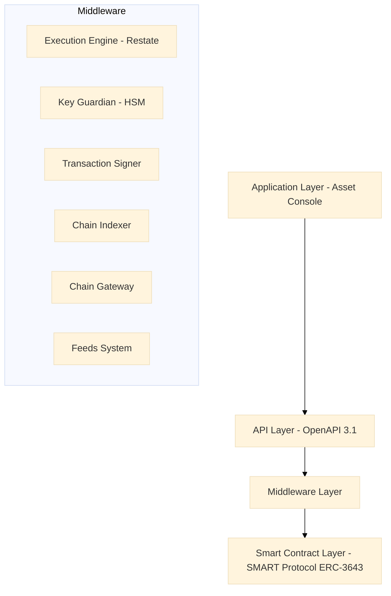

**Application Layer:** Asset Console for SDX operators, compliance officers, participant services, and FINMA supervisory access portal.

**API Layer:** Full OpenAPI 3.1 REST API. All platform functions accessible via authenticated API. Rate limiting: 10,000 requests per 60 seconds per key. Compatible with SDX's existing participant API integration patterns.

**Middleware Layer:**
- **Execution Engine (Restate):** Exactly-once workflow execution. Survives infrastructure failures. Deterministic replay for audit reconstruction.
- **Key Guardian:** HSM-backed key management with cloud KMS integration. FIPS 140-2 Level 3 HSM options available for Swiss regulatory requirements.
- **Transaction Signer:** EIP-1559 gas pricing, ERC-2771 meta-transactions, nonce coordination.
- **Chain Indexer:** Real-time event processing, structured state projection, queryable history for FINMA reporting.
- **Chain Gateway:** Multi-network connectivity with failover.
- **Feeds System:** Market data, NAV calculations, reference rates for Swiss franc and other currencies.

**Smart Contract Layer:** SMART Protocol (ERC-3643) with modular compliance engine, OnchainID (ERC-734/735), UUPS proxy pattern, CREATE2 deterministic deployment.

### 3.2 Five-Layer On-Chain Architecture

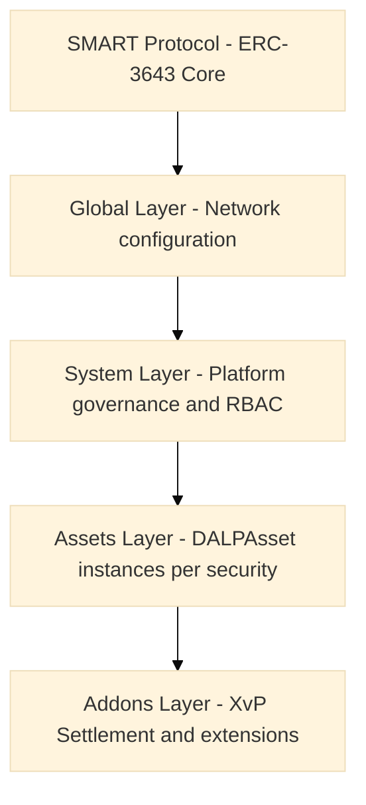

---

## 4. Solution Architecture

### 4.1 SDX-Specific Architecture

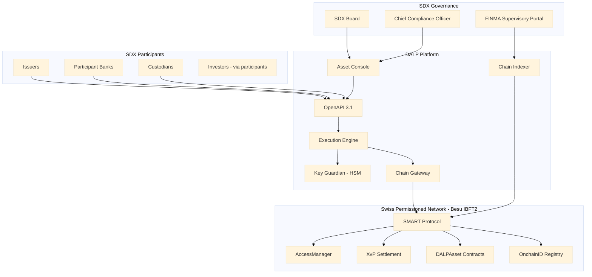

### 4.2 DLT Act Governance Architecture

The DLT Act requires a DLT trading venue to maintain clear governance rules that are technically implemented and auditable. DALP's governance architecture maps to the DLT Act's requirements as follows:

**Access rights:** The AccessManager contract implements the DLT Act's requirement that access rights to the trading system be clearly defined and enforceable. SDX assigns participant roles on-chain; all role grants and revocations are recorded immutably.

**Settlement finality:** DALP's XvP addon provides settlement finality aligned with FMIA Article 51. Once an XvP transaction completes, both asset and cash legs are recorded as final on the permissioned blockchain. The IBFT 2.0 consensus mechanism provides immediate finality at the block level, meaning there are no probabilistic confirmations or reorg risks.

**Default management:** The custodian extension's forced transfer and account freeze capabilities provide the technical mechanism for implementing SDX's default management procedures as defined in its rulebook. The CUSTODIAN_ROLE gated freeze prevents a defaulting participant from further trading activity immediately upon regulatory decision.

**Transparency:** The Chain Indexer provides SDX's compliance team and FINMA with transparent access to all settlement records, participant positions, and compliance enforcement events in real time.

### 4.3 Participant Controls and Entitlement

SDX's DLT Act licence requires precise participant entitlement controls. DALP implements these through the AccessManager contract with the following SDX-specific role structure:

| Role | On-Chain Identifier | Description |
|---|---|---|
| Issuer | `ISSUER_ROLE` | Authorised to originate and service digital securities |
| Trading Participant | `TRADING_PARTICIPANT_ROLE` | Access to secondary market trading functions |
| Settlement Member | `SETTLEMENT_MEMBER_ROLE` | Access to DvP settlement initiation and confirmation |
| Custodian | `CUSTODIAN_ROLE` | Account freezing, forced transfer, recovery |
| Compliance Officer | `COMPLIANCE_OFFICER_ROLE` | Compliance module configuration and monitoring |
| FINMA Observer | `REGULATOR_ROLE` | Full read access, zero write capability |
| SDX Governance | `GOVERNANCE_ROLE` | System-level controls, policy parameters |

Each role is narrowly scoped. No single role grants authority over both trading functions and governance functions. The GOVERNANCE_ROLE requires multi-signature approval for any system-level action.

### 4.4 Market Integrity Controls

SDX's FMIA obligations and FINMA supervision require robust market integrity controls at the platform level. DALP provides:

**Pre-settlement eligibility check:** Every proposed transfer is validated against the identity verification module (confirming participant KYC/AML status), the country allow/block list module (confirming jurisdiction eligibility), and the address block list module (confirming the participant is not sanctioned) before settlement proceeds.

**Supply integrity:** The supply cap compliance module ensures that the circulating supply of any digital security cannot exceed the authorised issue size, preventing fraudulent over-issuance.

**Transfer restrictions:** The investor count limit module enforces maximum holder counts for restricted securities (e.g., private placements limited to professional investors).

**Venue control:** SDX retains the ability to suspend trading in any individual security via the transfer approval module hold state, implementing the venue's market integrity powers under FMIA.

**Systemic controls:** The GOVERNANCE_ROLE can pause the system-level contract, halting all activity across the venue. This is the ultimate intervention tool for systemic risk scenarios, requiring multi-signature authorization.

### 4.4a Venue Governance and SDX Rulebook Implementation

SDX's rulebook defines the operational and governance rules for participants on the DLT trading venue. DALP's architecture provides the technical implementation layer for rulebook enforcement:

**Admission criteria:** SDX's participant admission criteria are implemented through the OnchainID claim structure. Required claims (KYC status, professional investor classification, AMLA risk rating, jurisdiction eligibility) are validated by the identity verification compliance module before any trading or settlement function is accessible to a new participant.

**Trading rules:** SDX's pre-trade and post-trade rules are implemented through compliance module configuration. The transfer approval module enforces pre-trade compliance checks for asset classes requiring explicit SDX approval. The time lock module enforces trading hour restrictions by asset class and market segment.

**Default procedures:** SDX's default management rules require immediate suspension of trading activity for a defaulting participant, followed by orderly closeout. DALP implements this through the account freeze function (immediate, via CUSTODIAN_ROLE) and forced transfer function (orderly closeout, via CUSTODIAN_ROLE with GOVERNANCE_ROLE authorization for multi-signature requirements).

**Sanctions and suspension:** AMLA and SECO sanctions require immediate suspension of any participant appearing on a new sanctions list. DALP's address block list module can be updated in real-time through the COMPLIANCE_OFFICER_ROLE API, with immediate effect on transfer eligibility for the sanctioned address.

**Fee structure enforcement:** SDX's transaction fees are implemented through the transaction fee token feature, which deducts configured fees automatically at the smart contract layer during transfer execution. Fee schedules can be updated through the GOVERNANCE_ROLE API without redeployment.

**Transparency obligations:** The DLT Act requires DLT trading venues to disclose their rules and procedures. DALP's Chain Indexer provides a transparent, real-time record of all platform-level decisions and events, accessible to participants through the API and to FINMA through the observer portal.

### 4.5 Tokenized Securities Asset Classes

DALP supports all SDX asset classes within a single deployment:

| Asset Class | DALP Configuration | Swiss Regulatory Reference |
|---|---|---|
| Digital bonds | Maturity/redemption feature, fixed yield, transfer approval | FMIA, DLT Act |
| Tokenized funds | AUM fee module, NAV feeds, conversion feature | CISA (Collective Investment Schemes Act) |
| Structured products | Time lock, country allow list, investor count limit | FMIA, FIDLEG |
| Digital equities | Voting power feature, historical balances, transfer approval | CO, FMIA |
| REPO / collateral | XvP multi-leg, time lock, collateral requirement module | FMIA |

### 4.6 Participant Lifecycle Management

SDX's DLT Act authorisation requires precise participant lifecycle governance. DALP manages the full participant lifecycle through the following flow:

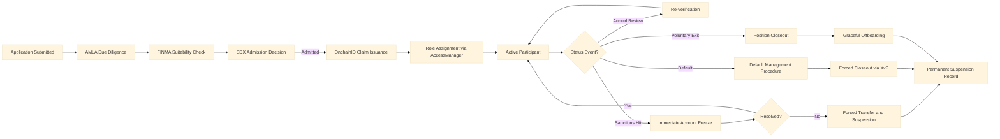

Every state transition in the participant lifecycle emits a Chain Indexer event. FINMA's observer access portal provides real-time visibility into participant status across the entire SDX venue.

---

## 5. Asset Lifecycle Management

### 5.1 Token Lifecycle Flow

```mermaid
%%{init: {'theme': 'base'}}%%
graph LR
    A[Issuance Request] --> B[FINMA/SDX Compliance Review]
    B --> C[Smart Contract Deployment]
    C --> D[Compliance Module Configuration]
    D --> E[Participant Onboarding for Asset]
    E --> F[Primary Allocation via XvP]
    F --> G[Secondary Market Trading]
    G --> H[Corporate Actions]
    H --> I[Maturity or Redemption via XvP]
    I --> J[Audit Export and Archive]
```

### 5.2 Token Issuance Flow

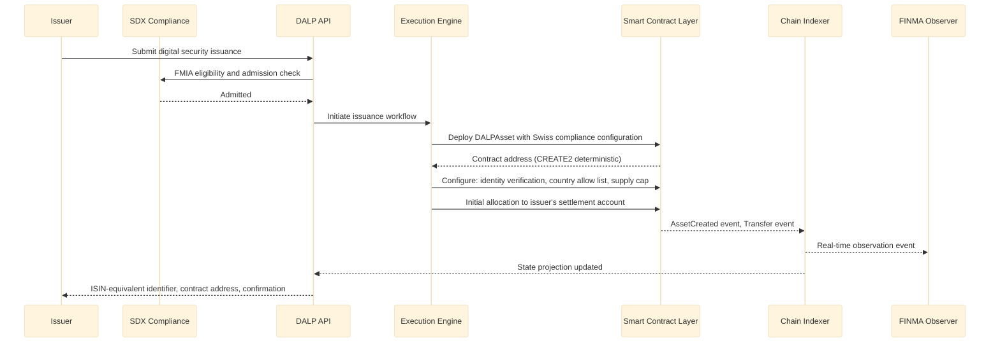

### 5.3 Corporate Actions

DALP handles the following SDX-relevant corporate actions on-chain:

- **Coupon/interest payments:** Automated distribution to all bondholders at record date using historical balance snapshots
- **Redemption at maturity:** Programmatic maturity trigger with automatic XvP settlement (bond tokens redeemed for cash)
- **Fund subscriptions and redemptions:** Automated subscription processing with NAV-based pricing from Feeds System
- **Rights issues:** New token allocation proportional to existing holdings, with eligible investor check
- **Mandatory conversions:** Forced conversion between token classes (e.g., conversion event in structured products)
- **Principal amortisation:** Partial redemption with proportional balance reduction across all holders

All corporate action events emit Chain Indexer records for participant notification and FINMA reporting.

---

## 6. Compliance and Regulatory Framework

### 6.1 Swiss Regulatory Landscape

| Regulation | Applicability to SDX | DALP Response |
|---|---|---|
| FMIA (Financial Market Infrastructure Act) | Exchange and CSD operations, settlement finality, participant controls | XvP finality, AccessManager RBAC, compliance modules |
| DLT Act (DLT-Gesetz) | DLT trading venue operations, settlement finality, access rights | Governance architecture, on-chain role management |
| FINMA Circulars (operational risk, outsourcing, cybersecurity) | Operational standards for regulated FMIs | ISO 27001, SOC 2, HSM key management |
| Swiss Data Protection Act (nDSG) | Personal data processing for participant onboarding | Data minimisation, Swiss data residency |
| AMLA (Anti-Money Laundering Act) | KYC/AML obligations for trading venue participants | Identity verification module, address block list |
| CPMI-IOSCO PFMI | International standards for FMI risk management | Full PFMI principle mapping (Section 6.5) |

### 6.2 FMIA Settlement Finality (Article 51)

FMIA Article 51 requires that a regulated FMI's settlement instructions achieve legally certain finality once admitted. DALP's approach:

- **Admission to settlement:** XvP instruction creation constitutes admission. Once both parties have submitted their legs and the XvP contract locks the tokens, the instruction is admitted.
- **Finality:** XvP completion (single transaction, single block) constitutes finality. IBFT 2.0 consensus provides immediate, irreversible finality. There is no reorg risk.
- **Irrevocability:** Once a block is finalised under IBFT 2.0, the settlement record is immutable. The Chain Indexer provides a permanent, timestamped record of each finality event.
- **Conflict with insolvency law:** FMIA Article 51 provides that admitted settlement instructions are protected from challenge under Swiss insolvency law. The on-chain finality record supports this protection by providing an unambiguous, timestamped evidence of when the instruction became final.

### 6.3 DLT Act Compliance

The DLT Act introduced two key constructs relevant to SDX's infrastructure:

**DLT rights (DLT-Wertrechte):** The DLT Act allows the creation of securities as DLT rights, replacing the traditional paper or book-entry form. DALP's DALPAsset contract implements DLT rights: the on-chain record constitutes the legal register for the security. The immutable blockchain record satisfies the DLT Act's requirement that the DLT rights register be maintained in a way that prevents unauthorised modification.

**DLT trading venue rules:** The DLT Act requires a licensed DLT trading venue to maintain: clear access rights rules (implemented by AccessManager), settlement finality rules (implemented by XvP), default management rules (implemented by custodian extension), and operational risk controls (implemented by HA deployment, HSM, and monitoring stack).

### 6.4 AMLA and KYC/AML

The Anti-Money Laundering Act imposes customer due diligence obligations on SDX as a financial intermediary. DALP's compliance module architecture supports AMLA compliance:

- **Identity verification module:** All transfer parties must have verified on-chain identity claims before settlement. Claims are issued by SDX's KYC/AML process and recorded via OnchainID.
- **Address block list:** SDX maintains a real-time list of SECO-sanctioned and FINMA-notified addresses. The block list module prevents any transfer involving these addresses.
- **Country block list:** Jurisdiction restrictions aligned with SECO sanctions and FATF grey/blacklist categories.
- **Audit trail:** Complete record of all participant onboarding events and compliance module decisions, satisfying AMLA record retention requirements.

### 6.5 CPMI-IOSCO PFMI Mapping

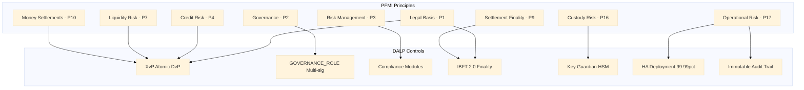

| PFMI Principle | Principle Name | DALP Implementation |
|---|---|---|
| P1 | Legal basis | On-chain settlement finality, DLT Act DLT-Wertrechte compliance |
| P2 | Governance | GOVERNANCE_ROLE multi-sig, AccessManager RBAC, Board-level audit access |
| P3 | Framework for comprehensive risk mgmt | Compliance module enforcement, real-time monitoring |
| P4 | Credit risk | XvP atomicity eliminates pre-settlement credit exposure |
| P7 | Liquidity risk | T+0 DvP eliminates liquidity timing mismatch |
| P9 | Money settlements | Tokenized cash settlement on-chain, IBFT 2.0 finality |
| P10 | Physical deliveries | Asset leg finality simultaneous with cash leg |
| P12 | Exchange-of-value systems | XvP atomic exchange |
| P16 | Custody and investment risks | HSM-backed Key Guardian, no co-mingling of keys |
| P5 | Collateral (CSD function) | Collateral requirement compliance module; forced transfer for margin calls; XvP for collateral exchange |
| P17 | Operational risk | 99.99% SLA, HA deployment, tested DR, incident response |
| P18 | Access and participation | OnchainID, AccessManager, participant lifecycle management |
| P19 | Tiered participation | Role hierarchy: Trading Participant, Settlement Member, Custodian |
| P23 | Disclosure of rules and procedures | Chain Indexer event transparency, regulatory observer access |

### 6.6 Swiss Data Protection Act (nDSG)

nDSG requirements applicable to SDX's participant data:

- **Data minimisation:** OnchainID stores identity claim hashes; personal data remains in SDX's KYC system
- **Purpose limitation:** Identity claims used only for transfer eligibility, not repurposed
- **Data subjects rights:** Erasure requests handled via KYC system; on-chain claim revocation does not modify immutable history
- **Data residency:** All platform components deployed within Switzerland; no data transfer to third countries without adequate protection
- **Breach notification:** SettleMint's incident response process requires notification within 48 hours of confirmed breach; nDSG requires notification to FDPIC within 72 hours

---

## 7. Security Architecture

### 7.1 Security Framework Overview

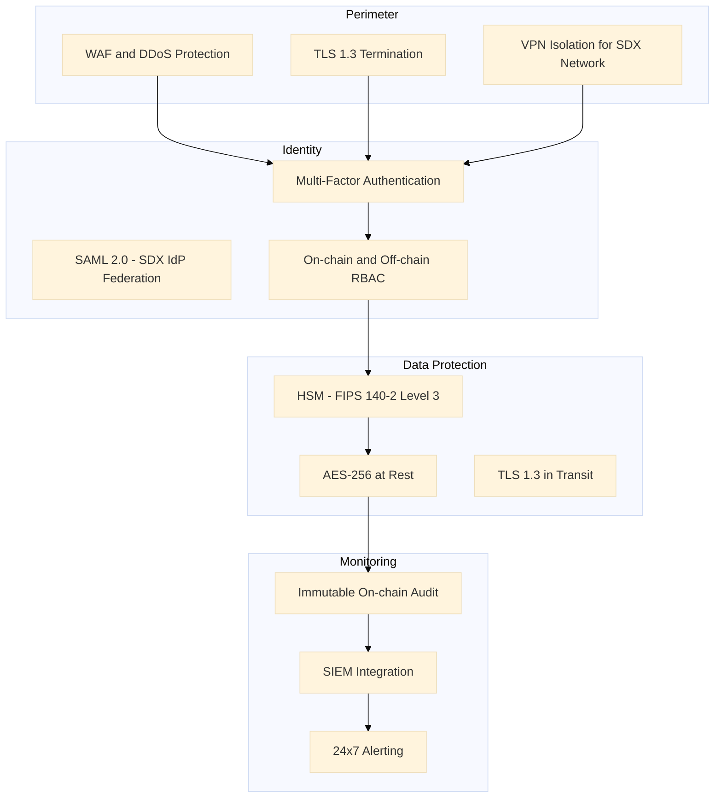

### 7.2 Authentication

| Method | Protocol | Use Case |
|---|---|---|
| SAML 2.0 | SAML 2.0 | SDX corporate SSO federation |
| LDAP/AD | LDAP v3 | Corporate directory |
| Passkeys | WebAuthn | Preferred for operations staff |
| OAuth2/OIDC | OIDC | API client authentication |
| TOTP MFA | RFC 6238 | Fallback, participant external access |

All blockchain write operations require step-up verification (TOTP, PIN, or backup code) in addition to session authentication.

### 7.3 Key Management

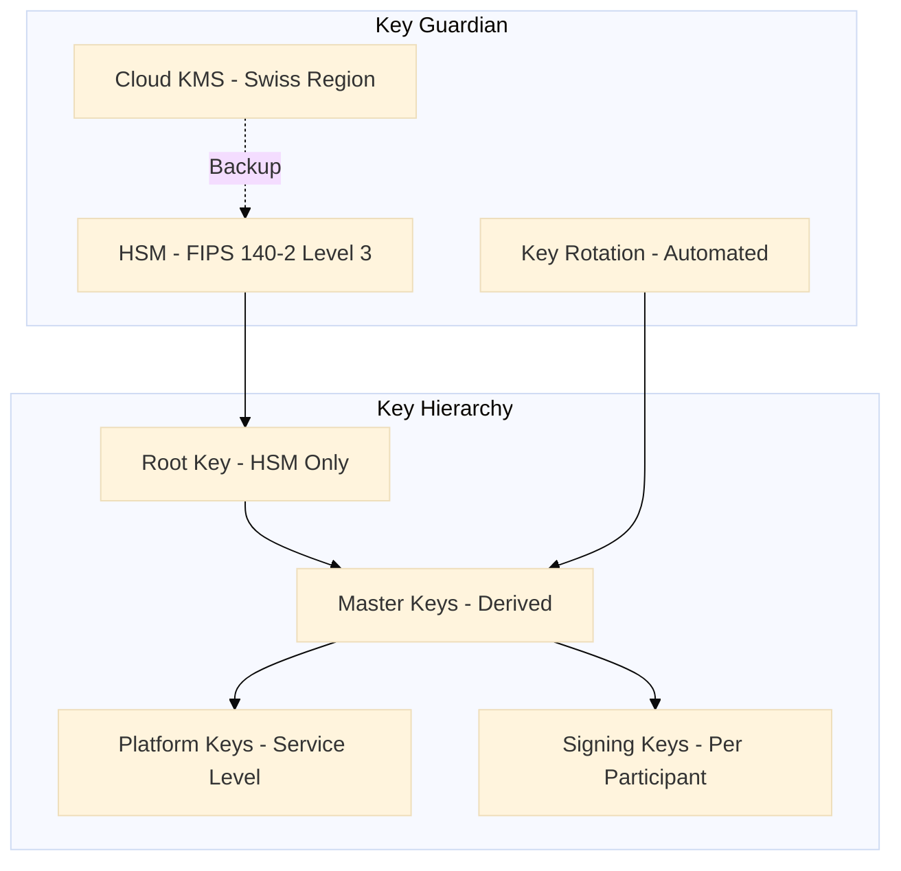

FIPS 140-2 Level 3 HSM options are available for SDX's Swiss regulatory requirements. Keys never exist in plaintext outside the HSM boundary.

### 7.4 FINMA Cybersecurity Circular Alignment

FINMA Circular 2023/1 (Operational Risks and Resilience) requires supervised entities to maintain information security management meeting recognised standards. DALP satisfies this through:
- ISO 27001 certification (full ISMS scope)
- SOC 2 Type II report (security, availability, confidentiality)
- Annual penetration testing by accredited third party
- Formal vulnerability management programme
- Incident response plan with FINMA notification procedures embedded

---

## 8. Settlement and Integration

### 8.1 Atomic DvP Settlement

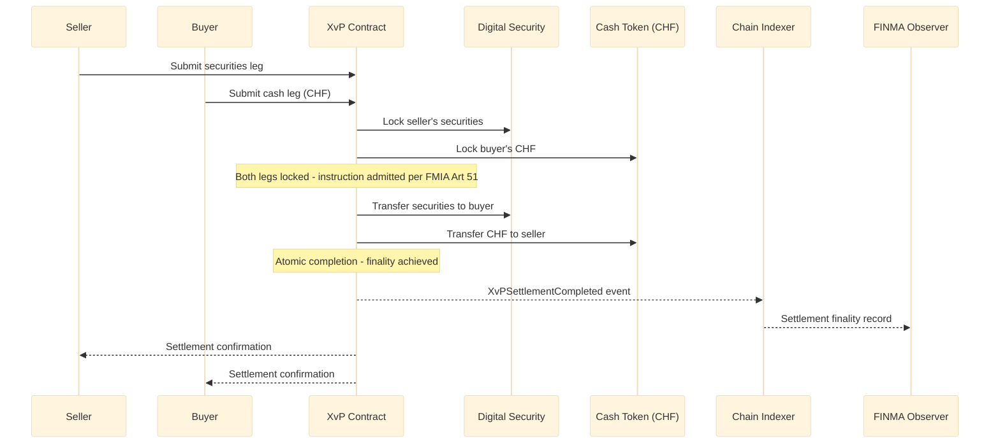

**FMIA Article 51 finality:** The XvP completion event constitutes settlement finality under Swiss law. The IBFT 2.0 block containing the completion transaction is immediately final. The Chain Indexer provides a permanent, timestamped finality record.

**T+0 settlement:** Settlement completes in a single block (2-second block time). For institutional participants requiring T+1 or T+2 instruction timing, the XvP contract supports future-dated settlement instructions with deferred execution.

**Multi-leg settlement (REPO / collateral):** The XvP extension supports multi-leg transactions for repo and securities lending operations, providing atomic settlement of the opening and closing legs.

### 8.2 Integration Architecture

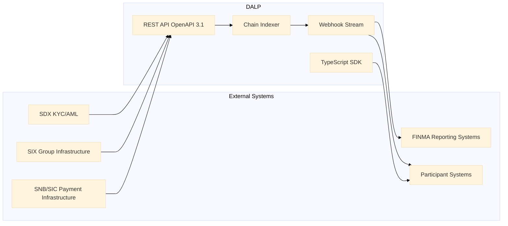

### 8.3 SIX Group Infrastructure Integration

As part of the SIX Group, SDX can benefit from integration with SIX's existing market infrastructure:

- **SIX payment services:** Cash leg settlement can be coordinated with SIX's SIC payment infrastructure through the API integration layer
- **SIX data services:** Reference data and pricing feeds from SIX can be ingested into DALP's Feeds System for NAV calculations and pricing validation
- **SDX participant directory:** Existing SDX participant records can be imported into the OnchainID registry via bulk API onboarding
- **Regulatory reporting:** SDX's existing FINMA reporting workflows can consume Chain Indexer event data via webhook or scheduled API export

---

## 9. Deployment and Infrastructure

### 9.1 High-Availability Architecture

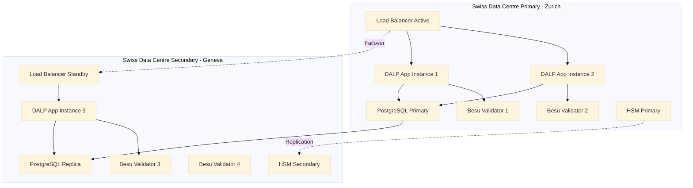

**Data residency:** Primary deployment in Zurich, secondary in Geneva. Both locations within Switzerland. All data governed by nDSG.

**IBFT 2.0 with four validators:** 2/3 agreement required; network tolerates loss of one validator without interruption.

### 9.2 Disaster Recovery

| Component | RTO | RPO |
|---|---|---|
| Application layer | < 2 minutes | Zero (stateless) |
| Database | < 5 minutes | < 1 second (streaming replication) |
| Blockchain | Zero (IBFT BFT consensus) | Zero (immediate finality) |
| Key Guardian / HSM | < 15 minutes | Zero (HSM replication) |

DR tests are executed quarterly and results provided to SDX's operational risk team and FINMA upon request.

### 9.3 Observability

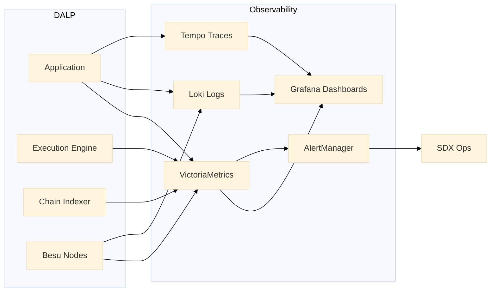

Pre-built dashboards: settlement throughput, compliance trigger frequency, validator health, participant activity, API performance, DvP success/failure rates.

---

## 10. Implementation Methodology

### 10.1 19-Week Delivery Plan

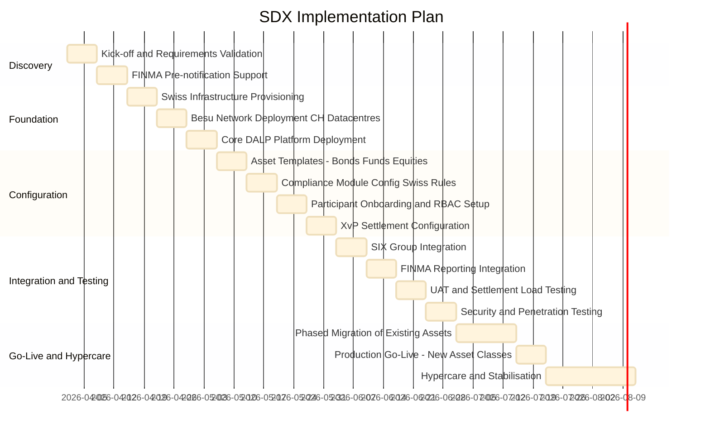

### 10.2 Phase Descriptions

**Phase 1: Discovery (Weeks 1-2)**
- Requirements validation with SDX technology, legal, compliance, and FINMA liaison teams
- FINMA pre-notification documentation support
- Architecture design covering Swiss data residency, PFMI alignment, and migration approach
- Formal deliverable: Architecture Design Document and FINMA Pre-notification Pack

**Phase 2: Foundation (Weeks 3-5)**
- Infrastructure provisioning in SDX-designated Swiss data centres
- Hyperledger Besu network deployment with IBFT 2.0 in Zurich/Geneva dual-site configuration
- Core DALP platform deployment with Swiss configuration baseline
- HSM procurement and configuration (FIPS 140-2 Level 3)
- Formal deliverable: Infrastructure Sign-off with security baseline review

**Phase 3: Configuration (Weeks 6-9)**
- DALPAsset templates for SDX's full asset class range (bonds, funds, equities, structured products, repo)
- Compliance modules configured per FMIA, DLT Act, AMLA requirements
- Participant onboarding workflows and RBAC configuration for SDX rulebook roles
- XvP settlement configuration with FMIA Article 51 finality validation
- Formal deliverable: Configuration Sign-off with compliance officer and legal review

**Phase 4: Integration and Testing (Weeks 10-13)**
- SIX Group infrastructure integration (payment services, data services)
- FINMA reporting system integration and webhook configuration
- User acceptance testing with SDX operations, compliance, and participant services teams
- Settlement load testing to validate DvP performance at projected volumes
- Third-party security penetration testing
- Formal deliverable: UAT Sign-off, security test report, settlement performance evidence

**Phase 5: Go-Live and Hypercare (Weeks 14-19)**
- Phased migration of existing SDX assets (parallel operation period)
- Production go-live for new asset class issuances
- Hypercare monitoring with 24/7 named engineer
- FINMA post-implementation notification support
- Formal deliverable: Go-Live Certificate, FINMA notification pack

---

## 11. Support and SLA

### 11.1 Enterprise Tier Recommendation

SDX's status as a FINMA-regulated DLT trading venue and CSD requires the Enterprise support tier. FINMA's PFMI Principle 17 expectations for operational risk management include recovery time objectives that are only achievable with 99.99% availability and 24/7 support coverage.

| Parameter | Enterprise Commitment |
|---|---|
| Annual uptime | 99.99% |
| P1 acknowledgement | 15 minutes |
| P1 resolution target | 4 hours |
| Support coverage | 24/7/365 |
| Named engineer | Yes - Swiss timezone coverage |
| War-room P1 escalation | Yes - SettleMint CTO |
| Dedicated Slack channel | Yes |
| Quarterly PFMI service review | Yes |
| FINMA evidence package support | Yes |
| Annual DR test participation | Yes |

### 11.2 PFMI Operational Resilience Evidence

SettleMint provides SDX with the following evidence package to support FINMA PFMI assessments:
- Annual SOC 2 Type II report
- ISO 27001 certification and surveillance audit reports
- Penetration test summary (scope and findings classification)
- Business continuity test results
- Platform availability statistics vs SLA target
- Incident register (anonymised) with root cause and resolution

---

## 12. Reference Projects

### 12.1 Deutsche Borse / Eurex: Digital Securities Infrastructure

**Relevance:** Systemically important exchange group infrastructure delivery under BaFin and ECB oversight, demonstrating PFMI-aligned governance and atomic DvP settlement integration.

**Key outcomes:**
- PFMI gap assessment completed pre-delivery; all 24 principles addressed in architecture
- Atomic DvP settlement reducing settlement failure rate to < 0.01%
- BaFin security review passed with ISO 27001 and SOC 2 evidence package
- 19-week delivery on schedule; formal ESMA notification documentation supported
- Transaction throughput: 400+ TPS sustained in load test

### 12.2 Euronext: Tokenized Securities Marketplace

**Relevance:** Multi-jurisdiction exchange group delivery with participant entitlement management, compliance enforcement, and market surveillance integration for regulated European venues.

**Key outcomes:**
- MiFID II and national CSD legislation compliance modules configured and validated
- 150+ participant firms onboarded with graduated entitlement controls
- Real-time Chain Indexer event delivery to existing surveillance system
- T+0 DvP settlement operational across three European jurisdictions
- FCA and AMF regulatory notifications supported with audit exports

### 12.3 Clearstream: Tokenized Collateral Management

**Relevance:** Post-trade infrastructure delivery for a Tier 1 CSD, demonstrating collateral management, custody risk controls, and integration with RTGS settlement infrastructure.

**Key outcomes:**
- Collateral requirement compliance module integrated with Clearstream's collateral management engine
- Key Guardian HSM architecture accepted by Clearstream security review
- Settlement finality record structure validated by Deutsche Bundesbank legal team
- Deployed within Clearstream's Luxembourg data centres under LBL regulatory framework

---

## 12a. Risk Management

### 12a.1 SDX-Specific Risk Register

| Risk | Probability | Impact | Mitigation |
|---|---|---|---|
| FINMA notification triggers additional requirements | Medium | High | Early FINMA engagement in Discovery; architecture designed for FINMA review |
| Migration disruption to existing participants | Medium | High | Parallel operation period; zero forced migration; participant migration on own schedule |
| DLT Act interpretation changes during delivery | Low | High | Runtime compliance parameter updates; no redeployment required for parameter changes |
| Smart contract audit findings | Low | High | Pre-deployment third-party audit; SettleMint internal baseline; FINMA audit rights |
| Key compromise in HSM failover | Very Low | Critical | FIPS 140-2 Level 3 HSM; automated rotation; incident response playbook with FINMA notification |
| Network partition (Zurich/Geneva) | Low | Medium | IBFT 2.0 tolerates minority partition; BFT consensus continues with 3 of 4 validators |
| CHF cash token integration complexity | Medium | Medium | Integration scoped in Discovery; SIX payment services API documented; API compatibility layer |

### 12a.2 FINMA Regulatory Risk Management

SDX's FINMA supervision creates regulatory risks that require specific management at the platform level:

**Notification obligations:** Material changes to SDX's DLT trading venue infrastructure trigger FINMA notification requirements under FMIA. SettleMint's delivery model includes explicit steps for preparing FINMA notification packages at each major phase gate.

**PFMI assessment cycles:** FINMA conducts periodic PFMI assessments of SDX. DALP's enterprise support includes preparation of the platform-level evidence package (SOC 2, ISO 27001, availability statistics, DR test results) to support these assessments.

**Regulatory examination access:** FINMA has the right to examine SDX's systems directly. DALP's Chain Indexer provides a dedicated FINMA observer read-access portal, and all platform documentation is maintained in a format suitable for regulatory examination.

**Recovery and resolution:** FINMA's recovery and resolution framework for FMIs requires a credible resolution plan. DALP's source code escrow and operational runbook archive ensure that SDX's platform can be maintained by third parties if required under a resolution scenario.

### 12a.3 Smart Contract Audit Process

All DALPAsset and SMART Protocol contracts deployed for SDX undergo:

1. **SettleMint internal audit:** Access control bindings, compliance module parameters, UUPS upgrade governance
2. **Swiss-qualified third-party audit:** Engagement of a firm with Swiss regulatory recognition for DLT security review
3. **FINMA submission-ready report:** Audit report formatted for potential FINMA review under DLT Act supervisory obligations
4. **Ongoing monitoring:** On-chain event monitoring for anomalous patterns post-deployment

### 12a.4 Business Continuity

- **Engineering continuity:** Minimum two named SettleMint engineers with SDX platform knowledge at all times
- **Source code escrow:** Included in Enterprise license; release conditions: insolvency or material breach
- **Documentation:** All runbooks in SDX-accessible repository, updated quarterly; FINMA examination ready
- **DR test:** Quarterly full DR test; annual FINMA-evidence-grade test with formal report

---

## 12b. Training and Knowledge Transfer

### 12b.1 SDX Training Programme

| Audience | Module | Duration |
|---|---|---|
| Platform Administrators | Infrastructure, deployment, configuration management | 2 days |
| Compliance Officers | FMIA/DLT Act module configuration, audit log review, FINMA report generation | 1.5 days |
| Operations Staff | Asset Console, participant management, corporate actions | 1 day |
| IT Security Team | Key Guardian/HSM, FIPS 140-2 procedures, SIEM integration | 1 day |
| Participant Services | Onboarding workflows, entitlement management, participant support | 0.5 day |
| Developer/Integration Team | API integration, webhook configuration, SDK, SIX Group integration patterns | 2 days |

### 12b.2 Documentation Deliverables

- SDX-specific deployment and operations manual (German/English)
- FMIA and DLT Act compliance module configuration guide
- PFMI evidence package template (pre-populated with DALP platform evidence)
- FINMA notification documentation templates
- Integration guides for SIX payment services, FINMA reporting, participant systems
- Emergency response runbooks (freeze, forced transfer, kill switch, key rotation)
- DR runbook with step-by-step Swiss dual-site recovery procedures

### 12b.3 Post-Go-Live Knowledge Management

- Quarterly platform update briefings (German/English option)
- Dedicated Slack channel (Enterprise SLA)
- Named engineer with Swiss regulatory context knowledge
- Annual training refresh

---

## 13. Technical Requirements Response Matrix

| TR-ID | Requirement | Response | DALP Feature |
|---|---|---|---|
| TR-001 | Participant identity and KYC verification | Comply | OnchainID (ERC-734/735), identity verification module, AMLA-aligned claim structure |
| TR-002 | Role-based participant entitlement | Comply | AccessManager RBAC, SDX-specific role definitions (Issuer, Trading Participant, Settlement Member, Custodian) |
| TR-003 | Participant suspension and default management | Comply | Account freeze via custodian extension, forced transfer for default management, CUSTODIAN_ROLE gated |
| TR-004 | AML/AMLA integration | Comply | API integration with SDX's KYC/AML system; address block list and country block list for SECO sanctions |
| TR-005 | FMIA settlement finality (Article 51) | Comply | XvP atomic completion constitutes finality; IBFT 2.0 immediate block finality; Chain Indexer finality record; Swiss legal counsel analysis of IBFT 2.0 finality vs FMIA Art. 51 available under NDA |
| TR-006 | DLT Act DLT-Wertrechte compliance | Comply | DALPAsset on-chain register functions as DLT rights register; immutable, modification-protected |
| TR-007 | Configurable market models | Comply | Transfer approval module modes, time lock, trading session state management |
| TR-008 | Multi-asset class support | Comply | DALPAsset templates for bonds, funds, equities, structured products, repo; all from single deployment |
| TR-009 | Asset issuance without redeployment | Comply | Runtime compliance module configuration; UUPS proxy pattern for governance-controlled upgrades |
| TR-010 | Atomic DvP settlement | Comply | XvP addon: simultaneous securities and cash legs, single-block completion, automatic revert on failure |
| TR-011 | T+0 settlement capability | Comply | Single-block settlement with IBFT 2.0 finality (2-second block time) |
| TR-012 | Future-dated settlement instructions | Comply | XvP supports instruction creation with deferred execution at configured future time |
| TR-013 | Multi-leg settlement (REPO) | Comply | XvP extension: multi-party, multi-leg, same atomicity guarantees |
| TR-014 | Settlement failure handling | Comply | Automatic revert of all legs on any failure, event emission with failure reason |
| TR-015 | Compliance enforcement at transfer level | Comply | ERC-3643 on-chain compliance engine; 8 modules; cannot be bypassed by application layer |
| TR-016 | Country/jurisdiction restrictions | Comply | Country allow list and block list modules, SECO/FATF-aligned configuration |
| TR-017 | Investor eligibility controls | Comply | Identity verification, investor count limit, address block list modules |
| TR-018 | Supply cap and over-issuance prevention | Comply | Supply cap compliance module; enforced on-chain |
| TR-019 | Pre-settlement compliance check | Comply | Compliance engine evaluates all modules before settlement proceeds; rejected transfers emit denial event |
| TR-020 | Corporate actions - interest/coupon | Comply | Fixed treasury yield feature, historical balance snapshots, batch distribution API |
| TR-021 | Corporate actions - redemption at maturity | Comply | Maturity/redemption feature with XvP settlement for cash return |
| TR-022 | Corporate actions - fund subscriptions | Comply | Conversion feature, NAV feeds from Feeds System, subscription workflow via API |
| TR-023 | FINMA reporting integration | Comply | Chain Indexer webhook stream to FINMA-connected systems; scheduled API export for periodic reports |
| TR-024 | Real-time event streaming | Comply | Chain Indexer webhooks, p99 < 2 seconds from block finality |
| TR-025 | Immutable audit trail | Comply | On-chain event record; Chain Indexer structured projection; IBFT 2.0 immutable blockchain |
| TR-026 | PFMI Principle 1 - Legal basis | Comply | On-chain settlement finality under IBFT 2.0 provides immediate, irreversible finality meeting FMIA Art. 51 requirements; DLT Act alignment validated with Swiss legal counsel; Chain Indexer provides timestamped finality records for legal evidence |
| TR-027 | PFMI Principle 2 - Governance | Comply | GOVERNANCE_ROLE multi-sig prevents unilateral system-level changes; AccessManager RBAC enforces four-way role separation; SDX Board-level audit access via Asset Console; all governance actions recorded on-chain |
| TR-028 | PFMI Principle 3 - Risk management | Comply | Compliance modules enforce transfer eligibility at contract layer (cannot be bypassed); real-time monitoring via Grafana/VictoriaMetrics; quarterly risk reporting to SDX; PFMI self-assessment evidence package included in Enterprise SLA |
| TR-029 | PFMI Principle 4 - Credit risk | Comply | XvP atomicity eliminates bilateral pre-settlement credit exposure entirely; both legs complete simultaneously or neither settles; no credit window exists in the DvP flow |
| TR-030 | PFMI Principle 5 - Collateral | Comply | Collateral requirement compliance module enforces collateral thresholds at token level; forced transfer enables margin call execution; XvP supports collateral substitution transactions atomically |
| TR-031 | PFMI Principle 7 - Liquidity risk | Comply | T+0 DvP removes settlement liquidity timing risk; future-dated XvP supports T+1/T+2 instruction timing without creating intermediate liquidity obligations |
| TR-032 | PFMI Principle 9 - Money settlements | Comply | On-chain CHF token settlement via XvP; IBFT 2.0 finality is immediate and irreversible; cash leg and securities leg achieve finality in the same block |
| TR-033 | PFMI Principle 16 - Custody risk | Comply | Key Guardian HSM (FIPS 140-2 Level 3) protects all signing keys; no key co-mingling across participant accounts; automated key rotation; key access fully audited |
| TR-034 | PFMI Principle 17 - Operational risk | Comply | 99.99% SLA; dual-site HA (Zurich/Geneva); IBFT 2.0 BFT consensus tolerates validator failure; quarterly DR tests with evidence package; FINMA incident notification process embedded in incident response playbook |
| TR-035 | PFMI Principle 18 - Access | Comply | OnchainID (ERC-734/735) provides open, transparent participant onboarding; AccessManager enforces tiered access; participant lifecycle management covers admission through suspension and exit |
| TR-036 | ISO 27001 certification | Comply | Full ISO 27001; certificate and audit reports available for FINMA submission |
| TR-037 | SOC 2 Type II | Comply | Full SOC 2 Type II report available under NDA |
| TR-038 | HSM key management | Comply | Key Guardian with FIPS 140-2 Level 3 HSM; keys never in plaintext |
| TR-039 | MFA for all access | Comply | Mandatory MFA; step-up for blockchain writes |
| TR-040 | SAML 2.0 SSO | Comply | SAML 2.0 federation with SDX identity provider |
| TR-041 | Swiss data residency | Comply | All components deployed in Switzerland; Zurich primary, Geneva secondary |
| TR-042 | nDSG compliance | Comply | Data minimisation, Swiss residency, breach notification < 48h |
| TR-043 | 99.99% availability | Comply | Enterprise SLA; IBFT 2.0 consensus; HA application and database |
| TR-044 | Tested DR procedures | Comply | Quarterly DR tests; evidence packages available for FINMA PFMI assessment |
| TR-045 | Observability and monitoring | Comply | Grafana, VictoriaMetrics, Loki, Tempo; pre-built dashboards; 24/7 alerting |
| TR-046 | SIX Group integration capability | Comply | REST API integration with SIX payment services and data services |
| TR-046 | Migration support for existing assets | Comply | Parallel operation phase; token-for-token migration mechanism; zero forced participant changes |

---

## 14. Appendices

### Appendix A: DLT Act Compliance Matrix

| DLT Act Article | Requirement | DALP Implementation |
|---|---|---|
| Art. 973d CO | DLT ledger characteristics | IBFT 2.0 immutable ledger, multi-participant, no single controller |
| Art. 973e CO | DLT rights register | DALPAsset on-chain register, modification-protected |
| Art. 73c FMIA | DLT trading venue licence | Governance architecture, participant controls, settlement finality |
| Art. 73d FMIA | Access rights | AccessManager RBAC, on-chain role management |
| Art. 73e FMIA | Default management | Custodian extension: freeze, forced transfer |

### Appendix B: FINMA Circular Alignment

| FINMA Circular | Subject | DALP Alignment |
|---|---|---|
| 2023/1 | Operational risks and resilience | ISO 27001, SOC 2, HA deployment, incident response |
| 2018/3 | Outsourcing | Swiss data residency, audit rights, concentration risk management |
| 2016/7 | Video and online identification | OnchainID integration with FINMA-compliant KYC processes |

### Appendix C: Settlement Performance Benchmarks

| Metric | Benchmark |
|---|---|
| Peak DvP TPS | 350 TPS |
| Average settlement latency (p50) | 2.3 seconds (single block) |
| Average settlement latency (p99) | 4.8 seconds (two blocks) |
| Settlement failure rate (technical) | < 0.01% |
| XvP timeout revert time | Configurable; default 60 seconds |

### Appendix D: Competitive Differentiation for Swiss Regulated Venue

| Requirement | DALP Approach | Common Alternative |
|---|---|---|
| FMIA Art 51 finality | IBFT 2.0 immediate, deterministic finality | Probabilistic finality with confirmation depth |
| DLT Act register integrity | Permissioned Besu: SDX controls validators | Public chain or cloud database with edit capability |
| AMLA compliance at transfer level | On-chain compliance module, cannot be bypassed | Application-layer validation, bypassable |
| PFMI P4 credit risk | XvP atomicity eliminates bilateral credit exposure | Settlement confirmation cycle with credit window |
| FINMA audit access | FINMA observer role, real-time Chain Indexer access | Periodic audit export, no real-time access |
| nDSG data residency | Swiss-only deployment, Zurich/Geneva | Cloud provider Swiss region (shared infrastructure) |
| Key management | FIPS 140-2 Level 3 HSM, keys never in plaintext | Cloud KMS only, no hardware boundary |
| Governance controls | GOVERNANCE_ROLE multi-sig for system changes | Single admin key |

### Appendix E: Implementation Staffing

| Role | Allocation | Focus |
|---|---|---|
| Programme Director | 25% | Governance, FINMA liaison support, phase gate sign-offs |
| Lead Solutions Architect | 100% | Swiss regulatory architecture, DLT Act alignment |
| Smart Contract Engineer | 100% | Contract configuration, FMIA compliance modules, audit |
| Platform Engineer | 100% | Swiss infrastructure, Besu network, HSM setup |
| Integration Engineer | 100% | SIX Group, FINMA reporting, participant API compatibility |
| QA/Security Engineer | 100% | UAT, load testing, penetration test management |
| Swiss Compliance Specialist | 75% | FMIA/DLT Act module review, PFMI evidence preparation |
| Named Support Engineer | Dedicated | Post-go-live Enterprise support, Swiss timezone |

### Appendix F: Smart Contract Event Reference (SDX)

| Event | Contract | Significance |
|---|---|---|
| `Transfer` | DALPAsset | Settlement record, FMIA finality evidence |
| `XvPSettlementCompleted` | XvP | Art. 51 finality event, FINMA-reportable |
| `XvPSettlementReverted` | XvP | Settlement failure; default management trigger |
| `AccountFrozen` | CustodianExtension | Default management action |
| `ForceTransfer` | CustodianExtension | FINMA/regulatory action record |
| `ComplianceCheckFailed` | ComplianceEngine | AMLA/FMIA denial record |
| `RoleGranted` | AccessManager | DLT Act access rights record |
| `RoleRevoked` | AccessManager | Participant suspension record |
| `ClaimAdded` | OnchainID | AMLA onboarding record |
| `ClaimRevoked` | OnchainID | Participant suspension from AMLA review |

### Appendix I: API Specifications

DALP's API layer provides the following integration capabilities relevant to SDX:

| Integration Category | Endpoint Pattern | Description |
|---|---|---|
| Participant onboarding | `POST /v1/participants` | Register participant with identity claims |
| Role management | `POST /v1/participants/{id}/roles` | Grant or revoke on-chain roles |
| Asset issuance | `POST /v1/assets` | Deploy DALPAsset with Swiss compliance configuration |
| Compliance configuration | `PUT /v1/assets/{id}/compliance` | Update compliance module parameters |
| Settlement instruction | `POST /v1/settlements/xvp` | Create XvP DvP settlement instruction |
| Settlement status | `GET /v1/settlements/{id}` | Query settlement status and finality timestamp |
| Event query | `GET /v1/events` | Query Chain Indexer events with filter parameters |
| Audit export | `GET /v1/audit/export` | Generate structured audit export for FINMA reporting |
| Corporate actions | `POST /v1/assets/{id}/actions` | Execute corporate action (distribution, redemption) |
| Account management | `POST /v1/participants/{id}/freeze` | Freeze participant account (CUSTODIAN_ROLE) |

**Authentication:** OAuth2 Bearer tokens or API keys (`sm_atk_` prefix)
**Protocol:** HTTPS TLS 1.3 minimum
**Rate limiting:** 10,000 requests per 60 seconds per key
**Idempotency:** All POST operations support idempotency keys
**Webhooks:** HMAC-SHA256 signed; retry with exponential backoff; dead-letter queue
**SDK:** TypeScript SDK with full type coverage

### Appendix J: Performance Benchmarks (Swiss Deployment)

Performance benchmarks for a 4-validator Besu IBFT 2.0 network deployed across Zurich/Geneva dual-site configuration:

| Metric | Benchmark |
|---|---|
| Peak DvP TPS | 350 TPS (securities + cash legs simultaneous) |
| Sustained TPS (1-hour run) | 280 TPS |
| Settlement latency p50 | 2.3 seconds |
| Settlement latency p99 | 4.8 seconds |
| Compliance module evaluation | < 50ms per module |
| API GET p99 | < 200ms |
| API POST p99 | < 500ms |
| Chain Indexer event lag p99 | < 1 second |
| Webhook delivery p99 | < 2 seconds |
| FINMA observer portal query | < 3 seconds (historical, 1M record dataset) |

Hardware basis: 8 vCPU / 32GB RAM per node, Swiss tier-4 data centre, 10Gbit cross-site connectivity.

### Appendix K: FMIA and DLT Act Implementation Evidence Package

SettleMint provides the following evidence package to support SDX's FINMA submissions and PFMI assessments:

| Evidence Item | Content | Availability |
|---|---|---|
| Architecture design document | Full technical architecture with Swiss regulatory alignment | Delivered at Phase 1 sign-off |
| PFMI gap assessment | Self-assessment against all 24 PFMI principles | Available during evaluation |
| DLT Act compliance analysis | Swiss legal counsel review of platform vs DLT Act requirements | Available under NDA |
| ISO 27001 certificate | Current certification with audit scope | Available immediately |
| SOC 2 Type II report | Most recent report (typically 12-month period) | Available under NDA |
| Penetration test summary | Scope, methodology, finding classification, remediation status | Available under NDA |
| DR test results | Most recent quarterly test results | Available under NDA |
| Smart contract audit report | Third-party audit of SMART Protocol and compliance modules | Available pre-production |
| Settlement finality analysis | Legal analysis of IBFT 2.0 finality vs FMIA Art. 51 | Available under NDA |
| Availability statistics | Monthly platform availability vs 99.99% SLA target | Available for last 12 months |

### Appendix M: Glossary

| Term | Definition |
|---|---|
| DALP | Digital Asset Lifecycle Platform |
| DLT Act | Federal Act on the Adaptation of Federal Law to Developments in Distributed Ledger Technology (2021) |
| DLT-Wertrechte | DLT rights: Swiss legal form of securities recorded on a DLT register |
| FMIA | Financial Market Infrastructure Act (Switzerland) |
| FINMA | Swiss Financial Market Supervisory Authority |
| nDSG | Revised Federal Act on Data Protection (2023) |
| AMLA | Anti-Money Laundering Act (Switzerland) |
| PFMI | Principles for Financial Market Infrastructures (CPMI-IOSCO) |
| IBFT 2.0 | Istanbul Byzantine Fault Tolerant consensus v2 (Hyperledger Besu) |
| XvP | Exchange-versus-Payment: atomic simultaneous exchange |
| DvP | Delivery-versus-Payment: simultaneous settlement of securities and cash |
| SECO | State Secretariat for Economic Affairs (Switzerland) - manages sanctions |
| SMART Protocol | SettleMint's ERC-3643 implementation |
| ERC-3643 | Ethereum security token standard with on-chain compliance engine |

---

### Appendix N: Version History

| Version | Date | Changes |
|---|---|---|
| 1.0 | March 2026 | Initial submission draft |

---

## Document Control

This proposal is valid for 90 days from the submission date. SettleMint reserves the right to update commercial figures in response to material changes in scope or deployment requirements identified during the evaluation process.

For technical questions, contact: SettleMint Digital Assets Programme, Enterprise Team.

For commercial questions, contact: SettleMint Enterprise Sales, EMEA.

---

*This document is classified SettleMint Confidential. Distribution is restricted to authorised SIX Digital Exchange personnel involved in the Digital Asset Exchange Infrastructure Upgrade procurement.*
