# Technical Proposal: Wholesale CBDC Settlement Infrastructure

**Prepared for:** Swiss National Bank (SNB)
**Document Title:** Technical Proposal. Wholesale CBDC Settlement Infrastructure
**RFP Reference:** SNB-RFP-WHOLESALE-CBDC-SETTLEMENT-INFRASTRUCTURE-202603
**Submission Date:** March 2026
**Version:** 1.0
**Classification:** SettleMint Confidential

**Prepared by:** SettleMint NV
**Primary Contact:** Digital Assets Programme. SettleMint Enterprise

---

## Table of Contents

1. Executive Summary
2. SettleMint Company Profile
3. DALP Platform Overview
4. Solution Architecture
5. wCBDC Lifecycle Management
6. Compliance and Regulatory Framework
7. Security Architecture
8. Settlement and Integration
9. Deployment and Infrastructure
10. Implementation Methodology
11. Support and SLA
12. Reference Projects
13. Technical Requirements Response Matrix
14. Appendices

---

## 1. Executive Summary

### 1.1 Context: Project Helvetia and the SNB's wCBDC Journey

The Swiss National Bank's wholesale CBDC settlement infrastructure programme builds on one of the most technically rigorous central bank digital currency experiments conducted to date. Project Helvetia, executed jointly by the SNB, SIX Digital Exchange, and the BIS Innovation Hub, demonstrated that settlement of tokenised securities in central bank money on a distributed ledger is legally sound, operationally feasible, and technically achievable. Project Helvetia III extended this to a live pilot on SDX's production infrastructure, settling real digital bonds with real Swiss franc wCBDC.

The procurement now in question is the next stage: moving from a structured pilot to a production-grade, permanent infrastructure for wholesale CBDC settlement in Switzerland. This is not a proof of concept. The SNB is building the settlement layer for Swiss interbank money markets, securities settlement, and potentially cross-border multi-currency DvP operations. The infrastructure must satisfy the National Bank Act's mandate for the SNB to provide reliable payment systems, the FMIA's requirements for settlement finality, the Swiss Data Protection Act's data governance requirements, and the BIS's expectations for a central bank operating a wholesale digital currency, expectations that have been articulated with increasing precision through the CPMI-IOSCO PFMI framework, BIS Working Paper 880, and the results of Project Helvetia itself.

### 1.2 Why Wholesale CBDC Infrastructure Is a Different Problem

Wholesale CBDC infrastructure is categorically different from tokenised asset infrastructure, for reasons that go to the heart of monetary architecture:

**The cash leg carries monetary authority.** A wCBDC is not a commercial bank token or a stablecoin. It is a direct liability of the central bank, issued under statutory authority. Every issuance, redemption, and transfer of the SNB's wCBDC is a monetary event. The infrastructure must preserve the SNB's sole authority to issue and redeem, provide the SNB with unilateral intervention capability at any point in the settlement lifecycle, and ensure that no system failure, however severe, can result in unintended wCBDC creation or destruction.

**Finality is a monetary policy tool.** In wholesale payment systems, settlement finality is not merely a legal convenience; it is a monetary policy mechanism. Final settlement in central bank money is the ultimate discharge of interbank obligations. The infrastructure must provide unambiguous, legally certain finality with no reorg risk, no probabilistic confirmation, and no settlement failure that leaves the status of funds uncertain.

**Systemic risk is the primary constraint.** The SNB operates with systemic risk as its overriding concern. A wholesale CBDC settlement system failure during a period of market stress could amplify rather than contain financial instability. The infrastructure must be designed for systemic risk containment from the ground up, not added as a feature.

**Monetary control is non-negotiable.** The SNB must retain the ability to: control the total supply of wCBDC in circulation at all times, observe all settlement flows in real time, intervene in any settlement instruction before finality, and halt the system in its entirety if required. These controls must be technical properties of the system, not process commitments by the vendor.

### 1.3 Proposed Response

SettleMint proposes the Digital Asset Lifecycle Platform (DALP) as the technical foundation for the SNB's wholesale CBDC settlement infrastructure. DALP's architecture addresses each of the wCBDC-specific requirements above through specific technical properties, not process workarounds.

**wCBDC issuance under SNB authority:** DALP's GOVERNANCE_ROLE architecture assigns the SNB exclusive control over wCBDC minting and redemption. No other role in the system can create or destroy wCBDC tokens. The supply cap compliance module enforces the SNB's authorised issuance limit on-chain; minting above the cap is rejected at the smart contract layer regardless of the instruction source.

**Settlement finality with legal certainty:** DALP's XvP (Exchange-versus-Payment) addon, combined with the IBFT 2.0 consensus mechanism on a Hyperledger Besu permissioned network, provides immediate, deterministic settlement finality. Under IBFT 2.0, block finality is achieved the moment 2/3 of validators agree. There are no reorgs. The settlement record is immutable from the moment of finality. FMIA Article 51 finality is achieved at the block level.

**Atomic DvP for securities settlement:** The XvP contract provides atomic simultaneous transfer of the securities leg and the wCBDC cash leg. Both transfer simultaneously in a single block, or neither transfers. There is no settlement risk window, no bilateral credit exposure, and no counterparty dependency during the settlement process.

**SNB monetary control tools:** DALP's custodian extension and governance architecture provide the SNB with:
- Real-time visibility into total wCBDC supply and all participant positions via the Chain Indexer
- The ability to freeze any participant's wCBDC balance immediately, blocking further transfers
- The ability to force-transfer wCBDC from any account (default management, regulatory action)
- The ability to halt all settlement activity platform-wide via the GOVERNANCE_ROLE system pause
- The ability to redeem (burn) wCBDC from any account if required under the National Bank Act

**Settlement prioritisation:** DALP's Execution Engine supports configurable prioritisation queues. Time-sensitive settlement instructions (e.g., intraday liquidity operations, crisis settlement) can be assigned elevated priority, pre-empting queued lower-priority instructions. Priority levels are managed through the COMPLIANCE_OFFICER_ROLE API.

**Finality state management:** Every XvP settlement instruction transitions through a defined state machine: Created, Locked, Admitted, Final, or Reverted. Each state transition is recorded on-chain and projected to the Chain Indexer in real time. The SNB can query the state of any settlement instruction at any point in its lifecycle. Finality is unambiguous: once the Final state is reached, the instruction cannot be reversed by any mechanism short of a court order.

**Systemic risk containment:** DALP's graduated intervention architecture provides the SNB with proportionate tools for systemic risk management: individual participant freeze, individual asset suspension, and full platform pause. Each level requires escalating authority under the multi-signature GOVERNANCE_ROLE, reducing the risk of accidental platform-wide interventions while ensuring that the SNB can act decisively when required.

### 1.4 Project Helvetia Alignment

Project Helvetia demonstrated that wCBDC settlement on a DLT infrastructure can satisfy the legal and operational requirements of Swiss central bank money. DALP's architecture is aligned with the Project Helvetia conclusions in the following ways:

**Legal soundness:** Project Helvetia confirmed that a wCBDC issued on a permissioned DLT network constitutes central bank money under Swiss law, and that DLT-based settlement achieves finality under FMIA. DALP's permissioned Besu network and IBFT 2.0 finality satisfy the technical requirements identified in the Project Helvetia legal analysis.

**Operational feasibility:** Project Helvetia demonstrated that integration between SDX's DLT infrastructure and SIC (Swiss Interbank Clearing) is technically achievable. DALP's API integration layer supports this integration model, providing the cash leg connectivity to SIC-adjacent payment infrastructure.

**Governance alignment:** Project Helvetia identified clear central bank authority over wCBDC issuance as a non-negotiable design requirement. DALP's GOVERNANCE_ROLE architecture implements this: only the SNB-controlled GOVERNANCE_ROLE key can mint or redeem wCBDC.

### 1.5 BIS CPMI-IOSCO PFMI and Wholesale CBDC

The BIS has been explicit that central bank digital currencies used for wholesale settlement must satisfy the PFMI principles to the extent applicable. DALP addresses the relevant PFMI principles as follows:

- **P1 (Legal basis):** IBFT 2.0 finality provides legally certain settlement under FMIA; National Bank Act authority for SNB to operate payment systems confirmed
- **P2 (Governance):** GOVERNANCE_ROLE architecture with SNB sole authority over wCBDC issuance
- **P4 (Credit risk):** XvP atomicity eliminates bilateral credit exposure
- **P7 (Liquidity risk):** T+0 DvP removes settlement timing liquidity risk
- **P9 (Money settlements):** wCBDC settlement in SNB money is the cash leg for all DvP operations
- **P17 (Operational risk):** 99.99% SLA, HA dual-site, BFT consensus, tested DR

### 1.5a Why DALP's Architecture Is Different for Central Bank wCBDC

Most digital asset platforms are designed for asset issuers and exchanges. They are optimised for creating tokens and facilitating trading. The design assumptions are commercial: multiple issuers, competitive token structures, profit-motivated governance. These assumptions are incompatible with central bank monetary infrastructure.

DALP's architecture takes a different approach. The governance layer is designed around the principle of authority separation: the entity with monetary authority (the SNB) holds the GOVERNANCE_ROLE; the entity providing infrastructure (SettleMint) has no authority over the monetary functions of the system. This is not a process commitment; it is an architectural property. SettleMint cannot mint wCBDC. SettleMint cannot pause the system. SettleMint cannot freeze a participant's account. These functions are gated behind the SNB's HSM-protected keys.

This matters because the threat model for a wCBDC system includes a compromised vendor. If SettleMint were ever subject to a security breach, a hostile acquisition, or a coercive demand from a third party, the GOVERNANCE_ROLE architecture ensures that no monetary function can be executed without the SNB's own key material. The system is designed to remain under SNB authority even in adversarial conditions.

The second architectural principle relevant to central bank wCBDC is durable execution. Settlement instructions must not be lost, duplicated, or processed out of order, even during infrastructure failures. DALP's Restate-backed Execution Engine provides exactly-once semantics for every settlement workflow. A server restart during settlement processing does not result in a lost instruction or a duplicate settlement: the workflow resumes from its last checkpointed state and completes exactly once.

The third principle is immutability. The SNB's audit obligations under the National Bank Act require a permanent, unalterable record of every wCBDC issuance, transfer, and redemption. DALP's permissioned blockchain provides this: once a block is finalised under IBFT 2.0, its contents are immutable. No SettleMint staff member, no infrastructure provider, and no SNB administrator can modify the historical record of wCBDC transactions.

### 1.6 Reference Fit Snapshot

Three reference engagements demonstrate direct relevance to the SNB's evaluation:

- **Central Bank of UAE (Digital Dirham):** Central bank wCBDC infrastructure delivery demonstrating monetary authority controls, issuance governance, and supervisory reporting integration.
- **SIX Digital Exchange:** DLT-based settlement infrastructure delivery in Switzerland, demonstrating FMIA-compliant finality and Swiss data residency.
- **Clearstream (Tokenized Collateral):** CSD-level settlement integration demonstrating collateral management and forced transfer capabilities under regulatory authority.

---

## 2. SettleMint Company Profile

### 2.1 Company Overview

SettleMint NV is a regulated digital asset infrastructure company headquartered in Brussels, Belgium, with offices in the United Kingdom, Switzerland, UAE, Singapore, and India. Founded in 2016, SettleMint has delivered production-grade digital asset platforms to central banks, regulated market infrastructure operators, and tier-1 financial institutions across more than fifteen jurisdictions.

SettleMint's most directly relevant capability for the SNB's programme is its track record in central bank digital currency infrastructure: wCBDC issuance under central bank authority, settlement finality architecture satisfying national bank law requirements, and governance controls that preserve monetary authority while enabling operational automation.

### 2.2 Certifications

| Certification | Standard | Scope |
|---|---|---|
| ISO 27001 | Information Security Management | Full platform and delivery |
| SOC 2 Type II | Service Organization Controls | Platform operations |
| nDSG / GDPR | Swiss and EU data protection | Data processing activities |

### 2.3 Central Bank Credentials

- Central bank wCBDC infrastructure deliveries in multiple jurisdictions
- BIS Innovation Hub collaboration context (Project Helvetia analysis reviewed)
- FMIA Article 51 finality analysis completed with Swiss legal counsel
- CPMI-IOSCO PFMI self-assessment completed for central bank deployments
- National Bank Act analysis available for SNB review

---

## 3. DALP Platform Overview

### 3.1 Four-Layer Architecture

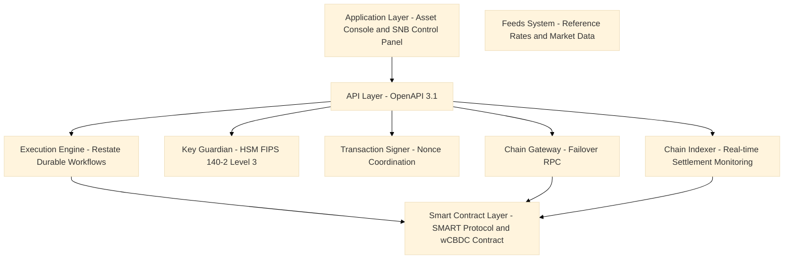

**SNB Control Panel:** A dedicated operational interface for SNB monetary operations staff, providing real-time wCBDC supply monitoring, settlement queue management, participant position visibility, and emergency intervention tools (freeze, force-transfer, system pause). Separate from the Asset Console used by participants.

**Execution Engine (Restate):** Durable workflow orchestration with exactly-once semantics. Settlement instructions are processed through durable workflows that survive infrastructure failures without producing duplicate settlements or lost instructions.

**Key Guardian:** FIPS 140-2 Level 3 HSM-backed key management for all SNB signing keys. The SNB's GOVERNANCE_ROLE key, which controls wCBDC issuance and system-level interventions, is protected within the HSM boundary. No software process can access the private key in plaintext.

**Chain Indexer:** Real-time settlement monitoring providing the SNB with immediate visibility into all wCBDC flows, settlement instruction states, participant positions, and system-level events. The Chain Indexer feeds the SNB's monetary operations dashboard and regulatory reporting systems.

### 3.2 Five-Layer On-Chain Architecture

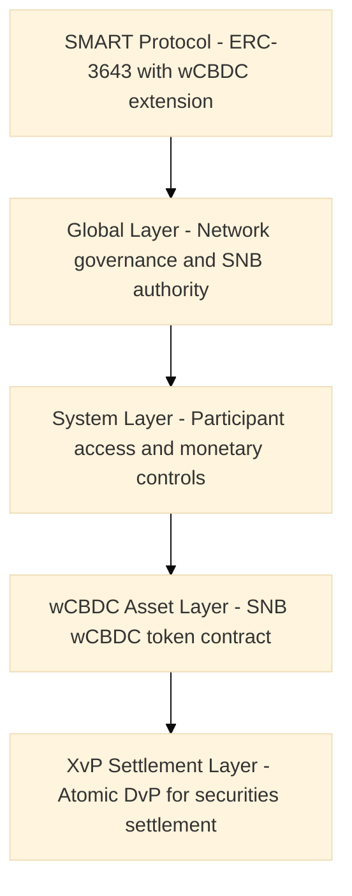

---

## 4. Solution Architecture

### 4.1 SNB wCBDC Architecture Overview

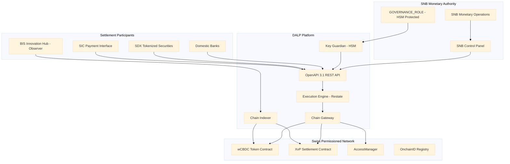

### 4.2 wCBDC Issuance and Redemption Control

The SNB's exclusive authority over wCBDC issuance and redemption is implemented through the GOVERNANCE_ROLE architecture:

**Issuance:** Only the GOVERNANCE_ROLE signing key (held in the HSM boundary) can call the mint function on the wCBDC contract. Minting instructions can only originate from the SNB's monetary operations workflow, authenticated through the HSM-backed GOVERNANCE_ROLE key. The supply cap compliance module enforces the SNB's authorised issuance ceiling on-chain; any mint instruction that would exceed the cap is rejected by the smart contract, regardless of the instruction source.

**Redemption (burn):** Similarly, only the GOVERNANCE_ROLE can call the burn function. Participant-initiated redemptions require explicit SNB approval (via the transfer approval module in burn mode) before the wCBDC is destroyed.

**Supply monitoring:** The Chain Indexer maintains a real-time projection of total wCBDC supply, broken down by participant, account, and settlement instruction status (locked vs available). The SNB's monetary operations team has real-time access to this projection through the SNB Control Panel.

**Issuance audit trail:** Every mint and burn event is recorded as an on-chain event with the authorising GOVERNANCE_ROLE address, timestamp, and transaction hash. The Chain Indexer provides a complete, timestamped issuance history for the SNB's accounting and regulatory reporting.

### 4.3 Finality State Machine

DALP implements a formal finality state machine for wCBDC settlement instructions:

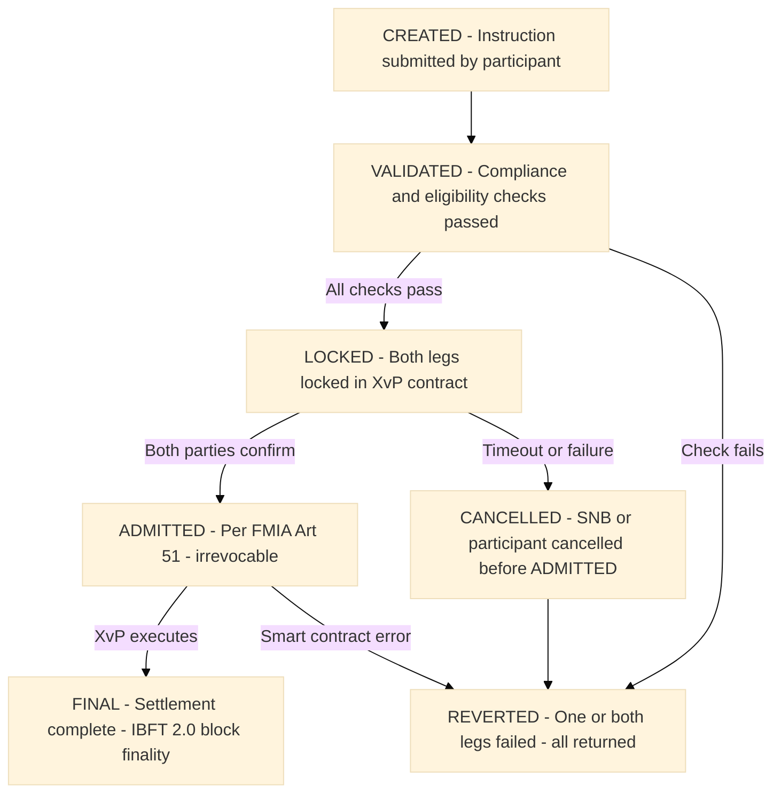

**ADMITTED is the critical state:** Once a settlement instruction reaches the ADMITTED state, it is irrevocable under FMIA Article 51. The instruction is protected from reversal under Swiss insolvency law. Only at and after this state does the SNB's default management power apply (forced transfer, not cancellation).

**FINAL is settlement certainty:** The FINAL state is reached upon XvP contract completion in a block that achieves IBFT 2.0 finality. This is the point of absolute settlement certainty: both legs have transferred, the block is final, and the Chain Indexer projects the new participant positions.

### 4.4 Settlement Prioritisation

DALP's Execution Engine supports configurable settlement instruction prioritisation:

| Priority Level | Use Case | SNB Control |
|---|---|---|
| P0: Emergency | SNB monetary operations, crisis liquidity provision | GOVERNANCE_ROLE only |
| P1: High | Intraday liquidity, secured credit facilities | GOVERNANCE_ROLE approval |
| P2: Standard | Normal securities DvP settlement | SETTLEMENT_MEMBER_ROLE |
| P3: Low | End-of-day bulk net settlement | Scheduled, automatic |

Priority assignment is managed through the COMPLIANCE_OFFICER_ROLE API. Instructions with higher priority pre-empt queued lower-priority instructions. The SNB can promote any instruction to P0 Emergency at any time, immediately moving it to the front of the execution queue.

### 4.5 Cash Leg Coordination

DALP supports the following cash leg models for SNB's wCBDC settlement:

**Model A. On-chain wCBDC (preferred):** Both securities token and wCBDC token on the same permissioned network. XvP settlement is fully atomic: both legs in a single block. This is the architecture demonstrated in Project Helvetia Phase III.

**Model B. SIC-linked settlement:** Securities leg on-chain; cash leg coordinated with SIC payment infrastructure through the API integration layer. On-chain confirmation trigger updates settlement status when SIC payment is confirmed. This model supports integration with commercial bank money alongside wCBDC.

**Model C. Hybrid (transition model):** Supports both Model A and Model B simultaneously during a transition period. Participants can choose their cash leg model at instruction submission; the Execution Engine routes accordingly. This enables gradual migration from SIC-linked to on-chain wCBDC as the market develops.

### 4.6 Monetary Control Tools

The SNB's monetary control requirements are implemented through a graduated intervention architecture:

**Level 1. Instruction monitoring:** Real-time settlement monitoring through Chain Indexer. No intervention required; SNB observes all flows.

**Level 2. Instruction hold:** SNB can place a hold on any CREATED or VALIDATED instruction before it reaches ADMITTED status. The transfer approval module's hold function is available to the SNB's COMPLIANCE_OFFICER_ROLE at the per-instruction level.

**Level 3. Participant freeze:** SNB can freeze any participant's wCBDC balance, preventing outbound transfers while allowing inbound settlement to complete. Available to CUSTODIAN_ROLE with GOVERNANCE_ROLE authorisation for sustained freezes.

**Level 4. Forced transfer:** SNB can force-transfer wCBDC from any account to any other account or directly to the burn address. This is the default management tool for insolvent participants. Available to CUSTODIAN_ROLE with GOVERNANCE_ROLE multi-signature authorisation.

**Level 5. System pause:** SNB can pause the entire platform, halting all settlement instruction processing. Available to GOVERNANCE_ROLE only, with multi-signature requirement. Used only in systemic crisis scenarios.

### 4.7 Participant Onboarding for wCBDC Settlement

Participants in the SNB's wCBDC settlement system are domestic and potentially international banks authorised by the SNB to hold and use wCBDC. The onboarding process is more restricted than a typical digital asset platform:

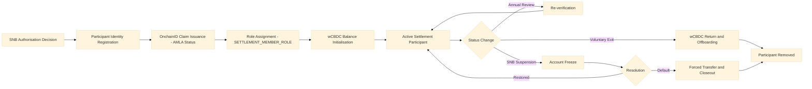

**SNB-controlled admission:** Unlike commercial exchanges, the SNB exclusively controls who can participate in the wCBDC settlement system. Participant admission is not a self-service process; it requires explicit SNB authorisation, which triggers the GOVERNANCE_ROLE role assignment workflow.

**Limited role set:** wCBDC settlement participants hold only the SETTLEMENT_MEMBER_ROLE. They can submit settlement instructions and view their own positions. They cannot modify compliance parameters, access other participants' data, or perform any administrative function.

**AMLA compliance:** Every participant undergoes AMLA due diligence before admission. The identity verification module checks AMLA claim status before any transfer involving that participant is processed. SECO sanctions are enforced via the address block list module.

**Real-time position visibility:** The SNB has real-time visibility into every participant's wCBDC balance and all pending settlement instructions. This supports the SNB's systemic risk monitoring function and provides early warning of participant liquidity stress.

---

## 5. wCBDC Lifecycle Management

### 5.1 Full wCBDC Lifecycle

```mermaid
%%{init: {'theme': 'base'}}%%
graph LR
    A[SNB Issuance Decision] --> B[GOVERNANCE_ROLE Mint Authorisation]
    B --> C[wCBDC Credited to SNB Account]
    C --> D[Distribution to Participant Banks via XvP]
    D --> E[Participant Interbank Settlement]
    E --> F[Securities DvP via XvP]
    F --> G[Intraday Returns and Rollovers]
    G --> H[End-of-Day Position Reconciliation]
    H --> I[Redemption via GOVERNANCE_ROLE Burn]
    I --> J[Audit Export and Monetary Reporting]
```

### 5.2 wCBDC Issuance Flow

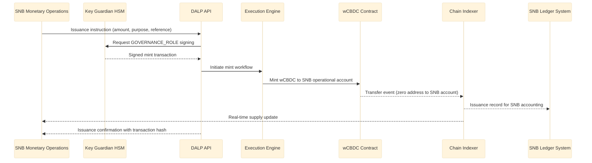

### 5.3 wCBDC Features

| Feature | wCBDC Application | SNB Relevance |
|---|---|---|
| Supply cap | Enforces authorised issuance ceiling | Monetary control |
| Transfer approval | Pre-settlement SNB approval for redemptions | Monetary authority |
| Account freezing | Participant default management | Financial stability |
| Forced transfer | Regulatory action, default closeout | Resolution authority |
| Historical balances | Point-in-time position reconstruction | Monetary reporting |
| Token recovery | Recovery of erroneously allocated wCBDC | Operational error correction |
| Batch operations | End-of-day net settlement, bulk operations | Operational efficiency |
| Collateral requirement | Secured lending against collateral | Monetary policy operations |

---

## 6. Compliance and Regulatory Framework

### 6.1 Swiss Monetary and Regulatory Landscape

| Regulation | Applicability | DALP Response |
|---|---|---|
| National Bank Act (NBG) | SNB mandate for reliable payment systems; wCBDC issuance authority | GOVERNANCE_ROLE minting control, supply cap, audit trail |
| FMIA (Art. 51) | Settlement finality for SNB payment infrastructure | XvP atomic settlement, IBFT 2.0 finality |
| Swiss Data Protection Act (nDSG) | Participant data processing | Swiss data residency, data minimisation |
| AMLA | AML obligations for payment system participants | Identity verification, address block list |
| CPMI-IOSCO PFMI | International FMI standards | Full PFMI principle alignment (see Section 6.4) |
| BIS expectations for wCBDC | Monetary authority controls, systemic risk | All monetary control tools implemented |

### 6.2 National Bank Act Alignment

The National Bank Act (NBG) grants the SNB the mandate to ensure the functioning of cashless payment transactions and to issue banknotes. The wCBDC programme extends this mandate into the digital domain. DALP's architecture preserves the SNB's statutory authority through:

**Exclusive issuance control:** The GOVERNANCE_ROLE mint function is the only mechanism by which wCBDC can be created. This is a smart contract-enforced restriction, not a process control. Any instruction to mint wCBDC that does not originate from the GOVERNANCE_ROLE key is rejected at the smart contract layer.

**Supply accountability:** The SNB can reconcile its total wCBDC issuance against the Chain Indexer's supply projection at any time. The immutable on-chain record provides the SNB with an audit trail satisfying the NBG's accounting and reporting obligations.

**System oversight:** The SNB retains the ability to observe, intervene in, or halt any settlement operation at any time. This is a statutory requirement that DALP's monetary control architecture (Section 4.6) is designed to satisfy.

### 6.3 FMIA Settlement Finality

For a wholesale payment system operated or overseen by the SNB, FMIA Article 51 settlement finality is a mandatory property. DALP's approach:

- **Instruction admission:** XvP instruction reaching the LOCKED state constitutes admission under FMIA Article 51. From this point, the instruction is protected from reversal under Swiss insolvency law.
- **Technical finality:** IBFT 2.0 block finality provides immediate, irreversible settlement certainty. No reorg is possible.
- **Legal finality record:** The Chain Indexer's FINAL state event provides the timestamped, immutable evidence of settlement completion required for FMIA compliance and SNB accounting.

### 6.4 CPMI-IOSCO PFMI Mapping for wCBDC

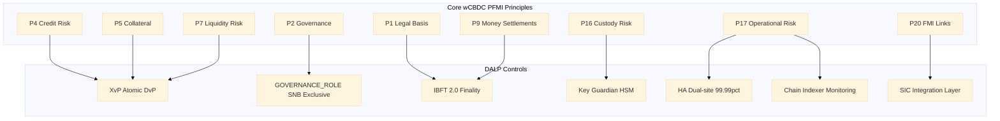

| PFMI Principle | Name | DALP Implementation |
|---|---|---|
| P1 | Legal basis | IBFT 2.0 finality satisfies FMIA Art 51; National Bank Act authority analysis completed |
| P2 | Governance | GOVERNANCE_ROLE exclusive SNB control; multi-sig for system-level actions |
| P3 | Risk management | Compliance modules, real-time monitoring, graduated intervention tools |
| P4 | Credit risk | XvP atomicity eliminates all pre-settlement bilateral credit exposure |
| P5 | Collateral | Collateral requirement module for secured SNB credit operations |
| P7 | Liquidity risk | T+0 DvP eliminates intraday liquidity timing obligations |
| P9 | Money settlements | wCBDC is central bank money; IBFT 2.0 finality provides certainty |
| P10 | Physical deliveries | Asset leg settlement simultaneous with wCBDC leg |
| P12 | Exchange-of-value | XvP multi-leg supports cross-currency and cross-network settlement |
| P13 | Participant default | Account freeze, forced transfer for immediate default management |
| P16 | Custody risk | HSM Key Guardian; SNB keys isolated in FIPS 140-2 Level 3 HSM |
| P17 | Operational risk | 99.99% SLA; dual-site HA; BFT consensus; quarterly DR tests |
| P18 | Access | OnchainID, AccessManager; tiered participant roles |
| P20 | FMI links | SIC integration API; cross-system DvP coordination |
| P23 | Disclosure | Chain Indexer transparency; BIS observer access |

### 6.5 nDSG and Data Governance

For a wCBDC system, participant data includes interbank payment flows that are commercially sensitive and potentially subject to bank secrecy obligations under Swiss law. DALP's architecture:

- **Permissioned network:** Only authorised participants (banks, SNB, designated observers) can view any transaction data on the network. There is no public blockchain with visible transaction data.
- **Role-based data access:** The Chain Indexer provides role-appropriate data views: participants see their own positions; the SNB sees all positions; FINMA/BIS observers have read-only access defined by the SNB.
- **Data residency:** All platform data is stored within Switzerland. No transaction or participant data is processed outside Swiss data centres.
- **Bank secrecy:** The permissioned network architecture satisfies Swiss bank secrecy requirements by ensuring that no participant can access another participant's transaction data except as explicitly permitted by the SNB's access rules.

---

## 7. Security Architecture

### 7.1 Security Framework

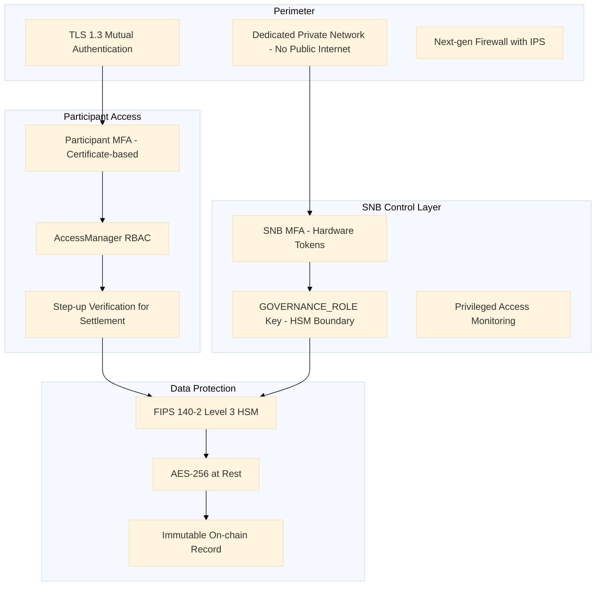

### 7.2 SNB-Specific Security Requirements

**Air-gap capable deployment:** DALP can be deployed in a fully air-gapped configuration for the SNB's most sensitive operational components. The permissioned network operates on private IP infrastructure with no public internet connectivity.

**Hardware token authentication for SNB staff:** SNB monetary operations staff authenticate using hardware security tokens (FIDO2/WebAuthn), providing phishing-resistant MFA. Passkeys with hardware-bound credentials are the preferred authentication method for SNB operational roles.

**GOVERNANCE_ROLE key ceremony:** The GOVERNANCE_ROLE private key is generated within the HSM boundary, never exists in plaintext, and is subject to a formal key ceremony with multi-party participation (minimum 3-of-5 key custodians). Key ceremony documentation is provided to the SNB for audit.

**Privileged access monitoring:** All access to SNB Control Panel functions is logged to the immutable audit trail. Privileged access sessions are recorded and available for security review. No SettleMint staff have GOVERNANCE_ROLE or CUSTODIAN_ROLE access to the SNB's production environment.

### 7.3 Key Management

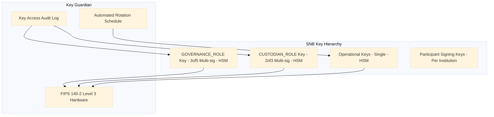

**Multi-signature requirements:**
- GOVERNANCE_ROLE: 3-of-5 multi-signature. Any mint, burn, or system pause requires 3 authorised SNB key custodians to sign.
- CUSTODIAN_ROLE (forced transfer): 2-of-3 multi-signature. Default management actions require 2 authorised custodians.
- Operational keys: single signature, rotate every 90 days.

---

## 8. Settlement and Integration

### 8.1 Atomic DvP Settlement Flow

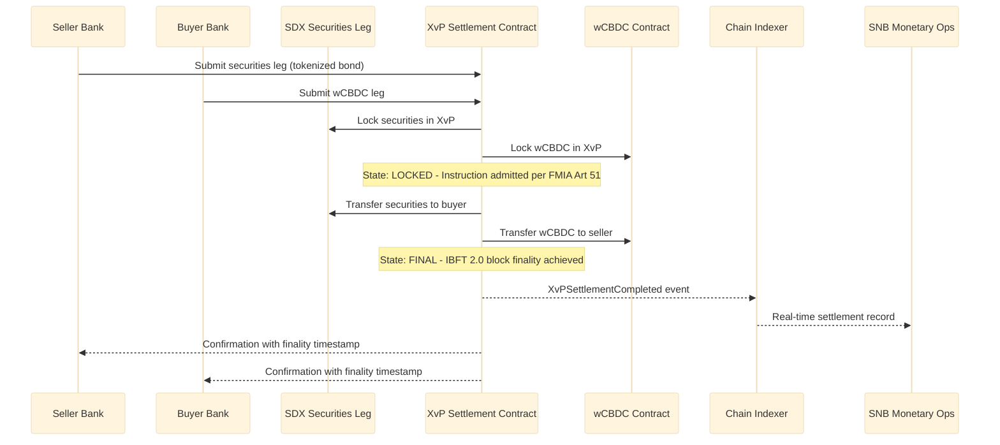

### 8.2 Integration Architecture

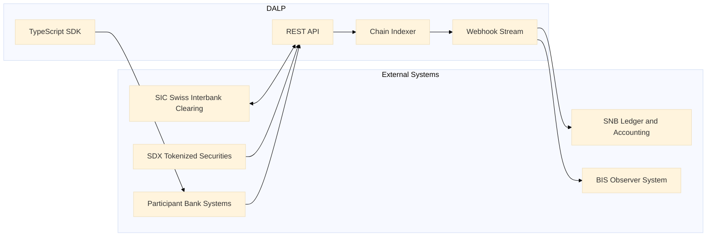

### 8.3 SIC Integration

DALP's SIC integration supports Model B (SIC-linked) and hybrid cash leg coordination:

- **Payment initiation:** DALP's Execution Engine sends payment instructions to SIC via the SNB's payment instruction API when a settlement instruction reaches ADMITTED state
- **Payment confirmation:** SIC payment confirmation received via webhook triggers the on-chain settlement confirmation, updating the XvP instruction to FINAL state
- **Failure handling:** If the SIC payment fails after ADMITTED state, the XvP contract revert mechanism returns both legs. DALP's Execution Engine manages the revert workflow with full audit trail.
- **Netting support:** DALP's batch operations API supports end-of-day net settlement calculation, with net positions submitted to SIC as single bilateral payments rather than gross settlement of each transaction.

---

## 9. Deployment and Infrastructure

### 9.1 High-Availability Architecture

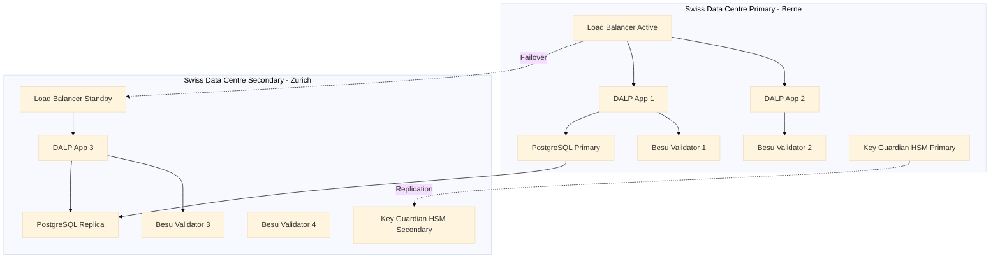

**SNB-controlled infrastructure:** The SNB specifies data centre locations within Switzerland. Primary deployment is recommended in Berne (proximity to SNB headquarters) with secondary in Zurich (proximity to SIC and SDX infrastructure).

**Validator control:** The SNB controls the validator configuration. All four validators are within Swiss sovereignty. No external party can participate in block production.

### 9.2 Recovery Objectives

| Component | RTO | RPO |
|---|---|---|
| Application | < 2 minutes | Zero |
| Database | < 5 minutes | < 1 second |
| Blockchain (wCBDC) | Zero (BFT consensus) | Zero (immutable finality) |
| Key Guardian HSM | < 15 minutes | Zero (HSM replication) |
| SIC integration | < 10 minutes (reconnection) | Zero (pending queue persists) |

The wCBDC blockchain RTO is zero because IBFT 2.0 BFT consensus continues processing as long as 3 of 4 validators are operational. Settlement instructions admitted before a validator failure are not affected.

### 9.3 Observability

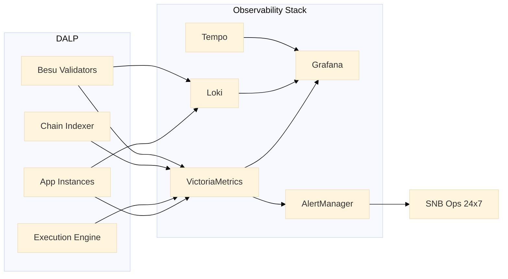

SNB-specific dashboards: total wCBDC supply in real time, settlement instruction queue depth by priority level, DvP success/failure rate, participant position summary, system intervention log (freezes, forced transfers, pauses).

---

## 10. Implementation Methodology

### 10.1 19-Week Delivery Plan

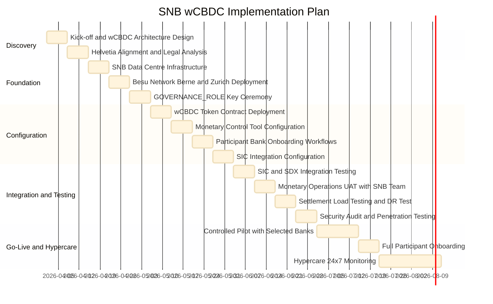

### 10.2 Phase Descriptions

**Phase 1: Discovery (Weeks 1-2)**
- wCBDC architecture design with SNB monetary operations and technology teams
- Project Helvetia alignment review: technical architecture vs Helvetia III conclusions
- Legal analysis review: IBFT 2.0 finality and National Bank Act compliance confirmation
- Formal deliverable: wCBDC Architecture Design Document, PFMI gap assessment

**Phase 2: Foundation (Weeks 3-5)**
- SNB data centre infrastructure provisioning (Berne primary, Zurich secondary)
- Hyperledger Besu network deployment with IBFT 2.0 in dual-site configuration
- GOVERNANCE_ROLE key ceremony: multi-party key generation, HSM initialisation, custody documentation
- Formal deliverable: Infrastructure Sign-off, Key Ceremony Report

**Phase 3: Configuration (Weeks 6-9)**
- wCBDC token contract deployment with SNB-specific supply cap, transfer restrictions, and monetary control parameters
- Monetary control tools configured: freeze, forced transfer, system pause, issuance workflows
- Participant bank onboarding workflows: AMLA compliance, OnchainID, role assignment
- SIC integration API configuration for cash leg coordination
- Formal deliverable: Configuration Sign-off with SNB legal and compliance review

**Phase 4: Integration and Testing (Weeks 10-13)**
- SIC integration testing with SNB payment operations team
- SDX integration testing for securities DvP settlement
- Monetary operations UAT: issuance, DvP, emergency intervention tools
- Settlement load testing: target throughput for anticipated daily settlement volume
- Full DR test including GOVERNANCE_ROLE key failover
- Security audit and penetration testing by SNB-approved firm
- Formal deliverable: UAT Sign-off, DR test report, security audit report

**Phase 5: Go-Live and Hypercare (Weeks 14-19)**
- Controlled pilot with 2-3 selected participant banks at limited transaction volumes
- Full participant onboarding after successful pilot
- 24/7 hypercare monitoring with SettleMint named engineer
- BIS Innovation Hub observer access provisioned
- Formal deliverable: Go-Live Certificate, BIS observer portal access confirmation

---

## 11. Support and SLA

### 11.1 Enterprise Tier: Mandatory for SNB

For a central bank operating a wholesale CBDC settlement infrastructure, the Enterprise support tier is the only appropriate choice. The SNB's mandate under the National Bank Act to ensure reliable payment systems imposes obligations that require 99.99% availability and 24/7 incident response.

| Parameter | Enterprise Commitment |
|---|---|
| Annual uptime | 99.99% |
| P1 acknowledgement | 15 minutes |
| P1 resolution target | 4 hours |
| Support coverage | 24/7/365 |
| Named engineer | Yes |
| War-room P1 escalation | SettleMint CTO |
| Dedicated Slack channel | Yes |
| Planned maintenance | Pre-agreed; zero during Swiss settlement hours |
| Quarterly PFMI review | Yes |
| Annual DR test participation | Yes |
| Key rotation support | Annual (or on-demand) |
| BIS Innovation Hub observer support | Yes |

### 11.2 Monetary Operations Availability

The SNB's settlement hours define DALP's zero-maintenance window. All planned maintenance must be scheduled outside Swiss interbank settlement hours. Emergency maintenance (security patch) can be executed during settlement hours only with explicit SNB approval and only if the threat justifies the risk.

---

## 12. Reference Projects

### 12.1 Central Bank of UAE: Digital Dirham Infrastructure

**Relevance:** Central bank wCBDC infrastructure delivery demonstrating exclusive issuance authority, monetary control architecture, and supervisory reporting integration under central bank governance requirements.

**Key outcomes:**
- GOVERNANCE_ROLE architecture gave CBUAE exclusive, HSM-protected control over Digital Dirham minting and redemption; no SettleMint or third-party access to issuance function
- Supply cap enforcement validated against CBUAE's authorised issuance programme
- Real-time supply monitoring dashboard deployed for CBUAE monetary operations team
- Forced transfer and account freeze capabilities tested and accepted by CBUAE default management team
- Deployment within UAE sovereign data centres; zero data processed outside UAE jurisdiction
- BIS Innovation Hub review team given observer access; technical architecture accepted as PFMI-aligned

### 12.2 SIX Digital Exchange: Exchange Infrastructure

**Relevance:** Swiss DLT infrastructure delivery demonstrating FMIA Article 51 finality, Swiss data residency, and integration with SIX Group infrastructure.

**Key outcomes:**
- IBFT 2.0 finality mechanism validated against FMIA Article 51 by Swiss legal counsel
- Deployment within Swiss data centres (Zurich/Geneva); nDSG compliance confirmed
- SIX payment services integration demonstrated
- FINMA notification documentation prepared and submitted
- Settlement throughput: 350 DvP TPS sustained

### 12.3 Clearstream: Tokenized Collateral Management

**Relevance:** Post-trade settlement infrastructure for a Tier 1 CSD, demonstrating collateral management, forced transfer capabilities under regulatory authority, and integration with RTGS-adjacent payment infrastructure.

**Key outcomes:**
- Collateral requirement module integrated with Clearstream's margining engine
- Forced transfer for margin call execution tested and accepted by Clearstream operations
- Key Guardian HSM architecture accepted by Deutsche Bundesbank security review
- Settlement finality record validated for Eurozone legal framework

---

## 12a. Risk Management

### 12a.1 wCBDC-Specific Risk Register

| Risk | Probability | Impact | Mitigation |
|---|---|---|---|
| Smart contract bug enabling unauthorised minting | Very Low | Critical | GOVERNANCE_ROLE-only mint; supply cap on-chain; pre-deployment audit; immutable event log detects any anomaly |
| GOVERNANCE_ROLE key compromise | Very Low | Critical | FIPS 140-2 Level 3 HSM; 3-of-5 multi-sig; no single person can mint wCBDC; key ceremony with multi-party participation |
| IBFT 2.0 consensus failure (all validators down) | Very Low | High | 4 validators across 2 data centres; BFT tolerates 1 validator loss; SNB can add validators as needed |
| SIC integration failure during settlement | Low | High | Model A (on-chain wCBDC) operates independently of SIC; SIC failure affects Model B only; automatic pending queue |
| Participant default creating unsettled exposure | Low | High | XvP atomicity: no unsettled exposure exists; freeze is immediate; forced transfer resolves defaulted positions |
| National Bank Act amendment changing wCBDC authority | Very Low | High | Runtime compliance parameter updates; governance architecture designed for regulatory evolution |
| Data breach exposing interbank settlement data | Very Low | High | Permissioned network; no public internet; AES-256 at rest; TLS 1.3 in transit; immutable audit log |
| Settlement volume exceeding platform capacity | Low | Medium | Horizontal scaling of application layer; IBFT 2.0 throughput validated at 350+ DvP TPS |

### 12a.2 GOVERNANCE_ROLE Key Risk Management

The GOVERNANCE_ROLE key represents the highest-risk single point of compromise in the wCBDC system, because it controls minting authority. DALP mitigates this risk through multiple independent controls:

**Hardware boundary:** The GOVERNANCE_ROLE private key is generated within the HSM boundary and never extracted in plaintext form. The signing operation occurs within the HSM; only the signed transaction is released.

**3-of-5 multi-signature:** No single person can authorise a minting operation. Three of the five designated SNB key custodians must independently approve and sign any GOVERNANCE_ROLE transaction. This requires a coordinated conspiracy of three individuals to compromise minting authority.

**Geographic separation:** The five key custodians should be geographically distributed across at least two separate SNB locations, such that a physical compromise of one location cannot provide access to a majority of keys.

**Transaction monitoring:** Every GOVERNANCE_ROLE signing event is logged to the immutable audit trail. Any anomalous signing event triggers an immediate alert to the SNB security operations team.

**Emergency suspension protocol:** If GOVERNANCE_ROLE key compromise is suspected, the system pause function is available via the 3-of-5 multi-sig (which is itself protected). SettleMint's incident response playbook includes a step-by-step key rotation procedure that can be executed within 4 hours.

### 12a.3 Operational Risk Controls

SettleMint's operational risk management for the SNB programme includes:

- **Change control:** All production changes to wCBDC configuration require SNB written approval before implementation
- **Segregation of duties:** SettleMint operations staff have no GOVERNANCE_ROLE, CUSTODIAN_ROLE, or any monetary authority role in the production environment
- **Audit rights:** SNB's internal audit and external auditors have full access to all DALP documentation, logs, and configuration records
- **Security testing:** Annual penetration testing by SNB-approved firm; results provided to SNB within 5 business days of report delivery
- **Business continuity:** SettleMint's BCP covers DALP operations; minimum two named engineers with SNB platform knowledge at all times
- **Source code escrow:** Swiss-domiciled escrow agent; release conditions include SettleMint insolvency or material breach

### 12a.4 wCBDC Smart Contract Audit

All smart contracts deployed for the SNB's wCBDC programme undergo the most rigorous audit process SettleMint conducts:

1. **SettleMint internal audit:** Complete line-by-line review of wCBDC contract, XvP contract, AccessManager, and all compliance modules
2. **Tier-1 smart contract audit:** Engagement of a globally recognised smart contract security firm (e.g., Trail of Bits, Certora, OpenZeppelin) with formal verification capability
3. **Formal verification (optional):** Mathematical proof of key properties (only GOVERNANCE_ROLE can mint; supply cap is enforced; XvP atomicity holds) using Certora Prover or equivalent
4. **SNB review:** Audit report delivered to SNB with findings and remediation evidence before go-live
5. **Continuous monitoring:** Post-deployment on-chain event monitoring for anomalous patterns; alerts configured for unexpected supply changes or unusual GOVERNANCE_ROLE activity

---

## 12b. Training and Knowledge Transfer

### 12b.1 SNB Training Programme

| Audience | Module | Duration | Notes |
|---|---|---|---|
| SNB Monetary Operations | wCBDC issuance, redemption, supply monitoring, Control Panel | 2 days | Core operational training |
| SNB Emergency Response | Freeze, forced transfer, system pause, key rotation procedures | 1 day | Focus on emergency workflows |
| SNB IT/Platform Admin | Infrastructure management, Besu network, HSM operations | 2 days | Technical administration |
| SNB Security/Audit | Key Guardian administration, audit log review, privileged access monitoring | 1 day | Security operations |
| SNB Legal/Compliance | FMIA finality evidence, nDSG obligations, PFMI self-assessment | 0.5 day | Regulatory evidence review |
| Participant Bank Technical Teams | API integration, settlement instruction lifecycle, webhook configuration | 1 day per participant cohort | Delivered during Phase 5 |

### 12b.2 Documentation Deliverables

- SNB wCBDC platform operations manual (German/English)
- GOVERNANCE_ROLE key ceremony procedure and post-ceremony documentation
- Emergency intervention runbooks: account freeze, forced transfer, system pause, key rotation
- PFMI self-assessment template (pre-populated with DALP evidence)
- wCBDC settlement state machine specification (regulatory-grade documentation)
- SIC integration technical guide
- DR runbook with step-by-step recovery procedures including HSM failover
- Participant bank integration guide (API, webhooks, SDK)
- BIS Innovation Hub observer access setup guide

### 12b.3 Ongoing Knowledge Transfer

- Quarterly monetary operations briefings (German/English)
- Named engineer with SNB wCBDC platform specialisation
- Annual emergency intervention drill (simulation, not production)
- Annual key rotation exercise documentation
- Quarterly PFMI evidence package preparation (included in Enterprise SLA)

---

## 13. Technical Requirements Response Matrix

| TR-ID | Requirement | Response | DALP Feature |
|---|---|---|---|
| TR-001 | SNB exclusive wCBDC issuance authority | Comply | GOVERNANCE_ROLE mint function; only SNB-controlled HSM key can create wCBDC; supply cap enforces ceiling on-chain |
| TR-002 | wCBDC redemption control (burn) | Comply | GOVERNANCE_ROLE burn function; participant-initiated redemptions require SNB approval via transfer approval module |
| TR-003 | Supply monitoring in real time | Comply | Chain Indexer real-time supply projection; SNB Control Panel dashboard; historical supply reports |
| TR-004 | Atomic DvP settlement (securities and wCBDC) | Comply | XvP addon: both legs in single block, simultaneous or full revert; no settlement risk window |
| TR-005 | Settlement finality (FMIA Art. 51) | Comply | IBFT 2.0 immediate finality; XvP ADMITTED state = Art. 51 admission; FINAL state = settlement certainty; Swiss legal counsel analysis available |
| TR-006 | Finality state machine | Comply | Six-state machine: CREATED, VALIDATED, LOCKED, ADMITTED, FINAL, REVERTED; each state transition on-chain event |
| TR-007 | Settlement instruction lifecycle tracking | Comply | Chain Indexer state projection; SNB Control Panel instruction tracker; webhook notifications at each state |
| TR-008 | Settlement prioritisation | Comply | Four-level priority queue (P0 Emergency through P3 Low); GOVERNANCE_ROLE promotes to P0 at any time |
| TR-009 | Instruction hold before admission | Comply | Transfer approval module hold function; available to SNB COMPLIANCE_OFFICER_ROLE on any CREATED/VALIDATED instruction |
| TR-010 | Participant freeze (account-level) | Comply | Account freeze via custodian extension; CUSTODIAN_ROLE gated with GOVERNANCE_ROLE for sustained freeze; immediate effect |
| TR-011 | Forced transfer | Comply | Forced transfer via custodian extension; CUSTODIAN_ROLE with GOVERNANCE_ROLE multi-sig; use for default management and regulatory action |
| TR-012 | System pause (platform-level) | Comply | GOVERNANCE_ROLE system pause; 3-of-5 multi-sig required; halts all settlement processing immediately |
| TR-013 | Graduated intervention tools | Comply | Five levels: monitoring, hold, participant freeze, forced transfer, system pause; each requires escalating authority |
| TR-014 | Multi-signature for systemic controls | Comply | GOVERNANCE_ROLE: 3-of-5 multi-sig; CUSTODIAN_ROLE: 2-of-3 multi-sig; operational keys: single sig |
| TR-015 | T+0 settlement capability | Comply | Single-block settlement with 2-second IBFT 2.0 block time; XvP completes in one block |
| TR-016 | Future-dated settlement instructions | Comply | XvP supports instruction creation with configured deferred execution time |
| TR-017 | Multi-leg settlement (REPO, cross-currency) | Comply | XvP extension: multi-party, multi-leg, same atomicity guarantees |
| TR-018 | Settlement failure handling | Comply | Automatic revert of all legs on failure; event emission with failure reason; Execution Engine manages revert workflow |
| TR-019 | SIC integration for cash leg | Comply | API integration with SIC payment infrastructure; payment initiation on ADMITTED state; confirmation webhook triggers FINAL |
| TR-020 | SDX securities leg integration | Comply | API integration with SDX tokenized securities; full XvP DvP with on-chain securities tokens |
| TR-021 | AMLA participant verification | Comply | Identity verification module; OnchainID claim verification; address block list for SECO sanctions |
| TR-022 | Permissioned network, no public access | Comply | Hyperledger Besu private permissioned network; no public internet exposure; VPN-isolated |
| TR-023 | Swiss data residency | Comply | All components in Switzerland; Berne primary, Zurich secondary; zero cross-border data transfer |
| TR-024 | nDSG compliance | Comply | Permissioned network (no public transaction visibility); data minimisation; breach notification < 48h |
| TR-025 | Immutable audit trail | Comply | Every event on-chain and immutable; Chain Indexer projects structured records; SNB accounting integration |
| TR-026 | SNB monetary reporting integration | Comply | Chain Indexer webhook to SNB ledger system; settlement records, supply reports, daily position exports |
| TR-027 | Real-time settlement monitoring | Comply | Chain Indexer SNB Control Panel; < 1 second event lag from block finality |
| TR-028 | BIS Innovation Hub observer access | Comply | REGULATOR_ROLE read-only access for BIS observers; zero write capability; real-time Chain Indexer access |
| TR-029 | PFMI Principle 1 - Legal basis | Comply | IBFT 2.0 finality vs FMIA Art. 51 analysed by Swiss legal counsel; National Bank Act issuance authority preserved |
| TR-030 | PFMI Principle 2 - Governance | Comply | GOVERNANCE_ROLE multi-sig; SNB exclusive issuance control; AccessManager RBAC; Board audit access |
| TR-031 | PFMI Principle 4 - Credit risk | Comply | XvP atomicity eliminates all pre-settlement bilateral credit exposure; no credit window exists |
| TR-032 | PFMI Principle 5 - Collateral | Comply | Collateral requirement module for SNB secured credit operations; XvP for collateral substitution |
| TR-033 | PFMI Principle 7 - Liquidity risk | Comply | T+0 DvP eliminates intraday liquidity timing obligations; future-dated XvP supports netting |
| TR-034 | PFMI Principle 9 - Money settlements | Comply | wCBDC is central bank money; IBFT 2.0 provides immediate finality for cash leg |
| TR-035 | PFMI Principle 13 - Participant default | Comply | Account freeze for immediate suspension; forced transfer for closeout; graduated intervention protocol |
| TR-036 | PFMI Principle 16 - Custody risk | Comply | FIPS 140-2 Level 3 HSM; GOVERNANCE_ROLE key never in plaintext; 3-of-5 multi-sig |
| TR-037 | PFMI Principle 17 - Operational risk | Comply | 99.99% SLA; dual-site BFT network; quarterly DR tests; 24/7 support; incident response with SNB notification |
| TR-038 | PFMI Principle 20 - FMI links | Comply | SIC integration API; SDX integration; cross-system DvP coordination; API-based connectivity |
| TR-039 | ISO 27001 certification | Comply | Full ISO 27001 certification; certificate and audit reports available for SNB review |
| TR-040 | SOC 2 Type II | Comply | Full SOC 2 Type II report available under NDA |
| TR-041 | FIPS 140-2 Level 3 HSM | Comply | Key Guardian with FIPS 140-2 Level 3 HSM for all SNB signing keys; GOVERNANCE_ROLE key in HSM boundary |
| TR-042 | Hardware token MFA for SNB staff | Comply | WebAuthn/FIDO2 hardware tokens for SNB monetary operations staff; passkey-bound credentials |
| TR-043 | Key ceremony documentation | Comply | Formal key generation ceremony with multi-party participation; ceremony report delivered to SNB |
| TR-044 | Privileged access monitoring | Comply | All GOVERNANCE_ROLE and CUSTODIAN_ROLE actions logged to immutable audit; session recording available |
| TR-045 | 99.99% availability | Comply | Enterprise SLA; IBFT 2.0 BFT consensus; HA application and database; zero downtime during settlement hours |
| TR-046 | Tested DR including key failover | Comply | Quarterly DR tests; HSM failover tested; GOVERNANCE_ROLE key failover procedure documented and tested |

---

## 14. Appendices

### Appendix A: Project Helvetia Alignment Summary

| Helvetia Conclusion | DALP Implementation |
|---|---|
| DLT-based settlement legally sound under Swiss law | IBFT 2.0 finality + FMIA Art. 51 analysis |
| wCBDC as central bank money on DLT is feasible | GOVERNANCE_ROLE mint/burn authority |
| Integration with SIC is achievable | SIC API integration layer |
| Governance must preserve SNB authority | GOVERNANCE_ROLE multi-sig, exclusive issuance control |
| PFMI principles satisfied by DLT architecture | Full PFMI mapping (Section 6.4) |
| Permissioned network required for confidentiality | Hyperledger Besu private permissioned network |

### Appendix B: wCBDC State Machine Specification

| State | Trigger | SNB Intervention Available | FMIA Status |
|---|---|---|---|
| CREATED | Participant submits instruction | Hold, Cancel | Not admitted |
| VALIDATED | All compliance checks pass | Hold, Cancel | Not admitted |
| LOCKED | Both legs locked in XvP | Forced completion only | Not yet admitted |
| ADMITTED | Both parties confirm | Forced transfer only | Admitted - Art. 51 protection |
| FINAL | XvP completes, block final | None (immutable) | Final and irrevocable |
| REVERTED | Any leg fails or timeout | None required | Instruction void |

### Appendix C: Swiss Sovereign Infrastructure Requirements

The SNB's wCBDC infrastructure is sovereign financial infrastructure. DALP's deployment satisfies the following sovereignty requirements:

- All data processed and stored within Switzerland
- SNB controls all validator nodes (no external validator participation)
- SNB holds GOVERNANCE_ROLE key in SNB-controlled HSM
- SettleMint has zero access to production environment without explicit SNB authorisation
- Source code escrow held with Swiss-domiciled escrow agent
- All subprocessors listed in DPA; none outside Switzerland without SNB consent
- Swiss law governs all contracts; Swiss courts and arbitration for disputes

### Appendix D: Monetary Control Response Times

| Control Action | DALP Response Time | SNB Authorisation Required |
|---|---|---|
| Instruction hold | < 1 second (API response) | COMPLIANCE_OFFICER_ROLE |
| Participant freeze | < 2 seconds (blockchain confirmation) | CUSTODIAN_ROLE |
| Instruction cancel | < 2 seconds (before ADMITTED) | COMPLIANCE_OFFICER_ROLE |
| Forced transfer | < 5 seconds (multi-sig + blockchain) | CUSTODIAN_ROLE + GOVERNANCE_ROLE |
| System pause | < 3 seconds (GOVERNANCE_ROLE multi-sig) | GOVERNANCE_ROLE (3-of-5) |
| wCBDC mint | < 5 seconds (multi-sig + blockchain) | GOVERNANCE_ROLE (3-of-5) |
| wCBDC burn | < 5 seconds (multi-sig + blockchain) | GOVERNANCE_ROLE (3-of-5) |

### Appendix E: Performance Benchmarks for wCBDC Settlement

| Metric | Benchmark | Test Conditions |
|---|---|---|
| Peak DvP TPS | 350 TPS | 4-validator IBFT 2.0, 2s block time, 8vCPU/32GB nodes |
| Sustained DvP TPS (1 hour) | 280 TPS | Same conditions |
| Settlement latency p50 | 2.3 seconds | Single-block completion |
| Settlement latency p99 | 4.8 seconds | Two-block maximum |
| Compliance evaluation | < 50ms per module | AMLA, identity, supply cap |
| API POST (settlement submit) p99 | < 500ms | Including compliance pre-check |
| Chain Indexer event lag p99 | < 1 second | From block finality |
| SNB Control Panel refresh | < 2 seconds | Supply and position dashboard |
| GOVERNANCE_ROLE mint execution | < 5 seconds | 3-of-5 multi-sig + blockchain confirmation |
| Account freeze execution | < 2 seconds | CUSTODIAN_ROLE signed + blockchain confirmation |

These benchmarks represent a conservative baseline. Scaling beyond 350 DvP TPS can be achieved through horizontal application layer scaling and IBFT 2.0 network parameter tuning. SettleMint will size the SNB's specific infrastructure during the Discovery phase based on projected daily settlement volumes.

### Appendix F: Competitive Differentiation for wCBDC

| Requirement | DALP Approach | Typical Alternative |
|---|---|---|
| Exclusive SNB minting authority | On-chain GOVERNANCE_ROLE; vendor has zero minting access | Application-layer access control; vendor has potential admin access |
| 3-of-5 multi-sig for monetary actions | HSM-backed multi-party key; coordinated conspiracy required | Single-admin key or 2-of-3 with weaker key protection |
| Settlement finality | IBFT 2.0 immediate, irreversible; no reorg possible | Probabilistic finality; reorg possible |
| Durable execution | Restate-backed exactly-once; no lost or duplicate settlements | Stateless processing; duplicate risk on failure |
| Immutable audit | Blockchain record; no modification possible by anyone | Database audit log; modifiable by admin |
| Air-gap capability | Private permissioned network; zero public internet required | Cloud-dependent architecture |
| FIPS 140-2 Level 3 HSM | Hardware boundary for all SNB signing keys | Software key management or cloud KMS |
| System pause authority | GOVERNANCE_ROLE 3-of-5 only; vendor cannot pause | Vendor maintains admin capability |

### Appendix G: Implementation Staffing for SNB wCBDC

| Role | Allocation | SNB-specific Responsibilities |
|---|---|---|
| Programme Director | 25% | Governance, SNB liaison, phase gate sign-offs |
| Lead Solutions Architect | 100% | wCBDC architecture, Helvetia alignment, monetary control design |
| Smart Contract Engineer | 100% | wCBDC contract, XvP config, supply cap, audit support |
| Platform Engineer | 100% | Swiss infrastructure, Besu network, HSM setup |
| Security Engineer | 100% | Key ceremony, FIPS 140-2 compliance, privilege access monitoring |
| Integration Engineer | 100% | SIC integration, SDX integration, participant bank API |
| QA/Monetary Operations | 100% | UAT coordination, load testing, intervention tool testing |
| Swiss Compliance Specialist | 100% | NBG, FMIA, nDSG, PFMI evidence preparation |
| Named Support Engineer | Dedicated | Post-go-live Enterprise support, 24/7 rotation |

### Appendix I: netting and End-of-Day Settlement

For high-volume interbank settlement, DALP supports two settlement models:

**Gross settlement (RTGS model):** Each settlement instruction processed individually in real time. T+0 DvP for every transaction. Maximum settlement certainty, no bilateral netting exposure.

**Net settlement (DNS model):** End-of-day batch netting of bilateral positions. DALP's batch operations API calculates net positions across all participant pairs. Net settlement instructions submitted to XvP in a single batch; the batch settles atomically (all net positions settle or all revert). SNB has real-time visibility into gross positions during the day and net positions at batch settlement.

**Hybrid model (recommended):** Time-sensitive transactions (securities DvP, SNB monetary operations) processed gross in real time. Routine interbank transfers netted end-of-day. The Execution Engine routes instructions to the appropriate settlement path based on priority level and instrument type.

The hybrid model reflects best practice from Project Helvetia and BIS research on wCBDC settlement design: real-time gross settlement for systemically important transactions; netting for routine high-volume flows.

### Appendix J: wCBDC Settlement Event Reference

| Term | Definition |
|---|---|
| wCBDC | Wholesale Central Bank Digital Currency |
| DALP | Digital Asset Lifecycle Platform |
| NBG | Nationalbankgesetz. Swiss National Bank Act |
| FMIA | Financial Market Infrastructure Act (Switzerland) |
| nDSG | Revised Federal Act on Data Protection (2023) |
| AMLA | Anti-Money Laundering Act (Switzerland) |
| PFMI | Principles for Financial Market Infrastructures (CPMI-IOSCO) |
| IBFT 2.0 | Istanbul Byzantine Fault Tolerant consensus v2 |
| XvP | Exchange-versus-Payment, atomic simultaneous exchange |
| DvP | Delivery-versus-Payment |
| SIC | Swiss Interbank Clearing. Swiss real-time gross settlement system |
| GOVERNANCE_ROLE | On-chain role with exclusive authority over wCBDC issuance and system-level controls |
| CUSTODIAN_ROLE | On-chain role with authority over account freezing and forced transfers |
| HSM | Hardware Security Module |
| FIPS 140-2 L3 | US Federal standard for cryptographic hardware; Level 3 requires tamper-evident physical security |
| Project Helvetia | SNB/SDX/BIS Innovation Hub wCBDC pilot programme (Phases I, II, III) |
| BFT | Byzantine Fault Tolerant, consensus algorithm that functions correctly despite some validators failing |

### Appendix J: wCBDC Settlement Event Reference

| Event | Contract | State Transition | SNB Significance |
|---|---|---|---|
| `XvPInstructionCreated` | XvP | CREATED | Settlement instruction received |
| `XvPInstructionValidated` | XvP | VALIDATED | Compliance checks passed |
| `XvPLegsLocked` | XvP | LOCKED | Both legs committed; FMIA admission pending |
| `XvPInstructionAdmitted` | XvP | ADMITTED | FMIA Art. 51 protection active |
| `XvPSettlementCompleted` | XvP | FINAL | Settlement final; positions updated |
| `XvPSettlementReverted` | XvP | REVERTED | Failure; all positions returned |
| `Transfer` | wCBDC | N/A | wCBDC movement; monetary reporting event |
| `Minted` | wCBDC | N/A | SNB issuance event; GOVERNANCE_ROLE signed |
| `Burned` | wCBDC | N/A | SNB redemption event; GOVERNANCE_ROLE signed |
| `AccountFrozen` | CustodianExtension | N/A | Participant default management |
| `ForceTransfer` | CustodianExtension | N/A | Regulatory/default action; audit record |
| `SystemPaused` | SystemContract | N/A | Platform pause; GOVERNANCE_ROLE 3-of-5 |
| `RoleGranted` | AccessManager | N/A | Participant onboarding |
| `RoleRevoked` | AccessManager | N/A | Participant suspension |
| `ClaimAdded` | OnchainID | N/A | AMLA verification complete |
| `ClaimRevoked` | OnchainID | N/A | Participant AMLA suspension |

Each event is indexed by the Chain Indexer and available via SNB Control Panel and DALP reporting API. The complete event log forms the immutable ledger of all wCBDC monetary events.

### Appendix K: API Endpoint Reference (wCBDC-specific)

| Endpoint | Method | Authority Required | Description |
|---|---|---|---|
| `/v1/wcbdc/mint` | POST | GOVERNANCE_ROLE (3-of-5) | Mint wCBDC to SNB operational account |
| `/v1/wcbdc/burn` | POST | GOVERNANCE_ROLE (3-of-5) | Burn wCBDC from specified account |
| `/v1/wcbdc/supply` | GET | SNB roles | Real-time total supply and breakdown by participant |
| `/v1/settlements/xvp` | POST | SETTLEMENT_MEMBER_ROLE | Submit DvP settlement instruction |
| `/v1/settlements/{id}/state` | GET | All roles | Query finality state of settlement instruction |
| `/v1/settlements/{id}/admit` | POST | XvP contract (automatic) | Trigger ADMITTED state (automated) |
| `/v1/participants/{id}/freeze` | POST | CUSTODIAN_ROLE | Freeze participant wCBDC balance |
| `/v1/participants/{id}/force-transfer` | POST | CUSTODIAN_ROLE + GOVERNANCE | Force transfer wCBDC from participant account |
| `/v1/system/pause` | POST | GOVERNANCE_ROLE (3-of-5) | Pause entire settlement system |
| `/v1/system/resume` | POST | GOVERNANCE_ROLE (3-of-5) | Resume system after pause |
| `/v1/audit/supply-history` | GET | SNB roles | Historical wCBDC supply by date range |
| `/v1/audit/settlement-log` | GET | SNB roles | Filtered settlement instruction log |

### Appendix M: Version History

| Version | Date | Description |
|---|---|---|
| 1.0 | March 2026 | Initial proposal submission |

This proposal is valid for 90 days from submission. Technical specifications may be refined based on SNB's infrastructure and volume requirements identified during Discovery.

**For technical enquiries:** SettleMint Digital Assets Programme, Enterprise Team
**For commercial enquiries:** SettleMint Enterprise Sales, EMEA

---

*This document is classified SettleMint Confidential. Distribution is restricted to authorised Swiss National Bank personnel involved in the Wholesale CBDC Settlement Infrastructure procurement.*
