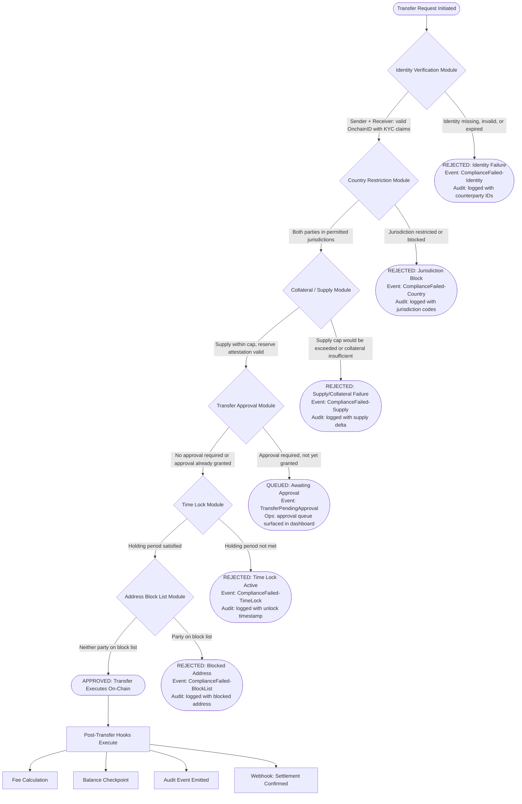
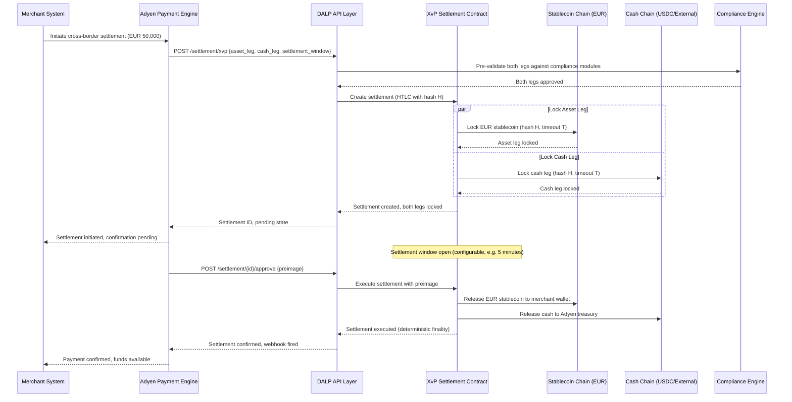
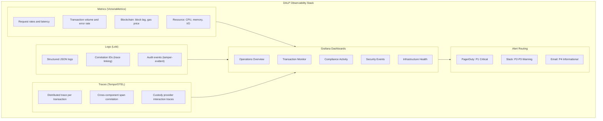
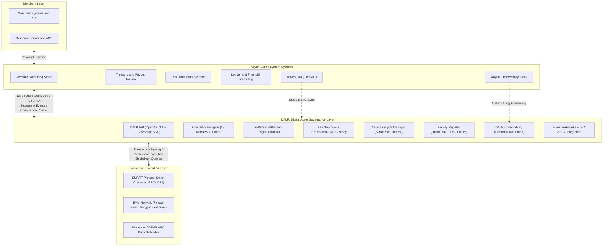
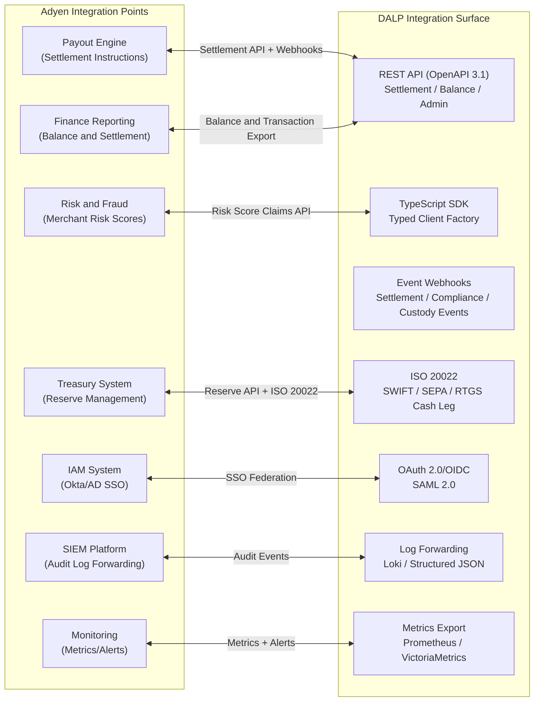
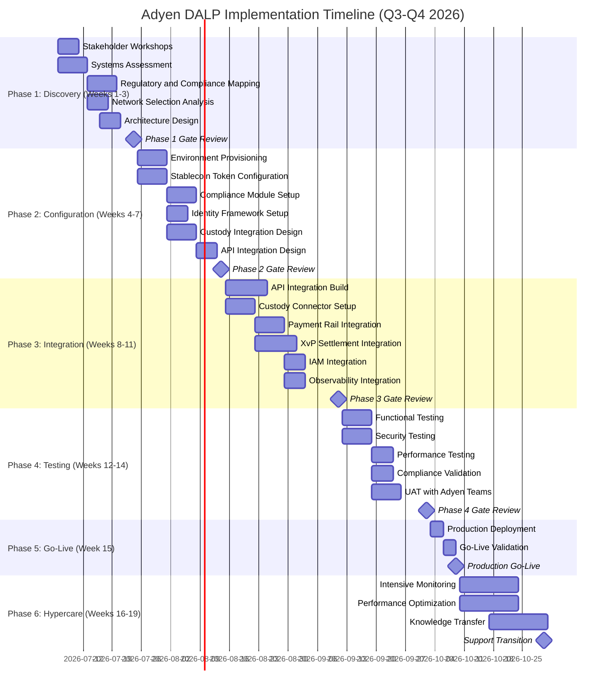
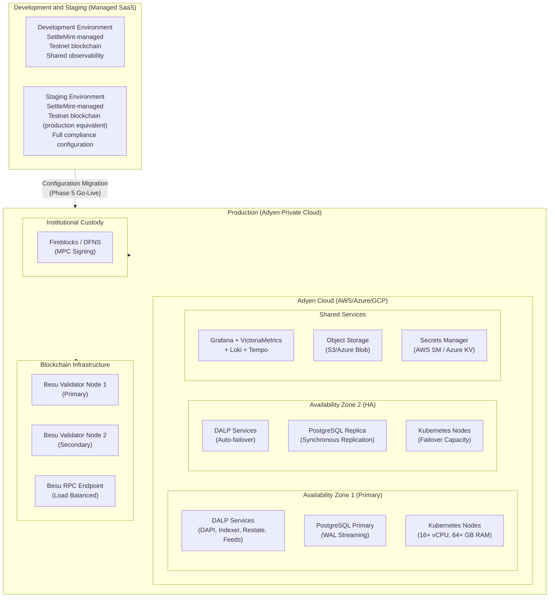

# Tokenized Payment Infrastructure
## Technical Proposal for Adyen N.V.
### SettleMint | March 2026 | v1.0 | SettleMint Confidential

---

**Prepared by:** SettleMint NV
**Prepared for:** Adyen N.V., Simon Carmiggeltstraat 6-50, 1011 DJ Amsterdam, Netherlands
**Document reference:** SM-TECH-ADYEN-2026-001
**Classification:** Strictly Confidential
**Version:** 1.0
**Date:** March 2026
**Contact:** bids@settlemint.com

---

## Table of Contents

1. Executive Summary
2. About SettleMint
3. About DALP
4. Customer References
5. Understanding of Requirements
6. Proposed Solution and Functional Capabilities
7. Technical Architecture
8. Security
9. Project Implementation and Delivery
10. Deployment
11. Training and Knowledge Transfer
12. Support and SLA
13. Risk Management
14. Compliance Matrix
15. Support Appendix

---

## Executive Summary

Adyen operates payment infrastructure that moves hundreds of billions of euros in merchant value annually. Its merchant ecosystem expects payment finality without ambiguity, settlement transparency without manual reconciliation, and operational continuity without explanation or exception. Introducing tokenized payment rails, stablecoin settlement capability, and programmable treasury functions into that environment is not a technology experiment. It is an operational and regulatory commitment that must fit within Adyen's existing standards of service, not carve out a separate digital-asset sidecar operating under different controls.

The challenge Adyen faces is not whether tokenized payment infrastructure is possible. It is whether it can be deployed as a production service under Dutch National Bank supervision, MiCA Article 55 stablecoin obligations, DORA ICT resilience requirements, PSD2 payment controls, and GDPR data handling rules, with the API quality, operational transparency, and integration realism that Adyen's merchant operations and internal engineering teams demand. Most technology vendors approach this problem by combining open-source blockchain tooling with bespoke middleware and presenting the result as a platform. The outcome is consistently the same: months of custom development, compliance gaps discovered during audit, and operational fragility at the first production incident.

SettleMint proposes DALP, the Digital Asset Lifecycle Platform, as the production infrastructure layer for Adyen's tokenized payment programme. DALP is not a pilot tool or a developer sandbox wrapped in enterprise language. It is a production-grade platform that has operated at regulated banks and sovereign entities for multiple years, handling bond settlements, stablecoin issuance, cross-currency atomic settlements, and DvP clearing under live institutional service level agreements. The platform sits between Adyen's existing payment systems and the blockchain execution layer, providing governance, compliance enforcement, custody orchestration, settlement coordination, and operational tooling that transforms tokenized payment infrastructure from a fragile one-off build into a controllable, auditable, scalable service.

### The Strategic Case for Tokenized Payment Infrastructure at Adyen

Stablecoin-denominated merchant settlements address three concrete problems that Adyen's merchant customers experience with traditional payment rails. Cross-border settlement delays caused by correspondent banking chains introduce counterparty risk and working capital inefficiency for merchants who need funds available before their next purchase cycle. Settlement finality ambiguity in card networks, where chargebacks and representments can claw back funds weeks after apparent settlement, creates uncertainty in merchant cash flow forecasting. Treasury management friction, particularly for merchants receiving settlement in multiple currencies, requires expensive foreign exchange intermediation that erodes margins on international transactions.

Tokenized payment rails, implemented on a production-grade platform with compliance controls and atomic settlement finality, address each of these problems. A merchant receiving tokenized settlement in a MiCA-compliant stablecoin receives funds with settlement finality in seconds rather than days, no ambiguity about reversibility after the settlement window closes, and programmable treasury management capabilities including automated currency hedging, yield generation on treasury balances, and direct payment to suppliers in their preferred currency. For Adyen, this creates a value proposition that traditional payment rails cannot match.

The regulatory environment is moving to accommodate this model. MiCA Article 55 creates the framework for electronic money token issuance by regulated entities within the EEA. The ECB's ongoing work on wholesale CBDC settlement signals that tokenized money movement will become a mainstream infrastructure choice within the medium-term planning horizon of Adyen's architecture team. The DNB has issued guidance on crypto-asset service provider obligations that creates a clear compliance path for Dutch-supervised payment institutions. Adyen is well-positioned to be a market leader in tokenized payment infrastructure if it moves now, before this capability becomes a commodity.

### Why DALP for Adyen

DALP addresses each of Adyen's stated procurement priorities with demonstrated production capability rather than roadmap promises.

Time to market: DALP's pre-built stablecoin and deposit templates, 18 configurable compliance modules, documented APIs, TypeScript SDK, and production-proven deployment patterns reduce the timeline from contract signature to production-capable deployment to 15 to 19 weeks. Custom blockchain infrastructure development for equivalent capability typically requires 18 to 24 months. The Commerzbank deployment achieved production-capable ETP settlement under 10 seconds within a comparable implementation timeline.

Developer experience: DALP exposes a complete OpenAPI 3.1 interface generated directly from procedure definitions (documentation cannot drift from implementation), a TypeScript SDK with typed client factory and automatic serialization of blockchain value types, event webhooks with retry logic and dead-letter handling, a CLI with 301 commands across 26 groups, and 534 structured error codes with metadata and SDK mirror. Adyen's internal engineering teams can own integration and operations without permanent vendor dependency.

Control maturity: DALP enforces compliance ex-ante through 18 compliance module types, meaning every transfer is validated against configured rules before execution rather than reviewed after. This produces the evidence trail that audit and regulatory functions require under MiCA, DORA, and AML/CFT obligations. ISO 27001 and SOC 2 Type II certifications confirm that security controls are independently audited and continuously maintained, not just designed.

Scalability: DALP's durable workflow engine (Restate) provides exactly-once execution semantics with persisted state across infrastructure failures. The async transaction pipeline with 11-state lifecycle management, idempotency, retry semantics, and dead-letter rescue handles peak retail payment volumes. The Kubernetes-native deployment architecture supports horizontal scaling for transaction processing components. The Commerzbank reference demonstrates sub-10-second settlement finality under institutional load on comparable infrastructure.

Commercial clarity: DALP licensing is structured across three deployment tiers (Foundation, Enterprise, Sovereign) with predictable annual subscription pricing. Implementation investment follows a milestone-based structure with explicit assumptions and exclusions. Commercial section of this proposal provides full pricing transparency.

### Three Reference Deployments Most Relevant to Adyen

Maybank Project Photon implemented tokenized FX settlement with atomic cross-currency exchange (XvP) using DALP. The MYRT token (tokenized Malaysian Ringgit) enabled atomic cross-currency swaps where both legs of a foreign exchange transaction settled simultaneously, eliminating counterparty risk and correspondent banking intermediation. This is the closest existing reference to Adyen's cross-border payment settlement use case.

Commerzbank deployed DALP for hybrid on/off-chain ETP issuance and management with Boerse Stuttgart listing service integration. Settlement finality achieved under 10 seconds with a model identifying EUR 7 million in annual operational savings. This reference demonstrates DALP's settlement speed capability at institutional scale.

OCBC Bank deployed DALP as a security token engine for structured financial products across bonds, SPVs, stocks, and real estate, integrating with off-chain securities and cash systems through DALP's API layer. This reference demonstrates the same payment-and-investment-product integration that Adyen needs to connect tokenized payment rails with its existing merchant acquiring and treasury infrastructure.

### Requirements Coverage Summary

| Requirement Domain | DALP Coverage | Evidence |
|---|---|---|
| Stablecoin issuance (MiCA Article 55) | Full | Stablecoin template, collateral module, attestation integration |
| Tokenized merchant balance management | Full | Deposit template, multi-wallet operations, batch processing |
| Atomic DvP/XvP settlement | Full | XvP contracts, HTLC cross-chain, local same-chain |
| MiCA compliance enforcement | Full | 18 compliance modules, ex-ante enforcement, audit trail |
| DORA ICT resilience | Full | HA deployment patterns, documented DR, durable execution |
| AML/CFT integration | Full | Identity verification module, OnchainID, country restrictions |
| API integration for Adyen engineering | Full | OpenAPI 3.1, TypeScript SDK, webhooks, CLI |
| Custody integration (Fireblocks/DFNS) | Full | Unified signer abstraction, provider-delegated broadcast |
| Observability and operations | Full | Grafana dashboards, distributed tracing, alerting |
| Multi-jurisdiction rollout controls | Full | Per-token compliance modules, jurisdiction activation |
| Role-based access and four-eyes controls | Full | 26 roles, on-chain enforcement, AccessManager |
| GDPR data handling | Full | Configurable data residency, deletion workflows |
| Phased rollout controls | Full | Token pause/unpause, feature flags, cohort controls |
| Audit evidence production | Full | Tamper-evident logs, configuration history, event trail |

This proposal provides the evidence-backed, requirement-specific answer to each of Adyen's stated procurement questions. The sections that follow cover the platform's capabilities, the proposed implementation for Adyen's specific context, the operating model after go-live, and the commercial structure of the engagement.

---

## About SettleMint

### Company Overview

SettleMint is the production-grade digital asset lifecycle management company for regulated financial markets and sovereign use cases. Founded nearly a decade ago, SettleMint has grown from an early enterprise blockchain infrastructure provider into the category-defining platform company enabling financial institutions, market infrastructure providers, and sovereign entities to move real-world value on-chain with compliance, security, and operational reliability.

SettleMint exists to bridge the gap between tokenization ambitions and production-grade execution. Tokenization technology is increasingly accessible, but institutional-grade implementation is not. Meeting regulatory requirements, implementing proper governance, supporting the full asset lifecycle, and ensuring that early pilots can scale into real institutional infrastructure: this is the complexity that most institutions underestimate. As regulatory frameworks mature and expectations shift from innovation theatre to operational reality, most organizations remain stuck in pilot mode, hampered by isolated internal experiments, underestimated operational complexity, and architectures that do not scale or withstand regulatory scrutiny.

SettleMint's mission is to enable regulated institutions to move from slides to balance sheets by turning digital asset strategy into operating systems that reduce time-to-market and remove operational and regulatory risk. For Adyen, this means providing the platform infrastructure that allows the company to launch tokenized payment infrastructure without building blockchain expertise internally, without navigating multi-vendor integration complexity, and without discovering compliance gaps during a DNB inspection.

### History and Market Position

SettleMint is not a new entrant reacting to the latest tokenization wave. The company has nearly a decade of focused experience building blockchain infrastructure for enterprises and regulated institutions. This sustained investment in technology and institutional relationships has produced a depth of expertise and operational maturity that cannot be replicated quickly.

The company's evolution reflects the broader maturation of the digital asset market. During the early enterprise blockchain era, SettleMint built foundational distributed ledger infrastructure for some of the world's most demanding enterprise environments, spanning financial services, supply chains, telecoms, and government entities. As financial institutions moved beyond proof-of-concept, SettleMint deepened its focus on the regulatory, governance, and operational requirements that separate pilot projects from production infrastructure. Multi-year continuous production deployments with regulated banks in Asia and Europe established SettleMint's credentials in compliance-heavy environments.

Recognising that the market needed more than issuance tools or custody solutions, SettleMint consolidated years of production experience into DALP, the Digital Asset Lifecycle Platform, providing coverage from asset design through issuance, compliance, custody integration, settlement, servicing, and retirement under a single governance model and operating framework.

Today, SettleMint operates at the intersection of digital assets and tokenization, institutional and sovereign infrastructure, and banking, capital markets, and government systems. Success in this market is not driven by innovation speed alone, but by the ability to make digital assets safe, compliant, operable, and repeatable at scale for regulated institutions.

### Production-Proven Credentials

SettleMint is one of the few companies globally with a decade-long track record delivering blockchain and tokenization infrastructure at enterprise and national scale, across some of the world's most demanding environments. Where trust, security, compliance, and uptime are non-negotiable, SettleMint removes execution risk and accelerates time to market with industrial-strength infrastructure that very few organisations can match.

Multi-year live deployments with regulated banks and sovereign entities deliver settlement finality, compliance enforcement, and operational availability under institutional service level agreements. These are not sandboxes or pilot programmes. They are business-critical workflows running under 24/7 uptime requirements with robust resilience and disaster-recovery expectations.

High-volume transactional flows in payments and settlements have operated on SettleMint infrastructure under peak load conditions, validating the platform's throughput and resilience architecture for Adyen's merchant payment volumes. Sovereign and national-scale programmes in the Middle East, including national real estate tokenization and sovereign-backed capital markets infrastructure, demonstrate SettleMint's ability to operate under the most demanding regulatory environments. Security-validated operations, including penetration testing and vendor risk assessments conducted by large financial institutions, confirm the platform's fitness for institutional deployment.

Many SettleMint customer programmes began as innovation pilots and matured using the same stack into business-critical workflows, long-lived platforms under IT ownership, and reference architectures for broader institutional tokenization programmes. This experience directly shaped DALP's focus on lifecycle, integration, and operational sustainability.

### Regulatory Readiness for European Payment Infrastructure

SettleMint's platform is built for regulated environments from day one. Rather than treating compliance as an afterthought or an add-on layer, SettleMint embeds regulatory controls, policy enforcement, and auditability into the core architecture of DALP.

For Adyen's European payment context, DALP's regulatory support covers:

MiCA (Markets in Crypto-Assets Regulation): native support for electronic money token and asset-referenced token structures. Compliance modules address MiCA Article 55 reserve requirements, supply transparency, and redemption at par. Governance controls address MiCA Article 34 governance obligations.

DORA (Digital Operational Resilience Act): ICT risk management, third-party dependency documentation, operational resilience testing, incident classification, and operational reporting. HA deployment patterns address DORA's operational continuity requirements.

GDPR: configurable data residency by deployment region, deletion and retention workflows, data subject access request support, and personal data minimization through on-chain claim hashing.

PSD2/EMD: payment service authorization controls, transaction monitoring integration, and reconciliation support for payment service obligations.

AML/CFT: identity verification compliance module requiring verified OnchainID for all transfer counterparties. Sanctions screening results published as on-chain claims by authorized sanctions providers.

Native support for the ERC-3643 (T-REX) regulated token standard, combined with OnchainID for verifiable on-chain investor identities, provides a compliance architecture that enforces eligibility before execution. This ex-ante compliance model, with 18 configurable compliance module types, enables institutions to navigate complex multi-jurisdictional requirements while maintaining the auditability and evidence trail that regulators expect.

### ISO 27001 and SOC 2 Type II Certifications

SettleMint holds ISO 27001 and SOC 2 Type II certifications. ISO 27001 confirms that SettleMint has established, implemented, maintained, and continuously improved a systematic approach to managing sensitive information. SOC 2 Type II goes beyond point-in-time control design to verify that security controls operate effectively over an extended audit period, confirming that access controls, change management, and incident response procedures are consistently enforced in practice.

These certifications are not marketing labels. They represent independent third-party validation that SettleMint's security posture meets the standard that financial institutions require when evaluating a technology partner for payment infrastructure. For Adyen's vendor risk assessment process, these certifications provide the evidence framework that procurement, InfoSec, and compliance teams require.

### Technology Partnerships and Ecosystem

SettleMint has built a partner ecosystem to scale implementations and support local requirements across Europe, MENA, and Asia-Pacific. Global consultancies trust SettleMint to design and implement digital asset programmes. Regional system integrators bring local market knowledge, regulatory expertise, and implementation capacity.

Infrastructure provider partnerships with Fireblocks and DFNS provide institutional MPC custody integration that Adyen can configure to its existing custody governance model. ISO 20022 payment rail connectivity enables SWIFT, SEPA, and RTGS integration, allowing the cash leg of settlement flows to operate over Adyen's existing payment infrastructure during migration.

Institutions engaging with SettleMint work with a team and ecosystem that has seen the full lifecycle of tokenization programmes, from idea to production, and can anticipate the technical, operational, and regulatory challenges that arise at scale. For Adyen, this means partnering with a vendor that has already navigated the compliance validation, security review, and operational readiness challenges that Adyen will face during implementation.

### Team and Expertise

The team behind SettleMint combines deep expertise across blockchain engineering, financial markets, and enterprise delivery. Founded by practitioners who have been working in blockchain and distributed systems since the early enterprise adoption wave, the company brings technical depth in protocol-level blockchain engineering, security architecture, and enterprise-grade systems design; financial domain knowledge in capital markets structure, custody models, settlement flows, and regulatory compliance across multiple jurisdictions; and enterprise delivery expertise in governance, change management, and integration with legacy infrastructure in demanding institutional environments.

The core team brings together 200 or more years of combined banking and blockchain experience. Dedicated solution architects, delivery leads, and customer success teams have implemented tokenization and DLT solutions in multiple jurisdictions and navigated the internal processes that large institutions require, including security review, vendor onboarding, and change control. For Adyen's payment infrastructure programme, this team provides the operational discipline and institutional credibility that the programme requires.

---

## About DALP

### Platform Overview

DALP is SettleMint's production-grade Digital Asset Lifecycle Platform for designing, launching, and operating tokenized assets across financial instruments and real-world assets, including bonds, funds, deposits, stablecoins, real estate, equities, and precious metals. For Adyen's tokenized payment programme, the most immediately relevant capabilities are stablecoin issuance and management, deposit token infrastructure, atomic DvP/XvP settlement, ISO 20022 payment rail integration, and the operational tooling that makes these capabilities manageable at payment scale.

DALP sits between Adyen's existing payment systems and the blockchain execution layer, providing the governance and orchestration layer that enables Adyen to build, deploy, and operate compliant tokenized payment services in production. Unlike point solutions that address only issuance, only custody, or only settlement, DALP provides a unified platform covering the full digital asset lifecycle from asset design through issuance, compliance enforcement, custody integration, settlement, servicing, and retirement, treated as one continuous lifecycle under a single governance model, security posture, and operating framework.

By abstracting the blockchain layer and embedding compliance and governance directly into the platform, DALP enables Adyen to move from exploration to execution much faster than custom development permits. The platform is designed to be operated over time, not just deployed once.

### Value Proposition for Adyen

DALP delivers measurable business outcomes for Adyen's tokenized payment programme. Accelerated time-to-market of 60 to 80 percent over custom development, driven by pre-built stablecoin and deposit templates, jurisdictional compliance templates, and modern APIs. Reduced operational risk through a single source of truth that eliminates multi-vendor drift and nightly reconciliations, with atomic operations keeping ownership, compliance, and custody synchronized. Regulatory confidence through compliance-by-design that enforces eligibility before execution and embeds auditable evidence of checks and approvals in the system that executes transfers. Scalable merchant settlement that expands across currencies, jurisdictions, and merchant segments using the same control plane, rule engine, and operating model. Strategic flexibility to deploy on-prem, cloud, or managed SaaS, connect to existing custodians and payment rails, and operate on public or private chains without architectural lock-in.

### Lifecycle Pillar: Issuance

DALP provides rapid deployment of tokenized assets across seven asset classes. For Adyen's payment infrastructure programme, the Stablecoin and Deposit templates are the primary asset types.

The Stablecoin template provides reserve monitoring through the collateral requirement compliance module, attestation integration where reserve attestations are published as on-chain claims by an approved attestor, multi-currency support through separate token deployments per currency under a unified governance model, regulatory reporting through DALP's event system and audit trail, and programmable transfer rules through configurable compliance modules.

The Deposit template provides programmable interest, maturity, withdrawal rules, and bridge functionality for external networks. This supports tokenized merchant balances and treasury positions that need to interact with external payment rails or yield-bearing instruments.

The Configurable Token type enables Adyen to digitise any additional instrument class beyond the seven pre-built templates, such as merchant reward points, loyalty tokens, or proprietary settlement instruments, using a composable token architecture with up to 32 pluggable features.

Issuance uses CREATE2 deterministic deployment through the factory pattern. The factory wraps proxy deployment, identity registration, compliance module initialization, and role assignment into a single atomic transaction. No partially deployed tokens can exist. The deployment workflow is durable through Restate: if any step fails, deployment can resume from the last confirmed state without creating orphaned contracts.

Token creation follows the paused-by-default pattern. Newly deployed tokens cannot transfer, mint, or burn until an operator with the Emergency role explicitly unpauses the asset, creating a mandatory compliance review gate between configuration and live operation. This deliberate friction is a control feature, not a usability limitation.

```mermaid
sequenceDiagram
    participant AdyenPM as Adyen Product Manager
    participant AssetDesigner as Asset Designer (UI)
    participant DAPI as DAPI (Middleware)
    participant Restate as Execution Engine (Restate)
    participant Factory as Asset Factory (On-chain)
    participant Identity as Identity Registry
    participant Compliance as Compliance Engine
    participant Chain as Blockchain Network
    participant Compliance_Team as Adyen Compliance Team

    AdyenPM->>AssetDesigner: Configure stablecoin (EUR, supply cap 500M, reserve rules)
    AssetDesigner->>DAPI: Submit configuration for validation
    DAPI->>Restate: Dispatch durable issuance workflow
    Restate->>Factory: Deploy UUPS proxy via CREATE2 (deterministic address)
    Factory->>Identity: Register token OnchainID
    Factory->>Compliance: Initialize: country restrictions, supply cap, collateral module
    Compliance-->>Factory: All modules bound and configured
    Factory->>Chain: Assign roles (admin, supply mgmt, custodian, governance, emergency)
    Chain-->>Factory: Roles confirmed atomically
    Factory-->>Restate: TokenDeployed event emitted
    Restate-->>DAPI: Deployment confirmed; token PAUSED by default
    DAPI-->>AssetDesigner: Token address, role matrix, compliance config summary
    AssetDesigner-->>AdyenPM: Configuration ready for compliance review

    Note over AdyenPM,Compliance_Team: Compliance review gate: mandatory before activation
    Compliance_Team->>DAPI: Validate compliance configuration against MiCA Article 55
    Compliance_Team->>DAPI: Unpause token (Emergency role authorization)
    DAPI->>Chain: Unpause transaction (wallet verification required)
    Chain-->>DAPI: Token active
    DAPI-->>Compliance_Team: Token live; operational monitoring active
```

### Lifecycle Pillar: Compliance

For a payment infrastructure provider operating under DNB supervision and MiCA obligations, compliance must be enforced before transactions execute. DALP's compliance architecture delivers this requirement through 18 compliance module types evaluated in sequence before any token transfer executes. This is protocol-level enforcement through the ERC-3643 standard, not application-layer validation that can be bypassed.

The compliance evaluation is fail-closed by design. The default response to an incomplete or ambiguous compliance evaluation is denial of the transfer. A single module veto blocks the transaction. All modules must explicitly approve for the transfer to proceed.

Compliance modules relevant to Adyen's payment use case include:

Identity verification module: requires every transfer counterparty to have a registered OnchainID with valid KYC/AML claims from a trusted issuer. Merchants and counterparties must complete KYC verification before receiving tokenized settlement. The verification result is published as an on-chain claim by Adyen's KYC provider and consumed automatically at transfer time.

Country restriction modules (allow list and deny list): enforce jurisdictional eligibility at the token contract level. For Adyen's multi-market rollout, different stablecoin tokens carry different country restriction configurations, enabling controlled market activation. A EUR stablecoin can be restricted to EEA-registered merchants while a cross-border settlement token carries broader jurisdictional permissions.

Supply cap module: limits total circulating supply, supporting MiCA Article 55 reserve and supply transparency obligations. Minting operations fail if they would exceed the configured supply cap, preventing over-issuance relative to reserve holdings.

Collateral requirement module: verifies on-chain proof of reserve backing before minting. Adyen's reserve attestation function publishes an on-chain claim confirming reserve adequacy; the collateral module checks this claim before approving any minting operation. This implements the attestation requirement under MiCA Article 55(8).

Transfer approval module: requires explicit operator approval for defined transfer categories. For Adyen's high-value settlement flows, transfers above a configured threshold can require four-eyes approval from an authorized compliance officer before execution.

Investor count limit: limits the number of unique token holders. For certain regulated product structures, limiting holder count simplifies regulatory reporting obligations.

Time lock: enforces minimum holding periods. For settlement instruments that require a clearing window before funds are available for withdrawal, time lock prevents premature release.

Address block list: explicitly blocks specific wallet addresses from transfer participation. Supports real-time sanctions enforcement for wallets identified as non-compliant after initial onboarding.



The compliance event trail produced by this enforcement model provides the evidence that Adyen's audit and regulatory functions require. Every transfer decision, whether approved or rejected, generates a structured event with counterparty identities, compliance module verdicts, timestamps, and transaction hashes, all retained in the tamper-evident audit log.

### Lifecycle Pillar: Custody

DALP integrates with Fireblocks and DFNS through a unified signer abstraction that makes custody providers interchangeable through configuration changes alone, with no workflow or code modifications required. For Adyen, which operates with institutional-grade key management requirements and existing custody governance policies, this means the custody arrangement can evolve without rebuilding the payment infrastructure.

Key Guardian provides multiple storage backends at escalating security levels. Keys never leave secure boundaries in plaintext. Encrypted database storage is appropriate for development and proof-of-concept. Cloud secret manager backends provide platform-managed encryption for standard production deployments. HSM (Hardware Security Module) storage provides FIPS 140-2 Level 3 protection for regulated financial services environments. Third-party custody through Fireblocks and DFNS provides the highest security tier with institutional MPC.

DALP owns permissioning, wallet verification, queueing, and workflow state transitions. The custody provider owns nonce allocation, gas handling, signing, and broadcast. This separation ensures that custody provider access does not grant DALP-level administrative capabilities, and DALP access does not grant direct key signing capability.

Maker-checker approval workflows with configurable multi-signature quorum enforce four-eyes controls on all blockchain write operations. The Emergency role provides a circuit-breaker capability that pauses all operations on a token without requiring broader administrative access.

For the DFNS integration, threshold MPC distributes key shards so no single party holds a complete key. DFNS policy engine enforces transaction limits and multi-party approval requirements before signing. For the Fireblocks integration, MPC-CMP with continuous key refresh eliminates static key shares. Transaction Authorization Policy (TAP) enforces amount thresholds, whitelisted destinations, velocity limits, and multi-approver requirements. Both providers surface pending approvals through the DALP interface for operator resolution without requiring operators to use provider consoles directly.

### Lifecycle Pillar: Settlement

Atomic DvP (Delivery versus Payment) and XvP (Exchange versus Payment) settlement represent the core functional capability for Adyen's tokenized payment infrastructure. DALP implements both local (same-chain) and HTLC (cross-chain) settlement models through the XvP Settlement addon contract.

Local settlement: when asset and cash legs reside on the same blockchain, settlement executes atomically in a single transaction. Both legs complete together or both revert together. Counterparty risk is eliminated because there is no window during which one party has received value and the other has not.

HTLC cross-chain settlement: when asset and cash legs reside on different blockchains, a Hash Time-Locked Contract links the settlements cryptographically. A pre-image hash locks both legs simultaneously. When both parties confirm execution, both legs complete atomically. If either party fails to confirm within the settlement window, both legs revert. No partial settlement state can exist.

Settlement lifecycle states include pending (both legs locked, awaiting approval), approved (execution authorized by both parties), executed (atomic completion confirmed), cancelled (voluntary withdrawal before execution), and expired-withdrawn (timeout with reversion). These are deterministic end-states with no ambiguous intermediate states.



For Adyen's merchant settlement use case, settlement finality can be achieved in the time it takes to confirm a blockchain transaction. On Layer 2 networks such as Polygon or Arbitrum, this runs to seconds rather than minutes. The Commerzbank deployment achieved settlement under 10 seconds on comparable infrastructure.

Multi-party settlements involving three or more parties are supported. All legs of a cross-chain settlement are subject to the compliance rules of each token involved. If any compliance check fails on any leg, the entire settlement reverts.

### Lifecycle Pillar: Servicing

DALP's servicing capabilities handle the ongoing operational events that accumulate after tokens are issued. For a payment infrastructure operator like Adyen, the most relevant servicing functions are:

Automated yield distribution for tokenized treasury positions: configurable schedules, pro-rata calculation across token holders, and flexible payment mechanisms supporting both same-asset and cross-asset distributions.

Programmatic fee collection through the AUM fee and transaction fee features: configurable fee schedules, automatic fee calculation and collection, and fee reporting for reconciliation.

Maturity redemption with atomic payout: for treasury instruments with defined maturity dates, the maturity redemption feature blocks all transfers after maturity and enables holders to redeem tokens for the denomination asset at face value, with atomic burn of tokens and payout from the treasury wallet.

Freeze and unfreeze of individual merchant wallets: full freeze blocking all transfers to and from a merchant wallet, and partial freeze locking a specific amount while allowing the remainder to transfer freely. Supports AML investigation, sanctions enforcement, and dispute resolution without removing the merchant from the system entirely.

Pause and unpause of entire token contracts: circuit-breaker capability for security incidents, compliance issues, or regulatory emergency orders. The Emergency role can halt all operations on a token within a single transaction.

Asset recovery: recovering ERC-20 tokens accidentally sent to contract addresses, a common operational issue in token environments.

Corporate actions including role management, compliance module reconfiguration, supply adjustments, and forced transfers under legal order, all available through the API and UI with full audit trail.

### Platform Foundations: Identity and Access Management

OnchainID provides verifiable, on-chain investor identities. For Adyen's merchant onboarding, this means merchant KYC/AML verification results are published as on-chain claims by Adyen's identity infrastructure and become reusable across all token transfers in the system without per-transaction re-verification. Once a merchant is verified, every subsequent transfer involving that merchant automatically carries the verified identity, eliminating redundant KYC checks.

The Identity Registry manages verified profiles with claim-based verification. KYC/KYB profile management supports structured review workflows (approve, reject, request-update) and deterministic remediation loops for identity exceptions. Invitation-linked onboarding binds user enrolment to tenant membership boundaries, preventing unauthorized wallet registration.

Wallet verification with multi-factor gates (PIN, TOTP, secret codes, Passkey) is required for all blockchain write operations. Even with a valid authenticated session, no on-chain transaction executes without the user proving control of their wallet. This two-factor model for blockchain operations is a core security control for payment infrastructure.

Identity recovery with durable, phase-tracked workflows supports merchant wallet loss or compromise scenarios, providing a governed recovery path without requiring custody of merchant private keys.

### Platform Foundations: Integration and Interoperability

DALP is designed to operate within Adyen's existing infrastructure, not replace it. The integration surface provides multiple access patterns appropriate for different integration use cases.

The REST API (OpenAPI 3.1) provides fully documented, versioned system-to-system integration. Endpoints are organized by domain namespace: token lifecycle operations, user management, wallet operations, investor/merchant relationships, asset metadata, system administration, and monitoring. API documentation is generated from procedure definitions, ensuring documentation cannot drift from implementation.

The TypeScript SDK (@settlemint/dalp-sdk) provides the recommended programmatic integration surface for Adyen's engineering teams. The typed client factory backed by the DALP v2 API contract provides automatic serialization of blockchain value types, optional request and response validation, and support for all API namespaces. The SDK targets Node 20+ with ESM module format.

Event webhooks deliver business and operational events to Adyen's downstream systems with retry logic, exponential backoff, and dead-letter handling. The event taxonomy covers token lifecycle events (creation, transfer, mint, burn, pause), compliance events (eligibility check results, module decisions, rejection reasons), settlement events (creation, state changes, execution, expiry), custody events (signing operations, approval requests), and administrative events (role changes, configuration updates).

ISO 20022 integration supports SWIFT, SEPA, and RTGS payment rail connectivity for the cash leg of settlement flows. This enables hybrid operation where the asset leg settles on-chain while the cash leg operates over Adyen's existing payment infrastructure, providing a controlled migration path from traditional to fully tokenized settlement.

CLI with 301 commands across 26 groups provides system administration, token lifecycle management, identity operations, compliance module management, monitoring, and addon workflows through a command-line interface that Adyen's DevOps teams can integrate into automation pipelines.

Meta-transaction support through ERC-2771 integration allows callers to submit signed transaction payloads without holding native tokens for gas. A configured relayer sponsors transaction costs, enabling gasless workflows for merchant participants and automated settlement systems.

### Platform Foundations: Observability and Operations

DALP ships production-grade operational tooling that Adyen's operations team can use on day one without custom configuration.

Pre-built Grafana dashboards cover operations overview (request rates, error rates, latency), transaction monitoring (pending transactions, gas usage, confirmation times), compliance activity (verification volumes, approval rates, rejection patterns), security events (authentication attempts, access anomalies), and infrastructure health (resource utilization, node connectivity, indexer lag).

Three-pillar observability provides metrics through VictoriaMetrics with time-series data on request rates, latencies, error rates, transaction volumes, and blockchain health; logs through Loki with structured JSON logs and correlation identifiers linking related entries across components; and traces through Tempo and OpenTelemetry with distributed tracing following operations across component boundaries with span-level timing.

Alert rules trigger for error rates above 5 percent for 5 minutes (critical), P99 latency above 2x baseline (warning), memory utilization above 90 percent for 10 minutes (warning), chain connectivity loss for 5 minutes (critical), and transaction failure rate above 1 percent (warning). Alert routing supports PagerDuty for critical alerts, Slack for warnings, and email for informational notifications.

The async transaction pipeline manages 11 distinct lifecycle states for every on-chain transaction, from queued through broadcasting, confirming, completed, or failed, with deterministic transitions between states. Failed transactions surface in the dead-letter queue with full state history and actionable recovery options. Idempotency keys prevent duplicate processing.

534 structured error codes with metadata, i18n translations in 4 locales, and SDK mirror provide systematic error handling for Adyen's engineering team. Every error condition has a code, a human-readable description, a technical cause, and a suggested remediation, enabling programmatic error handling in Adyen's integration code.



---

## Customer References

### Summary Reference Table

All 14 SettleMint reference deployments are listed below. Three references most relevant to Adyen's tokenized payment infrastructure use case are expanded in detail following the table.

| Company | Use Case | Region | Relevance to Adyen |
|---|---|---|---|
| OCBC Bank | Security token engine; securitization, tokenization, fractionalization; HNWI investment products; order book, wallet, cash positions | Asia-Pacific | Payment stack integration; multi-product deployment |
| KBC Securities (Bolero Crowdfunding) | Equity crowdfunding + SME loans; smart contract lifecycle; digital wallets, fiat-backed stable token | Europe | Stable token infrastructure; European regulatory context |
| KBC Insurance | NFT product passports; mobile valuation and claims | Europe | NFT-based operational records |
| Standard Chartered Bank | Digital Virtual Exchange; fractional tokenization; institutional trading in Asia, Africa, Middle East | Asia/Africa/Middle East | Institutional settlement; cross-border operations |
| Reserve Bank of India Innovation Hub | Multi-bank letter of credit trade finance; multi-node, multi-cloud blockchain | Asia-Pacific | Multi-party payment workflows |
| Sony Bank (Sony Group, Japan) | Stablecoin issuance with integrated digital identity; KYC-enabled Web3 banking; Privado.id onboarding | Asia-Pacific | Stablecoin + KYC integration; closest to Adyen stablecoin use case |
| State Bank of India | CBDC infrastructure; secure scalable digital currency | Asia-Pacific | Large-scale payment infrastructure |
| Islamic Development Bank | Sharia-compliant subsidy distribution across 57 member countries | Middle East/Global | Cross-border value distribution at scale |
| Mizuho Bank | Bond tokenization and trade finance; standard platform capabilities | Asia-Pacific | Platform adoption; production planning |
| IsDB Market Stabilization | Sharia-compliant market stabilization; collateral volatility management | Middle East | Collateral management |
| Maybank Project Photon | FX tokenization; XvP cross-border settlement; MYRT tokenized ringgit; atomic swaps | Asia-Pacific | **Direct reference: XvP settlement, cross-border atomic payment** |
| ADI Finstreet | Tokenized equity on Abu Dhabi mainnet; corporate actions; DFNS/Fireblocks custody | Middle East | Custody integration patterns |
| Commerzbank | Hybrid on/off-chain ETP; Boerse Stuttgart; settlement under 10 seconds; EUR 7M savings | Europe | **Direct reference: settlement speed, European regulatory context** |
| Saudi RER | Country-scale real estate tokenization; marketplace; registry integration | Middle East | National-scale infrastructure |

### Maybank Project Photon: Cross-Currency Atomic Settlement

The Maybank Project Photon deployment is the reference most directly analogous to Adyen's tokenized payment infrastructure requirements. The programme implemented FX tokenization and cross-border settlement using DALP's Exchange-versus-Payment (XvP) model for a major Southeast Asian bank.

The challenge Maybank faced was parallel to Adyen's: enabling cross-border settlement without correspondent banking intermediation, while maintaining regulatory compliance under Bank Negara Malaysia oversight. Traditional correspondent banking chains introduced 2 to 3 day settlement delays, counterparty exposure during the settlement window, and reconciliation overhead from sequential fund movements.

SettleMint implemented the MYRT token (tokenized Malaysian Ringgit) as a fiat-backed stablecoin issued in a controlled environment. The XvP mechanism enables atomic cross-currency swaps where both legs of a foreign exchange transaction settle simultaneously. The ringgit leg and the counterparty currency leg complete together or both revert together. This eliminates the counterparty risk inherent in sequential settlement and the reconciliation overhead that comes from running settlement through correspondent banking intermediaries.

The programme operated in alignment with Bank Negara Malaysia's Digital Asset Innovation Hub (DAIH) framework, demonstrating that the XvP settlement architecture can operate under central bank oversight with the audit evidence and operational controls that regulators require. The implementation produced a scalable foundation for production deployment and expansion into broader tokenized deposit and cross-border settlement.

For Adyen, the Maybank reference answers the question of whether atomic cross-currency settlement is a theoretical capability or a demonstrated production architecture. The answer is demonstrated. The same XvP settlement contracts, the same HTLC cross-chain mechanism, the same compliance enforcement model on both legs, and the same operational tooling are available in DALP today and have operated under institutional SLAs.

The Maybank implementation also demonstrates the regulatory engagement model. SettleMint worked alongside Maybank's compliance and regulatory affairs team to produce the control documentation, audit evidence, and regulatory reporting that Bank Negara Malaysia required. The same engagement model applies to Adyen's DNB regulatory supervision context.

### Commerzbank: Near-Real-Time Settlement Under 10 Seconds

Commerzbank deployed DALP for a hybrid on/off-chain solution for issuing and managing exchange-traded products (ETPs). The solution integrated with Boerse Stuttgart's listing service and Commerzbank's issuance engine, with trades cleared and settled in near real time.

The challenge was to demonstrate that tokenized settlement could deliver finality speeds compatible with capital markets operational requirements, under the regulatory supervision of BaFin and within the operational constraints of an established European bank's IT governance framework. Commerzbank's internal processes required vendor security review, change control approval, and integration with existing systems including the issuance engine and listing service connectivity.

SettleMint navigated these constraints through the same phased implementation methodology proposed for Adyen. Discovery produced the target architecture and regulatory mapping. Configuration and setup provisioned the DALP environment and connected the custody and signing infrastructure. Integration connected DALP's settlement contracts with Commerzbank's issuance engine and Boerse Stuttgart's API. Testing validated settlement finality, compliance enforcement, and operational recovery procedures.

The outcome was settlement finality under 10 seconds, reduced counterparty risk from eliminating the clearing window where settlement instructions and cash movements are decoupled, elimination of listing inefficiencies from the manual coordination between issuance and listing systems, and a model identifying EUR 7 million in annual operational savings from settlement infrastructure consolidation.

For Adyen, the Commerzbank deployment demonstrates three things. First, settlement finality timescales are compatible with merchant-facing payment service level agreements. Ten-second settlement finality enables Adyen to guarantee confirmed settlement before a merchant's next purchase cycle. Second, DALP integrates with existing institutional infrastructure, including third-party trading venues and legacy issuance systems, through documented APIs without requiring those systems to adopt blockchain-native interfaces. Third, the platform satisfies the security review, vendor risk assessment, and change control processes that large regulated European institutions require.

### OCBC Bank: Payment Infrastructure Integration

OCBC Bank deployed DALP as a security token engine for securitization, tokenization, and fractionalization of off-chain assets, targeting HNWI and HENRY customer segments with investment products across bonds, SPVs, stocks, and real estate. The solution included a secure end-user interface and an order book management system alongside backend APIs integrating with off-chain securities and cash systems.

The challenge OCBC faced was delivering innovative investment products with the security and operational reliability of a regulated bank's core systems. The digital asset layer needed to connect to off-chain securities registries, cash settlement systems, and the bank's core banking platform without creating a separate operational silo.

SettleMint implemented the security token engine with DALP's API layer as the integration bridge between OCBC's digital asset capabilities and its existing core banking, custody, and reporting systems. The result was an easy-to-administer and scalable digital asset exchange platform that OCBC's operations team could run using existing operational disciplines extended to digital asset workflows.

For Adyen, the OCBC deployment demonstrates DALP's ability to operate simultaneously across payment workflows and investment product workflows within the same regulated bank environment, connecting through DALP's API layer to external core banking, custody, and compliance systems. The same integration model applies directly to Adyen's requirement to integrate tokenized payment rails with its existing merchant acquiring stack, payout engine, treasury infrastructure, and reporting systems.

The OCBC reference also demonstrates DALP's multi-product architecture. The same DALP deployment that manages bond settlements, SPV investments, and real estate tokens simultaneously uses the same compliance engine, the same identity registry, and the same operational tooling. For Adyen, this means the tokenized payment infrastructure deployed for merchant settlement can extend to adjacent use cases (treasury yield products, merchant financing instruments, loyalty tokens) without duplicating the governance and control stack.

---

## Understanding of Requirements

### Requirements Domain Analysis

Adyen's RFP establishes a clear priority structure for the tokenized payment infrastructure programme. The evaluation criteria weight functional and business fit at 25 percent, technical architecture and developer experience at 25 percent, security and regulatory readiness at 20 percent, implementation and operating model at 15 percent, commercial model at 10 percent, and strategic extension potential at 5 percent.

The supplemental questionnaire and expanded evaluation sections establish five additional company-specific requirements: whether the platform fits Adyen's real control model without forcing a parallel digital-only operating structure; whether the platform supports the immediate use case while creating optionality for adjacent workflows; whether regulatory responsibilities and third-party dependencies are described with precision sufficient to withstand compliance and procurement review; whether Adyen's internal teams can own the platform day to day without permanent vendor dependency; and whether the commercial model remains viable after expansion to new products, legal entities, or markets.

SettleMint has reviewed all requirements domains. The matrix below maps Adyen's requirement domains to DALP capabilities and the evidence provided in this proposal.

| Requirement Domain | DALP Coverage | Proposal Section | Status |
|---|---|---|---|
| Tokenized payment product configuration | Stablecoin/deposit templates, Asset Designer, runtime-configurable features | Proposed Solution | Supported |
| Merchant onboarding and eligibility | OnchainID, Identity Registry, KYC/KYB integration, invitation-linked onboarding | Proposed Solution | Supported |
| Atomic settlement (DvP/XvP) | XvP Settlement addon, HTLC cross-chain, local same-chain, multi-party | Proposed Solution | Supported |
| Compliance enforcement (MiCA/AML/CFT) | 18 compliance modules, ex-ante enforcement, ERC-3643 standard | About DALP | Supported |
| Role-based operations with segregation | 26 roles, 4 layers, on-chain AccessManager enforcement | Security | Supported |
| DORA ICT resilience | HA deployment, documented RTO/RPO, durable execution, dependency disclosure | Deployment/Security | Supported |
| API integration (REST/SDK/webhooks) | OpenAPI 3.1, TypeScript SDK, webhooks with retry, CLI | About DALP | Supported |
| Observability and monitoring | Grafana dashboards, 3-pillar observability, alerting, distributed tracing | About DALP | Supported |
| Multi-jurisdiction rollout controls | Per-token compliance modules, jurisdiction activation, phased rollout | Understanding of Req. | Supported |
| Performance for retail payment volumes | Durable execution, async pipeline, Kubernetes auto-scaling | Technical Architecture | Supported |
| Audit evidence production | Tamper-evident logs, on-chain event trail, configuration history | Security | Supported |
| Phased market expansion | Modular compliance reconfiguration, token-level controls | Understanding of Req. | Supported |
| Exit portability and data export | Data export APIs, configuration portability, audit log preservation | Commercial Proposal | Supported |
| Order book and price discovery | Not natively included; requires external exchange integration | Understanding of Req. | Partner Dependency |

### Business Requirements Response (BR-01 through BR-10)

**BR-01: Configurable product and account workflows aligned to internal approval and release processes**

DALP provides configurable product configuration through the Asset Designer wizard (UI) and the REST API. Product parameters including supply cap, reserve rules, transfer restrictions, fee structures, and lifecycle events are all configurable without code changes. Governance role authorization is required for configuration changes, enforcing separation between operational configuration and technical deployment.

For Adyen's internal release process, this means product owners can configure new payment product variants (new currency stablecoins, new merchant segment tokens, new jurisdictional configurations) using DALP's interface, subject to the defined approval workflow, without requiring engineering changes to the underlying platform. Configuration changes are versioned on-chain with full audit trail, enabling Adyen's change control process to trace every configuration modification.

**BR-02: Deterministic state transitions for each lifecycle event, with clear reversal and exception handling**

DALP's Restate-backed execution engine provides durable, idempotent workflow orchestration where every state transition is persisted. If a workflow fails at any step, it resumes from the last confirmed state rather than starting again. This eliminates the partial-completion scenarios that create reconciliation breaks in payment systems.

The async transaction pipeline manages 11 distinct states: queued, submitting, broadcasting, broadcasted, confirming, confirmed, completing, completed, failed, cancelled, and dead-letter. Transitions between states are optimistic-lock enforced, preventing concurrent modification. Rejected or timed-out events surface explicitly in the operations dashboard with actionable recovery paths.

XvP settlements have explicit terminal states: executed, cancelled, and expired-withdrawn. There is no ambiguous intermediate state. Operations teams can always determine the definitive outcome of any settlement event.

**BR-03: Entitlement and balance accuracy across customer, omnibus, treasury, and reporting views**

DALP maintains on-chain authoritative token balances as the ledger of record for digital asset positions. The chain indexer continuously processes blockchain events to maintain a queryable off-chain projection of current balances, holder positions, compliance status, and settlement history in PostgreSQL.

For Adyen's multi-view requirements, DALP's API provides balance queries at multiple granularities. Token-level total supply is available on-chain at any time. Holder-level balances are available through the indexed projection with sub-second query performance. Cross-asset position aggregation is available through the API for treasury and reporting views. The on-chain state is authoritative; the indexed projection provides fast query performance and does not require blockchain interaction for read operations.

Discrepancies between the indexed projection and on-chain state surface through DALP's reconciliation monitoring, which compares indexed positions against on-chain authoritative state on a configurable schedule. Breaks trigger alerts and produce a reconciliation report with specific discrepancy details.

**BR-04: Role-based operations with segregation between maker, checker, approver, and support roles**

DALP's role taxonomy provides 26 distinct roles across four layers enforced at the smart contract level through the AccessManager contract. Role assignments are on-chain and authoritative. Changes to role assignments require Admin role authorization and are recorded in the on-chain audit trail.

For Adyen's payment operations, the relevant role separation enforces four-eyes principles at the smart contract level:

Supply Management role covers minting and burning, the expand-and-contract-supply functions reserved for treasury operations teams. Custodian role covers forced transfers, freeze and unfreeze operations, and account recovery, reserved for operations and compliance teams. Emergency role covers pause and unpause only, a circuit-breaker role with deliberately limited scope that cannot modify system state. Governance role covers compliance module reconfiguration and token parameter changes, reserved for product governance and compliance teams. Admin role covers role assignment and revocation.

The separation between Emergency role (pause) and Supply Management role (mint/burn) is particularly important for payment infrastructure. Emergency pause can halt a payment token during a security incident without granting the responding operator the ability to mint or burn tokens.

**BR-05: Configurable limits, risk controls, and customer eligibility rules per market and segment**

The 18 compliance module types provide configurable limits and risk controls per token, per jurisdiction, per investor category. All module configurations are runtime-reconfigurable under governance role authorization without redeploying the token contract. This means Adyen can adjust risk controls in response to regulatory guidance, operational experience, or market expansion without replacing the underlying infrastructure.

For market-specific controls, country restriction modules carry separate configurations per token. A EUR stablecoin restricted to EEA merchants operates with different country restrictions than a cross-border settlement token. Merchant segment controls can be implemented through identity claims, where merchant KYC/AML claims carry segment attributes (large enterprise, SME, high-value) that compliance modules evaluate.

**BR-06: Automated notifications, event emission, and downstream integration triggers**

DALP emits structured events for every material state change with configurable webhook delivery. The event taxonomy covers the full payment lifecycle: token creation (product launched), minting (supply expanded, merchant accounts funded), transfer (settlement executed), compliance decision (approval or rejection with reason code), settlement state change (pending, approved, executed, cancelled, expired), custody operation (signing request submitted, approval pending, completed), and administrative action (role change, configuration update, emergency pause).

Webhook delivery includes retry logic with exponential backoff, dead-letter handling for undeliverable notifications, and per-endpoint configuration for filtering and authentication. Events carry structured metadata including timestamps, transaction hashes, counterparty identities, compliance module verdicts, and settlement IDs for end-to-end traceability.

**BR-07: Business continuity for failed transactions, partial completion, and dependency outages**

The async transaction pipeline explicitly handles failure scenarios. Failed transactions enter the dead-letter queue with full state history, including the last successful state, the failure reason, the relevant transaction hash, and the number of retry attempts. The operations dashboard surfaces dead-letter transactions with actionable recovery options including manual retry, manual cancel, and escalation to SettleMint support.

For custody provider dependency outages, DALP's Key Guardian health-check API monitors custody provider connectivity. When a provider is degraded, transactions requiring that provider's signing queue for processing during degradation rather than failing immediately. When the provider recovers, queued transactions process in order with idempotency enforcement preventing duplicates.

For blockchain network degradation, the Chain Gateway manages multi-RPC connectivity with automatic failover between providers. Individual RPC endpoint failures route to backup providers transparently. Chain-level issues (network halt, block production failure) surface in DALP's infrastructure health dashboard with alert routing.

HTLC settlement timeouts provide automatic recovery for cross-chain settlement failures. If either party does not confirm within the settlement window, the HTLC expires and both legs revert automatically. No manual intervention is required to recover from a timed-out settlement.

**BR-08: Audit-ready reporting covering activity, balances, entitlements, fees, and operational actions**

DALP captures comprehensive audit trails for all authentication events (including outcome and method), authorization decisions (including resource, action, and result), data access operations (including query details), configuration changes (including before and after state), administrative actions (including operator identity), wallet verification attempts (including success and failure), settlement events (including all state transitions), and compliance decisions (including module verdicts and rejection reasons).

Audit logs are tamper-evident and retained per the contracted retention policy, typically seven years for financial services. Log integrity is maintained through cryptographic chaining where supported by the deployment configuration.

Pre-built Grafana dashboards provide operational reporting for transaction activity, balance positions, compliance event rates, and operational actions. The PostgreSQL indexed projection supports custom reporting queries for finance, compliance, and risk teams. Data export APIs provide programmatic access to all entity types for downstream reporting systems.

**BR-09: Phased rollout controls including feature flags, cohorting, and jurisdiction activation**

DALP supports phased rollout through per-token compliance module configuration. New jurisdiction activation requires adding or reconfiguring the country restriction module for the relevant tokens, without platform redeployment. Customer segment controls are implemented through identity claim validation, where merchant category claims control access to specific token types.

Token pause and unpause provides a formal gate between configuration and live operation that Adyen can use as a release control checkpoint. A new currency stablecoin can be fully configured and compliance-validated while remaining paused, then activated through a controlled unpause operation at the approved release window.

For emergency rollback, token pause can halt all operations on a specific payment product within a single transaction, enabling immediate containment without affecting other payment tokens.

**BR-10: Adjacent service reuse without duplicating ledgers or control stacks**

The same DALP instance that provides EUR stablecoin payment infrastructure can support adjacent services including GBP and USD stablecoins, tokenized merchant bonds, treasury yield products, DvP settlement for securities, and merchant financing instruments, all under the same governance model, compliance engine, identity registry, and observability stack. No new ledger infrastructure, no separate control stack, no manual reconciliation between systems.

The multi-asset architecture means that the compliance configuration for merchant KYC claims established for the stablecoin programme applies immediately to any new token type that references the same identity registry. Merchant identity verification completed for stablecoin payments does not need to be repeated for treasury bond instruments.

### Technical Requirements Response (TR-01 through TR-12)

**TR-01: Fully documented, versioned APIs suitable for internal developer onboarding**

DALP's Unified API exposes OpenAPI 3.1 specifications generated directly from procedure definitions, ensuring documentation cannot drift from implementation. Swagger UI is available at the /api endpoint for interactive exploration and experimentation. The TypeScript SDK (@settlemint/dalp-sdk) provides type-safe access with automatic serialization. API versioning follows semantic versioning with explicit major version increments for breaking changes, deprecation notices for minor version changes, and backward-compatibility maintenance for defined support periods. The CLI provides additional access for administrative operations with documented command reference.

**TR-02: Sandbox and non-production environments with stable endpoints and seeded workflows**

Standard DALP implementations include development, staging, and production environments provisioned as separate deployments with environment-specific blockchain networks. Development environments use local or testnet blockchain configurations with seeded test wallets, test compliance claims, and pre-configured workflows. Staging environments mirror production configuration on test networks, enabling realistic SIT and UAT before production deployment. Environment endpoints are stable within each environment lifecycle and change only on scheduled redeployment.

**TR-03: Webhook and event-stream patterns with retry logic and dead-letter handling**

DALP's webhook system delivers events with configurable retry policies, exponential backoff starting at the configurable base interval, maximum retry count configuration, and dead-letter queue capture for events that exhaust retries. Each webhook endpoint is independently configured with filtering rules, authentication credentials, and delivery policy. Events carry a unique identifier enabling idempotent processing by downstream systems.

**TR-04: Identity and access supporting SSO, RBAC, MFA, service accounts, and scoped credentials**

Authentication supports email/password, Passkeys (WebAuthn), LDAP/Active Directory, OAuth 2.0/OIDC (Okta, Auth0, Azure AD), and SAML 2.0. Organizational SSO integration is available through the plugin system. Machine-to-machine integration uses scoped API keys with rate limiting. Two-factor authentication is enforced for all blockchain write operations through wallet verification. Service accounts are supported through API keys with scoped permission sets enforcing least privilege.

**TR-05: Deployment model with disclosed hosting pattern, region support, tenant isolation, and change management**

DALP supports four deployment models: Managed SaaS, Private Cloud, On-Premises, and Hybrid. Each model provides complete platform capability. Data residency is configurable by deployment region for Managed SaaS or determined by the client's infrastructure selection for Private Cloud and On-Premises. Tenant isolation is enforced at the database query level on every API request, preventing cross-tenant data access. Change management follows the platform update policy by support tier, with staging rollout, release notes, and coordinated update windows. Detailed deployment information is in the Deployment section.

**TR-06: Observability across transactions, integrations, admin actions, and dependency health**

Three-pillar observability covers requests (rate, latency, error rate), transactions (volume, state distribution, gas usage, confirmation times), integrations (custody provider health, RPC endpoint status, indexer lag, webhook delivery rates), admin actions (role changes, configuration updates, pause/unpause events), and dependency health (blockchain network, custody provider, cloud services). Pre-built Grafana dashboards provide day-one operational visibility. Distributed tracing links all operations across component boundaries.

**TR-07: Performance supporting peak retail traffic, background processing, and batch/reporting workloads**

DALP's Kubernetes-native deployment architecture supports horizontal scaling for transaction processing and API serving components. The Restate-backed execution engine provides workflow throughput scaling through partitioned execution. The Chain Gateway manages RPC load distribution across multiple providers. Batch processing for minting, freezing, and other bulk operations supports up to 100 operations per API call, with sequential batching for larger volumes. Performance benchmarks and sizing recommendations are established during Phase 4 testing based on Adyen's target transaction volumes.

**TR-08: Data export for finance, compliance, and data platform use**

REST API provides programmatic access to all entity types with pagination and filtering. Webhook delivery provides event-driven updates with configurable event filtering. PostgreSQL indexed projection supports direct database queries for high-volume reporting workloads. Grafana dashboards provide operational and compliance reporting views. Audit logs are exportable for SIEM integration and regulator submission.

**TR-09: Release management with controlled releases, rollback, and client communication**

Enterprise tier: continuous delivery with staged rollouts through preview environments, client approval gate before production deployment, zero-downtime deployment where architecturally supported. Security patches applied on accelerated timeline as emergency maintenance. Compliance module updates coordinated with the client's compliance team with regulatory impact assessment. Breaking changes require major version increments with advance notice per the contracted change management procedure.

**TR-10: Known limits, rate limits, and unsupported scenarios**

DALP operates on EVM-compatible blockchain networks only. Order book and price discovery require external exchange integration. Cross-chain identity synchronization across separate DALP instances requires explicit coordination. API rate limit: 10,000 requests per 60-second window per API key. Batch operation limit: 100 items per API call. EVM network dependency: block production, gas pricing, and confirmation times are network-dependent and vary by selected chain. Full constraints register in Appendix C.

**TR-11: Infrastructure-as-code, environment automation, and repeatable configuration deployment**

DALP is deployed through Helm charts with comprehensive value configuration for all platform components. Helm chart configuration enables Infrastructure-as-Code deployment patterns compatible with Terraform, ArgoCD, Flux, and similar tools that Adyen's DevOps team may use. Environment configuration is version-controlled and reproducible. Deployment automation tools including DALP CLI and configuration management commands support repeatable environment provisioning.

**TR-12: Incident and support interfaces, status communication, and escalation**

Support portal provides incident creation, tracking, SLA monitoring, knowledge base access, and uptime dashboards. Dedicated Slack channel for Premium and Enterprise tiers. Phone escalation for P1/P2 incidents (Enterprise tier). Incident classification follows P1 through P4 severity model with defined response and resolution targets. Status communication includes real-time status page updates, proactive client notification for P1/P2 incidents, and post-incident reports (P1/P2) within 5 business days of resolution.

---

## Proposed Solution and Functional Capabilities

### Solution Architecture for Adyen's Tokenized Payment Programme

The proposed solution positions DALP as the digital asset governance and orchestration layer between Adyen's existing payment systems and the blockchain execution layer. This architectural positioning is deliberate. DALP extends Adyen's payment infrastructure with tokenized capabilities rather than replacing it. Adyen's merchant acquiring stack, payout engine, treasury systems, risk infrastructure, IAM, and observability platforms remain in place and integrate with DALP through documented APIs and event streams.



### Phase 1 Production Scope: EUR Stablecoin Merchant Settlement

The minimum viable production scope for Phase 1 targets EUR stablecoin merchant settlement as the initial use case. This scope establishes the foundational infrastructure on which all subsequent phases build.

Phase 1 delivers a MiCA-compliant EUR stablecoin token deployed on the selected blockchain network, with supply controls and reserve attestation. Merchant wallet infrastructure with identity verification and KYC/AML claim integration for all participating merchants. Atomic DvP settlement for merchant fund disbursement, replacing or augmenting traditional payout flows. API integration with Adyen's payout engine for settlement initiation and confirmation. Observability integration with Adyen's monitoring infrastructure. Compliance configuration covering EEA jurisdiction restrictions, supply cap, and collateral requirements.

### Phase 2 Production Scope: Multi-Currency and Merchant Segment Expansion

Phase 2 hardens the Phase 1 infrastructure and expands to additional currencies and merchant segments. This phase adds GBP and USD stablecoin tokens using the same governance model and compliance engine as the EUR token, with currency-specific compliance configurations. Cross-currency XvP settlement enabling atomic EUR-to-GBP and EUR-to-USD exchanges for cross-border merchant payments. Extended merchant segment configuration including enterprise merchant wallet management, SME merchant pools, and high-value merchant enhanced compliance controls. Treasury yield management for Adyen's stablecoin reserve positions.

### Phase 3 Production Scope: Adjacent Service Reuse

Phase 3 makes the tokenized payment infrastructure reusable for adjacent Adyen services without duplicating the governance and control stack. Adjacent use cases include tokenized merchant financing instruments (short-term bonds against merchant receivables), merchant loyalty and reward tokens, and treasury investment products for Adyen's institutional clients. All adjacent use cases operate on the same DALP instance, using the same identity registry, same compliance engine, and same operational tooling.

### Stablecoin Configuration for Adyen

The EUR stablecoin configuration for Adyen's Phase 1 deployment establishes the following parameters:

Token name and symbol per MiCA disclosure requirements. Supply cap aligned with Adyen's reserve holding capacity and MiCA Article 55 limits. Reserve attestation configuration: collateral requirement compliance module verifying on-chain attestation claim from Adyen's designated attestor before each minting operation. Country restriction module: EEA jurisdiction allow list for initial deployment, with phased expansion per market activation plan. Identity verification module: requiring valid OnchainID with merchant KYC/AML claims from Adyen's designated claim issuer. Transfer approval module: requiring four-eyes approval for transfers above a configurable high-value threshold. Supply Management role: assigned to Adyen's treasury operations team wallets with multi-signature quorum enforcement.

The stablecoin token deploys as a DALPAsset configurable contract, allowing features and compliance modules to be added, removed, or reconfigured at runtime as Adyen's regulatory environment or operational requirements evolve, without redeploying the token or migrating balances.

### Merchant Wallet and Onboarding Infrastructure

Merchant onboarding follows a three-stage process integrated with Adyen's existing KYC/AML infrastructure:

Stage 1: Off-chain KYC/AML verification through Adyen's existing identity verification provider. Merchant submits documentation; provider verifies identity and AML screening; verification result produced with claim attributes.

Stage 2: On-chain identity registration. DALP's identity system creates a merchant OnchainID contract and issues the KYC/AML claim from the verification result. The merchant's wallet address is bound to their OnchainID. From this point, the merchant's verified identity is on-chain and reusable across all DALP tokens.

Stage 3: Token access configuration. Adyen's operations team configures the merchant's wallet with the appropriate token access parameters (merchant category, jurisdiction, settlement limits). The merchant is now eligible to receive tokenized settlement without per-transaction identity checks.

For merchant scale operations, DALP supports batch identity registration and role assignment for up to 100 merchants per API call. For Adyen's merchant base of thousands to tens of thousands of active merchants, batch processing enables efficient initial onboarding without manual per-merchant operations.

### Settlement Workflow Integration

The settlement workflow integrates DALP's XvP settlement capability with Adyen's existing payout process:

A merchant payment settles in Adyen's acquiring system and triggers a settlement instruction to the payout engine. The payout engine queries DALP's API to verify merchant wallet eligibility (OnchainID verified, no freeze, supply cap not exceeded). DALP returns eligibility confirmation with the merchant's wallet address. The payout engine creates a settlement request through DALP's settlement API, specifying the EUR stablecoin amount, merchant wallet address, and settlement reference. DALP validates both legs of the settlement against all configured compliance modules. If approved, DALP executes the transfer and returns settlement confirmation with on-chain transaction hash and timestamp. The payout engine records the settlement confirmation in Adyen's ledger and triggers merchant notification. Settlement events are emitted through DALP's webhook system to Adyen's downstream reporting and reconciliation systems.

The entire settlement flow from initiation to on-chain confirmation takes seconds on Layer 2 networks, compared to 1 to 2 days for traditional card settlement. This represents a fundamental improvement in merchant cash flow and working capital management.

### Day-One Setup Procedures

Adyen's operational team establishes the following during Phase 5 go-live:

Production environment validation: smoke-test suite confirming DAPI connectivity, stablecoin token operational status, compliance module configuration, custody provider connectivity, settlement contract deployment, and observability stack functionality.

Role assignment verification: confirmation that all production roles (Supply Management, Custodian, Emergency, Governance) are assigned to the correct wallet addresses with appropriate multi-signature configurations.

Reserve attestation activation: confirmation that the collateral requirement module is receiving live reserve attestation claims from Adyen's designated attestor.

Monitoring activation: Grafana dashboards configured for Adyen's operational monitoring requirements, alert routing configured to Adyen's incident management system (PagerDuty/Slack), and log forwarding configured to Adyen's SIEM platform.

Integration validation: end-to-end settlement flow test from Adyen's payout engine through DALP's settlement API to on-chain confirmation and webhook delivery to Adyen's downstream systems.

Operational evidence capture confirmation: verification that all authentication events, authorization decisions, configuration changes, and transaction processing events are being captured in the tamper-evident audit trail.

### Day-Two Operations Procedures

Normal day-two operations for Adyen's tokenized payment service use the DALP operations dashboard as the primary operational interface:

Transaction queue monitoring: real-time view of pending transactions by state. Operations analysts monitor for unusual queue depths, high failure rates, or dead-letter queue accumulation. Alert thresholds trigger automatically when defined limits are exceeded.

Compliance activity review: daily review of compliance module decision rates, rejection patterns, and exception cases requiring manual review. Transfer approval queue management for high-value settlement approvals.

Settlement status management: active XvP settlements by state, with approval queues for settlements requiring four-eyes authorization. Settlement expiry monitoring to ensure timely approval within settlement windows.

End-of-day controls: balance reconciliation between DALP's indexed projection and on-chain authoritative state. Automated break detection surfaces discrepancies for investigation. Reconciliation results export to Adyen's finance systems.

Reserve attestation monitoring: daily verification that reserve attestation claims are current and within configured freshness thresholds. Alert routing for stale or missing attestations.

Audit log review: daily audit log export to Adyen's compliance and SIEM systems. Exception investigation for unusual access patterns, privilege escalation attempts, or compliance module configuration changes.

### Stress and Failure Handling

DALP's operational model explicitly addresses the failure scenarios that payment infrastructure operators face:

Peak payment volume: the async transaction pipeline queues transactions during load spikes rather than rejecting them. Kubernetes auto-scaling increases processing capacity as queue depth grows. Gas management adapts to network congestion through configurable EIP-1559 priority fee strategies.

Custody provider degradation: Key Guardian health-check monitoring detects provider degradation within the configured polling interval. Transactions are queued during degradation periods. Recovery is automatic when the provider returns to healthy status. Alternative signing paths (local HSM) can be configured as fallback for critical operations.

Blockchain network disruption: Chain Gateway failover routes to backup RPC providers during primary endpoint degradation. Network-level disruptions surface in the infrastructure health dashboard with immediate alerting. Settlement windows in XvP contracts provide automatic recovery through HTLC timeout and reversion.

Compliance module configuration conflict: governance role authorization is required for all compliance module changes. Changes are staged in a test environment before production application. Configuration validation prevents invalid module combinations. On-chain change history enables configuration state reconstruction for any historical date.

---

## Technical Architecture

### Four-Layer Architecture Overview

DALP's architecture follows a strict four-layer design with boundary enforcement between layers. Each layer has a distinct responsibility scope, and layers communicate only through well-defined interfaces. Lower layers enforce stricter invariants; upper layers provide flexibility and user-facing abstraction.

```mermaid
graph TB
    subgraph Application["Application Layer"]
        dapp["Asset Console\nReact dApp\nOperations, Compliance, Monitoring"]
        cli_app["DALP CLI\n301 commands / 26 groups"]
    end

    subgraph API["API Layer"]
        openapi_ns["Unified API (OpenAPI 3.1)\nNamespaces: token, user, account,\ncontact, asset, system"]
        sdk_ns["TypeScript SDK\n@settlemint/dalp-sdk"]
        webhooks_api["Event Webhooks\nRetry + Dead Letter"]
        orpc_api["oRPC Type-Safe Procedures"]
    end

    subgraph Middleware["Middleware Layer"]
        restate_mw["Execution Engine (Restate)\nDurable Workflows, Exactly-Once"]
        keygd_mw["Key Guardian\nHSM | Cloud KMS | Fireblocks | DFNS"]
        signer_mw["Transaction Signer\nEIP-1559, Meta-TX (ERC-2771)"]
        indexer_mw["Chain Indexer\nPostgreSQL Projection, Zero-Downtime Schema"]
        gateway_mw["Chain Gateway\nMulti-RPC Failover, Load Balance"]
        feeds_mw["Feeds System\nMarket Data, NAV, Reference Rates"]
        nonce_mw["Nonce Coordinator\nPer-Address Serialization, Self-Healing"]
    end

    subgraph SmartContract["Smart Contract Layer"]
        smart_sc["SMART Protocol (ERC-3643)\nSMARTConfigurable Extension"]
        dalpasset_sc["DALPAsset (Configurable Token)\nRuntime Feature + Module Config"]
        compliance_sc["Compliance Modules (18 Types)\nEx-Ante Enforcement, Fail-Closed"]
        identity_sc["Identity Registry (OnchainID)\nERC-734/735, Claim-Based Verification"]
        xvp_sc["XvP Settlement Contracts\nLocal + HTLC Cross-Chain"]
        factory_sc["Asset Factory\nCREATE2 Deterministic, Atomic Deploy"]
        access_sc["AccessManager\n26 Roles, On-Chain Enforcement"]
    end

    Application --> API
    API --> Middleware
    Middleware --> SmartContract
```



### Smart Contract Layer Detail

The Smart Contract layer contains the on-chain enforcement mechanisms that cannot be bypassed by the application layer. All compliance rules, identity checks, and access controls enforced at this layer operate under the constraints of the deployed smart contract code, making them tamper-resistant and independently auditable.

The SMART Protocol (ERC-3643) provides the foundational token standard. ERC-3643 defines a regulated security token where every transfer must pass through a modular compliance engine before execution. This is not an optional validation layer; it is enforced by the smart contract's transfer function, which cannot be bypassed by any application-level code.

DALPAsset extends the SMART Protocol with the SMARTConfigurable extension, allowing features and compliance modules to be attached, reconfigured, and reordered at runtime without redeploying the contract. This is the key architectural property that allows Adyen's stablecoin configuration to evolve as regulatory requirements change.

The factory pattern with CREATE2 deterministic addressing ensures that token addresses are predictable before deployment, enabling Adyen to pre-configure external systems (custody, reporting, merchant portals) before the token goes live. The factory deployment sequence is atomic: if any step fails, the entire deployment reverts. No partially deployed tokens can exist.

The XvP Settlement contracts implement the atomic exchange mechanism. Local settlement executes in a single transaction when both legs are on the same chain. HTLC settlement coordinates across chains using hash time-locks. Both settlement types enforce compliance checks on both legs before execution.

The AccessManager contract enforces role-based access at the smart contract level. Every state-changing function checks the caller's on-chain role before execution. This enforcement is independent of DALP's API layer: even a direct smart contract call from a wallet without DALP authentication must satisfy role requirements.

```mermaid
graph LR
    subgraph SMART_Protocol["SMART Protocol (ERC-3643)"]
        token_layer["Token\nERC-20 + Compliance Hooks + Extension System"]
        compliance_layer["Compliance Engine\nModular Transfer Rule Evaluation\nFail-Closed by Default"]
        identity_layer["Identity\nOnchainID (ERC-734/735)\nClaim-Based Verification"]
    end

    subgraph Global_Layer["Global Layer (Chain-Wide)"]
        directory["Central Directory"]
        id_factory["Identity Factory"]
        id_implementations["Identity Implementations"]
    end

    subgraph System_Layer["System Layer (Per-Deployment)"]
        id_registry["Identity Registry"]
        compliance_orch["Compliance Orchestration"]
        access_manager["Access Manager"]
        factory_registries["Factory Registries"]
    end

    subgraph Asset_Layer["Asset Layer (Per-Token)"]
        dalpasset["DALPAsset (Configurable)"]
        stablecoin_features["Stablecoin Features:\nCollateral Backing, Supply Cap,\nTransfer Approval, Country Restriction"]
    end

    subgraph Addon_Layer["Addon Layer"]
        xvp_addon["XvP Settlement (DvP/PvP)"]
        yield_addon["Yield Distribution"]
        vault_addon["Vault (Multi-sig Treasury)"]
    end

    SMART_Protocol --> Global_Layer
    Global_Layer --> System_Layer
    System_Layer --> Asset_Layer
    Asset_Layer --> Addon_Layer
```



### Middleware Layer Detail

The Execution Engine built on Restate provides durable workflow orchestration with persistent state and exactly-once semantics. All stateful operations run as durable workflows that survive infrastructure failures, process restarts, and network partitions. This is enterprise reliability by design: workflows complete even if the server restarts mid-execution, because Restate persists workflow state to durable storage before executing each step.

For Adyen's payment infrastructure, this means a settlement workflow that fails mid-execution due to a server restart or network interruption does not result in a hung or inconsistent state. Restate resumes the workflow from the last persisted state and continues execution. The same guarantee applies to token deployment, minting operations, compliance module reconfiguration, and all other stateful operations.

The Nonce Coordinator is a Restate-backed virtual object service that serializes nonce allocation per wallet address and chain ID. Correct nonce management is critical for payment infrastructure operating at scale. Two concurrent transactions from the same wallet address using the same nonce result in one transaction replacing the other, causing unexpected behavior. The Nonce Coordinator prevents this by serializing nonce allocation, with self-healing behavior for nonce conflicts (re-reads on-chain state, advances, and retries before surfacing terminal errors).

The Chain Indexer processes blockchain events and maintains a queryable off-chain projection in PostgreSQL. The indexer uses a rotating deployment schema for zero-downtime schema lifecycle management, meaning indexer schema updates do not require service interruption. For Adyen's balance and settlement reporting, the PostgreSQL projection provides sub-second query performance on indexed token positions, transfer history, and settlement records without requiring blockchain interaction for read operations.

The Chain Gateway manages multi-network connectivity with failover and load balancing across RPC providers. The gateway health-monitoring system tracks provider availability and routes traffic to healthy endpoints. For Adyen's production deployment, multiple RPC providers are configured per network, providing automatic failover during provider-level disruptions.

### API Layer Detail

The Unified API middleware chain converts authenticated HTTP requests into tenant-scoped, permission-aware, execution-ready operations. The middleware chain handles session and API key resolution, organization role synchronization (synchronizing on-chain access control state into organization membership at sign-in), system context hydration (resolving the active system instance and deriving user permissions from on-chain roles), and token context gating (resolving token-specific access and enforcing role requirements before mutations execute).

This middleware chain ensures that every API request carries the correct permission context before reaching the execution engine. An API key with Supply Management scope cannot execute operations requiring the Custodian role. An organization member cannot access another organization's tokens. These restrictions are enforced by the middleware before any blockchain interaction occurs.

The meta-transaction support through ERC-2771 integration enables gasless workflows. Adyen's payment operations can submit signed transaction payloads without requiring merchant wallets to hold native tokens for gas. A configured relayer service sponsors transaction costs on behalf of merchant participants. This eliminates the operational complexity of managing gas for thousands of merchant wallets.

### Application Layer Detail

The Asset Console is a React-based decentralized application providing the operational interface for Adyen's operators, compliance officers, and administrators. The console implements client-side effective-status derivation to compensate for indexer lag, providing accurate status representations even before the indexer has processed the latest block. Arbitrary-precision arithmetic (the dnum library) prevents floating-point errors in token amount calculations, critical for financial reporting accuracy.

The console supports internationalization with four locales (en-US, de-DE, ar-SA, ja-JP) including right-to-left layout for Arabic. For Adyen's European operations, the German and English locales are immediately available.



### Network Architecture and Selection

DALP supports any EVM-compatible blockchain network. For Adyen's tokenized payment infrastructure, network selection balances settlement speed, transaction cost, regulatory acceptance, institutional adoption, and operational control.

SettleMint recommends evaluating a private Hyperledger Besu network for Adyen's primary settlement infrastructure, with a public Layer 2 network (Polygon PoS or Arbitrum) as a secondary option for use cases requiring public blockchain interoperability.

The private Besu network provides: transaction throughput control through configurable block parameters; gas cost predictability through deterministic network gas pricing; regulatory posture aligned with MiCA's permissioned service model; network monitoring with full visibility into all participants and transactions; and integration with DORA's ICT risk requirements through documented network operator governance.

Polygon PoS provides: two-second block times with EVM compatibility; established institutional adoption with exchange and custodian integrations; compatibility with public stablecoin ecosystems (USDC, EUROC) for cross-currency settlement; and lower operational overhead through managed network infrastructure.

Both networks support DALP's full compliance model, settlement contracts, and API surface. Network selection does not affect the platform's regulatory or operational capabilities.

---

## Security

### Security Architecture

DALP treats security as a structural property of the platform, enforced through defense-in-depth across five independent control layers. Each layer operates independently, meaning a compromise at one layer does not automatically grant unauthorized access at subsequent layers.

Layer 1: Platform boundary. TLS termination, authentication (session or API key), rate limiting at 10,000 requests per 60-second window per API key, and input validation through Zod schema enforcement.

Layer 2: Execution boundary. Role-based authorization through the dual-layer permission model (off-chain Better Auth roles and on-chain AccessManager roles), wallet verification (PIN, TOTP, Passkey, or backup codes) required for all blockchain write operations, and system context validation confirming bootstrap readiness and user permissions.

Layer 3: Chain boundary. On-chain compliance enforcement through the ERC-3643 compliance engine, custody provider policy evaluation (Fireblocks TAP or DFNS policy engine), and MPC signing requiring threshold signatures.

Layer 4: Smart contract layer. AccessManager role enforcement on every state-changing function, compliance module evaluation before every transfer, and identity verification as prerequisite for all transfer operations.

Layer 5: Cryptographic layer. HSM-backed key generation and storage, threshold MPC for distributed signing, UUPS proxy upgrade authorization requiring governance role, and CREATE2 deterministic deployment preventing address-collision attacks.

```mermaid
graph TB
    subgraph Trust_Domain_External["External Trust Domain"]
        adyen_operators["Adyen Operators (Browser/CLI)"]
        adyen_systems["Adyen Systems (API Keys)"]
        merchants["Merchant Wallets"]
    end

    subgraph Trust_Domain_Platform["Platform Boundary (TLS + Auth)"]
        tls["TLS 1.3 Termination"]
        auth_gate["Authentication Gate\n(Better Auth: Session/API Key/SSO)"]
        rate_limit["Rate Limiting\n10K req/60s per key"]
        input_val["Input Validation\n(Zod Schema, Path Traversal Protection)"]
    end

    subgraph Trust_Domain_Execution["Execution Boundary (RBAC + Wallet Verify)"]
        rbac_check["Off-Chain Role Check\n(Better Auth Organization Roles)"]
        wallet_verify["Wallet Verification\n(PIN / TOTP / Passkey: required for all writes)"]
        chain_rbac["On-Chain Role Sync\n(AccessManager State via Indexer)"]
    end

    subgraph Trust_Domain_Chain["Chain Boundary (Smart Contract + Custody)"]
        compliance_check["ERC-3643 Compliance Engine\n(All 18 Modules, Fail-Closed)"]
        custody_policy["Custody Provider Policy\n(Fireblocks TAP / DFNS Policy Engine)"]
        mpc_signing["MPC Signing\n(No Single Key, Threshold Required)"]
    end

    subgraph Trust_Domain_Crypto["Cryptographic Boundary"]
        hsm["HSM Key Storage\n(FIPS 140-2 Level 3)"]
        key_rotation["Key Lifecycle Management\n(Generation, Rotation, Revocation)"]
    end

    Trust_Domain_External --> Trust_Domain_Platform
    Trust_Domain_Platform --> Trust_Domain_Execution
    Trust_Domain_Execution --> Trust_Domain_Chain
    Trust_Domain_Chain --> Trust_Domain_Crypto
```



### Authentication

DALP uses Better Auth for identity management. Supported authentication methods include email and password for standard access, Passkeys (WebAuthn) providing phishing-resistant hardware key and biometric authentication cryptographically bound to the origin domain, LDAP/Active Directory for corporate directory integration, OAuth 2.0/OIDC for Okta/Auth0/Azure AD integration, and SAML 2.0 for legacy enterprise SSO.

Session management uses HTTP-only, Secure-flagged, SameSite cookies with 7-day expiry and 24-hour refresh window. Every authentication event is logged with timestamp, method, and outcome.

API key authentication for Adyen's system integration uses the sm_atk_ prefix format with 16 random characters of cryptographic randomness. API keys are hashed in storage; cleartext is shown once at creation and never stored. Each key carries scoped permissions limiting access to specific procedure namespaces. Rate limiting at 10,000 requests per 60-second window per key prevents API abuse.

Wallet verification is the critical second factor for blockchain operations. Even with a valid authenticated session, no on-chain transaction executes without the user proving control of their wallet through PIN, TOTP authenticator app (RFC 6238, 30-second rotation), backup codes (one-time recovery codes consumed on use), or Passkey (WebAuthn challenge-response). If wallet verification fails, the request is rejected immediately. No gas is consumed, no custody provider interaction occurs, and no on-chain state changes. There is no administrative override that skips wallet verification; recovery requires backup codes or credential re-enrollment.

### Authorization

The dual-layer permission model enforces authorization through two independent systems that must both approve any blockchain write operation. Off-chain platform roles managed by Better Auth control API and console access. On-chain roles in Solidity contracts govern blockchain operations. The on-chain AccessManager contract is the authoritative source for all role assignments; roles granted or revoked on-chain are immediately reflected in the platform through chain indexer event processing.

26 distinct roles across four layers cover the full operational spectrum. Platform roles (owner, admin, member) are organization-scoped. System roles (systemManager, identityManager, tokenManager, complianceManager, claimPolicyManager, organisationIdentityManager, claimIssuer, auditor, feedsManager) are assigned to human operators. Per-asset roles (admin, governance, supplyManagement, custodian, emergency, saleAdmin, fundsManager) are scoped per token contract. System module roles are assigned to contract addresses for automated operations.

Multi-tenant isolation enforces that every API request operates within the scope of the authenticated organization. Cross-tenant data access is architecturally impossible: tenant isolation is enforced at the database query level on every request, not through application-layer filtering that could be bypassed.

### Key Management

Key Guardian manages cryptographic key material through a defense-in-depth model. Keys never leave secure boundaries in plaintext regardless of storage tier.

Encrypted database storage provides application-level encryption for development environments. Cloud secret manager backends (AWS Secrets Manager, GCP Secret Manager, HashiCorp Vault) provide platform-managed encryption for standard production deployments. HSM storage (FIPS 140-2 Level 3) provides the highest software-independent security for regulated financial services. Third-party custody through Fireblocks (MPC-CMP with continuous key refresh) and DFNS (threshold MPC with distributed key shards) provides institutional-grade signing without any single point of key compromise.

Key generation: HSM-backed keys generate entirely within hardware. Software keys use cryptographically secure random sources with immediate encryption before memory clearing. Key rotation: active signing keys are replaced while historical keys are retained for verification. Rotation coordinates with blockchain address updates and registry notifications. Key revocation: compromised keys are immediately removed from active use. Smart contract permissions update to reject signatures from revoked keys.

For Adyen's regulatory environment, SettleMint recommends HSM or Fireblocks for production signing key management, providing the FIPS 140-2 certification that financial institutions require for key material protection.

### Smart Contract Security

ERC-3643 enforces compliance at the protocol level through smart contract code that cannot be bypassed by the application layer. Every transfer invocation on a DALPAsset contract calls the compliance engine before executing any balance changes. Compliance module evaluation is atomic with the transfer: if any module rejects the transfer, the entire transaction reverts without any partial state change.

DALPAsset uses the UUPS proxy upgrade pattern with upgrade authorization controlled by the GOVERNANCE_ROLE. No single role can unilaterally modify the entire system. Operational, compliance, and administrative functions are governed independently through separate roles.

Forced transfers (ERC-3643 forcedTransfer) are restricted to the CUSTODIAN_ROLE and bypass compliance checks by design, replicating the authority traditional custodians have under legal circumstances including court orders, estate transfers, and regulatory enforcement actions. Forced transfers still emit on-chain events for auditability.

The Emergency role's circuit-breaker capability pauses all operations on a token without granting any state-modification authority. An operator with only the Emergency role can halt operations but cannot mint, burn, transfer, or modify compliance configuration. This deliberate scope limitation prevents the circuit-breaker from being used as an attack vector.

### DORA Operational Resilience

DALP's architecture and operational model addresses each element of DORA's ICT risk management requirements as they apply to Adyen's payment infrastructure.

ICT risk management: documented dependency map identifying custody providers (Fireblocks/DFNS), blockchain network operators, and cloud infrastructure providers as third-party ICT dependencies. Risk assessment for each dependency including likelihood, impact, and mitigation. Residual risk documentation for the contracted relationship.

Operational continuity: HA deployment patterns with measured RTO and RPO targets. Cloud-native deployment achieves RTO of 2 to 15 minutes and RPO of seconds to 1 minute. Durable workflow execution ensures no transaction state loss during infrastructure failures.

ICT incident management: P1 through P4 severity model with defined response and resolution targets (P1: 15 minutes response, 2 hours resolution for Enterprise tier). Escalation procedures documented. Client notification within incident response target for P1/P2 incidents. Post-incident reports produced within 5 business days.

Third-party risk management: custody provider contractual obligations documented. Dependency concentration risk disclosed (Fireblocks and DFNS are independent alternatives; switching requires only configuration change). Blockchain network operator obligations defined. Exit assistance provisions in commercial terms.

Resilience testing: quarterly DR drills recommended in operational runbooks. Performance testing in Phase 4 validates throughput under load. Failover testing validates HA deployment recovery procedures.

### Penetration Testing and Vulnerability Management

SettleMint follows ISO 27001 requirements for penetration testing and vulnerability management, including regular third-party penetration testing, documented vulnerability disclosure process, and remediation governance.

DALP incorporates multiple layers of vulnerability prevention: wallet verification rate limiting with progressive lockout prevents brute-force attacks; API key rate limiting at 10,000 requests per 60-second window prevents API abuse; input validation through Zod schema enforcement prevents injection attacks; path traversal protection in object storage validates resolved paths against base paths; HMAC-signed presigned URLs with constant-time comparison prevent timing attacks; and production safety checks reject default development credentials at startup.

Smart contract security review is part of the platform's development process. The ERC-3643 SMART Protocol contracts undergo security review as part of SettleMint's development governance. Specific audit details are available to shortlisted bidders under NDA.

---

## Project Implementation and Delivery

### Methodology Overview

SettleMint follows a structured, phase-gated implementation methodology refined through years of production implementations with regulated banks, market infrastructure providers, and sovereign entities. The standard implementation timeline spans 15 to 19 weeks from kickoff to production go-live, followed by a 4-week hypercare period.

Each phase concludes with a formal gate review. Progression requires sign-off on defined deliverables and acceptance criteria by designated stakeholders from both SettleMint and Adyen. Scope changes after Phase 1 gate review are managed through a formal change request process.



### Phase 1: Discovery and Requirements (Weeks 1-3)

**Objective:** Establish a comprehensive understanding of Adyen's business objectives, technical landscape, regulatory environment, and operational requirements, producing a validated architecture design and implementation roadmap.

**Adyen-specific activities:**

Stakeholder interviews with Payments Engineering (API architecture, integration model, developer tooling), Treasury (reserve management, settlement flows, treasury products), Merchant Operations (merchant onboarding, exception handling, reconciliation), Risk (AML/CFT requirements, merchant eligibility rules, sanctions screening), Security/InfoSec (vendor risk assessment requirements, key management standards, penetration testing coordination), and Compliance (MiCA obligations, DNB reporting requirements, AML/CFT controls).

Current state assessment covering Adyen's existing payment systems architecture: merchant acquiring stack API model, payout engine integration points, treasury management system connectivity, risk and fraud system interfaces, ledger and reporting data model, IAM system (Okta/AD configuration), and observability platform (metrics export, log forwarding, alert routing). This assessment produces the integration touchpoint map that drives Phase 3 work.

Regulatory and compliance mapping: documentation of MiCA Article 55 stablecoin obligations (reserve requirements, supply limits, redemption at par, governance), DORA ICT resilience requirements (dependency mapping, incident classification, resilience testing), DNB supervision scope, PSD2/EMD payment controls, GDPR data handling obligations, and AML/CFT screening and monitoring requirements. Each obligation is mapped to specific DALP compliance modules and controls.

Network selection analysis: comparative evaluation of private Hyperledger Besu, Polygon PoS, Arbitrum One, and Ethereum mainnet against Adyen's requirements for settlement speed, transaction cost, regulatory acceptance, operational control, and DORA compliance.

Architecture design: target architecture document covering DALP deployment topology (managed SaaS vs. private cloud vs. hybrid), blockchain network configuration, custody integration model, ISO 20022 payment rail connectivity, IAM integration design, and observability integration design.

Risk assessment: identification of implementation risks, dependency risks, regulatory risks, and organizational readiness risks. Mitigation strategies for each identified risk.

**Deliverables:** Business Requirements Document with acceptance criteria, Regulatory and Compliance Matrix mapping obligations to DALP controls, Target Architecture Document with dependency map, Implementation Roadmap with milestones and resource requirements, RACI Matrix, Risk Register.

**Adyen responsibilities:** Designate project sponsor and dedicated project manager. Make stakeholders available from Payments Engineering, Treasury, Risk, Compliance, Security, and Operations. Provide documentation on existing systems architecture, current regulatory correspondence with DNB, and vendor risk assessment requirements.

### Phase 2: Configuration and Setup (Weeks 4-7)

**Objective:** Provision the DALP environment, configure stablecoin tokens and compliance modules, establish the identity framework, and prepare the integration architecture, delivering a functional platform ready for integration work.

**Adyen-specific activities:**

Environment provisioning: DALP infrastructure deployment in Adyen's preferred model. Three environments provisioned: development (testnet blockchain, relaxed compliance for testing), staging (production-equivalent configuration on testnet, realistic SIT/UAT environment), and production (live blockchain network, full compliance configuration). Observability stack deployment alongside DALP components.

Stablecoin token configuration using the Asset Designer: EUR stablecoin parameters (name, symbol, decimals, supply cap), compliance module binding (country restriction, identity verification, collateral requirement, transfer approval, supply cap modules), custody wallet configuration (treasury wallet, reserve wallet, operational wallets), and role assignment plan (Supply Management to treasury team, Custodian to operations team, Emergency to duty officers, Governance to compliance team).

Compliance module configuration: country restriction allow list covering EEA member states for Phase 1. Identity verification module configuration pointing to Adyen's KYC claim issuer. Collateral requirement module configuration pointing to Adyen's reserve attestation service. Transfer approval module threshold configuration. Supply cap aligned with Phase 1 reserve holding capacity.

Identity framework: OnchainID system configuration, trusted issuer registration for Adyen's KYC/AML provider, claim type definitions (merchantKYC, merchantAML, merchantCategory, merchantJurisdiction), RBAC configuration mapping Adyen's internal roles to DALP's role taxonomy, and merchant onboarding workflow design.

Custody integration: Key Guardian configuration with HSM or Fireblocks/DFNS for production signing. Maker-checker approval workflow definition with configurable quorum. Emergency pause procedure documentation. Backup signing path configuration for custody provider degradation scenarios.

Integration design: detailed design of API integration patterns with Adyen's payout engine, treasury system, reporting system, IAM system, and observability platform. Webhook configuration for all downstream event consumers. ISO 20022 message mapping for cash leg settlement flows.

**Deliverables:** Provisioned development, staging, and production environments. Stablecoin token configuration documentation. Compliance module configuration with regulatory mapping. Identity framework design and RBAC model. Integration design document with API specifications and data mappings. Environment validation report.

### Phase 3: Integration (Weeks 8-11)

**Objective:** Connect DALP to Adyen's existing systems, delivering end-to-end operational workflows for stablecoin issuance, merchant onboarding, and settlement processing.

**Adyen-specific activities:**

Payout engine integration: REST API integration connecting Adyen's payout engine to DALP's settlement API. Settlement workflow implementation from payment instruction through XvP contract creation, compliance validation, and on-chain execution. Settlement confirmation webhook delivery to Adyen's payout engine and downstream ledger systems. Error handling for compliance rejections, settlement timeouts, and custody provider degradation.

Custody connector setup: Fireblocks or DFNS integration through DALP's unified signer abstraction. Signing policy configuration aligned with Adyen's custody governance model. Multi-signature quorum configuration. Transaction authorization policy setup (value limits, whitelist management, multi-approver requirements). End-to-end signing workflow testing.

KYC/AML integration: connection of Adyen's KYC provider to DALP's OnchainID claim issuance workflow. Claim type mapping between provider output and DALP claim schema. Merchant onboarding workflow implementation from KYC completion through on-chain identity registration to token eligibility configuration. Batch onboarding workflow for merchant migration.

ISO 20022 integration: cash leg connectivity for hybrid settlement scenarios where the asset leg settles on-chain while the cash leg uses Adyen's existing payment rails. Message mapping for SWIFT MT/MX, SEPA credit transfer, and RTGS settlement instructions.

Observability integration: Grafana integration with Adyen's monitoring infrastructure. Prometheus metrics forwarding to Adyen's metrics platform. Structured log forwarding to Adyen's SIEM platform. Alert routing configuration connecting DALP alerts to Adyen's incident management system.

IAM integration: OAuth 2.0/OIDC federation connecting DALP's authentication to Adyen's Okta or Azure AD implementation. Role synchronization mapping Adyen's internal roles to DALP's platform roles.

**Deliverables:** Integrated system landscape with all connectors operational. API integration documentation with endpoint specifications and error handling. End-to-end workflow documentation. Integration test results with test evidence. Draft operational runbook.

### Phase 4: Testing and UAT (Weeks 12-14)

**Objective:** Validate that the complete DALP deployment meets all functional, security, performance, and compliance requirements before production go-live.

**Adyen-specific testing:**

Functional testing: systematic validation of EUR stablecoin lifecycle (configuration, minting, transfer, freeze/unfreeze, burn, redemption). XvP settlement flow testing including normal execution, compliance rejection, HTLC timeout, and emergency cancellation. Merchant onboarding workflow testing for individual and batch onboarding. Compliance module enforcement testing for each configured module with positive and negative test cases. Role-based access testing confirming that each role is restricted to its authorized operations.

Security testing: penetration testing coordinated with Adyen's InfoSec team, covering API security (authentication bypass, authorization escalation, injection), smart contract security (reentrancy, integer overflow, access control), key management security (key extraction, unauthorized signing), and network security (TLS configuration, inter-service communication). Results documented against Adyen's vendor security requirements and DORA ICT risk standards.

Performance testing: load testing simulating Adyen's target Phase 1 merchant settlement volumes. Latency measurement for settlement flows end-to-end from API initiation through on-chain confirmation and webhook delivery. Stress testing for concurrent settlement processing above target volumes. Batch operation performance for merchant onboarding. Observability alerting validation under load.

Compliance validation: end-to-end MiCA Article 55 compliance flow including reserve attestation, supply cap enforcement, and redemption at par. AML/CFT compliance validation including identity verification enforcement, country restriction enforcement, and transfer approval workflow. DORA resilience testing including simulated custody provider degradation, blockchain network disruption, and application infrastructure failure.

UAT with Adyen teams: structured UAT sessions with Payments Engineering (API integration validation), Treasury (reserve management and settlement flow validation), Operations (day-two workflow validation), Compliance (compliance module validation and audit evidence review), and Security (security control validation). Business-scenario test scripts covering merchant onboarding, stablecoin issuance, payment settlement, and exception handling. Defect tracking and resolution.

**Deliverables:** Test plan and test cases with traceability to requirements. Functional test report with pass/fail status. Security assessment report with findings and remediation actions. Performance test report with benchmarks and capacity recommendations. UAT sign-off from designated Adyen stakeholders. Go-live readiness assessment against all technical, operational, and organizational criteria.

### Phase 5: Go-Live (Week 15)

Production deployment follows the validated production deployment runbook. Configuration migration from staging confirms all stablecoin parameters, compliance modules, identity configuration, and role assignments are correctly replicated in production. Go-live validation executes the defined smoke-test suite confirming all components operational. SettleMint provides dedicated on-site or dedicated remote support during the go-live window with real-time monitoring of transaction processing, settlement execution, and integration health.

### Phase 6: Hypercare and Optimization (Weeks 16-19)

Intensive monitoring during the first production weeks identifies any performance optimization opportunities. Performance tuning based on actual production workload patterns. Priority resolution of any production issues with P1 15-minute response (Enterprise tier). Structured knowledge transfer completing all role-specific training. Formal operational readiness assessment. Managed transition to contracted Enterprise Support tier with full context transfer to the ongoing support team.

### SettleMint Team for Adyen Implementation

| Role | Phase 1 | Phase 2 | Phase 3 | Phase 4 | Phase 5 | Phase 6 |
|---|---|---|---|---|---|---|
| Delivery Lead | Full | Full | Full | Full | Full | Partial |
| Solution Architect (Payments) | Full | Full | Partial | Partial | On-call | On-call |
| Platform Engineer | - | Full | Full | Full | Full | Partial |
| Integration Engineer | - | Partial | Full | Partial | On-call | On-call |
| Security Engineer | - | Partial | Partial | Full | On-call | - |
| QA and Test Lead | - | - | Partial | Full | Partial | - |
| Support Engineer | - | - | - | - | Full | Full |

### Adyen Resource Requirements

| Role | Involvement |
|---|---|
| Project Sponsor | Gate reviews, escalation, go-live approval |
| Project Manager | Full engagement all phases |
| Payments Engineering Lead | Phases 1-4 (architecture, integration, API design, testing) |
| DevOps/Infrastructure Lead | Phases 2-5 (environment provisioning, deployment, IAM integration) |
| Compliance/Risk Lead | Phases 1, 2, 4 (regulatory mapping, compliance configuration, validation) |
| Treasury Operations Lead | Phases 1, 2, 4 (reserve management design, custody governance, UAT) |
| Security/InfoSec Lead | Phases 2, 4 (vendor security review, penetration testing coordination) |
| Operations Lead | Phases 1, 4, 6 (day-two workflow design, UAT, knowledge transfer) |

---

## Deployment

### Deployment Model Recommendation for Adyen

SettleMint recommends a hybrid deployment model for Adyen's production tokenized payment infrastructure: Managed SaaS for the development and staging environments (fastest provisioning, lowest operational overhead during evaluation and testing), and Private Cloud (Adyen's cloud environment) for production (full infrastructure control, data residency compliance, integration with Adyen's existing cloud governance).

This hybrid approach provides the fastest path to production in development while meeting Adyen's long-term infrastructure governance requirements for payment-grade systems.



### Production Infrastructure Requirements

**Kubernetes Cluster:** Managed Kubernetes service (EKS on AWS, AKS on Azure, or GKE on GCP) with Kubernetes 1.25 or later. Minimum 16 vCPUs and 64 GB RAM across the cluster for baseline production workloads. Auto-scaling enabled for DALP API and transaction processing components. Multi-AZ node distribution for automatic failure recovery.

**Database:** Managed PostgreSQL 15 or later with high-availability configuration (multi-AZ for AWS RDS, zone-redundant for Azure Database, regional Cloud SQL for GCP). Minimum 8 vCPUs and 32 GB RAM with high-IOPS storage. Synchronous replication to standby for RPO of seconds to 1 minute.

**Storage:** Cloud-native object storage (S3, Azure Blob, or GCS) for document management and asset artifacts. Provider-native encryption at rest. Cross-region replication for disaster recovery.

**Secrets Management:** Cloud-native secret manager (AWS Secrets Manager, Azure Key Vault, GCP Secret Manager) for platform credentials. HashiCorp Vault integration supported for organisations with existing Vault deployments. HSM integration for signing key material.

**Network:** Ingress controller for external API access with TLS termination. Kubernetes network policies for pod-to-pod communication restriction. VPC or VNet private networking for internal service communication. Private blockchain node connectivity without public internet exposure.

**Monitoring:** DALP observability Helm chart deploys Grafana, VictoriaMetrics, Loki, and Tempo alongside DALP components. Alternatively, metrics and logs can be forwarded to Adyen's existing monitoring stack through Prometheus remote write and log forwarding configuration.

### Disaster Recovery Targets

| Deployment Pattern | RTO | RPO | Configuration |
|---|---|---|---|
| Cloud-native (recommended) | 2-15 minutes | Seconds to 1 minute | Multi-AZ Kubernetes, managed PostgreSQL HA, Velero backup |
| Hot-warm (DORA geographic redundancy) | 30-180 minutes | 5-60 minutes | Active-standby across regions, PostgreSQL cross-region replication |
| Hot-cold (backup-based) | 8-72 hours | 4-24 hours | Single region with daily backups, Velero restore |

Quarterly DR drills validate recovery procedures. Backup verification is part of the standard maintenance schedule. DR drill results are documented and available for DORA resilience reporting.

### Blockchain Network Deployment

For the recommended private Hyperledger Besu network, SettleMint deploys and configures the validator network within Adyen's cloud infrastructure. The configuration includes QBFT (Quorum Byzantine Fault Tolerant) consensus for deterministic finality, configurable block time (targeting 2 to 5 second blocks for payment settlement speed), genesis-allocated DALP contracts for immediate platform availability on network start, and monitoring integration with DALP's Chain Gateway for network health visibility.

Validator node deployment uses Helm charts for reproducible, version-controlled network configuration. Validator keys are generated in HSM or equivalent secure environment and pre-staged in standby nodes for geographic redundancy scenarios.

---

## Training and Knowledge Transfer

### Training Programme Design

SettleMint delivers role-specific training structured to enable Adyen's teams to independently manage day-to-day DALP operations without permanent vendor dependency. Training is conducted in Adyen's staging environment to provide hands-on experience with real platform operations.

### Role-Specific Training Modules

**Platform Administrator Training (2 days)**

Audience: Adyen platform engineers and DevOps team responsible for DALP infrastructure management.

Content: DALP deployment architecture and component interactions. Kubernetes operations for DALP workloads including scaling, health checking, and rolling updates. Configuration management using Helm values and DALP CLI. Platform upgrade procedures including staging validation, production promotion, and rollback. Backup and recovery procedures including Velero operations, PostgreSQL backup, and DR drill execution. Security configuration including TLS management, secret rotation, and HSM operations. Observability stack management including Grafana dashboard configuration, alert rule management, and log query operations.

Hands-on exercises: Environment provisioning, configuration update with staging validation, simulated failure recovery, backup and restore execution, alert configuration and testing.

**API and Integration Engineering Training (1.5 days)**

Audience: Adyen integration engineers responsible for connecting Adyen's payment systems to DALP.

Content: OpenAPI specification walkthrough across all API namespaces. TypeScript SDK installation, configuration, and usage patterns. Authentication patterns including session auth, API key management, and SSO integration. Webhook configuration including event filtering, delivery policy, and dead-letter handling. Idempotency patterns for payment-safe integration design. Error handling using DALP's 534 structured error codes. Settlement API integration patterns for payout engine connectivity. Batch operation patterns for merchant onboarding at scale.

Hands-on exercises: SDK integration against staging environment, webhook delivery testing, settlement flow simulation, error handling validation, batch merchant onboarding.

**Operations and Compliance Training (1 day)**

Audience: Adyen operations analysts and compliance officers responsible for day-two platform operations.

Content: Asset Console navigation and operational workflows. Transaction queue monitoring and exception triage procedures. Settlement management including approval queue processing and expiry management. Compliance activity review and rejection pattern analysis. Merchant wallet management including freeze/unfreeze, batch operations, and exception handling. End-of-day reconciliation procedures. Audit log review and export procedures. Incident escalation procedures for P1 through P4 events.

Scenario-based exercises: High-value settlement approval workflow, AML freeze and investigation workflow, end-of-day reconciliation with deliberate discrepancy, compliance rejection investigation, emergency pause and recovery.

**Security Responder Training (0.5 day)**

Audience: Adyen security and InfoSec team responsible for security monitoring and incident response.

Content: DALP authentication and authorization model. Key management operations including rotation, revocation, and recovery. Security dashboard interpretation including authentication event analysis and access anomaly detection. Incident detection using DALP's structured alerts and distributed traces. Emergency pause procedure for security incidents. Administrative action audit review for privilege escalation investigation.

Scenario exercises: Simulated authentication anomaly investigation, emergency pause and communication procedure, audit trail forensic analysis.

### Knowledge Transfer Documentation

The complete documentation package is delivered during Phase 6 hypercare and updated throughout the implementation. Documentation includes architecture documentation covering deployment topology, component interactions, network configuration, and integration landscape; operational runbooks covering all day-two procedures with step-by-step instructions, expected outputs, and escalation triggers; API guide with endpoint reference, authentication patterns, error code catalog, and integration examples; troubleshooting guide with systematic diagnostic procedures for common failure scenarios with reference to operational dashboards and log queries; compliance module reference with configuration guide and Adyen-specific compliance configuration documentation; and smart contract reference covering on-chain operations, role management, and upgrade procedures.

---

## Support and SLA

### Support Tier Recommendation

For Adyen's payment infrastructure, SettleMint recommends Enterprise Support.
Enterprise Support reflects the mission-critical nature of payment settlement infrastructure and Adyen's expectation of 24/7/365 operational availability. Payment systems do not have business hours; the support model must match.

### Enterprise Support Features

| Attribute | Detail |
|---|---|
| Coverage Hours | 24/7/365 |
| Support Channels | Email, support portal, dedicated Slack channel, phone, video escalation |
| Uptime SLA | 99.99% monthly (approximately 4.3 minutes maximum downtime) |
| Incident Management | Dedicated incident manager for P1/P2; war-room escalation for P1 |
| Platform Updates | Continuous delivery with staged rollouts; client approval gate before production deployment |
| Proactive Monitoring | Full-stack observability with SettleMint-managed alerting, capacity planning, trend analysis |
| Designated Support Team | Named team with deep familiarity of Adyen's deployment, integrations, and workflows |
| Solution Architect Access | Quarterly architecture reviews and optimization recommendations |
| Account Management | Bi-weekly operational review; named Customer Success Manager |

### Severity Definitions and Response Targets

| Severity | Classification | Description | Response (Enterprise) | Resolution (Enterprise) |
|---|---|---|---|---|
| P1: Critical | Production down | Platform unavailability, compliance enforcement failure, settlement failure, custody signing failure | 15 minutes | 2 hours |
| P2: High | Major impact | Significant degradation, no workaround; settlement delays; identity verification failures | 1 hour | 4 hours |
| P3: Medium | Workaround available | Functional issue affecting subset of operations with reasonable workaround | 4 hours | 2 business days |
| P4: Low | Minor / cosmetic | Minor issue with no material impact on operations or compliance | 1 business day | 3 business days |

P1 trigger examples for Adyen's payment infrastructure: DALP dApp or DAPI unresponsive; compliance module bypass allowing non-compliant stablecoin transfer; XvP settlement failure in production; Key Guardian signing failure preventing all transaction processing; custody provider connectivity loss; reserve attestation module failure allowing uncollateralized minting.

### Uptime and Service Credits

Enterprise tier targets 99.99% monthly uptime, representing approximately 4.3 minutes of maximum monthly downtime. Uptime is measured via synthetic monitoring from multiple geographic locations against DALP's core services (DAPI, dApp, signer service, indexer). Monthly uptime reports are provided as part of the bi-weekly operational review.

| Uptime Achieved | Service Credit |
|---|---|
| Below SLA target but at or above 99.0% | 10% of monthly support fees |
| Below 99.0% but at or above 98.0% | 25% of monthly support fees |
| Below 98.0% | 50% of monthly support fees |

Service credits are Adyen's sole remedy for SLA breaches and are capped at 50% of monthly support fees. Credits must be requested within 30 days of the relevant reporting period.

### Maintenance Windows and Update Policy

Scheduled maintenance window: Saturdays 02:00 to 06:00 CET, or Adyen-agreed alternative. Minimum 5 business days advance notice for standard maintenance; 10 business days for major upgrades. Emergency maintenance for critical security patches with maximum practical advance notice and communication through support portal, email, and dedicated Slack channel.

Enterprise tier update model: continuous delivery with preview environments, client approval gate before production deployment, zero-downtime deployment where architecturally supported. Security patches applied on accelerated timeline as emergency maintenance. Compliance module updates coordinated with Adyen's compliance team including regulatory impact assessment.

### Escalation Procedures

Level 1: Designated Support Team (Enterprise). Level 2: Support Engineering Manager. Level 3: VP Engineering and Head of Customer Success. Level 4: SettleMint Executive Management. Client-initiated escalation available at any level through the support portal, dedicated Slack channel, or phone.

Automatic escalation triggers: P1 not acknowledged within 15 minutes, P1 not resolved within 2 hours, P2 exceeding 2x resolution target, recurring P1/P2 incidents (3 or more in 30 days triggering Root Cause Review with Solution Architect).

---

## Risk Management

### Implementation Risk Register

| Risk | Likelihood | Impact | Mitigation |
|---|---|---|---|
| MiCA regulatory guidance changes during implementation (Article 55 implementing acts) | Medium | High | Phase-gated compliance validation at each gate; DALP's 18 modular compliance types enable rapid reconfiguration without redeployment; SettleMint monitors MiCA regulatory developments through legal and compliance team |
| Integration complexity with Adyen's payment stack exceeds Phase 3 estimates | Medium | High | Detailed integration assessment in Phase 1 produces integration touchpoint map; DALP's comprehensive API (OpenAPI 3.1, SDK, webhooks, ISO 20022) reduces custom development; OCBC reference validates payment stack integration; contingency buffer in Phase 3 |
| Custody provider dependency during key management transitions | Low | High | Unified signer abstraction makes providers interchangeable through configuration change; Fireblocks and DFNS are independent alternatives; documented failover procedure to local HSM |
| Blockchain network performance at peak settlement volumes | Low | Medium | Network selection analysis in Phase 1 validates throughput requirements; performance testing in Phase 4 validates benchmarks; Layer 2 networks (Polygon, Arbitrum) support high-volume settlement |
| Security review timeline extension due to Adyen InfoSec requirements | Medium | Medium | Early engagement with Adyen InfoSec in Phase 1; DALP's ISO 27001 and SOC 2 Type II certifications accelerate vendor risk assessment; security testing parallelized with UAT |
| Scope expansion during implementation (additional currencies, markets, use cases) | High | Medium | Formal change control with impact assessment; Phase 1 scope locked with defined change request procedures; modular architecture allows phased expansion without rearchitecting |
| DNB regulatory response to tokenized payment programme | Low | High | Regulatory engagement support from SettleMint's compliance team; DALP's compliance evidence trail provides documentation for regulatory discussions; MiCA-aligned architecture reduces novel regulatory risk |
| Third-party dependency delay (KYC provider, sanctions screening provider) | Medium | Medium | Early identification and engagement in Phase 1; mock claim issuers for testing environments; fallback to manual claim issuance during integration testing |

### Operational Risk Mitigation

Durable execution: Restate-backed workflows survive infrastructure failures, process restarts, and network partitions. No transaction state is lost during infrastructure events. Idempotency: all API operations support idempotency keys, preventing duplicate processing of retry attempts.

HTLC timeout: cross-chain settlements revert automatically when settlement windows expire, preventing funds from being locked in partial settlement states. Emergency pause: circuit-breaker capability at token level allows immediate halt of payment operations within a single transaction, enabling rapid containment during security incidents.

Compliance module independence: each compliance module evaluates independently; a failure in one module's evaluation produces a rejection rather than an approval. The fail-closed design means compliance failures are visible and auditable rather than silent.

Key custody resilience: multiple custody provider options (Fireblocks, DFNS, HSM) with configuration-level switching provide operational resilience against custody provider disruption.

---

## Compliance Matrix

### MiCA Compliance Mapping

| MiCA Obligation | Relevant Article | DALP Control | Configuration for Adyen |
|---|---|---|---|
| Electronic money token reserve requirements | Article 55(1)-(3) | Collateral requirement compliance module | Reserve attestation claim from Adyen's designated attestor; validated before each minting |
| Supply transparency | Article 55(4) | Supply cap compliance module + on-chain event trail | Circulating supply available on-chain; minting/burning events in tamper-evident audit log |
| Redemption at par on demand | Article 55(5) | Maturity redemption feature with treasury payout | Programmatic redemption at face value; treasury-funded atomic payout |
| Governance requirements | Article 34 | Governance role with on-chain change enforcement | Configuration changes require Governance role authorization; all changes logged on-chain |
| Conflicts of interest prevention | Article 30 | Role separation enforced at smart contract level | Supply Management, Custodian, Emergency, and Governance roles are independently scoped |
| AML/CFT screening | Article 82-90 (MiCA reference to AML regulation) | Identity verification module + OnchainID | KYC/AML verification published as on-chain claims; verified before every transfer execution |
| Outsourcing and third-party oversight | Article 69 | Dependency transparency; contractual SLAs | Custody providers (Fireblocks/DFNS) documented; SettleMint contractual obligations defined; exit portability provisions |
| Reporting to competent authority | Article 22-23 | Audit trail, event export, reporting APIs | Complete transaction history available for DNB reporting obligations |
| ICT risk management | Article 74 (DORA reference) | See DORA section | HA deployment, incident management, resilience testing |

### DORA Compliance Mapping

| DORA Requirement | Pillar | DALP/SettleMint Control | Evidence Available |
|---|---|---|---|
| ICT risk management framework | Risk Management | Documented risk assessment, phase-gated implementation, dependency map | Risk register, architecture documentation, dependency register |
| ICT-related incident classification | Incident Management | P1-P4 severity model; 15-minute P1 response (Enterprise) | SLA documentation, incident response runbook |
| Major incident reporting support | Incident Management | Post-incident reports within 5 business days; regulatory reporting support | Post-incident report template, escalation matrix |
| Digital operational resilience testing | Resilience Testing | Quarterly DR drills; performance testing; failover testing | DR test results, performance test report |
| ICT third-party risk management | Third-Party Risk | Dependency disclosure; SLA commitments; exit portability | Dependency register, commercial terms, exit assistance provisions |
| Threat-led penetration testing (TLPT) | Advanced Testing | Security testing in Phase 4; annual penetration testing program | Security assessment report, penetration test results |

### GDPR Compliance

DALP processes personal data as part of identity management and KYC/AML claim storage. Personal data minimization: identity claims are stored as on-chain hashes rather than plaintext personal data where technically possible. The personal data associated with claims is managed in DALP's off-chain identity system.

Data residency: configurable by deployment region for Managed SaaS; determined by Adyen's cloud region selection for Private Cloud. For Adyen's EU regulatory context, EU-region deployment ensures data residency within EEA boundaries.

Data deletion and retention: DALP's identity management API supports claim revocation and identity record deletion subject to on-chain state constraints. Retention policies are configurable per data category, with financial transaction records retained per regulatory requirements.

Data subject access requests: the identity registry query interface supports production of data subject access request responses covering all personal data held in DALP's identity system. Audit log queries provide the transaction history required for DSAR responses.

Cross-border transfer controls: data processed in EU-region deployment does not transfer to third countries without explicit configuration. SettleMint's GDPR data processing agreement provides the contractual basis for personal data processing as a data processor for Adyen.

### AML/CFT Controls

DALP's compliance architecture supports Adyen's AML/CFT obligations through multiple control layers:

Identity verification compliance module: requires valid OnchainID with KYC/AML claims from Adyen's designated trusted issuer for every transfer counterparty. Transfers to or from wallets without verified identity are blocked at the smart contract level.

Sanctions screening integration: sanctions screening results published as on-chain claims by Adyen's sanctions screening provider are validated as part of identity claim evaluation. Wallets associated with sanctioned parties carry claims that trigger compliance module rejection.

Country restriction module: enforces jurisdictional controls at the token level, blocking transfers to or from wallets associated with restricted jurisdictions. Country restriction lists are runtime-configurable under governance role authorization.

Address block list: enables real-time blocking of specific wallet addresses identified as high-risk or non-compliant after initial onboarding. Supports AML investigation workflows where a merchant wallet is blocked pending investigation.

Transfer approval module: requires explicit compliance officer approval for transfers above defined value thresholds. Supports the transaction monitoring workflows that identify suspicious activity patterns.

Audit trail: complete transfer history with counterparty identities, compliance module verdicts, and timestamps provides the transaction records required for suspicious transaction reporting and AML investigation.

---

## Support Appendix

### Support Portal Capabilities

The DALP support portal provides incident creation with structured intake capturing description, severity assessment, impact scope, and relevant logs. Incident tracking with SLA monitoring and status updates. Support knowledge base with platform documentation, operational runbooks, FAQs, and troubleshooting guides. Release notes and update schedule access. Uptime dashboards with historical availability data by service component.

### Incident Management Process

Incident lifecycle: Report (client reports through authorized channel) to Acknowledge (SettleMint acknowledges and confirms severity within response target) to Triage and Diagnose (support engineer investigates, requests additional information if needed) to Resolve/Workaround (service restored or workaround provided within resolution target) to Post-Mortem (P1/P2: root cause analysis produced within 5 business days) to Close (client confirmation, all incidents retained in support portal).

For P1 incidents in Adyen's payment infrastructure, the war-room escalation procedure assembles the dedicated support team, DALP engineering, and Solution Architect to coordinate resolution in real time through the dedicated video escalation channel.

### Escalation Matrix

| Level | Role | Trigger |
|---|---|---|
| Level 1 | Designated Support Team | Initial contact, all severities |
| Level 2 | Support Engineering Manager | P1 acknowledgment target missed; P1 resolution approaching; client escalation request |
| Level 3 | VP Engineering / Head of Customer Success | P1 resolution target missed; P2 exceeding 2x resolution target |
| Level 4 | SettleMint Executive Management | Major incident with regulatory implications; client executive escalation |

### Continuous Improvement Program

Monthly incident review (Enterprise tier): analysis of incident trends, recurring issues, and resolution effectiveness. Identification of platform improvements to reduce future incident frequency.

Quarterly service review: SLA performance dashboard review, platform health trends, upcoming releases with Adyen-specific impact assessment, and optimization recommendations from the Solution Architect.

Annual architecture review: assessment of Adyen's deployment architecture against evolving regulatory requirements, new DALP capabilities, infrastructure optimization opportunities, and Phase 2/3 expansion readiness.

### Exit and Continuity Planning

Data export: complete export of all token positions, transaction history, compliance events, identity records, and configuration history through DALP's data export APIs. Export formats include JSON, CSV, and structured database dumps.

Configuration portability: all DALP configuration (token parameters, compliance modules, role assignments) is documented and exportable in machine-readable format for portability to alternative deployments.

Audit log preservation: audit logs are retained for the contractually defined retention period and exportable in standard formats for long-term archival. Logs preserve full fidelity for historical reconstruction.

Exit assistance: SettleMint provides exit assistance including data export support, configuration documentation, transition planning, and technical handover to successor vendors or internal teams. Exit assistance provisions are included in the commercial terms.

---

*Document Classification: SettleMint Confidential*
*This proposal contains commercially sensitive and proprietary information. Distribution is restricted to authorized Adyen procurement and evaluation personnel. Unauthorized distribution or reproduction is prohibited.*
*SettleMint NV | Simon Bolivarlaan 5, 2600 Antwerp, Belgium | www.settlemint.com*

---

## Appendix: Technical Constraints Register

This register discloses known constraints, limitations, and dependencies in DALP's current production release. Transparency here is intentional: the evaluation team should rely on this list rather than discovering constraints during implementation.

| Constraint Category | Description | Impact on Adyen Use Case | Mitigation |
|---|---|---|---|
| Blockchain compatibility | EVM-compatible networks only; non-EVM chains (Cosmos, Solana, NEAR, etc.) are not supported | Low: Adyen's payment use case does not require non-EVM chains | Private Besu or public EVM L2 recommended |
| Order book and matching | DALP does not include a native order book or price discovery engine | Medium: secondary market capabilities for any merchant-facing investment product require external integration | External exchange or marketplace API integration; DALP enforces compliance on all settlement regardless of match source |
| Cross-chain identity sync | Separate DALP instances on different chains maintain independent identity registries; cross-instance identity synchronization requires explicit coordination | Low for Phase 1 (single-chain); Medium for cross-chain Phase 2 | Explicit identity registration per chain; claim replication workflows documented |
| Native token bridging | DALP does not include native token bridge contracts for moving the same token between chains | Low: DALP's XvP settlement handles cross-chain value exchange without requiring token bridges | XvP/HTLC settlement replaces bridging requirement for cross-chain exchange |
| Stock split corporate action | No dedicated stock split/reverse split feature in current release | Not applicable for Adyen stablecoin use case | N/A |
| Token conversion UI | Conversion between token types (loan-to-equity) has smart contract support but no DALP UI or API routes in current release | Not applicable for Adyen Phase 1-3 scope | Smart contract interaction available; DALP UI/API routes on roadmap |
| Batch operation size | Maximum 100 items per batch API call (mint, freeze, role assignment) | Medium for initial merchant onboarding at scale | Sequential batch calls; estimated 15 minutes for 10,000 merchant onboardings |
| API rate limit | 10,000 requests per 60-second window per API key | Low: separate API keys for separate integration workstreams; multiple keys allowed | Multiple API keys for parallel integration streams |
| Gas cost variability (public networks) | Gas prices on public networks (Polygon, Ethereum) vary with network congestion | Low for private Besu (deterministic gas); Medium for public L2 | EIP-1559 priority fee strategy with configurable maximum; private Besu eliminates gas cost variability |

### Dependencies Register

| Dependency | Type | Risk Level | Mitigation |
|---|---|---|---|
| Fireblocks MPC custody | Third-party ICT (custody signing) | Medium | DFNS alternative; local HSM fallback; unified signer abstraction |
| DFNS MPC custody | Third-party ICT (custody signing) | Medium | Fireblocks alternative; local HSM fallback; unified signer abstraction |
| Blockchain network RPC providers | Third-party ICT (blockchain access) | Low-Medium | Multiple RPC providers per network; Chain Gateway automatic failover |
| Cloud infrastructure provider (for Managed SaaS) | Third-party ICT (infrastructure) | Low | Multi-AZ deployment; cross-region DR option |
| Adyen's KYC/AML provider | Buyer dependency (identity claims) | Medium | Mock claim issuers for testing; DALP supports any OpenID Connect-compatible claim issuer |
| Adyen's sanctions screening provider | Buyer dependency (compliance claims) | Medium | Configurable claim source; multiple screening providers supported through trusted issuer model |
| ISO 20022 payment rail infrastructure | Buyer/market infrastructure dependency | Low | Hybrid settlement model bridges on-chain and off-chain; ISO 20022 integration documented |

