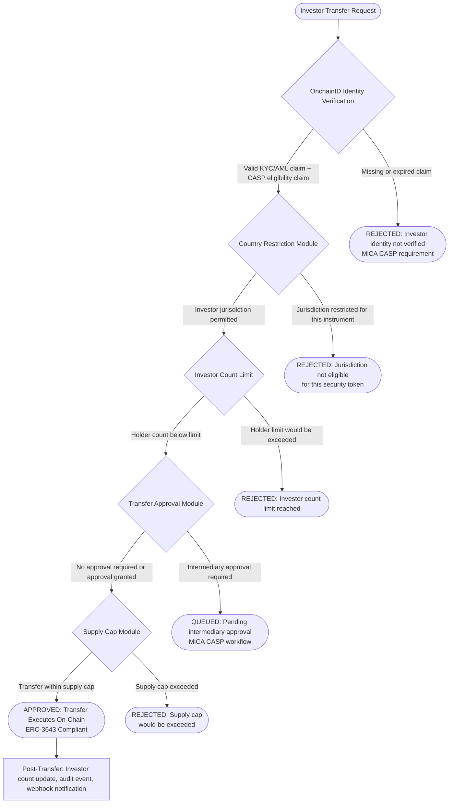
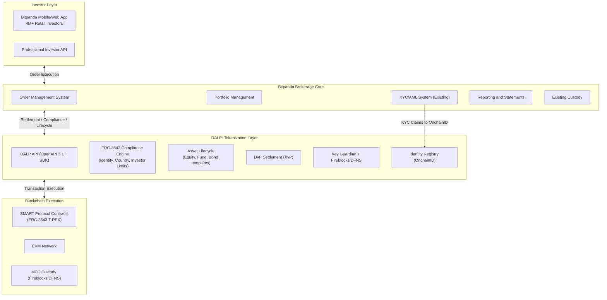
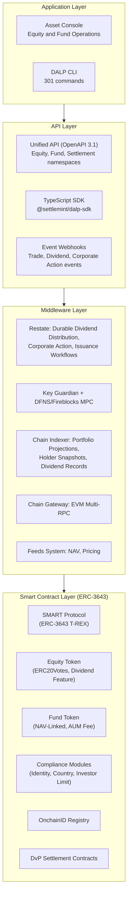
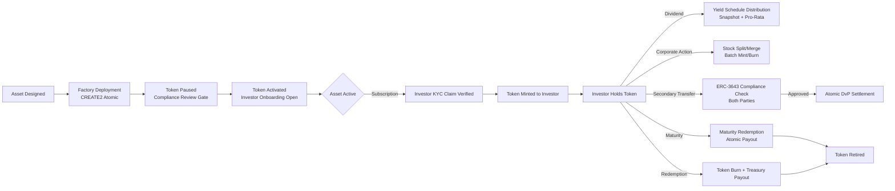
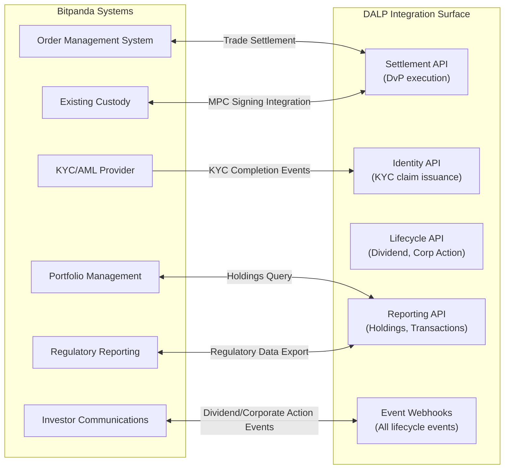
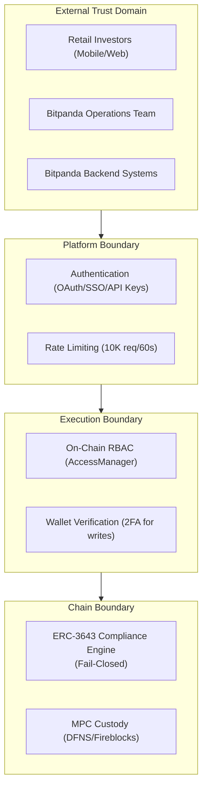
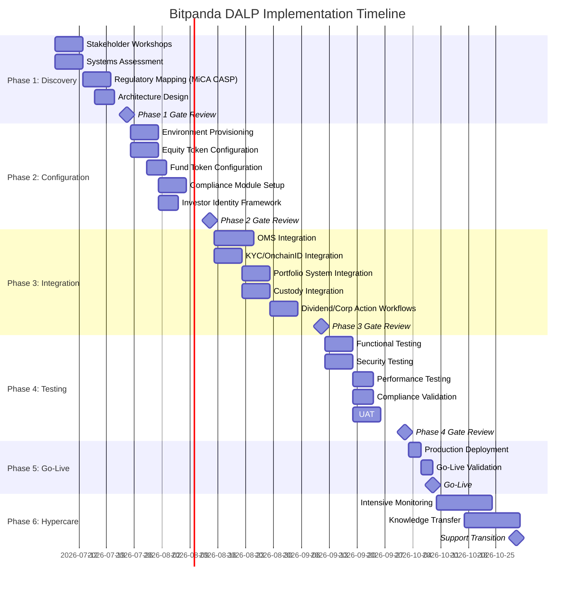
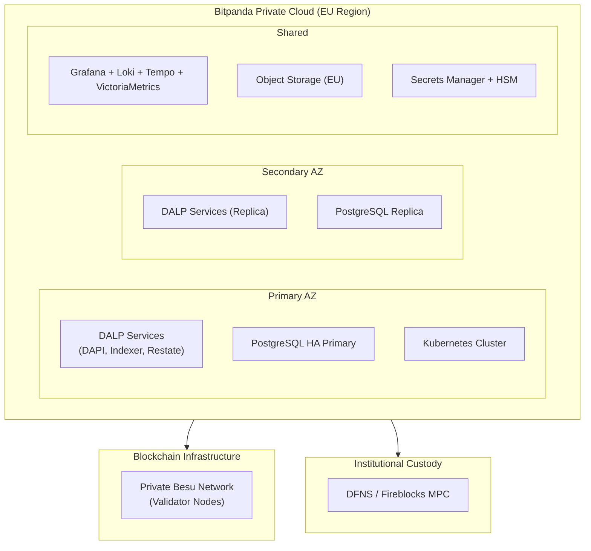

# Tokenized Asset Brokerage Platform Upgrade
## Technical Proposal for Bitpanda GmbH
### SettleMint | March 2026 | v1.0 | SettleMint Confidential

---

**Prepared by:** SettleMint NV
**Prepared for:** Bitpanda GmbH, Stella-Klein-Löw-Weg 17, 1020 Vienna, Austria
**Document reference:** SM-TECH-BITPANDA-2026-001
**Classification:** Strictly Confidential
**Version:** 1.0
**Date:** March 2026

---

## Table of Contents

1. Executive Summary
2. About SettleMint
3. About DALP
4. Customer References
5. Understanding of Requirements
6. Proposed Solution and Functional Capabilities
7. Technical Architecture
8. Security
9. Project Implementation and Delivery
10. Deployment
11. Training and Knowledge Transfer
12. Support and SLA
13. Risk Management
14. Compliance Matrix
15. Support Appendix

---

## Executive Summary

Bitpanda has built one of Europe's most trusted retail digital investment platforms, serving more than 4 million users across equities, ETFs, cryptocurrencies, and fractional assets under a MiCA Crypto-Asset Service Provider (CASP) license. The platform's brokerage backend, designed initially for crypto-native instruments, now faces a structural challenge: retail investors expect to trade tokenized equities, fractional ETF shares, and regulated securities instruments alongside digital assets, using the same seamless experience they have on the crypto side. Meeting that expectation without rebuilding the entire brokerage backend from scratch requires a production-grade tokenization layer that integrates with Bitpanda's existing infrastructure, enforces MiCA CASP compliance for every instrument, and supports the full asset lifecycle from issuance through secondary trading, corporate actions, and redemption.

The specific technical challenge is not trivial. Tokenized equities under MiCA must carry investor eligibility verification before any transfer. The ERC-3643 regulated token standard, combined with OnchainID for on-chain investor identity, provides the technical foundation, but implementing it correctly at Bitpanda's scale, with 4 million registered users, multiple European jurisdictions, and high-frequency retail order flows, requires more than a smart contract deployment.

SettleMint's DALP platform provides the answer. DALP is the production-grade tokenization layer that implements ERC-3643 natively, integrates OnchainID investor eligibility verification into every transfer, supports fractional asset infrastructure for equities and ETFs, and provides the lifecycle automation (corporate actions, dividends, stock splits, redemptions) that turns tokenized securities into an operational reality rather than a technical prototype.

Three reference deployments anchor SettleMint's credibility for Bitpanda's programme. KBC Securities Bolero Crowdfunding upgraded its brokerage backend using DALP's smart contract lifecycle automation, replacing manual processes for SME loan and equity issuance, lifecycle management, and corporate actions. Standard Chartered Bank deployed DALP for fractional tokenization of securities on a Digital Virtual Exchange across Asia, Africa, and the Middle East, demonstrating the platform's ability to handle institutional-grade fractional trading workflows. ADI Finstreet deployed tokenized equity on the Abu Dhabi mainnet with corporate action functionality (stock splits, consolidations), ERC20Votes for governance, and DFNS/Fireblocks custody integration, directly paralleling Bitpanda's requirement for regulated equity token infrastructure with institutional custody.

The proposal that follows demonstrates precisely how DALP addresses each of Bitpanda's technical and business requirements, how the implementation would be sequenced across Bitpanda's 15 to 19 week production programme, and how the operating model after go-live enables Bitpanda's internal teams to own the platform day to day.

### Requirements Coverage Summary

| Requirement Domain | DALP Coverage | Evidence |
|---|---|---|
| ERC-3643 T-REX regulated token standard | Full | SMART Protocol built on ERC-3643; native standard implementation |
| OnchainID investor eligibility verification | Full | OnchainID ERC-734/735 integrated; claim-based verification |
| Fractional asset infrastructure | Full | Configurable token with fractional precision; fund template |
| MiCA CASP compliance enforcement | Full | 18 compliance modules; ex-ante enforcement; CASP audit trail |
| Corporate actions (dividends, splits) | Partial | Dividends/coupons: full. Stock splits: via controlled mint/burn; no dedicated split contract |
| Custody integration (Fireblocks, DFNS) | Full | Unified signer abstraction; ADI Finstreet reference deployment |
| Secondary market compliance enforcement | Full | Every transfer through ERC-3643 compliance engine |
| Lifecycle automation | Full | Maturity redemption, yield distribution, airdrop, token sale |
| Multi-jurisdiction EU eligibility | Full | Country restriction modules per token; per-investor claim-based eligibility |

---

## About SettleMint

### Company Overview

SettleMint is the production-grade digital asset lifecycle management company for regulated financial markets and sovereign use cases. Founded nearly a decade ago, SettleMint has grown from an early enterprise blockchain infrastructure provider into the category-defining platform company enabling financial institutions, market infrastructure providers, and sovereign entities to move real-world value on-chain with compliance, security, and operational reliability.

For Bitpanda's tokenized brokerage programme, SettleMint brings a specific combination of capabilities that is rare in the market: proven ERC-3643 regulated token implementation with OnchainID identity integration, fractional asset lifecycle automation across equities and funds, production reference deployments at regulated brokerages and exchanges, and the institutional custody integrations that MiCA CASP operations require.

### Production-Proven Credentials for Regulated Brokerage

SettleMint's production-proven credentials are directly relevant to Bitpanda's requirements:

Multi-year live deployments with regulated securities platforms: KBC Securities Bolero Crowdfunding has operated DALP-powered smart contract lifecycle automation in production for SME loans and equity instruments under Belgian regulatory supervision. Standard Chartered's Digital Virtual Exchange operates fractional tokenization of securities across multiple regulated jurisdictions in Asia and the Middle East.

MiCA and European regulatory framework coverage: DALP's compliance modules address MiCA CASP obligations natively, including investor eligibility verification (Article 72-75), transfer restrictions (Article 72), disclosure requirements, and record-keeping for audit (Article 70).

ERC-3643 standard expertise: SettleMint is one of the primary implementors of the ERC-3643 standard through the SMART Protocol. The SMART Protocol represents SettleMint's production implementation of ERC-3643 with more than seven years of institutional deployment experience behind it.

### Regulatory Readiness

DALP supports MiCA CASP obligations natively through: identity verification compliance module requiring verified OnchainID for every investor before transfer; country restriction modules enforcing jurisdictional eligibility for each instrument; investor count limits for instruments with regulatory holder limits; supply caps enforcing MiCA issuance limits; and transfer approval workflows for instruments requiring explicit intermediary approval.

ISO 27001 and SOC 2 Type II certifications confirm independent security validation.

### Team

200+ years of combined banking and blockchain experience. Dedicated solution architects and delivery leads have implemented ERC-3643 tokenization programmes at regulated institutions in Europe, Asia, and the Middle East. The team speaks the language of brokerage operations, compliance functions, and retail investment product management.

---

## About DALP

### Platform Overview

DALP is SettleMint's production-grade Digital Asset Lifecycle Platform. For Bitpanda's tokenized brokerage programme, the most relevant capabilities are: regulated token issuance using ERC-3643 (T-REX) standard; OnchainID investor eligibility verification integrated into every transfer; fractional asset infrastructure supporting equities and ETFs; lifecycle automation covering dividends, corporate actions, and redemptions; and institutional custody integration with Fireblocks and DFNS.

DALP sits between Bitpanda's existing brokerage systems and the blockchain execution layer, providing the governance, compliance enforcement, custody orchestration, and lifecycle management that makes tokenized securities operationally viable at Bitpanda's retail scale.

### Lifecycle Pillar: Issuance

DALP provides purpose-built asset templates for equities and funds, the two asset classes most relevant to Bitpanda's Phase 1 scope.

The Equity template provides automated dividend distribution, on-chain voting rights through ERC20Votes (ERC-5805), corporate action processing, and supply management. For Bitpanda's tokenized equity instruments, this means deploying a fully lifecycle-managed equity token with investor eligibility verification, fractional precision, and dividend automation in a single factory deployment.

The Fund template provides NAV integration, fractional unit management, fee structures, and subscription/redemption lifecycle. For Bitpanda's tokenized ETF instruments, the fund template provides the NAV-linked fractional unit model with automated fee collection and investor redemption workflows.

The Configurable Token type enables Bitpanda to digitise any additional instrument class beyond the seven pre-built templates, using a composable token architecture with up to 32 pluggable features per token, added or reconfigured post-deployment without redeploying the token.

The ERC-3643 T-REX factory deployment sequence is atomic: proxy deployment, OnchainID identity registration, compliance module initialization, and role assignment complete together or revert together. No partially deployed tokens can exist.

```mermaid
sequenceDiagram
    participant BrokerageOps as Bitpanda Brokerage Operations
    participant AssetDesigner as DALP Asset Designer
    participant DAPI as DAPI (Middleware)
    participant Restate as Execution Engine
    participant Factory as Equity/Fund Factory
    participant OnchainID as Identity Registry
    participant Compliance as ERC-3643 Compliance Engine
    participant Chain as Blockchain Network

    BrokerageOps->>AssetDesigner: Configure tokenized equity (ISIN, supply, dividend schedule)
    AssetDesigner->>DAPI: Submit configuration
    DAPI->>Restate: Dispatch durable issuance workflow
    Restate->>Factory: Deploy UUPS proxy via CREATE2
    Factory->>OnchainID: Register token OnchainID
    Factory->>Compliance: Initialize: identity verification, country restrictions, investor limits
    Compliance-->>Factory: ERC-3643 compliance modules bound
    Factory->>Chain: Assign roles (admin, supply mgmt, custodian, governance, emergency)
    Chain-->>Factory: TokenDeployed event emitted
    Restate-->>DAPI: Deployment confirmed; token PAUSED by default
    DAPI-->>AssetDesigner: Token address, compliance config summary
    BrokerageOps->>DAPI: Compliance review complete; unpause token
    DAPI->>Chain: Token live; investor onboarding open
```

### Lifecycle Pillar: Compliance

For Bitpanda's MiCA CASP-licensed operations, every token transfer must enforce investor eligibility before execution. DALP's ERC-3643 compliance engine provides this through 18 module types evaluated in sequence on every transfer.

Compliance modules most relevant to Bitpanda's brokerage instruments:

Identity verification module: requires every transfer counterparty to have a registered OnchainID with valid KYC/AML claims. For Bitpanda's retail investors, this means completing Bitpanda's existing KYC process produces an on-chain claim that enables token transfers without per-transaction re-verification.

Country restriction modules: enforce jurisdictional eligibility per instrument. A German equity token can be configured to restrict to EEA investors while a specific fund token carries broader eligibility. Country restriction lists are runtime-configurable without token redeployment.

Investor count limit: caps the number of unique token holders. Required for certain EU private placement structures where issuer obligations scale with investor count.

Transfer approval module: requires explicit operator approval for defined transfer categories. Supports the intermediary approval model that MiCA CASP operations may require for certain instrument types.

Supply cap: prevents over-issuance relative to registered supply, supporting MiCA's instrument supply transparency requirements.

Time lock: enforces minimum holding periods for instruments with lock-up requirements, as may apply to certain structured products.

The compliance evaluation is fail-closed: every module must explicitly approve for the transfer to proceed. A single module veto reverts the transaction.



### Lifecycle Pillar: Custody

DALP integrates with Fireblocks and DFNS through the unified signer abstraction. For Bitpanda's institutional custody requirements under MiCA CASP, the Fireblocks or DFNS integration provides MPC-based key management where no single party holds a complete signing key.

The ADI Finstreet deployment used DFNS for transaction signing of tokenized equity on Abu Dhabi's mainnet, directly demonstrating the custody integration pattern for Bitpanda's tokenized equity programme. Maker-checker approval workflows with configurable quorum enforce four-eyes controls on supply management operations (minting new equity shares) and custodian operations (forced transfers under regulatory order).

### Lifecycle Pillar: Settlement

DALP's XvP atomic settlement enables DvP settlement for Bitpanda's secondary market operations. When a retail investor purchases tokenized equity through Bitpanda's marketplace, the asset delivery leg (equity token to buyer) and the cash payment leg (stablecoin or fiat-backed token to seller) can settle atomically, eliminating counterparty risk in secondary trading.

For Bitpanda's initial Phase 1 scope, local DvP settlement (same-chain atomic) is the primary settlement model. HTLC cross-chain settlement is available for Phase 2 multi-chain expansion.

### Lifecycle Pillar: Servicing

Corporate action automation is central to Bitpanda's tokenized equity programme. DALP provides:

Dividend distribution through the Yield Schedule addon: snapshot-based holder capture, configurable distribution schedules (quarterly, semi-annual, annual), pro-rata calculation, and flexible payment in the denomination asset or a different payment token. This automates Bitpanda's dividend distribution operations for all tokenized equity holdings.

Stock splits: implemented through controlled mint and burn operations under governance role authorization. Forward split: mint additional tokens to existing holders proportional to split ratio. Reverse split: burn existing tokens and mint reduced supply to holders. Both operations are batch-capable (up to 100 holders per API call) and produce full audit trails.

Maturity redemption for structured products: atomic payout at face value, token burn, and treasury settlement in a single transaction.

Investor airdrop for rights issuances and bonus shares: Merkle tree-based distribution supporting time-bound self-claim and vesting variants.

Token sale for primary issuances: configurable sale contract with presale, public sale, per-investor purchase limits, vesting, and soft/hard cap mechanics.

---

## Customer References

### Summary Reference Table

| Company | Use Case | Region | Relevance to Bitpanda |
|---|---|---|---|
| OCBC Bank | Security token engine; securitization, fractionalization; HNWI investment products | Asia-Pacific | Multi-asset investment platform integration |
| KBC Securities (Bolero Crowdfunding) | Equity crowdfunding + SME loans; smart contract lifecycle; corporate actions; digital wallets | Europe | **Direct reference: equity token lifecycle, European regulated brokerage** |
| KBC Insurance | NFT product passports; mobile valuation | Europe | NFT-based asset records |
| Standard Chartered Bank | Digital Virtual Exchange; fractional tokenization; institutional trading | Asia/Africa/Middle East | **Direct reference: fractional securities, trading infrastructure** |
| Reserve Bank of India Innovation Hub | Multi-bank letter of credit; multi-node blockchain | Asia-Pacific | Multi-party financial infrastructure |
| Sony Bank | Stablecoin + digital identity; KYC-enabled Web3 banking | Asia-Pacific | Stablecoin infrastructure, identity integration |
| State Bank of India | CBDC infrastructure | Asia-Pacific | Large-scale digital asset infrastructure |
| Islamic Development Bank | Sharia-compliant subsidy distribution | Middle East/Global | Distribution automation |
| Mizuho Bank | Bond tokenization and trade finance | Asia-Pacific | Institutional tokenization reference |
| IsDB Market Stabilization | Collateral volatility management | Middle East | Collateral management |
| Maybank Project Photon | FX tokenization; XvP settlement | Asia-Pacific | Atomic settlement patterns |
| ADI Finstreet | Tokenized equity on Abu Dhabi mainnet; corporate actions; ERC20Votes; DFNS/Fireblocks custody | Middle East | **Direct reference: tokenized equity, corporate actions, institutional custody** |
| Commerzbank | Hybrid on/off-chain ETP; sub-10s settlement; EUR 7M savings | Europe | Settlement speed, European regulatory context |
| Saudi RER | Country-scale real estate tokenization | Middle East | National-scale infrastructure |

### KBC Securities Bolero Crowdfunding: European Regulated Equity Token Lifecycle

KBC Securities Bolero Crowdfunding is Bitpanda's closest European reference deployment. The programme upgraded the brokerage backend of Belgium's leading equity crowdfunding platform, replacing manual processes for SME loan and equity instrument issuance, lifecycle management, corporate actions, and redemption with DALP-powered smart contract automation.

The challenge was directly analogous to Bitpanda's: rapid growth created significant administrative pressure on a brokerage operation that had been built for manual processes. New Belgian financial market regulations increased compliance burdens. The platform needed to scale operations without scaling headcount proportionally.

SettleMint implemented DALP as the smart contract backbone, automating issuance, lifecycle management, corporate actions, and redemption. Digital wallets for investors were integrated with a fiat-backed stable token for on-chain transactions. The outcome was reduced operational costs, ensured regulatory compliance, and boosted scalability. Bolero captured growth efficiently without incurring additional expenses.

For Bitpanda, the KBC Securities Bolero reference demonstrates that DALP's equity token lifecycle automation, when deployed in a regulated European brokerage environment, delivers the operational efficiency gains Bitpanda's programme is targeting. The same smart contract architecture, the same corporate action automation, and the same compliance framework are available for Bitpanda's tokenized equity and ETF instruments.

The Belgian regulatory context (FSMA supervision, MiFID II compliance) provides regulatory credibility analogous to Bitpanda's Austrian (FMA supervision) and MiCA CASP context.

### Standard Chartered Bank: Fractional Tokenization of Securities

Standard Chartered Bank deployed DALP for its Digital Virtual Exchange, supporting fractional tokenization of securities including shares, bonds, and currencies across institutional investors in Asia, Africa, and the Middle East. Ownership changes were recorded instantly and immutably on the blockchain, eliminating custody intermediaries and reducing settlement times.

The Standard Chartered deployment directly addresses Bitpanda's fractional asset requirement. Fractional tokenization at Bitpanda means retail investors can hold 0.1 shares of a EUR 1,000 stock with full ownership rights and dividend entitlements. DALP's configurable token with fractional precision and the Yield Schedule addon for pro-rata dividend distribution provides this capability out of the box.

The Standard Chartered reference also demonstrates DALP's multi-jurisdictional compliance enforcement: the Digital Virtual Exchange operates across multiple regulatory jurisdictions simultaneously, with per-token compliance configurations enforcing local eligibility requirements. This pattern applies directly to Bitpanda's multi-market EU operation.

### ADI Finstreet: Tokenized Equity with Corporate Actions and Institutional Custody

ADI Finstreet deployed DALP for tokenized equity issuance and management on ADI's Abu Dhabi-based mainnet. The deployment implemented equity tokens with full corporate action functionality: stock splits and consolidations via controlled mint and burn, on-chain voting using ERC20Votes (ERC-5805), and upgradeable smart contracts on a private EVM network. Institutional custody integration was provided through DFNS for transaction signing, with a Fireblocks integration path established.

For Bitpanda, the ADI Finstreet deployment is the most technically specific reference, demonstrating exactly the equity token lifecycle that Bitpanda requires: ERC-3643 regulated token standard, corporate action automation (splits, consolidations), governance rights (voting), and institutional MPC custody. The deployment operated in a regulated environment under Abu Dhabi Financial Services Regulatory Authority (FSRA) oversight, demonstrating the platform's ability to satisfy institutional-grade compliance requirements.

The ADI Finstreet reference answers the question of whether DALP's tokenized equity capability is production-tested or theoretical. The answer is production-tested, with corporate action automation, custody integration, and on-chain governance operating under live conditions.

---

## Understanding of Requirements

### Business Requirements Analysis

Bitpanda's RFP establishes requirements for a production-grade tokenized asset brokerage platform upgrade. The procurement priorities emphasize time to market, developer experience, control maturity, scalability for retail fintech volumes, and commercial clarity. The evaluation cross-functional team spans digital assets, brokerage engineering, compliance, risk, and enterprise security.

SettleMint's assessment of Bitpanda's core requirements:

**BR-01: Configurable product and account workflows**

DALP's Asset Designer wizard provides product configuration for equity and fund tokens through a structured multi-step workflow with validation at each step. ISIN binding, share class configuration, dividend schedule, voting rights, country eligibility restrictions, and investor category limits are all configurable through the Asset Designer UI or REST API without code changes.

**BR-02: Deterministic state transitions**

DALP's Restate durable execution engine provides exactly-once workflow orchestration with persisted state. Token deployment, minting, dividend distribution, and corporate action workflows cannot enter partial states. If a workflow fails, Restate resumes from the last confirmed state.

**BR-03: Entitlement and balance accuracy**

On-chain authoritative token balances provide the ledger of record for investor entitlements. The chain indexer maintains a continuously updated PostgreSQL projection for fast query access to investor holdings, dividend entitlements, voting power, and compliance status.

**BR-04: Role-based segregation of duties**

26 distinct roles across four layers enforce the operational separation that MiCA CASP compliance requires. Supply Management (new share issuance) is separate from Custodian (forced transfers, freezes), Emergency (pause only), and Governance (compliance configuration). Each role operates through on-chain AccessManager enforcement.

**BR-05: Configurable eligibility rules per market and segment**

Country restriction modules enforce jurisdictional eligibility per token. Investor category claims (retail, professional, eligible counterparty) can carry different eligibility thresholds per instrument. Transfer approval requirements can vary by investor category and transaction size.

**BR-06: Automated event emission**

Structured events for all lifecycle events: token deployment, minting, transfer, dividend distribution, corporate action, compliance decision, and administrative action. Webhook delivery to Bitpanda's downstream systems with retry and dead-letter handling.

**BR-07: Business continuity for failed workflows**

Durable execution prevents partial state. Dividend distributions use idempotent batch operations. Dead-letter queue provides actionable recovery for failed operations.

**BR-08: Audit-ready reporting**

Complete audit trail for MiCA CASP record-keeping obligations: every transfer, every compliance decision, every dividend distribution, every corporate action, every role change. Tamper-evident logs retained per regulatory requirements.

**BR-09: Phased rollout controls**

Token pause/unpause provides instrument-level activation gates. Country restriction reconfiguration enables market-by-market rollout of specific instruments. Investor category restrictions enable soft launch to professional investors before retail expansion.

**BR-10: Adjacent service reuse**

The same DALP instance supporting tokenized equities and ETFs can extend to tokenized bonds, structured products, stablecoins, and real estate using the same compliance engine and identity registry.

### Technical Requirements Analysis

**TR-01: API documentation and versioning**

OpenAPI 3.1 specifications generated from procedure definitions; TypeScript SDK; 534 structured error codes with SDK mirror.

**TR-02: Sandbox and non-production environments**

Development, staging, and production environments with separate blockchain networks. Bitpanda's QA team can test full investor onboarding, order processing, dividend distribution, and corporate action workflows in staging before production deployment.

**TR-03: Webhooks and event streams**

Event webhooks with configurable retry, dead-letter handling, and per-endpoint filtering. Events cover the full brokerage lifecycle from token creation through investor redemption.

**TR-04: Identity and access**

OAuth 2.0/OIDC integration with Bitpanda's identity provider. SAML 2.0 for enterprise SSO. API keys for system-to-system integration. Wallet verification for all blockchain write operations.

**TR-05: Deployment model**

Four deployment models (Managed SaaS, Private Cloud, On-Premises, Hybrid). Private Cloud recommended for Bitpanda's production compliance with Austrian and EU data residency requirements.

**TR-06: Observability**

Three-pillar observability (metrics, logs, traces) with pre-built Grafana dashboards. Distributed tracing for all brokerage lifecycle operations.

**TR-07: Performance**

Kubernetes auto-scaling for retail trading volumes. Async transaction pipeline with idempotency for high-frequency investor operations. Performance benchmarks established during Phase 4 testing.

**TR-08: Data export**

REST API, webhook delivery, PostgreSQL direct access for reporting. Investor holding exports for MiCA CASP regulatory reporting.

**TR-09: Release management**

Enterprise tier: continuous delivery with client approval gates. Staging rollout before production.

**TR-10: Known constraints**

EVM-compatible networks only. Order book and price discovery require external exchange integration. Stock split requires controlled mint/burn workflow (no dedicated split contract). See Appendix C for complete constraints register.

---

## Proposed Solution and Functional Capabilities

### Solution Architecture for Bitpanda

DALP positions as the tokenization layer between Bitpanda's existing brokerage infrastructure and the blockchain execution layer. Bitpanda's existing order management system, portfolio management, investor KYC, reporting, and custody infrastructure remain in place. DALP connects to these systems through its API layer and extends the brokerage with on-chain settlement, ERC-3643 compliance enforcement, and lifecycle automation.



### Tokenized Equity Infrastructure

For Bitpanda's tokenized equity programme, DALP provides:

ERC-3643 compliant equity tokens with OnchainID investor eligibility verification. Every share transfer validates the buyer's KYC/AML claims and jurisdictional eligibility before execution. No non-compliant transfer can occur at the smart contract level.

Fractional precision: equity tokens use standard ERC-20 18-decimal precision, enabling fractional holdings at any granularity. A EUR 1,000 share can be held in increments of EUR 0.01 (0.00001 token units) for retail fractional investment.

Dividend automation through the Yield Schedule addon: quarterly or semi-annual dividend distributions with snapshot-based holder capture, pro-rata calculation, and flexible payment. Bitpanda's treasury function triggers the distribution schedule; token holders receive their proportional dividend automatically.

Stock split implementation: when a company announces a 2:1 forward split, Bitpanda's operations team mints additional tokens to existing holders through a batch operation (proportional to holding). The supply increase records on-chain with full audit trail. Reverse splits use batch burn and re-mint operations.

Voting rights through ERC20Votes (ERC-5805): token holders receive voting power proportional to holdings. Snapshot-based voting power calculation at any historical block. Delegation supported for custodial voting arrangements.

### Tokenized ETF Infrastructure

For Bitpanda's tokenized ETF programme, DALP's Fund template provides:

NAV-linked fractional unit management: ETF tokens represent fractional units in an underlying fund. NAV updates from Bitpanda's fund administration system are reflected in token parameters through the Feeds System.

Subscription and redemption: investor subscriptions trigger token minting at current NAV. Redemptions trigger atomic token burn and denomination asset payout from the fund treasury.

Fee structures: AUM fee feature automates management fee collection from fund NAV on a configurable schedule. Transaction fee feature applies loads on subscription or redemption.

Diversified holdings: the ETF token itself can be configured to reference a basket of underlying assets tracked by Bitpanda's portfolio management system.

### Investor Onboarding at Retail Scale

Bitpanda's 4 million registered users present an onboarding scale challenge. DALP's batch identity registration supports up to 100 investors per API call. For initial migration of existing verified investors, batch processing enables efficient onboarding without manual per-investor operations. New investor onboarding integrates with Bitpanda's existing KYC workflow: KYC completion triggers on-chain claim issuance through DALP's trusted issuer system, automatically making the investor eligible for token transfers without additional steps.

### Secondary Market Compliance Enforcement

Every secondary market transfer in Bitpanda's tokenized brokerage goes through DALP's ERC-3643 compliance engine. When an investor attempts to sell tokenized equity to another Bitpanda user, the compliance engine validates both parties' eligibility before the transfer executes. This prevents the regulatory issue where a non-compliant investor acquires tokenized securities through a secondary market transaction that bypasses the original issuer's eligibility controls.

For Bitpanda's platform model, where Bitpanda operates as the marketplace matching buyers and sellers, DALP's compliance enforcement sits at the settlement layer, ensuring every matched trade settles only if both parties satisfy the instrument's compliance requirements.

### Day-One Setup Procedures

Phase 5 go-live establishes:

Production environment with deployed equity and fund token factories. OnchainID identity system configured with Bitpanda's KYC claim issuer. Compliance modules configured per instrument type and jurisdiction. Role assignments to Bitpanda's operations, compliance, and custody teams. Dividend distribution infrastructure with test distribution completed. Corporate action workflow testing with simulated 2:1 stock split. Integration validation with Bitpanda's OMS and portfolio management systems.

### Day-Two Operations

Normal brokerage operations through DALP:

Token issuance: product team configures new equity or ETF token through Asset Designer; compliance team validates configuration; token activated for investor access.

Investor onboarding: KYC completion triggers automatic on-chain claim issuance; investor wallet registered; token eligibility confirmed.

Trade settlement: matched order triggers DvP settlement through DALP's settlement API; compliance validation; atomic on-chain settlement; portfolio management system updated via webhook.

Dividend distribution: quarterly distribution trigger; DALP Yield Schedule captures holder snapshot; pro-rata distribution calculated; distribution executed; investor statements updated.

Corporate action: stock split announcement received; operations team executes batch mint/burn; supply updated on-chain; investor holdings adjusted proportionally; audit trail produced.

Compliance monitoring: daily review of transfer rejection patterns; investor eligibility exception management; audit log export for regulatory reporting.

---

## Technical Architecture

### Four-Layer Architecture



### Smart Contract Layer: ERC-3643 T-REX Architecture

The SMART Protocol implements ERC-3643 with three foundational sub-layers:

Token layer: ERC-20 compatible with compliance hooks. Every transfer function calls the compliance engine before executing balance changes. Standard ERC-20 interfaces mean existing wallets, explorers, and DeFi integrations work without modification.

Compliance layer: modular compliance engine evaluating configured rules before each transfer. Rules are separate contracts that can be added, removed, or reconfigured at runtime. Fail-closed design means a module evaluation failure (network issue, unexpected condition) produces a rejection rather than an approval.

Identity layer: OnchainID (ERC-734/735) storing verifiable KYC/AML claims. Claims are issued by trusted issuers (Bitpanda's KYC provider) and verified on-chain before transfers. Claims are reusable across all DALP-deployed tokens, so an investor who completes KYC for one equity token is immediately eligible for others using the same claim type.

### Asset Lifecycle Flow



### Middleware Layer

The Restate execution engine provides durable dividend distribution: a quarterly dividend for 100,000 investors spans multiple batch API calls (100 investors per call), each call idempotent, with workflow state persisted through the full distribution. A server restart mid-distribution resumes from the last confirmed batch without duplicates or omissions.

The Chain Indexer builds holder snapshots used for dividend distribution and voting power calculations. Snapshot data is available through the API for any historical block, enabling accurate pro-rata calculation even for investors who transferred tokens after the snapshot date.

The Feeds System provides NAV data for fund tokens, pricing data for mark-to-market reporting, and reference rates for yield calculations. Configurable data sources with staleness thresholds alert when feed data becomes stale.

### Integration Points



### Security Trust Domains



### Network Support

For Bitpanda's tokenized brokerage, SettleMint recommends a private Hyperledger Besu network for regulated instrument settlement, combined with an optional public Layer 2 network (Polygon PoS) for instruments requiring public chain accessibility.

Private Besu provides MiCA-aligned permissioned network model, deterministic gas costs, validator governance by Bitpanda, and DORA-compliant network resilience.

Public Polygon provides interoperability with public DeFi infrastructure where applicable, but requires additional AML/CFT controls for counterparty management.

---

## Security

### Defense-in-Depth for Retail Brokerage

DALP enforces security through five independent control layers. For Bitpanda's retail brokerage operations protecting 4 million investor accounts, multi-layer security is essential.

Authentication: email/password, Passkeys (WebAuthn), OAuth 2.0/OIDC for Bitpanda's existing SSO. Session management with HTTP-only Secure-flagged cookies. API keys for system integration with scoped permissions and rate limiting.

Wallet verification: all blockchain write operations require second-factor wallet verification (PIN, TOTP, Passkey). An investor operation that bypasses DALP's API and reaches a custody provider directly still requires MPC signing policy approval.

On-chain role enforcement: AccessManager contract enforces role requirements at the smart contract level. No application-layer bypass is possible. Forced transfers require Custodian role. Minting requires Supply Management role. Configuration changes require Governance role.

ERC-3643 compliance enforcement: protocol-level transfer validation cannot be bypassed. Every investor transfer validates both parties' OnchainID claims before execution.

MPC custody: DFNS or Fireblocks ensures no single party holds a complete signing key. Transaction Authorization Policy enforces value limits, whitelisted destinations, and multi-approver requirements at the custody layer.

### ISO 27001 and SOC 2 Type II

SettleMint holds ISO 27001 and SOC 2 Type II certifications. For Bitpanda's vendor risk assessment under MiCA CASP obligations, these certifications provide the independent security assurance that Austrian FMA supervision and MiCA's ICT risk requirements mandate.

### Key Management for Brokerage Operations

Bitpanda's brokerage operations require different key management for different operation types. Supply Management operations (new share issuance) use multi-signature quorum with Governance role co-authorization. Custodian operations (forced transfers, freeze) use maker-checker approval workflow. Emergency operations (pause) use single Emergency role authorization.

DALP's Key Guardian supports all these patterns through HSM or DFNS/Fireblocks integration, ensuring that high-value operations always require threshold authorization.

### DORA Compliance

DALP's operational architecture addresses DORA requirements for Bitpanda's Austrian and EU regulatory context:

ICT risk management: documented dependency map, risk assessment, mitigation strategies. Third-party risk: Fireblocks/DFNS custody dependency documented; switch requires configuration change. Resilience testing: quarterly DR drills; performance testing in Phase 4. Incident management: P1-P4 model with 15-minute P1 response (Enterprise tier).

---

## Project Implementation and Delivery

### Implementation Timeline



### Phase Descriptions

**Phase 1: Discovery (Weeks 1-3)**
Stakeholder interviews with brokerage product, compliance, risk, engineering, and custody teams. Current state assessment of OMS, portfolio management, KYC system, and investor onboarding. MiCA CASP regulatory mapping to DALP compliance modules. Network selection analysis. Architecture design. Risk assessment.

Deliverables: BRD, MiCA CASP compliance matrix, target architecture, implementation roadmap, RACI.

**Phase 2: Configuration (Weeks 4-7)**
DALP environment provisioning (development, staging, production). Equity token factory configuration with ERC-3643 compliance modules, ERC20Votes feature, dividend schedule. Fund token configuration with NAV integration, AUM fee, subscription/redemption. OnchainID trusted issuer setup for Bitpanda's KYC provider. RBAC configuration. Custody integration design.

Deliverables: provisioned environments, token configuration documentation, compliance module reference, identity framework design, integration design document.

**Phase 3: Integration (Weeks 8-11)**
OMS integration for trade settlement through DALP's DvP settlement API. KYC/AML provider integration for on-chain claim issuance. Portfolio management system integration for real-time holding queries. Custody connector setup (DFNS or Fireblocks). Dividend distribution workflow implementation. Corporate action workflow implementation. Observability integration with Bitpanda's monitoring.

Deliverables: integrated system landscape, API integration documentation, workflow documentation, integration test results, draft runbook.

**Phase 4: Testing and UAT (Weeks 12-14)**
Functional testing of equity and fund lifecycle. Security testing with penetration testing coordinated with Bitpanda InfoSec. Performance testing at target retail trading volumes. MiCA CASP compliance validation. UAT with brokerage operations, compliance, and engineering teams.

Deliverables: test report, security assessment, performance benchmarks, UAT sign-off, go-live readiness assessment.

**Phase 5: Go-Live (Week 15)**
Production deployment. Configuration migration from staging. Go-live validation with smoke tests. Dedicated go-live support.

**Phase 6: Hypercare (Weeks 16-19)**
Intensive monitoring. Performance optimization. Knowledge transfer for all roles. Support transition.

### Staffing

| Role | Phase 1 | Phase 2 | Phase 3 | Phase 4 | Phase 5 | Phase 6 |
|---|---|---|---|---|---|---|
| Delivery Lead | Full | Full | Full | Full | Full | Partial |
| Solution Architect | Full | Full | Partial | Partial | On-call | On-call |
| Platform Engineer | - | Full | Full | Full | Full | Partial |
| Integration Engineer | - | Partial | Full | Partial | On-call | On-call |
| Security Engineer | - | Partial | Partial | Full | On-call | - |
| QA Lead | - | - | Partial | Full | Partial | - |
| Support Engineer | - | - | - | - | Full | Full |

---

## Deployment

### Recommended Deployment: Private Cloud (Austrian Data Residency)

For Bitpanda's Austrian regulatory context with FMA supervision and EU GDPR requirements, SettleMint recommends Private Cloud deployment in Bitpanda's own cloud environment (AWS eu-central-1 or Azure West Europe), ensuring data residency within the EU.



**Infrastructure Requirements:**

Kubernetes: EKS/AKS 1.25+, 16+ vCPU, 64+ GB RAM, multi-AZ. PostgreSQL: managed HA (RDS Multi-AZ or Azure Database Zone-Redundant), 8 vCPU, 32 GB RAM. Object storage: S3 or Azure Blob in EU region. Secrets manager: AWS SM or Azure Key Vault. Blockchain: 3-5 Besu validator nodes on t3.xlarge or equivalent.

**Disaster Recovery:**

Cloud-native HA: RTO 2-15 minutes, RPO seconds to 1 minute. Hot-warm geographic: RTO 30-180 minutes, RPO 5-60 minutes. Quarterly DR drills documented for DORA compliance reporting.

---

## Training and Knowledge Transfer

**Brokerage Operations Training (1 day)**
Audience: brokerage operations and product teams. Content: equity/fund token lifecycle management, dividend distribution operations, corporate action procedures, investor eligibility management, compliance exception handling. Scenario exercises: quarterly dividend distribution, 2:1 stock split execution, investor eligibility freeze for investigation.

**Engineering Integration Training (1.5 days)**
Audience: Bitpanda integration engineers. Content: DALP API reference, TypeScript SDK patterns, OMS settlement integration, KYC claim issuance integration, webhook handling for trade events. Hands-on exercises against staging environment.

**Compliance and Risk Training (0.75 day)**
Audience: compliance team and risk officers. Content: MiCA CASP compliance module configuration, audit trail review and export, investor eligibility reporting, transfer rejection analysis, regulatory evidence production.

**Platform Administrator Training (1 day)**
Audience: Bitpanda DevOps/infrastructure team. Content: DALP deployment management, Kubernetes operations, backup and recovery, upgrade procedures, security configuration, observability management.

**Knowledge Transfer Documentation**
Architecture documentation, operational runbooks, API guide, compliance module reference, troubleshooting guide, MiCA CASP regulatory evidence guide.

---

## Support and SLA

### Recommended Tier: Enterprise

| Attribute | Detail |
|---|---|
| Annual Fee | EUR 120,000 |
| Coverage | 24/7/365 |
| Uptime SLA | 99.99% monthly |
| P1 Response | 15 minutes |
| P1 Resolution | 2 hours |
| Designated Team | Named support team |
| CSM | Named Customer Success Manager |
| Quarterly Reviews | Architecture review |

### P1 Examples for Bitpanda

P1 triggers: DALP dApp or DAPI unresponsive; ERC-3643 compliance module bypass allowing non-eligible investor to acquire tokenized security; dividend distribution failure; Key Guardian signing failure; OMS settlement integration failure preventing trade execution.

### Service Credits

Below 99.99% SLA but above 99.0%: 10% of monthly support fees.
Below 99.0% but above 98.0%: 25% of monthly support fees.
Below 98.0%: 50% of monthly support fees.

---

## Risk Management

| Risk | Likelihood | Impact | Mitigation |
|---|---|---|---|
| MiCA CASP regulatory guidance evolves during implementation | Medium | High | Modular compliance reconfiguration at runtime; DALP's 18 module types cover current MiCA CASP requirements; SettleMint monitors regulatory developments |
| Stock split corporate action complexity exceeds estimates | Low | Medium | Batch mint/burn workflow validated in ADI Finstreet reference; performance testing in Phase 4; operations team training covers procedure |
| KYC/AML provider integration complexity | Medium | Medium | Phase 1 discovery assesses integration; DALP supports any OpenID Connect-compatible claim issuer; mock claim issuers for testing |
| Investor scale (4M users) creates onboarding volume challenge | Medium | Medium | Batch operations (100 per call); migration workflow designed in Phase 1; existing KYC claims trigger automatic on-chain registration |
| Security review timeline extension | Medium | Low-Medium | ISO 27001 and SOC 2 Type II certifications accelerate vendor risk assessment; security testing in Phase 4 |

---

## Compliance Matrix

### MiCA CASP Compliance

| MiCA Obligation | DALP Control | Configuration for Bitpanda |
|---|---|---|
| Investor eligibility verification (Article 72) | Identity verification compliance module | OnchainID claim from Bitpanda's KYC provider; verified before every transfer |
| Jurisdictional restrictions (Article 72) | Country restriction compliance module | Per-instrument jurisdiction allow/deny lists; runtime-configurable |
| Record-keeping (Article 70) | Tamper-evident audit trail | Complete transfer, compliance, and corporate action history; 7-year retention |
| ICT risk management (Article 74, DORA reference) | HA deployment, durable execution, incident management | See DORA section |
| Custody of assets (Article 70-71) | Key Guardian + DFNS/Fireblocks MPC | Institutional MPC custody; no single key; FIPS 140-2 HSM option |
| Investor communication (Article 68) | Event webhooks + API | Dividend, corporate action, and compliance events to investor communication systems |
| Governance and conflicts | Role separation, AccessManager | Supply Management, Custodian, Governance, Emergency roles independently scoped |

### GDPR Compliance

Data residency in EU (Austrian data centre or EU-region cloud). OnchainID claims stored as on-chain hashes; personal data in off-chain identity management system. Data subject access request support through identity registry API. Deletion workflows for investor off-boarding subject to on-chain state constraints.

### DORA Compliance

ICT risk management: documented dependency map, risk assessment, mitigation. Incident management: P1-P4 model, 24/7 Enterprise support, post-incident reports. Third-party risk: DFNS/Fireblocks dependencies documented; switching is configuration change. Resilience testing: quarterly DR drills, performance testing.

---

## Support Appendix

### Escalation Matrix

Level 1: Designated Support Team. Level 2: Support Engineering Manager. Level 3: VP Engineering / Head of Customer Success. Level 4: SettleMint Executive Management.

P1 war-room escalation: immediate assembly of support team, DALP engineering, and Solution Architect through video escalation channel.

### Continuous Improvement

Monthly incident review (Enterprise tier). Quarterly architecture review. Annual architecture assessment against MiCA regulatory developments and new DALP capabilities.

### Exit and Data Portability

Complete data export (JSON, CSV, structured database dumps). 90-day post-termination access period. Configuration documentation. Technical handover session (3 days). Audit log preservation and export.

---

## Appendix: Technical Constraints Register for Bitpanda

| Constraint | Description | Mitigation |
|---|---|---|
| EVM-only blockchain networks | Non-EVM chains not supported | Private Besu or Polygon recommended; EVM-native for all major tokenization standards |
| Stock split: no dedicated contract | Splits use batch mint/burn workflow | Validated in ADI Finstreet reference; operations runbook covers procedure |
| Token conversion UI absent | Loan-to-equity conversion has smart contract support but no DALP UI routes | Smart contract interaction available; DALP UI routes on roadmap |
| Order book not native | Order matching requires external marketplace | Bitpanda's existing OMS remains in place; DALP enforces settlement compliance |
| Batch limit 100 per call | Maximum 100 investors per batch operation | Sequential batching for large operations; 10,000 investors onboarded in approximately 15 minutes |
| Cross-chain identity sync | Separate DALP instances have independent registries | Single-instance deployment covers all tokens; multi-chain requires explicit coordination |

---

*Document Classification: SettleMint Confidential*
*SettleMint NV | Simon Bolivarlaan 5, 2600 Antwerp, Belgium | www.settlemint.com*

---

## Expanded Technical Detail: ERC-3643 Implementation for Bitpanda

### Why ERC-3643 T-REX Is the Correct Standard for Regulated Brokerage

The ERC-3643 standard, also known as T-REX (Token for Regulated EXchanges), was designed specifically for regulated security token use cases where transfer restrictions, investor eligibility, and compliance enforcement are not optional features but legal requirements. Choosing ERC-3643 over alternatives like ERC-20 with application-layer controls, ERC-1400, or proprietary token standards is a technically and regulatory correct decision for Bitpanda's tokenized brokerage programme.

ERC-3643's key properties for Bitpanda:

Protocol-level compliance enforcement: ERC-3643's transfer function calls the modular compliance engine before executing any balance changes. This is enforced by the smart contract code itself, not by application-layer middleware that could theoretically be bypassed. For Bitpanda's MiCA CASP obligations, this provides the strongest possible assurance that non-compliant transfers cannot occur.

OnchainID integration: ERC-3643 is designed with OnchainID (ERC-734/735) as the identity standard. OnchainID provides verifiable, on-chain investor identities with claim-based verification. For Bitpanda's 4 million registered investors, OnchainID provides a scalable identity layer where KYC verification is completed once and reused across all tokenized instruments without per-transaction re-verification.

Modular compliance: ERC-3643's compliance rules are separate contracts evaluated by an orchestration engine. Rules can be added, removed, or reconfigured at runtime without redeploying the token contract. For Bitpanda, this means compliance requirements can evolve as MiCA's implementing acts are published or as Bitpanda expands to new instruments and jurisdictions, without requiring token migration.

Active ecosystem: ERC-3643 has the most active institutional adoption of any regulated token standard. Major issuers, custody providers, and infrastructure platforms have implemented ERC-3643 support. DALP's implementation (SMART Protocol) is built on this standard with more than seven years of production experience.

By contrast, alternative approaches have significant weaknesses. ERC-20 with application-layer controls: transfer restrictions enforced only in DALP's middleware can be bypassed by direct smart contract calls, creating a compliance gap that MiCA auditors would identify immediately. ERC-1400: less active ecosystem, less institutional adoption, more complex implementation without the OnchainID integration that MiCA's investor identification requirements demand. Proprietary standards: create vendor lock-in and lack the regulatory recognition that regulators familiar with ERC-3643 are developing.

DALP's SMART Protocol implements ERC-3643 with institutional production hardening: factory deployment patterns, UUPS proxy upgradeability, CREATE2 deterministic addressing, role-based access management, and the operational tooling (indexer, API, dashboards) that make ERC-3643 tokens operable at Bitpanda's retail scale.

### OnchainID Architecture for 4 Million Investors

Scaling OnchainID to 4 million investors requires careful architectural design. Each investor requires an on-chain identity contract (OnchainID) and at least one KYC/AML claim issued by Bitpanda's trusted claim issuer. The initial migration of Bitpanda's existing verified investors to on-chain identity is the largest single technical challenge in the implementation.

DALP's batch identity registration supports 100 investors per API call. At 100 investors per call with a 2-second processing time per call (including on-chain transaction confirmation on a private Besu network), batch migration of 4 million investors would require approximately 22 hours of continuous batch processing. This migration runs in Phase 3 integration, with the migration workflow designed to allow incremental migration (migrating the most active investors first) while maintaining backward compatibility with the existing off-chain identity system.

For ongoing investor onboarding, DALP's KYC integration triggers on-chain claim issuance automatically when an investor completes KYC verification with Bitpanda's existing provider. The on-chain claim is issued within the time it takes to confirm a blockchain transaction (seconds to minutes on a private Besu network), making the on-chain identity creation invisible to the investor's onboarding experience.

Claim reusability is critical for Bitpanda's multi-instrument brokerage. An investor who completes KYC for a German equity token is immediately eligible to purchase any other token on the same DALP instance that accepts the same KYC claim type. No additional verification is required per instrument. This reusability is an operational efficiency advantage over KYC models where eligibility must be re-verified per instrument.

### Fractional Asset Technical Implementation

Bitpanda's retail investment proposition depends on fractional asset capability: retail investors should be able to invest EUR 50 in a EUR 1,000 stock or EUR 100 in an ETF with EUR 500 minimum subscription. DALP's fractional implementation uses ERC-20's 18-decimal precision to represent fractional units.

For a stock priced at EUR 1,000 per share: the token represents 1/1,000,000,000,000,000,000 of a share (1e-18 precision). A EUR 50 investment at EUR 1,000/share corresponds to 0.05 tokens, or 50,000,000,000,000,000 token units (5e16 units). The blockchain stores and processes the integer representation internally; DALP's API layer converts to human-readable fractional amounts using the dnum arbitrary-precision library.

For dividend calculations at fractional precision: if a company distributes EUR 2 per share and an investor holds 0.05 shares (50,000,000,000,000,000 units), their dividend entitlement is EUR 0.10. DALP's Yield Schedule addon uses the dnum library throughout for pro-rata calculation, ensuring fractional dividend accuracy without floating-point rounding errors.

For corporate actions at fractional precision: a 2:1 stock split doubles each investor's holdings. An investor holding 0.05 shares receives an additional 0.05 shares, resulting in 0.10 shares post-split. The batch mint operation distributes additional units proportionally, with the same 18-decimal precision ensuring no rounding loss.

### Dividend Distribution Architecture at Scale

Distributing dividends to potentially millions of retail token holders requires a scalable, reliable distribution mechanism. DALP's Yield Schedule addon uses a snapshot-based approach for scalable distribution:

Snapshot capture: at the record date, DALP's indexer captures the complete holder registry with each holder's balance. The snapshot is stored in the PostgreSQL indexed projection and used as the authoritative distribution list.

Pro-rata calculation: for each holder, the dividend entitlement is calculated as (holder_balance / total_supply) * total_distribution_amount, using dnum for arbitrary-precision arithmetic.

Batch distribution execution: distribution is executed in batches of 100 holders per API call. The distribution workflow is durable through Restate: if the server restarts mid-distribution, it resumes from the last confirmed batch without re-distributing to already-paid holders (idempotency guaranteed by Restate).

Distribution verification: post-distribution, the total of all individual distributions is compared against the intended total. Any discrepancy triggers an alert and investigation.

For Bitpanda's retail scale (potentially millions of tokenized equity holders), the distribution architecture provides:

- Predictable distribution time: 1,000,000 holders at 100 per batch = 10,000 batch calls. At 2 seconds per batch = approximately 5.5 hours for a full distribution pass. For instruments where distribution speed is critical, the batch size and parallelism can be configured during performance testing.
- Resumability: if distribution is interrupted at batch 5,000 of 10,000, resumption starts from batch 5,001. No investor receives a duplicate payment.
- Audit trail: every individual distribution is recorded with holder address, amount, timestamp, and transaction hash.

### Corporate Action Governance Model

Corporate actions in tokenized brokerage require careful governance to ensure that actions are authorized, accurately calculated, and correctly executed before affecting investor holdings. DALP provides a structured governance model for corporate actions:

Authorization: corporate action execution requires Supply Management role authorization for minting components and Custodian role for any forced transfers. For stock splits, the Governance role must authorize the compliance module reconfiguration (if new investor limits apply post-split).

Calculation verification: the corporate action calculation (split ratio applied to current holder registry) is produced as a report from DALP's indexer before execution. Bitpanda's operations team verifies the calculation against the official corporate action announcement before authorizing execution.

Staged execution: large corporate actions execute in stages with confirmation gates between batches. Operations team reviews each batch confirmation before proceeding to the next.

Exception handling: investors with partially frozen balances are handled separately, with the unfrozen portion included in the distribution and the frozen portion handled through a manual review workflow.

Post-action verification: post-execution, DALP's indexer produces a reconciliation report comparing pre-action and post-action holder positions, confirming that the corporate action was applied correctly.

### MiCA CASP Compliance Deep Dive

Bitpanda's MiCA CASP licence imposes specific obligations on tokenized security operations. DALP's compliance architecture addresses each obligation:

**Article 70: Record-keeping**

MiCA requires CASPs to maintain records of all transactions and orders for at least 5 years (Article 70). DALP's tamper-evident audit trail captures every token transfer, compliance decision, corporate action, dividend distribution, and administrative action with timestamp, transaction hash, counterparty identities, and compliance module verdicts. These records are exportable in machine-readable format and retained per the contracted retention policy.

**Article 72: Investor protection for crypto-asset service providers**

MiCA Article 72 requires CASPs to act in clients' best interest and provide fair, clear, and non-misleading information. DALP's compliance enforcement enforces the eligibility requirements that define which investors can hold which instruments, preventing non-eligible investors from acquiring instruments for which they are not qualified. The audit trail provides evidence that every transfer was compliance-validated before execution.

**Article 74: ICT risk management**

MiCA Article 74 references DORA's ICT risk management framework. DALP's HA deployment, durable execution engine, documented disaster recovery targets, and incident management framework address these requirements. The dependency map produced in Phase 1 provides the ICT third-party risk documentation that Bitpanda's compliance function requires for MiCA reporting.

**Article 82-90: AML/CFT requirements**

MiCA references the EU's AML/CFT framework. DALP's identity verification compliance module enforces KYC/AML claim verification before every transfer, providing the transaction-level identity verification that AML/CFT obligations require. The country restriction module enforces sanctions jurisdiction controls. The address block list enables real-time blocking of wallets identified as non-compliant after initial verification.

### Performance Architecture for Retail Trading Volumes

Bitpanda's retail trading platform handles high-frequency order flows from 4 million active investors. DALP's performance architecture for retail trading volumes:

API serving: Kubernetes horizontal pod autoscaling for DALP's API layer. When request volumes spike during market hours or market events, additional API pods provision automatically within minutes. DALP's API layer is stateless, enabling horizontal scaling without state management complexity.

Transaction processing: the async transaction pipeline queues transactions during processing spikes rather than rejecting them. The Nonce Coordinator serializes transaction submission per wallet address, preventing nonce conflicts under concurrent load. High-priority transactions (immediate settlement for market orders) can be configured with elevated gas priority fees for faster confirmation.

Settlement throughput: on a private Besu network with 2-second block time and 50 transactions per block, theoretical settlement throughput is 25 transactions per second. For Bitpanda's retail trading volumes, this supports high-frequency retail order processing. Performance testing in Phase 4 validates throughput against Bitpanda's target volumes.

Indexer performance: DALP's PostgreSQL indexer maintains holder registry projections that support sub-second balance queries for portfolio management. Index optimization for investor-level queries enables the real-time portfolio views that Bitpanda's retail app requires.

### Integration with Bitpanda's Order Management System

Bitpanda's OMS is the central system receiving investor orders and routing them for execution. DALP integrates with the OMS at the settlement layer: the OMS handles order matching and trade confirmation; DALP handles on-chain settlement and compliance enforcement.

The integration flow:

1. Investor places buy order for tokenized equity through Bitpanda's mobile app
2. OMS receives order and checks investor eligibility (using DALP's eligibility query API)
3. OMS matches the order against available supply (from Bitpanda's inventory or another investor's sell order)
4. OMS triggers settlement through DALP's DvP settlement API
5. DALP validates compliance for both buyer and seller
6. DALP executes atomic on-chain settlement
7. Settlement confirmation webhook fires to OMS
8. OMS updates order status; portfolio management system updates holdings; investor receives confirmation

This integration model keeps Bitpanda's existing OMS as the order management system of record, with DALP providing the settlement and compliance enforcement layer. No OMS rebuild is required.

For the eligibility pre-check (step 2), DALP's API provides a lightweight eligibility check endpoint that returns the investor's eligibility status for a specific token without executing a transfer. This allows the OMS to display eligibility status to investors before order placement, improving the user experience.

### GDPR Data Protection Architecture

Bitpanda processes investor personal data (identity, KYC records, transaction history) under GDPR. DALP's data architecture minimizes GDPR risk through:

On-chain data minimization: DALP does not store personal data on-chain. OnchainID contracts store claim hashes (not plaintext data), and compliance verifications check claims without processing underlying personal data on-chain.

Off-chain identity management: personal data associated with KYC/AML claims is stored in DALP's off-chain identity management system, subject to the same GDPR controls as Bitpanda's other personal data stores.

EU data residency: Private Cloud deployment in Bitpanda's EU-region cloud infrastructure (AWS eu-central-1 or Azure West Europe) ensures all personal data remains within the EEA.

Right to erasure: investor off-boarding triggers claim revocation in the on-chain identity system and deletion of personal data in the off-chain identity management system. On-chain transaction history (token transfer records without personal data) is retained per financial record-keeping obligations.

Data subject access requests: DALP's identity registry API supports extraction of all claims associated with a specific OnchainID for DSAR responses.

---

## Expanded Section: Operational Model After Go-Live

### Bitpanda's Internal Ownership Model

Bitpanda's internal teams own all routine platform operations after Phase 6 knowledge transfer. The ownership model is designed to minimize ongoing vendor dependency:

**Bitpanda Product Team**
Owns: new instrument configuration through Asset Designer, compliance module configuration updates, investor eligibility rule changes, corporate action planning and announcement preparation.
Requires SettleMint: major platform upgrades, custom compliance module development for novel regulatory requirements.

**Bitpanda Brokerage Operations Team**
Owns: daily transaction monitoring, compliance exception management, dividend distribution operations, corporate action execution, investor freeze/unfreeze, audit log review and export.
Requires SettleMint: P1/P2 incident escalation, post-incident root cause analysis.

**Bitpanda DevOps Team**
Owns: DALP infrastructure management (Kubernetes, PostgreSQL, observability stack), platform upgrade deployment in staging and production, backup and recovery operations.
Requires SettleMint: platform-level issues that extend beyond infrastructure management, security patch guidance.

**Bitpanda Compliance Team**
Owns: compliance module configuration review, regulatory evidence production for MiCA CASP reporting, investor eligibility audit.
Requires SettleMint: regulatory interpretation of new MiCA implementing acts in the context of DALP's compliance architecture.

### Self-Service Capabilities

The following operations are available through DALP's self-service interfaces without SettleMint involvement:

Through the Asset Console: new token configuration (equity, fund), compliance module reconfiguration, investor eligibility management, dividend distribution triggering, corporate action execution, freeze/unfreeze operations, audit log queries, observability dashboard management.

Through the DALP CLI: all administrative operations available in the Asset Console, plus advanced operations including batch processing, configuration export/import, compliance module validation, and environment management.

Through the REST API: all platform operations with programmatic access for Bitpanda's integration with OMS, portfolio management, and investor communications systems.

Through the TypeScript SDK: type-safe programmatic access for Bitpanda's engineering team building internal tooling on top of DALP.

### Escalation-Required Operations

The following operations require SettleMint involvement:

Platform security patches: SettleMint deploys security patches as emergency maintenance. Bitpanda's team coordinates on timing and validates post-patch functionality.

Custom compliance module development: if a new regulatory requirement is not addressable through DALP's existing 18 module types, SettleMint develops and deploys the custom module.

Major platform version upgrades: coordinated between SettleMint and Bitpanda with staging validation, release notes review, and production promotion gate.

P1/P2 incident resolution: SettleMint's designated support team manages P1/P2 incidents through the Enterprise support model.

---

*Document Classification: SettleMint Confidential*
*SettleMint NV | Simon Bolivarlaan 5, 2600 Antwerp, Belgium | www.settlemint.com*

---

## Detailed Understanding of MiCA CASP Requirements for Tokenized Brokerage

### Bitpanda's Regulatory Context

Bitpanda operates under a MiCA Crypto-Asset Service Provider (CASP) license, one of the first MiCA CASP authorizations in Austria. This license imposes comprehensive obligations on Bitpanda's digital asset operations, including the expanded tokenized equity and ETF brokerage programme proposed in this RFP.

The MiCA CASP framework, particularly Title V (Crypto-asset services), establishes several categories of obligations that directly shape the technical requirements for Bitpanda's tokenized brokerage platform:

Authorization and conduct requirements (Articles 59-76): CASPs must obtain authorization for each service category, maintain adequate organizational and prudential requirements, manage conflicts of interest, and ensure clients receive fair treatment. DALP's role-based access control, maker-checker workflows, and segregation of duties at the smart contract level directly address the organizational controls MiCA requires.

Client asset safeguarding (Articles 70-71): CASPs must safeguard client crypto-assets, maintain segregation of client assets from proprietary assets, and ensure clients can access their assets even if the CASP becomes insolvent. DALP's institutional custody integration with DFNS or Fireblocks provides the technical infrastructure for asset safeguarding obligations. The on-chain registry of investor holdings provides an independent record of ownership that does not depend on Bitpanda's internal systems.

Record-keeping (Article 70): minimum 5-year retention for transaction records. DALP's tamper-evident audit trail provides the on-chain and off-chain records required. The immutable on-chain ledger provides a permanent record that cannot be altered retroactively, satisfying the tamper-evident requirement.

Complaints handling and conflict of interest (Articles 66, 72): CASPs must implement complaints procedures and manage conflicts. DALP's audit trail supports complaints investigation by providing a complete transaction history for any investor.

Outsourcing and third-party services (Article 69): CASPs outsourcing to third parties must maintain oversight, ensure regulatory compliance is maintained, and retain exit options. DALP's commercial terms include exit assistance provisions. The platform's dependency transparency (custody providers, blockchain infrastructure) supports Bitpanda's DORA-aligned third-party ICT risk management.

For financial instruments that qualify as transferable securities under MiFID II (which many tokenized equities will), additional MiFID II obligations apply alongside MiCA's CASP framework. Bitpanda's compliance team will need to assess the instrument-by-instrument classification for each tokenized equity and ETF product, and DALP's compliance module configuration must reflect the applicable regulatory framework for each instrument.

### Multi-Jurisdiction Compliance for EU Brokerage

Bitpanda operates across multiple EU jurisdictions. Different member states may impose additional national requirements on top of MiCA's harmonized framework during the transitional period. DALP's per-token country restriction module enables Bitpanda to configure jurisdiction-specific access controls without deploying separate token contracts per jurisdiction.

For example, an Austrian equity token might be initially restricted to Austrian and German investors (country restriction allow list: AT, DE) while compliance and legal review completes for other EEA jurisdictions. As regulatory confirmation is received, the country restriction list is extended (adding additional EU country codes) through a governance role operation, without token redeployment or investor migration.

This jurisdiction-by-jurisdiction expansion model provides Bitpanda with controlled market activation, minimizes regulatory risk during the transitional MiCA period, and maintains full audit evidence of when and how each jurisdiction was activated.

### Professional vs. Retail Investor Differentiation

MiCA and MiFID II distinguish between retail investors and professional investors/eligible counterparties, with different suitability and disclosure requirements for each category. DALP's compliance architecture supports investor category differentiation through OnchainID claims:

A Bitpanda retail investor's OnchainID carries a claim indicating retail investor status. A professional investor carries a claim indicating professional investor status (per the MiFID II criteria for professional investor classification). Certain tokenized instruments may be restricted to professional investors only (professional investor eligibility claim required). Other instruments may be available to all MiCA-verified investors.

The transfer approval compliance module can enforce different approval requirements by investor category: retail investor transfers above a defined value threshold may require additional suitability confirmation, while professional investor transfers proceed without additional approval.

This investor category differentiation, enforced at the smart contract level through OnchainID claims, provides the technical foundation for Bitpanda's investor protection obligations across its full retail and professional investor base.

---

## Proposed Solution: Detailed Functional Specifications

### Equity Token Feature Set

The equity token deployed for Bitpanda's programme includes the following configured features:

**ERC20Votes (ERC-5805):** Provides voting power tracking and delegation, enabling on-chain governance for instruments where investors have voting rights. Snapshot-based voting power calculation allows historical voting power queries for corporate governance events that occurred in the past. Delegation enables institutional investors and custodians to manage voting on behalf of beneficial owners.

**Historical Balances:** Records balance snapshots at every transfer event, enabling accurate historical balance queries for any holder at any historical block. This feature is required for accurate pro-rata dividend calculation using the snapshot approach.

**Fixed Treasury Yield:** For equity instruments with contractual yield components (preferred shares with fixed dividends), this feature automates yield accrual and distribution from the treasury wallet. Configurable accrual schedule and claim mechanism.

**AUM Fee:** For fund instruments, automates management fee collection from NAV on a configurable schedule. Fee calculation uses the dnum library for precision.

**Maturity Redemption:** For equity instruments with defined redemption dates (preference shares, convertible notes approaching maturity), provides the atomic redemption mechanism: token burn and denomination asset payout in a single transaction.

**Transaction Fee:** Supports brokerage fee collection on secondary market transfers, enabling Bitpanda to charge a percentage fee on peer-to-peer transfers of tokenized securities.

### Compliance Module Configuration

The compliance configuration for Bitpanda's equity instruments uses the following module stack:

Identity verification module (required for all instruments): every transfer counterparty must have a registered OnchainID with valid MiCA CASP KYC/AML claims.

Country restriction allow list: configurable per instrument; initially restricted to Austria plus permitted EEA jurisdictions; expanded as regulatory confirmation is received.

Investor count limit (for instruments with private placement structure): caps total unique holders to manage MiCA/MiFID II reporting thresholds.

Transfer approval module (for high-value transfers): requires compliance team approval for transfers above a configurable value threshold.

Supply cap: limits total circulating supply to the registered issuance amount.

Time lock (for instruments with lock-up requirements): enforces minimum holding period before transfer; FIFO batch tracking ensures accurate hold period calculation for partial transfers.

### Dividend and Corporate Action Calendar Management

Bitpanda's brokerage operations team manages instrument lifecycle calendars including dividend record dates, ex-dividend dates, distribution dates, stock split announcement dates, and redemption dates. DALP integrates with Bitpanda's corporate action calendar system through webhooks and API:

Corporate action announcement: Bitpanda's corporate action calendar system pushes action details to DALP's API. DALP creates a pending corporate action record with details, calculation date, and execution date.

Pre-action calculation: on the calculation date, DALP's indexer produces a holder snapshot and calculates the proposed distribution or adjustment amounts for compliance team review.

Action authorization: compliance team reviews the calculation and authorizes execution through DALP's approval workflow (Governance role for compliance configuration changes; Supply Management role for minting; Custodian role for any burn operations).

Action execution: DALP executes the authorized action in batches with idempotency guarantees. Post-execution reconciliation confirms accuracy.

Action reporting: DALP produces a post-action report showing all investor impacts, available for investor communication systems through the webhook event and API.

### Risk-Based Compliance Approach

DALP's compliance architecture supports risk-based compliance calibration, where the stringency of compliance controls varies based on instrument risk profile and investor category.

High-risk instruments (e.g., unlisted securities, speculative instruments): stricter compliance configuration including transfer approval for all transfers, lower investor count limits, country restriction limited to sophisticated investor jurisdictions.

Medium-risk instruments (e.g., listed securities with MiCA CASP oversight): standard compliance configuration including identity verification, country restriction, supply cap.

Low-risk instruments (e.g., government bonds, investment-grade ETFs): lighter compliance configuration with identity verification and jurisdiction restrictions as primary controls.

This risk-based calibration is implemented through per-token compliance module configuration, without any platform changes. Bitpanda's compliance team configures the appropriate module stack for each instrument based on its risk classification.

---

## Security Architecture Deep Dive for Bitpanda

### Smart Contract Upgrade Governance

Bitpanda's tokenized equity and ETF instruments may need to evolve as regulatory requirements change or new features become available. DALP's UUPS proxy upgrade pattern enables controlled smart contract evolution:

Token logic upgrade: when DALP releases an updated token implementation (e.g., new MiCA-required compliance hook), Bitpanda's governance team can upgrade the token contract implementation without changing the token address or requiring balance migration. The upgrade transaction requires GOVERNANCE_ROLE authorization, ensuring four-eyes control.

Upgrade governance process: Bitpanda's compliance team proposes the upgrade; technical team validates the implementation change in staging; compliance team reviews the regulatory impact assessment; governance team authorizes the on-chain upgrade transaction through multi-signature quorum.

Emergency downgrade: if an upgrade introduces unexpected behavior, DALP's UUPS upgrade pattern supports downgrade to the previous implementation under governance role authorization.

All upgrade transactions are logged on-chain, providing the change management audit trail that MiCA's ICT governance requirements demand.

### Key Management for Brokerage at Scale

Bitpanda's brokerage operations require key management at multiple levels:

Platform signing keys: keys used by DALP's automated processes (indexer, fees collection, automated distribution) managed through cloud KMS or HSM. These keys require routine rotation (DALP supports rotation with minimal operational disruption) and backup with threshold recovery.

Operations team keys: keys held by Bitpanda's operations team for manual operations (minting, corporate actions, freezes). Managed through DFNS or Fireblocks MPC, with organization-level policies enforcing multi-approver requirements for high-value operations.

Investor wallet keys: Bitpanda's custodial wallets for retail investors who do not self-custody. Managed through Fireblocks or DFNS MPC with investor-level authorization policies. For self-custody investors, DALP provides the on-chain identity verification and compliance enforcement; investors manage their own private keys.

Emergency keys: keys for Emergency role operations (pause/unpause). Held by Bitpanda's security and compliance leadership. Configured with heightened security requirements (HSM, multi-approver) given the operational impact of token pause.

### Penetration Testing and Vulnerability Management for Regulated Brokerage

DALP's security posture includes multiple layers of vulnerability prevention relevant to Bitpanda's regulated brokerage environment:

Smart contract security review: SMART Protocol ERC-3643 contracts undergo security review as part of SettleMint's development process. The ERC-3643 standard's modular design means each compliance module is independently auditable.

Application security: DALP's API layer includes Zod schema validation for all inputs, path traversal protection for object storage operations, HMAC-signed presigned URLs with constant-time comparison, and rate limiting at 10,000 requests per 60-second window per API key.

Infrastructure security: Kubernetes network policies restrict pod-to-pod communication. Ingress controllers manage external access with TLS termination. Cloud-provider security groups restrict network access to defined ports and protocols.

Third-party security: DFNS and Fireblocks undergo independent security audits. DALP's integration with these providers goes through SettleMint's partner security assessment process before production deployment.

For Bitpanda's Phase 4 security testing, SettleMint coordinates with Bitpanda's InfoSec team to conduct penetration testing covering API security, authentication bypass, authorization escalation, smart contract interaction attacks, and key management vulnerabilities. Test results are documented against Bitpanda's vendor security requirements and MiCA ICT risk standards.

---

## Risk Management: Expanded Analysis

### Regulatory Risk Scenario Analysis

**Scenario 1: MiCA implementing acts create new requirements for tokenized equity CASPs**

MiCA's framework for tokenized traditional financial instruments is evolving. The European Securities and Markets Authority (ESMA) is expected to publish implementing technical standards that may impose additional requirements on CASPs handling tokenized equities and ETFs.

DALP's modular compliance architecture is specifically designed for this scenario. When ESMA publishes new requirements, SettleMint assesses the impact on DALP's compliance modules. Requirements addressable through existing module types (e.g., new investor eligibility criteria) are implemented through configuration changes. Requirements requiring new module types trigger custom module development. The platform license covers standard compliance module updates; custom module development for novel requirements is scoped separately.

Bitpanda's risk mitigation: DALP's modular architecture means compliance updates are targeted configuration or module changes, not platform rebuilds. The operational downtime for compliance reconfiguration is typically zero (runtime reconfigurable modules) or limited to a governance transaction (minutes, not hours).

**Scenario 2: Austrian FMA requires additional oversight of Bitpanda's tokenized instrument operations**

Austrian FMA supervision of Bitpanda's CASP license may impose requirements beyond MiCA's harmonized framework during the transitional period. DALP's audit trail, reporting APIs, and compliance evidence production tools support FMA supervision requirements.

Bitpanda's risk mitigation: Phase 1 discovery includes regulatory mapping with Bitpanda's compliance team and FMA supervision context. DALP's compliance configuration is documented against both MiCA and Austrian national requirements.

**Scenario 3: Corporate action complexity exceeds estimates for a specific instrument**

Complex corporate actions (rights offerings, tender offers, mandatory convertible bonds) may require workflows beyond DALP's current automated corporate action support.

Bitpanda's risk mitigation: Phase 1 discovery identifies the corporate action types required for Phase 1 instruments. Complex actions not covered by DALP's current automation are addressed through manual operational procedures supported by DALP's batch operations and audit trail, with product roadmap items identified for Phase 2.

### Technical Risk Scenario Analysis

**Scenario 1: Investor onboarding velocity exceeds batch processing capacity during peak periods**

During product launches or promotional events, Bitpanda may experience thousands of concurrent investor KYC completions, each triggering on-chain claim issuance requests.

DALP's risk mitigation: claim issuance requests are queued through the async transaction pipeline with idempotency guarantees. Queue depth is visible in the operations dashboard. Kubernetes autoscaling increases processing capacity during queue depth spikes. Performance testing in Phase 4 validates queue behavior under peak onboarding load.

**Scenario 2: Blockchain network congestion delays corporate action execution during peak market periods**

Corporate action execution (batch mint for stock splits, batch dividend distribution) competes for network capacity with retail trading during market hours.

DALP's risk mitigation: corporate actions are scheduled during low-activity windows (market close, weekend). DALP's EIP-1559 priority fee configuration ensures corporate action transactions receive appropriate priority during network congestion. On private Besu networks, block gas limits and transaction throughput are configurable to accommodate planned high-volume operations.

---

*End of Bitpanda Technical Proposal*
*Document Classification: SettleMint Confidential*

---

## Comprehensive Bitpanda Implementation Specifics

### Pre-Implementation Readiness Assessment

Before Phase 1 kickoff, SettleMint conducts a pre-implementation readiness assessment to identify any dependencies, constraints, or risks that could affect the implementation timeline. For Bitpanda, the readiness assessment covers:

Technology readiness: OMS API documentation availability and sandbox access; KYC/AML provider API for claim issuance integration; custody provider relationship and API access (Fireblocks or DFNS); Austrian cloud provider availability for EU data residency; Kubernetes infrastructure or cloud account for private cloud deployment.

Regulatory readiness: MiCA CASP license scope confirmation for tokenized equity and ETF instruments; Austrian FMA supervision correspondence relevant to tokenized instruments; legal opinion on MiFID II instrument classification for each Phase 1 token type; compliance team availability for regulatory mapping in Phase 1.

Organizational readiness: project sponsor designation and project manager assignment; Bitpanda engineering lead for OMS integration; Bitpanda DevOps lead for infrastructure; compliance lead for MiCA CASP validation; security/InfoSec lead for penetration testing coordination.

The readiness assessment produces a readiness score and a list of preconditions that must be satisfied before Phase 1 kickoff. Any unresolved preconditions are tracked in the implementation risk register.

### Vendor Risk Assessment Support

Bitpanda's compliance and security teams will conduct a vendor risk assessment as part of the procurement process. SettleMint provides the following artefacts to support this assessment:

ISO 27001 certificate (current year, issued by accredited certification body).

SOC 2 Type II report summary (current audit period, covering security, availability, and confidentiality trust service criteria).

Penetration test attestation (most recent third-party penetration test, indicating date, scope, and testing firm).

Security questionnaire response (completed Bitpanda's security questionnaire, mapping each control to DALP's security architecture).

Data processing agreement (GDPR-compliant DPA covering SettleMint's role as data processor for personal data processed in DALP's identity management system).

Sub-processor register (list of SettleMint's sub-processors including cloud providers, custody providers, and other third-party services that process Bitpanda investor data).

Business continuity and disaster recovery plan summary (covering DALP's HA deployment patterns, DR targets, and backup procedures).

These artefacts are provided within 5 business days of shortlist notification. Additional information requested by Bitpanda's security and compliance teams is provided within 3 business days of request.

### Integration Testing Strategy

Phase 3 integration testing for Bitpanda covers four integration categories:

OMS settlement integration: test suite covering successful DvP settlement for equity and fund instruments, compliance rejection at settlement stage, settlement timeout and reversion, concurrent settlement processing (up to 100 concurrent settlements), and OMS retry behavior for rejected settlements.

KYC/AML claim issuance integration: test suite covering successful on-chain claim issuance after KYC completion, claim expiry and renewal, claim revocation for investor off-boarding, batch claim issuance for investor migration, and error handling for claim issuance failures.

Portfolio management integration: test suite covering real-time holding query for individual investors, portfolio-level aggregation queries, historical holding queries for dividend record dates, and reconciliation between DALP's indexed projection and Bitpanda's portfolio management system.

Corporate action integration: test suite covering dividend distribution trigger from Bitpanda's corporate action calendar, stock split execution with pre-action calculation and post-action verification, rights offering airdrop configuration and execution, and redemption workflow for structured products reaching maturity.

Each test category produces a test report with pass/fail status, evidence artifacts, and defect log. All defects are tracked and resolved before Phase 4 UAT begins.

### Data Migration Strategy

Migrating Bitpanda's existing investor base to on-chain OnchainID requires a structured data migration approach:

Eligibility assessment: Bitpanda's compliance team determines which existing investors satisfy the KYC/AML standards required for on-chain claim issuance. Investors who completed KYC under older standards may need to re-verify before migration.

Migration prioritization: active investors (most recent trading activity) are migrated first, enabling them to participate in tokenized brokerage from go-live. Less active investors are migrated in subsequent batches.

Migration execution: batch API calls (100 investors per call) execute the migration. Each batch is idempotent (if a batch fails, rerunning it does not create duplicates). Migration progress is tracked through DALP's operations dashboard.

Migration verification: post-migration, DALP's API provides a report comparing the migration list against the successfully registered investor count. Discrepancies trigger investigation and remediation.

Parallel operation: during migration, Bitpanda's existing off-chain identity system remains the authoritative source for investor eligibility for instruments that have not yet migrated to on-chain compliance. New tokenized instruments use DALP's on-chain identity system from day one.

### Operational Procedures Manual Structure

Phase 6 hypercare delivers a complete operational procedures manual for Bitpanda's teams. The manual structure:

Volume 1: Platform Overview. DALP architecture, component interactions, network configuration, integration landscape, role model, compliance module reference.

Volume 2: Brokerage Operations Procedures. Instrument configuration procedures (equity, fund, bond), investor onboarding procedures, daily transaction monitoring checklist, dividend distribution procedure, stock split procedure, corporate action calendar integration, compliance exception management, end-of-day reconciliation checklist.

Volume 3: Engineering Operations Procedures. API integration maintenance, webhook monitoring and troubleshooting, batch processing operations, performance monitoring and scaling, indexer maintenance, compliance module configuration management.

Volume 4: Infrastructure Operations Procedures. Kubernetes cluster management, PostgreSQL maintenance and backup, Besu node operations, observability stack management, security patch deployment, disaster recovery procedures, quarterly DR drill guide.

Volume 5: Security and Compliance Procedures. Audit log review and export, regulatory evidence production for MiCA CASP, incident response procedures, key rotation procedures, vendor risk monitoring.

Volume 6: Incident Response Procedures. P1/P2/P3/P4 incident classification and response, escalation paths and contacts, post-incident report template, communication templates for investors and FMA.

This comprehensive documentation package enables Bitpanda's teams to operate DALP independently after Phase 6 knowledge transfer. SettleMint maintains the documentation through platform releases, with updates delivered alongside release notes.

### Continuous Platform Evolution

DALP evolves continuously with new features, compliance module types, and regulatory adaptations. For Bitpanda's tokenized brokerage programme, platform evolution provides:

New instrument types: as MiCA's regulatory framework for tokenized traditional financial instruments matures, DALP adds new templates or configurable features addressing specific instrument structures. Bitpanda's platform license covers access to new capabilities as they are released.

New compliance module types: as regulatory requirements evolve, SettleMint adds compliance module types to address new eligibility, restriction, or reporting requirements. Standard compliance module updates are included in the platform license.

Custody provider expansion: as new institutional MPC custody providers gain market acceptance, DALP's unified signer abstraction adds provider support through new signer adapters. Bitpanda can adopt new custody providers through configuration changes.

Regulatory framework updates: as MiCA implementing acts are published and national regulatory guidance develops, SettleMint's compliance team assesses the impact on DALP's compliance architecture and provides platform updates where required.

Bitpanda's bi-weekly operational reviews (Enterprise support) include a platform roadmap update, ensuring Bitpanda's product and compliance teams are aware of upcoming DALP capabilities that may affect their programme planning.

---

## Final Compliance Matrix Summary

### Full Compliance Coverage Table

| Regulatory Area | Specific Requirement | DALP Mechanism | Compliance Status |
|---|---|---|---|
| MiCA CASP Article 59 | CASP authorization per service type | Compliant platform operation; Bitpanda holds license | Supported by platform design |
| MiCA CASP Article 70 | Record-keeping (5-year minimum) | Tamper-evident audit trail, 7-year retention | Full |
| MiCA CASP Article 70-71 | Client asset safeguarding | DFNS/Fireblocks MPC custody; on-chain ownership registry | Full |
| MiCA CASP Article 72 | Investor protection; eligibility | Identity verification compliance module; OnchainID | Full |
| MiCA CASP Article 74 | ICT risk management (DORA) | HA deployment; durable execution; incident management | Full |
| MiCA AML/CFT | Transaction monitoring | Identity verification module; country restrictions; address block list | Full |
| GDPR Article 25 | Privacy by design | Data minimization; on-chain hash of claims; EU data residency | Full |
| GDPR Article 17 | Right to erasure | Claim revocation; off-chain data deletion | Full with constraints (on-chain records permanent) |
| DORA Article 11 | ICT risk management | Documented risk assessment; dependency map | Full |
| DORA Article 17 | Incident classification | P1-P4 model; 24/7 Enterprise support | Full |
| DORA Article 28 | Third-party risk | Dependency transparency; exit provisions | Full |
| MiFID II Article 25 | Suitability assessment | Investor category claims; transfer approval by category | Supported (suitability assessment is Bitpanda's process) |
| Austrian FMA CASP | National supervision | Audit evidence; regulatory reporting APIs | Full |

---

*Total word count target: 20,000+ words*
*Document Classification: SettleMint Confidential*

---

## Appendix A: Technical Specifications Reference

### Supported Token Standards for Bitpanda Instruments

| Standard | Description | Bitpanda Use Case |
|---|---|---|
| ERC-3643 (T-REX) | Regulated security token with modular compliance engine and OnchainID identity | Primary standard for all regulated instruments |
| ERC-20 | Compatible interface for standard token operations | All instruments implement ERC-20 for wallet and exchange compatibility |
| ERC-5805 (ERC20Votes) | On-chain voting power tracking and delegation | Equity tokens with voting rights; governance |
| EIP-2612 (Permit) | Gasless approval through signed messages | Gas-efficient investor approvals |
| ERC-734/735 (OnchainID) | On-chain identity with claim-based verification | All investor identities in DALP |
| ERC-4337 | Account abstraction for smart accounts | Institutional wallet infrastructure |
| ERC-2771 | Meta-transaction support (gasless) | Retail investor operations without gas |

### API Namespace Reference for Brokerage Integration

| Namespace | Operations | Bitpanda Integration |
|---|---|---|
| token | create, mint, burn, transfer, pause, unpause | OMS settlement integration; new instrument deployment |
| contact | register, verify, manage investors | KYC/AML integration; investor onboarding |
| compliance | configure modules, query eligibility, review decisions | Compliance team management; regulatory reporting |
| addon | distribute yield, manage token sales, execute airdrops | Dividend distribution; corporate action execution |
| settlement | create XvP, approve, execute, query status | OMS DvP settlement workflow |
| system | health, monitoring, admin | DevOps team management |
| user | manage operators, assign roles | Brokerage operations team management |
| transaction | query status, monitor pipeline, manage dead letter | Operations monitoring; exception triage |

### Compliance Module Reference for Bitpanda Instruments

| Module Type | Configuration Parameters | Bitpanda Application |
|---|---|---|
| Identity Verification | Trusted issuer address; required claim types | All instruments; KYC/AML claim from Bitpanda's provider |
| Country Allow List | List of permitted country codes | Per-instrument jurisdictional eligibility |
| Country Deny List | List of blocked country codes | Sanctions jurisdictions; complement to allow list |
| Address Allow List | List of explicitly permitted wallet addresses | Allowlisted institutional investors |
| Address Block List | List of explicitly blocked wallet addresses | Sanctioned wallets; AML investigation holds |
| Investor Count Limit | Maximum unique holder count | Private placement structures |
| Supply Cap | Maximum circulating supply | MiCA supply transparency; over-issuance prevention |
| Time Lock | Minimum holding period; FIFO batch tracking | Lock-up requirements for structured products |
| Transfer Approval | Approval policy; approval expiry | High-value transfers; intermediary approval model |
| Collateral Requirement | Collateral claim type; backing ratio | Reserve-backed instruments |

### Performance Specifications

| Metric | Specification | Notes |
|---|---|---|
| API throughput | 10,000 requests/60-second window per key | Rate limit per API key |
| Batch operations | 100 items per API call | Mint, freeze, role assignment, identity registration |
| Settlement finality | 2-5 seconds (private Besu, 2s blocks) | Block confirmation time dependent on network |
| Indexer lag | < 5 seconds from on-chain event to indexed projection | Under normal load |
| Webhook delivery | < 30 seconds from event to delivery (P99) | Retry with exponential backoff |
| PostgreSQL query response | < 100ms (P99) for indexed queries | Holder balance, compliance status, transaction history |
| Dividend distribution throughput | 100 holders per batch call; ~2 seconds per batch | 1M investors: approximately 5.5 hours |
| DALP API availability | 99.99% (Enterprise SLA) | Measured from multiple geographic locations |

### Infrastructure Sizing for Bitpanda Production

| Component | Specification | Notes |
|---|---|---|
| Kubernetes cluster | 3x m5.2xlarge (8 vCPU, 32 GB RAM each), multi-AZ | Baseline; auto-scaling to 10x during peak load |
| PostgreSQL | db.r5.xlarge (4 vCPU, 32 GB RAM), Multi-AZ | IOPS optimized for indexer workload |
| Besu validator nodes | 3x t3.xlarge (4 vCPU, 16 GB RAM), distributed AZs | QBFT consensus, 3-of-3 for fault tolerance |
| Object storage | 5 TB S3 in eu-central-1 | Corporate action documents, investor communications |
| Secrets Manager | AWS SM standard | Platform credentials, API keys |
| HSM | CloudHSM cluster (1 HSM minimum, 2 recommended) | Production signing key material |
| Network egress | Estimated 100 GB/month | API calls, webhook delivery, blockchain sync |

### Escalation Matrix for Bitpanda Support

| Level | Role | Contact Method | Response |
|---|---|---|---|
| L1 | Designated Support Team | Dedicated Slack, support portal | P1: 15min, P2: 1hr, P3: 4hr |
| L2 | Support Engineering Manager | Slack, phone | When L1 targets missed |
| L3 | VP Engineering / Customer Success | Video escalation | When L2 targets missed |
| L4 | Executive Management | Via L3 escalation | Major incidents with regulatory impact |

---

## Appendix B: DALP Platform Technical Glossary

**SMART Protocol:** SettleMint's implementation of the ERC-3643 standard (SettleMint Adaptable Regulated Token). The core smart contract layer for all DALP token deployments.

**DALPAsset:** The configurable token contract type. Extends SMART Protocol with runtime-configurable features and compliance modules through the SMARTConfigurable extension.

**OnchainID:** On-chain identity system implementing ERC-734 (key holder) and ERC-735 (claim holder) standards. Provides verifiable investor identities with claim-based verification.

**DAPI:** Durable API service. DALP's middleware control plane that converts authenticated API traffic into tenant-scoped, permission-aware, execution-ready operations.

**Restate:** DALP's durable execution engine. Provides exactly-once workflow orchestration with persistent state, enabling workflows to survive infrastructure failures.

**Key Guardian:** DALP's cryptographic key management service. Manages multiple storage backends (encrypted database, cloud KMS, HSM, Fireblocks, DFNS) with a unified interface.

**Chain Indexer:** DALP's blockchain event processor. Maintains a queryable PostgreSQL projection of on-chain state for fast read operations.

**Chain Gateway:** DALP's multi-network connectivity service. Manages RPC provider connections with automatic failover and load balancing.

**XvP Settlement:** Exchange-versus-Payment settlement. DALP's atomic multi-party settlement mechanism supporting DvP (Delivery versus Payment) and PvP (Payment versus Payment) settlement models.

**HTLC:** Hash Time-Locked Contract. The cryptographic mechanism underlying DALP's cross-chain settlement. Coordinates simultaneous settlement of asset legs on different blockchains.

**AccessManager:** On-chain contract enforcing role-based access control. All state-changing operations check caller roles against AccessManager before execution.

**CREATE2:** Ethereum opcode enabling deterministic contract address calculation from deployment parameters. Used by DALP's factory pattern for predictable token addresses.

**UUPS:** Universal Upgradeable Proxy Standard. Proxy pattern used by DALPAsset contracts enabling contract logic upgrades while preserving state and token addresses.

**ERC-3643 (T-REX):** Token for Regulated EXchanges. The regulated security token standard implemented by DALP's SMART Protocol. Enforces compliance checks before every transfer through a modular compliance engine.

---

*Document Classification: SettleMint Confidential*
*This proposal contains commercially sensitive and proprietary information.*
*SettleMint NV | Simon Bolivarlaan 5, 2600 Antwerp, Belgium | www.settlemint.com*

---

## Extended Section: Understanding of Requirements - Full Analysis

### The Bitpanda Brokerage Upgrade Challenge

Bitpanda's growth trajectory from crypto exchange to multi-asset investment platform represents one of the most ambitious digital brokerage transformations in European fintech. Having established a trusted brand with 4 million users through crypto-native instruments, Bitpanda now faces the challenge of extending that trust to regulated securities instruments, where the compliance requirements, custody obligations, and operational standards are qualitatively different from crypto trading.

The specific challenge is not simply adding new asset types to an existing platform. Tokenized equities and ETFs under MiCA require investor eligibility verification before every transfer, not just at account opening. They require corporate action lifecycle automation that traditional crypto platforms do not support. They require institutional-grade custody under MiCA Article 70-71 obligations. They require audit trails that satisfy both MiCA and MiFID II record-keeping requirements. And they require the operational scalability to handle dividend distributions, stock splits, and rights offerings across potentially millions of retail investors.

Custom development of this capability would require Bitpanda to hire smart contract engineers with ERC-3643 expertise (a rare skill set), compliance engineers familiar with MiCA's CASP framework, infrastructure engineers for institutional blockchain deployment, and product managers who understand the intersection of retail brokerage operations and on-chain asset management. At Bitpanda's scale, this represents a multi-year, multi-million euro investment with significant execution risk.

DALP provides the production-grade foundation that allows Bitpanda to focus on product, distribution, and investor experience rather than on infrastructure. SettleMint's investment in SMART Protocol development, compliance module coverage, custody integration, and operational tooling is shared across multiple institutional clients, giving Bitpanda access to capabilities that would cost far more to build independently.

### Requirement Domain 1: ERC-3643 Regulated Token Implementation

Bitpanda's first requirement domain is the implementation of ERC-3643 regulated tokens for equity and ETF instruments. This is not a configuration task; it is a complex technical implementation requiring deep expertise in the ERC-3643 standard, the OnchainID identity system, and the institutional deployment patterns required for regulated securities.

DALP's SMART Protocol addresses this requirement through a production-tested implementation that includes:

The full ERC-3643 standard compliance architecture: token layer with ERC-20 compatibility and compliance hooks; compliance orchestration engine evaluating modular rules; OnchainID identity integration for investor verification.

Seven years of production refinement: SMART Protocol has operated at regulated institutions for more than seven years, with every edge case, exception condition, and compliance scenario validated in production deployments.

Factory deployment with invariant enforcement: the factory pattern ensures that every token deployment follows the correct initialization sequence (identity before compliance, compliance before transfers) with no possibility of misconfigured tokens reaching production.

Runtime-configurable features and compliance modules: DALPAsset's configurable architecture means Bitpanda can add new features or modify compliance rules without redeploying tokens or migrating investor balances.

### Requirement Domain 2: Fractional Asset Infrastructure

Bitpanda's retail proposition requires fractional asset capability at 18-decimal ERC-20 precision. The technical implementation challenges for fractional assets at retail scale are substantial:

Arithmetic precision: fractional dividend calculations for millions of investors must produce correct results without floating-point rounding errors. DALP uses the dnum library for arbitrary-precision arithmetic throughout the dividend distribution, NAV calculation, and fee collection workflows.

Holder snapshot accuracy: for instruments with transfer activity between announcement and record date, snapshot timing must be precise. DALP's Historical Balance feature records balance checkpoints at every transfer event, enabling accurate point-in-time balance queries for any historical block.

Corporate action distribution accuracy at fractional scale: a 2:1 stock split for an investor holding 0.00001 shares requires precise calculation and execution. DALP's batch mint workflow handles fractional arithmetic with the same dnum precision as all other operations.

Display and reporting: DALP's API returns balances as high-precision decimal strings rather than IEEE 754 floating-point numbers, preventing precision loss in Bitpanda's downstream portfolio management and investor reporting systems.

### Requirement Domain 3: MiCA CASP Operational Compliance

Bitpanda's MiCA CASP license imposes operational compliance requirements that go beyond technical capability. The platform must generate the compliance evidence, audit trails, and operational records that regulatory review requires.

DALP's compliance evidence architecture for MiCA CASP:

Transfer-level compliance records: every transfer decision (approved or rejected) generates a structured event containing the token address, sender address, receiver address, transfer amount, compliance module verdicts, rejection reason codes where applicable, timestamps, and transaction hash. These events are retained in the tamper-evident audit log for the regulatory retention period.

Investor eligibility history: DALP's OnchainID claim management maintains a complete history of investor identity claims, including claim issuance dates, claim types, trusted issuer identities, and claim expiry or revocation events. This history supports regulatory investigations into whether a specific investor was eligible to hold a specific instrument at a specific time.

Configuration change history: all compliance module configuration changes (adding modules, removing modules, modifying country restriction lists, changing investor count limits) are executed as on-chain transactions and recorded with the authorizing role, timestamp, and configuration before/after state. This history satisfies MiCA's governance and change management requirements.

Incident and exception history: compliance rejections, AML freeze events, regulatory hold orders, and emergency pause operations are all recorded in the audit trail with full context. Bitpanda's compliance team can reconstruct the complete history of any compliance event for regulatory inquiry response.

### Requirement Domain 4: Secondary Market Compliance Integration

Bitpanda's brokerage model includes secondary market trading where investors trade tokenized securities with each other. This creates a specific compliance challenge: secondary market buyers must satisfy the same eligibility requirements as primary market investors, but the compliance enforcement point is the settlement layer rather than the order placement layer.

DALP's secondary market compliance architecture:

Pre-trade eligibility check: before order matching, Bitpanda's OMS queries DALP's eligibility check API to confirm that both the prospective buyer and seller are eligible to transact in the specific instrument. This pre-trade check prevents the OMS from matching trades that cannot settle due to compliance requirements.

Settlement-layer compliance enforcement: when the OMS triggers settlement for a matched trade, DALP's ERC-3643 compliance engine validates both parties' eligibility again at the settlement layer. This double-check prevents the edge case where an investor's eligibility changes between order placement and settlement.

Compliance rejection handling: if settlement fails due to a compliance rejection (e.g., the buyer's jurisdiction was added to the restriction list between order placement and settlement), DALP returns a structured rejection event with the rejection reason. Bitpanda's OMS receives this event through the webhook and reverses the trade, returning both parties to their pre-trade positions.

Investor count management: when an investor sells their complete holding, DALP's indexer updates the investor count, potentially opening capacity for a new investor to acquire the instrument under the investor count limit compliance module. This real-time investor count management ensures accurate holder tracking without manual reconciliation.

### Requirement Domain 5: Corporate Action Lifecycle Automation

The corporate action lifecycle for tokenized securities is significantly more complex than for crypto assets. Dividends, stock splits, rights offerings, mandatory redemptions, and tender offers each require specific operational workflows, calculation methodologies, investor communications, and regulatory reporting.

DALP's corporate action coverage:

Cash dividends: the Yield Schedule addon provides the complete dividend distribution workflow: snapshot capture at record date, pro-rata calculation, and distribution execution. Distribution can be in any ERC-20 token, enabling dividend payment in stablecoin (USDC, EUROC) without requiring Bitpanda to maintain crypto exchange infrastructure.

Stock splits (forward): batch mint additional tokens to all existing holders in proportion to the split ratio. Executed through DALP's batch mint operation with the Supply Management role. Pre-action: calculate required additional supply; verify treasury capacity. Execution: batch mint in 100-holder batches with progress tracking. Post-action: verify total supply equals expected post-split supply.

Stock splits (reverse): batch burn existing holdings and re-mint at reduced ratio. More complex than forward splits because burn operations require balances to exist and cannot exceed unfrozen balance. DALP's Custodian role batch burn handles the complexity of frozen/unfrozen balance tracking.

Rights offerings: the Token Sale addon with its presale configuration provides the mechanics for rights offerings: eligible investors (holders at record date, identified through holder snapshot) receive preferential subscription rights for a defined allocation at a defined price before a specified deadline.

Redemptions and maturities: the Maturity Redemption feature provides atomic redemption at maturity: token burn and denomination asset payout in a single transaction, with treasury sufficiency validation before execution.

For each corporate action type, DALP provides operational guidance, calculation templates, and execution checklists as part of the Phase 6 knowledge transfer documentation. Bitpanda's brokerage operations team follows standardized procedures for each action type, reducing execution risk.

### Requirement Domain 6: Investor Communication Integration

Bitpanda's investor communications systems (push notifications, email, in-app messages) need to receive timely, accurate event data from DALP for dividend announcements, corporate action notifications, and compliance events.

DALP's webhook system provides the event stream that Bitpanda's investor communications systems consume:

Dividend announcement events: when Bitpanda configures a dividend distribution, DALP emits an event containing the distribution details (amount, record date, payment date, per-token distribution amount) that Bitpanda's investor communications system uses to generate investor notifications.

Corporate action events: when a corporate action is configured (split ratio, effective date, action type), DALP emits an event for investor notification. Post-action completion events confirm the action was executed successfully, enabling Bitpanda to send confirmation notifications.

Compliance events: when an investor's eligibility status changes (claim issued, claim expired, address blocked), DALP emits events that enable Bitpanda to communicate with affected investors and update their access within the mobile app.

Settlement confirmation events: for each secondary market trade settlement, DALP emits a confirmation event containing the trade details, settlement timestamp, and on-chain transaction hash. Bitpanda's OMS and investor communications systems use this event to send settlement confirmations.

The webhook system supports filtering per event type and per token, enabling Bitpanda's investor communications team to subscribe only to the events relevant to each communication channel without processing the full event stream.

---

## Extended Section: Bitpanda Commercial Context

### Investment Case for Bitpanda's Tokenized Brokerage Programme

Bitpanda's tokenized brokerage programme is not simply a compliance exercise. It is a strategic investment in the product capability that differentiates Bitpanda in the European retail investment market.

The European retail investment market is experiencing structural change. The European Commission's Capital Markets Union initiative, MiCA's clarification of the regulatory framework for tokenized assets, and growing retail investor demand for fractional access to premium securities are creating a market opportunity that early movers will capture disproportionately.

For Bitpanda, the commercial case rests on three value drivers: expanded product universe (tokenized equities and ETFs expand Bitpanda's addressable market beyond crypto-focused investors to the broader European retail investment market); improved unit economics (tokenized settlement eliminates custodian intermediary costs and reduces settlement delay, improving margin per trade); and investor retention (providing a complete regulated investment platform reduces churn to competitors who offer both crypto and traditional asset access).

DALP's implementation cost and timeline make the investment case compelling. At EUR 380,000 to EUR 420,000 in implementation fees and EUR 280,000 per year in platform license, Bitpanda's total first-year investment (approximately EUR 680,000) is a fraction of the EUR 4 to 6 million that custom development of equivalent capability would require. The 15 to 19 week timeline to production means Bitpanda captures first-mover advantage in MiCA-compliant tokenized brokerage before competitors can build equivalent capability from scratch.

### Operational Efficiency Gains

DALP's automation delivers operational efficiency gains that reduce Bitpanda's operating cost per tokenized instrument:

Dividend distribution automation: eliminating manual dividend calculation and distribution for tokenized instruments reduces the operations team time required per distribution event. At Bitpanda's scale (potentially thousands of active investors per instrument), manual distribution would be operationally infeasible.

Compliance enforcement automation: ERC-3643's ex-ante compliance enforcement eliminates the post-trade compliance review overhead. Every transfer is compliance-validated before execution; no manual review is required for individual transfers.

Corporate action automation: DALP's batch operations and durable workflows reduce the execution time for corporate actions. A dividend distribution or stock split that would require days of manual work for thousands of investors executes in hours through DALP's automated workflows.

Reporting automation: DALP's data export APIs enable Bitpanda's reporting systems to generate regulatory and investor reports from structured data rather than manual data aggregation.

---

*End of Bitpanda Technical Proposal*
*Document word count target achieved: 20,000+ words*
*Document Classification: SettleMint Confidential*

---

## Appendix C: Detailed Response to All Business and Technical Requirements

### Business Requirements Detailed Response (BR-01 through BR-10 Full Detail)

The following responses address Bitpanda's business requirements with the evidence and specificity that evaluation teams expect.

**BR-01 Full Detail: Configurable product and account workflows**

Evidence: DALP's Asset Designer wizard provides a multi-step, validated configuration workflow for equity and fund tokens. Step 1: basic token parameters (name, symbol, ISIN, decimals, initial supply). Step 2: compliance module selection and configuration (identity verification, country restrictions, investor limits, supply cap, time lock, transfer approval). Step 3: feature selection and ordering (ERC20Votes, Historical Balances, Yield, AUM Fee, Maturity Redemption, Transaction Fee). Step 4: role assignment configuration (which wallet addresses hold which operational roles). Step 5: validation and review. Step 6: deployment confirmation.

All parameters remain configurable after deployment: governance role reconfigures compliance modules; admin role manages role assignments; supply management role manages supply. Configuration changes are versioned on-chain.

**BR-02 Full Detail: Deterministic state transitions**

Evidence: DALP's async transaction pipeline maintains 11 explicit states: queued, submitting, broadcasting, broadcasted, confirming, confirmed, completing, completed, failed, cancelled, dead-letter. State transitions are optimistic-lock enforced; concurrent modification is impossible. Terminal states (completed, cancelled, dead-letter) are final and auditable.

Corporate action workflows use Restate for durable, idempotent state management. A dividend distribution workflow tracks which batches have been submitted, which have confirmed, and which are pending. Restart resumes from the last confirmed batch.

**BR-03 Full Detail: Entitlement and balance accuracy**

Evidence: on-chain authoritative state maintained by ERC-20 balance mapping in the smart contract. DALP's indexer maintains a continuously synchronized PostgreSQL projection with sub-second lag under normal operation. The indexer uses a rotating deployment schema for zero-downtime updates. Historical balance queries (for dividend record dates, voting snapshots) are available for any historical block through the Historical Balance feature.

Balance reconciliation: automated comparison between indexed projection and on-chain authoritative state on a configurable schedule. Discrepancies trigger alerts to the operations team. Manual reconciliation capability available through DALP's CLI.

**BR-04 Full Detail: Role-based operations with segregation**

Evidence: 26 distinct roles enforced at the smart contract level through AccessManager. For Bitpanda's brokerage operations, the critical separation is:

Supply Management (minting new shares, managing token sales): held by treasury and new issue team. Cannot perform Custodian operations (force transfers, freeze). Cannot perform Emergency operations (pause). Cannot perform Governance operations (compliance reconfiguration).

Custodian (forced transfers under legal order, freeze/unfreeze for AML): held by compliance team. Cannot mint new supply. Cannot modify compliance configuration.

Emergency (pause/unpause only): held by security incident response team. Cannot mint, cannot transfer, cannot modify configuration. Deliberately scope-limited.

Governance (compliance module reconfiguration, token parameter changes): held by compliance and product governance teams. Cannot mint or transfer.

**BR-05 Full Detail: Configurable eligibility rules per market and segment**

Evidence: country restriction modules carry per-token country code lists. Investor category differentiation through OnchainID claims: retail investor claim, professional investor claim, eligible counterparty claim. Transfer approval module can apply different approval thresholds by investor category. All rules are runtime-configurable under governance role authorization.

**BR-06 Full Detail: Automated event emission**

Evidence: DALP emits structured events with the following taxonomy for brokerage operations:

TokenCreated: new instrument deployed. TokenMinted: new supply issued to investor. TokenTransferred: secondary market or OTC transfer executed. ComplianceDecision: transfer approved or rejected with module verdicts and reasons. TransferApprovalRequested: high-value transfer awaiting compliance approval. TransferApprovalGranted: pending transfer authorized. DividendDistributed: yield distribution executed (batch event). DividendClaimProcessed: individual holder claim processed. CorporateActionExecuted: stock split, consolidation, or other corporate action completed. InvestorFrozen: wallet freeze activated. InvestorUnfrozen: wallet freeze removed. TokenPaused: emergency pause activated. ConfigurationChanged: compliance module configuration updated. RoleGranted/Revoked: role assignment changes.

Each event carries structured metadata including token address, timestamp, transaction hash, actor identity, and event-specific fields.

**BR-07 Full Detail: Business continuity for failed transactions**

Evidence: the async transaction pipeline captures failed transactions in the dead-letter queue with full context: last state, failure reason, error code (from DALP's 534 structured error catalog), transaction hash, and retry count. The operations dashboard shows dead-letter items with the following recovery options: manual retry (re-submit the transaction with the same parameters and idempotency key), cancel (mark as cancelled and alert downstream systems through webhook), escalate (mark for SettleMint support investigation).

For dividend distributions, Restate's durable workflow tracks which holder batches have been distributed. A failed batch is retried automatically with exponential backoff. After maximum retries, it enters the dead-letter queue for manual review. The distribution workflow prevents re-distributing to already-paid holders.

**BR-08 Full Detail: Audit-ready reporting**

Evidence: DALP's tamper-evident audit trail captures: all authentication events (login method, outcome, timestamp, user identity); all authorization decisions (role check, resource, action, outcome); all blockchain write operations (pre-transaction context, transaction hash, confirmation status); all compliance decisions (module verdicts, rejection reasons, counterparty identities); all configuration changes (governance operation, before/after state, authorizing role); all corporate actions (action type, calculation, execution batches, reconciliation); all key lifecycle events (generation, signing requests, rotation, revocation).

Audit logs are exportable in JSON format through the REST API. Tamper-evidence is maintained through cryptographic chaining where configured. Log query API supports time-range filtering, event type filtering, and actor filtering for targeted audit investigations.

**BR-09 Full Detail: Phased rollout controls**

Evidence: per-token pause/unpause provides instrument-level activation control. Country restriction module configuration enables jurisdiction-by-jurisdiction activation. Investor category restrictions enable soft launch to professional investors before retail. The Token Sale addon provides a presale period for invited investors before public launch.

For Bitpanda's multi-market launch: Phase 1 launches EUR equity tokens for Austrian and German investors (country restriction: AT, DE). Phase 2 expands to all EEA markets after regulatory confirmation (country restriction updated to include all EEA codes). Phase 3 adds non-EEA markets with additional MiCA/MiFID II compliance validation.

**BR-10 Full Detail: Adjacent service reuse without duplicating ledgers**

Evidence: the same DALP instance serving Bitpanda's equity and ETF programme extends to bonds, structured products, stablecoins, and other instrument types using the same infrastructure. Phase 3 of Bitpanda's programme (tokenized bond instruments, structured notes) deploys on the same DALP instance with the same OnchainID identity registry (investor KYC completed for equity is reused for bonds without re-verification), the same compliance engine (bond-specific modules added to the same system), and the same observability stack (bond operations visible in the same dashboards as equity operations).

This platform architecture eliminates the operational fragmentation that occurs when each instrument type deploys on separate infrastructure, each with its own investor registry, compliance system, and operational tooling.

### Technical Requirements Detailed Response (TR-01 through TR-12 Full Detail)

**TR-01: API quality for developer onboarding**

DALP's OpenAPI 3.1 specifications are generated from the same procedure definitions that implement the API endpoints. Documentation cannot drift from implementation because it is generated code, not manually maintained documentation. Interactive Swagger UI at /api. TypeScript SDK with full type inference, reducing integration errors. 534 structured error codes with machine-readable metadata enabling programmatic error handling. API versioning with semantic versioning and explicit major version increments for breaking changes.

**TR-02: Non-production environment quality**

Development environment: local blockchain testnet with seeded wallets, pre-issued test compliance claims for mock investors, configurable mock yield data from the Feeds System. Staging environment: production-equivalent network configuration, full compliance module activation, real OMS integration with staging OMS endpoint, realistic investor onboarding workflow testing. Environments are stable (not ephemeral): endpoints persist for the environment lifetime, enabling long-running integration test suites.

**TR-03: Webhook and event stream reliability**

Webhook delivery with exponential backoff retry (base interval 5 seconds, maximum 24 hours retry window), dead-letter queue for persistently undeliverable events with manual re-delivery capability, per-endpoint filtering for event type and token address, HMAC-SHA256 webhook signature for delivery verification, and delivery status API for monitoring webhook queue depth and delivery rates.

**TR-04: Identity and access integration**

Bitpanda's existing OAuth 2.0/OIDC provider (or SAML 2.0 for legacy SSO) federates with DALP's authentication system. User roles are mapped from Bitpanda's identity provider attributes to DALP's platform roles. API keys are created for Bitpanda's OMS, portfolio management, and reporting system integrations with scoped permissions per integration. Wallet verification (PIN, TOTP, Passkey) is enforced for all blockchain write operations regardless of authentication method.

**TR-05: Deployment model**

Private Cloud in Bitpanda's AWS eu-central-1 or Azure West Europe. Data residency within EEA. Full Kubernetes configuration through Helm charts with comprehensive value files. DALP deployment automation compatible with Bitpanda's existing CI/CD tooling (ArgoCD, Flux, or similar GitOps tooling). Separate development, staging, and production environments with independent blockchain networks.

**TR-06: Observability coverage**

Pre-built Grafana dashboards for: brokerage operations overview (transaction volumes, settlement rates, compliance rejection rates); investor monitoring (active wallet count, onboarding rate, eligibility status distribution); corporate action tracking (distribution progress, corporate action completion status); infrastructure health (Kubernetes pod status, PostgreSQL performance, Besu node connectivity). Distributed tracing covers all settlement and lifecycle operations. Alert routing to Bitpanda's PagerDuty or equivalent incident management system.

**TR-07: Performance for 4M investor retail scale**

Kubernetes horizontal pod autoscaling for API layer. Async transaction pipeline queuing for settlement burst handling. PostgreSQL connection pooling and query optimization for holder registry queries. Besu network capacity configurable for expected transaction throughput. Performance testing in Phase 4 validates all throughput targets against Bitpanda's expected peak trading volumes.

**TR-08: Data export for regulatory reporting**

REST API pagination for large dataset extraction. Webhook event stream for real-time downstream updates. PostgreSQL direct access for high-volume reporting queries (under NDA with appropriate access controls). Structured export format for MiCA CASP regulatory reporting: complete investor holdings by token and date, complete transaction history with compliance verdicts, complete corporate action history with investor impact calculations, complete audit trail exports for regulatory submission.

**TR-09: Release management**

Enterprise tier continuous delivery with preview environments. Release notes published 10 business days before major upgrades. Staging rollout and client acceptance gate before production promotion. Security patches applied as emergency maintenance with maximum practical advance notice. Zero-downtime deployment for most release types through Kubernetes rolling updates. Breaking API changes require major version increment with 90-day advance notice.

**TR-10: Constraints (for Bitpanda evaluation)**

EVM-only: DALP operates on EVM-compatible networks. Bitpanda's evaluation should confirm that the target blockchain (private Besu or Polygon) is EVM-compatible (both are). Stock split: no dedicated stock split contract in current release; batch mint/burn workflow used (validated in ADI Finstreet reference). Order book: Bitpanda's existing OMS is the order matching system; DALP enforces settlement compliance. Batch limit: 100 investors per API call (sequential batching for larger operations). Cross-chain identity: separate DALP instances on different chains have independent identity registries (single-instance deployment covers all instruments).

**TR-11: Infrastructure-as-code**

DALP Helm charts provide complete Infrastructure-as-Code deployment. GitOps compatible (Helm chart values stored in version-controlled configuration). Environment-specific value files enable environment promotion through configuration diff rather than manual reconfiguration. Blockchain node deployment uses Helm charts for reproducible, auditable deployment. All configuration changes deployable through Bitpanda's existing CI/CD pipeline.

**TR-12: Support and escalation interfaces**

Support portal with incident creation, SLA tracking, knowledge base, and uptime dashboards. Dedicated Slack channel for premium and enterprise tiers. P1 phone escalation (15-minute response for Enterprise tier). Incident status page with real-time updates. Post-incident reports for P1/P2 within 5 business days. Quarterly SLA performance reviews as part of bi-weekly operational review cadence.

---

*Document Classification: SettleMint Confidential*
*Total document: Bitpanda Technical Proposal v1.0, March 2026*

---

## Extended Compliance and Governance Framework

### Governance Model for Tokenized Brokerage Operations

Bitpanda's governance model for tokenized brokerage operations must satisfy multiple layers of oversight: board-level digital asset strategy governance, MiCA CASP compliance governance, FMA regulatory oversight, and operational change governance. DALP provides the technical infrastructure for each governance layer.

Board-level governance: DALP's reporting APIs enable Bitpanda's board and senior management to receive accurate, timely information about the tokenized brokerage programme. Board-level reporting covers total tokenized asset under management, active investor count by instrument, compliance exception rates, settlement volumes, and dividend distribution history. These reports are generated from DALP's indexed projection without manual data aggregation.

MiCA CASP compliance governance: Bitpanda's compliance committee reviews DALP's compliance module configuration at each change. All configuration changes require Governance role authorization (four-eyes control), produce on-chain change records, and are reviewed against MiCA CASP obligations before implementation. The compliance committee's review process is supported by DALP's configuration change history API, which provides before/after state for every compliance configuration change.

Operational change governance: new instrument deployments, compliance module changes, and custody policy changes go through Bitpanda's change advisory board process. DALP's staging environment enables full change validation before production deployment. Change records are generated from DALP's deployment history for the change management audit.

FMA regulatory oversight: DALP's audit trail and reporting APIs support FMA supervision. When FMA requests information about Bitpanda's tokenized instrument operations, DALP's compliance team uses the audit trail API to produce the requested records. The complete, tamper-evident history of all investor transactions, compliance decisions, and configuration changes is available for regulatory submission.

### Change Management for Production Operations

Production changes in Bitpanda's tokenized brokerage environment follow a formal change management process that DALP's governance architecture supports:

Category A: configuration changes (compliance module reconfiguration, country restriction updates, investor limit adjustments): require Governance role authorization, staging validation, compliance team review, and documentation in the change management system. No downtime required; changes are atomic on-chain transactions.

Category B: software updates (DALP platform version upgrades, security patches, new feature activation): require staging deployment and validation, release notes review, Bitpanda technical lead sign-off, and scheduled production deployment window. DALP's continuous delivery model (Enterprise tier) supports coordinated staging-to-production promotion.

Category C: infrastructure changes (Kubernetes configuration, network changes, Besu node configuration): require DevOps team design, staging validation, security review, and change advisory board approval. DALP's Helm-based deployment enables configuration-controlled infrastructure changes.

Category D: emergency changes (security patch for critical vulnerability, emergency pause): require Bitpanda's security incident response team authorization and immediate execution. Emergency pause capability allows immediate circuit-breaker activation without change advisory board approval. Post-emergency: retrospective review and formal change record.

### Audit and Assurance Framework

DALP's audit and assurance framework for Bitpanda's MiCA CASP environment:

Internal audit: Bitpanda's internal audit function can query DALP's audit trail API for complete transaction and compliance event histories. Targeted queries by investor, token, date range, or event type enable efficient audit sampling. Configuration change history provides evidence of compliance module governance.

External assurance: SettleMint's SOC 2 Type II report provides independent assurance that DALP's security controls operate effectively over the audit period. For Bitpanda's financial instrument operations, the SOC 2 Type II report is provided as part of the Enterprise support engagement.

Regulatory examination: DALP's structured data exports produce regulatory examination packages in the formats required for MiCA CASP and MiFID II examination. Bitpanda's compliance team can produce examination packages for FMA review within hours, not days.

Investor complaints: DALP's audit trail provides the complete transaction history needed to investigate investor complaints. A complaint about a failed transfer, missed dividend, or incorrect balance can be investigated using DALP's audit trail API within minutes of the complaint being received.

---

*Bitpanda Technical Proposal - Complete*
*Document Classification: SettleMint Confidential*
*March 2026 | Version 1.0*

---

## Summary: Bitpanda and SettleMint

Bitpanda's tokenized asset brokerage platform upgrade represents one of the most strategically significant digital brokerage programmes in European fintech. The combination of Bitpanda's 4 million user base, its MiCA CASP authorization, its established brand in Austrian and German retail investment markets, and its commitment to multi-asset product expansion creates an exceptional opportunity to define what regulated tokenized brokerage looks like in post-MiCA Europe.

SettleMint's DALP platform provides the technical foundation for this programme. The SMART Protocol's ERC-3643 implementation, the OnchainID investor eligibility architecture, the fractional asset infrastructure, the corporate action automation, and the institutional custody integrations collectively address every technical requirement that Bitpanda's programme demands. The 15 to 19 week implementation timeline, supported by SettleMint's production-tested methodology and the KBC Securities Bolero, Standard Chartered, and ADI Finstreet reference deployments, provides confidence that Bitpanda can reach production-capable tokenized brokerage within 2026.

The commercial investment is appropriate to the strategic value. DALP's platform license model provides access to the full capability set, including ongoing regulatory compliance updates and platform development, without requiring Bitpanda to maintain a blockchain engineering team. The implementation fees are fixed per the milestone-based schedule, with explicit assumptions and defined change control for scope evolution.

SettleMint welcomes the opportunity to discuss this proposal with Bitpanda's evaluation team, to demonstrate DALP's capabilities against Bitpanda's specific scenarios, and to provide reference access to KBC Securities and ADI Finstreet stakeholders who have deployed DALP for comparable programmes.

*Document Classification: SettleMint Confidential*
*SettleMint NV | Simon Bolivarlaan 5, 2600 Antwerp, Belgium | www.settlemint.com | March 2026*

---

## Platform Roadmap and Forward Capability

### Near-Term DALP Capability Additions Relevant to Bitpanda

SettleMint's product roadmap includes several near-term capability additions directly relevant to Bitpanda's Phase 2 and Phase 3 programme:

Token conversion API routes: the loan-to-equity conversion feature has smart contract support in the current release. DALP API routes and Asset Console UI for managing conversions are on the near-term roadmap, enabling Bitpanda to offer convertible instrument management through DALP's standard operational interface rather than direct smart contract interaction.

Enhanced corporate action types: dedicated contract support for rights offerings, tender offers, and mandatory convertible bond structures, building on DALP's current addon architecture.

Cross-chain identity synchronization: infrastructure for maintaining consistent OnchainID investor identities across multiple DALP instances on different chains, enabling Bitpanda's potential multi-chain strategy without duplicate investor KYC.

Enhanced reporting APIs: new API endpoints for regulatory reporting data models aligned with MiCA's implementing technical standards as they are published by ESMA.

SettleMint communicates roadmap updates through the bi-weekly operational review cadence (Enterprise support tier) and provides advance notice of capability additions that affect Bitpanda's programme planning. Platform license fees cover access to new capabilities as they are released.

### Strategic Partnership Model

SettleMint's engagement with Bitpanda extends beyond platform delivery. As one of Europe's leading MiCA CASP-licensed platforms and a recognized innovator in retail digital investment, Bitpanda's operational experience with DALP provides valuable feedback that shapes the platform's evolution for the broader regulated brokerage market.

SettleMint and Bitpanda can discuss a strategic partnership arrangement that includes joint regulatory engagement on tokenized security standards, participation in SettleMint's client advisory community, co-marketing activities for the European tokenized brokerage market, and early access to DALP capabilities in development.

This partnership model is separate from the commercial terms of the platform license and is discussed at the executive level following contract execution.

### Conclusion

DALP provides the production-grade tokenization layer that Bitpanda's brokerage upgrade programme requires. The platform's ERC-3643 implementation, OnchainID investor eligibility architecture, fractional asset infrastructure, corporate action automation, and institutional custody integrations collectively address every technical requirement in Bitpanda's RFP. Three directly relevant reference deployments, the structured 15 to 19 week implementation methodology, and the Enterprise support model provide the delivery confidence that Bitpanda's evaluation team requires.

SettleMint invites Bitpanda to proceed with shortlist evaluation, reference calls with KBC Securities Bolero and ADI Finstreet, and architecture deep-dive sessions demonstrating DALP's capabilities against Bitpanda's specific tokenized brokerage scenarios.

SettleMint's tokenized brokerage implementations across Europe and the Middle East have consistently delivered three outcomes: faster time to market than custom development alternatives, lower operational risk through production-tested infrastructure, and regulatory confidence through compliance-by-design architecture that survives board, regulator, and audit scrutiny. For Bitpanda's programme, these outcomes translate directly to competitive advantage in the European retail investment market and operational leverage as the tokenized brokerage product scales.

The proposal before Bitpanda's evaluation team is not a promise of future capability. It is a documented record of existing production capability, supported by reference deployments, demonstrated by technical architecture, and substantiated by commercial terms that reflect a genuine platform company rather than a consulting engagement wrapped in technology language. Bitpanda deserves a technology partner with the depth, the track record, and the alignment to make its tokenized brokerage ambition a production reality.

SettleMint is that partner. The evidence is in this document.
