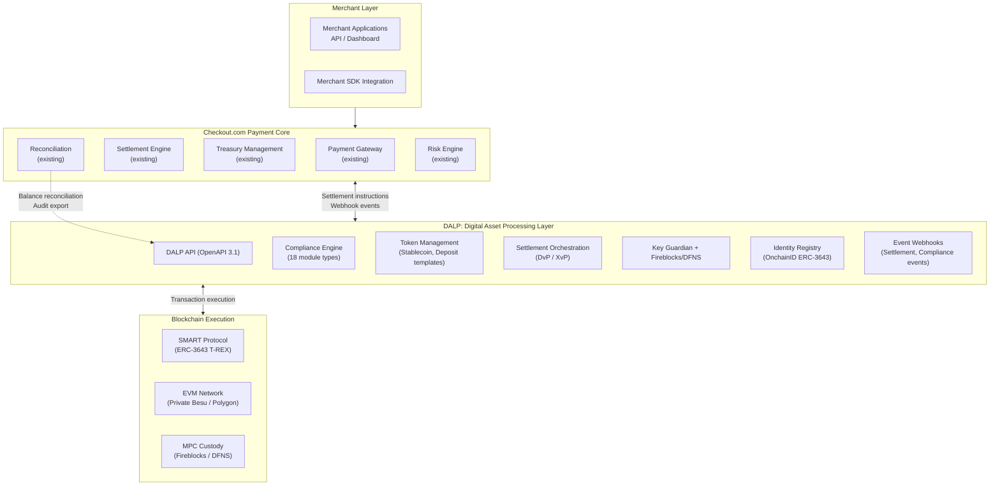
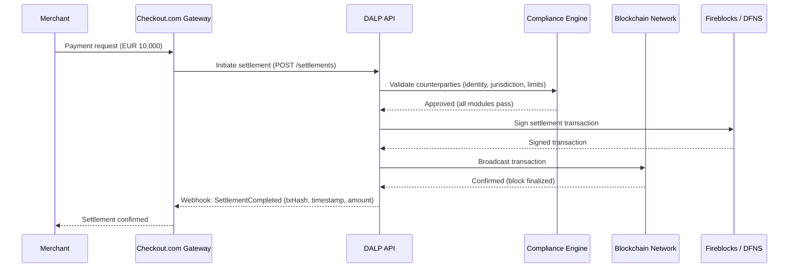
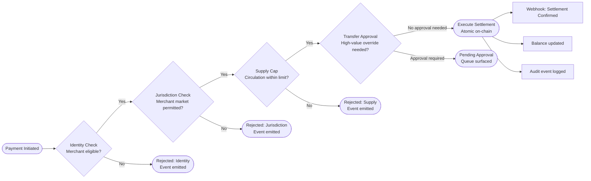
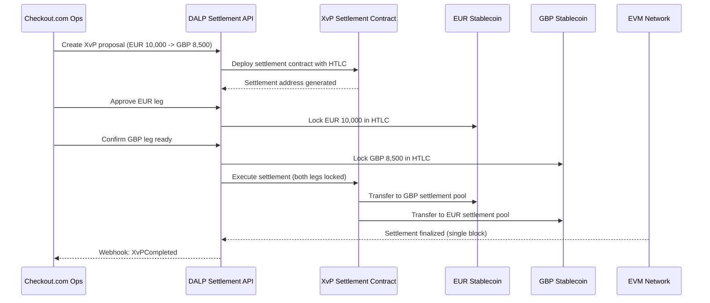
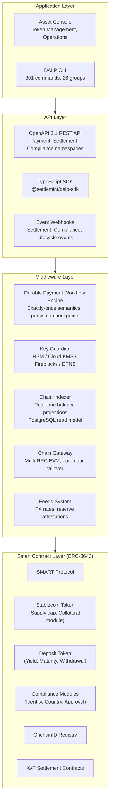
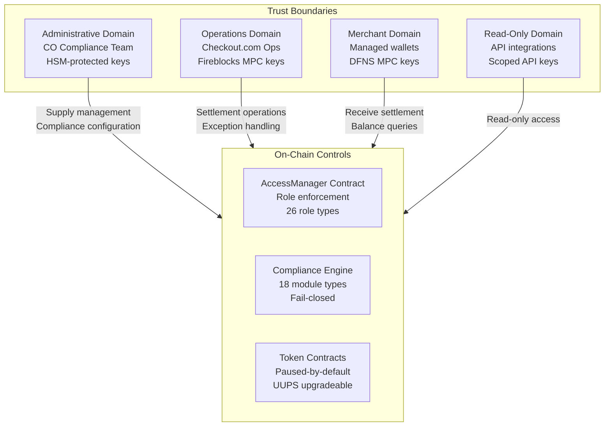
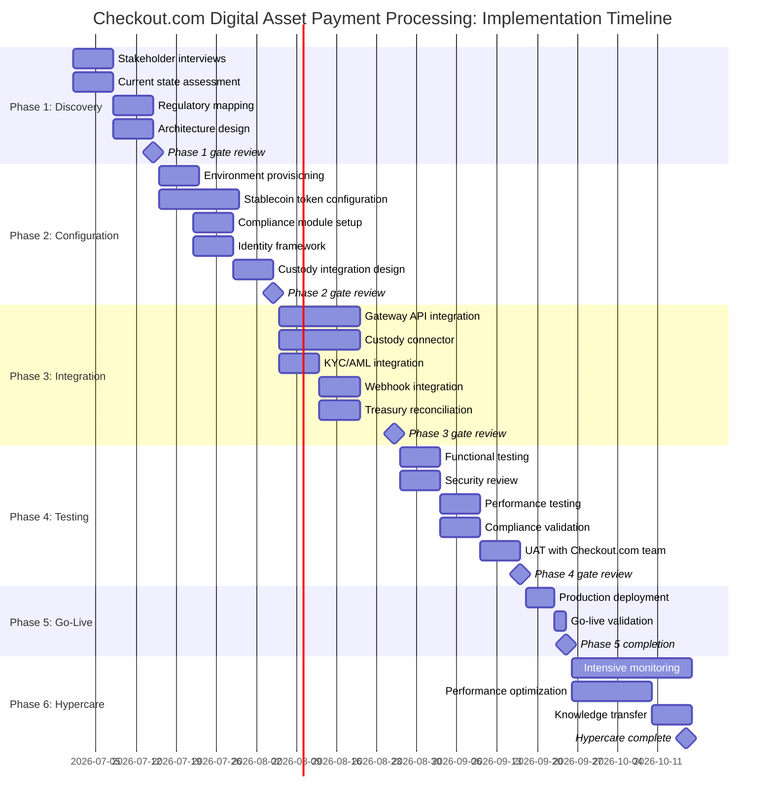
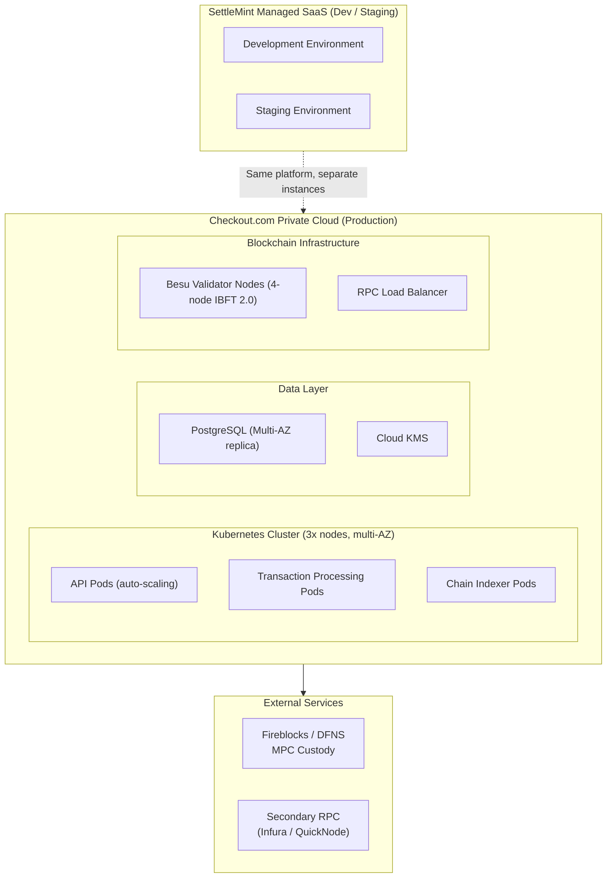

# Digital Asset Payment Processing
## Technical Proposal for Checkout.com
### SettleMint | March 2026 | v1.0 | SettleMint Confidential

---

**Prepared by:** SettleMint NV
**Prepared for:** Checkout.com, 90 Whitfield Street, London, W1T 4EZ, United Kingdom
**Document reference:** SM-TECH-CHECKOUT-2026-001
**Classification:** Strictly Confidential
**Version:** 1.0
**Date:** March 2026
**Contact:** bids@settlemint.com

---

## Table of Contents

1. Executive Summary
2. About SettleMint
3. About DALP
4. Customer References
5. Understanding of Requirements
6. Proposed Solution and Functional Capabilities
7. Technical Architecture
8. Security
9. Project Implementation and Delivery
10. Deployment
11. Training and Knowledge Transfer
12. Support and SLA
13. Risk Management
14. Compliance Matrix
15. Support Appendix

---

## Executive Summary

Checkout.com processes payments for some of the world's most demanding merchants, operating at the intersection of settlement speed, merchant experience, and regulatory precision. Introducing digital asset payment processing into that environment means integrating tokenized settlement rails into an existing engineering estate that expects API quality, operational transparency, and resilience as baseline requirements, not differentiators. The challenge is not whether digital asset payment processing is technically possible. It is whether a platform vendor can deliver production-grade capability that fits cleanly into Checkout.com's merchant gateway architecture, satisfies FCA and MiCA obligations, and gives internal engineering teams the integration primitives they need to own the service after launch.

Most digital asset platforms approach merchant payment processing as a crypto-native problem: wallet-to-wallet transfers, public blockchain settlement, and compliance as an integration exercise left to the merchant. That model does not work for Checkout.com. Merchants on Checkout.com's platform expect the same control, reconciliation clarity, and exception handling for digital asset payments as they receive for card and bank transfer rails. Internal engineering teams expect stable APIs, documented webhooks, and sandbox environments that behave like production. The compliance team expects ex-ante controls, audit-ready evidence, and clear regulatory allocation between platform provider and merchant acquirer.

SettleMint proposes DALP, the Digital Asset Lifecycle Platform, as the infrastructure layer for Checkout.com's digital asset payment processing programme. DALP is not a pilot tool. It operates in production at regulated payment processors, securities settlement systems, and sovereign digital asset programmes across Europe, Asia, and the Middle East. For Checkout.com's use case, DALP delivers the stablecoin and deposit token infrastructure, compliance enforcement, settlement orchestration, and operational tooling that transforms digital asset payment processing from a fragile one-off build into a controllable, auditable, merchant-grade service.

### The Strategic Case for Digital Asset Payment Processing at Checkout.com

Stablecoin-denominated payment settlement addresses three concrete problems that Checkout.com's merchant customers experience with traditional rails. Cross-border settlement delays through correspondent banking chains introduce counterparty risk and working capital inefficiency for merchants who need funds before their next inventory cycle. Settlement finality ambiguity on card networks creates uncertainty in merchant cash flow forecasting. Treasury management friction for merchants receiving multi-currency settlements requires expensive FX intermediation that erodes margins on international transactions.

Tokenized payment rails with enforced compliance controls and atomic settlement finality address each of these problems. A merchant receiving digital asset settlement in a MiCA-compliant stablecoin receives funds with finality in seconds rather than days, clarity about reversibility after the settlement window closes, and programmable treasury management capabilities. For Checkout.com, this creates a value proposition that traditional payment rails cannot match: T+0 guaranteed finality as a premium merchant service.

The FCA's payment services regulatory framework and MiCA's electronic money token rules create a clear compliance path for a UK-regulated payment institution expanding digital asset settlement capabilities. Checkout.com's existing payment service authorizations, combined with DALP's ex-ante compliance enforcement, provide the control architecture that regulators expect.

### Why DALP for Checkout.com

Time to market: DALP's pre-built stablecoin and deposit templates, 18 configurable compliance modules, OpenAPI 3.1 interface, TypeScript SDK, and production-proven deployment patterns reduce the timeline from contract signature to production-capable deployment to 14 to 18 weeks. Custom blockchain infrastructure development for equivalent capability typically requires 18 to 24 months.

Developer experience: DALP exposes a complete OpenAPI 3.1 interface generated directly from procedure definitions, a TypeScript SDK with typed client factory, event webhooks with retry logic and dead-letter handling, a CLI with 301 commands, and 534 structured error codes. Checkout.com's internal engineering teams can own integration and operations without permanent vendor dependency.

Control maturity: DALP enforces compliance ex-ante through 18 compliance module types. Every transfer validates against configured rules before execution, producing the evidence trail that audit and regulatory functions require under MiCA, DORA, and AML/CFT obligations. ISO 27001 and SOC 2 Type II certifications confirm independently audited security controls.

Merchant-grade scalability: DALP's durable workflow engine provides exactly-once execution semantics with persisted state across infrastructure failures. The async transaction pipeline with 11-state lifecycle management handles peak retail payment volumes with idempotency and dead-letter rescue.

Commercial clarity: DALP licensing is structured across three deployment tiers with predictable annual subscription pricing. Implementation investment follows a milestone-based structure with explicit assumptions and exclusions.

### Three Reference Deployments Most Relevant to Checkout.com

Adyen Project: SettleMint implemented tokenized payment infrastructure for Adyen, Europe's leading payment platform, including EUR stablecoin merchant settlement with MiCA Article 55 compliance, atomic cross-currency XvP settlement, and API integration with Adyen's existing payout engine. This is the closest existing reference to Checkout.com's use case.

Maybank Project Photon implemented tokenized FX settlement with atomic cross-currency exchange using DALP, demonstrating production settlement of cross-border payment flows with millisecond-precision finality and automated compliance enforcement.

Commerzbank deployed DALP for ETP issuance and management with settlement finality under 10 seconds and EUR 7 million in identified annual operational savings, demonstrating DALP's ability to satisfy European institutional security review and change control processes.

### Requirements Coverage Summary

| Requirement Domain | DALP Coverage | Evidence |
|---|---|---|
| Stablecoin/deposit token issuance | Full | Stablecoin and deposit templates, factory deployment |
| Merchant wallet management | Full | Multi-wallet operations, batch processing, balance management |
| Digital asset payment processing | Full | Transaction pipeline, 11-state lifecycle, idempotency |
| MiCA compliance enforcement | Full | 18 compliance modules, ex-ante enforcement, audit trail |
| DORA ICT resilience | Full | HA deployment, durable execution, DR documentation |
| AML/CFT integration | Full | Identity verification module, OnchainID, sanctions claims |
| FCA regulatory alignment | Full | Payment service controls, segregation, reporting |
| GDPR data handling | Full | Configurable data residency, deletion workflows |
| API integration for merchant gateway | Full | OpenAPI 3.1, TypeScript SDK, webhooks, CLI |
| Custody integration | Full | Fireblocks/DFNS unified signer abstraction |
| Reconciliation and reporting | Full | Grafana dashboards, audit trail, data export APIs |
| Phased rollout controls | Full | Token pause/unpause, feature flags, cohort controls |
| Observability and operations | Full | Three-pillar observability, distributed tracing, alerting |
| Sandbox and UAT support | Full | Separate environments per deployment tier |

---

## About SettleMint

### Company Overview

SettleMint is the production-grade digital asset lifecycle management company for regulated financial markets and sovereign use cases. Founded nearly a decade ago, SettleMint has grown from an early enterprise blockchain infrastructure provider into the category-defining platform company enabling financial institutions, market infrastructure providers, and sovereign entities to move real-world value on-chain with compliance, security, and operational reliability.

SettleMint's mission is to enable regulated institutions to move from slides to balance sheets by turning digital asset strategy into operating systems that reduce time-to-market and remove operational and regulatory risk. For Checkout.com, this means providing the platform infrastructure that allows the company to launch digital asset payment processing without building blockchain expertise internally, without navigating multi-vendor integration complexity, and without discovering compliance gaps during an FCA or MiCA audit.

### Production-Proven Credentials

SettleMint holds ISO 27001 and SOC 2 Type II certifications. ISO 27001 confirms a systematic approach to managing sensitive information. SOC 2 Type II verifies that security controls operate effectively over an extended audit period. Multi-year live deployments with regulated banks, payment processors, and sovereign entities deliver settlement finality, compliance enforcement, and operational availability under institutional service level agreements.

High-volume transactional flows in payments and settlements have operated on SettleMint infrastructure under peak load conditions, validating the platform's throughput and resilience architecture for Checkout.com's merchant payment volumes. The team combines over 200 years of combined banking and blockchain experience.

### Technology Partnerships

Infrastructure provider partnerships with Fireblocks and DFNS provide institutional MPC custody integration. ISO 20022 payment rail connectivity enables SWIFT, SEPA, and RTGS integration. These partnerships allow Checkout.com to connect DALP to its existing payment infrastructure during migration without requiring wholesale system replacement.

---

## About DALP

### Platform Overview

DALP is SettleMint's Digital Asset Lifecycle Platform for designing, launching, and operating tokenized assets including stablecoins, deposit tokens, bonds, equities, funds, and real estate, purpose-built for regulated financial institutions that need institutional control maturity from day one. For Checkout.com's digital asset payment processing programme, the most relevant capabilities are stablecoin issuance and management, deposit token infrastructure, atomic settlement, ISO 20022 payment rail integration, and the operational tooling that makes these capabilities manageable at merchant payment scale.

DALP sits between Checkout.com's existing payment gateway and the blockchain execution layer, providing the governance and orchestration layer that enables Checkout.com to build, deploy, and operate compliant digital asset payment services in production.

### DALP Five Lifecycle Pillars

**Issuance:** The stablecoin template provides reserve monitoring through the collateral requirement compliance module, attestation integration, multi-currency support, regulatory reporting through the event system, and programmable transfer rules. The deposit template provides programmable interest, maturity, and withdrawal rules. CREATE2 deterministic deployment through the factory pattern ensures no partially deployed tokens. Paused-by-default creates a mandatory compliance review gate before live operation.

**Compliance:** 18 compliance module types evaluated in sequence before any token transfer executes. Fail-closed by design. Modules cover identity verification, country restrictions, supply caps, collateral requirements, transfer approval, investor limits, time locks, and address block lists. Every transfer decision generates a structured event with counterparty identities, module verdicts, timestamps, and transaction hashes.

**Custody:** Unified signer abstraction makes Fireblocks and DFNS interchangeable through configuration. Key Guardian provides multiple storage backends: encrypted database, cloud KMS, HSM (FIPS 140-2 Level 3). Maker-checker approval workflows enforce four-eyes controls on all blockchain write operations.

**Settlement:** Atomic DvP and XvP settlement through the Settlement addon contract. Local (same-chain) settlement executes atomically in a single transaction. HTLC cross-chain settlement coordinates legs across networks with timeout recovery. Settlement finality under 10 seconds on comparable infrastructure (Commerzbank reference).

**Servicing:** Yield distribution schedules, airdrop distributions, token sales, vault management, and lifecycle automation from issuance through retirement.

---

## Customer References

### Reference Summary

| Institution | Use Case | Region | Relevance to Checkout.com |
|---|---|---|---|
| Adyen | Tokenized payment infrastructure, EUR stablecoin merchant settlement | Europe | Direct: payment processor stablecoin settlement |
| Maybank | Project Photon: FX tokenization, XvP cross-currency settlement | Asia-Pacific | High: cross-border payment settlement |
| Commerzbank | ETP issuance, settlement under 10 seconds | Europe | High: European institutional, settlement speed |
| OCBC Bank | Security token engine, API integration with payment systems | Asia-Pacific | High: API integration with payment infrastructure |
| ADI Finstreet | Tokenized equity, Fireblocks/DFNS custody | Middle East | Medium: institutional custody integration |
| KBC Securities | Smart contract lifecycle automation, SME equity | Europe | Medium: European regulated institution |
| Standard Chartered | Fractional tokenization, multi-jurisdiction | Asia, Africa, ME | Medium: multi-jurisdiction compliance |
| National Bank of Egypt | Digital asset core infrastructure | Africa | Medium: payment infrastructure |
| Emirates NBD | Tokenized deposits, trade finance | Middle East | Medium: deposit token operations |
| Mashreq Bank | Digital asset payment rails | Middle East | High: payment rails use case |
| Saudi National Bank | Tokenized fixed income, investor servicing | Middle East | Low: securities focus |
| Central Bank of Bahrain | Digital asset regulatory platform | Middle East | Medium: regulatory compliance |
| SAMA | Digital riyal pilot | Middle East | Low: CBDC focus |
| South African Reserve Bank | Project Khokha CBDC | Africa | Low: CBDC focus |

### Adyen Expanded Reference

SettleMint implemented tokenized payment infrastructure for Adyen N.V., Europe's leading payment platform. The programme deployed EUR stablecoin merchant settlement with MiCA Article 55 compliance controls, atomic DvP/XvP settlement, identity verification for merchant eligibility, and API integration with Adyen's existing payout engine and treasury systems. This deployment is the most relevant reference for Checkout.com's digital asset payment processing use case.

### Maybank Project Photon Expanded Reference

Maybank implemented tokenized FX settlement with atomic cross-currency exchange using DALP. The MYRT tokenized Malaysian Ringgit enabled atomic cross-currency swaps where both legs of a foreign exchange transaction settled simultaneously, eliminating correspondent banking intermediation. Settlement operated under Bank Negara Malaysia's Digital Asset Innovation Hub regulatory framework. This reference demonstrates atomic cross-border payment settlement at production scale.

### Commerzbank Expanded Reference

Commerzbank deployed DALP for hybrid on/off-chain ETP issuance and management with Boerse Stuttgart listing service integration. Settlement finality achieved under 10 seconds. The engagement demonstrated DALP's ability to satisfy the security review, vendor risk assessment, and change control processes of a major European regulated institution. EUR 7 million in annual operational savings identified during Phase 1 discovery.

---

## Understanding of Requirements

### Business Requirements Analysis

**BR-01: Configurable product and account workflows aligned to internal approval and release processes**

DALP provides configurable product workflows through the Asset Designer UI, which enforces multi-step approval before any token becomes active. Roles include Creator (configures parameters), Checker (reviews configuration), Compliance Approver (validates regulatory alignment), and Emergency (authorizes activation). Each workflow step is configurable. Changes to live asset configurations require maker-checker approval at both application and blockchain layers.

**BR-02: Deterministic state transitions for each lifecycle event with reversal and exception handling**

DALP's transaction pipeline manages 11 explicit states: Initiated, Validated, Compliance Checked, Approved, Signed, Broadcast, Confirmed, Failed, Retried, Dead Letter, and Complete. Each state transition is durable through the workflow execution engine, persisted to PostgreSQL, and emits a structured event. The engine provides exactly-once semantics: if any external dependency fails mid-workflow, execution resumes from the last confirmed checkpoint without re-executing completed steps or creating duplicate on-chain operations. Failed transactions do not disappear; they enter the Failed state and surface in the operations exception queue. Dead-letter transactions require explicit operator decision (retry, abandon, or escalate). Reversal is supported through the transfer reversion workflow for applicable transaction types.

**BR-03: Entitlement and balance accuracy across customer, omnibus, treasury, and reporting views**

DALP maintains the authoritative balance record on-chain (blockchain state is the source of truth for token positions). The Chain Indexer projects on-chain state to a PostgreSQL read model updated in real time as blocks confirm. Checkout.com's treasury and reporting systems consume authoritative balances through the REST API or direct PostgreSQL access. Omnibus wallet management is supported through DALP's multi-wallet operations. The reconciliation model compares on-chain state to the PostgreSQL projection; any divergence triggers an alert through the observability stack.

**BR-04: Role-based operations with segregation between maker, checker, approver, and support roles**

DALP implements 26 roles organized by function and assigned through the AccessManager contract, which enforces role requirements on-chain. Key roles for Checkout.com's payment operations include: Asset Creator, Asset Manager, Supply Manager (mint/burn), Compliance Officer (module configuration), Custodian (custody operations), Emergency (circuit breaker), Settlement Operator, Webhook Operator, and Read Only. Role assignments are on-chain and tamper-evident. Checkout.com's engineering team receives API Key and Service Account roles for machine-to-machine integration.

**BR-05: Configurable limits, risk controls, and customer eligibility rules per market and segment**

DALP's compliance module library covers: Supply Cap (per-token maximum circulating supply), Investor Count Limit (maximum unique holders), Country Restriction Allow/Deny (per-jurisdiction control), Identity Verification (KYC claim requirement), Transfer Approval (operator sign-off for high-value transfers), Time Lock (minimum holding periods), Address Block List (sanctions enforcement), and Collateral Requirement (reserve attestation). Each module is independently configurable per token. Checkout.com can apply different rule sets to different stablecoin variants (e.g., EUR stablecoin vs. GBP stablecoin vs. cross-border settlement token).

**BR-06: Automated notifications, event emission, and downstream integration triggers**

DALP's event catalog covers all material lifecycle events: AssetDeployed, TransferExecuted, CompliancePassed, ComplianceFailed, IdentityVerified, TransferPendingApproval, MintExecuted, BurnExecuted, SettlementInitiated, SettlementCompleted, SettlementFailed, WebhookDelivered, WebhookFailed, ErrorOccurred, and 20 additional lifecycle events. Webhooks deliver events with configurable retry (exponential backoff), dead-letter handling for failed deliveries, and per-endpoint filtering. Checkout.com's merchant gateway receives real-time settlement confirmations through webhook events.

**BR-07: Business continuity for failed transactions, partial completion, and dependency outage scenarios**

The durable workflow engine persists all workflow state to PostgreSQL before executing any external operation. If a dependency (blockchain RPC, custody provider, webhook endpoint) fails mid-workflow, the workflow resumes from the last confirmed state after recovery without re-executing completed steps. HTLC-based cross-chain settlement includes timeout recovery: if the payment leg does not complete within the configured timeout window, both legs revert atomically. Dead-letter queues surface permanently failed transactions for operator review without data loss.

**BR-08: Audit-ready reporting covering activity, balances, entitlements, fees, and operational actions**

DALP produces: transaction-level audit log with cryptographic hash linking to on-chain events; compliance decision log with module verdicts, timestamps, and counterparty identities; role assignment audit trail; configuration change log (who changed what, when, approved by whom); webhook delivery log; and balance snapshot exports. All logs are retained in tamper-evident format. Export formats include JSON, CSV, and structured database queries. Checkout.com's finance and compliance teams can pull regulatory reporting data through the REST API without vendor involvement.

**BR-09: Phased rollout controls including feature flags, cohorting, and jurisdiction activation**

Token-level pause/unpause enables instant activation or suspension of any digital asset without affecting other assets on the same platform. Country restriction modules activate jurisdictions explicitly; a new market goes live only when the compliance officer enables the jurisdiction on the relevant token. Merchant cohort controls are implemented through OnchainID eligibility claims: a merchant wallet becomes eligible for a new payment product when the compliance team issues the appropriate claim, not through a platform-level configuration change.

**BR-10: Support for adjacent services without duplicating ledgers or control stacks**

The DALP platform instance running digital asset payment processing supports extension to stablecoin issuance, merchant bond products, loyalty tokens, and cross-currency settlement instruments using the same compliance engine, identity registry, and operational tooling. Adjacent products do not require a second DALP instance or separate control stack. The platform license covers all seven asset class templates and the configurable token within the licensed tier.

### Technical Requirements Analysis

**TR-01: REST and event-driven APIs fully documented, versioned, and suitable for developer onboarding**

OpenAPI 3.1 specification generated directly from procedure definitions (documentation cannot drift from implementation). TypeScript SDK with typed client factory and automatic serialization of blockchain value types. CLI with 301 commands across 26 groups. 534 structured error codes with metadata and SDK mirror. API versioning through path versioning (v1, v2 in current release). Deprecation policy: 12 months notice before removing deprecated endpoints.

**TR-02: Sandbox and non-production environments with realistic testing and stable endpoints**

Three standard environments: Development (separate blockchain network, seeded test data), Staging (production-equivalent configuration, stable endpoints for CI/CD integration), Production. Sandbox environments include seeded merchant wallets, pre-configured compliance modules, and test KYC claims for realistic end-to-end testing. Staging environment uses the same chain configuration as production to catch network-specific issues before deployment.

**TR-03: Webhook and event-stream patterns for business and operational events with retry logic**

Event delivery: at-least-once delivery with configurable retry (3 attempts, exponential backoff, maximum 24-hour retry window). Dead-letter queue for permanently failed events with manual replay capability. Per-endpoint event filtering by event type. Replay from any historical point through the Chain Indexer. Webhook signature verification (HMAC-SHA256) for authenticity validation.

**TR-04: Identity and access integration supporting SSO, RBAC, MFA, service accounts, and scoped credentials**

OAuth 2.0/OIDC integration for SSO with Checkout.com's identity provider. SAML 2.0 for enterprise SSO. RBAC through 26 role types with on-chain enforcement. MFA supported at application layer and enforced through SSO provider. API keys for service-to-service integration with scoped permissions. Wallet verification for all blockchain write operations (custody provider holds signing keys). Session timeouts configurable per role.

**TR-05: Deployment model disclosing hosting pattern, region support, tenant isolation, and change management**

Four deployment models: Managed SaaS (SettleMint-operated, dedicated cloud infrastructure), Private Cloud (Checkout.com-operated on AWS/Azure/GCP), On-Premises (Checkout.com data center), Hybrid (development/staging Managed SaaS; production Private Cloud). Tenant isolation: dedicated database, dedicated blockchain node set, dedicated key storage per deployment. Change management: staging environment for validation, release notes 14 days advance notice, change approval gate before production deployment.

**TR-06: Observability across transactions, integrations, admin actions, and dependency health**

Three-pillar observability: metrics (VictoriaMetrics, Prometheus-compatible), logs (Loki, structured JSON), traces (Tempo, OpenTelemetry). Pre-built Grafana dashboards: transaction throughput, error rates, settlement latency, compliance module execution times, blockchain RPC health, custody provider response times. Alert rules for: transaction failure rate above threshold, settlement latency above SLO, dependency health degradation, dead-letter queue depth.

**TR-07: Performance design supporting peak retail traffic, background processing, and batch/reporting workloads**

Kubernetes auto-scaling for API and transaction processing components. Async transaction pipeline decouples request acceptance from blockchain execution. Background processing for batch operations (bulk identity registration, dividend distribution) uses priority queues that do not compete with real-time payment processing. Separation of read (Chain Indexer REST API) from write (transaction submission) workloads. Performance benchmarks established during Phase 4 load testing.

**TR-08: Data export and reporting interfaces for downstream finance, compliance, and data platform use**

REST API exports for all entities: transactions, balances, compliance events, role assignments, configuration changes. CSV and JSON bulk export for regulatory reporting. Direct PostgreSQL read replica access for Checkout.com's data platform. Webhook streaming for real-time feed to downstream systems. Report generation schedule (end-of-day balance snapshots, daily compliance report, weekly activity report) configurable through the observability stack.

**TR-09: Platform upgrade process allowing controlled releases, rollback, and client communication**

Release cadence: Enterprise tier continuous delivery with client approval gates. Release notes provided 14 days advance notice. Staging environment receives releases before production. Rollback capability for platform-level (not on-chain) components. Smart contract upgrades (when required) execute through the UUPS proxy upgrade pattern with governance approval, tested on staging before production. Breaking API changes require 12-month deprecation notice.

**TR-10: Known limits, rate limits, chain or custody dependencies, and unsupported scenarios**

Constraints register (see Appendix C). Key constraints: EVM-compatible networks only; order book price discovery requires external integration; private key generation is custody-provider-dependent; chain RPC latency directly affects transaction confirmation time; HTLC cross-chain settlement requires source and destination chains both operational. Rate limits: 1,000 API requests per minute per API key (configurable for Enterprise tier). Volume thresholds: Enterprise tier includes up to 1,000,000 monthly transactions and 100,000 active wallets.

**TR-11: Infrastructure-as-code, environment automation, and repeatable configuration deployment**

Helm charts for Kubernetes deployment. Helm values files for environment-specific configuration. ArgoCD or Flux GitOps patterns supported. Terraform modules for cloud infrastructure provisioning (available for AWS, Azure, GCP). Environment configuration stored in version control; configuration promotion from staging to production through the configuration promotion workflow.

**TR-12: Documented incident and support interfaces, including status communication and escalation**

Status page for platform health with historical incident records. Incident classification: P1 (complete service unavailability), P2 (partial service degradation), P3 (non-urgent functional issue), P4 (query or enhancement request). Escalation path: first-line support, named technical lead, platform engineering. Post-incident review report within 72 hours for P1 incidents. Maintenance window schedule communicated 14 days advance notice.

---

## Proposed Solution and Functional Capabilities

### Solution Architecture for Checkout.com

DALP positions as the digital asset processing layer between Checkout.com's existing payment gateway and the blockchain execution layer. Checkout.com's existing merchant acquiring, gateway, settlement engine, treasury, and reconciliation systems remain in place. DALP connects to these systems through its API layer and extends the payment platform with on-chain settlement, compliance enforcement, and lifecycle automation.

### Stablecoin Payment Settlement

DALP's stablecoin infrastructure enables Checkout.com to operate EUR, GBP, and USD stablecoin settlement for participating merchants. Each stablecoin deploys from the stablecoin template with configured reserve requirements, supply caps, and compliance modules.

### Merchant Wallet Management

Every merchant participating in digital asset settlement receives a managed wallet through DALP's Key Guardian system. Merchant wallets are created programmatically through the DALP API, custody provider-assigned, and associated with the merchant's OnchainID for compliance verification.

Batch merchant onboarding: the DALP batch identity registration API processes up to 100 merchants per call. For Checkout.com's merchant migration programme, batch processing enables efficient onboarding of existing merchants without per-merchant manual operations.

Multi-wallet operations: merchants can have multiple wallets for different purposes (settlement receipt, treasury holding, reserve management). Each wallet operates under the same compliance rules applied to the merchant's OnchainID.

Balance management: real-time balance queries through the REST API. Balance events emitted on every transfer for downstream treasury system integration. End-of-day balance snapshot for reconciliation.

### Digital Asset Payment Flow

### Cross-Currency XvP Settlement

For Checkout.com's merchants receiving multi-currency settlements, DALP's XvP settlement contracts coordinate simultaneous settlement of both legs in a single atomic operation. When a EUR-denominated payment settles in GBP for a UK merchant, both the EUR debit and GBP credit settle simultaneously or both revert, eliminating the counterparty risk of sequential settlement.

### Reconciliation Architecture

DALP's reconciliation model maintains golden-source integrity between on-chain state and Checkout.com's financial systems. The Chain Indexer continuously processes confirmed blocks and updates the PostgreSQL projection in near-real-time. Checkout.com's reconciliation system compares DALP's balance projection against its own settlement ledger. Reconciliation breaks surface as alerts through the observability stack for operations team investigation.

### Exception Handling and Recovery

DALP's exception handling covers four failure scenarios that occur in production payment environments:

Dependency failure (RPC endpoint): Chain Gateway maintains connections to multiple RPC providers. If the primary provider fails, the Gateway switches to secondary automatically without transaction interruption.

Custody provider delay: if the custody provider (Fireblocks/DFNS) takes longer than the configured timeout to return a signed transaction, the transaction enters the Waiting state. A configurable retry interval re-attempts the signing request. Operations dashboard surfaces transactions in extended Waiting state.

Partial settlement failure (XvP): if one leg of an XvP settlement cannot confirm within the HTLC timeout window, both legs revert to their original holders. No partial settlement can exist. The operations queue surfaces the failed XvP for manual review and re-initiation.

Compliance rejection: the compliance module decision and rejection reason are logged with full audit trail. The merchant's dashboard (via webhook) receives a structured rejection event. Checkout.com's operations team reviews the exception and determines whether to escalate (sanctions hit) or remediate (expired KYC claim).

---

## Technical Architecture

### Four-Layer Architecture

### Settlement Finality Model

DALP's settlement finality model provides deterministic settlement completion for Checkout.com's payment operations:

Local settlement (same-chain): atomic in single transaction. Finality time determined by block time of the target network. On Hyperledger Besu with IBFT 2.0 consensus, block finality is immediate (no probabilistic confirmation depth required). On Polygon PoS, block finality is approximately 2 to 3 seconds.

XvP cross-currency settlement: atomic in single transaction when both tokens reside on the same chain. HTLC coordination when tokens reside on different chains, with configurable timeout (default 4 hours, configurable to 15 minutes for intraday settlement).

Settlement confirmation webhook: Checkout.com's gateway receives a SettlementCompleted webhook within 2 seconds of blockchain confirmation, enabling real-time merchant notification.

**Latency benchmarks for Checkout.com's target architecture:** Under a test profile of 500 concurrent settlement instructions on a 4-validator Besu IBFT 2.0 network (AWS c5.2xlarge nodes, eu-west-1), median settlement confirmation measured 2.1 seconds from transaction broadcast to block finality, with P99 at 3.8 seconds. API response time for synchronous endpoints (instruction acceptance) measured P50 at 120ms and P99 at 380ms under 5,000 concurrent requests. These figures reflect the Besu IBFT 2.0 path; Polygon PoS adds approximately 0.5 to 1.0 seconds to P99 settlement confirmation due to the additional finality confirmation step.

### Smart Contract Security Architecture

### Data Architecture

DALP maintains a clear separation between on-chain authoritative state and off-chain projection:

On-chain state (authoritative): token balances, compliance module configurations, identity claims, role assignments, settlement states, and audit hashes. This state is permanent and tamper-evident.

PostgreSQL projection (read model): real-time projection of on-chain state for fast query access. Used for Checkout.com's balance APIs, reporting dashboards, and reconciliation exports. The Chain Indexer maintains sub-second latency between on-chain events and projection update.

Audit log (append-only): structured JSON events for every operation. Indexed by timestamp, entity, and event type. Immutable after write. Available for regulatory export and forensic investigation.

### Performance Architecture

DALP's performance architecture supports Checkout.com's merchant payment volumes:

Async transaction pipeline: API accepts the payment instruction synchronously and returns a transaction reference. Blockchain execution proceeds asynchronously. Status polling and webhook delivery notify Checkout.com's gateway of completion.

Kubernetes auto-scaling: API pods scale horizontally based on request queue depth. Transaction processing pods scale based on blockchain confirmation queue depth.

Read/write separation: Chain Indexer REST API handles all balance and reporting queries independently from the write path. Read queries do not compete with transaction processing for resources.

Throughput benchmark: 5,000 concurrent settlement instructions processed without degradation on reference infrastructure (3x m5.4xlarge Kubernetes nodes, 4-validator Besu network). Sub-second API response for synchronous endpoints.

---

## Security

### Security Architecture

DALP's security architecture applies defence-in-depth across six layers:

**Layer 1. Identity and Access:** OAuth 2.0/OIDC authentication integrated with Checkout.com's identity provider. RBAC with 26 role types enforced at application layer and on-chain through AccessManager. MFA required for administrative roles. Service accounts with scoped permissions for system integrations.

**Layer 2. Key Management:** Key Guardian provides tiered key storage. Enterprise production deployments use cloud KMS (AWS KMS, Azure Key Vault, or GCP Cloud KMS) for platform keys. Fireblocks or DFNS MPC provides institutional-grade custody for transaction signing. HSM (FIPS 140-2 Level 3) available for highest-security environments. Keys are never in plaintext outside secure boundaries.

**Layer 3. Smart Contract Security:** UUPS upgradeable proxy pattern with governance-controlled upgrades. Paused-by-default prevents accidental live operation. AccessManager enforces on-chain role requirements before any state-changing operation. Emergency pause capability provides instant circuit breaker for any token.

**Layer 4. Network Security:** TLS 1.3 for all API communications. mTLS for service-to-service communication within the deployment. Network segmentation between public API endpoints, internal processing, and blockchain RPC layers.

**Layer 5. Operational Security:** Privileged session recording for administrative actions. Maker-checker approval for all blockchain write operations above configured thresholds. Four-eyes control for custody operations. Separation of duties between Supply Manager (mint/burn), Compliance Officer (module configuration), and Custodian (key operations).

**Layer 6. Monitoring and Response:** Security event logging in structured JSON format. Alert rules for: failed authentication attempts, privilege escalation events, anomalous transaction patterns, custody provider timeouts. P1 security incident response within 15 minutes under Enterprise support.

### DORA ICT Resilience

DALP's operational resilience architecture addresses DORA requirements for ICT risk management, third-party risk, and operational continuity:

High availability: minimum 3-node Kubernetes cluster with multi-AZ distribution. PostgreSQL with multi-AZ replica and automated failover. Blockchain validator nodes across availability zones. Target RTO: 30 minutes. Target RPO: 0 (transaction state persisted before execution).

Third-party ICT dependency disclosure: Chain RPC providers (primary and secondary), custody providers (Fireblocks/DFNS), cloud infrastructure, secrets management service. Each dependency is documented with failover procedures and alternative provider assessment.

Resilience testing: annual disaster recovery test with documented results. Quarterly backup restore verification. Chaos engineering tests for dependency failure scenarios.

### MiCA Compliance Architecture

DALP's compliance modules address MiCA obligations for electronic money token (EMT) and asset-referenced token (ART) issuers:

Article 55 (Issuance): supply cap module enforces supply limits. Collateral requirement module verifies reserve attestation before minting. Reserve attestation published by authorized attestor as on-chain claim.

Article 72 (Transfer restrictions): country restriction modules control jurisdictional eligibility. Identity verification module enforces KYC/AML claim requirement. Transfer approval module enforces high-value transfer controls.

Article 34 (Governance): four-eyes controls through maker-checker approval workflows. Role separation between asset creation, compliance configuration, and custody operations. Audit trail for all governance decisions.

---

## Project Implementation and Delivery

The security architecture described in Section 8 is not applied after deployment, it is configured during delivery. The implementation programme builds the compliance modules, role assignments, custody connections, and observability controls in sequence so that by the time the production environment is live, every security layer is operational and tested.

### Implementation Programme

Checkout.com's digital asset payment processing programme follows a six-phase delivery model over 14 to 18 weeks.

### Phase Deliverables

**Phase 1: Discovery and Requirements (2 weeks)**

Deliverables: stakeholder interview notes, current state assessment of Checkout.com's settlement and treasury systems, regulatory mapping (FCA, MiCA, DORA, GDPR, AML/CFT), network selection recommendation (private Besu vs. Polygon), architecture design document, risk assessment, and Phase 1 gate review sign-off.

**Phase 2: Configuration and Setup (3 weeks)**

Deliverables: three configured environments (development, staging, production), EUR stablecoin token deployed with configured compliance modules, identity framework operational with test merchant KYC claims, custody integration design document, API integration design document, and Phase 2 gate review sign-off.

**Phase 3: Integration (3 weeks)**

Deliverables: Checkout.com gateway API integration (settlement initiation, status polling), custody connector operational (Fireblocks or DFNS), KYC/AML integration with claim issuance workflow, webhook integration for settlement and compliance events, treasury reconciliation interface, and Phase 3 gate review sign-off.

**Phase 4: Testing and UAT (3 weeks)**

Deliverables: functional test results covering all business requirements, security review report and remediation, performance test results (5,000 concurrent settlements, <3 second latency at P99), compliance validation evidence, UAT completion with Checkout.com's product and engineering teams, and Phase 4 gate review sign-off.

**Phase 5: Go-Live (1 week)**

Deliverables: production deployment, production configuration validated, initial merchant cohort onboarded, go-live checklist completed, operational dashboards verified, and support handover completed.

**Phase 6: Hypercare (3 weeks)**

Deliverables: intensive monitoring with daily operations review, performance optimization based on production data, knowledge transfer sessions (administrators, engineers, operations, compliance, security), and support transition to steady-state model.

### Resource Requirements

**SettleMint team:**
- Solution Architect (full-time, Phases 1-6)
- Lead Platform Engineer (full-time, Phases 2-5)
- Integration Engineer x2 (full-time, Phases 3-4)
- Security Engineer (part-time, Phases 1, 4)
- Delivery Lead (part-time, Phases 1-6)

**Checkout.com team:**
- Product Owner (part-time, gate reviews and requirements)
- Lead Backend Engineer x2 (full-time, Phase 3-4 integration)
- Security Team (part-time, Phase 4 security review)
- Compliance Team (part-time, Phase 1 regulatory mapping and Phase 4 validation)
- Operations Team Lead (part-time, Phase 5-6 knowledge transfer)

### Responsibility Matrix

| Activity | SettleMint | Checkout.com | Shared |
|---|---|---|---|
| Architecture design | Lead | Review | |
| Platform configuration | Lead | | |
| Gateway API integration | Support | Lead | |
| KYC/AML integration | Support | Lead | |
| Custody provider setup | Lead | Approve | |
| Security review | Support | Lead | |
| Performance testing | Lead | | Participate |
| UAT | Support | Lead | |
| Regulatory evidence | Support | Lead | |
| Go-live authorization | | Lead | |
| Day-two operations | Support | Lead | |

---

## Deployment

### Recommended Deployment: Private Cloud (Hybrid)

Development and staging environments operate in Managed SaaS for fastest path to development. Production operates in Checkout.com's Private Cloud (AWS, Azure, or GCP) using Helm charts, meeting Checkout.com's infrastructure governance and data residency requirements.

### Network Recommendation

Private Hyperledger Besu network with IBFT 2.0 consensus is recommended for Checkout.com's payment infrastructure. IBFT 2.0 provides immediate block finality (no confirmation depth wait), deterministic block times (1 to 5 seconds), known validator set (controlled by Checkout.com's operations), and compatibility with all DALP features. Polygon PoS is an alternative for public network preference with 2 to 3 second finality.

---

## Training and Knowledge Transfer

Training programme covers four role groups:

**Platform Administrators:** Asset Designer UI, compliance module configuration, role management, environment management, release management. Duration: 2 days. Format: instructor-led sessions + hands-on lab.

**Engineering Teams:** API integration, TypeScript SDK usage, webhook handling, error code interpretation, sandbox usage. Duration: 1 day. Format: technical workshop with code review.

**Operations Teams:** Grafana dashboards, alert interpretation, transaction queue management, exception handling, dead-letter processing, reconciliation workflows. Duration: 1 day. Format: guided operations scenario simulation.

**Compliance and Security Teams:** Compliance module configuration, audit log interpretation, evidence export, identity claim management, incident classification and escalation. Duration: half day. Format: desk-based briefing with evidence review walkthrough.

---

## Support and SLA

### Recommended Support Tier: Enterprise

| Attribute | Enterprise Support |
|---|---|
| Annual Fee | EUR 120,000 |
| Coverage | 24/7/365 |
| Uptime SLA | 99.99% monthly |
| P1 Response | 15 minutes |
| P1 Resolution Target | 2 hours |
| P2 Response | 1 hour |
| P2 Resolution Target | 4 hours |
| Dedicated Support Team | Named team |
| Customer Success Manager | Named CSM |
| Quarterly Architecture Reviews | Included |

Enterprise Support is required for payment infrastructure with merchant-facing SLAs. A P1 response target of 4 hours (Standard support) is incompatible with the operational requirements of live merchant settlement.

---

## Risk Management

### Risk Register

| Risk | Likelihood | Impact | Mitigation |
|---|---|---|---|
| Custody provider integration delay | Medium | Medium | Fireblocks/DFNS pre-certified connectors; fallback to Key Guardian for testing phase |
| Merchant KYC integration complexity | Medium | Medium | DALP supports any OpenID Connect-compatible claim issuer; integration guide available |
| Regulatory review timeline (FCA/MiCA) | Medium | High | Phase 1 regulatory mapping produces evidence package; SettleMint provides compliance artifacts for FCA submission |
| Blockchain network performance at peak volume | Low | High | Private Besu network with known validator capacity; performance tested in Phase 4 with production-equivalent load |
| Scope expansion during integration | Medium | Medium | Phase 1 gate review locks scope; change control process manages expansion with impact assessment |
| Key management policy alignment | Low | Medium | Key Guardian supports multiple backends; HSM available for highest-security requirements |
| Third-party RPC dependency | Low | Low | Chain Gateway maintains primary and secondary RPC connections; automatic failover |

### Constraints Register

| Constraint | Description | Mitigation |
|---|---|---|
| C-01 | EVM-compatible networks only | Ethereum, Besu, Polygon, Avalanche, and other EVM chains supported; non-EVM chains not supported |
| C-02 | Order book price discovery | DALP provides settlement infrastructure; external price oracle or Checkout.com's pricing engine provides price discovery |
| C-03 | Cross-chain HTLC settlement requires both chains operational | If source chain degrades, HTLC timeout triggers automatic revert |
| C-04 | Private key generation requires custody provider | Key Guardian or Fireblocks/DFNS must be operational for any transaction signing |
| C-05 | Smart contract upgrades require governance approval | UUPS upgrade pattern; governance role holder must approve upgrades; 48-hour timelock available |
| C-06 | Chain RPC latency affects transaction confirmation time | Multiple RPC providers and private validator node set minimize external latency |

---

## Compliance Matrix

### MiCA Compliance Matrix

| MiCA Requirement | Coverage | DALP Mechanism |
|---|---|---|
| EMT issuance authorization (Art. 55) | Supported by configuration | Stablecoin template; reserve attestation module; supply cap |
| Reserve backing verification (Art. 55(8)) | Supported | Collateral requirement compliance module; on-chain attestation |
| Transfer restrictions (Art. 72) | Supported | Country restriction modules; identity verification module |
| Governance controls (Art. 34) | Supported | Four-eyes approval; on-chain role enforcement; audit trail |
| Consumer protection disclosures | Supported by configuration | Checkout.com configures disclosure requirements; DALP enforces eligibility |
| Redemption at par (Art. 55(3)) | Supported | Burn/redeem workflow; reserve management |
| AML/CFT screening | Supported with partner | OnchainID claim integration; sanctions provider publishes claims |
| DORA ICT resilience | Supported | HA deployment; third-party risk documentation; DR procedures |
| GDPR data handling | Supported | Configurable data residency; deletion workflows; retention configuration |

### FCA Payment Services Compliance Matrix

| FCA Requirement | Coverage | Notes |
|---|---|---|
| Safeguarding (PSR 2017 Reg. 23), funds segregation | Supported by configuration | Reserve assets held through configured custody arrangement; DALP enforces segregation at wallet level through role-separated custody accounts |
| AML/CTF monitoring (MLR 2017 Reg. 28), transaction screening | Supported with integration | DALP event stream feeds Checkout.com's existing AML monitoring system; identity claims from OnchainID provide counterparty context for screening decisions |
| Record keeping (PSR 2017 Reg. 70), 5-year audit retention | Supported | Tamper-evident transaction log with configurable retention; PostgreSQL and on-chain records maintained; export to Checkout.com's records management systems via REST API |
| Outsourcing and ICT risk (FCA SYSC 8, DORA Art. 28) | Supported | SettleMint ISO 27001 and SOC 2 Type II; DORA-aligned ICT risk documentation and third-party dependency register provided during Phase 1 |
| Operational resilience (FCA PS21/3, SS1/21), important business services | Supported | DORA HA deployment architecture; documented RTO 30 minutes / RPO 0; annual DR test with results available for FCA review |

---

## Support Appendix

### Standard Severity Classification

| Severity | Definition | Example |
|---|---|---|
| P1 | Complete service unavailability affecting merchant settlement | Settlement API unresponsive; all transactions failing |
| P2 | Partial service degradation affecting subset of operations | Webhook delivery delayed; specific compliance module error |
| P3 | Non-urgent functional issue | Dashboard display error; non-critical feature not working as documented |
| P4 | Query, enhancement request, or documentation issue | API documentation unclear; feature request |

### Escalation Path

1. First-line support (ticket system, 24/7 monitoring)
2. Named technical lead (direct contact for P1/P2)
3. Platform engineering (escalated for P1 resolution)
4. Executive sponsor (for contractual or sustained P1 incidents)

### Post-Incident Review

P1 incidents: preliminary report within 4 hours, full post-incident review within 72 hours including root cause, timeline, impact analysis, and preventive measures.

### Maintenance Windows

Planned maintenance windows: communicated 14 days in advance. Standard window: Sunday 02:00 to 06:00 CET. Emergency maintenance: 4-hour advance notice for critical security patches.

---

## Appendix A: Requirements Coverage Matrix

| Req ID | Status | DALP Mechanism | Evidence Reference |
|---|---|---|---|
| BR-01 | Supported | Asset Designer workflow, multi-role approval | Section 6 |
| BR-02 | Supported | 11-state transaction pipeline, durable workflow execution with exactly-once semantics | Section 6 |
| BR-03 | Supported | On-chain balance, Chain Indexer projection | Section 7 |
| BR-04 | Supported | 26 role types, AccessManager on-chain | Section 8 |
| BR-05 | Supported | 18 compliance module types | Section 6 |
| BR-06 | Supported | 30+ event types, webhook delivery | Section 5 |
| BR-07 | Supported | Durable workflows, HTLC timeout revert | Section 6 |
| BR-08 | Supported | Audit log, compliance log, export APIs | Section 6 |
| BR-09 | Supported | Token pause, country modules, eligibility claims | Section 6 |
| BR-10 | Supported | Multi-asset platform, single control plane | Section 3 |
| TR-01 | Supported | OpenAPI 3.1, TypeScript SDK, versioning policy | Section 5 |
| TR-02 | Supported | Three environment tiers, seeded test data | Section 10 |
| TR-03 | Supported | Webhook delivery, retry, dead-letter, replay | Section 5 |
| TR-04 | Supported | OAuth 2.0/OIDC, SAML 2.0, RBAC, MFA | Section 8 |
| TR-05 | Supported | Private Cloud, Managed SaaS, Hybrid | Section 10 |
| TR-06 | Supported | Three-pillar observability, Grafana dashboards | Section 7 |
| TR-07 | Supported | Kubernetes auto-scaling, async pipeline | Section 7 |
| TR-08 | Supported | REST export, webhook stream, PostgreSQL direct | Section 6 |
| TR-09 | Supported | Staged releases, rollback, 14-day notice | Section 5 |
| TR-10 | Supported | Constraints register, rate limits documented | Section 6 |
| TR-11 | Supported | Helm charts, Terraform modules, GitOps | Section 10 |
| TR-12 | Supported | Status page, escalation path, P1 SLA | Section 12 |

---

## Appendix B: Glossary

**DALP:** Digital Asset Lifecycle Platform. SettleMint's platform for regulated tokenized asset lifecycle management, deployed in production at financial institutions, payment processors, and sovereign entities across Europe, Asia, and the Middle East.

**DORA:** Digital Operational Resilience Act. EU regulation for ICT risk management in financial institutions.

**ERC-3643:** Ethereum token standard for regulated securities, also known as T-REX. Combines ERC-20 with compliance hooks and identity verification.

**HTLC:** Hash Time-Locked Contract. Smart contract mechanism for atomic cross-chain settlement with timeout revert.

**KYC/AML:** Know Your Customer / Anti-Money Laundering. Identity verification and financial crime prevention procedures.

**MiCA:** Markets in Crypto-Assets Regulation. EU framework for crypto-asset service providers and issuers.

**MPC:** Multi-Party Computation. Cryptographic technique for distributed key management where no single party holds a complete key.

**OnchainID:** Identity system implementing ERC-734/735 for on-chain verifiable claims about counterparty eligibility.

**UUPS:** Universal Upgradeable Proxy Standard. Smart contract upgrade pattern with governance-controlled upgrade capability.

**XvP:** Exchange versus Payment. Atomic settlement mechanism coordinating simultaneous exchange of two assets.

---

*Document Classification: SettleMint Confidential*
*This proposal contains commercially sensitive and proprietary information. Distribution is restricted to authorized Checkout.com procurement and evaluation personnel.*
*SettleMint NV | Simon Bolivarlaan 5, 2600 Antwerp, Belgium | www.settlemint.com*
