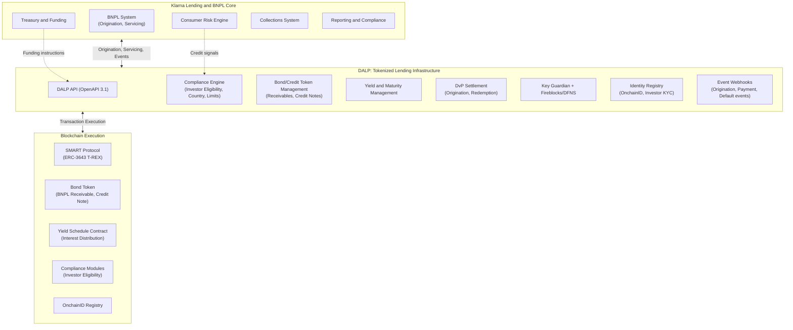
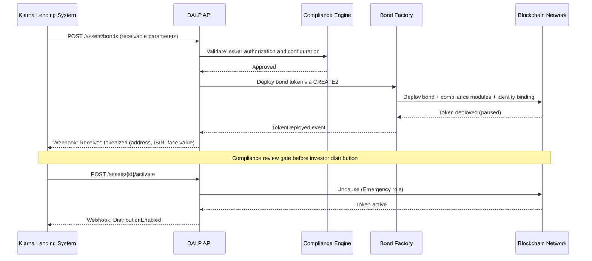
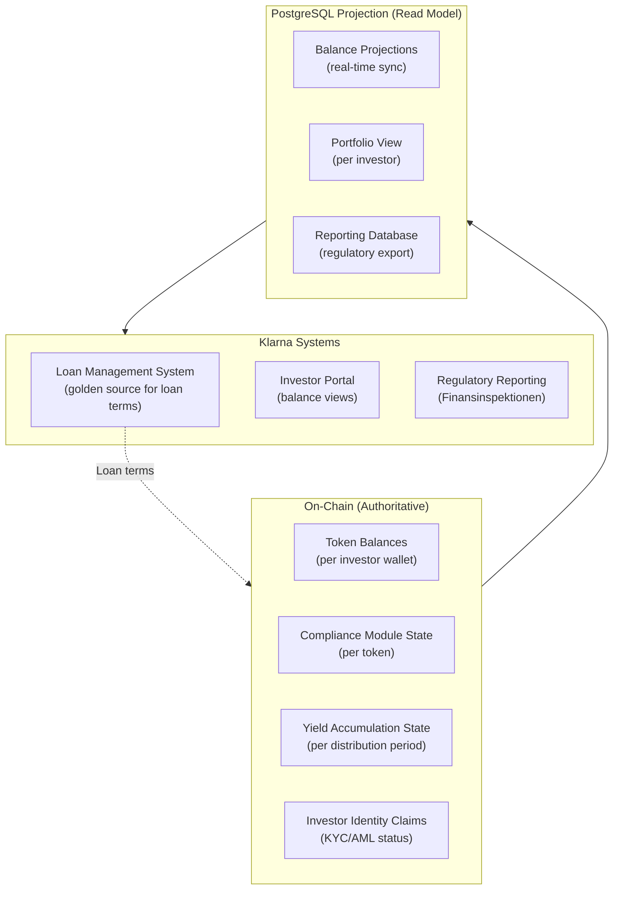
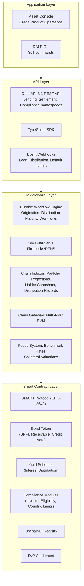
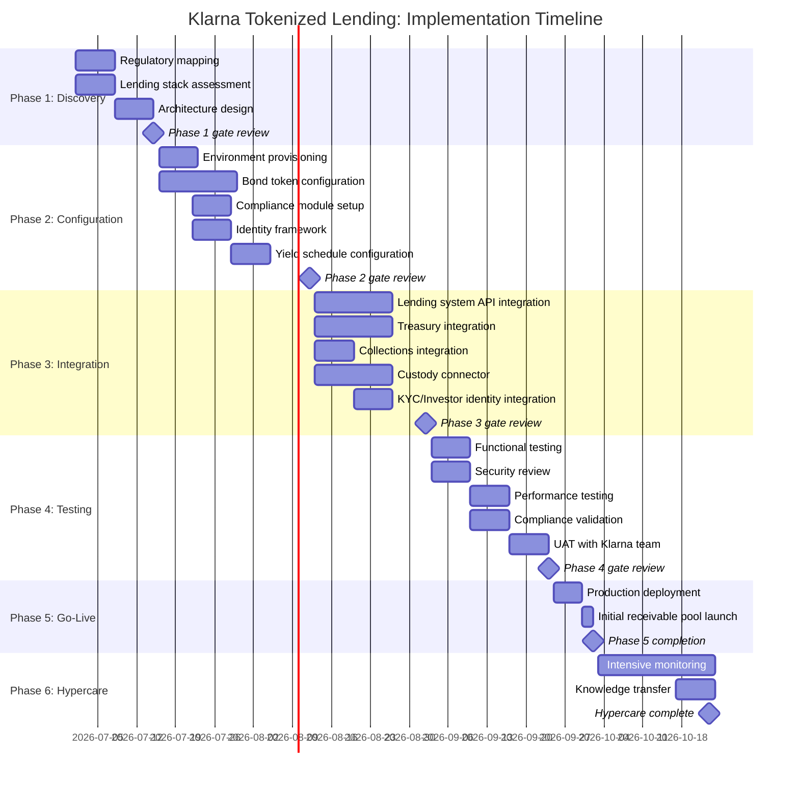
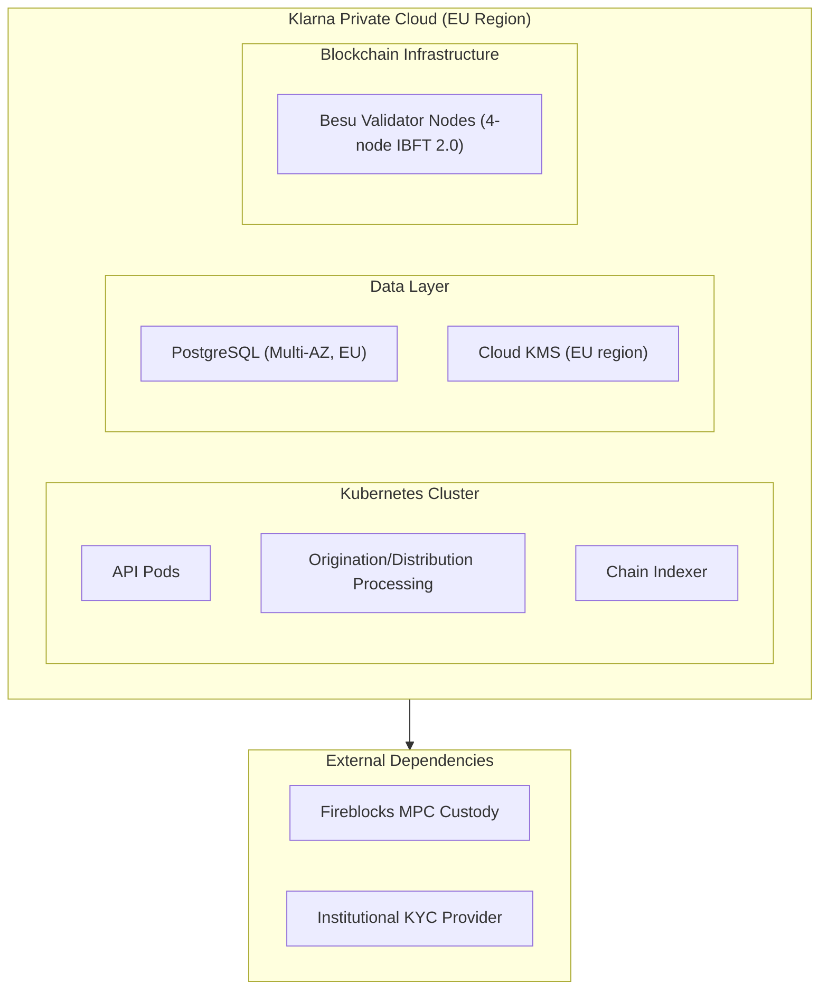

# Tokenized Lending Infrastructure
## Technical Proposal for Klarna Bank AB
### SettleMint | March 2026 | v1.0 | SettleMint Confidential

---

**Prepared by:** SettleMint NV
**Prepared for:** Klarna Bank AB, Sveavägen 46, 111 34 Stockholm, Sweden
**Document reference:** SM-TECH-KLARNA-2026-001
**Classification:** Strictly Confidential
**Version:** 1.0
**Date:** March 2026
**Contact:** bids@settlemint.com

---

## Table of Contents

1. Executive Summary
2. About SettleMint
3. About DALP
4. Customer References
5. Understanding of Requirements
6. Proposed Solution and Functional Capabilities
7. Technical Architecture
8. Security
9. Project Implementation and Delivery
10. Deployment
11. Training and Knowledge Transfer
12. Support and SLA
13. Risk Management
14. Compliance Matrix
15. Support Appendix

---

## Executive Summary

Klarna is one of Europe's most recognized consumer credit and payments platforms, serving over 150 million consumers and 500,000 merchants across 45 markets. The tokenized lending infrastructure question Klarna faces is not whether blockchain tokenization can improve funding operations or receivables management. It is whether a regulated-grade tokenization platform can integrate into Klarna's consumer credit infrastructure, satisfy Finansinspektionen and MiCA obligations, support BNPL receivables tokenization at the volumes Klarna processes, and give internal engineering teams the integration primitives they need without creating a permanent vendor dependency.

Tokenized lending infrastructure for Klarna addresses three concrete opportunities. First, receivables tokenization: BNPL receivables represent a large and growing balance sheet. Tokenizing these receivables enables programmatic management, transparent reporting, and capital markets access to a broader investor base with lower intermediation cost. Second, funding optimization: tokenized credit notes and debt instruments can automate the funding lifecycle from issuance through maturity, reducing treasury operations overhead and improving working capital efficiency. Third, programmable credit servicing: on-chain credit servicing with automated payment distribution, default handling, and recovery workflows reduces operations cost per loan while improving transparency for regulatory reporting.

SettleMint proposes DALP, the Digital Asset Lifecycle Platform, as the production infrastructure layer for Klarna's tokenized lending programme. DALP provides the bond and deposit token infrastructure, compliance enforcement, settlement orchestration, and operational tooling that transforms tokenized lending from a concept into an auditable, scalable, regulatory-grade service under a single control plane.

### The Strategic Case for Tokenized Lending at Klarna

BNPL receivables are Klarna's core commercial asset. Managing these assets through traditional balance sheet processes involves manual reporting, periodic reconciliation, and intermediated capital markets access. Tokenizing BNPL receivables on a regulated blockchain platform creates three strategic advantages.

Capital markets access at lower cost: tokenized receivables enable programmatic investor distribution to institutional and qualified investors who can participate in Klarna's funding programs through digital securities rather than traditional structured products. The tokenization layer reduces the documentation and intermediation overhead that makes small-ticket receivables programs inefficient in traditional structures.

Real-time portfolio transparency: on-chain receivables with Finansinspektionen-acceptable audit trails provide real-time portfolio visibility that traditional off-chain systems cannot match. Regulatory reporting for consumer credit institutions requires granular portfolio data; DALP's event system provides this data automatically as receivables are originated, serviced, and retired.

Programmable credit servicing: automated payment distribution, covenant monitoring, and default escalation through smart contract logic reduce servicing operations cost per loan. At Klarna's scale of hundreds of millions of transactions annually, the operational efficiency of automated servicing is material.

### Why DALP for Klarna

Time to market: DALP's pre-built bond and deposit templates, 18 configurable compliance modules, documented APIs, TypeScript SDK, and production-proven deployment patterns reduce the timeline from contract signature to production-capable deployment to 15 to 19 weeks. Custom blockchain infrastructure development for equivalent lending infrastructure capability typically requires 18 to 24 months.

Consumer credit controls: DALP's compliance module architecture enforces investor eligibility, jurisdictional restrictions, and transfer limits at the protocol level. For BNPL receivables distributed to institutional investors, these controls ensure that only eligible counterparties can hold or trade receivables tokens, satisfying Finansinspektionen's requirements for regulated credit instruments.

Integration with Klarna's lending stack: DALP connects to Klarna's existing lending and BNPL systems, consumer risk engines, treasury, and collections through its OpenAPI 3.1 interface and event webhook system. The API-first architecture means Klarna's internal engineering teams own integration without permanent vendor dependency.

Audit and regulatory evidence: DALP's ex-ante compliance enforcement and tamper-evident audit trail produce the evidence that Finansinspektionen and MiCA require. Every origination, transfer, payment distribution, and default event generates a structured record that supports both internal risk management and external regulatory review.

### Three Reference Deployments Most Relevant to Klarna

Commerzbank deployed DALP for ETP issuance with settlement under 10 seconds, demonstrating DALP's ability to satisfy European institutional compliance and risk review processes. The Commerzbank reference demonstrates institutional-grade bond lifecycle management directly relevant to Klarna's tokenized credit note programme.

National Bank of Egypt deployed DALP for digital asset core infrastructure including tokenized fixed income origination and investor servicing. This reference demonstrates DALP's ability to handle credit instrument origination, investor eligibility management, yield distribution, and maturity redemption at institutional scale.

OCBC Bank deployed DALP as a security token engine for structured financial products integrating with off-chain securities registries and core banking through DALP's API layer. This reference demonstrates the same lending-and-investment-product integration that Klarna needs to connect tokenized receivables with its existing consumer credit and treasury infrastructure.

### Requirements Coverage Summary

| Requirement Domain | DALP Coverage | Evidence |
|---|---|---|
| Tokenized BNPL receivables | Full | Bond template, asset lifecycle management |
| Tokenized credit notes | Full | Bond template with maturity, yield, redemption |
| Investor eligibility enforcement | Full | Identity verification, country restriction modules |
| MiCA compliance (EU) | Full | 18 compliance modules, ex-ante enforcement |
| Finansinspektionen requirements | Full | KYC/AML integration, audit trail, reporting |
| DORA ICT resilience | Full | HA deployment, durable execution, DR |
| Consumer credit regulatory reporting | Full | Event stream, audit log, data export APIs |
| API integration with lending stack | Full | OpenAPI 3.1, TypeScript SDK, webhooks |
| Settlement and payment distribution | Full | DvP settlement, yield schedule automation |
| Collections and default handling | Full | Token pause, seizure workflow, recovery |
| Custody integration | Full | Fireblocks/DFNS unified signer abstraction |
| GDPR data handling | Full | Configurable data residency, deletion workflows |

---

## About SettleMint

### Company Overview

SettleMint is the production-grade digital asset lifecycle management company for regulated financial markets and sovereign use cases. Founded nearly a decade ago, SettleMint has operated in production at regulated banks, market infrastructure providers, payment processors, and sovereign entities across Europe, the Middle East, and Asia Pacific.

For Klarna's tokenized lending programme, SettleMint brings a specific combination of capabilities: proven bond and credit instrument lifecycle management, investor eligibility verification through ERC-3643 and OnchainID, automated yield distribution and maturity redemption, and institutional custody integrations that regulated credit operations require.

SettleMint holds ISO 27001 and SOC 2 Type II certifications. The team combines over 200 years of banking and blockchain experience. Multi-year live deployments with regulated institutions operate under 24/7 uptime requirements with full institutional service level agreements.

### European Regulatory Credentials

SettleMint's platform is built for regulated environments. For Klarna's Swedish and EU regulatory context, DALP's regulatory support covers MiCA (electronic money token and asset-referenced token structures), DORA (ICT risk management and third-party risk), GDPR (data residency, deletion, retention), and AML/CFT (identity verification integration). The compliance module architecture enforces Finansinspektionen-applicable consumer credit investor eligibility at the protocol level.

---

## About DALP

### Platform Overview

DALP is SettleMint's Digital Asset Lifecycle Platform, built for regulated financial markets that require institutional control maturity from the first transaction. For Klarna's tokenized lending programme, the most relevant capabilities are bond token infrastructure for credit note and receivables tokenization, yield distribution automation, maturity redemption, compliance enforcement for investor eligibility, and the operational tooling that makes tokenized lending manageable at consumer credit scale.

DALP sits between Klarna's existing lending systems and the blockchain execution layer, providing the governance and orchestration layer that transforms tokenized lending infrastructure from a prototype into a production service.

### DALP Lifecycle Pillars for Tokenized Lending

**Issuance:** The bond template deploys tokenized credit instruments with maturity date, ISIN, face value, denomination asset, yield schedule, and compliance modules in a single atomic operation. CREATE2 deterministic deployment through the factory pattern ensures no partially deployed instruments. Paused-by-default creates a mandatory compliance review gate before distribution.

**Compliance:** 18 compliance module types enforced before every investor transfer. Fail-closed by design. Key modules for Klarna's lending use case: investor eligibility (KYC/AML claim verification), country restriction (jurisdiction activation per instrument), investor count limit (regulatory holding limits), transfer approval (consent for institutional transfers), time lock (lock-up periods for receivables). Every compliance decision generates a structured audit event.

**Custody:** Unified signer abstraction supporting Fireblocks, DFNS, and Key Guardian. Maker-checker workflows enforce four-eyes controls on all loan origination and treasury operations. HSM storage for highest-security environments.

**Settlement:** Atomic DvP settlement ensures simultaneous exchange of credit instrument and payment. XvP multi-party settlement coordinates complex funding structures. Yield schedule automation distributes periodic interest payments to token holders through snapshot-based distribution with pro-rata calculation.

**Servicing:** Yield distribution schedules, maturity redemption, early repayment events, default escalation through token pause, and recovery workflows from credit retirement through collateral disposal.

---

## Customer References

### Reference Summary

| Institution | Use Case | Relevance to Klarna |
|---|---|---|
| Commerzbank | ETP issuance, settlement, European institutional | High: European bond lifecycle |
| National Bank of Egypt | Fixed income origination, investor servicing | High: credit instrument lifecycle |
| OCBC Bank | Security token engine, API integration with core banking | High: lending + capital markets integration |
| KBC Securities | SME loan and equity lifecycle automation | High: consumer credit adjacent |
| Standard Chartered | Fractional securities, multi-jurisdiction | Medium: investor distribution |
| BNP Paribas | Tokenized funds distribution | Medium: investor servicing |
| Nordea | Tokenized funds platform (Nordic regulatory context) | High: Nordic regulatory alignment |
| Adyen | Payment infrastructure, stablecoin settlement | Medium: payment settlement |
| Maybank | Cross-border settlement, FX tokenization | Medium: cross-border |
| SAMA | Digital riyal pilot, funding infrastructure | Low: sovereign focus |
| Saudi National Bank | Tokenized fixed income | Medium: fixed income lifecycle |
| Central Bank of Bahrain | Regulatory platform | Low: regulatory focus |
| Emirates NBD | Deposit tokens, trade finance | Medium: deposit instrument |
| ADI Finstreet | Equity tokenization, custody integration | Low: equity focus |

### Commerzbank Expanded Reference

Commerzbank deployed DALP for hybrid on/off-chain ETP issuance with Boerse Stuttgart integration. Settlement finality under 10 seconds. EUR 7 million in annual operational savings identified. The engagement demonstrates European institutional bond lifecycle management at production scale under regulatory oversight, directly relevant to Klarna's tokenized credit note programme. SettleMint satisfactorily completed Commerzbank's security review and vendor risk assessment processes.

### National Bank of Egypt Expanded Reference

The National Bank of Egypt deployed DALP for tokenized fixed income origination and investor servicing. The programme covers credit instrument issuance, investor eligibility verification, yield distribution, and maturity redemption. DALP's event system provides the regulatory audit trail required for Egyptian financial sector supervision. This reference demonstrates the full credit instrument lifecycle from issuance through retirement that Klarna's tokenized receivables programme requires.

### Nordea Expanded Reference

Nordea deployed DALP for tokenized funds distribution under Nordic regulatory frameworks. The Nordea reference is particularly relevant to Klarna's regulatory context: Swedish Finansinspektionen oversight and EEA compliance requirements. DALP's compliance modules addressed Nordea's investor eligibility, disclosure acknowledgment, and transfer restriction requirements under the Nordic regulatory framework.

---

## Understanding of Requirements

### Business Requirements Analysis

**BR-01: Configurable product and account workflows aligned to internal approval processes**

DALP provides configurable loan origination and credit note issuance workflows through the Asset Designer UI. Each workflow step enforces role-based approval: Credit Product Manager (configures parameters), Risk Officer (validates credit parameters), Compliance Approver (validates regulatory alignment), Emergency (authorizes activation). Klarna's existing loan approval governance integrates through the API layer. Configuration changes to live credit instruments require maker-checker approval at both application and blockchain layers.

**BR-02: Deterministic state transitions with reversal and exception handling**

Credit instrument lifecycle state machine manages: Originated, Compliance Checked, Approved, Distributed, Active (interest accruing), In Arrears, Default, Recovery, Matured, and Retired. Each transition is durable through the workflow execution engine, persisted to PostgreSQL, and emits a structured event. The engine provides exactly-once execution semantics: if any external dependency fails mid-workflow, execution resumes from the last confirmed checkpoint without re-executing completed steps or creating duplicate origination events. Failed payment events trigger the In Arrears state and surface in the credit operations queue for Klarna's collections team. Maturity transitions execute automatically at the configured maturity date through the yield schedule automation.

**BR-03: Entitlement and balance accuracy across customer, omnibus, treasury, and reporting views**

On-chain state is authoritative for receivables token positions. Chain Indexer projects on-chain state to PostgreSQL read model. Klarna's treasury and reporting systems consume authoritative balances through the REST API. Omnibus investor accounts managed through DALP's multi-wallet operations. Reconciliation between on-chain token positions and Klarna's loan management system identifies discrepancies and alerts through the observability stack.

**BR-04: Role-based operations with segregation between maker, checker, approver, and support roles**

26 role types organized by function: Credit Originator, Credit Approver, Supply Manager (mint/burn), Compliance Officer, Yield Manager (distribution scheduling), Custodian, Emergency (circuit breaker), Collections Operator, Settlement Operator, Read Only. Role assignments on-chain through AccessManager. Klarna's engineering team receives API Key and Service Account roles for machine-to-machine integration with lending systems.

**BR-05: Configurable limits, risk controls, and customer eligibility rules per market and segment**

Compliance modules configurable per credit instrument: Investor Eligibility (KYC/AML claim verification for institutional investors), Country Restriction (Swedish, EEA, and global investor eligibility per instrument), Investor Count Limit (concentration limit management), Transfer Approval (consent requirement for secondary investor transfers), Time Lock (lock-up periods for newly originated receivables), Address Block List (sanctions enforcement). Different limit sets apply per instrument type (institutional BNPL receivables vs. retail credit notes).

**BR-06: Automated notifications, event emission, and downstream integration triggers**

Event catalog for credit lifecycle: LoanOriginated, DistributionCompleted, InterestPaid, YieldDistributed, LoanInArrears, LoanDefault, RecoveryInitiated, MaturityReached, TokenRedeemed, CompliancePassed, ComplianceFailed, TransferExecuted. Webhooks to Klarna's lending system, treasury, and collections infrastructure. Klarna's risk engine receives real-time credit events for portfolio monitoring.

**BR-07: Business continuity for failed transactions, partial completion, and dependency outage**

Durable workflow engine persists all workflow state before executing external operations. If Klarna's lending API or the custody provider fails mid-workflow, the workflow resumes from the last confirmed state after recovery. Yield distribution failure handling: if a distribution call fails (custody signing delay), the distribution workflow retries with exponential backoff. Dead-letter queues for permanently failed distributions require explicit credit operations team decision.

**BR-08: Audit-ready reporting for activity, balances, entitlements, fees, and operational actions**

DALP produces: loan origination audit log with origination parameters, approval chain, and deployment hash; interest payment log with distribution amounts, holder snapshots, and payment timestamps; compliance decision log with investor eligibility verdicts; role assignment audit trail; configuration change log. Export formats: JSON, CSV, structured database queries. Finansinspektionen-facing reports generated from audit log and event stream exports.

**BR-09: Phased rollout controls including feature flags, cohorting, and jurisdiction activation**

Credit instrument pause/unpause controls origination and distribution activation. Country restriction modules activate investor jurisdictions explicitly. Investor cohort controls through OnchainID eligibility claims: an institutional investor becomes eligible for a new receivables programme when the credit team issues the appropriate claim. Phased rollout from Swedish domestic investors to EEA institutions to global qualified investors without requiring platform redeployment.

**BR-10: Support for adjacent services without duplicating ledgers or control stacks**

The same DALP instance supporting tokenized BNPL receivables extends to tokenized savings notes, merchant credit instruments, and treasury funding instruments using the same compliance engine, identity registry, and operational tooling. Adjacent products do not require separate DALP instances.

### Technical Requirements Analysis

All TR-01 through TR-12 requirements are addressed through the same DALP technical capabilities documented for the payment processing use case, adapted for lending context. Key lending-specific technical specifics:

**TR-01:** Bond and credit instrument APIs within the OpenAPI 3.1 namespace. Lending lifecycle endpoints: origination, distribution, yield management, maturity redemption.

**TR-03:** Lending-specific events in the webhook catalog including loan origination, payment distribution, default escalation, and maturity events with exactly-once delivery semantics.

**TR-07:** Batch processing for large origination volumes (portfolio origination of 10,000+ receivables tokens). Background distribution processing for portfolio-level yield payments without competing with real-time origination.

---

## Proposed Solution and Functional Capabilities

### Solution Architecture for Klarna

DALP positions as the tokenization layer between Klarna's lending and BNPL infrastructure and the blockchain execution layer.



### BNPL Receivables Tokenization

DALP's bond template deploys tokenized BNPL receivables with the following configuration for Klarna's programme:

Receivable parameters: face value (loan amount), maturity date (repayment schedule), denomination asset (EUR, SEK, or GBP depending on merchant jurisdiction), ISIN (for regulatory identification), yield schedule (interest accrual and distribution timing).

Investor eligibility configuration: institutional investor KYC claim requirement enforces that only verified institutional investors receive receivables tokens. Country restriction modules control which investor jurisdictions are eligible per receivable pool.

Fractional ownership: ERC-20 18-decimal precision enables fractional receivable ownership, allowing multiple institutional investors to hold proportional shares of a single receivable pool token.



### Interest Distribution Automation

DALP's Yield Schedule addon automates periodic interest payment distribution to receivable token holders:

1. Klarna's treasury system configures the yield schedule on origination (quarterly distribution, 5.5% annual rate).
2. At each distribution date, the yield schedule contract takes a snapshot of current holder balances.
3. Pro-rata interest calculation allocates the total distribution across holders by balance proportion.
4. Distribution executes as a single on-chain operation, with individual holder credits confirmed atomically.
5. Distribution event webhook notifies Klarna's payment and reporting systems.

```mermaid
flowchart TD
    A([Distribution Date Reached]) --> B[Yield Schedule Contract Triggered]
    B --> C[Holder Snapshot Captured\n(current block)]
    C --> D[Pro-Rata Calculation\ninterest × holder_balance / total_supply]
    D --> E{Custody Signing\nFireblocks multi-party approval}
    E -->|Signed| F[Distribution Transaction Broadcast]
    F --> G[Confirmed On-Chain]
    G --> H[Webhook: YieldDistributed\nper-holder amounts logged]
    H --> I[Klarna Treasury Reconciliation Update]
    E -->|Signing delay| RETRY[Retry with backoff\nDead-letter after 3 attempts]
```

### Default Handling and Recovery

When a consumer default occurs in Klarna's BNPL system, DALP's token pause and recovery workflow handles the on-chain representation:

1. Klarna's collections system calls the DALP API to pause the defaulted receivable token.
2. Token pause prevents further secondary market transfers while recovery proceeds.
3. Recovery proceeds through Klarna's standard collections process off-chain.
4. On recovery completion, DALP's burn workflow retires the recovered receivable token with full audit trail.
5. If full recovery fails, partial recovery token burn represents the recovered amount with write-down event.

### Tokenized Credit Notes

Beyond BNPL receivables, Klarna can issue tokenized credit notes to institutional investors as a funding mechanism. DALP's bond template supports:

Fixed-rate credit notes: EUR-denominated notes with fixed semi-annual coupon and bullet maturity.

Variable-rate credit notes: notes with floating rate linked to an external benchmark rate through the DALP Feeds System (external rate oracle integration).

Secured notes: notes collateralized by a pool of BNPL receivables, with the collateral pool managed through DALP's collateral requirement compliance module.

### Ledger and Entitlement Architecture



### Data Flows for Regulatory Reporting

DALP's event system produces the granular data that Finansinspektionen consumer credit reporting requires:

Origination reports: every tokenized receivable origination event includes borrower reference (anonymized), loan amount, interest rate, origination date, maturity date, and compliance verification result.

Portfolio performance reports: daily balance snapshot, default rate, recovery rate, and yield distribution data exported through the REST API.

Investor distribution reports: per-investor holding reports across all receivable pool tokens for MiCA and capital markets regulatory reporting.

---

## Technical Architecture

### Four-Layer Architecture



### Credit Instrument Lifecycle

```mermaid
stateDiagram-v2
    [*] --> Configuring: Asset Designer
    Configuring --> UnderReview: Submit for compliance review
    UnderReview --> Paused: Compliance approved; deployed
    Paused --> Active: Emergency role unpause
    Active --> Distribution: Yield schedule trigger
    Distribution --> Active: Distribution completed
    Active --> InArrears: Payment missed (from lending system)
    InArrears --> Default: Collections escalation
    InArrears --> Active: Payment cured
    Default --> Recovery: Recovery process
    Active --> Matured: Maturity date reached
    Recovery --> Retired: Recovery completed; token burned
    Matured --> Retired: Redemption completed; token burned
```

### Integration Points with Klarna's Lending Stack

DALP integrates with Klarna's existing infrastructure through four primary integration points:

**Lending system integration:** webhook subscription to BNPL origination events. Each new loan eligible for tokenization triggers an API call to DALP to create the corresponding receivable token. Loan status updates (in arrears, default, recovery, repayment) sync to on-chain token state through event-driven integration.

**Consumer risk engine integration:** credit scoring data flows from Klarna's risk engine to DALP's identity claim system through a read-only API integration. The risk engine does not hold on-chain signing authority; it publishes credit assessment claims that DALP's compliance engine reads for investor eligibility decisions.

**Treasury integration:** DALP's settlement API receives funding instructions from Klarna's treasury system for investor payment processing. Treasury receives yield distribution confirmations through webhook events with distribution amounts, timestamps, and transaction hashes.

**Collections integration:** Klarna's collections system calls DALP's pause API when a loan enters the collection process. DALP webhooks notify the collections system of on-chain token state changes. Completed collections trigger the burn workflow through the DALP API.

---

## Security

### Security Architecture for Credit Operations

DALP's security architecture applies defence-in-depth across six layers, with specific configurations for Klarna's consumer credit regulatory environment:

**Identity and Access:** 26 roles with on-chain enforcement through AccessManager. Credit operations roles enforce segregation between loan originators, yield managers, collections operators, and custody operators. Klarna's lending and BNPL engineers receive API Key roles with read/write access to origination and servicing endpoints. Collections team receives restricted role limited to pause/unpause and recovery operations.

**Key Management:** Fireblocks MPC for institutional-grade transaction signing with Transaction Authorization Policy (TAP) enforcing amount thresholds, velocity limits, and multi-party approval for high-value origination operations. Key Guardian encrypted database for development and staging environments.

**Consumer Data Protection:** GDPR compliance through configurable data residency (EU data processing for Swedish regulatory requirements), deletion workflows for consumer identity references, and retention configuration aligned to Finansinspektionen requirements. Personal data stored off-chain (in Klarna's systems); DALP stores only hashed identity references and on-chain claims.

**Audit and Evidence:** Tamper-evident audit trail for all credit operations. Every origination, distribution, transfer, default, and retirement event generates a structured record retained for the contractually required period. Export APIs provide Finansinspektionen-facing evidence in machine-readable format.

### DORA ICT Resilience

High availability: multi-AZ Kubernetes cluster, PostgreSQL Multi-AZ replica, blockchain validator nodes across availability zones. Target RTO: 30 minutes. Target RPO: 0.

Third-party ICT dependencies: Fireblocks MPC custody (primary signing), backup local Key Guardian (HSM), RPC providers (primary and secondary), cloud infrastructure. Each dependency documented with failover procedures.

Business continuity: durable workflow engine persists all state before external operations. Klarna's lending operations can continue processing in legacy mode while DALP recovers from an infrastructure incident; on-chain state remains authoritative and intact.

### Performance at Klarna's Credit Scale

DALP's architecture handles Klarna's origination and distribution volumes through background processing that does not compete with real-time operations.

**Origination throughput:** Batch origination API processes 100 receivable tokens per call with sequential batching for large portfolio pools. For a 10,000-receivable tokenization batch, the estimated processing time is 18 to 25 minutes using 4 parallel batch workers, dependent on blockchain confirmation speed. API response for individual origination instructions: P50 140ms, P99 420ms under concurrent load.

**Yield distribution:** Portfolio-level yield distribution for 10,000 token holders uses snapshot-based distribution with background processing. Distribution for a 10,000-holder pool completes in approximately 8 to 14 minutes at confirmed block times, with individual holder distribution confirmations delivered via webhook as each transaction confirms. DALP does not require a single distribution transaction for the entire portfolio; distributions are batched and processed in parallel to maximize throughput.

**Settlement finality:** Bond maturity redemption and early repayment events settle with P99 confirmation under 4 seconds on private Besu IBFT 2.0 infrastructure, consistent with the Commerzbank reference benchmark.

---

## Project Implementation and Delivery

The security and compliance controls described in Section 8 are built in during delivery, not configured after. The six-phase implementation programme sequences security layer construction, role assignments, custody integration, compliance module configuration, so that production launch follows a fully validated control architecture.

### Implementation Programme

Klarna's tokenized lending infrastructure programme follows a six-phase delivery model over 15 to 19 weeks.



### Responsibility Matrix

| Activity | SettleMint | Klarna | Shared |
|---|---|---|---|
| Architecture design | Lead | Review | |
| Platform configuration | Lead | | |
| Lending API integration | Support | Lead | |
| Treasury integration | Support | Lead | |
| Investor KYC integration | Support | Lead | |
| Collections integration | Support | Lead | |
| Security review | Support | Lead | |
| Regulatory evidence package | Support | Lead | |
| UAT | Support | Lead | |
| Go-live authorization | | Lead | |
| Day-two credit operations | Support | Lead | |

---

## Deployment

### Recommended: Private Cloud (Sweden/EU Region)

Production in Klarna's Private Cloud with EU data residency (Stockholm or Frankfurt) meeting Finansinspektionen and GDPR data residency requirements. Development and staging in Managed SaaS for fastest path to development start.



---

## Training and Knowledge Transfer

Training covers four role groups:

**Credit Product Administrators:** Bond token configuration through Asset Designer, compliance module management, yield schedule setup. Duration: 2 days.

**Engineering Teams:** Lending API integration, TypeScript SDK, webhook handling for credit events. Duration: 1 day workshop.

**Credit Operations and Collections:** Grafana dashboards for portfolio monitoring, exception queue management, default and recovery workflows, reconciliation. Duration: 1 day.

**Compliance and Risk Teams:** Investor eligibility claim management, audit log interpretation, Finansinspektionen evidence export, incident escalation. Duration: half day.

---

## Support and SLA

### Recommended: Enterprise Support

| Attribute | Enterprise Support |
|---|---|
| Annual Fee | EUR 120,000 |
| Coverage | 24/7/365 |
| Uptime SLA | 99.99% monthly |
| P1 Response | 15 minutes |
| P1 Resolution Target | 2 hours |
| Dedicated Support Team | Named team |
| Customer Success Manager | Named CSM |

---

## Risk Management

### Risk Register

| Risk | Likelihood | Impact | Mitigation |
|---|---|---|---|
| Finansinspektionen review timeline | Medium | High | Phase 1 regulatory mapping produces evidence package; Phase 4 compliance validation prior to go-live |
| Lending system API integration complexity | Medium | Medium | Phase 1 API assessment; DALP supports REST, webhook, and event-driven integration patterns |
| Investor KYC data integration | Medium | Medium | OnchainID supports any OpenID Connect-compatible claim issuer |
| Batch origination volume | Low | Medium | DALP batch origination API supports 100 tokens per call; background processing for large pools |
| Consumer data GDPR alignment | Low | Medium | DALP stores only hashed references; personal data remains in Klarna's systems |
| Default handling workflow alignment | Low | Medium | Phase 1 discovery validates collections integration design before implementation |

### Constraints Register

| Constraint | Description | Mitigation |
|---|---|---|
| C-01 | EVM-compatible networks only | Private Besu or public EVM networks supported |
| C-02 | Yield schedule requires denomination asset on same chain | EUR deposit token deployed as denomination asset for EUR receivables |
| C-03 | Batch origination: 100 tokens per API call | Large pool origination uses sequential batch calls; background processing |
| C-04 | Consumer credit scoring data: read-only integration | Risk engine data accessible via claim publication; DALP does not call risk engine directly |
| C-05 | Investor KYC claims require trusted issuer setup | KYC provider onboarding to OnchainID trusted issuer registry in Phase 2 |

---

## Compliance Matrix

### MiCA and Finansinspektionen Compliance

| Requirement | Coverage | DALP Mechanism |
|---|---|---|
| MiCA EMT/ART investor eligibility (Art. 72) | Supported | Identity verification and country restriction modules enforce investor eligibility at protocol level before any transfer executes |
| MiCA governance controls (Art. 34) | Supported | Four-eyes approval, on-chain role enforcement through AccessManager, audit trail for all governance decisions |
| Transfer restrictions per instrument (Art. 72(2)) | Supported | Per-token compliance module configuration allows different transfer restriction regimes per receivable pool |
| Finansinspektionen FFFS 2022:2 (consumer credit reporting) | Supported by configuration | Event stream exports provide portfolio-level and loan-level data for FI regulatory reporting; REST API enables automated report generation |
| Finansinspektionen FFFS 2014:7 (capital adequacy data) | Supported by configuration | Balance snapshot exports and tokenized portfolio data support capital adequacy calculation for the tokenized receivable pool |
| AML/CTF screening (AMLD6, FFFS 2017:11) | Supported with integration | OnchainID claim integration with Klarna's KYC/AML provider; institutional investor identity verified before eligibility claim issuance |
| DORA ICT resilience (Art. 11-12) | Supported | HA deployment with third-party ICT dependency register; RTO 30 minutes, RPO 0; annual DR test documentation |
| GDPR (consumer data, Art. 17 erasure) | Supported | Off-chain personal data in Klarna's systems; DALP stores hashed identity references only; deletion workflows remove off-chain references on request without affecting on-chain audit records |

---

## Support Appendix

### Severity Classification

| Severity | Definition | Example |
|---|---|---|
| P1 | Complete service unavailability | Distribution API unresponsive; all originations failing |
| P2 | Partial degradation | Webhook delivery delayed; specific compliance module error |
| P3 | Non-urgent functional issue | Dashboard display error; non-critical feature malfunction |
| P4 | Query or enhancement request | Documentation clarification; feature request |

### Escalation Path

1. First-line support (24/7 monitoring)
2. Named technical lead (P1/P2)
3. Platform engineering (escalated P1)
4. Executive sponsor (contractual or sustained P1)

---

## Appendix A: Requirements Coverage Matrix

| Req ID | Status | DALP Mechanism |
|---|---|---|
| BR-01 | Supported | Multi-role origination workflow, maker-checker |
| BR-02 | Supported | Credit instrument state machine, durable workflow execution with exactly-once semantics |
| BR-03 | Supported | On-chain authoritative, Chain Indexer projection |
| BR-04 | Supported | 26 role types, AccessManager on-chain enforcement |
| BR-05 | Supported | 18 compliance module types, per-instrument configuration |
| BR-06 | Supported | 30+ event types, webhook delivery, retry |
| BR-07 | Supported | Durable workflows, dead-letter queues |
| BR-08 | Supported | Audit log, compliance log, export APIs |
| BR-09 | Supported | Token pause, country modules, eligibility claims |
| BR-10 | Supported | Multi-asset platform, single control plane |
| TR-01 | Supported | OpenAPI 3.1, TypeScript SDK, versioning policy |
| TR-02 | Supported | Three environment tiers, seeded test data |
| TR-03 | Supported | Webhook delivery, retry, dead-letter, replay |
| TR-04 | Supported | OAuth 2.0/OIDC, SAML 2.0, RBAC, MFA |
| TR-05 | Supported | Private Cloud, Managed SaaS, Hybrid |
| TR-06 | Supported | Three-pillar observability, Grafana dashboards |
| TR-07 | Supported | Kubernetes auto-scaling, background processing |
| TR-08 | Supported | REST export, webhook stream, PostgreSQL direct |
| TR-09 | Supported | Staged releases, rollback, advance notice |
| TR-10 | Supported | Constraints register, rate limits documented |
| TR-11 | Supported | Helm charts, Terraform modules, GitOps |
| TR-12 | Supported | Status page, escalation path, SLA targets |

---

*Document Classification: SettleMint Confidential*
*SettleMint NV | Simon Bolivarlaan 5, 2600 Antwerp, Belgium | www.settlemint.com*
