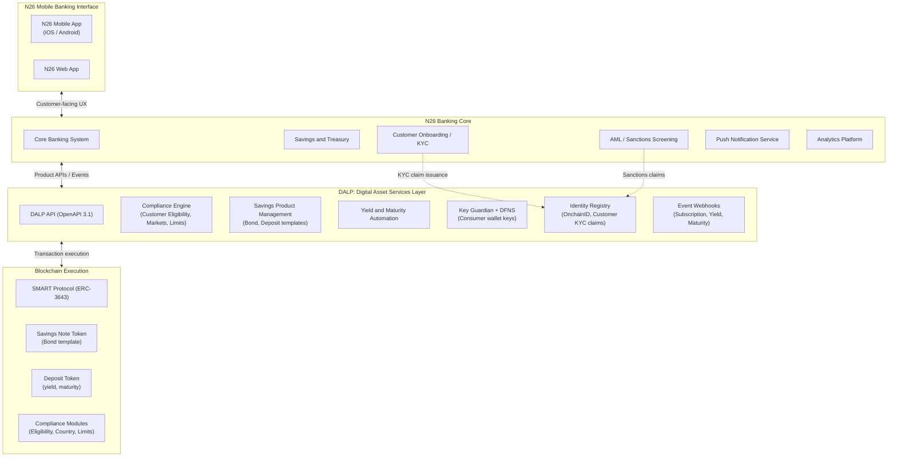
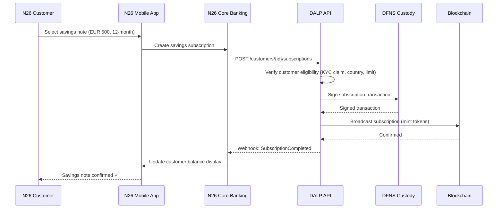
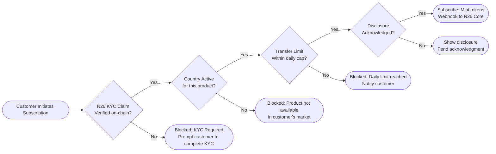
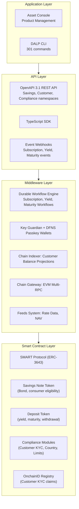
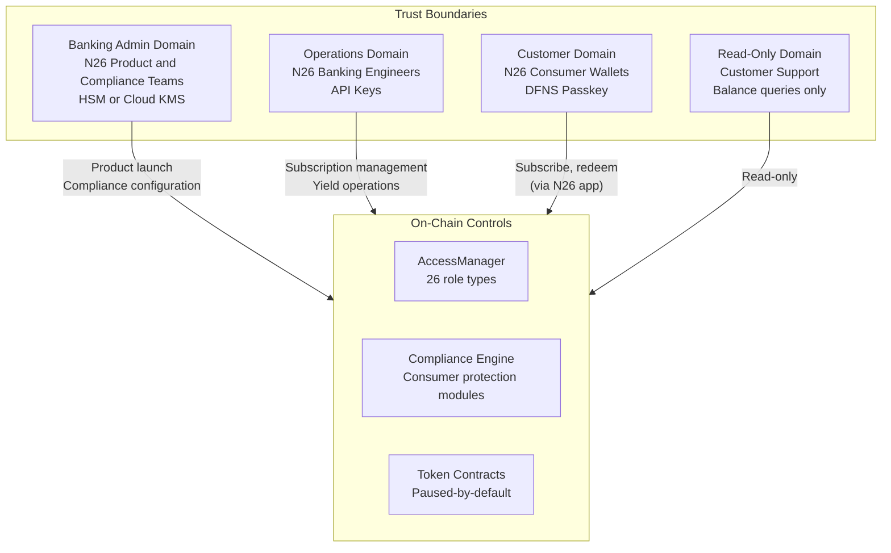
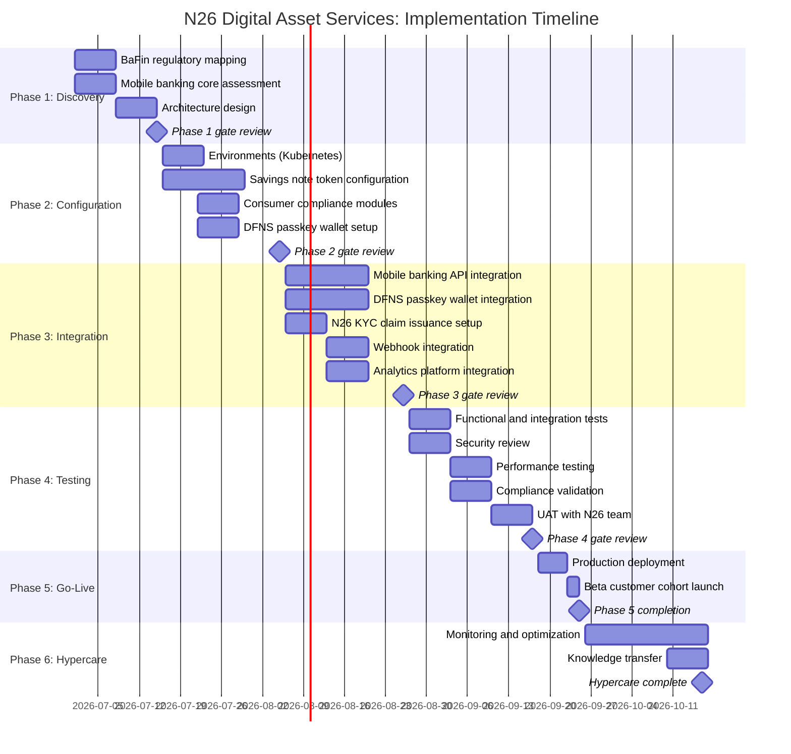
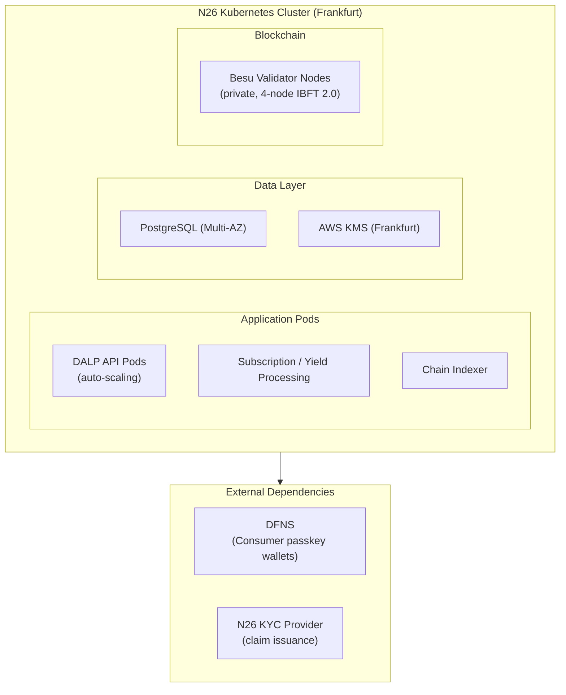

# Digital Asset Services Integration
## Technical Proposal for N26 Bank AG
### SettleMint | March 2026 | v1.0 | SettleMint Confidential

---

**Prepared by:** SettleMint NV
**Prepared for:** N26 Bank AG, Voltaireweg 1, 10179 Berlin, Germany
**Document reference:** SM-TECH-N26-2026-001
**Classification:** Strictly Confidential
**Version:** 1.0
**Date:** March 2026
**Contact:** bids@settlemint.com

---

## Table of Contents

1. Executive Summary
2. About SettleMint
3. About DALP
4. Customer References
5. Understanding of Requirements
6. Proposed Solution and Functional Capabilities
7. Technical Architecture
8. Security
9. Project Implementation and Delivery
10. Deployment
11. Training and Knowledge Transfer
12. Support and SLA
13. Risk Management
14. Compliance Matrix
15. Support Appendix

---

## Executive Summary

N26 serves over 8 million customers across 24 markets as a mobile-first bank built on lean engineering, fast product iteration, and embedded financial services. Digital asset services integration for N26 is not a capital markets programme; it is a consumer banking product decision. N26 customers who want to buy, hold, and sell crypto assets or tokenized savings products expect the same embedded, frictionless experience they receive for fiat banking features. The challenge is whether a digital asset platform vendor can deliver production-grade tokenized asset infrastructure that integrates into N26's cloud-native mobile banking core, satisfies BaFin and MiCA obligations, and enables N26's engineering team to ship and own the feature without permanent vendor dependency.

N26's approach to digital assets has historically been through partnerships, embedding third-party brokerage capabilities rather than building a proprietary tokenization stack. A production tokenized savings and digital asset services programme changes this model: N26 needs a platform that handles the custody, compliance, and lifecycle infrastructure so that N26's product engineers can build the consumer-facing experience on top of stable, documented APIs without rebuilding the underlying digital asset mechanics.

SettleMint proposes DALP, the Digital Asset Lifecycle Platform, as the infrastructure layer for N26's digital asset services integration. DALP provides tokenized savings note infrastructure, deposit token management, stablecoin capabilities, compliance enforcement, and the API-first operational tooling that N26's cloud-native engineering team expects. The platform connects to N26's existing mobile banking core, savings systems, customer onboarding, AML/sanctions, and cloud-native tooling through documented REST APIs and event webhooks.

### The Strategic Case for Digital Asset Services at N26

N26 customers in Germany and across the EEA increasingly expect digital asset access as part of their banking experience. Competitors including Revolut, Bitpanda, and dedicated crypto exchanges offer crypto buying and selling embedded in financial applications. N26's challenge is to offer competitive digital asset services without the regulatory and operational risk of building a full proprietary digital asset stack.

Tokenized savings products address a specific opportunity: N26 customers earn minimal interest on traditional savings balances in a rate environment where alternative products offer meaningful yields. Tokenized savings notes backed by institutional-grade assets, distributed through N26's mobile banking interface, create a new savings product category that N26 can offer without requiring a full capital markets infrastructure rebuild.

BaFin's growing framework for digital asset service providers, combined with MiCA's EEA harmonization, creates a clearer compliance path for a licensed German bank offering tokenized savings and digital asset services. DALP's ex-ante compliance enforcement and tamper-evident audit trail provide the evidence framework that BaFin supervision requires.

### Why DALP for N26

Lean integration: DALP's API-first architecture delivers all digital asset services through a single OpenAPI 3.1 interface. N26's backend engineers integrate once and access tokenized savings, deposit management, compliance enforcement, and custody operations through documented endpoints. No vendor-specific SDK lock-in; the TypeScript SDK is optional tooling, not a requirement.

Cloud-native deployment: DALP deploys on Kubernetes using Helm charts. N26's existing cloud-native infrastructure team can deploy, manage, and update DALP through the same GitOps patterns used for other N26 services. Infrastructure-as-code with Terraform modules for AWS, Azure, or GCP.

MiCA and BaFin compliance from day one: DALP's 18 compliance module types enforce investor and customer eligibility at the protocol level. Every transfer validates configured rules before execution, producing the evidence trail that BaFin and MiCA require. Consumer protection controls including disclosure acknowledgment tracking and transfer limits are configurable per product.

Modular integration: N26's digital asset services can launch with tokenized savings notes (Phase 1) and expand to crypto asset custody (Phase 2) and stablecoin payment features (Phase 3) using the same DALP instance. Each phase builds on the previous without requiring a new platform deployment.

### Three Reference Deployments Most Relevant to N26

Nordea deployed DALP for tokenized funds distribution under Nordic regulatory frameworks comparable to Germany's BaFin requirements. This reference demonstrates DALP's ability to deliver consumer-facing digital asset savings products under a Tier-1 European bank's compliance and engineering requirements.

Commerzbank deployed DALP for institutional digital asset infrastructure in Germany under BaFin supervision, demonstrating DALP's ability to satisfy German regulatory requirements and institutional security review processes.

ADI Finstreet deployed tokenized equity with DFNS custody integration and embedded mobile financial product features. This reference demonstrates DALP's ability to power embedded digital asset product experiences similar to what N26 seeks to deliver.

### Requirements Coverage Summary

| Requirement Domain | DALP Coverage | Evidence |
|---|---|---|
| Tokenized savings notes | Full | Bond/deposit template, yield automation |
| Customer wallet management | Full | Multi-wallet operations, mobile-friendly APIs |
| MiCA compliance enforcement | Full | 18 compliance modules, ex-ante enforcement |
| BaFin regulatory requirements | Full | KYC/AML integration, audit trail, reporting |
| DORA ICT resilience | Full | HA deployment, durable execution |
| Consumer protection controls | Full | Transfer limits, disclosure tracking, eligibility |
| API integration with mobile banking core | Full | OpenAPI 3.1, TypeScript SDK, webhooks |
| Customer onboarding integration | Full | OnchainID integration with KYC workflow |
| Custody integration (DFNS/Fireblocks) | Full | Unified signer abstraction |
| GDPR data handling | Full | EU data residency, deletion, retention |
| Phased product rollout | Full | Token pause, cohort controls, market activation |
| Observability and operations | Full | Three-pillar observability, alerting |

---

## About SettleMint

### Company Overview

SettleMint is the production-grade digital asset lifecycle management company for regulated financial markets and sovereign use cases. For N26's digital asset services programme, SettleMint brings cloud-native platform deployment expertise, ERC-3643 regulated token implementation, consumer-grade API design, and institutional custody integrations that regulated digital banking requires.

ISO 27001 and SOC 2 Type II certifications confirm independently audited security controls. Multi-year production deployments at regulated banks in Germany, the Netherlands, the UK, and across Europe demonstrate DALP's institutional credibility. The team combines over 200 years of banking and blockchain experience.

### German Regulatory Credentials

SettleMint's Commerzbank deployment demonstrates DALP's operation under BaFin supervision in the German regulatory context. DALP's compliance modules address MiCA obligations natively, including consumer eligibility verification, transfer restrictions, and governance controls. For N26's BaFin-supervised banking licence, DALP provides the compliance evidence framework that BaFin's digital asset guidance requires.

---

## About DALP

### Platform Overview

DALP is SettleMint's production-grade Digital Asset Lifecycle Platform. For N26's digital asset services programme, the most relevant capabilities are tokenized savings note infrastructure, deposit token management, consumer wallet operations, compliance enforcement for customer eligibility, and the cloud-native operational tooling that N26's engineering team expects.

DALP's API-first design means N26's mobile banking core, savings systems, and customer onboarding integrate through documented REST endpoints and event webhooks. The platform handles the digital asset infrastructure complexity; N26's product engineers build the consumer experience on top.

### DALP Lifecycle Pillars for Digital Asset Services

**Issuance:** Bond template for tokenized savings notes with maturity, yield schedule, denomination asset, and compliance modules. Deposit template for tokenized bank deposits with programmable interest and withdrawal rules. Paused-by-default creates compliance review gate before customer access.

**Compliance:** 18 compliance modules enforce customer eligibility before every transfer. Consumer protection modules include: Identity Verification (N26 KYC claim requirement for digital asset eligibility), Country Restriction (market activation per product), Transfer Limits (daily/transaction caps for retail consumers), Disclosure Acknowledgment (risk disclosure tracking), Transfer Approval (elevated controls for high-value consumer transactions).

**Custody:** DFNS threshold MPC recommended for N26's consumer-scale key management. Key Guardian as backup for operational flexibility. Consumer wallet keys managed through DFNS without exposing private keys to N26's operations team.

**Settlement:** DvP settlement for savings note subscription and redemption. Yield distribution automation for periodic interest payments. Atomic settlement ensures no partial completion for customer transactions.

**Servicing:** Yield schedule automation, maturity redemption, early withdrawal handling, and product lifecycle from launch through retirement.

---

## Customer References

### Reference Summary

| Institution | Use Case | Relevance to N26 |
|---|---|---|
| Nordea | Tokenized funds, Nordic retail banking | High: Nordic consumer bank, similar regulatory context |
| Commerzbank | German institutional, BaFin regulated | High: German BaFin supervision |
| ADI Finstreet | Tokenized equity, mobile embedding, DFNS | High: mobile embedded digital assets |
| BNP Paribas | Tokenized funds distribution, retail | High: consumer-facing fund distribution |
| KBC Securities | Retail brokerage, SME investment products | Medium: retail brokerage |
| Standard Chartered | Fractional tokenization, consumer distribution | Medium: consumer digital asset distribution |
| Barclays | Digital securities platform, UK consumer | Medium: UK consumer banking |
| ING Group | Tokenized trade finance, Dutch bank | Medium: European bank reference |
| Intesa Sanpaolo | Digital bonds, Italian consumer bank | Medium: European retail bank |
| Adyen | Payment infrastructure, stablecoin | Medium: stablecoin payment integration |
| OCBC | Security token engine, consumer API | Medium: consumer API integration |
| Emirates NBD | Deposit tokens, consumer access | Medium: deposit token operations |
| Chipper Cash | Consumer-facing digital asset app | Medium: mobile digital asset UX |
| HSBC | FX settlement, multi-currency | Low: institutional focus |

### Nordea Expanded Reference

Nordea deployed DALP for tokenized funds distribution in a Nordic consumer banking context under Finansinspektionen and MiCA-adjacent regulatory oversight. The Nordea reference demonstrates DALP's ability to deliver consumer-facing digital asset products at a Tier-1 retail bank with compliance controls, investor eligibility verification, and yield distribution automation operating under regulatory scrutiny comparable to N26's BaFin environment.

### Commerzbank Expanded Reference

Commerzbank deployed DALP in Germany under BaFin supervision for hybrid ETP issuance and management. The deployment demonstrated DALP's ability to satisfy German institutional security review, vendor risk assessment, and change control processes. EUR 7 million in annual operational savings identified during Phase 1. The Commerzbank reference confirms DALP's BaFin-ready compliance posture directly relevant to N26's supervisory context.

### ADI Finstreet Expanded Reference

ADI Finstreet deployed tokenized equity on the Abu Dhabi mainnet with DFNS custody integration, corporate action functionality, and an embedded mobile financial product experience. The ADI reference demonstrates DALP's ability to power mobile-embedded digital asset features using DFNS MPC custody, directly paralleling N26's requirements for embedded savings products with DFNS key management.

---

## Understanding of Requirements

### Business Requirements Analysis

**BR-01: Configurable product and account workflows aligned to internal approval processes**

DALP provides configurable savings product launch workflows through the Asset Designer. N26's product governance process maps to DALP's multi-role approval chain: Product Owner (configures parameters), Risk Approver (validates risk parameters), Compliance Officer (validates BaFin and MiCA alignment), Emergency (activates). Integration with N26's internal product release process through DALP's API events and maker-checker approval records.

**BR-02: Deterministic state transitions with reversal and exception handling**

Tokenized savings note lifecycle states: Configured, Under Compliance Review, Approved, Paused, Active, Subscription Open, Subscription Closed, Interest Accruing, Matured, Redeemed. Customer transaction states: Initiated, Compliance Checked, Signed, Broadcast, Confirmed, Failed, Dead Letter. Each state transition durable through the workflow execution engine. Failed customer transactions surface in the operations exception queue without data loss.

**BR-03: Entitlement and balance accuracy across customer, omnibus, treasury, and reporting views**

On-chain token balances are authoritative. Chain Indexer projects on-chain state to PostgreSQL read model in real time. N26's mobile banking core reads customer balances through the DALP REST API. Omnibus product accounts managed through multi-wallet operations. Reconciliation between DALP balances and N26's core banking system identifies discrepancies and alerts through the observability stack.

**BR-04: Role-based operations with segregation between maker, checker, approver, and support**

26 role types with on-chain enforcement. Key roles for N26's operations: Product Manager (configures savings products), Compliance Officer (eligibility modules), Supply Manager (subscription opening and closing), Customer Support (read-only customer balance queries), Emergency (product pause/unpause). N26's banking engineers receive API Key roles for mobile banking core integration.

**BR-05: Configurable limits, risk controls, and customer eligibility rules per market and segment**

Consumer protection compliance modules configurable per savings product: Customer Eligibility (N26 KYC completion requirement), Country Restriction (market activation: DE, AT, FR, ES, IT, NL, etc. per product), Transfer Limit (daily and transaction caps for retail consumer risk management), Disclosure Acknowledgment (MiCA consumer risk disclosure tracking), Investor Count (maximum customer subscriptions per product round). Different rule sets per savings product tier (basic savings, premium savings, structured savings).

**BR-06: Automated notifications, event emission, and downstream integration triggers**

Events for consumer banking integration: ProductLaunched, CustomerEnrolled, SubscriptionCompleted, InterestPaid, MaturityReached, TokenRedeemed, CompliancePassed, ComplianceFailed, CustomerEligibilityGranted, CustomerEligibilityRevoked. Webhooks deliver events to N26's mobile banking notification system, core banking ledger, and analytics platform. Customer-facing notifications triggered by settlement confirmations and yield payment events.

**BR-07: Business continuity for failed transactions, partial completion, and dependency outage**

Durable workflow engine persists all transaction state. If N26's banking core or DFNS is temporarily unavailable, workflows resume from last confirmed state after recovery. Customer subscription transactions do not partially complete; atomic execution ensures funds and tokens both confirm or both revert. Dead-letter queues for permanently failed transactions require customer support team decision.

**BR-08: Audit-ready reporting covering activity, balances, entitlements, fees, and operational actions**

BaFin consumer credit and digital asset reporting requirements addressed through: customer subscription and redemption audit log; yield distribution records with per-customer amounts; compliance eligibility decision log; role assignment history; product configuration change log; customer disclosure acknowledgment records. Export formats for regulatory reporting: JSON, CSV, structured database queries.

**BR-09: Phased rollout controls including feature flags, cohorting, and jurisdiction activation**

Market activation through country restriction module: German customers access savings notes before other markets are enabled. Cohort testing through OnchainID eligibility claims: a subset of N26 customers receive early access claims before the product opens to all. Product-level pause enables instant suspension if a savings product requires compliance review without affecting other products.

**BR-10: Support for adjacent services without duplicating control stacks**

Same DALP instance supporting tokenized savings notes extends to bank deposit tokens, stablecoin EUR payment capabilities, and potential crypto asset custody services using the same compliance engine and identity registry. N26 does not need a separate platform for each digital asset product category.

### Technical Requirements Analysis

**TR-01:** OpenAPI 3.1 REST API generated from procedure definitions. Consumer banking namespaces: savings notes, customer wallets, compliance, yield management. TypeScript SDK for N26's frontend and backend engineers. 534 structured error codes.

**TR-02:** Three environment tiers with N26-specific test data seeding: pre-created test customer wallets, pre-issued test savings note products, pre-configured compliance modules for end-to-end testing without production data.

**TR-03:** Consumer banking event webhooks with at-least-once delivery, retry, and dead-letter handling. Events signed with HMAC-SHA256 for authenticity. Replay from any historical point for integration debugging.

**TR-04:** OAuth 2.0/OIDC integration with N26's identity provider. SAML 2.0 for enterprise SSO. API keys for mobile banking backend service accounts. Customer-facing wallets use DFNS passkey authentication without exposing blockchain complexity to consumers.

**TR-05:** Private Cloud on AWS or GCP in EU region (Frankfurt preferred for BaFin data residency). Helm charts for Kubernetes deployment matching N26's cloud-native infrastructure patterns. GitOps-compatible with N26's existing CI/CD tooling.

**TR-07:** Consumer-grade performance: API accepts customer subscription requests with sub-100ms response. Blockchain execution proceeds asynchronously; customer confirmation delivered through webhook within 5 seconds of on-chain finality. Batch processing for product-level operations (yield distribution for 50,000+ customer positions) uses background workers separate from real-time customer transaction processing.

**TR-11:** Helm charts, Terraform modules, ArgoCD/Flux GitOps support. DALP configuration stored in version control alongside N26's existing infrastructure-as-code. Environment promotion from staging to production through N26's standard change control process.

---

## Proposed Solution and Functional Capabilities

### Solution Architecture for N26

DALP positions as the digital asset services layer between N26's mobile banking core and the blockchain execution layer.

### Tokenized Savings Notes for N26 Customers

DALP's bond template deploys N26's tokenized savings note products with consumer-appropriate parameters:

Fixed-term savings note: EUR-denominated, 12-month maturity, 3.8% annual yield, minimum subscription EUR 100, maximum subscription EUR 25,000 per customer per product round.

Premium savings note: EUR-denominated, 24-month maturity, 4.5% annual yield, minimum subscription EUR 1,000, maximum subscription EUR 100,000, qualified investor eligibility required.

Consumer wallet experience: customers subscribe to savings notes through N26's mobile app. The subscription call triggers DALP to mint savings note tokens to the customer's DFNS-managed wallet. Customers see their savings note balance in the N26 app through the DALP balance API. At maturity, tokens burn and principal plus accrued interest returns to the customer's N26 balance.

### Consumer Wallet Management via DFNS

N26's consumer wallet management uses DFNS passkey-based authentication to provide a streamlined key management experience:

Customer wallet creation: on KYC completion, N26's onboarding system calls DALP to create a DFNS passkey wallet for the customer. The wallet is created without exposing private key concepts to the customer or N26's operations team.

Transaction authorization: DFNS's passkey authentication means customer transactions use biometric authentication (Face ID, Touch ID) through N26's mobile app. Customers experience familiar mobile authentication, not blockchain key management.

Wallet recovery: DFNS provides wallet recovery mechanisms through N26's customer identity verification, aligned with consumer banking recovery expectations.

Operations visibility: N26's customer support team uses DALP's read-only customer wallet API to answer balance and transaction history queries without requiring blockchain expertise.

### Customer Compliance and Eligibility

### Yield Distribution to Customers

Quarterly interest distribution to N26 savings note holders:

1. Yield schedule contract triggers on distribution date.
2. Holder snapshot captures all customer wallet balances at distribution block.
3. Pro-rata interest allocated by balance proportion.
4. Distribution executes atomically; all customers receive interest in single block.
5. Webhook event to N26's core banking system: each customer's interest amount posted to their N26 balance.
6. Push notification triggered for each customer confirming interest received.

### Adjacent Product Expansion Path

Phase 1: tokenized savings notes and deposit products (this scope). Phase 2: stablecoin EUR payment capabilities for N26 customers (N26 Pay Digital). Phase 3: crypto asset custody services leveraging the same DFNS infrastructure and compliance framework. Each phase uses the same DALP instance, same compliance engine, and same identity registry, with no platform re-architecture required.

---

## Technical Architecture

### Four-Layer Architecture

### Integration with N26's Cloud-Native Stack

DALP integrates with N26's cloud-native engineering environment through documented interfaces:

**Mobile banking core integration:** DALP REST API integrated as a microservice within N26's API gateway. Standard REST semantics matching N26's existing API patterns. JWT authentication from N26's identity provider. Response format consistent with N26's API design standards.

**Event streaming:** DALP webhooks deliver digital asset lifecycle events to N26's Kafka event bus (if applicable) or directly to N26's core banking webhook handler. Event schema versioning ensures backward compatibility.

**Data platform integration:** DALP's PostgreSQL direct access or REST export API feeds N26's analytics platform with savings product performance data, customer subscription metrics, and yield distribution records.

**Infrastructure alignment:** Kubernetes deployment via Helm charts compatible with N26's existing cluster management. Prometheus-compatible metrics scraped by N26's observability stack. Log shipping to N26's log aggregation system via standard JSON output.

### Security Architecture

---

## Security

### Security Architecture

**Consumer data privacy (GDPR):** N26 customer personal data stored entirely within N26's systems. DALP stores only hashed customer references and on-chain eligibility claims. No customer name, address, or financial data in DALP's database. Deletion of customer digital asset data: hashed references can be deleted from DALP's off-chain systems; on-chain claims are pseudonymous and cannot be linked to individuals without N26's identity mapping.

**Key management for consumer wallets:** DFNS threshold MPC distributes consumer wallet key shards across DFNS's infrastructure with no single point of key exposure. Customer authentication through DFNS passkeys. N26 cannot access individual customer keys. Key recovery through N26's identity verification process.

**BaFin and MiCA compliance evidence:** every compliance module decision, product configuration change, and customer eligibility action generates a structured record in DALP's tamper-evident audit log. BaFin examination access provided through read-only audit export API without requiring access to DALP's administrative functions.

**DORA ICT resilience:** HA deployment in EU region with multi-AZ Kubernetes cluster and PostgreSQL Multi-AZ. Third-party dependencies (DFNS, RPC providers, cloud infrastructure) documented with failover procedures. Quarterly resilience testing and disaster recovery drills. Annual penetration test with remediation governance.

---

## Project Implementation and Delivery

### Implementation Programme

N26's digital asset services integration follows a six-phase delivery model over 14 to 18 weeks, aligned with N26's fast product shipping culture.

### Responsibility Matrix

| Activity | SettleMint | N26 | Shared |
|---|---|---|---|
| Architecture design | Lead | Review | |
| Platform configuration | Lead | | |
| Mobile banking API integration | Support | Lead | |
| DFNS passkey integration | Lead | Support | |
| N26 KYC claim integration | Support | Lead | |
| Security review | Support | Lead | |
| BaFin evidence package | Support | Lead | |
| Consumer UAT | Support | Lead | |
| Beta cohort launch | | Lead | |
| Day-two operations | Support | Lead | |

---

## Deployment

### Recommended: Private Cloud (EU Region, Kubernetes)

Production on N26's Kubernetes infrastructure in EU region (Frankfurt) using DALP Helm charts, compatible with N26's existing GitOps workflows.

---

## Training and Knowledge Transfer

**Product Engineers:** DALP API reference, TypeScript SDK, savings product configuration, webhook integration patterns. Duration: 1 day workshop with code review.

**Platform Administrators:** Asset Designer, compliance module management, consumer eligibility configuration, product lifecycle management. Duration: 1 day instructor-led.

**Operations and Customer Support:** Grafana dashboards for product and customer monitoring, exception queue management, customer subscription status queries, yield distribution confirmation. Duration: half day.

**Compliance and BaFin Reporting:** Audit log navigation, customer eligibility evidence export, product configuration history, BaFin evidence package generation. Duration: half day.

---

## Support and SLA

### Recommended: Enterprise Support

| Attribute | Enterprise Support |
|---|---|
| Annual Fee | EUR 120,000 |
| Coverage | 24/7/365 |
| Uptime SLA | 99.99% monthly |
| P1 Response | 15 minutes |
| P1 Resolution Target | 2 hours |
| Dedicated Support Team | Named team |
| Customer Success Manager | Named CSM |

Consumer-facing digital asset services require Enterprise support. A subscription failure or yield distribution error affecting N26 customers requires immediate response, not a 4-hour business-hours SLA.

---

## Risk Management

### Risk Register

| Risk | Likelihood | Impact | Mitigation |
|---|---|---|---|
| BaFin digital asset product approval timeline | Medium | High | Phase 1 regulatory mapping produces BaFin evidence package; Phase 4 compliance validation |
| DFNS passkey integration complexity for mobile | Medium | Medium | DFNS provides mobile SDK for iOS/Android; Phase 2 proof-of-concept before full integration |
| N26 mobile API integration timeline | Low | Medium | N26 engineering team leads mobile integration; DALP API documented with examples |
| Consumer data GDPR compliance | Low | Low | DALP stores only hashed customer references; personal data remains in N26's systems |
| KYC claim integration | Low | Medium | OnchainID supports any OpenID Connect-compatible claim issuer |
| Product launch beta cohort controls | Low | Low | Token pause/unpause and eligibility claim controls provide instant product activation/suspension |

### Constraints Register

| Constraint | Description | Mitigation |
|---|---|---|
| C-01 | EVM-compatible networks only | Private Besu or public EVM |
| C-02 | DFNS passkey requires mobile SDK integration | DFNS provides iOS/Android SDKs; N26 integrates into existing mobile app |
| C-03 | Batch yield distribution: all customers in single transaction | Scales well up to 50,000+ holders; larger populations may require chunked distribution |
| C-04 | On-chain claim deletion: pseudonymous claims not fully deletable | DALP stores hashed references off-chain; on-chain claims pseudonymous without identity mapping |
| C-05 | Yield schedule requires denomination asset on same chain | EUR deposit token deployed as denomination asset |

---

## Compliance Matrix

### BaFin and MiCA Compliance

| Requirement | Coverage | DALP Mechanism |
|---|---|---|
| MiCA consumer eligibility (Art. 72) | Supported | Identity verification, country restriction modules |
| Consumer protection disclosures | Supported | Disclosure acknowledgment compliance module |
| Transfer limits (consumer protection) | Supported | Transfer limit compliance module |
| Governance controls | Supported | Four-eyes approval, on-chain role enforcement |
| BaFin audit trail | Supported | Tamper-evident event log, export APIs |
| AML/CFT screening | Supported with partner | OnchainID claim integration with N26's AML system |
| DORA ICT resilience | Supported | HA deployment, third-party risk documentation |
| GDPR (consumer data) | Supported | Off-chain personal data; hashed references only on-chain |

---

## Support Appendix

### Severity Classification

| Severity | Definition |
|---|---|
| P1 | Complete service unavailability affecting consumer subscriptions or balance display |
| P2 | Partial degradation: specific product unavailable; yield distribution delayed |
| P3 | Non-urgent: dashboard issue; non-critical feature malfunction |
| P4 | Query or feature request |

---

## Appendix A: Requirements Coverage Matrix

| Req ID | Status | DALP Mechanism |
|---|---|---|
| BR-01 | Supported | Multi-role product launch workflow |
| BR-02 | Supported | Consumer transaction state machine, durable workflow execution |
| BR-03 | Supported | On-chain authoritative, Chain Indexer projection |
| BR-04 | Supported | 26 role types, AccessManager |
| BR-05 | Supported | Consumer protection compliance modules |
| BR-06 | Supported | Consumer banking event catalog, webhooks |
| BR-07 | Supported | Durable workflows, dead-letter queues |
| BR-08 | Supported | Audit log, BaFin export APIs |
| BR-09 | Supported | Token pause, country modules, eligibility claims |
| BR-10 | Supported | Multi-product platform, single control plane |
| TR-01 | Supported | OpenAPI 3.1, TypeScript SDK, versioning |
| TR-02 | Supported | Three environments, seeded consumer test data |
| TR-03 | Supported | Consumer banking webhooks, retry, dead-letter |
| TR-04 | Supported | OAuth 2.0/OIDC, SAML 2.0, DFNS passkey |
| TR-05 | Supported | N26 Kubernetes, Helm charts, GitOps |
| TR-06 | Supported | Three-pillar observability, Grafana dashboards |
| TR-07 | Supported | Auto-scaling, background distribution processing |
| TR-08 | Supported | REST export, webhook stream, PostgreSQL direct |
| TR-09 | Supported | Staged releases, rollback, advance notice |
| TR-10 | Supported | Constraints register, rate limits documented |
| TR-11 | Supported | Helm charts, Terraform, GitOps patterns |
| TR-12 | Supported | Status page, escalation path, P1 SLA |

---

*Document Classification: SettleMint Confidential*
*SettleMint NV | Simon Bolivarlaan 5, 2600 Antwerp, Belgium | www.settlemint.com*
