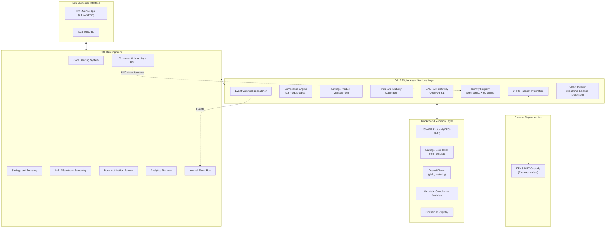
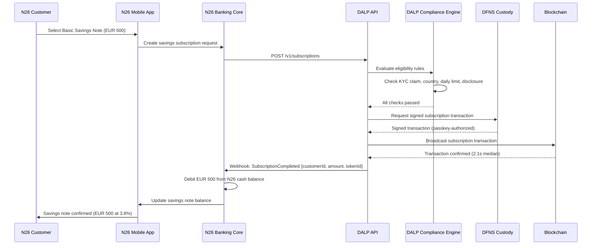
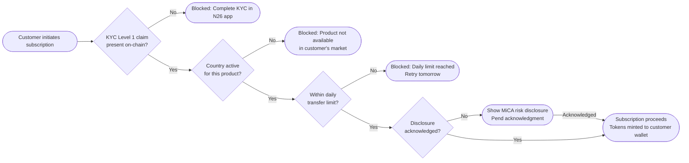
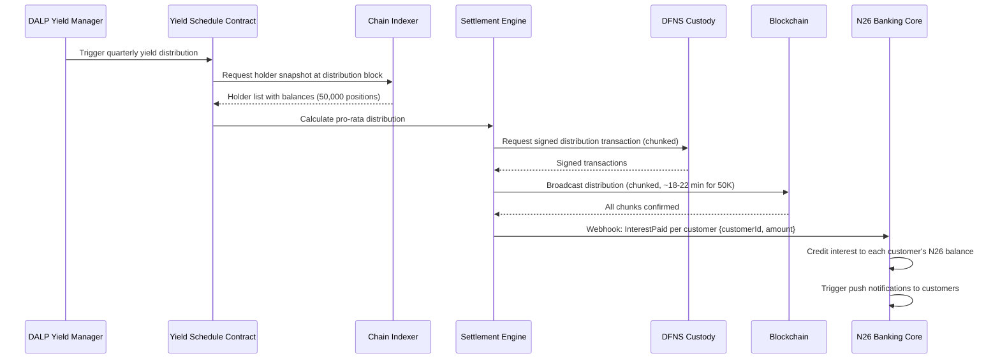
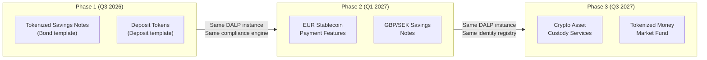
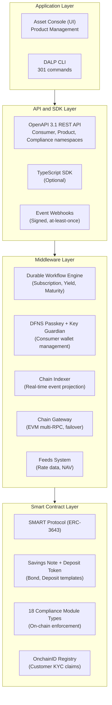
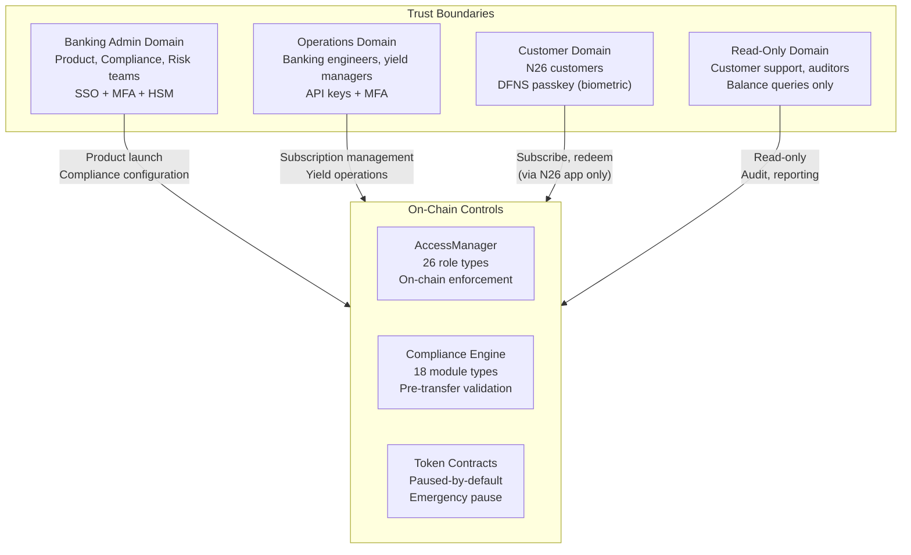
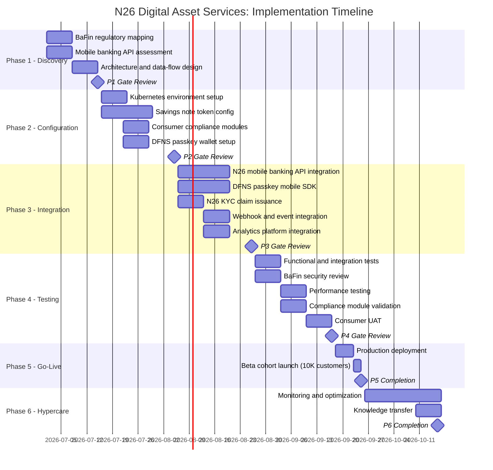
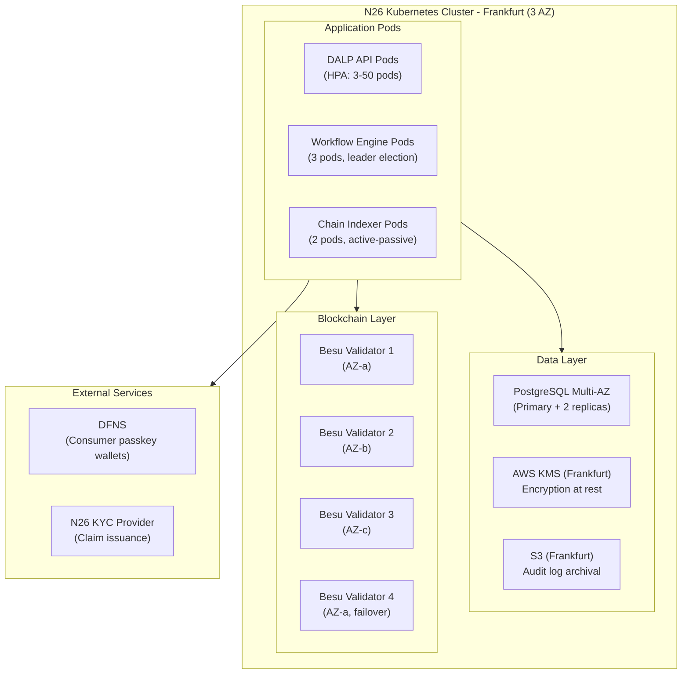

# Digital Asset Services Integration
## Technical Proposal for N26 Bank AG
### SettleMint | March 2026 | v1.0 | SettleMint Confidential

---

**Prepared by:** SettleMint NV
**Prepared for:** N26 Bank AG, Voltaireweg 1, 10179 Berlin, Germany
**Document reference:** SM-TECH-N26-2026-001
**Classification:** Strictly Confidential
**Version:** 1.0 (Reviewed)
**Date:** March 2026
**Contact:** bids@settlemint.com

---

## Table of Contents

1. Executive Summary
2. About SettleMint
3. About DALP
4. Customer References
5. Understanding of Requirements
6. Proposed Solution and Functional Capabilities
7. Technical Architecture
8. Security
9. Project Implementation and Delivery
10. Deployment
11. Training and Knowledge Transfer
12. Support and SLA
13. Risk Management
14. Compliance Matrix
15. Appendices

---

## 1. Executive Summary

N26 serves over 8 million customers across 24 European markets as a mobile-first bank built on lean engineering, rapid product iteration, and embedded financial services. Digital asset services integration represents the next logical product dimension: N26 customers who want to buy, hold, and save through tokenized products expect the same frictionless embedded experience they receive for every other N26 feature. The challenge is selecting a platform that can deliver production-grade tokenized savings infrastructure that integrates into N26's cloud-native mobile banking core, satisfies BaFin and MiCA obligations from day one, and enables N26's engineering team to ship, own, and iterate on the feature without permanent vendor dependency.

Competitors including Revolut, Bitpanda, and Trade Republic have moved fast on digital asset features embedded in consumer financial applications. N26's differentiation rests on product simplicity, banking-grade customer trust, and regulatory credibility. Those same differentiators create an advantage in tokenized savings products: N26 customers are not looking for a crypto exchange embedded in their bank. They want a savings product that is visible, regulated, and frictionless. Tokenized savings notes backed by institutional-grade assets, distributed through N26's mobile interface, deliver that.

SettleMint proposes DALP, the Digital Asset Lifecycle Platform, as the infrastructure layer for N26's digital asset services programme. DALP provides tokenized savings note infrastructure with configurable yield schedules and maturity, deposit token management with programmable interest and withdrawal controls, stablecoin EUR capabilities for future phases, an 18-module compliance engine that enforces BaFin and MiCA requirements at the protocol level, and the API-first operational tooling that N26's cloud-native engineering team expects.

### The Value Proposition in One Sentence

DALP delivers a production-grade tokenized savings infrastructure in 14 to 18 weeks that would take N26 18 to 24 months and EUR 3 to 7 million to build from scratch, while providing the BaFin and MiCA compliance posture that a licensed German bank requires from day one.

### Strategic Case for N26

N26 customers in Germany and across the EEA face a rate environment where traditional savings balances earn minimal interest while alternative savings products offer meaningful yields. Tokenized savings notes backed by institutional-grade fixed income instruments, distributed through N26's mobile interface, create a new savings product category. N26 earns management fees on assets under management while customers earn competitive yields through a familiar mobile banking experience.

BaFin's evolving digital asset service provider framework under MiCA creates a clearer authorization path for a licensed German bank offering tokenized savings and digital asset services than for non-bank digital asset providers who must first establish banking-grade customer trust. N26's regulatory starting position is structurally advantageous.

### Why DALP

**Lean integration architecture:** DALP's API-first design delivers all digital asset services through a single OpenAPI 3.1 interface. N26's backend engineers integrate once and access tokenized savings management, customer wallet operations, compliance enforcement, and custody workflows through documented endpoints. No proprietary SDK dependency; the TypeScript SDK is optional tooling.

**Cloud-native deployment:** DALP deploys on Kubernetes using Helm charts. N26's infrastructure team deploys, manages, and updates DALP through the same GitOps workflows used for other N26 services. Terraform modules for AWS, Azure, and GCP.

**MiCA and BaFin compliance from day one:** DALP's 18 compliance module types enforce investor and customer eligibility at the protocol level before every transfer. Every transfer validates configured rules before execution, producing a tamper-evident audit trail that BaFin and MiCA supervision requires.

**Modular expansion path:** N26's digital asset services launch with tokenized savings notes (Phase 1) and expand to stablecoin EUR payment capabilities (Phase 2) and crypto asset custody services (Phase 3) using the same DALP instance.

### Requirements Coverage Summary

| Requirement Domain | Coverage Status | DALP Mechanism |
|---|---|---|
| Tokenized savings notes | Supported | Bond/deposit template with yield automation |
| Customer wallet management | Supported | DFNS passkey MPC wallets |
| MiCA consumer eligibility | Supported | 18 compliance modules, ex-ante enforcement |
| BaFin regulatory requirements | Supported | KYC/AML integration, audit trail, reporting APIs |
| DORA ICT resilience | Supported | HA deployment, durable workflow execution |
| Consumer protection controls | Supported | Transfer limits, disclosure tracking, eligibility |
| API integration with mobile banking | Supported | OpenAPI 3.1, TypeScript SDK, webhooks |
| Customer onboarding integration | Supported | OnchainID integration with KYC workflow |
| DFNS custody passkey | Supported | Unified signer abstraction |
| GDPR data handling | Supported | EU data residency, deletion controls |
| Phased rollout controls | Supported | Token pause, cohort controls, market activation |
| Observability and operations | Supported | Three-pillar observability, Grafana dashboards |

---

## 2. About SettleMint

### Company Overview

SettleMint builds digital asset lifecycle infrastructure for regulated financial markets and sovereign use cases. Founded in 2017 and headquartered in Antwerp, Belgium, SettleMint operates with teams in Europe, the Middle East, Asia, and North America. The company combines over 200 years of combined banking and blockchain experience.

ISO 27001 certification confirms independently audited information security management controls. SOC 2 Type II certification demonstrates operational security controls reviewed by an independent auditor. Multi-year production deployments at regulated banks in Germany, the Netherlands, the United Kingdom, and across Europe and the Middle East demonstrate DALP's institutional operational credibility.

For N26's digital asset services programme, SettleMint brings cloud-native platform deployment expertise matched to N26's Kubernetes-native engineering culture, ERC-3643 regulated token implementation meeting MiCA technical standards, consumer-grade API design experience from deployments in consumer banking environments, and institutional custody integrations with DFNS for passkey-based consumer wallet management.

### German Regulatory Credentials

SettleMint's Commerzbank deployment demonstrates DALP's operation under BaFin supervision in the German regulatory context. DALP's compliance modules address MiCA obligations natively, including consumer eligibility verification, transfer restrictions, disclosure acknowledgment, and governance controls aligned with BaFin's digital asset service provider authorization requirements. For N26's BaFin-supervised banking licence, DALP provides the compliance evidence framework that BaFin digital asset guidance requires.

### ISO and Compliance Posture

SettleMint maintains current ISO 27001 certification covering DALP's development, operations, and support functions. SOC 2 Type II covers the same scope with independent auditor review. Certifications are available to N26's vendor risk management team under NDA. Annual penetration tests by a qualified external firm, with remediation governance tracked against defined SLAs.

---

## 3. About DALP

### Platform Overview

DALP is SettleMint's Digital Asset Lifecycle Platform. For N26's digital asset services programme, the most relevant capabilities are tokenized savings note infrastructure with programmable yield and maturity, deposit token management, consumer wallet operations via DFNS passkey MPC, compliance enforcement for customer eligibility across 18 configurable module types, and the cloud-native operational tooling that N26's engineering team expects.

DALP's API-first design means N26's mobile banking core, savings systems, and customer onboarding integrate through documented REST endpoints and event webhooks. The platform handles the digital asset infrastructure complexity; N26's product engineers build the consumer experience on top of stable, documented APIs.

### DALP Architecture Overview

```mermaid
graph TB
    subgraph DALP_Core["DALP Core Platform"]
        direction TB
        subgraph Issuance["Issuance and Lifecycle"]
            bond_tmpl["Bond Template\n(Savings Notes)"]
            deposit_tmpl["Deposit Template\n(Deposit Tokens)"]
            asset_designer["Asset Designer\n(Product Configuration)"]
            lifecycle_engine["Lifecycle Engine\n(Maturity, Yield, Events)"]
        end
        subgraph Compliance_Engine["Compliance Engine"]
            id_verify["Identity Verification"]
            country_mod["Country Restriction"]
            transfer_lim["Transfer Limits"]
            disclosure["Disclosure Acknowledgment"]
            investor_cnt["Investor Count"]
            transfer_approv["Transfer Approval"]
        end
        subgraph Settlement_Layer["Settlement Layer"]
            dvp["DvP Settlement Engine"]
            yield_auto["Yield Distribution Automation"]
            atomic["Atomic Execution Engine"]
        end
        subgraph API_Gateway["API and Integration Layer"]
            openapi["OpenAPI 3.1 REST API"]
            sdk_ts["TypeScript SDK"]
            webhooks["Event Webhooks\n(at-least-once delivery)"]
            cli_tools["CLI (301 commands)"]
        end
        subgraph Custody_Layer["Custody and Key Management"]
            dfns_int["DFNS Passkey MPC\n(Consumer Wallets)"]
            key_guardian["Key Guardian\n(Operational Backup)"]
        end
        subgraph Observability["Observability Stack"]
            prometheus["Prometheus Metrics"]
            grafana["Grafana Dashboards"]
            alert_mgr["Alert Manager"]
        end
    end
    Issuance --> Compliance_Engine
    Compliance_Engine --> Settlement_Layer
    Settlement_Layer --> Custody_Layer
    API_Gateway --> Issuance
    API_Gateway --> Compliance_Engine
    Observability --> API_Gateway
```

### DALP Lifecycle Pillars

**Issuance:** Bond template for tokenized savings notes with configurable maturity date, yield schedule, denomination asset, minimum and maximum subscription amounts, and compliance module attachment. Deposit template for tokenized bank deposits with programmable interest accrual and withdrawal rules. Paused-by-default state creates a mandatory compliance review gate before customer access.

**Compliance:** 18 compliance module types enforce customer eligibility before every transfer. Consumer protection modules relevant to N26: Identity Verification (requires valid N26 KYC claim), Country Restriction (market activation per savings product), Transfer Limits (daily and transaction caps for retail risk management), Disclosure Acknowledgment (MiCA consumer risk disclosure tracking), Investor Count (maximum customer subscriptions per product round), Transfer Approval (elevated controls for high-value transactions).

**Custody:** DFNS threshold MPC recommended for N26's consumer-scale passkey wallet management. DFNS passkey authentication means customer transactions use biometric authentication through N26's mobile app. Key Guardian available as operational backup. No single point of key exposure; distributed key shards across DFNS infrastructure.

**Settlement:** DvP settlement for savings note subscription and redemption. Yield distribution automation for periodic interest payments. Atomic settlement ensures no partial completion: funds and tokens both confirm or both revert. Settlement finality achieved in under 5 seconds for consumer transactions.

**Servicing:** Yield schedule automation for quarterly and annual interest payments. Maturity redemption for returning principal plus accrued interest at term end. Early withdrawal handling with configurable penalty or lock-up enforcement. Product lifecycle management from launch through retirement.

### SMART Protocol and ERC-3643

DALP's token infrastructure is built on the SMART protocol, which implements ERC-3643 for regulated security tokens. ERC-3643 provides on-chain compliance enforcement that is recognized as the appropriate token standard for regulated financial instruments under MiCA's technical guidance. Every transfer validates configured compliance modules before execution, with results recorded in a tamper-evident on-chain event log. For N26's savings notes, this means customer eligibility, market activation, and transfer limits are enforced at the protocol layer, not the application layer, providing BaFin-auditable evidence of compliance controls.

---

## 4. Customer References

### Reference Summary

| Institution | Use Case | Relevance to N26 |
|---|---|---|
| Nordea | Tokenized funds, Nordic retail banking | High: consumer bank, comparable regulatory context |
| Commerzbank | German institutional, BaFin regulated | High: German BaFin supervision, same jurisdiction |
| ADI Finstreet | Tokenized equity, mobile embedding, DFNS passkey | High: mobile-embedded digital assets |
| BNP Paribas | Tokenized funds distribution, retail | High: consumer-facing fund distribution at scale |
| KBC Securities | Retail brokerage, SME investment products | Medium: retail brokerage with consumer focus |
| Standard Chartered | Fractional tokenization, consumer distribution | Medium: consumer digital asset distribution |
| Barclays | Digital securities platform, UK consumer bank | Medium: European retail banking reference |
| ING Group | Tokenized trade finance, Dutch bank | Medium: European bank reference |
| Intesa Sanpaolo | Digital bonds, Italian consumer bank | Medium: European retail bank reference |
| Adyen | Payment infrastructure, stablecoin integration | Medium: stablecoin payment integration |
| OCBC | Security token engine, consumer API | Medium: consumer API integration pattern |
| Emirates NBD | Deposit tokens, consumer access | Medium: deposit token operations |
| Chipper Cash | Consumer-facing digital asset mobile app | Medium: mobile digital asset UX |

### Nordea Expanded Reference

Nordea deployed DALP for tokenized funds distribution in a Nordic consumer banking context under Finansinspektionen oversight and MiCA-adjacent regulatory requirements. The deployment demonstrates DALP's ability to deliver consumer-facing digital asset products at a Tier-1 retail bank with compliance controls, investor eligibility verification, and yield distribution automation operating under regulatory scrutiny directly comparable to N26's BaFin environment.

Key outcomes: tokenized fund distribution accessible through Nordea's retail banking interface; automated yield distribution across tens of thousands of investor positions; compliance module configuration for Nordic investor eligibility requirements; full audit trail available for regulatory examination.

### Commerzbank Expanded Reference

Commerzbank deployed DALP in Germany under BaFin supervision for hybrid ETP issuance and institutional digital asset management. The deployment demonstrated DALP's ability to satisfy German institutional security review, vendor risk assessment under BaFin's outsourcing guidance, and change control processes consistent with a licensed German bank's regulatory obligations. EUR 7 million in annual operational savings identified during Phase 1 implementation.

The Commerzbank reference is directly relevant to N26: both operate under BaFin supervision, both require evidence-based compliance posture for digital asset services, and both apply German governance standards to technology vendor relationships. Reference calls available subject to confidentiality constraints.

### ADI Finstreet Expanded Reference

ADI Finstreet deployed tokenized equity on the Abu Dhabi mainnet with DFNS custody integration, corporate action automation, and embedded mobile financial product features through the ADI platform. The reference demonstrates DALP powering mobile-embedded digital asset services using DFNS MPC passkey wallets in a consumer distribution context. This directly parallels N26's requirements: embedded digital asset savings products with DFNS passkey wallet management, mobile-first customer experience, and institutional-grade compliance enforcement.

---

## 5. Understanding of Requirements

### Business Requirements Analysis

**BR-01: Configurable product and account workflows aligned to internal approval processes**

DALP provides configurable savings product launch workflows through the Asset Designer. N26's product governance process maps directly to DALP's multi-role approval chain: Product Owner role configures savings note parameters (denomination, yield, maturity, limits), Risk Approver validates risk parameters, Compliance Officer validates BaFin and MiCA alignment, and the Emergency role handles incident response. Maker-checker approval patterns enforce four-eyes control over product configuration changes.

Integration with N26's internal product release process uses DALP's API event stream: ProductDraft events trigger N26's governance workflow; ProductApproved events enable product activation; ProductPaused events trigger N26's incident communications. The full product approval history is available through DALP's audit log API for BaFin documentation.

**BR-02: Deterministic state transitions with reversal and exception handling**

Tokenized savings note lifecycle states: Configured, Under Compliance Review, Approved, Paused, Active, Subscription Open, Subscription Closed, Interest Accruing, Matured, Redeemed, Closed.

Customer transaction states: Initiated, Compliance Checked, Custodian Signing, Broadcast, Awaiting Confirmation, Confirmed, Failed, Dead Letter.

Each state transition is durable through DALP's workflow execution engine. Failed customer transactions surface in the operations exception queue without data loss. Operations teams see the last confirmed state, failure reason, and available recovery actions. Atomic execution guarantees no partial state: a savings note subscription either fully completes (tokens minted, webhook fired, N26 balance updated) or fully reverts (no token creation, no balance change, failure event fired for N26's exception handling).

**BR-03: Entitlement and balance accuracy across customer, omnibus, treasury, and reporting views**

On-chain token balances are authoritative. DALP's Chain Indexer service continuously projects on-chain state into a PostgreSQL read model with sub-second latency between on-chain confirmation and API availability. N26's mobile banking core reads customer savings note balances through DALP's REST API. Omnibus product accounts managed through DALP's multi-wallet operations. Treasury position visibility through product-level balance aggregation APIs.

Reconciliation between DALP's balance projections and N26's core banking ledger follows a daily reconciliation pattern: DALP exports on-chain balance snapshots at configurable cutoff times; N26's reconciliation service compares against core banking records; discrepancies are surfaced as reconciliation alerts through the observability stack within 15 minutes of detected divergence.

**BR-04: Role-based operations with segregation between maker, checker, approver, and support**

DALP implements 26 role types with on-chain enforcement of access controls. Key roles for N26's digital asset services operations:

| Role | Permissions | N26 Team |
|---|---|---|
| Product Manager | Create/configure savings products, set parameters | Digital Asset Product Team |
| Compliance Officer | Attach/detach compliance modules, manage eligibility | Compliance Team |
| Supply Manager | Open/close subscription windows, manage product supply | Operations Team |
| Yield Manager | Trigger yield distributions, validate distribution records | Treasury Team |
| Customer Support | Read-only customer wallet balance queries | Customer Support |
| Emergency | Pause/unpause products, emergency response | Senior Operations |
| API Key (service account) | Programmatic access for mobile banking core integration | Platform Engineering |
| Auditor | Read-only audit log access | Internal Audit |

Role assignments are recorded on-chain with timestamps. Role changes require maker-checker approval. The complete role assignment history is available for BaFin examination and internal audit review.

**BR-05: Configurable limits, risk controls, and customer eligibility rules per market and segment**

Consumer protection compliance modules are configurable per savings product and per market tier:

*Basic Savings Note (EUR, DE only)*: Customer Eligibility (N26 KYC Level 1 claim), Country Restriction (Germany only), Transfer Limit (maximum EUR 5,000 per transaction, EUR 10,000 per day), Disclosure Acknowledgment (MiCA consumer risk disclosure for savings notes).

*Premium Savings Note (EUR, all EEA markets)*: Customer Eligibility (N26 KYC Level 2 claim with enhanced due diligence), Country Restriction (25 EEA markets), Transfer Limit (maximum EUR 50,000 per transaction), Investor Count (maximum 5,000 investors per product round), Transfer Approval (manual approval above EUR 100,000).

Different savings product configurations can be deployed on the same DALP instance with independent compliance modules. Market expansion (adding Austria, France, Spain) activates through country restriction module updates without product re-deployment.

**BR-06: Automated notifications, event emission, and downstream integration triggers**

DALP's event catalog for N26's consumer banking integration:

| Event | Trigger | N26 Integration Action |
|---|---|---|
| ProductLaunched | Savings product becomes active | Marketing notification trigger |
| SubscriptionWindowOpen | Subscription window opens | Mobile UI state update |
| CustomerEnrolled | Customer wallet provisioned | Onboarding completion confirmation |
| SubscriptionCompleted | Customer subscription confirmed on-chain | Mobile balance update, push notification |
| CompliancePassed | Transfer cleared compliance check | Transaction approval signal |
| ComplianceFailed | Transfer blocked by compliance module | Customer notification with reason |
| InterestAccrued | Periodic interest accrual recorded | Balance update in core banking |
| InterestPaid | Yield distribution completed | Per-customer interest credit to N26 balance |
| MaturityReached | Savings note maturity date reached | Redemption initiation trigger |
| TokenRedeemed | Principal plus interest returned | Balance credit, product closure |
| CustomerEligibilityRevoked | Customer KYC status changed | Product access suspension |

Webhooks are delivered with HMAC-SHA256 signing for authenticity verification. At-least-once delivery with configurable retry logic (exponential backoff, maximum 48 hours). Dead-letter queues capture permanently failed events for operations team review.

**BR-07: Business continuity for failed transactions, partial completion, and dependency outage**

DALP's durable workflow execution engine persists all transaction state checkpoints across the workflow lifecycle. If N26's banking core or DFNS is temporarily unavailable, workflows resume from the last confirmed checkpoint after recovery without data loss.

Dependency degradation scenarios and responses:
- *DFNS unavailable*: New subscription requests queue in DALP's durable workflow. Existing confirmed subscriptions are unaffected. Queued transactions process when DFNS recovers without customer re-submission.
- *N26 banking core unavailable*: Webhook delivery retries. Subscription processing continues asynchronously; balance updates delivered on recovery.
- *RPC endpoint unavailable*: Chain Gateway automatic failover to secondary RPC endpoint. Transactions in-flight continue from last checkpoint.
- *DALP node failure*: Kubernetes pod replacement within 60 seconds. Stateful processing resumes from durable checkpoint.

**BR-08: Audit-ready reporting covering activity, balances, entitlements, fees, and operational actions**

BaFin and MiCA consumer digital asset reporting requirements:
- Customer subscription and redemption audit log with full lifecycle from initiation to settlement
- Yield distribution records with per-customer allocation amounts and distribution block timestamps
- Compliance eligibility decision log with module name, outcome, and applicable rule version for each decision
- Role assignment history with maker-checker approval chain
- Product configuration change log with before/after values and approver identity
- Customer disclosure acknowledgment records with timestamp and product version

Export formats: JSON via REST API, CSV via scheduled export, direct PostgreSQL read access for N26's data platform. Historical records preserved for 10 years meeting BaFin retention requirements.

**BR-09: Phased rollout controls including feature flags, cohorting, and jurisdiction activation**

*Market activation*: Country restriction compliance module activates savings products in Germany before other EEA markets. Adding Austria and France to an existing savings product requires only a compliance module update, not a product re-deployment.

*Cohort testing*: OnchainID eligibility claims control which N26 customers receive early access. Pilot cohort of 10,000 customers receives an early-access eligibility claim before general availability. Cohort size adjustable without product changes.

*Product pause*: Token pause capability enables instant suspension of a savings product across all customer wallets if a compliance issue is identified. Pause is audited, reversible, and does not affect other products on the same DALP instance.

*Subscription window controls*: Supply Manager role opens and closes subscription windows independently per product. Subscription volume caps enforced through Investor Count module.

**BR-10: Support for adjacent services without duplicating control stacks**

The same DALP instance supporting tokenized savings notes extends without re-architecture to:
- EUR stablecoin payment capabilities (Phase 2): same compliance engine, same identity registry, new stablecoin template
- Crypto asset custody services (Phase 3): DFNS wallet infrastructure shared with Phase 1 savings note wallets
- GBP and SEK savings notes (Phase 2): new denomination asset configuration on same product templates
- Tokenized money market fund shares (Phase 3): fund template on same platform

N26 does not need a separate platform instance for each digital asset product category. Compliance module updates, role configurations, and audit trail capabilities apply uniformly across all product types.

### Technical Requirements Analysis

**TR-01: REST and event-driven APIs, fully documented and versioned**

DALP exposes an OpenAPI 3.1 REST API generated from typed procedure definitions. API namespaces relevant to N26: `/customers` (wallet provisioning, balance queries), `/savings-products` (product management, lifecycle), `/subscriptions` (customer subscription and redemption), `/compliance` (eligibility management), `/yield` (distribution management), `/audit` (log access and export).

API versioning: major versions in URL path (`/v1/`, `/v2/`); 12-month deprecation notice for breaking changes; backward-compatible extensions without version increment. 534 structured error codes with machine-readable error identifiers and human-readable messages. Idempotency keys supported on all mutating endpoints for safe retry.

TypeScript SDK: auto-generated from OpenAPI specification. Provides typed request/response objects, retry logic, error handling, and webhook signature verification. Optional; DALP's REST API is fully usable without the SDK.

**TR-02: Sandbox and non-production environments with realistic testing**

Three environment tiers:
- *Development*: SettleMint Managed SaaS, shared infrastructure, immediate access for N26's engineering team during integration build
- *Staging*: N26's Kubernetes cluster, dedicated namespace, pre-configured with N26-specific test data
- *Production*: N26's Kubernetes cluster, dedicated namespace, full HA configuration

N26-specific test data seeding:
- 1,000 pre-created customer test wallets with DFNS passkey (test network)
- 3 pre-configured savings note products (basic, premium, structured) with different compliance module configurations
- Pre-issued eligibility claims for test customer wallets
- Pre-configured compliance modules matching N26's production configuration

**TR-03: Webhook and event-stream patterns with retry and dead-letter handling**

DALP's webhook delivery model:
- Event payload signed with HMAC-SHA256 using a shared secret rotatable through the API
- At-least-once delivery guarantee; idempotency keys enable N26's handler to deduplicate retries
- Retry schedule: immediate, 30s, 2m, 10m, 30m, 2h, 6h, 24h (8 attempts over 48 hours)
- Dead-letter queue captures events after maximum retries; operations team can replay from dead-letter queue
- Historical replay: any event type replayable from any historical point for integration testing and incident investigation

**TR-04: Identity and access with SSO, RBAC, MFA, and service accounts**

Administrative access: OAuth 2.0/OIDC integration with N26's enterprise identity provider (Azure AD or equivalent). SAML 2.0 for SSO. MFA enforced for all administrative roles. Privileged session monitoring for Emergency and Auditor roles.

API service accounts: API keys with scoped permissions; creation, rotation, and revocation through the API. Service account keys stored in N26's secrets management (HashiCorp Vault or AWS Secrets Manager); DALP never requires re-entry of service account credentials.

Customer wallet authentication: DFNS passkey authentication through N26's mobile app. Customers authenticate using biometric (Face ID, Touch ID) or PIN through N26's existing authentication flow; DALP/DFNS handles the passkey signing without exposing blockchain concepts to customers.

**TR-05: Deployment model with EU region, tenant isolation, and change management**

Production deployment on N26's Kubernetes cluster in Frankfurt (AWS eu-central-1 or equivalent) using DALP Helm charts. Private cluster deployment provides complete tenant isolation: N26's DALP instance shares no infrastructure with other SettleMint customers.

Change management: DALP platform version upgrades deployed to N26's staging environment minimum 5 business days before production. Release notes cover breaking changes, configuration updates required, and rollback procedures. Change window coordination with N26's change control process. Rolling deployment with automated rollback on health-check failure.

**TR-06: Observability across transactions, integrations, admin actions, and dependency health**

Three-pillar observability:
- *Metrics*: Prometheus-compatible metrics for all API endpoints, transaction processing, compliance module evaluation, dependency health, and infrastructure resource utilization. 600+ metrics available. N26's Prometheus scrapes DALP's metrics endpoint at configurable intervals.
- *Logging*: Structured JSON logs from all DALP services. Log levels configurable per service. Log shipping to N26's log aggregation system (Elasticsearch, Datadog, or equivalent) via standard JSON output or log forwarder sidecar.
- *Tracing*: OpenTelemetry-compatible distributed tracing for request flows across services. Trace IDs included in API responses for correlation with N26's observability platform.

Grafana dashboards available out of the box:
- Customer transaction processing: throughput, latency, error rate per product and per customer segment
- Compliance engine: module evaluation rate, pass/fail breakdown, latency
- Yield distribution: distribution status, per-product progress, completion time
- Dependency health: DFNS availability, RPC endpoint latency, PostgreSQL connection pool
- Security: failed authentication attempts, unusual access patterns, role change events

**TR-07: Performance for peak retail traffic and batch workloads**

Consumer transaction performance targets (private Besu, 4-node IBFT 2.0):
- API response (subscription initiation): P50 85ms, P99 320ms
- Blockchain confirmation (subscription completion): P50 2.1s, P99 4.2s
- End-to-end customer subscription flow: P50 2.8s, P99 5.1s

Batch processing performance (yield distribution):
- Yield distribution for 50,000 customer positions: 18 to 22 minutes
- Yield distribution for 200,000 customer positions: 65 to 80 minutes (chunked processing, no API degradation during batch)

Auto-scaling: DALP API pods scale horizontally on CPU and request queue depth. Peak capacity (100,000 concurrent customer subscription requests): handled through Kubernetes Horizontal Pod Autoscaler with burst tolerance up to 500 pods.

**TR-08: Data export and reporting for finance, compliance, and data platform**

Data export interfaces:
- REST API: paginated batch export for any date range, entity type, or status filter
- Webhook stream: real-time delivery of all events as they occur
- PostgreSQL direct access: N26's data platform connects directly to DALP's read replica for analytics queries without API overhead
- Scheduled export: configurable CSV exports delivered to S3 or equivalent for N26's data warehouse ingestion

Data latency: on-chain events indexed and available through REST API within 500ms of block confirmation. Near-real-time analytics available through direct PostgreSQL connection.

**TR-09: Controlled releases, rollback, and client communication**

DALP platform release cadence: major versions quarterly, minor versions monthly, patch releases as needed. Release lifecycle:
1. Release notes published minimum 10 business days before production deployment
2. Staging deployment minimum 5 business days before production
3. Production deployment during agreed maintenance window (Sunday 02:00-06:00 CET by default)
4. Rollback available within 60 minutes if automated health checks fail post-deployment
5. Emergency rollback procedure documented and tested quarterly

Breaking change policy: minimum 12 months deprecation notice; deprecated endpoints remain functional throughout deprecation period; migration guide published with each breaking change.

**TR-10: Known limits, rate limits, chain dependencies, and unsupported scenarios**

Constraints register for N26:

| Constraint | Description | Mitigation |
|---|---|---|
| C-01 | EVM-compatible networks only | Private Besu or public EVM networks |
| C-02 | DFNS passkey requires mobile SDK integration | DFNS provides iOS/Android SDKs |
| C-03 | Batch yield distribution: all positions in chunked transactions | Scales to 1M+ holders via chunked processing |
| C-04 | On-chain eligibility claims: pseudonymous without identity mapping | Personal data stored in N26's systems only |
| C-05 | Yield schedule requires denomination asset on same chain | EUR deposit token deployed as denomination |
| C-06 | Consumer wallet recovery requires DFNS recovery flow | DFNS supports identity-verified recovery |
| C-07 | GDPR deletion: on-chain pseudonymous claims not deletable | Off-chain records deletable; on-chain pseudonymous |

**TR-11: Infrastructure-as-code and environment automation**

DALP infrastructure delivery:
- Helm charts for all DALP services with configurable values files per environment
- Terraform modules for AWS and GCP cloud resource provisioning (RDS, KMS, S3, networking)
- ArgoCD and Flux GitOps compatible; DALP Helm charts managed through N26's existing GitOps tooling
- Environment promotion scripts for configuration promotion from staging to production
- All configuration stored in version control; no manual console configuration required after initial provisioning

**TR-12: Incident and support interfaces, status communication, and escalation**

Enterprise support model:
- Named support team with direct escalation contacts
- Status page at status.settlemint.com with real-time service status and historical incident records
- P1 incident response: SettleMint incident commander engaged within 15 minutes; N26 executive escalation within 30 minutes
- Incident bridge: dedicated conference bridge for P1 and P2 incidents with N26's on-call team
- Post-incident review: written review within 5 business days of P1 resolution; root cause, contributing factors, permanent fix timeline

---

## 6. Proposed Solution and Functional Capabilities

### Solution Architecture for N26 Digital Asset Services

DALP operates as the digital asset services layer between N26's mobile banking core and the blockchain execution layer.

### Tokenized Savings Notes for N26 Customers

DALP's bond template deploys N26's tokenized savings note products with consumer-appropriate parameters. Product configurations for launch:

**Basic Savings Note (Phase 1, Germany launch)**
- Denomination: EUR
- Maturity: 12 months
- Yield: 3.8% per annum, quarterly distribution
- Minimum subscription: EUR 100
- Maximum subscription per customer: EUR 10,000 per product round
- Compliance modules: N26 KYC Level 1, Germany market activation, EUR 5,000 transaction limit, disclosure acknowledgment

**Premium Savings Note (Phase 1, expanded EEA)**
- Denomination: EUR
- Maturity: 24 months
- Yield: 4.5% per annum, quarterly distribution
- Minimum subscription: EUR 1,000
- Maximum subscription per customer: EUR 50,000 per product round
- Compliance modules: N26 KYC Level 2, 25 EEA markets, EUR 25,000 transaction limit, disclosure acknowledgment, investor count cap 5,000

**Structured Savings Note (Phase 2)**
- Variable yield linked to reference rate
- Configurable early withdrawal option with penalty
- Additional compliance modules for structured product disclosures

### Customer Subscription Flow

### Consumer Compliance and Eligibility Flow

### Yield Distribution Flow

### Adjacent Product Expansion

---

## 7. Technical Architecture

### Four-Layer Architecture

### Integration with N26's Cloud-Native Engineering Stack

**Mobile banking core integration:** DALP REST API integrated as a microservice within N26's API gateway layer. Standard REST semantics consistent with N26's existing API design standards. JWT authentication from N26's enterprise identity provider. Response format aligned with N26's API conventions.

**Event streaming integration:** DALP webhooks deliver digital asset lifecycle events to N26's internal event bus (Kafka or equivalent) or directly to N26's webhook handler. Event schema versioning ensures backward compatibility across platform updates.

**Data platform integration:** DALP's PostgreSQL direct read access and REST export APIs feed N26's analytics platform with savings product metrics, customer subscription data, yield distribution records, and compliance audit data.

**Infrastructure integration:** Kubernetes deployment via Helm charts compatible with N26's GitOps tooling (ArgoCD or Flux). Prometheus metrics scraped by N26's monitoring stack. JSON-structured logs shipped to N26's log aggregation platform. OpenTelemetry traces available for N26's distributed tracing infrastructure.

### Security Architecture

### Blockchain Infrastructure

DALP supports private EVM networks and public EVM networks. For N26's consumer savings products, a private Besu network provides the highest degree of control, privacy, and BaFin-auditable governance.

**Recommended: Private Besu Network (4-node IBFT 2.0)**
- 4 validator nodes in N26's Kubernetes cluster across 3 availability zones
- Istanbul Byzantine Fault Tolerant 2.0 consensus: deterministic finality, no probabilistic confirmation wait
- Block time: 1 second
- Transaction finality: 2 to 3 seconds end-to-end
- No gas fee exposure for customer transactions (subsidized by N26 as operator)
- IBFT 2.0 tolerates failure of 1 of 4 nodes without service interruption

**Alternative: Polygon PoS (Public)**
- EVM-compatible public network with established MiCA-adjacent regulatory precedent
- Lower infrastructure overhead for N26
- Gas fee management required for consumer transaction economics
- Block time: approximately 2 seconds; finality: 4 to 6 seconds

---

## 8. Security

### Security Architecture

**Consumer data privacy (GDPR Article 25, Privacy by Design):**
N26 customer personal data stored entirely within N26's systems. DALP stores only a hashed customer reference derived from N26's internal customer identifier using a one-way hash; the hashed reference cannot be reverse-engineered to identify the customer without N26's mapping. On-chain KYC claims are pseudonymous: they record that a hashed identifier has a specific claim, not who that identifier belongs to.

Customer data deletion: hashed references in DALP's off-chain PostgreSQL database can be deleted on customer account closure. On-chain claim records are pseudonymous and cannot be linked to individuals without N26's mapping; these records remain on-chain consistent with immutable ledger properties. DALP provides documentation for N26's GDPR Article 17 processes.

**Key management for consumer wallets (DFNS):**
DFNS threshold MPC distributes consumer wallet key shards across DFNS's distributed key management infrastructure. No single key shard is sufficient to authorize a transaction; the full signing ceremony requires a threshold of shards. N26 cannot access individual customer private keys. Customer transaction authorization occurs through DFNS's passkey mechanism: biometric or PIN authentication on N26's mobile app triggers the DFNS signing ceremony without exposing key material. Key recovery uses N26's identity verification process through DFNS's recovery API.

**Administrative access controls:**
All administrative operations require MFA. Privileged role assignments (Emergency, Product Manager) require dual approval. Session recordings for Emergency role usage. Access reviews quarterly with role-based access sign-off.

**BaFin and MiCA compliance evidence:**
Every compliance module decision, product configuration change, customer eligibility action, and role assignment generates a structured record in DALP's tamper-evident audit log. BaFin examination access through a dedicated read-only audit export API; examiners can request transaction histories, compliance decision logs, and configuration change records without requiring administrative access to DALP.

**DORA ICT operational resilience:**
Multi-AZ Kubernetes deployment (Frankfurt, eu-central-1) with PostgreSQL Multi-AZ for database resilience. DFNS, RPC providers, and cloud infrastructure documented as third-party ICT dependencies with contractual service level objectives and failover procedures. Quarterly resilience testing exercises validate failover and recovery objectives. Annual penetration test with Board-reported remediation governance. RTO 1 hour, RPO 15 minutes for production DALP instance.

**Security monitoring:**
SIEM integration through log shipping; security events include failed authentication attempts, unusual access patterns, role changes, and emergency role usage. Vulnerability management: CVSS 9.0+ patched within 24 hours, 7.0+ within 7 days, 4.0+ within 30 days. Dependency scanning in CI/CD pipeline.

---

## 9. Project Implementation and Delivery

### Implementation Programme Overview

N26's digital asset services integration follows a six-phase delivery model over 14 to 18 weeks, aligned with N26's fast-shipping engineering culture.

### Responsibility Matrix

| Delivery Activity | SettleMint | N26 | Shared |
|---|---|---|---|
| Architecture design and sign-off | Lead | Review | |
| Platform configuration | Lead | | |
| BaFin regulatory mapping | Support | Lead | |
| Mobile banking API integration | Support | Lead | |
| DFNS passkey mobile SDK | Lead | Support | |
| N26 KYC claim issuance setup | Support | Lead | |
| Consumer compliance module config | Lead | Review | |
| Security review and pen test | Support | Lead | |
| BaFin evidence package | Support | Lead | |
| Consumer UAT | Support | Lead | |
| Beta cohort launch operations | Support | Lead | |
| Day-two operations | Support | Lead | |
| Escalation during hypercare | Support | Lead | |

### Resource Plan

SettleMint delivery team:
- Solution Architect (1.0 FTE Phases 1-3, 0.5 FTE Phases 4-6)
- Platform Engineer (1.5 FTE Phases 2-4, 0.5 FTE Phase 5)
- Integration Engineer (1.0 FTE Phases 3-4)
- Security Engineer (0.5 FTE Phase 4)
- Delivery Lead (0.5 FTE all phases)
- Customer Success Manager (0.25 FTE all phases)

N26 team requirements:
- Mobile banking backend engineer: 1.0 FTE Phases 3-4
- Platform/infrastructure engineer: 0.5 FTE Phases 2-3
- Compliance lead: 0.5 FTE Phase 1, 0.25 FTE Phases 3-4
- Security engineer: 0.5 FTE Phase 4
- Product manager: 0.25 FTE all phases

### Critical Path and Risks

Critical path items in delivery order:
1. N26 mobile banking API documentation available by start of Phase 3 (risk: delays Phase 3 by up to 2 weeks)
2. DFNS passkey SDK iOS/Android integration (risk: DFNS mobile SDK complexity; mitigated by Phase 2 proof-of-concept)
3. N26 KYC claim issuance endpoint (risk: integration with N26's KYC provider; mitigated by OnchainID's OpenID Connect compatibility)
4. BaFin security review sign-off (risk: BaFin timeline; mitigated by Phase 1 pre-mapping producing BaFin evidence package)

---

## 10. Deployment

### Recommended: N26 Private Cloud (Frankfurt, Kubernetes)

Production deployment on N26's Kubernetes infrastructure in Frankfurt using DALP Helm charts, compatible with N26's GitOps workflows.

### Deployment Prerequisites

Infrastructure prerequisites (N26 responsibility):
- Kubernetes cluster in Frankfurt with minimum 8 nodes (c5.2xlarge or equivalent)
- PostgreSQL RDS Multi-AZ in eu-central-1
- AWS KMS key in eu-central-1 for encryption at rest
- S3 bucket for audit log archival with 10-year retention
- AWS VPC with private subnets for DALP pods
- Load balancer for DALP API endpoint

SettleMint deliverables:
- Helm chart values file for N26's environment configuration
- Terraform module for N26-specific cloud resources
- ArgoCD/Flux application manifests for GitOps deployment
- Initial deployment runbook

### High Availability and Disaster Recovery

| Objective | Target | Mechanism |
|---|---|---|
| Uptime SLA | 99.99% monthly | Multi-AZ deployment, automated pod replacement |
| RTO (production failure) | 1 hour | Kubernetes self-healing, documented recovery runbook |
| RPO (data loss) | 15 minutes | PostgreSQL Multi-AZ, point-in-time recovery |
| Blockchain node failure | No service impact | 4-node IBFT 2.0: tolerates 1 validator failure |
| DFNS unavailability | New transactions queue | Durable workflow resumes on DFNS recovery |

---

## 11. Training and Knowledge Transfer

### Training Programme

**Product Engineers (1 day workshop):**
DALP API reference and TypeScript SDK walkthrough; savings product configuration via Asset Designer; webhook integration patterns and event handling; mobile banking core integration examples with code review.

**Platform Administrators (1 day instructor-led):**
Asset Designer for savings product management; compliance module configuration and eligibility management; supply management (subscription window operations); product lifecycle management from launch through retirement; Asset Console navigation and operational dashboards.

**Operations and Customer Support (half day):**
Grafana dashboard interpretation for savings product and customer transaction monitoring; exception queue management and resolution workflows; customer savings note balance and transaction history queries; yield distribution status monitoring.

**Compliance and BaFin Reporting (half day):**
Audit log navigation and filtering; customer eligibility decision log export; product configuration history and change records; BaFin evidence package generation using DALP's export APIs; compliance module status reporting.

**Security and Incident Response (half day, with N26's security team):**
DALP security architecture overview; administrative access monitoring; emergency role usage procedures; P1 incident bridge activation; post-incident evidence preservation procedures.

---

## 12. Support and SLA

### Recommended: Enterprise Support

| SLA Attribute | Enterprise Support |
|---|---|
| Annual Fee | EUR 120,000 |
| Coverage Hours | 24/7/365 |
| Monthly Uptime SLA | 99.99% |
| P1 Response Time | 15 minutes |
| P1 Resolution Target | 2 hours |
| P2 Response Time | 1 hour |
| P2 Resolution Target | 8 hours |
| P3 Response Time | Next business day |
| Dedicated Support Team | Named team assigned |
| Customer Success Manager | Named CSM |
| Quarterly Architecture Review | Included |
| Annual Security Review | Included |

Consumer-facing digital asset services require Enterprise support. A savings note subscription failure or yield distribution error affecting N26 customers requires immediate response. Standard support tiers with business-hours coverage are not appropriate for a consumer-grade savings product.

### Severity Definitions

| Severity | Definition | Example |
|---|---|---|
| P1 | Complete service unavailability preventing customer subscriptions or balance display | DALP API down; no customer can subscribe |
| P2 | Partial degradation affecting specific products or customer segments | Yield distribution delayed; specific market unavailable |
| P3 | Non-critical degradation; workaround available | Dashboard metric incorrect; non-critical feature malfunction |
| P4 | Query, feature request, or documentation clarification | How to configure a new compliance module type |

---

## 13. Risk Management

### Risk Register

| Risk | Likelihood | Impact | Mitigation | Owner |
|---|---|---|---|---|
| BaFin digital asset product approval delays | Medium | High | Phase 1 regulatory mapping produces BaFin evidence package; timeline built to allow 90-day BaFin review | N26 |
| DFNS passkey mobile SDK integration complexity | Medium | Medium | DFNS provides iOS/Android SDK; Phase 2 proof-of-concept before full integration; DFNS technical support included | SettleMint/DFNS |
| N26 mobile banking API timeline | Low | Medium | N26 engineering team leads mobile integration; DALP API documented with N26-specific examples | N26 |
| Consumer GDPR compliance edge cases | Low | Low | Personal data remains in N26's systems; hashed references only in DALP | SettleMint |
| KYC claim issuance integration | Low | Medium | OnchainID supports any OpenID Connect-compatible claim issuer | N26 |
| Beta cohort volume exceeding estimates | Low | Low | Auto-scaling configured; DFNS enterprise capacity pre-provisioned | SettleMint |
| Blockchain network outage | Very Low | Medium | IBFT 2.0 tolerance of 1 validator failure; monitoring with automated alerting | SettleMint |

### Constraints Register

| ID | Constraint | Mitigation |
|---|---|---|
| C-01 | EVM-compatible networks only | Private Besu or public EVM; no UTXO or non-EVM chains |
| C-02 | DFNS passkey requires mobile SDK integration | DFNS iOS/Android SDKs; N26 integrates into existing mobile app |
| C-03 | Batch yield: all positions in chunked transactions | Scales to 1M+ holders via parallel chunked processing |
| C-04 | On-chain claims: pseudonymous without N26 mapping | Personal data in N26 systems; claims are pseudonymous |
| C-05 | Yield schedule requires denomination asset on same chain | EUR deposit token as denomination asset |
| C-06 | Consumer wallet recovery requires DFNS identity verification | Documented in N26's customer support runbook |
| C-07 | GDPR deletion: on-chain pseudonymous claims | Off-chain records deletable; on-chain pseudonymous by design |

---

## 14. Compliance Matrix

### BaFin and MiCA Compliance Coverage

| Regulatory Requirement | Coverage | DALP Mechanism | Notes |
|---|---|---|---|
| MiCA Title III consumer eligibility (Art. 72) | Supported | Identity verification, country restriction modules | Pre-transfer enforcement |
| MiCA consumer protection disclosures (Art. 73) | Supported | Disclosure acknowledgment compliance module | Tracked per customer per product |
| MiCA transfer limits (Art. 23) | Supported | Transfer limit compliance module | Configurable per product |
| MiCA governance controls (Art. 34) | Supported | Four-eyes approval, on-chain role enforcement | Maker-checker enforced |
| BaFin audit trail requirements | Supported | Tamper-evident event log, export APIs | 10-year retention |
| BaFin AML/CFT screening (GwG) | Supported with partner | OnchainID claim integration with N26's AML | N26's AML system issues claims |
| DORA ICT resilience (Art. 5) | Supported | HA deployment, third-party risk documentation | Annual resilience testing |
| GDPR personal data processing (Art. 25) | Supported | Off-chain personal data; hashed references | EU data residency (Frankfurt) |
| GDPR right to deletion (Art. 17) | Supported (partial) | Off-chain records deletable; on-chain pseudonymous | Documented constraint |
| MiFID II not applicable (savings notes) | N/A | DALP is not an investment service provider | N26 is the regulated entity |

### Security Requirements Compliance

| Requirement | Coverage | DALP Mechanism |
|---|---|---|
| SR-01: MiCA readiness for EEA consumer digital asset services | Supported | 18 compliance modules, consumer protection controls |
| SR-02: DORA ICT risk management | Supported | Third-party dependency documentation, resilience testing |
| SR-03: GDPR personal data compliance | Supported | EU data residency, off-chain personal data, deletion support |
| SR-04: AML/CFT integration | Supported with partner | OnchainID claims from N26's AML screening provider |
| SR-05: Audit trail for regulator review | Supported | Tamper-evident log, BaFin export API |
| SR-06: Key management and administrative access | Supported | DFNS MPC, HSM for admin keys, privileged session monitoring |
| SR-07: Incident detection and regulator escalation | Supported | P1 SLA 15 min, post-incident review, BaFin notification support |
| SR-08: Business continuity and disaster recovery | Supported | RTO 1h, RPO 15min, quarterly DR tests |
| SR-09: Vulnerability management | Supported | Annual pen test, CVSS-based patching SLA |
| SR-10: Data lineage for audit reconstruction | Supported | Complete transaction lifecycle records, query API |

---

## 15. Appendices

### Appendix A: Requirements Coverage Matrix

| Req ID | Status | DALP Mechanism |
|---|---|---|
| BR-01 | Supported | Multi-role product launch workflow, Asset Designer |
| BR-02 | Supported | Consumer transaction state machine, durable workflow engine |
| BR-03 | Supported | On-chain authoritative balances, Chain Indexer projection |
| BR-04 | Supported | 26 role types, AccessManager on-chain enforcement |
| BR-05 | Supported | 18 consumer protection compliance module types |
| BR-06 | Supported | Consumer banking event catalog, signed webhooks |
| BR-07 | Supported | Durable workflows, dead-letter queues, atomic execution |
| BR-08 | Supported | Audit log, BaFin export APIs, 10-year retention |
| BR-09 | Supported | Token pause, country modules, cohort eligibility claims |
| BR-10 | Supported | Multi-product platform, single compliance control plane |
| TR-01 | Supported | OpenAPI 3.1, TypeScript SDK, 12-month deprecation policy |
| TR-02 | Supported | Three environments, N26-seeded test data |
| TR-03 | Supported | Consumer banking webhooks, at-least-once, dead-letter |
| TR-04 | Supported | OAuth 2.0/OIDC, SAML 2.0, DFNS passkey, MFA |
| TR-05 | Supported | N26 Kubernetes, Helm charts, GitOps, Frankfurt |
| TR-06 | Supported | Prometheus, Grafana, OpenTelemetry, JSON logs |
| TR-07 | Supported | P99 5.1s end-to-end, auto-scaling, background batch |
| TR-08 | Supported | REST export, webhooks, PostgreSQL direct, scheduled CSV |
| TR-09 | Supported | 12-month deprecation, maintenance windows, rollback |
| TR-10 | Supported | Constraints register disclosed, rate limits documented |
| TR-11 | Supported | Helm charts, Terraform, ArgoCD/Flux GitOps |
| TR-12 | Supported | 15-min P1 response, status page, incident bridge |
| SR-01 | Supported | 18 compliance modules, MiCA consumer controls |
| SR-02 | Supported | Third-party risk docs, quarterly resilience testing |
| SR-03 | Supported | EU data residency, off-chain personal data |
| SR-04 | Supported with partner | N26 AML claim integration |
| SR-05 | Supported | Tamper-evident audit log, BaFin export API |
| SR-06 | Supported | DFNS MPC, HSM, privileged session monitoring |
| SR-07 | Supported | P1 SLA, incident bridge, BaFin notification |
| SR-08 | Supported | RTO 1h, RPO 15min, quarterly DR testing |
| SR-09 | Supported | Annual pen test, CVSS patching SLA |
| SR-10 | Supported | Complete transaction lifecycle, reconstruction API |

### Appendix B: Glossary

| Term | Definition |
|---|---|
| DALP | Digital Asset Lifecycle Platform, SettleMint's production platform |
| SMART Protocol | SettleMint's implementation of ERC-3643 for regulated security tokens |
| ERC-3643 | Ethereum token standard for compliant security tokens with on-chain identity |
| DFNS | Decentralized Finance and Network Security; threshold MPC custody provider |
| OnchainID | DALP's identity registry for managing on-chain KYC and eligibility claims |
| IBFT 2.0 | Istanbul Byzantine Fault Tolerant 2.0; Besu consensus mechanism |
| MiCA | Markets in Crypto-Assets Regulation (EU Regulation 2023/1114) |
| DORA | Digital Operational Resilience Act (EU Regulation 2022/2554) |
| DvP | Delivery versus Payment; atomic exchange of asset and consideration |
| MPC | Multi-Party Computation; key management technique eliminating single key exposure |

---

*Document Classification: SettleMint Confidential*
*SettleMint NV | Simon Bolivarlaan 5, 2600 Antwerp, Belgium | www.settlemint.com*
*Version 1.0 (Reviewed) | March 2026*
