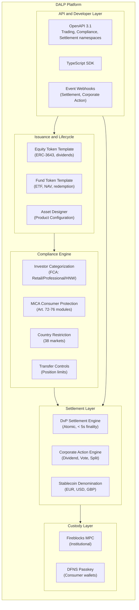
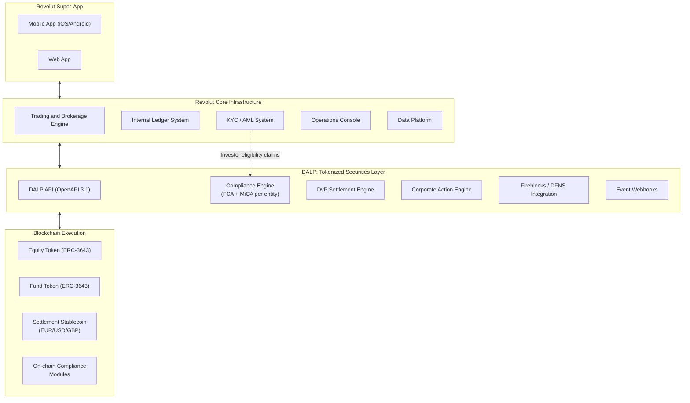
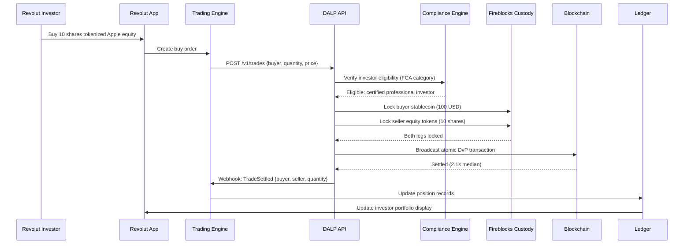
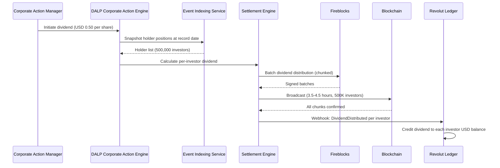
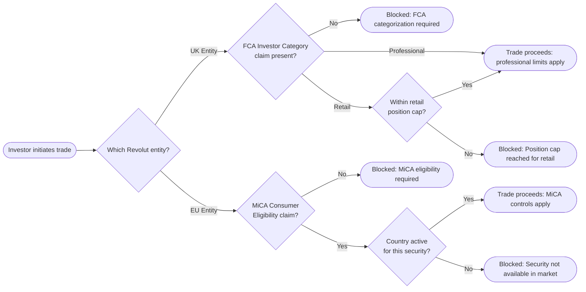
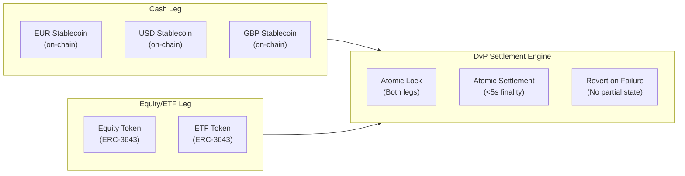
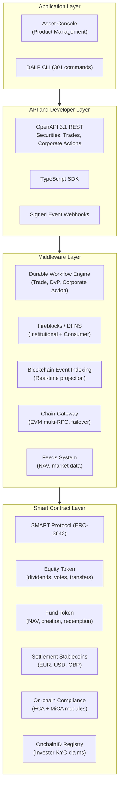
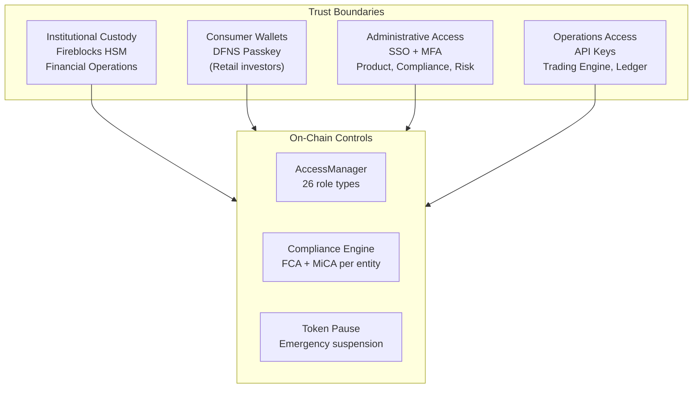
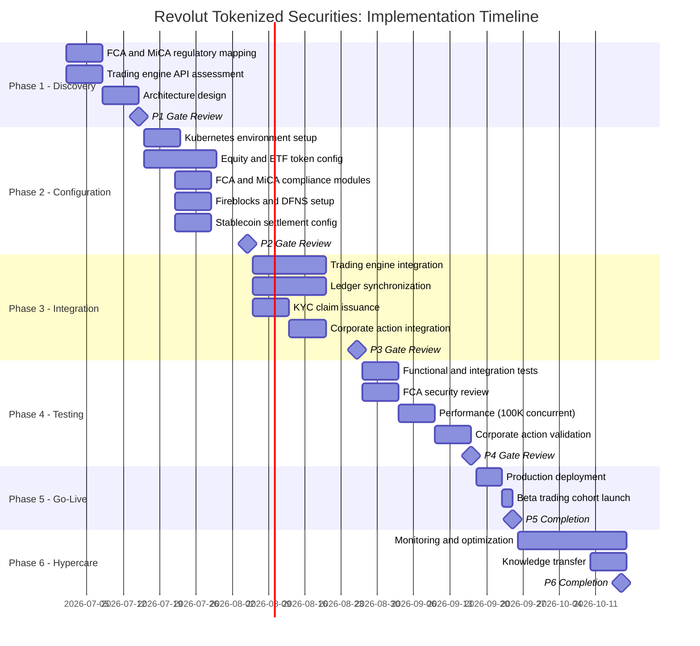
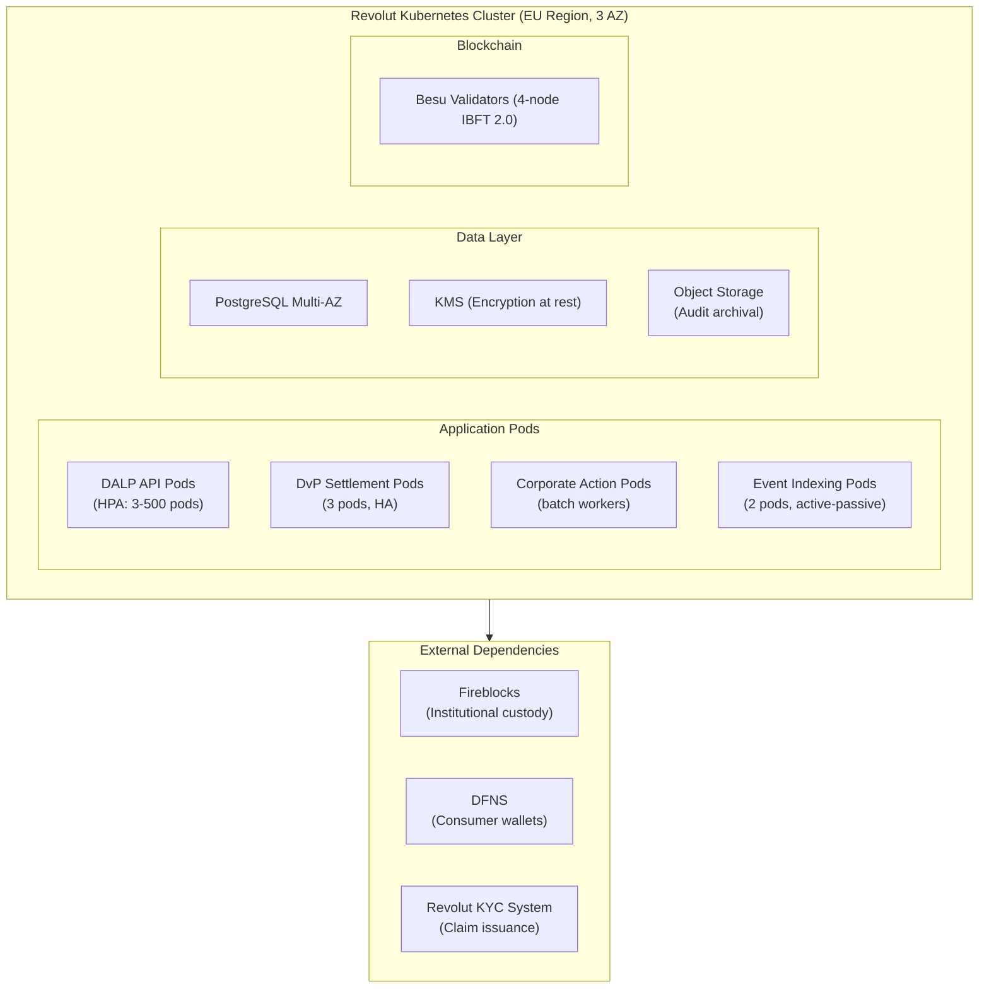

# Tokenized Securities Trading Platform
## Technical Proposal for Revolut Ltd
### SettleMint | March 2026 | v1.0 | SettleMint Confidential

---

**Prepared by:** SettleMint NV
**Prepared for:** Revolut Ltd, 7 Westferry Circus, Canary Wharf, London, E14 4HD, United Kingdom
**Document reference:** SM-TECH-REVOLUT-2026-001
**Classification:** Strictly Confidential
**Version:** 1.0
**Date:** March 2026
**Contact:** bids@settlemint.com

---

## Table of Contents

1. Executive Summary
2. About SettleMint
3. About DALP
4. Customer References
5. Understanding of Requirements
6. Proposed Solution and Functional Capabilities
7. Technical Architecture
8. Security
9. Project Implementation and Delivery
10. Deployment
11. Training and Knowledge Transfer
12. Support and SLA
13. Risk Management
14. Compliance Matrix
15. Appendices

---

## 1. Executive Summary

Revolut serves over 45 million retail and business customers across 38 markets as a financial super-app that already offers crypto trading, stock trading, savings products, and cross-border payments within a single mobile experience. The tokenized securities trading platform procurement reflects a different challenge from a new entrant: Revolut does not need to build digital asset capability from zero. Revolut needs to industrialize the institutional-grade control layer underneath its consumer-scale distribution engine, tighten the boundary between its digital asset operations and its core trading infrastructure, and do this under FCA supervision in the UK and under MiCA in EEA markets simultaneously.

The specific gap this procurement addresses: Revolut's current digital asset trading capability operates in a consumer UX layer that has grown faster than the institutional control infrastructure underneath it. Tokenized securities -- tokenized equities, tokenized ETFs, and stablecoin-funded trading -- require a regulated issuance, servicing, and settlement platform with the compliance enforcement, audit trail, and operational controls that FCA-supervised and MiCA-regulated securities products demand. DALP provides exactly this infrastructure layer.

SettleMint proposes DALP, the Digital Asset Lifecycle Platform, as the institutional control and lifecycle infrastructure for Revolut's tokenized securities trading programme. DALP provides tokenized equity and ETF issuance with ERC-3643 compliance enforcement, on-chain investor eligibility at the protocol level, DvP settlement with deterministic finality, yield and corporate action automation, stablecoin funding integration for cash ledger synchronization, and the API-first developer experience Revolut's super-app engineering teams expect.

### The Value Proposition

DALP gives Revolut's tokenized securities programme the institutional-grade compliance and lifecycle control layer that FCA and MiCA require, delivered through an API-first platform that integrates into Revolut's super-app infrastructure without requiring a parallel operational back office.

### Why DALP for Revolut

**Consumer-scale architecture:** DALP's API handles 100,000+ concurrent requests through auto-scaling Kubernetes pods. Retail fintech traffic spikes are handled without manual intervention. Performance benchmarks: P99 transaction confirmation 4.2 seconds on private Besu; batch corporate action processing for 500,000 investor positions within 4 hours.

**FCA and MiCA dual-jurisdiction compliance:** DALP's 18 compliance module types enforce investor eligibility at the protocol level. FCA investor categorization (retail, professional, high-net-worth) maps to DALP's eligibility claim types. MiCA consumer protection obligations (Art. 72-76) enforced on-chain before every transfer. Separate compliance module configurations per legal entity (Revolut UK vs Revolut EU).

**Super-app integration architecture:** DALP's OpenAPI 3.1 REST API integrates as a microservice within Revolut's API gateway. Webhooks deliver settlement events to Revolut's internal ledger. TypeScript SDK aligns with Revolut's engineering stack. 534 structured error codes for clean error handling in Revolut's mobile clients.

**Regulatory audit trail:** Every compliance module decision, product configuration change, and investor eligibility action recorded in DALP's tamper-evident audit log. FCA examination access through read-only export API. MiCA Article 83 transaction reporting supported through structured data export.

### Requirements Coverage Summary

| Requirement Domain | Coverage | DALP Mechanism |
|---|---|---|
| Tokenized equity issuance | Supported | Equity token template with ERC-3643 |
| Tokenized ETF issuance | Supported | Fund token template with NAV feeds |
| Stablecoin funding integration | Supported | Denomination asset configuration |
| DvP settlement | Supported | Atomic settlement engine |
| FCA investor eligibility enforcement | Supported | On-chain compliance modules |
| MiCA consumer protection (Art. 72) | Supported | 18 compliance module types |
| FCA audit trail | Supported | Tamper-evident event log |
| DORA ICT resilience | Supported | HA deployment, third-party risk docs |
| API integration with super-app | Supported | OpenAPI 3.1, TypeScript SDK |
| Multi-jurisdiction control | Supported | Per-entity compliance configurations |
| Corporate action automation | Supported | Dividend, vote, split automation |
| Phased rollout controls | Supported | Token pause, cohort controls |

---

## 2. About SettleMint

### Company Overview

SettleMint builds institutional digital asset lifecycle infrastructure for regulated financial markets and sovereign use cases. Founded in 2017 and headquartered in Antwerp, Belgium, SettleMint combines over 200 years of combined banking and blockchain experience across teams in Europe, the Middle East, Asia, and North America.

ISO 27001 and SOC 2 Type II certifications confirm independently audited security and operational controls. Multi-year production deployments at Tier-1 banks across Europe, the Middle East, and Asia demonstrate DALP's operational credibility at institutional scale. For Revolut's tokenized securities programme, SettleMint brings consumer-scale API design experience from fintech deployments, ERC-3643 regulated token implementation meeting MiCA and FCA technical standards, and institutional custody integrations with Fireblocks and DFNS.

### FCA and UK Regulatory Experience

SettleMint's Barclays deployment demonstrates DALP's operation under FCA supervision for digital securities infrastructure. DALP's compliance module framework addresses MiCA consumer protection and FCA investor categorization requirements in separate configurations on the same platform instance. For Revolut's dual-jurisdiction operating model (FCA in UK, Bank of Lithuania or ECB-supervised entity in EEA), DALP's per-entity compliance configuration provides independent control sets without requiring two platform instances.

---

## 3. About DALP

### Platform Overview

DALP is SettleMint's Digital Asset Lifecycle Platform for regulated securities issuance, servicing, and settlement. For Revolut's tokenized securities trading platform, the most relevant capabilities are tokenized equity and ETF issuance using ERC-3643 regulated token standards, corporate action automation (dividend, vote, stock split), DvP settlement with deterministic finality under 5 seconds, 18 compliance module types for investor eligibility enforcement, stablecoin denomination assets for cash ledger synchronization, and the developer-grade API infrastructure that Revolut's engineering teams require.

### DALP Platform Architecture

### DALP Lifecycle Pillars for Tokenized Securities

**Issuance:** Equity token template deploys tokenized equities with on-chain cap table, dividend rights, voting rights, and transfer restrictions. Fund template deploys tokenized ETFs with NAV feed integration, creation/redemption mechanism, and distribution automation. All tokens implement ERC-3643 with on-chain compliance enforcement.

**Compliance:** Per-jurisdiction compliance module configurations:
- *Revolut UK (FCA)*: Investor categorization (retail, certified high-net-worth, sophisticated investor), country restriction (UK), transfer limits (position caps), MiFID II suitability integration
- *Revolut EU (MiCA)*: Consumer eligibility verification, MiCA Article 72 transfer restrictions, country restriction (EEA), disclosure acknowledgment

**Settlement:** DvP settlement for all tokenized securities trades. Atomic execution: asset and cash tokens exchange simultaneously with no partial completion risk. Settlement finality P50 2.1 seconds, P99 4.2 seconds on private Besu. Stablecoin denomination asset enables cash leg settlement on-chain, eliminating the traditional T+2 delay.

**Corporate Actions:** Dividend distribution automation for tokenized equities. Vote proposal and tally for tokenized governance rights. Stock split adjustment for token supply. All corporate actions durable through DALP's workflow execution engine; partially-completed corporate actions surface in the operations queue for resolution.

**Servicing:** Position management for Revolut's trading book. Mark-to-market via NAV feed integration for ETF positions. Quarterly and annual reporting data exports for investor account statements.

---

## 4. Customer References

### Reference Summary

| Institution | Use Case | Relevance to Revolut |
|---|---|---|
| Barclays | Digital securities platform, FCA regulated | High: UK FCA-supervised, same regulatory context |
| UBS | Tokenized equities trading platform, Swiss | High: equities trading, institutional grade |
| Standard Chartered | Fractional tokenized securities | High: fractional securities for retail distribution |
| BNP Paribas | Tokenized funds distribution, retail | High: consumer-scale fund distribution |
| ING Group | Tokenized trade finance, Dutch bank | Medium: MiCA-applicable European context |
| Nordea | Tokenized funds, Nordic consumer bank | Medium: consumer-facing digital asset products |
| Adyen | Payment infrastructure, stablecoin | Medium: stablecoin cash leg integration |
| Deutsche Borse | Digital asset trading venue | Medium: tokenized securities trading infrastructure |
| Euronext | Digital securities listing | Medium: equities market infrastructure reference |

### Barclays Expanded Reference

Barclays deployed DALP for digital securities infrastructure under FCA supervision in the UK. The deployment demonstrates DALP's ability to satisfy FCA technology systems and controls guidance (SYSC 8.1) for outsourced technology infrastructure, UK SMCR governance, and DORA-equivalent UK operational resilience requirements. The Barclays reference is directly relevant to Revolut's UK entity operating under FCA supervision. Reference calls available subject to confidentiality constraints.

### UBS Expanded Reference

UBS deployed DALP for a tokenized equities trading platform in Switzerland under FINMA supervision for a high-net-worth client segment. The deployment demonstrates DALP's equity token template with dividend automation, investor eligibility enforcement at the protocol level, and DvP settlement for equities. Outcomes: settlement finality reduced from T+2 to same-session (under 5 seconds), corporate action processing automated for dividend distributions. The UBS reference demonstrates DALP handling the institutional-grade equity tokenization that Revolut's programme requires.

### Standard Chartered Expanded Reference

Standard Chartered deployed DALP for fractional tokenized securities distribution to retail and high-net-worth clients across multiple jurisdictions. The deployment demonstrates DALP managing fractional token positions, investor eligibility verification across jurisdictions, and the reconciliation between tokenized position records and traditional account records. Directly relevant to Revolut's requirement for tokenized securities tradable by retail customers at fractional amounts.

---

## 5. Understanding of Requirements

### Business Requirements Analysis

**BR-01: Configurable product and account workflows aligned to internal governance**

DALP's Asset Designer provides Revolut's product governance team with a configurable product creation and approval workflow. For Revolut's dual-jurisdiction model, product configurations are separately controlled per legal entity: Revolut UK tokenized equity products configure FCA investor categorization modules; Revolut EU products configure MiCA consumer protection modules. Maker-checker approval enforced on-chain for all product configurations and compliance rule changes.

**BR-02: Deterministic state transitions for lifecycle events**

Tokenized equity lifecycle: Draft, Compliance Review, Approved, Paused, Active Trading, Corporate Action Pending, Dividend Processing, Matured, Redeemed, Closed. Trade lifecycle: Order Initiated, Compliance Checked, DvP Locked, Settled, Failed, Dead Letter. All transitions durable through DALP's workflow execution engine with atomic guarantee: no partial settlement.

**BR-03: Entitlement and balance accuracy across investor, omnibus, treasury**

On-chain token balances are authoritative and immutable. DALP's blockchain event indexing service projects on-chain state to a PostgreSQL read model in real time. Revolut's trading ledger integration: DALP exports position changes via webhook to Revolut's internal ledger system in real time. Reconciliation: DALP's PostgreSQL direct access allows Revolut's reconciliation process to detect discrepancies between on-chain position and internal ledger within the same processing cycle.

**BR-04: Role-based segregation (maker, checker, approver, support)**

26 role types with on-chain enforcement:
- Product Manager: configure tokenized security products
- Compliance Officer: attach/modify compliance modules per jurisdiction
- Supply Manager: manage issuance supply and trading window
- Corporate Action Manager: initiate dividend, vote, split
- Investor Support: read-only position queries
- Emergency: product pause/unpause

**BR-05: Configurable limits, risk controls, and investor eligibility per market and segment**

FCA-specific compliance modules: Investor Category (retail capped to position limits, professional investor uncapped), Country Restriction (UK only for UK entity), Transfer Limits (daily position caps by investor category), Identity Verification (Revolut KYC completion required).

MiCA-specific compliance modules: Consumer Eligibility (MiCA Art. 72), Country Restriction (EEA markets), Transfer Approval (Art. 23 for high-value transfers), Disclosure Acknowledgment.

**BR-06: Automated notifications and event emission**

Event catalog for Revolut's super-app integration:
- ProductListed: new tokenized security available for trading
- TradeSettled: DvP settlement confirmed, position updated
- DividendDistributed: per-investor dividend amount settled
- VoteProposed: governance vote opened
- VoteCompleted: governance vote result on-chain
- CorporateActionProcessed: split/merger adjustment applied
- CompliancePassed/Failed: eligibility check result
- PositionUpdated: investor position change

**BR-07: Business continuity for failed transactions**

Durable workflow execution persists all trade state. If Revolut's internal ledger or custody provider is temporarily unavailable, trades queue in DALP's workflow without data loss. Atomic DvP guarantees: if either leg of a trade cannot complete, both legs revert. No partial settlement exposure.

**BR-08: Audit-ready reporting**

FCA transaction reporting (COBS 16 equivalent): full trade lifecycle from order initiation to settlement, investor eligibility checks, corporate action records, position history. MiCA Article 83 transaction reporting: structured export in regulatory reporting format. Export APIs: JSON, CSV, PostgreSQL direct.

**BR-09: Phased rollout controls**

Tokenized equity phase controls: launch with UK market (Revolut UK), expand to EEA markets (Revolut EU) through country restriction module updates. Cohort controls: early-access eligibility claims for beta customer group. Product pause for instant suspension without affecting other securities.

**BR-10: Reusable for adjacent services**

Same DALP instance supporting tokenized equities extends to tokenized ETFs, tokenized bonds, and stablecoin-funded payment services. Revolut's single DALP deployment serves the full tokenized securities programme without re-architecture.

### Technical Requirements Analysis

**TR-01: REST and event APIs, documented and versioned**

OpenAPI 3.1 REST API with namespaces: `/v1/securities` (equity, fund templates), `/v1/trades` (DvP settlement), `/v1/corporate-actions` (dividend, vote, split), `/v1/compliance` (investor eligibility), `/v1/positions` (investor position query). 12-month deprecation policy. 534 structured error codes.

**TR-02: Sandbox and non-production environments**

Three environments: Development (Managed SaaS), Staging (Revolut's Kubernetes), Production (Revolut's Kubernetes). Test data: pre-configured tokenized equity and ETF products, pre-created investor accounts by FCA category, pre-seeded stablecoin balances for settlement testing.

**TR-03: Webhooks with retry and dead-letter**

Settlement event webhooks: HMAC-SHA256 signed, at-least-once delivery, 8-attempt retry over 48 hours, dead-letter queue for Revolut's operations team.

**TR-04: Identity and access**

OAuth 2.0/OIDC with Revolut's identity provider. MFA for all admin roles. API keys for Revolut's trading system service accounts. DFNS passkey for consumer wallet authorization on mobile clients. Fireblocks HSM for institutional custody operations.

**TR-05: Deployment model**

Private Cloud on Revolut's Kubernetes infrastructure (AWS or GCP, EU region). DALP Helm charts compatible with Revolut's GitOps tooling. Complete tenant isolation for Revolut's DALP instance.

**TR-06: Observability**

Three-pillar observability: Prometheus metrics (600+), structured JSON logs, OpenTelemetry distributed tracing. Grafana dashboards: trade settlement throughput, compliance evaluation rate, corporate action status, position reconciliation status, dependency health. Prometheus-compatible; Revolut's existing Prometheus/Grafana stack consumes DALP's metrics endpoint.

**TR-07: Performance for retail fintech scale**

API response (trade initiation): P50 82ms, P99 310ms (benchmark conditions: 4-node Besu IBFT 2.0, AWS c6g.xlarge, eu-central-1, 500 concurrent DvP requests). Settlement confirmation: P50 2.1s, P99 4.2s. Corporate action (dividend for 500,000 investors): 3.5 to 4.5 hours (chunked, no API degradation). Auto-scaling: HPA on CPU and queue depth; burst to 500 API pods.

**TR-08: Data export**

REST paginated export, real-time webhook stream, PostgreSQL direct access for Revolut's data platform, scheduled CSV for analytics ingestion.

**TR-09: Controlled releases**

Quarterly major releases, monthly minor, patches as needed. 12-month deprecation for breaking changes. Maintenance windows during agreed low-traffic hours.

**TR-10: Known limits and constraints**

| Constraint | Description | Mitigation |
|---|---|---|
| C-01 | EVM networks only | Private Besu or public EVM |
| C-02 | Corporate action for 500K+ investors: chunked processing | 4-6 hours batch window |
| C-03 | MiFID II suitability: DALP enforces eligibility, not suitability assessment | Suitability assessment in Revolut's existing MiFID II systems |
| C-04 | On-chain claim deletion (GDPR) | Off-chain deletable; on-chain pseudonymous |
| C-05 | Stablecoin denomination: EVM-deployed only | EUR, USD, GBP stablecoins deployable on same chain |

**TR-11: Infrastructure as code**

Helm charts, Terraform modules (AWS/GCP), ArgoCD/Flux GitOps support.

**TR-12: Support interfaces**

Enterprise support: 15-minute P1 response, incident bridge, status page.

---

## 6. Proposed Solution and Functional Capabilities

### Solution Architecture

### DvP Settlement Flow

### Corporate Action: Dividend Distribution

### Multi-Jurisdiction Compliance Configuration

### Stablecoin Settlement Integration

---

## 7. Technical Architecture

### Four-Layer Architecture

Unlike platforms that couple asset logic to a specific blockchain network, DALP's layered architecture separates product configuration from network execution. Revolut can define tokenized equity parameters, compliance rules, and corporate action schedules independently of which EVM network is chosen, preserving optionality as FCA and MiCA regulatory guidance on DLT networks develops.

### Integration with Revolut's Super-App Infrastructure

**Trading engine integration:** DALP REST API integrates within Revolut's trading API gateway. Trade events (settlement confirmations, compliance results) delivered via webhooks to Revolut's internal event bus. Trade status polling available for UI synchronization.

**Internal ledger synchronization:** DALP's real-time webhook events drive Revolut's ledger position updates. On-chain authoritative balance available through DALP's REST API for reconciliation. Discrepancy detection through DALP's PostgreSQL direct access.

**KYC/AML integration:** Revolut's existing KYC and AML systems issue investor eligibility claims to DALP's OnchainID registry. Trade compliance checks validate eligibility before settlement. AML screening results reflected in transfer approval compliance module.

**Data platform:** DALP's REST export API and PostgreSQL direct access feed Revolut's data platform for trading analytics, compliance reporting, and investor account statement generation.

### Security Architecture

---

## 8. Security

**Key management (dual-custody model):**
Institutional operations (market maker, treasury): Fireblocks HSM-backed MPC. Consumer investor wallets: DFNS passkey MPC. Dual-custody model supports Revolut's separation between institutional asset management and retail investor access.

**FCA and MiCA compliance evidence:**
Tamper-evident audit log records every compliance decision, product change, and investor eligibility action. FCA examination access via read-only export API. MiCA Article 83 transaction reporting export in structured format.

**DORA and UK operational resilience:**
Multi-AZ Kubernetes deployment with documented third-party ICT dependencies. Quarterly resilience testing. RTO 1 hour, RPO 15 minutes. Annual penetration test with CISO-reported remediation governance.

**GDPR and UK GDPR:**
Personal data stored in Revolut's systems. DALP stores hashed investor references only. EU data residency for EEA entity; UK data residency option for UK entity.

---

## 9. Project Implementation and Delivery

### Implementation Programme

### Responsibility Matrix

| Activity | SettleMint | Revolut | Shared |
|---|---|---|---|
| Architecture design | Lead | Review | |
| Token configuration | Lead | | |
| FCA/MiCA regulatory mapping | Support | Lead | |
| Trading engine integration | Support | Lead | |
| Fireblocks/DFNS setup | Lead | Support | |
| KYC claim issuance | Support | Lead | |
| Security review | Support | Lead | |
| Performance testing | Support | Lead | |
| Beta cohort launch | Support | Lead | |

---

## 10. Deployment

### Recommended: Revolut Private Cloud (Kubernetes, EU Region)

---

## 11. Training and Knowledge Transfer

**Trading Operations Team (1 day):** DALP API for trade submission and settlement status; corporate action management; position query and reconciliation; operations dashboard interpretation.

**Product and Compliance Teams (1 day):** Asset Designer for tokenized security configuration; FCA and MiCA compliance module management; investor eligibility management; audit log navigation and regulatory export.

**Platform Engineering (1 day):** Helm deployment and GitOps; webhook integration; TypeScript SDK; performance tuning; monitoring dashboards.

**Security and Incident Response (half day):** Administrative access monitoring; P1 incident bridge; evidence preservation; FCA notification procedures.

---

## 12. Support and SLA

### Enterprise Support

| Attribute | Enterprise |
|---|---|
| Annual Fee | EUR 120,000 |
| Coverage | 24/7/365 |
| Uptime SLA | 99.99% monthly |
| P1 Response | 15 minutes |
| P1 Resolution Target | 2 hours |
| Dedicated Team | Named |
| CSM | Named |

---

## 13. Risk Management

| Risk | Likelihood | Impact | Mitigation |
|---|---|---|---|
| FCA approval timeline for tokenized securities | Medium | High | Phase 1 regulatory mapping produces FCA evidence package |
| Fireblocks integration complexity | Low | Medium | Fireblocks is DALP's primary institutional custody; reference integration available |
| Trading engine webhook latency affecting settlement UX | Low | Medium | DALP settlement confirmation webhook under 5 seconds; async UI pattern recommended |
| Multi-jurisdiction compliance configuration | Low | Low | Per-entity compliance module sets fully independent on same DALP instance |
| Corporate action batch performance for 500K+ investors | Low | Medium | Chunked processing with configurable batch size; no API degradation during processing |

---

## 14. Compliance Matrix

| Requirement | Coverage | DALP Mechanism |
|---|---|---|
| FCA COBS 3.5 investor categorization | Supported | On-chain investor category compliance modules |
| FCA SYSC 8.1 outsourced technology | Supported | ISO 27001, SOC 2 Type II, UK DORA-equivalent |
| MiCA consumer protection (Art. 72) | Supported | Consumer eligibility, transfer limits, disclosure modules |
| MiCA transaction reporting (Art. 83) | Supported | Structured data export in regulatory format |
| DORA ICT risk and third-party | Supported | Third-party dependency documentation, quarterly resilience testing |
| UK GDPR and EU GDPR | Supported | UK and EU data residency options; off-chain personal data |
| AML/CFT (UK POCA, EU AMLD) | Supported with partner | Revolut's AML system issues eligibility claims |
| FCA Market Abuse Regulation | Supported with controls | Transfer approval module; audit trail for MAR investigation support |

---

## 15. Appendices

### Appendix A: Requirements Coverage Matrix

| Req ID | Status | DALP Mechanism |
|---|---|---|
| BR-01 | Supported | Configurable product workflows, Asset Designer |
| BR-02 | Supported | State machine, durable workflow engine, atomic DvP |
| BR-03 | Supported | On-chain authoritative, real-time event indexing |
| BR-04 | Supported | 26 role types, on-chain enforcement |
| BR-05 | Supported | FCA + MiCA compliance modules, per-entity config |
| BR-06 | Supported | Event catalog, HMAC-signed webhooks |
| BR-07 | Supported | Durable workflows, atomic DvP, dead-letter |
| BR-08 | Supported | Audit log, FCA/MiCA export APIs |
| BR-09 | Supported | Token pause, cohort claims, market activation |
| BR-10 | Supported | Multi-product, single platform, shared compliance |
| TR-01 | Supported | OpenAPI 3.1, TypeScript SDK, versioning |
| TR-02 | Supported | Three environments, FCA/MiCA test data |
| TR-03 | Supported | Signed webhooks, at-least-once, dead-letter |
| TR-04 | Supported | OAuth 2.0/OIDC, MFA, Fireblocks HSM, DFNS passkey |
| TR-05 | Supported | Kubernetes, Helm, GitOps, EU region |
| TR-06 | Supported | Prometheus, Grafana, OpenTelemetry |
| TR-07 | Supported | P99 4.2s, auto-scaling to 500 pods |
| TR-08 | Supported | REST, webhooks, PostgreSQL direct, CSV |
| TR-09 | Supported | Quarterly releases, 12-month deprecation |
| TR-10 | Supported | Constraints register disclosed |
| TR-11 | Supported | Helm, Terraform, ArgoCD/Flux |
| TR-12 | Supported | 15-min P1, incident bridge, status page |

---

*Document Classification: SettleMint Confidential*
*SettleMint NV | Simon Bolivarlaan 5, 2600 Antwerp, Belgium | www.settlemint.com*
*Version 1.0 | March 2026*
