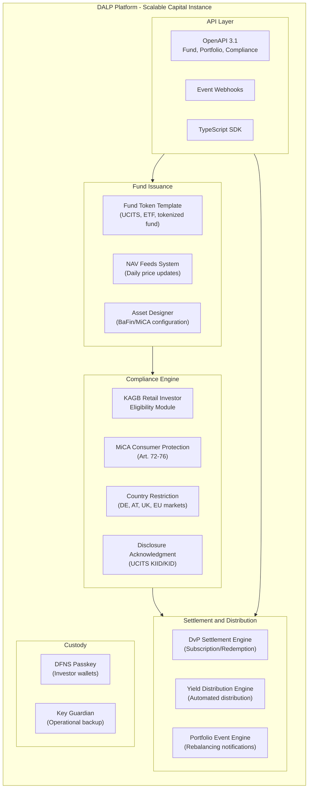
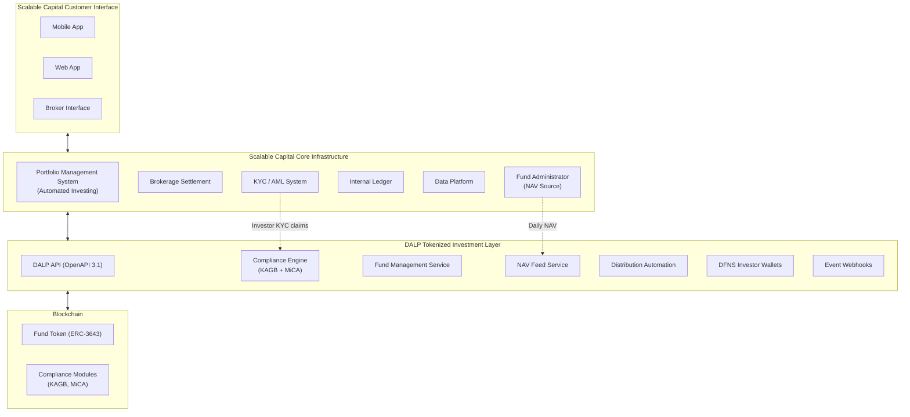
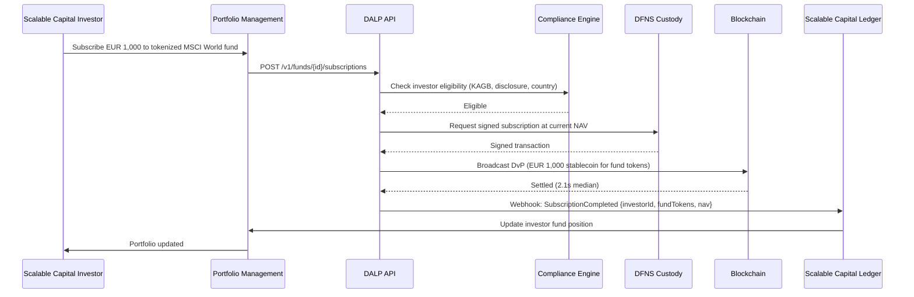
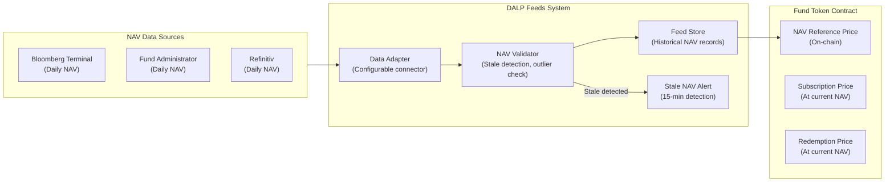
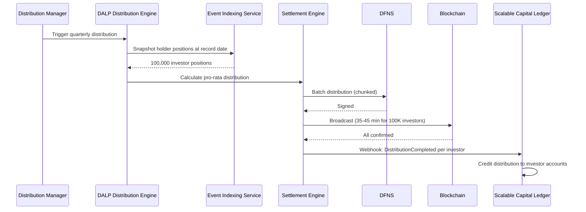
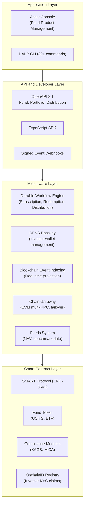
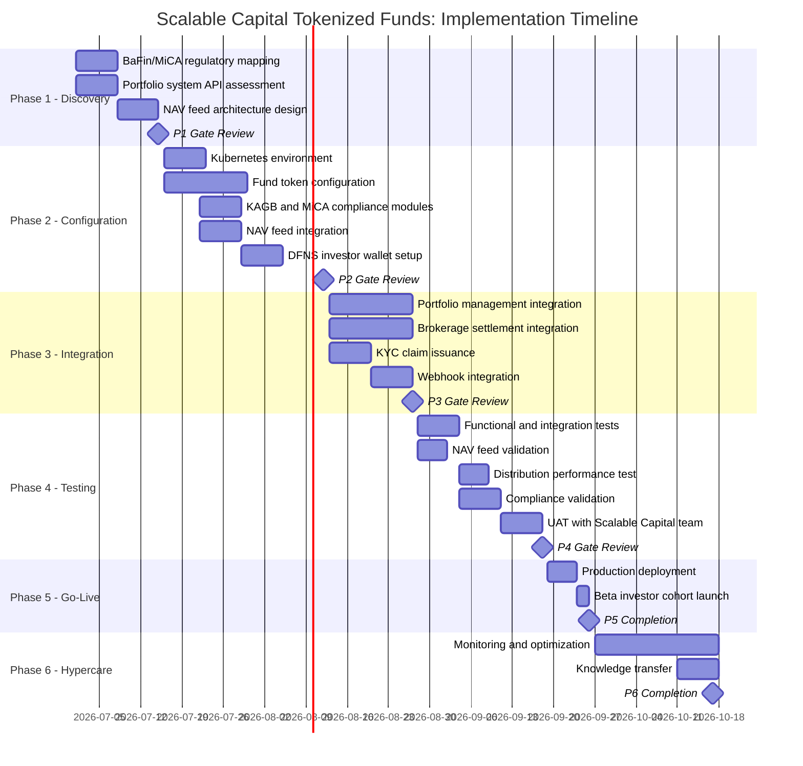
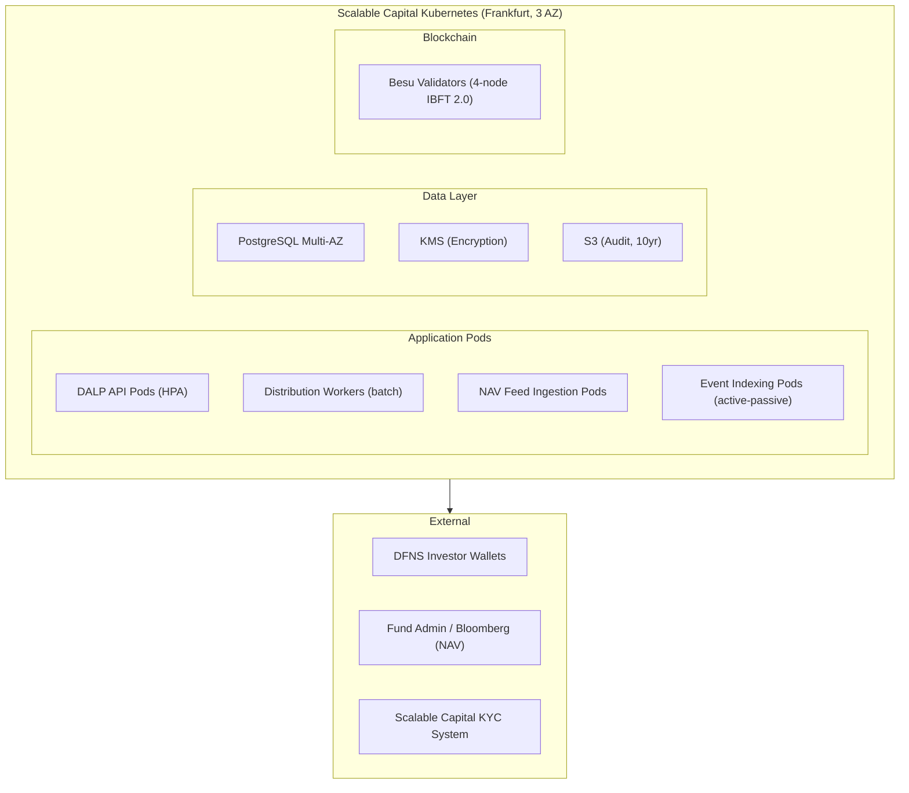

# Tokenized Investment Platform
## Technical Proposal for Scalable Capital GmbH
### SettleMint | March 2026 | v1.0 | SettleMint Confidential

---

**Prepared by:** SettleMint NV
**Prepared for:** Scalable Capital GmbH, Seitzstrasse 8, 80538 Munich, Germany
**Document reference:** SM-TECH-SCALABLE-2026-001
**Classification:** Strictly Confidential
**Version:** 1.0
**Date:** March 2026
**Contact:** bids@settlemint.com

---

## Table of Contents

1. Executive Summary
2. About SettleMint
3. About DALP
4. Customer References
5. Understanding of Requirements
6. Proposed Solution and Functional Capabilities
7. Technical Architecture
8. Security
9. Project Implementation and Delivery
10. Deployment
11. Training and Knowledge Transfer
12. Support and SLA
13. Risk Management
14. Compliance Matrix
15. Appendices

---

## 1. Executive Summary

Scalable Capital serves over 7 million customers across Germany, Austria, the UK, and other European markets as a digital wealth and brokerage platform specializing in automated investing, ETF-based wealth management, and scalable brokerage operations. Scalable Capital's operational model -- automated portfolio rebalancing, cost-efficient execution, and lean operations -- shapes exactly what a tokenized investment platform must deliver: a programmable, API-first infrastructure that handles tokenized fund issuance, NAV-linked portfolio servicing, investor eligibility enforcement, and yield distribution automation without creating a manual operational back-office that contradicts Scalable Capital's lean operating philosophy.

Scalable Capital's procurement focus is a tokenized investment platform that integrates with its existing brokerage and wealth management infrastructure, satisfies BaFin and MiCA requirements for tokenized fund products, and provides the API-first automation that Scalable Capital's engineering culture demands. DALP provides precisely this infrastructure.

SettleMint proposes DALP, the Digital Asset Lifecycle Platform, as the tokenized investment infrastructure for Scalable Capital. DALP provides tokenized fund issuance with NAV feed integration, automated portfolio yield distribution, compliance enforcement for MiCA and BaFin consumer fund regulations, DvP settlement aligned with Scalable Capital's brokerage settlement flows, and the developer-grade API infrastructure that Scalable Capital's teams require.

### The Value Proposition

DALP delivers a production-grade tokenized investment infrastructure in 12 to 16 weeks that integrates into Scalable Capital's automated wealth management stack without requiring a parallel manual operations team, at a total Year 1 cost of approximately EUR 840,000.

### Why DALP for Scalable Capital

**Automation-first design:** DALP's programmable yield schedules, NAV-feed-driven price updates, and automated portfolio rebalancing events align with Scalable Capital's automated wealth management philosophy. Operations teams monitor distribution status through dashboards; manual intervention is exception-handling only.

**BaFin and MiCA fund compliance:** DALP's 18 compliance module types enforce investor eligibility for tokenized fund products under BaFin's KAGB framework and MiCA's Title III consumer protection requirements. Fund token configurations for retail and professional investor segments with independent compliance modules.

**Lean integration:** DALP's OpenAPI 3.1 REST API integrates as a microservice within Scalable Capital's existing brokerage API layer. Webhook events drive Scalable Capital's portfolio management system updates in real time. No proprietary SDK lock-in.

**German regulatory alignment:** Commerzbank deployment under BaFin supervision provides direct regulatory reference for Scalable Capital's BaFin-supervised operations. DALP's audit trail satisfies BaFin Circular 05/2023 outsourcing requirements and the KAGB record-keeping obligations for fund administration.

### Requirements Coverage Summary

| Requirement Domain | Coverage | DALP Mechanism |
|---|---|---|
| Tokenized fund issuance (ETF, UCITS) | Supported | Fund token template with NAV feeds |
| Automated NAV updates | Supported | Feeds system with configurable price sources |
| Portfolio yield distribution | Supported | Automated yield schedule engine |
| MiCA consumer fund eligibility | Supported | 18 compliance module types |
| BaFin KAGB compliance | Supported | Audit trail, compliance modules, reporting |
| DvP settlement | Supported | Atomic settlement engine |
| API integration with brokerage | Supported | OpenAPI 3.1, webhooks |
| Phased market expansion | Supported | Country restriction modules |
| Automated portfolio rebalancing events | Supported | Token transfer with compliance validation |
| Observability for automated operations | Supported | Three-pillar observability, Grafana |

---

## 2. About SettleMint

SettleMint builds institutional digital asset lifecycle infrastructure for regulated financial markets. ISO 27001 and SOC 2 Type II certified. The Commerzbank deployment under BaFin supervision in Germany is the primary reference for Scalable Capital's BaFin-regulated operations. For tokenized fund products, the BNP Paribas and Nordea deployments demonstrate DALP's fund distribution capabilities at consumer banking scale. Over 200 years of combined banking and blockchain experience across the SettleMint team.

---

## 3. About DALP

### Platform Overview

DALP is SettleMint's Digital Asset Lifecycle Platform. For Scalable Capital's tokenized investment platform, the most relevant capabilities are: fund token template with NAV feed integration and automated subscription/redemption; compliance enforcement for fund investor eligibility under KAGB and MiCA; automated yield and distribution scheduling; DvP settlement for subscription and redemption flows; and API-first integration with Scalable Capital's automated wealth management stack.

### DALP Platform Architecture for Scalable Capital

### DALP Lifecycle Pillars for Tokenized Funds

**Issuance:** Fund token template deploys tokenized fund products with daily NAV feed integration, creation and redemption mechanism, distribution schedule, and KAGB/MiCA compliance module attachment. Paused-by-default creates BaFin review gate before investor access.

**NAV Feed Integration:** DALP's Feeds system connects to Scalable Capital's existing price sources (Bloomberg, Refinitiv, or internal fund administrator) via configurable data adapters. Daily NAV updates reflected in fund token reference price. Stale NAV detection alerts operations team within 15 minutes of missed update.

**Compliance:** KAGB and MiCA compliance modules per fund product:
- Retail fund (KAGB): KIID/KID disclosure acknowledgment, retail investor eligibility, country restriction (DE, AT)
- Professional fund (KAGB): qualified investor eligibility, country restriction (EEA)
- MiCA consumer protection: Art. 72 eligibility, transfer limits, disclosure

**Settlement:** DvP for subscription (EUR stablecoin for fund tokens) and redemption (fund tokens for EUR stablecoin). T+0 settlement versus T+2 or T+3 for traditional fund settlement. Atomic: no partial subscription or redemption.

**Distribution:** Automated dividend and income distribution for distributing fund share classes. Accumulating share class: automatic reinvestment through token supply adjustment. Distributing share class: cash distribution to investor accounts through webhook to Scalable Capital's ledger.

---

## 4. Customer References

| Institution | Relevance to Scalable Capital |
|---|---|
| BNP Paribas | Tokenized fund distribution at consumer scale -- directly relevant to retail fund product |
| Nordea | Tokenized funds under Finansinspektionen; MiCA-adjacent regulatory context |
| Commerzbank | BaFin-supervised Germany; outsourcing guidance compliance |
| KBC Securities | Retail brokerage and SME investment products |
| ADI Finstreet | DFNS passkey integration for investor wallets |

### BNP Paribas Expanded Reference

BNP Paribas deployed DALP for tokenized fund distribution at consumer banking scale. The deployment demonstrates DALP's fund token template with NAV integration, automated distribution, and retail investor compliance controls. BNP Paribas serves millions of retail fund investors; the reference confirms DALP's ability to handle the investor volume and compliance requirements that Scalable Capital's 7 million customer base requires.

### Commerzbank Expanded Reference

Commerzbank deployed DALP under BaFin supervision in Germany, demonstrating DALP's compliance with BaFin Circular 05/2023 on outsourced IT systems and its ability to pass German institutional security review. EUR 7 million in annual operational savings in Phase 1. Directly relevant to Scalable Capital's BaFin-supervised operations.

---

## 5. Understanding of Requirements

### Business Requirements

**BR-01: Configurable product workflows aligned to internal approval**

Asset Designer provides Scalable Capital's product governance team with configurable fund product workflows. Fund product creation approval chain: Product Manager (configures parameters), Risk (validates risk limits), Compliance (BaFin and MiCA alignment), BaFin liaison (documentation). Fund configuration changes tracked with maker-checker approval on-chain.

**BR-02: Deterministic state transitions**

Fund lifecycle: Draft, BaFin Review, Approved, Paused, Active Subscription, Subscription Closed, Distribution Pending, Distribution Complete, Redeemed. Investor transaction states: Initiated, Compliance Checked, DvP Locked, Settled, Dead Letter.

**BR-03: Entitlement and balance accuracy**

On-chain fund token balances authoritative. Blockchain event indexing service projects to PostgreSQL in real time. Scalable Capital's portfolio management system reads fund positions via DALP's REST API. Daily reconciliation between DALP on-chain balances and Scalable Capital's account ledger; discrepancies surfaced as alerts within 15 minutes.

**BR-04: Role-based segregation**

Key roles: Fund Product Manager, Compliance Officer, NAV Administrator (updates feed configuration), Distribution Manager (triggers yield distribution), Investor Support (read-only), Emergency (fund pause).

**BR-05: Configurable limits and eligibility**

Per-fund compliance configuration:
- Retail UCITS fund: KIID disclosure, country restriction (DE, AT, UK), retail transfer limits
- Professional fund: qualified investor claim, country restriction (EEA), position limits
- ETF product: continuous creation/redemption, daily NAV-linked price

**BR-06: Automated notifications and events**

Event catalog: FundLaunched, SubscriptionWindowOpen, SubscriptionCompleted, NAVUpdated, DistributionTriggered, DistributionCompleted, RedemptionSettled, CompliancePassed/Failed, FundPaused/Resumed.

**BR-07: Business continuity**

Durable workflows for all subscription and redemption flows. DFNS unavailability: transactions queue without loss. Atomic DvP: no partial subscription or redemption. Dead-letter queue for permanently failed transactions.

**BR-08: Audit-ready reporting**

BaFin KAGB record-keeping: subscription and redemption audit trail, NAV update history, distribution records per investor, compliance decision log. Export: JSON, CSV, PostgreSQL direct. Retention: 10 years.

**BR-09: Phased rollout**

Fund product launch: Germany first, expand to Austria and UK through country restriction module update. Cohort access: early-access eligibility claims for pilot investor group. Fund pause for compliance review.

**BR-10: Adjacent product reuse**

Same DALP instance: add tokenized bond funds, tokenized equity products, and stablecoin payment features without re-architecture.

### Technical Requirements

**TR-01:** OpenAPI 3.1 with fund, portfolio, and compliance namespaces. TypeScript SDK. 12-month deprecation policy.

**TR-02:** Three environments with seeded Scalable Capital test data: 3 fund products, 500 test investor wallets, NAV feed mock.

**TR-03:** Fund event webhooks: signed, at-least-once, dead-letter.

**TR-04:** OAuth 2.0/OIDC with Scalable Capital's identity provider. DFNS passkey for investor wallet authorization.

**TR-05:** Private Cloud on Scalable Capital's Kubernetes infrastructure (AWS, eu-central-1) or SettleMint Managed SaaS for development.

**TR-06:** Prometheus metrics, Grafana dashboards, JSON logs. Fund-specific dashboards: subscription throughput, NAV feed status, distribution progress, reconciliation status.

**TR-07:** API response P99 300ms. Subscription/redemption finality P99 4.2 seconds. Yield distribution for 100,000 investors: 35-45 minutes.

**TR-08:** REST export, webhooks, PostgreSQL direct access, CSV for Scalable Capital's data warehouse.

**TR-09:** Quarterly major releases, 12-month deprecation. Maintenance windows coordinating with Scalable Capital's change management.

**TR-10 Constraints:**

| Constraint | Description | Mitigation |
|---|---|---|
| C-01 | EVM only | Private Besu or public EVM |
| C-02 | NAV feed: stale data detection only; DALP does not calculate NAV | Scalable Capital's fund administrator provides NAV |
| C-03 | Distribution batch: 100K investors in 35-45 min | Chunked processing; no API degradation |
| C-04 | GDPR deletion: on-chain pseudonymous | Off-chain deletable |

**TR-11:** Helm charts, Terraform, ArgoCD/Flux GitOps.

**TR-12:** Enterprise support, 15-minute P1, incident bridge, status page.

---

## 6. Proposed Solution and Functional Capabilities

### Solution Architecture

### Fund Subscription Flow

### NAV Feed Integration

### Yield Distribution (Distributing Share Class)

---

## 7. Technical Architecture

### Four-Layer Architecture

Unlike platforms that bundle NAV calculation with token management, DALP's architecture separates the price feed from the token contract. Scalable Capital's fund administrator remains the authoritative NAV source; DALP provides the token infrastructure that uses that NAV for subscription and redemption pricing. This boundary preserves Scalable Capital's existing fund administration relationships and BaFin valuation independence requirements.

### Performance Specifications

| Operation | P50 | P99 | Notes |
|---|---|---|---|
| API response (subscription initiation) | 85ms | 300ms | Kubernetes auto-scaling active |
| Settlement confirmation (subscription) | 2.1s | 4.2s | Private Besu IBFT 2.0 |
| NAV feed update propagation | <500ms | <1s | After feed ingestion |
| Distribution (100K investors) | 35-45 min | 55 min | Chunked processing |
| Distribution (500K investors) | 3-4 hours | 5 hours | Background workers, no API degradation |

---

## 8. Security

**Consumer data privacy:** Personal data in Scalable Capital's systems. DALP stores hashed investor references only. EU data residency (Frankfurt). BaFin audit trail preserved 10 years.

**Key management:** DFNS threshold MPC for investor wallet keys. No single key exposure. Investor transactions authorized through DFNS passkey (biometric or PIN in Scalable Capital's app).

**BaFin compliance evidence:** Tamper-evident audit log for every compliance decision, fund configuration change, and investor eligibility action. BaFin examination API. KAGB record-keeping: subscription/redemption audit trail, NAV history, distribution records.

**DORA:** Multi-AZ Kubernetes, PostgreSQL Multi-AZ, RTO 1 hour, RPO 15 minutes. Quarterly resilience tests.

---

## 9. Project Implementation and Delivery

### Implementation Programme

### Responsibility Matrix

| Activity | SettleMint | Scalable Capital | Shared |
|---|---|---|---|
| Architecture design | Lead | Review | |
| Token and fund configuration | Lead | | |
| NAV feed connector configuration | Lead | Support | |
| BaFin/MiCA regulatory mapping | Support | Lead | |
| Portfolio management integration | Support | Lead | |
| KYC claim issuance setup | Support | Lead | |
| Security and BaFin review | Support | Lead | |
| Investor UAT | Support | Lead | |

---

## 10. Deployment

---

## 11. Training and Knowledge Transfer

**Portfolio Engineering (1 day):** Fund subscription/redemption API integration, NAV feed connector, webhook event handling, TypeScript SDK.

**Operations and Fund Administration (1 day):** Asset Designer for fund configuration, NAV feed monitoring, distribution management, reconciliation dashboards.

**Compliance and BaFin Reporting (half day):** KAGB audit log, investor eligibility management, compliance module configuration, BaFin evidence export.

---

## 12. Support and SLA

Enterprise Support: EUR 120,000/year, 24/7/365, 99.99% uptime, 15-min P1 response, 2-hour P1 resolution, named team and CSM.

---

## 13. Risk Management

| Risk | Likelihood | Impact | Mitigation |
|---|---|---|---|
| NAV feed integration delays | Medium | Medium | Phase 2 proof-of-concept; mock NAV source for development |
| BaFin KAGB approval for tokenized fund products | Medium | High | Phase 1 regulatory mapping; BaFin liaison documentation |
| DFNS investor wallet mobile integration | Low | Medium | DFNS iOS/Android SDKs; Phase 2 PoC |
| Distribution performance for 7M investor base | Low | Medium | Chunked processing scales linearly; batch windows configured |
| Portfolio management API integration complexity | Low | Low | Scalable Capital's API-first architecture; standard REST integration |

---

## 14. Compliance Matrix

| Requirement | Coverage | DALP Mechanism |
|---|---|---|
| BaFin KAGB fund administration (§ 87) | Supported | Audit trail, compliance modules, reporting |
| BaFin Circular 05/2023 outsourcing | Supported | ISO 27001, SOC 2 Type II, access controls |
| MiCA consumer fund eligibility (Art. 72) | Supported | Consumer eligibility, disclosure modules |
| MiCA consumer protection (Art. 73) | Supported | Disclosure acknowledgment, transfer limits |
| DORA ICT resilience | Supported | HA deployment, quarterly resilience testing |
| GDPR fund investor data | Supported | EU data residency (Frankfurt), off-chain personal data |
| AML/CFT (GwG) | Supported with partner | KYC claims from Scalable Capital's AML system |
| MiFID II (for investment funds) | Supported with controls | Suitability: Scalable Capital's existing MiFID II system |

---

## 15. Appendices

### Appendix A: Requirements Coverage Matrix

| Req ID | Status | DALP Mechanism |
|---|---|---|
| BR-01 | Supported | Asset Designer, maker-checker approval |
| BR-02 | Supported | Fund state machine, durable workflows |
| BR-03 | Supported | On-chain authoritative, event indexing projection |
| BR-04 | Supported | 26 role types including NAV Administrator |
| BR-05 | Supported | KAGB and MiCA compliance module configurations |
| BR-06 | Supported | Fund event catalog, signed webhooks |
| BR-07 | Supported | Durable workflows, atomic DvP, dead-letter |
| BR-08 | Supported | KAGB audit trail, BaFin export APIs |
| BR-09 | Supported | Token pause, country restriction, cohort claims |
| BR-10 | Supported | Multi-product, single DALP instance |
| TR-01 | Supported | OpenAPI 3.1, TypeScript SDK, 12-month deprecation |
| TR-02 | Supported | Three environments, seeded fund test data |
| TR-03 | Supported | Signed webhooks, at-least-once, dead-letter |
| TR-04 | Supported | OAuth 2.0/OIDC, MFA, DFNS passkey |
| TR-05 | Supported | Kubernetes, Helm, GitOps, Frankfurt |
| TR-06 | Supported | Prometheus, Grafana NAV/distribution dashboards |
| TR-07 | Supported | P99 4.2s settlement; 35-45min for 100K distribution |
| TR-08 | Supported | REST, webhooks, PostgreSQL direct, CSV |
| TR-09 | Supported | Quarterly releases, 12-month deprecation |
| TR-10 | Supported | Constraints register disclosed |
| TR-11 | Supported | Helm, Terraform, ArgoCD/Flux |
| TR-12 | Supported | 15-min P1, incident bridge, status page |

---

*Document Classification: SettleMint Confidential*
*SettleMint NV | Simon Bolivarlaan 5, 2600 Antwerp, Belgium | www.settlemint.com*
*Version 1.0 | March 2026*
