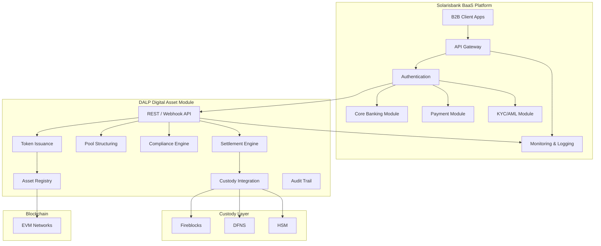
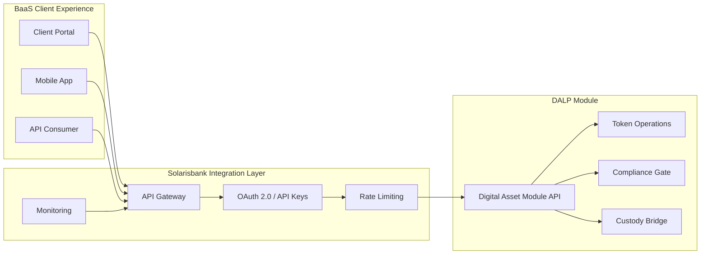
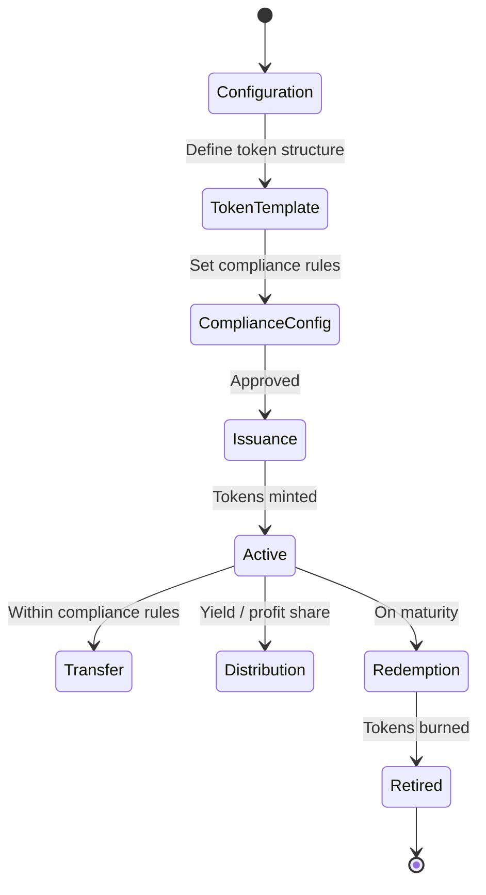
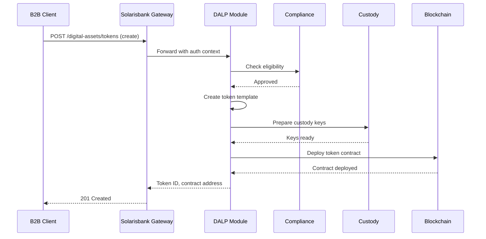
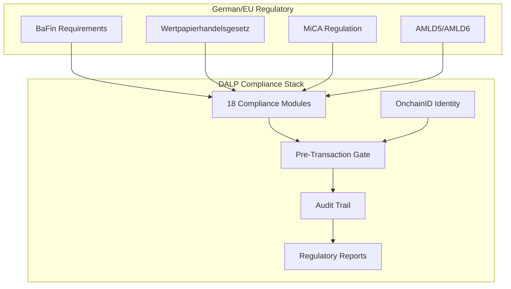
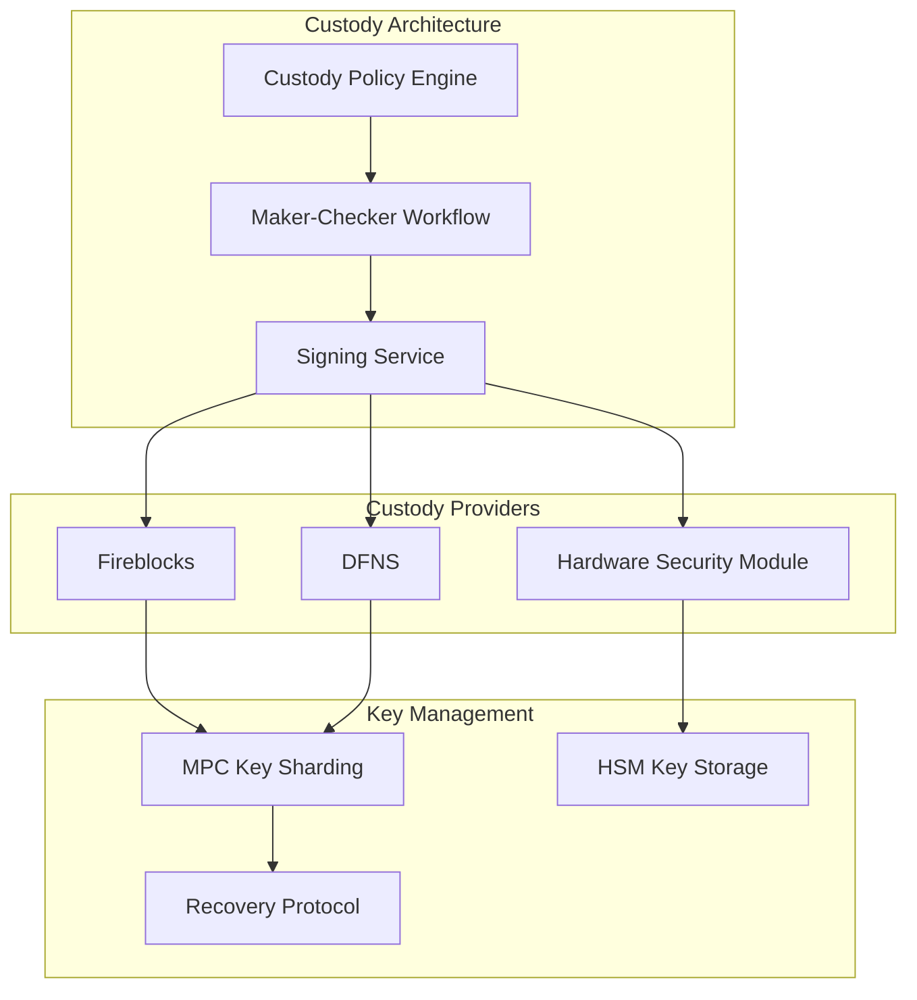
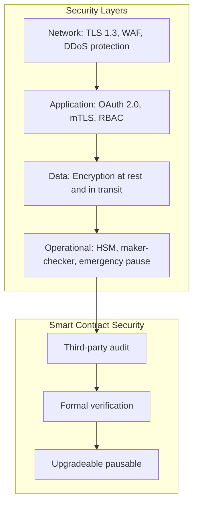
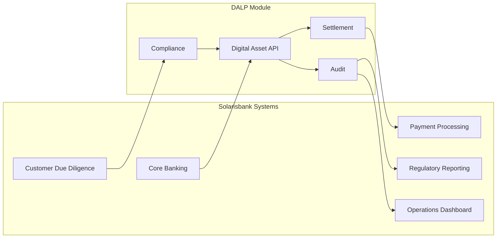
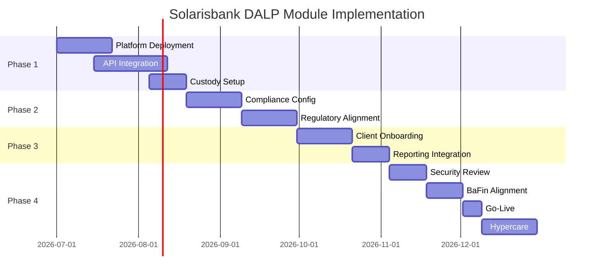

# Technical Proposal: BaaS Digital Asset Module for Banking-as-a-Service Infrastructure

**Document Title:** Technical Proposal for BaaS Digital Asset Module  
**Client:** Solarisbank (Germany)  
**Reference:** SOLARISBANK-RFP-BAAS-DIGITAL-ASSET-MODULE-202603  
**Submitted by:** SettleMint  
**Date:** March 2026  
**Version:** 1.0 (Draft)  
**Confidentiality:** Strictly Confidential

---

## Table of Contents

1. Executive Summary
2. Understanding of Solarisbank's Requirements
3. SettleMint and DALP Overview
4. Platform Architecture
5. Digital Asset Module Design
6. BaaS Integration Framework
7. Compliance and Regulatory Framework
8. Custody and Key Management
9. Security Architecture
10. Integration Architecture
11. Operational Model
12. Implementation Plan
13. Reference Deployments
14. Compliance Matrix

---

## Executive Summary

Solarisbank operates as a Banking-as-a-Service (BaaS) platform enabling fintech companies and non-bank entities to offer banking products through a modular API infrastructure. As institutional demand for digital asset custody, tokenization, and settlement services grows among Solarisbank's B2B clients, Solarisbank requires a digital asset module that extends its BaaS platform to support regulated digital asset operations.

The challenge is that building a compliant digital asset infrastructure from scratch requires specialized engineering, regulatory licensing, and operational expertise that distracts from Solarisbank's core BaaS value proposition. Integrating point solutions creates fragmentation, increases operational overhead, and complicates the regulatory story.

SettleMint's DALP platform provides the digital asset module as an integrated component of Solarisbank's BaaS infrastructure. The module handles tokenization, compliance enforcement, custody integration, and settlement across the digital asset lifecycle while maintaining the modular, API-first architecture that defines Solarisbank's BaaS offering. Solarisbank's B2B clients gain access to digital asset capabilities through the same integration patterns they use for banking services.

Three capabilities define this fit. First, modular API integration: DALP exposes digital asset functionality through REST APIs and webhooks that integrate into Solarisbank's existing API gateway, maintaining consistency with the BaaS platform's integration model. Second, BaFin compliance: compliance modules enforce German and EU regulatory requirements for digital asset custody and tokenization, including the upcoming MiCA framework. Third, unified operational view: a single operational dashboard manages both banking and digital asset operations, reducing the learning curve for Solarisbank's operations team.

---

## Understanding of Solarisbank's Requirements

### Regulatory Context

Solarisbank holds a German banking license (Kreditinstitut) and an e-money institution license from BaFin. Adding digital asset capabilities to the BaaS platform requires adherence to:

- **BaFin requirements:** Digital asset custody, token issuance, and trading platform operations require specific BaFin authorization or registration depending on the activity. The upcoming EU Markets in Crypto-Assets (MiCA) regulation adds harmonized EU-wide requirements effective 2026.
- **German banking law (KWG):** Activities that constitute banking business or financial services require appropriate licensing. Tokenization of securities falls within the Wertpapierhandelsgesetz (WpHG) framework.
- **EU AMLD5/AMLD6:** Anti-money laundering obligations for crypto asset service providers (CASPs).
- **PSD2 (potential):** If payment services are integrated, PSD2 requirements apply.

The digital asset module must be configurable to support multiple regulatory regimes as Solarisbank's B2B clients operate across different jurisdictions.

### Operational Requirements

- **API-first architecture:** All digital asset functionality must be accessible through APIs, matching the BaaS platform's integration model
- **Modular enablement:** B2B clients can enable digital asset capabilities independently of other BaaS modules
- **Custody abstraction:** Support for multiple custody providers so Solarisbank can choose or integrate based on client needs
- **Compliance automation:** Automated enforcement of investor eligibility, AML screening, and transaction limits
- **Unified reporting:** Single reporting interface for both banking and digital asset regulatory obligations
- **Multi-currency/token support:** Support for Euro-denominated stablecoins, crypto-native tokens, and security tokens

### BaaS Client Profile

Solarisbank's B2B clients include:

- Fintech companies seeking banking licenses without building infrastructure
- E-commerce platforms offering embedded financial services
- Corporate treasury teams needing banking-as-a-service for payments and liquidity
- Emerging digital asset institutions requiring banking rails

---

## SettleMint and DALP Overview

SettleMint's DALP platform provides the infrastructure for designing, launching, and operating tokenized assets and digital asset services. The platform's composable token architecture supports representation of various asset classes as tokens, from stablecoins to security tokens to tokenized real-world assets.

For Solarisbank's BaaS context, DALP provides the digital asset module layer that sits on top of Solarisbank's existing banking infrastructure. The module exposes digital asset functionality through APIs that Solarisbank's API gateway aggregates with its other BaaS services. B2B clients access digital asset capabilities through the same authentication, rate limiting, and monitoring infrastructure used for banking services.

DALP's 18 compliance module types provide the regulatory enforcement layer that BaFin and MiCA require. The identity verification through OnchainID supports investor eligibility enforcement, and the audit trail service produces structured evidence for regulatory examination.

---

## Platform Architecture

**Figure 1: DALP Digital Asset Module Architecture within Solarisbank BaaS**

### Module Integration Architecture

**Figure 2: Module Integration with BaaS Gateway**

---

## Digital Asset Module Design

### Supported Token Types

| Token Type | Description | Regulatory Classification |
|-----------|-------------|------------------------|
| Stablecoins | Euro-denominated stablecoins | E-money / CASP |
| Security Tokens | Tokenized securities | WpHG / MiCA |
| Utility Tokens | Platform access tokens | MiCA (utility) |
| Tokenized RWA | Real-world asset tokens | Case-by-case |

### Token Operations

**Figure 3: Token Lifecycle State Machine**

### Module Capabilities

| Capability | Description |
|------------|-------------|
| Token issuance | Create and mint tokens with configurable features |
| Transfer | Peer-to-peer transfers with compliance gates |
| Custody | Integrated with Fireblocks, DFNS, or HSM |
| Settlement | Atomic swap or settlement finality |
| Compliance | 18 module types for investor, transaction, jurisdictional controls |
| Reporting | Automated regulatory reports for BaFin, ECB |

---

## BaaS Integration Framework

### API Integration Pattern

**Figure 4: Token Creation API Flow**

### API Endpoints

| Endpoint | Method | Description |
|----------|--------|-------------|
| /digital-assets/tokens | POST | Create new token |
| /digital-assets/tokens/{id} | GET | Get token details |
| /digital-assets/tokens/{id}/mint | POST | Mint tokens |
| /digital-assets/tokens/{id}/transfer | POST | Transfer tokens |
| /digital-assets/issuers | GET | List authorized issuers |
| /digital-assets/compliance/check | POST | Pre-transaction compliance check |
| /digital-assets/reports/{type} | GET | Regulatory reports |

---

## Compliance and Regulatory Framework

### BaFin and MiCA Compliance

**Figure 5: Regulatory Compliance Framework**

### Compliance Module Configuration

| Module | Regulation | Application |
|--------|------------|-------------|
| Investor Eligibility | BaFin | Gate to qualified investors for securities tokens |
| AML Status | AMLD5/6 | Block transactions on sanctions/PEP matches |
| Jurisdiction | Sanctions | Block prohibited jurisdictions |
| Transaction Limits | BaFin | Per-transaction and cumulative limits |
| Token Classification | MiCA | Apply correct regulatory treatment |
| Reporting | BaFin/MiCA | Automated regulatory reports |
| Custody Authorization | BaFin | Verify custody provider authorization |
| Cooling-off Period | MiCA | Apply mandatory cooling-off for tokens |

---

## Custody and Key Management

**Figure 6: Custody and Key Management Architecture**

For Solarisbank's BaaS context, a multi-provider custody strategy is recommended:

- **Fireblocks:** Primary for institutional-grade digital asset custody with insurance
- **DFNS:** Self-custody alternative for clients with specific requirements
- **HSM (local):** For clients requiring German data residency or self-custody

---

## Security Architecture

**Figure 7: Security Architecture**

Security measures specific to the BaaS context:

- **Tenant isolation:** Logical separation between B2B client digital asset operations
- **API security:** OAuth 2.0, API keys, rate limiting consistent with BaaS gateway
- **Audit isolation:** Each B2B client has isolated audit trail access
- **Key segregation:** Custody keys are segregated by client where required

---

## Integration Architecture

### Integration with Solarisbank Systems

**Figure 8: Integration with Solarisbank Core Systems**

### Integration Points

| Solarisbank System | Integration | Data Flow |
|-------------------|-------------|-----------|
| Customer KYC | Compliance lookup | AML status, risk rating |
| Core Banking | Account linking | Euro settlements |
| Payment Processing | Settlement | Fiat on/off ramp |
| Regulatory Reporting | Batch export | BaFin, MiCA reports |
| Operations | Dashboard | Real-time monitoring |

---

## Operational Model

### Support Tiers

| Tier | Availability | Critical Response | Features |
|------|-------------|-------------------|----------|
| Enterprise | 24/5 | 2 hours | TAM, SLA 99.9% |
| Sovereign | 24/7 | 1 hour | Dedicated TAM, SLA 99.95% |

### Monitoring and Operations

Real-time monitoring covers:

- Token operations (issuance, transfer, redemption)
- Compliance engine events
- Custody provider status
- Settlement success rates
- Blockchain network health
- API performance and errors

Operational alerts integrate with Solarisbank's existing monitoring infrastructure through webhooks.

---

## Implementation Plan

| Phase | Duration | Scope |
|-------|----------|-------|
| Phase 1 | Weeks 1-8 | Platform deployment, API integration, custody setup |
| Phase 2 | Weeks 9-14 | Compliance module configuration, regulatory alignment |
| Phase 3 | Weeks 15-20 | Client onboarding flow, reporting, operational procedures |
| Phase 4 | Weeks 21-26 | Security review, BaFin alignment, go-live, hypercare |

**Figure 9: Implementation Timeline**

---

## Reference Deployments

**European BaaS Platform (NDA):** A regulated BaaS platform in Europe deployed DALP to add digital asset capabilities, enabling their B2B clients to offer tokenized products.

**German Digital Asset Custodian (NDA):** A German financial institution deployed DALP for digital asset custody and tokenization under BaFin supervision.

**Multi-Jurisdiction Banking Group (NDA):** A European banking group deployed DALP across multiple jurisdictions with unified compliance and separate custody arrangements per jurisdiction.

---

## Compliance Matrix

| Requirement | DALP Response | Status |
|-------------|---------------|--------|
| Token issuance | DALPAsset with configurable features | Fully Supported |
| Custody integration | Fireblocks, DFNS, HSM | Fully Supported |
| BaFin compliance | Configurable compliance modules | Fully Supported |
| MiCA alignment | Token classification, reporting | Fully Supported |
| AMLD5/AMLD6 | Real-time AML screening gate | Fully Supported |
| Qualified investor | OnchainID investor eligibility | Fully Supported |
| Multi-tenant BaaS | Logical tenant isolation | Fully Supported |
| API-first integration | REST APIs, webhooks | Fully Supported |
| Regulatory reporting | BaFin, MiCA report templates | Fully Supported |
| Audit trail | Immutable, structured logs | Fully Supported |
| Settlement | Fiat on/off ramp integration | Fully Supported |
| Multi-currency | Euro stablecoins, crypto-native | Fully Supported |

---

*This proposal is submitted in strict confidence by SettleMint in response to SOLARISBANK-RFP-BAAS-DIGITAL-ASSET-MODULE-202603.*
