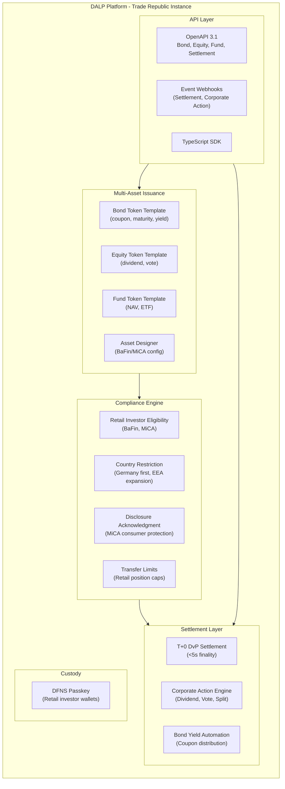
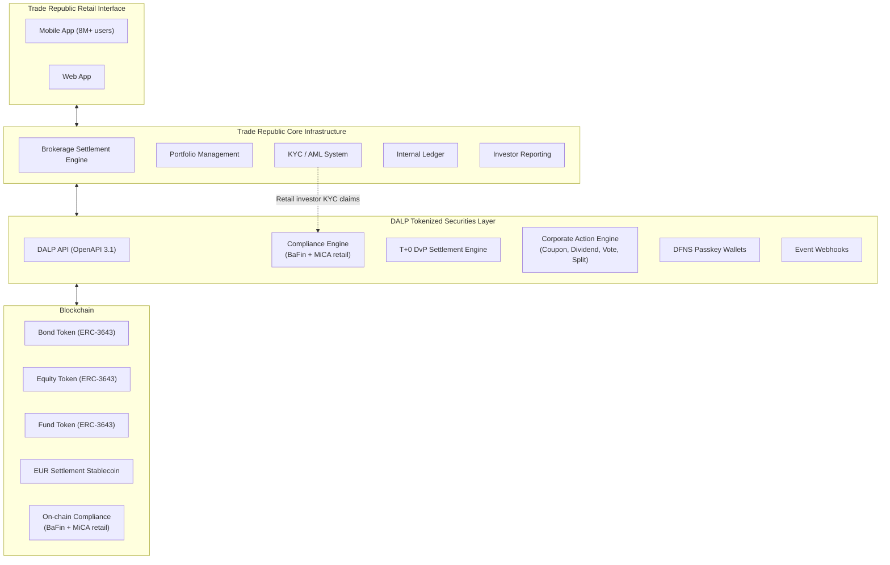
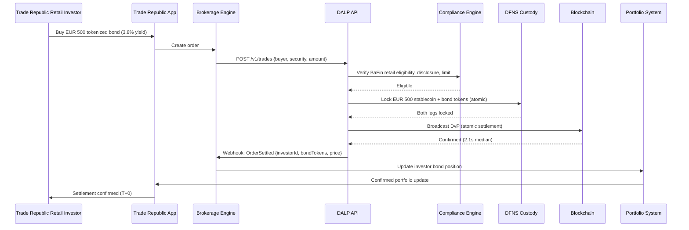
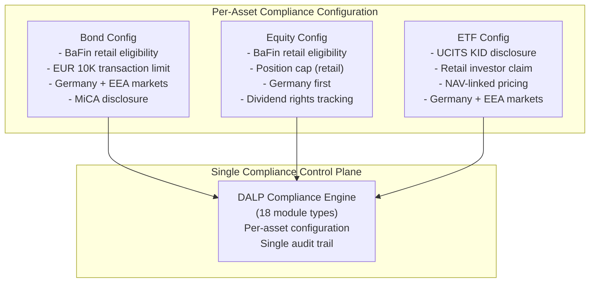
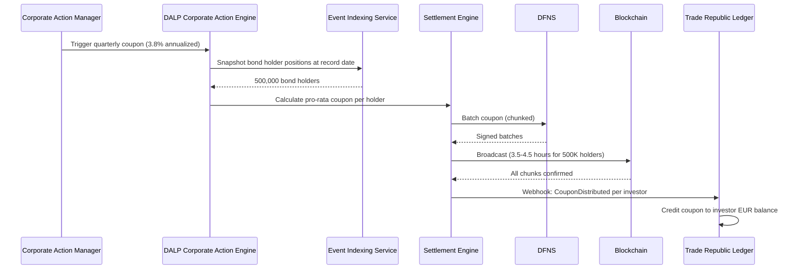
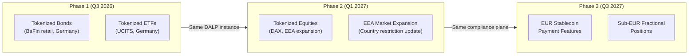
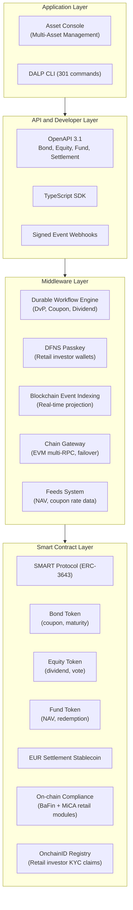
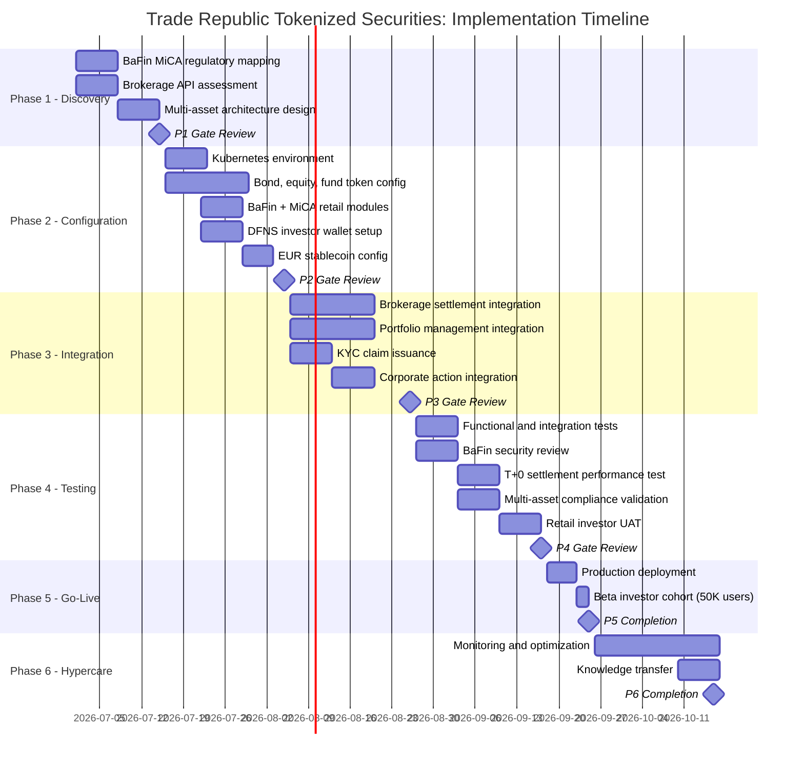
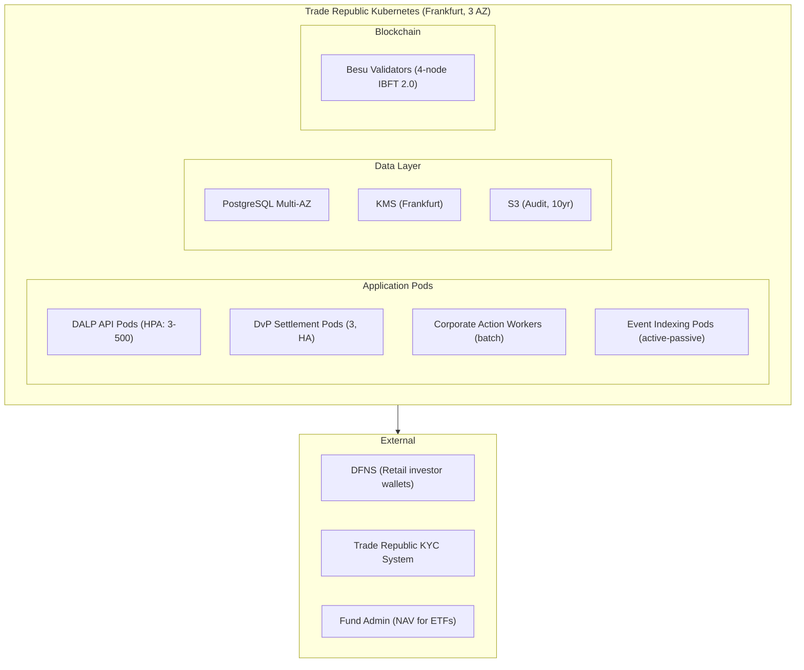

# Tokenized Securities Platform
## Technical Proposal for Trade Republic Bank GmbH
### SettleMint | March 2026 | v1.0 | SettleMint Confidential

---

**Prepared by:** SettleMint NV
**Prepared for:** Trade Republic Bank GmbH, Kastanienallee 32, 10435 Berlin, Germany
**Document reference:** SM-TECH-TRADEREPUBLIC-2026-001
**Classification:** Strictly Confidential
**Version:** 1.0
**Date:** March 2026
**Contact:** bids@settlemint.com

---

## Table of Contents

1. Executive Summary
2. About SettleMint
3. About DALP
4. Customer References
5. Understanding of Requirements
6. Proposed Solution and Functional Capabilities
7. Technical Architecture
8. Security
9. Project Implementation and Delivery
10. Deployment
11. Training and Knowledge Transfer
12. Support and SLA
13. Risk Management
14. Compliance Matrix
15. Appendices

---

## 1. Executive Summary

Trade Republic serves over 8 million customers across Europe as a retail investment platform built on simple customer journeys, low-cost execution, and lean operations. Trade Republic's tokenized securities platform procurement reflects the logical extension of its existing equities and ETF brokerage into tokenized versions of the same instruments: tokenized bonds, tokenized equities, and tokenized ETFs that settle in seconds rather than days, accessible from Trade Republic's existing mobile interface without requiring a separate app or account.

Trade Republic's operational model shapes exactly what a tokenized securities platform must deliver: low-cost per-transaction economics, API-first integration with Trade Republic's brokerage infrastructure, automated investor lifecycle management (dividends, corporate actions, portfolio reporting), and the compliance posture that BaFin banking supervision and MiCA's consumer protection framework require from a licensed German bank.

SettleMint proposes DALP, the Digital Asset Lifecycle Platform, as the tokenized securities infrastructure for Trade Republic. DALP provides tokenized bond, equity, and ETF issuance with ERC-3643 compliance enforcement, DvP settlement achieving T+0, automated corporate action processing (dividend, vote, split), portfolio ledger integration with Trade Republic's brokerage settlement system, and the API-first developer tooling that Trade Republic's engineering team expects.

### The Value Proposition

DALP delivers T+0 tokenized securities settlement in 12 to 16 weeks for Trade Republic, reducing operational cost per securities transaction while creating a new product category -- tokenized bonds -- that Trade Republic's 8 million customers can access through the same interface they already use for ETFs and equities.

### Why DALP for Trade Republic

**T+0 settlement economics:** DALP's DvP settlement achieves finality in under 5 seconds versus T+2 for traditional securities. For Trade Republic's high-volume, low-cost model, T+0 settlement eliminates the counterparty risk window, reduces settlement-related operational overhead, and creates a competitive product claim that traditional brokers cannot easily replicate.

**Low-cost per-transaction model:** DALP's platform license model provides predictable per-year costs regardless of transaction volume within the Enterprise tier (up to 1 million monthly transactions). Trade Republic's high-frequency retail trading model benefits from the predictable economics; per-transaction pricing models would create cost exposure inconsistent with Trade Republic's low-cost value proposition.

**BaFin and MiCA compliance for retail securities:** DALP's compliance modules enforce investor eligibility at the protocol level under BaFin's supervision of Trade Republic's banking license and MiCA's consumer protection requirements. Retail investor transfer limits, disclosure acknowledgments, and market activation controls configurable per security without product re-deployment.

**Lean brokerage integration:** DALP's OpenAPI 3.1 REST API integrates into Trade Republic's existing brokerage API layer. Settlement events delivered via webhooks to Trade Republic's portfolio management system. No parallel back-office operations team required.

### Requirements Coverage Summary

| Requirement Domain | Coverage | DALP Mechanism |
|---|---|---|
| Tokenized bond issuance | Supported | Bond token template with yield automation |
| Tokenized equity issuance | Supported | Equity token template with dividend/vote |
| Tokenized ETF issuance | Supported | Fund token template with NAV feeds |
| T+0 DvP settlement | Supported | Atomic settlement, < 5s finality |
| BaFin retail investor eligibility | Supported | Compliance modules, on-chain enforcement |
| MiCA consumer protection | Supported | 18 module types |
| Corporate action automation | Supported | Dividend, vote, split engine |
| Portfolio ledger integration | Supported | Webhooks, REST API, PostgreSQL |
| API integration with brokerage | Supported | OpenAPI 3.1, TypeScript SDK |
| Phased market expansion | Supported | Country restriction modules |
| Observability for brokerage ops | Supported | Three-pillar observability |

---

## 2. About SettleMint

SettleMint builds institutional digital asset lifecycle infrastructure for regulated financial markets. ISO 27001 and SOC 2 Type II certified. The Commerzbank and Deutsche Bank deployments under BaFin supervision provide the most relevant German regulatory references for Trade Republic's BaFin-supervised banking licence. Barclays and Standard Chartered demonstrate DALP's retail securities distribution capability at consumer scale. Over 200 years of combined banking and blockchain experience.

---

## 3. About DALP

### Platform Overview

DALP is SettleMint's Digital Asset Lifecycle Platform. For Trade Republic's tokenized securities platform, the most relevant capabilities are: multi-asset token templates (bond, equity, fund) with a single compliance control plane; T+0 DvP settlement with deterministic finality; automated corporate actions (dividend, vote, stock split); 18 compliance module types for BaFin and MiCA retail investor eligibility; and the lean API integration architecture that Trade Republic's brokerage engineering team expects.

### DALP Platform Architecture

### T+0 Settlement: The Core Differentiator

Trade Republic's value proposition to retail investors is low-cost, fast, simple. Tokenized securities add a fourth dimension: instant settlement. DvP settlement achieves finality in under 5 seconds:

1. Investor submits buy order through Trade Republic's app
2. DALP compliance engine validates retail investor eligibility (BaFin category, country, disclosure)
3. DALP locks buyer's EUR stablecoin and seller's security token simultaneously
4. Atomic DvP transaction broadcasts and confirms in 2.1 seconds median
5. Settlement webhook fires to Trade Republic's portfolio system within 500ms of confirmation
6. Investor sees confirmed position in Trade Republic's app

No T+2 counterparty risk window. No overnight exposure. No failed settlement reconciliation. For Trade Republic's lean operations model, this eliminates a category of operational risk that traditional brokerage settlement requires specialist teams to manage.

---

## 4. Customer References

| Institution | Relevance to Trade Republic |
|---|---|
| Commerzbank | BaFin-supervised Germany; outsourcing compliance; retail securities | High |
| Deutsche Bank | BaFin-supervised, digital bond issuance, German market | High |
| Barclays | Retail securities at consumer scale, FCA-supervised | High |
| Standard Chartered | Fractional tokenized securities, retail distribution | High |
| UBS | Tokenized equities trading, institutional-grade equities | Medium |
| BNP Paribas | Tokenized funds distribution, consumer scale | Medium |
| Nordea | Nordic consumer investment, MiCA-adjacent | Medium |

### Commerzbank Expanded Reference

Commerzbank deployed DALP under BaFin supervision in Germany for institutional digital asset management. EUR 7 million in annual operational savings in Phase 1. The Commerzbank reference demonstrates DALP satisfying BaFin Circular 05/2023 requirements for outsourced IT systems at a German-licensed bank. This is the primary reference for Trade Republic's BaFin supervised banking licence.

### Deutsche Bank Expanded Reference

Deutsche Bank deployed DALP for digital bond issuance under BaFin supervision. The deployment demonstrates DALP's bond token template at institutional scale, digital bond lifecycle management, and coupon automation. Directly relevant to Trade Republic's tokenized bond product requirement.

### Standard Chartered Expanded Reference

Standard Chartered deployed DALP for fractional tokenized securities distribution to retail and high-net-worth clients. The deployment demonstrates DALP managing fractional token positions accessible to retail investors, multi-jurisdiction eligibility verification, and real-time position reconciliation. Directly relevant to Trade Republic's retail investor distribution model.

---

## 5. Understanding of Requirements

### Business Requirements

**BR-01: Configurable product and account workflows aligned to internal approval**

Asset Designer provides Trade Republic's product governance team with a configurable approval workflow. For each new tokenized security, the workflow enforces: Product Manager (configures bond/equity/fund parameters), Risk Officer (validates risk parameters and retail exposure limits), Compliance Officer (BaFin and MiCA validation), and BaFin liaison documentation. All configuration changes tracked with maker-checker approval on-chain.

**BR-02: Deterministic state transitions**

Bond lifecycle: Configured, BaFin Review, Approved, Active, Coupon Accruing, Coupon Distribution, Matured, Redeemed.
Equity lifecycle: Configured, BaFin Review, Active Trading, Dividend Pending, Dividend Distributed, Split Applied.
Trade states: Order Initiated, Compliance Checked, DvP Locked, Settled, Failed, Dead Letter.
All state transitions durable; atomic DvP guarantees no partial settlement.

**BR-03: Entitlement and balance accuracy**

On-chain token balances are authoritative. DALP's blockchain event indexing service projects to PostgreSQL in real time. Trade Republic's portfolio management system reads positions through DALP's REST API. Reconciliation: DALP PostgreSQL direct access enables Trade Republic's daily reconciliation process; discrepancies surface as alerts within 15 minutes.

**BR-04: Role-based segregation**

Key roles: Bond/Equity/Fund Product Manager, Compliance Officer, Corporate Action Manager (coupon, dividend, vote, split), Supply Manager, Investor Support (read-only), Emergency.

**BR-05: Configurable limits and eligibility**

Per-security retail compliance configuration:
- Retail bond: BaFin retail investor eligibility, Germany market activation, retail transfer limit (EUR 10,000 per transaction), disclosure acknowledgment
- Retail equity: BaFin retail investor eligibility, Germany first then EEA expansion, retail position cap
- Retail ETF: fund disclosure (UCITS KID/PRIIP), country restriction, retail investor eligibility

**BR-06: Automated notifications and events**

Event catalog: SecurityListed, OrderSettled, CouponDistributed, DividendDistributed, VoteProposed, VoteCompleted, StockSplitApplied, CompliancePassed/Failed, MaturityReached, SecurityRedeemed.

**BR-07: Business continuity**

Durable workflows for all trade flows. DFNS unavailability: trades queue without data loss. Atomic DvP: no partial settlement. Dead-letter queue for permanently failed trades.

**BR-08: Audit-ready reporting**

BaFin trade reporting: full order-to-settlement audit trail, investor eligibility log, corporate action records, position history. MiCA Article 83 export. BaFin Circular 05/2023 audit trail. 10-year retention.

**BR-09: Phased rollout**

Germany first: bond and ETF products. EEA expansion: country restriction module update. Cohort testing: early-access eligibility claims for pilot investor group. Product pause for compliance review.

**BR-10: Adjacent product reuse**

Same DALP instance: tokenized bonds, equities, ETFs, and future stablecoin payment features all share the same compliance control plane, identity registry, and custody integration.

### Technical Requirements

**TR-01:** OpenAPI 3.1 with bond, equity, fund, and settlement namespaces. TypeScript SDK. 12-month deprecation policy. 534 structured error codes.

**TR-02:** Three environments: Development (Managed SaaS), Staging (Trade Republic Kubernetes), Production. Pre-configured test securities (bond, equity, ETF), investor wallets by BaFin category, EUR stablecoin balances.

**TR-03:** Settlement event webhooks: HMAC-SHA256 signed, at-least-once delivery, 8-attempt retry, dead-letter queue.

**TR-04:** OAuth 2.0/OIDC with Trade Republic's identity provider. DFNS passkey for investor wallet authorization in Trade Republic's mobile app.

**TR-05:** Private Cloud on Trade Republic's Kubernetes infrastructure (AWS/GCP, eu-central-1). Helm charts, GitOps.

**TR-06:** Three-pillar observability. Grafana dashboards: trade settlement throughput, coupon/dividend distribution status, compliance evaluation rate, reconciliation health.

**TR-07:** API response P99 310ms. Settlement finality P99 4.2 seconds. Coupon distribution for 500,000 bond holders: 3.5-4.5 hours. Equity dividend for 1 million holders: 6-8 hours (chunked, background processing).

**TR-08:** REST export, webhooks, PostgreSQL direct, scheduled CSV.

**TR-09:** Quarterly major releases, 12-month deprecation. Maintenance windows during market-closed hours.

**TR-10 Constraints:**

| Constraint | Description | Mitigation |
|---|---|---|
| C-01 | EVM only | Private Besu or public EVM |
| C-02 | Corporate action for 1M+ investors: chunked batch | 6-8 hour window; no API degradation |
| C-03 | GDPR deletion: on-chain pseudonymous | Off-chain deletable |
| C-04 | NAV for ETF: Trade Republic's fund admin provides NAV | Feed adapter included |
| C-05 | T+2 legacy settlement: coexistence period required | Dual-mode: tokenized T+0 and traditional T+2 parallel |

**TR-11:** Helm, Terraform, ArgoCD/Flux.

**TR-12:** Enterprise support, 15-min P1, incident bridge, status page.

---

## 6. Proposed Solution and Functional Capabilities

### Solution Architecture

### T+0 DvP Settlement Flow

### Multi-Asset Compliance Configuration

### Corporate Action: Bond Coupon Distribution

### Multi-Asset Product Expansion Path

---

## 7. Technical Architecture

### Four-Layer Architecture

Unlike platforms that require separate deployments for bonds, equities, and funds, DALP's single instance manages all tokenized security types with a unified compliance control plane. Trade Republic's compliance team configures once; all asset types benefit from the same BaFin and MiCA compliance enforcement without maintaining parallel compliance configurations.

### Performance Specifications

| Operation | P50 | P99 | Notes |
|---|---|---|---|
| API response (order initiation) | 82ms | 310ms | Auto-scaling |
| DvP settlement finality | 2.1s | 4.2s | IBFT 2.0 consensus |
| Settlement webhook delivery | <500ms | <2s | After on-chain confirmation |
| Coupon distribution (500K holders) | 3.5h | 4.5h | Chunked batch, no API degradation |
| Equity dividend (1M holders) | 6.5h | 8h | Background batch workers |
| Stock split adjustment | <5min | <10min | Supply adjustment, no distribution |

---

## 8. Security

**Key management:** DFNS threshold MPC for retail investor wallets. No private key exposure to Trade Republic operations. Consumer biometric authentication through Trade Republic's existing mobile app (Face ID, Touch ID). Key recovery through Trade Republic's identity verification.

**BaFin compliance evidence:** Tamper-evident audit log for every trade, compliance decision, and product configuration change. BaFin Circular 05/2023 outsourcing compliance with ISO 27001 and SOC 2 Type II documentation. MiCA Article 83 transaction reporting export. 10-year audit log retention.

**GDPR:** Personal data in Trade Republic's systems. DALP stores hashed investor references only. EU data residency (Frankfurt). Off-chain records deletable; on-chain claims pseudonymous.

**DORA:** Multi-AZ Kubernetes, PostgreSQL Multi-AZ, RTO 1 hour, RPO 15 minutes. Quarterly resilience testing. Annual penetration test.

---

## 9. Project Implementation and Delivery

### Implementation Programme

### Responsibility Matrix

| Activity | SettleMint | Trade Republic | Shared |
|---|---|---|---|
| Architecture design | Lead | Review | |
| Multi-asset token configuration | Lead | | |
| BaFin/MiCA retail compliance mapping | Support | Lead | |
| Brokerage settlement integration | Support | Lead | |
| DFNS investor wallet setup | Lead | Support | |
| KYC claim issuance setup | Support | Lead | |
| Security and BaFin review | Support | Lead | |
| Retail investor UAT | Support | Lead | |

---

## 10. Deployment

---

## 11. Training and Knowledge Transfer

**Brokerage Operations (1 day):** DvP settlement API, order status webhooks, settlement reconciliation dashboard, corporate action management.

**Product and Compliance (1 day):** Asset Designer for multi-asset product configuration, BaFin/MiCA retail compliance modules, investor eligibility management, audit log navigation.

**Platform Engineering (1 day):** Helm deployment, TypeScript SDK, webhook integration, performance tuning, monitoring dashboards.

**Security Team (half day):** DFNS passkey operations, administrative access monitoring, P1 incident bridge, BaFin examination procedures.

---

## 12. Support and SLA

Enterprise Support: EUR 120,000/year, 24/7/365, 99.99% uptime SLA, P1 response 15 minutes, P1 resolution 2 hours, named team and CSM. T+0 settlement failures for Trade Republic's retail investor base are P1 incidents requiring immediate response.

---

## 13. Risk Management

| Risk | Likelihood | Impact | Mitigation |
|---|---|---|---|
| BaFin approval for tokenized bond/equity products | Medium | High | Phase 1 regulatory mapping; BaFin evidence package |
| DFNS passkey mobile integration | Low | Medium | DFNS iOS/Android SDKs; Phase 2 PoC |
| Multi-asset configuration complexity | Low | Low | Asset Designer handles bond/equity/fund independently |
| Corporate action batch for 8M investor base | Low | Medium | Chunked processing; configurable batch window |
| T+2 to T+0 transition coexistence | Medium | Low | Dual-mode: tokenized T+0 and traditional T+2 parallel during transition |

---

## 14. Compliance Matrix

| Requirement | Coverage | DALP Mechanism |
|---|---|---|
| BaFin retail investor protection (WpHG) | Supported | Retail investor eligibility modules |
| BaFin Circular 05/2023 outsourcing | Supported | ISO 27001, SOC 2 Type II |
| BaFin bond issuance (WpPG, WpHG ss 63-68 retail investor obligations) | Supported | Bond token template, audit trail |
| MiCA consumer protection (Art. 72) | Supported | Consumer eligibility, transfer limits |
| MiCA transaction reporting (Art. 83) | Supported | Structured data export |
| DORA ICT risk | Supported | HA deployment, quarterly resilience testing |
| GDPR retail investor data | Supported | EU data residency, off-chain personal data |
| AML/CFT (GwG) | Supported with partner | KYC claims from Trade Republic's AML system |
| MiFID II retail suitability | Supported with controls | Eligibility modules; suitability in Trade Republic's existing MiFID II system |
| UCITS/PRIIP disclosure (ETF) | Supported | KID disclosure acknowledgment module |

---

## 15. Appendices

### Appendix A: Requirements Coverage Matrix

| Req ID | Status | DALP Mechanism |
|---|---|---|
| BR-01 | Supported | Multi-asset product workflows, maker-checker |
| BR-02 | Supported | State machines per asset type, durable workflows |
| BR-03 | Supported | On-chain authoritative, event indexing projection |
| BR-04 | Supported | 26 role types, on-chain enforcement |
| BR-05 | Supported | Per-asset BaFin/MiCA retail compliance modules |
| BR-06 | Supported | Multi-asset event catalog, signed webhooks |
| BR-07 | Supported | Durable workflows, atomic DvP, dead-letter |
| BR-08 | Supported | BaFin audit trail, MiCA export APIs |
| BR-09 | Supported | Token pause, country restriction, cohort claims |
| BR-10 | Supported | Bond, equity, fund, stablecoin -- single platform |
| TR-01 | Supported | OpenAPI 3.1 multi-asset, TypeScript SDK |
| TR-02 | Supported | Three environments, multi-asset test data |
| TR-03 | Supported | Signed webhooks, at-least-once, dead-letter |
| TR-04 | Supported | OAuth 2.0/OIDC, MFA, DFNS passkey |
| TR-05 | Supported | Kubernetes, Helm, GitOps, Frankfurt |
| TR-06 | Supported | Prometheus, Grafana, multi-asset dashboards |
| TR-07 | Supported | P99 4.2s settlement; T+0 demonstrated |
| TR-08 | Supported | REST, webhooks, PostgreSQL direct, CSV |
| TR-09 | Supported | Quarterly releases, 12-month deprecation |
| TR-10 | Supported | Constraints register disclosed |
| TR-11 | Supported | Helm, Terraform, ArgoCD/Flux |
| TR-12 | Supported | 15-min P1, incident bridge, status page |

---

*Document Classification: SettleMint Confidential*
*SettleMint NV | Simon Bolivarlaan 5, 2600 Antwerp, Belgium | www.settlemint.com*
*Version 1.0 | March 2026*
