# Technical Proposal
# Digital Bond Platform For Wholesale And Treasury Issuance
## FirstRand
## Submission Date: 15 March 2026
## Version: 1.0
## Confidentiality: SettleMint Confidential

---

# Executive Summary

## Client context and strategic drivers
FirstRand has framed **digital bond platform for wholesale and treasury issuance** as a controlled production initiative rather than a blockchain experiment. The RFP makes that clear. The evaluation team is testing whether a supplier can operate inside institutional reality: governance delays, incomplete onboarding packs, sanctions and AML dependencies, audit evidence requests, service-management expectations, and phased adoption without hidden operational debt. That is the right test.

SettleMint proposes DALP as the operating platform for that target state. DALP is built for regulated digital asset lifecycles rather than for isolated token issuance. It combines issuance, compliance enforcement, identity and access control, custody integration, settlement orchestration, reporting, and operational observability in one governed platform layer. For FirstRand, that matters because the programme will only succeed if front-office ambitions, control functions, and infrastructure operations all line up in the same architecture.

## Why this programme is hard
The hard part is not creating a token. The hard part is doing it with institutional controls intact. FirstRand is asking for a production platform that can translate policy into enforceable workflows, fit into existing identity and banking infrastructure, survive operational exceptions, and preserve evidence for audit and regulators. That is exactly the gap DALP is built to close.

## Proposed response
We recommend a phased rollout based on DALP running as a regulated digital asset control plane with the following characteristics:
- DALP as the central lifecycle platform for issuance, transfer, servicing, and retirement.
- ERC-3643 based digital asset contracts with configurable compliance modules.
- Integration to existing identity, AML, custody, reporting, observability, and books-and-record systems.
- Controlled support for either permissioned EVM or approved public EVM infrastructure, depending on governance and market-access decisions.
- A phased implementation model that starts with the priority digital bond platform for wholesale and treasury issuance operating model, then expands into broader product and participant coverage once controls are proven.

## Why SettleMint and why DALP
SettleMint's position is simple: institutional tokenisation is hard because control, compliance, and operations are hard. DALP is designed around that fact. The platform supports multi-asset lifecycle management, ex-ante compliance, configurable deployment models, bring-your-own-custodian integration, typed APIs and SDKs, and enterprise observability. That combination is the difference between a pilot-friendly stack and a platform a bank can own in production.

# Proposal Basis and Client Interpretation
## Procurement interpretation
The following themes appear consistently across the RFP and shape our response:


### 1.1 Institutional Context

FirstRand is treating digital bond platform for wholesale and treasury issuance as a business-
critical capability that must be implemented with the same discipline applied to core regulated
systems. The solution under consideration will be expected to operate inside a control environment
shaped by business ownership, architecture standards, security review, legal interpretation,
compliance sign-off, and internal audit expectations. This is not a speculative innovation exercise.
It is a procurement intended to test whether the market can supply a dependable platform and
implementation model for the target operating state.

The buyer's review team will therefore look beyond product feature lists. It will test whether
bidders can explain how the platform behaves when confronted with real-world operational pressure:
incomplete onboarding data, limit breaches, approvals delayed by governance, partner outages,
regulatory evidence requests, bulk corrections, data retention obligations, and phased rollout
constraints. Responses should be written for that audience. The strongest submissions will show
operational self-awareness rather than abstract confidence.

Regional conditions in South Africa also matter. The buyer expects bidders to anchor their response
in actual market infrastructure and supervisory realities, including the pace of domestic policy
development, the role of regulated intermediaries, and the practical limits of cross-border
interoperability. References to initiatives such as Project Aber, Digital Dirham work, Project
Khokha, sandbox programmes, exchange modernisation, or trade digitisation are welcome when they
sharpen the response, but they should not be used as substitutes for explicit control design.

The solution must fit into a broader enterprise stack. That means integration to identity services,
ledger or books-and-record systems, sanctions and AML tooling, reporting environments, service-
management processes, observability layers, and operational runbooks. The buyer is not looking for
an isolated digital-asset island. It wants a platform that can sit inside institutional plumbing
without creating hidden operational debt or unowned responsibilities.

### 1.2 Procurement Objectives

The first objective is to identify a platform and supplier capable of supporting digital bond
platform for wholesale and treasury issuance in live operation, not just in a demonstration setting.
The buyer wants confidence that the selected solution can sustain growth in users, volumes,
products, and audit scrutiny without fundamental rework.

The second objective is to understand the operating model implied by each response. FirstRand needs
to know which activities are automated, which are configurable, which require manual oversight, and
which depend on external partners, regulated intermediaries, or internal teams. A response that
treats those matters as afterthoughts will score poorly because the implementation burden is part of
the procurement decision.

The third objective is commercial and governance clarity. The buyer requires transparent pricing,
defined assumptions, realistic delivery sequencing, and early visibility into contractual
deviations, liability positions, data handling boundaries, and supplier concentration risks.

### 1.3 Assumptions/Exclusions

The buyer assumes it will remain accountable for business policy, product approval, regulatory
engagement, and ultimate control ownership. The selected bidder is expected to supply product
capability, documentation, implementation support, and operational guidance, but not to stand in as
the regulated decision-maker.

This RFP excludes open-ended bespoke development unless expressly identified and priced. If the
bidder believes a critical feature cannot be delivered through current capability or controlled
configuration, that fact must be disclosed directly together with cost, time, and risk consequences.

The buyer also excludes unsup

## Scope interpretation
SettleMint interprets the requested scope as a programme spanning platform setup, product configuration, compliance design, integration, testing, go-live control, and transition to stable operations. The response below focuses on the operational target state, not marketing language.


## Solution Architecture Visuals

### Figure 1. Platform architecture for FirstRand
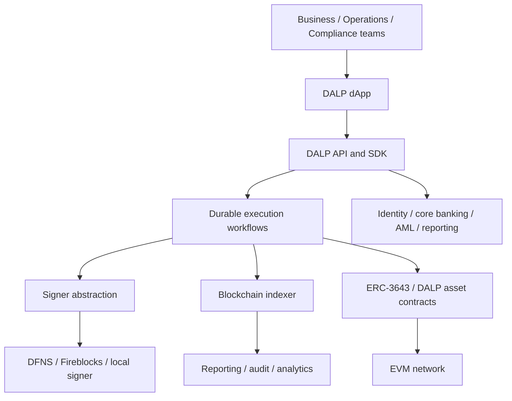

### Figure 2. Asset lifecycle control model
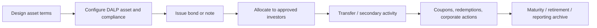

### Figure 3. Token issuance flow
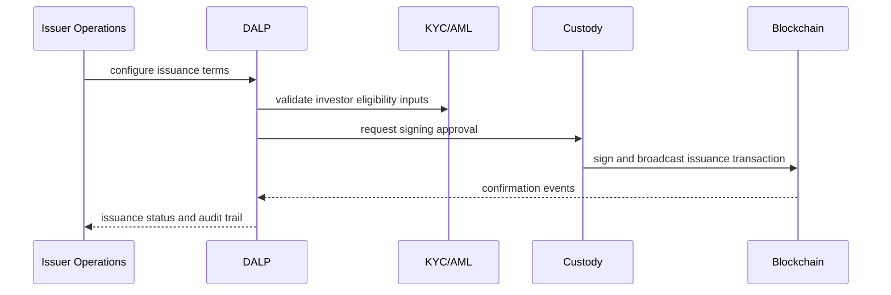

### Figure 4. Compliance enforcement
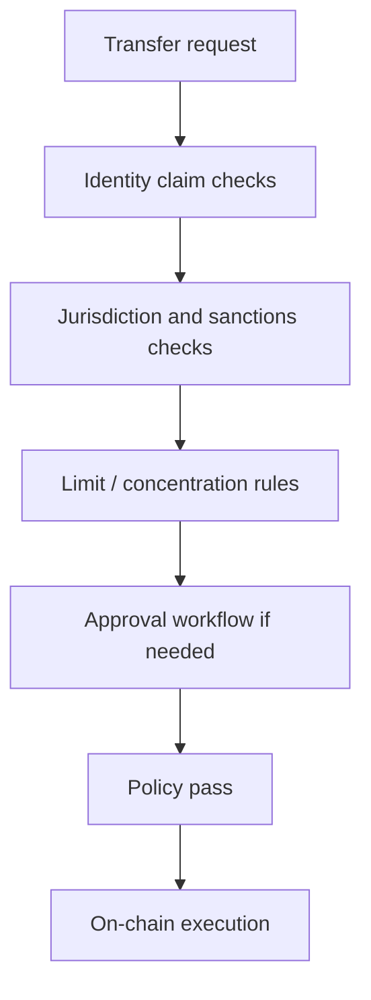

### Figure 5. Settlement flow
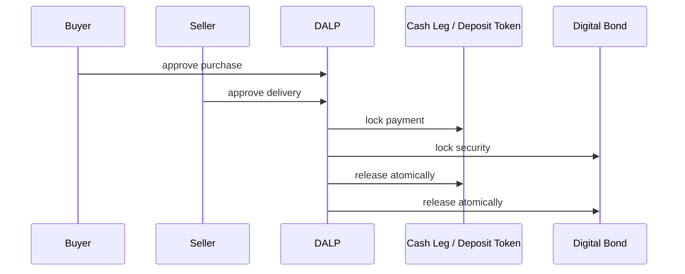

### Figure 6. Deployment topology
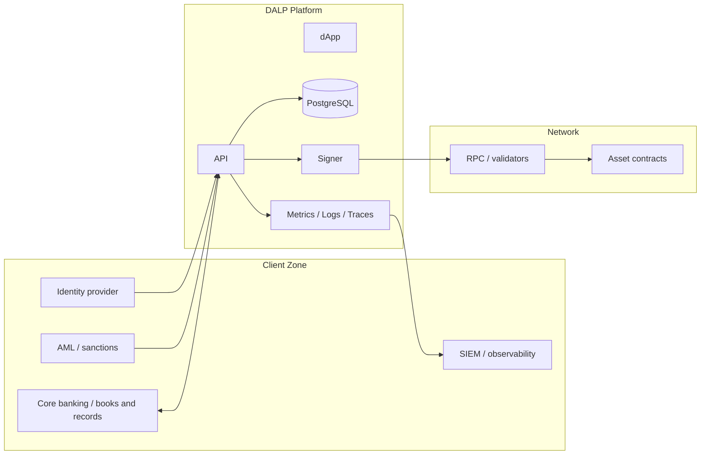

### Figure 7. Integration map
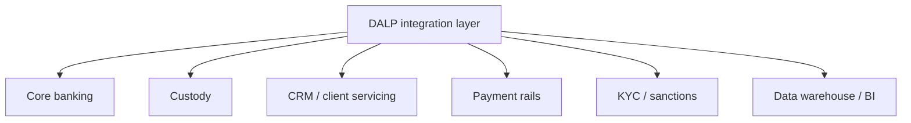

### Figure 8. Data flow and reporting
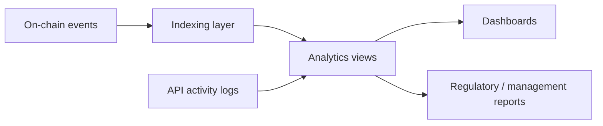

### Figure 9. Security model
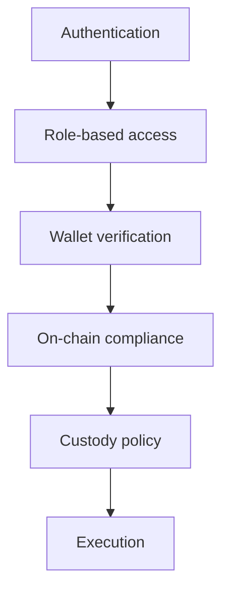

### Figure 10. Implementation timeline
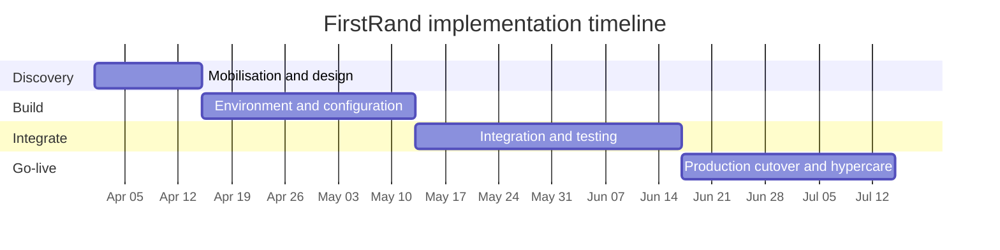


# Solution Overview
## Target operating model
For FirstRand, DALP should be positioned as the orchestration layer between client channels, operational users, identity and compliance controls, custody approval flows, and blockchain execution. The platform does not require the bank to replace its enterprise stack. It requires the bank to decide which systems remain authoritative for client records, sanctions screening, treasury accounting, and reporting, then connect those systems through DALP's API, SDK, event, and workflow surfaces.

## Institution-specific design choices
The recommended baseline for FirstRand is:
- use DALP asset templates and configurable lifecycle features for digital bond platform for wholesale and treasury issuance;
- enforce investor and transfer rules through configurable compliance modules rather than manual exception checking;
- integrate custody policy through DFNS or Fireblocks where segregation of duties and approval controls are already embedded;
- integrate with identity, AML, and books-and-record platforms so the digital asset programme sits inside existing enterprise control structures;
- instrument the full lifecycle with dashboards, traces, logs, and audit outputs so operations and internal audit can see how the programme behaves.

# Regulatory and Market Context
# South Africa

Last updated: March 2026

**Country:** South Africa
**Regulatory Authority:** Financial Sector Conduct Authority (FSCA), South African Reserve Bank (SARB), Financial Intelligence Centre (FIC)

## Key Regulations

### Declaration of crypto assets as financial products under FAIS
- **Date enacted / effective:** Declared October 2022; licensing followed 2023 onward
- **Summary:** South Africa brought crypto assets into the FAIS framework, requiring many service providers to become licensed financial services providers. This gave the market a formal conduct regime without needing an entirely new crypto statute.
- **Scope:** Advice, intermediary services, conduct supervision for crypto assets.

### AML amendments under FIC Act
- **Date enacted / effective:** Applied to crypto asset service providers from 2023
- **Summary:** Crypto service providers became accountable institutions for AML/CFT purposes, with obligations around customer due diligence, sanctions screening, risk assessments, and suspicious transaction reporting.
- **Scope:** AML/KYC, reporting, sanctions, risk management.

### Intergovernmental fintech and prudential work
- **Date enacted / effective:** Ongoing through 2024-2025
- **Summary:** South African authorities continue refining the treatment of stablecoins, tokenization, and prudential questions. The market is regulated enough for enterprise deployment, but still evolving in depth.
- **Scope:** Stablecoins, prudential treatment, tokenization, market development.

## Licensing Requirements
Crypto asset service providers generally need FSCA licensing as FSPs for covered activities, plus FIC registration/compliance. Banking, payments, or securities activities may require additional analysis and permissions.

## Taxonomy
South Africa defines crypto assets broadly as digital representations of value tradable electronically. The conduct regime is activity-based, while securities and payment questions are handled separately.

## Key Compliance Requirements
AML/KYC, reporting, fit-and-proper requirements, disclosure, complaints handling, safeguarding, and governance are essential. Enterprise buyers also value strong auditability and bank-integration readiness.

## Recent Developments
2024-2025 has focused on onboarding licensed providers into steady-state supervision and exploring future rules for stablecoins and broader tokenization. South Africa is the most mature mainland African market for regulated crypto operations.

## Impact on RFP/Procurement
South African procurement typically emphasizes licensing evidence, AML capability, and the ability to serve both financial-advice/intermediation and custody/transaction workflows. Platforms that look institution-ready will outperform consumer-first stacks.


# Platform Architecture
# Section 2: Platform Architecture

## 2.1 Architectural Overview

DALP (Digital Asset Lifecycle Platform) is built as a four-layer stack. Each layer has a distinct responsibility boundary, and layers communicate through well-defined interfaces. Lower layers enforce stricter invariants; upper layers provide flexibility and user-facing abstraction.

| Layer | Role | Key Components |
|-------|------|----------------|
| **Application** | User-facing interfaces for operators, issuers, and compliance officers | Asset Console (web UI) |
| **API** | Programmatic access surface for external systems and integrations | Unified API (OpenAPI 3.1), TypeScript SDK (@settlemint/dalp-sdk) |
| **Middleware** | Workflow orchestration, transaction lifecycle, key management, indexing | Execution Engine, Key Guardian, Transaction Signer, Contract Runtime, Chain Indexer, Chain Gateway, Feeds System |
| **Smart Contract** | On-chain enforcement of compliance, identity, and asset logic | SMART Protocol (ERC-3643), DALPAsset contracts, compliance modules, token features, addons |

Requests flow top-down through these layers. A user action in the Asset Console triggers an API call, which the middleware orchestrates into one or more blockchain transactions, which the smart contract layer validates and executes on-chain. Each layer independently enforces its own security controls, so no single-layer failure grants unauthorized access.

---

## 2.2 Smart Contract Layer

### 2.2.1 SMART Protocol Foundation (ERC-3643)

All DALP smart contracts are built on the **SMART Protocol** (SettleMint Adaptable Regulated Token), an implementation of the ERC-3643 standard. ERC-3643 defines a specification for regulated security tokens where every transfer must pass through a modular compliance engine before execution.

SMART Protocol provides three foundational sub-layers:

- **Token**: ERC-20 compatible contracts with compliance hooks and a modular extension system. External systems (wallets, exchanges, indexers) interact through standard ERC-20 and ERC-3643 interfaces.
- **Compliance**: An orchestration engine that evaluates a configurable set of transfer rules before each transaction. Rules are modular and can be added, removed, or reconfigured at runtime without redeploying the token contract.
- **Identity**: On-chain identity management via OnchainID (ERC-734/735), storing verifiable KYC/AML claims. Identity verification is enforced on-chain as a prerequisite for transfers.

ERC-3643 was chosen over ERC-1400 for its modular compliance engine, on-chain identity integration through OnchainID, and active ecosystem support.

### 2.2.2 Five-Layer On-Chain Architecture

The on-chain side of DALP follows a layered architecture where each level builds on the one below it. Lower layers are more stable and shared; upper layers are more asset-specific and change more frequently.

| Layer | Purpose | Key Components |
|-------|---------|----------------|
| **SMART Protocol** | ERC-3643 token framework with modular compliance, identity management, and extension system | Core token interfaces, compliance engine, identity registry |
| **Global** | Platform-wide infrastructure shared across all system instances on a given chain | Central directory, identity factory, identity implementations |
| **System** | Per-system infrastructure managing identity registration, compliance, and access control | Identity registry, compliance orchestration, access manager, factory registries |
| **Assets** | Production-ready tokenized financial instruments | DALPAsset (configurable), plus legacy types: Bond, Equity, Fund, Deposit, StableCoin, RealEstate, PreciousMetal |
| **Addons** | Operational tools extending assets with distribution, settlement, and treasury capabilities | Airdrop (push, merkle-drop, vesting), Vault (multi-sig treasury), XvP Settlement (atomic DvP), Token Sale (DAIO), Yield |

A request flows top-down through this stack: an addon or API call triggers an operation on an asset, the asset delegates identity and compliance checks to the system layer, the system resolves implementations through the global directory, and the SMART Protocol executes the compliant state change.

### 2.2.3 DALPAsset: The Configurable Contract

DALPAsset is the recommended contract type for all new tokenization projects. It extends the SMART Protocol with the SMARTConfigurable extension, allowing token features and compliance modules to be attached and reconfigured at runtime, after deployment.

This design eliminates the need to commit to a specialized contract type at deployment time. A DALPAsset token can evolve: start as a simple bearer instrument, then have fee structures added, governance enabled, or maturity and redemption logic configured, all without redeploying the contract.

**Runtime-pluggable token features** integrate through six lifecycle hooks (mint, burn, transfer, redeem, update, attach) via the ISMARTFeature interface. Verified available features include:

- Historical balances
- Voting power
- Permit (gasless approvals)
- AUM fee
- Maturity and redemption
- Fixed treasury yield
- Transaction fee (with multiple variants: standard, accounting, external)
- Conversion and conversion-minter

**Compliance modules** enforce transfer and supply rules through the ERC-3643 compliance engine. Modules can be added, removed, or reconfigured at runtime. Documented module types include identity verification, country restrictions, identity allow/deny lists, supply and investor limits, supply cap and collateral requirements, transfer approval workflows, and timelock restrictions.

All configuration changes require the GOVERNANCE_ROLE. Multi-signature or timelock governance is recommended for production deployments.

### 2.2.4 UUPS Proxy Upgrade Pattern

DALPAsset contracts are deployable as either upgradeable (using the UUPS proxy pattern) or immutable. Under the UUPS (Universal Upgradeable Proxy Standard) pattern:

- The proxy contract holds the state (token balances, compliance configuration, identity data) and delegates all calls to an implementation contract.
- Upgrade logic lives in the implementation contract itself, not in the proxy. This means the implementation must explicitly authorize upgrades, preventing unauthorized contract replacement.
- Upgrades replace the implementation address in the proxy while preserving all on-chain state. Token addresses remain stable across upgrades.
- The choice between upgradeable and immutable deployment is made at factory creation time. Immutable deployment is available for regulatory or legal frameworks that require compile-time guarantees.

Switching between upgradeable and immutable deployment affects proxy behavior but does not change the factory deployment sequence.

### 2.2.5 CREATE2 Deterministic Deployment

All asset types are deployed through a factory pattern using CREATE2, which provides deterministic contract addressing:

1. The factory receives a createAsset call and deploys a proxy via CREATE2 with a deterministic address derived from the deployment parameters.
2. The factory registers an OnchainID identity contract for the token.
3. The proxy is initialized with the identity and delegates to the implementation contract.
4. Required system roles are assigned and a TokenDeployed event is emitted for indexing.

The factory transaction is atomic. If any step fails, the entire deployment reverts. No partially deployed tokens can exist on-chain.

**Key invariants enforced by the factory:**

- CREATE2 determinism: token addresses are predictable from deployment parameters. The same parameters always produce the same address.
- Initialization order: identity must be set before compliance, compliance before transfers are enabled.
- Role completeness: all required roles are assigned atomically. If any assignment fails, the entire deployment reverts.

**Administrative controls** are built into every asset through the Custodian extension, supporting forced transfers (for court orders, inheritance, regulatory seizures), account freezing (full or partial), token recovery (two-step identity recovery for lost keys), and batch operations for operational efficiency. All custodian actions emit events for auditability.

---

## 2.3 Middleware Layer

The middleware layer sits between the API surface and the blockchain networks. It handles the operational complexity of blockchain interaction: workflow orchestration, cryptographic key management, transaction signing, event indexing, and multi-network routing.

These services are internal to the platform. External consumers never interact with them directly.

### 2.3.1 Core Infrastructure Services

| Service | Responsibility |
|---------|---------------|
| **Execution Engine** | Reliable workflow orchestration with persistent state and exactly-once semantics, built on Restate. All stateful operations run through durable workflows that survive infrastructure failures, process restarts, and network partitions. |
| **Key Guardian** | Secure cryptographic key storage with HSM and cloud KMS integration (AWS, Azure, GCP). Manages key generation, storage, and rotation. |
| **Transaction Signer** | Transaction preparation, gas estimation, nonce management, and signing. Supports EIP-1559 gas pricing and meta-transactions (ERC-2771). |
| **Contract Runtime** | Smart contract interaction layer handling ABI encoding/decoding, call routing, and event parsing. |
| **Chain Indexer** | Blockchain event processing, data translation, and queryable state projection. One indexer virtual object per chain ID. |
| **Chain Gateway** | Multi-network connectivity with failover and load balancing across RPC providers. |
| **EVM RPC Node** | Blockchain network access for transaction submission and state queries. |
| **Feeds System** | Trusted market data feeds for pricing, NAV calculations, and reference data with configurable sources. |

### 2.3.2 Transaction Processing Architecture

DALP treats transaction management as a first-class runtime capability with dedicated services:

- **Nonce coordination**: A Restate-backed virtual-object service serializes nonce allocation per address and chain ID. It performs atomic consume-and-broadcast for local signer flows and includes self-healing behavior for nonce conflicts (re-reads on-chain state, advances, and retries up to three times before surfacing a terminal error). Operator repair surfaces are explicit: sync with on-chain state, reset, force-set, and full history.
- **External signer abstraction**: A provider-agnostic service normalizes wallet creation, signing, and approvals across local, DFNS, and Fireblocks custody backends. Provider health is a first-class concern with dedicated health-check APIs.
- **Transaction processor**: A partition-locked Restate virtual-object service that owns queued transaction submission, broadcast branching (local vs. provider-native), confirmation polling, reconciliation, and cancellation via replacement-by-fee. It appends ERC-8021 attribution to transactions for on-chain provenance tracking.

### 2.3.3 Authentication and Authorization Middleware

The middleware chain converts authenticated HTTP requests into tenant-scoped, permission-aware operation contexts:

- **Session and API key resolution**: Supports browser sessions (via Better Auth) and organization-scoped API keys. Endpoints can restrict which authentication methods are accepted. Read-only API keys are scope-enforced.
- **Organization role synchronization**: On-chain access-control state is synchronized into organization membership roles at sign-in time, so off-chain platform permissions stay aligned with chain-authoritative role assignments.
- **System context hydration**: Resolves the active system instance, validates bootstrap readiness, and derives user-specific permissions from on-chain roles into a reusable request-scoped projection.
- **Token context gating**: Resolves token-specific access, derives caller actions from on-chain roles and

# Integration Architecture
# Integration Architecture

## Executive Summary

One of the most underestimated aspects of doing tokenization right at production scale is integration, connecting digital asset infrastructure to existing core systems, custody relationships, payment rails, and operational workflows. DALP is designed to operate **within** existing institutional environments, not replace them. The platform provides comprehensive integration surfaces. REST APIs, typed SDKs, event indexing, CLI tooling, server-sent event streaming, that enable programmatic access to every platform capability. Payment rail connectivity supports ISO 20022 standards. Bring-your-own-custodian integrations (Fireblocks, DFNS) and bring-your-own-chain flexibility (any EVM-compatible network) mean institutions adopt DALP without disrupting existing vendor relationships or navigating the complexity of assembling production-grade infrastructure from scratch.

This section covers the full integration surface: how external systems connect to DALP, how DALP connects to external infrastructure, and the architectural patterns that make these integrations production-grade.

---

## 1. DAPI: The Durable API Service

### 1.1 What DAPI Is

DAPI (Durable API Service) is DALP's unified API layer, the single programmatic surface through which all platform operations are accessed. It is not a thin wrapper around smart contracts; it is a full middleware stack that transforms authenticated HTTP requests into tenant-scoped, permission-aware, execution-ready operations.

DAPI is built on **oRPC**, a type-safe RPC framework that provides automatic OpenAPI documentation, schema validation via Zod, custom serializers for blockchain-specific types (BigInt, BigDecimal, Timestamp), and streaming support for long-running operations. The API follows RESTful conventions with POST for mutations, GET for queries, and standardized error codes.

DAPI serves two distinct endpoints with different authentication models:

| Endpoint | Authentication | Consumer | Scope Enforcement |
|----------|---------------|----------|-------------------|
| `/api/rpc` | Session/cookie only | DALP dApp frontend (browser) | N/A (session-bound) |
| `/api/v2` | API keys (HTTP-method-scoped) | SDK, CLI, backend integrations, CI pipelines | GET/HEAD/OPTIONS for read-only keys; all methods for read-write keys |

This is a **hardened security boundary**: API keys are explicitly blocked on the RPC endpoint. If a programmatic consumer attempts to authenticate with an API key on `/api/rpc`, DAPI returns a `FORBIDDEN` error instructing them to use the REST endpoint instead.

The separation exists because oRPC uses POST for all procedure calls, reads and writes alike, making HTTP method unreliable for scope enforcement on the RPC endpoint. The REST endpoint maps HTTP methods correctly (GET for queries, POST for mutations), enabling proper read-only vs. read-write API key scope enforcement via `assertScopeAllowed(httpMethod, scope)`.

### 1.2 REST API Namespaces and Endpoint Coverage

DAPI exposes a comprehensive REST API at `/api/v2` covering every DALP domain. The API is organized by procedure namespace rather than REST resource conventions, reflecting how operators think about platform capabilities:

| Namespace | Capabilities | Example Procedures |
|-----------|-------------|-------------------|
| `token` | Asset lifecycle operations | `token.create`, `token.mint`, `token.burn`, `token.transfer`, `token.freezeAddress`, `token.pause` |
| `system` | Platform infrastructure | `system.accessManager.grantRole`, `system.identity.register`, `system.trustedIssuers.create` |
| `user` | User management | `user.me`, `user.update`, `user.stats`, `user.statsGrowthOverTime` |
| `account` | Wallet operations | `account.identity`, `account.claims` |
| `transaction` | Transaction status tracking | `transaction.read` |
| `actions` | Scheduled tasks and operations | `actions.list`, `actions.read` |
| `addons` | Optional features | `addons.tokenSale.create`, `addons.fixedYield.configure`, `addons.xvp.*`, `addons.vault.*` |
| `contacts` | Address book management | `contacts.list`, `contacts.create` |
| `exchangeRates` | Multi-currency support | `exchangeRates.list`, `exchangeRates.convert`, `exchangeRates.sync` |
| `search` | Global search | `search.query` (across tokens, contacts, transactions) |
| `settings` | Platform configuration | `settings.get`, `settings.update`, asset class definitions |
| `externalToken` | External asset registration | `externalToken.register`, `externalToken.list` |
| `admin` | Organization management | Organization CRUD, user administration |
| `identityRecovery` | Identity recovery workflows | Recovery preview, execute, status tracking |
| `monitoring` | Operational health | API health, blockchain health, logs, snapshots, streaming |
| `auth` | Better Auth endpoints | `/auth/sign-in`, `/auth/session`, `/auth/passkey/create` |

Each namespace is prefixed in the API path. For example, `token.create` maps to `POST /api/token/create`.

### 1.3 Interactive Documentation and OpenAPI Specification

The Unified API delivers **OpenAPI 3.1 specifications** generated directly from procedure definitions, ensuring documentation stays synchronized with implementation. Interactive exploration is available through Swagger UI at `/api`, enabling integration engineers to authenticate, construct requests, and execute procedures directly from the documentation interface.

The OpenAPI specification includes:
- **Endpoint definitions**: all available routes organized by namespace
- **Request schemas**: parameter types, validation rules, required fields
- **Response schemas**: return types for successful responses and error codes
- **Authentication**: security scheme using the `X-Api-Key` header
- **Examples**: sample requests and responses for common operations

The specification is available at `/openapi.json` and can be imported directly into Postman, Insomnia, Redoc, or any OpenAPI-compatible tooling. This enables standard enterprise API governance workflows where API consumers can auto-generate client libraries in any language.

### 1.4 oRPC Contract Architecture and Type Safety

DAPI's API surface is defined as a typed oRPC contract (`rpcContract = v2Contract`), which means:

- **Every endpoint has a typed schema**: Request parameters, response shapes, and error types are defined at the contract level using Zod schemas. Unknown fields, missing parameters, and type mismatches are caught at the schema layer before business logic executes.
- **Contract errors are structured**: 534 auto-generated error codes from Solidity ABIs, each with 4-byte selectors, severity levels, audience targeting, retryability flags, and i18n translations across 4 locales (en-US, de-DE, ar-SA, ja-JP). Blockchain revert reasons surface as structured DALP contract errors rather than opaque revert blobs.
- **OpenAPI generation is automatic**: The v2 contract generates a full OpenAPI specification. No manual synchronization between implementation and documentation is required.
- **Validation is deterministic**: Schema validation runs before business logic execution, preventing malformed requests from consuming gas or triggering unintended side effects.

Error responses follow a consistent JSON structure across all procedures:

```json
{
  "code": "USER_NOT_AUTHORIZED",
  "status": 403,
  "message": "User does not have the required role to execute this action.",
  "data": {
    "requiredRoles": ["SUPPLY_MANAGEMENT_ROLE"]
  }
}
```

The error reference includes machine-readable codes (SCREAMING_SNAKE_CASE), HTTP status codes, human-readable descriptions, and optional context data. Blockchain-specific errors include transaction details: gas estimation failures, revert reasons, and nonce conflicts surface as structured error responses.

### 1.5 Transaction Queue and Async Operations

DAPI v2 mutations support three execution modes, negotiated through RFC 7240 `Prefer` headers:

| Mode | Header | Behavior |
|------|--------|----------|
| **Synchronous** | `Prefer: respond-sync` | Blocks until transaction confirms on-chain |
| **Asynchronous** | `Prefer: respond-async` | Returns HTTP 202 with `statusUrl` for polling |
| **Hybrid** | Default | Server decides based on expected execution time |

Transaction speed can be further controlled via `X-Transaction-Speed` headers. The server acknowledges the honored mode through a `Preference-Applied` response header.

All v2 blockchain mutations flow through DALP's **async transaction request pipeline**: an 11-state lifecycle managed by Restate durable workflows:

```
created → queued → submitted → broadcasting → pending → confirming →
    confirmed (success) │ failed │ cancelled │ expired │ replaced
```

This means:
- Every mutation is **idempotent** (same request produces the same result, enforced via `Idempotency-Key` headers)
- Every mutation is **durable** (survives process restarts via Restate persistent state machines)
- Every mutation is **auditable** (full state-transition history in `transaction_request` table with BRIN index on `created_at` for efficient time-ordered audit access)
- Transaction status can be polled via the `statusUrl` returned in async responses

Multi-transaction operations (e.g., system creation with compliance modules) return all transaction hashes as a comma-separated list in the `X-Transaction-Hash` header, ordered by execution sequence. If a timeout occurs, it applies to the last hash, all preceding transactions completed successfully.

### 1.6 Retry Strategy and Error Recovery

DAPI provides structured guidance for integration resilience:

| Error Category | HTTP Status | Retry? | Action |
|----------------|-------------|--------|--------|
| Validation errors | 400 | No | Fix request payload |
| Authentication failures | 401 | No | Reauthenticate |
| Authorization denied | 403 | No | Check role permissions |
| Resource not found | 404 | No | Verify identifier |
| Rate limited | 429 | Yes | Retry after delay |
| Server errors | 500 | Yes | Retry with exponential backoff (1s, 2s, 4s) |
| Confirmation timeout | 504 | No | Check transaction status via `X-Transaction-Hash` before retrying |

Key principle: **never retry a `CONFIRMATION_TIMEOUT`** without first checking whether the original transaction succeeded on-chain. Blockchain transactions are not automatically idempotent at the network level, and blind retries can create duplicate transactions. The `transaction.read` endpoint enables status verification before any retry decision.

### 1.7 Middleware Chain

Every DAPI request passes through a layered middleware chain that progressively enriches request context:

1. **Session Resolution** (`sessionMiddleware`): Loads auth from request headers via Better Auth, differentiates browser sessions from API keys, enforces endpoint-level auth-method constraints
2. **Auth Enforcement** (`authMiddleware`): Requires authenticated user, emits `X-User-Id` and optional `X-Organization-Id` response headers for metrics capture
3. **Organization Role Sync** (`orgRoleSyncMiddleware`): Synchronizes on-chain access-control state into organization membership roles at request time
4. **System Context Hydration** (`systemMiddleware`): Resolves tenant system address, checks bootstrap readiness, derives user permissions from on-chain roles, projects identity status and country into context. Caches per `sessionId:systemAddress:userAddress` to prevent redundant queries.
5. **Token Context** (`tokenMiddleware`, for token operations): Resolves token metadata, computes caller actions from roles and trusted-issuer claims, enforces required token interfaces
6. **Wallet Verification** (`walletVerificationMiddleware`, for sensitive mutations): Step-up verification via PIN, OTP, or secret codes. Bypassed for API key sessions.
7. **Transaction Queue** (`transactionQueueMiddleware`): Negotiates execution mode and transaction speed from request headers

This is not a fl

# Security and Control Architecture
# Section 5: Security Architecture

## Executive Summary

DALP treats security as a structural property of the platform, not an afterthought bolted onto the application layer. The architecture enforces defense-in-depth across five independent control layers: identity verification, role-based access control, transaction-level wallet verification, on-chain compliance enforcement, and custody provider policy evaluation. No single-layer failure grants unauthorized access to digital assets.

SettleMint holds ISO 27001 and SOC 2 Type II certifications, confirming that security controls are not just designed but independently audited and continuously maintained.

This section covers authentication and authorization, key management, smart contract security, network and data protection, operational security, compliance certifications, penetration testing, and disaster recovery.

---

## 1. Authentication

### 1.1 Authentication Methods

DALP uses Better Auth for identity management, supporting multiple authentication methods appropriate to different operational contexts.

| Method | Use Case | Status |
|--------|----------|--------|
| Email and password | Standard operator and user access | Active |
| Passkeys (WebAuthn) | Hardware security keys, platform authenticators (Face ID, Touch ID, Windows Hello) | Active |
| LDAP / Active Directory | Corporate directory integration | Available via plugin |
| OAuth 2.0 / OIDC | Okta, Auth0, Azure AD integration | Available via plugin |
| SAML 2.0 | Legacy enterprise SSO | Available via plugin |

Passkeys provide phishing-resistant authentication. They are cryptographically bound to the origin domain, eliminate shared secrets, and support biometric verification on compatible devices.

### 1.2 Session Management

Browser-based clients authenticate using HTTP-only session cookies with the following protections:

- HTTP-only flag prevents client-side script access to session tokens
- Secure flag ensures cookies transmit only over HTTPS
- SameSite attribute protects against cross-site request forgery
- Sessions expire after 7 days with a 24-hour refresh window
- Cookie caching with a 10-minute max age reduces database lookups
- Each session binds to user identity and active organization for complete audit trails

Every authentication event is logged with timestamp, method, and result.

### 1.3 API Key Authentication

Machine-to-machine integrations authenticate with scoped API keys.

| Aspect | Implementation |
|--------|----------------|
| Format | "sm_atk_" prefix plus 16 random characters |
| Storage | Hashed in database; cleartext shown once at creation |
| Scoping | Per-key permissions limit access to specific procedure namespaces |
| Rate limiting | 10,000 requests per 60-second window per key |
| Lifecycle | Keys can be created, rotated, and revoked through console or API; revocation is immediate |

API keys follow the principle of least privilege. Each integration receives only the permissions it requires, inherited from the creating user's role.

### 1.4 Wallet Verification (Step-Up Authentication)

Beyond session authentication, DALP enforces a dedicated second factor for all blockchain write operations. Even with a valid authenticated session, no on-chain transaction executes without the user proving control of their wallet.

| Method | Description |
|--------|-------------|
| PIN | 6-digit code set during wallet setup |
| TOTP | Time-based one-time passwords via authenticator app (RFC 6238, 30-second rotation) |
| Backup codes | One-time recovery codes generated during wallet setup, consumed on use |
| Passkey | WebAuthn challenge-response with hardware key or biometric |

If wallet verification fails, the request is rejected immediately. No gas is consumed, no custody provider interaction occurs, and no on-chain state changes. There is no administrative override that skips wallet verification; recovery requires backup codes or credential re-enrollment.

---

## 2. Authorization

### 2.1 Dual-Layer Permission Model

DALP enforces authorization through two independent layers. Both must pass for any blockchain write operation:

- Off-chain platform roles managed by Better Auth control API and console access
- On-chain roles in Solidity contracts govern blockchain operations

The on-chain AccessManager contract is the authoritative source for all role assignments. Roles granted or revoked on-chain are immediately reflected in the UI through chain indexer event processing. There is no separate off-chain permission database.

### 2.2 Role Taxonomy

26 distinct roles organized across four layers:

**Platform Roles (3 roles):** owner, admin, member. Organization-scoped, managed by Better Auth. Owner has full administrative access; admin manages users and configuration; member operates based on assigned permissions.

**System People Roles (9 roles):** systemManager, identityManager, tokenManager, complianceManager, claimPolicyManager, organisationIdentityManager, claimIssuer, auditor, feedsManager. Assigned to human operators via on-chain AccessManager.

**Per-Asset Roles (7 roles):** admin (DEFAULT_ADMIN_ROLE), governance, supplyManagement, custodian, emergency, saleAdmin, fundsManager. Scoped per token contract, enabling fine-grained control over individual asset operations.

**System Module Roles (7 roles):** Assigned to contract addresses for system-level operations including module management, identity registry operations, and factory registrations.

### 2.3 Multi-Tenant Isolation

The platform supports configurable multi-tenancy through Better Auth organizations. Tenant isolation is enforced at the database query level on every API request. Cross-tenant operations are not possible. Each tenant has isolated membership, roles, assets, compliance records, and audit trails.

---

## 3. Key Management

### 3.1 Key Guardian Architecture

The Key Guardian service manages cryptographic key material through defense-in-depth with multiple storage backends at escalating security levels. Keys never leave secure boundaries in plaintext.

| Storage Tier | Protection Level | Use Case |
|-------------|-----------------|----------|
| Encrypted database | Application-level encryption | Development and proof-of-concept |
| Cloud secret manager | Platform-managed encryption | Standard production deployments |
| Hardware security module | FIPS 140-2 Level 3 | Regulated financial services |
| Third-party custody (DFNS, Fireblocks) | Delegated institutional MPC | Highest security requirements |

Organizations select their tier based on security requirements and regulatory obligations. Mixed deployments are supported: HSM for treasury operations, database keys for automated processes.

### 3.2 Key Lifecycle

- Generation: HSM-backed keys generate entirely within hardware. Software keys use cryptographically secure random sources with immediate encryption before memory clearing.
- Rotation: Active signing keys are replaced while maintaining historical keys for verification. Rotation coordinates with blockchain address updates and registry notifications.
- Recovery: Enterprise deployments use sharded backups with threshold signature schemes requiring multiple custodians.
- Revocation: Compromised keys are immediately removed from active use. Smart contract permissions update to reject signatures from revoked keys.

### 3.3 MPC Custody Integration

DALP integrates with DFNS and Fireblocks for institutional-grade MPC custody. The unified signer abstraction makes custody providers interchangeable through configuration changes alone, with no workflow or code modifications required.

**DFNS:** Threshold MPC with distributed key shards. Supports fully programmatic approval workflows through its API. DFNS policy engine enforces transaction limits and multi-party approval requirements before signing. Pending approvals surface through the DALP interface for operator resolution.

**Fireblocks:** MPC-CMP with continuous key refresh, eliminating static key shares. Transaction Authorization Policy (TAP) enforces amount thresholds, whitelisted destinations, velocity limits, and multi-approver requirements. Approvals require the Fireblocks Console or Co-Signer appliance.

Both providers ensure that no single private key ever exists in one place. DALP owns permissioning, wallet verification, queueing, and workflow state transitions; the custody provider owns nonce allocation, gas handling, signing, and broadcast.

### 3.4 Signer Abstraction

The platform implements a unified signer interface that abstracts over all custody backends. Runtime capability detection via supportsBroadcast() allows the platform to select local or provider-delegated execution paths dynamically. Adding a new custody provider requires implementing the signer adapter, not changing platform workflows.

---

## 4. Smart Contract Security

### 4.1 ERC-3643 Foundation

All DALP smart contracts build on the SMART Protocol (SettleMint Adaptable Regulated Token), an implementation of the ERC-3643 standard. The standard enforces compliance at the protocol level: every transfer must pass through a modular compliance engine before execution. This is not application-layer validation that can be bypassed; it is enforced by the smart contract itself.

### 4.2 Upgrade Controls

DALPAsset contracts use the SMARTConfigurable extension, allowing token features and compliance modules to be attached and reconfigured at runtime after deployment. This design eliminates the need to redeploy contracts for configuration changes while maintaining on-chain governance controls over who can modify settings.

Smart contract upgrades and configuration changes require specific on-chain roles:

- The governance role controls identity registry, compliance modules, features, and metadata configuration
- The systemManager role manages system upgrades, factory registrations, and module deployments
- The admin (DEFAULT_ADMIN_ROLE) grants and revokes all other per-asset roles

No single role can unilaterally modify the entire system. Role separation ensures that operational, compliance, and administrative functions are governed independently.

### 4.3 On-Chain Access Control Patterns

The AccessManager contract enforces role-based access at the smart contract level. Every state-changing function checks the caller's on-chain role before execution. Forced transfers (ERC-3643 forcedTransfer) bypass compliance checks by design but remain restricted to the custodian role and are fully logged on-chain.

The emergency role provides circuit-breaker capability: pause and unpause operations across an asset without requiring broader administrative access.

### 4.4 Audit History

[TO VERIFY] Details on third-party smart contract security audits, audit firms engaged, and audit report availability. SettleMint's SMART Protocol contracts have been through security review, but specific audit firm names and report references should be confirmed with the engineering team.

---

## 5. Network Security

### 5.1 Transport Layer Security

All communication between clients and the DALP platform is encrypted using TLS. The platform enforces HTTPS for all API endpoints, console access, and inter-service communication.

Session cookies carry the Secure flag, ensuring they are only transmitted over encrypted connections. API keys are transmitted only during creation (cleartext shown once) and stored as hashed values.

### 5.2 Private Network Deployments

DALP supports self-hosted deployments on private infrastructure, including on-premises Kubernetes and OpenShift clusters. For consortium blockchain deployments, validator nodes and RPC endpoints can be deployed within private networks with no public internet exposure.

Network isolation is configurable per deployment:

- Kubernetes network policies restrict pod-to-pod communication
- Ingress controllers manage external access points
- Internal services communicate within the cluster network boundary

### 5.3 Blockch

# Delivery and Implementation Approach
# Section 6: Implementation Methodology

## Phase Overview

SettleMint follows a structured, phase-gated implementation methodology refined through production deployments with regulated banks, market infrastructure providers, and sovereign entities. The standard implementation spans 19 weeks from kickoff to the end of hypercare, organized into five delivery phases. Each phase concludes with a formal gate review involving key stakeholders from both SettleMint and the client organization. Progression to the next phase requires sign-off on defined deliverables and acceptance criteria.

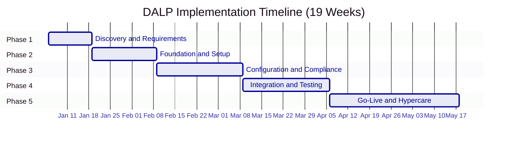

| Phase | Duration | Focus | Key Outcome |
|---|---|---|---|
| 1. Discovery and Requirements | 2 weeks | Requirements capture, architecture design, regulatory mapping | Validated requirements, target architecture, implementation roadmap |
| 2. Foundation and Setup | 3 weeks | Environment provisioning, network setup, identity framework | Functional platform environments ready for configuration |
| 3. Configuration and Compliance | 4 weeks | Asset types, compliance modules, feeds, operational workflows | Configured platform matching business and regulatory requirements |
| 4. Integration and Testing | 4 weeks | System integration, functional/security/performance/UAT testing | Validated, integrated system with formal go-live readiness |
| 5. Go-Live and Hypercare | 6 weeks | Production deployment (2 weeks) + intensive post-go-live support (4 weeks) | Production system with knowledge transfer and support transition |
| **Total** | **19 weeks** | | |

---

## Phase 1: Discovery and Requirements (Weeks 1--2)

### Objective

Establish a validated understanding of the client's business objectives, technical landscape, regulatory environment, and operational requirements, producing an architecture design and implementation roadmap that guides all subsequent phases.

### Activities

**Stakeholder Interviews.** Structured sessions with business sponsors, technology leadership, compliance and risk officers, operations teams, and end users. These interviews capture requirements across functional, regulatory, operational, and technical dimensions. Each session is documented and shared for validation within 48 hours.

**Current-State Assessment.** Review of the existing systems landscape including core banking, custody arrangements, compliance tooling, identity management, and reporting infrastructure. The assessment identifies integration touchpoints, data flows, and technical constraints that shape the target architecture.

**Regulatory and Compliance Mapping.** Documentation of applicable regulatory frameworks (MiCA, MAS, FCA, JFSA, or regional equivalents), jurisdictional constraints, investor eligibility rules, and reporting obligations. Each requirement is mapped to specific DALP compliance module types from the platform's 18 available modules. This mapping becomes the compliance configuration blueprint for Phase 3.

**Asset Class and Lifecycle Scoping.** Definition of target asset classes, lifecycle events (issuance, transfers, corporate actions, redemptions), and business rules for each. This scoping drives token template selection, feature composition, and addon configuration decisions.

**Architecture Design.** Production of a target architecture document covering deployment topology (managed cloud, self-hosted cloud, or on-premises), network selection (public EVM or permissioned Hyperledger Besu), custody integration model (DFNS, Fireblocks, or local signer), identity provider integration, and external system connectivity.

### Deliverables

| # | Deliverable | Description |
|---|---|---|
| 1.1 | Business Requirements Document | Validated functional and non-functional requirements with acceptance criteria |
| 1.2 | Regulatory and Compliance Matrix | Requirements mapped to DALP compliance modules, claim topics, and trusted issuer tiers |
| 1.3 | Target Architecture Document | Deployment topology, network design, integration architecture, and security model |
| 1.4 | Implementation Roadmap | Milestones, dependencies, resource requirements, and risk register |
| 1.5 | RACI Matrix | Responsibility assignments for all implementation activities |
| 1.6 | Communication Plan | Reporting cadence, escalation paths, and stakeholder notification protocols |

### Gate 1 Review Criteria

- [ ] All stakeholder interviews completed and requirements validated by business sponsors
- [ ] Regulatory and compliance matrix reviewed and approved by client compliance team
- [ ] Target architecture document accepted by client technology leadership
- [ ] Implementation roadmap with milestones accepted by both project managers
- [ ] RACI matrix signed off by both SettleMint and client project leadership
- [ ] Resource availability confirmed for Phase 2 (both teams)
- [ ] Risk register reviewed and mitigation strategies agreed

---

## Phase 2: Foundation and Setup (Weeks 3--5)

### Objective

Provision the DALP environment, configure the blockchain network, establish the identity and access framework, and prepare the integration layer, delivering a functional platform ready for detailed configuration and integration work.

### Activities

**Environment Provisioning.** Deploy DALP infrastructure according to the target architecture, including the DALP dApp, DAPI service, indexer, signer service, and observability stack. Three environments are provisioned: development (for iterative configuration), staging (for integration testing and UAT), and production (locked until Phase 5 deployment). Environment provisioning includes Helm chart configuration, database setup, Redis deployment, object storage configuration, and DNS resolution.

**Network Configuration.** Set up the target blockchain network(s). For permissioned Hyperledger Besu networks, this includes validator node deployment (typically 4 validators + 2 RPC nodes), consensus configuration (IBFT 2.0 or QBFT), gas management, and network monitoring. For public EVM networks, this includes RPC endpoint configuration, EntryPoint contract setup, and network health monitoring.

**Identity and Access Framework.** Configure OnchainID-based identity verification, Identity Registry setup, and RBAC configuration across DALP's role categories. This includes defining the role hierarchy, configuring system-level roles, establishing per-asset role templates, and setting up the organization role synchronization middleware.

**Key Management Setup.** Configure Key Guardian with the appropriate storage backend and custody provider integration. For DFNS deployments, this includes API credential setup, policy engine configuration, and programmatic wallet provisioning. For Fireblocks deployments, this includes vault configuration, TAP policy setup, and co-signer integration. For local signer deployments, this includes encrypted database storage and nonce tracker configuration.

**Observability Setup.** Deploy the monitoring stack (VictoriaMetrics, Loki, Tempo, Grafana) or configure integration with the client's existing observability infrastructure. Import DALP's pre-built dashboards and configure alert routing to the client's notification channels.

### Deliverables

| # | Deliverable | Description |
|---|---|---|
| 2.1 | Provisioned Environments | Development, staging, and production environments operational |
| 2.2 | Network Configuration Document | Blockchain network topology, consensus parameters, and node configuration |
| 2.3 | Identity and Access Design | RBAC model, role hierarchy, and verification workflows |
| 2.4 | Key Management Configuration | Custody provider integration, signing policies, and key lifecycle procedures |
| 2.5 | Observability Setup Report | Dashboard deployment, alert routing, and monitoring baseline |
| 2.6 | Environment Validation Report | Infrastructure health, connectivity, and baseline performance confirmation |

### Gate 2 Review Criteria

- [ ] All three environments (development, staging, production) provisioned and passing health checks
- [ ] Blockchain network operational with expected consensus behavior
- [ ] Identity and access framework functional with test user provisioning
- [ ] Key management and custody integration verified with test signing operations
- [ ] Observability stack operational with dashboards and alerting confirmed
- [ ] Environment validation report accepted by client technical lead
- [ ] No blocking infrastructure issues open

---

## Phase 3: Configuration and Compliance (Weeks 6--9)

### Objective

Configure asset types, compliance modules, data feeds, and operational workflows to match the client's specific business and regulatory requirements.

### Activities

**Token and Asset Configuration.** Define target asset classes using DALP's asset templates (bonds, equity, funds, deposits, stablecoins, real estate, precious metals, or configurable tokens). For each asset type, configure parameters, business rules, lifecycle events, corporate action logic, and feature composition using the SMART Configurable extension system (up to 32 pluggable features per token).

**Compliance Module Setup.** Configure controls from DALP's 18 module types. This includes identity verification expressions using RPN notation for complex regulatory configurations, country restrictions, investor count limits, holding period enforcement, supply caps, transfer windows, and collateral backing verification. Compliance configurations are tested against the regulatory and compliance matrix from Phase 1, including both pass and fail scenarios.

**Claims and Trusted Issuer Configuration.** Establish the claim topic scheme, register trusted issuers at appropriate tiers (global, system, or subject-scoped), and configure auto-claim validation rules. Trusted issuer configuration includes integration with external KYC providers and definition of claim expiry and renewal policies.

**Feed Configuration.** Set up price feeds, NAV feeds, exchange rate synchronization, and the FeedsDirectory with appropriate feed types and history modes. Configure Chainlink adapter integration where applicable for external feed consumption.

**Workflow Design.** Define operational workflows for day-to-day operations including issuance approval chains, transfer processing, corporate action execution, and exception handling. Workflows are documented and validated against the client's operational procedures.

### Deliverables

| # | Deliverable | Description |
|---|---|---|
| 3.1 | Asset Configuration Documentation | Token parameters, business rules, lifecycle logic, and feature composition per asset type |
| 3.2 | Compliance Module Configuration | Module setup mapped to jurisdictions and investor categories with test evidence |
| 3.3 | Claims and Feed Configuration | Claim topic scheme, trusted issuer registry, and feed configuration documentation |
| 3.4 | Integration Design Document | API specifications, data mappings, webhook definitions, and error handling patterns |
| 3.5 | Operational Workflow Documentation | Step-by-step procedures for standard operations and exception handling |

### Gate 3 Review Criteria

- [ ] All target asset types configured and validated in staging environment
- [ ] Compliance modules tested against regulatory matrix (both allow and block scenarios)
- [ ] Claims 

# Requirements Coverage Narrative
## Coverage method
The RFP expects direct coverage rather than vague affirmations. DALP covers the programme through configurable platform capability, institutional integration, and phased delivery controls. Where a requirement depends on bank-owned systems or partner infrastructure, SettleMint calls that out explicitly instead of pretending the platform owns everything.

## Requirement response highlights


# Operating Model and Service Transition
The operating model should separate three control planes: business ownership, platform operation, and regulated approvals. DALP supports that separation through role-based access, wallet verification for sensitive actions, queue-based transaction lifecycle management, configurable approval workflows, and durable audit history. After go-live, the recommended model is for FirstRand to own business policy and regulated approvals, while DALP and SettleMint support the platform layer, release management, observability, and agreed support services.

# Differentiation
The strongest differentiator is not a single feature. It is that DALP is built as a lifecycle platform. Many stacks can mint a token. Far fewer can combine identity, compliance, approvals, observability, settlement orchestration, typed APIs, deployment flexibility, and multi-role operating controls in one production architecture. That matters to FirstRand because the RFP is clearly evaluating operational dependability, not demo quality.

# Risks and Mitigations
| Risk | Why it matters | Mitigation |
|---|---|---|
| Decision latency on policy rules | slows design and test cycles | establish design authority and time-box sign-offs |
| Integration ambiguity | creates hidden delivery risk | define system owners, contracts, and error paths early |
| Incomplete onboarding evidence | blocks compliant issuance and transfer | enforce identity and claim validation before execution |
| Custody approval bottlenecks | delays live transactions | align bank approval policies with workflow SLAs |
| Reporting drift | weakens audit confidence | use indexed views and reconciliation controls |

# Conclusion
FirstRand is not asking for a speculative innovation platform. It is asking whether a production-grade platform can support digital bond platform for wholesale and treasury issuance with the control discipline expected of a regulated institution. DALP is a fit because it addresses the hard parts directly: lifecycle orchestration, compliance enforcement, identity and custody integration, enterprise observability, and phased implementation discipline.


# Review Improvements Applied
- Added explicit risk table and institution-specific regulatory context.
- Strengthened operating model language and requirement coverage narrative.
