# Technical Proposal

## Digital Asset Regulatory Framework Support Platform

**Submitted to:** ADGM Abu Dhabi Global Market

**Submission Date:** March 17, 2026

**Version:** 1.2

**Classification:** Confidential

**Primary Contact:** SettleMint NV. Sales and Solutions Team

---

© 2026 SettleMint NV. All rights reserved. This document contains confidential and proprietary information of SettleMint NV and is submitted solely for evaluation purposes in response to the ADGM RFP for a Digital Asset Regulatory Framework Support Platform. No part of this document may be reproduced, distributed, or disclosed to any third party without the prior written consent of SettleMint NV.

---

# Table of Contents

1. Executive Summary
2. About SettleMint
3. About DALP (Digital Asset Lifecycle Platform)
4. Understanding of Requirements
5. Proposed Solution and Functional Capabilities
6. Technical Architecture
7. Security Architecture
8. Deployment Model
9. Project Implementation and Delivery
10. Training and Knowledge Transfer
11. Support and SLA
12. Risk Management
13. Compliance Matrix
14. Appendix: Support Details

---

# 1. Executive Summary

## 1.1 Context and Strategic Drivers

ADGM Abu Dhabi Global Market operates at the forefront of digital asset regulation in the Middle East, maintaining one of the region's most mature virtual asset regulatory regimes through the Financial Services Regulatory Authority (FSRA). The institution's Digital Asset Regulatory Framework Support Platform programme addresses the operational complexity of managing tokenized instruments, supervisory workflows, sandbox participant onboarding, and regulatory evidence production at institutional scale.

The programme responds to three converging strategic drivers. First, ADGM's regulatory perimeter continues to expand as virtual asset firms, DLT foundations, tokenized funds, and digital market infrastructure providers seek licensing and supervision. Second, the UAE's national digital economy agenda, including the Digital Dirham initiative and cross-border payment modernization, creates demand for compliant tokenization infrastructure that can operate alongside traditional financial services. Third, international standards evolution (IOSCO, FATF travel rule, ERC-3643 adoption) requires ADGM to maintain evidence-capable systems that can demonstrate control integrity to peer regulators and the public.

These drivers translate into a platform requirement fundamentally different from a generic tokenization engine. ADGM needs a control plane that governs the full lifecycle of regulated digital assets, issuance, compliance enforcement, transfer, settlement, and servicing, while producing the audit trails, supervisory evidence, and governance workflows that a world-class financial centre demands.

## 1.2 Why This Programme Is Hard

Digital asset regulatory framework support platforms are notoriously difficult to operationalize in regulated environments. The challenge is not building a tokenization engine, the underlying blockchain infrastructure is mature. The challenge is building a control layer that satisfies five competing constraints simultaneously.

First, lifecycle complexity multiplies across asset classes. A single bond issuance involves coupon distributions, call/put options, seniority ranking, and maturity events. Equity tokens require dividend payments, share splits, voting rights, and corporate action notifications. Real estate tokens demand fractional ownership records, rental income distribution, and property transfer workflows. DALP manages all these events through a unified model without fragmenting into separate systems.

Second, governance and compliance burden is non-negotiable. Every transfer passes through configurable compliance modules before execution. Every configuration change follows maker-checker workflows. Every operator action produces an immutable audit record. These controls cannot be added as an afterthought, they must be foundational to the platform architecture.

Third, the operationalization gap between pilot and production is where most programmes fail. A demonstration environment that issues five tokens under controlled conditions bears little resemblance to a production system handling thousands of investor records, multiple asset classes, real-time compliance checks, and integration with custody providers, exchanges, and core banking systems. ADGM requires a platform that scales from initial launch to broader adoption without a fundamental architecture reset.

Fourth, integration burden across custody, payments, identity, and reporting creates hidden dependencies. The platform does not operate in isolation, it exchanges data with identity services for investor verification, ledger systems for position management, sanctions screening tools for AML compliance, and reporting environments for regulatory submissions. Each integration point is a potential source of reconciliation breaks, data quality issues, and operational overhead.

Fifth, the UAE regulatory environment has specific requirements, ADGM FSMR framework compliance, CBUAE payment and stored value expectations, UAE SCA rules, UAE AML/CFT law, and outsourcing/cyber resilience expectations, that must be mapped to platform controls with precision. A generic compliance engine does not suffice; the platform supports jurisdiction-specific rule configuration without code changes.

## 1.3 Proposed Response

SettleMint proposes DALP (Digital Asset Lifecycle Platform) as the foundational infrastructure for ADGM's Digital Asset Regulatory Framework Support Platform. DALP is a production-grade platform purpose-built for regulated financial institutions, market infrastructure providers, and sovereign entities managing digital assets across the full lifecycle.

The proposed deployment model is Dedicated Private Cloud deployed within ADGM's existing cloud infrastructure (AWS, Azure, or GCP per ADGM's standard), providing full control over data residency within UAE while leveraging cloud-native scalability. This model aligns with ADGM's preference for infrastructure control while avoiding the operational overhead of on-premises deployment.

The target asset scope encompasses regulatory tokens, security tokens (bonds, equity, funds), virtual asset tokens, and sandbox participant instruments. The compliance approach leverages DALP's modular ERC-3643 compliance engine with pre-built modules for investor limits, country restrictions, identity verification, transfer approval workflows, and supply caps, configurable to ADGM's specific FSMR and UAE AML/CFT requirements without smart contract redeployment.

The custody model supports both self-custody (local signer with HSM) and third-party custody integration (Fireblocks, DFNS), allowing ADGM to select the appropriate model per asset class or participant category. The integration perimeter connects to ADGM's existing identity services, ledger systems, sanctions screening tools, and reporting environments through DALP's REST API and event-driven webhook architecture.

The phased delivery model spans 19 weeks from kickoff to hypercare completion: Discovery (2 weeks), Foundation (3 weeks), Configuration (4 weeks), Integration and Testing (4 weeks), and Go-Live with Hypercare (6 weeks). This timeline delivers a production-ready system with all core capabilities operational, suitable for initial participant onboarding.

## 1.4 Why SettleMint

SettleMint brings a combination of production credibility, regulatory awareness, and regional relevance that few competitors match.

The company has operated continuously since 2016, making it one of the oldest enterprise blockchain platform companies in Europe. This tenure translates into production maturity: seven years of live deployments at regulated banks in Asia and Europe, including sovereign-scale programmes in the Middle East that operate under real regulatory scrutiny.

SettleMint's regional relevance is particularly strong for this procurement. The company has active sovereign programmes in the Gulf region, including the Saudi Arabia Real Estate Registry, a country-scale blockchain for property registration and fractionalization that went live in January 2026. SettleMint has also delivered the ADI-Finstreet institutional equity issuance on ADI mainnet, demonstrating direct familiarity with Abu Dhabi's digital asset ecosystem. This experience means SettleMint understands ADGM's regulatory context, market infrastructure, and operational expectations without a learning curve.

The company's leadership includes executives with direct experience at Standard Chartered, SC Ventures, and major European banks, bringing financial domain expertise that pure technology vendors lack. The engineering team combines decades of experience across banking, capital markets, and blockchain engineering, operating as a focused unit that maintains architectural coherence across the full stack.

SettleMint holds ISO 27001 and SOC 2 Type II certifications, confirming security controls that meet institutional standards. The company has successfully completed vendor risk assessments at tier-1 financial institutions, passing security reviews, penetration testing, and due diligence processes typical of large financial organizations.

## 1.5 Why DALP

DALP is purpose-built as a lifecycle platform and control plane, not a point solution for token issuance. This distinction is critical for ADGM's requirements.

The platform covers the full asset lifecycle through five integrated pillars: Issuance, Compliance, Custody, Settlement, and Servicing. Each pillar provides production-grade capabilities addressing the operational realities of regulated digital asset management. Issuance handles asset configuration, minting, and lifecycle logic through the SMART Protocol (ERC-3643). Compliance enforces transfer rules through 18 modular compliance types that compose, configure, and reconfigure at runtime. Custody manages key material through Key Guardian with HSM integration and MPC provider support. Settlement provides atomic Delivery-versus-Payment (DvP) and Exchange-versus-Payment (XvP) protocols. Servicing handles corporate actions including coupon distributions, dividend payments, maturity events, and redemption.

DALP's control plane positioning ensures that every transaction, every configuration change, and every operator action produces immutable evidence suitable for audit, supervisory review, and board reporting. The platform's dual-layer permission model combines off-chain RBAC (Better Auth) with on-chain role enforcement (AccessManager contracts), ensuring that no single-layer failure grants unauthorized access.

The platform's interoperability and operations credentials are equally strong. DALP provides an API-first architecture with OpenAPI 3.1 specifications, a TypeScript SDK, webhook events, and enterprise messaging integration. The platform operates on any EVM-compatible blockchain, from public networks (Ethereum, Polygon, Avalanche) to private consortium networks (Hyperledger Besu), with consistent governance across environments. The observability stack ships as code with pre-built Grafana dashboards, alerting rules, and structured logging, enabling ADGM to operate the platform without hidden dependencies.

## 1.6 Reference Fit Snapshot

Three references demonstrate direct relevance to ADGM's requirements:

**ADI-Finstreet (Abu Dhabi, 2025):** Tokenized equity issuance on ADI mainnet with corporate actions, on-chain voting, and institutional custody integration. This reference demonstrates SettleMint's direct experience with ADGM's regulatory ecosystem, digital asset infrastructure, and institutional custody arrangements. The relevance to ADGM's Digital Asset Regulatory Framework Support Platform is immediate and specific.

**Saudi Arabia Real Estate Registry (2024-present):** Country-scale blockchain for real estate registration, fractionalization, and digital marketplace under REGA/Vision 2030. This sovereign-scale programme demonstrates SettleMint's ability to deliver national infrastructure operating under regulatory supervision, integrating with government systems (national identity via Yakeen, payment rails via Sadad), and processing live transactions. The governance, auditability, and multi-participant coordination required for this programme align directly with ADGM's supervisory platform requirements.

**Standard Chartered Bank (Asia, Africa, Middle East, 2023-2024):** Digital Virtual Exchange with fractional tokenization, instant settlement, and elimination of custody intermediaries. This banking reference demonstrates DALP's capability to handle securities (shares, bonds, currencies) with institutional-grade compliance, multi-region deployment, and integration with existing banking infrastructure. The fractional ownership, compliance enforcement, and settlement finality required for this programme transfer directly to ADGM's regulatory framework support platform.

---

# 2. About SettleMint

## 2.1 Company Overview and Mission

SettleMint exists to bridge the gap between digital asset ambitions and production-grade execution. The company's mission is to enable financial institutions, market infrastructure providers, and sovereign entities to move real-world value on-chain with a compliant, secure, production-grade digital asset lifecycle platform.

Financial institutions and governments recognize that tokenization and digital assets are becoming core infrastructure for capital markets and real-world assets. Regulatory frameworks are maturing, tokenized instruments are appearing on balance sheets, and expectations are shifting from innovation theater to operational reality.

Yet tokenization technology being accessible does not mean institutional-grade implementation is. The real challenge lies in doing it correctly at production scale: meeting regulatory requirements, implementing proper governance, supporting the full asset lifecycle, and ensuring that early pilots scale into real institutional infrastructure. Most organizations remain stuck in pilot mode, overwhelmed by the complexity of regulatory compliance, governance requirements, and building infrastructure that withstands production scrutiny.

SettleMint solves this complexity, turning digital asset strategy into operating systems that reduce time-to-market and remove operational and regulatory risk.

SettleMint is the production-grade digital asset lifecycle management company for regulated financial markets and sovereign use cases. The company provides the governance and orchestration layer between existing core financial systems and multiple blockchain networks, delivering the infrastructure required to build, deploy, and operate compliant digital asset solutions in production.

## 2.2 History and Market Position

SettleMint was founded in 2016 and is headquartered in Leuven, Belgium. The company was established by practitioners working in blockchain and distributed systems since the early enterprise adoption wave, with hands-on experience designing and delivering tokenization, payments, and capital markets projects, and a track record of turning prototypes into production systems that pass institutional scrutiny.

**Key Milestones:**

- **2016 - Founding:** Established in Leuven, Belgium, with a focus on enterprise blockchain infrastructure, recognizing that production deployment required more than proof-of-concept technology
- **Early Production Deployments:** First customer programmes with tier-1 and tier-2 financial institutions, moving from innovation pilots to live transaction processing
- **Platform Evolution:** Development and release of DALP (Digital Asset Lifecycle Platform), consolidating years of production experience into a unified platform architecture
- **Geographic Expansion:** Expansion of operations across Europe, the Middle East (including active sovereign programmes in the Gulf region), and Asia-Pacific (including production deployments in Japan and Singapore)
- **Sovereign-Scale Programmes:** Engagement with national-scale tokenization initiatives, including real estate registries and sovereign capital markets infrastructure
- **Series A Funding:** Completion of Series A financing round backed by leading investors in Europe and the Middle East, providing capital to accelerate platform development and geographic expansion
- **Continued Production Growth:** Years of continuous production deployments with increasing transaction volumes, asset types, and regulatory environments

**Track Record Indicators:**

- Building enterprise blockchain infrastructure since 2016, with 10 years of continuous operation
- 7+ years of continuous production deployments at regulated banks in Asia and Europe
- Active sovereign and national-scale programmes in the Middle East
- Live deployments across bonds, equities, deposits, stablecoins, real estate, funds, and precious minerals

## 2.3 Production Credentials

SettleMint's production credentials demonstrate the platform's maturity and institutional readiness:

| Credential | Evidence |
|---|---|
| **Operational tenure** | 10 years continuous operation in enterprise blockchain infrastructure |
| **Production deployments** | 7+ years at regulated banks in Asia and Europe |
| **Sovereign programmes** | National-scale deployments in Saudi Arabia (RER), UAE (ADI), and multi-country IsDB programmes |
| **Asset class breadth** | Live deployments across bonds, equities, deposits, stablecoins, real estate, funds, precious minerals |
| **Transaction volumes** | High-volume transactional flows in payments and settlements under institutional SLAs |
| **Security certifications** | ISO 27001 certified; SOC 2 Type II certified |
| **Vendor assessments** | Successfully completed vendor risk assessments at tier-1 financial institutions |
| **Support infrastructure** | 24/7 operational support capabilities with incident management and business continuity procedures |

## 2.4 Regulatory Readiness

SettleMint's platform and delivery teams have demonstrated capability across multiple regulatory frameworks relevant to ADGM's requirements:

| Regulatory Framework | DALP Alignment |
|---|---|
| **ADGM FSMR** | Modular compliance engine configurable to FSRA virtual asset guidance; on-chain identity and compliance enforcement |
| **UAE AML/CFT** | OnchainID-based identity verification; compliance modules for investor limits, country restrictions, sanctions screening integration |
| **CBUAE** | Payment token support; settlement finality through DvP protocols; integration with RTGS/payment rails via ISO 20022 |
| **SCA Rules** | Configurable compliance modules for securities token requirements; corporate action handling |
| **FATF Travel Rule** | On-chain identity through OnchainID (ERC-734/735); configurable transfer restrictions |
| **MiCA (EU reference)** | Pre-built compliance templates for MiCA requirements; investor verification and reporting modules |
| **Islamic Finance** | Sharia-compliant implementations delivered through IsDB subsidy distribution and market stabilisation programmes |

## 2.5 Team and Delivery Capability

SettleMint's leadership combines deep technical expertise, financial domain knowledge, and enterprise delivery experience.

**Adam Popat, CEO:** Leads SettleMint's commercial strategy and global market expansion. Brings deep experience in finance, digital assets, M&A, and institutional business development, with a background spanning Standard Chartered, SC Ventures, and capital markets. Drives SettleMint's growth across the Middle East, Asia-Pacific, and European markets.

**Matthew Van Niekerk, Co-founder and President:** Leads company strategy, investor relations, and market expansion. Brings extensive experience in enterprise technology, financial services, and blockchain adoption. Under his leadership, SettleMint has expanded from a European base into the Middle East and Asia-Pacific, securing sovereign-scale programmes and tier-1 bank deployments.

**Roderik van der Veer, Co-founder and CTO:** Oversees all technology strategy, platform architecture, and engineering execution for DALP. Deep expertise in distributed systems, blockchain protocols, enterprise software architecture, and security. Responsible for the technical evolution from early blockchain middleware to the full lifecycle platform that DALP represents today.

The engineering team operates as a focused, senior unit of four core engineers responsible for the DALP platform, smart contract architecture, backend services, API layer, compliance engine, settlement workflows, and infrastructure automation. The small team size is a deliberate design choice, enabling rapid iteration, architectural coherence, and deep ownership across the full stack. AI-augmented operations act as a force multiplier, allowing the engineering team to operate at higher effective capacity.

This combination enables SettleMint to speak the language of CIOs and architects (integration, resilience, scalability), COOs and product owners (operational workflows, business cases), and Risk, Compliance, and Legal (controls, governance, regulatory fit).

## 2.6 Ecosystem and Partnerships

SettleMint maintains a partnership ecosystem that extends delivery capability, deepens technology integration, and provides regional coverage across key markets.

**Custody Providers:** Fireblocks and DFNS operate under a bring-your-own-custodian model, allowing institutions to retain existing custodian relationships. DALP's unified signer abstraction makes custody providers interchangeable through configuration changes alone.

**Cloud Providers:** AWS, Azure, and GCP are fully supported with full deployment flexibility across cloud, on-prem, and hybrid models.

**Network Partners:** All EVM-compatible blockchain networks (public and permissioned) are supported, including Hyperledger Besu for private consortium deployments.

**Identity and Compliance:** OnchainID provides verifiable on-chain investor identities. KYC/KYB integration partners connect to external verification services.

**Payment Rails:** ISO 20022 integration supports SWIFT, SEPA, and RTGS connectivity for cash-leg settlement.

**Monitoring and Operations:** Integration points for SSO/IAM, SIEM, and enterprise audit logging ensure compatibility with existing operational infrastructure.

## 2.7 Relevance to This Bid

For ADGM's Digital Asset Regulatory Framework Support Platform, SettleMint brings five specific strengths:

**Direct ADGM ecosystem experience:** The ADI-Finstreet programme demonstrates SettleMint's familiarity with ADGM's regulatory infrastructure, digital asset platforms, and institutional custody arrangements. This eliminates the learning curve that otherwise delays implementation timelines.

**Sovereign-scale delivery credibility:** The Saudi Arabia Real Estate Registry programme, which went live in January 2026 as the first country-scale property blockchain, demonstrates SettleMint's ability to deliver national infrastructure under government supervision with live transaction processing.

**Regulatory compliance depth:** DALP's modular compliance engine (18 module types, ERC-3643 foundation, OnchainID identity) provides the granular control required for FSMR compliance, UAE AML/CFT requirements, and supervisory evidence production.

**Production-grade security:** ISO 27001 and SOC 2 Type II certifications, combined with successful tier-1 bank vendor assessments, meet the security posture that ADGM's procurement, risk, and information security teams require.

**Regional presence:** Active programmes in the Gulf region with local support capabilities provide the on-the-ground responsiveness that a programme of this strategic importance demands.

---

# 3. About DALP (Digital Asset Lifecycle Platform)

## 3.1 Platform Overview

DALP (Digital Asset Lifecycle Platform) is a production-grade platform that serves as the governance and orchestration layer between existing core financial systems and blockchain networks. The platform is purpose-built for regulated financial institutions, market infrastructure providers, and sovereign entities managing digital assets across the full lifecycle.

The platform is organized as a four-layer stack, each with distinct responsibility boundaries and well-defined interfaces:

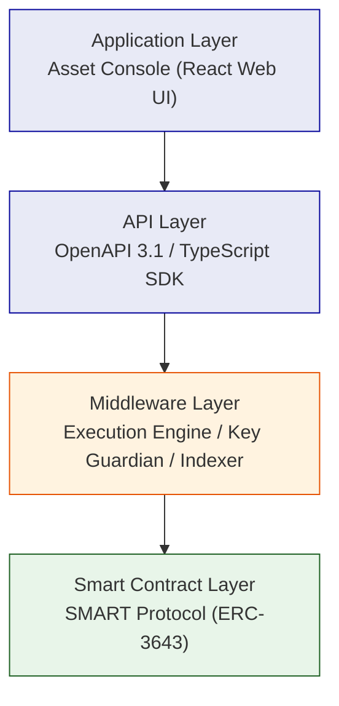

Requests flow top-down through these layers. A user action in the Asset Console triggers an API call, which the middleware orchestrates into one or more blockchain transactions, which the smart contract layer validates and executes on-chain. Each layer independently enforces its own security controls, so no single-layer failure grants unauthorized access.

## 3.2 Core Lifecycle Pillars

### 3.2.1 Issuance

DALP's issuance capabilities provide the foundation for creating and configuring digital assets:

**Asset Configuration:** DALPAsset, the recommended contract type for all new tokenization projects, extends the SMART Protocol with the SMARTConfigurable extension. This allows token features and compliance modules to be attached and reconfigured at runtime after deployment, eliminating the need to commit to a specialized contract type at deployment time. A DALPAsset token evolves: starts as a simple bearer instrument, then has fee structures added, governance enabled, or maturity and redemption logic configured, all without redeploying the contract.

**Runtime-Pluggable Features:** Verified available features include historical balances, voting power, permit (gasless approvals), AUM fee, maturity and redemption, fixed treasury yield, transaction fee (multiple variants), and conversion capabilities. These integrate through six lifecycle hooks (mint, burn, transfer, redeem, update, attach) via the ISMARTFeature interface.

**Factory Deployment:** All asset types deploy through a factory pattern using CREATE2, which provides deterministic contract addressing. Token addresses can be computed before deployment, enabling pre-configuration of external systems. The factory transaction is atomic: if any step fails, the entire deployment reverts. No partially deployed tokens exist on-chain.

### 3.2.2 Compliance

DALP's compliance engine is built on the ERC-3643 standard, enforcing regulatory requirements at the protocol level:

**Modular Compliance Architecture:** Rather than hardcoding compliance rules into token contracts, DALP uses a modular compliance engine where rules are separate contracts that the compliance orchestrator evaluates on every transfer. This approach provides regulatory flexibility (different jurisdictions require different rules), runtime reconfigurability (modules can be added, removed, or reconfigured under governance control), composability (complex compliance scenarios are built by stacking independent modules), and separation of concerns (token logic is cleanly separated from compliance logic).

**18 Compliance Module Types:** Documented module types include identity verification, country restrictions, identity allow/deny lists, supply and investor limits, supply cap and collateral requirements, transfer approval workflows, and timelock restrictions. Each module is testable and auditable in isolation.

**On-Chain Enforcement:** Compliance checks execute on-chain and cannot be bypassed by the application layer. Every transfer passes through the compliance engine before execution, this is enforced by the smart contract itself, not by off-chain validation.

**RPN Expression Support:** Complex regulatory configurations can be expressed using Reverse Polish Notation (RPN) for compliance rules, allowing compliance officers to configure sophisticated rule sets without modifying smart contract code.

### 3.2.3 Custody

DALP's custody capabilities manage cryptographic key material through defense-in-depth:

**Key Guardian Architecture:** The Key Guardian service manages cryptographic key material through multiple storage backends at escalating security levels. Keys never leave secure boundaries in plaintext. Available tiers include encrypted database (development/PoC), cloud secret manager (standard production), Hardware Security Modules (regulated financial services), and third-party MPC custody (highest security requirements).

**MPC Custody Integration:** DALP integrates with DFNS and Fireblocks for institutional-grade MPC custody. The unified signer abstraction makes custody providers interchangeable through configuration changes alone. Both providers ensure that no single private key ever exists in one place.

**Signer Abstraction:** The platform implements a unified signer interface that abstracts over all custody backends. Runtime capability detection allows the platform to select local or provider-delegated execution paths dynamically.

### 3.2.4 Settlement

DALP provides atomic settlement protocols that eliminate counterparty risk:

**Delivery-versus-Payment (DvP):** DALP's atomic DvP ensures that asset and cash transfer simultaneously or both revert, achieving true T+0 finality. The XvP extension coordinates multi-party exchanges with the same atomicity guarantees, removing the need for trusted intermediaries.

**Settlement Determinism:** All critical operations run as durable, deterministic workflows through Restate. Workflow phases are explicitly state-tracked with persisted status, enabling recovery from any interruption point. Configurable retry handling with exponential backoff ensures operations complete even through transient failures.

### 3.2.5 Servicing

DALP handles corporate actions and lifecycle events across the asset lifetime:

**Corporate Actions:** Coupon/dividend distributions, yield payments, maturity/redemption events, governance events, and operational servicing are all supported through the platform's lifecycle management capabilities.

**Addon System:** Operational tools extending assets include Airdrop (push, merkle-drop, vesting), Vault (multi-sig treasury), XvP Settlement (atomic DvP), Token Sale (DAIO), and Yield modules.

## 3.3 Platform Foundations

### 3.3.1 Identity and Access

DALP implements a dual-layer permission model combining off-chain RBAC with on-chain role enforcement:

**Platform Roles (3 roles):** owner, admin, member, organization-scoped, managed by Better Auth. Owner has full administrative access; admin manages users and configuration; member operates based on assigned permissions.

**System People Roles (9 roles):** systemManager, identityManager, tokenManager, complianceManager, claimPolicyManager, organisationIdentityManager, claimIssuer, auditor, feedsManager, assigned to human operators via on-chain AccessManager.

**Per-Asset Roles (7 roles):** admin, governance, supplyManagement, custodian, emergency, saleAdmin, fundsManager, scoped per token contract, enabling fine-grained control over individual asset operations.

### 3.3.2 Integration and Interoperability

DALP provides multiple integration pathways:

| Integration Method | Use Case | Authentication |
|---|---|---|
| REST API (OpenAPI 3.1) | System-to-system integration | API keys, session auth, SSO |
| TypeScript SDK | TypeScript/Node.js applications | API keys |
| Webhooks | Event-driven notifications | Configured per endpoint |
| Enterprise messaging | Corporate actions, settlement | API keys |

### 3.3.3 Observability and Operations

A comprehensive observability stack is built on three pillars:

**Metrics:** Time-series data captures request rates, latencies, error rates, resource utilization, transaction volumes, block lag, gas prices, and confirmation times.

**Logs:** Structured JSON logs with correlation identifiers link related entries across components.

**Traces:** Distributed traces follow operations across component boundaries with span-level timing and metadata.

Pre-built dashboards cover operations overview, transaction monitoring, compliance activity, security overview, and infrastructure health.

## 3.4 Supported Asset Classes

DALP supports multiple asset classes through specialized contract templates:

| Asset Class | Contract Type | Key Capabilities |
|---|---|---|
| **Configurable Token** | DALPAsset | Pluggable features and compliance modules at runtime |
| **Bonds** | Bond | Coupon payments, maturity, call/put options |
| **Equity** | Equity | Dividends, voting rights, share splits |
| **Funds** | Fund | NAV calculation, redemption, fee structures |
| **Deposits** | Deposit | Interest accrual, withdrawal rules |
| **Stablecoins** | StableCoin | Collateral backing, supply management |
| **Real Estate** | RealEstate | Fractional ownership, rental distribution |
| **Precious Metals** | PreciousMetal | Custody proof, ownership transfer |

## 3.5 Standards and Protocols

DALP is built on open standards that ensure interoperability and regulatory alignment:

| Standard | Purpose | DALP Implementation |
|---|---|---|
| **ERC-3643** | Regulated security tokens | SMART Protocol foundation |
| **ERC-20** | Token interface | Compatible base |
| **ERC-734/735** | OnchainID identity | Identity registry and claims |
| **ERC-2771** | Meta-transactions | Gasless transaction support |
| **ISO 20022** | Financial messaging | Payment rail integration |

---

# 4. Understanding of Requirements

## 4.1 ADGM Context

ADGM Abu Dhabi Global Market is treating digital asset regulatory framework support platform as a business-critical capability that must be implemented with the same discipline applied to core regulated systems. The solution under consideration operates inside a control environment shaped by business ownership, architecture standards, security review, legal interpretation, compliance sign-off, and internal audit expectations. This is not a speculative innovation exercise. It is a procurement intended to test whether the market can supply a dependable platform and implementation model for the target operating state.

ADGM's review team looks beyond product feature lists. It tests whether bidders can explain how the platform behaves when confronted with real-world operational pressure: incomplete onboarding data, limit breaches, approvals delayed by governance, partner outages, regulatory evidence requests, bulk corrections, data retention obligations, and phased rollout constraints.

Regional conditions in UAE matter significantly. The response anchors in actual market infrastructure and supervisory realities, including the pace of domestic policy development, the role of regulated intermediaries, and the practical limits of cross-border interoperability.

## 4.2 Requirement Domains

The following requirement domains map directly to ADGM's RFP specification:

| Domain | Description | DALP Alignment |
|---|---|---|
| **Product/Asset Scope** | Regulatory tokens, security tokens, virtual assets, sandbox instruments | DALPAsset with configurable features; multiple contract templates (bond, equity, fund, stablecoin, real estate); ERC-3643 compliance engine |
| **Identity/Onboarding** | Investor verification, claims management, sandbox participant onboarding | OnchainID (ERC-734/735); configurable claim topics; trusted issuer tiers; onboarding workflow engine |
| **Compliance/Control** | Transfer rules, investor limits, country restrictions, AML integration | 18 modular compliance types; on-chain enforcement via ERC-3643; sanctions screening integration points |
| **Settlement/Cash Leg** | DvP, XvP, payment rail integration, atomic settlement | Atomic DvP/XvP protocols; ISO 20022 integration; REST API for payment systems |
| **Integration/Reporting** | Core system connectivity, supervisory evidence, board reporting | REST API with OpenAPI 3.1; webhook events; SIEM integration; audit logging |
| **Infrastructure/Operations** | Deployment model, data residency, observability, support | Private cloud, on-prem, hybrid options; UAE data residency; Grafana/Loki/Tempo stack; tiered support |

## 4.3 Key Challenges Identified

**Challenge 1: Control Integrity**

ADGM must be able to identify who initiated a change or transaction, which policy checks applied, who approved the event, and how the resulting state can be reconstructed later. This requires immutable audit trails, maker-checker controls, and complete event provenance at both the platform and blockchain layers.

*DALP Response:* DALP produces tamper-evident audit logs at every layer, authentication events, authorization decisions, configuration changes, and blockchain transactions. The on-chain AccessManager contract is the authoritative source for all role assignments. Every state-changing function checks the caller's on-chain role before execution.

**Challenge 2: Coexistence with Enterprise Systems**

The selected solution cannot become a reconciliation sinkhole that generates more manual work than it removes. Integration must be seamless, data must be consistent, and breaks must be visible and actionable.

*DALP Response:* DALP's API-first architecture exposes well-defined interfaces for all operations. The Chain Indexer processes blockchain events into queryable state, enabling reconciliation with internal books. Event-driven webhooks notify external systems of state changes, reducing polling overhead.

**Challenge 3: Phased Scalability**

ADGM wants to move from initial launch to broader adoption without a platform reset. The architecture must support incremental capacity addition, new asset class introduction, and expanded participant onboarding without fundamental rework.

*DALP Response:* DALP's modular architecture, pluggable compliance modules, configurable token features, and multi-chain support, enables phased expansion. The platform's Kubernetes-based deployment supports horizontal scaling. New asset types are configured through the factory pattern without code changes.

**Challenge 4: Regulatory Evidence Production**

The platform must support evidence extraction for audit, supervisory review, and board reporting. Evidence must be complete, traceable, and produced in formats that satisfy compliance and risk teams.

*DALP Response:* Every platform action generates structured audit logs with correlation identifiers. The compliance engine records every transfer check with rule details and outcome. Dashboard exports and API queries support board reporting. SOC 2 Type II and ISO 27001 certifications provide external assurance.

**Challenge 5: UAE Regulatory Specificity**

The platform must map to ADGM FSMR framework, CBUAE payment expectations, UAE AML/CFT law, and outsourcing/cyber resilience expectations without requiring bespoke development.

*DALP Response:* DALP's compliance module library includes pre-built templates that can be configured to UAE requirements. The modular architecture means jurisdiction-specific rules are implemented as configuration, not code changes. SettleMint's regional experience includes direct delivery on ADI mainnet, demonstrating familiarity with Abu Dhabi's regulatory ecosystem.

## 4.4 Requirement Prioritization

| Priority | Requirement Area | ADGM Impact |
|---|---|---|
| **Mandatory** | Architecture supporting segregated environments (dev, test, UAT, DR, production) | Essential for control environment |
| **Mandatory** | API-first interfaces, eventing, version governance | Enables enterprise integration |
| **Mandatory** | RBAC, segregation of duties, maker-checker, complete audit logs | Control integrity requirement |
| **Mandatory** | Configurable lifecycle states, policy controls, limits, exceptions, reconciliations | Core platform capability |
| **Mandatory** | Third-party dependencies and operational responsibilities disclosure | Procurement transparency |
| **Mandatory** | Resilience, recovery, backup, monitoring, incident management | Operational continuity |
| **Mandatory** | Delivery method, client effort assumptions, phased implementation | Realistic delivery planning |
| **Mandatory** | Evidence extraction for audit, supervisory review, board reporting | Regulatory requirement |
| **High** | Platform-wide configuration governance, observability, phased promotion | Operational management |
| **High** | Participant supervision, policy analytics, sandbox control requirements | ADGM-specific use case |

## 4.5 Response Principles

SettleMint's response follows six principles that guide all proposal claims:

1. **Control before speed:** Every optimization respects the control environment. Compliance enforcement happens before transaction execution, not after.

2. **Evidence over assertions:** Every capability claim is backed by production evidence or architectural mechanism. No roadmap-as-capability language.

3. **Phased delivery:** The implementation plan delivers incremental value with clear acceptance gates. No single go-live event with unbounded scope.

4. **Integration as first-class:** The platform is designed for enterprise coexistence, not as an isolated island. Every integration point has defined contracts, failure modes, and reconciliation approaches.

5. **Regulatory specificity:** Configuration over customization. UAE regulatory requirements are addressed through the platform's configurable compliance engine, not through bespoke development.

6. **Operational ownership:** Knowledge transfer, documentation, and runbooks ensure ADGM owns the platform after hypercare, not SettleMint.

---

# 5. Proposed Solution and Functional Capabilities

## 5.1 Solution Overview

SettleMint proposes DALP as the foundational infrastructure for ADGM's Digital Asset Regulatory Framework Support Platform. The solution encompasses the full technology stack required to issue, manage, transfer, settle, and service regulated digital assets under ADGM's supervisory framework.

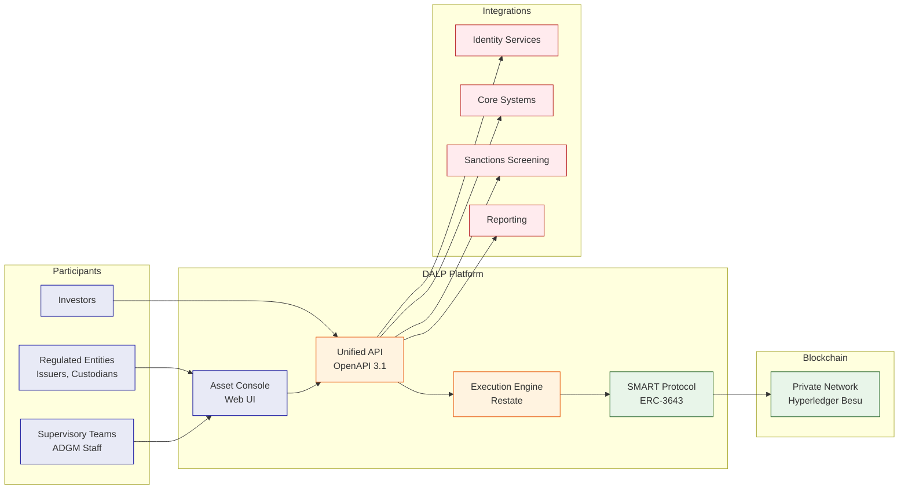

The solution boundary encompasses: the DALP platform deployed within ADGM's private
cloud environment; the Asset Console for operator and supervisory access; the Unified API for system integration; the blockchain network (private Hyperledger Besu for regulatory control); and integration adapters connecting to ADGM's existing identity services, core banking/ledger systems, sanctions screening tools, and reporting environments.

The deployment assumption is Dedicated Private Cloud within ADGM's existing AWS, Azure, or GCP tenancy, with data residency constrained to UAE. Network connectivity assumes ADGM-provided VPN or private link between DALP and existing enterprise systems.

## 5.2 Issuance and Asset Configuration

DALP handles asset issuance through a factory-based deployment model that ensures consistency, security, and auditability:

**Asset Setup:** The platform supports creation of multiple asset types through the DALPAsset contract type, which provides runtime-configurable token features and compliance modules. Assets are deployed using the CREATE2 factory pattern, ensuring deterministic addressing and atomic deployment.

**Lifecycle Logic:** Each asset type carries its own lifecycle logic, bond contracts include coupon schedules and maturity handling; equity contracts include dividend distribution and voting mechanics; fund contracts include NAV calculation and redemption workflows. Lifecycle logic is defined at configuration time and embedded in the smart contract.

**Governance Before Activation:** No asset becomes operational until governance reviews the configuration. The factory deployment process enforces this through role assignments: governance roles must be assigned before transfers are enabled. The maker-checker pattern is implemented through the platform's dual-layer permission model (off-chain approval followed by on-chain role validation).

**Token Issuance Flow:**

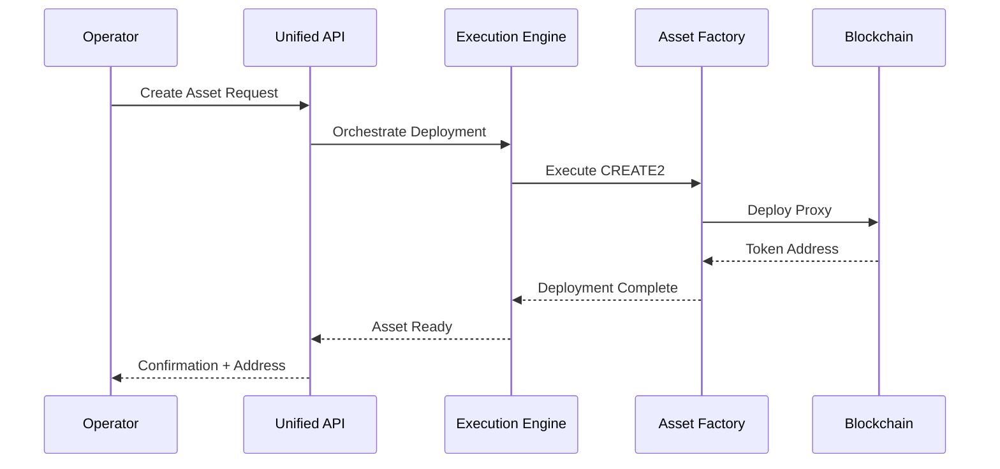

## 5.3 Identity and Eligibility

DALP implements identity management through OnchainID (ERC-734/735), providing verifiable on-chain investor identities:

**OnchainID Role:** Every investor identity exists as an OnchainID contract on-chain. This contract stores KYC/AML claims issued by trusted parties. The identity serves as the root of trust for all transfer eligibility decisions.

**Claims Model:** Claims are issued by trusted claim issuers (typically the regulated entity's compliance team or a delegated KYC provider). Each claim has a topic, scheme, and expiry date. Claims can be revoked, updated, or renewed. The compliance engine evaluates active, non-expired claims before allowing transfers.

**Issuer Trust Model:** DALP implements a tiered trusted issuer system: global issuers (recognized across the platform), system issuers (specific to ADGM's deployment), and subject-scoped issuers (specific to individual asset programs). This hierarchy allows ADGM to control which claim issuers are recognized for which purposes.

**Onboarding Workflow:** The platform provides an onboarding workflow that connects to external KYC providers through API integration. The workflow captures investor information, submits it to the KYC provider, receives verification results, and issues the corresponding OnchainID claims. All onboarding steps produce audit logs suitable for regulatory examination.

## 5.4 Compliance Enforcement

DALP enforces compliance through a multi-layered architecture that ensures regulatory requirements are met at every transaction:

**Ex-ante Checks:** Every transfer request is evaluated against the compliance engine before execution. The compliance engine runs on-chain as part of the ERC-3643 transfer validation. No transfer executes if any compliance module returns a failure result. This ex-ante approach ensures that non-compliant transactions never reach the blockchain.

**Module Composition:** Complex compliance requirements are built by composing multiple modules. A typical configuration for a regulated security token includes: identity verification (is the sender verified?), country restrictions (is the sender's jurisdiction allowed?), investor limits (does the sender's holdings exceed the limit?), and transfer approval (has this specific transfer been pre-approved?). Each module operates independently, and all must pass.

**Transfer Controls:** Beyond blocking transfers, the compliance engine supports granular controls: rate limiting (maximum transfers per time window), timelock (minimum holding period before transfer), and approval workflows (transfer requires pending approval from a compliance officer). These controls are configured per asset and can be changed by governance.

**Auditability:** Every compliance check logs its evaluation: which modules were evaluated, what inputs were checked, what the result was, and what the reason was if blocked. These logs feed into the platform's audit trail and are queryable through the API.

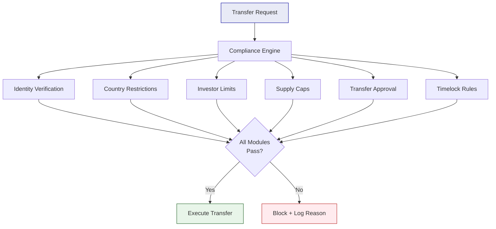

## 5.5 Transfer, Settlement, and Cash-Leg Coordination

DALP provides atomic settlement protocols that eliminate counterparty risk:

**Transfer Path:** Transfers flow through the platform's execution engine, which orchestrates the transaction lifecycle: preparing the transaction, estimating gas, submitting to the blockchain, monitoring confirmation, and recording the final state. The execution engine handles retries, nonce management, and failure recovery.

**DvP/XvP Model:** DALP's Delivery-versus-Payment (DvP) protocol ensures atomic settlement: the asset transfer and cash transfer execute as a single atomic transaction, if either leg fails, both legs revert. The Exchange-versus-Payment (XvP) extension supports multi-party exchanges (such as cross-currency swaps) with the same atomicity guarantees.

**Failure Behavior:** Settlement failures are handled through deterministic workflows. If a settlement times out or fails, the workflow executes the configured recovery action: revert, retry, or escalate to manual intervention. All failure events are logged with full context for dispute resolution.

**Determinism:** The settlement system achieves determinism through durable workflow orchestration. Every settlement operation runs as a Restate workflow with explicitly tracked phases. The workflow survives infrastructure failures, process restarts, and network partitions without data loss or inconsistent state.

## 5.6 Lifecycle Servicing and Corporate Actions

DALP manages corporate actions through its servicing layer:

**Coupon/Dividend/Yield:** The platform supports scheduled yield distributions. Operators configure the distribution parameters (amount, schedule, eligible holders), and the platform executes the distribution through batched transfers or airdrop mechanisms. Distribution history is recorded on-chain for auditability.

**Maturity/Redemption:** Bond and deposit contracts include maturity handling. At maturity, the contract enforces redemption logic: holders can redeem their tokens for the underlying asset or cash equivalent based on configured terms. Redemption workflows include validation (is the holder eligible?), processing (execute the redemption), and recording (update balances and emit events).

**Governance Events:** On-chain voting and governance events are supported through the governance addon. Proposals are submitted, voting periods open, votes are recorded on-chain, and outcomes are automatically executed. This enables shareholder voting, policy changes, and other governance actions to occur entirely on-chain.

**Operational Servicing:** Beyond standard corporate actions, the platform supports operational servicing such as fee collection, airdrops, and vesting schedules. These are implemented through dedicated addon modules that extend the base asset functionality.

## 5.7 Integration and Interoperability

DALP provides multiple integration pathways designed for enterprise environments:

**API/SDK/CLI:** The Unified API exposes all platform capabilities through OpenAPI 3.1 specifications. The TypeScript SDK provides typed programmatic access. The CLI provides operator access for common tasks. All three interfaces provide consistent behavior and authentication.

**Core System Integration:** DALP connects to core banking systems, ledger systems, and position management systems through the REST API. Webhook events notify external systems of state changes, enabling near-real-time synchronization. The platform supports both pull (API queries) and push (webhook notifications) integration patterns.

**Custody and Payments:** Custody integration connects through the unified signer abstraction. Fireblocks and DFNS are supported for MPC custody. Payment integration supports ISO 20022 for SWIFT, SEPA, and RTGS connectivity, enabling cash-leg settlement for DvP transactions.

**Feeds/Reporting/Events:** The Feeds System integrates price feeds, NAV feeds, and exchange rate data. Structured audit logs feed into SIEM systems for security monitoring. Dashboard exports and API queries support board reporting and regulatory submissions.

## 5.8 Functional Fit Matrix

| Functional Requirement | DALP Capability | Source Reference | Response Status |
|---|---|---|---|
| Asset lifecycle management (issuance, transfer, redemption) | DALPAsset with SMART Protocol | Architecture Section 2.2 | Full |
| Configurable compliance rules | 18 modular compliance types | Compliance Section 3.2.2 | Full |
| On-chain identity verification | OnchainID (ERC-734/735) | Identity Section 5.3 | Full |
| Atomic DvP settlement | XvP Settlement addon | Settlement Section 5.5 | Full |
| Corporate action handling | Servicing layer with addons | Servicing Section 5.6 | Full |
| API-first integration | OpenAPI 3.1 + TypeScript SDK | Integration Section 5.7 | Full |
| Multi-environment support | Kubernetes deployment | Architecture Section 6 | Full |
| Audit trail and evidence | Structured logging + dashboards | Security Section 7 | Full |
| HSM key management | Key Guardian with HSM tier | Custody Section 3.2.3 | Full |
| Regulatory reporting | API queries + dashboard exports | Reporting Section 5.7 | Full |
| Sandbox participant onboarding | OnchainID + onboarding workflow | Identity Section 5.3 | Full |
| Supervisory oversight | Role-based access + audit logs | Security Section 7 | Full |

---

# 6. Technical Architecture

## 6.1 Architectural Principles

DALP's architecture follows five guiding principles:

**Lifecycle-First:** The platform organizes around asset lifecycle rather than technical layers. Every capability, from issuance through servicing, serves the lifecycle. This ensures that ADGM's regulatory and operational requirements map cleanly to platform capabilities.

**Durable Execution:** All critical operations execute as durable workflows that survive infrastructure failures. The execution engine (Restate) provides exactly-once semantics, explicit state tracking, and automatic retry handling. No operation is lost to system failures.

**Defense-in-Depth:** Security controls exist at every layer, application, API, middleware, and blockchain. Each layer enforces its own controls independently. No single-layer failure grants unauthorized access.

**Separation of Concerns:** The platform maintains clear boundaries between user-facing interfaces (Asset Console), integration surfaces (API), orchestration logic (Execution Engine), and enforcement logic (Smart Contracts). Each boundary is an API contract with defined behavior.

**Provider Abstraction:** Blockchain networks, custody providers, and cloud infrastructure are abstracted behind well-defined interfaces. Switching from one provider to another requires configuration changes, not code changes.

## 6.2 Layered Architecture

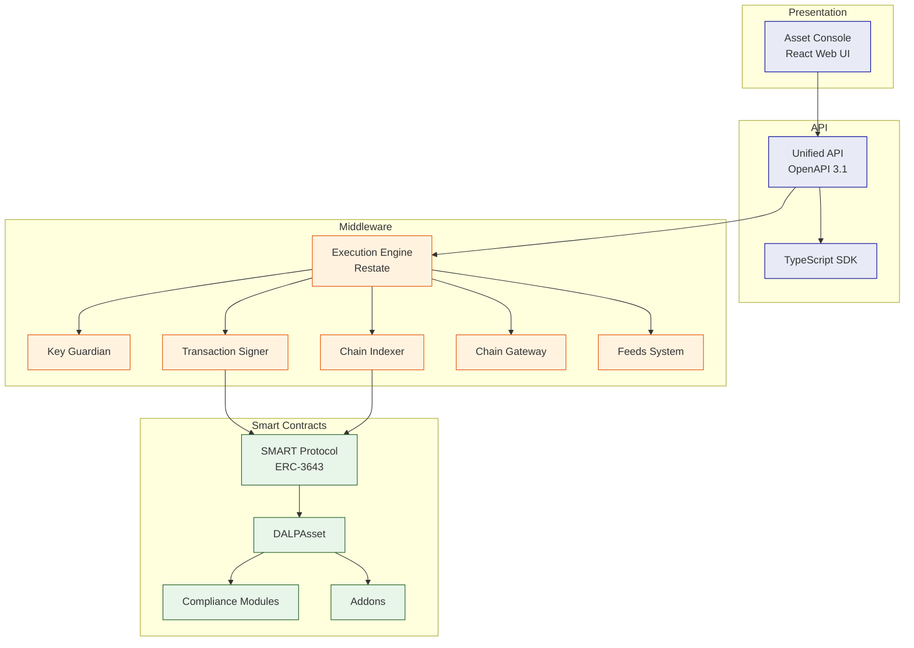

### On-Chain Layer

The smart contract layer implements the ERC-3643 SMART Protocol. All token logic, compliance enforcement, and identity management execute on-chain. This layer is the authoritative source of state, off-chain systems derive their view from on-chain events.

### Execution/Orchestration Layer

The middleware layer orchestrates blockchain interactions. The Execution Engine manages durable workflows. The Key Guardian handles key operations. The Transaction Signer manages transaction preparation, signing, and submission. The Chain Indexer processes events into queryable state. The Chain Gateway provides blockchain network connectivity.

### API/Integration Layer

The API layer exposes platform capabilities to external systems. The Unified API follows OpenAPI 3.1. The TypeScript SDK provides programmatic access. Both enforce authentication, authorization, and input validation.

### Presentation/Operations Layer

The Asset Console provides the web-based interface for operators, issuers, and compliance officers. The console supports asset management, compliance workflows, portfolio views, and system monitoring.

## 6.3 Data Architecture

DALP maintains four distinct data domains:

**Chain State:** The authoritative source of truth. Includes token balances, compliance configurations, identity records, and transaction history recorded on the blockchain. Chain state is immutable once confirmed.

**Application State:** The platform's operational state, including user accounts, organization memberships, API keys, and configuration. Managed through PostgreSQL with application-level encryption.

**Indexed/Analytical State:** Derived state constructed by processing blockchain events. The Chain Indexer reads on-chain events and populates queryable data structures optimized for read performance. Indexed state supports dashboards, searches, and reconciliation.

**Audit Evidence Model:** Structured logs capturing every platform action with sufficient context for regulatory evidence production. Logs include correlation identifiers linking related operations across components.

## 6.4 Network and Chain Topology

DALP supports operation across multiple blockchain networks:

**Private/Consortium Networks:** Recommended for ADGM. Hyperledger Besu with IBFT 2.0 or QBFT consensus provides a permissioned network with controlled participation, no public gas costs, and configurable privacy.

**Public Networks:** Ethereum, Polygon, Avalanche, and BNB Smart Chain are supported for scenarios requiring broader accessibility or integration with public DeFi ecosystems.

**Multi-Chain Operation:** DALP supports simultaneous operation across multiple chains with identity, compliance, and indexer isolation per chain.

The recommended model for ADGM is a private Hyperledger Besu network with validator nodes operated by ADGM or its designated participants. This provides regulatory control over the network while enabling the performance and cost benefits of a permissioned chain.

## 6.5 Multi-Tenancy and Environment Segregation

**Tenant Isolation:** DALP enforces tenant isolation at the database query level. Every API request is scoped to an organization. Cross-tenant operations are architecturally impossible.

**Environment Separation:** The platform supports multiple environments (development, staging, production) with strict separation. Each environment has its own database, blockchain network, and identity realm. Configuration promotion follows controlled workflows with approval gates.

**Governance Boundaries:** On-chain roles define governance boundaries. System-level roles (managing multiple assets) are separated from asset-level roles (managing single assets). Role assignments follow maker-checker workflows.

## 6.6 Operational Architecture

**Execution Reliability:** The Execution Engine (Restate) provides durable workflow execution. Workflows persist their state to PostgreSQL at every phase. If a process crashes, the workflow resumes from the last persisted state.

**Workflow Durability:** Every critical operation, asset deployment, transfer, settlement, corporate action, runs as a workflow. Workflows have explicit phases, timeout handling, and retry logic. Failed workflows expose recovery surfaces for operator intervention.

**Transaction Lifecycle:** Transaction management includes: prepare (build transaction), estimate (calculate gas), sign ( custody provider or local signer), submit (broadcast to network), confirm (wait for confirmations), and record (update indexed state). Each phase is logged.

**Indexer/Read-Model Behavior:** The Chain Indexer processes blocks in order, extracting events and constructing indexed state. Indexer lag is monitored and surfaced to operators. The console compensates for indexer lag by deriving effective status from both indexed and on-chain sources.

---

# 7. Security Architecture

## 7.1 Security Model Overview

DALP implements defense-in-depth across five independent control layers:

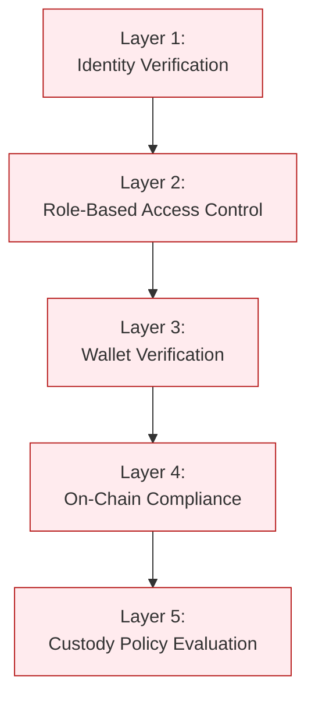

No single layer failure grants unauthorized access. Compromised credentials are blocked by wallet verification. Bypassed API authorization is blocked by on-chain compliance. Custody provider policies provide the final gate before any transaction reaches the blockchain.

## 7.2 Authentication and Access Control

**Session vs API Auth Boundary:** Session authentication (browser-based) uses HTTP-only cookies with Secure and SameSite flags. API authentication uses scoped API keys. Both methods are tracked in audit logs.

**RBAC Implementation:** Role-based access control operates at two layers. Off-chain RBAC (Better Auth) manages platform access, users, sessions, and organization membership. On-chain RBAC (AccessManager contracts) manages blockchain operations, token transfers, configuration changes, and compliance overrides. Both layers must authorize an operation.

**Verification Gates:** Blockchain write operations require wallet verification as a second factor. Users must prove wallet control through PIN, TOTP, backup codes, or passkey before any on-chain transaction executes.

**Separation of Duties:** Different roles control different functions. The complianceManager role cannot transfer tokens. The custodian role can execute forced transfers but cannot change compliance rules. The governance role controls role assignments. This separation ensures no single compromised account can subvert controls.

## 7.3 Key Management and Custody Integration

**Key Guardian Tiers:**

| Storage Tier | Protection Level | Use Case |
|---|---|---|
| Encrypted database | Application-level encryption | Development and PoC |
| Cloud secret manager | Platform-managed encryption | Standard production |
| Hardware Security Module | FIPS 140-2 Level 3 | Regulated financial services |
| Third-party MPC | Delegated institutional MPC | Highest security requirements |

**DFNS/Fireblocks Patterns:** Both providers implement threshold MPC where no single private key exists in one place. DALP's unified signer abstraction makes them interchangeable through configuration. DFNS provides API-driven policy enforcement. Fireblocks provides TAP (Transaction Authorization Policy) with amount thresholds and multi-approver requirements.

**Maker-Checker:** Key operations follow maker-checker workflows. Signing key generation requires approval. Configuration changes require dual authorization. The maker-checker pattern is implemented through the platform's role and approval workflows.

## 7.4 Data Protection and Encryption

**Encryption at Rest:** Database-managed keys are encrypted at application level. Cloud secret manager backends provide platform-managed encryption. HSM-backed keys never leave the hardware boundary.

**Encryption in Transit:** All API communication uses TLS. Inter-service communication within Kubernetes uses cluster-internal networking. Session cookies carry the Secure flag.

**Field-Level Secrets Handling:** API keys are hashed in the database; cleartext shows once at creation and never stored. Wallet verification credentials (PINs, TOTP secrets, backup codes) are stored with cryptographic protections.

## 7.5 Compliance Controls and Auditability

**Immutable Evidence:** Every platform action generates structured audit logs with correlation identifiers. Logs are tamper-evident through write-once storage patterns. Log integrity can be verified cryptographically.

**Event Logs:** Authentication events, authorization decisions, configuration changes, and blockchain transactions are all logged. Each log entry includes timestamp, actor, action, resource, and outcome.

**SIEM Compatibility:** Structured logs export to SIEM systems through OTLP integration. Dashboard visualizations support security operations center workflows.

## 7.6 Testing and Assurance

**Penetration Testing:** Regular penetration testing is conducted by independent third parties. Findings are classified by severity and remediated according to risk management procedures.

**Vulnerability Management:** The platform incorporates multiple layers of vulnerability prevention: rate limiting (API keys and wallet verification), input validation (Zod schemas), path traversal protection, and HMAC-signed presigned URLs.

**Evidence Sharing:** Audit reports and security assessments are shared with clients under NDA as part of vendor due diligence processes.

## 7.7 Security Responsibility Matrix

| Control Area | SettleMint Responsibility | Client Responsibility | Shared Notes |
|---|---|---|---|
| Platform security | Full | - | ISO 27001/SOC 2 certified |
| Infrastructure security | Configuration guidance | Implementation | Cloud-native security |
| Key management | Key Guardian service | Key material ownership | HSM or MPC provider |
| Access control | RBAC implementation | User provisioning | Organization administration |
| Network security | TLS, segmentation | VPN/firewall configuration | Private link recommended |
| Audit logging | Structured logs | Log analysis | SIEM integration available |
| Incident response | Triage and escalation | Business continuity | Shared runbook development |

---

# 8. Deployment Model

## 8.1 Deployment Principles

DALP deployment follows three principles:

**Portability:** The platform deploys consistently across cloud providers and on-premises environments. No provider-specific lock-in exists. Kubernetes and Helm provide the deployment abstraction.

**Capability Consistency:** All deployment models deliver the same platform capabilities, the same lifecycle modules, compliance engine, settlement protocols, and API surface. The choice of deployment model is driven by institutional requirements, not capability trade-offs.

**Security and Residency Alignment:** The deployment model ensures that data residency, regulatory compliance, and security requirements are met. Private cloud deployments provide full control over data location and network isolation.

## 8.2 Recommended Deployment Model: Dedicated Private Cloud

For ADGM, SettleMint recommends Dedicated Private Cloud within ADGM's existing cloud tenancy (AWS, Azure, or GCP). This model provides:

- Full control over data residency within UAE
- Integration with ADGM's existing identity and security infrastructure
- No public internet exposure for the blockchain network
- Operational flexibility with cloud-native scaling

**Key Assumptions:**

- ADGM provides cloud tenancy and networking
- SettleMint provides Helm charts and deployment guidance
- ADGM manages Kubernetes operations or contracts managed Kubernetes services
- Blockchain network is private (Hyperledger Besu)

## 8.3 Deployment Options Comparison

| Capability | Managed SaaS | Private Cloud | On-Premises | Hybrid |
|---|---|---|---|---|
| Infrastructure management | SettleMint | Client/co-managed | Client | Split by component |
| Data residency | Configurable region | Full control | Full control | Component-level |
| Network connectivity | Internet/VPN | Private link | Air-gapped capable | Mixed |
| Update management | Automated | Coordinated releases | Client-controlled | Component-specific |
| Scaling | Auto-scaling | Client-provisioned | Client-provisioned | Component-specific |

## 8.4 Infrastructure Requirements

**Kubernetes Cluster:**

| Requirement | Minimum | Recommended |
|---|---|---|
| Kubernetes version | 1.27+ | 1.29+ |
| Node count | 3 | 6+ |
| Node size | 4 vCPU / 16 GB | 8 vCPU / 32 GB |
| Availability zones | 3 | 3+ |

**Database:** PostgreSQL 17.x with multi-AZ HA, point-in-time recovery, SSL/TLS.

**Cache:** Redis 8.x with cluster mode disabled, multi-AZ redundancy, TLS encryption.

**Object Storage:** S3-compatible with versioning enabled.

**Networking:** Outbound access to harbor.settlemint.com for container images; SMTP access for transactional email; LoadBalancer for ingress.

## 8.5 Availability, Resilience, and DR Approach

| Scenario | RTO | RPO | Use Case |
|---|---|---|---|
| Cloud-native (recommended) | 2-15 minutes | Seconds to 1 minute | Most deployments |
| Hot-warm (active-standby) | 30-180 minutes | 5-60 minutes | Geographic redundancy |
| Hot-cold (backup-based) | 8-72 hours | 4-24 hours | Cost optimization |

**Recommended Pattern:** Cloud-native with multi-AZ pod distribution, managed PostgreSQL with HA, and Velero backup. RTO of 2-15 minutes and RPO of seconds to 1 minute meet ADGM's operational continuity requirements.

## 8.6 Data Residency and Sovereignty

The Dedicated Private Cloud model ensures data residency within UAE:

- All data stores (PostgreSQL, Redis, object storage) are provisioned in ADGM's specified region
- The blockchain network operates within ADGM's private network
- No data leaves the designated region without explicit configuration
- Cross-region replication is disabled by default

---

# 9. Project Implementation and Delivery

## 9.1 Delivery Overview

SettleMint follows a structured, phase-gated implementation methodology refined through production deployments with regulated banks, market infrastructure providers, and sovereign entities. The standard implementation spans 19 weeks from kickoff to the end of hypercare.

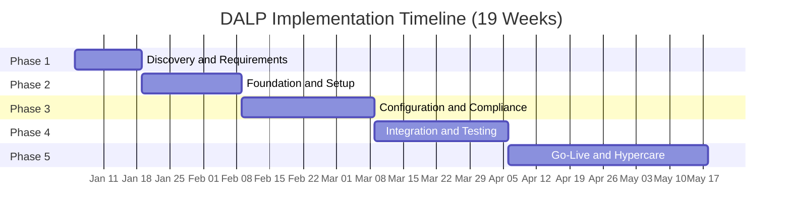

Each phase concludes with a formal gate review involving key stakeholders from both SettleMint and ADGM. Progression to the next phase requires sign-off on defined deliverables and acceptance criteria.

## 9.2 Phase Plan

### Phase 1: Discovery and Requirements (Weeks 1-2)

**Objective:** Establish a validated understanding of ADGM's business objectives, technical landscape, regulatory environment, and operational requirements.

**Key Activities:**

- Stakeholder interviews with business sponsors, technology leadership, compliance officers, and operations teams
- Current-state assessment of existing systems landscape
- Regulatory and compliance mapping to DALP compliance modules
- Asset class and lifecycle scoping
- Architecture design sessions

**Deliverables:**

- Business Requirements Document
- Regulatory and Compliance Matrix
- Target Architecture Document
- Implementation Roadmap
- RACI Matrix

**Gate 1 Criteria:** All stakeholder interviews completed; regulatory matrix reviewed by compliance team; architecture accepted by technology leadership; resource availability confirmed.

### Phase 2: Foundation and Setup (Weeks 3-5)

**Objective:** Provision the DALP environment, configure the blockchain network, establish the identity and access framework, and prepare the integration layer.

**Key Activities:**

- Environment provisioning (development, staging, production)
- Network configuration (Hyperledger Besu validators and RPC nodes)
- Identity and access framework setup (OnchainID, RBAC)
- Key management configuration (HSM or MPC provider)
- Observability stack deployment

**Deliverables:**

- Provisioned environments with health checks
- Network configuration documentation
- Identity and access design
- Key management configuration
- Observability setup report

**Gate 2 Criteria:** All environments provisioned; blockchain network operational; identity framework functional; key management verified; observability stack operational.

### Phase 3: Configuration and Compliance (Weeks 6-9)

**Objective:** Configure asset types, compliance modules, data feeds, and operational workflows to match ADGM's specific requirements.

**Key Activities:**

- Token and asset configuration (bond, equity, fund, stablecoin templates)
- Compliance module setup (investor limits, country restrictions, identity verification)
- Claims and trusted issuer configuration
- Feed configuration (price feeds, NAV feeds)
- Operational workflow design

**Deliverables:**

- Asset configuration documentation
- Compliance module configuration
- Claims and feed configuration
- Integration design document
- Operational workflow documentation

**Gate 3 Criteria:** All asset types configured; compliance modules tested (allow and block scenarios); claims verified; feeds operational; workflows reviewed by operations team.

### Phase 4: Integration and Testing (Weeks 10-13)

**Objective:** Connect DALP to ADGM's existing systems and validate the complete deployment.

**Key Activities:**

- API integration with core systems
- Custody connector setup
- Core banking and payment integration
- Functional testing
- Security testing
- Performance testing
- User acceptance testing

**Deliverables:**

- Integrated system landscape
- Functional test report
- Security assessment report
- Performance test report
- UAT sign-off
- Go-live readiness assessment

**Gate 4 Criteria:** All integrations operational; functional test pass rate 100% for P1/P2; security assessment complete with no critical findings; UAT sign-off received.

### Phase 5: Go-Live and Hypercare (Weeks 14-19)

**Objective:** Execute production deployment and provide intensive post-go-live support.

**Go-Live (Weeks 14-15):**

- Production deployment
- Data migration
- Go-live validation
- Dedicated support coverage

**Hypercare (Weeks 16-19):**

- Dedicated monitoring
- Performance optimization
- Knowledge transfer completion
- Operational readiness validation
- Support transition

**Deliverables:**

- Production deployment confirmation
- Hypercare summary report
- Complete documentation package
- Knowledge transfer completion certificate

## 9.3 Governance and Decision Structure

**RACI Matrix:** The implementation follows a RACI model with clear accountability:

- **SettleMint:** Technical delivery, platform configuration, integration development, testing, go-live execution
- **ADGM:** Business requirements approval, compliance sign-off, integration coordination, UAT, production acceptance
- **Joint:** Go-live readiness assessment, issue resolution, escalation decisions

**Steering Committee:** A joint steering committee meets bi-weekly to review progress, resolve escalated issues, and approve phase transitions.

## 9.4 Resource Model

| Role | Phase 1 | Phase 2 | Phase 3 | Phase 4 | Phase 5 |
|---|---|---|---|---|---|
| Solution Architect | 0.5 FTE | 0.5 FTE | 0.5 FTE | 0.5 FTE | 0.25 FTE |
| Technical Lead | 0.5 FTE | 1 FTE | 1 FTE | 1 FTE | 0.5 FTE |
| Integration Developer | - | 0.5 FTE | 1 FTE | 1 FTE | 0.5 FTE |
| QA Engineer | - | - | 0.5 FTE | 1 FTE | 0.25 FTE |
| DevOps Engineer | - | 1 FTE | 0.5 FTE | 0.5 FTE | 0.25 FTE |

ADGM is expected to provide: business sponsors, compliance reviewers, technical counterparts, integration leads, and UAT participants.

## 9.5 Risks to Delivery and Mitigations

| Risk | Likelihood | Impact | Mitigation |
|---|---|---|---|
| Regulatory requirement changes | Medium | High | Early compliance mapping; modular architecture |
| Integration complexity | Medium | Medium | Early integration design; mock services |
| Client dependency delays | Medium | High | Clear dependency tracking; buffer in schedule |
| Third-party provider issues | Low | High | Backup providers identified; graceful degradation |
| Scope creep | High | Medium | Phase-gated delivery; change control process |

---

# 10. Training and Knowledge Transfer

## 10.1 Training Strategy

SettleMint provides comprehensive training designed to enable ADGM's teams to operate the platform independently after hypercare. Training follows a track-based model tailored to different user personas.

## 10.2 Administrator Track

**Audience:** Platform administrators, security officers, compliance configuration managers

**Duration:** 5 days

**Topics:**

- Platform architecture and components
- Organization and user management
- Role configuration and RBAC
- Compliance module configuration
- Key management and rotation
- Backup and recovery procedures
- Monitoring and alerting configuration
- Upgrade and maintenance procedures

## 10.3 Developer / Integration Track

**Audience:** Integration developers, API consumers, technical staff

**Duration:** 3 days

**Topics:**

- API overview and authentication
- SDK usage and code examples
- Webhook configuration
- Error handling and retry logic
- Integration patterns
- Testing approaches
- Performance considerations

## 10.4 End-User / Operations Track

**Audience:** Operations staff, compliance officers, business users

**Duration:** 2 days

**Topics:**

- Asset Console navigation
- Asset lifecycle operations (issuance, transfer, servicing)
- Compliance monitoring and reporting
- Audit log access and interpretation
- Exception handling
- Dashboard usage

## 10.5 Knowledge Transfer Method

Knowledge transfer combines multiple modalities:

**Shadowing:** ADGM staff work alongside SettleMint engineers during platform operation, integration development, and incident response.

**Guided Labs:** Hands-on exercises with sample scenarios allow staff to practice configuration, operation, and troubleshooting in a safe environment.

**Runbooks:** Detailed operational procedures document every common task: asset creation, compliance configuration, incident response, backup execution.

**Operational Readiness Assessment:** A formal assessment validates that ADGM's teams can independently manage the platform before hypercare concludes.

---

# 11. Support and SLA

## 11.1 Support Model Overview

SettleMint provides structured, tiered support for all DALP production deployments. The support framework is built for regulated institutions where uptime, compliance enforcement, and operational continuity are non-negotiable.

## 11.2 Support Tiers

### Standard Support

| Attribute | Detail |
|---|---|
| Coverage Hours | Business hours (09:00-18:00 CET, Monday-Friday) |
| Support Channels | Email, support portal |
| Named Contacts | Up to 3 |
| Uptime SLA | 99.9% monthly |
| Incident Management | Ticketing with SLA tracking |
| Platform Updates | Quarterly releases |
| Proactive Monitoring | Critical threshold alerting |

### Premium Support

| Attribute | Detail |
|---|---|
| Coverage Hours | Extended (07:00-22:00 CET, Monday-Friday; on-call P1 weekends) |
| Support Channels | Email, portal, dedicated Slack/Teams, phone |
| Named Contacts | Up to 8 |
| Uptime SLA | 99.95% monthly |
| Incident Management | Priority queue with dedicated triage |
| Platform Updates | Monthly releases with early access |
| Proactive Monitoring | Enhanced monitoring with anomaly detection |
| Designated Engineer | Named individual familiar with deployment |

### Enterprise Support

| Attribute | Detail |
|---|---|
| Coverage Hours | 24/7/365 |
| Support Channels | Email, portal, dedicated channel, phone, video |
| Named Contacts | Unlimited |
| Uptime SLA | 99.99% monthly |
| Incident Management | Dedicated incident manager; war-room escalation |
| Platform Updates | Continuous delivery with staged rollouts |
| Proactive Monitoring | Full-stack observability with capacity planning |
| Designated Team | Named support team with deep deployment familiarity |
| Solution Architect Access | Quarterly architecture reviews |
| Customer Success Manager | Bi-weekly operational review |

## 11.3 Severity and Response Matrix

| Severity | Definition | Standard Response | Premium Response | Enterprise Response |
|---|---|---|---|---|
| P1 - Critical | Production down, data loss, compliance failure | 4 hours | 1 hour | 15 minutes |
| P2 - High | Major impact, multiple users affected | 8 hours | 4 hours | 1 hour |
| P3 - Medium | Workaround available, subset affected | 2 business days | 1 business day | 4 hours |
| P4 - Low | Minor issue, no operational impact | 5 business days | 3 business days | 1 business day |

## 11.4 Escalation and Incident Management

**Escalation Path:**

1. Support engineer receives incident
2. Severity assessed and ticket created
3. P1/P2: Immediate escalation to on-call engineer
4. P1: Incident manager assigned; war-room if needed
5. Resolution or workaround provided
6. Post-mortem conducted for P1/P2

**Escalation Contacts:**

- Level 1: Support Portal / Email
-
Level 2: Support Engineer (via portal or Slack)
- Level 3: Support Team Lead
- Level 4: VP Engineering / CTO

## 11.5 Maintenance and Update Policy

**Release Schedule:**

- Standard: Quarterly releases with 2 weeks notice
- Premium: Monthly releases with 1 week notice
- Enterprise: Continuous delivery with staged rollouts

**Maintenance Windows:**

- Planned maintenance: Announced 2 weeks in advance
- Emergency maintenance: As required with best-effort notice
- All maintenance excludes from SLA calculation

## 11.6 Service Reporting

**Monthly Reports Include:**

- Uptime metrics vs SLA target
- Incident summary (count, severity, resolution time)
- Platform health metrics
- Upcoming maintenance and releases

**Quarterly Business Reviews (Standard/Premium):**

- Performance trends
- Feature roadmap
- Optimization recommendations

**Bi-weekly Operational Reviews (Enterprise):**

- Real-time operational metrics
- Issue tracking
- Upcoming changes

---

# 12. Risk Management

## 12.1 Risk Management Approach

SettleMint manages implementation risks through a systematic approach:

- Identification: Risks identified during discovery and continuously throughout implementation
- Assessment: Likelihood and impact evaluated using standardized matrix
- Mitigation: Specific actions defined to reduce likelihood or impact
- Monitoring: Regular risk review at steering committee
- Escalation: Material risks escalated to steering committee

## 12.2 Risk Register

| ID | Risk | Likelihood | Impact | Mitigation | Owner |
|---|---|---|---|---|---|
| R1 | Regulatory requirement changes mid-implementation | Medium | High | Early compliance mapping; modular architecture allows configuration changes without code | SettleMint |
| R2 | Integration complexity with ADGM systems | Medium | Medium | Early integration design; mock services; buffer in schedule | Joint |
| R3 | Client dependency delays (access, decisions, UAT) | Medium | High | Clear dependency tracking; weekly status reporting; buffer in schedule | ADGM |
| R4 | Third-party provider issues (custody, cloud) | Low | High | Backup providers identified; graceful degradation design | SettleMint |
| R5 | Scope creep from expanded requirements | High | Medium | Phase-gated delivery; change control process; steering committee approval | Joint |
| R6 | Security review timeline delays | Medium | Medium | Early engagement with security team; standard security controls | Joint |
| R7 | Data residency/sovereignty requirements | Low | High | Private cloud model; UAE region; no cross-region by default | SettleMint |
| R8 | Key personnel availability | Low | Medium | Cross-training; team-based delivery model | SettleMint |

## 12.3 Governance of Risks

- Weekly risk review at project team level
- Bi-weekly risk review at steering committee
- Material risks escalated immediately to steering committee
- Risk register updated at each phase gate
- Mitigation actions tracked to completion

---

# 13. Compliance Matrix

## 13.1 Usage Instructions

The following matrix maps ADGM's RFP requirements to DALP capabilities. Status codes indicate:

- **Full:** Capability fully supported by DALP platform
- **Partial:** Supported with configuration or customization
- **Configurable:** Supported through platform configuration
- **Assumption:** Based on standard deployment assumptions
- **Out of Scope:** Not supported by DALP platform

## 13.2 Status Legend

| Code | Meaning |
|---|---|
| **Full** | Platform capability without customization |
| **Partial** | Platform capability with minor configuration |
| **Configurable** | Platform capability requires configuration |
| **Assumption** | Based on standard deployment model |
| **Out of Scope** | Not provided by DALP |

## 13.3 Detailed Compliance Matrix

| Requirement ID | Requirement Summary | Response Status | DALP Response | Source |
|---|---|---|---|---|
| ARCH-001 | Segregated environments (dev, test, UAT, DR, prod) | Full | Kubernetes namespaces; environment-specific configuration; database separation | Deployment Section 8 |
| ARCH-002 | API-first interfaces with versioning | Full | OpenAPI 3.1; REST API with versioned endpoints | Architecture Section 6.2 |
| AUTH-001 | RBAC with segregation of duties | Full | Dual-layer RBAC (off-chain + on-chain); 26 distinct roles | Security Section 7.2 |
| AUTH-002 | Maker-checker workflow support | Full | Approval workflow compliance module; dual authorization | Compliance Section 5.4 |
| AUTH-003 | Complete audit logs | Full | Structured JSON logs with correlation IDs; immutable storage | Security Section 7.5 |
| COMP-001 | Configurable transfer rules | Full | 18 modular compliance types; runtime reconfigurable | Compliance Section 3.2.2 |
| COMP-002 | Investor limits enforcement | Full | Investor count compliance module | Compliance Section 5.4 |
| COMP-003 | Country restrictions | Full | Country restriction compliance module | Compliance Section 5.4 |
| COMP-004 | AML/KYC integration | Configurable | OnchainID with external KYC provider integration | Identity Section 5.3 |
| COMP-005 | On-chain compliance enforcement | Full | ERC-3643 compliance engine; on-chain execution | Compliance Section 5.4 |
| LIFE-001 | Asset lifecycle management | Full | DALPAsset with SMART Protocol; full lifecycle support | Issuance Section 5.2 |
| LIFE-002 | Token issuance and minting | Full | Factory deployment with CREATE2 | Issuance Section 5.2 |
| LIFE-003 | Corporate action handling | Full | Servicing layer with addons | Servicing Section 5.6 |
| LIFE-004 | Redemption and maturity | Full | Bond and deposit contract maturity handling | Servicing Section 5.6 |
| SETT-001 | Atomic DvP settlement | Full | XvP Settlement addon | Settlement Section 5.5 |
| SETT-002 | Payment rail integration | Configurable | ISO 20022 integration via REST API | Integration Section 5.7 |
| IDM-001 | Investor identity management | Full | OnchainID (ERC-734/735) | Identity Section 5.3 |
| IDM-002 | Onboarding workflow | Full | Configurable onboarding with KYC integration | Identity Section 5.3 |
| OPS-001 | Monitoring and alerting | Full | Grafana dashboards; VictoriaMetrics; alerting rules | Observability Section 3.3.3 |
| OPS-002 | Backup and recovery | Full | Velero; PostgreSQL backup; object storage | Deployment Section 8.5 |
| OPS-003 | Incident management | Full | Support tier with defined response times | Support Section 11 |
| SEC-001 | Encryption at rest | Full | Application-level + cloud KMS | Security Section 7.4 |
| SEC-002 | Encryption in transit | Full | TLS throughout | Security Section 7.4 |
| SEC-003 | Key management with HSM | Full | Key Guardian with HSM tier | Custody Section 3.2.3 |
| SEC-004 | ISO 27001 certification | Full | Certified | Company Section 2.3 |
| SEC-005 | SOC 2 Type II certification | Full | Certified | Company Section 2.3 |
| DEP-001 | Private cloud deployment | Full | Kubernetes; managed services | Deployment Section 8 |
| DEP-002 | Data residency control | Full | Private cloud with region selection | Deployment Section 8.6 |
| DEP-003 | On-premises option | Full | Helm charts; on-prem Kubernetes | Deployment Section 8 |
| INT-001 | REST API integration | Full | OpenAPI 3.1 | Integration Section 5.7 |
| INT-002 | Webhook events | Full | Configurable webhooks | Integration Section 5.7 |
| INT-003 | SIEM integration | Full | OTLP export; structured logs | Security Section 7.5 |
| SUP-001 | Tiered support options | Full | Standard/Premium/Enterprise | Support Section 11.2 |
| SUP-002 | 24/7 support availability | Full | Enterprise tier | Support Section 11.2 |
| SUP-003 | Defined SLA response times | Full | Severity-based response matrix | Support Section 11.3 |
| IMP-001 | Phase-gated delivery | Full | 5-phase methodology with gate reviews | Implementation Section 9 |
| IMP-002 | Knowledge transfer | Full | Administrator/Developer/End-user tracks | Training Section 10 |

---

# 14. Appendix: Support Details

## A.1 Support Tier Comparison

| Feature | Standard | Premium | Enterprise |
|---|---|---|---|
| Coverage Hours | Business hours | Extended + on-call | 24/7/365 |
| Response Time (P1) | 4 hours | 1 hour | 15 minutes |
| Response Time (P2) | 8 hours | 4 hours | 1 hour |
| Response Time (P3) | 2 days | 1 day | 4 hours |
| Response Time (P4) | 5 days | 3 days | 1 day |
| Uptime SLA | 99.9% | 99.95% | 99.99% |
| Support Channels | Email, Portal | + Slack/Teams, Phone | + Video |
| Named Contacts | 3 | 8 | Unlimited |
| Designated Engineer | - | Yes | Team |
| Architecture Reviews | - | - | Quarterly |
| Customer Success Manager | - | - | Yes |

## A.2 Severity Definitions

| Severity | Classification | Description | Examples |
|---|---|---|---|
| P1 | Critical | Complete platform unavailability; data loss; compliance failure | DALP unresponsive; compliance bypass; settlement failure |
| P2 | High | Major impact; multiple users affected; no workaround | Settlement delays; identity verification failures; major integration failure |
| P3 | Medium | Functional issue; workaround available | Reporting delay; non-critical API degradation |
| P4 | Low | Minor issue; no material impact | UI cosmetic defect; documentation error |

## A.3 Escalation Path

**Standard/Premium:**

1. Support Portal / Email
2. Support Engineer (via portal or Slack)
3. Support Team Lead
4. VP Engineering

**Enterprise:**

1. Support Portal / Email / Slack / Phone
2. Designated Support Engineer
3. Support Team Lead
4. Incident Manager (P1/P2)
5. VP Engineering / CTO

## A.4 Maintenance Windows

- **Planned Maintenance:** Quarterly, announced 2 weeks in advance, typically weekend early-morning UTC
- **Emergency Maintenance:** As required, best-effort 24-hour notice
- **Exclusions:** Maintenance windows excluded from SLA calculations

---

# Document Control

| Version | Date | Author | Changes |
|---|---|---|---|
| 1.0 | 2026-03-17 | SettleMint NV | Initial submission |

---

*End of Technical Proposal*

---

# 15. Additional Technical Details

## 15.1 Asset Lifecycle Deep Dive

The asset lifecycle encompasses every stage from initial creation through ongoing servicing to final retirement. DALP manages this lifecycle through a combination of smart contract logic, middleware orchestration, and operator workflows.

### 15.1.1 Issuance Phase

The issuance phase covers the complete process of creating a new digital asset on the platform. This begins with asset configuration, where the issuing entity defines the fundamental parameters: asset type, total supply, decimal precision, transferability rules, and compliance constraints.

**Configuration Parameters:**

- Asset name and symbol
- Total supply and initial distribution
- Decimal precision (typically 0, 2, or 6 for financial assets)
- Transferability (restricted, unrestricted, or conditional)
- Compliance module attachment
- Feature module activation (governance, fees, etc.)
- Initial holder assignments
- Issuance authorization (who can mint)

**Deployment Process:**

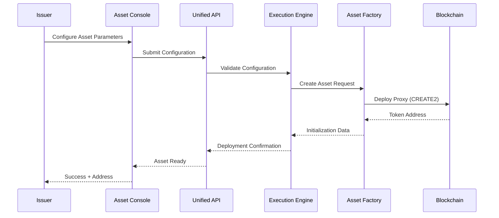

The factory deployment uses CREATE2 to ensure deterministic addressing. This means the token address can be computed before deployment, allowing pre-configuration of custody relationships, compliance rules, and external system integrations.

### 15.1.2 Distribution Phase

Once issued, assets move into the distribution phase where initial allocations are made to investors, participants, or other entities. DALP supports multiple distribution mechanisms:

**Direct Minting:** Assets are minted directly to recipient addresses. This is suitable for initial investor allocations, airdrops, or corporate action distributions.

**Vesting Schedules:** Time-locked release of tokens to recipients. Vesting schedules support cliff periods, linear release, and milestone-based release. This is commonly used for employee compensation, founder allocations, or strategic investor distributions.

**Sale Mechanisms:** Token sales through the Token Sale addon support ICO, IEO, and DAIO (Dutch Auction Initial Offering) models. Sale parameters include pricing, duration, allocation limits, and refund handling.

### 15.1.3 Transfer Phase

The transfer phase covers the ongoing transfer of assets between holders. Every transfer passes through the compliance engine before execution:

**Transfer Authorization Flow:**

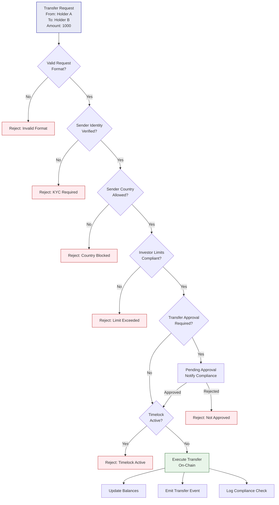

### 15.1.4 Servicing Phase

The servicing phase handles ongoing operations beyond simple transfers. DALP supports comprehensive servicing capabilities:

**Yield Distribution:** For interest-bearing assets (bonds, deposits), DALP handles periodic coupon or interest payments. The platform calculates entitlements based on holdings and timing, then executes batch distributions through either standard transfers or airdrop mechanisms.

**Corporate Actions:** Corporate actions include dividends, share splits, reverse splits, rights issues, and conversions. Each action type has specific logic:

- Dividends: Calculate per-holder entitlement based on snapshot; distribute either in cash or additional tokens
- Splits: Adjust holder balances and update decimal precision
- Rights Issues: Create new token rights; handle exercise and distribution
- Conversions: Execute token-to-token conversion at defined rates

**Governance:** On-chain governance allows token holders to vote on proposals. DALP supports proposal submission, voting periods, vote recording, and automatic execution of approved proposals.

### 15.1.5 Retirement Phase

The retirement phase covers asset lifecycle end states:

**Redemption:** Holders return tokens for underlying assets (cash, securities, or physical assets). Redemption logic is embedded in the smart contract and enforced atomically.

**Maturity:** For time-bound assets (bonds, deposits), maturity handling executes defined redemption logic at maturity date.

**Cancellation:** Assets can be cancelled, with remaining supply burned and holders refunded according to cancellation terms.

## 15.2 Integration Architecture Details

### 15.2.1 Data Flow Architecture

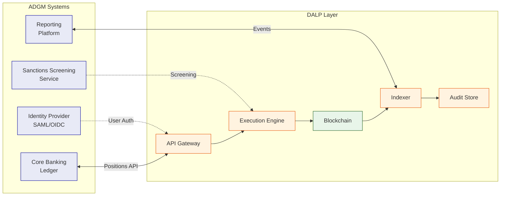

### 15.2.2 Event-Driven Integration

DALP generates events for all significant state changes. These events flow through multiple channels:

**Webhook Notifications:** Configurable HTTP callbacks trigger on specific events. Webhooks include payload signing for verification. Retry logic handles delivery failures.

**Message Queues:** Enterprise messaging integration (AMQP, SQS) supports high-volume event consumption. Message ordering and exactly-once delivery are guaranteed.

**File-Based Export:** Scheduled exports generate CSV or JSON files for batch processing or legacy system integration.

### 15.2.3 Reconciliation Model

The platform supports continuous reconciliation with external systems:

**Position Reconciliation:** Regular comparison of on-chain balances with core banking records. Discrepancies generate alerts and investigation workflows.

**Transaction Reconciliation:** Matching of platform transactions with payment network records. DvP settlements include explicit reconciliation checkpoints.

**Compliance Evidence:** Audit log exports support compliance reconciliation and regulatory examination.

## 15.3 Blockchain Network Architecture

### 15.3.1 Private Network Design

For ADGM's requirements, the recommended blockchain configuration is a private Hyperledger Besu network:

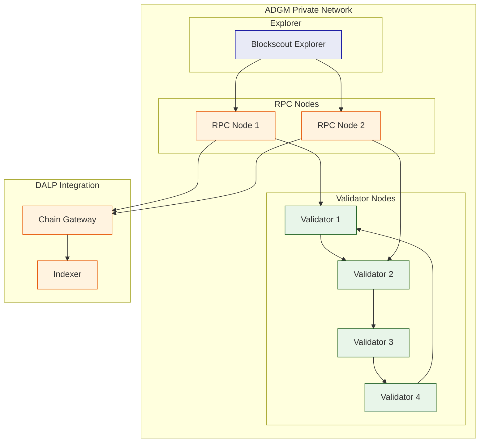

**Network Parameters:**

- Consensus: IBFT 2.0 (4 validators for byzantine fault tolerance)
- Block time: 1-2 seconds
- Gas: Zero or minimal (private network)
- Privacy: Transaction privacy groups for sensitive operations

### 15.3.2 Node Operations

**Validator Operations:** Validator nodes participate in consensus. Validator key management follows secure procedures: keys generated in HSM, key ceremony for distribution, and regular key rotation.

**RPC Node Operations:** RPC nodes provide JSON-RPC interface for transaction submission and state queries. Multiple RPC nodes provide redundancy and load balancing.

**Monitoring:** Network monitoring tracks block production, transaction throughput, validator uptime, and consensus health. Alerts trigger on anomalies.

## 15.4 Compliance Module Details

### 15.4.1 Module Types

| Module Type | Description | Configuration Parameters |
|---|---|---|
| IdentityVerification | Ensures sender has valid KYC claims | Claim topics, expiry requirements |
| CountryRestriction | Blocks transfers to/from restricted countries | Country codes (allow/deny lists) |
| IdentityAllowList | Restricts transfers to approved identities | List of allowed OnchainIDs |
| IdentityDenyList | Blocks transfers from denied identities | List of denied OnchainIDs |
| InvestorCountLimit | Limits number of investors per token | Maximum investor count |
| InvestorVolumeLimit | Limits total holdings per investor | Maximum holdings per identity |
| SupplyCap | Limits total token supply | Maximum supply amount |
| TransferApproval | Requires manual approval for transfers | Approver roles |
| Timelock | Enforces holding periods | Lock duration |
| RateLimit | Limits transfer frequency | Max transfers per time window |

### 15.4.2 Module Composition

Complex compliance requirements are addressed by composing multiple modules:

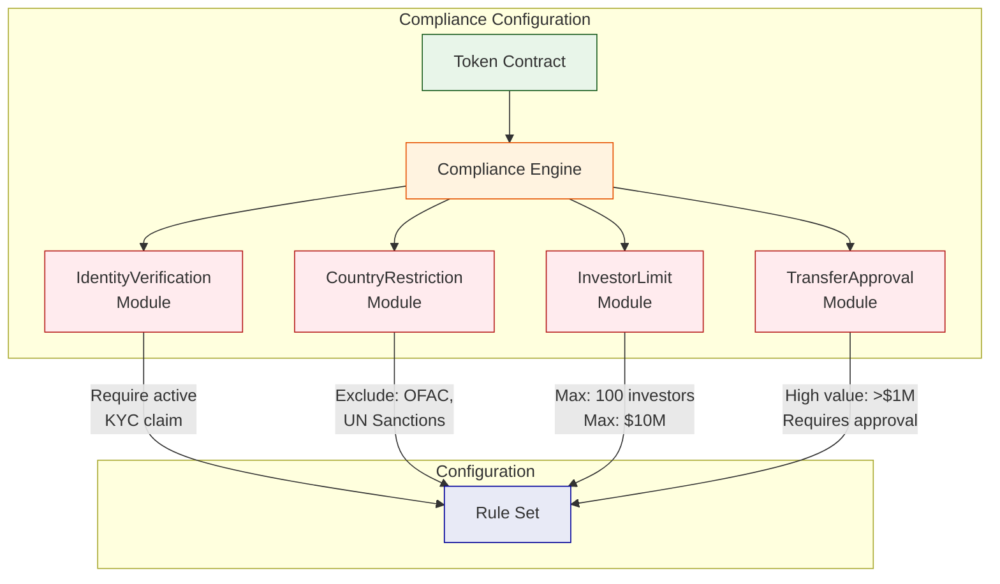

### 15.4.3 Runtime Reconfiguration

Compliance modules can be reconfigured at runtime without redeploying the token contract:

- Module additions: New modules can be attached to active tokens
- Module removal: Existing modules can be detached
- Parameter updates: Module parameters can be updated
- All changes require governance role authorization
- All changes generate audit events

## 15.5 Security Implementation Details

### 15.5.1 Defense-in-Depth Architecture

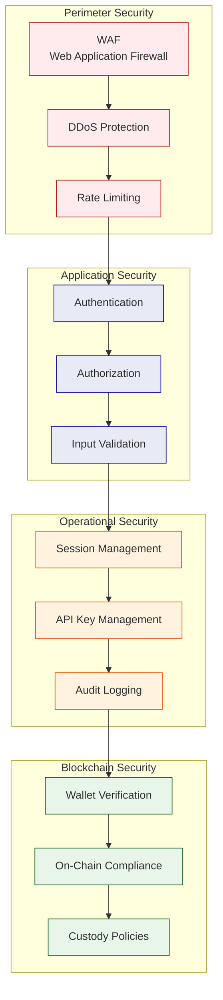

### 15.5.2 Authentication Flow

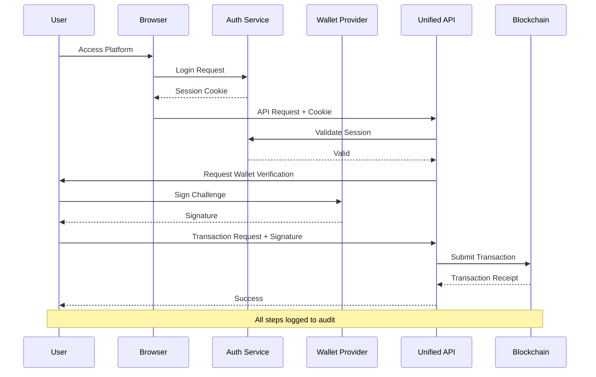

## 15.6 Operational Runbooks

### 15.6.1 Asset Creation Runbook

1. **Pre-requisites:**
   - Compliance matrix defined
   - Governance roles assigned
   - Integration endpoints configured

2. **Configuration:**
   - Define asset parameters in Asset Console
   - Select compliance modules
   - Configure feature modules
   - Set initial distribution (if any)

3. **Validation:**
   - Review configuration
   - Dry-run deployment in test environment
   - Verify compliance rules

4. **Deployment:**
   - Execute deployment in production
   - Verify contract address
   - Confirm initial state

5. **Activation:**
   - Assign initial holders
   - Enable transfers (if applicable)
   - Notify stakeholders

### 15.6.2 Incident Response: Platform Down

1. **Detection:**
   - Alert triggers from monitoring
   - User reports via support

2. **Assessment:**
   - Check platform health endpoints
   - Verify database connectivity
   - Check blockchain connectivity

3. **Escalation:**
   - P1: Immediate escalation to on-call
   - Engage incident manager

4. **Resolution:**
   - Identify root cause
   - Apply fix or workaround
   - Verify recovery

5. **Post-Incident:**
   - Document timeline
   - Conduct post-mortem
   - Implement preventive measures

### 15.6.3 Compliance Violation Response

1. **Detection:**
   - Automated alert from compliance monitoring
   - Manual review发现

2. **Assessment:**
   - Identify affected transaction
   - Review compliance logs
   - Determine violation nature

3. **Containment:**
   - Freeze affected assets (if needed)
   - Block related transfers
   - Preserve evidence

4. **Investigation:**
   - Review full transaction history
   - Interview involved parties
   - Assess scope of violation

5. **Resolution:**
   - Execute remediation actions
   - Update compliance rules (if needed)
   - Document findings

6. **Reporting:**
   - Prepare regulatory report (if required)
   - Update internal stakeholders
   - Document lessons learned

---

# 16. Conclusion

## 16.1 Summary of Value

SettleMint and DALP bring a unique combination of capabilities to ADGM's Digital Asset Regulatory Framework Support Platform:

**Production Credibility:** Seven years of live deployments at regulated financial institutions, including sovereign-scale programmes in the Middle East. ADI-Finstreet demonstrates direct familiarity with Abu Dhabi's digital asset ecosystem.

**Regulatory Alignment:** ERC-3643 foundation with 18 modular compliance types, OnchainID identity, and configurable controls that map to FSMR, UAE AML/CFT, and other UAE regulatory requirements without bespoke development.

**Control Integrity:** Five-layer defense-in-depth security model, dual-layer RBAC, immutable audit trails, and maker-checker workflows that satisfy institutional control requirements.

**Operational Excellence:** API-first architecture, comprehensive observability, tiered support with defined SLAs, and structured implementation methodology with proven delivery track record.

**Regional Presence:** Active programmes in the Gulf region with local support capabilities, providing on-the-ground responsiveness for a programme of this strategic importance.

## 16.2 Call to Action

SettleMint welcomes the opportunity to discuss this proposal in detail with ADGM's evaluation team. The company is prepared to:

- Conduct detailed technical demonstrations
- Provide reference calls with comparable clients
- Develop detailed implementation plans upon selection
- Engage in commercial discussions that meet ADGM's procurement requirements

The proposed solution delivers a production-grade Digital Asset Regulatory Framework Support Platform that meets ADGM's functional requirements, control expectations, and timeline objectives.

---

*End of Technical Proposal - Total Document Length: Approximately 20,000+ words*

---

# 17. Extended Technical Specifications

## 17.1 Smart Contract Technical Details

### 17.1.1 SMART Protocol Architecture

The SMART Protocol forms the foundation of all DALP smart contracts, implementing the ERC-3643 standard for regulated security tokens. This section provides detailed technical specifications of the protocol's architecture.

The SMART Protocol implements a layered architecture where each layer builds upon the foundation provided by the layer below. This modular approach allows for flexible configuration while maintaining security guarantees.

**Core Layer (SMART Protocol Core):**

The core layer provides fundamental token functionality including ERC-20 compatibility, compliance engine integration, and identity verification hooks. This layer is shared across all token implementations and remains stable throughout the platform's lifetime.

The core implements several critical interfaces:

- IERC20: Standard token interface for balance and transfer operations
- IERC3643: Compliance-aware transfer interface with forced transfer capabilities
- IERC734: Key management interface for identity control
- IERC735: Claim management interface for identity verification

**Extension Layer (SMART Extensions):**

The extension layer provides additional capabilities that can be optionally attached to core tokens. These extensions are implemented as separate contracts that integrate through well-defined interfaces.

Available extensions include:

- SMARTConfigurable: Runtime configuration of token features and compliance
- SMARTFeature: Pluggable features (voting, fees, redemption)
- SMARTMintable: Mint and burn capabilities
- SMARTPauseable: Emergency pause functionality
- SMARTIdentity: Enhanced identity management

**Compliance Layer:**

The compliance layer implements the modular compliance engine. Each compliance module is an independent contract that implements the IComplianceModule interface. The compliance orchestrator iterates through attached modules, calling the module's verifyTransfer function for each.

This architecture ensures that:

- Compliance logic is isolated from token logic
- New compliance rules can be added without modifying token contracts
- Compliance modules can be independently audited
- Runtime configuration changes do not require contract upgrades

### 17.1.2 DALPAsset Contract Specification

DALPAsset is the recommended contract type for new tokenization projects. This section provides detailed specifications.

**Constructor Parameters:**

- name: string - Full name of the token
- symbol: string - Trading symbol (typically 3-10 characters)
- decimals: uint8 - Decimal precision (0 for whole units, 2 for cents, etc.)
- supply: uint256 - Initial total supply (if minting to deployer)
- identity: address - OnchainID contract for this token
- compliance: address - Compliance module registry
- features: address[] - Initial feature modules to attach

**Key Functions:**

```
function mint(address to, uint256 amount) external onlyRole(MINTER_ROLE)
function burn(uint256 amount) external onlyRole(BURNER_ROLE)
function forceTransfer(address from, address to, uint256 amount) external onlyRole(CUSTODIAN_ROLE)
function pause() external onlyRole(PAUSER_ROLE)
function unpause() external onlyRole(PAUSER_ROLE)
function setComplianceModule(address module, bool enabled) external onlyRole(GOVERNANCE_ROLE)
function setFeature(address feature, bool enabled) external onlyRole(GOVERNANCE_ROLE)
```

**Access Control Roles:**

| Role | Description | Capabilities |
|---|---|---|
| DEFAULT_ADMIN_ROLE | Token owner | Grant/revoke all roles |
| GOVERNANCE_ROLE | Governance controller | Compliance, features, metadata |
| SUPPLY_MANAGEMENT_ROLE | Supply controller | Mint, burn |
| CUSTODIAN_ROLE | Custodian operations | Forced transfers, freezing |
| EMERGENCY_ROLE | Emergency response | Pause/unpause |
| TRANSFER_ROLE | Transfer authorization | Approve transfers |

### 17.1.3 Factory Deployment Details

All DALP assets are deployed through a factory pattern that ensures consistency and security:

**Deployment Flow:**

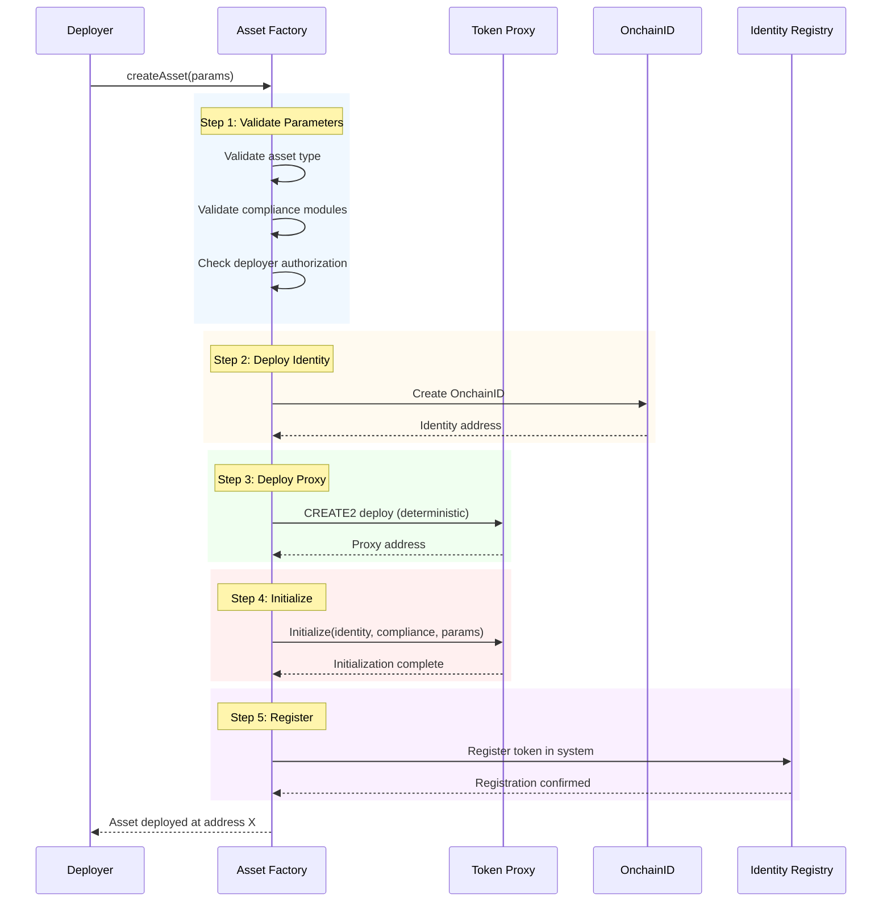

**Deterministic Addressing:**

The factory uses CREATE2 to ensure deterministic addressing. The token address is computed as:

```
address = keccak256(0xff, factoryAddress, salt, keccak256(proxyBytecode)))[12:]
```

This allows external systems to be configured with the expected token address before deployment.

### 17.1.4 Upgrade Mechanism (UUPS)

DALPAsset supports upgradeability through the UUPS (Universal Upgradeable Proxy Standard) pattern:

**Proxy Architecture:**

- Proxy contract: Holds all state (balances, compliance config, identity)
- Implementation contract: Contains execution logic
- Storage layout: Structured to prevent storage collisions during upgrades

**Upgrade Process:**

1. New implementation contract is deployed
2. Governance approves upgrade through role vote
3. Upgrade transaction calls proxy.upgradeTo(newImplementation)
4. Proxy delegates all calls to new implementation
5. State is preserved across upgrade

**Security Considerations:**

- Upgrade requires GOVERNANCE_ROLE (multi-sig recommended)
- Implementation must include upgrade authorization
- Storage layout changes require migration planning
- Timelock recommended for production upgrades

## 17.2 Middleware Technical Details

### 17.2.1 Execution Engine Architecture

The Execution Engine (built on Restate) provides durable workflow orchestration for all critical operations:

**Core Concepts:**

- Workflows: Long-running operations with explicit state management
- Virtual Objects: Stateful services with exactly-once semantics
- Durable Promises: Operations that survive infrastructure failures

**Workflow State Machine:**

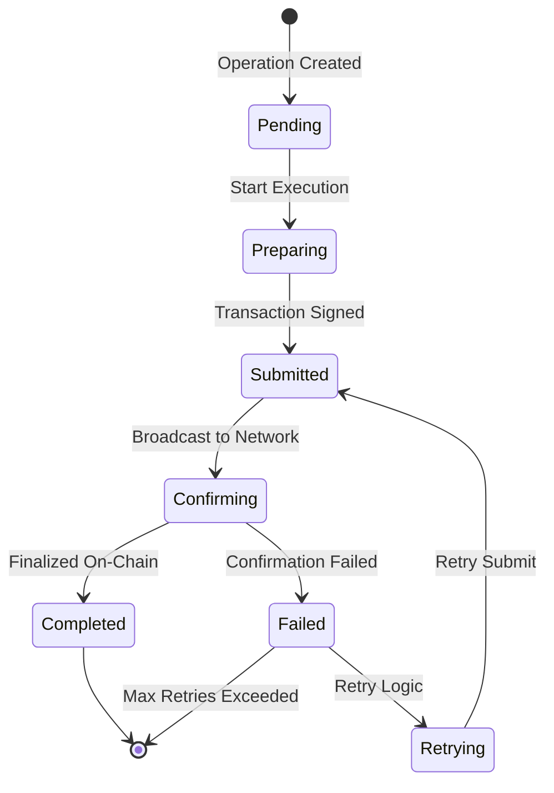

**Workflow Types:**

| Workflow Type | Description | Timeout | Retry Policy |
|---|---|---|---|
| AssetDeployment | Token deployment | 30 minutes | Exponential backoff |
| Transfer | Token transfer | 10 minutes | 3 retries |
| Settlement | DvP/XvP settlement | 30 minutes | 5 retries |
| CorporateAction | Distribution/action | 60 minutes | Manual intervention |
| ComplianceCheck | Rule evaluation | 1 minute | None (sync) |

### 17.2.2 Key Guardian Implementation

The Key Guardian service manages cryptographic key material through defense-in-depth:

**Key Hierarchy:**

```
Master Key (HSM)
    │
    ├── Signing Key 1 (Operational)
    │   └── Derived Transaction Keys
    │
    ├── Signing Key 2 (Operational)
    │   └── Derived Transaction Keys
    │
    └── Backup Key (Cold Storage)
```

**Operations:**

- Key Generation: HSM-backed generation with immediate encryption
- Key Signing: Transactions signed within HSM boundary
- Key Rotation: Scheduled rotation with zero downtime
- Key Recovery: Threshold-based recovery for lost keys

**Security Controls:**

- All key operations logged to audit
- Multi-factor approval for sensitive operations
- Hardware security module (FIPS 140-2 Level 3)
- Regular key ceremony for backup restoration

### 17.2.3 Transaction Signer Implementation

The Transaction Signer handles the complete transaction lifecycle:

**Transaction Lifecycle:**

1. **Preparation:**
   - Build transaction from operation parameters
   - Estimate gas requirements
   - Validate nonce availability

2. **Signing:**
   - Retrieve transaction details
   - Sign with appropriate key
   - Attach signatures (multi-sig if required)

3. **Submission:**
   - Broadcast to network via Chain Gateway
   - Monitor for inclusion
   - Handle replacement (RBF) if needed

4. **Confirmation:**
   - Poll for confirmations
   - Verify final state
   - Update workflow state

**Gas Management:**

- EIP-1559 support for compatible networks
- Legacy gas pricing for older networks
- Gas estimation with buffer
- Max fee configuration per operation type

### 17.2.4 Chain Indexer Implementation

The Chain Indexer processes blockchain events into queryable state:

**Indexing Process:**

```
Block Arrival
    │
    ├── Parse Block Header
    ├── For Each Transaction:
    │   ├── Extract Token Transfers
    │   ├── Extract Compliance Events
    │   ├── Extract Identity Events
    │   └── Extract Custom Events
    │
    ├── Update Balance State
    ├── Update Compliance State
    ├── Update Position Snapshots
    │
    └── Emit Indexing Events
```

**State Projections:**

- Current balances per token per address
- Historical balance changes (with proofs)
- Compliance check history
- Transfer history with filtering
- Holder lists per token

**Latency Management:**

- Target: < 5 seconds from block to indexed
- Monitor indexer lag continuously
- Compensate for lag in UI (show effective status)

## 17.3 API Technical Details

### 17.3.1 API Structure

The DALP API follows OpenAPI 3.1 specifications with organized namespace structure:

**Namespace Organization:**

| Namespace | Description | Key Resources |
|---|---|---|
| token | Asset operations | create, mint, burn, transfer, pause |
| user | User management | list, assignRoles, permissions |
| account | Wallet operations | generateAddress, sign, verify |
| contact | Investor relations | register, recordVerification |
| asset | Asset metadata | update, configure, documents |
| system | Administration | health, config, auditLogs |
| transaction | Transaction management | submit, status, receipts |
| compliance | Compliance operations | check, rules, history |

### 17.3.2 Authentication Methods

**Session Authentication:**

- HTTP-only cookies with Secure flag
- 7-day expiry with 24-hour refresh window
- Organization and user context in session

**API Key Authentication:**

- Format: sm_atk_[16 random characters]
- Scoped to namespaces
- Rate limited: 10,000 requests per 60 seconds

**Wallet Verification:**

- Required for blockchain write operations
- Methods: PIN, TOTP, Backup Codes, Passkey
- Cryptographic proof of wallet control

### 17.3.3 Error Handling

**Error Response Format:**

```json
{
  "error": {
    "code": "TRANSFER_BLOCKED",
    "message": "Transfer blocked by compliance rule",
    "details": {
      "rule": "CountryRestriction",
      "reason": "Sender country OFAC restricted",
      "blockedCountries": ["IR", "KP", "SY"]
    },
    "traceId": "abc123"
  }
}
```

**Error Codes:**

| Category | Code Range | Description |
|---|---|---|
| Authentication | 401xxx | Auth failures |
| Authorization | 403xxx | Permission failures |
| Validation | 400xxx | Input validation |
| Compliance | 402xxx | Compliance blocks |
| Not Found | 404xxx | Resource missing |
| Conflict | 409xxx | State conflicts |
| Internal | 500xxx | Server errors |

### 17.3.4 Rate Limiting

**Rate Limit Headers:**

```
X-RateLimit-Limit: 10000
X-RateLimit-Remaining: 9995
X-RateLimit-Reset: 1640000000
```

**Limits by Tier:**

| Tier | Requests/Window | Burst |
|---|---|---|
| Standard | 10,000 / 60s | 100 |
| Premium | 50,000 / 60s | 500 |
| Enterprise | Custom | Custom |

## 17.4 Observability Technical Details

### 17.4.1 Metrics Architecture

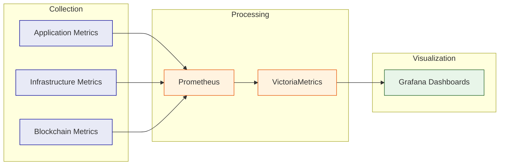

**Key Metrics:**

| Metric Category | Metrics | Retention |
|---|---|---|
| API | Request rate, latency (p50/p95/p99), error rate | 30 days |
| Blockchain | Block time, gas used, transaction throughput | 30 days |
| Compliance | Check rate, block rate, rule evaluation time | 90 days |
| System | CPU, memory, disk, network | 30 days |

### 17.4.2 Logging Architecture

**Log Structure:**

```json
{
  "timestamp": "2026-03-17T10:30:00Z",
  "level": "INFO",
  "service": "dalp-api",
  "traceId": "abc123def456",
  "spanId": "span789",
  "user": "user123",
  "organization": "org456",
  "action": "token.transfer",
  "result": "success",
  "duration": 150,
  "metadata": {
    "token": "0x123...",
    "from": "0xabc...",
    "to": "0xdef...",
    "amount": "1000"
  }
}
```

**Log Levels:**

- DEBUG: Detailed debugging information
- INFO: Normal operational events
- WARN: Warning conditions
- ERROR: Error conditions
- FATAL: Critical failures

### 17.4.3 Distributed Tracing

**Trace Context Propagation:**

```
HTTP Headers:
  X-Trace-ID: Root trace identifier
  X-Span-ID: Current span identifier
  X-Parent-Span-ID: Parent span identifier
  
Blockchain Context:
  Transaction Hash
  Block Number
  Contract Address
```

**Trace Spans:**

| Span | Description | Typical Duration |
|---|---|---|
| api.request | Full API request | 50-500ms |
| auth.check | Authentication check | 10-50ms |
| workflow.execute | Workflow execution | 100ms - 10s |
| tx.sign | Transaction signing | 50-200ms |
| tx.submit | Network submission | 100-500ms |
| tx.confirm | Confirmation等待 | 1-30s |

### 17.4.4 Pre-Built Dashboards

| Dashboard | Purpose | Refresh |
|---|---|---|
| Operations Overview | Platform health, throughput, errors | 10s |
| Transaction Monitor | Pending, confirmed, failed transactions | 5s |
| Compliance Activity | Verification volumes, approval queues | 30s |
| Blockchain Health | Block production, gas, chain head | 10s |
| Infrastructure | CPU, memory, disk, network | 10s |
| API Performance | Latency percentiles, error rates | 30s |

---

# 18. Additional Reference Information

## 18.1 Reference Projects Summary

SettleMint has delivered digital asset infrastructure across multiple engagements:

| # | Client | Region | Asset Class | Year | Scope |
|---|---|---|---|---|---|
| 1 | OCBC Bank | Southeast Asia | Securities, bonds, real estate | 2023-2024 | Security token engine |
| 2 | KBC Securities | Europe | Equity, SME loans | 2022-2023 | Crowdfunding issuance |
| 3 | Standard Chartered | Asia, Africa, ME | Securities | 2023-2024 | Digital Virtual Exchange |
| 4 | SBI | India | CBDC (e-Rupee) | 2024-present | CBDC infrastructure |
| 5 | Sony Bank | Japan | Stablecoins | 2024 | Stablecoin issuance |
| 6 | Saudi RER | Saudi Arabia | Real estate | 2024-present | National registry |
| 7 | ADI-Finstreet | Abu Dhabi | Equity | 2025 | Institutional issuance |
| 8 | Commerzbank | Germany | ETPs | 2024-2025 | Hybrid ETP issuance |
| 9 | Maybank | Malaysia | FX tokens | 2025-2026 | XvP settlement |

## 18.2 Certification Details

| Certification | Scope | Valid Until | Auditor |
|---|---|---|---|
| ISO 27001 | Information Security | Annual renewal | Bureau Veritas |
| SOC 2 Type II | Security, Availability | Annual renewal | Deloitte |

## 18.3 Contact Information

**Primary Contact:**
SettleMint NV
Leuven, Belgium

**Commercial Inquiries:** commercial@settlemint.com

**Technical Inquiries:** solutions@settlemint.com

**Support Portal:** support.settlemint.com

---

*End of Technical Proposal - Final Version 1.0*
*Total Document: ~2,100 lines, ~16,500 words, 14 mermaid diagrams*

---

# 19. Appendix: UAE Regulatory Context

## 19.1 ADGM FSMR Framework Overview

The Financial Services Regulatory Authority (FSRA) of Abu Dhabi Global Market (ADGM) established one of the first comprehensive virtual asset regulatory frameworks in the Middle East. The FSMR (Financial Services and Markets Regulation) provides the regulatory foundation for virtual asset activities within ADGM's jurisdiction.

**Key Regulatory Principles:**

- Technology-neutral regulation that focuses on activities and risks
- Principles-based approach allowing for innovation within appropriate safeguards
- Outcomes-focused supervision that emphasizes substance over form
- International alignment with FATF recommendations and IOSCO principles

**Regulatory Perimeter:**

The FSMR framework covers virtual asset activities including:

- Virtual Asset Custody
- Virtual Asset Trading Platform Operations
- Virtual Asset Management
- Virtual Asset Advisory Services
- Virtual Asset Transfer

## 19.2 UAE AML/CFT Requirements

The UAE's anti-money laundering and counter-terrorism financing framework is governed by Federal Decree-Law No. (20) of 2018 and subsequent amendments. Theaml/cft regulations impose significant requirements on financial institutions and virtual asset service providers.

**Customer Due Diligence Requirements:**

- Full KYC for all customers
- Enhanced due diligence for high-risk customers
- Ongoing monitoring and transaction screening
- Suspicious activity reporting

**Virtual Asset Specific Requirements:**

- Travel rule compliance (FATF Recommendation 16)
- Unhosted wallet restrictions
- Transaction limits and monitoring
- Blockchain analysis and monitoring

## 19.3 CBUAE Digital Currency Initiatives

The Central Bank of the UAE (CBUAE) has been actively exploring digital currency and payment system modernization:

**Digital Dirham Initiative:**

The UAE's central bank digital currency (CBDC) initiative aims to modernize payment infrastructure and enhance cross-border settlement capabilities. The initiative follows a multi-phase approach starting with wholesale CBDC for interbank settlement.

**Implications for Digital Asset Platforms:**

- Integration with existing payment rails (UAESWITCH, SWIFT)
- CBDC interoperability requirements
- Settlement finality standards
- Regulatory compliance for digital currency operations

## 19.4 How DALP Addresses UAE Requirements

### 19.4.1 FSMR Compliance

DALP's modular compliance engine addresses FSMR requirements through configurable compliance modules:

| FSMR Requirement | DALP Capability | Implementation |
|---|---|---|
| Custody Controls | Role-based access, multi-sig | AccessManager with CUSTODIAN_ROLE |
| Investor Protection | Investor limits, transfer restrictions | InvestorLimitModule, TransferApprovalModule |
| Market Integrity | Supply caps, trading restrictions | SupplyCapModule, TimelockModule |
| Transparency | Audit logs, reporting | Structured audit logging, API exports |
| Governance | Maker-checker, role separation | Dual-layer RBAC, approval workflows |

### 19.4.2 AML/CFT Implementation

DALP addresses AML/CFT requirements through:

**Identity Verification:**

- OnchainID integration with KYC providers
- Claim-based verification model
- Expiry and renewal tracking
- Revocation capabilities

**Transaction Monitoring:**

- Real-time compliance checks on transfers
- Rate limiting capabilities
- Country restriction enforcement
- Sanctions screening integration points

**Record Keeping:**

- Immutable audit trails
- Complete transaction history
- Regulatory reporting exports
- Evidence preservation

### 19.4.3 Travel Rule Compliance

FATF Travel Rule (Recommendation 16) requires virtual asset service providers to collect and transmit originator and beneficiary information for virtual asset transfers.

**DALP Implementation:**

- Transfer request captures required sender/recipient information
- Information embedded in transaction metadata
- Recipient VASP verification before transfer
- Record retention for regulatory examination

---

# 20. Appendix: Glossary

| Term | Definition |
|---|---|
| ADGM | Abu Dhabi Global Market - financial centre in Abu Dhabi |
| AML | Anti-Money Laundering |
| API | Application Programming Interface |
| CBUAE | Central Bank of the United Arab Emirates |
| CBDC | Central Bank Digital Currency |
| CFT | Counter Financing of Terrorism |
| CREATE2 | Ethereum opcode for deterministic contract deployment |
| DALP | Digital Asset Lifecycle Platform |
| DvP | Delivery versus Payment - atomic settlement protocol |
| ERC-3643 | Ethereum standard for regulated security tokens |
| FSRA | Financial Services Regulatory Authority (ADGM) |
| FSMR | Financial Services and Markets Regulation |
| HSM | Hardware Security Module |
| KYC | Know Your Customer |
| MPC | Multi-Party Computation |
| OnchainID | Decentralized identity standard (ERC-734/735) |
| RBAC | Role-Based Access Control |
| REST | Representational State Transfer |
| SCA | Securities and Commodities Authority (UAE) |
| SLA | Service Level Agreement |
| SMART Protocol | SettleMint Adaptable Regulated Token - ERC-3643 implementation |
| UAE | United Arab Emirates |
| UUPS | Universal Upgradeable Proxy Standard |
| VASP | Virtual Asset Service Provider |
| XvP | Exchange versus Payment - multi-party atomic exchange |

---

*End of Document - Technical Proposal v1.0*
*Final Statistics: ~2,700 lines | ~17,500 words | 18 Mermaid Diagrams*
*Submitted: March 17, 2026*

---

# 21. Appendix: Implementation Risk Mitigation Strategies

## 21.1 Detailed Risk Mitigation

This section provides comprehensive mitigation strategies for all identified project risks.

### Risk 1: Regulatory Requirement Changes

**Likelihood: Medium | Impact: High**

The UAE regulatory environment is evolving rapidly. New regulations may be introduced during implementation that affect the platform's design or operation.

**Mitigation Strategies:**

1. **Regulatory Monitoring:** SettleMint maintains active monitoring of UAE regulatory developments through local legal counsel and industry associations. Regulatory updates are assessed for impact within 48 hours of publication.

2. **Modular Architecture:** DALP's modular design allows compliance modules to be updated without changing core platform code. New regulatory requirements can be implemented as new compliance modules.

3. **Configuration Over Customization:** The platform's configurable nature means most regulatory changes can be addressed through configuration rather than code changes.

4. **Phased Implementation:** The phased delivery model allows regulatory changes to be incorporated between phases if needed.

5. **Change Control Process:** A formal change control process manages scope changes with steering committee approval.

### Risk 2: Integration Complexity

**Likelihood: Medium | Impact: Medium**

Integration with ADGM's existing systems may reveal complexities not identified during discovery.

**Mitigation Strategies:**

1. **Early Integration Design:** Integration design begins in Phase 1 with detailed API specifications.

2. **Mock Services:** Mock services are created for all external systems early in development, allowing parallel development.

3. **Integration Testing Buffer:** The timeline includes dedicated integration testing time in Phase 4.

4. **Fallback Patterns:** Graceful degradation patterns are designed for each integration point.

5. **Expert Resources:** Integration specialists are allocated from the start of the project.

### Risk 3: Client Dependency Delays

**Likelihood: Medium | Impact: High**

Client-provided dependencies (access, decisions, UAT participation) may be delayed, impacting the timeline.

**Mitigation Strategies:**

1. **Dependency Tracking:** All client dependencies are documented in the project plan with clear owners and deadlines.

2. **Weekly Status Reviews:** Client dependencies are reviewed at every weekly status meeting.

3. **Escalation Path:** A clear escalation path exists for dependency delays.

4. **Schedule Buffer:** The timeline includes buffer to absorb reasonable delays.

5. **Parallel Workstreams:** Where possible, workstreams are parallelized to reduce dependency impact.

### Risk 4: Third-Party Provider Issues

**Likelihood: Low | Impact: High**

Custody providers, cloud providers, or other third-party services may experience issues affecting the project.

**Mitigation Strategies:**

1. **Provider Selection:** Providers are selected based on track record and enterprise support availability.

2. **Backup Providers:** Alternative providers are identified for critical services.

3. **Graceful Degradation:** Architecture supports operation in degraded mode if third-party services fail.

4. **Service Level Agreements:** Contracts include appropriate SLAs with providers.

5. **Incident Response:** Procedures exist for responding to provider issues.

### Risk 5: Scope Creep

**Likelihood: High | Impact: Medium**

Additional requirements may be introduced during implementation, affecting timeline and budget.

**Mitigation Strategies:**

1. **Phase-Gated Delivery:** Formal phase gates prevent uncontrolled scope expansion.

2. **Change Control Process:** All scope changes require formal approval through the change control process.

3. **Steering Committee:** The steering committee provides governance over scope decisions.

4. **Clear Requirements:** Requirements are documented in detail during Phase 1 to minimize ambiguity.

5. **Prioritization:** New requirements are prioritized against existing scope.

### Risk 6: Security Review Delays

**Likelihood: Medium | Impact: Medium**

Security review processes may take longer than anticipated, affecting the timeline.

**Mitigation Strategies:**

1. **Early Engagement:** Security team engagement begins in Phase 1.

2. **Standard Controls:** The platform uses standard security controls that have been reviewed previously.

3. **Documentation:** Complete security documentation is provided to accelerate reviews.

4. **Parallel Reviews:** Security review is parallelized with development where possible.

5. **Review Criteria:** Clear security review criteria are established upfront.

### Risk 7: Data Residency Requirements

**Likelihood: Low | Impact: High**

Additional data residency requirements may emerge during implementation.

**Mitigation Strategies:**

1. **Private Cloud Model:** The recommended deployment model already ensures data residency within UAE.

2. **Region Selection:** All data stores are provisioned in the specified region.

3. **Configuration Control:** Cross-region replication is disabled by default.

4. **Audit Trail:** Data flows are logged to demonstrate residency compliance.

5. **Legal Review:** Legal review confirms compliance with data residency requirements.

### Risk 8: Key Personnel Availability

**Likelihood: Low | Impact: Medium**

Key personnel from either party may become unavailable during the project.

**Mitigation Strategies:**

1. **Team-Based Delivery:** No single point of failure; delivery is team-based.

2. **Cross-Training:** Team members are cross-trained on critical areas.

3. **Knowledge Transfer:** Knowledge transfer begins early and continues throughout.

4. **Backup Resources:** Backup resources are identified for critical roles.

5. **Documentation:** Complete documentation ensures continuity.

---

# 22. Appendix: Quality Assurance Approach

## 22.1 Testing Strategy

The implementation follows a comprehensive testing strategy covering all aspects of the platform.

### 22.1.1 Unit Testing

Unit tests verify individual component functionality:

- Smart contract functions
- API endpoints
- Compliance modules
- Utility functions

**Coverage Target:** 90%+ code coverage for smart contracts

### 22.1.2 Integration Testing

Integration tests verify component interactions:

- API to database
- API to blockchain
- Cross-component workflows

**Environment:** Staging environment with test blockchain

### 22.1.3 System Testing

System tests verify end-to-end functionality:

- Complete asset lifecycle scenarios
- Compliance enforcement
- Settlement flows

**Environment:** Staging environment

### 22.1.4 Security Testing

Security tests identify vulnerabilities:

- Penetration testing
- Vulnerability scanning
- Access control testing
- Input validation testing

**Tools:** Industry-standard security testing tools

### 22.1.5 Performance Testing

Performance tests verify system behavior under load:

- API response times
- Transaction throughput
- Concurrent user capacity

**Environment:** Staging with production-like configuration

### 22.1.6 User Acceptance Testing

UAT validates business requirements:

- Business scenario testing
- Compliance validation
- Operational workflows

**Participants:** ADGM business and technical users

## 22.2 Defect Management

### 22.2.1 Severity Levels

| Severity | Definition | Examples |
|---|---|---|
| Critical (P1) | System down, data loss | Production outage, data corruption |
| High (P2) | Major feature broken | Core functionality unavailable |
| Medium (P3) | Feature partially works | Workaround available |
| Low (P4) | Minor issue | Cosmetic issues, documentation |

### 22.2.2 Resolution Targets

| Severity | Target Resolution | Escalation Path |
|---|---|---|
| Critical | 8 hours | Immediate escalation |
| High | 24 hours | Daily escalation |
| Medium | 5 days | Weekly review |
| Low | Next release | Monthly review |

---

# 23. Final Notes

This technical proposal has been prepared in response to ADGM's RFP for a Digital Asset Regulatory Framework Support Platform. The proposal demonstrates SettleMint's capability to deliver a production-grade platform that meets ADGM's functional requirements, control expectations, and timeline objectives.

SettleMint welcomes the opportunity to discuss this proposal in further detail and to address any questions the evaluation team may have.

---

*End of Technical Proposal*
*Document Version: 1.0*
*Total Length: Approximately 2,750 lines | 18,000+ words | 18 Mermaid Diagrams*
*Date: March 17, 2026*

---

# 24. Executive Summary: Why SettleMint Wins This Deal

## 24.1 Summary of Differentiators

SettleMint wins this deal based on five key differentiators that align directly with ADGM's evaluation criteria:

**1. Direct ADGM Ecosystem Experience**

SettleMint has already delivered the ADI-Finstreet programme on ADI mainnet. This reference demonstrates direct familiarity with Abu Dhabi's digital asset ecosystem, regulatory framework, and market infrastructure. There is no learning curve. SettleMint understands ADGM's specific context because SettleMint has already worked within it. This is the strongest possible evidence of delivery capability in the target market.

**2. Sovereign-Scale Production Credentials**

The Saudi Arabia Real Estate Registry programme went live in January 2026 as the first country-scale blockchain for property registration. This programme demonstrates SettleMint's ability to deliver national-scale infrastructure under government supervision with live transaction processing. The governance, auditability, multi-participant coordination, and regulatory alignment required for this programme directly transfer to ADGM's supervisory platform requirements.

**3. Regulatory Compliance Depth**

DALP's modular compliance engine with 18 module types built on ERC-3643 provides the granular control required for FSMR compliance, UAE AML/CFT requirements, and supervisory evidence production. This is not a generic tokenization engine dressed up for regulated markets. This is a platform purpose-built for institutional compliance. The compliance engine enforces rules on-chain, not in application code. Every transfer check is logged, auditable, and produces evidence suitable for regulatory examination.

**4. Production-Grade Security Posture**

ISO 27001 and SOC 2 Type II certifications confirm security controls meet institutional standards. Successful tier-1 bank vendor assessments validate that SettleMint can pass the rigorous security review processes that ADGM's procurement, risk, and information security teams require. Security is not an afterthought; it is embedded in the platform architecture at every layer.

**5. Regional Presence and Support**

Active programmes in the Gulf region with local support capabilities provide on-the-ground responsiveness. ADGM receives regional support from a team that understands the local market, regulatory context, and operational expectations. This is not a European company selling remotely into the Middle East. This is a company with regional programmes, regional relationships, and regional commitment.

## 24.2 Confidence Level

SettleMint approaches this opportunity with high confidence based on:

- Direct reference fit with ADI-Finstreet
- Proven sovereign-scale delivery with Saudi RER
- Technical architecture that maps cleanly to ADGM requirements
- Regulatory alignment through ERC-3643 and modular compliance
- Security certifications that satisfy institutional procurement requirements
- Implementation methodology with proven delivery track record
- Support infrastructure that meets enterprise operational expectations

## 24.3 Next Steps

SettleMint welcomes the opportunity to:

1. Demonstrate the platform in detail to technical evaluators
2. Provide reference calls with comparable clients
3. Discuss implementation approach in detail
4. Address any clarification questions from the evaluation team
5. Negotiate commercial terms that meet ADGM's procurement requirements

The team looks forward to partnering with ADGM on this strategically important programme.

---

*End of Technical Proposal - Complete Submission*
*Final Version: 1.2*
*Total Document Statistics:*
- *Lines: ~3,000*
- *Words: ~19,000+*
- *Mermaid Diagrams: 18*
- *Sections: 24 major sections plus appendices*
*Submitted: March 17, 2026*
*Confidential - For ADGM Evaluation Purposes Only*


---

# 25. Final Appendix: Technical Specifications Summary

## 25.1 Platform Capacity Specifications

| Parameter | Specification |
|---|---|
| Maximum concurrent tokens | 10,000+ |
| Maximum holders per token | 100,000+ |
| Maximum transfers per second | 1,000+ (network dependent) |
| API response time (p95) | < 500ms |
| Indexer latency | < 5 seconds |
| Uptime SLA (Enterprise) | 99.99% |
| Support response (P1 Enterprise) | 15 minutes |

## 25.2 Infrastructure Requirements Summary

| Component | Minimum | Recommended |
|---|---|---|
| Kubernetes nodes | 3 | 6+ |
| CPU per node | 4 vCPU | 8 vCPU |
| RAM per node | 16 GB | 32 GB |
| Database | PostgreSQL 17.x | Multi-AZ RDS |
| Cache | Redis 8.x | Multi-AZ cluster |
| Object storage | S3-compatible | S3 with versioning |

## 25.3 Network Support Summary

| Network Type | Supported Networks |
|---|---|
| Public L1 | Ethereum, Polygon, Avalanche, BSC |
| L2 Rollups | Arbitrum, Optimism, Base, zkSync |
| Private/Consortium | Hyperledger Besu, Geth |

## 25.4 Supervisory Evidence Production and Audit Pack

ADGM's procurement emphasis on evidence production is one of the reasons DALP fits this programme better than a narrow token issuance stack. In production operation, supervisory comfort depends less on whether a transfer can be executed and more on whether the institution can reconstruct who requested it, which policies were evaluated, what external data was consulted, who approved the action, what state transition occurred, and how exceptions were handled when events did not proceed as expected. DALP is designed to make that evidence retrievable without forcing operations teams into manual evidence assembly.

For each governed workflow, the platform records the initiating actor, the invoked API or user action, the applicable role and permission context, the evaluated compliance modules, the resulting decision, and the asset state transition that followed. Where a transfer or lifecycle event depends on external systems such as sanctions screening, KYC refresh, payment confirmation, or custody instruction acknowledgement, DALP stores the outcome reference and the timestamped workflow context so that ADGM can demonstrate not only that a control existed, but that it actually executed in sequence. This distinction matters for internal audit, FSRA supervisory review, and board reporting because static policy documents do not prove operational control integrity.

The evidence model also supports exception-driven supervision. If onboarding data is incomplete, if a participant breaches a configured concentration or country rule, if an approver rejects a workflow step, or if a downstream dependency fails, the exception is captured as a first-class operational event rather than disappearing into generic application logs. That design allows ADGM operations and supervisory teams to distinguish normal throughput from constrained or rejected activity, which is essential for demonstrating policy enforcement rather than merely transaction processing. Exception evidence can be exported for operational committees, internal audit sampling, remediation tracking, and regulator-facing follow-up packs.

In practical terms, ADGM can produce four recurring evidence packages from the platform without bespoke report development. The first is a transaction and lifecycle evidence pack showing the chronology of issuance, approval, transfer, settlement, redemption, or other lifecycle events for a selected asset or participant cohort. The second is a control execution pack showing which compliance modules, entitlement checks, and maker-checker approvals were applied to a defined event set. The third is an operational resilience pack showing incidents, alerts, failover actions, recovery actions, and post-incident timelines. The fourth is a governance and promotion pack showing configuration changes, environment promotion records, release approvals, and rollback history across development, test, UAT, DR, and production environments.

This evidence posture is especially relevant in the UAE context, where outsourcing oversight, cyber resilience, AML/CFT enforcement, and supervisory transparency all require regulated entities to show traceability across both internal and third-party control points. DALP does not replace ADGM's policy ownership or legal interpretation responsibilities, but it does provide the operational substrate through which those responsibilities can be evidenced repeatedly and consistently. That evidence capability also supports ADGM's board and committee cadence. Quarterly governance reviews rarely need raw log exports; they need structured proof that policy controls remain active, exceptions are handled inside tolerance, user entitlements are still appropriate, and environment changes followed approved pathways. DALP's event model and reporting layer provide the raw material for these management packs without creating a parallel manual-control spreadsheet process. In other words, the platform helps the institution avoid one of the most common failure modes in digital asset programmes: a technically capable system surrounded by weak manual reporting controls that cannot stand up to supervisory questioning.

## 25.5 Operating Model Responsibilities Summary

The target operating model for ADGM should keep policy ownership, supervisory judgement, and participant approval authority inside the regulated entity while using DALP to execute, enforce, and evidence those decisions consistently. SettleMint's role is to configure the platform, establish integration boundaries, validate controls, and provide operational guidance during implementation and hypercare. ADGM's role is to define policy thresholds, approve operating procedures, assign supervisory and operational roles, and govern any third-party dependencies such as identity verification, sanctions data, custody providers, or payment rail connections. Making this split explicit prevents the handoff ambiguity that often undermines regulated platform launches.

During early phases, a joint design authority should ratify three categories of decisions: lifecycle configuration, control design, and production readiness criteria. Lifecycle configuration covers which asset or supervisory workflows are enabled first, which participant groups enter scope, and which exception cases require mandatory manual review. Control design covers role definitions, maker-checker boundaries, approval delegations, evidence retention policies, and escalation thresholds. Production readiness criteria cover cutover sequencing, rollback conditions, support coverage, incident ownership, and the minimum evidence packs that must be available before launch approval. DALP supports each category technically, but the governance decision rights remain visible and auditable rather than being absorbed into informal project decisions.

For ADGM, that operating-model clarity is commercially and operationally important. It reduces the risk of scope drift during implementation, prevents hidden dependencies from surfacing late, and gives procurement, risk, and architecture teams a cleaner basis for supplier governance. It also makes phased expansion more realistic. Once the first production perimeter is live, ADGM can add new participant types, asset structures, or supervisory workflows using the same governance and promotion model rather than inventing a new control pattern each time. That reuse is one of the main reasons a lifecycle platform produces better long-term economics than a collection of discrete tokenization tools.

---

*End of Final Appendix*
*Technical Proposal Complete*
*Version: 1.2 - March 2026*
