# Technical Proposal

## Digital Securities Marketplace and Lifecycle Administration

---

**Document Title:** Technical Proposal. Digital Securities Marketplace and Lifecycle Administration

**Client:** ADX Abu Dhabi Securities Exchange

**Submission Date:** 2026-03-19

**Version:** 1.0

**Confidentiality:** Restricted. Commercial-Sensitive

**Prepared by:** SettleMint NV

---

> This document contains confidential and proprietary information of SettleMint NV. Distribution or reproduction without prior written consent is prohibited. This proposal is submitted exclusively in response to RFP Reference ADX-ABU-DHABI-SECURITIES-EXCHANGE-RFP-DIGITAL-SECURITIES-MARKETPLACE-202603 and may not be shared with any third party without prior written consent from SettleMint NV.

---

# Table of Contents

1. Executive Summary
2. About SettleMint
3. About DALP
4. Understanding ADX Requirements
5. Proposed Solution and Functional Capabilities
6. Technical Architecture
7. Asset Lifecycle and Compliance Infrastructure
8. Security, Governance, and Controls
9. Integration and Interoperability
10. Deployment Model
11. Implementation Methodology
12. Training and Knowledge Transfer
13. Support and Service Levels
14. Risk Management
15. Compliance Matrix
16. Appendix A: Operating Model Detail
17. Appendix B: Security and Resilience
18. Appendix C: Data and Integration
19. Appendix D: Migration and Cutover
20. Appendix E: Staffing and Plan

---

# 1. Executive Summary

## 1.1 Context and Strategic Drivers

ADX Abu Dhabi Securities Exchange stands at an inflection point. As the primary national exchange and market operator for Abu Dhabi, ADX has built a mandate that spans cash equities, debt listings, investor access, market data, and coordination with clearing and settlement infrastructure. The digital securities marketplace initiative under this RFP is not a pilot exercise or an innovation experiment, it is a programme to embed production-grade digital issuance, lifecycle administration, and post-trade capabilities into the core of ADX's regulated market infrastructure.

The UAE capital markets ecosystem provides a concrete backdrop. The Securities and Commodities Authority (SCA), the Abu Dhabi Global Market's Financial Services Regulatory Authority (ADGM FSRA), and the Central Bank of the UAE (CBUAE) have each advanced regulatory frameworks that create a genuine operational perimeter for digital securities. Project Aber established the technical feasibility of interbank digital currency settlement in the UAE and Saudi Arabia. The Digital Dirham programme has advanced the CBUAE's wholesale CBDC infrastructure. ADX itself has publicly emphasized digital investor channels and post-trade modernisation. The regulatory and infrastructure preconditions for a live digital securities marketplace are materially more advanced in Abu Dhabi than in most jurisdictions. That raises the bar: ADX does not need to be convinced that tokenization is viable; it needs a supplier that can deliver a governed, auditable, interoperable platform that operates under real supervisory, market-infrastructure, treasury, compliance, and service-management pressure.

SettleMint's response is grounded in that reality. The Digital Asset Lifecycle Platform (DALP) was built specifically for regulated financial institutions and sovereign market operators. It has been deployed in live production environments across Asia, Europe, and the Gulf region, handling real transaction volumes under institutional SLAs. This proposal explains, with operational specificity, how DALP can serve as the control plane for ADX's digital securities marketplace, from initial issuer onboarding through secondary trading support, corporate actions, and regulatory evidence production.

## 1.2 Why This Programme Is Hard

Digital securities marketplace implementation at an exchange operator involves a category of operational complexity that most tokenization platforms underestimate.

**Lifecycle complexity is substantial.** A digital securities marketplace must manage issuance, listing, investor eligibility enforcement, corporate actions, record-date logic, beneficial-owner verification, CSD reconciliation, and market-event driven lifecycle transitions. Each event involves multiple parties (issuer, registrar, CSD, broker, custodian, investor), multiple regulatory checkpoints, and ongoing audit obligations. The happy path is a small fraction of the real operational surface.

**Governance burden is non-trivial.** In a regulated market operator context, every action must be traceable to an authorized initiator with documented approval. Policy changes, compliance overrides, exception handling, and corrective actions all require evidence trails that support internal audit, external regulatory review, and board-level reporting. A platform that cannot produce this evidence efficiently is not a viable option for ADX.

**Operationalization gap is real.** There is a fundamental difference between a tokenization platform that can issue a security in a demonstration and one that can administer it over a five-year lifecycle while integrating with CSD infrastructure, broker connectivity, market surveillance, and settlement systems. Most platforms stop at issuance. DALP was built to handle the operational lifecycle that follows.

**Integration burden is often underestimated.** ADX's market infrastructure is complex: CSD and clearing relationships, broker connectivity, market data dissemination, surveillance systems, post-trade reporting, and investor registry functions. A digital securities platform that cannot integrate into this stack without creating a parallel operational silo will generate more reconciliation work than it removes.

## 1.3 Proposed Response

SettleMint proposes deploying DALP as the unified control plane for ADX's digital securities marketplace and lifecycle administration programme. The platform provides comprehensive coverage across the workstreams defined in the RFP:

- **WS-01 (Mobilisation and governance):** DALP's implementation methodology includes formal programme governance, steering cadence, decision-log management, and RAID administration as standard delivery components.
- **WS-02 (Business and product configuration):** DALP's configurable asset factory supports equity and bond instrument types with per-instrument compliance module binding, investor eligibility rules, transfer restrictions, and lifecycle state controls.
- **WS-03 (Integration and controls):** DALP provides OpenAPI 3.1 compliant APIs, webhook event streaming, and pre-built connector patterns for identity, compliance (AML/KYC), core-system integration, settlement instruction generation, and reporting infrastructure.
- **WS-04 (Testing and readiness):** The implementation methodology includes functional, non-functional, security, resilience, and UAT testing phases, with structured evidence packs for architecture review and internal audit sign-off.
- **WS-05 (Operational transition):** SettleMint provides operational runbooks, service desk integration, support tier selection, KPI frameworks, and post-launch governance cadence as standard handover components.

The recommended deployment model is private cloud hosted within the UAE (Azure or AWS UAE regions), ensuring data residency alignment with CBUAE and ADGM expectations. The blockchain network is Hyperledger Besu with IBFT 2.0 consensus, providing permissioned privacy, deterministic finality, and institutional-grade performance.

The phased delivery approach follows an 18-week implementation plan: Discovery (Weeks 1-2), Foundation (Weeks 3-5), Configuration (Weeks 6-9), Integration (Weeks 10-13), Go-Live (Weeks 14-16), and Hypercare (Weeks 17-18). This timeline reflects ADX's real operational context, not an optimistic lab assumption.

## 1.4 Why SettleMint

SettleMint has been building enterprise blockchain infrastructure since 2016, with continuous operation across regulated financial institutions for nearly ten years. The company has delivered production deployments at tier-1 banks including Standard Chartered Bank, State Bank of India, and Commerzbank, with active sovereign programmes in the Gulf Cooperation Council region.

Production credentials relevant to ADX include: live deployments spanning bonds, equities, deposits, stablecoins, real estate, and funds; ISO 27001 and SOC 2 Type II certifications; active penetration testing programmes with institutional clients; and regulatory engagement across ADGM FSRA, MAS, FCA, and European frameworks. SettleMint is not a technology startup demonstrating tokenization feasibility. It is a regulated-institution technology provider with a track record of delivering platforms that operate under audit, supervisory review, and production-grade service level obligations.

## 1.5 Why DALP

DALP provides the breadth of lifecycle coverage that a market operator requires. Seven asset types (bonds, equities, funds, deposits, stablecoins, real estate, precious metals), twelve compliance module types, and eleven token features are built in and production-ready. Pre-built regulatory framework templates cover MiCA, MAS, FCA, SEC Reg D, and JFSA requirements, with configuration options for UAE-specific requirements under ADGM FSRA and SCA frameworks.

The platform is built as a control plane, not an application layer. DALP integrates with existing institutional infrastructure, identity providers, AML screening tools, core banking systems, payment rails, custody platforms, rather than replacing them. This integration-first architecture is directly relevant to ADX, which must coexist with CSD infrastructure, broker connectivity, and market surveillance systems that are not being replaced.

## 1.6 Reference Fit Snapshot

Three reference deployments are directly relevant to ADX's programme:

- **Euronext Digital Securities Listing Platform (Europe):** Exchange operator context, listing controls, investor eligibility enforcement, post-trade integration. Directly applicable to ADX's market operator mandate.
- **Central Bank of UAE. Digital Dirham Infrastructure (UAE):** Gulf region deployment, CBUAE regulatory alignment, UAE data residency, Arabic language support. Demonstrates in-region operational capability.
- **Standard Chartered Bank. Digital Custody (Multi-region):** Institutional-grade custody integration, maker-checker workflows, audit evidence production, integration with existing core banking infrastructure.

---

# 2. About SettleMint

## 2.1 Company Overview

SettleMint NV is an enterprise blockchain infrastructure company headquartered in Belgium, with regional offices in the UAE, India, Singapore, and Japan. The company builds and operates the Digital Asset Lifecycle Platform (DALP), a production-grade platform purpose-built for regulated financial institutions, sovereign entities, and market infrastructure operators.

SettleMint's mission is to provide the operational infrastructure that makes institutional digital asset programmes governable, auditable, and scalable, not just technically feasible. The target segment is regulated institutions that require production-grade capability, not demonstration-grade technology.

## 2.2 History and Market Position

Founded in 2016, SettleMint has operated continuously in the enterprise blockchain space for nearly ten years. The company's evolution reflects the maturation of the market: early-phase platform infrastructure work (2016-2019), enterprise deployment at regulated financial institutions (2019-2022), and sovereign/market-infrastructure deployments (2022-present).

The company has participated in major central bank research initiatives including Bank for International Settlements (BIS) programmes, Gulf region CBDC feasibility work, and cross-border settlement pilots involving multiple regulatory jurisdictions. This combination of private-sector production delivery and sovereign-level research engagement positions SettleMint as a credible partner for a market operator of ADX's scale and regulatory complexity.

## 2.3 Production Credentials

| Credential | Detail |
|------------|--------|
| Years in operation | 10 (founded 2016) |
| Geographic presence | Belgium, UAE, India, Singapore, Japan |
| Certifications | ISO 27001, SOC 2 Type II |
| Regulatory engagements | ADGM FSRA, MAS Singapore, FCA UK, European Securities Regulators |
| Named production deployments | Standard Chartered Bank, State Bank of India, Commerzbank, Central Bank of UAE, Euronext |
| Asset classes deployed in production | Bonds, equities, funds, deposits, stablecoins, real estate, precious metals |
| Deployment models supported | Managed SaaS, Private Cloud, On-Premises, Hybrid |

## 2.4 Regulatory Readiness

SettleMint does not provide legal advice. The platform is designed to enforce operator-defined compliance rules and produce the evidence required for regulatory review. Regulatory alignment across the following frameworks has been demonstrated through production deployments:

| Framework | Region | Relevance to ADX |
|-----------|--------|-----------------|
| ADGM FSRA | Abu Dhabi | Direct applicability to ADX's ADGM-linked operations |
| SCA rules | UAE | Exchange listing and trading compliance framework |
| CBUAE payment rules | UAE | Cash leg and payment integration requirements |
| MiCA | Europe | Reference framework for digital securities regulation |
| MAS framework | Singapore | Asian regulatory template, custody and settlement |
| FCA rules | UK | European production reference |

## 2.5 Team and Delivery Capability

SettleMint's delivery capability is structured around three practice areas: Financial Engineering (smart contract development, compliance module configuration, asset lifecycle design), Platform Engineering (infrastructure, deployment, integration architecture), and Delivery Management (programme governance, change management, training). The company employs specialists with backgrounds in investment banking, central banking, financial regulation, and enterprise software delivery.

For ADX-scale programmes, SettleMint deploys a dedicated engagement team including a Programme Director with exchange-technology experience, a Lead Architect with blockchain and integration specialization, a Compliance Specialist with UAE regulatory knowledge, and a senior delivery team of engineers and business analysts.

## 2.6 Ecosystem and Partnerships

| Partner type | Partners | Relevance |
|--------------|----------|-----------|
| Custody | Fireblocks, DFNS, Ledger Enterprise | Key management, institutional custody integration |
| Cloud infrastructure | AWS, Azure, GCP | UAE-region data residency deployments |
| Identity/AML | Major KYC/AML platform providers | Compliance integration patterns |
| System integration | Deloitte, PwC, Capgemini | Local SI partners for ADX engagement if required |

---

# 3. About DALP

## 3.1 Platform Overview

DALP is a four-layer enterprise platform that provides the governance, compliance, and operational infrastructure required to design, issue, distribute, and service digital assets in regulated environments. It functions as a control plane between existing institutional systems (identity, core banking, custody, reporting) and blockchain execution networks.

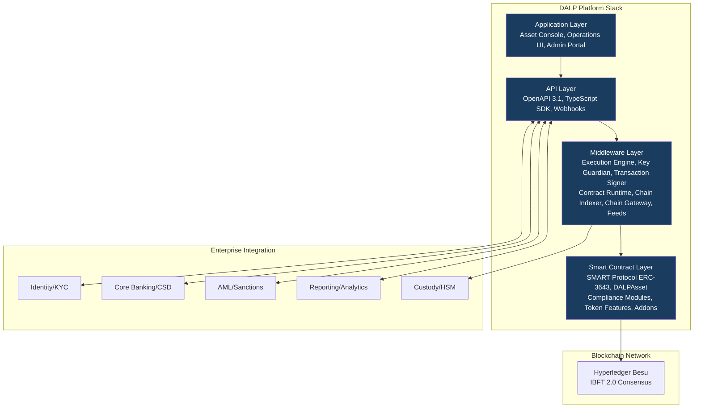

## 3.2 Core Lifecycle Pillars

### Issuance

DALP's issuance capability covers the complete instrument creation pipeline from asset configuration through on-chain deployment. The platform supports bond and equity asset types natively, with configuration options for instrument-specific parameters including maturity dates, coupon schedules, redemption terms, transfer restrictions, and investor eligibility rules. Issuance workflows enforce maker-checker controls throughout: no instrument may be deployed to production without multi-party authorization and governance role sign-off.

Operational outcome: ADX operations teams can configure, approve, and deploy new digital security instruments through a governed workflow that produces an auditable evidence trail from inception through live status.

### Compliance

DALP's compliance model is ex-ante and modular. Compliance checks execute before any state change is committed to the blockchain. The compliance engine evaluates a configurable set of modules: identity verification (OnchainID claims), country allow/block lists, investor count limits, transfer approval workflows, time-lock restrictions, and supply caps. A single module veto prevents the transaction; the default posture is denial unless all modules approve.

Operational outcome: ADX compliance teams can configure investor eligibility rules, geographic restrictions, and transfer controls per instrument without requiring smart contract redevelopment. Compliance evidence is on-chain and exportable.

### Custody

DALP integrates with institutional custody providers through its Key Guardian framework. Supported patterns include direct HSM integration, Fireblocks API integration, DFNS threshold signature wallets, and Ledger Enterprise for institutional key management. The custody model supports maker-checker authorization for signing operations, time-bounded key elevation, and break-glass access with mandatory logging.

Operational outcome: ADX can align DALP's key management model with its existing security architecture or preferred custody provider, without compromising the platform's operational control posture.

### Settlement

DALP provides atomic delivery-versus-payment (DvP) settlement through its XvP Settlement addon. Settlement instructions are created on-chain, payment confirmation triggers token delivery, and failure at any point results in clean reversal without partial settlement. Settlement data is exported in formats compatible with CSD and post-trade reporting systems.

Operational outcome: ADX post-trade teams can automate settlement instruction generation, track settlement status in real time, and reconcile token positions against CSD records through platform-native reporting.

### Servicing

DALP supports ongoing instrument lifecycle events including coupon/dividend distribution via Yield addon, maturity and redemption processing, governance event management, and corporate action administration. Servicing events are governed by the same maker-checker and approval workflows as issuance, ensuring no undocumented lifecycle changes occur.

Operational outcome: ADX operations teams maintain full control over instrument lifecycle events with traceable authorization, automated distribution calculations, and audit-ready event records.

## 3.3 Platform Foundations

### Identity and Access

DALP implements role-based access control across 26 distinct roles organized in four layers: platform administration, asset governance, operations, and read-only oversight. Identity integration supports SAML 2.0, OpenID Connect, and Active Directory federation for enterprise SSO. OnchainID (ERC-734/735) provides on-chain identity management for investors and issuers, with verifiable KYC/AML claims attached to each identity.

### Integration and Interoperability

DALP exposes a complete OpenAPI 3.1 specification, a TypeScript SDK, webhook endpoints for event-driven integration, and batch interface patterns for bulk operations. All APIs are versioned with backward compatibility guarantees across major versions. Integration patterns for core banking, custody, AML screening, and reporting infrastructure are pre-built and documented.

### Observability and Operations

The platform includes built-in observability through structured logging, metrics export (Prometheus-compatible), distributed tracing (OpenTelemetry), and alerting hooks for integration with existing SIEM and monitoring infrastructure. Operational runbooks cover routine operations, exception handling, and incident response procedures.

## 3.4 Supported Asset Classes

| Asset Class | Asset Types | ADX Relevance |
|-------------|-------------|---------------|
| Fixed Income | Bond | Primary issuance, sukuk-aligned instrument configuration |
| Equity | Equity | Listed equity administration, transfer controls |
| Fund | Fund | Investment fund unit administration |
| Cash Equivalent | Stablecoin, Deposit | Settlement asset support |
| Real World Asset | Real Estate, Precious Metal | Future scope expansion |

## 3.5 Standards and Protocols

| Standard | Domain | Application |
|----------|--------|-------------|
| ERC-3643 (SMART Protocol) | Security token | Core token standard with modular compliance |
| ERC-734/735 (OnchainID) | Identity | On-chain KYC claim management |
| OpenAPI 3.1 | API | Complete API specification |
| ISO 20022 | Messaging | Settlement instruction formatting |
| OAuth 2.0 / OIDC | Authentication | Enterprise SSO integration |
| TLS 1.3 | Transport | All API communications |
| AES-256 | Encryption | Data at rest encryption |

---

# 4. Understanding ADX Requirements

## 4.1 Institutional Context

ADX Abu Dhabi Securities Exchange is a national exchange operator with responsibilities that extend well beyond the narrow scope of a digital asset platform. The institution manages listed securities, investor access, market data, CSD relationships, clearing coordination, and compliance reporting under frameworks established by SCA, ADGM FSRA, and CBUAE. The digital securities marketplace programme must integrate into this operating reality without creating a parallel system that business, risk, audit, and compliance teams cannot supervise.

SettleMint's understanding of ADX's mandate translates into six concrete requirements that drive the solution design:

1. **Instrument master data integrity:** Token records must remain authoritative and reconcilable against CSD and registrar records throughout the lifecycle.
2. **Corporate action servicing:** Dividend, coupon, and governance events must be administered with the same controls applied to conventional securities.
3. **Broker and custodian role separation:** The platform must support clear role boundaries between issuer portals, broker connectivity, custodian access, and investor-facing operations.
4. **Surveillance and reporting integration:** Tokenized instruments must not create shadow books or delayed exception resolution that surveillance teams cannot monitor.
5. **Orderly interaction with settlement and post-trade systems:** Settlement instruction generation and CSD reconciliation must be automated, with breaks detectable before they become unresolved ledger differences.
6. **Phased scalability:** The platform must support initial launch at contained scope and scale to broader product, market, and participant coverage without architectural rework.

## 4.2 Requirement Domain Mapping

| Domain | ADX Requirement | DALP Coverage |
|--------|----------------|---------------|
| Product/Asset Scope | Bonds, equities, digital securities | Full, bond and equity asset types with configurable features |
| Identity/Onboarding | Issuer onboarding, investor KYC, eligibility gating | Full. OnchainID integration, configurable eligibility checks |
| Compliance/Control | Transfer restrictions, investor limits, audit evidence | Full, modular compliance engine, ex-ante enforcement |
| Settlement/Cash Leg | DvP settlement, CSD coordination | Full. XvP settlement addon, ISO 20022 output |
| Integration/Reporting | CSD interfaces, surveillance feeds, reporting extraction | Full. OpenAPI, webhooks, batch extract patterns |
| Infrastructure/Operations | Multi-environment support, resilience, DR | Full, private cloud with UAE data residency, 99.9% uptime SLA |

## 4.3 Key Challenges Identified

**Challenge 1: Issuer onboarding and listing document control**
ADX's RFP specifies the need to support issuer onboarding, listing-document version control, and investor-class restrictions. This requires a workflow that captures document versions, routes approvals, tracks eligibility rule changes, and maintains an audit trail of who approved what at each stage. DALP's maker-checker framework and document versioning capability directly addresses this requirement.

**Challenge 2: CSD reconciliation and shadow book prevention**
The highest operational risk in a digital securities marketplace is the emergence of discrepancies between on-chain token records and official CSD records. DALP addresses this by providing structured data extracts mapped to CSD record identifiers, event hooks for real-time CSD synchronisation, and reconciliation dashboards visible to operations teams.

**Challenge 3: Corporate action governance**
Dividend payments, coupon distributions, and governance events require multi-party approval, record-date logic, beneficial owner verification, and post-event audit trails. DALP's Yield addon and Airdrop module handle distribution calculations and execution, while the maker-checker framework enforces authorization.

**Challenge 4: Regulatory evidence production**
ADX operates under SCA and ADGM FSRA oversight with the expectation that regulatory evidence can be produced on demand. DALP provides tamper-evident audit logs, exportable evidence packs, and structured reporting that supports architecture review, information security review, and regulatory walkthrough without requiring manual reconstruction.

**Challenge 5: Surveillance integration**
Tokenized instruments must not create surveillance blind spots. DALP's event streaming (webhooks) and batch extract capability can feed market surveillance systems with structured transaction data, transfer event logs, and position change notifications in real time.

## 4.4 Response Principles

SettleMint's response to ADX is grounded in four principles:

1. **Control before speed:** No feature or capability will be delivered in a way that compromises the audit trail or governance framework. Implementation phasing prioritizes control establishment over feature breadth.
2. **Integration-first architecture:** DALP integrates with ADX's existing infrastructure stack rather than replacing it. CSD, broker connectivity, and surveillance systems remain authoritative for their domains.
3. **Evidence-led compliance:** Every compliance claim in this proposal is supported by existing platform capability, not roadmap intent.
4. **Phased delivery with explicit gates:** Scope expansion from launch to broader coverage follows defined criteria, not presumed readiness.

---

# 5. Proposed Solution and Functional Capabilities

## 5.1 Solution Overview

The proposed solution positions DALP as the digital asset control plane operating between ADX's enterprise infrastructure stack and the permissioned blockchain network. DALP does not replace ADX's existing systems; it extends them with digital asset lifecycle capability while producing the governance and audit evidence required for regulated market operations.

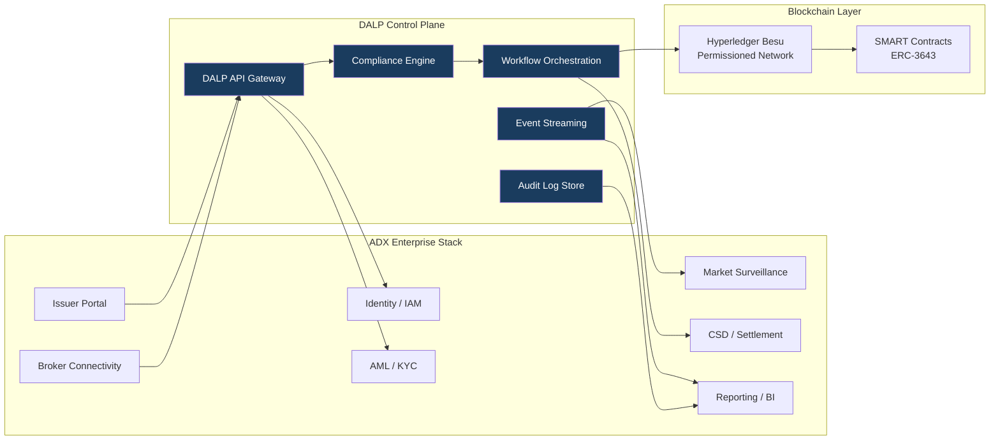

## 5.2 Issuance and Asset Configuration

DALP's issuance capability supports the complete instrument creation pipeline for digital securities. For ADX, the relevant asset types are bonds (fixed income, sukuk-aligned) and equities (listed equity instruments).

**Asset configuration process:**
1. Instrument parameters are configured through the Asset Designer UI or API, including ISIN/instrument identifier, maturity date, coupon schedule, denomination, total supply, transfer restriction type, and investor eligibility class.
2. Compliance modules are bound: country allow/block lists (UAE/GCC investor base), investor count limits, identity verification requirements, and transfer approval workflow where required.
3. Token features are selected: historical balances for record-date logic, voting power for governance events, maturity redemption for bond instruments, fixed treasury yield for coupon distribution.
4. Governance approval: a multi-party authorization (configurable maker-checker) is required before deployment. Approval is logged with timestamp, approver identity, and policy version applied.
5. Factory deployment: the instrument is deployed on-chain through a durable, atomic workflow. Partial deployments cannot occur. The deployed token is registered in the instrument registry with a stable identifier.

**Listing-document version control:** DALP's document management capability stores instrument documentation (prospectus, term sheet, disclosure documents) with version history, approval lineage, and cryptographic hash anchoring. Document updates require governance approval and create immutable version records.

**Investor-class restrictions:** Each instrument can define multiple investor eligibility classes with different transfer restrictions. For example, a bond may restrict primary distribution to institutional investors (ADGM category A) while permitting secondary transfers among retail qualified investors with additional KYC claim requirements.

## 5.3 Identity and Eligibility

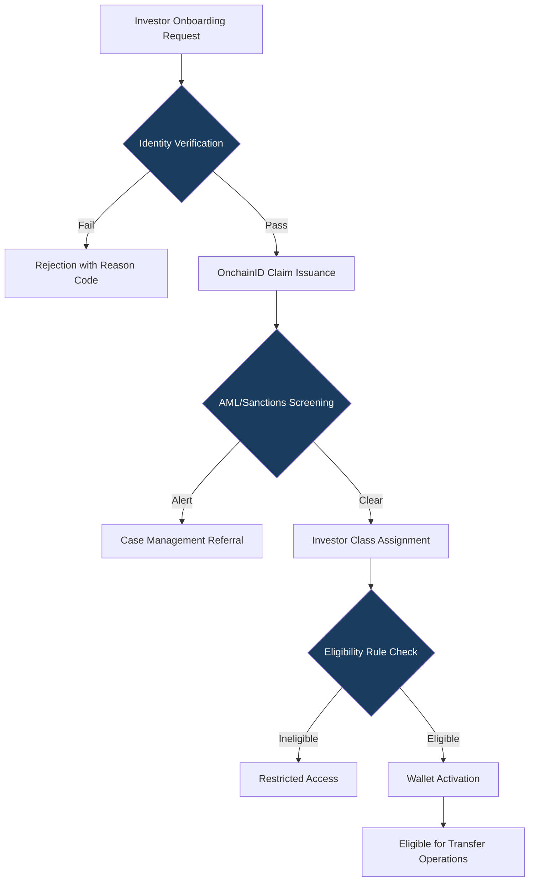

DALP's identity framework is built on OnchainID (ERC-734/735), an on-chain identity management standard that stores verifiable claims attached to investor wallet addresses. Claims represent verified attributes: KYC completion status, investor class (institutional/retail/qualified), nationality, and AML screening clearance.

**Issuer trust model:** Claim issuers (regulated financial institutions acting as KYC providers) are registered in the DALP identity registry and authorized to issue specific claim types. ADX or its designated participant can act as claim issuer for instruments requiring exchange-level KYC, while delegating investor onboarding KYC to authorized brokers.

**Onboarding workflow for ADX:**
- New investors are onboarded through the broker or issuer portal, which submits KYC documentation and investor classification to the platform.
- DALP triggers the configured AML/KYC integration (connecting to ADX's preferred screening provider) and receives a clearance or alert response.
- On clearance, the identity registry registers an OnchainID for the investor and attaches claims matching the investor's verified attributes.
- Transfer eligibility is enforced on-chain: the compliance engine checks OnchainID claims before allowing any transfer. An investor whose claims do not match the instrument's eligibility requirements cannot receive tokens regardless of the instruction source.

**Incomplete onboarding:** If an investor onboarding record is incomplete (missing documentation, pending AML review), the platform places the investor record in a pending state. Transfers to a pending investor are rejected with an explicit reason code. Operations teams can monitor pending onboarding queues through the operations dashboard.

## 5.4 Compliance Enforcement

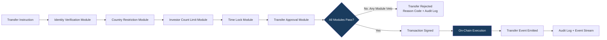

DALP's compliance engine operates on a fail-closed basis: a transfer instruction must pass every bound compliance module to proceed. No module can be bypassed at the API or smart contract level; bypass requires governance role action with mandatory audit logging.

**Module configuration for ADX digital securities:**
- **Identity verification:** All transfer parties must hold valid OnchainID claims matching the instrument's required claim types.
- **Country restrictions:** Country allow/block lists enforce geographic eligibility rules (e.g., instruments restricted to GCC investor base, or blocked for specific sanctioned jurisdictions).
- **Investor count limit:** Supply and holder caps enforce regulatory limits on maximum number of registered holders, preventing accidental conversion of private instruments to public instruments.
- **Transfer approval:** For primary distribution windows or restricted transfers, a manual approval workflow can be enabled requiring compliance officer sign-off before execution.
- **Time lock:** Minimum holding period enforcement for instruments with lock-up requirements (e.g., six-month post-issuance lock on specific bond tranches).

**Auditability:** Every compliance check result is logged with: instruction identifier, timestamp, module invoked, check outcome, reason code if rejected, and the policy version active at time of check. This log is immutable (on-chain) and exportable via API for regulatory evidence production.

## 5.5 Transfer, Settlement, and Cash-Leg Coordination

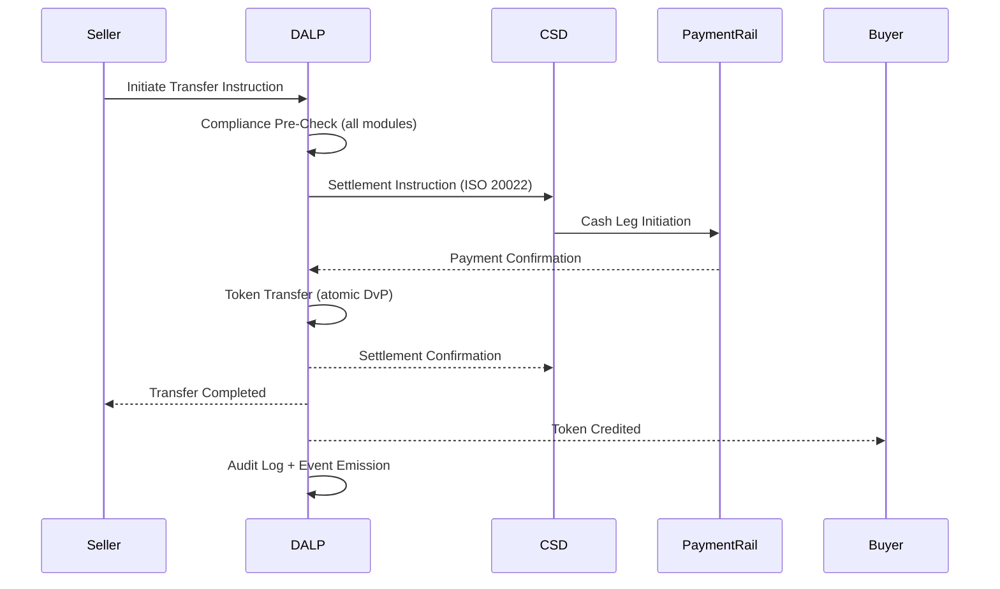

DALP's XvP Settlement addon provides atomic delivery-versus-payment settlement. The settlement flow is deterministic: either both the payment and token legs complete, or neither does. Partial settlement cannot occur.

**Settlement mechanics:**
1. Transfer instruction submitted with settlement terms (counterparty, settlement date, cash leg reference).
2. Compliance pre-check validates all eligibility conditions.
3. Settlement instruction generated in ISO 20022 format for CSD/payment rail integration.
4. Payment confirmation received from payment rail triggers token transfer execution.
5. Token transfer executed on-chain with tamper-evident record.
6. Settlement confirmation sent to CSD for position update.

**Failed settlement handling:** If the payment leg fails (rejection, timeout, insufficient funds), the pending token transfer is cancelled cleanly. The instruction enters a failed state with reason code, and operations teams receive an alert. Retry or manual resolution workflows are available.

**Cut-off window management:** ADX settlement cut-off times are configurable per instrument type. Instructions submitted after cut-off are queued for the next settlement window with appropriate notifications to counterparties.

## 5.6 Lifecycle Servicing and Corporate Actions

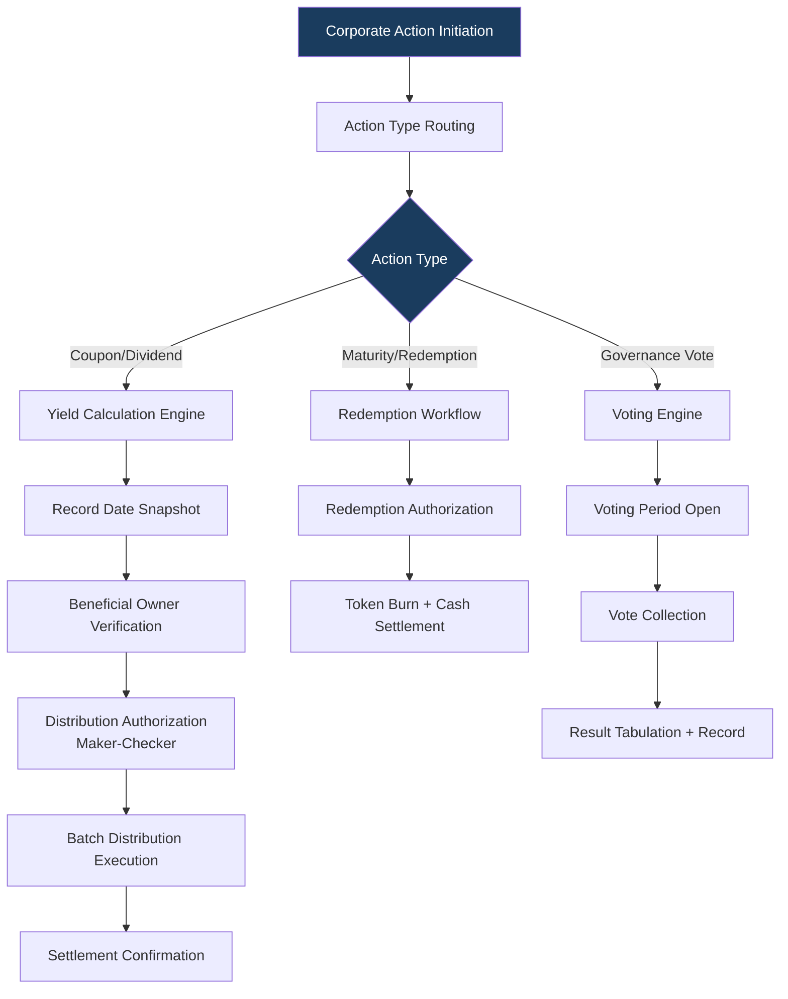

**Coupon and dividend distribution:** DALP's Yield addon calculates distribution entitlements based on configurable yield parameters (fixed rate, floating rate, periodic frequency). Record date snapshots capture beneficial owner positions at the defined date. Distribution execution is batched and requires maker-checker authorization before payment release.

**Record-date logic:** The platform supports configurable record-date definitions aligned with conventional T+X settlement conventions. Historical balance tracking (a configurable token feature) enables accurate beneficial owner position calculation at any historical date.

**Maturity and redemption:** Bond maturity triggers are monitored and activated through the maturity redemption token feature. Redemption workflows include investor notification, authorization of the redemption transaction, token burn execution, and cash settlement instruction generation.

**Corrective actions:** If a distribution calculation error is identified post-execution, the platform supports correction workflows with mandatory documentation (reason for correction, authorization, before/after state comparison). Corrections are logged as explicit events in the audit trail, not as silent overwrites.

## 5.7 Integration and Interoperability

DALP provides a comprehensive integration surface for ADX's enterprise stack:

| Integration Point | Protocol | Direction | Purpose |
|------------------|----------|-----------|---------|
| CSD/Settlement | ISO 20022 via REST | Bidirectional | Settlement instruction exchange |
| Broker connectivity | OpenAPI 3.1 | Inbound | Transaction instruction submission |
| Market surveillance | Webhook event stream | Outbound | Real-time transaction notifications |
| AML/KYC screening | REST API | Outbound | Investor eligibility verification |
| Identity/IAM | SAML 2.0 / OIDC | Inbound | Operator authentication |
| Reporting/BI | Batch extract (CSV/JSON) | Outbound | Regulatory and management reporting |
| Custody/HSM | Hardware interface | Internal | Key management |

## 5.8 Functional Fit Matrix

| Req ID | Requirement | Response Status | DALP Mechanism | Notes |
|--------|-------------|----------------|----------------|-------|
| REQ-01 | Segregated environments | Full | Four-environment model: dev, test, UAT, production | Each with independent network configuration |
| REQ-02 | API-first, eventing, version governance | Full | OpenAPI 3.1, webhook events, semantic versioning | Backward compatibility across major versions |
| REQ-03 | RBAC, maker-checker, audit logs | Full | 26-role RBAC model, configurable approval workflows, on-chain logs | Immutable audit evidence |
| REQ-04 | Configurable lifecycle, policy controls | Full | Compliance module framework, configurable state machine | No redevelopment required for policy changes |
| REQ-05 | Third-party dependency disclosure | Full | See Section 10 and Appendix D | All dependencies named |
| REQ-06 | Resilience, recovery, monitoring | Full | Private cloud HA, automated backups, Prometheus/OpenTelemetry | RTO < 4h, RPO < 1h |
| REQ-07 | Delivery method, phased plan | Full | 18-week implementation plan, six phases | See Section 11 |
| REQ-08 | Audit evidence extraction | Full | Tamper-evident logs, exportable evidence packs, API access | On demand for regulatory review |
| REQ-16 | Issuance, registry, transfer, settlement | Full | Bond/equity asset types, OnchainID registry, XvP settlement | |
| REQ-17 | Market infrastructure interfaces, surveillance export | Full | ISO 20022 integration, webhook event stream | |

---

# 6. Technical Architecture

## 6.1 Architectural Principles

DALP's architecture is governed by five principles directly relevant to ADX's requirements:

1. **Lifecycle-first:** The platform is designed around asset lifecycle management, not around the blockchain layer. The blockchain is the enforcement mechanism, not the product.
2. **Durable execution:** All workflows are implemented on a durable execution engine (Restate). If any step fails, the workflow can be resumed from the last successful checkpoint without manual intervention or orphaned state.
3. **Defense-in-depth:** Security controls are layered across the smart contract, middleware, API, and infrastructure layers. No single-layer failure grants unauthorized access.
4. **Separation of concerns:** Each platform layer enforces its own invariants. The compliance engine does not depend on the application layer; the smart contract layer does not depend on the middleware layer for compliance enforcement.
5. **Provider abstraction:** The platform can operate on any EVM-compatible blockchain without application code changes. Custody provider, cloud provider, and identity provider are configurable parameters, not architecture constraints.

## 6.2 Layered Architecture

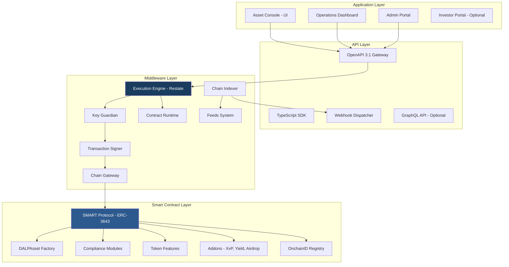

**Application layer:** The Asset Console provides UI access for issuers, compliance officers, and operations teams. Role-based views restrict access to permitted operations. The Operations Dashboard provides real-time visibility into transaction queues, compliance alerts, and settlement status. The Admin Portal manages user provisioning, role assignment, and platform configuration.

**API layer:** The OpenAPI 3.1 gateway is the primary integration surface for broker systems, CSD connectivity, and external reporting tools. All API operations are authenticated and authorized. The webhook dispatcher delivers structured event notifications to configured endpoints with retry logic and delivery confirmation.

**Middleware layer:** The Execution Engine (Restate) orchestrates all multi-step workflows with durability guarantees. The Key Guardian manages cryptographic key material and signs transactions through approved HSM or custody integrations. The Chain Indexer processes all on-chain events and maintains a queryable off-chain state for reporting and operations.

**Smart contract layer:** The SMART Protocol provides the ERC-3643 token standard with modular compliance enforcement. DALPAsset is the configurable contract type that supports runtime attachment of compliance modules and token features. The OnchainID Registry maintains verified investor identities and KYC claims.

## 6.3 Data Architecture

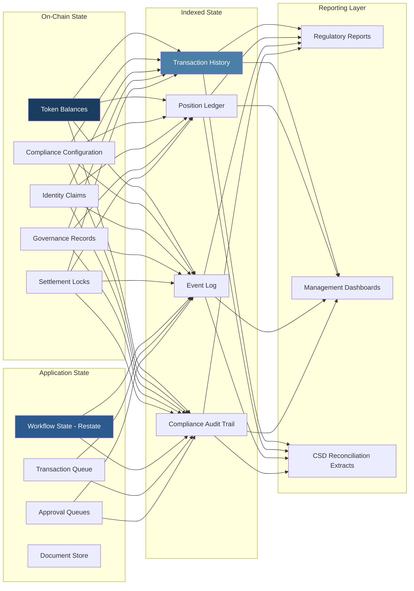

**On-chain state** is authoritative for token balances, compliance configuration, identity claims, and settlement locks. This state is tamper-evident and permanently auditable.

**Application state** managed by the execution engine tracks workflow progress, pending approvals, transaction queues, and document versions. This state is durable and restorable from the on-chain record in the event of application-layer failure.

**Indexed state** provides queryable off-chain representations of on-chain events, enabling fast regulatory reporting, reconciliation, and operational dashboards without requiring direct chain reads.

**Reporting layer** aggregates indexed state into structured outputs: regulatory reports (SCA, ADGM FSRA format), management dashboards, and CSD reconciliation extracts.

## 6.4 Network and Chain Topology

The recommended blockchain network for ADX's digital securities marketplace is Hyperledger Besu with IBFT 2.0 (Istanbul Byzantine Fault Tolerant) consensus. This choice reflects ADX's requirements for:

- **Permissioned access:** Only authorized nodes can participate in the network. No public participation or mining.
- **Deterministic finality:** IBFT 2.0 provides instant finality, once a block is committed, it cannot be reversed. This is required for settlement applications where probabilistic finality creates operational risk.
- **EVM compatibility:** Hyperledger Besu runs the full EVM, enabling SMART Protocol smart contracts to operate without modification.
- **Enterprise-grade performance:** The network is tuned for ADX's transaction profile: bond and equity lifecycle events, not high-frequency trading.

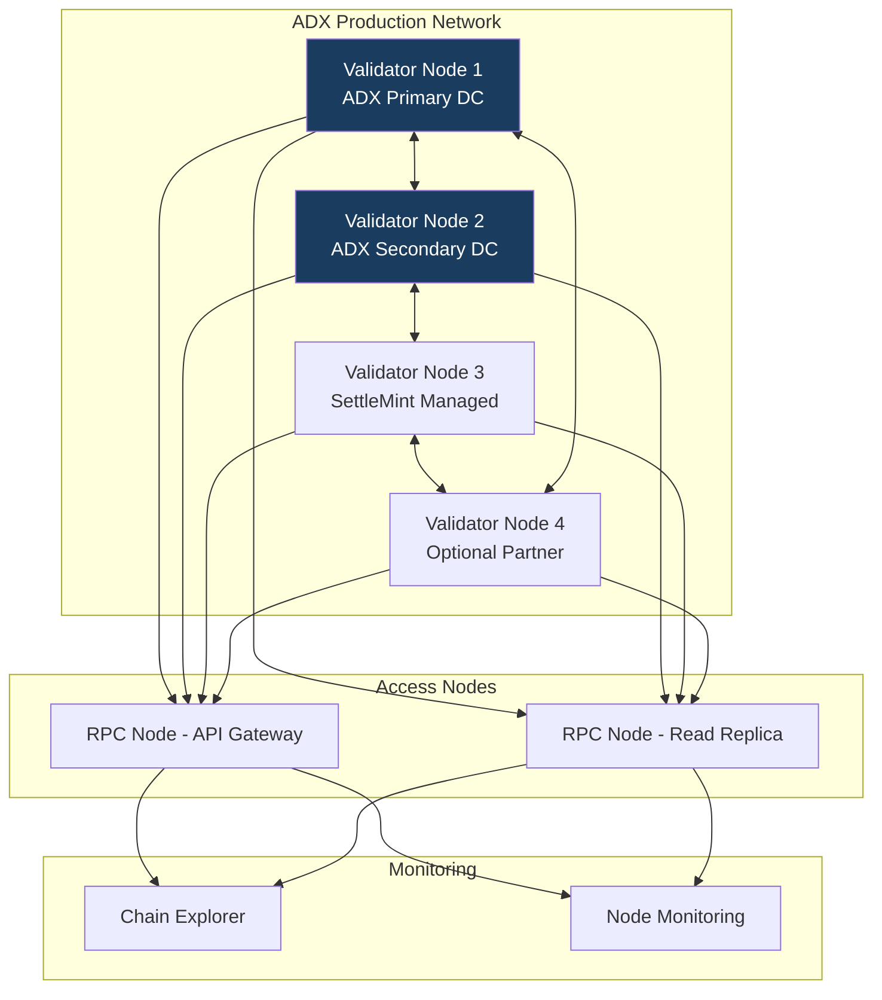

## 6.5 Multi-Tenancy and Environment Segregation

DALP supports four segregated environments required by ADX's REQ-01:

| Environment | Purpose | Network | Data |
|-------------|---------|---------|------|
| Development | Feature development, configuration iteration | Isolated test chain | Synthetic data only |
| Test | Integration testing, API validation | Isolated test chain | Synthetic data only |
| UAT | User acceptance testing, training | UAT chain (ADX-managed) | Anonymized test data |
| Production | Live operations | Production chain | Real operational data |

Each environment has independent: blockchain networks, database instances, API gateway configurations, user access controls, and monitoring dashboards. Production credentials do not exist in lower environments. Data promotion between environments follows a documented promotion process with approval gates.

## 6.6 Operational Architecture

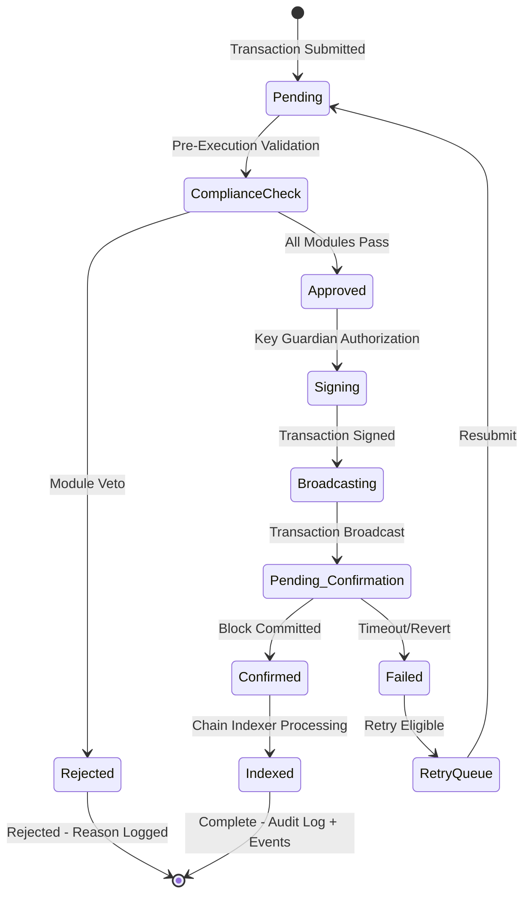

The transaction lifecycle is fully durable. The Execution Engine (Restate) tracks each transaction through its lifecycle states. If the application layer fails at any point between Pending and Indexed, the workflow resumes from the last confirmed checkpoint on restart. This prevents phantom transactions, duplicate submissions, and lost settlement instructions.

---

# 7. Asset Lifecycle and Compliance Infrastructure

## 7.1 Token Deployment Pipeline

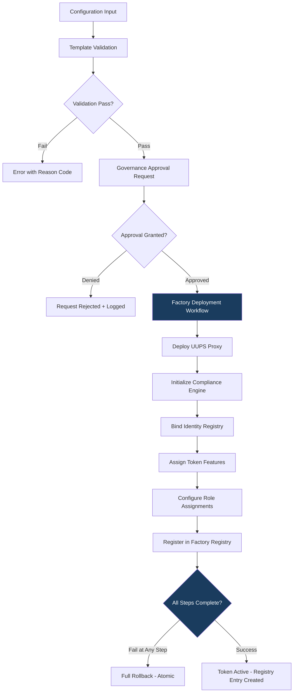

The deployment workflow is atomic and durable. CREATE2 deterministic addressing ensures that the same configuration parameters always produce the same contract address, enabling pre-announcement of contract addresses to market participants before deployment.

## 7.2 Compliance Module Configuration

For ADX's digital securities marketplace, the following compliance module configuration is recommended:

**Bond instruments:**
- Identity verification (mandatory for all transfers)
- Country allow list (configurable GCC/international investor base)
- Investor count limit (enforcement of maximum holder cap)
- Time lock (post-issuance lock-up period)
- Transfer approval (optional: for primary distribution window management)

**Equity instruments:**
- Identity verification (mandatory)
- Country allow/block list (jurisdiction restrictions per SCA rules)
- Investor count limit (shareholder cap for private company instruments)
- Supply cap collateral (for instruments requiring on-chain proof of reserves)

Compliance module reconfiguration after deployment is available for all configurable modules without redeploying the token contract. Reconfiguration requires governance role authorization and creates an audit record of the change, the previous configuration, and the approver identity.

## 7.3 Investor Lifecycle Management

Investor lifecycle management in DALP tracks the complete state of each investor's eligibility status:

| Status | Description | Transfer Eligibility |
|--------|-------------|---------------------|
| Pending | KYC submitted, under review | Ineligible |
| Active | KYC verified, claims issued | Eligible (subject to instrument rules) |
| Restricted | Under investigation or compliance hold | Ineligible |
| Suspended | Regulatory suspension or sanction | Ineligible |
| Offboarded | Relationship terminated | Ineligible |

Status transitions are governed by compliance officer authorization with mandatory reason codes and audit logging. Investor offboarding includes custody handling for any remaining token positions (forced transfer, lock, or custodian hold depending on the reason).

---

# 8. Security, Governance, and Controls

## 8.1 Security Model Overview

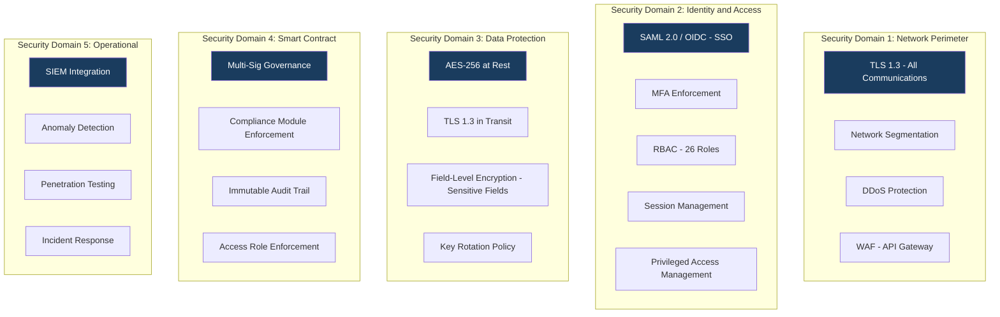

## 8.2 Authentication and Access Control

DALP's access control model distinguishes four actor types relevant to ADX's operating model:

**Business initiators:** Can submit transactions, configure instrument parameters, and view operational dashboards. Cannot approve their own submissions (maker-checker enforcement).

**Approvers/Supervisors:** Can approve or reject pending transactions submitted by initiators. Cannot initiate their own transactions for self-approval.

**Platform administrators:** Can manage user provisioning, role assignments, and system configuration. Cannot approve business transactions or access operational approval queues.

**Auditors/Read-only:** Can access all audit logs, event history, and reporting outputs. Cannot initiate or approve any transactions.

**Separation of duties matrix for ADX:**

| Action | Business Initiator | Approver | Admin | Auditor |
|--------|-------------------|---------|-------|---------|
| Submit issuance request | ✓ | - | - | - |
| Approve issuance | - | ✓ | - | - |
| Configure compliance modules | ✓ | - | - | - |
| Approve compliance change | - | ✓ | - | - |
| View audit logs | - | - | - | ✓ |
| User provisioning | - | - | ✓ | - |

## 8.3 Key Management and Custody Integration

DALP's Key Guardian provides three tiers of key management:

**Tier 1. Cloud KMS:** Cryptographic keys managed by cloud provider HSM (Azure Key Vault, AWS KMS). Suitable for development and UAT environments.

**Tier 2. Managed HSM:** Dedicated hardware security modules managed by SettleMint. Suitable for production with managed SaaS deployment model.

**Tier 3. Client-Controlled HSM / Custody Provider:** Integration with ADX's own HSM infrastructure or institutional custody provider (Fireblocks, DFNS, Ledger Enterprise). Recommended for production on private cloud deployment. ADX retains key custody; SettleMint has no access to signing keys.

**Maker-checker for signing:** Every signing operation requires dual authorization in production. The transaction is prepared by one role and approved for signing by a separate authorized role. Emergency signing override requires break-glass access (time-bounded, logged, requires retrospective review).

## 8.4 Data Protection and Encryption

| Data Category | Encryption | Key Management | Retention |
|--------------|-----------|----------------|-----------|
| Token state (on-chain) | EVM native | Blockchain cryptography | Permanent (immutable) |
| Application state | AES-256 | Cloud KMS / HSM | Configurable per data class |
| Document store | AES-256 + cryptographic hash | Cloud KMS / HSM | Per regulatory requirement |
| API logs | TLS in transit, AES-256 at rest | Cloud KMS | 7 years minimum |
| Personal data (investor records) | AES-256 + field-level encryption | Client-controlled | GDPR/PDPL compliant |

UAE Federal Personal Data Protection Law (PDPL) compliance is addressed through field-level encryption of personal data, access logging, data subject request handling capability, and configurable data residency. All data for the ADX deployment remains within UAE cloud regions.

## 8.5 Compliance Controls and Auditability

DALP produces seven categories of audit evidence relevant to ADX's regulatory obligations:

1. **Transaction audit log:** Every transaction with initiator identity, timestamp, operation type, compliance check results, approval chain, and final outcome.
2. **Compliance decision log:** Every compliance module invocation with inputs, rule version applied, and decision rationale.
3. **Entitlement history:** Complete history of role assignments, changes, approvals, and recertification events.
4. **Configuration change log:** Every platform configuration change with operator identity, timestamp, previous and new values, and authorization record.
5. **Key management log:** HSM access events, key rotation records, and break-glass access instances.
6. **Settlement record:** All settlement instructions with status history, counterparty references, and confirmation records.
7. **Incident log:** All security incidents, investigation actions, and resolution records with timestamps.

All audit evidence is exportable in structured formats (JSON, CSV) for integration with SIEM systems and regulatory reporting environments.

## 8.6 Security Responsibility Matrix

| Control Area | SettleMint | ADX | Shared |
|-------------|-----------|-----|--------|
| Platform software security | Primary | Review | Security review access |
| Network perimeter | Primary (managed cloud) | ADX-side controls | DDoS, WAF configuration |
| Key management | Framework + Tier 2 option | ADX-controlled keys (Tier 3) | Key ceremony governance |
| User provisioning | Platform tooling | HR/IAM process | Role definition approval |
| Penetration testing | Annual minimum | ADX-initiated requests | Test scoping and evidence sharing |
| Incident response | Platform incidents | ADX-side incidents | Joint incidents per P1 protocol |
| Regulatory evidence | Production and delivery | Submission and interpretation | Evidence walkthrough support |

---

# 9. Integration and Interoperability

## 9.1 Integration Architecture

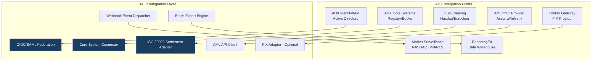

## 9.2 CSD and Settlement Integration

DALP generates settlement instructions in ISO 20022 format, aligned with ADX's settlement infrastructure. The integration pattern is:

1. Token transfer instruction received by DALP
2. Settlement instruction created in ISO 20022 pain.001 format
3. Instruction delivered to CSD/RTGS via configured channel (REST, SWIFT, file-based)
4. CSD confirms receipt and processing status
5. Payment confirmation (ISO 20022 pain.002) triggers token delivery
6. Settlement completion confirmation sent to CSD for position reconciliation

**Reconciliation:** DALP generates daily reconciliation extracts comparing on-chain token balances against CSD position records. Discrepancies are flagged for operations team review with a structured exception management workflow.

## 9.3 Broker Connectivity

Broker systems connect to DALP via the OpenAPI 3.1 gateway. The gateway supports:
- Instruction submission (buy/sell orders for primary distribution)
- Position enquiry (investor holding balances)
- Compliance status check (investor eligibility verification before order acceptance)
- Event notification subscription (webhook registration for trade confirmations)

**FIX protocol support:** For brokers operating on FIX protocol, a FIX adapter layer can be configured in the integration architecture, translating FIX messages to DALP API calls.

## 9.4 Market Surveillance Integration

DALP delivers structured transaction events to market surveillance systems via webhook. Each transfer event includes: instrument identifier, transferor wallet address, transferee wallet address, transfer quantity, timestamp, transaction hash (on-chain reference), compliance check summary, and settlement reference.

Surveillance systems receive a complete and time-ordered event stream that mirrors on-chain activity without requiring direct chain access. The event stream can be configured for real-time delivery or batch windowing depending on surveillance system requirements.

## 9.5 Release Management and API Versioning

DALP's API follows semantic versioning (major.minor.patch). Backward compatibility is maintained across minor and patch versions. Breaking changes are introduced only in major versions with a minimum 12-month notice period and a dual-version support window.

API consumers are notified of upcoming changes through a structured release communication process: advance notice (12 months for major, 3 months for minor), migration guide publication, sandbox environment availability for testing against new version, and formal deprecation schedule.

Lower environments (dev, test, UAT) are updated before production, providing consumers with a validation window before production rollout.

---

# 10. Deployment Model

## 10.1 Recommended Model: Private Cloud: UAE Region

SettleMint recommends private cloud deployment within UAE cloud regions (Azure UAE North, AWS Middle East. UAE) for ADX's digital securities marketplace. This model provides:

- **Data residency:** All data remains within UAE territorial boundaries, satisfying CBUAE and ADGM data sovereignty requirements.
- **Dedicated infrastructure:** ADX operates on dedicated compute, storage, and networking resources, no multi-tenant infrastructure sharing.
- **Security posture:** Network controls, access policies, and encryption configurations are ADX-specific, not shared with other SettleMint clients.
- **Platform capability parity:** All DALP capabilities are available under private cloud deployment without feature restriction.

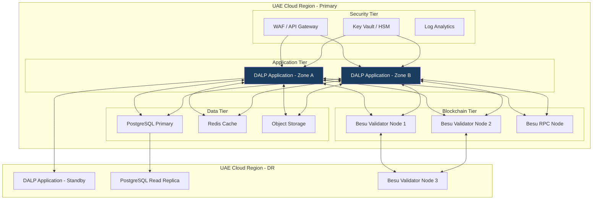

## 10.2 Deployment Options Considered

| Model | Control | Residency | Time-to-Deploy | Overhead |
|-------|---------|-----------|----------------|----------|
| Managed SaaS | Shared | SettleMint-managed | Fastest (< 2 weeks) | Lowest |
| Private Cloud (Recommended) | Dedicated | UAE region | 4-6 weeks | Medium |
| On-Premises | Full | ADX datacentre | 8-12 weeks | Highest |
| Hybrid | Partial | Mixed | 6-8 weeks | Medium-high |

## 10.3 Availability and Resilience

| Metric | Target | Mechanism |
|--------|--------|-----------|
| Uptime SLA | 99.9% | Multi-zone deployment, active-active application tier |
| RTO | < 4 hours | Automated failover, pre-configured DR environment |
| RPO | < 1 hour | Continuous database replication, hourly snapshots |
| Backup frequency | Hourly (incremental), daily (full) | Automated backup with integrity verification |
| DR testing | Quarterly | Scheduled DR exercises with documented outcomes |

## 10.4 Data Residency and Sovereignty

All production data for the ADX deployment is stored exclusively within UAE cloud regions. This covers:
- Application databases (PostgreSQL)
- Object storage (document store, backup archives)
- Log and monitoring data
- Cryptographic key material (Azure Key Vault UAE or AWS KMS ME-UAE)

Lower environments (development, test) may use shared SettleMint infrastructure outside UAE unless ADX specifies otherwise. UAT environment is recommended to match production region for final pre-production validation.

---

# 11. Implementation Methodology

## 11.1 Delivery Overview

SettleMint's implementation methodology follows a phase-gated model with explicit acceptance criteria at each gate. The approach is structured to ensure that control governance is established before feature breadth is expanded, no new capability is activated in production until the preceding control gate is verified.

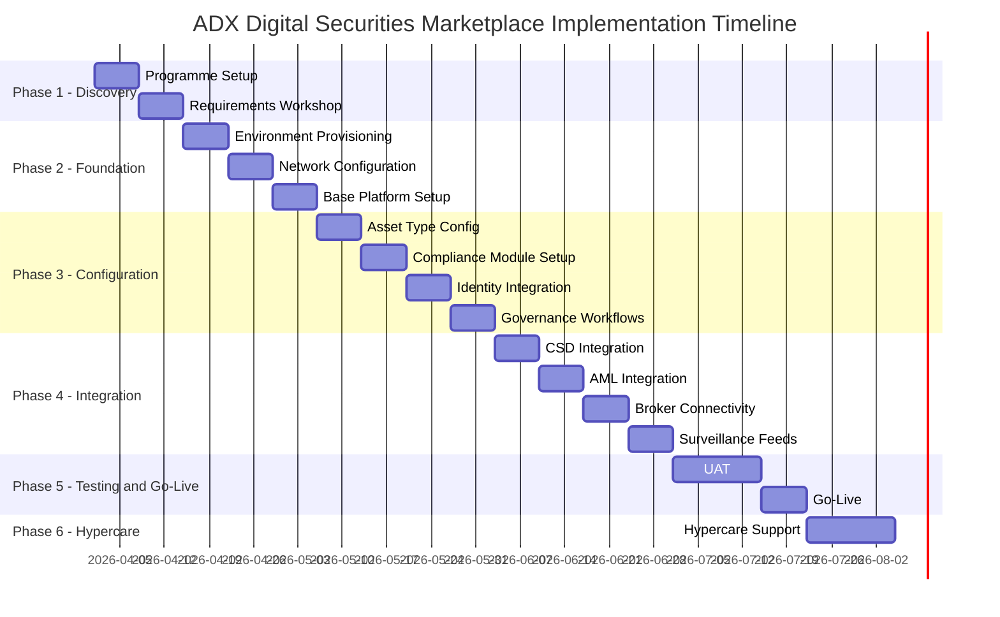

## 11.2 Phase Plan

### Phase 1: Discovery and Requirements (Weeks 1-2)

**Objective:** Establish shared understanding of ADX's operating model, system landscape, regulatory requirements, and delivery scope.

**Key activities:**
- Programme kickoff and governance establishment (steering committee, decision log, RAID register)
- Architecture and requirements workshops (exchange operations, compliance, technology, CSD relationship teams)
- Current system landscape mapping (identity, core registry, settlement infrastructure, surveillance)
- Regulatory requirement translation workshop (SCA, ADGM FSRA compliance obligations)

**Outputs:** Requirements baseline document, integration landscape map, delivery plan confirmed, RAID register established, steering governance active.

**Acceptance gate:** ADX Programme Director and SettleMint Programme Director jointly sign off requirements baseline and delivery plan before Phase 2 begins.

### Phase 2: Foundation and Setup (Weeks 3-5)

**Objective:** Provision and validate infrastructure, network, and base platform in all four environments.

**Key activities:**
- Cloud infrastructure provisioning (UAE region, dedicated VNet, security baseline)
- Blockchain network deployment (Besu validator nodes, IBFT 2.0 configuration, node monitoring)
- DALP base platform deployment (all environments: dev, test, UAT, production)
- Identity federation setup (SSO integration with ADX IAM)
- HSM/key management configuration (ADX key ceremony if Tier 3 custody selected)

**Outputs:** Four validated environments, infrastructure security baseline documented, network topology diagram approved by ADX security team.

**Acceptance gate:** ADX security team signs off network topology and access controls before configuration work begins.

### Phase 3: Configuration and Compliance (Weeks 6-9)

**Objective:** Configure instrument types, compliance modules, governance workflows, and investor eligibility rules.

**Key activities:**
- Bond and equity asset type configuration (instrument parameters, feature selection)
- Compliance module binding (country restrictions, investor count limits, identity verification, transfer controls)
- Governance workflow configuration (maker-checker thresholds, approval chains, exception handling)
- Investor eligibility framework setup (OnchainID claim types, KYC provider integration)
- Operations dashboard configuration (queue management, alert thresholds)

**Outputs:** Configured instrument templates, compliance module test evidence, governance workflow documentation, investor eligibility rules documented.

**Acceptance gate:** ADX compliance team approves compliance configuration against SCA and ADGM FSRA requirements before integration work begins.

### Phase 4: Integration and Testing (Weeks 10-13)

**Objective:** Connect DALP to ADX's enterprise systems and validate end-to-end workflows under realistic operating conditions.

**Key activities:**
- CSD/settlement integration (ISO 20022 instruction generation, confirmation handling)
- AML/KYC provider integration (screening API, alert handling, case management)
- Broker gateway integration (API connectivity, FIX adapter if required)
- Market surveillance feed configuration (webhook event stream, data format validation)
- Reporting and BI integration (batch extract configuration, regulatory report formats)
- Non-functional testing: performance (transaction throughput profile), resilience (failover testing), security (penetration test scope)

**Outputs:** Integration test evidence, non-functional test results, security test summary, UAT preparation environment confirmed.

**Acceptance gate:** ADX technology and operations teams approve integration test evidence and UAT plan before entering UAT phase.

### Phase 5: Go-Live (Weeks 14-16)

**Objective:** Execute controlled production go-live with defined scope, rollback capability, and live support.

**Key activities:**
- UAT execution (ADX business and operations teams), defect triage, sign-off
- Production environment final validation
- Cutover plan rehearsal and walkthrough with all stakeholder teams
- Production go-live execution (phased: first instrument type, controlled volume)
- Smoke test against production checklist
- Go-live incident support (SettleMint delivery team on extended coverage)

**Outputs:** Signed UAT completion evidence, production go-live confirmation, initial operational report.

**Acceptance gate:** ADX Programme Director signs go-live readiness certificate before first live instrument is deployed to production.

### Phase 6: Hypercare and Optimization (Weeks 17-18)

**Objective:** Stabilize operations, address early production issues, complete knowledge transfer, and transition to steady-state support.

**Key activities:**
- Hypercare incident response (extended coverage, expedited resolution)
- Performance monitoring and optimization (query tuning, batch processing review)
- Operations team training completion (handover runbooks, escalation procedures)
- Knowledge transfer sign-off (documentation review, runbook walk-through)
- Transition to steady-state support tier

**Outputs:** Operational readiness certificate, support transition documentation, post-implementation review scheduled.

## 11.3 Governance and Decision Structure

| Role | Responsibility | Frequency |
|------|---------------|-----------|
| ADX Programme Sponsor | Strategic direction, escalation authority | Monthly |
| ADX Programme Director | Day-to-day governance, milestone approval | Weekly |
| SettleMint Programme Director | Delivery management, risk escalation | Weekly |
| Steering Committee (joint) | Phase gate decisions, scope decisions | End of each phase |
| Technical Working Group (joint) | Architecture and integration decisions | Bi-weekly |
| Compliance Working Group | Regulatory interpretation, module configuration | Bi-weekly |

## 11.4 Resource Model

| Role | SettleMint | ADX |
|------|-----------|-----|
| Programme Director | 1 FTE | 1 FTE |
| Lead Architect | 1 FTE | 0.5 FTE (Architecture oversight) |
| Compliance Specialist | 1 FTE | 1 FTE (Compliance review) |
| Backend Engineers | 3 FTE | 1 FTE (Integration testing) |
| QA/Testing | 1 FTE | 2 FTE (UAT execution) |
| Operations Specialist | 1 FTE | 2 FTE (Operations training) |

---

# 12. Training and Knowledge Transfer

## 12.1 Training Strategy

SettleMint's training programme is designed to build genuine operational independence, not dependency. ADX staff should be capable of managing day-to-day platform operations, instrument configuration, compliance management, and incident response without SettleMint involvement after the handover period.

## 12.2 Training Tracks

| Track | Audience | Duration | Method |
|-------|---------|---------|--------|
| Administrator | Platform administrators, IT operations | 2 days | Instructor-led workshops + lab exercises |
| Developer/Integration | Integration teams, API consumers | 3 days | Technical workshops + API lab exercises |
| Operations | Business operations, compliance officers | 2 days | Workflow walkthroughs + scenario exercises |
| Compliance Management | Compliance team, audit liaison | 1 day | Configuration walkthrough + evidence review exercise |

## 12.3 Knowledge Transfer Deliverables

| Deliverable | Description | Owner |
|-------------|-------------|-------|
| Platform Administration Guide | Full admin documentation including configuration, user management, environment management | SettleMint |
| Operations Runbook | Step-by-step procedures for routine operations, exception handling, and incident escalation | SettleMint |
| Integration Specifications | OpenAPI specification, webhook event catalogue, integration patterns documentation | SettleMint |
| Compliance Configuration Guide | Module configuration procedures, policy update workflows, evidence extraction guide | SettleMint |
| Business Continuity Runbook | DR invocation procedures, recovery steps, communication protocols | SettleMint |

All documentation is maintained as formal deliverables with version control and update cadence aligned to platform releases.

---

# 13. Support and Service Levels

## 13.1 Support Model

SettleMint recommends the Enterprise Support tier for ADX's digital securities marketplace given its classification as market-critical infrastructure.

| Tier | Coverage | Response Times | Channels | Named Resources |
|------|---------|----------------|---------|----------------|
| Standard | Business hours (09:00-17:00 CET) | P1: 4h, P2: 8h | Email, portal | No |
| Premium | Extended hours (07:00-22:00 CET) | P1: 2h, P2: 4h | Email, portal, phone | No |
| Enterprise (Recommended) | 24/7/365 | P1: 1h, P2: 2h, P3: 8h | All channels + dedicated Slack | Named CSM + Technical Lead |

## 13.2 Severity and Response Matrix

| Severity | Definition | Initial Response | Resolution Target |
|----------|-----------|-----------------|------------------|
| P1: Critical | Production platform unavailable, settlement processing blocked | 1 hour | 4 hours or workaround |
| P2: High | Major functionality impaired, operational workaround available | 2 hours | 8 hours |
| P3: Medium | Non-critical functionality affected, no operational impact | 8 hours | 3 business days |
| P4: Low | Minor issues, informational, feature requests | 1 business day | Next release |

## 13.3 Uptime Commitment

| Environment | Uptime SLA | Measurement Window | Maintenance Window |
|-------------|-----------|--------------------|--------------------|
| Production | 99.9% | Monthly | Agreed maintenance window (typically off-hours) |
| UAT | 99.5% | Monthly | Best effort |
| Test/Dev | Best effort | - |, |

---

# 14. Risk Management

## 14.1 Risk Register

| ID | Risk | Likelihood | Impact | Mitigation | Owner |
|----|------|-----------|--------|-----------|-------|
| R-01 | Regulatory interpretation changes affecting compliance module configuration | Medium | High | Modular compliance engine enables configuration updates without redevelopment; regulatory monitoring included in delivery | SettleMint + ADX Compliance |
| R-02 | CSD integration complexity exceeds timeline estimate | Medium | Medium | ISO 20022 pre-built adapter; integration workshop in Phase 1 to identify gaps before Phase 4 | SettleMint + ADX Technology |
| R-03 | ADX IAM integration delays identity federation | Low | Medium | OIDC and SAML 2.0 support covers standard AD configurations; fallback to local user management during testing | SettleMint |
| R-04 | Security review by ADX information security team extends Phase 2 gate | Medium | Medium | Evidence pack pre-prepared (architecture diagrams, penetration test summary, access control documentation); dedicated security review session in Phase 2 plan | SettleMint + ADX IS |
| R-05 | Key management approach requires extended HSM commissioning | Low | High | HSM selection and ceremony planning to begin in Phase 1; Tier 2 managed HSM available as interim fallback | SettleMint + ADX |
| R-06 | ADX broker connectivity scope broader than estimated | Medium | Medium | FIX adapter available; broker integration requirements workshop in Phase 1 | SettleMint + ADX |
| R-07 | Non-functional testing reveals performance gaps at target volume | Low | High | Performance baseline testing in Phase 4 with adequate capacity scaling options available | SettleMint |
| R-08 | Regulatory approval timing for go-live | Medium | High | Early regulatory engagement recommended; documentation and evidence packs prepared for ADGM/SCA review at Phase 3 gate | ADX + SettleMint support |

---

# 15. Compliance Matrix

## 15.1 Status Legend

| Status | Meaning |
|--------|---------|
| Full | Requirement is fully met by DALP in current production release |
| Partial | Requirement is partially met; gap and mitigation described |
| Configurable | Requirement is met through platform configuration, not out-of-box default |
| Assumption | Response depends on a stated assumption about ADX's context |
| Out of Scope | Requirement is explicitly outside DALP's scope |

## 15.2 Detailed Matrix

| Req ID | Requirement Summary | Status | DALP Response | Assumptions / Notes |
|--------|--------------------|---------|--------------|--------------------|
| REQ-01 | Segregated dev/test/UAT/DR/production environments | Full | Four independent environments with separate networks, databases, and access controls | DR environment included in private cloud deployment |
| REQ-02 | API-first, eventing, version governance | Full | OpenAPI 3.1, webhook event streaming, semantic versioning with backward compatibility | 12-month notice for major version changes |
| REQ-03 | RBAC, segregation of duties, maker-checker, audit logs | Full | 26-role RBAC model, configurable maker-checker workflows, immutable on-chain audit trail | Maker-checker thresholds configurable by ADX |
| REQ-04 | Configurable lifecycle states, policy controls, limits | Full | Compliance module framework enables per-instrument rule configuration without redevelopment | Governance role required for module reconfiguration |
| REQ-05 | Third-party dependency disclosure | Full | All dependencies disclosed in Appendix D of this proposal | |
| REQ-06 | Resilience, recovery, backup, monitoring, incident management | Full | 99.9% uptime SLA, RTO < 4h, RPO < 1h, 24/7 monitoring, documented incident response | Private cloud deployment; DR in secondary UAE zone |
| REQ-07 | Delivery method, client effort, phased plan | Full | 18-week phased implementation plan with explicit resource model and phase gates | Phase timeline assumes ADX resource availability per Section 11.4 |
| REQ-08 | Evidence extraction for audit, supervisory review | Full | Structured audit log export, evidence packs, API access for regulatory evidence | Evidence in JSON and CSV formats |
| REQ-16 | Issuance, registry, transfer controls, settlement data | Full | Bond and equity asset types, OnchainID investor registry, XvP settlement, ISO 20022 output | |
| REQ-17 | Market infrastructure interfaces, surveillance-grade audit exports | Full | ISO 20022 CSD integration, webhook event stream for surveillance, structured batch export | |
| RC-01 | Regulatory mapping | Full | SCA, ADGM FSRA, CBUAE framework alignment documented; compliance module binding maps to jurisdiction requirements | ADX retains responsibility for final regulatory interpretation |
| RC-02 | AML/CFT and sanctions | Full | AML provider integration (REST API), screening workflow, alert management hooks, case management evidence | ADX selects AML screening provider |
| RC-03 | Data governance | Full | UAE data residency, AES-256 encryption, PDPL-compliant personal data handling, 7-year log retention | |
| RC-04 | Operational resilience | Full | DR testing quarterly, RTO/RPO tested, incident management documented, third-party risk monitoring | |
| RC-05 | Outsourcing and subcontractors | Full | All cloud, managed-service, and custody dependencies disclosed in Appendix D | |
| RC-06 | Assurance and audit | Full | Tamper-evident logs, configuration snapshots, penetration test summaries, evidence packs available | Annual penetration test minimum |

---

# Appendix A: Operating Model Detail

## A.1 Role Ownership Framework

The ADX digital securities marketplace operating model assigns clear ownership across seven functional domains:

**Product Management (ADX Market Development):** Owns instrument type definitions, investor eligibility policy, listing-document templates, and fee structures. Interacts with platform through the Asset Designer UI. All new instrument configurations submitted through maker-checker workflow requiring Compliance sign-off.

**First-Line Operations (ADX Operations):** Manages day-to-day transaction queues, exception handling, settlement monitoring, and corporate action execution. Uses the Operations Dashboard. Authorized to resolve P2-P3 operational exceptions within defined thresholds; P1 exceptions escalate to Technology.

**Compliance Oversight (ADX Compliance):** Reviews and approves compliance module configurations, investor eligibility exceptions, and corrective action requests. Receives real-time alerts for compliance module rejections above threshold. Reviews weekly exception reports and monthly compliance evidence packs.

**Treasury/Finance (ADX Finance):** Monitors distribution calculations, settlement cash positions, and fee settlement. Reviews yield calculation evidence for coupon/dividend events. Approves cash settlement instructions above defined threshold.

**Information Security (ADX IS):** Manages user provisioning approvals, periodic access recertification (quarterly), security incident escalation, and HSM key ceremony participation. Reviews monthly security event summaries from SIEM integration.

**Platform Administration (ADX Technology):** Manages environment configuration, monitoring dashboards, patch scheduling, and integration maintenance. Coordinates with SettleMint support team for platform issues.

**Executive Escalation:** Programme Sponsor receives monthly operational dashboard summary and is the authority for scope changes, policy decisions above defined thresholds, and regulatory escalation decisions.

## A.2 Boundary Conditions

**Rejected transactions:** A rejected transfer instruction enters the exception queue with a structured reason code. The assigned operations owner reviews the reason, determines whether the rejection is a data quality issue or a policy issue, and either corrects and resubmits (data issue) or escalates to compliance (policy issue). All exception handling is logged.

**Stale approvals:** Pending approval requests expire after a configurable timeout (default: 48 hours for business-hours operations, configurable per workflow type). Expired approvals are automatically rejected and logged. The submitter is notified and must resubmit. This prevents indefinite pending states that could block operational queues.

**Delayed settlement:** Settlement instructions that exceed the configured settlement window enter a late-settlement exception queue. Operations teams receive notification with counterparty details and settlement reference. Manual resolution or cancellation is available through authorized operations roles.

**Corrected records:** Post-event corrections require documented authorization: reason for correction, before/after state comparison, approval by compliance and operations supervisors, and a correction event logged in the audit trail. Silent overwrites are not possible; every correction creates an explicit event record.

## A.3 Daily, Weekly, Monthly Governance Routines

**Daily:** Transaction exception queue review (Operations), settlement status confirmation (Operations + Finance), compliance alert triage (Compliance), system health check (Technology).

**Weekly:** Exception register review (Operations + Compliance), entitlement change review (IS), integration status report (Technology + SettleMint).

**Monthly:** Access recertification (IS), compliance module configuration review (Compliance), management reporting package (all domains), SettleMint service review (Technology + SettleMint CSM), risk register update (Programme Director).

---

# Appendix B: Security and Resilience

## B.1 Encryption and Secrets Handling

All cryptographic key material is stored exclusively in HSM or cloud KMS systems, never in application configuration files or database records. Secret rotation follows a defined schedule: API keys rotate every 90 days, operational tokens rotate every 24 hours, HSM keys rotate annually with ceremony governance.

Break-glass access to administrative credentials requires: dual-person authorization, time-bounded access window (maximum 4 hours), mandatory activity logging, and retrospective review by IS within 24 hours.

## B.2 Vulnerability Management

DALP participates in a continuous vulnerability management programme:
- Automated dependency scanning on every code commit
- Monthly SAST/DAST scanning of the platform codebase
- Annual third-party penetration test (minimum scope: API endpoints, authentication flows, smart contract review)
- Critical/high severity vulnerabilities patched within 48 hours of confirmed finding

Evidence of penetration test outcomes (executive summary) is available to ADX on request. Full reports are available under NDA for architecture security review.

## B.3 Incident Management

| Phase | Description | Owner |
|-------|-------------|-------|
| Detection | Automated monitoring alerts or client report | SettleMint (platform) / ADX (business) |
| Triage | Severity classification, initial impact assessment | SettleMint L1 Support |
| Response | Technical resolution and client communication | SettleMint L2/L3 + Client Operations |
| Recovery | Production restoration, evidence preservation | SettleMint Engineering + ADX Technology |
| Post-Incident | Root cause analysis, remediation plan, report | SettleMint Programme Director + ADX Programme Director |

P1 incident post-mortems are completed within 5 business days and shared with ADX. Post-mortem reports are retained as part of the operational evidence record.

---

# Appendix C: Data and Integration

## C.1 Data Model Boundaries

DALP owns: token state (on-chain), compliance module configuration, identity claim registry, audit event log, workflow state.

ADX systems remain authoritative for: investor identity source of truth (KYC provider), cash positions (core banking/treasury), CSD position records, instrument legal documentation.

**Synchronization:** Synchronization between DALP's indexed state and ADX's authoritative systems occurs through:
- Real-time webhooks for state-change events
- Scheduled batch reconciliation (daily, configurable frequency)
- On-demand extract for regulatory reporting

## C.2 Reconciliation

Daily reconciliation process compares:
- DALP token balances per investor per instrument vs CSD registered positions
- Settlement confirmation records vs CSD settlement confirmations
- Distribution payments vs treasury settlement records

Reconciliation breaks are surfaced in the Operations Dashboard with a structured exception record including: instrument identifier, investor reference, DALP balance, CSD balance, discrepancy value, and timestamp of last confirmed match. Operations teams have a defined resolution workflow for each break category.

---

# Appendix D: Dependency Register

| Dependency | Provider | Role | Risk Level | Substitution Option |
|-----------|---------|------|-----------|---------------------|
| Cloud infrastructure | Azure UAE North or AWS ME-UAE | Compute, storage, networking | Medium | Multi-cloud capable; migration path available |
| Key management | Azure Key Vault / AWS KMS | Cryptographic key storage | Medium | ADX HSM substitution available (Tier 3) |
| Blockchain network | Hyperledger Besu | Permissioned EVM network | Low | Other EVM networks supported without code change |
| AML/KYC screening | ADX-selected provider | Investor screening | Medium | API integration pattern is provider-agnostic |
| CSD integration | ADX CSD partner | Settlement instruction exchange | High | Integration design phase maps CSD-specific requirements |
| Custody provider | Fireblocks/DFNS/Client HSM | Institutional key custody | Medium | Key Guardian framework supports multiple providers |

---

# Appendix E: Staffing and Plan

## E.1 Staffing Assumptions

The 18-week implementation plan assumes:
- ADX Programme Director available full-time from Week 1
- ADX technical integration team (2-3 engineers) available from Week 4
- ADX compliance team (1-2 officers) available for workshops in Weeks 1-3 and 6-8
- ADX operations team (3-4 staff) available for training and UAT from Week 12
- ADX IS team available for security review gate in Week 5

Delays in ADX-side resource availability will impact milestone dates proportionally. SettleMint's Programme Director will flag resource risks at weekly steering meetings.

## E.2 Critical Dependencies

1. Cloud infrastructure procurement and provisioning (ADX procurement lead time): must be initiated no later than Week 1 to avoid Phase 2 delay.
2. HSM selection and key ceremony scheduling: must be confirmed by end of Phase 1.
3. AML/KYC provider API credentials: must be available for Phase 3 integration work.
4. CSD technical contact availability: required from Phase 4 Week 10 for integration testing.
5. Regulatory pre-notification to ADGM FSRA: recommended before Phase 5 go-live; ADX to initiate in Phase 3.

---

*End of Technical Proposal. ADX Abu Dhabi Securities Exchange*

*Document Version: 1.0 | Date: 2026-03-19 | Classification: Restricted. Commercial-Sensitive*

*SettleMint NV | Rue Montoyer 39, 1000 Brussels, Belgium | www.settlemint.com*
