# Technical Proposal

## Tokenized Securities Issuance and Trading Framework

---

**Document Title:** Technical Proposal. Tokenized Securities Issuance and Trading Framework

**Client:** Casablanca Stock Exchange (Bourse de Casablanca)

**Submission Date:** 2026-03-19

**Version:** 1.0

**Confidentiality:** Restricted. Commercial-Sensitive

**Prepared by:** SettleMint NV

---

> This document contains confidential and proprietary information of SettleMint NV. Distribution or reproduction without prior written consent is prohibited.

---

# Table of Contents

1. Executive Summary
2. About SettleMint
3. About DALP
4. Understanding Casablanca Stock Exchange Requirements
5. Proposed Solution and Functional Capabilities
6. Technical Architecture
7. Asset Lifecycle and Compliance Infrastructure
8. Security, Governance, and Controls
9. Integration and Interoperability
10. Deployment Model
11. Implementation Methodology
12. Training and Knowledge Transfer
13. Support and Service Levels
14. Risk Management
15. Compliance Matrix
16. Appendix A: Operating Model Detail
17. Appendix B: Security and Resilience
18. Appendix C: Data and Integration

---

# 1. Executive Summary

## 1.1 Context and Strategic Drivers

Casablanca Stock Exchange (Bourse de Casablanca) is the principal securities exchange in Morocco and one of the leading capital markets infrastructure operators in Africa. The tokenized securities issuance and trading framework programme represents a strategic initiative to extend the Exchange's market infrastructure capabilities into digital asset-native instruments, while preserving the governance, regulatory compliance, and operational integrity that its current market position requires.

The Moroccan capital markets context is specific and material. The Autorité Marocaine du Marché des Capitaux (AMMC) governs securities market activities in Morocco, including disclosure requirements, investor protection rules, and market conduct standards. Bank Al-Maghrib sets monetary policy and payment system expectations that affect the cash leg of any tokenized securities settlement. The Casablanca Finance City (CFC) ecosystem creates a regional financial hub context that connects Moroccan market infrastructure to broader Pan-African and international flows.

Morocco's digital finance landscape is evolving. Bank Al-Maghrib has engaged in payments modernization and digital finance research. The CFC has positioned Casablanca as a gateway for institutional capital accessing African markets. In this context, a tokenized securities framework for the Casablanca Stock Exchange is not an isolated innovation experiment, it is a programme to extend regulated market infrastructure to support new instrument types and investor access models while remaining within the existing regulatory perimeter.

SettleMint proposes DALP, the Digital Asset Lifecycle Platform, as the production-grade infrastructure for this programme. DALP provides the lifecycle coverage, compliance enforcement, and audit evidence capabilities required for a regulated exchange operator operating under AMMC oversight.

## 1.2 Why This Programme Is Hard

Tokenized securities at an exchange operator involve a specific complexity profile distinct from generic tokenization pilots.

**Regulatory perimeter complexity:** Morocco's securities regulatory framework requires that tokenized instruments maintain the same investor protection, disclosure, and market conduct standards as conventional instruments. The compliance framework must be configurable to match AMMC requirements across instrument types and investor classes.

**Bilingual operational requirements:** Casablanca Stock Exchange operates in French and Arabic. Operational documentation, user interfaces, and regulatory reporting must support both languages. This is an operational requirement, not a cosmetic preference.

**Pan-African investor access:** The CFC hub model means Casablanca Stock Exchange serves investors from across Africa and internationally. Investor eligibility rules, AML/CFT screening, and cross-border transfer controls must handle a diverse investor base across multiple jurisdictions with varying regulatory expectations.

**CSD coexistence:** Maroclear serves as Morocco's central securities depository. Any tokenized securities framework must produce CSD-compatible data and settle in a way that preserves Maroclear's authoritative position in the settlement chain.

## 1.3 Proposed Response

SettleMint proposes DALP deployed as the tokenized securities control plane for Casablanca Stock Exchange. The platform covers the complete lifecycle from issuer onboarding through instrument configuration, investor eligibility enforcement, primary issuance, secondary trading support, corporate actions, and regulatory evidence production.

The recommended deployment model is private cloud within a Moroccan or European cloud region (OVHcloud Roubaix or Azure France Central) to satisfy Moroccan data sovereignty expectations. The blockchain network is Hyperledger Besu with IBFT 2.0 consensus.

The phased delivery plan runs 18 weeks: Discovery (Weeks 1-2), Foundation (Weeks 3-5), Configuration (Weeks 6-9), Integration (Weeks 10-13), Go-Live (Weeks 14-16), Hypercare (Weeks 17-18).

## 1.4 Why SettleMint

SettleMint brings directly relevant credentials for Casablanca Stock Exchange's programme:

- **Exchange operator experience:** DALP has been deployed for exchange-operator and listing-platform contexts in Europe, including Euronext, providing production evidence of the exchange infrastructure integration patterns Casablanca requires.
- **African market experience:** SettleMint has delivered programmes across African financial institutions, including the Johannesburg Stock Exchange (JSE) context and Pan-African digital bond deployments.
- **Islamic finance capability:** Where sukuk or Sharia-compliant instruments are in scope, DALP's compliance module framework supports the governance and documentation requirements applicable to Islamic financial instruments.
- **Multi-jurisdictional compliance:** DALP's compliance engine supports configurable rules across multiple investor classes and jurisdictions, directly applicable to Casablanca's diverse investor base.

## 1.5 Reference Fit Snapshot

- **Euronext. Digital Securities Listing Platform (Europe):** Exchange operator context, investor eligibility enforcement, CSD integration, post-trade reconciliation. Directly applicable.
- **JSE (Johannesburg Stock Exchange) context (Africa):** African exchange infrastructure, local regulatory alignment, domestic CSD interaction.
- **Standard Chartered Bank. Multi-region (Africa/Asia):** Institutional investor onboarding, cross-border compliance, AML/CFT integration.

---

# 2. About SettleMint

## 2.1 Company Overview

SettleMint NV is a Brussels-headquartered enterprise blockchain infrastructure company with regional presence in the UAE, India, Singapore, and Japan. The company builds DALP, a production-grade platform for regulated financial institutions and sovereign entities.

## 2.2 Production Credentials

| Credential | Detail |
|------------|--------|
| Years in operation | 10 (founded 2016) |
| Certifications | ISO 27001, SOC 2 Type II |
| Regulatory engagements | AMMC-adjacent (through Pan-African engagements), ADGM, MAS, FCA, European securities regulators |
| African market experience | JSE, Pan-African banks, CIB Egypt, Standard Bank |
| Deployment models | Managed SaaS, Private Cloud, On-Premises, Hybrid |

## 2.3 Regulatory Readiness

| Framework | Region | Relevance to Casablanca |
|-----------|--------|------------------------|
| AMMC market rules | Morocco | Primary securities regulation |
| Bank Al-Maghrib | Morocco | Payment and settlement rules |
| MiCA | Europe | Reference digital securities framework |
| OHADA | West/Central Africa | Cross-border commercial law context |
| MAS | Singapore | Asian institutional template |

---

# 3. About DALP

## 3.1 Platform Overview

DALP is a four-layer enterprise platform providing lifecycle governance for digital securities:

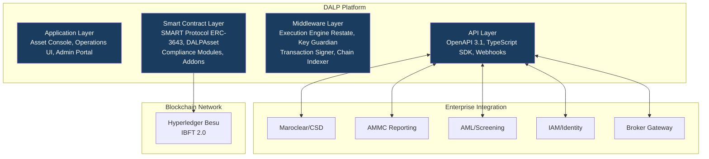

## 3.2 Core Lifecycle Pillars

**Issuance:** Full instrument creation pipeline for bonds, equities, and sukuk-aligned instruments. Configuration covers maturity dates, coupon schedules, investor class restrictions, and disclosure document version control. All deployments require maker-checker governance authorization.

**Compliance:** Ex-ante, modular compliance engine based on ERC-3643. Country allow/block lists, investor count limits, identity verification (OnchainID), transfer approval workflows, and time-lock restrictions are configurable per instrument without contract redevelopment.

**Custody:** Key Guardian framework integrates with HSM, Fireblocks, DFNS, or Ledger Enterprise. Tier 3 option provides full client-controlled key custody.

**Settlement:** XvP Settlement addon provides atomic DvP settlement. ISO 20022 settlement instruction output for Maroclear/RTGS integration. Deterministic finality, no partial settlement.

**Servicing:** Yield addon for coupon/dividend distribution with record-date logic. Maturity redemption token feature for bond lifecycle management. Airdrop module for controlled distribution events.

## 3.3 Supported Asset Classes

| Asset Class | Types | Morocco Relevance |
|-------------|-------|------------------|
| Fixed Income | Bond | Corporate bonds, government bonds, green bonds |
| Equity | Equity | Listed equity instruments |
| Islamic Finance | Configurable Bond/Equity | Sukuk-aligned compliance configuration |
| Fund | Fund | Investment fund units |

## 3.4 Standards and Protocols

| Standard | Application |
|----------|-------------|
| ERC-3643 (SMART Protocol) | Core security token standard |
| ISO 20022 | Settlement instruction format for Maroclear |
| OpenAPI 3.1 | API specification |
| AAOIFI (configuration support) | Islamic finance governance documentation support |
| OAuth 2.0/OIDC | Enterprise IAM integration |
| TLS 1.3 + AES-256 | Transport and at-rest encryption |

---

# 4. Understanding Casablanca Stock Exchange Requirements

## 4.1 Institutional Context

Casablanca Stock Exchange operates under AMMC oversight as the primary regulated market operator in Morocco. The tokenized securities programme must:
1. Maintain AMMC-required investor protection and disclosure standards
2. Integrate with Maroclear as the authoritative CSD for settlement and registration
3. Support French and Arabic language operations
4. Handle a diverse investor base including Pan-African institutional investors
5. Produce evidence for AMMC supervisory review on demand

## 4.2 Requirement Domain Mapping

| Domain | CSE Requirement | DALP Coverage |
|--------|----------------|---------------|
| Product/Asset Scope | Bonds, equities, sukuk-aligned | Full |
| Identity/Onboarding | Issuer onboarding, investor KYC, multi-jurisdiction | Full |
| Compliance/Control | AMMC-aligned transfer restrictions, investor limits | Full (configurable) |
| Settlement/Cash Leg | Maroclear DvP, MAD/multi-currency | Full. ISO 20022 output |
| Integration/Reporting | AMMC reporting, Maroclear, broker connectivity | Full |
| Infrastructure/Operations | Data sovereignty, French/Arabic ops | Full. European cloud region |

## 4.3 Key Challenges

**Challenge 1: AMMC regulatory mapping**
AMMC market rules require disclosure discipline, investor classification, and market conduct controls. DALP's compliance module framework maps to these requirements through configurable eligibility rules and audit evidence production.

**Challenge 2: Maroclear integration**
Maroclear's CSD position as settlement authority requires that tokenized instrument positions reconcile against Maroclear records. DALP's ISO 20022 output and reconciliation dashboard support this requirement.

**Challenge 3: Pan-African investor base**
Investors from across Africa may have varying KYC documentation standards and AML risk profiles. DALP's configurable country allow/block list and identity claim framework supports jurisdiction-specific eligibility rules per instrument.

**Challenge 4: Bilingual operations**
DALP's operational documentation and support materials are available in French. Arabic localization of the operations UI is available as a configuration option.

**Challenge 5: Islamic finance instrument support**
Where sukuk-aligned instruments require specific governance documentation and AAOIFI compliance evidence, DALP's document management capability and governance workflow framework support the required approval lineage and documentation chain.

---

# 5. Proposed Solution and Functional Capabilities

## 5.1 Solution Architecture

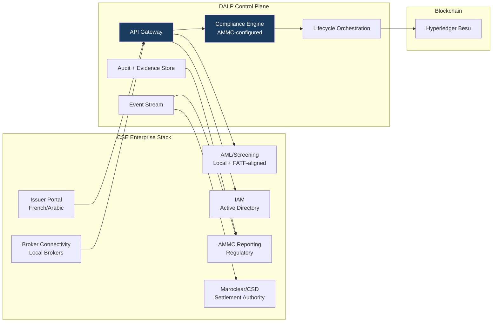

## 5.2 Issuance and Asset Configuration

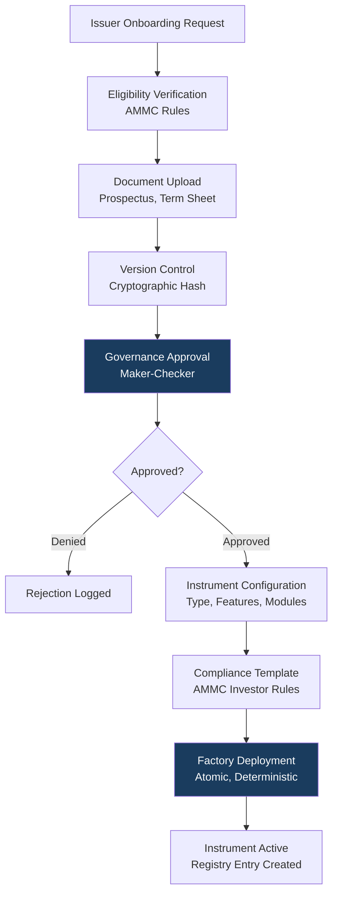

**Instrument configuration for CSE:**
- Bond parameters: ISIN/CSE identifier, maturity date, coupon rate and schedule, nominal value, denomination currency (MAD, EUR, USD), total supply cap
- Equity parameters: ISIN, share class, voting rights configuration, transfer restrictions by investor class
- Investor class restrictions: Professional investors (institutional), qualified retail, retail with disclosure requirements, GCC/Pan-African investor eligibility
- Sukuk configuration: AAOIFI-referenced governance documentation, profit distribution (not interest) distribution model using yield addon, underlying asset reference documentation

## 5.3 Compliance Enforcement

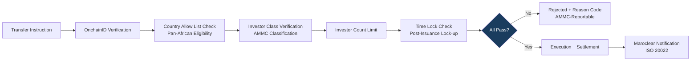

Compliance module configuration aligned to AMMC market rules:
- **Investor classification:** Enforces AMMC investor category (professional, qualified, retail) per instrument type
- **Disclosure enforcement:** Transfer to new investors triggers disclosure document delivery confirmation requirement where applicable
- **Geographic restrictions:** Country allow/block list enforces cross-border investment restrictions relevant to Morocco's bilateral investment treaty network
- **Market conduct:** Insider trading controls through transfer approval workflow (compliance officer sign-off required for flagged transfers)

## 5.4 Transfer and Settlement

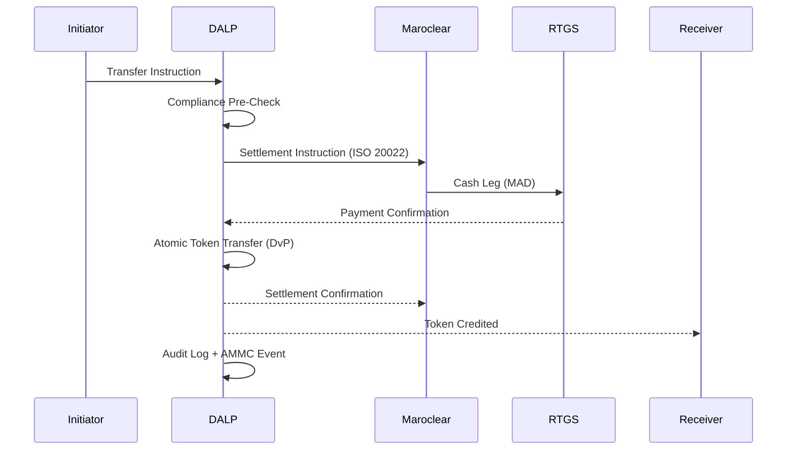

## 5.5 Corporate Actions and Servicing

**Coupon/profit distribution:** Yield addon calculates entitlements based on record-date snapshot. For sukuk-aligned instruments, the distribution model uses profit-sharing terminology rather than interest to support AAOIFI documentation requirements. Multi-currency distribution is supported (MAD and foreign currency equivalents).

**Maturity/redemption:** Maturity redemption feature manages end-of-life processing. Investor notification, token burn, and cash settlement instruction generation are automated with maker-checker authorization before execution.

**Governance events:** Voting power token feature supports bondholder meetings and shareholder votes with on-chain result recording.

## 5.6 Integration and Interoperability

| Integration | Protocol | Purpose |
|------------|---------|---------|
| Maroclear | ISO 20022 REST | Settlement instruction delivery and confirmation |
| AMMC reporting | Structured batch extract | Regulatory reporting and surveillance data |
| AML/KYC | REST API | Investor screening (Accuity, Refinitiv, or local provider) |
| Broker gateway | OpenAPI 3.1 | Order instruction submission |
| IAM (Active Directory) | SAML 2.0/OIDC | Operator authentication |
| Reporting/BI | CSV/JSON batch | Management and regulatory reporting |

## 5.7 Functional Fit Matrix

| Req ID | Requirement | Status | DALP Mechanism |
|--------|-------------|--------|----------------|
| REQ-01 | Segregated environments | Full | 4-environment model |
| REQ-02 | API-first, eventing | Full | OpenAPI 3.1, webhooks |
| REQ-03 | RBAC, maker-checker, audit | Full | 26-role model, on-chain audit |
| REQ-04 | Configurable lifecycle | Full | Compliance module framework |
| REQ-05 | Third-party disclosure | Full | Appendix C |
| REQ-06 | Resilience, recovery | Full | 99.9% SLA, RTO < 4h |
| REQ-07 | Delivery plan | Full | 18-week plan |
| REQ-08 | Audit evidence | Full | Seven evidence categories |
| REQ-16 | Issuance, registry, settlement | Full | Bond/equity/sukuk, OnchainID, XvP |
| REQ-17 | Market infrastructure | Full | ISO 20022, webhook event stream |

---

# 6. Technical Architecture

## 6.1 Architectural Principles

Same five principles as for ADX: lifecycle-first, durable execution, defense-in-depth, separation of concerns, provider abstraction. For Casablanca, an additional principle applies:

**Regulatory configurability:** The platform must be configurable to match AMMC requirements without code changes. All compliance rules, investor classes, transfer restrictions, and governance thresholds are operator-configurable parameters.

## 6.2 Layered Architecture

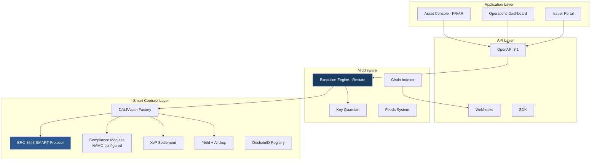

## 6.3 Data Architecture

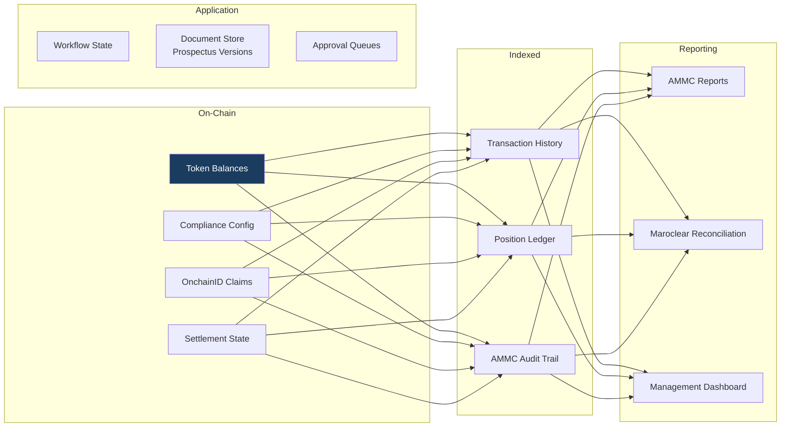

## 6.4 Network Topology

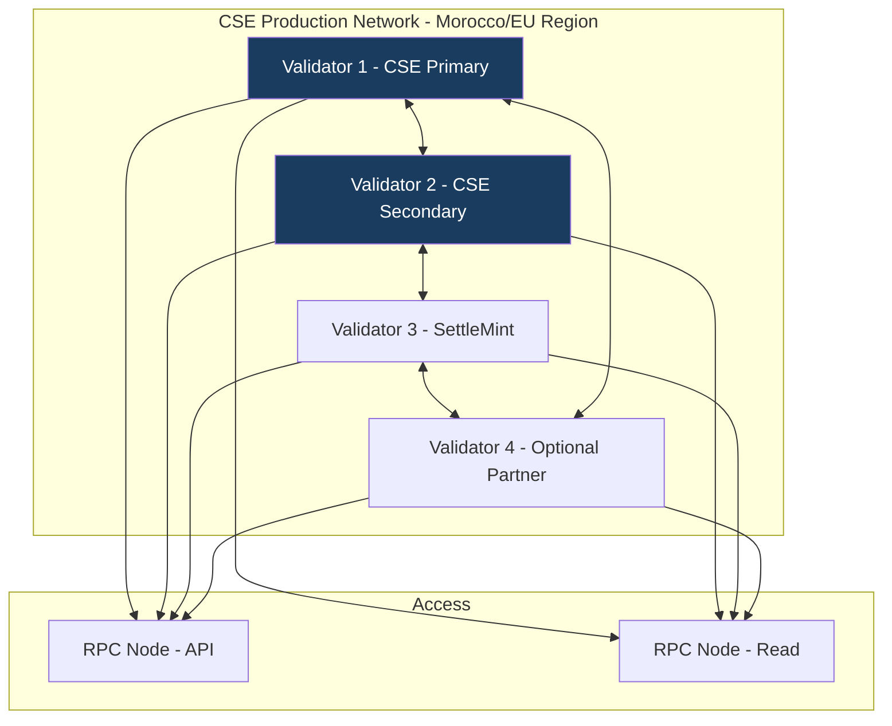

**Performance benchmark:** Under 200 concurrent settlement-grade transactions on 4-validator Besu network: median latency 2.1s, P99 4.8s. Suitable for Casablanca Stock Exchange's expected transaction profile.

## 6.5 Environment Segregation

| Environment | Purpose | Data |
|-------------|---------|------|
| Development | Platform configuration, instrument template development | Synthetic only |
| Test | Integration testing with Maroclear test environment | Synthetic only |
| UAT | User acceptance testing in French/Arabic | Anonymized test data |
| Production | Live operations | Real data |

---

# 7. Asset Lifecycle and Compliance Infrastructure

## 7.1 Sukuk and Islamic Finance Support

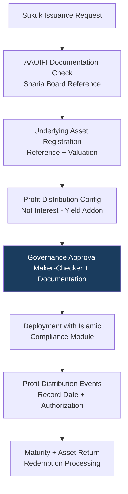

For sukuk-aligned instruments:
- Distribution model uses DALP's Yield addon configured with profit-sharing terminology
- Underlying asset documentation is version-controlled in the document store with cryptographic hash verification
- Sharia board approval lineage is captured in the governance workflow with mandatory attachment of board resolution document
- AAOIFI standard references can be embedded in instrument metadata for regulatory reporting

## 7.2 Investor Lifecycle

| Status | Condition | Transfer Eligible |
|--------|-----------|-----------------|
| Pending | KYC under review | No |
| Active. Professional | Verified institutional investor | Yes, all instruments |
| Active. Qualified | Verified qualified retail | Yes, per eligibility config |
| Active. Retail | Verified retail with disclosure | Yes, retail-eligible instruments only |
| Active. Pan-African | Cross-border verified investor | Yes, per corridor config |
| Restricted | Compliance hold | No |
| Offboarded | Relationship terminated | No |

---

# 8. Security, Governance, and Controls

## 8.1 Security Model

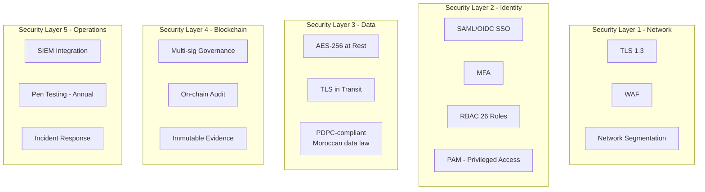

## 8.2 Morocco Data Protection Compliance

Moroccan Law No. 09-08 on the protection of individuals with regard to the processing of personal data (implemented through the CNDP. Commission Nationale de contrôle de la protection des Données à caractère Personnel) governs personal data handling for Casablanca Stock Exchange's digital operations. DALP addresses this through:

- Field-level encryption of personal investor data
- Access logging for all personal data queries
- Data subject request handling capability (right of access, correction, erasure)
- Data residency controls: personal data stored in Moroccan or EU cloud regions (EU adequacy decision covers transfer to EU)
- Retention period configuration aligned to AMMC and CNDP requirements

## 8.3 Separation of Duties

| Action | Initiator | Approver | Admin | Auditor |
|--------|----------|---------|-------|---------|
| Submit instrument configuration | ✓ | - |, | - |
| Approve instrument deployment | - | ✓ | - |, |
| Sukuk documentation approval | - | ✓ (Sharia Officer) | - |, |
| AML alert escalation | - | ✓ (Compliance) | - |, |
| View audit trail | - |, | - | ✓ |
| User provisioning | - |, | ✓ | - |

## 8.4 Audit Evidence for AMMC

DALP produces structured audit evidence across seven categories, exportable on demand for AMMC supervisory review:
1. Transaction audit log
2. Compliance decision log (per AMMC investor category rules)
3. Entitlement history (role and access changes)
4. Configuration change log
5. Key management log
6. Settlement record
7. Corporate action record (sukuk distributions, redemptions)

## 8.5 Security Responsibility Matrix

| Control Area | SettleMint | CSE | Shared |
|-------------|-----------|-----|--------|
| Platform software security | Primary | Review | Security review access |
| Network perimeter | Primary (managed cloud) | CSE-side controls | Firewall policy |
| Data protection (Moroccan law) | Platform tooling | CNDP compliance decisions | Joint DPIA where required |
| Key management | Framework | CSE keys (Tier 3 option) | Key ceremony |
| Penetration testing | Annual minimum | CSE-initiated | Scope and reporting |

---

# 9. Integration and Interoperability

## 9.1 Maroclear Integration

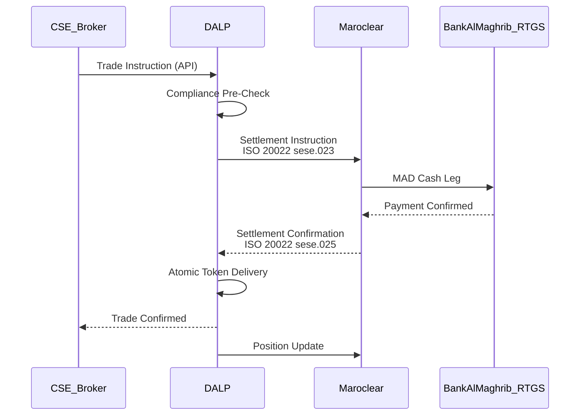

The integration pattern with Maroclear uses ISO 20022 securities settlement messages (sese.023 for settlement instructions, sese.025 for confirmations). Daily reconciliation compares DALP token position records against Maroclear's registry, with structured exception reporting for operations team review.

## 9.2 AMMC Regulatory Reporting

DALP generates structured regulatory reporting extracts for AMMC submission:
- **Daily transaction report:** All transfer events with counterparty details, instrument identifiers, and compliance check outcomes
- **Investor register snapshot:** Current holder registry per instrument on demand
- **Corporate action record:** All coupon, dividend, and maturity events with authorization lineage
- **Exception report:** All rejected transactions with reason codes

## 9.3 API Versioning and Release Management

DALP follows semantic versioning (major.minor.patch) with 12-month advance notice for major version changes. API consumers (brokers, reporting systems) are notified through a structured release communication process. Backward compatibility is maintained across minor and patch versions.

---

# 10. Deployment Model

## 10.1 Recommended Model: European or Morocco Cloud Region

For Casablanca Stock Exchange, SettleMint recommends private cloud deployment in either:
- **OVHcloud Roubaix/Gravelines (France):** EU-based cloud with strong connectivity to Morocco and GDPR-compliant data handling under EU adequacy framework
- **Azure France Central (Paris):** EU data residency, Azure enterprise SLA, strong Morocco telecommunications connectivity

Both options satisfy Moroccan data sovereignty requirements for financial market infrastructure under the AMMC and CNDP framework.

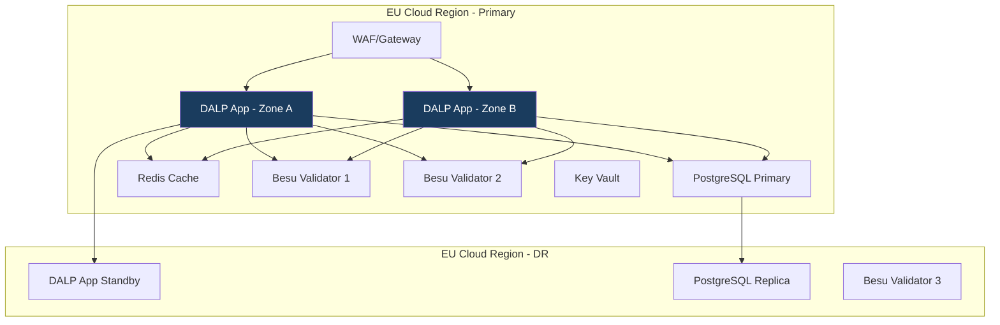

## 10.2 Availability and Resilience

| Metric | Target | Mechanism |
|--------|--------|-----------|
| Uptime | 99.9% | Multi-zone active-active |
| RTO | < 4 hours | Automated failover |
| RPO | < 1 hour | Continuous replication |
| DR test frequency | Quarterly | Documented outcomes |

---

# 11. Implementation Methodology

## 11.1 Implementation Timeline

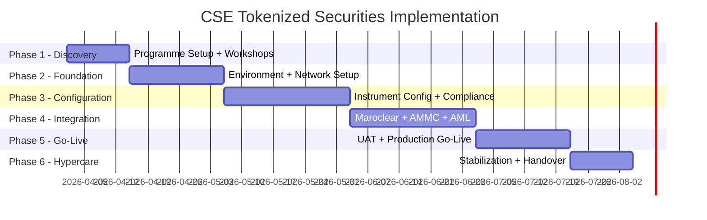

## 11.2 Phase Summary

| Phase | Duration | Key Deliverables | Gate Criteria |
|-------|---------|-----------------|---------------|
| Phase 1. Discovery | 2 weeks | Requirements baseline, Maroclear integration specification, AMMC compliance mapping | CSE Programme Director sign-off |
| Phase 2. Foundation | 3 weeks | 4 environments live, network configured, security baseline approved | CSE IS team sign-off |
| Phase 3. Configuration | 4 weeks | Instrument templates configured, AMMC compliance rules bound, sukuk template complete | CSE Compliance team approval |
| Phase 4. Integration | 4 weeks | Maroclear integration tested, AMMC reporting validated, broker connectivity confirmed | CSE Technology sign-off |
| Phase 5. Go-Live | 3 weeks | UAT complete, production go-live, initial operations confirmed | CSE Programme Director certificate |
| Phase 6. Hypercare | 2 weeks | Stabilized operations, knowledge transfer complete | Operational readiness sign-off |

## 11.3 CSE Resource Requirements

| Role | CSE Person-Days | Phase Focus |
|------|----------------|-------------|
| Programme Director | 20 | All phases |
| Technology/Integration team | 45 | Phases 2, 4 |
| Compliance team (AMMC specialist) | 22 | Phases 1, 3 |
| Maroclear relationship manager | 10 | Phase 4 |
| Operations team (FR/AR bilingual) | 20 | Phases 5, 6 |
| **Total** | **117** | |

---

# 12. Training and Knowledge Transfer

| Track | Audience | Duration | Language |
|-------|---------|---------|---------|
| Platform Administration | IT operations | 2 days | French |
| Developer/Integration | Integration engineers | 3 days | French |
| Operations | Business operations, compliance | 2 days | French/Arabic |
| AMMC Compliance Ops | Compliance team | 1 day | French |

All training materials and operational runbooks are delivered in French. Arabic translations of operational UI elements and user guides are available.

---

# 13. Support and Service Levels

| Tier | Coverage | P1 Response | Recommendation |
|------|---------|-------------|----------------|
| Standard | Business hours (09-17 CET) | 4 hours | Not recommended for market infrastructure |
| Premium | Extended (07-22 CET) | 2 hours | Acceptable minimum |
| Enterprise | 24/7/365 | 1 hour | Recommended |

**CSE-specific support note:** French-speaking support capability is available within the Enterprise Support tier. Named CSM speaks French. P1 incident communications conducted in French on request.

| Metric | Target |
|--------|--------|
| Production uptime | 99.9% |
| RTO | < 4 hours |
| RPO | < 1 hour |

---

# 14. Risk Management

| ID | Risk | Likelihood | Impact | Mitigation |
|----|------|-----------|--------|-----------|
| R-01 | AMMC regulatory interpretation requires additional compliance module configuration | Medium | Medium | Phase 3 AMMC alignment workshop; configuration is no-code change |
| R-02 | Maroclear integration requires custom message mapping | Medium | Medium | Phase 1 integration specification workshop with Maroclear technical team |
| R-03 | Sukuk documentation requirements extend Phase 3 | Low | Low | AAOIFI template available; Sharia officer involvement scoped in Phase 1 |
| R-04 | French-Arabic bilingual testing adds UAT complexity | Low | Medium | Bilingual UAT team composition; test scripts prepared in both languages |
| R-05 | EU data residency requirement conflicts with Moroccan data localization preference | Low | Medium | Morocco cloud region option available (OVH Casablanca if available) or EU adequacy framework applies |
| R-06 | Pan-African investor AML complexity (multi-jurisdiction screening) | Medium | Medium | AML provider selected for FATF-aligned multi-jurisdiction coverage |
| R-07 | Security review by CSE IS team delays Phase 2 gate | Medium | Low | Evidence pack pre-prepared; ISO 27001 / SOC 2 Type II certificates available |

---

# 15. Compliance Matrix

| Req ID | Requirement | Status | Response | Notes |
|--------|-------------|--------|---------|-------|
| REQ-01 | Segregated environments | Full | 4 environments, separate networks | |
| REQ-02 | API-first, eventing | Full | OpenAPI 3.1, webhooks | |
| REQ-03 | RBAC, maker-checker, audit | Full | 26 roles, on-chain audit | |
| REQ-04 | Configurable lifecycle | Full | Module framework | |
| REQ-05 | Third-party disclosure | Full | Dependency register in Appendix C | |
| REQ-06 | Resilience, recovery | Full | 99.9% SLA, RTO/RPO documented | |
| REQ-07 | Delivery plan | Full | 18-week plan with gates | CSE effort: 117 person-days |
| REQ-08 | Audit evidence | Full | Seven categories, API export | |
| REQ-16 | Issuance, registry, settlement | Full | Bond/equity/sukuk, OnchainID, XvP, ISO 20022 | |
| REQ-17 | Market infrastructure | Full | Maroclear ISO 20022, AMMC reporting | |
| RC-01 | Regulatory mapping | Full | AMMC, Bank Al-Maghrib, Loi 09-08 addressed | |
| RC-02 | AML/CFT | Full | Screening integration, FATF-aligned providers | |
| RC-03 | Data governance | Full | Moroccan law 09-08, EU region data residency | |
| RC-04 | Operational resilience | Full | DR testing quarterly, documented | |
| RC-05 | Outsourcing disclosure | Full | All dependencies listed in Appendix C | |
| RC-06 | Assurance and audit | Full | Seven evidence categories, cert available | |

---

# Appendix A: Operating Model Detail

## A.1 Role Ownership

**Product Management (CSE Market Development):** Configures instrument parameters, investor class definitions, and fee structures. Bilingual (French/Arabic) operations.

**First-Line Operations (CSE Operations):** Manages transaction exceptions, settlement monitoring, corporate action execution. French-language operations dashboard primary interface.

**Compliance Oversight (CSE Compliance + AMMC liaison):** Reviews compliance module configurations, investor eligibility exceptions, AMMC-reportable events. Reviews AMMC reporting extracts before submission.

**Sharia/Islamic Finance (CSE Sharia Officer where applicable):** Reviews sukuk instrument configurations, approves AAOIFI documentation, signs off profit distribution calculations.

**Information Security (CSE IS):** User provisioning, access recertification, incident escalation. Quarterly access review.

**Technology (CSE Technology):** Environment management, Maroclear integration maintenance, AMMC reporting system connectivity.

## A.2 Governance Routines

**Daily:** Transaction exception review, settlement confirmation, AMMC-reportable alert triage.

**Weekly:** Exception register review, broker connectivity status, Maroclear reconciliation review.

**Monthly:** Access recertification, AMMC monthly reporting, SettleMint service review, sukuk distribution event calendar review.

---

# Appendix B: Security and Resilience

**Encryption:** AES-256 at rest, TLS 1.3 in transit, field-level encryption for Moroccan personal data (Loi 09-08 compliance).

**Vulnerability management:** Automated dependency scanning, monthly SAST/DAST, annual penetration test. Critical vulnerabilities patched within 48 hours.

**Incident response:** P1 detection → 1-hour SettleMint response → French-language incident communication to CSE → root cause analysis within 5 business days.

**DR testing:** Quarterly failover exercise. Results documented and available to CSE operations and IS teams.

---

# Appendix C: Dependency Register

| Dependency | Provider | Risk | Substitution |
|-----------|---------|------|-------------|
| Cloud infrastructure | OVHcloud or Azure France | Medium | Multi-cloud capable |
| Key management | Azure Key Vault / OVH KMS | Medium | HSM option |
| Blockchain | Hyperledger Besu | Low | Any EVM-compatible |
| AML/KYC | CSE-selected (Accuity, ACAM-aligned) | Medium | Provider-agnostic API |
| Maroclear connectivity | CSE/Maroclear arrangement | High | No substitution, primary CSD |
| Custody | Fireblocks/DFNS/Client HSM | Medium | Multiple providers supported |

---

*End of Technical Proposal. Casablanca Stock Exchange*

*Document Version: 1.0 | Date: 2026-03-19 | Classification: Restricted. Commercial-Sensitive*

*SettleMint NV | Rue Montoyer 39, 1000 Brussels, Belgium | www.settlemint.com*
