# Technical Proposal

## Digital Asset Regulatory Platform and Supervised Market Access

---

**Document Title:** Technical Proposal. Digital Asset Regulatory Platform and Supervised Market Access

**Client:** Central Bank of Bahrain

**Submission Date:** 2026-03-17

**Version:** 1.0

**Confidentiality:** Restricted. Commercial-Sensitive

**Prepared by:** SettleMint NV

---

> This document contains confidential and proprietary information of SettleMint NV. Distribution or reproduction without prior written consent is prohibited.

---

# Table of Contents

1. Executive Summary
2. Understanding Central Bank of Bahrain's Requirements
3. Proposed Solution: DALP Operating Model
4. Platform Architecture
5. Asset Lifecycle and Compliance Infrastructure
6. Security, Governance, and Controls
7. Integration and Interoperability
8. Implementation Methodology
9. Delivery Approach and Timeline
10. Relevant Experience and References
11. Current Coverage, Gaps, and Mitigations
12. Appendix: Response Matrix

---

# 1. Executive Summary

## 1.1 Context and Strategic Drivers

Central Bank of Bahrain is procuring a digital asset regulatory platform and supervised market access capability as a business-critical infrastructure initiative. The platform must operate within a control environment shaped by business ownership, architecture standards, security review, legal interpretation, compliance sign-off, and internal audit expectations. This is not a speculative innovation exercise; it is a procurement designed to identify a dependable platform and implementation model that can sustain growth in users, volumes, products, and audit scrutiny without fundamental rework.

The regulatory landscape in Bahrain is evolving rapidly. The Central Bank has established a clear framework for digital asset service providers through its regulatory sandbox and licensing regime. Financial institutions operating in Bahrain must demonstrate robust compliance with anti-money laundering requirements, investor protection rules, and market conduct standards. The proposed platform must enable the Central Bank to oversee digital asset activities while providing regulated entities with the infrastructure needed to operate compliantly.

SettleMint proposes DALP, the Digital Asset Lifecycle Platform, as the foundation for this initiative. DALP is a production-grade platform purpose-built for regulated financial institutions and sovereign entities. It provides the infrastructure required to design, issue, distribute, and service digital assets at scale, with the governance, compliance, and operational reliability that regulated environments demand.

## 1.2 Why This Programme Is Hard

Digital asset regulatory infrastructure presents challenges that distinguish it from conventional technology deployments. The lifecycle complexity is significant: a digital asset platform must manage issuance, transfers, corporate actions, compliance monitoring, and retirement across potentially thousands of instruments and millions of participants. Each lifecycle event involves multiple parties, regulatory checkpoints, and audit requirements.

The governance and compliance burden is substantial. In a regulated environment, every action must be traceable to an authorized initiator, every compliance check must be verifiable, every approval must be documented, and every state change must be reconstructable for regulatory review. This applies not just to happy-path operations but to the boundary conditions: rejected transactions, stale approvals, mismatched data, delayed settlements, and corrected records.

The operationalization gap between pilot and production represents a critical challenge. Demonstrating tokenization in a sandbox environment is fundamentally different from operating a platform that processes real transactions, maintains compliance across multiple jurisdictions, integrates with existing enterprise systems, and produces audit evidence that satisfies internal and external reviewers. Many platforms can demonstrate capability; fewer can demonstrate operational maturity.

Integration burden is often underestimated. The platform must coexist with existing enterprise infrastructure: identity services, ledger or books-and-record systems, sanctions and AML tooling, reporting environments, service-management processes, and operational runbooks. The solution cannot become a reconciliation sinkhole that generates more manual work than it removes.

## 1.3 Proposed Response

SettleMint proposes deploying DALP as the unified control plane for Central Bank of Bahrain's digital asset regulatory platform and supervised market access capability. The platform provides comprehensive lifecycle coverage including asset configuration, identity management, compliance enforcement, settlement operations, and corporate action automation.

The proposed deployment model is private cloud, deployed within the Central Bank's specified cloud environment (AWS, Azure, or GCP) with full data residency controls ensuring all data remains within Bahrain. The platform operates on a permissioned blockchain network (Hyperledger Besu with IBFT 2.0 consensus) providing institutional-grade privacy and performance characteristics appropriate for regulated market infrastructure.

The compliance approach leverages DALP's pre-built regulatory framework library, which includes templates for major global frameworks (MiCA, MAS, FCA, JFSA) as well as configuration options for Bahrain-specific requirements. The platform enforces compliance before execution, not after review, ensuring that non-compliant states cannot exist on-chain.

The custody model supports integration with the Central Bank's preferred custody infrastructure, whether via direct integration with existing providers or through DALP's modular custody connector framework.

The integration perimeter encompasses the full enterprise stack: identity management (integration with existing IAM/Active Directory), core banking and ledger systems, sanctions and AML tooling, reporting infrastructure, and payment rails (SWIFT, SEPA, local RTGS).

The phased delivery approach follows SettleMint's proven 19-week methodology: Discovery and Requirements (Weeks 1-2), Foundation and Setup (Weeks 3-5), Configuration and Compliance (Weeks 6-9), Integration and Testing (Weeks 10-13), and Go-Live with Hypercare (Weeks 14-19).

## 1.4 Why SettleMint

SettleMint brings a combination of market tenure, production record, and regulated delivery experience that is directly relevant to the Central Bank of Bahrain's requirements.

The company has been building enterprise blockchain infrastructure since 2016, with 10 years of continuous operation. SettleMint has delivered production deployments at regulated banks across Asia and Europe, including tier-1 institutions such as Standard Chartered Bank, State Bank of India, and Commerzbank. Active sovereign programmes in the Gulf region demonstrate familiarity with regional regulatory requirements and market structures.

SettleMint's production record includes live deployments spanning bonds, equities, deposits, stablecoins, real estate, funds, and precious metals. The platform processes real transaction volumes under institutional SLAs with 24/7 uptime requirements. This production maturity distinguishes SettleMint from platforms that remain in demonstration or pilot phases.

The company holds ISO 27001 and SOC 2 Type II certifications, has passed security reviews and penetration testing at tier-1 financial institutions, and maintains operational maturity including business continuity and disaster recovery capabilities meeting institutional standards.

## 1.5 Why DALP

DALP provides a comprehensive platform that addresses the full complexity of institutional digital asset operations.

Platform breadth is substantial: seven asset types (bonds, equities, funds, deposits, stablecoins, real estate, precious metals), twelve compliance module types, and eleven token features are built in. Pre-built regulatory templates for MiCA, MAS, Japan FSA, SEC Reg CF, Reg D 506(b)/(c), and UK FCA eliminate the need to build compliance from scratch.

The lifecycle model is unified: DALP covers the entire digital asset lifecycle from design through issuance, distribution, trading, corporate actions, compliance monitoring, and retirement. Most tokenization platforms stop at issuance; DALP's operational tooling handles the ongoing work that consumes the majority of institutional effort.

The control plane positioning is central: DALP functions as the governance and orchestration layer between existing core financial systems and blockchain networks, providing the infrastructure required to build, compliant digital asset solutions in production. The platform integrates with enterprise systems rather than replacing them.

Interoperability is designed in: API-first architecture with OpenAPI 3.1 specifications, TypeScript SDK, webhooks for event-driven integration, and support for meta-transactions enabling gasless workflows. The platform operates on any EVM-compatible blockchain (public or private) without application code changes.

Operations are enterprise-grade: 26 distinct roles across four layers enforce separation of duties. Five independent security layers provide defense-in-depth. The platform supports multiple deployment models (managed SaaS, private cloud, on-premises, hybrid) with data residency controls appropriate for sovereign requirements.

## 1.6 Reference Fit Snapshot

The following reference projects are most directly relevant to the Central Bank of Bahrain's requirements:

**Saudi Arabia RER (Real Estate Registry):** National-scale blockchain infrastructure for property registration, fractionalization, and digital marketplace under REGA and Vision 2030. Live production since January 2026, processing real transactions. Demonstrates country-scale deployment capability, government integration, and multi-party ecosystem support.

**Standard Chartered Bank. Digital Virtual Exchange:** Blockchain-based securities tokenization platform enabling fractional ownership and instant settlement. Demonstrates institutional-grade compliance, multi-asset support, and integration with existing banking infrastructure across Asia, Africa, and Middle East.

**State Bank of India. CBDC Infrastructure:** Production-ready infrastructure for India's e-Rupee central bank digital currency. Demonstrates national-scale transaction capacity, integration with existing banking systems, and operation within a regulated monetary framework.

**Commerzbank. Hybrid ETP Issuance:** Hybrid on-chain/off-chain exchange-traded product issuance with Boerse Stuttgart listing, settlement under 10 seconds. Demonstrates integration with established exchange infrastructure, regulated venue compatibility, and capital markets expertise.

---

# 2. Understanding Central Bank of Bahrain's Requirements

## 2.1 Procurement Context

The Central Bank of Bahrain is treating digital asset regulatory platform and supervised market access as a business-critical capability that must be implemented with the same discipline applied to core regulated systems. The solution will operate inside a control environment shaped by business ownership, architecture standards, security review, legal interpretation, compliance sign-off, and internal audit expectations.

The review team will look beyond product feature lists. It will test whether bidders can explain how the platform behaves when confronted with real-world operational pressure: incomplete onboarding data, limit breaches, approvals delayed by governance, partner outages, regulatory evidence requests, bulk corrections, data retention obligations, and phased rollout constraints.

Regional conditions in Bahrain matter. Responses should be anchored in actual market infrastructure and supervisory realities, including the pace of domestic policy development, the role of regulated intermediaries, and the practical limits of cross-border interoperability.

## 2.2 Scope of Work

The scope covers design mobilisation, product setup, integration, testing, controls, training, and operational readiness across five workstreams:

**WS-01. Mobilisation and Governance:** Programme setup, steering, design authority, RAID management, decision logs, and acceptance governance.

**WS-02. Business and Product Configuration:** Configure lifecycle, roles, limits, disclosures, and policy rules for digital asset regulatory platform and supervised market access.

**WS-03. Integration and Controls:** Connect enterprise systems, identity, compliance, reporting, settlement dependencies, and observability.

**WS-04. Testing and Readiness:** Functional, non-functional, security, resilience, UAT, cutover, training, and go-live support.

**WS-05. Operational Transition:** Runbooks, service desk model, support handoff, KPI definition, and post-launch governance.

## 2.3 Technical Requirements Summary

The following mandatory technical requirements guide this proposal:

| Requirement | Interpretation |
|-------------|----------------|
| REQ-01: Segregated environments | DALP supports dev, test, UAT, DR, and production environments with isolated configuration and data residency |
| REQ-02: API-first interfaces | DALP provides OpenAPI 3.1 REST API, TypeScript SDK, and event webhooks for enterprise integration |
| REQ-03: RBAC, segregation of duties, maker-checker | DALP implements 26 distinct roles across four layers with dual-layer permission model |
| REQ-04: Configurable lifecycle, policy controls, limits, exceptions | DALP supports 12 compliance module types with configurable rules, expressions, and thresholds |
| REQ-05: Third-party dependencies disclosure | All dependencies are documented in this proposal and the dependency register |
| REQ-06: Resilience, recovery, backup, monitoring, incident management | DALP includes comprehensive observability, HA deployment options, and DR capabilities |
| REQ-07: Delivery method, client effort assumptions, phased implementation | SettleMint's 19-week phased methodology with clear deliverables and client responsibilities |
| REQ-08: Evidence extraction for audit, supervisory review, board reporting | DALP provides comprehensive audit trails, reporting dashboards, and export capabilities |

## 2.4 High-Priority Spotlight

Three issues will dominate this procurement, and SettleMint addresses each directly:

**Control integrity:** DALP's ERC-3643/SMART Protocol foundation ensures that every action on the platform can be traced to an initiator, every compliance check can be verified, every approval can be documented, and every state change can be reconstructed. The platform logs every blockchain transaction immutably on-chain while maintaining searchable indexes for operational and regulatory review. The dual-layer permission model (off-chain platform roles and on-chain smart contract roles) ensures that no single failure grants unauthorized access.

**Coexistence with enterprise systems:** DALP is designed as an integration layer, not a replacement for existing systems. The API-first architecture, comprehensive webhook support, and modular integration framework enable connection to identity services, compliance tooling, reporting environments, and payment rails without creating operational debt or unowned responsibilities. The platform provides reconciliation capabilities rather than requiring manual offsetting.

**Phased scalability:** The 19-week implementation methodology includes explicit phase gates with acceptance criteria. Each phase produces deliverables that are reviewed and approved before progression. The platform supports incremental asset class addition, jurisdiction expansion, and participant onboarding without requiring platform reset. The modular architecture (configurable assets, pluggable compliance modules, addon system) enables growth within the same deployment.

---

# 3. Proposed Solution: DALP Operating Model

## 3.1 Solution Overview

DALP serves as the unified control plane for digital asset regulatory platform and supervised market access. The platform provides a comprehensive operating model that addresses the full lifecycle of digital assets within a regulated environment.

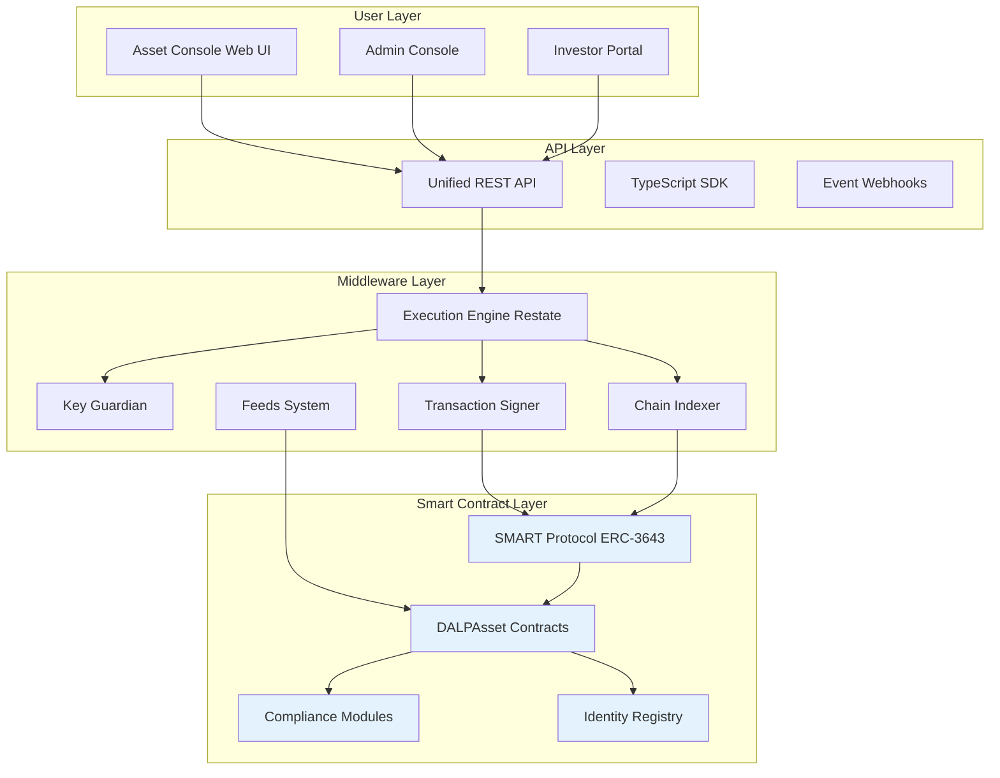

The operating model is organized around five operational domains:

**Asset Management:** Configuration and lifecycle management of digital assets including bonds, equities, funds, deposits, stablecoins, real estate, and precious metals. The Asset Designer wizard guides operators through tokenization with step-by-step configuration.

**Identity and Verification:** On-chain identity management via OnchainID (ERC-734/735) with trusted issuer infrastructure for KYC/AML claims. Every participant is represented by a cryptographically verified identity contract.

**Compliance Enforcement:** Modular compliance engine enforcing jurisdiction-specific rules on every transfer. 12 compliance module types include identity verification, country restrictions, investor limits, supply caps, time-based locks, and transfer approvals.

**Settlement Operations:** Atomic Delivery-versus-Payment (DvP) and Exchange-versus-Payment (XvP) settlement ensuring that asset and cash transfer simultaneously or both revert. True T+0 finality without counterparty risk.

**Monitoring and Reporting:** Real-time observability across platform operations, compliance activity, transaction volumes, and system health. Comprehensive audit trails supporting regulatory review and internal audit.

## 3.2 Deployment Architecture

SettleMint proposes a private cloud deployment model for the Central Bank of Bahrain, with the platform deployed within the Central Bank's specified cloud environment.

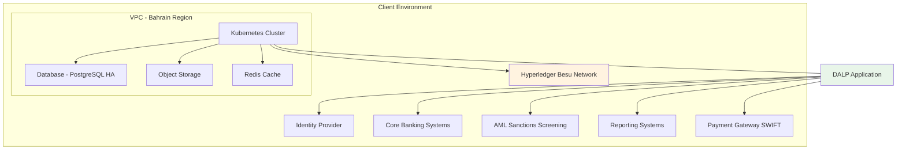

The deployment architecture provides:

**Infrastructure isolation:** All platform components (application, database, cache, storage) deploy within a dedicated virtual private cloud in the Bahrain region. Network security groups enforce strict access controls.

**Data residency:** All data, including identity records, transaction data, audit logs, and configuration, remains within Bahrain. No data is transferred to external regions or third parties without explicit configuration.

**High availability:** The architecture supports multi-availability-zone deployment with automatic failover. The recommended cloud-native pattern achieves 2-15 minute recovery time objective with seconds to 1 minute recovery point objective.

**Blockchain network:** A permissioned Hyperledger Besu network operates within the same security boundary, with IBFT 2.0 consensus providing institutional-grade performance and privacy characteristics appropriate for regulated market infrastructure.

## 3.3 Participant Model

The platform supports a hierarchical participant model appropriate for regulatory supervision:

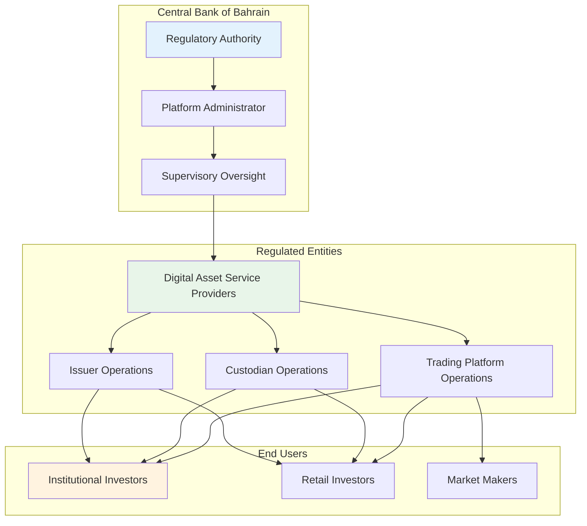

The participant model enables the Central Bank to:

- Register and supervise regulated digital asset service providers
- Monitor transaction flows and compliance status across all participants
- Enforce licensing requirements and capital adequacy rules
- Access comprehensive audit trails for regulatory review
- Generate supervisory reports across the ecosystem

---

# 4. Platform Architecture

## 4.1 Architectural Overview

DALP is built as a four-layer stack with distinct responsibility boundaries. Each layer enforces its own security controls independently, ensuring that no single-layer failure grants unauthorized access.

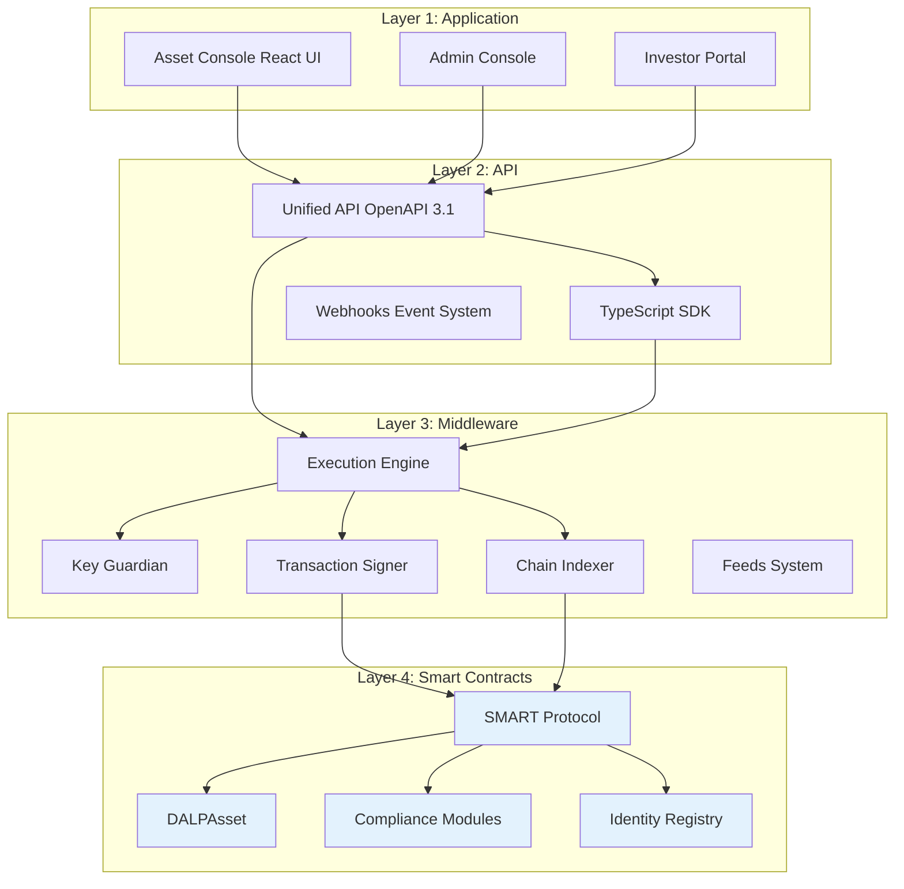

| Layer | Responsibility | Key Components |
|-------|---------------|----------------|
| **Application** | User-facing interfaces | Asset Console, Admin Console, Investor Portal |
| **API** | Programmatic access | Unified API, TypeScript SDK, Webhooks |
| **Middleware** | Workflow orchestration, key management, indexing | Execution Engine, Key Guardian, Transaction Signer, Chain Indexer |
| **Smart Contracts** | On-chain compliance, identity, asset logic | SMART Protocol, DALPAsset, Compliance Modules, Identity Registry |

## 4.2 Smart Contract Architecture

All DALP smart contracts are built on the SMART Protocol, an implementation of the ERC-3643 standard for regulated security tokens. The on-chain architecture follows a five-layer model:

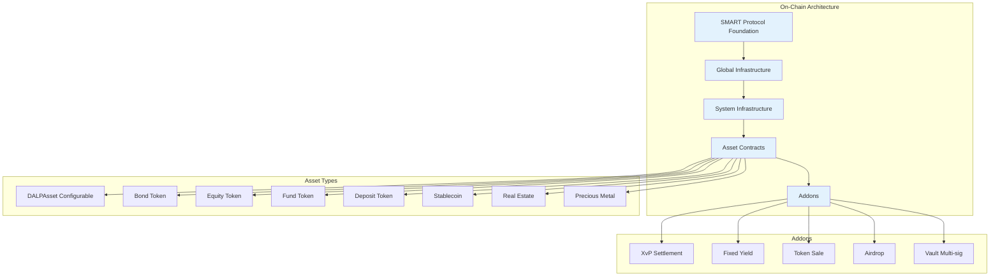

**SMART Protocol (Layer 1):** ERC-3643 token framework with modular compliance, identity management, and extension system.

**Global (Layer 2):** Platform-wide infrastructure shared across all system instances on a given chain. Includes central directory, identity factory, and identity implementations.

**System (Layer 3):** Per-system infrastructure managing identity registration, compliance orchestration, access control, and factory registries.

**Assets (Layer 4):** Production-ready tokenized financial instruments. DALPAsset provides the configurable base; legacy types support specific instrument categories.

**Addons (Layer 5):** Operational tools extending assets with distribution, settlement, and treasury capabilities.

## 4.3 Compliance Architecture

DALP's compliance architecture enforces regulatory requirements at the smart contract layer, ensuring that non-compliant states cannot exist on-chain.

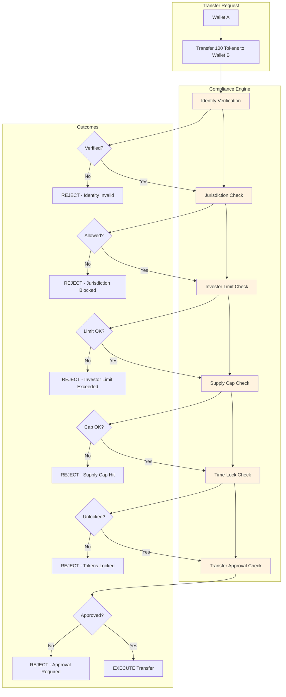

The compliance engine evaluates modular rules before each transfer. Rules are configurable at runtime without redeploying contracts. DALP ships with 12 compliance module types covering:

- Identity verification (KYC/AML claims)
- Country allowlist/blocklist
- Investor count limits
- Investor holding limits
- Supply caps
- Time-locked holding periods
- Transfer approval workflows
- Transfer windows
- Collateral backing verification
- Fee enforcement

## 4.4 Identity Architecture

DALP implements on-chain identity via OnchainID (ERC-734/735), establishing a cryptographically verifiable identity for every participant.

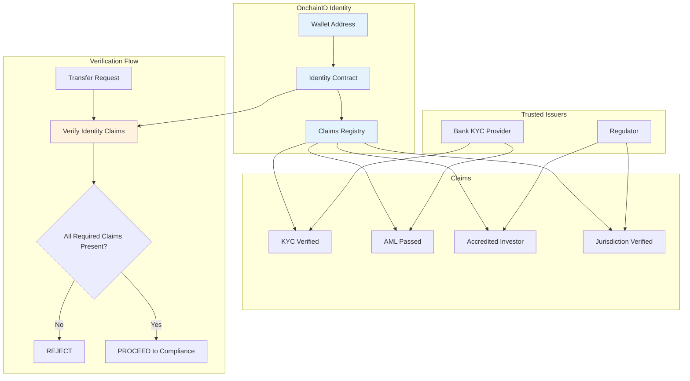

Claims are issued by trusted third parties, not self-asserted. A wallet holder cannot declare themselves KYC-verified or accredited; a registered trusted issuer must attest to that status. This mirrors how financial services actually work: eligibility is determined by regulated intermediaries.

Claims are checked continuously, not just at onboarding. Expired claims fail, revoked claims fail, and claims from issuers that lost trust fail. Eligibility is a live condition, not a one-time checkbox.

## 4.5 API Architecture

DALP provides a comprehensive API-first integration surface:

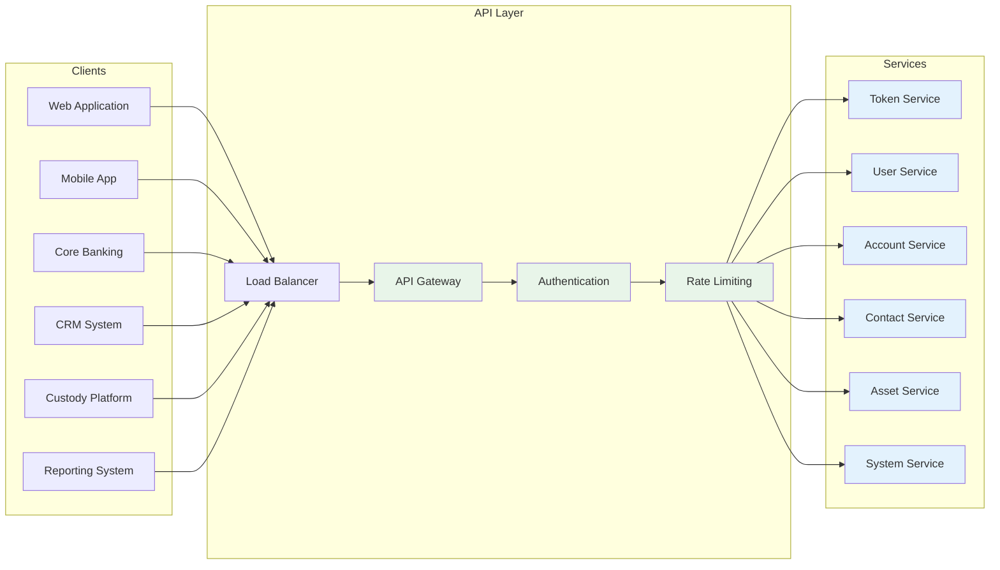

| Namespace | Purpose |
|-----------|---------|
| token | Asset lifecycle operations (create, mint, burn, transfer, pause) |
| user | User management (list, assign roles, manage permissions) |
| account | Wallet operations (generate address, check balance, sign) |
| contact | Investor relationships (register, record verifications) |
| asset | Asset metadata (update documents, configure compliance) |
| system | Platform administration (health, configuration, audit logs) |

Authentication supports three methods: session-based (browser), API keys (system integration), and enterprise SSO. Blockchain write operations additionally require wallet verification through PIN, TOTP, or passkey.

---

# 5. Asset Lifecycle and Compliance Infrastructure

## 5.1 Supported Asset Classes

DALP supports seven asset types organized by class, each with purpose-built lifecycle logic, metadata schemas, and compliance configurations:

**Fixed Income. Bonds:** Fully modeled fixed-income instruments with maturity dates, coupon schedules, denomination assets, ISIN identifiers, and automated yield distribution. Bond lifecycle includes issuance, coupon payments, partial redemptions, and maturity settlement.

**Flexible Income. Equities:** Full equity tokenization across common, preferred, and voting share classes. Equities support corporate actions including dividends, splits, and conversions. Collateral management tracks coverage ratios and minting capacity.

**Flexible Income. Funds:** Fund tokens carrying investment category, fund class, and management fee parameters. Supports the full fund landscape from sustainable impact funds to venture capital strategies.

**Cash Equivalents. Deposits:** Tokenized bank deposits serving as settlement currency for DvP operations. Deposit tokens represent claims on bank deposits with institutional-grade custody integration.

**Cash Equivalents. Stablecoins:** Full stablecoin spectrum from global standards (USDC, USDT) to regional currencies and platform-native instruments. Peg relationships stored on-chain for transparency.

**Real World Assets. Precious Metals:** Tokenized precious metals with physical custody traceability. Linked to real-world vault locations and named custodians. Supports 18-decimal fractional ownership.

**Real World Assets. Real Estate:** Rich metadata capture including GPS coordinates, property classification, building specifications, and unique identifiers. Fractional ownership enables broad investor access to institutional-grade properties.

## 5.2 Asset Designer Workflow

DALP's Asset Designer provides a guided wizard for tokenization:

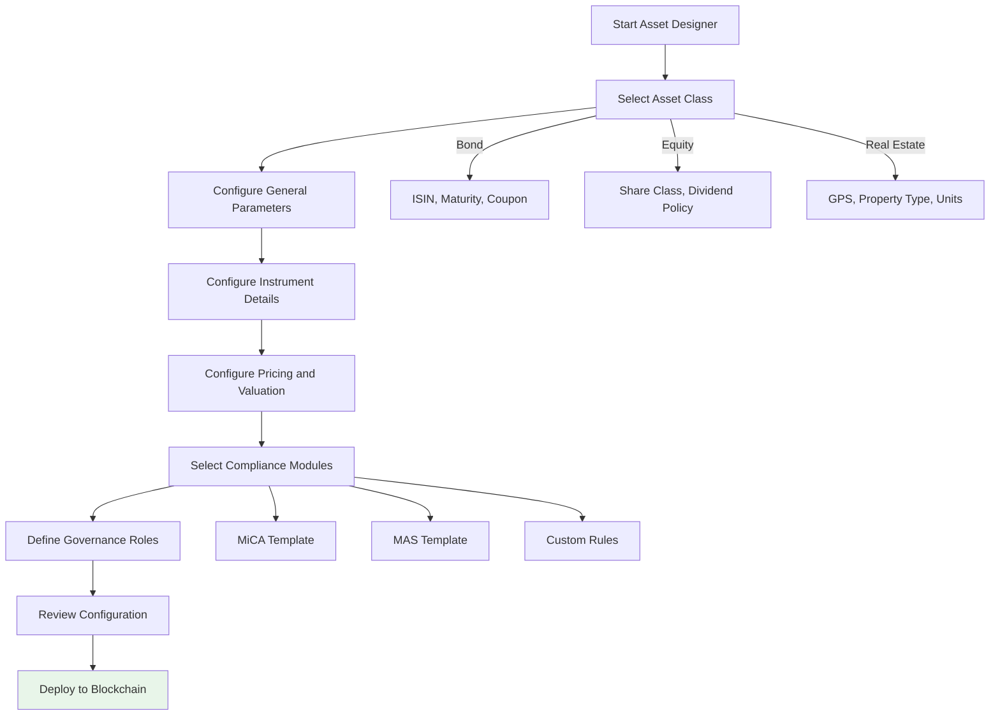

Configuration replaces custom development. Every token inherits the security guarantees of the pre-audited SMART Protocol contracts. No custom smart contract development is required.

## 5.3 Regulatory Framework Support

DALP ships with pre-built compliance templates covering major global frameworks:

| Framework | Jurisdiction | Key Controls |
|-----------|--------------|--------------|
| MiCA EU | European Union | Identity verification, EU country restrictions, 8M EUR annual supply cap |
| MAS Singapore | Singapore | Identity verification, country allowlisting, investor limits, holding periods |
| Japan FSA | Japan | Identity verification, qualified investor rules, reporting requirements |
| SEC Reg CF | United States | Identity verification, investment limits, accreditation checks |
| SEC Reg D 506(b)/(c) | United States | Accreditation verification, rule 144A compliance |
| UK FCA | United Kingdom | Identity verification, promotional restrictions, reporting |

The compliance library supports custom template creation for jurisdiction-specific requirements. The expression builder enables compliance teams to construct investor eligibility rules using boolean logic without requiring smart contract development.

## 5.4 Settlement Architecture

DALP provides atomic settlement ensuring asset and cash transfer simultaneously or both revert:

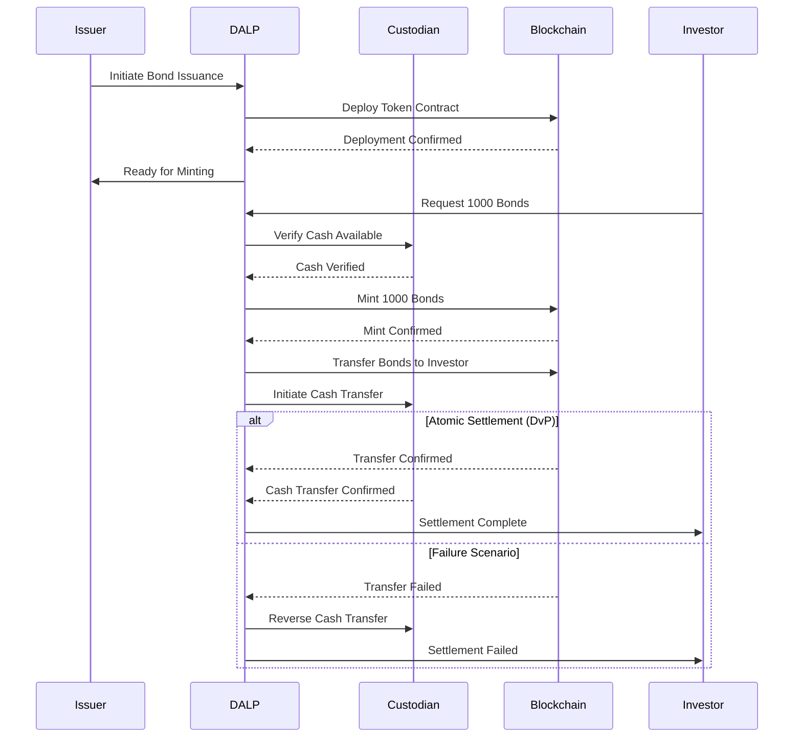

DvP (Delivery-versus-Payment) ensures simultaneous asset and cash transfer. XvP (Exchange-versus-Payment) extends this to multi-party, multi-asset atomic settlement. Both achieve true T+0 finality without counterparty risk.

---

# 6. Security, Governance, and Controls

## 6.1 Defense-in-Depth Security Model

DALP enforces security across five independent control layers:

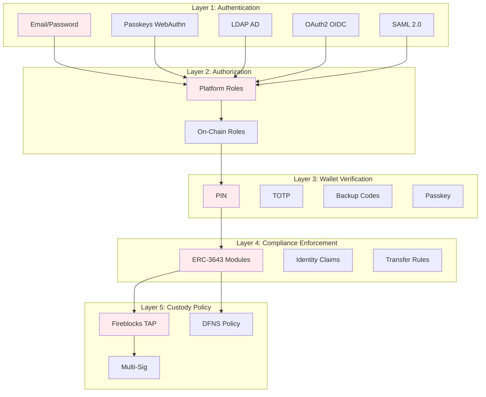

No single-layer failure grants unauthorized access. Compromised credentials are blocked by wallet verification. Bypassed API authorization is blocked by on-chain compliance. Custody provider policies provide the final gate before transactions reach the blockchain.

## 6.2 Role-Based Access Control

DALP implements 26 distinct roles across four layers:

| Role Category | Count | Examples |
|---------------|-------|----------|
| Platform Roles | 3 | owner, admin, member |
| System People Roles | 9 | systemManager, identityManager, complianceManager, auditor |
| Per-Asset Roles | 7 | admin, governance, supplyManagement, custodian, emergency |
| System Module Roles | 7 | Module management, registry operations |

The dual-layer permission model ensures that off-chain platform roles (managed by Better Auth) and on-chain roles (managed by the AccessManager contract) must both pass for any blockchain write operation.

## 6.3 Key Management

DALP provides defense-in-depth key management with multiple storage backends:

| Storage Tier | Protection Level | Use Case |
|-------------|-----------------|----------|
| Encrypted database | Application-level encryption | Development, PoC |
| Cloud secret manager | Platform-managed encryption | Standard production |
| Hardware security module | FIPS 140-2 Level 3 | Regulated financial services |
| Third-party MPC custody | Institutional MPC (DFNS, Fireblocks) | Highest security |

MPC custody integration ensures that no single private key ever exists in one place. The unified signer abstraction makes custody providers interchangeable through configuration alone.

## 6.4 Certifications and Compliance

SettleMint maintains the certifications required for institutional procurement:

- **ISO 27001:** Certified information security management system
- **SOC 2 Type II:** Certified security controls over extended audit period
- **Regular penetration testing:** Independent third-party security assessments
- **Smart contract audits:** Specialized blockchain security review

## 6.5 Operational Governance

DALP supports comprehensive operational governance routines:

**Daily:** Exception review, pending action resolution, system health checks, transaction monitoring.

**Weekly:** Entitlement recertification, reconciliation sign-off, incident review, performance analysis.

**Monthly:** Threshold monitoring review, management reporting, compliance dashboard review, change control board.

The platform generates native reports and audit trails supporting these routines. Where offline controls are required (for example, manual committee approvals), DALP provides the evidence extraction capabilities needed for regulatory and internal audit review.

---

# 7. Integration and Interoperability

## 7.1 Integration Architecture

DALP is designed as an integration layer connecting enterprise systems with blockchain infrastructure:

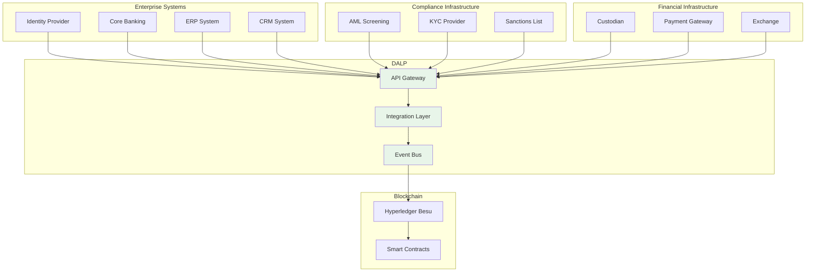

Integration methods include:

| Method | Use Case | Authentication |
|--------|----------|----------------|
| REST API (OpenAPI 3.1) | System-to-system integration | API keys, SSO |
| TypeScript SDK | Node.js applications | API keys |
| Webhooks | Event-driven notifications | Configured per endpoint |
| Enterprise messaging | Corporate actions, settlement | API keys |

## 7.2 Data Flow Architecture

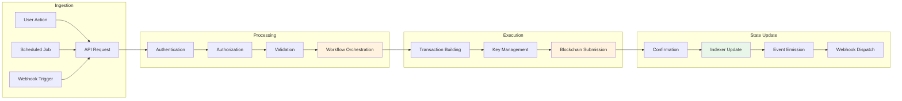

Every operation flows through defined stages with complete audit logging. The indexer processes blockchain events into queryable state projections, enabling real-time operational dashboards and regulatory reporting.

## 7.3 Reconciliation Model

DALP provides reconciliation capabilities supporting coexistence with existing systems:

- **Blockchain-to-core reconciliation:** Platform records matched to internal books
- **Settlement reconciliation:** Matching with custody statements and payment confirmations
- **Position reconciliation:** Daily balance verification across all participants
- **Compliance reconciliation:** Verification that on-chain state matches off-chain compliance records

Reconciliation breaks are surfaced through operational tooling with clear ownership and escalation paths.

---

# 8. Implementation Methodology

## 8.1 Phase-Gated Delivery

SettleMint follows a structured 19-week implementation methodology refined through production deployments:

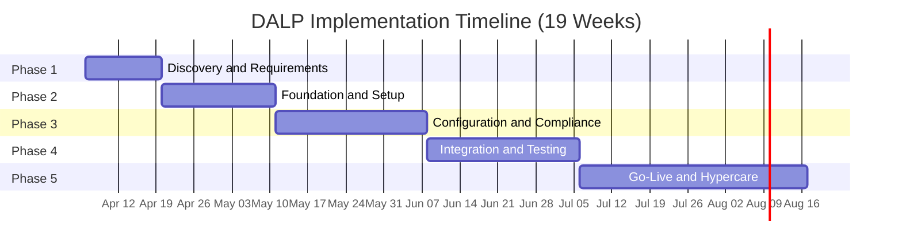

| Phase | Duration | Focus | Key Outcome |
|-------|----------|-------|-------------|
| 1. Discovery and Requirements | 2 weeks | Requirements capture, architecture design, regulatory mapping | Validated requirements, target architecture, implementation roadmap |
| 2. Foundation and Setup | 3 weeks | Environment provisioning, network setup, identity framework | Functional platform environments ready for configuration |
| 3. Configuration and Compliance | 4 weeks | Asset types, compliance modules, feeds, operational workflows | Configured platform matching business and regulatory requirements |
| 4. Integration and Testing | 4 weeks | System integration, testing (functional, security, performance, UAT) | Validated, integrated system with formal go-live readiness |
| 5. Go-Live and Hypercare | 6 weeks | Production deployment (2 weeks) + intensive post-go-live support (4 weeks) | Production system with knowledge transfer and support transition |

## 8.2 Phase 1: Discovery and Requirements

**Objective:** Establish validated understanding of business objectives, technical landscape, regulatory environment, and operational requirements.

**Key Activities:**

- Stakeholder interviews (business sponsors, technology leadership, compliance officers, operations teams)
- Current-state assessment (existing systems, integration touchpoints, data flows)
- Regulatory and compliance mapping (CBB rules, AML/CFT requirements, investor eligibility)
- Asset class and lifecycle scoping (target instruments, lifecycle events, business rules)
- Architecture design (deployment topology, network design, integration architecture)

**Deliverables:**

- Business Requirements Document with acceptance criteria
- Regulatory and Compliance Matrix mapped to DALP modules
- Target Architecture Document
- Implementation Roadmap with milestones and risk register
- RACI Matrix for responsibility assignments
- Communication Plan

## 8.3 Phase 2: Foundation and Setup

**Objective:** Provision DALP environment, configure blockchain network, establish identity and access framework.

**Key Activities:**

- Environment provisioning (development, staging, production Kubernetes clusters)
- Network configuration (Hyperledger Besu validator deployment, consensus setup)
- Identity and access framework (OnchainID setup, RBAC configuration)
- Key management setup (HSM integration or custody provider configuration)
- Observability setup (monitoring dashboards, alert routing)

**Deliverables:**

- Provisioned environments (operational)
- Network Configuration Document
- Identity and Access Design
- Key Management Configuration
- Observability Setup Report
- Environment Validation Report

## 8.4 Phase 3: Configuration and Compliance

**Objective:** Configure asset types, compliance modules, data feeds, and operational workflows.

**Key Activities:**

- Token and asset configuration (asset templates, parameters, business rules, lifecycle events)
- Compliance module setup (identity verification, country restrictions, investor limits, supply caps)
- Claims and trusted issuer configuration (claim topics, trusted issuer registry, KYC integration)
- Feed configuration (price feeds, NAV feeds, exchange rate synchronization)
- Workflow design (issuance approval chains, transfer processing, exception handling)

**Deliverables:**

- Asset Configuration Documentation
- Compliance Module Configuration with test evidence
- Claims and Feed Configuration
- Integration Design Document
- Operational Workflow Documentation

## 8.5 Phase 4: Integration and Testing

**Objective:** Connect DALP to existing systems and validate against requirements.

**Key Activities:**

- API integration (core banking, custody, payment rails)
- Custody connector setup
- Functional testing (asset lifecycle, compliance enforcement, custody workflows, settlement)
- Security testing (penetration testing, authorization escalation, smart contract review)
- Performance testing (throughput, latency, capacity)
- User acceptance testing (business operations, compliance, technical operations)

**Deliverables:**

- Integrated System Landscape
- Functional, Security, Performance Test Reports
- UAT Sign-Off
- Go-Live Readiness Assessment

## 8.6 Phase 5: Go-Live and Hypercare

**Objective:** Execute production deployment and provide intensive post-go-live support.

**Go-Live (Weeks 14-15):**

- Production deployment following runbook
- Data migration with integrity validation
- Go-live validation (smoke tests)
- Dedicated support during deployment window

**Hypercare (Weeks 16-19):**

- Continuous monitoring and issue resolution
- Performance optimization based on production metrics
- Knowledge transfer (administrator, developer, end-user tracks)
- Operational readiness validation
- Support transition to contracted tier

**Deliverables:**

- Production Deployment Confirmation
- Hypercare Summary Report
- Complete Documentation Package
- Knowledge Transfer Completion Certificate
- Support Transition Plan

---

# 9. Delivery Approach and Timeline

## 9.1 Implementation Timeline

The following timeline assumes kickoff in early April 2026 with go-live targeted for late August 2026:

| Milestone | Target Date | Phase |
|-----------|-------------|-------|
| Kick-off Workshop | Week 1 | Phase 1 |
| Requirements Sign-off | Week 2 | Phase 1 |
| Environments Provisioned | Week 5 | Phase 2 |
| Configuration Complete | Week 9 | Phase 3 |
| Integration Complete | Week 13 | Phase 4 |
| UAT Sign-off | Week 13 | Phase 4 |
| Production Go-Live | Week 15 | Phase 5 |
| Hypercare Complete | Week 19 | Phase 5 |

## 9.2 Resource Requirements

**SettleMint Team:**

| Role | Involvement |
|------|-------------|
| Delivery Lead | Full-time throughout implementation |
| Solution Architect | Full-time Phase 1-3, on-call Phase 4-5 |
| Platform Engineers | 2-3 engineers, full-time Phase 2-5 |
| QA Lead | Full-time Phase 4, partial Phase 3 and 5 |

**Client Team:**

| Role | Involvement |
|------|-------------|
| Project Manager | Full-time throughout |
| Technical Lead | Full-time Phase 1-4, on-call Phase 5 |
| DevOps/Infrastructure | Full-time Phase 2-5 |
| Compliance/Risk | Full-time Phase 1 and 3, partial Phase 4 |

## 9.3 Client Responsibilities

Client responsibilities include:

- Timely stakeholder availability for decision-making and gate approvals
- Infrastructure provisioning (cloud accounts, Kubernetes clusters, networking)
- Integration endpoint access (API credentials, test environments)
- Regulatory requirements documentation and compliance rule definition
- UAT participation across business, operations, and compliance tracks
- Training attendance for knowledge transfer

---

# 10. Relevant Experience and References

## 10.1 Reference Projects Summary

SettleMint has delivered 14 production engagements spanning banking, sovereign institutions, capital markets, and real estate:

| # | Client | Region | Asset Class | Scope |
|---|--------|--------|-------------|-------|
| 1 | OCBC Bank | Singapore | Securities, bonds, real estate | Security token engine for HNWIs |
| 2 | KBC Securities | Belgium | Equity, SME loans | Crowdfunding issuance and lifecycle |
| 3 | Standard Chartered Bank | Asia/Africa/Middle East | Securities, currencies | Digital Virtual Exchange |
| 4 | State Bank of India | India | CBDC (e-Rupee) | CBDC infrastructure |
| 5 | Sony Bank (Sony Group) | Japan | Stablecoins, identity | Stablecoin issuance with KYC |
| 6 | Commerzbank | Germany | ETPs | Hybrid on/off-chain issuance |
| 7 | Saudi Arabia RER | Saudi Arabia | Real Estate | National-scale property blockchain |
| 8 | Maybank | Malaysia | FX tokens | Cross-border XvP settlement |
| 9 | ADI-Finstreet | Abu Dhabi | Equity | Tokenized equity on ADI mainnet |
| 10 | Islamic Development Bank | 57 countries | Subsidy, Collateral | Sharia-compliant distribution |

## 10.2 Detailed Reference: Saudi Arabia RER

**Scope:** National-scale blockchain infrastructure for property registration, fractionalization, and digital marketplace under REGA and Vision 2030.

**Key Outcomes:**

- First country in the world to deploy national-scale property blockchain
- Live production transactions since January 2026
- Four PropTechs (Sahl, Madek, Ghanem, Jozo) operational
- Smart contracts automate ownership transfers and tax compliance

**Relevance to CBB:** Demonstrates country-scale deployment capability, government integration, multi-party ecosystem support, and integration with national identity (Yakeen) and payment (Sadad) infrastructure.

## 10.3 Detailed Reference: Standard Chartered Bank

**Scope:** Blockchain-based Digital Virtual Exchange for securities tokenization with fractional ownership and instant settlement.

**Key Outcomes:**

- Settlement times reduced from days to near-instant finality
- Custody intermediary costs eliminated
- Immutable ownership records providing transparency

**Relevance to CBB:** Demonstrates institutional-grade compliance, multi-asset support, integration with existing banking infrastructure, and multi-region deployment across the Middle East.

## 10.4 Detailed Reference: Commerzbank

**Scope:** Hybrid on-chain/off-chain ETP issuance with Boerse Stuttgart listing and sub-10-second settlement.

**Key Outcomes:**

- Settlement reduced to under 10 seconds
- Potential annual savings of EUR 7 million
- Demonstrates blockchain coexistence with established exchange infrastructure

**Relevance to CBB:** Directly addresses the hybrid on-chain/off-chain concern that regulated institutions have. Shows integration with regulated venues and capital markets expertise.

---

# 11. Current Coverage, Gaps, and Mitigations

## 11.1 Requirement Coverage Matrix

This section addresses how DALP meets each CBB requirement and identifies any areas requiring clarification or client-side decisions.

| Requirement | DALP Coverage | Status |
|-------------|----------------|--------|
| REQ-01: Segregated environments | Full support (dev, test, UAT, DR, production) | Met |
| REQ-02: API-first interfaces | Full OpenAPI 3.1, TypeScript SDK, webhooks | Met |
| REQ-03: RBAC, segregation of duties, maker-checker | 26 roles, dual-layer model, wallet verification | Met |
| REQ-04: Configurable lifecycle, controls, limits | 12 compliance module types, expressions | Met |
| REQ-05: Third-party dependencies | Documented in dependency register | Met |
| REQ-06: Resilience, recovery, backup, monitoring | HA deployment, DR options, observability | Met |
| REQ-07: Delivery method, phased plan | 19-week methodology with clear phases | Met |
| REQ-08: Evidence extraction | Audit trails, reporting dashboards, export | Met |

## 11.2 Areas Requiring Client Input

The following areas require CBB input to finalize scope and configuration:

**Regulatory Framework Specifics:** CBB's digital asset rules require mapping to DALP compliance modules. The compliance library includes templates for major frameworks, but Bahrain-specific rules may require custom configuration. SettleMint recommends a compliance mapping workshop during Phase 1 to finalize the configuration.

**Identity Provider Integration:** The proposal assumes integration with CBB's existing identity management infrastructure (Active Directory or equivalent). Specific integration requirements (protocol, authentication method, user provisioning) should be confirmed during discovery.

**Custody Model:** CBB has not specified a custody provider preference. DALP supports integration with Fireblocks, DFNS, or local signer options. The custody model decision affects integration scope and timeline.

**Integration Endpoints:** The proposal assumes connection to core banking, sanctions screening, and reporting systems. Specific API specifications and test environment access are required during Phase 2.

## 11.3 Risk Mitigation

| Risk | Likelihood | Impact | Mitigation |
|------|------------|--------|------------|
| Decision latency on compliance rules | Medium | Schedule slip | RACI matrix with named decision-makers; decision log with escalation |
| Integration complexity | Medium | Phase 4 extension | Integration design in Phase 3; mock interfaces for testing |
| Regulatory change | Low | Configuration rework | Modular compliance architecture; change-control process |
| Infrastructure readiness | Low | Phase 2 block | Prerequisites checklist in Phase 1; managed cloud fallback |
| Scope expansion | Medium | Timeline increase | Change-control with impact assessment; prioritization framework |

---

# 12. Appendix: Response Matrix

## 12.1 Technical Requirements Response

| Req ID | Requirement | Response | Evidence |
|--------|-------------|----------|----------|
| REQ-01 | Architecture must support segregated dev, test, UAT, DR, and production environments | DALP supports multiple isolated environments with separate Kubernetes namespaces, databases, and blockchain networks. Data residency controls ensure segregation. | Architecture documentation, deployment manifests |
| REQ-02 | Provide API-first interfaces, eventing, and version governance | Unified API with OpenAPI 3.1 specs, TypeScript SDK, webhooks for event-driven integration. API versioning follows standard practices with deprecation notices. | API documentation, SDK packages |
| REQ-03 | Support RBAC, segregation of duties, maker-checker controls, and complete audit logs | 26 roles across four layers. Dual-layer permission model (off-chain + on-chain). Wallet verification for all blockchain writes. Complete audit trail for every action. | Security documentation, role matrix |
| REQ-04 | Support configurable lifecycle states, policy controls, limits, exceptions, and reconciliations | 12 compliance module types with runtime configuration. Expression builder for complex rules. Native reconciliation tooling. | Compliance module documentation |
| REQ-05 | Disclose all third-party dependencies and operational responsibilities | All dependencies documented. Third-party services include cloud providers, custody providers, identity providers. | Dependency register (Appendix D) |
| REQ-06 | Evidence resilience, recovery, backup, monitoring, and incident-management capability | HA deployment options with RTO 2-15 minutes. Velero backup. Comprehensive observability stack with alerting. | DR documentation, observability setup |
| REQ-07 | Provide delivery method, client effort assumptions, and phased implementation plan | 19-week phased methodology with clear deliverables, gate reviews, and client responsibilities. | Implementation methodology section |
| REQ-08 | Support evidence extraction for audit, supervisory review, and board reporting | Complete audit trails, compliance dashboards, regulatory reports, export capabilities. | Reporting documentation |

## 12.2 Regulatory Requirements Response

| ID | Area | Response | Notes |
|----|------|----------|-------|
| RC-01 | Regulatory mapping | DALP compliance library includes templates for major frameworks. Bahrain-specific mapping requires Phase 1 workshop. | Custom configuration expected |
| RC-02 | AML/CFT and sanctions | Integration with external AML/sanctions providers via API. On-chain compliance enforces KYC/AML claims from trusted issuers. | External provider integration required |
| RC-03 | Data governance | Data residency controls for Bahrain deployment. Retention policies configurable. Encryption at rest and in transit. | Meets CBB data protection requirements |
| RC-04 | Operational resilience | Multiple DR options (cloud-native, hot-warm, hot-cold). Tested backup and restore procedures. | RTO/RPO targets configurable |
| RC-05 | Outsourcing and subcontractors | Full disclosure of cloud provider dependencies. SettleMint operates as prime contractor. | Dependency register |
| RC-06 | Assurance and audit | ISO 27001 and SOC 2 Type II certified. Comprehensive logging. Audit support through dedicated interfaces. | Certification attestations available |

---

# Document Control

| Version | Date | Author | Changes |
|---------|------|--------|---------|
| 1.0 | 2026-03-17 | SettleMint NV | Initial submission |

---

**End of Technical Proposal**

*This document is confidential and intended solely for the use of Central Bank of Bahrain.*